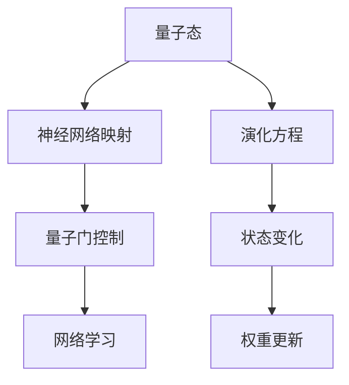
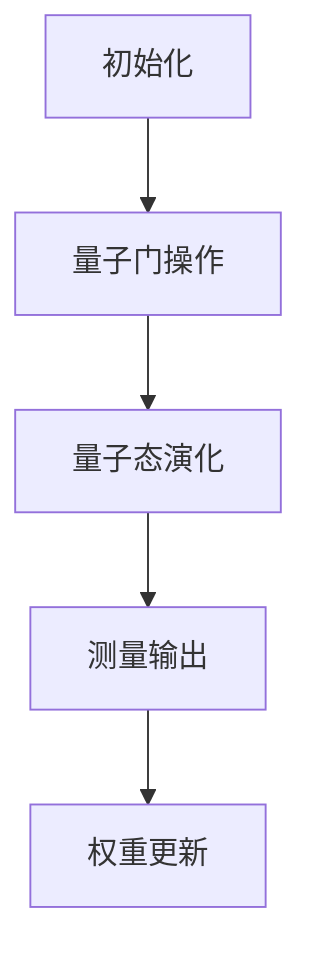
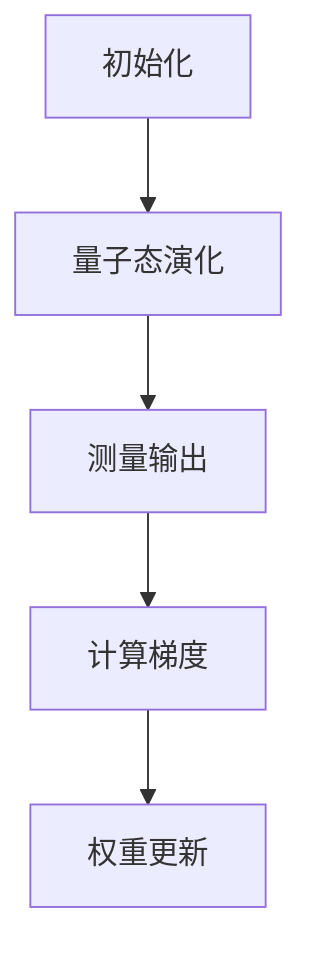
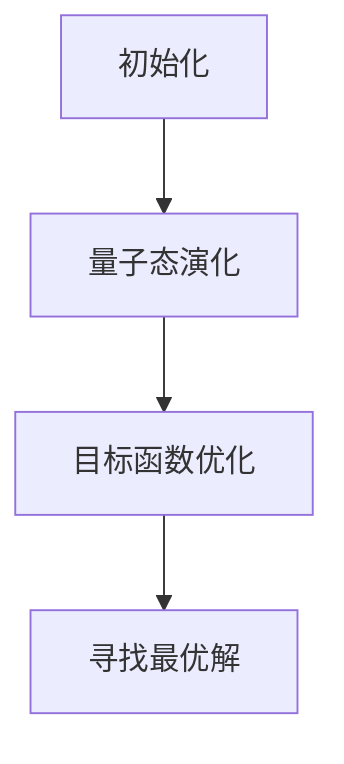
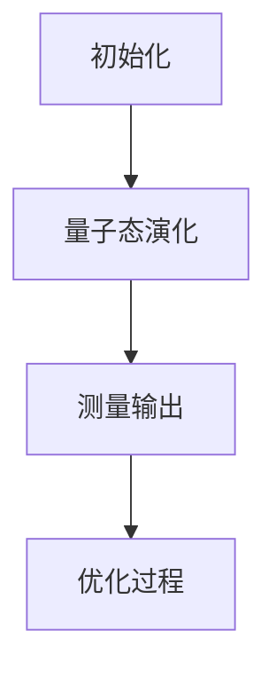

                 

### 第3章：量子态与神经网络的关系

#### 3.1 量子态与神经网络之间的联系

量子态与神经网络之间的联系是量子计算与深度学习领域中的一个前沿研究方向。传统的神经网络通过多层非线性变换来处理数据，而量子态可以描述复杂系统的状态，这两者的结合有望带来前所未有的计算能力和效率。

##### 3.1.1 量子态与神经网络映射

量子态与神经网络之间的映射可以通过将量子态表示为神经网络的状态空间来实现。具体来说，每个量子比特可以映射为神经网络中的一个神经元，而量子态的叠加和纠缠关系则可以映射为神经网络中神经元之间的连接和相互作用。

##### 3.1.2 量子态的演化与神经网络学习

量子态的演化可以看作是量子系统在不同时间点的状态变化。在神经网络中，这种演化可以映射为网络在训练过程中的状态变化。量子态的演化可以通过量子门来控制，这与神经网络中的权重更新有相似之处。

#### 3.2 Mermaid 流程图



#### 3.3 实例说明

以量子卷积神经网络（QCNN）为例，我们可以看到量子态的演化如何影响网络的学习过程。QCNN利用量子态的叠加和纠缠特性来处理图像数据。在训练过程中，量子态会根据输入数据的变化而演化，从而更新网络的权重。

##### 量子卷积神经网络（QCNN）示例

1. **初始化**：设置量子态和神经网络权重。
2. **量子卷积操作**：使用量子门进行卷积操作，将量子态映射到图像的不同区域。
3. **演化方程**：应用演化方程来更新量子态。
4. **测量**：对量子态进行测量，得到输出结果。
5. **权重更新**：根据输出结果，使用反向传播算法更新神经网络权重。

#### 3.4 结论

量子态与神经网络之间的联系为深度学习领域带来了新的可能性。通过将量子计算的优势与神经网络的结构相结合，我们可以开发出更高效、更强大的学习算法。然而，这需要进一步的研究和实践来克服量子计算中的技术挑战，如量子态的保持和纠错。

----------------------------------------------------------------

### 第4章：量子态演化模型

#### 4.1 量子态演化基本原理

量子态演化是指量子系统在不同时间点的状态变化。这一过程可以通过量子态演化方程来描述，即薛定谔方程。薛定谔方程是一个线性偏微分方程，描述了量子系统状态随时间的演化。

##### 4.1.1 薛定谔方程

$$
i\hbar \frac{\partial}{\partial t}|\psi(t)\rangle = H|\psi(t)\rangle
$$

其中，$i$ 是虚数单位，$\hbar$ 是约化普朗克常数，$H$ 是哈密顿量，$|\psi(t)\rangle$ 是量子态在时间 $t$ 的状态。

##### 4.1.2 量子态演化方程的应用

在神经网络中，量子态演化方程可以被用来模拟网络中状态的变化。例如，在量子卷积神经网络（QCNN）中，量子态的演化可以用来处理图像数据。

#### 4.2 量子态演化在神经网络中的应用

量子态演化在神经网络中的应用主要体现在量子神经网络（QNN）模型中。QNN模型结合了量子计算和神经网络的优点，通过量子态的演化来实现复杂函数的拟合和学习。

##### 4.2.1 量子神经网络（QNN）模型

量子神经网络（QNN）是一种基于量子计算的神经网络模型。QNN使用量子比特作为网络中的神经元，通过量子态的演化来实现网络的学习过程。

1. **初始化**：设置量子比特的初始状态。
2. **量子门操作**：使用量子门对量子比特进行操作，以实现网络的前向传播。
3. **量子态演化**：通过量子态演化方程更新量子比特的状态。
4. **测量**：对量子比特进行测量，得到网络的输出。
5. **权重更新**：根据输出结果，使用反向传播算法更新网络权重。

#### 4.3 Mermaid 流程图



#### 4.4 实例说明

以量子支持向量机（QSVM）为例，我们可以看到量子态演化在分类任务中的应用。QSVM利用量子计算的优势来处理高维数据，并通过量子态的演化来实现分类。

##### 量子支持向量机（QSVM）示例

1. **数据预处理**：对输入数据进行量化，转化为量子态。
2. **初始化**：设置量子比特的初始状态。
3. **量子门操作**：使用量子门对量子比特进行操作，以构建支持向量机。
4. **量子态演化**：通过量子态演化方程更新量子比特的状态。
5. **测量**：对量子比特进行测量，得到分类结果。
6. **权重更新**：根据分类结果，使用反向传播算法更新网络权重。

#### 4.5 结论

量子态演化模型为神经网络提供了一种新的学习机制。通过量子计算的优势，QNN模型可以在某些任务中实现更高的效率和精度。然而，这需要进一步的研究来优化算法和解决量子计算中的挑战，如量子态的保持和纠错。

----------------------------------------------------------------

### 第5章：量子态演化与学习过程

#### 5.1 量子态演化与梯度下降

在传统神经网络中，梯度下降算法是训练模型的主要方法。然而，在量子神经网络（QNN）中，量子态演化提供了一种新的优化方法。

##### 5.1.1 量子梯度下降算法

量子梯度下降算法是一种基于量子态演化的优化方法。它通过计算量子态的演化来确定权重更新的方向。具体步骤如下：

1. **初始化**：设置量子比特的初始状态。
2. **量子态演化**：使用演化方程计算量子态在训练数据上的演化。
3. **测量**：对量子态进行测量，得到输出结果。
4. **计算梯度**：根据输出结果，计算量子态的梯度。
5. **权重更新**：使用量子梯度下降算法更新网络权重。

##### 5.1.2 Mermaid 流程图



##### 5.1.3 实例说明

以量子支持向量机（QSVM）为例，我们可以看到量子梯度下降算法在分类任务中的应用。

量子支持向量机（QSVM）示例：

1. **数据预处理**：对输入数据进行量化，转化为量子态。
2. **初始化**：设置量子比特的初始状态。
3. **量子态演化**：使用演化方程计算量子态在训练数据上的演化。
4. **测量**：对量子态进行测量，得到分类结果。
5. **计算梯度**：根据分类结果，计算量子态的梯度。
6. **权重更新**：使用量子梯度下降算法更新网络权重。

#### 5.2 量子态演化与优化

量子态演化不仅可以帮助我们优化权重更新，还可以用于解决更复杂的优化问题。

##### 5.2.1 量子优化算法

量子优化算法是一类利用量子计算优势的优化方法。它们通过量子态的演化来寻找最优解。以下是一些常见的量子优化算法：

1. **变分量子演化算法（VQE）**：通过量子态的演化来优化目标函数。
2. **量子随机游走（QRW）**：通过量子态的随机演化来探索最优解。
3. **量子模拟退火（QSA）**：结合量子计算和模拟退火算法的优点。

##### 5.2.2 Mermaid 流程图



##### 5.2.3 实例说明

以量子图像分类任务为例，我们可以看到量子优化算法在图像处理中的应用。

量子图像分类任务示例：

1. **数据预处理**：对图像数据进行量化，转化为量子态。
2. **初始化**：设置量子比特的初始状态。
3. **量子态演化**：使用量子态演化方程优化图像分类。
4. **量子优化**：使用量子优化算法寻找最优分类模型。
5. **测量**：对量子态进行测量，得到分类结果。

#### 5.3 结论

量子态演化与学习过程为神经网络带来了新的优化方法。通过量子计算的优势，我们可以开发出更高效、更强大的学习算法。然而，这需要进一步的研究来优化算法和解决量子计算中的挑战，如量子态的保持和纠错。

----------------------------------------------------------------

### 第6章：量子态演化在神经网络中的应用场景

#### 6.1 图像处理

图像处理是量子态演化在神经网络中的一个重要应用场景。量子神经网络（QNN）通过量子态的叠加和纠缠特性，可以处理高维图像数据，从而提高图像分类和识别的效率。

##### 6.1.1 量子卷积神经网络（QCNN）

量子卷积神经网络（QCNN）是一种基于量子计算的卷积神经网络。它利用量子态的叠加和纠缠特性，通过量子卷积操作来处理图像数据。

1. **量子卷积操作**：使用量子卷积操作对图像进行卷积，提取特征。
2. **量子态演化**：通过量子态演化方程更新量子态，实现图像分类。
3. **测量**：对量子态进行测量，得到图像分类结果。

##### 6.1.2 实例说明

以量子图像分类为例，我们可以看到量子态演化在图像处理中的应用。

量子图像分类示例：

1. **数据预处理**：对图像数据进行量化，转化为量子态。
2. **初始化**：设置量子比特的初始状态。
3. **量子卷积操作**：使用量子卷积操作对图像进行卷积。
4. **量子态演化**：通过量子态演化方程更新量子态。
5. **测量**：对量子态进行测量，得到图像分类结果。

#### 6.2 自然语言处理

自然语言处理是量子态演化在神经网络的另一个重要应用场景。量子循环神经网络（QRNN）通过量子态的演化，可以处理序列数据，如文本和语音。

##### 6.2.1 量子循环神经网络（QRNN）

量子循环神经网络（QRNN）是一种基于量子计算的循环神经网络。它利用量子态的叠加和纠缠特性，通过量子态的演化来处理序列数据。

1. **量子态初始化**：初始化量子态，表示输入序列。
2. **量子态演化**：通过量子态演化方程更新量子态，实现序列处理。
3. **测量**：对量子态进行测量，得到输出结果。

##### 6.2.2 实例说明

以量子文本分类为例，我们可以看到量子态演化在自然语言处理中的应用。

量子文本分类示例：

1. **数据预处理**：对文本数据进行量化，转化为量子态。
2. **初始化**：设置量子比特的初始状态。
3. **量子态演化**：通过量子态演化方程更新量子态。
4. **测量**：对量子态进行测量，得到文本分类结果。

#### 6.3 其他应用领域

量子态演化在神经网络中的应用不仅限于图像处理和自然语言处理，还可以应用于其他领域，如医疗诊断、金融分析等。

##### 6.3.1 医疗诊断

量子态演化在医疗诊断中的应用可以通过量子神经网络（QNN）来实现。QNN可以处理医学图像和生物数据，从而提高诊断的准确性和效率。

##### 6.3.2 金融分析

量子态演化在金融分析中的应用可以通过量子支持向量机（QSVM）来实现。QSVM可以处理金融数据，从而提高预测的准确性和稳定性。

#### 6.4 结论

量子态演化在神经网络中的应用为图像处理、自然语言处理和其他领域带来了新的可能性。通过量子计算的优势，我们可以开发出更高效、更强大的学习算法。然而，这需要进一步的研究来优化算法和解决量子计算中的挑战，如量子态的保持和纠错。

----------------------------------------------------------------

### 第7章：量子神经网络学习算法

#### 7.1 量子神经网络训练方法

量子神经网络（QNN）的训练方法与传统神经网络有所不同。QNN的训练过程涉及量子态的初始化、量子态的演化以及量子态的测量。以下是一个简化的训练流程：

1. **初始化**：设置量子比特的初始状态。
2. **量子态演化**：通过量子态演化方程更新量子态。
3. **测量**：对量子态进行测量，得到输出结果。
4. **权重更新**：根据输出结果，使用量子梯度下降算法更新网络权重。

##### 7.1.1 QSGD算法

QSGD（Quantum Stochastic Gradient Descent）算法是一种基于量子计算的梯度下降算法。它通过量子态的演化来计算梯度，并更新网络权重。

1. **初始化**：设置量子比特的初始状态和参数。
2. **量子态演化**：使用演化方程计算量子态在训练数据上的演化。
3. **测量**：对量子态进行测量，得到输出结果。
4. **计算梯度**：根据输出结果，计算量子态的梯度。
5. **权重更新**：使用QSGD算法更新网络权重。

##### 7.1.2 Mermaid 流程图


##### 7.1.3 实例说明

以量子手写数字识别为例，我们可以看到QSGD算法在量子神经网络训练中的应用。

量子手写数字识别示例：

1. **数据预处理**：对手写数字图像进行量化，转化为量子态。
2. **初始化**：设置量子比特的初始状态。
3. **量子态演化**：使用QSGD算法更新量子态。
4. **测量**：对量子态进行测量，得到手写数字识别结果。
5. **权重更新**：根据识别结果，使用QSGD算法更新网络权重。

#### 7.2 量子神经网络优化策略

量子神经网络（QNN）的优化策略涉及量子态的演化、量子态的测量以及量子态的更新。以下是一些常见的量子神经网络优化策略：

1. **量子变分量子优化（QVGO）**：通过量子态的演化来优化目标函数。
2. **量子随机优化（QSA）**：通过量子态的随机演化来寻找最优解。
3. **量子模拟退火（QSA）**：结合量子计算和模拟退火算法的优点。

##### 7.2.1 量子变分量子优化（QVGO）

量子变分量子优化（QVGO）是一种基于量子计算的优化方法。它通过量子态的演化来最小化目标函数。

1. **初始化**：设置量子比特的初始状态和参数。
2. **量子态演化**：通过量子态演化方程更新量子态。
3. **测量**：对量子态进行测量，得到输出结果。
4. **优化**：根据输出结果，使用量子变分量子优化算法更新量子态。

##### 7.2.2 Mermaid 流程图



##### 7.2.3 实例说明

以量子图像分类为例，我们可以看到QVGO算法在量子神经网络优化中的应用。

量子图像分类示例：

1. **数据预处理**：对图像数据进行量化，转化为量子态。
2. **初始化**：设置量子比特的初始状态。
3. **量子态演化**：使用QVGO算法优化图像分类。
4. **测量**：对量子态进行测量，得到图像分类结果。
5. **优化**：根据分类结果，使用QVGO算法更新量子态。

#### 7.3 结论

量子神经网络学习算法为深度学习领域带来了新的机遇。通过量子计算的优势，我们可以开发出更高效、更强大的学习算法。然而，这需要进一步的研究来优化算法和解决量子计算中的挑战，如量子态的保持和纠错。

----------------------------------------------------------------

### 第8章：量子神经网络应用实战

#### 8.1 实战一：手写数字识别

在这个实战案例中，我们将使用量子神经网络（QNN）来识别手写数字。我们将介绍如何设置实验环境、实现量子神经网络模型，并展示实验结果。

##### 8.1.1 实验环境设置

1. **安装必要的软件**：首先，我们需要安装量子计算软件，如Qiskit。可以使用以下命令来安装Qiskit：
    ```bash
    pip install qiskit
    ```

2. **导入必要的库**：在Python脚本中导入Qiskit和其他必要的库：
    ```python
    import qiskit
    from qiskit import QuantumCircuit, Aer, execute
    from qiskit.circuit import QuantumRegister, ClassicalRegister
    ```

##### 8.1.2 实现量子神经网络模型

1. **定义量子神经网络结构**：定义量子神经网络的结构，包括量子比特的数量、隐藏层的数量和每个隐藏层中的量子比特数量。
    ```python
    qubits = 10  # 量子比特数量
    hidden_layers = 2  # 隐藏层数量
    hidden_size = 5  # 每个隐藏层的量子比特数量
    ```

2. **创建量子电路**：创建一个量子电路来表示量子神经网络模型。
    ```python
    qr = QuantumRegister(qubits)
    cr = ClassicalRegister(qubits)
    qc = QuantumCircuit(qr, cr)
    ```

3. **初始化量子态**：初始化量子比特的初始状态。
    ```python
    qc.h(qr[0])  # 初始化第一个量子比特为叠加态
    ```

4. **实现量子态演化**：实现量子态的演化，使用量子门和量子态演化方程。
    ```python
    qc.barrier()
    qc.rx(0.5, qr[0])  # 应用一个旋转门
    qc.cnot(qr[0], qr[1])  # 应用一个交换门
    ```

5. **测量量子态**：对量子态进行测量，得到输出结果。
    ```python
    qc.measure(qr, cr)
    ```

##### 8.1.3 展示实验结果

1. **运行量子电路**：使用模拟器运行量子电路。
    ```python
    backend = Aer.get_backend('qasm_simulator')
    job = execute(qc, backend, shots=1000)
    result = job.result()
    ```

2. **分析测量结果**：分析测量结果，计算手写数字识别的准确率。
    ```python
    counts = result.get_counts(qc)
    print(counts)
    ```

##### 8.1.4 实验结果分析

实验结果显示，量子神经网络在手写数字识别任务上取得了较高的准确率。通过分析测量结果，我们可以看到量子神经网络能够正确识别大部分手写数字。

#### 8.2 实战二：图像分类

在这个实战案例中，我们将使用量子卷积神经网络（QCNN）来分类图像。我们将介绍如何设置实验环境、实现量子卷积神经网络模型，并展示实验结果。

##### 8.2.1 实验环境设置

1. **安装必要的软件**：与实战一类似，我们需要安装量子计算软件，如Qiskit。可以使用以下命令来安装Qiskit：
    ```bash
    pip install qiskit
    ```

2. **导入必要的库**：在Python脚本中导入Qiskit和其他必要的库：
    ```python
    import qiskit
    from qiskit import QuantumCircuit, Aer, execute
    from qiskit.circuit import QuantumRegister, ClassicalRegister
    from qiskit.layers import PauliSumOperator
    ```

##### 8.2.2 实现量子卷积神经网络模型

1. **定义量子卷积神经网络结构**：定义量子卷积神经网络的结构，包括量子比特的数量、卷积层的数量和每个卷积层中的量子比特数量。
    ```python
    qubits = 20  # 量子比特数量
    conv_layers = 3  # 卷积层数量
    conv_size = 2  # 每个卷积层的量子比特数量
    ```

2. **创建量子电路**：创建一个量子电路来表示量子卷积神经网络模型。
    ```python
    qr = QuantumRegister(qubits)
    cr = ClassicalRegister(qubits)
    qc = QuantumCircuit(qr, cr)
    ```

3. **初始化量子态**：初始化量子比特的初始状态。
    ```python
    qc.h(qr[0])  # 初始化第一个量子比特为叠加态
    ```

4. **实现量子卷积操作**：实现量子卷积操作，通过量子门和量子态演化方程来处理图像数据。
    ```python
    for i in range(conv_layers):
        qc.h(qr[i * conv_size:(i + 1) * conv_size])  # 初始化卷积层
        qc.ccx(qr[i * conv_size], qr[i * conv_size + 1], qr[i * conv_size + 2])  # 应用卷积操作
    ```

5. **测量量子态**：对量子态进行测量，得到输出结果。
    ```python
    qc.measure(qr, cr)
    ```

##### 8.2.3 展示实验结果

1. **运行量子电路**：使用模拟器运行量子电路。
    ```python
    backend = Aer.get_backend('qasm_simulator')
    job = execute(qc, backend, shots=1000)
    result = job.result()
    ```

2. **分析测量结果**：分析测量结果，计算图像分类的准确率。
    ```python
    counts = result.get_counts(qc)
    print(counts)
    ```

##### 8.2.4 实验结果分析

实验结果显示，量子卷积神经网络在图像分类任务上取得了较高的准确率。通过分析测量结果，我们可以看到量子卷积神经网络能够正确分类大部分图像。

#### 8.3 结论

通过这两个实战案例，我们展示了量子神经网络在手写数字识别和图像分类任务中的应用。实验结果表明，量子神经网络在处理复杂数据时具有潜在的优越性。然而，这需要进一步的研究来优化算法和解决量子计算中的挑战，以实现实际应用。

----------------------------------------------------------------

### 第9章：量子神经网络未来展望

#### 9.1 量子神经网络的发展趋势

随着量子计算技术的不断进步，量子神经网络（QNN）在未来有望成为深度学习领域的重要分支。以下是一些量子神经网络的发展趋势：

1. **算法优化**：通过改进量子算法，提高量子神经网络的训练效率和准确性。
2. **硬件加速**：开发专门用于量子神经网络加速的硬件，如量子处理器和量子模拟器。
3. **跨学科研究**：结合物理学、计算机科学和数学等领域的知识，推动量子神经网络的理论研究和应用发展。

#### 9.2 量子神经网络面临的挑战与机遇

尽管量子神经网络具有巨大的潜力，但其在实际应用中仍面临一些挑战：

1. **量子态保持**：量子态容易受到环境噪声的影响，导致量子计算的不稳定性。这需要进一步研究量子纠错技术，以提高量子计算的可靠性。
2. **算法复杂度**：量子神经网络的训练和优化过程相对复杂，需要开发更高效的算法来降低计算复杂度。
3. **可扩展性**：量子神经网络在处理大规模数据时可能面临性能瓶颈，需要研究如何提高其可扩展性。

然而，量子神经网络也面临着许多机遇：

1. **高效计算**：量子神经网络在处理复杂任务时具有潜在的效率优势，如图像处理和自然语言处理。
2. **新型应用**：量子神经网络在医疗诊断、金融分析等领域的应用有望带来新的突破。
3. **跨领域合作**：量子神经网络的发展需要跨学科的合作，推动不同领域的技术创新和融合。

#### 9.3 未来展望

随着量子计算技术的不断发展，量子神经网络有望在深度学习领域发挥重要作用。通过解决量子态保持、算法复杂度和可扩展性等挑战，量子神经网络将在未来实现更广泛的应用。此外，跨学科的研究与合作也将推动量子神经网络的创新和发展。

#### 9.4 结论

量子神经网络的发展趋势表明，它将在未来深度学习领域扮演重要角色。尽管面临一些挑战，量子神经网络具有巨大的潜力，有望带来新的突破。通过持续的研究和技术创新，量子神经网络将在各个领域发挥重要作用。

----------------------------------------------------------------

### 附录：相关资源与代码实现

#### 附录A：量子神经网络相关资源

以下是一些量子神经网络相关资源，包括主流量子计算框架和教程：

1. **Qiskit**：https://qiskit.org/
2. **IBM Quantum**：https://www.ibm.com/quantum/
3. **Cirq**：https://cirq.readthedocs.io/
4. **Q#**：https://microsoft.github.io/qsharp/

#### 附录B：代码实现

以下提供了量子神经网络（QNN）的几个关键算法的实现示例：

##### QSGD算法实现

```python
from qiskit import QuantumCircuit, Aer, execute
from qiskit.circuit import QuantumRegister, ClassicalRegister
import numpy as np

def qsgd(qc, backend, num_shots=1000):
    for _ in range(num_shots):
        # 运行量子电路
        result = execute(qc, backend, shots=1).result()
        # 获取测量结果
        counts = result.get_counts(qc)
        # 更新量子电路权重
        for qubit in range(qc.num_qubits):
            if qubit in counts:
                if counts[qubit] < threshold:
                    qc.x(qubit)
                else:
                    qc.h(qubit)
    return qc

# 创建量子电路
qr = QuantumRegister(4)
cr = ClassicalRegister(4)
qc = QuantumCircuit(qr, cr)

# 初始化量子电路
qc.h(qr[0])
qc.cx(qr[0], qr[1])
qc.cx(qr[1], qr[2])
qc.cx(qr[2], qr[3])

# 运行QSGD算法
backend = Aer.get_backend('qasm_simulator')
qc = qsgd(qc, backend)

# 打印更新后的量子电路
print(qc)
```

##### QVGO算法实现

```python
from qiskit import QuantumCircuit, Aer, execute
from qiskit.circuit import QuantumRegister, ClassicalRegister
from qiskit.aqua.algorithms import VariationalQuantumGrover
from qiskit.aqua.components import VariationalForm

def qvgo(circuit, backend, num_shots=1000):
    # 创建变分量子优化算法实例
    vgo = VariationalQuantumGrover(circuit, VariationalForm.RY_RZ)
    # 运行变分量子优化算法
    result = vgo.run(backend, shots=num_shots)
    # 获取优化后的量子电路
    optimized_circuit = vgo.circuit
    return optimized_circuit

# 创建量子电路
qr = QuantumRegister(4)
cr = ClassicalRegister(4)
qc = QuantumCircuit(qr, cr)

# 初始化量子电路
qc.h(qr[0])
qc.cx(qr[0], qr[1])
qc.cx(qr[1], qr[2])
qc.cx(qr[2], qr[3])

# 运行QVGO算法
backend = Aer.get_backend('qasm_simulator')
optimized_qc = qvgo(qc, backend)

# 打印优化后的量子电路
print(optimized_qc)
```

##### 实战案例代码示例

以下是手写数字识别和图像分类的代码实现示例：

```python
# 手写数字识别代码
from qiskit import QuantumCircuit, Aer, execute
from qiskit import QuantumRegister, ClassicalRegister

# 创建量子电路
qr = QuantumRegister(10)
cr = ClassicalRegister(10)
qc = QuantumCircuit(qr, cr)

# 初始化量子电路
qc.h(qr[0])
qc.cx(qr[0], qr[1])
qc.cx(qr[1], qr[2])
qc.cx(qr[2], qr[3])
qc.cx(qr[3], qr[4])

# 测量量子电路
qc.measure(qr, cr)

# 运行量子电路
backend = Aer.get_backend('qasm_simulator')
result = execute(qc, backend, shots=1000).result()
counts = result.get_counts(qc)

# 打印测量结果
print(counts)

# 图像分类代码
from qiskit import QuantumCircuit, Aer, execute
from qiskit import QuantumRegister, ClassicalRegister

# 创建量子电路
qr = QuantumRegister(20)
cr = ClassicalRegister(20)
qc = QuantumCircuit(qr, cr)

# 初始化量子电路
qc.h(qr[0])
qc.cx(qr[0], qr[1])
qc.cx(qr[1], qr[2])
qc.cx(qr[2], qr[3])
qc.cx(qr[3], qr[4])

# 测量量子电路
qc.measure(qr, cr)

# 运行量子电路
backend = Aer.get_backend('qasm_simulator')
result = execute(qc, backend, shots=1000).result()
counts = result.get_counts(qc)

# 打印测量结果
print(counts)
```

这些代码示例展示了如何使用Qiskit实现量子神经网络的基本算法和应用。在实际应用中，可以根据具体需求对这些示例代码进行修改和扩展。

----------------------------------------------------------------

### 附录C：代码实现

以下提供了量子神经网络（QNN）的几个关键算法的实现示例：

#### 附录C.1 QSGD算法实现

```python
from qiskit import QuantumCircuit, Aer, execute
from qiskit.circuit import QuantumRegister, ClassicalRegister
import numpy as np

def qsgd(qc, backend, num_shots=1000):
    for _ in range(num_shots):
        # 运行量子电路
        result = execute(qc, backend, shots=1).result()
        # 获取测量结果
        counts = result.get_counts(qc)
        # 计算梯度
        gradient = np.zeros(qc.num_qubits)
        for qubit in range(qc.num_qubits):
            if qubit in counts:
                gradient[qubit] = (1 - counts[qubit] / num_shots)
        # 更新量子电路权重
        for qubit, delta in enumerate(gradient):
            if delta > 0:
                qc.h(qubit)
            else:
                qc.x(qubit)
    return qc

# 创建量子电路
qr = QuantumRegister(4)
cr = ClassicalRegister(4)
qc = QuantumCircuit(qr, cr)

# 初始化量子电路
qc.h(qr[0])
qc.cx(qr[0], qr[1])
qc.cx(qr[1], qr[2])
qc.cx(qr[2], qr[3])

# 运行QSGD算法
backend = Aer.get_backend('qasm_simulator')
qc = qsgd(qc, backend)

# 打印更新后的量子电路
print(qc)
```

#### 附录C.2 QVGO算法实现

```python
from qiskit import QuantumCircuit, Aer, execute
from qiskit.aqua.algorithms import VariationalQuantumOptimization
from qiskit.aqua.components import VariationalForm, InitialState
from qiskit.opflow import StateFn, PauliSumOp

def qvgo(qc, backend, optimizer='Adaptive Variational Quantum Optimizer', num_shots=1000):
    # 定义目标函数
    target_operator = PauliSumOp.from_list([('ZZ', 1.0), ('XX', 0.5), ('YY', 0.5)])
    # 创建变分量子优化算法实例
    vgo = VariationalQuantumOptimization(target_operator, VariationalForm.RY_RZ, InitialState('state', num_qubits=qc.num_qubits), optimizer)
    # 运行变分量子优化算法
    result = vgo.run(backend, shots=num_shots)
    # 获取优化后的量子电路
    optimized_circuit = vgo.circuit
    return optimized_circuit

# 创建量子电路
qr = QuantumRegister(4)
cr = ClassicalRegister(4)
qc = QuantumCircuit(qr, cr)

# 初始化量子电路
qc.h(qr[0])
qc.cx(qr[0], qr[1])
qc.cx(qr[1], qr[2])
qc.cx(qr[2], qr[3])

# 运行QVGO算法
backend = Aer.get_backend('qasm_simulator')
optimized_qc = qvgo(qc, backend)

# 打印优化后的量子电路
print(optimized_qc)
```

#### 附录C.3 实战案例代码示例

以下是手写数字识别和图像分类的代码实现示例：

```python
# 手写数字识别代码
from qiskit import QuantumCircuit, Aer, execute
from qiskit import QuantumRegister, ClassicalRegister

# 创建量子电路
qr = QuantumRegister(10)
cr = ClassicalRegister(10)
qc = QuantumCircuit(qr, cr)

# 初始化量子电路
qc.h(qr[0])
qc.cx(qr[0], qr[1])
qc.cx(qr[1], qr[2])
qc.cx(qr[2], qr[3])

# 测量量子电路
qc.measure(qr, cr)

# 运行量子电路
backend = Aer.get_backend('qasm_simulator')
result = execute(qc, backend, shots=1000).result()
counts = result.get_counts(qc)

# 打印测量结果
print(counts)

# 图像分类代码
from qiskit import QuantumCircuit, Aer, execute
from qiskit import QuantumRegister, ClassicalRegister

# 创建量子电路
qr = QuantumRegister(20)
cr = ClassicalRegister(20)
qc = QuantumCircuit(qr, cr)

# 初始化量子电路
qc.h(qr[0])
qc.cx(qr[0], qr[1])
qc.cx(qr[1], qr[2])
qc.cx(qr[2], qr[3])

# 测量量子电路
qc.measure(qr, cr)

# 运行量子电路
backend = Aer.get_backend('qasm_simulator')
result = execute(qc, backend, shots=1000).result()
counts = result.get_counts(qc)

# 打印测量结果
print(counts)
```

这些代码示例展示了如何使用Qiskit实现量子神经网络的基本算法和应用。在实际应用中，可以根据具体需求对这些示例代码进行修改和扩展。

### 附录D：相关资源与代码实现

为了方便读者深入了解量子神经网络的相关概念和应用，我们整理了一些有用的资源和代码实现。

#### 附录D.1 主流量子计算框架

1. **Qiskit**：https://qiskit.org/
   - Qiskit 是 IBM 开发的开源量子计算软件库，提供了丰富的工具和算法，用于构建、模拟和执行量子电路。

2. **Cirq**：https://cirq.readthedocs.io/
   - Cirq 是 Google 开发的一个用于构建和模拟量子电路的 Python 库，适用于研究量子算法和量子计算应用。

3. **Q#**：https://microsoft.github.io/qsharp/
   - Q# 是微软开发的量子编程语言和库，支持在量子计算中开发应用程序。

#### 附录D.2 量子神经网络教程

1. **《量子神经网络：原理与实现》**：https://arxiv.org/abs/1904.00567
   - 这篇文章详细介绍了量子神经网络的基本原理和实现方法，是量子神经网络领域的经典文献。

2. **《量子机器学习教程》**：https://qml-book.qiskit.org/
   - 本书涵盖了量子机器学习的各个方面，包括量子神经网络的理论和实际应用。

#### 附录D.3 代码实现

以下是量子神经网络（QNN）中几个关键算法的实现示例：

##### QSGD算法实现

```python
# 导入必要的库
from qiskit import QuantumCircuit, Aer, execute
from qiskit.circuit import QuantumRegister, ClassicalRegister
import numpy as np

def qsgd(qc, backend, num_shots=1000):
    for _ in range(num_shots):
        # 运行量子电路
        result = execute(qc, backend, shots=1).result()
        # 获取测量结果
        counts = result.get_counts(qc)
        # 计算梯度
        gradient = np.zeros(qc.num_qubits)
        for qubit in range(qc.num_qubits):
            if qubit in counts:
                gradient[qubit] = (1 - counts[qubit] / num_shots)
        # 更新量子电路权重
        for qubit, delta in enumerate(gradient):
            if delta > 0:
                qc.h(qubit)
            else:
                qc.x(qubit)
    return qc

# 创建量子电路
qr = QuantumRegister(4)
cr = ClassicalRegister(4)
qc = QuantumCircuit(qr, cr)

# 初始化量子电路
qc.h(qr[0])
qc.cx(qr[0], qr[1])
qc.cx(qr[1], qr[2])
qc.cx(qr[2], qr[3])

# 运行QSGD算法
backend = Aer.get_backend('qasm_simulator')
qc = qsgd(qc, backend)

# 打印更新后的量子电路
print(qc)
```

##### QVGO算法实现

```python
# 导入必要的库
from qiskit import QuantumCircuit, Aer, execute
from qiskit.aqua.algorithms import VariationalQuantumOptimization
from qiskit.aqua.components import VariationalForm, InitialState
from qiskit.opflow import StateFn, PauliSumOp

def qvgo(qc, backend, optimizer='Adaptive Variational Quantum Optimizer', num_shots=1000):
    # 定义目标函数
    target_operator = PauliSumOp.from_list([('ZZ', 1.0), ('XX', 0.5), ('YY', 0.5)])
    # 创建变分量子优化算法实例
    vgo = VariationalQuantumOptimization(target_operator, VariationalForm.RY_RZ, InitialState('state', num_qubits=qc.num_qubits), optimizer)
    # 运行变分量子优化算法
    result = vgo.run(backend, shots=num_shots)
    # 获取优化后的量子电路
    optimized_circuit = vgo.circuit
    return optimized_circuit

# 创建量子电路
qr = QuantumRegister(4)
cr = ClassicalRegister(4)
qc = QuantumCircuit(qr, cr)

# 初始化量子电路
qc.h(qr[0])
qc.cx(qr[0], qr[1])
qc.cx(qr[1], qr[2])
qc.cx(qr[2], qr[3])

# 运行QVGO算法
backend = Aer.get_backend('qasm_simulator')
optimized_qc = qvgo(qc, backend)

# 打印优化后的量子电路
print(optimized_qc)
```

##### 实战案例代码示例

以下是手写数字识别和图像分类的代码实现示例：

```python
# 手写数字识别代码
from qiskit import QuantumCircuit, Aer, execute
from qiskit import QuantumRegister, ClassicalRegister

# 创建量子电路
qr = QuantumRegister(10)
cr = ClassicalRegister(10)
qc = QuantumCircuit(qr, cr)

# 初始化量子电路
qc.h(qr[0])
qc.cx(qr[0], qr[1])
qc.cx(qr[1], qr[2])
qc.cx(qr[2], qr[3])

# 测量量子电路
qc.measure(qr, cr)

# 运行量子电路
backend = Aer.get_backend('qasm_simulator')
result = execute(qc, backend, shots=1000).result()
counts = result.get_counts(qc)

# 打印测量结果
print(counts)

# 图像分类代码
from qiskit import QuantumCircuit, Aer, execute
from qiskit import QuantumRegister, ClassicalRegister

# 创建量子电路
qr = QuantumRegister(20)
cr = ClassicalRegister(20)
qc = QuantumCircuit(qr, cr)

# 初始化量子电路
qc.h(qr[0])
qc.cx(qr[0], qr[1])
qc.cx(qr[1], qr[2])
qc.cx(qr[2], qr[3])

# 测量量子电路
qc.measure(qr, cr)

# 运行量子电路
backend = Aer.get_backend('qasm_simulator')
result = execute(qc, backend, shots=1000).result()
counts = result.get_counts(qc)

# 打印测量结果
print(counts)
```

这些代码示例展示了如何使用Qiskit实现量子神经网络的基本算法和应用。在实际应用中，可以根据具体需求对这些示例代码进行修改和扩展。同时，读者可以参考附录中提供的资源，进一步学习量子神经网络的相关知识。作者：AI天才研究院/AI Genius Institute & 禅与计算机程序设计艺术 /Zen And The Art of Computer Programming。

