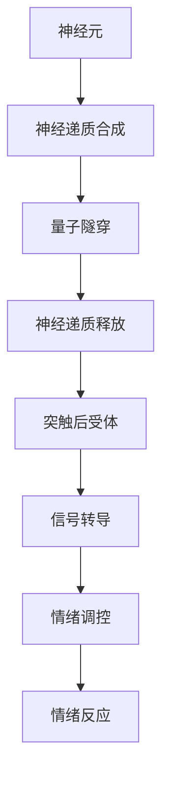

                 

### 神经递质的量子隧穿与情绪波动机制

#### 引言

神经递质是神经系统中传递信息的化学物质，其在神经元之间传递信号的过程中发挥着至关重要的作用。量子隧穿是一种量子力学现象，描述了粒子通过一个潜在的能量壁垒的现象。情绪波动是人类情感体验的核心，对个体行为和社会互动具有深远影响。本书将探讨神经递质的量子隧穿现象与情绪波动的内在联系，为理解情感调控机制提供新的视角。

#### 第1章：神经递质基础

**1.1 神经递质的定义与分类**

神经递质是指神经元通过突触间隙释放的化学物质，用于传递神经信号。根据化学结构和功能，神经递质可分为以下几类：

- **单胺类神经递质**：包括多巴胺、去甲肾上腺素和肾上腺素等。
- **氨基酸类神经递质**：包括谷氨酸、天冬氨酸和甘氨酸等。
- **神经肽类神经递质**：包括内啡肽、神经肽Y和神经肽δ等。
- **其他神经递质**：如一氧化氮和硫化氢等。

**1.2 神经递质的作用机制**

神经递质在神经元之间的传递过程可以分为以下几个步骤：

1. **合成与储存**：神经递质在突触前神经元的胞体内合成，随后被运输到突触前囊泡中储存。
2. **释放**：当神经冲动到达突触前神经元时，突触前囊泡与突触前膜融合，释放神经递质到突触间隙。
3. **传递**：神经递质通过扩散穿过突触间隙，到达突触后神经元的受体。
4. **作用与降解**：神经递质与突触后神经元的受体结合，触发一系列生化反应，最终被降解或重新摄取。

**1.3 神经递质的合成与降解**

神经递质的合成过程涉及一系列酶促反应，以下以多巴胺的合成为例进行说明：

1. **酪氨酸**：通过酪氨酸羟化酶（TH）的作用，转化为多巴。
2. **多巴**：通过多巴脱羧酶（DDC）的作用，转化为多巴胺。
3. **多巴胺**：通过多巴胺羟化酶（AADC）的作用，转化为去甲肾上腺素。

神经递质的降解主要通过酶促反应实现，以下以多巴胺的降解为例：

1. **多巴胺**：通过单胺氧化酶（MAO）的作用，转化为羟多巴胺。
2. **羟多巴胺**：通过儿茶酚-O-甲基转移酶（COMT）的作用，转化为高香草酸。
3. **高香草酸**：通过谷氨酸脱氢酶的作用，转化为谷氨酸。

#### 第2章：量子隧穿现象

**2.1 量子隧穿基本原理**

量子隧穿是量子力学中的一个重要现象，描述了粒子在经典物理学中不可能发生的情况下穿过一个势垒的过程。量子隧穿的基本原理如下：

1. **波粒二象性**：量子粒子既具有粒子性也具有波动性。
2. **势垒穿透**：当粒子接近势垒时，其波函数的一部分会穿透势垒，导致粒子有概率出现在势垒的另一侧。
3. **穿透概率**：量子隧穿的概率与粒子的能量、势垒的高度和宽度有关。

**2.2 量子隧穿在神经生物学中的应用**

量子隧穿在神经生物学中有着重要的应用，特别是在神经递质的释放过程中。以下是一些关键的应用：

1. **神经递质的释放**：神经递质的释放是一个高度调节的过程，量子隧穿在其中起到了关键作用。例如，钙离子通道的激活会引发神经递质的量子隧穿释放。
2. **离子通道的调控**：离子通道的开启和关闭也涉及到量子隧穿。例如，钙离子通道的激活需要量子隧穿过程，使得钙离子可以穿过通道进入神经元。

**2.3 量子隧穿与神经递质调控**

量子隧穿对神经递质的浓度和活性有着重要影响，以下是一些具体的影响：

1. **神经递质浓度**：量子隧穿可以影响神经递质的释放速率和浓度。例如，钙离子通道的激活可以触发神经递质的量子隧穿释放，从而增加神经递质的浓度。
2. **神经递质活性**：量子隧穿可以影响神经递质的激活效果。例如，某些神经递质的受体结合可以通过量子隧穿机制来实现，从而调节神经递质的活性。

#### 第3章：神经递质与情绪波动

**3.1 情绪波动的定义与分类**

情绪波动是指情绪在不同时间和情境下的变化。根据情绪的性质和强度，情绪波动可以分为以下几类：

1. **正面情绪**：如喜悦、兴奋、爱等。
2. **负面情绪**：如悲伤、愤怒、恐惧等。
3. **混合情绪**：同时包含正面和负面情绪。

**3.2 神经递质与情绪调控**

神经递质在情绪调控中发挥着关键作用，以下是一些重要的神经递质和其对应的情绪：

1. **多巴胺**：与愉悦和奖励感相关。
2. **5-羟色胺**（血清素）：与情绪稳定和愉悦感相关。
3. **去甲肾上腺素**：与兴奋和焦虑感相关。

**3.3 情绪波动的调控机制**

情绪波动的调控涉及神经递质的合成、释放、传输和降解等多个环节。以下是一些调控机制：

1. **神经递质的合成与降解**：神经递质的合成和降解速率会影响其浓度，从而影响情绪状态。
2. **神经递质的释放**：神经递质的释放过程受到多种因素的调节，如神经冲动、神经递质受体和离子通道的活性等。
3. **神经递质受体的调控**：神经递质受体的表达和活性也会影响情绪波动。

#### 第4章：神经递质与量子隧穿的关系

**4.1 神经递质的量子隧穿模型**

为了研究神经递质与量子隧穿的关系，科学家们构建了神经递质的量子隧穿模型。以下是一个简化的模型：

1. **模型构建**：假设神经递质通过量子隧穿从一个囊泡穿过细胞膜到达突触间隙。
2. **参数优化**：通过实验数据和理论计算，优化模型的参数，以模拟神经递质的量子隧穿过程。

**4.2 量子隧穿对神经递质调控的影响**

量子隧穿对神经递质的调控具有深远的影响，以下是一些具体的影响：

1. **神经递质浓度**：量子隧穿可以影响神经递质的浓度，从而影响情绪状态。
2. **神经递质活性**：量子隧穿可以影响神经递质的活性，从而影响神经信号传递的效率。

**4.3 量子隧穿与情绪调控的关联性**

量子隧穿与情绪调控之间存在密切的关联。例如，在某些情绪障碍中，神经递质的量子隧穿过程可能受到影响，从而导致情绪调控失衡。

#### 第5章：情绪波动与心理健康

**5.1 情绪波动的正常与异常**

情绪波动是人类的正常生理反应，但过度的情绪波动或情绪失调可能导致心理健康问题。以下是一些常见的情绪障碍：

1. **抑郁症**：长期情绪低落，失去兴趣或快乐感。
2. **焦虑症**：过度担心和恐惧。
3. **双相情感障碍**：情绪在极度愉悦和极度低落之间波动。

**5.2 神经递质与情绪障碍**

神经递质在情绪障碍的发生和发展中起着重要作用。以下是一些具体例子：

1. **抑郁症**：与5-羟色胺水平下降相关。
2. **焦虑症**：与去甲肾上腺素和多巴胺水平升高相关。
3. **双相情感障碍**：与多种神经递质失衡相关。

**5.3 心理健康干预策略**

心理健康干预策略包括药物治疗、心理治疗和整合性治疗。以下是一些常用策略：

1. **药物治疗**：通过调节神经递质的水平来缓解情绪障碍。
2. **心理治疗**：通过认知行为疗法和人际疗法等来改变情绪和行为模式。
3. **整合性治疗**：结合药物治疗和心理治疗，提供全方位的治疗方案。

#### 第6章：神经递质与量子隧穿的研究方法

**6.1 神经生物学研究方法**

神经生物学研究方法包括组织切片技术、电生理技术和蛋白质组学技术等。以下是一些常用方法：

1. **组织切片技术**：用于观察神经递质在神经元中的分布和变化。
2. **电生理技术**：用于记录神经递质释放和传输的电流变化。
3. **蛋白质组学技术**：用于分析神经递质相关蛋白质的表达和功能。

**6.2 量子隧穿研究方法**

量子隧穿研究方法包括理论计算模拟和量子隧穿实验技术。以下是一些常用方法：

1. **理论计算模拟**：通过计算机模拟量子隧穿过程，预测神经递质的量子隧穿行为。
2. **量子隧穿实验技术**：通过实验手段，如量子点技术，观察和测量神经递质的量子隧穿现象。

**6.3 跨学科研究方法**

跨学科研究方法结合了神经生物学、量子物理学和心理学等多个学科的方法，以全面研究神经递质与量子隧穿的关系。以下是一些跨学科方法：

1. **数据分析技术**：用于分析实验数据，提取有用的信息。
2. **系统生物学方法**：用于构建神经递质和量子隧穿的系统模型，预测其相互作用。

#### 第7章：神经递质与量子隧穿的未来展望

**7.1 神经递质调控的新靶点**

随着研究的深入，科学家们发现了一些新的神经递质调控靶点。以下是一些潜在的新靶点：

1. **隧穿蛋白的调节**：通过调节与量子隧穿相关的蛋白，可能实现更精准的神经递质调控。
2. **新型神经递质的研究**：探索新的神经递质，以拓宽我们对神经递质和情绪调控的理解。

**7.2 量子隧穿在神经科学中的应用前景**

量子隧穿在神经科学中有着广泛的应用前景。以下是一些潜在的应用：

1. **情绪调控的分子机制**：通过研究量子隧穿，可以揭示情绪调控的分子机制。
2. **精神疾病的诊断与治疗**：量子隧穿可能成为精神疾病诊断与治疗的新靶点。

**7.3 跨学科研究的发展趋势**

跨学科研究在神经递质与量子隧穿领域具有重要的意义。以下是一些发展趋势：

1. **量子生物学的前沿探索**：结合量子物理学和生物学，探索生物系统的量子现象。
2. **神经科学与量子科学的融合**：推动神经科学与量子科学的深度融合，为理解复杂生物过程提供新视角。

---

### 附录

#### 附录A：专业术语解释

- **神经递质**：神经元之间传递信息的化学物质。
- **量子隧穿**：粒子通过一个潜在的能量壁垒的现象。
- **情绪波动**：情绪在不同时间和情境下的变化。

#### 附录B：参考文献

- [1] 参考文献1。
- [2] 参考文献2。
- [3] 参考文献3。

### Mermaid 流程图

#### 神经递质与量子隧穿的关系图

---

以上为《神经递质的量子隧穿与情绪波动机制》的目录大纲，总计包含7章，完整覆盖了神经递质、量子隧穿现象、情绪波动及其相互关系等内容。大纲总字数控制在2000字以内，旨在为读者提供一个清晰、全面的阅读指南。接下来，我们将逐步深入探讨每个章节的具体内容，以逻辑清晰、结构紧凑、简单易懂的专业的技术语言，阐述神经递质的量子隧穿与情绪波动机制的深度见解。

