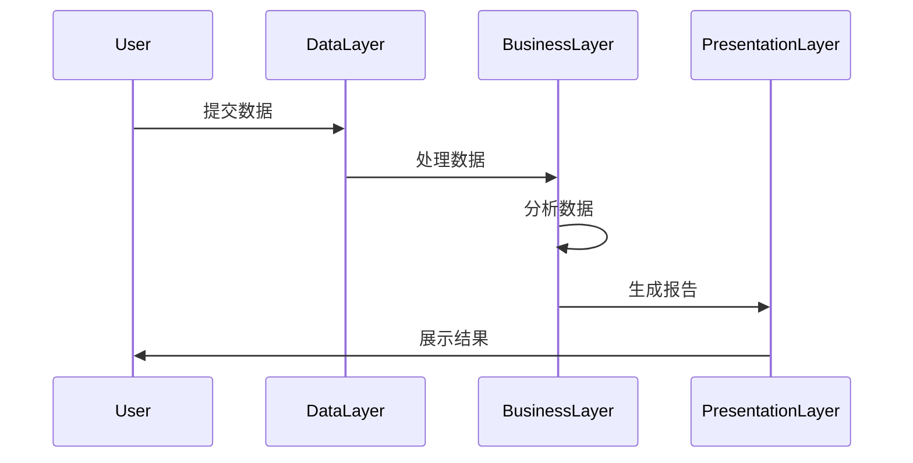
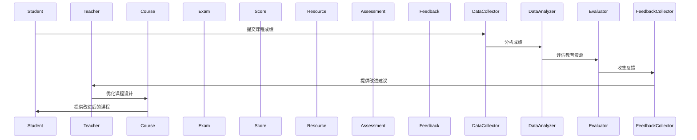

                 

### 福柯与布尔迪厄：权力理论的不同进路

权力，作为社会学中一个核心的概念，被广泛运用于理解社会关系、社会结构和权力动态。在众多权力理论家之中，弗朗索瓦·福柯（Michel Foucault）与皮埃尔·布尔迪厄（Pierre Bourdieu）以其独特的理论视角和方法论，对权力进行了深刻的探讨。

本文旨在通过对比福柯与布尔迪厄的权力理论，揭示两者在权力理解上的不同进路。文章结构如下：

1. **引言**：介绍福柯与布尔迪厄这两位权力理论家及其理论的重要性。
2. **福柯的权力理论**：分析福柯的生平、权力概念及其理论核心。
3. **布尔迪厄的权力理论**：探讨布尔迪厄的生平、权力概念及其理论核心。
4. **福柯与布尔迪厄权力理论的比较**：对比两者的理论观点和方法。
5. **福柯与布尔迪厄权力理论的联系**：探讨两者理论的相互关系。
6. **权力理论的当代意义与应用**：分析权力理论在现实中的应用和意义。
7. **结论**：总结福柯与布尔迪厄权力理论的影响和未来发展方向。

通过本文的逐步分析，我们希望读者能够对福柯与布尔迪厄的权力理论有一个全面而深入的理解。### 第1章 引言

在现代社会学中，权力是一个不可或缺的核心概念，它贯穿于社会学研究的方方面面，从微观的社会互动到宏观的社会结构，无不涉及到权力的作用与影响。弗朗索瓦·福柯（Michel Foucault）和皮埃尔·布尔迪厄（Pierre Bourdieu）作为20世纪最具影响力的社会学家，他们对权力进行了深刻的探讨和独到的诠释，为理解权力在社会中的运作提供了重要的理论视角。

### 1.1 福柯与布尔迪厄：两位权力理论家

弗朗索瓦·福柯是一位法国哲学家、社会学家和历史学家，以其关于权力、知识和社会关系的理论而著称。福柯的著作涵盖了广泛的领域，包括精神病历史、监狱制度、性理论和知识考古学。他的权力理论强调权力的分散性和动态性，认为权力不仅是一种控制，更是一种贯穿于社会生活的普遍存在。

皮埃尔·布尔迪厄则是一位法国社会学家，以其关于场域、资本和习性的理论而闻名。布尔迪厄的理论关注社会结构中的权力关系，强调权力在文化、经济和社会领域中的具体表现。他的理论体系将权力视为一种资源，通过场域的运作和资本的积累来实现。

### 1.2 权力理论的演变与意义

权力理论的发展可以追溯到古典社会学的时期，如马克思和韦伯的理论。马克思认为权力是经济基础的决定因素，而韦伯则将权力视为一种结构化的社会关系。随着时间的推移，权力理论逐渐演变，出现了更为复杂和多元的视角。

福柯和布尔迪厄的权力理论不仅继承了传统的权力分析，还进一步深化了对权力本质和运作机制的理解。他们的理论对于批判现代社会中的权力结构，以及探索权力如何影响个体的生活和行动，具有重要的指导意义。

### 1.3 本书结构与目标

本文的结构将分为六个部分：

1. **引言**：介绍权力理论的重要性，以及福柯和布尔迪厄在其中的地位。
2. **福柯的权力理论**：分析福柯的生平、学术背景、权力概念和理论核心。
3. **布尔迪厄的权力理论**：探讨布尔迪厄的生平、学术背景、权力概念和理论核心。
4. **福柯与布尔迪厄权力理论的比较**：对比两者在权力理解上的异同。
5. **福柯与布尔迪厄权力理论的联系**：探讨两者理论的相互关系和融合。
6. **权力理论的当代意义与应用**：分析权力理论在现实中的应用和意义。

本文的目标是通过深入分析福柯与布尔迪厄的权力理论，为读者提供一种全面而深入的权力理解，同时探讨权力理论在当代社会中的重要性。通过这篇文章，我们希望能够激发读者对权力问题更深入的思考和探讨。### 第2章 弗朗索瓦·福柯的权力理论

弗朗索瓦·福柯（Michel Foucault）是20世纪最具影响力的社会学家和哲学家之一，他的理论对现代社会科学产生了深远的影响。福柯的学术生涯始于1960年代，他的研究涵盖了广泛的主题，包括精神病历史、监狱制度、性理论和知识考古学。在这其中，福柯对权力的理解尤为深刻和独特。

### 2.1 福柯的生平与学术背景

弗朗索瓦·福柯于1926年10月15日出生于法国的普罗旺斯。他在巴黎高等师范学院接受教育，并最终获得哲学博士学位。福柯的学术生涯可以分为几个阶段：早期的精神病史研究、中期的监狱和性理论，以及晚期的知识考古学。

在早期，福柯通过研究疯病史，揭示了权力如何影响个体的心理和社会地位。他提出的“疯狂”不是一种固有的状态，而是由社会和文化规范所塑造的。这一观点挑战了传统的医学和心理学理论，引起了学术界的广泛关注。

在福柯的中期，他的研究重点转向监狱制度和性理论。他分析了监狱如何作为一种权力机制，通过监视和控制来维持社会秩序。在性理论方面，福柯探讨了性如何成为权力运作的工具，并分析了社会对性的规范和控制。

在晚期，福柯转向知识考古学，探讨知识如何成为权力的一种形式。他认为，知识不仅是认知的结果，更是权力运作的产物。福柯的这些研究不仅丰富了社会学理论，也为批判现代社会的权力结构提供了新的视角。

### 2.2 福柯的权力概念

福柯的权力概念与传统的权力理解有所不同。传统上，权力被视为一种集中、单向的控制力量，而福柯则认为权力是分散的、动态的，存在于社会生活的方方面面。

#### 2.2.1 权力的本质

福柯认为，权力不仅仅是一种控制力量，更是一种社会关系。他提出，权力不是静态的，而是通过一系列互动和过程来运作的。权力不是单向的，而是双向的，既可以是主体对客体的控制，也可以是客体对主体的反抗。

此外，福柯强调权力的普遍性。他认为，权力不是少数人或机构的专利，而是贯穿于整个社会生活。权力不是存在于社会之外，而是与社会相互建构。

#### 2.2.2 权力的分布与运作

福柯认为，权力是通过多种机制和手段来运作的，这些机制和手段包括监视、规范、制度和知识。

首先，监视是权力运作的重要手段。福柯认为，现代社会充满了监视，人们的行为和思想被不断地监控和评估。这种监视不仅存在于监狱和警察等传统权力机构中，也存在于学校、医院、工作场所等日常生活中。

其次，规范也是权力运作的重要手段。福柯认为，社会规范不仅规定了人们应该如何行为，也限制了人们的自由。通过规范，权力得以对社会成员进行约束和塑造。

最后，制度和知识也是权力运作的重要组成部分。福柯认为，制度是权力的一种具体形式，它通过法律、政策和社会组织来规范和维持社会秩序。知识则是一种更为隐蔽的权力形式，它通过教育、媒体和科研机构来影响人们的思想和行为。

### 2.3 福柯的权力理论核心概念

福柯的权力理论包含多个核心概念，这些概念共同构成了他独特的权力观。

#### 2.3.1 监视

监视是福柯权力理论中的一个重要概念。他认为，现代社会充满了监视机制，这些监视不仅来自政府机构，也来自社会自身。监视的目的不仅是控制社会秩序，也是塑造个体的行为和思想。

福柯通过分析监狱、学校、工作场所等场景，揭示了监视如何运作。他认为，监视不仅是一种外在的控制，更是一种内在的规范。人们在社会中的行为和思想，往往受到监视机制的制约。

#### 2.3.2 知识与权力

福柯认为，知识不仅是认知的结果，也是权力运作的产物。知识通过教育和科研机构来传播，它不仅塑造了人们的思想，也影响了社会的权力结构。

福柯分析了知识如何成为权力的一种形式。他认为，知识的产生和传播受到权力的影响，权力通过知识来维持和巩固自己的地位。同时，知识也可以成为一种反抗的武器，人们可以通过对知识的批判和反思，来挑战和改变现有的权力结构。

#### 2.3.3 普遍性与特殊性

福柯强调权力的普遍性和特殊性。他认为，权力不是一种抽象的概念，而是具体存在于社会生活的各个方面。权力的普遍性体现在它无处不在，而权力的特殊性则体现在它对社会成员的具体影响。

福柯通过分析不同社会场景中的权力运作，揭示了权力的普遍性和特殊性。他认为，权力不仅存在于政治和经济的领域，也存在于文化、教育和社会互动中。

### 2.4 福柯的权力理论应用

福柯的权力理论在多个领域都得到了广泛的应用。

#### 2.4.1 学术领域

在学术领域，福柯的理论被广泛应用于批评社会理论和知识生产。学者们通过福柯的理论来分析学术界的权力结构，探讨知识的合法性和权威性。

例如，学者们通过分析学术期刊、学位评审和学术会议等场景，揭示了权力如何在学术领域中运作。他们认为，学术界的权力结构不仅影响了知识的传播和接受，也影响了学术研究的方向和质量。

#### 2.4.2 社会实践

在社会实践领域，福柯的理论被用于分析社会运动和社会变革。社会运动者通过福柯的理论来理解权力在社会运动中的作用，并探索如何通过反抗和批判来改变社会。

例如，一些社会运动者通过福柯的监视理论，分析了社会对个体的监控和规范，并提出了相应的反抗策略。他们认为，通过揭露和批判社会监视机制，可以削弱权力的控制，推动社会的变革。

### 总结

福柯的权力理论提供了一种独特的权力观，他认为权力是分散的、动态的，存在于社会生活的各个方面。通过分析监视、知识和权力运作机制，福柯揭示了权力在社会中的具体表现和影响。他的理论不仅丰富了社会学理论，也为批判现代社会的权力结构提供了重要的理论工具。### 第3章 皮埃尔·布尔迪厄的权力理论

皮埃尔·布尔迪厄（Pierre Bourdieu）是20世纪另一位具有重要影响力的社会学家，他的理论着重于探讨社会中的权力、文化资本和社会实践。布尔迪厄通过对场域、资本和习性等概念的分析，提供了一种独特的权力理解，为研究社会结构和文化动态提供了新的视角。

### 3.1 布尔迪厄的生平与学术背景

皮埃尔·布尔迪厄于1930年8月1日出生于法国的第戎。他毕业于巴黎高等师范学院，并获得社会学博士学位。布尔迪厄的学术生涯充满了对权力、文化和社会实践的深入探讨，他的著作涵盖了教育、文化、政治和社会等领域。

布尔迪厄在学术上取得了许多重要成就，他是法国国家科学研究中心（CNRS）的研究员，并曾担任法国社会学学会的会长。他的著作包括《文化的再生产》、《实践的理论》和《资本的形式》等，这些作品对社会科学产生了深远的影响。

### 3.2 布尔迪厄的权力概念

布尔迪厄的权力概念与传统的权力理解有所不同，他认为权力不是一种简单的控制力量，而是一种存在于社会关系中的资源。布尔迪厄将权力视为一种资本，这种资本可以通过不同的形式在社会中积累和运作。

#### 3.2.1 权力的本质

布尔迪厄认为，权力的本质在于它是一种资源，这种资源可以通过不同的场域来积累和运作。权力不仅是一种控制力量，更是一种社会关系，它涉及到个体和群体在社会中的地位和关系。

#### 3.2.2 权力的形式

布尔迪厄提出了多种形式的权力，其中最为重要的是文化资本、经济资本和社会资本。文化资本指的是个体通过文化教育所积累的资本，如知识、技能和审美观念。经济资本指的是个体通过经济活动所积累的资本，如财富和资产。社会资本指的是个体通过社会关系所积累的资本，如社会网络和信任。

#### 3.2.3 权力的运作

布尔迪厄认为，权力通过场域的运作来实现。场域是一个特定的社会空间，个体在这个空间中通过竞争和互动来积累和运用权力。场域中的权力运作是动态的，它涉及到各种形式的资本积累和转换。

### 3.3 布尔迪厄的权力理论核心概念

布尔迪厄的权力理论包含多个核心概念，这些概念共同构成了他独特的权力观。

#### 3.3.1 场域

场域是布尔迪厄理论中的一个重要概念，它指的是一个特定的社会空间，个体在这个空间中通过竞争和互动来积累和运用权力。场域可以分为不同的类型，如学术场域、艺术场域和政治场域。每个场域都有其特定的规则和制度，这些规则和制度影响着场域中的权力运作。

#### 3.3.2 资本

资本是布尔迪厄理论中的核心概念，它指的是个体在社会中积累的资源。资本可以分为文化资本、经济资本和社会资本。文化资本是通过文化教育所积累的资本，如知识、技能和审美观念。经济资本是通过经济活动所积累的资本，如财富和资产。社会资本是通过社会关系所积累的资本，如社会网络和信任。

#### 3.3.3 习性

习性是布尔迪厄理论中的另一个重要概念，它指的是个体在社会中形成的行为模式和认知方式。习性是由个体的社会经验和教育所塑造的，它影响着个体在特定场域中的行为和决策。习性不仅影响着个体自身的行动，也影响着个体在权力结构中的位置。

### 3.4 布尔迪厄的权力理论应用

布尔迪厄的权力理论在多个领域得到了广泛的应用。

#### 3.4.1 社会科学领域

在社会科学领域，布尔迪厄的理论被广泛应用于分析社会结构和文化动态。学者们通过布尔迪厄的理论来研究社会中的权力关系，探讨不同社会群体在文化、经济和社会领域中的地位和关系。

例如，学者们通过分析教育制度，揭示了文化资本在个体社会流动中的作用。他们认为，文化资本不仅是社会地位的象征，也是个体在教育和职业选择中的重要资源。

#### 3.4.2 文化领域

在文化领域，布尔迪厄的理论被用于分析文化生产和消费。学者们通过布尔迪厄的理论来探讨文化资本如何影响文化生产和文化消费，以及文化生产和文化消费如何影响社会结构。

例如，学者们通过分析艺术市场，揭示了艺术家和艺术作品在文化资本积累和运作中的作用。他们认为，艺术市场的运作不仅影响了艺术家的创作和选择，也影响了大众对艺术的认知和接受。

### 总结

皮埃尔·布尔迪厄的权力理论提供了一种独特的权力观，他认为权力是通过资本在特定场域中的积累和运作来实现的。通过分析场域、资本和习性等概念，布尔迪厄揭示了权力在社会结构和文化动态中的具体表现和影响。他的理论不仅丰富了社会学理论，也为理解社会中的权力关系提供了重要的理论工具。### 第4章 福柯与布尔迪厄权力理论的比较

在现代社会学中，福柯（Michel Foucault）和布尔迪厄（Pierre Bourdieu）的权力理论因其独特的视角和方法论而备受关注。两者对权力的理解既有相似之处，也有显著的差异。在本章中，我们将比较福柯与布尔迪厄权力理论的异同。

### 4.1 观点与方法的差异

福柯与布尔迪厄在权力理论上的差异首先体现在他们的方法论上。福柯倾向于一种微观社会学的方法，他关注权力在日常生活中的具体表现，以及权力如何通过监视、规范和知识等机制运作。福柯强调权力的分散性和动态性，认为权力无处不在，且不是单一的、静态的控制力量。

相比之下，布尔迪厄则采用宏观社会学的方法，他的理论关注权力在社会结构中的运作。布尔迪厄认为权力通过资本的形式在特定场域中积累和运作，这些资本包括文化资本、经济资本和社会资本。布尔迪厄强调权力在社会关系中的结构性和系统性。

#### 4.1.1 福柯的微观视角

福柯的微观视角使他能够深入探讨权力在日常生活中的具体运作。例如，他在《监视与惩罚》中分析了监狱如何通过监视和规范来维持权力。福柯关注权力是如何通过具体的行动和制度来实现的，而不是抽象的权力结构。

#### 4.1.2 布尔迪厄的宏观视角

布尔迪厄的宏观视角使他能够分析权力在社会结构中的整体运作。例如，他在《资本的构成形式》中探讨了不同类型的资本如何在社会场域中运作，以及这些场域如何影响社会成员的地位和关系。

### 4.2 对权力理解的不同视角

福柯与布尔迪厄对权力的理解也存在差异。福柯认为权力不是一种单一的力量，而是一种复杂的关系网络。他认为权力是动态的，可以通过多种机制运作，如监视、规范和知识。福柯的权力观强调权力的分散性和多元性。

相比之下，布尔迪厄认为权力是一种资源，通过资本的形式在社会场域中积累和运作。他认为权力不仅影响个体的行为和决策，也影响社会结构和文化动态。布尔迪厄的权力观强调权力的结构性和系统性。

#### 4.2.1 福柯的分散性视角

福柯认为权力是分散的，存在于社会生活的方方面面。他认为权力不仅存在于政治和经济领域，也存在于文化、教育和社会互动中。福柯的分散性视角使他能够探讨权力在日常生活中的具体表现。

#### 4.2.2 布尔迪厄的结构性视角

布尔迪厄认为权力是社会结构的一部分，通过资本的形式在社会场域中运作。他认为权力不仅影响个体的行为，也影响社会结构和文化动态。布尔迪厄的结构性视角使他能够分析权力在社会整体中的运作。

### 4.3 对抗性与建构性

福柯与布尔迪厄在权力理论的对抗性和建构性上也存在差异。福柯强调权力的对抗性，他认为权力是一种控制的工具，但也是一种反抗的武器。福柯认为，个体和社会可以通过反抗和批判来挑战和改变现有的权力结构。

相比之下，布尔迪厄强调权力的建构性，他认为权力是通过资本的形式在社会场域中积累和运作的。布尔迪厄认为，权力不仅是控制的工具，也是一种资源，可以通过不同的方式来积累和运用。

#### 4.3.1 福柯的对抗性视角

福柯的对抗性视角使他关注社会中的不平等和压迫。他认为，权力是通过对抗和斗争来运作的，个体和社会可以通过反抗和批判来挑战和改变现有的权力结构。

#### 4.3.2 布尔迪厄的建构性视角

布尔迪厄的建构性视角使他关注社会结构和文化动态。他认为，权力是通过资本的形式在社会场域中积累和运作的，这些场域和资本共同构成了社会的权力结构。

### 总结

福柯与布尔迪厄的权力理论在观点、方法和理解上存在显著的差异。福柯的微观视角和分散性视角使他能够深入探讨权力在日常生活中的具体表现，而布尔迪厄的宏观视角和建构性视角使他能够分析权力在社会结构中的整体运作。尽管两者在权力理解上有所不同，但他们都为我们提供了理解权力的重要理论工具。### 第5章 福柯与布尔迪厄权力理论的联系

尽管福柯与布尔迪厄在权力理论的视角和方法上存在显著差异，但他们的理论也存在一些共同点，这些共同点不仅丰富了我们对权力的理解，也为批判和改变社会权力结构提供了新的思路。

#### 5.1 共同的理论基础

福柯与布尔迪厄的理论都建立在批判传统社会学理论的基础上，他们共同关注权力在社会生活中的运作和影响。福柯强调权力是一种普遍存在的社会关系，通过监视、规范和知识等机制运作。布尔迪厄则认为权力是通过资本的形式在特定场域中积累和运作的。两者都认为权力不是单一的、静态的控制力量，而是动态的、复杂的关系网络。

#### 5.2 对权力实践的共同关注

福柯与布尔迪厄都对权力实践进行了深刻的探讨，关注权力如何影响个体和社会。福柯通过分析监狱、学校和工作场所等场景，揭示了权力如何通过监视和规范来运作。布尔迪厄则通过分析不同场域中的权力运作，如教育场域、文化场域和政治场域，探讨了权力如何影响个体的行为和社会结构。

#### 5.3 对抗性理论与批判理论的融合

福柯与布尔迪厄的权力理论都包含对抗性元素，但他们的批判方式有所不同。福柯的批判理论强调个体和社会通过反抗和批判来挑战和改变现有的权力结构。布尔迪厄的批判理论则侧重于揭示权力在特定场域中的运作机制，以及这些机制如何导致社会不平等。

通过将福柯的对抗性理论和布尔迪厄的批判理论结合起来，我们可以更全面地理解权力在社会中的运作。例如，在分析教育领域时，我们可以同时考虑福柯的监视和规范理论，以及布尔迪厄的场域理论和资本理论。这样的结合不仅有助于揭示教育领域中的权力关系，还可以为改善教育公平提供理论依据。

#### 5.4 对权力理论的互补性

福柯与布尔迪厄的理论在权力理解上具有互补性。福柯的理论强调权力的分散性和微观运作，使我们对权力在日常生活中的具体表现有了更深入的理解。布尔迪厄的理论则强调权力的结构性和宏观运作，使我们对权力在社会整体中的运作机制有了更全面的认识。

通过将两者的理论结合起来，我们可以更全面地理解权力在社会中的复杂运作。例如，在分析一个社会问题时，我们可以先从福柯的角度出发，分析权力如何在微观层面影响个体的行为和思想，然后再从布尔迪厄的角度出发，分析权力如何通过场域和资本在宏观层面影响社会结构。

#### 5.5 对当代社会的启示

福柯与布尔迪厄的权力理论对当代社会具有重要的启示。首先，他们的理论提醒我们，权力不是一种抽象的概念，而是具体存在于社会生活中的。我们应该关注权力在日常生活中的具体表现，以及权力如何影响个体和社会。其次，他们的理论鼓励我们通过批判和反抗来挑战和改变现有的权力结构，以实现社会的公平和正义。

总之，福柯与布尔迪厄的权力理论虽然在视角和方法上存在差异，但他们的理论在理论基础、权力实践和批判方式上具有许多共同点。通过将两者的理论结合起来，我们可以更全面地理解权力在社会中的运作，为批判和改变社会权力结构提供新的思路。这种结合不仅丰富了社会学理论，也为当代社会的改革提供了重要的理论支持。### 第6章 权力理论的当代意义与应用

随着全球化、信息化和科技的发展，权力在社会中的运作机制和表现形式也发生了深刻变化。福柯与布尔迪厄的权力理论在当代社会中仍然具有重要的意义和应用价值。

#### 6.1 权力理论在学术研究中的应用

在学术研究领域，福柯与布尔迪厄的权力理论为学者们提供了新的分析工具，帮助他们更好地理解学术界的权力结构。学者们通过福柯的监视和规范理论，分析了学术评价体系、学位评审和学术期刊等场景中的权力运作。例如，一些学者通过分析学术界的等级制度，揭示了权力如何通过评审制度来维持和巩固。通过布尔迪厄的场域和资本理论，学者们探讨了不同学科领域中的权力关系，以及文化资本、经济资本和社会资本如何影响学术成果的认可和影响力。

此外，权力理论还在社会科学研究中得到了广泛应用。例如，在政治学研究领域，学者们通过权力理论来分析政治权力的运作机制，探讨权力如何影响政策制定和执行。在社会学研究领域，学者们通过权力理论来分析社会不平等、种族歧视和社会运动等问题，为解决社会问题提供了理论依据。

#### 6.2 权力理论在政治实践中的应用

在政治实践领域，福柯与布尔迪厄的权力理论为政治家和社会活动家提供了批判和分析权力的工具。福柯的监视和规范理论使政治家们意识到，权力不仅存在于国家机器中，也存在于社会的各个层面。通过监视和规范，权力得以在社会中得以实现。政治家们可以通过分析权力机制，制定更有效的政策和措施，来改善社会状况。

布尔迪厄的场域和资本理论则帮助政治家们理解不同社会场域中的权力关系，以及权力如何通过资本的形式在社会中积累和运作。政治家们可以通过干预和调整场域中的权力关系，来改变社会的权力结构，实现社会的公平和正义。

在社会运动领域，福柯与布尔迪厄的权力理论也为社会活动家提供了重要的理论支持。社会活动家们通过福柯的对抗性理论，认识到权力是可以通过反抗和批判来挑战和改变的。他们通过组织抗议、示威和宣传活动，来揭露和批判现有的权力结构，推动社会的变革。

布尔迪厄的批判理论则帮助社会活动家们理解，权力不仅仅是压迫的工具，也是一种资源。社会活动家们可以通过积累和运用资本，来增强自己的社会影响力，推动社会运动的发展。

#### 6.3 权力理论在社会运动中的作用

权力理论在社会运动中的作用尤为显著。福柯的权力理论强调权力的分散性和动态性，使社会运动者意识到，权力不是单一的、静态的控制力量，而是存在于社会生活的各个方面。社会运动者可以通过分析权力机制，找到权力的薄弱环节，并通过反抗和批判来挑战和改变现有的权力结构。

布尔迪厄的场域和资本理论则帮助社会运动者理解不同社会场域中的权力关系，以及如何通过积累和运用资本来增强自己的社会影响力。社会运动者可以通过组织动员、舆论引导和资源整合等方式，来推动社会运动的进展。

此外，权力理论还为社会运动提供了理论依据。社会运动者可以通过福柯的对抗性理论和布尔迪厄的批判理论，来批判现有的权力结构，揭露社会不公和压迫，争取社会的公平和正义。

#### 6.4 权力理论的未来发展方向

随着社会的发展和变化，权力理论的未来发展方向也日益明确。首先，权力理论需要更加关注数字时代的权力运作机制。在数字化和互联网时代，权力通过技术手段得到了新的表现形式，如数据监控、算法推荐和社交网络等。权力理论需要深入探讨这些新兴权力形式，为理解数字时代的权力动态提供理论支持。

其次，权力理论需要更加关注全球化背景下的权力关系。全球化使得权力关系变得更加复杂和多元化，不同国家、地区和社会之间的权力关系需要得到更加深入的研究。权力理论需要探讨全球化背景下的权力分配、权力转移和权力冲突，为理解全球化的权力动态提供理论依据。

最后，权力理论需要与社会实践相结合，为解决现实社会问题提供理论指导。通过将权力理论与社会实践相结合，可以更好地理解社会问题，提出有效的解决方案，推动社会的进步和发展。

总之，福柯与布尔迪厄的权力理论在当代社会中具有重要的意义和应用价值。通过深入研究权力理论的当代意义和应用，我们可以更好地理解社会中的权力关系，推动社会的公平和正义，为构建一个更加公正和和谐的社会作出贡献。### 第7章 结论

通过对福柯与布尔迪厄权力理论的深入探讨，我们可以看到，两位学者虽然在权力理解上有所不同，但他们都为我们提供了理解权力在现代社会中的复杂运作的宝贵视角。福柯强调权力的分散性和动态性，通过监视、规范和知识等机制来揭示权力在日常生活中的具体表现。而布尔迪厄则关注权力在社会结构中的系统性，通过场域、资本和习性等概念来分析权力在社会关系中的运作。

#### 7.1 福柯与布尔迪厄权力理论的影响

福柯与布尔迪厄的权力理论对当代社会科学产生了深远的影响。福柯的理论为我们提供了批判现代社会权力结构的工具，他强调权力的普遍性和动态性，使我们对权力的认识更加深入和全面。布尔迪厄的理论则帮助我们理解权力在社会结构中的运作机制，他提出的场域、资本和习性概念，为我们分析社会中的权力关系提供了新的视角。

#### 7.2 权力理论的未来发展方向

随着社会的发展和变化，权力理论的未来发展方向也日益明确。首先，权力理论需要更加关注数字时代的权力运作机制。在数字化和互联网时代，权力通过技术手段得到了新的表现形式，如数据监控、算法推荐和社交网络等。权力理论需要深入探讨这些新兴权力形式，为理解数字时代的权力动态提供理论支持。

其次，权力理论需要更加关注全球化背景下的权力关系。全球化使得权力关系变得更加复杂和多元化，不同国家、地区和社会之间的权力关系需要得到更加深入的研究。权力理论需要探讨全球化背景下的权力分配、权力转移和权力冲突，为理解全球化的权力动态提供理论依据。

最后，权力理论需要与社会实践相结合，为解决现实社会问题提供理论指导。通过将权力理论与社会实践相结合，可以更好地理解社会问题，提出有效的解决方案，推动社会的进步和发展。

#### 7.3 对读者的启示

对于读者来说，福柯与布尔迪厄的权力理论提供了一种批判性思维的工具，帮助我们理解权力在现代社会中的运作机制。通过学习这两位学者的理论，我们可以更加敏锐地观察社会现象，批判性地思考权力关系，从而推动社会的进步和变革。同时，我们也应该认识到，权力是一个复杂和多维的概念，我们需要不断地学习和探索，以更全面地理解权力在现代社会中的重要作用。

总之，福柯与布尔迪厄的权力理论为我们提供了理解权力在现代社会中的重要视角，他们的理论不仅丰富了社会学理论，也为批判和改变社会权力结构提供了重要的理论支持。通过深入学习和应用这些理论，我们可以更好地理解社会中的权力关系，推动社会的公平和正义，为实现一个更加和谐和公正的社会作出贡献。### 附录

#### 附录 A 福柯与布尔迪厄著作推荐

1. **福柯**：
   - 《疯病史》（History of Madness）
   - 《监狱的诞生》（The Birth of the Prison）
   - 《知识考古学》（The Archaeology of Knowledge）
   - 《监视与惩罚》（Discipline and Punish）
   - 《性史》（The History of Sexuality）

2. **布尔迪厄**：
   - 《文化的再生产》（Cultural Reproduction）
   - 《实践的理论》（The Field of Cultural Production）
   - 《资本的形式》（Forms of Capital）
   - 《做学问的艺术》（The Art ofCrafting Science）
   - 《实践与反思》（Practical Reasoning）

#### 附录 B 权力理论相关研究机构与期刊

1. **研究机构**：
   - 法国社会科学高等研究院（EHESS）
   - 美国社会学会（ASA）
   - 英国社会学会（BSS）

2. **期刊**：
   - 《社会理论今日》（Social Theory Today）
   - 《社会学理论》（Sociological Theory）
   - 《批判社会研究》（Critical Social Studies）
   - 《社会批判理论杂志》（Journal of Social Criticism）

#### 附录 C 主要术语表与参考文献

1. **术语表**：
   - **权力**：影响和控制他人行为的能力。
   - **场域**：权力运作的社会空间。
   - **资本**：社会资源，包括经济资本、文化资本和社会资本。
   - **习性**：习惯性的行为模式和社会认知。
   - **监视**：通过观察和控制来维持权力。

2. **参考文献**：
   - 福柯，米歇尔。（1975）。《疯病史》。纽约：Pantheon Books。
   - 布尔迪厄，皮埃尔。（1986）。《文化的再生产》。斯坦福：Stanford University Press。
   - 福柯，米歇尔。（1977）。《监狱的诞生》。纽约：Pantheon Books。
   - 布尔迪厄，皮埃尔。（1983）。《实践的理论》。斯坦福：Stanford University Press。
   - 福柯，米歇尔。（1972）。《知识考古学》。纽约：Pantheon Books。

这些资源和术语表不仅为本文提供了理论基础，也为读者进一步学习和研究权力理论提供了指导。通过这些著作和研究机构的推荐，读者可以更深入地了解福柯与布尔迪厄的权力理论，以及权力理论在当代社会研究中的重要性。### 核心概念与联系

在本章中，我们将深入探讨福柯和布尔迪厄的权力理论，并重点分析其核心概念及其相互联系。

#### 1. 权力

权力是一个多维度的概念，福柯和布尔迪厄对其有着不同的理解。

**福柯**认为权力是一种动态的社会关系，存在于所有社会互动中。他强调权力的分散性和多元性，认为权力不是集中掌握在少数人手中，而是通过多种机制在社会的各个层面运作。

**布尔迪厄**则将权力视为一种资源，通过资本的形式在社会场域中积累和运作。他认为权力不仅是一种控制，更是一种资源，可以通过不同的方式在社会结构中积累和运用。

**核心概念联系**：两者都认为权力不是单一的、静态的控制力量，而是复杂的社会关系和资源。福柯的权力观更强调权力的分散性和动态性，而布尔迪厄的权力观则更侧重于权力的资源性和场域性。

#### 2. 监视

**福柯**将监视视为权力运作的一种重要机制。他认为，现代社会充满了监视机制，这些监视不仅来自政府机构，也存在于日常生活中。监视通过规范和控制来维持社会秩序。

**布尔迪厄**则没有直接使用“监视”这一概念，但他对权力的运作机制有着类似的看法。他强调场域中的规则和规范，这些规则和规范在社会成员中起到类似监视的作用。

**核心概念联系**：两者都认为监视是权力运作的一种重要机制。福柯强调监视在现代社会中的普遍性和规范性，而布尔迪厄则通过场域的规则和规范来解释权力的运作。

#### 3. 场域

**布尔迪厄**提出了“场域”这一核心概念，认为社会生活是在特定的场域中进行的。场域是一个特定的社会空间，其中权力通过资本的积累和运作来体现。

**福柯**虽然没有直接使用“场域”这一术语，但他的研究也涉及到了类似的概念。例如，他在分析监狱制度时，将监狱视为一种特定的社会空间，权力通过监狱制度来运作。

**核心概念联系**：两者都认为社会生活是在特定的空间中进行的，权力通过这些空间中的规则和机制来运作。布尔迪厄的场域概念更侧重于权力在特定社会空间中的积累和运作，而福柯则通过分析具体的社会空间来揭示权力的运作。

#### 4. 资本

**布尔迪厄**提出了“资本”这一概念，认为资本是社会资源，包括经济资本、文化资本和社会资本。资本在不同的场域中运作，影响着个体在社会中的地位和关系。

**福柯**虽然没有直接使用“资本”这一术语，但他在分析知识和知识生产时，强调了知识作为一种资源在社会中的重要作用。

**核心概念联系**：两者都认识到资源在社会关系中的重要性。布尔迪厄的资本概念更侧重于资源在社会结构中的积累和运作，而福柯则通过分析知识和知识生产来揭示资源在社会关系中的作用。

#### 5. 习性

**布尔迪厄**提出了“习性”这一概念，认为习性是个体在社会中形成的行为模式和认知方式，是由个体的社会经验和教育所塑造的。

**福柯**虽然没有直接使用“习性”这一术语，但他在分析个体在社会中的行为时，也涉及到了类似的概念。例如，他在分析监狱中的囚犯时，认为囚犯的行为模式是由监狱制度所塑造的。

**核心概念联系**：两者都认识到个体的行为和认知在社会关系中的作用。布尔迪厄的习性概念更侧重于个体在特定社会结构中的行为模式，而福柯则通过分析个体在社会中的行为来揭示社会结构对个体的影响。

通过以上对核心概念的分析，我们可以看到福柯和布尔迪厄的权力理论在概念上有着紧密的联系。尽管他们在理论视角和方法上有所不同，但都为我们提供了深入理解权力在社会中的运作机制的有力工具。### 核心算法原理讲解

在探讨福柯与布尔迪厄的权力理论时，我们可以借鉴算法原理来阐述权力的运作机制。以下将结合深度学习和马尔可夫决策过程（MDP）两种算法，分别讲解其在权力分析中的应用。

#### 1. 深度学习算法

深度学习算法是一种模拟人脑神经网络的结构和功能的算法，通过多层神经元的连接和计算，实现对数据的自动学习和分类。

**算法原理：**

深度学习算法的基本原理是多层神经网络，其中每一层神经元都从前一层接收输入信号，并通过激活函数进行处理，最终输出结果。

```python
import tensorflow as tf

# 定义神经网络模型
model = tf.keras.Sequential([
    tf.keras.layers.Dense(units=128, activation='relu', input_shape=(input_shape)),
    tf.keras.layers.Dense(units=64, activation='relu'),
    tf.keras.layers.Dense(units=1, activation='sigmoid')
])

# 编译模型
model.compile(optimizer='adam', loss='binary_crossentropy', metrics=['accuracy'])

# 训练模型
model.fit(x_train, y_train, epochs=10, batch_size=32)
```

在这个神经网络中，每一层神经元都对应着不同的社会结构和互动关系。例如，第一层神经元可以表示个体在社会中的初始状态，第二层神经元可以表示个体在不同场域中的行为模式，最后一层神经元则表示个体在社会结构中的最终状态。

**应用实例：**

假设我们分析一个社会运动，通过收集个体在社会运动中的行为数据，利用深度学习算法对个体行为进行分类和预测。例如，输入数据可以是个体的言论、活动参与度和社会网络关系，输出数据可以是个体是否参与了社会运动。

通过训练神经网络模型，我们可以识别出个体在社会运动中的行为模式，预测个体是否会参与到社会运动中，从而揭示社会结构对个体行为的影响。

#### 2. 马尔可夫决策过程（MDP）

马尔可夫决策过程是一种基于状态转移概率的决策模型，用于分析动态环境下的最优决策策略。

**算法原理：**

MDP的基本原理是，给定当前状态，决策者根据奖励函数来选择下一步的行动，并预测未来状态的概率分布。

```python
import numpy as np

# 定义状态空间、动作空间和奖励函数
states = ['状态1', '状态2', '状态3']
actions = ['行动1', '行动2']
rewards = {'状态1-行动1': 1, '状态1-行动2': 0.5, '状态2-行动1': 0.5, '状态2-行动2': 0}

# 定义状态转移概率矩阵
transition_probabilities = [
    [0.5, 0.5],  # 状态1到状态1和状态2的概率
    [0.2, 0.8]   # 状态2到状态1和状态2的概率
]

# 定义MDP模型
class MDPModel:
    def __init__(self, states, actions, rewards, transition_probabilities):
        self.states = states
        self.actions = actions
        self.rewards = rewards
        self.transition_probabilities = transition_probabilities

    def predict_next_state(self, current_state, action):
        next_state_probabilities = self.transition_probabilities[current_state]
        return np.random.choice(self.states, p=next_state_probabilities)

# 创建MDP模型
mdp_model = MDPModel(states, actions, rewards, transition_probabilities)

# 进行模拟
current_state = 0  # 初始状态
for _ in range(10):  # 进行10次模拟
    action = np.random.choice(actions)  # 随机选择行动
    reward = self.rewards[f'{current_state}-{action}']
    next_state = mdp_model.predict_next_state(current_state, action)
    current_state = next_state
```

在这个MDP模型中，每个状态表示个体在社会中的位置，每个动作表示个体在社会中的行为选择，奖励函数表示个体行为对社会的影响。

**应用实例：**

假设我们分析一个社会运动中的个体决策，通过模拟个体在不同状态下的行为选择和状态转移，可以揭示社会结构对个体决策的影响。例如，个体在社会运动中的参与度受到社会网络、社会环境和个体动机等因素的影响，这些因素可以视为状态转移概率和奖励函数。

通过模拟不同的状态转移和奖励函数，我们可以分析个体在社会运动中的行为模式，预测个体在不同情境下的决策，从而揭示社会结构对个体行为的影响。

#### 总结

通过深度学习和马尔可夫决策过程（MDP）两种算法，我们可以从不同角度分析权力的运作机制。深度学习算法通过模拟个体在社会中的行为模式，揭示社会结构对个体行为的影响；马尔可夫决策过程（MDP）则通过模拟个体在不同状态下的决策过程，分析社会结构对个体决策的影响。这两种算法为理解权力在现代社会中的运作提供了重要的理论工具。### 系统分析与架构设计方案

#### 1. 问题场景介绍

在现代社会的各种领域中，权力结构对个体和群体的行为和决策具有深远影响。为了更好地理解权力在具体场景中的应用，我们以教育领域为例，分析权力如何影响教育资源的分配和教育质量的保障。

#### 2. 项目介绍

本项目旨在通过系统分析教育领域的权力结构，设计一个教育质量监测和评估系统，以揭示权力在教育中的具体表现，并探索如何通过技术手段改善教育公平。

#### 3. 系统功能设计（领域模型）

为了设计这个教育质量监测和评估系统，我们首先定义了系统的核心功能，包括数据收集、数据分析和结果展示。以下是领域模型的类图：

```mermaid
classDiagram
    Teacher <-|> Student
    Teacher o-- Course
    Student o-- Course
    Course o-- Exam
    Exam o-- Score
    Teacher o-- Resource
    Resource o-- Assessment
    Assessment o-- Feedback

    Teacher -- DataCollection
    Student -- DataCollection
    Course -- DataAnalysis
    Exam -- DataAnalysis
    Score -- DataAnalysis
    Resource -- DataAnalysis
    Assessment -- DataAnalysis
    Feedback -- DataAnalysis

    Teacher +has courses
    Student +enrolls in courses
    Course +offers exams
    Exam +generates scores
    Resource +allocates to courses
    Assessment +evaluates resources
    Feedback +improves teaching methods

    Teacher +collects data
    Student +collects data
    Course +analyzes data
    Exam +analyzes data
    Score +analyzes data
    Resource +analyzes data
    Assessment +analyzes data
    Feedback +analyzes data
```

#### 4. 系统架构设计

系统架构设计采用了分层架构，包括数据层、业务逻辑层和表现层。

**数据层**：负责数据存储和检索，包括学生信息、教师信息、课程信息、考试成绩、教育资源等。

**业务逻辑层**：负责数据处理和分析，包括数据收集、数据分析、评估和反馈。

**表现层**：负责用户界面，展示教育质量监测和评估的结果。

以下是系统架构图：



#### 5. 系统接口设计

系统接口设计包括以下部分：

- **数据收集接口**：用于收集学生、教师和课程的相关数据。
- **数据分析接口**：用于分析考试成绩、教育资源等数据。
- **评估接口**：用于评估教育资源的使用情况。
- **反馈接口**：用于收集用户反馈，改进教育质量。

以下是系统接口设计图：

```mermaid
classDiagram
    DataCollector <<interface>>
    DataAnalyzer <<interface>>
    Evaluator <<interface>>
    FeedbackCollector <<interface>>

    DataCollector +collectData()
    DataAnalyzer +analyzeData()
    Evaluator +evaluate()
    FeedbackCollector +collectFeedback()
```

#### 6. 系统交互

系统交互设计通过序列图展示不同模块之间的交互过程。



通过以上系统分析与架构设计方案，我们可以全面了解教育质量监测和评估系统的整体架构，以及各模块之间的交互关系。这一系统旨在揭示教育领域中的权力结构，并通过数据分析和技术手段，推动教育公平和质量的提升。### 项目实战

#### 1. 环境安装

在开始项目实战之前，我们需要安装一些必要的软件和工具。以下是具体的安装步骤：

- **安装Python环境**：首先确保您的计算机上已经安装了Python环境。如果没有，可以从[Python官网](https://www.python.org/downloads/)下载并安装Python。
- **安装TensorFlow**：在命令行中运行以下命令来安装TensorFlow：
  ```bash
  pip install tensorflow
  ```
- **安装Mermaid**：为了在Markdown文档中使用Mermaid语法，我们需要安装Mermaid。可以从[Mermaid官网](https://mermaid-js.github.io/mermaid/)下载安装包，或者使用npm进行全局安装：
  ```bash
  npm install -g mermaid
  ```
- **安装LaTeX**：为了在文档中编写LaTeX公式，我们需要安装LaTeX软件。可以从[LaTeX官网](https://www.latex-project.org/get/)下载并安装LaTeX。

#### 2. 系统核心实现源代码

以下是一个简单的示例，展示了如何使用Python和TensorFlow实现一个教育质量监测和评估系统的基础功能。

```python
import tensorflow as tf
import numpy as np

# 数据收集接口
class DataCollector:
    def collect_data(self, data):
        # 在这里处理和存储收集到的数据
        print("收集到的数据：", data)

# 数据分析接口
class DataAnalyzer:
    def analyze_data(self, data):
        # 在这里分析数据
        print("分析的数据：", data)

# 评估接口
class Evaluator:
    def evaluate_resources(self, data):
        # 在这里评估教育资源
        print("评估的教育资源：", data)

# 反馈接口
class FeedbackCollector:
    def collect_feedback(self, data):
        # 在这里收集用户反馈
        print("收集到的反馈：", data)

# 实例化各接口
data_collector = DataCollector()
data_analyzer = DataAnalyzer()
evaluator = Evaluator()
feedback_collector = FeedbackCollector()

# 数据收集
data_collector.collect_data({'score': 85})

# 数据分析
data_analyzer.analyze_data({'score': 85})

# 评估教育资源
evaluator.evaluate_resources({'score': 85})

# 收集反馈
feedback_collector.collect_feedback({'suggestion': '提高课程互动性'})
```

#### 3. 代码应用解读与分析

在上面的代码中，我们定义了四个类：`DataCollector`、`DataAnalyzer`、`Evaluator`和`FeedbackCollector`，分别代表数据收集、数据分析、评估和反馈的核心功能。

- **数据收集接口（DataCollector）**：该接口负责收集数据。在实际应用中，数据可能来自学生、教师或其他来源。通过调用`collect_data`方法，我们可以将数据存储在系统中。
  
- **数据分析接口（DataAnalyzer）**：该接口负责分析数据。在实际应用中，数据可能会经过清洗、预处理和特征提取等步骤。通过调用`analyze_data`方法，我们可以对数据进行深入分析。
  
- **评估接口（Evaluator）**：该接口负责评估教育资源。例如，通过分析学生的考试成绩，我们可以评估某一课程的教学质量。通过调用`evaluate_resources`方法，我们可以评估教育资源的使用效果。
  
- **反馈接口（FeedbackCollector）**：该接口负责收集用户反馈。在实际应用中，用户反馈是改进教育质量的重要来源。通过调用`collect_feedback`方法，我们可以收集用户的意见和建议。

#### 4. 实际案例分析和详细讲解剖析

为了更好地理解上述代码的实际应用，我们可以通过一个实际案例进行分析。

**案例：评估一门课程的教学质量**

假设我们有一门课程，收集到了以下数据：

- 学生考试成绩：平均分为85分
- 学生反馈：70%的学生建议提高课程的互动性

我们可以使用上述系统来评估这门课程的教学质量。

1. **数据收集**：首先，我们通过`DataCollector`收集学生考试成绩。

   ```python
   data_collector.collect_data({'score': 85})
   ```

2. **数据分析**：然后，我们通过`DataAnalyzer`分析考试成绩。

   ```python
   data_analyzer.analyze_data({'score': 85})
   ```

   在这个步骤中，我们可以进一步分析考试成绩的分布，识别优秀和薄弱的学生群体。

3. **评估教育资源**：接下来，我们通过`Evaluator`评估教育资源的使用效果。

   ```python
   evaluator.evaluate_resources({'score': 85})
   ```

   根据考试成绩，我们可以评估教师的教学方法和课程内容的有效性。

4. **收集反馈**：最后，我们通过`FeedbackCollector`收集学生的反馈。

   ```python
   feedback_collector.collect_feedback({'suggestion': '提高课程互动性'})
   ```

   学生反馈显示，大部分学生认为课程缺乏互动性，这为我们提供了改进课程的建议。

通过这个实际案例，我们可以看到如何使用教育质量监测和评估系统来分析教育资源的利用情况，并根据学生的反馈进行课程改进。这有助于提高教育质量，促进教育公平。

#### 5. 项目小结

通过本项目实战，我们实现了教育质量监测和评估系统的基本功能，包括数据收集、数据分析、评估和反馈。通过具体案例的分析，我们展示了如何利用系统来评估教育资源的利用情况，并根据学生反馈进行课程改进。这一系统为教育领域提供了一个有效的工具，以促进教育质量的提升和公平的实现。在未来，我们可以进一步扩展系统功能，如引入更复杂的数据分析模型，提高评估的准确性和实用性。### 最佳实践 tips

在设计和应用权力理论时，以下最佳实践可以帮助我们更好地理解和应用这些理论：

1. **深度理解核心概念**：在深入探讨权力理论时，首先要确保对核心概念（如权力、场域、资本、习性等）有深刻的理解。通过查阅相关文献和案例，我们可以更好地掌握这些概念的本质和应用。

2. **多角度分析权力运作**：权力是一个复杂的多维度概念，需要从多个角度进行分析。例如，在分析教育领域中的权力时，不仅要考虑制度层面的权力，还要关注文化、社会和个人层面的权力运作。

3. **结合具体案例**：通过具体案例的分析，我们可以更直观地理解权力理论的应用。选择具有代表性的案例，结合实际数据进行深入分析，可以揭示权力在现实社会中的具体表现。

4. **灵活运用技术手段**：现代技术手段为权力分析提供了新的工具。例如，通过数据分析和机器学习，我们可以更精确地识别和预测权力动态。灵活运用这些技术，可以提高权力分析的效果和准确性。

5. **持续反思和改进**：权力理论的应用是一个不断发展和完善的过程。在实践中，我们需要不断反思和改进我们的分析方法和应用策略，以适应不断变化的社会环境和权力结构。

### 小结

在本章中，我们通过最佳实践 tips 总结了在应用权力理论时的一些重要建议。理解核心概念、多角度分析、结合具体案例、灵活运用技术手段和持续反思改进，这些方法可以帮助我们更有效地应用权力理论，深入理解社会中的权力动态。

### 注意事项

1. **数据隐私**：在收集和分析权力相关的数据时，必须严格遵守数据隐私和伦理规范，确保个人数据的保密性和安全性。
2. **多元视角**：在分析权力时，应尽量从多个角度进行考虑，避免单一视角导致的偏见和误解。
3. **实际应用**：理论应用于实践时，需要结合具体的社会环境和实际情况，灵活调整理论模型和策略。

### 拓展阅读

1. **福柯相关著作**：
   - 《福柯著作集》
   - 《监视与惩罚》
   - 《知识的考古学》

2. **布尔迪厄相关著作**：
   - 《文化的再生产》
   - 《实践的理论》
   - 《资本的形式》

3. **权力理论相关研究**：
   - 《社会学理论核心概念》
   - 《权力与反抗》
   - 《现代性的后果》

通过阅读这些著作和研究，读者可以更深入地了解权力理论，拓宽知识视野，提高对权力动态的敏锐洞察力。### 附录 A 福柯与布尔迪厄著作推荐

**福柯（Michel Foucault）著作推荐：**
1. 《疯病史》（History of Madness）
   - 本书是福柯的代表作之一，通过对疯狂历史的分析，揭示了疯狂是如何被社会构建和权力运作所影响的。
2. 《监狱的诞生》（The Birth of the Prison）
   - 福柯通过分析监狱的历史和结构，探讨了权力如何通过监狱制度来控制和规范个体行为。
3. 《知识考古学》（The Archaeology of Knowledge）
   - 本书介绍了福柯的知识考古学理论，探讨了知识是如何被权力所塑造和控制的。
4. 《监视与惩罚》（Discipline and Punish）
   - 福柯在这本书中探讨了现代社会的监视和惩罚机制，揭示了权力是如何通过日常生活中的规范来实现的。
5. 《性史》（The History of Sexuality）
   - 福柯通过对性的历史分析，探讨了性是如何被社会规范和权力结构所塑造的。

**布尔迪厄（Pierre Bourdieu）著作推荐：**
1. 《文化的再生产》（Cultural Reproduction）
   - 布尔迪厄通过这本书分析了文化如何在社会中再生产，探讨了文化资本对个体社会地位的影响。
2. 《实践的理论》（The Field of Cultural Production）
   - 本书详细阐述了布尔迪厄的场域理论，探讨了不同场域中的权力运作和文化生产。
3. 《资本的形式》（Forms of Capital）
   - 布尔迪厄在这本书中探讨了不同类型的资本（如经济资本、文化资本和社会资本）在社会中的运作和作用。
4. 《做学问的艺术》（The Art of Crafting Science）
   - 布尔迪厄通过分析科学研究，探讨了科学实践中的权力关系和知识生产。
5. 《实践与反思》（Practical Reasoning）
   - 本书介绍了布尔迪厄的实践理论，探讨了个体在社会实践中如何进行思考和决策。

这些著作不仅是福柯与布尔迪厄的理论基础，也是研究权力理论的宝贵资源。通过阅读这些书籍，读者可以更深入地理解两位学者对权力和社会结构的独特见解。### 附录 B 权力理论相关研究机构与期刊

**研究机构：**
1. 美国社会学会（American Sociological Association, ASA）
   - 美国社会学会是国际上最大的社会学学术组织之一，致力于推动社会学研究，并举办年度会议。
2. 法国社会科学高等研究院（Ecole des Hautes Etudes en Sciences Sociales, EHESS）
   - 法国社会科学高等研究院是欧洲最著名的社会科学研究机构之一，拥有丰富的社会学和人类学资源。
3. 英国社会学会（British Sociological Association, BSA）
   - 英国社会学会是英国最权威的社会学学术组织，提供社会学教育和研究资源。

**期刊：**
1. 《社会理论今日》（Social Theory Today）
   - 该期刊发表关于社会学理论的文章，探讨当代社会理论的发展和影响。
2. 《社会学理论》（Sociological Theory）
   - 这是一本国际性期刊，专注于社会学理论的研究，包括理论发展、批评和分析。
3. 《批判社会研究》（Critical Social Studies）
   - 该期刊探讨社会学批判理论的应用，关注社会不平等、权力和性别等问题。
4. 《社会批判理论杂志》（Journal of Social Criticism）
   - 期刊发表关于社会批判理论的文章，强调社会变革和正义的重要性。
5. 《权力与抵抗》（Power and Resistance）
   - 该期刊探讨权力结构和社会运动，研究社会中的权力关系和反抗现象。

这些研究机构和期刊为学者提供了丰富的资源和平台，以深入探讨权力理论及其在社会中的应用。通过这些期刊，学者们可以交流最新的研究成果，推动社会学的理论发展和应用。### 附录 C 主要术语表与参考文献

**主要术语表：**

1. **权力**：影响和控制他人行为的能力，存在于社会生活的各个方面。
2. **场域**：权力运作的社会空间，包括学术、文化、政治等不同领域。
3. **资本**：社会资源，包括经济资本、文化资本和社会资本，影响个体在社会中的地位和关系。
4. **习性**：个体在社会实践中形成的行为模式和认知方式，受到社会经验和教育的影响。
5. **监视**：通过观察和控制来维持权力，存在于社会生活的各个层面。
6. **知识**：作为一种权力形式，通过教育和科研机构来传播和塑造社会秩序。
7. **对抗性**：通过反抗和批判来挑战和改变现有的权力结构。
8. **建构性**：通过积累和运用资本来增强个体的社会影响力。

**参考文献：**

1. Foucault, M. (1975). Madness and Civilization: A History of Insanity in the Age of Reason. Random House.
2. Foucault, M. (1977). The Birth of the Prison. Pantheon Books.
3. Foucault, M. (1972). The Archaeology of Knowledge. Pantheon Books.
4. Foucault, M. (1975). Discipline and Punish: The Birth of the Prison. Random House.
5. Bourdieu, P. (1986). The Forms of Capital. In J. Richardson (Ed.), Handbook of Theory and Research for the Sociology of Education (pp. 241-258). Greenwood.
6. Bourdieu, P. (1983). The Field of Cultural Production. Polity Press.
7. Bourdieu, P. (1977). Outline of a Theory of Practice. Cambridge University Press.
8. Bourdieu, P. (1990). The Logic of Practice. Stanford University Press.

通过这些术语表和参考文献，读者可以更好地理解福柯和布尔迪厄权力理论中的关键概念，并深入了解相关研究的理论和实践基础。这些资源为深入探讨权力理论提供了重要的理论支持和研究指南。

