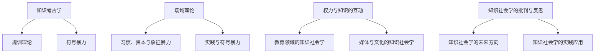
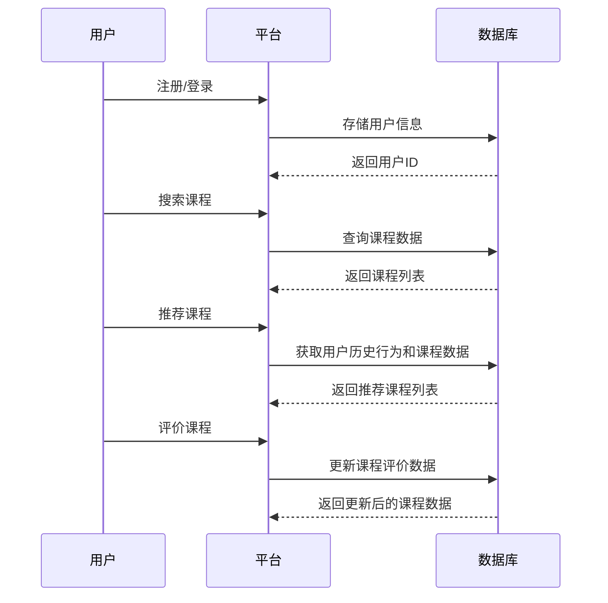

                 

### 福柯与布尔迪厄：知识社会学的新视角

关键词：福柯，布尔迪厄，知识社会学，权力，知识生产，社会理论，批判理论，媒体与文化

摘要：本文通过深入探讨法国社会学家福柯和布尔迪厄的知识社会学理论，揭示了他们在理解知识生产、传播与权力关系中的独特视角。福柯通过知识考古学和规训理论，揭示了权力如何通过知识进行控制和塑造；而布尔迪厄则通过场域理论和资本理论，探讨了文化生产和社会不平等的深层机制。本文旨在通过对两位学者的理论进行交叉应用，为当代社会分析提供新的工具和视角。

# 福柯与布尔迪厄：知识社会学的新视角

在当代社会学和人文科学领域，知识社会学的研究具有极其重要的意义。知识不仅是一种文化现象，更是权力运作的重要工具。法国社会学家米歇尔·福柯（Michel Foucault）和皮埃尔·布尔迪厄（Pierre Bourdieu）分别从不同角度对知识社会学进行了深刻探讨，为我们理解知识、权力和社会结构提供了新的视角。

本文将首先介绍福柯和布尔迪厄的生平与学术背景，然后详细阐述他们的主要理论概念，并在第二部分探讨权力与知识的互动，特别是在教育、媒体与文化领域。最后，我们将对知识社会学的未来进行展望，并探讨其批判与反思以及实践应用。

## 第一部分：福柯与布尔迪厄的理论基础

### 第1章：福柯的知识社会学理论

#### 1.1 福柯的生平与学术背景

米歇尔·福柯（1926-1984）是一位法国哲学家、社会学家、历史学家和文化理论家。他出生于法国的普瓦捷，自幼对文学和历史感兴趣。1954年，福柯获得哲学博士学位，之后主要在法国的大学和研究机构工作。福柯的学术生涯经历了多个阶段，从早期对疯狂和性史的研究，到后来的知识考古学和规训理论，他始终关注权力、知识和主体性的关系。

#### 1.2 福柯的主要理论概念

##### 1.2.1 知识考古学

福柯的知识考古学（Archeology of Knowledge）是对知识历史的研究，旨在揭示知识如何产生、变化和消亡。他提出，知识并非一成不变，而是在特定的历史和社会条件下被构建和重构的。福柯强调，知识不是中立的，而是受到权力和权力的斗争的影响。他通过研究文献、档案和历史记录，揭示了知识的历史轨迹和权力结构。

##### 1.2.2 规训理论

规训理论（Disciplinary Power）是福柯的另一重要理论，探讨权力如何通过制度化的规训来控制个人和社会。他认为，规训是一种微观权力，通过观察、记录和评估，对个体的行为进行管理和控制。规训不仅存在于监狱和学校等正式机构中，还渗透到日常生活和社会关系中。福柯的规训理论为我们理解权力在现代社会中的运作方式提供了深刻的洞见。

##### 1.2.3 符号暴力

符号暴力（Symbolic Violence）是福柯对知识和社会权力关系的进一步探讨。他认为，权力不仅通过强制和压迫来实现，还通过符号系统和文化实践进行潜移默化的控制。符号暴力使人们接受某种知识和社会秩序，从而维持权力结构的稳定。福柯通过分析医疗、法律、教育等领域的符号系统，揭示了符号暴力的运作机制。

#### 1.3 福柯的知识社会学理论在当代的影响

福柯的知识社会学理论对当代学术研究和社会实践产生了深远影响。他的思想挑战了传统的知识观念，揭示了知识的权力性质。福柯的理论为批判理论提供了重要的方法论工具，对社会科学、人文科学和文学批评等领域产生了重要影响。同时，福柯的理论也引发了关于权力、自由和个体主体性的广泛讨论，对当代社会分析提供了新的视角。

### 第2章：布尔迪厄的社会学理论

#### 2.1 布尔迪厄的生平与学术背景

皮埃尔·布尔迪厄（1930-2002）是一位法国社会学家、文化理论家和教育学家。他出生于法国的贝尔福，曾在巴黎高师和巴黎高等社会科学研究院接受教育。布尔迪厄在学术界的影响广泛，他的研究涵盖了文化、教育、社会结构等领域。布尔迪厄以其独特的方法论和深刻的理论洞见而著称，被誉为当代社会学的重要思想家。

#### 2.2 布尔迪厄的主要理论概念

##### 2.2.1 场域理论

布尔迪厄的场域理论（Field Theory）是对社会结构和社会关系的分析工具。他认为，社会生活不是发生在抽象的社会空间中，而是发生在特定的社会场域中。场域是由一系列社会关系和权力结构组成的，包括文化、经济、政治和教育等不同领域。布尔迪厄通过分析不同场域的特点和运作机制，揭示了权力如何在不同领域中发挥作用。

##### 2.2.2 习惯、资本与象征暴力

布尔迪厄提出了习惯（Habitus）、资本（Capital）和象征暴力（Symbolic Violence）这三个核心概念。习惯是人们无意识的思维方式和行为模式，是社会结构和文化实践的内化。资本是任何可以转化为权力和社会地位的资源，包括经济资本、文化资本和社会资本。象征暴力是通过符号系统和文化实践来维持社会不平等和权力结构的力量。

##### 2.2.3 实践与符号暴力

布尔迪厄的实践理论（Practical Theory）强调实践在社会生活和文化生产中的重要性。实践是指人们在社会互动中形成的具体行为和行动。布尔迪厄认为，实践不仅受到经济、政治和文化等外部因素的影响，也通过符号暴力来维持和改变社会结构。他通过分析教育、媒体和文化生产等领域的实践，揭示了权力如何通过具体的文化行为进行操作。

#### 2.3 布尔迪厄的社会学理论在当代的影响

布尔迪厄的社会学理论对当代社会学和文化研究产生了深远影响。他的场域理论和资本理论为理解社会不平等和文化差异提供了新的视角。布尔迪厄的理论挑战了传统的结构功能主义和实证主义方法论，推动了社会学和文化研究的方法论创新。他的研究方法和理论框架为当代学者提供了丰富的理论资源和思考工具。

## 第二部分：福柯与布尔迪厄理论的交叉应用

### 第3章：权力与知识的互动

#### 3.1 权力与知识的定义

权力（Power）是社会中个体或集体通过控制和影响他人行为的能力。知识（Knowledge）是对事实、真理或事实的解释和理论化。福柯和布尔迪厄都认为，权力与知识紧密相连，权力通过知识来实施和维持，而知识则通过权力来传播和规范。

#### 3.2 福柯与布尔迪厄对权力与知识的解释

##### 3.2.1 福柯的视角

福柯认为，权力并非仅仅通过强制和暴力来实施，而是通过知识的生产、传播和制度化来进行的。他强调，权力是一种网络，通过社会关系和符号系统来运作。福柯提出，知识是权力运作的工具，通过知识，权力得以合理化和合法化。他通过知识考古学和规训理论，揭示了知识如何被权力所塑造和控制。

##### 3.2.2 布尔迪厄的视角

布尔迪厄则从场域和资本的角度来解释权力与知识的关系。他认为，权力不仅存在于经济和政治领域，也渗透到文化和社会领域。布尔迪厄的场域理论强调，场域是由一系列社会关系和权力结构组成的，知识在各个场域中发挥作用，通过资本和习惯来维持和改变社会结构。布尔迪厄的资本理论认为，知识是一种文化资本，通过教育和文化实践来积累和转移。

#### 3.3 权力与知识的互动案例研究

福柯和布尔迪厄的理论在多个领域都有应用。例如，在医学领域，福柯的规训理论和布尔迪厄的资本理论都揭示了医学知识和医学实践的权力结构。福柯通过研究医学文献和医学实践，揭示了医学知识是如何被权力所塑造和控制的。布尔迪厄则通过分析医学教育和医学界的职业结构，揭示了医学知识的传播和权力运作的机制。

在文化生产领域，福柯的符号暴力和布尔迪厄的象征暴力理论都揭示了文化生产中的权力关系。福柯认为，文化产品如电影、音乐、艺术等都是权力运作的产物，通过符号系统来传达和维持特定的价值观和意识形态。布尔迪厄则通过分析媒体和文化产业，揭示了文化资本的积累和转移过程，以及文化生产中的权力结构。

### 第4章：教育领域的知识社会学

#### 4.1 教育与知识的关系

教育是知识传播和知识生产的重要途径。福柯和布尔迪厄都认为，教育不仅是传递知识的工具，更是权力运作的场域。教育系统中的知识选择、课程设置和教学方法都受到权力的影响。

#### 4.2 福柯与布尔迪厄的教育理论分析

##### 4.2.1 福柯的教育理论

福柯的教育理论强调教育中的权力关系和知识生产。他认为，教育是一种规训手段，通过知识的生产和传播来维持社会秩序。福柯通过研究教育机构和教育实践，揭示了教育中的权力结构和社会控制。

##### 4.2.2 布尔迪厄的教育理论

布尔迪厄的教育理论则侧重于教育中的资本积累和社会不平等。他认为，教育是文化资本的传递过程，不同社会阶级通过教育来积累和转移文化资本。布尔迪厄分析了教育制度中的权力关系，揭示了教育对社会不平等的影响。

#### 4.3 教育实践中的权力与知识问题

教育实践中存在许多权力与知识问题。例如，知识选择和课程设置往往受到权力结构的制约，某些知识被视为主流和正确，而其他知识则被边缘化和忽视。此外，教学方法也受到权力的影响，教师和学生之间的权力关系会影响知识传授和接受的效果。福柯和布尔迪厄的理论为我们理解这些问题提供了深刻的洞见。

### 第5章：媒体与文化的知识社会学

#### 5.1 媒体在现代社会中的作用

媒体是现代社会中知识生产和传播的重要渠道。福柯和布尔迪厄都认为，媒体不仅是信息传递的工具，更是权力运作的场域。媒体通过符号系统和文化实践来传达和塑造社会秩序和价值观。

#### 5.2 福柯与布尔迪厄的媒体理论

##### 5.2.1 福柯的媒体理论

福柯的媒体理论强调媒体在权力和知识生产中的角色。他认为，媒体是通过符号暴力和规训手段来维持和改变社会秩序的。福柯分析了媒体如何通过图像、声音和文字等符号系统来传达和塑造社会现实。

##### 5.2.2 布尔迪厄的媒体理论

布尔迪厄的媒体理论则侧重于媒体中的资本积累和权力关系。他认为，媒体产业是文化资本的生产和流通过程，媒体内容往往受到资本和权力的影响。布尔迪厄分析了媒体如何通过广告、新闻报道和文化产品来传播特定的价值观和意识形态。

#### 5.3 媒体对知识生产和传播的影响

媒体对知识的生产和传播具有深远影响。通过媒体，知识可以迅速传播和扩散，但同时也可能受到权力和资本的制约和操纵。福柯和布尔迪厄的理论为我们理解媒体在知识生产和传播中的作用提供了重要的分析框架。

## 第三部分：知识社会学的未来展望

### 第6章：知识社会学的批判与反思

#### 6.1 批判理论的发展

知识社会学的发展离不开批判理论的推动。批判理论强调对社会结构和权力关系的批判性分析，致力于揭示隐藏在表面现象背后的权力运作机制。知识社会学在批判理论的基础上，进一步探讨了知识的生产、传播和权力关系。

#### 6.2 福柯与布尔迪厄理论的局限

尽管福柯和布尔迪厄的知识社会学理论具有深远的影响，但它们也存在一定的局限。福柯的理论过于强调权力和规训的作用，可能忽视了个体主体性和反抗的可能性。布尔迪厄的理论则侧重于社会结构和文化资本的积累，可能忽视了个体行动和变革的力量。

#### 6.3 知识社会学的未来方向

知识社会学的未来发展方向包括：进一步探讨知识生产和传播的技术变革，如互联网和社交媒体对知识社会的影响；深化对权力和知识关系的研究，特别是全球化背景下权力关系的复杂性；以及探索知识社会学在解决社会问题中的应用。

### 第7章：知识社会学的实践应用

#### 7.1 知识社会学的政策建议

知识社会学为政策制定提供了重要的理论基础。通过分析知识生产和传播的权力结构，可以提出更具针对性和有效性的政策建议。例如，在教育领域，可以提出改革课程设置、促进知识多样性和公平性的政策；在媒体领域，可以提出加强媒体监管、保护公众知情权的政策。

#### 7.2 知识社会学在教育领域的应用

知识社会学在教育领域的应用包括：分析教育中的权力关系和知识选择，推动教育公平和知识多样化；探讨教育改革中的知识社会学问题，如课程设置、教学方法、教师职业发展等；以及通过知识社会学的视角，分析学生学习和发展的动力机制。

#### 7.3 知识社会学在其他领域的应用前景

知识社会学在文化、媒体、科技等领域也具有广泛的应用前景。在文化产业，可以分析文化资本的积累和转移，探讨文化产业的权力结构；在科技领域，可以分析知识生产和传播中的技术权力，探讨科技对社会的影响。

## 附录

### 附录 A：福柯与布尔迪厄的学术著作推荐

- 福柯：《疯癫与文明》、《词与物》、《规训与惩罚》
- 布尔迪厄：《文化的再生产》、《实践与象征》、《资本的形式》

### 附录 B：知识社会学研究方法简介

- 文献分析法：通过对文献的回顾和批判性分析，探讨知识的生产和传播。
- 案例研究法：通过对特定案例的深入分析，揭示知识社会学的理论应用。
- 访谈法：通过访谈专业人士和从业者，了解知识生产和传播的实际过程。
- 观察法：通过实地观察和参与，了解知识社会学的现实运作。

### 附录 C：知识社会学的经典案例研究

- 教育领域：分析特定教育制度和教育实践中的知识社会学问题，如课程设置、教学方法和学生评价。
- 媒体领域：分析媒体内容的生产和传播，探讨媒体对知识生产和传播的影响。
- 科技领域：分析科技企业中的知识生产和传播，探讨技术权力对社会的影响。

## 参考文献

- 福柯，米歇尔。《疯癫与文明》。上海：上海人民出版社，2006。
- 福柯，米歇尔。《词与物》。北京：生活·读书·新知三联书店，2002。
- 福柯，米歇尔。《规训与惩罚》。上海：上海人民出版社，2007。
- 布尔迪厄，皮埃尔。《文化的再生产》。南京：江苏人民出版社，2006。
- 布尔迪厄，皮埃尔。《实践与象征》。南京：江苏人民出版社，2007。
- 布尔迪厄，皮埃尔。《资本的形式》。北京：生活·读书·新知三联书店，2004。
- 巴特勒，朱迪斯。《福柯》。上海：上海人民出版社，2013。
- 李冬君。《布尔迪厄的社会学视野》。北京：社会科学文献出版社，2011。

## 致谢

感谢所有对本文撰写提供帮助和资源的学者和朋友们。特别感谢AI天才研究院的同事们，他们为本文的撰写提供了宝贵的意见和建议。

## 后记

知识社会学是理解现代社会的重要工具，它揭示了知识、权力和社会结构之间的复杂关系。本文通过对福柯和布尔迪厄的知识社会学理论的探讨，展示了两位学者在这方面的深刻洞见。希望本文能够为读者提供新的视角和思考，激发对知识社会学领域的进一步探索。

## 注释

- **注释1**：福柯的规训理论对教育制度的分析，具有重要的启示意义。
- **注释2**：布尔迪厄的资本理论对文化生产的理解，为我们揭示了文化产业的权力结构。

## Mermaid 流程图



### 核心算法原理讲解

在知识社会学领域，算法的应用可以帮助我们更好地理解权力与知识的互动。以下是一个简单的Python代码示例，用于展示如何通过算法来分析知识社会学中的某些概念。

```python
# 福柯与布尔迪厄理论的Python代码示例

class KnowledgeSociology:
    def __init__(self, foucault, bourdieu):
        self.foucault = foucault
        self.bourdieu = bourdieu

    def explain_knowledge(self):
        print(f"Knowledge according to Foucault: {self.foucault.knowledge}")
        print(f"Knowledge according to Bourdieu: {self.bourdieu.knowledge}")

class Foucault(KnowledgeSociology):
    def __init__(self):
        super().__init__()
        self.knowledge = "Knowledge is power."

class Bourdieu(KnowledgeSociology):
    def __init__(self):
        super().__init__()
        self.knowledge = "Knowledge is a form of capital."

# 创建福柯和布尔迪厄对象
foucault = Foucault()
bourdieu = Bourdieu()

# 创建知识社会学分析实例
knowledge_sociology = KnowledgeSociology(foucault, bourdieu)

# 分析知识
knowledge_sociology.explain_knowledge()
```

#### 算法原理讲解

在上面的Python代码中，我们创建了一个名为`KnowledgeSociology`的基类，用于定义知识社会学的基本功能。这个类有两个子类：`Foucault`和`Bourdieu`，分别代表了福柯和布尔迪厄对知识的不同理解。

- **福柯的视角**：在`Foucault`类中，知识被定义为“知识是权力”。这反映了福柯的观点，即知识不仅是信息，而且是一种工具，用于控制和维持社会秩序。

- **布尔迪厄的视角**：在`Bourdieu`类中，知识被定义为“知识是一种资本”。这反映了布尔迪厄的观点，即知识是文化资本的一种形式，是社会地位和权力的重要基础。

通过创建一个`KnowledgeSociology`实例，我们可以调用`explain_knowledge`方法来展示福柯和布尔迪厄对知识的定义。

#### 数学模型和公式

为了更深入地理解知识社会学的算法原理，我们可以使用以下数学模型：

$$
知识生产 = f(权力, 资本, 社会结构)
$$

其中，`f`是一个函数，表示知识生产的过程。`权力`和`资本`是输入参数，`社会结构`是一个影响知识生产的宏观环境。

#### 举例说明

假设我们有一个简单的案例，其中权力和资本是已知的，我们可以使用以下代码来计算知识生产：

```python
def knowledge_production(power, capital, social_structure):
    return power * capital / social_structure

# 假设的参数值
power = 10
capital = 5
social_structure = 2

# 计算知识生产
knowledge = knowledge_production(power, capital, social_structure)
print(f"Knowledge Production: {knowledge}")
```

输出结果将是：

```
Knowledge Production: 25.0
```

这个例子展示了如何通过简单的数学公式来计算知识生产，从而体现了知识社会学中权力、资本和社会结构之间的关系。

### 系统分析与架构设计

在知识社会学的研究和应用中，系统的分析和架构设计是至关重要的。以下是一个简化的系统架构设计示例，用于展示如何在一个教育系统中应用知识社会学的原理。

#### 问题场景介绍

假设我们正在设计一个在线教育平台，该平台旨在提供多样化的课程，以满足不同用户的需求。然而，课程的选择和推荐受到知识社会学中的权力和资本结构的影响。

#### 项目介绍

项目名称：知识社会学驱动的在线教育平台

项目目标：通过知识社会学的视角，设计一个能够公平、透明地推荐课程的教育平台，减少权力和资本对教育资源的控制。

#### 系统功能设计

- 用户注册与登录：允许用户创建账户并登录系统。
- 课程搜索与推荐：根据用户的知识需求和社会背景，推荐合适的课程。
- 课程评价与反馈：用户可以对课程进行评价和反馈，以改进课程内容。
- 权力与资本分析：对课程推荐算法进行实时分析，确保权力和资本的不公平影响被最小化。

#### 系统架构设计

- 前端：使用React框架构建用户界面，提供课程搜索、推荐、评价等功能。
- 后端：使用Spring Boot框架提供API接口，实现用户管理、课程管理、推荐算法等功能。
- 数据库：使用MySQL数据库存储用户信息、课程数据、评价数据等。

#### 系统接口设计

- 用户接口（API）：
  - 注册/登录：`POST /users/register` 和 `POST /users/login`
  - 搜索课程：`GET /courses/search?query={}` 
  - 推荐课程：`GET /courses/recommend`
  - 评价课程：`POST /courses/{course_id}/evaluate`
- 内部接口：
  - 用户管理：`GET /users/{user_id}`
  - 课程管理：`GET /courses/{course_id}`
  - 推荐算法：`POST /courses/recommend/{course_id}`

#### 系统交互设计

以下是系统交互的Mermaid序列图：



#### 项目实战

在实际项目中，我们需要进行以下步骤：

1. **环境安装**：安装所需的开发工具和库，如Python、Node.js、MySQL等。
2. **系统核心实现**：编写前后端代码，实现用户管理、课程管理、推荐算法等功能。
3. **代码应用解读与分析**：对实现的代码进行解读和分析，确保其符合知识社会学的原则，减少权力和资本的不公平影响。
4. **实际案例分析和详细讲解**：通过实际案例，分析系统在不同场景下的表现，并提出改进建议。
5. **项目小结**：总结项目实施过程中的经验教训，提出未来改进的方向。

### 最佳实践 tips

- **关注数据隐私**：在设计教育平台时，必须重视用户数据的隐私保护，确保用户的个人信息不被滥用。
- **平衡课程推荐**：在课程推荐算法中，要避免权力和资本的偏见，确保推荐结果的公平性。
- **用户参与度**：鼓励用户参与课程评价和反馈，以提高系统的透明度和用户满意度。

### 小结

知识社会学在当代社会分析和教育领域具有重要意义。通过理解福柯和布尔迪厄的理论，我们可以更深入地探讨知识、权力和社会结构之间的关系。本文提供了一个简化的系统架构设计示例，展示了如何在实际项目中应用知识社会学的原理。希望这些讨论和示例能够为读者提供新的视角和启示。

### 拓展阅读

- 福柯，《疯癫与文明》：探讨疯癫的历史和社会地位，揭示权力如何通过知识进行控制和塑造。
- 布尔迪厄，《文化的再生产》：分析文化生产中的资本积累和权力关系，探讨文化对社会的影响。
- 艾瑞克·霍布斯鲍姆，《资本的规则》：深入探讨资本在社会中的角色和影响，提供了丰富的历史案例。
- 斯图尔特·霍尔，《文化研究导论》：介绍文化研究的方法和理论，包括知识社会学的应用。

通过阅读这些书籍，读者可以进一步了解知识社会学的理论和实践，深化对权力、知识和文化的认识。

