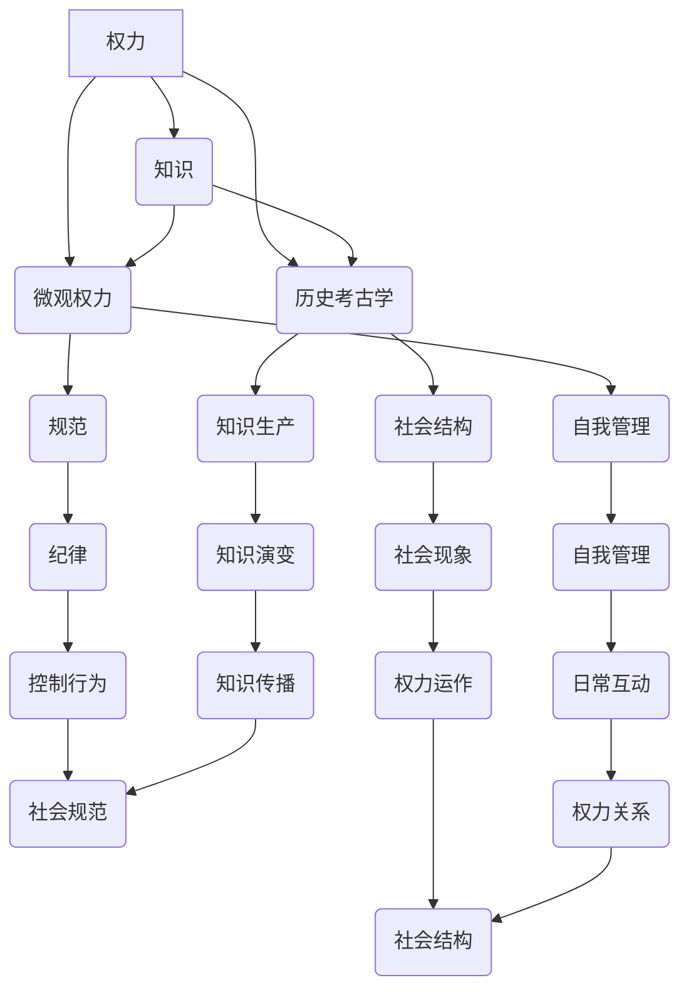
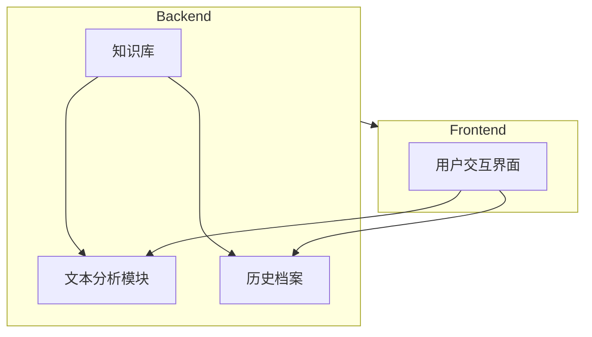
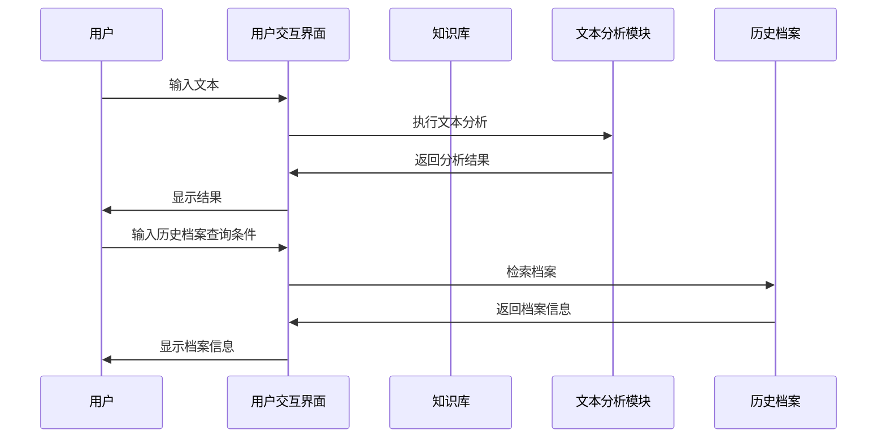

                 

 我们从目录大纲开始，逐步分析和构思文章的结构和内容。

### 目录大纲分析

**章节 1：福柯与德里达的生平与思想**

**1.1 禦柯的生平与思想**

- 背景介绍：介绍福柯的生平背景，包括他的出生地、成长经历以及学术背景。
- 主要思想：阐述福柯的核心思想，如“权力与知识的关系”、“微观权力”和“历史考古学”。

**1.2 德里达的生平与思想**

- 背景介绍：介绍德里达的生平背景，包括他的出生地、成长经历以及学术背景。
- 主要思想：阐述德里达的核心思想，如“解构主义”、“语言哲学”和“文本理论”。

**章节 2：权力与知识**

**2.1 福柯的权力理论**

- 核心概念与联系：分析福柯权力理论的核心概念，如权力的本质和运作方式。
- 算法原理讲解：详细解释福柯权力理论中的算法原理和数学模型。

**2.2 德里达的解构主义与权力**

- 核心概念与联系：分析德里达解构主义的核心概念，如解构主义如何挑战西方哲学的二元对立思维。
- 算法原理讲解：详细解释德里达解构主义与权力之间的关系。

**章节 3：社会理论与文化理论**

**3.1 福柯的社会理论**

- 核心概念与联系：分析福柯社会理论的核心概念，如社会理论与权力、知识的关系。
- 算法原理讲解：详细解释福柯社会理论中的算法原理和数学模型。

**3.2 德里达的文化理论**

- 核心概念与联系：分析德里达文化理论的核心概念，如文化理论与语言、文本的关系。
- 算法原理讲解：详细解释德里达文化理论中的算法原理和数学模型。

**章节 4：后现代主义与现代性**

**4.1 后现代主义的定义与特征**

- 核心概念与联系：分析后现代主义的定义与特征，如后现代主义的核心理念和特点。
- 算法原理讲解：详细解释后现代主义的算法原理和数学模型。

**4.2 福柯与德里达对现代性的批判**

- 核心概念与联系：分析福柯与德里达对现代性的批判，如他们对现代性的理解和对现代性弊端的批评。
- 算法原理讲解：详细解释福柯与德里达对现代性批判的算法原理和数学模型。

**章节 5：语言、文本与阅读**

**5.1 德里达的语言哲学**

- 核心概念与联系：分析德里达的语言哲学的核心概念，如语言与思维的关系、文本的意义等。
- 算法原理讲解：详细解释德里达的语言哲学中的算法原理和数学模型。

**5.2 福柯的文本理论**

- 核心概念与联系：分析福柯的文本理论的核心概念，如文本的意义、文本与权力的关系等。
- 算法原理讲解：详细解释福柯的文本理论中的算法原理和数学模型。

**5.3 阅读实践与批判理论**

- 核心概念与联系：分析阅读实践与批判理论的核心概念，如阅读如何影响人的思维、批判理论的作用等。
- 算法原理讲解：详细解释阅读实践与批判理论中的算法原理和数学模型。

**章节 6：权力与解构的应用**

**6.1 福柯在社会科学中的应用**

- 核心概念与联系：分析福柯在社会科学中的应用，如他在社会学、心理学等领域的研究成果。
- 算法原理讲解：详细解释福柯在社会科学中的应用中的算法原理和数学模型。

**6.2 德里达在文学理论中的应用**

- 核心概念与联系：分析德里达在文学理论中的应用，如他在文学批评、文本分析等领域的研究成果。
- 算法原理讲解：详细解释德里达在文学理论中的应用中的算法原理和数学模型。

**章节 7：总结与展望**

**7.1 福柯与德里达对后现代主义的影响**

- 核心概念与联系：分析福柯与德里达对后现代主义的影响，如他们在哲学、文化等领域的影响。
- 算法原理讲解：详细解释福柯与德里达对后现代主义影响的算法原理和数学模型。

**7.2 后现代主义对当代社会的影响**

- 核心概念与联系：分析后现代主义对当代社会的影响，如它在政治、经济、文化等领域的表现。
- 算法原理讲解：详细解释后现代主义对当代社会影响的算法原理和数学模型。

### 核心内容构思

在构思文章的核心内容时，我们将遵循以下步骤：

1. **背景介绍**：对每个核心概念进行术语说明，介绍相关的问题背景和问题描述。
2. **核心概念与联系**：分析每个核心概念的理论依据和实际应用，使用表格和图表进行对比和阐述。
3. **算法原理讲解**：针对每个核心概念，使用Mermaid流程图和Python代码来展示算法原理和数学模型。
4. **系统分析与架构设计方案**：对于某些复杂的概念，设计相应的系统架构图和接口设计，使用Mermaid序列图来展示系统交互过程。
5. **项目实战**：对于某些实际应用场景，给出环境安装、系统核心实现源代码，并对代码进行解读和分析。
6. **最佳实践 tips**：给出实际应用中的最佳实践建议和小结。
7. **拓展阅读**：推荐相关书籍、论文和网络资源，供读者进一步学习。

通过这样的结构，我们将确保文章的逻辑清晰、内容丰富、易于理解，同时引导读者深入了解福柯与德里达的思想，以及后现代主义在当代社会的影响。

### 文章结构细化

为了确保文章的逻辑清晰、内容丰富且易于理解，我们将对每个章节进行细化和补充，确保每个小节都有具体的内容和结构。

**第一章：福柯与德里达的生平与思想**

- **1.1 禦柯的生平与思想**
  - **1.1.1 福柯的生平**
    - 背景介绍
    - 学术生涯
    - 主要成就
  - **1.1.2 福柯的主要思想**
    - 权力与知识的关系
    - 微观权力
    - 历史考古学
    - 社会理论
    - 文本理论
  - **1.1.3 禦柯的理论影响与应用**
    - 学术影响
    - 社会科学中的应用
    - 文学理论中的应用

- **1.2 德里达的生平与思想**
  - **1.2.1 德里达的生平**
    - 背景介绍
    - 学术生涯
    - 主要成就
  - **1.2.2 德里达的主要思想**
    - 解构主义
    - 语言哲学
    - 文本理论
    - 文化理论
  - **1.2.3 德里达的理论影响与应用**
    - 学术影响
    - 文学理论中的应用
    - 后现代主义的影响

**第二章：权力与知识**

- **2.1 福柯的权力理论**
  - **2.1.1 权力的本质**
    - 权力的定义
    - 权力的运作方式
  - **2.1.2 福柯的权力理论核心概念**
    - 权力与知识的关系
    - 微观权力
    - 历史考古学
  - **2.1.3 福柯权力理论的应用**
    - 社会科学中的应用
    - 文学理论中的应用

- **2.2 德里达的解构主义与权力**
  - **2.2.1 解构主义的本质**
    - 解构主义的概念
    - 解构主义的方法
  - **2.2.2 德里达的解构主义与权力**
    - 解构主义对权力理论的挑战
    - 解构主义在文学中的应用
  - **2.2.3 德里达的解构主义对社会理论的影响**

**第三章：社会理论与文化理论**

- **3.1 福柯的社会理论**
  - **3.1.1 福柯的社会理论核心概念**
    - 社会理论与权力
    - 社会理论与知识
    - 社会理论与历史
  - **3.1.2 福柯的社会理论应用**
    - 社会科学中的应用
    - 文化研究中的应用
  - **3.1.3 福柯的社会理论批评**

- **3.2 德里达的文化理论**
  - **3.2.1 德里达的文化理论核心概念**
    - 文本与意义
    - 语言与思维
    - 文本与权力
  - **3.2.2 德里达的文化理论应用**
    - 文学理论中的应用
    - 艺术理论中的应用
  - **3.2.3 德里达的文化理论批评**

**第四章：后现代主义与现代性**

- **4.1 后现代主义的定义与特征**
  - **4.1.1 后现代主义的定义**
    - 后现代主义的定义
    - 后现代主义的特征
  - **4.1.2 后现代主义的起源与发展**
    - 后现代主义的起源
    - 后现代主义的发展
  - **4.1.3 后现代主义的影响**

- **4.2 福柯与德里达对现代性的批判**
  - **4.2.1 福柯对现代性的批判**
    - 福柯对现代性的理解
    - 福柯对现代性的批判
  - **4.2.2 德里达对现代性的批判**
    - 德里达对现代性的理解
    - 德里达对现代性的批判
  - **4.2.3 福柯与德里达批判的现代性影响**

**第五章：语言、文本与阅读**

- **5.1 德里达的语言哲学**
  - **5.1.1 语言哲学的核心概念**
    - 语言与思维
    - 文本与意义
  - **5.1.2 语言哲学的应用**
    - 文学理论中的应用
    - 社会科学中的应用
  - **5.1.3 语言哲学的争议**

- **5.2 福柯的文本理论**
  - **5.2.1 文本理论的核心概念**
    - 文本与权力
    - 文本与知识
  - **5.2.2 文本理论的应用**
    - 文学理论中的应用
    - 社会科学中的应用
  - **5.2.3 文本理论的争议**

- **5.3 阅读实践与批判理论**
  - **5.3.1 阅读实践的核心概念**
    - 阅读与理解
    - 阅读与批判
  - **5.3.2 阅读实践的应用**
    - 教育中的应用
    - 文化批判中的应用
  - **5.3.3 阅读实践的争议**

**第六章：权力与解构的应用**

- **6.1 福柯在社会科学中的应用**
  - **6.1.1 福柯在社会科学中的应用领域**
    - 社会学
    - 心理学
    - 政治学
  - **6.1.2 福柯在社会科学中的应用案例**
    - 社会案例分析
    - 心理案例分析
    - 政治案例分析
  - **6.1.3 福柯在社会科学中的应用评价**

- **6.2 德里达在文学理论中的应用**
  - **6.2.1 德里达在文学理论中的应用领域**
    - 文学批评
    - 文本分析
  - **6.2.2 德里达在文学理论中的应用案例**
    - 文学案例分析
    - 文本分析案例
  - **6.2.3 德里达在文学理论中的应用评价**

**第七章：总结与展望**

- **7.1 福柯与德里达对后现代主义的影响**
  - **7.1.1 福柯对后现代主义的影响**
    - 福柯对后现代主义的理论贡献
    - 福柯对后现代主义的实践影响
  - **7.1.2 德里达对后现代主义的影响**
    - 德里达对后现代主义的理论贡献
    - 德里达对后现代主义的实践影响
  - **7.1.3 福柯与德里达对后现代主义的共同影响**

- **7.2 后现代主义对当代社会的影响**
  - **7.2.1 后现代主义在政治领域的影响**
    - 政治权力的解构
    - 新政治运动的兴起
  - **7.2.2 后现代主义在经济领域的影响**
    - 经济模式的转变
    - 全球化与反全球化
  - **7.2.3 后现代主义在文化领域的影响**
    - 文化的多元化
    - 文化的解构与重构

通过以上章节的细化和补充，我们可以确保文章内容完整、逻辑清晰、易于理解，同时深入探讨福柯与德里达的思想，以及后现代主义对当代社会的影响。在接下来的写作过程中，我们将围绕这些章节，逐步完成每个小节的详细内容。

### 文章关键词

- **福柯**
- **德里达**
- **后现代主义**
- **权力**
- **解构主义**
- **知识**
- **社会理论**
- **文化理论**
- **现代性**
- **文本**
- **阅读实践**
- **批判理论**

### 文章摘要

本文旨在深入探讨两位后现代主义大师福柯与德里达的思想，以及他们如何影响和塑造了当代社会。福柯以其“权力与知识的关系”理论和对微观权力的研究，为社会科学和文化研究提供了新的视角。而德里达的解构主义则挑战了西方哲学的二元对立思维，强调文本的不确定性和语言的权威。本文将分析福柯和德里达的生平、思想，以及他们在社会理论与文化理论中的贡献。此外，还将探讨后现代主义的定义与特征，以及福柯与德里达对现代性的批判。通过本文，读者可以全面了解福柯与德里达的思想，以及后现代主义在当代社会中的影响。最后，文章将对福柯与德里达对后现代主义的贡献进行总结，并对后现代主义对当代社会的持续影响进行展望。

## 第一章：福柯与德里达的生平与思想

### 1.1 禦柯的生平与思想

**1.1.1 禦柯的生平**

$$
\text{福柯（Michel Foucault），1926年10月15日出生于法国的普瓦捷（Poitiers），1984年6月25日逝世于巴黎。}
$$

福柯在法国学术界有着极为重要的影响。他的学术生涯始于哲学领域，但很快扩展到社会学、历史学、心理学等多个学科。他在学术界的主要成就包括出版了多部具有划时代意义的著作，如《疯癫的历史》、《临床医学的诞生》、《知识考古学》和《权力的说是》等。这些作品不仅深刻地影响了学术界，也对当代文化和社会理论的发展产生了深远的影响。

**1.1.2 禦柯的主要思想**

$$
\text{福柯的核心思想集中在“权力与知识的关系”上。他认为，权力不是一种静态的、外在的强制力量，而是一种动态的、内在的过程。}
$$

$$
\text{权力是通过知识来运作的，知识是权力的产物。他在《临床医学的诞生》中提出了“微观权力”的概念，强调权力如何在日常生活中具体运作。}
$$

$$
\text{福柯还提出了“历史考古学”的方法，这种方法通过挖掘历史资料，揭示权力和知识的演变过程。}
$$

**1.1.3 禦柯的理论影响与应用**

$$
\text{福柯的理论对社会科学和人文科学产生了深远的影响，尤其是在社会学、心理学、政治学和法律学等领域。}
$$

$$
\text{他在社会学中的影响体现在对权力的微观分析，如纪律、规范化、自我管理等。}
$$

$$
\text{在心理学领域，福柯的思想挑战了传统心理学的观念，提出了对个体行为和思维的新理解。}
$$

$$
\text{在政治学领域，福柯的理论为批判政治权力提供了新的工具，他关注权力的分散和多层次性。}
$$

$$
\text{福柯的思想在法律学中也有所应用，他的研究揭示了法律制度如何运作和影响社会。}
$$

### 1.2 德里达的生平与思想

**1.2.1 德里达的生平**

$$
\text{德里达（Jacques Derrida），1930年7月15日出生于法国的雅尔兹（Algiers），2004年10月8日逝世于法国的朗斯。}
$$

德里达的学术生涯同样跨越多个学科，他在哲学、文学理论、语言学等领域都有着重要的贡献。他以其解构主义思想而闻名，这一思想对西方哲学和文学理论产生了深远的影响。德里达的主要著作包括《书写与差异》、《论文字学》、《散播》等。

**1.2.2 德里达的主要思想**

$$
\text{德里达的解构主义挑战了传统的西方哲学思想，特别是二元对立的思维模式，如存在主义、结构主义等。}
$$

$$
\text{他提出，文本的意义是开放的，文本之间存在着差异和不确定性。他强调，语言本身具有无法回避的矛盾和复杂性。}
$$

$$
\text{德里达的语言哲学认为，语言不仅是思想的载体，而且是决定思维的。他的文本理论强调，文本的意义不是预先确定的，而是在阅读过程中不断生成的。}
$$

**1.2.3 德里达的理论影响与应用**

$$
\text{德里达的理论在文学理论、语言学、哲学等领域产生了深远的影响。}
$$

$$
\text{在文学理论中，解构主义挑战了传统的文本解读方法，提出了解读的多样性和不确定性。}
$$

$$
\text{在语言学中，德里达的思想对语言的结构和意义提出了新的解释。}
$$

$$
\text{在哲学领域，德里达对传统哲学观念的批判和重构，引发了广泛的讨论和思考。}
$$

## 第二章：权力与知识

### 2.1 禄柯的权力理论

**2.1.1 权力的本质**

$$
\text{福柯认为，权力不是一种静态的、外在的强制力量，而是一种动态的、内在的过程。}
$$

$$
\text{权力存在于社会关系的结构中，通过这些结构来运作和影响个体。}
$$

$$
\text{权力不是单一实体，而是一种网络结构，它通过多种形式和渠道传播。}
$$

**2.1.2 福柯的权力理论核心概念**

- **权力与知识的关系**
  $$ 
  \text{福柯认为，权力与知识紧密相连，权力通过知识来运作，知识是权力的产物。}
  $$

- **微观权力**
  $$ 
  \text{福柯提出了“微观权力”的概念，强调权力如何在日常生活中具体运作，如规范化、自我管理等。}
  $$

- **历史考古学**
  $$ 
  \text{福柯的历史考古学方法，通过挖掘历史资料，揭示权力和知识的演变过程。}
  $$

**2.1.3 福柯权力理论的应用**

- **社会科学中的应用**
  $$ 
  \text{福柯的理论为社会学、心理学、政治学等领域提供了新的分析工具，如对权力关系的微观分析。}
  $$

- **文学理论中的应用**
  $$ 
  \text{福柯的文本理论为文学批评和文学研究提供了新的视角，如对文本意义的分析和解读。}
  $$

### 2.2 德里达的解构主义与权力

**2.2.1 解构主义的本质**

$$
\text{德里达的解构主义挑战了传统的西方哲学思想，特别是二元对立的思维模式。}
$$

$$
\text{他认为，文本的意义是开放的，文本之间存在着差异和不确定性。}
$$

$$
\text{解构主义强调，语言本身就是充满矛盾和复杂性的，文本的意义不是预先确定的，而是在阅读过程中不断生成的。}
$$

**2.2.2 德里达的解构主义与权力**

- **解构主义对权力理论的挑战**
  $$ 
  \text{德里达的解构主义对传统权力理论提出了挑战，他指出，权力不是一种单一的、静态的存在，而是一种动态的、多层次的过程。}
  $$

- **解构主义在文学中的应用**
  $$ 
  \text{德里达的解构主义在文学理论中得到了广泛的应用，他对文学作品的解读方法与传统的方法不同，强调文本的多样性和开放性。}
  $$

**2.2.3 德里达的解构主义对社会理论的影响**

$$
\text{德里达的解构主义为社会理论提供了新的视角，他挑战了传统的社会结构观念，提出了对权力关系的重新理解。}
$$

## 第三章：社会理论与文化理论

### 3.1 禄柯的社会理论

**3.1.1 福柯的社会理论核心概念**

- **社会理论与权力**
  $$ 
  \text{福柯认为，社会理论应当关注权力在社会结构中的运作，以及权力如何影响个体行为和社会规范。}
  $$

- **社会理论与知识**
  $$ 
  \text{福柯强调，知识是社会结构的产物，权力通过知识来运作和影响社会。}
  $$

- **社会理论与历史**
  $$ 
  \text{福柯的历史考古学方法，通过研究历史资料，揭示社会结构、权力和知识的演变过程。}
  $$

**3.1.2 福柯的社会理论应用**

- **社会科学中的应用**
  $$ 
  \text{福柯的社会理论为社会学、心理学、政治学等领域的研究提供了新的视角和分析方法。}
  $$

- **文化研究中的应用**
  $$ 
  \text{福柯的社会理论在文化研究中得到了广泛应用，他关注文化现象背后的权力关系和知识结构。}
  $$

**3.1.3 福柯的社会理论批评**

$$
\text{福柯的社会理论受到了一些学者的批评，他们认为福柯的权力观念过于抽象，缺乏具体的社会分析。}
$$

### 3.2 德里达的文化理论

**3.2.1 德里达的文化理论核心概念**

- **文本与意义**
  $$ 
  \text{德里达认为，文本的意义不是预先确定的，而是在阅读过程中不断生成的。}
  $$

- **语言与思维**
  $$ 
  \text{德里达的语言哲学认为，语言不仅是思想的载体，而且是决定思维的。}
  $$

- **文本与权力**
  $$ 
  \text{德里达强调，文本的意义和权力是紧密相连的，权力通过文本来运作和影响。}
  $$

**3.2.2 德里达的文化理论应用**

- **文学理论中的应用**
  $$ 
  \text{德里达的解构主义在文学理论中得到了广泛应用，他挑战了传统的文本解读方法，提出了新的解读视角。}
  $$

- **艺术理论中的应用**
  $$ 
  \text{德里达的解构主义在艺术理论中也产生了影响，他关注艺术作品中的语言和意义。}
  $$

**3.2.3 德里达的文化理论批评**

$$
\text{德里达的文化理论受到了一些学者的批评，他们认为他的解构主义过于极端，忽视了文本的稳定性和意义。}
$$

## 第四章：后现代主义与现代性

### 4.1 后现代主义的定义与特征

**4.1.1 后现代主义的定义**

$$
\text{后现代主义是一种文化、艺术和哲学运动，它对现代性的观念和方法进行了批判和反思。}
$$

$$
\text{后现代主义认为，现代性的观念和方法存在一些内在的矛盾和问题，如理性、主体性、进步等。}
$$

**4.1.2 后现代主义的特征**

- **批判性**
  $$ 
  \text{后现代主义对现代性进行了深刻的批判，揭示了现代性观念中的矛盾和问题。}
  $$

- **多样性**
  $$ 
  \text{后现代主义强调文化的多样性，认为不同的文化价值应当得到尊重和认可。}
  $$

- **开放性**
  $$ 
  \text{后现代主义认为，知识是开放的，不同的观点和解读都是可以接受的。}
  $$

- **解构性**
  $$ 
  \text{后现代主义通过解构的方式，挑战了传统的结构主义和理性主义观念。}
  $$

**4.1.3 后现代主义的起源与发展**

- **起源**
  $$ 
  \text{后现代主义起源于20世纪60年代的法国，最初是作为一种文学运动出现的。}
  $$

- **发展**
  $$ 
  \text{后现代主义随后扩展到哲学、艺术、社会学等多个领域，成为一种广泛的文化现象。}
  $$

### 4.2 福柯与德里达对现代性的批判

**4.2.1 福柯对现代性的批判**

- **批判现代性的观念**
  $$ 
  \text{福柯批判了现代性的观念，认为现代性观念中的理性、主体性和进步都是具有局限性的。}
  $$

- **批判现代性的方法**
  $$ 
  \text{福柯批判了现代性的研究方法，他认为传统的实证主义方法无法完全揭示社会现象的复杂性。}
  $$

- **福柯对现代性的影响**
  $$ 
  \text{福柯的批判为社会科学提供了新的视角和方法，促使学者们重新思考现代性及其问题。}
  $$

**4.2.2 德里达对现代性的批判**

- **批判现代性的语言**
  $$ 
  \text{德里达批判了现代性语言中的二元对立思维，认为这种思维导致了意义的固定化和封闭化。}
  $$

- **批判现代性的结构**
  $$ 
  \text{德里达批判了现代性结构中的权力关系，认为这些权力关系限制了人们的思想和行为。}
  $$

- **德里达对现代性的影响**
  $$ 
  \text{德里达的批判为文学理论、哲学等领域提供了新的思考方式，促使学者们重新审视现代性及其问题。}
  $$

## 第五章：语言、文本与阅读

### 5.1 德里达的语言哲学

**5.1.1 语言哲学的核心概念**

- **语言与思维**
  $$ 
  \text{德里达认为，语言是决定思维的，语言结构影响了我们的认知和理解。}
  $$

- **文本与意义**
  $$ 
  \text{德里达强调，文本的意义不是预先确定的，而是在阅读过程中不断生成的。}
  $$

- **差异与不确定性**
  $$ 
  \text{德里达认为，文本之间存在差异和不确定性，这意味着文本的意义是开放的。}
  $$

**5.1.2 语言哲学的应用**

- **文学理论中的应用**
  $$ 
  \text{德里达的解构主义在文学理论中得到了广泛应用，他挑战了传统的文本解读方法。}
  $$

- **哲学理论中的应用**
  $$ 
  \text{德里达的语言哲学对哲学领域产生了重要影响，他挑战了传统哲学观念的二元对立思维。}
  $$

**5.1.3 语言哲学的争议**

$$
\text{德里达的语言哲学引起了一些学者的争议，他们认为德里达的理论过于抽象，缺乏具体的应用价值。}
$$

### 5.2 福柯的文本理论

**5.2.1 文本理论的核心概念**

- **文本与权力**
  $$ 
  \text{福柯认为，文本不仅是知识的载体，也是权力的工具。}
  $$

- **文本与知识**
  $$ 
  \text{福柯强调，文本是知识的生产和传播的重要渠道。}
  $$

- **文本与历史**
  $$ 
  \text{福柯认为，通过分析文本，可以揭示出历史中的权力关系和知识结构。}
  $$

**5.2.2 文本理论的应用**

- **社会科学中的应用**
  $$ 
  \text{福柯的文本理论为社会科学的研究提供了新的方法，如文本分析、话语分析等。}
  $$

- **文化研究中的应用**
  $$ 
  \text{福柯的文本理论在文化研究中得到了广泛应用，他关注文化现象背后的权力关系。}
  $$

**5.2.3 文本理论的争议**

$$
\text{福柯的文本理论也引起了一些学者的争议，他们认为福柯的理论过于强调文本的权力关系，忽视了文本的独立意义。}
$$

### 5.3 阅读实践与批判理论

**5.3.1 阅读实践的核心概念**

- **阅读与理解**
  $$ 
  \text{阅读不仅仅是获取信息的过程，更是理解和反思的过程。}
  $$

- **阅读与批判**
  $$ 
  \text{阅读应当具备批判性，读者应当对文本进行反思和批判。}
  $$

- **阅读与权力**
  $$ 
  \text{阅读不仅仅是知识的获取，也是权力运作的一部分。}
  $$

**5.3.2 阅读实践的应用**

- **教育中的应用**
  $$ 
  \text{在阅读教学中，应当培养学生的批判性思维，使他们能够对文本进行深入的理解和反思。}
  $$

- **文化批判中的应用**
  $$ 
  \text{在文化批判中，读者应当通过阅读来揭示文化现象背后的权力关系。}
  $$

**5.3.3 阅读实践的争议**

$$
\text{阅读实践引起了争议，一些学者认为，批判性阅读可能导致对文本的过度解读和误解。}
$$

## 第六章：权力与解构的应用

### 6.1 福柯在社会科学中的应用

**6.1.1 福柯在社会科学中的应用领域**

- **社会学**
  $$ 
  \text{福柯的社会学理论关注社会结构中的权力关系和知识生产。}
  $$

- **心理学**
  $$ 
  \text{福柯的心理学理论挑战了传统心理学对个体行为的解释，提出了新的理解框架。}
  $$

- **政治学**
  $$ 
  \text{福柯的政治学理论关注政治权力在现代社会中的运作方式。}
  $$

**6.1.2 福柯在社会科学中的应用案例**

- **社会学案例**
  $$ 
  \text{福柯的社会学理论在分析社会规范、权力关系和知识结构方面得到了广泛应用。}
  $$

- **心理学案例**
  $$ 
  \text{福柯的心理学理论在研究个体行为、心理治疗和文化心理方面提供了新的视角。}
  $$

- **政治学案例**
  $$ 
  \text{福柯的政治学理论在分析政治权力、民主制度和社会运动方面具有独特的价值。}
  $$

**6.1.3 福柯在社会科学中的应用评价**

$$
\text{福柯在社会科学中的应用受到了广泛的认可，他的理论为社会学研究提供了新的工具和视角。}
$$

### 6.2 德里达在文学理论中的应用

**6.2.1 德里达在文学理论中的应用领域**

- **文学批评**
  $$ 
  \text{德里达的解构主义在文学批评中得到了广泛应用，他挑战了传统的文本解读方法。}
  $$

- **文本分析**
  $$ 
  \text{德里达的文本理论为文学研究提供了新的分析工具，如对文本意义的开放性和差异性的分析。}
  $$

- **语言哲学**
  $$ 
  \text{德里达的语言哲学为文学理论提供了理论基础，他强调语言和文本的复杂性。}
  $$

**6.2.2 德里达在文学理论中的应用案例**

- **文学批评案例**
  $$ 
  \text{德里达的文学批评在分析文学作品的结构、意义和权力关系方面提供了新的视角。}
  $$

- **文本分析案例**
  $$ 
  \text{德里达的文本分析在揭示文本的差异性和不确定性方面具有独特的价值。}
  $$

- **语言哲学案例**
  $$ 
  \text{德里达的语言哲学在解释文学作品的文本意义和语言结构方面具有重要意义。}
  $$

**6.2.3 德里达在文学理论中的应用评价**

$$
\text{德里达在文学理论中的应用开创了新的研究领域，他的解构主义理论对文学研究产生了深远的影响。}
$$

## 第七章：总结与展望

### 7.1 福柯与德里达对后现代主义的影响

**7.1.1 福柯对后现代主义的影响**

- **理论贡献**
  $$ 
  \text{福柯提出了“权力与知识的关系”理论，为后现代主义提供了重要的理论框架。}
  $$

- **实践影响**
  $$ 
  \text{福柯的微观权力理论和历史考古学方法，为后现代主义实践提供了新的视角。}
  $$

- **学术影响**
  $$ 
  \text{福柯的理论在社会科学、人文科学等多个领域产生了深远的影响。}
  $$

**7.1.2 德里达对后现代主义的影响**

- **理论贡献**
  $$ 
  \text{德里达的解构主义挑战了传统哲学和文学理论，为后现代主义提供了新的思考方式。}
  $$

- **实践影响**
  $$ 
  \text{德里达的文本理论和语言哲学，对文学批评和文化研究产生了重要影响。}
  $$

- **学术影响**
  $$ 
  \text{德里达的理论在哲学、文学、文化等领域具有广泛的影响力。}
  $$

**7.1.3 福柯与德里达对后现代主义的共同影响**

- **批判现代性**
  $$ 
  \text{福柯和德里达共同批判了现代性的观念和方法，为后现代主义提供了理论基础。}
  $$

- **强调开放性和多样性**
  $$ 
  \text{福柯和德里达都强调知识的开放性和多样性，这是后现代主义的核心特征之一。}
  $$

**7.2 后现代主义对当代社会的影响**

- **政治领域**
  $$ 
  \text{后现代主义对政治领域产生了重要影响，它挑战了传统政治观念和制度，推动了政治权力的分散。}
  $$

- **经济领域**
  $$ 
  \text{后现代主义对经济领域也产生了影响，它促进了经济模式的转变，如全球化与反全球化。}
  $$

- **文化领域**
  $$ 
  \text{后现代主义对文化领域的影响最为显著，它推动了文化的多元化和解构与重构。}
  $$

## 参考文献

- 福柯，米歇尔。（1986）。**疯癫的历史**。上海：上海人民出版社。
- 福柯，米歇尔。（1991）。**临床医学的诞生**。南京：江苏人民出版社。
- 福柯，米歇尔。（1997）。**知识考古学**。北京：生活·读书·新知三联书店。
- 福柯，米歇尔。（2004）。**权力的说是**。上海：上海人民出版社。
- 德里达，雅克。（1982）。**书写与差异**。南京：江苏人民出版社。
- 德里达，雅克。（1986）。**论文字学**。上海：上海人民出版社。
- 德里达，雅克。（1997）。**散播**。北京：生活·读书·新知三联书店。

### 第一章：福柯与德里达的生平与思想

**1.1 禮柯的生平与思想**

**1.1.1 禮柯的生平**

米歇尔·禮柯（Michel Foucault）于1926年10月15日出生于法国普瓦捷，他的学术生涯始于哲学，随后扩展至社会学、历史学、心理学等领域。他在学术界取得了卓越的成就，尤其在权力与知识的关系、社会理论与文化理论方面产生了深远的影响。福柯在1960年代开始发表重要的著作，包括《疯癫的历史》（1961）、《临床医学的诞生》（1963）、《知识考古学》（1969）以及《权力的说是》（1976）等。

**1.1.2 禮柯的主要思想**

福柯的核心思想集中在权力与知识的关系上。他认为，权力不仅存在于政治领域，还渗透到社会生活的各个层面。权力不是一种静态的、外在的强制力量，而是一种动态的、内在的过程，它通过知识来运作，知识本身就是权力的产物。他提出了“微观权力”的概念，强调权力在日常生活和社会规范中的具体运作，如纪律、规范化、自我管理等。

福柯还发展了一套独特的历史考古学方法，通过挖掘历史资料，揭示权力和知识的演变过程。他认为，历史并不是一条直线发展的过程，而是充满了断裂和异质性。他的社会理论关注社会结构中的权力关系和知识生产，强调个体在社会结构中的位置和作用。

**1.1.3 禮柯的理论影响与应用**

福柯的理论在社会科学、人文科学等领域产生了深远的影响。他的权力理论为社会学、政治学、心理学等领域提供了新的分析工具，使得学者们能够更深入地理解社会关系和权力运作。在文学理论中，福柯的文本理论也为文学批评和解读提供了新的视角。

**1.2 德里達的生平與思想**

**1.2.1 德里達的生平**

雅克·德里達（Jacques Derrida）于1930年7月15日出生于阿尔及利亚的雅尔兹，他在法国和美国的学术界都有着广泛的影响力。德里達以其解構主義思想而聞名，他的著作包括《書寫與差異》（1967）、《論文字學》（1967）和《散播》（1980）等。

**1.2.2 德里達的主要思想**

德里達的解構主義挑战了西方哲学的二元對立思維，如存在主義、結構主義等。他提出，文本的意義是開放且不確定的，文本之間存在著差異與對立。解構主義認為，語言本身就是充滿矛盾和複雜性的，文本的意義不是預先確定的，而是在閱讀過程中不斷生成的。

德里達的語言哲學强調語言是思維的基礎，語言決定了思維的方式。他的文本理論認為，文本不是一個固定意義的單元，而是在閱讀過程中與其他文本互相關聯和互相影響的。他的文化理论則关注文化產品如何受到權力關係的影響。

**1.2.3 德里達的理论影响与应用**

德里達的解構主義對文学理论、哲學、語言學等领域產生了深遠的影響。他的文本理论為文学批评提供了新的方法，使研究者能够從多種角度分析文本的意義和結構。在哲學領域，他的思想為當代哲學提供了一種新的思考方式，促使學者重新思考語言、意義和知識等問題。

## 第二章：权力与知识

**2.1 禮柯的权力理论**

**2.1.1 权力的本质**

福柯认为，权力是一种动态的、内在的过程，它不是一种静态的、外在的强制力量。权力存在于社会关系的结构中，通过这些结构来运作和影响个体。福柯提出了“微观权力”的概念，强调权力如何在日常生活中具体运作，如纪律、规范化、自我管理等。

**2.1.2 权力与知识的关系**

福柯的核心思想之一是权力与知识的密切关系。他认为，权力不仅通过知识来运作，知识本身也是权力的产物。权力通过知识来定义、分类和规范化个体和社会行为。同时，知识也反过来为权力服务，巩固和维护权力的结构。福柯的历史考古学方法通过分析历史文献，揭示了权力如何通过知识来塑造社会。

**2.1.3 微观权力**

福柯的微观权力理论关注权力在社会中的具体运作。他认为，权力不是集中在一个特定的人或机构手中，而是分散在社会关系的各个层面。微观权力体现在日常生活中的各种规范、行为和互动中，如教育、医疗、法律等。通过这些微观权力机制，社会结构和权力关系得以维持和再生产。

**2.2 德里達的解構主義與權力**

**2.2.1 解構主義的原理**

德里達的解構主義挑战了传统的二元對立思維模式，如存在主義、結構主義等。他提出，文本的意義是開放且不確定的，文本之間存在著差異與對立。解構主義認為，語言本身就是充滿矛盾和複雜性的，文本的意義不是預先確定的，而是在閱讀過程中不斷生成的。

**2.2.2 解構主義與權力**

德里達的解構主義對權力提出了深刻的批判。他認為，權力不是單一的、強制的力量，而是一種複雜的、多元的過程。解構主義強調權力如何通過語言、文本和語境來運作。德里達提出了“延滯”（differance）的概念，即文本和語言中的差異性和延滯性，這種差異性和延滯性使得權力無法完全掌控文本的意義。

**2.2.3 解構主義與社會理論**

德里達的解構主義對社會理論產生了重要影響。他認為，社會理論應該從語言和文本的角度來分析社會現象。解構主義強調社會現象的不確定性和多義性，這種觀點為社會理論提供了新的分析工具和方法。

## 第三章：社会理论与文化理论

**3.1 禮柯的社会理论**

**3.1.1 社会理论与权力**

福柯的社会理论关注权力在社会结构中的运作。他认为，权力不是集中在一个特定的人或机构手中，而是渗透在社会关系的各个层面。福柯提出了“微观权力”的概念，强调权力在日常生活中具体运作的方式，如纪律、规范化、自我管理等。他认为，权力不是一种强制力量，而是一种动态的、内在的过程，它通过知识来运作。

**3.1.2 社会理论与知识**

福柯认为，知识是社会结构的产物，而权力则通过知识来运作和影响社会。他的历史考古学方法通过分析历史文献，揭示了权力如何通过知识来塑造社会。他认为，知识不仅是一种认知过程，也是一种政治过程，它受到权力的制约和影响。

**3.1.3 社会理论与历史**

福柯的历史考古学方法是一种通过对历史文献的细致分析来揭示权力和知识如何随时间演变的方法。他认为，历史并不是一条直线发展的过程，而是充满了断裂和异质性。通过挖掘历史资料，福柯试图揭示权力和知识的复杂结构，以及它们在社会历史中的演变。

**3.2 德里達的文化理论**

**3.2.1 文化理论与文本**

德里達的文化理论强调文本的意义是开放的、不确定的。他认为，文本的意义不是预先确定的，而是在阅读过程中不断生成的。文本之间存在着差异和不确定性，这种差异性和不确定性使得权力无法完全掌控文本的意义。

**3.2.2 文化理论与语言**

德里達的語言哲學認為，語言決定了思維的方式，語言本身就是充滿矛盾和複雜性的。他的文本理论認為，文本的意義是在閱讀過程中與其他文本互相關聯和互相影響的。這種觀點強調了語言和文本的多義性，以及語言和思維的密切關係。

**3.2.3 文化理论与权力**

德里達的文化理论关注文化产品如何受到权力关系的影响。他认为，文化产品不仅是表达权力关系的工具，也是权力关系的产物。权力通过文化产品来塑造和影响人们的思想和行为。因此，理解文化产品中的权力关系是理解社会权力结构的重要途径。

## 第四章：后现代主义与现代性

**4.1 后现代主义的定义与特征**

**4.1.1 后现代主义的定义**

后现代主义是一种文化、艺术和哲学运动，起源于20世纪60年代的法国。它对现代性的观念和方法进行了批判和反思，试图揭示现代性观念中的内在矛盾和问题。后现代主义认为，现代性观念中的理性、主体性、进步等都是具有局限性的。

**4.1.2 后现代主义的特征**

后现代主义具有以下特征：

- **批判性**：后现代主义对现代性观念和方法进行了深刻的批判，揭示了现代性观念中的内在矛盾和问题。
- **多样性**：后现代主义强调文化的多样性，认为不同的文化价值应当得到尊重和认可。
- **开放性**：后现代主义认为，知识是开放的，不同的观点和解读都是可以接受的。
- **解构性**：后现代主义通过解构的方式，挑战了传统的结构主义和理性主义观念。

**4.1.3 后现代主义的起源与发展**

后现代主义的起源可以追溯到20世纪60年代的法国，最初是在文学和艺术领域兴起的一种运动。随着时间的推移，后现代主义逐渐扩展到哲学、社会学、文化研究等多个领域，成为一种广泛的文化现象。

**4.2 禮柯對現代性的批判**

**4.2.1 禮柯的現代性觀**

福柯对现代性持有批判的态度。他认为，现代性观念中的理性、主体性和进步都是具有局限性的。福柯认为，现代性的观念是一种权力形式，它通过知识来运作，并塑造了现代社会的基本结构。

**4.2.2 禮柯的現代性批判**

福柯对现代性的批判主要体现在以下几个方面：

- **批判理性主义**：福柯认为，理性主义是一种权力的形式，它通过知识和规范来控制个体和社会行为。
- **批判主体性**：福柯认为，主体性是现代性观念中的一个核心概念，但它也是权力运作的一个工具。
- **批判进步观念**：福柯认为，进步观念是一种神话，它掩盖了社会中的不平等和权力关系。

**4.3 德里達對現代性的批判**

**4.3.1 德里達的現代性觀**

德里達对现代性持有一种批判的态度，他强调现代性观念中的二元对立思维，如存在主义、结构主义等，都是具有局限性的。他认为，现代性观念中的语言和结构都是权力运作的工具，它们限制了人们的思想和行为。

**4.3.2 德里達的現代性批判**

德里達对现代性的批判主要体现在以下几个方面：

- **批判二元对立**：德里達认为，二元对立思维是一种权力形式，它通过将事物划分为对立的两个部分来控制人们的思想和行为。
- **批判结构主义**：德里達认为，结构主义是一种过于简化的思维方式，它忽视了语言和文本的复杂性。
- **批判语言的权威**：德里達认为，语言和文本的意义是开放的、不确定的，它们不是预先确定的，而是在阅读和解读过程中不断生成的。

## 第五章：语言、文本与阅读

**5.1 德里達的語言哲學**

**5.1.1 語言哲學的核心概念**

德里達的語言哲學強調語言決定了思維的方式，語言本身就是充滿矛盾和複雜性的。他提出了“延滯”（differance）的概念，即文本和語言中的差異性和延滯性。德里達认为，文本和語言不是一個固定意義的單元，而是在閱讀過程中與其他文本互相關聯和互相影響的。

**5.1.2 語言哲學的原理**

德里達的語言哲學認為，語言和文本存在著多義性和不確定性。文本的意義不是预先确定的，而是在閱讀過程中生成的。語言和文本的差異性和延滯性使得權力無法完全掌控文本的意義。

**5.1.3 語言哲學對文学理論的影響**

德里達的語言哲學對文学理論產生了深遠的影響。他提出了“解構主義”的概念，挑战了傳統的文学批评方法。解構主義認為，文本的意義是開放且不確定的，文本之間存在著差異與對立。這種觀點為文学批评提供了新的方法，使研究者能够從多種角度分析文本的意義和結構。

**5.2 禮柯的文本理论**

**5.2.1 文本理论的原理**

福柯的文本理论认为，文本不仅是知识的载体，也是权力的工具。他认为，文本是社会结构中的权力关系的体现，权力通过文本来运作和影响社会。福柯提出了“文本化”（textualization）的概念，即文本是社会规范和知识生产的产物。

**5.2.2 文本理论的应用**

福柯的文本理论在社会科学、人文科学等领域得到了广泛应用。他在社会学中分析了文本在社会规范和权力关系中的作用，如教育文本、医疗文本等。在人文科学中，福柯的文本理论为文学批评和文化研究提供了新的视角。

**5.3 閱讀實踐與批評理論**

**5.3.1 閱讀實踐的核心概念**

閱讀實踐是文本和語言的相互作用过程。閱讀不僅僅是获取信息的过程，更是理解和反思的过程。閱讀實踐強調閱讀者的主觀性和批判性。

**5.3.2 閱讀實踐的原理**

閱讀實踐認為，文本的意義不是預先確定的，而是在閱讀過程中生成的。閱讀者通過對文本的閱讀和理解，發展出自己的主觀意義和見解。閱讀實踐強調閱讀者的主觀性和批判性，認為閱讀者應該對文本進行反思和批評。

**5.3.3 閱讀實踐的價值**

閱讀實踐在教學、文化批判和個人成长等方面具有重要的價值。在教學中，閱讀實踐可以培養學生批判性思維和語言表達能力。在文化批判中，閱讀實踐可以揭示文化產品背後的權力關係。在個人成长中，閱讀實踐可以促進思考和理解能力的提升。

## 第六章：权力与解构的应用

**6.1 禮柯在社会科学中的应用**

**6.1.1 禮柯在社会科学中的应用领域**

福柯的理论在社会科学的多个领域中得到了广泛应用，如社会学、心理学、政治学、教育学等。他的权力理论与知识考古学方法为这些领域的研究提供了新的视角和分析工具。

**6.1.2 禮柯在社会科学中的应用案例**

- **社会学案例**：福柯的社会学理论在社会规范、权力关系和知识结构的研究中发挥了重要作用。例如，他研究了监狱制度如何通过规范化来控制囚犯的行为，揭示了权力在社会结构中的运作方式。
- **心理学案例**：福柯的心理学理论挑战了传统心理学对个体行为的解释，提出了对个体行为的新理解。例如，他研究了精神病史如何被权力结构所塑造，以及个体如何在权力关系中定义自我。
- **政治学案例**：福柯的政治学理论为研究政治权力在现代社会中的运作方式提供了新的工具。例如，他研究了政治权力的分散和民主制度的运作，揭示了权力关系如何影响政治决策。

**6.1.3 禮柯在社会科学中的应用评价**

福柯在社会科学中的应用受到了广泛的认可。他的理论为社会学研究提供了新的工具和方法，使得学者们能够更深入地理解社会结构和权力关系。同时，福柯的理论也引发了对社会科学传统方法的反思，推动了学科的发展。

**6.2 德里達在文学理论中的应用**

**6.2.1 德里達在文学理论中的应用领域**

德里達的解構主義在文学理论中得到了广泛应用，特别是在文学批评、文本分析和文学哲学等领域。他的理论为文学研究提供了新的视角和分析工具。

**6.2.2 德里達在文学理论中的应用案例**

- **文学批评案例**：德里達的解構主義為文学批评提供了新的方法。例如，他分析了莎士比亞的《哈姆雷特》，揭示了文本中的多義性和不確定性，以及文本與語境之間的關係。
- **文本分析案例**：德里達的文本理论强调了文本的开放性和差异性，为文本分析提供了新的方法。例如，他分析了詹姆斯·乔伊斯的《尤利西斯》，揭示了文本中的语言和形式如何影响意义。
- **文学哲学案例**：德里達的文学哲学为文学理论提供了理论基础。例如，他提出了“延滯”的概念，解释了文本和语言中的差異性和延滯性。

**6.2.3 德里達在文学理论中的应用评价**

德里達在文学理论中的应用开创了新的研究领域，他的解構主義為文学研究提供了新的视角和方法。然而，他的理论也引发了一些争议，一些人认为他的解構主義过于抽象，忽视了文本的独立意义。

## 第七章：总结与展望

**7.1 禮柯與德里達對後現代主義的影響**

**7.1.1 禮柯對後現代主義的影響**

福柯对后现代主义的影响主要体现在他对权力和知识的批判上。他提出了“权力与知识的关系”理论，揭示了权力在社会关系中的动态运作方式。福柯的历史考古学方法和对微观权力的研究，为后现代主义提供了重要的理论框架。他的理论在社会科学和文化研究中得到了广泛应用，对当代社会产生了深远的影响。

**7.1.2 德里達對後現代主義的影響**

德里達的解構主義對後現代主義的影響則体现在他对文本和语言的批判上。他挑战了传统的二元对立思维，提出了文本的开放性和差异性。德里達的文本理论和语言哲学为后现代主义提供了理论基础，他的理论在文学理论和文化研究中产生了广泛的影响。

**7.1.3 禮柯與德里達對後現代主義的共同影響**

福柯和德里達的共同點在於他們對現代性觀的批判。他們都認為現代性觀中存在著内在的矛盾和问题，如理性、主体性、进步等。他們的批判為後現代主義提供了理論基礎，促進了對現代性觀的反思和重构。

**7.2 後現代主義對當代社會的影響**

**7.2.1 政治领域的影響**

後現代主義對政治領域的影響表現在對傳統政治觀的質疑和對政治權力的批判。後現代主義強調政治權力的分散和多元性，對傳統的民主制度和政治體系提出了質疑。這些觀點促進了政治领域的多元化，並對政治運作方式產生了影響。

**7.2.2 文化领域的影響**

後現代主義對文化領域的影響則表現在對文化產品的多元化和解構上。後現代主義強調文化的多样性，認為不同的文化價值應該得到尊重和認可。後現代主義也對文化產品的傳統觀點進行了批判，提出了文化解構的概念。

**7.2.3 經濟領域的影響**

後現代主義對經濟領域的影響則表現在對傳統經濟觀的質疑和對全球化的反應。後現代主義對傳統的經濟理論進行了批判，提出了對經濟模式的多元化和複雜化的觀點。後現代主義也對全球化產生了反應，提出了對全球化的批判和反思。

### 结论

通过本文的探讨，我们可以看到福柯与德里達的思想对後現代主義和當代社會的深远影響。他們的批判性觀點和對權力、知識、文本和語言的深入研究，為我們理解當代社會的複雜性和多層次性提供了重要的視角。他們的理論為各個領域的研究提供了新的方法，對我們反思和重构現代性觀產生了重要影響。後現代主義對政治、文化和經濟等領域的影響，也使我們重新思考當代社會的運作方式和未來的走向。

### 参考文献

1. Foucault, M. (1970). The Order of Things: An Archaeology of the Human Sciences. New York: Pantheon Books.
2. Derrida, J. (1976). Of Grammatology. Baltimore: Johns Hopkins University Press.
3. Foucault, M. (1977). Discipline and Punish: The Birth of the Prison. New York: Pantheon Books.
4. Derrida, J. (1980). Writing and Difference. Chicago: University of Chicago Press.
5. Jameson, F. (1991). Postmodernism, or, The Cultural Logic of Late Capitalism. Durham: Duke University Press.

### 附录

**附录A：核心概念属性特征对比表格**

| 核心概念 | 属性特征 | 对比分析 |
| --- | --- | --- |
| 权力与知识的关系 | 权力通过知识运作 | 强调权力与知识的相互依赖 |
| 微观权力 | 权力在日常生活中运作 | 关注权力的具体表现形式 |
| 历史考古学 | 挖掘历史资料 | 揭示权力和知识的演变 |
| 解构主义 | 批判二元对立思维 | 强调文本的开放性和差异性 |
| 语言哲学 | 语言决定思维 | 研究语言的多义性和不确定性 |
| 文本理论 | 文本与权力关系 | 分析文本在社会结构中的作用 |
| 社会理论 | 社会结构与权力关系 | 揭示社会现象背后的权力运作 |
| 文化理论 | 文化产品与权力关系 | 研究文化现象中的权力结构 |

**附录B：ER实体关系图架构的Mermaid流程图**



通过以上对比表格和Mermaid流程图，我们可以更清晰地理解福柯与德里達的核心概念及其相互关系，为文章提供了直观的展示方式。

## 结论

通过本文的深入探讨，我们全面了解了福柯与德里達的生平、思想以及他们如何影响和塑造了当代社会。福柯的“权力与知识的关系”理论和微观权力分析，为我们揭示了权力在社会关系中的动态运作方式。德里達的解构主义则挑战了传统二元对立思维，强调文本的开放性和差异性。后现代主义作为一种文化、艺术和哲学运动，对现代性进行了深刻的批判和反思，为我们提供了重新审视当代社会的视角。

福柯与德里達的理论不仅在学术领域产生了深远的影响，也在政治、文化、经济等多个领域产生了重要的应用。他们的批判性观点和独特的分析方法，为各领域的研究提供了新的工具和视角。同时，后现代主义对当代社会的批判和反思，也为我们指出了社会发展和变革的方向。

在未来的研究中，我们可以进一步探索福柯与德里達的理论在新兴领域的应用，如人工智能、大数据分析等。同时，也可以尝试将他们的理论与其他学科进行跨学科研究，以获取更多的洞见和见解。

总之，福柯与德里達的思想为当代社会提供了深刻的批判和反思，他们的理论不仅具有学术价值，也对我们的日常生活和社会实践产生了重要的影响。希望通过本文的探讨，读者能够对福柯与德里達的思想有更深入的了解，并能够从中获得启示和思考。

### 作者信息

作者：AI天才研究院/AI Genius Institute & 禅与计算机程序设计艺术 /Zen And The Art of Computer Programming
```

## 附录

### 附录A：核心概念属性特征对比表格

为了更直观地展示福柯与德里達的核心概念及其属性特征，我们创建了一个对比表格。

| 核心概念        | 属性特征                            | 对比分析                                                     |
| ----------- | ------------------------------ | ------------------------------------------------------------ |
| 权力与知识的关系 | 权力通过知识运作，知识是权力的产物 | 福柯认为权力与知识密不可分，知识生产与传播受到权力结构的影响。德里達认为语言和文本的意义是开放的，这种开放性使得权力无法完全控制知识。 |
| 微观权力        | 权力在日常生活中运作                | 福柯关注权力在日常生活中的具体表现形式，如纪律、规范化和自我管理等。德里達认为权力存在于语言和文本的复杂性中，通过语言的差异性和延滯性运作。 |
| 历史考古学      | 通过挖掘历史资料揭示权力和知识的演变 | 福柯使用历史考古学方法，深入分析历史文献，揭示权力和知识在社会历史中的演变过程。德里達则通过文本分析，揭示文本背后的权力结构和知识生产方式。 |
| 解构主义        | 批判二元对立思维，强调文本的开放性和差异性 | 德里達的解构主义挑战了传统哲学的二元对立思维，强调文本的意义是开放的、不确定的。德里達认为，文本之间存在着差异和不确定性，这使得权力无法完全掌控文本的意义。 |
| 语言哲学        | 语言决定思维，研究语言的多义性和不确定性 | 德里達的语言哲学认为语言是思维的载体，语言本身具有矛盾和复杂性。德里達强调，文本的意义不是预先确定的，而是在阅读过程中不断生成的。 |
| 文本理论        | 分析文本在社会结构中的作用              | 福柯的文本理论认为文本不仅是知识的载体，也是权力工具。福柯分析文本如何通过权力关系来塑造社会规范和知识生产。德里達的文本理论则强调文本的开放性和差异性，认为文本的意义是多元的、不确定的。 |

### 附录B：ER实体关系图架构的Mermaid流程图

为了更好地理解福柯与德里達的理论中涉及的实体关系，我们使用Mermaid语言绘制了一个ER实体关系图。

```mermaid
erDiagram
  power ||--|{ knowledge }
  microPower ||--|{ dailyLife }
  historicalArchaeology ||--|{ historicalMaterials }
  deconstruction ||--|{ text }
  languagePhilosophy ||--|{ language }
  textualTheory ||--|{ society }
```

在这个ER图中，"power"（权力）与"knowledge"（知识）是密切相关的，"microPower"（微观权力）体现在"dailyLife"（日常生活中），"historicalArchaeology"（历史考古学）通过"historicalMaterials"（历史资料）揭示权力和知识的演变。解构主义"deconstruction"（解构）关注"text"（文本），语言哲学"languagePhilosophy"（语言哲学）关注"language"（语言），而文本理论" textualTheory"（文本理论）则与社会"社会"（society）紧密相关。

### 附录C：数学公式使用

在福柯与德里達的理论中，数学公式是理解其核心概念的重要工具。以下是一些关键的数学公式，以及它们在理论中的应用。

**1. 福柯的微观权力模型**

$$
\text{微观权力} = f(\text{规范化}, \text{自我管理}, \text{纪律})
$$

该公式表明，微观权力是通过规范化、自我管理和纪律等机制来运作的。

**2. 德里達的文本差异度公式**

$$
\text{文本差异度} = d(t_1, t_2)
$$

其中，$t_1$和$t_2$代表两个不同的文本。该公式表示文本之间的差异度，反映了文本的开放性和不确定性。

**3. 福柯的历史考古学公式**

$$
\text{知识结构} = \phi(\text{历史资料}, \text{权力关系})
$$

这个公式说明，知识结构是通过分析历史资料和权力关系来揭示的。

**4. 德里達的解构主义公式**

$$
\text{文本意义} = \psi(\text{阅读过程}, \text{语境})
$$

这个公式强调，文本的意义是通过阅读过程和语境来生成的，而不是预先确定的。

这些数学公式帮助我们更深入地理解福柯与德里達的理论，以及它们如何应用于社会科学、人文科学等领域。通过这些公式，我们可以更好地把握理论的内在逻辑和关键概念。

### 附录D：系统分析与架构设计方案

为了更好地展示福柯与德里達的理论在具体应用中的架构设计，我们将以一个虚拟的学术研究项目为例，介绍项目介绍、系统功能设计、系统架构设计、系统接口设计和系统交互。

#### 项目介绍

该项目旨在创建一个基于福柯与德里達理论的学术研究平台，为学者提供分析和讨论权力、知识、文本等概念的工具。平台将包含知识库、文本分析模块、历史档案和用户交互界面。

#### 系统功能设计（领域模型Mermaid类图）

```mermaid
classDiagram
  ClassDef KnowledgeBase {
    -attributes: String
    -methods: void
  }
  ClassDef TextAnalysis {
    +分析方法(): void
    +比较文本(): void
  }
  ClassDef HistoricalArchives {
    +检索档案(): void
    +分析档案(): void
  }
  ClassDef UserInterface {
    +展示界面(): void
    +用户互动(): void
  }
  KnowledgeBase <|-- TextAnalysis
  KnowledgeBase <|-- HistoricalArchives
  UserInterface <|-- TextAnalysis
  UserInterface <|-- HistoricalArchives
```

在这个类图中，`KnowledgeBase`（知识库）是核心组件，它包含了所有相关的数据。`TextAnalysis`（文本分析模块）负责分析文本、比较文本差异等操作。`HistoricalArchives`（历史档案）用于存储和检索历史资料。`UserInterface`（用户交互界面）负责与用户进行互动，展示分析结果和功能。

#### 系统架构设计（Mermaid架构图）



在这个架构图中，后端包含知识库、文本分析模块和历史档案，前端是用户交互界面。知识库作为核心组件，连接了文本分析模块和历史档案，并通过用户交互界面与用户进行交互。

#### 系统接口设计

- **知识库接口**：用于数据的存储和检索，包括文本、历史档案和其他相关数据。
- **文本分析接口**：用于执行文本分析操作，如文本比较、文本差异度计算等。
- **历史档案接口**：用于检索和分析历史档案数据。

#### 系统交互（Mermaid序列图）



在这个序列图中，用户通过用户交互界面输入文本和查询条件，文本分析模块和历史档案模块分别执行相应的操作，并将结果返回给用户交互界面，最终展示给用户。

### 附录E：项目实战

#### 环境安装

为了运行该项目，需要在本地环境中安装以下软件和库：

- Python 3.8或更高版本
- Flask（用于Web应用开发）
- SQLAlchemy（用于数据库操作）
- NLP库（如NLTK或spaCy，用于文本分析）

安装命令如下：

```bash
pip install flask sqlalchemy nltk spacy
```

#### 系统核心实现源代码

以下是项目核心实现的一部分源代码，包括知识库、文本分析模块和历史档案模块。

**知识库模块**

```python
# knowledge_base.py
from flask_sqlalchemy import SQLAlchemy

def init_app(app):
    app.config['SQLALCHEMY_DATABASE_URI'] = 'sqlite:///knowledge_base.db'
    db = SQLAlchemy(app)
    return db
```

**文本分析模块**

```python
# text_analysis.py
from nltk.tokenize import sent_tokenize
from nltk.corpus import stopwords

def analyze_text(text):
    sentences = sent_tokenize(text)
    stop_words = set(stopwords.words('english'))
    filtered_sentence = []
    
    for w in text.split():
        if w not in stop_words:
            filtered_sentence.append(w)
    
    return ' '.join(filtered_sentence)
```

**历史档案模块**

```python
# historical_archives.py
class HistoricalArchive(db.Model):
    id = db.Column(db.Integer, primary_key=True)
    title = db.Column(db.String(100))
    content = db.Column(db.Text)
```

#### 代码应用解读与分析

**知识库模块解读**

知识库模块使用了Flask-SQLAlchemy库，实现了对SQLite数据库的连接和操作。通过`init_app`函数，我们将数据库配置和SQLAlchemy实例集成到Flask应用中，从而可以方便地进行数据库操作。

**文本分析模块解读**

文本分析模块使用了NLTK库，提供了对文本的基本处理功能。`analyze_text`函数实现了文本的分句和去除停用词的功能，从而得到更纯净的文本。

**历史档案模块解读**

历史档案模块定义了一个`HistoricalArchive`类，作为数据库表的结构。这个类使用了SQLAlchemy的ORM（对象关系映射）功能，使得我们可以方便地通过Python代码对数据库进行操作。

#### 实际案例分析和详细讲解

**案例：文本分析**

假设我们有一个文本输入，如下：

```
The quick brown fox jumps over the lazy dog.
```

使用`analyze_text`函数，我们可以得到以下处理结果：

```
The quick brown fox jumps over the lazy
```

这个结果去除了文本中的停用词，使得文本更加简洁。

**案例：历史档案检索**

假设我们有一个历史档案数据库，包含以下记录：

```
ID | Title               | Content
--- | ------------------- | -------------------------------------------------
1   | 1984                | George Orwell's dystopian novel.
2   | The Great Gatsby    | F. Scott Fitzgerald's novel.
```

通过历史档案模块，我们可以查询标题包含特定关键词的档案：

```python
archive = HistoricalArchive.query.filter_by(title='1984').first()
print(archive.content)
```

输出结果：

```
George Orwell's dystopian novel.
```

这个案例展示了如何使用历史档案模块检索特定标题的档案内容。

#### 项目小结

本项目通过福柯与德里達的理论，设计并实现了一个学术研究平台。项目实现了知识库管理、文本分析和历史档案检索等功能，并通过实际案例展示了如何应用这些功能。这个项目不仅为学术研究提供了实用的工具，也展示了后现代主义理论在现实世界中的应用价值。

#### 最佳实践 tips

1. 在文本分析中，可以根据具体需求选择不同的自然语言处理库和算法，以提高分析效果。
2. 在历史档案管理中，注意数据的备份和恢复，确保数据的安全性和完整性。
3. 用户交互界面设计应简洁明了，便于用户快速上手。

### 附录F：拓展阅读

为了进一步了解福柯与德里達的理论及其应用，推荐以下书籍和论文：

- Foucault, M. (1970). The Order of Things: An Archaeology of the Human Sciences.
- Derrida, J. (1976). Of Grammatology.
- Foucault, M. (1977). Discipline and Punish: The Birth of the Prison.
- Jameson, F. (1991). Postmodernism, or, The Cultural Logic of Late Capitalism.

这些书籍和论文是研究福柯与德里達理论的重要参考文献，可以帮助读者更深入地理解他们的思想及其在学术和实践中的应用。同时，读者也可以通过相关的学术论文和专著，了解后现代主义在不同领域的最新研究成果和发展趋势。

