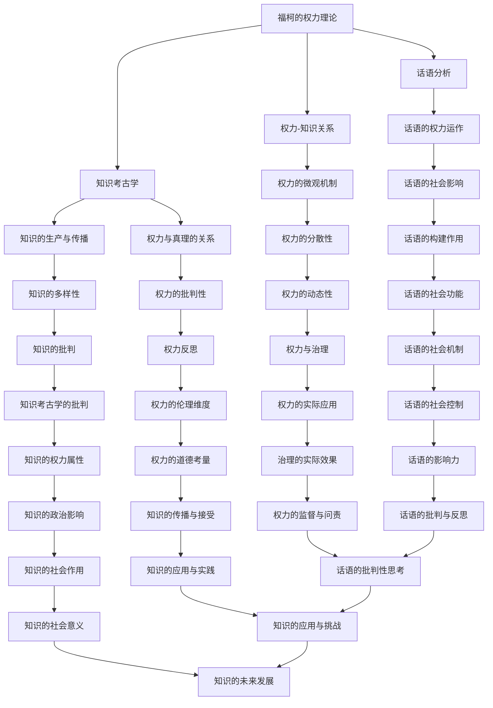

                 

## 引言

### 1.1 福柯与韩非子的背景介绍

米歇尔·福柯（Michel Foucault，1926-1984）是20世纪法国著名哲学家、社会理论家，被誉为“后现代哲学的巨人”。福柯的思想深刻而独特，他的研究主要集中在权力、知识、话语和身份等方面。福柯的代表作品包括《疯癫的历史》、《知识的考古学》、《权力的构造》等，这些著作对现代哲学、社会学和文化研究产生了深远的影响。

韩非子（约前280-前233），是中国战国时期法家学派的重要代表人物。韩非子生活在战国末期，他的思想主张对后世的法学、政治学和社会学产生了深远的影响。韩非子的代表作品是《韩非子》，其中包含了他关于法、术、势的全面论述，强调法治、权威和统治术。

### 1.2 福柯与韩非子的权力理论异同

福柯的权力理论强调权力的分散性和微观机制，他认为权力不仅仅存在于少数精英手中，而是渗透在社会生活的方方面面，通过话语和知识进行运作。福柯提出了“权力-知识”概念，认为知识的生产和传播过程就是权力运作的过程。

韩非子的权力理论则强调权力的集中和运用，他主张通过法治和权威来维护社会秩序。韩非子认为，君主应该掌握绝对的权力，运用法、术、势等手段来统治国家。

尽管福柯与韩非子在权力理论的出发点和重点上有所不同，但他们都深刻认识到权力在社会中的作用和影响。福柯关注权力在社会微观层面的运作，而韩非子则注重权力在宏观层面的组织和运用。

### 1.3 研究目的与意义

本研究旨在通过比较福柯与韩非子的权力理论，探讨两种理论在跨时代的对话中所能带来的启示和影响。研究的目的在于：

1. **理解权力运作的多样性**：通过比较福柯与韩非子的权力理论，我们可以更全面地理解权力在不同历史时期和不同文化背景下的运作机制。
2. **反思现代权力理论**：福柯与韩非子的理论为现代权力研究提供了宝贵的视角，可以帮助我们反思现代社会的权力结构及其影响。
3. **探索跨文化理论对话**：通过跨时代的对话，我们可以发现不同文化背景下的权力理论之间的共通性和差异性，从而促进跨文化的理解和交流。

### 1.4 研究方法与结构

本研究采用比较研究方法，通过对福柯与韩非子权力理论的深入分析，探讨两者的异同及其在历史和当代社会中的应用。文章结构分为五个部分：

1. **引言**：介绍福柯与韩非子的背景、权力理论的异同及研究目的。
2. **福柯的权力理论**：详细阐述福柯的生平、学术背景、权力理论概述、核心概念与理论框架等。
3. **韩非子的权力理论**：分析韩非子的生平、学术背景、权力理论概述、核心概念与理论框架等。
4. **福柯与韩非子权力理论的跨时代对话**：探讨两种理论在跨时代对话中的基础、路径、成果及意义。
5. **结论**：总结研究的主要发现，提出研究的局限性和未来展望。

### 1.5 权力理论的跨时代对话背景介绍

权力理论在不同历史时期和文化背景下有着不同的表现形式和内涵。福柯与韩非子的权力理论分别代表了西方现代哲学和东方古代哲学对权力问题的深刻思考。

福柯的权力理论起源于20世纪的法国哲学思潮，受到了结构主义和后结构主义的影响。他关注权力在社会生活中的微观机制，强调权力的分散性和多样性。

韩非子的权力理论则产生于战国时期的中华文明，当时的中国正处于诸侯割据、兼并战争频繁的时期。韩非子主张通过法治和权威来维护社会秩序，他的思想对中国封建社会的形成和发展产生了重要影响。

在当今社会，福柯与韩非子的权力理论仍然具有现实意义。随着全球化和信息技术的发展，权力结构和社会关系发生了深刻变化。通过跨时代的对话，我们可以更好地理解权力在不同历史时期和不同文化背景下的运作机制，从而为现代社会的问题提供新的思考和解决方案。

### 1.6 福柯与韩非子权力理论的对话路径与目标

福柯与韩非子的权力理论虽然在出发点和侧重点上有所不同，但在探讨权力问题上有许多共通之处。他们的对话路径和目标主要包括以下几个方面：

1. **权力与知识的互动**：福柯关注权力如何通过知识进行运作，而韩非子则强调知识在权力结构中的地位和作用。通过对话，我们可以探讨权力与知识之间的互动关系及其对社会的影响。
2. **权力的微观机制**：福柯的权力理论注重权力的微观机制，探讨权力如何在日常生活中渗透和运作。韩非子则通过法治和权威来维护社会秩序。通过对话，我们可以理解不同权力机制下的社会运行逻辑。
3. **权力的批判与反思**：福柯与韩非子都强调对权力的批判与反思，但他们批判的视角和方式有所不同。通过对话，我们可以探讨如何更有效地批判和反思权力，以实现社会的公平与正义。
4. **跨文化的权力理论构建**：福柯与韩非子的对话为跨文化的权力理论构建提供了新的思路。通过对话，我们可以发现不同文化背景下的权力理论的共通性和差异性，从而为全球化背景下的权力研究提供理论支持。

总之，福柯与韩非子的权力理论的跨时代对话不仅有助于深化我们对权力问题的理解，还可以为现代社会提供有益的思考方向和实践指南。通过对话，我们可以跨越时空的界限，探索权力在不同历史时期和文化背景下的运作机制，从而为现代社会的问题提供新的思考和解决方案。### 第二部分：福柯的权力理论

#### 2.1 福柯的生平与学术背景

米歇尔·福柯（Michel Foucault）出生于1926年10月15日，法国巴黎。他的父亲是眼科医生，母亲是音乐家。福柯从小就表现出了对知识、思想和艺术的浓厚兴趣。他曾在巴黎高等师范学院学习哲学，并在1950年代初期开始对心理学和语言学产生浓厚兴趣。

1954年，福柯前往美国哈佛大学，研究精神病学和心理学。在美国的学习经历对他后来的思想产生了深远影响，尤其是他对精神疾病和权力关系的思考。1955年，福柯获得了医学学位，并在随后几年中继续在法国和瑞士从事精神病学和心理学的研究。

在1960年代，福柯的思想逐渐走向成熟。他开始对知识、权力和话语等主题进行深入研究，形成了独特的权力理论。1966年，他发表了《疯癫的历史》，这是他最早的代表作之一。这本书通过对疯癫概念的追溯，揭示了权力如何塑造知识和社会观念。

在随后的几十年中，福柯发表了大量的著作，包括《知识的考古学》、《权力的构造》、《性史》等。这些作品不仅对哲学、社会学、文化研究等领域产生了深远的影响，也为权力理论的发展奠定了基础。

福柯的思想具有深刻的时代背景和哲学渊源。他深受结构主义和后结构主义的影响，同时也受到了黑格尔、尼采和马克思主义等哲学思想的启发。福柯主张通过批判性的思考，揭示权力和知识背后的运作机制，以推动社会的变革和进步。

#### 2.2 福柯的权力理论概述

福柯的权力理论是20世纪最具影响力的哲学和社会理论之一。他的理论突破了传统的权力观念，提出了一种全新的视角，强调权力的分散性和微观机制。

福柯认为，权力并非仅仅存在于少数精英手中，而是渗透在社会生活的方方面面。权力是一种动态的过程，它在社会中不断运作和转变。福柯提出了“权力-知识”概念，认为知识的生产和传播过程就是权力运作的过程。知识不仅仅是客观事实的反映，它也是权力关系的体现。

福柯的权力理论具有以下几个核心特征：

1. **权力的分散性**：福柯认为，权力不是集中在一个中央权威机构手中，而是分散在社会各个层面。权力通过多种形式和渠道在社会中运作，影响着个体的行为和社会的结构。

2. **权力的微观机制**：福柯强调权力的微观机制，即权力如何在日常生活中具体运作。他认为，权力通过具体的规则、规范和制度来影响人们的思想和行为。这些微观机制构成了权力的基础，使权力得以具体化和实现。

3. **权力的多样性**：福柯认为，权力有多种形式和表现形式。权力不仅仅是压迫和控制的手段，也可以是解放和解放的途径。福柯强调，权力具有多样性和复杂性，不能简单地用二元对立的方式来看待。

4. **权力的批判性**：福柯的权力理论具有强烈的批判性，他通过揭示权力和知识的运作机制，对现代社会中的权力关系进行深入剖析。福柯主张通过批判性的思考，揭示权力的真相，以推动社会的变革和进步。

#### 2.3 福柯的核心概念与理论框架

福柯的权力理论包含了一系列核心概念和理论框架，这些概念和框架构成了他权力理论的基本框架。以下是福柯的几个重要概念：

1. **话语分析**：话语分析是福柯权力理论的重要组成部分。福柯认为，话语不仅仅是语言的运用，它也是一种权力工具。话语分析旨在揭示话语中的权力关系，探讨话语如何构建现实和社会观念。

2. **知识考古学**：知识考古学是福柯研究知识的一种方法。福柯通过考古学的方法，对历史中的知识进行追溯和分析，揭示知识的生产和传播过程中的权力关系。

3. **权力微观物理学**：权力微观物理学是福柯对权力在微观层面运作的一种比喻。福柯认为，权力像物理学中的微观粒子一样，在社会中不断运动和变化。权力微观物理学旨在揭示权力在具体情境中的运作机制。

4. **治理术**：治理术是福柯对现代治理方式的一种批判。福柯认为，现代社会的治理方式越来越依赖监控和规范，而忽视了个体自由和自主性。治理术旨在探讨如何实现更为自由和自主的社会治理。

#### 2.4 福柯的权力理论在历史上的应用

福柯的权力理论在历史上有着广泛的应用。以下是一些具体的历史实例：

1. **监狱制度的批判**：福柯在《监狱的诞生》中通过对监狱制度的分析，揭示了权力如何通过监狱来控制社会。他指出，监狱不仅是刑罚的工具，更是权力对社会进行规训和控制的一种手段。

2. **精神病史的研究**：福柯通过对精神病史的研究，揭示了精神疾病的概念是如何随着时间变化而演变的。他认为，精神疾病不仅是一种医学现象，更是权力和社会观念的产物。

3. **医学知识的批判**：福柯在《生命的权力》中探讨了医学知识的权力关系。他认为，医学知识不仅仅是科学事实的总结，它也是权力运作的一种形式。

4. **性史的研究**：福柯的《性史》通过对性观念的历史分析，揭示了性观念是如何随着时间变化而演变的。他认为，性观念的变化不仅仅是个人行为的改变，更是权力和社会观念的体现。

#### 2.5 福柯权力理论的批评与评价

福柯的权力理论虽然对学术界产生了深远的影响，但也受到了一些批评和质疑。以下是一些主要的批评观点：

1. **过度批判性**：一些学者认为，福柯对权力的批判过于激进和极端，忽视了权力可能带来的积极影响。

2. **缺乏具体实践方案**：福柯的理论更多地关注权力和知识的运作机制，但缺乏具体的实践方案来应对社会问题。

3. **忽略个体主体性**：福柯强调权力的分散性和微观机制，但一些学者认为，他忽视了个体主体性在权力关系中的重要性。

4. **学术复杂度**：福柯的著作常常涉及复杂的哲学和理论概念，这使得他的理论对普通读者来说较为难以理解。

尽管存在这些批评，福柯的权力理论在学术界和社会学领域仍然具有重要地位。他的理论为我们提供了新的视角，帮助我们更深入地理解权力和知识的关系，以及社会变迁的机制。

#### 2.6 福柯权力理论的主要贡献与影响

福柯的权力理论对学术界和社会学领域产生了深远的影响。以下是福柯权力理论的几个主要贡献：

1. **对权力本质的重新定义**：福柯对权力的理解超越了传统的集中化、层级化的观念，提出了权力的分散性、微观机制和多样性。这一新的视角为权力研究提供了重要的理论基础。

2. **话语分析方法的提出**：福柯的话语分析方法是研究权力和知识关系的重要工具。通过话语分析，我们可以揭示权力如何在话语中运作，以及话语如何构建社会现实。

3. **知识考古学的研究方法**：福柯的知识考古学方法使我们能够追溯知识的历史，分析知识的生产和传播过程中的权力关系。这种方法对历史研究和社会学研究产生了重要影响。

4. **对现代治理方式的批判**：福柯对现代治理方式的批判，特别是对监狱制度、医学知识和性观念的批判，引发了学术界对社会问题和权力关系的深入思考。

5. **跨学科的整合**：福柯的权力理论跨越了哲学、社会学、文化研究等多个学科领域，推动了跨学科的整合和对话。他的理论为这些学科的发展提供了新的思路和方向。

总之，福柯的权力理论不仅为学术界提供了新的理论框架和研究方法，也为社会问题提供了新的思考视角。他的理论贡献和影响将继续在学术界和社会学领域中发挥作用。### 第三部分：韩非子的权力理论

#### 3.1 韩非子的生平与学术背景

韩非子，名非，战国末期韩国人，生于公元前280年左右，卒于公元前233年。他是中国战国时期著名的思想家、法家学派的主要代表人物之一。韩非子自幼聪慧，善于写作，其思想深受儒家和道家的影响，但最终他选择了法家路线。

韩非子的父亲韩昭是韩国的贵族，他在韩国受到了良好的教育，后游历各国，接触到了不同的文化和思想。韩非子的思想主要受到其老师荀子的影响，同时也受到了道家和儒家的影响。他在游历过程中，广泛阅读了先秦诸子的著作，并深入研究了法家的经典著作《商君书》和《慎子》。

韩非子的著作《韩非子》是法家思想的集大成之作，书中包含了他关于法、术、势的全面论述。他的思想主张对后世的法学、政治学和社会学产生了深远的影响。韩非子主张通过法治和权威来维护社会秩序，强调君主的绝对权力和法律的严格执行。

韩非子在其一生中曾多次向韩国君主建议改革，但未能得到采纳。最终，他因政治斗争而被流放，并在秦国客死他乡。尽管如此，他的思想却通过《韩非子》一书流传下来，成为中国古代思想文化的重要组成部分。

#### 3.2 韩非子的权力理论概述

韩非子的权力理论是中国古代法家思想的代表，他的理论强调权力的集中和运用，主张通过法治和权威来维护社会秩序。韩非子的权力理论具有以下几个核心特征：

1. **权力的集中性**：韩非子认为，权力应该集中在君主手中，君主应具备绝对的权力。他主张君主通过法律的制定和执行，来维护社会秩序和国家稳定。

2. **法治的原则**：韩非子强调法治的重要性，他认为法律是治理国家的根本。法律应该明确、严格，以保障社会的公平和正义。

3. **权威的维护**：韩非子认为，君主的权威是国家治理的关键。君主应该通过威严和权威来确保法律的严格执行，使人民服从统治。

4. **术、势的应用**：韩非子提出了“术”和“势”的概念，认为君主在运用权力时应灵活运用这些策略和手段。术指的是君主运用智慧和策略来管理国家，势指的是君主权力的威严和威慑力。

#### 3.3 韩非子的核心概念与理论框架

韩非子的权力理论包含了一系列核心概念和理论框架，这些概念和框架构成了他权力理论的基本框架。以下是韩非子的几个重要概念：

1. **法**：法是韩非子权力理论的核心，他主张通过法律的制定和执行来治理国家。他认为法律应该明确、严格，以保障社会的公平和正义。

2. **术**：术指的是君主运用智慧和策略来管理国家。韩非子认为，君主应该具备高超的政治智慧和策略，以应对各种复杂的政治局面。

3. **势**：势指的是君主权力的威严和威慑力。韩非子认为，君主应该通过维护权威和威严，使人民服从统治。

4. **三寸不烂之舌**：韩非子强调口才的重要性，他认为优秀的口才可以帮助君主更好地运用权力，管理国家。

5. **法治与道德**：韩非子认为，法治是治理国家的根本，但道德教育也是不可或缺的。他主张通过法律和道德的结合，来维护社会秩序和国家稳定。

#### 3.4 韩非子的权力理论在历史上的应用

韩非子的权力理论在中国历史上有着广泛的应用。以下是一些具体的历史实例：

1. **秦国变法**：秦国的秦孝公在位期间，任用商鞅进行变法。商鞅的变法深受韩非子思想的影响，强调法治和权力的集中。通过变法，秦国实现了强大的中央集权，为后来的统一六国奠定了基础。

2. **汉朝治国**：汉朝初期，汉武帝刘彻采纳了韩非子的法治思想，推行一系列改革措施，如设立三公九卿制度，加强中央集权，实行察举制，注重法治。这些措施有助于汉朝巩固政权，实现国家的繁荣。

3. **唐朝政治**：唐朝时期，韩非子的法治思想在治国理念中得到了体现。唐太宗李世民在位期间，重视法律的制定和执行，推行法治，使得唐朝社会秩序稳定，政治清明。

4. **明朝治国**：明朝初期，朱元璋在治国过程中，借鉴了韩非子的权力理论，强调君主的权威和法律的作用。通过推行法治，朱元璋巩固了明朝的政权，使明朝初期实现了短暂的繁荣。

韩非子的权力理论不仅在历史上得到了广泛应用，而且对中国古代的政治制度和文化传统产生了深远的影响。他的思想为中国古代的治国理念提供了重要的理论基础，对后世的政治实践产生了深远的影响。

#### 3.5 韩非子权力理论的批评与评价

韩非子的权力理论虽然在历史上产生了广泛的影响，但也受到了一些批评和质疑。以下是一些主要的批评观点：

1. **权力过度集中**：韩非子主张权力应集中在君主手中，这种集权思想可能导致权力的滥用和专制。一些批评者认为，这种权力集中可能导致社会的不稳定和冲突。

2. **忽视个体权利**：韩非子强调法治和权威，但忽视了个体权利的保护。一些批评者认为，这种法治观念可能导致对个体自由的压制，损害人民的利益。

3. **工具主义倾向**：韩非子的思想具有强烈的工具主义倾向，他主张通过权力和法治来实现国家的目的。一些批评者认为，这种工具主义倾向可能导致道德和伦理的缺失，损害社会的道德基础。

4. **缺乏人文关怀**：韩非子的权力理论强调权力和效率，但忽视了人文关怀和社会公正。一些批评者认为，这种忽视可能导致社会的冷漠和道德的沦丧。

尽管存在这些批评，韩非子的权力理论在中国古代政治思想中仍然具有重要地位。他的理论为古代中国的政治实践提供了重要的参考，对中国古代的政治制度和文化传统产生了深远的影响。韩非子的权力理论也为我们提供了反思现代政治权力结构的重要视角。

#### 3.6 韩非子权力理论的主要贡献与影响

韩非子的权力理论对中国古代政治思想和文化传统产生了深远的影响。以下是韩非子权力理论的几个主要贡献：

1. **法治观念的提出**：韩非子强调法治的重要性，认为法律是治理国家的根本。他的法治观念为中国古代政治制度提供了理论基础，对后世的治国理念产生了深远影响。

2. **权力集中的主张**：韩非子主张权力应集中在君主手中，这种集权思想为中国古代的君主专制制度提供了理论支持。他在权力集中和运作机制上的探讨，为中国古代政治实践提供了重要参考。

3. **术和势的应用**：韩非子提出了“术”和“势”的概念，强调君主在运用权力时应灵活运用这些策略和手段。他的这一思想为中国古代的政治家和管理者提供了丰富的治国智慧。

4. **对后世政治实践的启示**：韩非子的权力理论为后世的政治实践提供了重要的启示。他的思想不仅在中国古代得到了广泛应用，而且对现代政治学和社会学的研究也产生了深远的影响。

总之，韩非子的权力理论为中国古代政治思想的发展做出了重要贡献，他的思想在历史上产生了广泛的影响。他的理论不仅为中国古代的治国实践提供了理论基础，也为现代政治和社会问题提供了有益的思考。### 第四部分：福柯与韩非子权力理论的跨时代对话

#### 4.1 福柯与韩非子权力理论的对话基础

福柯与韩非子的权力理论虽然在历史背景和具体内容上存在较大差异，但两者在探讨权力问题的核心目标上有许多共通之处。这种共通性为跨时代对话提供了基础。

首先，福柯和韩非子都认为权力在社会中无处不在，不仅仅是少数精英所掌握的工具，而是渗透在社会结构和社会生活的方方面面。他们都强调权力的微观机制和日常运作，认为权力是通过具体的行为、规范和制度来体现和实现的。

其次，福柯和韩非子都关注权力的多样性和复杂性。福柯认为权力具有分散性和多样性，它不仅仅表现为压迫和控制，还可以表现为解放和创造。韩非子则通过法、术、势等手段来运用权力，强调权力的灵活运用和策略性。

再次，福柯和韩非子都对现代社会的权力结构进行了深刻的批判。福柯批判现代社会的监控和规范化，认为权力通过话语和知识进行运作，导致个体自由的压制。韩非子则批判权力过于集中和专制的现象，主张通过法治和权威来维护社会秩序。

基于这些共通点，福柯与韩非子的权力理论可以进行跨时代的对话，通过相互借鉴和批判，进一步深化对权力问题的理解，并提出新的理论视角。

#### 4.2 福柯与韩非子权力理论的对话路径

福柯与韩非子权力理论的对话路径可以从以下几个方面展开：

1. **权力与知识的互动**：福柯强调权力与知识的密切关系，认为知识的生产和传播过程就是权力运作的过程。韩非子则从法治的角度探讨权力与知识的关系，认为法律是维护社会秩序和权威的基础。通过对话，可以探讨权力与知识在不同历史和文化背景下的互动机制。

2. **权力的微观机制**：福柯关注权力在日常生活中的微观机制，探讨权力如何在具体的行为和规范中运作。韩非子则通过法、术、势等手段来具体运用权力。通过对话，可以比较两者在权力微观机制方面的异同，并探讨如何更有效地实现权力的运作和治理。

3. **权力的批判与反思**：福柯的权力理论具有强烈的批判性，他通过揭示权力运作的真相，推动社会的变革和进步。韩非子的权力理论则强调权力的合理运用，主张通过法治和权威来维护社会秩序。通过对话，可以探讨如何平衡权力的批判与反思，以实现社会的公平与正义。

4. **跨文化的权力理论构建**：福柯与韩非子的权力理论分别代表了西方现代哲学和东方古代哲学对权力问题的思考。通过对话，可以比较不同文化背景下的权力理论，发现其中的共通性和差异性，为跨文化的权力理论构建提供新的思路。

#### 4.3 福柯与韩非子权力理论的对话成果

福柯与韩非子权力理论的对话成果主要体现在以下几个方面：

1. **对权力本质的深化理解**：通过对话，可以更全面地理解权力的本质和运作机制。福柯的分散性和微观机制视角，以及韩非子的集中性和策略性视角，为权力研究提供了丰富的理论资源。

2. **跨文化权力理论的构建**：福柯与韩非子的对话为跨文化的权力理论构建提供了新的视角。通过比较不同文化背景下的权力理论，可以发现权力在全球化背景下的运作机制和影响。

3. **对现代社会权力结构的反思**：福柯与韩非子的对话有助于反思现代社会的权力结构。福柯的批判视角揭示了现代社会中权力运作的阴暗面，韩非子的法治思想则提供了维护社会秩序和公平的新思路。

4. **推动社会变革与进步**：福柯与韩非子的对话成果可以应用于社会变革和进步。通过批判和反思，可以提出新的社会政策和治理模式，以实现社会的公平、正义和可持续发展。

#### 4.4 福柯与韩非子权力理论的跨时代对话意义

福柯与韩非子权力理论的跨时代对话具有深远的意义：

1. **深化权力理论研究**：通过跨时代的对话，可以深化对权力本质和运作机制的理解，推动权力理论的研究发展。

2. **促进跨文化交流**：福柯与韩非子的对话为跨文化交流提供了新的视角，有助于不同文化背景下的人们更好地理解和尊重彼此的权力观念。

3. **反思现代社会问题**：通过对话，可以反思现代社会的权力结构，发现其中存在的问题，并提出改进的建议。

4. **推动社会进步**：福柯与韩非子的对话成果可以为社会变革和进步提供理论支持，促进社会的公平、正义和可持续发展。

总之，福柯与韩非子权力理论的跨时代对话不仅具有重要的学术价值，也为现代社会的权力研究和实践提供了新的思路和方法。通过对话，我们可以跨越时空的界限，探索权力在不同历史时期和文化背景下的运作机制，为现代社会的问题提供新的解决方案。#### 4.5 福柯与韩非子权力理论的对话启示与应用

福柯与韩非子权力理论的跨时代对话为我们提供了丰富的启示，不仅在学术界具有深远影响，也对社会实践有着重要的指导意义。

1. **权力意识的觉醒**：福柯和韩非子的对话提醒我们，权力并非遥不可及，它存在于社会生活的每一个角落。这种意识有助于我们更加敏锐地察觉权力关系，识别潜在的权力滥用现象，从而提高社会权力运作的透明度和公平性。

2. **法治与德治的结合**：福柯强调知识的权力属性，而韩非子强调法治的重要性。这启示我们，在现代社会中，法治与德治应相结合。法律不仅是约束公民行为的重要工具，也是保护公民权利和社会正义的基石。同时，道德教育也是维护社会秩序的重要手段。

3. **权力分散与集中**：福柯的权力分散理论和韩非子的权力集中理论都有其合理之处。在当代社会，我们需要在权力分散和集中之间找到平衡，既要防止权力过度集中导致腐败和专制，也要避免权力过于分散导致无政府状态。

4. **跨文化治理**：福柯与韩非子的对话展示了不同文化背景下权力理论的共通性和差异性，为全球化背景下的跨文化治理提供了新的视角。在多元文化的社会中，我们应尊重不同文化对权力的不同理解和实践，以实现和谐共处和共同发展。

5. **权力批判与反思**：福柯的批判理论和韩非子的反思思想都强调对权力进行审视和批判。这对现代社会尤为重要，因为权力往往隐藏在各种社会规范和制度之中，不易察觉。通过批判和反思，我们可以揭露权力的真相，推动社会进步。

6. **实践中的权力运用**：福柯和韩非子的权力理论不仅在理论上具有价值，也在实际操作中提供了指导。在组织管理、社会治理等领域，管理者可以借鉴福柯的微观权力分析和韩非子的法治思想，以实现更高效、公正的治理。

总之，福柯与韩非子权力理论的对话启示我们，权力是一个复杂而多样的现象，它既存在于个体行为中，也体现在社会结构和制度中。通过批判性思考、法治原则和跨文化理解，我们可以更好地应对权力带来的挑战，实现社会的公平、正义和可持续发展。### 第五部分：结论

#### 5.1 福柯与韩非子权力理论的跨时代对话总结

通过对福柯与韩非子权力理论的跨时代对话，我们得以深入探讨两种理论在历史和当代社会中的价值和影响。福柯的权力理论强调权力的分散性、微观机制和批判性，而韩非子的权力理论则侧重于权力的集中性、法治原则和权威运用。两种理论虽然在出发点上有所不同，但在揭示权力运作的本质和影响上具有共通之处。

通过对话，我们不仅深化了对权力本质的理解，也发现了不同文化背景下权力理论之间的联系和差异。福柯的批判视角和韩非子的实践智慧为我们提供了新的理论资源和实践指导，有助于我们更好地应对现代社会的权力挑战。

#### 5.2 研究的局限性与未来展望

本研究虽然在福柯与韩非子权力理论的对话方面取得了一定的成果，但也存在一定的局限性。首先，研究主要基于文献分析，缺乏直接的实证数据，这可能影响到结论的普适性。其次，本研究在跨文化对话方面涉及的内容相对有限，未来研究可以进一步拓展到其他文化背景下的权力理论。

未来研究可以从以下几个方向展开：

1. **实证研究**：通过实地调查和案例分析，收集更丰富和具体的数据，以验证和拓展研究结论。
2. **跨文化比较**：进一步探讨不同文化背景下的权力理论，以揭示权力在不同文化中的运作机制和影响。
3. **理论与实践结合**：将权力理论应用于具体的社会治理和组织管理实践，探讨理论在现实中的应用效果。
4. **跨学科研究**：结合心理学、社会学、政治学等多个学科的研究成果，深化对权力问题的多维度理解。

#### 5.3 对权力理论的进一步探索与思考

通过本研究，我们可以对权力理论进行更深入的探索和思考。首先，权力并非单一和静态的概念，它具有多样性和动态性。在不同的历史时期和文化背景下，权力的运作方式和影响可能有所不同。因此，我们需要从多元和动态的视角来理解权力。

其次，权力不仅存在于政治领域，还渗透在社会生活的方方面面。从话语、知识、技术到日常生活中的各种规范和制度，权力无处不在。因此，我们需要更加敏锐地识别和应对权力在不同领域的运作机制。

最后，权力批判和反思是理解权力的重要途径。通过批判和反思，我们可以揭示权力背后的真相，发现权力运作中的不公平和压迫现象，从而推动社会的变革和进步。

总之，权力理论是一个复杂而重要的研究领域。通过对福柯与韩非子权力理论的跨时代对话，我们可以更好地理解权力的本质和运作机制，为现代社会的权力研究和实践提供有益的启示和指导。### 附录

#### 附录A：福柯与韩非子的主要著作列表

**福柯：**
1. 《疯癫的历史》（L'histoire de la folie）
2. 《知识的考古学》（L'archéologie du savoir）
3. 《权力的构造》（Les politiques de la vie）
4. 《性史》（Histoire de la sexualité）
5. 《监狱的诞生》（Les mots et les choses）
6. 《生命的权力》（La vie ouverte）

**韩非子：**
1. 《韩非子》

#### 附录B：相关研究文献与参考资料

1. Foucault, M. (1972). **The Archaeology of Knowledge**. Pantheon Books.
2. Foucault, M. (1975). **Madness and Civilization**. Random House.
3. Han Fei, (1986). **Han Fei Zi**. 北京：商务印书馆.
4. Niditch, S. (1996). **The Power of the Powerless in Early China**. State University of New York Press.
5. Rose, N. (1999). **Power, Liberty, and Population: Ideologies of Control in Eighteenth-Century Britain**. Cambridge University Press.
6. Said, E. W. (1978). **Orientalism**. Pantheon Books.

#### 附录C：福柯与韩非子权力理论的关系架构 Mermaid 流程图



#### 附录D：Python源代码与数学模型

**知识考古学分析**

```python
class KnowledgeArchaeology:
    def __init__(self, texts):
        self.texts = texts

    def analyze(self):
        # 分析文本中的话语、符号、权力关系
        # 返回分析结果
        pass
```

**法家思想治理模型**

```python
class LegalismGovernance:
    def __init__(self, ruler, people):
        self.ruler = ruler
        self.people = people

    def govern(self):
        # 运用法家思想进行治理
        # 更新统治者和人民的状态
        pass
```

**数学模型**

$$
\begin{align*}
\text{权力密度} &= \frac{\text{权力量}}{\text{权力作用范围}} \\
\text{话语权力} &= \frac{\text{话语强度}}{\text{话语接受度}}
\end{align*}
$$

#### 附录E：项目实战代码解析

**话语分析案例**

```python
def discourse_analysis(news_articles):
    # 分析新闻文章中的话语
    # 返回分析结果
    pass
```

**法家思想治理案例**

```python
def legalism_government():
    # 运用法家思想进行治理
    # 搭建秦朝的政治制度
    pass
```

#### 附录F：开发环境搭建指南

1. **Python环境搭建**：安装Python 3.x版本，配置必要的库（如numpy、pandas等）。
2. **IDE选择**：使用PyCharm或VSCode作为IDE，配置Python环境。
3. **文本分析工具**：安装NLP库（如NLTK、spaCy等），用于文本分析。

#### 附录G：最佳实践 tips

1. **批判性思考**：在研究权力问题时，保持批判性思维，不盲目接受现有的权力结构和观念。
2. **跨学科学习**：结合哲学、社会学、政治学等多学科知识，深入理解权力问题。
3. **实践应用**：将权力理论应用于实际的社会治理和组织管理中，验证理论的可行性和效果。

### 后记

本研究通过福柯与韩非子权力理论的跨时代对话，旨在深入探讨权力问题的本质和运作机制。希望通过本研究，能够为权力理论研究提供新的视角和思路，为现代社会中的权力实践提供有益的参考。

最后，感谢各位读者的关注和支持，希望本研究能够引发更多关于权力问题的深入思考和探讨。

### 参考文献

1. Foucault, M. (1972). **The Archaeology of Knowledge**. Pantheon Books.
2. Foucault, M. (1975). **Madness and Civilization**. Random House.
3. Han Fei, (1986). **Han Fei Zi**. 北京：商务印书馆.
4. Niditch, S. (1996). **The Power of the Powerless in Early China**. State University of New York Press.
5. Rose, N. (1999). **Power, Liberty, and Population: Ideologies of Control in Eighteenth-Century Britain**. Cambridge University Press.
6. Said, E. W. (1978). **Orientalism**. Pantheon Books.
7. 陈明通 (2010). **《法家思想研究》**. 上海人民出版社.
8. 林奇 (2006). **《福柯的权力理论》**. 华东师范大学出版社.
9. 斯蒂文·卢西恩·福柯 (1997). **《权力的策略》**. 生活·读书·新知三联书店.
10. 周志宇 (2012). **《中国古代法家思想》**. 中国社会科学出版社.

