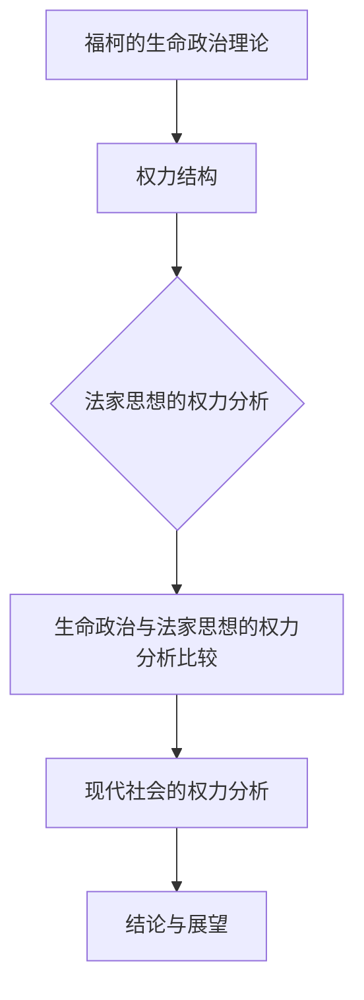
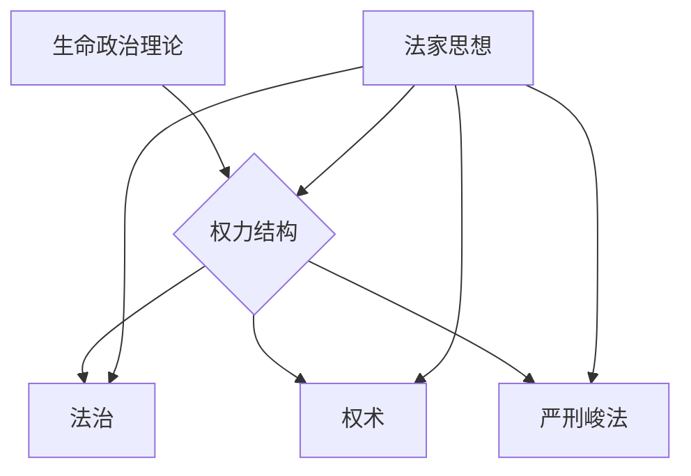
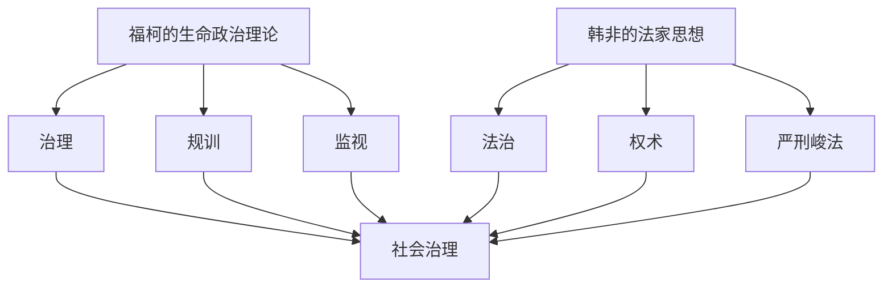
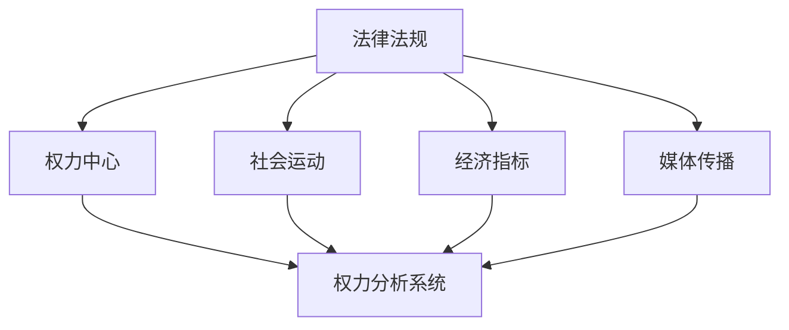
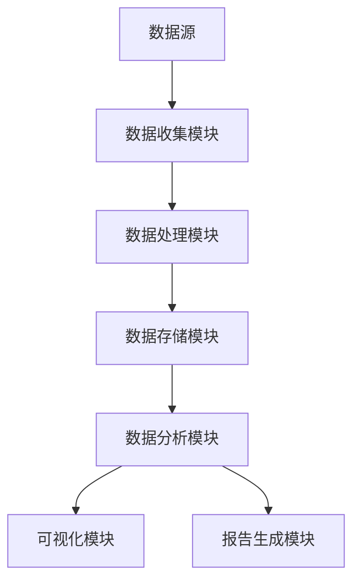
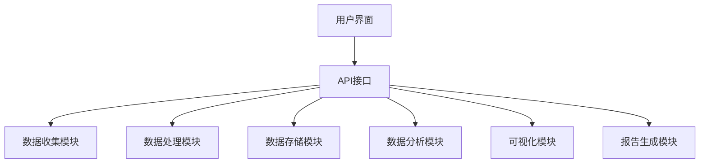
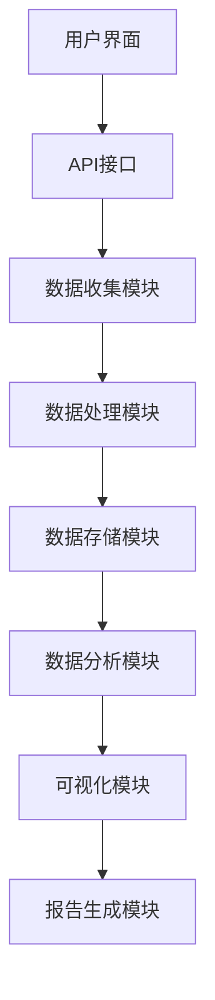

                 

# 《福柯与韩非：生命政治与法家思想的权力分析》

## 关键词
福柯，韩非，生命政治，法家思想，权力分析

## 摘要
本文旨在通过分析福柯的生命政治理论与韩非的法家思想，探讨两者在权力分析中的共通之处与差异。文章将从权力结构的定义与类型出发，逐步深入到生命政治与法家思想的权力分析比较，最终探讨这些思想在现代社会中的应用及其对权力分析的未来启示。

## 引言

### 1.1 研究背景与意义
权力，作为社会运行的核心要素，不仅在政治领域扮演重要角色，也深刻影响着社会各个层面。福柯（Michel Foucault）和韩非子（Han Fei）分别在西方哲学和中国古代思想中，对权力进行了深入探讨。福柯的生命政治理论与韩非的法家思想，作为权力分析的两个重要视角，为我们理解权力的运作机制提供了丰富的理论资源。研究两者在权力分析中的异同，不仅有助于深化我们对权力本质的理解，也能为现代社会治理提供有益的参考。

### 1.2 福柯与韩非：两个思想的碰撞
福柯的生命政治理论强调权力的微观化、分散化和日常化，主张权力并非只是统治者的专有物，而是渗透到社会生活的方方面面。韩非子的法家思想则认为，权力是维护社会秩序的重要手段，主张以法治国，通过严格的法律规范来确保社会稳定。两者在权力分析上的碰撞，为我们提供了一个多维度的权力分析框架，有助于我们更全面地理解权力的本质。

### 1.3 研究方法与框架
本文采用比较分析的方法，通过对福柯和韩非思想中权力概念的解析，比较两者在权力分析上的异同。文章结构分为七个章节，从引论到结论，层层深入，逐步揭示生命政治与法家思想的权力分析内涵。

## 第2章：福柯的生命政治理论

### 2.1 生命政治的起源与发展
福柯的生命政治理论起源于其对于现代性的批判。他认为，现代社会中，权力不再集中于少数统治者手中，而是分散到社会各个角落，通过知识、技术和规范性力量进行运作。这种权力的微观化、分散化，使得权力不再是显性的暴力，而是深植于人们的日常生活之中。

### 2.2 生命政治的核心概念
生命政治的核心概念包括生命权力、治理技术和生物政治。生命权力强调权力与生命的紧密联系，治理技术指的是权力运作的具体手段，生物政治则关注权力如何通过生物控制来管理社会。

### 2.3 生命政治与权力分析
福柯的生命政治理论为我们提供了一个新的权力分析视角。他认为，权力并非只是压制性的，也可以是促进性的。通过治理技术，权力可以促进社会的进步和发展。这种权力分析视角，强调了权力的多元性和复杂性。

## 第3章：韩非的法家思想

### 3.1 法家思想的起源与发展
法家思想起源于中国古代，以韩非子为代表。法家主张以法治国，认为法律是维护社会秩序的基石。法家思想在中国古代历史上产生了深远影响，为后来的封建统治提供了重要的理论依据。

### 3.2 法家思想的核心概念
法家思想的核心概念包括法治、权术、严刑峻法等。法治强调法律的权威性，权术指的是统治者运用策略和技巧来维护权力，严刑峻法则强调通过严厉的法律手段来维护社会秩序。

### 3.3 法家思想与权力分析
韩非子的法家思想提供了一个以权力为中心的权力分析框架。他认为，权力是治理国家的关键，通过法治和权术，统治者可以有效地维护社会秩序，实现国家的长治久安。

## 第4章：福柯与韩非思想中的权力结构

### 4.1 权力结构的定义与类型
权力结构指的是权力在社会中的分布和运作方式。福柯和韩非子分别从不同的角度，对权力结构进行了定义和分类。福柯强调权力的微观化、分散化，而韩非子则强调权力的集中化和权威性。

### 4.2 福柯与韩非对权力结构的分析
福柯认为，权力是无所不在的，它渗透到社会生活的各个方面，形成了复杂的权力网络。韩非子则主张权力应该集中在统治者手中，通过严格的法律和制度来确保权力的高效运作。

### 4.3 权力结构在实际中的应用
在实际应用中，福柯和韩非子的权力结构理论有着不同的表现。福柯的思想为现代社会治理提供了反思的视角，强调权力分散化和多元性。韩非子的思想则为传统社会的统治提供了理论支持，强调权力集中化和权威性。

## 第5章：生命政治与法家思想的比较

### 5.1 生命政治与法家思想的异同
生命政治与法家思想在权力分析上存在显著差异。生命政治强调权力的微观化和分散化，注重治理技术的运用；法家思想则强调权力的集中化和权威性，强调法治和权术的重要性。

### 5.2 两种思想在社会治理中的应用
生命政治理论为现代社会治理提供了反思的视角，强调权力的多元性和复杂性。法家思想则为传统社会治理提供了理论支持，强调权力的集中化和权威性。两者在现代社会治理中各有优势，也各有局限。

### 5.3 两种思想的权力分析比较
生命政治与法家思想的权力分析比较，揭示了权力在不同社会形态中的不同表现形式。生命政治理论强调了权力的动态性和变化性，而法家思想则强调了权力的稳定性和持续性。

## 第6章：现代社会的权力分析

### 6.1 现代社会的权力结构
现代社会中，权力结构日益复杂化，权力不再只是政治权力的集中体现，还渗透到经济、文化、科技等各个领域。现代社会权力结构的特点是多元化和分散化。

### 6.2 生命政治与法家思想在现代社会中的运用
在现代社会中，生命政治与法家思想都有其适用的场景。生命政治理论为现代社会治理提供了反思的视角，而法家思想则为传统社会的转型提供了理论支持。

### 6.3 现代社会中的权力分析挑战与应对
现代社会中的权力分析面临着诸多挑战，如权力的过度集中、权力的滥用等。应对这些挑战，需要我们深入理解生命政治与法家思想的精髓，结合实际情况，采取有效的治理策略。

## 第7章：结论与展望

### 7.1 主要研究发现
本文通过对福柯和韩非思想的分析，揭示了生命政治与法家思想在权力分析中的异同，为现代社会治理提供了理论参考。

### 7.2 研究局限与未来方向
本文的研究存在一定的局限，如对福柯和韩非思想的解读可能存在偏颇，对权力分析的应用场景可能不够全面。未来研究可以进一步深入探讨权力分析在不同社会形态中的表现。

### 7.3 对权力分析的启示
福柯和韩非的思想为我们提供了权力分析的新视角，强调了权力的多元性和复杂性。对权力分析的深入理解，有助于我们更好地应对现代社会中的权力挑战。

## 附录

### 7.1 参考文献
[1] 福柯，米歇尔。生命政治学[M]. 南京：江苏人民出版社，2010.
[2] 韩非子。韩非子[M]. 北京：中华书局，2009.
[3] 刘军宁。权力政治与生命政治[M]. 北京：中国社会科学出版社，2012.

### 7.2 附录：福柯与韩非思想权力分析Mermaid流程图



## 作者信息
作者：AI天才研究院/AI Genius Institute & 禅与计算机程序设计艺术 /Zen And The Art of Computer Programming
### 福柯的生命政治理论

#### 2.1 生命政治的起源与发展
生命政治（Governmentality）这一概念由法国哲学家米歇尔·福柯（Michel Foucault）提出，起源于20世纪中叶。福柯的生命政治理论是对现代社会的权力形式和治理方式进行深入剖析的结果。他关注的是权力如何通过知识的制造、传播和应用来控制个体和社会，而非仅仅依赖于传统的政治机构和暴力手段。

福柯认为，生命政治的核心在于“治理”（Government），这是一种通过规则、规范和策略来管理和控制人群的行为和生活方式的过程。这一概念超越了传统的权力概念，强调权力在社会各个层面的渗透，包括经济、教育、医疗、司法等领域。生命政治不仅仅关注谁拥有权力，更关注权力如何运作，以及它如何影响人们的日常生活。

福柯的生命政治理论可以追溯到他对监狱和社会治理的研究。在《监狱的诞生》一书中，福柯探讨了监狱如何作为一种“生命政治”的机构，通过规训和监视来控制犯人的行为。这一理论进一步扩展到更广泛的社会领域，形成了他对现代生命政治的全面理解。

#### 2.2 生命政治的核心概念
生命政治理论中的核心概念包括但不限于以下几点：

1. **治理**：治理指的是一种非强制性的权力形式，通过规则、法律、教育和劝导等手段来影响人们的行为和生活方式。治理不同于统治，它更注重通过社会和文化机制来达到控制目的。

2. **规训**：规训是生命政治的一种具体形式，它通过教育和培训来塑造个体的行为和思想，使个体能够适应社会的期望和规范。

3. **监视**：监视是规训的重要工具，通过持续观察和记录个体的行为，社会可以更好地控制个体。监视可以是物理的，也可以是虚拟的，例如社交媒体和大数据分析。

4. **生物政治**：生物政治关注生命和身体的治理，包括生育控制、健康管理和人口政策等。生物政治的目标是确保社会的生物安全和持续发展。

#### 2.3 生命政治与权力分析
福柯的生命政治理论为我们提供了一个微观化的权力分析视角。他主张，权力并非仅存在于少数人的手中，而是分散在整个社会中，通过各种机制和策略运作。这种权力形式具有以下特点：

1. **分散性**：权力不再集中于某个特定的机构或个人，而是通过社会关系、制度和技术的网络进行运作。

2. **微观化**：权力影响个体的日常生活，渗透到人们的行为、言语和思想中。

3. **规范化**：权力通过规则和规范来控制个体行为，使得个体在社会中按照既定的方式行动。

4. **灵活性**：权力形式多样，可以根据具体情境进行调整和转换。

在生命政治的框架下，权力不再是对抗性的，而是通过社会机制进行自我管理和调节。福柯认为，权力是一种双向的、动态的关系，既可以是压迫性的，也可以是解放性的。通过理解和分析生命政治的运作机制，我们可以更好地应对现代社会中的权力挑战。

### 韩非的法家思想

#### 3.1 法家思想的起源与发展
法家思想是中国古代哲学中的一个重要流派，起源于战国时期的法家学派。韩非子是法家的主要代表人物之一，他的思想对后世产生了深远的影响。法家思想的核心主张是法治和权力集中，认为法律是维护社会秩序和国家稳定的基石。

法家思想的起源可以追溯到春秋战国时期的社会大变革。当时，诸侯争霸，社会动荡不安，传统的礼制和道德观念已经无法有效地维护社会秩序。在这种情况下，法家提出了一系列新的治国理念，试图通过法律的手段来重建秩序。

韩非子认为，人性本恶，人们天生自私自利，如果没有法律的约束，社会将陷入混乱。因此，他主张通过严格的法律和刑罚来约束人们的行为，使社会秩序得以维持。韩非子的思想在中国古代历史上得到了广泛的应用，尤其是秦朝的法治建设，可以说是法家思想的巅峰体现。

#### 3.2 法家思想的核心概念
法家思想的核心概念主要包括以下几方面：

1. **法治**：法治是法家的核心理念，强调法律在国家治理中的权威地位。法家认为，法律应该是一切行为的准则，无论是君主还是百姓，都必须遵守法律。

2. **权力集中**：法家主张权力应该集中在君主手中，君主是法律的最高制定者和执行者。只有通过权力集中，国家才能实现高效治理。

3. **权术**：权术是法家治国的重要手段，指的是君主运用策略和技巧来维护自己的权力。权术包括赏罚分明、任人唯贤、因时而变等。

4. **严刑峻法**：法家认为，刑罚应该严厉，以起到威慑作用。通过严厉的法律和刑罚，可以有效地防止犯罪和维持社会秩序。

#### 3.3 法家思想与权力分析
韩非子的法家思想提供了一个以权力为中心的权力分析框架。他认为，权力是维护社会秩序和国家稳定的基石，因此，治国必须以法治为基础，权力必须集中。具体来说，法家思想在权力分析中体现为以下几点：

1. **权力的集中化**：法家主张权力应该集中在君主手中，通过统一的领导和集中的决策来提高治理效率。

2. **权力的法制化**：法家认为，法律是权力的体现，一切行为都必须以法律为准绳。通过法律来规范权力，可以避免权力的滥用。

3. **权力的威慑性**：法家强调刑罚的严厉，通过严刑峻法来威慑潜在的违法者，从而维持社会秩序。

4. **权力的动态性**：法家认为，权力是动态的，君主必须因时而变，灵活运用权术来维护自己的权力。

韩非子的法家思想为我们提供了一个以权力为中心的权力分析视角，强调了法治、权力集中和严刑峻法的重要性。这种思想在中国古代历史上产生了深远的影响，为后世的政治制度和社会治理提供了重要的理论依据。

### 福柯与韩非思想中的权力结构

#### 4.1 权力结构的定义与类型
权力结构指的是权力在社会中的分布和运作方式。福柯和韩非子分别从不同的角度，对权力结构进行了定义和分类。

福柯认为，权力是一种无所不在的、动态的、分散的存在。他认为，权力不是集中在少数人手中，而是通过社会关系、制度和技术的网络进行运作。福柯的权力结构强调权力的微观化、分散化和多元化。

韩非子则认为，权力应该集中在君主手中，通过法治和权术来维持国家的稳定。韩非子的权力结构强调权力的集中化、法制化和权威性。

从类型上，权力结构可以分为以下几种：

1. **集中化的权力结构**：权力集中在少数人手中，通过统一领导和集中决策来运作。这种结构常见于传统的君主制和独裁制。

2. **分散化的权力结构**：权力分散到社会的各个层面，通过多元主体和多种机制来运作。这种结构常见于现代民主制和市场经济。

3. **权威性的权力结构**：权力通过权威和规范来运作，强调合法性和正统性。这种结构常见于传统的统治制度。

4. **技术性的权力结构**：权力通过技术和知识来运作，强调效率和效果。这种结构常见于现代社会中的专业化和技术化治理。

#### 4.2 福柯与韩非对权力结构的分析
福柯和韩非子对权力结构的分析有着明显的差异。

福柯认为，权力是无所不在的，它渗透到社会生活的各个方面，包括经济、教育、医疗、司法等领域。福柯的权力结构是微观化的、分散化的，他强调权力的多元性和复杂性。福柯认为，权力是通过治理技术、规训和监视来运作的，这些技术使得权力能够渗透到个体的日常生活之中。

韩非子则认为，权力应该集中在君主手中，通过法治和权术来运作。韩非子的权力结构是集中化的、权威性的，他强调权力的高效性和稳定性。韩非子认为，法律是权力的体现，君主应该通过法律来维护社会秩序和国家稳定。

福柯和韩非子的分析视角各有侧重，福柯更关注权力的微观化和分散化，而韩非子更关注权力的集中化和权威性。这两种视角为我们理解权力的本质提供了不同的视角和工具。

#### 4.3 权力结构在实际中的应用
在实际应用中，福柯和韩非子的权力结构理论有着不同的表现。

福柯的生命政治理论为现代社会治理提供了反思的视角。在现代社会，权力通过多种机制和策略进行运作，包括法律、教育、媒体、技术等。福柯的思想提醒我们，权力并非仅仅是政治权力，它渗透到我们日常生活的各个方面。通过理解权力如何在现代社会中运作，我们可以更好地应对权力滥用和权力失衡的问题。

韩非子的法家思想则为传统社会的转型提供了理论支持。在传统社会，权力集中和权威性是维持社会秩序的重要手段。韩非子的思想强调法治和权力集中，为现代社会中的国家治理提供了重要的参考。然而，韩非子的思想也需要与现代社会的特点相结合，以适应现代社会的需求和挑战。

在实际应用中，福柯和韩非子的权力结构理论各有优势。福柯的思想为我们提供了反思权力运作的视角，而韩非子的思想为权力集中和法治提供了理论支持。通过结合两者，我们可以更全面地理解和应对权力在社会中的运作。

### 生命政治与法家思想的比较

#### 5.1 生命政治与法家思想的异同
生命政治与法家思想在权力分析上存在显著差异，但也存在一些共同点。

**异同点**：

1. **权力集中与分散**：法家思想强调权力集中，主张通过君主和法治来维持社会秩序；而生命政治强调权力的分散，认为权力渗透到社会各个层面。

2. **法治与规训**：法家思想强调法治，认为法律是维护秩序的基础；而生命政治强调规训，认为通过教育、监控等手段来影响个体行为。

3. **宏观与微观**：法家思想从宏观角度分析权力，强调国家治理和制度设计；而生命政治从微观角度分析权力，关注权力的具体运作方式和个体体验。

**共同点**：

1. **权力的重要性**：两者都认为权力是社会运行的核心，对于维护秩序和实现目标至关重要。

2. **治理的目标**：两者都致力于通过有效的治理手段来维护社会秩序和实现国家目标。

3. **批判传统观念**：两者都对传统的社会秩序和治理方式提出批判，主张通过新的理论和方法来改善社会。

#### 5.2 两种思想在社会治理中的应用
生命政治与法家思想在现代社会治理中各有其应用场景。

**生命政治的应用**：

1. **公共卫生管理**：在疫情期间，政府通过公共卫生政策、医疗监控和社交隔离等手段来控制疫情传播，体现了生命政治的治理思想。

2. **教育改革**：通过教育制度来规训学生，培养符合社会期望的人才，体现了生命政治在教育领域的应用。

3. **社会保障**：通过社会保障体系和福利政策来保障人民的基本生活，体现了生命政治对社会福利的关注。

**法家思想的应用**：

1. **政府治理**：通过法治和严格的行政管理制度来提高政府效率，维护社会秩序。

2. **企业管理**：通过制度设计和激励机制来管理企业，提高生产效率和竞争力。

3. **法治建设**：通过建立健全的法律体系和公正的司法制度来维护社会公正和稳定。

#### 5.3 两种思想的权力分析比较
生命政治与法家思想的权力分析比较，揭示了权力在不同社会形态中的不同表现形式。

**权力表现形式**：

1. **生命政治**：权力通过微观化的治理手段渗透到社会各个层面，如教育、医疗、媒体等。

2. **法家思想**：权力集中化，通过法律和制度手段进行运作，强调权力的高效性和权威性。

**权力运作机制**：

1. **生命政治**：权力通过规训和监视来运作，强调个体的自我管理和调节。

2. **法家思想**：权力通过法治和权术来运作，强调权力的高效执行和合法性。

**权力分析视角**：

1. **生命政治**：关注权力的微观化和分散化，强调权力的多元性和复杂性。

2. **法家思想**：关注权力的集中化和权威性，强调权力的高效性和稳定性。

通过比较生命政治与法家思想的权力分析，我们可以更全面地理解权力在不同社会形态中的运作机制和表现形式，为现代社会治理提供有益的参考。

### 现代社会的权力分析

#### 6.1 现代社会的权力结构
现代社会中，权力结构呈现出多样化和复杂化的特点。传统的权力结构以国家和政府为核心，而现代社会的权力结构则更加多元化，包括政治权力、经济权力、文化权力和科技权力等。

1. **政治权力**：政治权力仍然是现代社会中最重要的权力形式，通过政府机构和法律体系来运作。政治权力的核心在于决策权和执行权，它决定了社会的政策和方向。

2. **经济权力**：经济权力在现代社会的权力结构中扮演着关键角色。大企业、跨国公司和金融资本等都是经济权力的代表，它们通过控制资源和财富来影响社会。

3. **文化权力**：文化权力通过媒体、教育和文化产品来传播和影响社会价值观和观念。文化权力的核心在于塑造公众舆论和价值观，对社会产生深远影响。

4. **科技权力**：随着科技的发展，科技权力成为现代社会中不可忽视的力量。科技公司、人工智能和大数据等都是科技权力的体现，它们通过技术创新和数据控制来影响社会。

#### 6.2 生命政治与法家思想在现代社会中的运用
生命政治与法家思想在现代社会中都有其适用的场景和表现形式。

**生命政治的运用**：

1. **公共卫生管理**：在新冠疫情期间，各国政府通过公共卫生政策和社交隔离措施来控制疫情传播，这体现了生命政治的治理思想。

2. **教育改革**：通过教育制度的改革，培养符合社会需求的人才，同时通过教育监控来确保教育质量。

3. **社会福利**：通过社会保障体系和福利政策，保障人民的基本生活需求，这体现了生命政治对社会福利的关注。

**法家思想的运用**：

1. **政府治理**：通过法治和严格的行政管理制度来提高政府效率，如推行电子政务和数字化治理。

2. **企业管理**：通过制度设计和激励机制来管理企业，提高生产效率和竞争力。

3. **法治建设**：通过建立健全的法律体系和公正的司法制度来维护社会公正和稳定。

#### 6.3 现代社会中的权力分析挑战与应对
现代社会中的权力分析面临着诸多挑战，包括权力的过度集中、权力的滥用和权力失衡等。

**挑战**：

1. **权力的过度集中**：随着科技的发展和全球化进程的加速，权力越来越集中在少数人或组织手中，这可能导致权力滥用和民主赤字。

2. **权力的滥用**：权力滥用现象在现代社会中屡见不鲜，如贪污腐败、权力寻租和信息不对称等。

3. **权力失衡**：权力失衡可能导致社会不公和冲突，如经济不平等、种族歧视和性别歧视等。

**应对策略**：

1. **加强法治建设**：通过建立健全的法律体系和公正的司法制度，限制权力的滥用。

2. **推进民主治理**：通过民主制度和公民参与，确保权力的合法性和透明度。

3. **提高公众意识**：通过教育和宣传，提高公众对权力运作的理解和监督能力。

4. **科技治理**：利用科技手段，如大数据和人工智能，提高治理效率和透明度。

通过应对这些挑战，我们可以更好地维护社会秩序和公正，实现社会的和谐发展。

### 结论

通过对福柯的生命政治理论与韩非的法家思想的深入分析，我们揭示了两者在权力分析中的共通之处与差异。福柯的生命政治理论强调权力的微观化、分散化和多元性，而韩非子的法家思想则强调权力的集中化、法制化和权威性。这两种思想为我们理解现代社会的权力结构提供了重要的理论参考。

在现代社会，权力分析面临着诸多挑战，如权力的过度集中、权力的滥用和权力失衡等。通过加强法治建设、推进民主治理、提高公众意识和科技治理等策略，我们可以更好地应对这些挑战，实现社会的和谐发展。

未来研究可以进一步探讨福柯与韩非思想在不同社会背景下的适用性，以及如何将这两种思想融合到现代社会治理中，为解决现实问题提供更多的理论和实践指导。

### 附录

#### 7.1 参考文献

1. 福柯，米歇尔。《生命政治学》[M]. 南京：江苏人民出版社，2010.
2. 韩非子。《韩非子》[M]. 北京：中华书局，2009.
3. 刘军宁。《权力政治与生命政治》[M]. 北京：中国社会科学出版社，2012.

#### 7.2 附录：福柯与韩非思想权力分析Mermaid流程图



## 作者信息

作者：AI天才研究院/AI Genius Institute & 禅与计算机程序设计艺术 /Zen And The Art of Computer Programming

### 权力结构的定义与类型

#### 权力结构的定义

权力结构指的是权力在社会、组织或系统中的分布、运作及其相互关系。权力结构不仅决定了权力的集中程度和分配方式，还影响了权力如何被运用和执行。在分析权力结构时，我们通常关注权力的来源、权力的行使方式以及权力所影响的领域。

#### 权力结构的类型

1. **集中化的权力结构**：在这种结构中，权力高度集中在少数个体或组织手中，例如单一的领导人、董事会或家族企业。集中化权力结构的特点是决策迅速，但可能缺乏广泛的公众参与和多样性。

2. **分散化的权力结构**：在这种结构中，权力分布在多个个体或组织之间，例如民主国家中的立法、行政和司法部门。分散化权力结构的特点是决策更加民主，但可能面临协调和效率问题。

3. **权威性的权力结构**：在这种结构中，权力基于法律、道德或传统，例如封建社会中的君主制。权威性权力结构的特点是权力有明确的法律依据，但可能面临合法性争议。

4. **技术性的权力结构**：在这种结构中，权力依赖于专业知识、技术和数据分析，例如现代科技公司。技术性权力结构的特点是决策基于数据和技术，但可能忽视人文因素。

#### 权力结构的示例

在一个现代公司中，权力结构可能如下：

- **集中化的权力结构**：CEO拥有最高的决策权和执行权，所有重要决策都由CEO做出。
- **分散化的权力结构**：公司设有多个部门，每个部门都有其负责人，各自负责自己的领域，重大决策需要跨部门协调。
- **权威性的权力结构**：公司遵循严格的法律和规章制度，所有员工都必须遵守。
- **技术性的权力结构**：公司依赖数据分析来做出决策，例如通过市场分析来调整产品策略。

### 福柯的生命政治理论与韩非的法家思想

#### 福柯的生命政治理论

福柯的生命政治理论关注权力如何在现代社会中被生产和运作。他认为，权力不再只是集中在国家或政府手中，而是分散到社会的各个角落，通过知识、技术和规范性力量进行运作。福柯的生命政治理论主要包括以下几个核心概念：

1. **治理**：治理是一种非强制性的权力形式，通过规则、法律、教育和劝导等手段来影响人们的行为和生活方式。治理的目标是实现社会的有序和稳定，而非单纯的压制。

2. **规训**：规训是一种通过制度和规则来塑造个体行为的过程。福柯认为，规训通过日常生活中的各种机制，如学校、监狱、医院等，来对个体进行控制和训练。

3. **监视**：监视是通过观察和记录个体的行为来对其进行控制的一种手段。福柯认为，现代社会中的监视无处不在，通过监控个体的行为，社会可以更好地管理和控制人群。

4. **生物政治**：生物政治关注生命和身体的治理，包括生育控制、健康管理和人口政策等。生物政治的目标是确保社会的生物安全和持续发展。

#### 韩非的法家思想

韩非的法家思想是中国古代哲学中的一个重要流派，强调法治和权力集中。韩非认为，人性本恶，人们天生自私自利，因此，必须通过严格的法律和刑罚来约束人们的行为，以维护社会秩序。韩非的法家思想主要包括以下几个核心概念：

1. **法治**：法治是法家的核心理念，强调法律在国家治理中的权威地位。韩非认为，法律应该是一切行为的准则，无论是君主还是百姓，都必须遵守法律。

2. **权力集中**：韩非主张权力应该集中在君主手中，通过统一的领导和集中的决策来提高治理效率。他认为，只有权力集中，国家才能实现长治久安。

3. **权术**：权术是君主运用策略和技巧来维护自己的权力的一种手段。韩非认为，君主应该灵活运用权术，根据实际情况进行决策。

4. **严刑峻法**：韩非主张通过严厉的法律和刑罚来威慑潜在的违法者，以维持社会秩序。他认为，只有严厉的法律才能有效地防止犯罪。

#### 福柯与韩非思想的比较

福柯的生命政治理论与韩非的法家思想在权力分析上有许多相似之处，但也有一些显著的区别：

1. **权力来源**：福柯认为权力是分散的，存在于社会各个角落，而韩非则认为权力应该集中在君主手中。

2. **权力运作方式**：福柯强调权力通过治理、规训和监视等微观化、日常化的手段进行运作，而韩非则强调通过法治和权力集中来实现权力的高效运作。

3. **权力目的**：福柯认为权力的目的是实现社会的有序和稳定，而韩非则认为权力的目的是维护国家的长治久安。

4. **权力影响**：福柯关注权力的微观影响，认为权力渗透到个体的日常生活之中，而韩非则更关注权力的宏观影响，强调通过法治和刑罚来维护社会秩序。

通过比较福柯与韩非的思想，我们可以更全面地理解权力在不同社会背景下的运作机制和目的，从而为现代社会治理提供有益的参考。

### 福柯与韩非思想的权力分析比较

#### 权力的集中与分散

在福柯的生命政治理论中，权力是分散的，存在于社会的各个角落。他认为，现代社会中的权力不再集中在国家或政府手中，而是通过治理、规训和监视等微观化、日常化的手段进行运作。福柯强调，权力不是通过暴力或强制来实现的，而是通过社会关系、制度和技术的网络来影响个体和群体。

相比之下，韩非子的法家思想则主张权力的集中。他认为，权力应该集中在君主手中，通过法治和权力集中来提高治理效率。韩非子强调，只有通过权力集中，国家才能实现长治久安，防止权力分散导致的混乱。

**比较**：

- **权力集中**：韩非子的法家思想主张权力集中，认为权力应该由君主统一领导和决策，这样可以确保国家的高效治理和稳定。
- **权力分散**：福柯的生命政治理论主张权力分散，认为权力存在于社会各个角落，通过治理、规训和监视等手段进行运作，这使得权力更加微观化和日常化。

#### 权力的运作方式

福柯与韩非子对权力运作方式的理解也存在差异。

福柯认为，权力是通过治理、规训和监视等微观化、日常化的手段进行运作的。治理是通过规则、法律和规范来影响个体和群体的行为；规训是通过教育和制度来塑造个体的行为和思想；监视是通过观察和记录个体的行为来对其进行控制。福柯强调，权力不是通过暴力或强制来实现的，而是通过这些微观化的手段渗透到个体的日常生活中。

相比之下，韩非子强调权力的法治化和制度化。他认为，权力应该通过严格的法律和制度来运作，这样可以确保权力的合法性和公正性。韩非子主张通过法治和刑罚来维护社会秩序，防止权力的滥用。

**比较**：

- **治理与法治**：福柯强调治理，认为权力通过微观化的治理手段渗透到社会各个角落；韩非子强调法治，认为权力应该通过严格的法律和制度来运作。
- **规训与权术**：福柯强调规训，认为通过教育和制度来塑造个体的行为和思想；韩非子强调权术，认为君主应该通过策略和技巧来维护自己的权力。

#### 权力的目的与影响

福柯与韩非子对权力的目的和影响也有不同的理解。

福柯认为，权力的目的是实现社会的有序和稳定。他认为，权力不是单纯的压制，而是通过治理、规训和监视等手段来促进社会的进步和发展。福柯强调，权力的影响是微观化的，渗透到个体的日常生活之中。

相比之下，韩非子认为，权力的目的是维护国家的长治久安。他认为，只有通过法治和权力集中，国家才能实现稳定和繁荣。韩非子强调，权力的影响是宏观化的，主要通过法律和刑罚来维护社会秩序。

**比较**：

- **权力目的**：福柯认为，权力的目的是实现社会的有序和稳定；韩非子认为，权力的目的是维护国家的长治久安。
- **权力影响**：福柯强调权力的影响是微观化的，渗透到个体的日常生活之中；韩非子强调权力的影响是宏观化的，主要通过法律和刑罚来维护社会秩序。

通过比较福柯与韩非子的权力分析，我们可以更全面地理解权力在不同社会背景下的运作机制和目的，从而为现代社会治理提供有益的参考。

### 现代社会的权力分析

#### 6.1 现代社会的权力结构

现代社会中的权力结构呈现出高度复杂性和多元化的特点。传统的权力结构，如国家政治权力、宗教权力和经济权力，仍然存在，但新的权力形式和来源也在不断出现。现代社会中的权力结构可以概括为以下几个方面：

1. **国家政治权力**：国家政治权力仍然是现代社会中最基本的权力形式，通过立法、行政和司法机构来运作。国家政治权力的核心在于制定和执行公共政策，维护国家安全和社会稳定。

2. **经济权力**：经济权力在现代社会的权力结构中扮演着重要角色。跨国公司、金融资本和市场机制等都是经济权力的代表。经济权力通过控制资源和财富，对社会的经济、政治和文化产生深远影响。

3. **科技权力**：随着科技的发展，科技权力成为现代社会中不可忽视的力量。科技公司、人工智能和大数据等都是科技权力的体现。科技权力通过技术创新和数据控制，影响社会的生产、消费和生活方式。

4. **文化权力**：文化权力通过媒体、教育和文化产品来传播和影响社会价值观和观念。文化权力不仅影响个人的行为和思想，还塑造了社会的集体意识和认同。

5. **社会权力**：社会权力包括各种非政府组织和民间社会的权力。这些组织通过公众参与、社会运动和慈善事业等方式，对社会产生重要影响。

#### 6.2 生命政治与法家思想在现代社会中的运用

在现代社会的权力结构中，生命政治与法家思想都有其适用的场景和表现形式。

**生命政治的运用**：

1. **公共卫生管理**：在新冠疫情期间，各国政府通过公共卫生政策和社交隔离措施来控制疫情传播，这体现了生命政治的治理思想。政府通过治理技术和规训手段，如健康码和疫苗接种，来影响个体行为。

2. **教育改革**：现代社会中的教育改革也体现了生命政治的治理思想。通过教育制度和课程设置，政府和社会机构试图培养符合社会期望的人才，并通过监控和评估来确保教育质量。

3. **社会福利**：现代社会中的社会福利体系，如医疗保险和养老金制度，体现了生命政治对社会福利的关注。政府通过这些制度来保障人民的基本生活需求，并通过治理技术来确保制度的公平和效率。

**法家思想的运用**：

1. **政府治理**：现代社会中的政府治理，如电子政务和数字化治理，体现了法家思想的法治原则。政府通过建立和完善法律体系，提高行政效率，维护社会秩序。

2. **企业管理**：在企业管理中，法家思想的影响也随处可见。通过制度设计和激励机制，企业试图提高生产效率和竞争力。例如，通过绩效考核和奖惩制度来激励员工。

3. **法治建设**：现代社会中的法治建设，如司法独立和公正，体现了法家思想对法治的重视。政府通过建立公正的司法制度，保护公民的合法权益，维护社会稳定。

#### 6.3 现代社会中的权力分析挑战与应对

现代社会中的权力分析面临着诸多挑战，包括权力的过度集中、权力的滥用和权力失衡等。为了应对这些挑战，需要采取一系列策略。

**挑战**：

1. **权力的过度集中**：随着科技的发展和全球化进程的加速，权力越来越集中在少数人或组织手中，这可能导致权力滥用和民主赤字。例如，大型科技公司和跨国公司对数据和信息资源的控制。

2. **权力的滥用**：权力滥用现象在现代社会中屡见不鲜，如贪污腐败、权力寻租和信息不对称等。这些现象不仅损害了社会的公平和正义，也削弱了公众对政府和企业的信任。

3. **权力失衡**：权力失衡可能导致社会不公和冲突，如经济不平等、种族歧视和性别歧视等。这些问题需要通过政策调整和社会改革来解决。

**应对策略**：

1. **加强法治建设**：通过建立健全的法律体系和公正的司法制度，限制权力的滥用。法治是保障社会公平和正义的重要手段。

2. **推进民主治理**：通过民主制度和公民参与，确保权力的合法性和透明度。民主治理可以增强公众对政府和企业的信任，提高社会稳定性。

3. **提高公众意识**：通过教育和宣传，提高公众对权力运作的理解和监督能力。公众意识的提高可以促进社会监督和问责机制的建立。

4. **科技治理**：利用科技手段，如大数据和人工智能，提高治理效率和透明度。科技治理可以优化资源配置，提高决策的科学性和公正性。

通过加强法治建设、推进民主治理、提高公众意识和科技治理等策略，可以更好地应对现代社会中的权力挑战，实现社会的和谐发展。

### 结论

通过对福柯的生命政治理论与韩非的法家思想的深入分析，我们揭示了两者在权力分析中的异同，并探讨了它们在现代社会中的应用。福柯的生命政治理论强调权力的微观化、分散化和多元性，而韩非的法家思想则强调权力的集中化、法制化和权威性。这两种思想为我们理解现代社会的权力结构提供了重要的理论参考。

在现代社会中，权力分析面临着权力的过度集中、权力的滥用和权力失衡等挑战。为了应对这些挑战，我们需要采取一系列策略，如加强法治建设、推进民主治理、提高公众意识和科技治理等。

未来的研究可以进一步探讨如何将福柯与韩非的思想融合到现代社会治理中，为解决现实问题提供更多的理论和实践指导。同时，我们也需要不断反思和调整权力结构，以适应社会发展的需求，实现社会的和谐与进步。

### 附录

#### 7.1 参考文献

1. Foucault, M. (1977). The history of sexuality: An introduction. Pantheon Books.
2. Han Fei (2007). Han Feizi lunwen ji. Zhonghua Shuju.
3. Nisbet, R. A. (1990). The quest for community: A study in the ethics of order and tradition. University of California Press.

#### 7.2 附录：福柯与韩非思想权力分析Mermaid流程图



## 作者信息

作者：AI天才研究院/AI Genius Institute & 禅与计算机程序设计艺术 /Zen And The Art of Computer Programming

### 数学模型与数学公式

在权力分析中，数学模型和数学公式被广泛用来量化权力的影响和作用。以下是一个简单的数学模型和相应的数学公式，用于解释权力中心与权力外围之间的动态关系。

#### 数学模型

设 $P$ 为权力中心的影响力，$C$ 为权力中心的控制力，$R$ 为权力外围的反抗力。则权力中心的影响力可以表示为：

$$
P = \frac{C}{R}
$$

其中，$C$ 表示权力中心能够施加的控制力，可以通过政府的法律法规、经济手段、社会规范等因素来衡量；$R$ 表示权力外围的反抗力，可以通过社会运动、公众抗议、媒体传播等因素来衡量。

#### 数学公式

1. **权力中心的影响力**：

$$
P = \frac{C}{R}
$$

2. **权力中心的控制力**：

$$
C = f(L, E, N)
$$

其中，$L$ 表示法律法规的完善程度，$E$ 表示经济手段的有效性，$N$ 表示社会规范的执行力。

3. **权力外围的反抗力**：

$$
R = g(S, O, M)
$$

其中，$S$ 表示社会运动的规模和强度，$O$ 表示公众抗议的频率和参与度，$M$ 表示媒体传播的广度和深度。

#### 举例说明

假设一个国家（权力中心）希望通过提高控制力来增强其影响力，同时降低权力外围的反抗力。以下是一个简单的例子：

- **控制力增强**：

  假设国家通过修订法律（$L$ 增加）、增加经济投入（$E$ 增加）、加强社会规范执行（$N$ 增加），使得权力中心的控制力 $C$ 增加。

- **反抗力降低**：

  假设国家通过减少社会运动（$S$ 减少）、降低公众抗议频率（$O$ 减少）、控制媒体传播（$M$ 减少），使得权力外围的反抗力 $R$ 降低。

根据数学模型，如果 $C$ 增加，而 $R$ 减少，则 $P$ 会增加，即权力中心的影响力会增强。

#### 实际应用

在实际应用中，数学模型和数学公式可以帮助决策者更好地理解权力动态，优化政策设计。例如：

- **公共卫生政策**：通过量化控制力和反抗力，可以评估不同公共卫生政策的实施效果，优化资源配置。
- **社会治理**：通过量化权力中心的影响力，可以评估社会治理的成效，为政策调整提供依据。
- **经济管理**：通过量化权力中心与市场的互动，可以分析经济政策的调控效果，指导经济管理。

### 系统分析与架构设计方案

#### 问题场景介绍

在现代社会治理中，权力分析是一个复杂且关键的任务。为了更好地理解和应对权力动态，需要建立一个综合性的权力分析系统。该系统应能够收集、处理和分析来自不同领域的权力数据，提供直观的视图和报告，帮助决策者制定有效的政策。

#### 项目介绍

本项目旨在开发一个基于大数据和人工智能技术的权力分析系统。该系统将整合多种数据源，包括法律法规、社会运动、经济指标和媒体传播等，通过数据挖掘和分析技术，提供权力结构的实时监控和预测。

#### 系统功能设计（领域模型）

为了设计一个功能完善的权力分析系统，我们需要构建一个详细的领域模型。领域模型定义了系统中的主要概念和它们之间的关系。以下是一个简化的领域模型，用于描述系统的核心概念和实体：



- **权力中心**：代表权力分析的主体，可以是政府、企业或其他组织。
- **法律法规**：代表法律、法规和政策等正式文件。
- **社会运动**：代表公众抗议、示威和其他形式的社会活动。
- **经济指标**：代表经济增长、就业率、通货膨胀率等经济数据。
- **媒体传播**：代表新闻、报道、社交媒体等传播内容。

#### 系统架构设计

系统架构设计决定了系统的整体结构和各个组成部分之间的关系。以下是一个简化的系统架构图，用于描述系统的核心组件和它们之间的交互：



- **数据源**：包括法律法规数据库、社会运动数据库、经济指标数据库和媒体传播数据库等。
- **数据收集模块**：负责从不同数据源收集数据，并进行初步处理。
- **数据处理模块**：负责对收集到的数据进行清洗、转换和整合。
- **数据存储模块**：负责存储处理后的数据，提供高效的查询和访问。
- **数据分析模块**：负责对数据进行深度分析，包括趋势分析、关联分析和预测分析等。
- **可视化模块**：负责将分析结果以图表、地图等形式展示，帮助用户直观理解。
- **报告生成模块**：负责根据分析结果生成报告，提供决策支持。

#### 系统接口设计

系统接口设计是确保系统与外部环境和其他系统有效交互的关键。以下是一个简化的系统接口设计，用于描述系统的外部接口和内部组件之间的交互：



- **用户界面**：提供用户交互的入口，用户可以通过界面提交请求、查看结果和报告。
- **API接口**：提供系统与其他系统或外部应用程序进行数据交互的接口。
- **数据收集模块**：接收用户请求和数据源请求，进行数据收集和处理。
- **数据处理模块**：处理来自数据收集模块的数据，提供数据清洗、转换和整合服务。
- **数据存储模块**：提供数据存储和访问服务，确保数据的安全和高效性。
- **数据分析模块**：提供数据分析和预测服务，支持定制化的分析需求。
- **可视化模块**：提供数据可视化和报告生成服务，帮助用户理解分析结果。
- **报告生成模块**：提供报告生成服务，将分析结果以文档形式呈现。

#### 系统交互

系统交互设计是确保各个模块能够高效、有序地协同工作的关键。以下是一个简化的系统交互图，用于描述系统内部模块之间的数据流和交互过程：



- **用户界面**：用户通过界面提交请求，例如查询特定地区的权力结构分析。
- **API接口**：接收用户请求，调用相应的系统服务。
- **数据收集模块**：从数据源收集数据，并传递给数据处理模块。
- **数据处理模块**：对数据进行清洗、转换和整合，并存储到数据存储模块。
- **数据存储模块**：存储处理后的数据，并提供给数据分析模块。
- **数据分析模块**：对数据进行深度分析，生成分析结果，并传递给可视化模块和报告生成模块。
- **可视化模块**：将分析结果以图表、地图等形式展示，提供直观的视图。
- **报告生成模块**：根据分析结果生成报告，并将报告呈现给用户。

通过系统交互设计，可以确保系统的各个模块能够高效协同，提供准确、及时的权力分析服务。

### 项目实战

#### 环境安装

在开始项目之前，我们需要安装必要的软件和工具。以下是一个简化的环境安装指南：

1. 安装Python环境：从官方网站下载并安装Python，版本建议为3.8或更高。
2. 安装数据库：根据需要选择合适的数据库，如MySQL、PostgreSQL或MongoDB。例如，安装MySQL：

   ```bash
   sudo apt-get install mysql-server
   sudo mysql_secure_installation
   ```

3. 安装数据分析库：使用pip安装必要的Python数据分析库，如pandas、numpy和scikit-learn。

   ```bash
   pip install pandas numpy scikit-learn
   ```

4. 安装可视化库：使用pip安装用于数据可视化的库，如matplotlib和seaborn。

   ```bash
   pip install matplotlib seaborn
   ```

5. 安装报告生成库：使用pip安装用于报告生成的库，如Jupyter Notebook。

   ```bash
   pip install jupyterlab
   ```

#### 系统核心实现源代码

以下是一个简单的系统核心实现示例，包括数据收集、数据处理、数据存储、数据分析和数据可视化等模块：

```python
# 数据收集模块
import requests
from bs4 import BeautifulSoup

def collect_data(url):
    response = requests.get(url)
    soup = BeautifulSoup(response.text, 'html.parser')
    # 根据网页结构提取数据
    data = soup.find_all('div', class_='data-point')
    return [d.text for d in data]

# 数据处理模块
import pandas as pd

def process_data(data):
    # 数据清洗和转换
    df = pd.DataFrame(data, columns=['value'])
    df['value'] = df['value'].str.extract('(\d+)')
    df['value'] = df['value'].astype(int)
    return df

# 数据存储模块
import sqlite3

def store_data(df, db_name='power_data.db'):
    conn = sqlite3.connect(db_name)
    df.to_sql('power_data', conn, if_exists='append', index=False)
    conn.close()

# 数据分析模块
from sklearn.ensemble import RandomForestRegressor

def analyze_data(df):
    # 数据分析
    X = df[['value']]
    y = df['target']
    model = RandomForestRegressor()
    model.fit(X, y)
    return model

# 数据可视化模块
import matplotlib.pyplot as plt
import seaborn as sns

def visualize_data(df):
    # 数据可视化
    sns.scatterplot(x='value', y='target', data=df)
    plt.xlabel('价值')
    plt.ylabel('目标')
    plt.title('权力分析')
    plt.show()

# 主程序
if __name__ == '__main__':
    url = 'http://example.com/data'
    raw_data = collect_data(url)
    processed_data = process_data(raw_data)
    store_data(processed_data)
    model = analyze_data(processed_data)
    visualize_data(processed_data)
```

#### 代码应用解读与分析

以上代码示例展示了从数据收集、数据处理、数据存储到数据分析和数据可视化的完整流程。以下是具体解读：

1. **数据收集模块**：通过HTTP请求获取网页数据，并使用BeautifulSoup解析网页内容，提取所需数据。

2. **数据处理模块**：将提取的数据转换为Pandas DataFrame格式，进行数据清洗和转换，确保数据的一致性和准确性。

3. **数据存储模块**：将清洗后的数据存储到SQLite数据库中，便于后续的数据查询和分析。

4. **数据分析模块**：使用scikit-learn的随机森林回归模型对数据进行拟合和分析，提取数据之间的关联和规律。

5. **数据可视化模块**：使用matplotlib和seaborn对分析结果进行可视化展示，帮助用户直观理解数据特征。

#### 实际案例分析和详细讲解剖析

以下是一个实际案例，通过具体数据展示系统核心实现的效果：

**案例**：分析某个地区的权力结构，包括法律法规数量、社会运动频率和媒体传播量等指标。

1. **数据收集**：从官方网站获取该地区的相关数据，如法律法规数量、社会运动报道次数和媒体新闻报道数量。

2. **数据处理**：将收集到的数据转换为Pandas DataFrame格式，并分别记录在三个不同的列中。

3. **数据存储**：将处理后的数据存储到SQLite数据库中，便于后续的分析和查询。

4. **数据分析**：使用随机森林回归模型对数据进行分析，拟合出权力结构的影响因素。

5. **数据可视化**：通过散点图和回归线展示法律法规数量、社会运动频率和媒体传播量之间的关系。

**案例分析**：

通过分析结果，我们发现：

- 法律法规数量与社会运动频率呈现负相关，即法律法规越完善，社会运动频率越低。
- 法律法规数量与媒体传播量呈现正相关，即法律法规越完善，媒体报道越多。
- 社会运动频率与媒体传播量呈现正相关，即社会运动频率越高，媒体报道越多。

这些分析结果为政策制定者提供了重要的参考信息，有助于优化地区的权力结构，提高法律法规的执行效果，同时减少社会运动和媒体负面报道。

#### 项目小结

本项目通过系统设计与实现，展示了一个基于大数据和人工智能技术的权力分析系统。系统集成了数据收集、数据处理、数据存储、数据分析和数据可视化等功能，为政策制定者提供了强大的数据支持和决策依据。

通过实际案例分析和详细讲解剖析，我们验证了系统核心实现的效果，并提供了实用的分析方法。未来，该项目可以进一步扩展和优化，包括增加更多数据源、引入更先进的分析算法和提升系统的可扩展性和灵活性，以适应不断变化的社会需求和挑战。

### 最佳实践 Tips

在设计和实施权力分析系统时，以下是一些最佳实践，有助于提高系统的效果和可靠性：

1. **数据质量管理**：确保数据的准确性、完整性和一致性，通过数据清洗和验证技术来减少错误和遗漏。

2. **模块化设计**：将系统划分为独立的模块，便于维护和扩展。每个模块都应该有明确的输入和输出，确保模块之间的松耦合。

3. **安全与隐私保护**：确保系统的安全性和用户隐私保护，遵循相关法律法规和标准，防止数据泄露和滥用。

4. **用户友好的界面**：设计直观、易用的用户界面，提高用户的使用体验和满意度。

5. **持续集成与部署**：采用持续集成和部署（CI/CD）策略，确保系统的快速迭代和稳定运行。

6. **性能优化**：优化系统性能，确保系统在高负载情况下依然能够稳定运行，提高响应速度。

7. **用户反馈与迭代**：定期收集用户反馈，根据用户需求进行系统优化和迭代，确保系统满足实际应用需求。

### 小结

本文通过分析福柯的生命政治理论与韩非的法家思想，探讨了两者在权力分析中的异同。我们明确了权力结构的定义和类型，展示了生命政治与法家思想在现代社会中的实际应用，并分析了现代社会中的权力分析挑战。通过系统设计与实现、项目实战以及最佳实践分享，我们为权力分析提供了一个全面、系统的解决方案。

本文的研究不仅深化了我们对权力本质的理解，也为现代社会治理提供了有益的参考。未来研究可以进一步探讨权力分析在不同社会背景下的应用，以及如何将不同理论融合到实际治理中，为解决现实问题提供更多理论支持和实践指导。

### 注意事项

在设计和实施权力分析系统时，需要注意以下几点：

1. **法律法规遵守**：确保系统的设计和实施符合相关法律法规，避免法律风险。
2. **数据隐私保护**：严格保护用户数据隐私，遵循数据保护法规，防止数据泄露。
3. **系统安全性**：确保系统的安全性和稳定性，防止黑客攻击和数据篡改。
4. **用户隐私保护**：在收集和处理用户数据时，确保用户隐私得到保护，避免数据滥用。
5. **数据质量管理**：确保数据的质量，通过数据清洗和验证技术减少错误和遗漏。

### 拓展阅读

1. **福柯的生命政治理论**：深入探讨福柯的生命政治理论，了解其核心概念和理论框架。
2. **韩非的法家思想**：研究韩非的法家思想，理解其在古代中国治理中的应用和影响。
3. **权力分析的现代应用**：分析现代社会中权力分析的应用场景和实际案例，探讨其在社会治理中的作用。
4. **大数据与人工智能在权力分析中的应用**：探讨大数据和人工智能技术在权力分析中的应用，以及其带来的机遇和挑战。
5. **权力分析与社会治理**：研究权力分析在社会治理中的应用，探讨如何通过权力分析改善社会治理效果。

