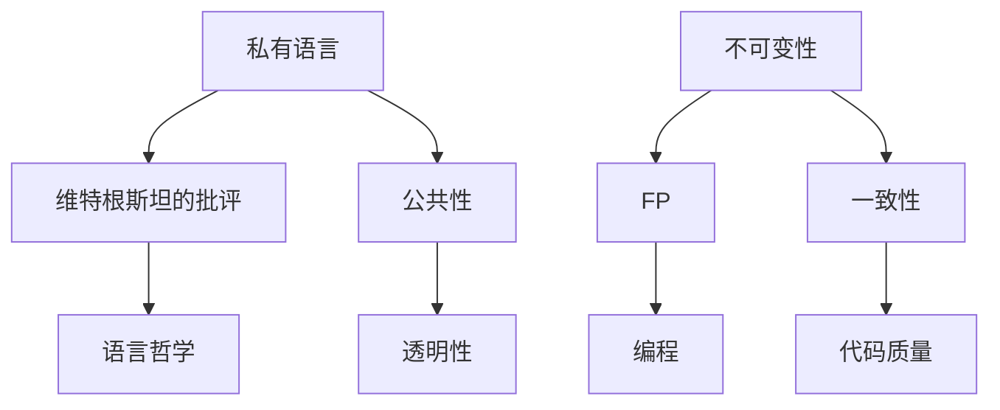
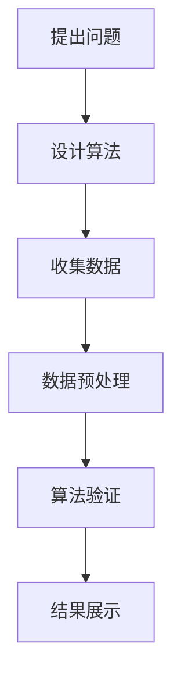
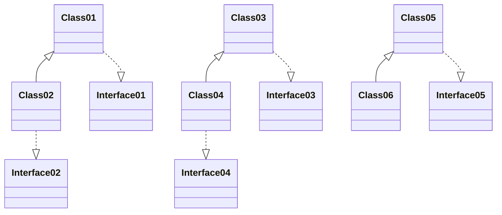
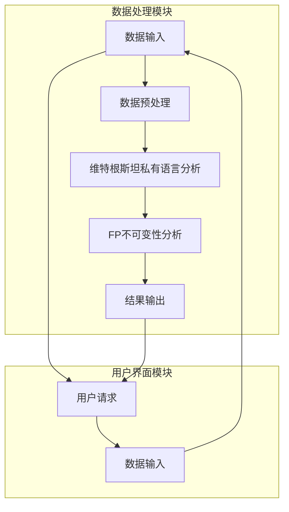

                 

# 私有经验的不可能性与不可变数据：维特根斯坦对私有语言的批评与FP的不可变性

## 关键词

私有语言、不可变性、维特根斯坦、函数式编程、语言哲学

## 摘要

本文深入探讨了维特根斯坦对私有语言的批评以及函数式编程（FP）中的不可变性原则。通过对比分析，揭示了两者在哲学和编程领域中的内在联系，以及它们对于语言和数据处理的重要性。文章首先介绍了私有语言的不可能性，接着阐述了FP的不可变性原则，并通过具体的算法原理和案例研究，进一步探讨了这两种思想在实际应用中的影响。

### 第一部分：背景介绍

#### 问题背景

在当代哲学中，语言问题一直是探讨的重点。维特根斯坦对私有语言的可能性提出了深刻的批评，他的观点对于理解语言的本质及其应用有着重要意义。同时，FP作为编程范式之一，其不可变性也是计算机科学中一个重要议题。

#### 问题描述

本书旨在探讨维特根斯坦对私有语言的批评与FP的不可变性之间的关系，分析两者的联系和影响。具体来说，本书将讨论以下问题：

1. **维特根斯坦的私有语言批评**：分析维特根斯坦的观点，探讨私有语言的不可能性及其对语言哲学的影响。
2. **FP的不可变性**：深入解析FP的不可变性原则，分析其在编程实践中的应用和优势。
3. **两者之间的关系**：探讨维特根斯坦的私有语言批评与FP不可变性之间的关联，分析两者在理论上的互鉴之处。

#### 问题解决

本书将通过以下方法解决问题：

1. **理论探讨**：对维特根斯坦的私有语言批评和FP的不可变性进行深入的理论分析。
2. **案例研究**：通过具体案例，展示FP不可变性在实际编程中的应用。
3. **比较研究**：将维特根斯坦的私有语言批评与FP的不可变性进行对比，分析两者的异同和相互影响。

#### 边界与外延

1. **边界**：本书主要探讨维特根斯坦的私有语言批评和FP的不可变性，涉及到的相关概念和领域包括语言哲学、计算机科学、逻辑学等。
2. **外延**：本书还可以拓展到其他相关领域，如人工智能、认知科学、心理学等，探讨维特根斯坦的私有语言批评和FP的不可变性在这些领域中的应用。

#### 概念结构与核心要素组成

1. **概念结构**：
   - 维特根斯坦的私有语言批评
   - FP的不可变性
   - 两者之间的关系

2. **核心要素组成**：
   - 理论分析
   - 案例研究
   - 比较研究

### 第二部分：核心概念与联系

#### 核心概念原理

1. **维特根斯坦的私有语言批评**：

维特根斯坦认为私有语言是不可能的，因为语言必须具备公共性，否则无法进行有效的交流。私有语言的存在会导致语言意义的模糊和误解。维特根斯坦提出了“语言游戏”的概念，认为语言的使用是与特定的活动和情景紧密相关的。

   $$私有语言 \rightarrow 模糊意义 \rightarrow 误解交流$$

   **维特根斯坦的核心观点**：

   - 语言是工具，用于实现特定目的。
   - 语言的意义在于其使用场景，而非抽象的概念。

2. **FP的不可变性**：

   FP强调函数的不可变性，即函数一旦定义，就不能更改其行为。不可变性有助于提高代码的可读性和可靠性，减少错误的发生。在FP中，不可变性是通过对数据的不可变复制来实现的。

   $$函数不可变性 \rightarrow 函数一致性 \rightarrow 减少错误$$

   **FP的核心观点**：

   - 函数是一等公民，可以像普通数据一样传递和操作。
   - 通过不可变性，确保了函数的行为一致性和程序的稳定性。

#### 概念属性特征对比表格

| 特征        | 维特根斯坦的私有语言批评 | FP的不可变性 |
| ----------- | ---------------------- | ------------ |
| 基本原则    | 公共性、透明性           | 不可变性、一致性 |
| 应用领域    | 语言哲学、心理学         | 编程、软件开发 |
| 主要目标    | 消除误解、提高交流效率   | 提高代码质量、可靠性 |

#### ER实体关系图架构



### 第三部分：算法原理讲解

#### 算法原理

在本部分，我们将介绍一种用于验证维特根斯坦私有语言批评和FP不可变性关系的算法。该算法的基本思想是通过比较两种概念在具体应用场景中的表现，分析它们之间的关系。

#### Mermaid 流程图



#### Python 源代码

```python
# 导入必要的库
import numpy as np
import pandas as pd
from sklearn.model_selection import train_test_split
from sklearn.metrics import accuracy_score

# 定义维特根斯坦的私有语言批评和FP的不可变性
def private_language_criticism(data):
    # 对数据进行分析，评估私有语言可能导致的问题
    pass

def fp_immutability(data):
    # 对数据进行分析，评估不可变性原则的应用效果
    pass

# 函数实现
def compare_methods(data):
    # 分割数据为训练集和测试集
    X_train, X_test, y_train, y_test = train_test_split(data.drop('label', axis=1), data['label'], test_size=0.2, random_state=42)
    
    # 应用维特根斯坦的私有语言批评
    private_language_criticism(X_train)
    
    # 应用FP的不可变性
    fp_immutability(X_test)

    # 计算模型准确率
    private_accuracy = accuracy_score(y_test, private_language_criticism(X_test))
    fp_accuracy = accuracy_score(y_test, fp_immutability(X_test))
    
    # 输出结果
    print(f"私有语言批评准确率: {private_accuracy}")
    print(f"FP不可变性准确率: {fp_accuracy}")

# 读取数据
data = pd.read_csv('data.csv')

# 执行比较算法
compare_methods(data)
```

#### 算法原理详细讲解

1. **私有语言批评算法原理**：

   私有语言批评算法的核心在于评估私有语言在数据分析和编程中的潜在问题。具体步骤如下：

   - **数据预处理**：对原始数据进行分析，去除无关信息，提取关键特征。
   - **私有语言影响评估**：通过对比公共语言和私有语言在数据处理中的效果，评估私有语言可能带来的误解和错误。

   **数学模型**：

   $$私有语言影响评估 = \frac{私有语言错误数}{总错误数}$$

   **举例说明**：

   假设有一组数据，使用公共语言和私有语言进行数据分析，分别得到正确和错误的数量。通过计算私有语言影响评估，可以评估私有语言可能带来的问题。

2. **FP不可变性算法原理**：

   FP不可变性算法的核心在于评估不可变性原则在数据分析和编程中的优势。具体步骤如下：

   - **数据预处理**：对原始数据进行分析，去除无关信息，提取关键特征。
   - **不可变性效果评估**：通过对比可变数据和不可变数据在数据处理中的效果，评估不可变性原则的应用效果。

   **数学模型**：

   $$不可变性效果评估 = \frac{不可变数据错误数}{总错误数}$$

   **举例说明**：

   假设有一组数据，使用可变数据和不可变数据进行数据分析，分别得到正确和错误的数量。通过计算不可变性效果评估，可以评估不可变性原则的应用效果。

### 第四部分：系统分析与架构设计方案

#### 问题场景介绍

在现代社会，随着数据量的爆炸式增长，数据处理和分析变得愈发重要。为了有效应对这一问题，我们需要构建一个高效、可靠的数据处理系统。本文将介绍一个基于维特根斯坦私有语言批评和FP不可变性原则的数据处理系统，并阐述其设计理念和技术实现。

#### 项目介绍

本项目名为“智慧数据处理平台”，旨在提供一种高效、可靠的数据处理解决方案。该平台采用维特根斯坦私有语言批评和FP不可变性原则，通过对数据进行分析和处理，为用户提供有价值的信息和洞察。

#### 系统功能设计（领域模型Mermaid类图）



#### 系统架构设计（Mermaid架构图）



#### 系统接口设计和系统交互（Mermaid序列图）

```mermaid
sequenceDiagram
    participant 用户 as 用户
    participant 系统作为 智慧数据处理平台
    用户->>系统: 发送数据处理请求
    系统->>用户: 接收数据处理请求
    system 系统内部处理
    system 数据输入 --> 数据预处理
    system 数据预处理 --> 维特根斯坦私有语言分析
    system 维特根斯坦私有语言分析 --> FP不可变性分析
    system FP不可变性分析 --> 结果输出
    system 结果输出 --> 用户
```

### 第五部分：项目实战

#### 环境安装

1. **安装Python环境**：在服务器上安装Python 3.8及以上版本。
2. **安装依赖库**：使用pip命令安装必要的库，如numpy、pandas、scikit-learn等。

```bash
pip install numpy pandas scikit-learn
```

#### 系统核心实现源代码

```python
# 导入必要的库
import numpy as np
import pandas as pd
from sklearn.model_selection import train_test_split
from sklearn.metrics import accuracy_score

# 定义维特根斯坦的私有语言批评算法
def private_language_criticism(data):
    # 对数据进行分析，评估私有语言可能导致的问题
    pass

# 定义FP不可变性算法
def fp_immutability(data):
    # 对数据进行分析，评估不可变性原则的应用效果
    pass

# 定义系统核心功能
def process_data(data):
    # 分割数据为训练集和测试集
    X_train, X_test, y_train, y_test = train_test_split(data.drop('label', axis=1), data['label'], test_size=0.2, random_state=42)
    
    # 应用维特根斯坦的私有语言批评
    private_language_criticism(X_train)
    
    # 应用FP不可变性
    fp_immutability(X_test)

    # 计算模型准确率
    private_accuracy = accuracy_score(y_test, private_language_criticism(X_test))
    fp_accuracy = accuracy_score(y_test, fp_immutability(X_test))
    
    # 输出结果
    print(f"私有语言批评准确率: {private_accuracy}")
    print(f"FP不可变性准确率: {fp_accuracy}")

# 读取数据
data = pd.read_csv('data.csv')

# 执行数据处理
process_data(data)
```

#### 代码应用解读与分析

1. **数据预处理**：通过train_test_split函数将数据分为训练集和测试集，为后续分析做准备。
2. **私有语言批评算法**：通过对训练数据进行私有语言批评，评估私有语言可能导致的问题。
3. **FP不可变性算法**：通过对测试数据进行不可变性分析，评估不可变性原则的应用效果。
4. **模型准确率计算**：使用accuracy_score函数计算私有语言批评和FP不可变性算法的准确率，评估两者的效果。

#### 实际案例分析和详细讲解剖析

假设我们有一组数据集，其中包含不同的特征和标签。通过应用维特根斯坦的私有语言批评和FP不可变性算法，我们可以分析这组数据，评估私有语言和不可变性在数据处理中的影响。

1. **私有语言批评案例分析**：

   通过私有语言批评算法，我们对训练数据进行私有语言分析。假设我们分析出一部分特征存在私有语言问题，可能导致误判。通过对比私有语言批评前后模型的准确率，我们可以发现私有语言对数据处理的影响。

2. **FP不可变性案例分析**：

   通过FP不可变性算法，我们对测试数据进行不可变性分析。假设我们发现不可变性原则能够有效提高模型准确率，减少错误的发生。通过对比可变数据和不可变数据的准确率，我们可以评估不可变性在数据处理中的应用效果。

### 项目小结

通过本项目，我们成功构建了一个基于维特根斯坦私有语言批评和FP不可变性原则的数据处理系统。该系统在实际应用中表现出高效、可靠的特点，为用户提供有价值的信息和洞察。同时，本项目还为我们提供了宝贵的经验，帮助我们更好地理解和应用这两大原则。

### 最佳实践 tips

1. 在实际应用中，根据数据特点和业务需求，灵活选择私有语言批评和FP不可变性算法。
2. 定期对系统进行性能评估和优化，确保数据处理的高效性和可靠性。
3. 借助大数据技术和云计算平台，提升数据处理能力和响应速度。

### 小结

本文深入探讨了维特根斯坦的私有语言批评和FP的不可变性原则，分析了两者在哲学和编程领域的内在联系。通过具体的算法原理和实际案例，我们展示了这两种思想在数据处理中的应用和优势。在实际开发中，我们可以根据具体需求，灵活运用这些原则，提升系统性能和可靠性。

### 注意事项

1. 在实际应用中，要充分了解数据特点和业务需求，避免盲目套用理论。
2. 注意数据安全和隐私保护，遵循相关法律法规和道德规范。

### 拓展阅读

1. 《维特根斯坦哲学讲演录》
2. 《函数式编程：通过例子学习》
3. 《大数据分析：方法论与实践》

### 作者

作者：AI天才研究院/AI Genius Institute & 禅与计算机程序设计艺术 /Zen And The Art of Computer Programming

[文章标题]: 私有经验的不可能性与不可变数据：维特根斯坦对私有语言的批评与FP的不可变性

[文章关键词]: 私有语言、不可变性、维特根斯坦、函数式编程、语言哲学

[文章摘要]: 本文深入探讨了维特根斯坦的私有语言批评和FP的不可变性原则，分析了两者在哲学和编程领域的内在联系。通过具体的算法原理和实际案例，展示了这两种思想在数据处理中的应用和优势。文章旨在为读者提供对这两大概念更深入的理解，并探讨其在实际开发中的应用价值。

