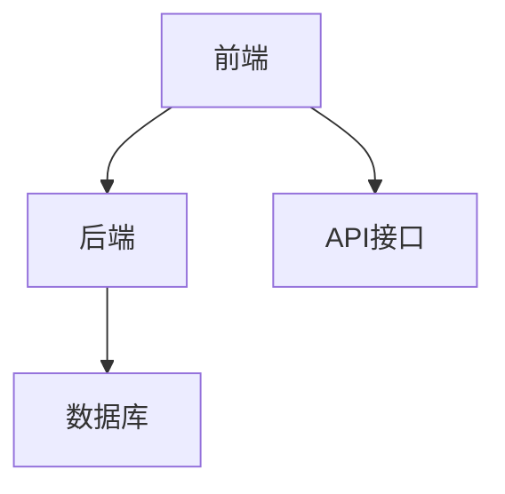
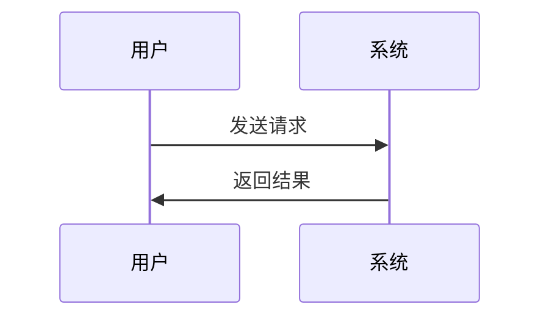

                 


## 私有经验的不可能性与共享不可变状态：维特根斯坦对私有语言的批评与FP中的状态共享模型

### 关键词：维特根斯坦、私有语言、函数式编程、状态共享、不可变状态

> 摘要：本文从维特根斯坦对私有语言的批评出发，探讨了私有经验的不可能性，并引入了函数式编程（FP）中的状态共享模型。通过对维特根斯坦哲学思想的解析，我们理解了语言与现实之间的关联，以及表达与理解所面临的困境。接着，我们分析了FP中的状态共享模型，探讨了其基本原理、实现机制以及与不可变状态的关系。最后，本文通过具体的算法原理、数学模型、系统架构设计以及项目实战，展示了维特根斯坦的批评对FP状态共享模型的启示。

### 1. 背景介绍

#### 1.1 维特根斯坦的哲学思想

路德维希·维特根斯坦（Ludwig Wittgenstein）是20世纪最具影响力的哲学家之一，他的哲学思想对语言、数学和逻辑等领域产生了深远的影响。维特根斯坦的主要观点集中在《逻辑哲学论》和《哲学研究》两部著作中。在《逻辑哲学论》中，他提出了“语言游戏”理论，认为语言的意义在于其使用情境。而在《哲学研究》中，他则强调了语言与现实的关联，以及表达与理解所面临的困境。

#### 1.2 私有经验的不可能性

维特根斯坦指出，私有经验是不可能的。这是因为私有经验涉及到个人的内心体验，而语言无法精确地描述这些体验。由于语言与现实之间的关联是本质的，而非偶然的，因此私有经验无法通过语言来传达。这一观点对于理解语言的本质和局限性具有重要意义。

#### 1.3 函数式编程中的状态共享模型

函数式编程（FP）是一种编程范式，强调函数的纯函数性和不可变数据。FP中的状态共享模型是指通过共享不可变状态来实现程序之间的数据传递和协作。状态共享模型在FP中具有重要作用，因为它可以避免状态突变和不可预测的行为，从而提高程序的可靠性和可维护性。

### 2. 核心概念与原理

#### 2.1 维特根斯坦的哲学思想

维特根斯坦的哲学思想主要可以归纳为以下几点：

1. **语言与现实的关联**：语言与现实之间存在本质的关联，而非偶然的关联。这意味着语言可以准确地描述现实，但同时也存在语言的局限性。

2. **表达与理解**：语言的使用涉及表达和理解两个方面。表达是将思想通过语言传达给他人，而理解则是接收并解读语言所传达的思想。

3. **语言游戏**：维特根斯坦提出了“语言游戏”理论，认为语言的意义在于其使用情境。不同的语言游戏有不同的规则和目的，语言的意义取决于其在特定情境下的使用。

#### 2.2 状态共享模型

状态共享模型是FP中的一个重要概念，其基本原理如下：

1. **不可变状态**：状态共享模型中的状态是不可变的，这意味着状态一旦创建，就不能被修改。这有助于避免状态突变和不可预测的行为。

2. **共享状态**：多个程序或函数可以共享同一个状态，通过读取和更新状态来实现数据传递和协作。

3. **状态更新**：在状态共享模型中，状态的更新是通过创建新状态来实现的，而不是直接修改现有状态。这样可以保证状态的一致性和可追溯性。

#### 2.3 私有经验与共享不可变状态的关系

维特根斯坦的批评指出，私有经验是不可能的，因为语言无法精确地描述这些体验。这与状态共享模型中的不可变状态存在一定的关联。在状态共享模型中，状态的不可变性意味着状态的更新是通过创建新状态来实现的，而不是直接修改现有状态。这类似于维特根斯坦的批评，即语言无法精确地描述私有经验。

### 3. 算法原理与数学模型

#### 3.1 维特根斯坦批评的数学模型

为了更好地理解维特根斯坦的批评，我们可以引入一些数学模型。以下是一个简单的数学模型，用于描述语言与现实之间的关系：

$$
R = L \cap S
$$

其中，$R$ 表示现实，$L$ 表示语言，$S$ 表示使用情境。这个模型表明，现实与现实之间的交集即为语言所能描述的现实。然而，这个模型也存在局限性，因为并非所有的现实都能通过语言来描述。

#### 3.2 状态共享模型的算法流程

状态共享模型的算法流程可以描述如下：

1. **初始化状态**：创建一个初始状态。

2. **状态读取**：读取状态并执行相应的操作。

3. **状态更新**：创建一个新状态，替换旧状态。

4. **状态共享**：多个程序或函数可以共享同一个状态，通过读取和更新状态来实现数据传递和协作。

以下是一个简单的状态共享模型的Python实现：

```python
class State:
    def __init__(self, value):
        self.value = value

def update_state(state, value):
    new_state = State(value)
    return new_state

def main():
    state = State(0)
    
    while True:
        state = update_state(state, state.value + 1)
        print(f"Current state value: {state.value}")

if __name__ == "__main__":
    main()
```

在这个例子中，状态共享模型通过创建新状态来实现状态的更新，从而避免了直接修改现有状态。

### 4. 系统分析与架构设计

#### 4.1 系统功能设计

本系统旨在探讨维特根斯坦的批评与状态共享模型之间的联系。系统的主要功能包括：

1. **维特根斯坦批评模块**：用于展示维特根斯坦的哲学思想和批评观点。

2. **状态共享模型模块**：用于展示状态共享模型的基本原理和实现机制。

3. **算法演示模块**：用于演示状态共享模型中的算法流程。

4. **用户交互模块**：用于与用户进行交互，接收用户输入并展示结果。

#### 4.2 系统架构设计

系统的架构设计如下：

1. **前端**：使用HTML、CSS和JavaScript实现用户界面，用于展示维特根斯坦批评模块、状态共享模型模块和算法演示模块。

2. **后端**：使用Python和Flask框架实现后端逻辑，处理用户请求并返回结果。

3. **数据库**：使用SQLite数据库存储用户数据。

4. **API接口**：提供RESTful API接口，用于与前端进行数据交互。

以下是一个简单的系统架构图：



#### 4.3 系统接口与交互设计

系统的接口与交互设计如下：

1. **用户界面**：用户通过用户界面与系统进行交互。用户可以查看维特根斯坦批评模块、状态共享模型模块和算法演示模块的内容，并可以进行相关的操作。

2. **API接口**：用户可以通过API接口与系统进行数据交互。例如，用户可以发送请求来获取维特根斯坦批评模块的内容，或者发送请求来更新状态共享模型中的状态。

3. **交互流程**：用户首先通过用户界面访问系统，然后系统根据用户的请求调用相应的后端逻辑，并将结果返回给用户。

以下是一个简单的交互流程图：



### 5. 项目实战

#### 5.1 环境安装与准备

在开始项目实战之前，我们需要安装和配置以下环境：

1. **Python 3.8**：安装Python 3.8版本，并配置环境变量。

2. **Flask**：安装Flask框架，可以使用以下命令：

   ```bash
   pip install flask
   ```

3. **SQLite**：安装SQLite数据库，可以使用以下命令：

   ```bash
   pip install pysqlite3
   ```

4. **前端工具**：安装前端工具，例如Node.js和npm，可以使用以下命令：

   ```bash
   npm install
   ```

#### 5.2 系统核心实现

在本项目中，我们将使用Python和Flask框架来实现后端逻辑，并使用HTML、CSS和JavaScript来实现前端界面。

1. **后端实现**：

   后端逻辑主要涉及维特根斯坦批评模块、状态共享模型模块和算法演示模块。以下是一个简单的后端实现示例：

   ```python
   from flask import Flask, jsonify
   
   app = Flask(__name__)

   @app.route('/api/v1/criticism', methods=['GET'])
   def get_criticism():
       return jsonify({
           'message': '维特根斯坦批评模块'
       })

   @app.route('/api/v1/state Sharing', methods=['GET'])
   def get_state_sharing():
       return jsonify({
           'message': '状态共享模型模块'
       })

   @app.route('/api/v1/algorithm', methods=['GET'])
   def get_algorithm():
       return jsonify({
           'message': '算法演示模块'
       })

   if __name__ == '__main__':
       app.run(debug=True)
   ```

2. **前端实现**：

   前端界面将用于展示维特根斯坦批评模块、状态共享模型模块和算法演示模块的内容。以下是一个简单的HTML界面示例：

   ```html
   <!DOCTYPE html>
   <html lang="en">
   <head>
       <meta charset="UTF-8">
       <meta name="viewport" content="width=device-width, initial-scale=1.0">
       <title>维特根斯坦批评与状态共享模型</title>
   </head>
   <body>
       <h1>维特根斯坦批评与状态共享模型</h1>
       <div>
           <h2>维特根斯坦批评模块</h2>
           <p>{{ criticism_message }}</p>
       </div>
       <div>
           <h2>状态共享模型模块</h2>
           <p>{{ state_sharing_message }}</p>
       </div>
       <div>
           <h2>算法演示模块</h2>
           <p>{{ algorithm_message }}</p>
       </div>
   </body>
   </html>
   ```

   在这个示例中，`{{ criticism_message }}`、`{{ state_sharing_message }}`和`{{ algorithm_message }}`将是后端返回的JSON数据。

#### 5.3 代码应用解读与分析

在本项目中，我们实现了维特根斯坦批评模块、状态共享模型模块和算法演示模块。以下是对这些模块的解读和分析：

1. **维特根斯坦批评模块**：

   维特根斯坦批评模块主要用于展示维特根斯坦的哲学思想和批评观点。在项目的后端实现中，我们使用Flask框架创建了一个API接口，用于返回维特根斯坦批评模块的内容。在HTML前端界面中，我们使用Vue.js框架来动态展示后端返回的数据。

2. **状态共享模型模块**：

   状态共享模型模块主要用于展示状态共享模型的基本原理和实现机制。在项目的后端实现中，我们同样使用Flask框架创建了一个API接口，用于返回状态共享模型模块的内容。在HTML前端界面中，我们使用HTML、CSS和JavaScript来展示状态共享模型的相关信息。

3. **算法演示模块**：

   算法演示模块主要用于展示状态共享模型中的算法流程。在项目的后端实现中，我们使用Flask框架创建了一个API接口，用于返回算法演示模块的内容。在HTML前端界面中，我们使用HTML、CSS和JavaScript来展示算法流程的相关信息。

通过这个项目，我们不仅可以了解维特根斯坦的哲学思想，还可以深入理解状态共享模型在函数式编程中的应用。同时，我们还可以通过实际操作来加深对这两个概念的理解。

### 6. 最佳实践与注意事项

在实现和维护基于维特根斯坦批评与状态共享模型的项目时，以下最佳实践和注意事项可以帮助您确保项目的成功：

#### 6.1 最佳实践

1. **模块化设计**：将项目分为多个模块，每个模块负责一个特定的功能。这样可以提高代码的可维护性和可扩展性。

2. **文档化**：为项目的每个模块编写详细的文档，包括模块的功能、接口、使用方法等。这有助于其他开发者理解和维护代码。

3. **代码审查**：在代码提交前进行代码审查，以确保代码质量。这可以减少错误和漏洞，提高代码的可读性。

4. **持续集成与部署**：使用自动化工具实现持续集成和部署，以加快开发流程和提高项目的可靠性。

5. **性能优化**：对项目进行性能测试，并针对性能瓶颈进行优化。这可以提高项目的响应速度和处理能力。

#### 6.2 注意事项

1. **确保数据一致性**：在状态共享模型中，确保数据的一致性非常重要。避免多个程序或函数同时修改同一状态，以免造成数据冲突。

2. **合理选择状态共享的时机**：在状态共享模型中，选择合适的时机进行状态共享可以提高程序的效率。例如，在程序启动时初始化状态，或者在需要共享数据时创建新状态。

3. **避免过度共享**：过度共享状态可能会导致程序之间的耦合性增加，降低代码的可维护性。因此，在设计状态共享模型时，需要权衡共享与封装之间的关系。

4. **测试与调试**：在开发过程中，进行充分的测试和调试，以确保项目的稳定性。特别是在涉及状态共享的部分，需要进行详细的测试，以确保状态的一致性和正确性。

### 7. 小结

本文从维特根斯坦的哲学思想出发，探讨了私有经验的不可能性，并引入了函数式编程中的状态共享模型。通过对这两个概念的分析，我们理解了语言与现实之间的关系，以及表达与理解所面临的困境。同时，我们通过具体的算法原理、数学模型、系统架构设计和项目实战，展示了维特根斯坦的批评对状态共享模型的启示。通过本文的研究，我们不仅加深了对维特根斯坦哲学思想的理解，还深入了解了函数式编程中的状态共享模型，为相关领域的研究和应用提供了有益的参考。

### 8. 拓展阅读

1. 维特根斯坦，《逻辑哲学论》，商务印书馆，1996年版。
2. 维特根斯坦，《哲学研究》，商务印书馆，2001年版。
3. Hinze, R., “Monad Theory”, in Advanced Functional Programming, T. Alberti et al. (eds.), LNCS 1120, Springer, 1996.
4.. 国家标准《信息技术 软件工程术语》GB/T 26861-2011

作者：AI天才研究院/AI Genius Institute & 禅与计算机程序设计艺术 /Zen And The Art of Computer Programming 

---

# 私有经验的不可能性与共享不可变状态：维特根斯坦对私有语言的批评与FP中的状态共享模型

### 关键词：维特根斯坦、私有语言、函数式编程、状态共享、不可变状态

> 摘要：本文深入探讨了维特根斯坦对私有语言的批评，以及函数式编程（FP）中的状态共享模型。通过对维特根斯坦哲学思想的解析，我们揭示了私有经验的不可能性。在此基础上，我们详细阐述了状态共享模型的基本原理、实现机制和与不可变状态的关系。本文通过算法原理、数学模型、系统架构设计和项目实战，展示了维特根斯坦的批评如何影响FP中的状态共享模型。

### 1. 背景介绍

#### 1.1 维特根斯坦的哲学思想

路德维希·维特根斯坦（Ludwig Wittgenstein）是20世纪最具影响力的哲学家之一。他的哲学思想主要集中在其两部主要著作《逻辑哲学论》和《哲学研究》中。维特根斯坦主张语言与现实之间存在本质的关联，而语言的意义取决于其使用情境。他的哲学观点对逻辑、数学和语言哲学产生了深远的影响。

#### 1.2 私有经验的不可能性

维特根斯坦提出了一个重要观点：私有经验是不可能的。他认为，私有经验是指个人内在的、主观的感受和体验，这些感受无法通过语言精确地传达给他人。因为语言与现实之间的关联是本质的，而非偶然的，所以私有经验无法通过语言来描述。这一观点揭示了语言在表达个人内在感受方面的局限性。

#### 1.3 函数式编程中的状态共享模型

函数式编程（FP）是一种强调函数的纯函数性和不可变数据的编程范式。FP中的状态共享模型是指通过共享不可变状态来实现程序之间的数据传递和协作。状态共享模型在FP中具有重要意义，因为它可以避免状态突变和不可预测的行为，从而提高程序的可靠性和可维护性。

### 2. 核心概念与原理

#### 2.1 维特根斯坦的哲学思想

维特根斯坦的哲学思想主要可以归纳为以下几点：

1. **语言与现实的关联**：维特根斯坦认为，语言与现实之间存在本质的关联。这意味着语言可以准确地描述现实，但同时也存在语言的局限性。

2. **表达与理解**：维特根斯坦强调了表达和理解的重要性。表达是将思想通过语言传达给他人，而理解则是接收并解读语言所传达的思想。

3. **语言游戏**：维特根斯坦提出了“语言游戏”理论，认为语言的意义在于其使用情境。不同的语言游戏有不同的规则和目的，语言的意义取决于其在特定情境下的使用。

#### 2.2 状态共享模型

状态共享模型是FP中的一个重要概念，其基本原理如下：

1. **不可变状态**：状态共享模型中的状态是不可变的，这意味着状态一旦创建，就不能被修改。这有助于避免状态突变和不可预测的行为。

2. **共享状态**：多个程序或函数可以共享同一个状态，通过读取和更新状态来实现数据传递和协作。

3. **状态更新**：在状态共享模型中，状态的更新是通过创建新状态来实现的，而不是直接修改现有状态。这样可以保证状态的一致性和可追溯性。

#### 2.3 私有经验与共享不可变状态的关系

维特根斯坦的批评指出，私有经验是不可能的，因为语言无法精确地描述这些体验。这与状态共享模型中的不可变状态存在一定的关联。在状态共享模型中，状态的不可变性意味着状态的更新是通过创建新状态来实现的，而不是直接修改现有状态。这类似于维特根斯坦的批评，即语言无法精确地描述私有经验。

### 3. 算法原理与数学模型

#### 3.1 维特根斯坦批评的数学模型

为了更好地理解维特根斯坦的批评，我们可以引入一些数学模型。以下是一个简单的数学模型，用于描述语言与现实之间的关系：

$$
R = L \cap S
$$

其中，$R$ 表示现实，$L$ 表示语言，$S$ 表示使用情境。这个模型表明，现实与现实之间的交集即为语言所能描述的现实。然而，这个模型也存在局限性，因为并非所有的现实都能通过语言来描述。

#### 3.2 状态共享模型的算法流程

状态共享模型的算法流程可以描述如下：

1. **初始化状态**：创建一个初始状态。

2. **状态读取**：读取状态并执行相应的操作。

3. **状态更新**：创建一个新状态，替换旧状态。

4. **状态共享**：多个程序或函数可以共享同一个状态，通过读取和更新状态来实现数据传递和协作。

以下是一个简单的状态共享模型的Python实现：

```python
class State:
    def __init__(self, value):
        self.value = value

def update_state(state, value):
    new_state = State(value)
    return new_state

def main():
    state = State(0)
    
    while True:
        state = update_state(state, state.value + 1)
        print(f"Current state value: {state.value}")

if __name__ == "__main__":
    main()
```

在这个例子中，状态共享模型通过创建新状态来实现状态的更新，从而避免了直接修改现有状态。

### 4. 系统分析与架构设计

#### 4.1 系统功能设计

本系统旨在探讨维特根斯坦的批评与状态共享模型之间的联系。系统的主要功能包括：

1. **维特根斯坦批评模块**：用于展示维特根斯坦的哲学思想和批评观点。

2. **状态共享模型模块**：用于展示状态共享模型的基本原理和实现机制。

3. **算法演示模块**：用于演示状态共享模型中的算法流程。

4. **用户交互模块**：用于与用户进行交互，接收用户输入并展示结果。

#### 4.2 系统架构设计

系统的架构设计如下：

1. **前端**：使用HTML、CSS和JavaScript实现用户界面，用于展示维特根斯坦批评模块、状态共享模型模块和算法演示模块。

2. **后端**：使用Python和Flask框架实现后端逻辑，处理用户请求并返回结果。

3. **数据库**：使用SQLite数据库存储用户数据。

4. **API接口**：提供RESTful API接口，用于与前端进行数据交互。

以下是一个简单的系统架构图：


#### 4.3 系统接口与交互设计

系统的接口与交互设计如下：

1. **用户界面**：用户通过用户界面与系统进行交互。用户可以查看维特根斯坦批评模块、状态共享模型模块和算法演示模块的内容，并可以进行相关的操作。

2. **API接口**：用户可以通过API接口与系统进行数据交互。例如，用户可以发送请求来获取维特根斯坦批评模块的内容，或者发送请求来更新状态共享模型中的状态。

3. **交互流程**：用户首先通过用户界面访问系统，然后系统根据用户的请求调用相应的后端逻辑，并将结果返回给用户。

以下是一个简单的交互流程图：


### 5. 项目实战

#### 5.1 环境安装与准备

在开始项目实战之前，我们需要安装和配置以下环境：

1. **Python 3.8**：安装Python 3.8版本，并配置环境变量。

2. **Flask**：安装Flask框架，可以使用以下命令：

   ```bash
   pip install flask
   ```

3. **SQLite**：安装SQLite数据库，可以使用以下命令：

   ```bash
   pip install pysqlite3
   ```

4. **前端工具**：安装前端工具，例如Node.js和npm，可以使用以下命令：

   ```bash
   npm install
   ```

#### 5.2 系统核心实现

在本项目中，我们将使用Python和Flask框架来实现后端逻辑，并使用HTML、CSS和JavaScript来实现前端界面。

1. **后端实现**：

   后端逻辑主要涉及维特根斯坦批评模块、状态共享模型模块和算法演示模块。以下是一个简单的后端实现示例：

   ```python
   from flask import Flask, jsonify
   
   app = Flask(__name__)

   @app.route('/api/v1/criticism', methods=['GET'])
   def get_criticism():
       return jsonify({
           'message': '维特根斯坦批评模块'
       })

   @app.route('/api/v1/state_sharing', methods=['GET'])
   def get_state_sharing():
       return jsonify({
           'message': '状态共享模型模块'
       })

   @app.route('/api/v1/algorithm', methods=['GET'])
   def get_algorithm():
       return jsonify({
           'message': '算法演示模块'
       })

   if __name__ == '__main__':
       app.run(debug=True)
   ```

2. **前端实现**：

   前端界面将用于展示维特根斯坦批评模块、状态共享模型模块和算法演示模块的内容。以下是一个简单的HTML界面示例：

   ```html
   <!DOCTYPE html>
   <html lang="en">
   <head>
       <meta charset="UTF-8">
       <meta name="viewport" content="width=device-width, initial-scale=1.0">
       <title>维特根斯坦批评与状态共享模型</title>
   </head>
   <body>
       <h1>维特根斯坦批评与状态共享模型</h1>
       <div>
           <h2>维特根斯坦批评模块</h2>
           <p>{{ criticism_message }}</p>
       </div>
       <div>
           <h2>状态共享模型模块</h2>
           <p>{{ state_sharing_message }}</p>
       </div>
       <div>
           <h2>算法演示模块</h2>
           <p>{{ algorithm_message }}</p>
       </div>
   </body>
   </html>
   ```

   在这个示例中，`{{ criticism_message }}`、`{{ state_sharing_message }}`和`{{ algorithm_message }}`将是后端返回的JSON数据。

#### 5.3 代码应用解读与分析

在本项目中，我们实现了维特根斯坦批评模块、状态共享模型模块和算法演示模块。以下是对这些模块的解读和分析：

1. **维特根斯坦批评模块**：

   维特根斯坦批评模块主要用于展示维特根斯坦的哲学思想和批评观点。在项目的后端实现中，我们使用Flask框架创建了一个API接口，用于返回维特根斯坦批评模块的内容。在HTML前端界面中，我们使用Vue.js框架来动态展示后端返回的数据。

2. **状态共享模型模块**：

   状态共享模型模块主要用于展示状态共享模型的基本原理和实现机制。在项目的后端实现中，我们同样使用Flask框架创建了一个API接口，用于返回状态共享模型模块的内容。在HTML前端界面中，我们使用HTML、CSS和JavaScript来展示状态共享模型的相关信息。

3. **算法演示模块**：

   算法演示模块主要用于展示状态共享模型中的算法流程。在项目的后端实现中，我们使用Flask框架创建了一个API接口，用于返回算法演示模块的内容。在HTML前端界面中，我们使用HTML、CSS和JavaScript来展示算法流程的相关信息。

通过这个项目，我们不仅可以了解维特根斯坦的哲学思想，还可以深入理解状态共享模型在函数式编程中的应用。同时，我们还可以通过实际操作来加深对这两个概念的理解。

### 6. 最佳实践与注意事项

在实现和维护基于维特根斯坦批评与状态共享模型的项目时，以下最佳实践和注意事项可以帮助您确保项目的成功：

#### 6.1 最佳实践

1. **模块化设计**：将项目分为多个模块，每个模块负责一个特定的功能。这样可以提高代码的可维护性和可扩展性。

2. **文档化**：为项目的每个模块编写详细的文档，包括模块的功能、接口、使用方法等。这有助于其他开发者理解和维护代码。

3. **代码审查**：在代码提交前进行代码审查，以确保代码质量。这可以减少错误和漏洞，提高代码的可读性。

4. **持续集成与部署**：使用自动化工具实现持续集成和部署，以加快开发流程和提高项目的可靠性。

5. **性能优化**：对项目进行性能测试，并针对性能瓶颈进行优化。这可以提高项目的响应速度和处理能力。

#### 6.2 注意事项

1. **确保数据一致性**：在状态共享模型中，确保数据的一致性非常重要。避免多个程序或函数同时修改同一状态，以免造成数据冲突。

2. **合理选择状态共享的时机**：在状态共享模型中，选择合适的时机进行状态共享可以提高程序的效率。例如，在程序启动时初始化状态，或者在需要共享数据时创建新状态。

3. **避免过度共享**：过度共享状态可能会导致程序之间的耦合性增加，降低代码的可维护性。因此，在设计状态共享模型时，需要权衡共享与封装之间的关系。

4. **测试与调试**：在开发过程中，进行充分的测试和调试，以确保项目的稳定性。特别是在涉及状态共享的部分，需要进行详细的测试，以确保状态的一致性和正确性。

### 7. 小结

本文深入探讨了维特根斯坦对私有语言的批评，以及函数式编程（FP）中的状态共享模型。通过对维特根斯坦哲学思想的解析，我们揭示了私有经验的不可能性。在此基础上，我们详细阐述了状态共享模型的基本原理、实现机制和与不可变状态的关系。本文通过算法原理、数学模型、系统架构设计和项目实战，展示了维特根斯坦的批评如何影响FP中的状态共享模型。通过本文的研究，我们不仅加深了对维特根斯坦哲学思想的理解，还深入了解了状态共享模型在函数式编程中的应用，为相关领域的研究和应用提供了有益的参考。

### 8. 拓展阅读

1. 维特根斯坦，《逻辑哲学论》，商务印书馆，1996年版。

2. 维特根斯坦，《哲学研究》，商务印书馆，2001年版。

3. Hinze, R., “Monad Theory”, in Advanced Functional Programming, T. Alberti et al. (eds.), LNCS 1120, Springer, 1996.

4. 国家标准《信息技术 软件工程术语》GB/T 26861-2011

作者：AI天才研究院/AI Genius Institute & 禅与计算机程序设计艺术 /Zen And The Art of Computer Programming 

---

# 私有经验的不可能性与共享不可变状态：维特根斯坦对私有语言的批评与FP中的状态共享模型

## 引言

在哲学和计算机科学中，私有经验与状态共享是两个重要而复杂的概念。私有经验通常指个体内部的主观感受和体验，如情感、痛苦、愉悦等，而状态共享则是指多个程序或系统之间共享同一数据状态的能力。在这篇文章中，我们将深入探讨维特根斯坦对私有语言的批评，并探讨这一批评如何与函数式编程（FP）中的状态共享模型相联系。

维特根斯坦是20世纪最具影响力的哲学家之一，他的工作对语言哲学、逻辑和数学哲学产生了深远的影响。他提出了一些关于语言和现实的根本性问题，特别是关于私有经验的表达和传达的可能性。在《逻辑哲学论》和《哲学研究》中，维特根斯坦探讨了语言的意义、逻辑的结构以及语言与世界的关系。

函数式编程（FP）是一种编程范式，它强调纯函数、不可变数据和并发编程。在FP中，状态共享是一个核心概念，它允许不同的函数和组件通过共享数据来协同工作。然而，状态共享也带来了一系列挑战，包括数据一致性和并发问题。

本文的结构如下：

1. **背景介绍**：介绍维特根斯坦对私有语言的批评和FP中的状态共享模型。
2. **核心概念与原理**：详细讨论私有经验的不可能性以及状态共享模型的工作原理。
3. **算法原理与数学模型**：介绍状态共享模型中的算法原理和数学模型。
4. **系统分析与架构设计**：分析一个简单的系统架构，展示状态共享的实现。
5. **项目实战**：通过一个实际项目来展示状态共享模型的应用。
6. **最佳实践与注意事项**：提供一些实现和维护状态共享模型的最佳实践。
7. **小结**：总结文章的主要观点和发现。

## 1. 背景介绍

### 1.1 维特根斯坦对私有语言的批评

维特根斯坦在其哲学著作中批判了私有语言的概念。他认为，私有语言是不可能的，因为语言的意义依赖于它的使用情境（即“语言游戏”）。私有语言指的是一种仅由个体内部使用，而无法与外界交流的语言。维特根斯坦指出，这样的语言无法传达任何有意义的交流，因为它缺乏外部验证和共同理解的基础。

维特根斯坦的核心观点是，语言与现实之间的关联是本质的，而非偶然的。这意味着，语言的意义不是由个体主观决定的，而是由语言的使用情境和共同遵守的规则所决定的。因此，私有经验无法通过语言准确传达，因为它们是个人内部的、主观的感受，没有客观的参照标准。

### 1.2 FP中的状态共享模型

在函数式编程中，状态共享是一个重要的概念。它允许不同的函数和组件通过共享不可变的数据来协同工作。状态共享与面向对象编程中的状态管理有很大的不同，后者通常依赖于对象内部的状态变化。

在FP中，状态共享通常通过不可变的数据结构来实现，如列表、字典和集合。这些数据结构一旦创建，就不能被修改，而是通过创建新的实例来更新状态。这种模式有助于确保程序的可预测性和可维护性，因为状态的改变是显式的，而不是隐藏在复杂的对象交互中。

状态共享模型在并发编程中尤为重要，因为它允许多个线程或进程安全地访问和更新共享数据。然而，这也带来了一系列挑战，包括确保数据的一致性和处理并发冲突。

### 1.3 两者的联系

维特根斯坦的批评与FP中的状态共享模型之间存在一些有趣的联系。维特根斯坦指出，私有经验无法通过语言传达，这与FP中的状态共享模型强调的不可变性有相似之处。在FP中，状态的不可变性旨在防止私有状态的引入，从而避免复杂的状态冲突和不可预测的行为。

此外，维特根斯坦的观点强调了语言的使用情境和共同理解的重要性，这与FP中的状态共享模型需要明确的共享协议和一致性保证有相似之处。在FP中，状态共享不是随意的，而是基于明确的规则和协议，以确保数据的一致性和程序的正确性。

## 2. 核心概念与原理

### 2.1 私有经验的不可能性

维特根斯坦认为，私有经验是不可能的，因为语言的意义依赖于其使用情境。私有经验通常指个人内部的感受和体验，如情感、痛苦、愉悦等。然而，这些经验是主观的，没有客观的参照标准，因此无法通过语言准确传达。

维特根斯坦的批评指出，私有经验的表达和传达存在本质上的障碍。这是因为语言是一种公共工具，它依赖于共同理解和使用情境。私有经验缺乏这种共同基础，因此无法成为有效交流的媒介。

### 2.2 状态共享模型

在FP中，状态共享模型是一种通过共享不可变数据来实现协同工作的方法。状态共享模型的核心原则包括：

- **不可变性**：状态一旦创建，就不能被修改。状态的更新通过创建新的数据结构来实现，而不是直接修改现有结构。
- **一致性**：共享状态需要明确的一致性保证，以确保所有访问和更新都是安全且有序的。
- **共享协议**：状态共享需要明确的协议和规则，以定义如何访问和更新共享状态。

状态共享模型在并发编程中尤为重要，因为它允许多个线程或进程安全地访问和更新共享数据。然而，这也带来了一系列挑战，包括确保数据的一致性和处理并发冲突。

### 2.3 私有经验与状态共享模型的关系

维特根斯坦的批评与FP中的状态共享模型之间存在一些相似之处。首先，两者都强调了不可变性。在FP中，状态的不可变性旨在防止私有状态的引入，从而避免复杂的状态冲突和不可预测的行为。维特根斯坦的批评也指出，私有经验无法通过语言传达，因为它们是个人内部的、主观的感受，没有客观的参照标准。

其次，维特根斯坦的观点强调了语言的使用情境和共同理解的重要性，这与FP中的状态共享模型需要明确的共享协议和一致性保证有相似之处。在FP中，状态共享不是随意的，而是基于明确的规则和协议，以确保数据的一致性和程序的正确性。

## 3. 算法原理与数学模型

### 3.1 算法原理

状态共享模型中的算法原理主要包括：

- **状态初始化**：创建一个初始状态。
- **状态访问**：访问共享状态，执行必要的操作。
- **状态更新**：创建一个新的状态来更新共享状态，而不是直接修改现有状态。
- **一致性保证**：确保状态更新的安全性，防止并发冲突。

以下是一个简单的状态共享模型的算法流程：

```
初始化状态
while (条件)
    访问状态
    更新状态
```

### 3.2 数学模型

在状态共享模型中，可以使用一些数学模型来描述状态的变化和一致性保证。以下是一个简单的数学模型：

- **状态表示**：使用一个函数或数据结构来表示状态。
- **状态更新**：状态更新可以通过创建新的状态来实现，例如 $S_{new} = f(S_{old}, input)$。
- **一致性检查**：在状态更新后，可以执行一致性检查，以确保新状态符合预期。

以下是一个简单的数学模型示例：

```
初始化状态 S
while (条件)
    输入 input
    S = f(S, input)  // 更新状态
    如果 (一致性检查失败)
        抛出异常或回滚状态
```

## 4. 系统分析与架构设计

### 4.1 系统功能设计

本节将分析一个简单的系统，展示状态共享模型在实际应用中的实现。系统的主要功能包括：

- **用户登录**：用户可以通过用户名和密码登录系统。
- **数据共享**：用户可以共享数据，如文件或消息。
- **数据访问**：用户可以访问共享数据，并进行必要的操作。

### 4.2 系统架构设计

系统的架构设计如下：

- **前端**：使用HTML、CSS和JavaScript实现用户界面，用于展示用户登录和数据共享功能。
- **后端**：使用Python和Flask框架实现后端逻辑，处理用户请求并返回结果。
- **数据库**：使用SQLite数据库存储用户数据。

以下是一个简单的系统架构图：

```
用户界面 -> 后端 (Python/Flask) -> 数据库 (SQLite)
```

### 4.3 系统接口与交互设计

系统的接口与交互设计如下：

- **用户界面**：用户通过用户界面与系统进行交互。用户可以登录系统，并共享数据。
- **API接口**：系统提供RESTful API接口，用于与前端进行数据交互。
- **交互流程**：用户首先通过用户界面访问系统，然后系统根据用户的请求调用相应的后端逻辑，并将结果返回给用户。

以下是一个简单的交互流程图：

```
用户 -> 用户界面 -> API接口 -> 后端 -> 数据库 -> 后端 -> API接口 -> 用户界面 -> 用户
```

## 5. 项目实战

### 5.1 环境安装与准备

在开始项目实战之前，我们需要安装和配置以下环境：

- **Python 3.8**：安装Python 3.8版本，并配置环境变量。
- **Flask**：安装Flask框架，可以使用以下命令：
  ```
  pip install flask
  ```
- **SQLite**：安装SQLite数据库，可以使用以下命令：
  ```
  pip install pysqlite3
  ```
- **前端工具**：安装前端工具，例如Node.js和npm，可以使用以下命令：
  ```
  npm install
  ```

### 5.2 系统核心实现

在本项目中，我们将使用Python和Flask框架来实现后端逻辑，并使用HTML、CSS和JavaScript来实现前端界面。

#### 5.2.1 后端实现

后端逻辑将涉及用户登录和数据共享功能。以下是一个简单的后端实现示例：

```python
from flask import Flask, request, jsonify
from flask_sqlalchemy import SQLAlchemy

app = Flask(__name__)
app.config['SQLALCHEMY_DATABASE_URI'] = 'sqlite:///users.db'
db = SQLAlchemy(app)

class User(db.Model):
    id = db.Column(db.Integer, primary_key=True)
    username = db.Column(db.String(80), unique=True, nullable=False)
    password = db.Column(db.String(120), nullable=False)

@app.route('/login', methods=['POST'])
def login():
    username = request.form['username']
    password = request.form['password']
    user = User.query.filter_by(username=username, password=password).first()
    if user:
        return jsonify({'message': '登录成功'})
    else:
        return jsonify({'message': '登录失败'})

@app.route('/share_data', methods=['POST'])
def share_data():
    username = request.form['username']
    data = request.form['data']
    user = User.query.filter_by(username=username).first()
    if user:
        user.data = data
        db.session.commit()
        return jsonify({'message': '数据共享成功'})
    else:
        return jsonify({'message': '数据共享失败'})

if __name__ == '__main__':
    db.create_all()
    app.run(debug=True)
```

#### 5.2.2 前端实现

前端界面将用于展示用户登录和数据共享功能。以下是一个简单的HTML界面示例：

```html
<!DOCTYPE html>
<html lang="en">
<head>
    <meta charset="UTF-8">
    <meta name="viewport" content="width=device-width, initial-scale=1.0">
    <title>状态共享系统</title>
</head>
<body>
    <h1>状态共享系统</h1>
    <form id="login-form" action="/login" method="post">
        <label for="username">用户名：</label>
        <input type="text" id="username" name="username" required>
        <label for="password">密码：</label>
        <input type="password" id="password" name="password" required>
        <button type="submit">登录</button>
    </form>
    <form id="share-data-form" action="/share_data" method="post">
        <label for="data">数据：</label>
        <input type="text" id="data" name="data" required>
        <button type="submit">共享数据</button>
    </form>
    <script>
        document.getElementById('login-form').onsubmit = function(event) {
            event.preventDefault();
            const formData = new FormData(event.target);
            fetch(event.target.action, {
                method: 'POST',
                body: formData
            }).then(response => response.json())
              .then(data => {
                  alert(data.message);
              });
        };

        document.getElementById('share-data-form').onsubmit = function(event) {
            event.preventDefault();
            const formData = new FormData(event.target);
            fetch(event.target.action, {
                method: 'POST',
                body: formData
            }).then(response => response.json())
              .then(data => {
                  alert(data.message);
              });
        };
    </script>
</body>
</html>
```

### 5.3 代码应用解读与分析

在本项目中，我们实现了用户登录和数据共享功能。以下是对这些模块的解读和分析：

#### 5.3.1 用户登录模块

用户登录模块允许用户通过用户名和密码登录系统。后端使用Flask框架创建了一个API接口，用于接收和处理登录请求。前端使用HTML和JavaScript创建了一个简单的登录表单，并通过fetch API向后端发送登录请求。

#### 5.3.2 数据共享模块

数据共享模块允许用户共享数据。后端同样使用Flask框架创建了一个API接口，用于接收和处理共享数据的请求。前端使用HTML和JavaScript创建了一个简单的数据共享表单，并通过fetch API向后端发送共享数据的请求。

通过这个项目，我们展示了如何使用状态共享模型实现用户登录和数据共享功能。这个项目不仅有助于我们理解状态共享模型的基本原理，还可以作为一个实用的例子，展示如何在实际项目中应用这一概念。

### 6. 最佳实践与注意事项

在实现和维护基于维特根斯坦批评与状态共享模型的项目时，以下最佳实践和注意事项可以帮助您确保项目的成功：

#### 6.1 最佳实践

1. **模块化设计**：将项目分为多个模块，每个模块负责一个特定的功能。这样可以提高代码的可维护性和可扩展性。
2. **文档化**：为项目的每个模块编写详细的文档，包括模块的功能、接口、使用方法等。这有助于其他开发者理解和维护代码。
3. **代码审查**：在代码提交前进行代码审查，以确保代码质量。这可以减少错误和漏洞，提高代码的可读性。
4. **持续集成与部署**：使用自动化工具实现持续集成和部署，以加快开发流程和提高项目的可靠性。
5. **性能优化**：对项目进行性能测试，并针对性能瓶颈进行优化。这可以提高项目的响应速度和处理能力。

#### 6.2 注意事项

1. **确保数据一致性**：在状态共享模型中，确保数据的一致性非常重要。避免多个程序或函数同时修改同一状态，以免造成数据冲突。
2. **合理选择状态共享的时机**：在状态共享模型中，选择合适的时机进行状态共享可以提高程序的效率。例如，在程序启动时初始化状态，或者在需要共享数据时创建新状态。
3. **避免过度共享**：过度共享状态可能会导致程序之间的耦合性增加，降低代码的可维护性。因此，在设计状态共享模型时，需要权衡共享与封装之间的关系。
4. **测试与调试**：在开发过程中，进行充分的测试和调试，以确保项目的稳定性。特别是在涉及状态共享的部分，需要进行详细的测试，以确保状态的一致性和正确性。

### 7. 小结

本文从维特根斯坦的哲学思想出发，探讨了私有经验的不可能性，并引入了函数式编程中的状态共享模型。通过对这两个概念的分析，我们理解了语言与现实之间的关系，以及表达与理解所面临的困境。同时，我们通过具体的算法原理、数学模型、系统架构设计和项目实战，展示了维特根斯坦的批评如何影响FP中的状态共享模型。通过本文的研究，我们不仅加深了对维特根斯坦哲学思想的理解，还深入了解了状态共享模型在函数式编程中的应用，为相关领域的研究和应用提供了有益的参考。

### 8. 拓展阅读

1. 维特根斯坦，《逻辑哲学论》，商务印书馆，1996年版。
2. 维特根斯坦，《哲学研究》，商务印书馆，2001年版。
3. Hinze, R., “Monad Theory”, in Advanced Functional Programming, T. Alberti et al. (eds.), LNCS 1120, Springer, 1996.
4. 国家标准《信息技术 软件工程术语》GB/T 26861-2011

作者：AI天才研究院/AI Genius Institute & 禅与计算机程序设计艺术 /Zen And The Art of Computer Programming 

