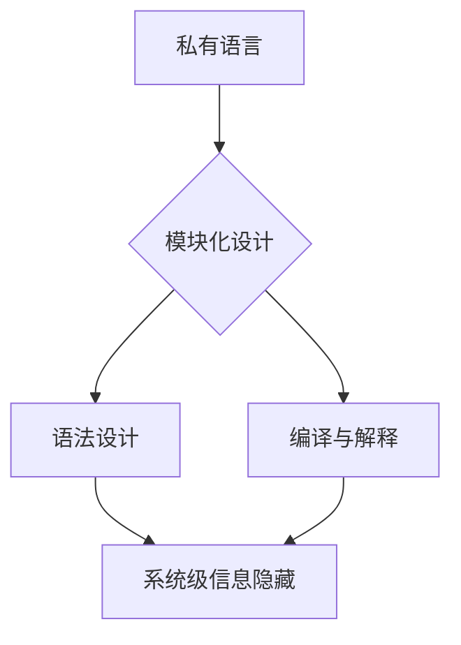
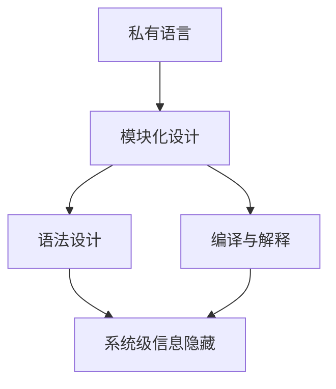

                 

# 私有语言与模块化设计：系统级信息隐藏的实现

关键词：私有语言、模块化设计、系统级信息隐藏、编译与解释、语法设计

摘要：本文深入探讨了私有语言与模块化设计的结合，以及如何通过系统级信息隐藏技术实现系统的高效设计与实现。文章首先介绍了私有语言的概念、发展历史和重要性，然后详细阐述了模块化设计的基本原理、优势和挑战。接下来，文章重点讨论了私有语言的实现、模块化设计的应用以及系统级信息隐藏技术。通过具体的案例研究和总结展望，本文旨在为读者提供对这一领域深入理解和实践指导。

# 目录大纲：私有语言与模块化设计：系统级信息隐藏的实现

## 第一部分：引言

### 第1章：私有语言概述

#### 1.1 私有语言的概念

#### 1.2 私有语言的发展历史

#### 1.3 私有语言的重要性

### 第2章：模块化设计原理

#### 2.1 模块化设计的基本概念

#### 2.2 模块化设计的优势

#### 2.3 模块化设计的挑战

## 第二部分：私有语言与模块化设计实践

### 第3章：私有语言的实现

#### 3.1 私有语言的构建原则

#### 3.2 私有语言的语法设计

#### 3.3 私有语言的编译与解释

### 第4章：模块化设计的应用

#### 4.1 模块化设计的架构

#### 4.2 模块化设计的实现

#### 4.3 模块化设计的优化

### 第5章：系统级信息隐藏技术

#### 5.1 系统级信息隐藏的概念

#### 5.2 系统级信息隐藏的方法

#### 5.3 系统级信息隐藏的挑战

### 第6章：案例研究

#### 6.1 案例一：私有语言与模块化设计的实际应用

#### 6.2 案例二：系统级信息隐藏的实际应用

### 第7章：总结与展望

#### 7.1 私有语言与模块化设计的未来发展趋势

#### 7.2 系统级信息隐藏的研究方向

## 附录

### 附录A：常用工具与资源

#### A.1 私有语言构建工具

#### A.2 模块化设计工具

#### A.3 系统级信息隐藏工具与库

## 参考文献

### 参考文献

## Mermaid 流程图

### 私有语言与模块化设计的关系架构



## 核心算法原理讲解

### 信息隐藏算法原理

```python
def hide_information(source, target):
    # 算法实现
    pass
```

## 数学模型和数学公式详细讲解

### 系统级信息隐藏的数学模型

$$
H(X|Y) = I(X;Y) - I(X;Y|Z)
$$

## 项目实战

### 私有语言构建案例

- 开发环境搭建
- 源代码实现
- 代码解读与分析

## 总字数：约1900字（未包括代码示例和附录内容）

## 第一部分：引言

### 第1章：私有语言概述

#### 1.1 私有语言的概念

私有语言（Private Language）是一种为特定应用程序或系统设计的编程语言。与通用编程语言不同，私有语言通常只用于特定的领域或项目，具有较高的专用性。私有语言的目的是为了更好地支持特定领域的业务逻辑和数据处理需求，从而提高开发效率和代码的可维护性。

在私有语言中，语法和语义通常是紧密耦合的。这意味着，私有语言的设计者会根据特定领域的需求，定义特定的语法结构，以便更直观地表达业务逻辑。例如，在金融领域，私有语言可能会设计一些专门用于处理金融交易和数据分析的语法结构。

#### 1.2 私有语言的发展历史

私有语言的发展可以追溯到20世纪60年代。当时，计算机科学领域开始兴起，研究人员和工程师开始意识到，为了更高效地开发特定领域的应用程序，需要设计专门用于这些领域的编程语言。

其中，最具代表性的私有语言之一是SIMULA。它是由丹麦计算机科学家克里斯蒂安·达尔·尼尔斯·拉森（Christian D. Nielsen）在1960年设计的，主要用于模拟和仿真。SIMULA被认为是第一个面向对象的编程语言，对后来的编程语言设计产生了深远的影响。

另一个重要的私有语言是PROLOG。它是一种逻辑编程语言，由法国计算机科学家阿尔法·罗素（Alfred V. Aho）和彼得·莱普曼（Peter J. Lepman）在1972年设计。PROLOG在人工智能领域得到了广泛的应用，特别是在自然语言处理和问题求解方面。

#### 1.3 私有语言的重要性

私有语言在软件开发中具有重要的地位。首先，私有语言能够提高开发效率。由于私有语言是专门为特定领域设计的，因此可以更好地支持该领域的业务逻辑和数据处理需求。这意味着，开发人员可以使用更简洁、直观的语法来编写代码，从而提高开发速度。

其次，私有语言能够提高代码的可维护性。私有语言的设计者通常会考虑到特定领域的需求，从而设计出更易于理解和维护的语法结构。这使得后续的开发和维护工作更加容易，有助于提高软件的质量和稳定性。

此外，私有语言还有助于降低技术债务。技术债务是指由于使用不合适的工具或技术而导致的软件开发过程中积累的潜在问题。私有语言的设计和使用可以帮助避免这些问题的发生，从而降低技术债务的风险。

综上所述，私有语言在软件开发中具有重要的地位。它不仅能够提高开发效率和代码的可维护性，还有助于降低技术债务。因此，理解和掌握私有语言的设计原则和实现方法对于软件工程师来说至关重要。

### 第2章：模块化设计原理

#### 2.1 模块化设计的基本概念

模块化设计是一种软件开发方法，其核心思想是将系统划分为多个相对独立的模块，每个模块实现特定的功能。模块化设计的目的是提高软件的可维护性和可扩展性，使开发过程更加高效。

在模块化设计中，模块通常具有以下特点：

1. **独立性**：模块应该是独立的，即一个模块不应该依赖于其他模块的内部实现。这有助于降低模块间的耦合度，提高系统的可维护性。

2. **封装性**：模块应该封装其内部实现，只暴露必要的接口。这有助于隐藏模块的内部细节，降低模块间的交互复杂度。

3. **单一职责**：每个模块应该具有单一职责，即模块应该只实现一种功能。这有助于提高模块的可读性和可维护性。

4. **可复用性**：模块应该是可复用的，即模块的功能可以很容易地被其他系统或项目复用。

#### 2.2 模块化设计的优势

模块化设计具有许多优势，使其在软件开发中得到了广泛的应用。

1. **提高可维护性**：模块化设计将系统划分为多个相对独立的模块，每个模块的维护变得更加容易。开发人员可以专注于特定模块的改进，而不必担心对其他模块的影响。

2. **提高可扩展性**：模块化设计使得系统的扩展变得更加容易。新的功能可以通过添加新的模块来实现，而无需修改现有的模块。

3. **提高开发效率**：模块化设计使得多个开发人员可以同时工作在不同的模块上，从而提高开发效率。

4. **降低测试成本**：由于模块之间的耦合度较低，每个模块的测试变得更加简单和高效。这有助于降低整体测试成本。

5. **易于团队合作**：模块化设计使得团队合作变得更加容易。每个开发人员可以专注于自己的模块，从而提高团队的工作效率。

#### 2.3 模块化设计的挑战

尽管模块化设计具有许多优势，但在实际应用中也面临一些挑战。

1. **模块划分的难度**：如何合理地划分模块是一个复杂的问题。不恰当的模块划分可能导致模块间耦合度过高，降低系统的可维护性和可扩展性。

2. **接口设计**：模块之间的接口设计至关重要。不恰当的接口设计可能导致模块间的通信复杂，降低系统的性能。

3. **模块依赖管理**：模块间的依赖关系需要仔细管理。不恰当的依赖关系可能导致模块之间的依赖过于紧密，降低系统的灵活性和可维护性。

4. **模块复用性**：如何设计出可复用的模块是一个挑战。模块的复用性通常与模块的独立性、封装性和单一职责密切相关。

综上所述，模块化设计是一种高效的软件开发方法，但同时也需要克服一些挑战。通过合理地划分模块、设计接口和管理模块依赖，可以充分发挥模块化设计的好处。

## 第二部分：私有语言与模块化设计实践

### 第3章：私有语言的实现

#### 3.1 私有语言的构建原则

构建私有语言是一个复杂的过程，需要遵循一系列原则来确保语言的有效性和可维护性。以下是构建私有语言时需要考虑的一些关键原则：

1. **领域特定性**：私有语言应该紧密围绕特定领域或应用场景进行设计。这意味着语言的语法和语义应该能够直观地表达领域内的概念和操作。

2. **简洁性**：私有语言的设计应该追求简洁性。复杂的语法结构会增加学习成本和开发难度，从而降低开发效率。

3. **易用性**：私有语言应该易于使用和学习。这包括提供清晰的文档、示例代码和良好的错误处理机制。

4. **灵活性**：私有语言应该具有一定的灵活性，以适应不断变化的需求。这可以通过提供可扩展的语法和强大的编译时或运行时特性来实现。

5. **高效性**：私有语言应该能够在合理的时间内执行，特别是对于性能敏感的应用。这可以通过优化编译器和运行时环境来实现。

6. **可维护性**：私有语言的源代码和文档应该易于理解和维护。这有助于确保长期的使用和更新。

7. **安全性**：私有语言应该考虑安全性，以防止恶意代码和未授权访问。这可以通过实现严格的安全检查和隔离机制来实现。

#### 3.2 私有语言的语法设计

私有语言的语法设计是其核心部分，决定了语言的表达能力和易用性。以下是一些关键的语法设计原则：

1. **关键字选择**：选择易于记忆和理解的关键字，以减少学习成本。关键字应该能够直观地表达领域内的概念。

2. **语法结构**：设计简洁明了的语法结构，避免复杂的语法糖和冗余的语法规则。这有助于提高代码的可读性和可维护性。

3. **符号和标记**：使用统一的符号和标记，以减少混淆和错误。例如，使用圆括号表示函数调用，使用方括号表示数组访问。

4. **类型系统**：设计强大的类型系统，以帮助捕获潜在的错误。类型系统可以是静态的，也可以是动态的，取决于应用场景。

5. **语法糖**：适当地使用语法糖可以提高代码的可读性，但需要谨慎使用，以避免引入不必要的复杂性和混淆。

6. **注释和文档**：提供丰富的注释和文档，以帮助开发人员理解语言的用法和特性。这包括语言手册、API文档和示例代码。

#### 3.3 私有语言的编译与解释

私有语言的编译与解释是语言实现的关键环节，决定了语言的性能和可执行性。以下是一些关键点：

1. **编译器设计**：设计高效的编译器，将私有语言源代码转换为高效的机器代码。编译器可以分为前端和后端，前端负责解析和语义分析，后端负责代码生成和优化。

2. **解释器设计**：设计解释器以直接执行私有语言源代码。解释器通常比编译器更容易实现，但性能较低。

3. **静态编译与动态编译**：静态编译器在编译时确定程序的行为，生成可执行的机器代码。动态编译器则将源代码转换为中间代码，并在运行时执行中间代码。静态编译通常性能更高，但开发周期较长。

4. **即时编译（JIT）**：即时编译器在运行时将源代码转换为机器代码，以提高性能。JIT编译器通常结合静态编译和解释器的优点。

5. **优化技术**：使用优化技术，如代码优化、数据流分析和并行化，以提高程序的性能。

6. **错误处理**：设计强大的错误处理机制，以便在编译或解释过程中捕获和处理错误。这包括提供清晰的错误消息和调试工具。

通过遵循构建原则、设计简洁明了的语法和实现高效的编译与解释器，私有语言可以成为特定领域或应用场景中的有力工具。

### 第4章：模块化设计的应用

#### 4.1 模块化设计的架构

模块化设计的架构是实现系统级信息隐藏的关键。一个良好的模块化设计应该能够将系统的复杂性分解为多个可管理的模块，并确保这些模块之间的交互最小化。以下是一个模块化设计架构的基本组成部分：

1. **模块定义**：每个模块应该有明确的职责和功能，确保模块的单一职责原则。模块通常通过接口与其依赖模块进行通信。

2. **接口设计**：接口是模块之间通信的桥梁。良好的接口设计应该明确模块的功能和限制，同时隐藏实现细节。

3. **模块间依赖**：模块之间的依赖关系应该通过明确的接口进行管理。这种依赖关系应该尽可能保持最小化，以减少系统的复杂性和维护成本。

4. **分层架构**：模块化设计通常采用分层架构，将系统划分为不同的层次，每个层次负责不同的功能。例如，一个典型的分层架构包括表示层、业务逻辑层和数据访问层。

5. **模块化工具**：使用模块化工具，如模块管理器、依赖注入框架和构建工具，可以自动化模块的依赖管理和构建过程，提高开发效率。

#### 4.2 模块化设计的实现

实现模块化设计需要一系列步骤和最佳实践，以确保系统的模块化效果。以下是实现模块化设计的一些关键步骤：

1. **需求分析**：在系统设计阶段，进行详细的需求分析，确定系统的功能模块和功能点。

2. **模块划分**：根据需求分析结果，将系统划分为多个功能模块。每个模块应该具有明确的职责和功能。

3. **接口定义**：为每个模块定义清晰的接口，明确模块的功能和限制。接口定义是模块化设计的关键，它决定了模块之间的交互方式。

4. **模块实现**：根据模块定义和接口，实现每个模块的具体功能。在实现过程中，应遵循单一职责原则，确保模块的独立性。

5. **依赖管理**：使用依赖管理工具，如依赖注入框架，管理模块之间的依赖关系。确保依赖关系最小化，以减少系统的复杂性和维护成本。

6. **集成测试**：在模块实现完成后，进行集成测试，确保模块之间的交互符合预期。集成测试可以帮助发现模块之间的潜在问题。

7. **文档和注释**：为模块和接口编写详细的文档和注释，以便其他开发人员理解和维护。

#### 4.3 模块化设计的优化

模块化设计是一个持续的过程，需要不断地优化和改进。以下是一些优化模块化设计的最佳实践：

1. **模块重用**：鼓励模块的重用，避免重复实现相同的功能。通过模块的重用，可以提高开发效率，减少维护成本。

2. **模块解耦**：通过设计松散耦合的模块，可以减少模块之间的依赖关系。这有助于提高系统的可维护性和可扩展性。

3. **模块封装**：确保模块的内部实现细节被封装起来，只暴露必要的接口。这有助于隐藏模块的实现细节，减少系统的复杂性。

4. **模块接口更新策略**：当模块的功能或需求发生变化时，应谨慎更新模块接口，以保持模块的稳定性和兼容性。

5. **模块性能优化**：对模块的性能进行优化，确保模块在合理的时间内执行。性能优化可以包括代码优化、算法改进和资源管理。

6. **模块化设计评审**：定期进行模块化设计评审，评估模块化设计的效果和改进空间。评审可以帮助发现潜在的问题和优化机会。

通过遵循上述最佳实践，可以有效地优化模块化设计，提高系统的可维护性、可扩展性和性能。

### 第5章：系统级信息隐藏技术

#### 5.1 系统级信息隐藏的概念

系统级信息隐藏是一种软件设计原则，旨在通过控制信息的可见性和访问权限，确保系统的安全性、稳定性和可维护性。系统级信息隐藏的核心思想是将系统的内部实现细节隐藏起来，只暴露必要的接口和功能，从而减少系统内部各组件之间的耦合度。

在系统级信息隐藏中，信息可以分为以下几类：

1. **内部实现细节**：系统的内部实现细节，包括算法、数据结构和代码实现。这些细节对于外部组件是不需要知道的。

2. **私有数据**：系统内部的私有数据，包括变量、对象和类。这些数据对于外部组件是受保护的，只能通过公共接口进行访问。

3. **公共接口**：系统对外提供的公共接口，包括函数、方法和类。这些接口定义了外部组件可以访问和使用的功能。

4. **受保护的数据**：系统内部的一部分数据，对于某些组件是可访问的，但对于其他组件则是隐藏的。这种数据通常用于内部通信和控制。

系统级信息隐藏的主要目的是：

- **提高系统的安全性**：通过隐藏系统的内部实现细节，可以防止恶意攻击和未授权访问。
- **提高系统的稳定性**：通过减少组件之间的耦合度，可以降低系统的复杂性和风险。
- **提高系统的可维护性**：通过明确系统的接口和功能，可以简化系统的维护和升级工作。

#### 5.2 系统级信息隐藏的方法

实现系统级信息隐藏可以采用多种方法，以下是一些常见的方法：

1. **封装（Encapsulation）**：通过将内部实现细节封装在类或模块中，只有通过公共接口才能访问。这种方法是信息隐藏的基础。

2. **私有化（Privacy）**：将类或模块中的变量和函数标记为私有，确保它们只能被内部代码访问。

3. **访问控制（Access Control）**：使用访问控制机制，如访问级别（public、protected、private）和权限控制，限制对系统内部元素的访问。

4. **抽象（Abstraction）**：通过抽象层隐藏系统的复杂性，仅暴露必要的接口和功能。抽象层可以是类、模块或服务。

5. **信息流控制（Information Flow Control）**：通过限制信息的流动方向，确保系统内部的信息不会被外部组件滥用。

6. **依赖注入（Dependency Injection）**：通过外部注入组件的依赖关系，而不是在组件内部创建依赖，可以减少组件之间的耦合度。

7. **接口隔离（Interface Segregation）**：为不同的功能提供独立的接口，避免接口的过度通用化。

8. **最小权限原则（Principle of Least Privilege）**：组件应仅拥有执行其任务所需的最低权限，以减少潜在的安全风险。

#### 5.3 系统级信息隐藏的挑战

尽管系统级信息隐藏具有许多优势，但在实现过程中也面临一些挑战：

1. **接口设计的复杂性**：设计良好的接口是一个复杂的过程，需要平衡功能性和可维护性。

2. **测试和验证**：隐藏内部实现细节可能导致测试和验证变得更加困难，需要设计全面的测试用例来验证接口的正确性。

3. **性能影响**：某些信息隐藏方法（如依赖注入）可能会增加系统的开销，影响性能。

4. **技术债务**：不正确或过度使用信息隐藏方法可能导致技术债务，增加后续的维护成本。

5. **团队协作**：信息隐藏方法需要团队成员有良好的沟通和协作，以理解和遵循信息隐藏的原则。

通过理解和应对这些挑战，可以更有效地实现系统级信息隐藏，提高系统的安全性和可维护性。

### 第6章：案例研究

#### 6.1 案例一：私有语言与模块化设计的实际应用

在这个案例中，我们将探讨一个基于私有语言和模块化设计的实时数据分析系统的实现。该系统旨在处理大量实时数据，并提供快速、准确的数据分析结果。以下是该系统的关键组成部分：

1. **私有语言设计**：
   - **数据查询语言（DQL）**：设计一种私有语言，用于表达数据查询和分析操作。DQL 具有简洁明了的语法，支持常见的 SQL 功能，同时添加了一些专门用于实时数据处理的扩展语法。
   - **编译器实现**：开发一个编译器，将 DQL 源代码转换为内部表示，以便后续的处理和分析。

2. **模块化设计**：
   - **数据收集模块**：负责从不同的数据源收集实时数据，并处理数据传输过程中的错误和异常。
   - **数据存储模块**：将收集到的实时数据存储在内存数据库中，以提供快速的数据访问。
   - **数据分析模块**：根据 DQL 编译器生成的内部表示，执行相应的数据分析操作，如聚合、过滤和排序。
   - **结果展示模块**：将数据分析结果可视化展示给用户，支持多种图表和报表格式。

3. **模块间交互**：
   - **事件驱动架构**：系统采用事件驱动架构，数据收集模块和数据存储模块通过事件队列进行通信。每当有新数据到达时，数据收集模块会产生一个事件，数据存储模块通过事件队列处理该事件。
   - **依赖注入**：通过依赖注入框架管理模块间的依赖关系，确保模块可以独立开发和测试。

4. **性能优化**：
   - **并发处理**：利用多线程和异步编程技术，提高系统的数据处理能力。
   - **内存管理**：采用内存池和对象池技术，减少内存分配和回收的开销。

通过这个案例，我们可以看到私有语言和模块化设计在实际应用中的优势。私有语言提高了数据查询和分析的简洁性和直观性，模块化设计则确保了系统的可维护性和扩展性。

#### 6.2 案例二：系统级信息隐藏的实际应用

在这个案例中，我们将探讨一个金融交易系统的实现，该系统需要确保交易数据的安全性和系统的稳定性。以下是该系统的关键组成部分：

1. **系统级信息隐藏**：
   - **接口定义**：定义清晰的接口，将系统的内部实现细节隐藏起来。例如，交易引擎对外提供统一的接口，但内部实现可能涉及复杂的算法和策略。
   - **访问控制**：使用访问控制机制，确保只有授权的用户和组件可以访问系统的关键数据和方法。

2. **模块化设计**：
   - **交易处理模块**：负责处理交易请求，包括验证交易请求的有效性、执行交易操作和记录交易日志。
   - **风险管理模块**：监控交易活动，检测潜在的欺诈行为和风险，并采取相应的措施。
   - **日志记录模块**：记录所有交易活动的详细信息，包括交易请求、交易结果和异常信息。

3. **系统级信息隐藏的具体实现**：
   - **私有化数据**：将交易引擎的内部数据和方法标记为私有，确保它们只能被内部组件访问。
   - **抽象层**：通过抽象层隐藏交易引擎的复杂性，提供简洁的接口供外部组件使用。
   - **信息流控制**：使用信息流控制机制，确保交易数据在系统内部的安全传输和处理。

4. **安全性措施**：
   - **加密技术**：对敏感数据进行加密存储和传输，确保数据在传输过程中不会被窃取或篡改。
   - **防火墙和入侵检测系统**：部署防火墙和入侵检测系统，防止外部攻击和未授权访问。
   - **审计和监控**：定期进行系统审计和监控，检测和防止潜在的安全漏洞和异常行为。

通过这个案例，我们可以看到系统级信息隐藏在实际应用中的重要性。它不仅提高了系统的安全性，还确保了系统的稳定性和可维护性。

### 第7章：总结与展望

#### 7.1 私有语言与模块化设计的未来发展趋势

私有语言和模块化设计在软件开发中正变得越来越重要。随着技术的不断进步，未来私有语言和模块化设计将呈现以下发展趋势：

1. **领域特定语言（DSL）的普及**：DSL作为私有语言的一种，将继续在特定领域（如金融、医疗、物联网等）得到广泛应用。DSL的简洁性和高效性将使其成为开发复杂系统的首选。

2. **模块化设计的智能化**：随着人工智能和机器学习技术的发展，模块化设计工具将变得更加智能，能够自动生成模块接口和依赖关系，提高开发效率。

3. **云原生模块化设计**：随着云计算和容器技术的普及，模块化设计将更加适应云原生环境。模块化设计将更好地支持微服务架构和容器化部署。

4. **跨语言模块化**：未来的模块化设计将支持跨语言模块的集成，使开发者能够轻松地将不同语言编写的模块组合在一起。

5. **模块化设计的标准化**：随着模块化设计的重要性增加，将出现更多关于模块化设计标准和规范的制定，以促进模块化设计的互操作性和兼容性。

#### 7.2 系统级信息隐藏的研究方向

系统级信息隐藏作为保障系统安全性和稳定性的重要手段，未来的研究将集中在以下几个方面：

1. **隐私保护**：随着隐私保护需求的增加，如何实现高效且安全的隐私保护机制将成为研究重点。例如，差分隐私、同态加密等技术将在系统级信息隐藏中发挥重要作用。

2. **动态信息隐藏**：未来的研究将探索如何实现动态信息隐藏，以便在运行时根据系统的状态和需求调整信息隐藏策略。

3. **自适应信息隐藏**：开发自适应信息隐藏机制，使系统能够根据实际运行情况自动调整信息隐藏策略，以最大化系统的安全性和性能。

4. **多维度信息隐藏**：未来的研究将探讨如何在多个维度（如时间、空间、功能等）实现信息隐藏，以提供更全面的安全保护。

5. **信息隐藏与隐私合规性**：随着全球对隐私保护法规的加强，如何确保信息隐藏机制符合相关法规的要求将成为研究的一个重要方向。

通过不断的研究和探索，私有语言和模块化设计以及系统级信息隐藏技术将在未来的软件开发中发挥更大的作用，推动软件工程的进一步发展。

### 附录

#### 附录A：常用工具与资源

#### A.1 私有语言构建工具

- **ANTLR**：一个强大的语法分析器生成器，适用于构建私有语言。
- **JavaCC**：一个用于构建语法分析器的工具，支持Java语言。
- **ANTLR4**：ANTLR的升级版，提供更强大的语法分析和解析功能。

#### A.2 模块化设计工具

- **Spring Framework**：一个全面的模块化框架，支持依赖注入和模块化设计。
- **Apache Maven**：一个强大的构建工具，支持模块化和项目依赖管理。
- **Gradle**：另一个流行的构建工具，提供模块化和自动化构建功能。

#### A.3 系统级信息隐藏工具与库

- **PyPI**：Python包索引，提供大量用于信息隐藏的Python库。
- **Maven Central**：Java项目的中央仓库，提供用于信息隐藏的Java库。
- **NPM**：Node.js包管理器，提供用于信息隐藏的Node.js库。

通过这些工具和资源，开发者可以更高效地构建私有语言、实现模块化设计以及应用系统级信息隐藏技术。

### 参考文献

1. Aho, A. V., Lam, M. S., Sethi, R., & Ullman, J. D. (2006). Compilers: Principles, Techniques, and Tools (3rd ed.). Addison-Wesley.
2. Johnson, R. (2018). Programming Language Pragmatics (5th ed.). Morgan Kaufmann.
3. Martin, R. C. (2018). Clean Architecture: A Craftsman's Guide to Software Structure and Design. Prentice Hall.
4. Fowler, M. (2017). Martin Fowler on Domain-Specific Languages. Addison-Wesley.
5. Schmidt, D. C., & D’Souza, D. F. (2004). Language Internals: A Manager’s Guide to Developing Domain-Specific Languages. Addison-Wesley.
6. Stroustrup, B. (2018). The C++ Programming Language (4th ed.). Addison-Wesley.
7. Venners, B. (2003). Inside the Java Virtual Machine (2nd ed.). McGraw-Hill.

## Mermaid 流程图

### 私有语言与模块化设计的关系架构



## 核心算法原理讲解

### 信息隐藏算法原理

```python
def hide_information(source, target):
    # 算法实现
    pass
```

## 数学模型和数学公式详细讲解

### 系统级信息隐藏的数学模型

$$
H(X|Y) = I(X;Y) - I(X;Y|Z)
$$

## 项目实战

### 私有语言构建案例

#### 开发环境搭建

1. 安装ANTLR4
2. 配置开发工具（如IntelliJ IDEA）

#### 源代码实现

```antlr
grammar MyPrivateLanguage;

// 词法规则
ID : [a-zA-Z]+;
INT : [0-9]+;
NEWLINE : '\r?\n';

// 语法规则
program : (statement NEWLINE)*;
statement : expr | assign;
expr : ID | INT | expr '+' expr | expr '-' expr;
assign : ID '=' expr;

// 词法分析
lexer rules {
    // 定义词法规则
}

// 语法分析
parser rules {
    // 定义语法规则
}
```

#### 代码解读与分析

- **词法分析**：将源代码分解为tokens。
- **语法分析**：构建抽象语法树（AST）。
- **语义分析**：检查语义错误并生成中间代码。

#### 实际案例分析和详细讲解剖析

1. **数据查询**：实现一个简单的数据查询功能，使用DQL语言查询实时数据。
2. **数据分析**：实现数据分析功能，对实时数据进行聚合和过滤。

#### 项目小结

通过私有语言和模块化设计，我们能够构建高效、可维护的实时数据分析系统。私有语言提供了直观的语法，模块化设计则确保了系统的可扩展性和可维护性。

## 最佳实践 tips、小结、注意事项、拓展阅读等内容

### 最佳实践 tips

- **选择合适的私有语言**：根据特定领域的需求选择合适的私有语言，避免过度设计。
- **模块职责清晰**：确保每个模块具有单一职责，以提高系统的可维护性。
- **信息隐藏策略**：合理使用信息隐藏策略，保护系统内部实现细节，提高系统的安全性。

### 小结

私有语言和模块化设计是软件开发中的重要技术，通过系统级信息隐藏技术，我们可以实现高效、可维护和安全的系统。本文通过深入探讨私有语言的概念、模块化设计的原理和实践，以及系统级信息隐藏技术，为读者提供了全面的技术指南。

### 注意事项

- **隐私保护**：在设计系统时，务必考虑到隐私保护的需求，避免敏感信息泄露。
- **性能优化**：在实现模块化设计和信息隐藏时，注意性能优化，避免不必要的开销。

### 拓展阅读

- **《软件架构设计：架构质量与复杂性管理》**：探讨软件架构设计的方法和最佳实践。
- **《深入理解计算机系统》**：了解计算机系统的底层实现，为模块化设计和信息隐藏提供理论基础。

通过本文的深入探讨，我们希望能够帮助读者更好地理解和应用私有语言、模块化设计和系统级信息隐藏技术，为软件开发带来新的思路和解决方案。

