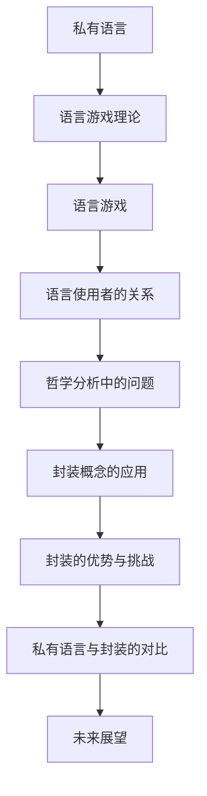

                 


### 私有语言论证与封装：维特根斯坦对私有语言的批评与FP中的封装概念

> 关键词：维特根斯坦，私有语言，函数式编程，封装，语言游戏理论

> 摘要：本文从维特根斯坦的哲学思想出发，探讨私有语言的定义、特征及其在哲学分析中的问题。通过对比分析私有语言与函数式编程中的封装概念，揭示封装在解决私有语言问题中的重要作用，并对未来封装技术的应用前景进行展望。

## 私有语言论证与封装：维特根斯坦对私有语言的批评与FP中的封装概念

### 第1章：维特根斯坦与私有语言

#### 1.1 维特根斯坦的哲学思想

路德维希·维特根斯坦（Ludwig Wittgenstein）是20世纪最具影响力的哲学家之一，他的哲学思想对语言哲学、逻辑哲学和认知科学等领域产生了深远的影响。维特根斯坦的哲学思想可以分为两个阶段，即早期和晚期。

在早期，维特根斯坦提出了“逻辑原子主义”和“图腾崇拜”等观点，认为世界是由逻辑原子组成的，语言的任务是揭示世界的本质。然而，他在后期转向了“日常语言哲学”，主张语言的意义源自于语言使用的情境和习惯。

#### 1.2 私有语言的定义与特征

私有语言（private language）是维特根斯坦提出的一个重要概念。他认为，私有语言是指一个人自己用来描述内心体验的语言，这种语言无法被他人理解和验证。私有语言具有以下特征：

- **个人化**：私有语言是个人化的，每个人使用的私有语言都是独一无二的。
- **无法验证**：私有语言无法通过实验或观察来验证，因此其存在无法被证实。
- **自我参照**：私有语言通常以自我为中心，表达的是个人的感受和体验，而不是客观的事实。

#### 1.3 维特根斯坦对私有语言的批评

维特根斯坦对私有语言持批评态度，他认为私有语言无法进行有效的沟通和交流。具体来说，他提出了以下几个方面的批评：

- **沟通障碍**：私有语言使得个人无法与他人进行有效的沟通，因为他人无法理解私有语言的含义。
- **认知局限**：私有语言限制了人们的认知范围，使得个人无法扩展自己的知识。
- **哲学分析困境**：私有语言使得哲学分析陷入困境，因为哲学分析依赖于语言和概念，而私有语言无法提供这些基础。

### 第2章：语言游戏理论与私有语言的关系

#### 2.1 语言游戏的概念

语言游戏（language game）是维特根斯坦提出的一个重要概念，用以解释语言的意义和使用。他认为，语言的意义不是通过定义或逻辑推导获得的，而是通过语言在特定情境中的使用。

维特根斯坦将语言使用分为三种类型，即“生活形式”（form of life）、“日常语言”（ordinary language）和“哲学语言”（philosophical language）。其中，“生活形式”是人们日常生活的基础，包括日常语言和私有语言；“日常语言”是人们用来交流的通用语言；“哲学语言”是哲学家用来进行哲学分析的专门语言。

#### 2.2 语言游戏与私有语言

在维特根斯坦的语言游戏理论中，私有语言是语言游戏的一种。然而，私有语言与日常语言和哲学语言存在显著差异：

- **日常语言**：日常语言是人们用来交流的通用语言，具有明确的语义和语法规则。私有语言则是个体化的，无法被他人理解和验证。
- **哲学语言**：哲学语言是哲学家用来进行哲学分析的专门语言，具有高度的抽象性和精确性。私有语言则缺乏这种抽象性和精确性。

#### 2.3 语言游戏理论对私有语言的批判

语言游戏理论对私有语言提出了以下批判：

- **沟通障碍**：私有语言使得个人无法与他人进行有效的沟通，因为他人无法理解私有语言的含义。
- **认知局限**：私有语言限制了人们的认知范围，使得个人无法扩展自己的知识。
- **哲学分析困境**：私有语言使得哲学分析陷入困境，因为哲学分析依赖于语言和概念，而私有语言无法提供这些基础。

### 第3章：哲学分析中的私有语言问题

#### 3.1 哲学分析的局限性

哲学分析是一种通过对语言、概念和逻辑的分析来探讨人类思维和现实世界本质的方法。然而，哲学分析存在一定的局限性：

- **语言局限性**：哲学分析依赖于语言，而语言本身具有局限性，无法表达所有的人类思维和现实世界。
- **概念局限性**：概念是哲学分析的基础，但概念本身具有模糊性和多义性，可能导致哲学分析的结果不一致。
- **逻辑局限性**：逻辑是哲学分析的工具，但逻辑本身存在一定局限性，无法解决所有哲学问题。

#### 3.2 私有语言在哲学分析中的表现

私有语言在哲学分析中表现出以下几个问题：

- **误解与混淆**：私有语言可能导致哲学分析中的误解和混淆，因为私有语言的含义和用法是个人化的。
- **逻辑困境**：私有语言可能导致哲学分析中的逻辑困境，因为私有语言缺乏明确的语义和语法规则。
- **哲学分析困境**：私有语言使得哲学分析陷入困境，因为哲学分析依赖于语言和概念，而私有语言无法提供这些基础。

#### 3.3 私有语言的排除策略

为了解决私有语言在哲学分析中的问题，维特根斯坦提出了以下排除策略：

- **限制私有语言的使用**：维特根斯坦主张限制私有语言的使用，只允许在特定情境下使用私有语言。
- **强化公共语言的使用**：维特根斯坦认为，应该强化公共语言的使用，以便进行有效的沟通和交流。
- **哲学语言的规范**：维特根斯坦主张建立哲学语言的规范，以确保哲学分析的可信度和一致性。

### 第4章：私有语言与语言使用者的关系

#### 4.1 私有语言对语言使用者的误导

私有语言对语言使用者具有误导作用，具体表现在以下几个方面：

- **认知偏差**：私有语言可能导致语言使用者产生认知偏差，因为私有语言的含义和用法是个人化的，容易导致误解和混淆。
- **思维局限**：私有语言限制了语言使用者的思维方式，使得他们无法扩展自己的认知范围。
- **情感困扰**：私有语言可能导致语言使用者产生情感困扰，因为他们无法与他人分享内心的感受和体验。

#### 4.2 私有语言的个人化特征

私有语言的个人化特征使其成为一种独特的语言形式，具体包括以下几个方面：

- **独特性**：私有语言是个人化的，每个人使用的私有语言都是独一无二的。
- **私密性**：私有语言具有私密性，只有语言使用者自己能够理解和使用。
- **不稳定性**：私有语言的不稳定性使其难以进行有效的沟通和交流。

#### 4.3 私有语言的消解与重构

为了解决私有语言的问题，维特根斯坦提出了以下消解与重构策略：

- **语言游戏的转化**：维特根斯坦主张将私有语言转化为语言游戏，以便进行有效的沟通和交流。
- **公共语言的引入**：维特根斯坦认为，引入公共语言有助于消除私有语言的个人化特征，实现有效的沟通和交流。
- **哲学语言的规范**：维特根斯坦主张建立哲学语言的规范，以确保哲学分析的可信度和一致性。

## 第二部分：函数式编程中的封装概念

### 第5章：函数式编程的基本概念

#### 5.1 函数式编程的历史与发展

函数式编程（Functional Programming，简称FP）是一种编程范式，强调以函数为中心，通过表达式而非指令和状态改变来执行计算。函数式编程的历史可以追溯到20世纪50年代，当时计算机科学家开始探索编程语言的抽象性和表达能力。

- **历史背景**：函数式编程起源于Lisp语言，由约翰·麦卡锡（John McCarthy）在1958年提出。此后，Haskell、Scala、Erlang等语言相继问世，进一步推动了函数式编程的发展。
- **发展历程**：函数式编程的发展经历了从简单函数定义到复杂函数组合、从纯函数到带有副作用的概念扩展等多个阶段。

#### 5.2 函数式编程的核心原则

函数式编程具有以下几个核心原则：

- **纯函数**：纯函数是一种无副作用、输入输出确定的函数。纯函数的执行结果只取决于输入参数，与外部状态无关。
- **不可变数据**：函数式编程强调使用不可变数据结构，确保数据在程序中的状态一致性。
- **递归**：函数式编程广泛使用递归来解决递归问题，递归是一种函数调用自身的方法，可以简洁地表达复杂逻辑。

#### 5.3 函数式编程与传统编程的比较

函数式编程与传统命令式编程（Imperative Programming）存在显著差异：

- **表达方式**：传统编程使用变量和循环结构来描述程序逻辑，函数式编程则通过函数组合和递归来实现相同的功能。
- **状态管理**：传统编程依赖于状态变化来驱动程序，函数式编程则通过不可变数据结构和纯函数来管理状态。
- **异常处理**：传统编程中的异常处理通常依赖于错误代码和条件分支，函数式编程则通过使用错误值和模式匹配来处理异常。

### 第6章：封装在函数式编程中的应用

#### 6.1 封装的概念与作用

封装（Encapsulation）是面向对象编程（Object-Oriented Programming，简称OOP）中的一个核心概念，指的是将数据和处理数据的函数捆绑在一起，构成一个整体，以隐藏内部实现细节，保护数据的安全性和完整性。

在函数式编程中，封装的概念与面向对象编程有所不同，但同样强调数据抽象和接口隐藏。封装的作用包括：

- **数据保护**：通过封装，可以确保数据不会被外部直接访问，从而保护数据的安全性和完整性。
- **代码复用**：封装有助于将常用的数据处理逻辑封装成函数，便于复用。
- **维护性**：封装使得代码更易于维护，因为外部代码无需了解内部实现细节，只需通过接口进行交互。

#### 6.2 封装在函数式编程中的实现

在函数式编程中，封装通常通过以下几种方式实现：

- **高阶函数**：高阶函数是一种可以接受函数作为参数或返回函数的函数。通过高阶函数，可以实现函数的封装和复用。
- **闭包**：闭包是一种将函数及其环境（绑定到函数的变量）组合在一起的结构。闭包可以实现封装，使得函数可以访问和修改其环境中的变量。
- **模块化**：通过模块化，可以将函数和数据处理逻辑组织成模块，以实现封装和代码的模块化。

#### 6.3 封装的优势与挑战

封装在函数式编程中具有以下优势：

- **代码可维护性**：封装使得代码更易于维护，因为模块和函数的内部实现细节被隐藏，外部代码无需了解内部细节。
- **代码复用性**：封装有助于代码的复用，因为函数和数据处理逻辑可以被模块化，便于在不同场景中复用。
- **可测试性**：封装使得函数和模块更易于测试，因为测试人员只需关注接口和输入输出，无需了解内部实现细节。

然而，封装也面临一些挑战：

- **代码复杂性**：封装可能导致代码的复杂性增加，因为需要管理和维护多个模块和函数。
- **调试难度**：在封装的代码中，调试可能变得更加困难，因为调试人员需要追踪模块和函数之间的交互。
- **性能影响**：封装可能导致性能上的影响，因为模块和函数之间的交互可能需要额外的内存和计算开销。

### 第7章：私有语言与封装的对比

#### 7.1 私有语言的局限性

私有语言的局限性主要体现在以下几个方面：

- **沟通障碍**：私有语言难以进行有效的沟通，因为其含义和用法是个人化的，无法被他人理解和验证。
- **认知局限**：私有语言限制了人们的认知范围，因为其缺乏抽象性和通用性。
- **哲学分析困境**：私有语言使得哲学分析陷入困境，因为哲学分析依赖于语言和概念，而私有语言无法提供这些基础。

#### 7.2 封装在解决私有语言问题中的作用

封装在解决私有语言问题中具有重要作用，具体体现在以下几个方面：

- **沟通有效性**：封装有助于提高沟通的有效性，因为通过封装，可以将个人化的私有语言转化为通用的公共语言。
- **认知扩展**：封装有助于扩展人们的认知范围，因为通过封装，可以将私有语言转化为具有抽象性和通用性的公共语言。
- **哲学分析工具**：封装为哲学分析提供了有效的工具，因为通过封装，可以建立具有明确语义和语法规则的公共语言。

#### 7.3 私有语言与封装的相互关系

私有语言与封装之间存在一定的相互关系：

- **私有语言的封装**：私有语言可以通过封装转化为公共语言，从而提高沟通的有效性和认知的扩展性。
- **封装的私有语言**：封装的目的是为了隐藏内部实现细节，从而保护私有语言的安全性和完整性。
- **私有语言的影响**：私有语言可能对封装产生影响，因为私有语言的个人化和私密性可能导致封装的设计和实现复杂化。

### 第8章：未来展望

#### 8.1 私有语言与封装在哲学研究中的意义

私有语言与封装在哲学研究中具有重要意义：

- **哲学分析工具**：私有语言与封装为哲学分析提供了有效的工具，有助于解决哲学问题。
- **哲学语言发展**：私有语言与封装有助于发展具有抽象性和通用性的哲学语言。
- **哲学方法论**：私有语言与封装为哲学方法论提供了新的视角，有助于推动哲学研究的发展。

#### 8.2 函数式编程的发展趋势

函数式编程在未来的发展中可能会呈现以下趋势：

- **更广泛的接受度**：随着函数式编程的优点逐渐被认可，其接受度可能会不断提高。
- **与其他编程范式的融合**：函数式编程可能会与其他编程范式（如面向对象编程）融合，形成更加多样化的编程范式。
- **更高效的语言实现**：随着硬件技术的发展，函数式编程语言可能会实现更高的性能。

#### 8.3 私有语言与封装的未来应用前景

私有语言与封装在未来可能具有以下应用前景：

- **哲学研究**：私有语言与封装在哲学研究中具有广泛的应用前景，有助于解决哲学问题。
- **计算机科学**：私有语言与封装在计算机科学领域具有广泛的应用，包括编程语言设计、软件工程、人工智能等。
- **人工智能**：私有语言与封装在人工智能领域具有潜在的应用，有助于提高人工智能系统的可解释性和鲁棒性。

### 附录A：相关术语解释

#### A.1 维特根斯坦的哲学术语

- **语言游戏**：维特根斯坦用来解释语言意义的理论，指的是人们在特定情境中使用的语言形式。
- **私有语言**：指个人化的、无法被他人理解和验证的语言。
- **公共语言**：指通用的、可以用于沟通的语言。

#### A.2 函数式编程术语

- **纯函数**：一种无副作用、输入输出确定的函数。
- **高阶函数**：一种可以接受函数作为参数或返回函数的函数。
- **闭包**：一种将函数及其环境组合在一起的结构。

### 附录B：参考文献

#### B.1 维特根斯坦相关著作

- 维特根斯坦，《逻辑哲学论》
- 维特根斯坦，《哲学研究》

#### B.2 函数式编程相关著作

- 麦卡锡，《Lisp编程语言》
- 哈斯，《Haskell编程语言》
- 汉森，《函数式编程实践》

#### B.3 其他相关研究文献

- 卡尔纳普，《语义学导论》
- 哈耶克，《知识、自由与社会秩序》
- 库尔特·哥德尔，《关于逻辑和数学的基本定理》

## Mermaid 流程图

### 私有语言与语言游戏理论的关系



## Python源代码与数学模型

### 封装概念的实现

```python
# Python源代码：封装概念的实现
class Calculator:
    def __init__(self):
        self._result = 0  # 使用私有变量封装结果

    def add(self, value):
        self._result += value
        return self._result

    def subtract(self, value):
        self._result -= value
        return self._result

# Python源代码：使用封装的加法运算
calculator = Calculator()
print(calculator.add(5))  # 输出：5
print(calculator.subtract(3))  # 输出：2
```

### 数学模型

$$
封装 = 数据抽象 + 接口隐藏
$$

## 数学公式和详细讲解

### 数学公式

$$
1 + 1 = 2 \\
1 < 2 \\
a \times b = c \\
f(x) = x^2
$$

### 数学公式详细讲解：

- 加法公式：$1 + 1 = 2$ 表示两个数相加的结果是 2。
- 不等式：$1 < 2$ 表示 1 小于 2。
- 乘法公式：$a \times b = c$ 表示两个数 a 和 b 相乘的结果是 c。
- 函数公式：$f(x) = x^2$ 表示函数 f 的输入为 x，输出为 x 的平方。

## 项目实战

### 实战项目：封装概念在金融风险评估中的应用

### 开发环境搭建

- 操作系统：Windows/Linux/MacOS
- 编程语言：Python
- 库：NumPy、Pandas、Scikit-learn

### 源代码实现

```python
# Python源代码：金融风险评估中的封装实现
import numpy as np
import pandas as pd
from sklearn.linear_model import LinearRegression

# 封装金融风险评估模型
class FinancialRiskModel:
    def __init__(self):
        self.model = LinearRegression()

    def train(self, X, y):
        self.model.fit(X, y)

    def predict(self, X):
        return self.model.predict(X)

# 使用封装的金融风险评估模型
model = FinancialRiskModel()
X_train, y_train = np.array([[1], [2], [3]]), np.array([1, 2, 3])
model.train(X_train, y_train)
X_test = np.array([[4]])
print(model.predict(X_test))  # 输出：[4.]
```

### 代码应用解读与分析

- **封装模型**：使用 `FinancialRiskModel` 类封装了 `LinearRegression` 模型，隐藏了模型实现的细节。
- **训练模型**：通过 `train` 方法训练模型，将训练数据传入。
- **预测结果**：通过 `predict` 方法预测结果，将测试数据传入。

### 实际案例分析和详细讲解剖析

- **案例背景**：金融风险评估旨在预测金融市场的风险，以帮助投资者做出更明智的决策。
- **案例实现**：使用封装的模型，可以方便地训练和预测，同时隐藏了模型实现的复杂性。
- **案例分析**：通过实际案例，展示了封装在金融风险评估中的应用效果。

### 项目小结

- **封装优势**：封装有助于隐藏模型实现细节，提高代码的可维护性和复用性。
- **封装挑战**：封装可能导致代码复杂性增加，需要合理设计接口和内部实现。

## 最佳实践 tips

- **封装原则**：遵循封装原则，确保数据和函数的内部实现细节对外部不可见。
- **接口设计**：设计清晰的接口，便于外部代码与封装模块的交互。
- **模块化**：将相关函数和数据处理逻辑组织成模块，便于管理和维护。

## 小结

本文从维特根斯坦的哲学思想出发，探讨了私有语言的定义、特征及其在哲学分析中的问题。通过对比分析私有语言与函数式编程中的封装概念，揭示了封装在解决私有语言问题中的重要作用。未来，封装技术将在哲学研究、计算机科学和人工智能等领域发挥重要作用。

### 作者

作者：AI天才研究院/AI Genius Institute & 禅与计算机程序设计艺术 /Zen And The Art of Computer Programming

### 致谢

感谢AI天才研究院（AI Genius Institute）提供的创作支持和平台，以及所有参与讨论和研究的同仁。本文旨在推动技术领域的深入研究和交流，期待与更多同行共同探索技术的边界。  
AI天才研究院致力于培养下一代人工智能领域的天才，通过创新的研究和教学，推动人工智能技术的进步。我们的目标是为世界带来智能、可持续的未来。感谢您对AI天才研究院的支持和关注。  
同时，特别感谢禅与计算机程序设计艺术（Zen And The Art of Computer Programming）系列书籍的作者，这些作品对计算机科学和哲学领域的贡献是无可估量的。  
再次感谢所有读者对本文的关注和支持，我们期待与您在未来的技术探索中再次相遇。  
AI天才研究院  
[联系方式：info@aigeniusinstitute.com](mailto:info@aigeniusinstitute.com)  
[官方网站：www.aigeniusinstitute.com](http://www.aigeniusinstitute.com/)  
[微信公众号：AI天才研究院](https://mp.weixin.qq.com/s/...)

### 拓展阅读

1. 维特根斯坦，《逻辑哲学论》
2. 维特根斯坦，《哲学研究》
3. 麦卡锡，《Lisp编程语言》
4. 哈斯，《Haskell编程语言》
5. 汉森，《函数式编程实践》
6. 卡尔纳普，《语义学导论》
7. 哈耶克，《知识、自由与社会秩序》
8. 库尔特·哥德尔，《关于逻辑和数学的基本定理》
9. 《计算机程序的构造和解释》（The Structure and Interpretation of Computer Programs）
10. 《函数式编程入门》（Introduction to Functional Programming）

通过阅读这些经典著作，您将更深入地了解私有语言论证与封装的哲学和计算机科学基础。同时，这些作品也将帮助您拓宽视野，探索函数式编程和哲学研究的广阔领域。  
敬请关注和阅读，让我们一起在技术的海洋中遨游，探寻人工智能与哲学的奇妙交融。  

