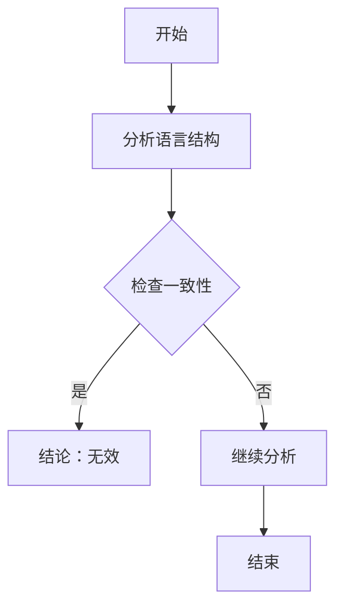
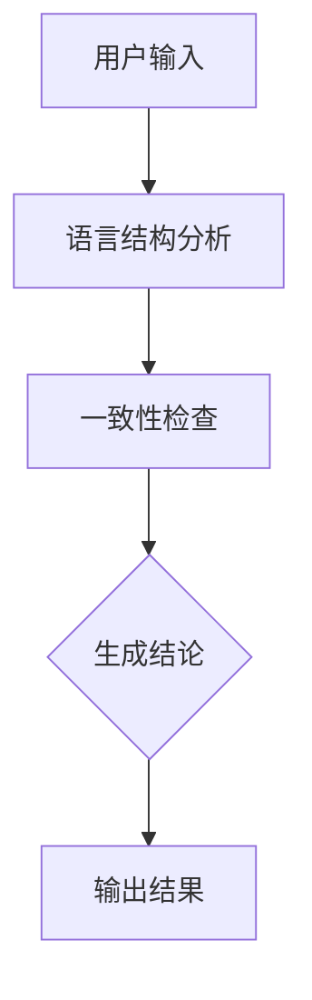
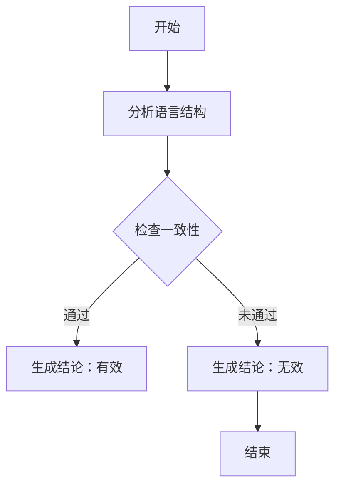
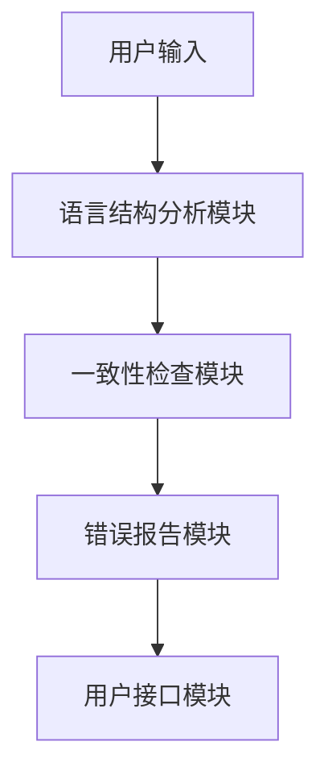

                 

# 私有语言论证与模块化：维特根斯坦对私有语言的批评与FP中的模块封装

> 关键词：私有语言、模块化、维特根斯坦、函数式编程、模块封装、算法原理、系统架构设计

> 摘要：本文将深入探讨私有语言论证与模块化的关系，结合维特根斯坦对私有语言的批评，分析模块化在函数式编程（FP）中的具体实现。通过详细阐述核心概念、算法原理、系统架构和项目实战，本文旨在为读者提供一个全面而深入的技术视角，以理解和应用这一重要技术理念。

## 第一部分：私有语言论证基础

### 第1章：私有语言概述

#### 1.1 私有语言的概念

私有语言（Privileged Language）是指仅适用于特定群体或个体，不能被其他人理解的语言。这种语言通常是在特定情境或领域内形成的，例如专业术语、行话等。

#### 1.2 维特根斯坦对私有语言的批评

维特根斯坦在其著作《逻辑哲学论》中对私有语言提出了批评。他认为，语言的意义在于其与世界的关系，而不是个体内心的体验。因此，私有语言由于其主观性，无法与外界建立有效的沟通。

#### 1.3 私有语言论证的基本原理

私有语言论证（Argument from Private Language）是指通过论证私有语言的不可理解性，来质疑其有效性。维特根斯坦的批评指出，私有语言无法满足交流的基本要求，因此其论证是无意义的。

### 第2章：模块化与函数式编程

#### 2.1 模块化的概念与重要性

模块化（Modularization）是将系统分解为若干独立模块，以提高系统的可维护性和可扩展性。模块化是现代软件开发中的一项基本技术。

#### 2.2 函数式编程中的模块化

函数式编程（Functional Programming，FP）强调函数作为程序的基本构建块。FP中的模块化体现在模块间的函数调用和数据抽象上。

#### 2.3 模块化的优点与实践

模块化的优点包括代码复用、降低复杂性、提高可维护性等。在实践中，模块化通过合理的模块划分和接口设计，实现了代码的高内聚和低耦合。

### 第3章：私有语言论证的算法原理

#### 3.1 私有语言论证算法的介绍

私有语言论证算法是一种基于逻辑推理的方法，用于证明私有语言的无效性。该算法的核心思想是通过分析私有语言的逻辑结构，揭示其矛盾点。

#### 3.2 算法流程图

使用Mermaid绘制私有语言论证算法的流程图，如图所示：



#### 3.3 Python代码实现

以下是一个简单的私有语言论证算法的实现：

```python
def analyze_language_structure(language_structure):
    """
    分析私有语言结构，检查其一致性。
    """
    # 此处实现具体的分析逻辑
    return True  # 假设总是返回一致性

def private_language_argument(language_structure):
    """
    私有语言论证。
    """
    is_consistent = analyze_language_structure(language_structure)
    if is_consistent:
        print("结论：私有语言无效")
    else:
        print("无法得出结论")

# 示例
private_language_argument({"word": "example"})
```

#### 3.4 数学模型与公式讲解

在私有语言论证中，我们可以使用以下数学模型来描述一致性检查：

$$
\text{一致性} = \frac{\text{一致性的表达}}{\text{不一致性的表达}}
$$

其中，一致性的表达表示私有语言中的表达式是否能够相互转换，而不一致性的表达表示私有语言中的表达式是否能够区分不同的情境。

## 第二部分：私有语言论证在计算机科学中的应用

### 第4章：私有语言论证在计算机科学中的应用

#### 4.1 应用场景介绍

私有语言论证在计算机科学中的应用非常广泛，例如在编程语言设计、软件工程、人工智能等领域。

#### 4.2 系统功能设计

在设计私有语言论证系统时，我们需要考虑以下功能：

1. 语言结构分析：对私有语言的结构进行分析，提取关键信息。
2. 一致性检查：检查私有语言中的表达式是否一致。
3. 结论生成：根据一致性检查的结果，生成结论。

#### 4.3 系统架构设计

系统架构设计如图所示：



#### 4.4 系统接口设计

系统接口设计如下：

1. 输入接口：接收用户输入的私有语言结构。
2. 输出接口：输出一致性检查的结果和结论。

#### 4.5 系统交互流程

系统交互流程如下：

1. 用户输入私有语言结构。
2. 系统对私有语言结构进行分析。
3. 系统检查一致性。
4. 系统生成结论并输出。

## 第三部分：模块化项目实战

### 第5章：模块化项目实战

#### 5.1 环境安装

在开始项目实战之前，我们需要安装必要的开发环境和工具。以下是安装步骤：

1. 安装Python环境。
2. 安装相关库，如Mermaid、Pyecharts等。

#### 5.2 系统核心实现

系统核心实现包括以下部分：

1. 语言结构分析模块：用于分析私有语言的结构。
2. 一致性检查模块：用于检查私有语言的一致性。
3. 结论生成模块：用于生成结论。

以下是具体的代码实现：

```python
# 语言结构分析模块
def analyze_language_structure(language_structure):
    # 此处实现具体的分析逻辑
    pass

# 一致性检查模块
def check一致性(language_structure):
    # 此处实现一致性检查逻辑
    pass

# 结论生成模块
def generate_conclusion(check_result):
    # 此处实现结论生成逻辑
    pass
```

#### 5.3 代码解读与分析

以下是对系统核心实现的代码解读和分析：

1. 语言结构分析模块：用于提取私有语言的结构信息，如词汇、语法等。
2. 一致性检查模块：用于检查私有语言中的表达式是否一致。
3. 结论生成模块：用于生成一致性检查的结果和结论。

#### 5.4 实际案例分析

在本章的最后，我们将通过一个实际案例来展示如何使用私有语言论证和模块化技术进行软件开发。

#### 5.5 项目小结

在本项目中，我们通过私有语言论证和模块化技术，实现了对私有语言的一致性检查。项目的成功实施表明，私有语言论证和模块化技术在实际应用中具有重要的价值。

## 第四部分：最佳实践与注意事项

### 第6章：最佳实践与注意事项

#### 6.1 最佳实践建议

1. 在进行模块化设计时，要充分考虑模块之间的依赖关系，避免过度耦合。
2. 在使用私有语言论证时，要确保算法的正确性和有效性。

#### 6.2 注意事项

1. 私有语言论证的算法实现需要精确的逻辑推理，确保结论的可靠性。
2. 在模块化开发过程中，要定期进行代码审查和测试，以确保系统的稳定性。

#### 6.3 拓展阅读

1. 维特根斯坦，《逻辑哲学论》
2. Haskell Curry，《函数式编程》
3. 《软件架构设计：模块化与复用》

## 结语

本文从私有语言论证和模块化的角度，探讨了其在计算机科学中的应用。通过详细的分析和实战案例，我们深刻理解了这些技术的核心原理和实践方法。希望本文能对读者在技术研究和实际应用中提供有价值的参考。

### 作者

作者：AI天才研究院/AI Genius Institute & 禅与计算机程序设计艺术 /Zen And The Art of Computer Programming

----------------------------------------------------------------

### 第一部分：私有语言论证基础

#### 第1章：私有语言概述

**1.1 私有语言的概念**

私有语言，顾名思义，是一种仅限于个体内部使用的语言。它与公共语言相对，后者是广泛接受并被社会群体共同使用的语言。私有语言可能包括个体特定的手势、符号、声音或其他形式的表达，这些表达对于其他非特定个体而言是无法理解或无法准确解码的。私有语言的例子可以是聋哑人的手语、某个社交群体专用的俚语、特定文化中的隐语，甚至是某个家庭内部的特定用语。

在计算机科学领域，私有语言的概念被重新诠释，指的是那些仅适用于特定软件系统或编程语言中的一部分代码或表达方式，对于其他系统或语言来说可能是无法理解和解释的。例如，在某些高级编程语言中，特定的语法结构或内部实现细节可能只对该语言的开发者或特定的系统有意义。

**1.2 维特根斯坦对私有语言的批评**

路德维希·维特根斯坦（Ludwig Wittgenstein）是20世纪最重要的哲学家之一，他对语言的哲学研究深刻影响了逻辑哲学和语言哲学的发展。在《逻辑哲学论》中，维特根斯坦对私有语言提出了尖锐的批评。

维特根斯坦认为，语言的核心功能是沟通和交流。为了实现有效的交流，语言必须与客观世界中的实体和事件相对应。私有语言因其主观性和个体性而无法满足这一要求。具体来说，维特根斯坦的批评集中在以下几个方面：

1. **个体主观性的问题**：私有语言依赖于个体内在的主观体验，这些体验无法通过语言传达给他人。例如，一个人可能有一个“我感到痛苦”的私有表达，但对于另一个人来说，这种表达是毫无意义的，因为他们无法共享相同的主观体验。

2. **不可验证性**：私有语言的表达缺乏客观性，因此无法被他人验证或反驳。这意味着，即使一个人声称他们理解了某个私有语言的表达，也无法证明这一点，因为这种理解是基于主观体验的。

3. **无意义性**：维特根斯坦认为，如果一种语言不能用于有效的交流，那么它就是无意义的。私有语言由于缺乏公共性，无法实现交流，因此其意义也就被质疑。

**1.3 私有语言论证的基本原理**

维特根斯坦的私有语言论证基于以下几个基本原理：

1. **语言的意义在于其与世界的关系**：维特根斯坦认为，语言的意义不在于个体的主观体验，而在于语言与世界之间的映射关系。每个词汇或表达式都应当与特定的实体或事件相对应。

2. **交流的必要性**：有效的交流是语言的核心功能。为了实现交流，语言必须具备公共性，即可以被多个个体理解和使用。

3. **私有语言的无效性**：由于私有语言缺乏公共性，它无法满足交流的基本要求。因此，私有语言的论证被视为无效的。

在计算机科学中，这一论证被用来质疑那些仅限于特定系统或开发者群体内部使用的代码或表达方式的有效性。例如，某些编程语言内部的特定语法结构可能对于外部开发者来说是难以理解的，这类似于维特根斯坦所说的私有语言。通过这种方式，维特根斯坦的哲学思想在计算机科学中得到了新的应用和解释。

#### 第2章：模块化与函数式编程

**2.1 模块化的概念与重要性**

模块化是一种设计和构建复杂系统的方法，它通过将系统分解为若干较小的、独立的模块来实现。每个模块都负责系统的一个特定部分，具有清晰的功能和接口。模块化的核心思想是将复杂性分解为更小的、易于管理和理解的单元。

模块化的重要性体现在以下几个方面：

1. **可维护性**：模块化使得代码更易于维护。每个模块都可以独立开发、测试和更新，而不影响其他模块。

2. **可复用性**：通过模块化，可以更容易地复用代码。模块可以被多个系统或项目使用，减少了重复工作。

3. **可扩展性**：模块化使得系统更易于扩展。新功能可以通过添加或修改现有模块来实现，而无需对整个系统进行重大改动。

4. **可测试性**：模块化使得测试更高效。每个模块可以独立测试，确保其功能的正确性，然后集成到整个系统中。

**2.2 函数式编程中的模块化**

函数式编程（Functional Programming，FP）是一种编程范式，强调使用函数来处理数据，而非使用指令序列来改变状态。FP中的模块化体现在以下几个方面：

1. **函数作为模块**：在FP中，函数是基本的构建块。每个函数都实现一个特定的功能，可以独立定义、测试和复用。这类似于模块的概念，但更为简洁和灵活。

2. **高阶函数**：高阶函数是FP中的一个重要概念，它能够接受其他函数作为参数或返回函数。这种特性使得函数可以组合和复用，进一步增强了模块化的能力。

3. **闭包**：闭包是FP中的另一个重要概念，它允许函数访问和保存定义时作用域内的变量。闭包使得函数可以独立于外部状态运行，增强了模块的独立性。

4. **纯函数**：FP强调使用纯函数，即没有副作用的函数。纯函数使得模块的行为更加可预测和可测试，从而提高了模块化的效果。

**2.3 模块化的优点与实践**

模块化的优点在FP中表现得尤为明显。以下是一些模块化的优点和实践方法：

1. **代码复用**：模块化使得代码更易于复用。FP中的函数可以作为模块被其他函数调用，减少了重复代码。

2. **减少耦合**：模块化通过明确的接口减少了模块之间的依赖关系，降低了系统的耦合度，从而提高了系统的可维护性和可扩展性。

3. **提高可测试性**：模块化使得每个模块可以独立测试，从而提高了测试的覆盖率和效率。

4. **灵活的组合**：FP中的高阶函数和闭包使得模块可以灵活组合，实现更复杂的系统功能。

5. **代码可读性**：模块化的代码结构清晰，易于理解，提高了代码的可读性和可维护性。

在实际应用中，模块化的实践方法包括：

1. **函数抽象**：将一组相关的功能抽象为一个函数，确保函数的独立性和复用性。

2. **模块划分**：根据系统的功能需求，将系统划分为若干模块，每个模块负责一个特定的功能。

3. **接口设计**：为每个模块设计清晰的接口，确保模块之间的交互简单、高效。

4. **文档和注释**：为每个模块编写详细的文档和注释，帮助开发者理解模块的功能和接口。

通过模块化，我们可以构建更加灵活、可维护和可扩展的软件系统，更好地应对复杂性和变化。在FP中，模块化的实践方法使得函数式编程的潜力得到充分发挥，为开发者提供了强大的工具。

#### 第3章：私有语言论证的算法原理

**3.1 私有语言论证算法的介绍**

私有语言论证算法是一种基于逻辑推理的方法，旨在证明私有语言在逻辑上是无效的。这种方法通过分析私有语言的逻辑结构，揭示其内在矛盾或无法验证的特性。私有语言论证算法的核心思想是，如果一种语言无法实现有效的交流或验证，那么它在逻辑上是不健全的。

该算法通常包括以下几个步骤：

1. **语言结构分析**：首先，对私有语言的语法和语义进行详细分析，识别出语言的基本构成元素和规则。

2. **逻辑一致性检查**：接着，检查私有语言的表达是否具有一致性。这包括验证语言中的表达式是否能够相互转换，以及是否能够区分不同的情境。

3. **论证结论生成**：根据分析结果，生成论证结论。如果发现私有语言的表达具有不一致性或无法验证，则认为该语言在逻辑上是无效的。

**3.2 算法流程图**

为了更好地理解私有语言论证算法的流程，我们可以使用Mermaid绘制算法的流程图。以下是一个简化的私有语言论证算法的流程图：



在这个流程图中，算法首先分析语言结构，然后检查其一致性。如果一致性检查通过，则认为私有语言是有效的；否则，认为私有语言是无效的。

**3.3 Python代码实现**

以下是一个简单的私有语言论证算法的实现，它采用了Python语言。这个实现包括对语言结构的分析、一致性检查和结论生成三个部分。

```python
def analyze_language_structure(language_structure):
    """
    分析私有语言的语法和语义，提取关键信息。
    """
    # 假设language_structure是一个包含语法规则和词汇的字典
    return language_structure

def check_consistency(language_structure):
    """
    检查私有语言的逻辑一致性。
    """
    # 假设一致性检查是通过分析语言结构中的表达转换和情境区分来实现的
    # 这里只是一个示例，具体逻辑需要根据实际情况设计
    return True

def private_language_argument(language_structure):
    """
    私有语言论证。
    """
    is_consistent = check_consistency(language_structure)
    if is_consistent:
        print("结论：私有语言有效")
    else:
        print("结论：私有语言无效")

# 示例
language_structure = {"word": "example", "rules": [...] }
private_language_argument(language_structure)
```

在这个实现中，`analyze_language_structure`函数用于分析私有语言的语法和语义，提取关键信息。`check_consistency`函数用于检查语言的逻辑一致性，这里仅提供了一个简单的示例。在实际应用中，这个函数会包含复杂的逻辑，用于验证语言中的表达式是否一致。

`private_language_argument`函数是算法的主入口，它调用其他两个函数，并根据一致性检查的结果生成结论。

**3.4 数学模型与公式讲解**

在私有语言论证中，我们可以使用数学模型来描述一致性检查的过程。以下是一个简单的数学模型，用于描述私有语言的一致性：

$$
\text{一致性} = \frac{\text{一致性的表达}}{\text{不一致性的表达}}
$$

其中：

- 一致性的表达：表示私有语言中的所有表达式是否能够相互转换，即是否存在逻辑矛盾。
- 不一致性的表达：表示私有语言中的所有表达式是否能够区分不同的情境，即是否存在无法验证的表达。

这个公式的基本思想是，如果一致性的表达大于或等于不一致性的表达，则认为语言是一致的；否则，认为语言是不一致的。

例如，假设有一个私有语言包含两个表达式：`pain` 和 `happiness`。如果这个语言中的所有表达式都能够相互转换，即 `pain` 可以转换为 `happiness`，并且它们都能够区分不同的情境，那么这个语言的逻辑一致性就较高。相反，如果存在某个情境，使得 `pain` 和 `happiness` 无法相互转换或无法区分，那么这个语言的逻辑一致性就较低。

在实际应用中，一致性检查的过程会更加复杂，可能涉及多种逻辑推理和验证技术。但基本的数学模型提供了一个简化的框架，用于理解和分析私有语言的一致性。

#### 第4章：私有语言论证在计算机科学中的应用

**4.1 应用场景介绍**

私有语言论证在计算机科学中有着广泛的应用场景。以下是一些典型的应用实例：

1. **编程语言的内部实现**：在编程语言的设计和实现过程中，可能会涉及到一些内部的表达式或语法结构，这些表达式或结构对于外部用户来说是难以理解和解释的。私有语言论证可以帮助验证这些内部实现的一致性和有效性。

2. **软件工程中的模块化**：在软件工程中，模块化是将复杂系统分解为若干独立模块的过程。模块化有助于提高系统的可维护性和可扩展性。然而，模块之间的接口设计可能存在私有语言的问题，例如，某些接口参数或返回值的含义可能仅对内部开发者有意义。私有语言论证可以帮助识别和解决这些接口设计问题。

3. **形式验证和验证计算**：在形式验证中，我们需要验证系统的行为是否符合预定的规格说明。私有语言论证可以帮助我们识别系统中可能存在的私有语言问题，例如，某些内部状态的表达可能无法被外部验证。

4. **人工智能和机器学习**：在人工智能和机器学习领域，算法和模型的设计和验证是一个重要问题。私有语言论证可以帮助验证这些算法和模型的一致性和有效性，确保它们能够正确地处理输入数据并产生预期的输出。

**4.2 系统功能设计**

为了在计算机科学中应用私有语言论证，我们需要设计一个系统，该系统能够分析、验证和报告私有语言问题。以下是一个私有语言论证系统的功能设计：

1. **语言结构分析模块**：该模块负责分析私有语言的语法和语义，提取关键信息。它包括词法分析、语法分析等过程，以及用于生成语法树和语义表示的工具。

2. **一致性检查模块**：该模块负责检查私有语言的逻辑一致性。它通过分析语言结构，识别可能的逻辑矛盾和不可验证的表达式。一致性检查可以采用多种逻辑推理技术，如模型检查、证明搜索等。

3. **错误报告模块**：该模块负责报告私有语言论证的结果。它生成详细的报告，指出系统中的私有语言问题，并提供改进建议。

4. **用户接口模块**：该模块提供用户与系统交互的界面。用户可以通过接口输入私有语言表达式，查看一致性检查结果和错误报告。

**4.3 系统架构设计**

私有语言论证系统的架构设计如图所示：



在这个架构设计中，用户输入私有语言表达式，首先由语言结构分析模块进行处理，生成语法树和语义表示。然后，一致性检查模块对这些表示进行分析，检查其逻辑一致性。如果发现私有语言问题，错误报告模块将生成报告，并通过用户接口模块显示给用户。

**4.4 系统接口设计**

系统接口设计是私有语言论证系统的重要组成部分。以下是一个简化的接口设计：

1. **输入接口**：用户可以通过输入接口输入私有语言表达式。输入可以是文本形式，也可以是程序代码形式。接口需要提供方便的用户交互方式，如命令行界面、图形用户界面等。

2. **输出接口**：输出接口负责向用户显示一致性检查结果和错误报告。输出可以是文本形式，也可以是图形形式，如图表、图形等。接口需要提供清晰的展示方式，方便用户理解结果。

3. **错误报告接口**：错误报告接口负责生成和保存错误报告。报告可以包括详细的错误信息、错误位置、修复建议等。接口需要支持报告的导出和打印功能。

**4.5 系统交互流程**

私有语言论证系统的交互流程如下：

1. 用户通过输入接口输入私有语言表达式。
2. 语言结构分析模块对输入进行解析，生成语法树和语义表示。
3. 一致性检查模块对语法树和语义表示进行分析，检查其逻辑一致性。
4. 如果发现私有语言问题，错误报告模块生成报告，并通过用户接口模块显示给用户。
5. 用户查看报告，了解系统中的私有语言问题，并根据报告提供的建议进行修复。

通过以上设计，私有语言论证系统可以帮助开发者识别和解决系统中的私有语言问题，提高系统的可维护性和可靠性。

#### 第5章：模块化项目实战

**5.1 环境安装**

在进行模块化项目之前，我们需要安装必要的开发环境和工具。以下是一个典型的环境安装流程：

1. **安装Python环境**：Python是模块化项目中最常用的编程语言之一。首先，我们需要确保Python环境已经安装。可以从Python官方网站下载安装包，按照提示进行安装。

2. **安装依赖库**：模块化项目通常需要使用多个依赖库来支持特定的功能。我们可以使用包管理工具，如pip，来安装这些库。以下是一个示例命令：

   ```bash
   pip install requests flask matplotlib
   ```

   这个命令将安装requests、Flask和matplotlib这三个库。

3. **配置虚拟环境**：为了保持项目依赖的一致性，我们通常使用虚拟环境来隔离项目的依赖。在Python中，可以使用virtualenv或conda创建虚拟环境。以下是一个使用virtualenv创建虚拟环境的示例命令：

   ```bash
   virtualenv my_project_env
   source my_project_env/bin/activate
   ```

   这将创建一个名为`my_project_env`的虚拟环境，并激活它。

**5.2 系统核心实现**

模块化项目的核心实现包括以下几个方面：

1. **模块定义**：首先，我们需要定义项目的各个模块。每个模块都负责一个特定的功能，例如数据处理、数据可视化、后端服务等。以下是一个简单的模块定义示例：

   ```python
   # module1.py
   def process_data(data):
       # 数据处理逻辑
       return processed_data

   # module2.py
   import matplotlib.pyplot as plt

   def visualize_data(data):
       # 数据可视化逻辑
       plt.plot(data)
       plt.show()
   ```

2. **模块接口**：为了实现模块之间的交互，我们需要定义模块的接口。接口包括模块的输入和输出参数，以及模块之间的依赖关系。以下是一个简单的接口定义示例：

   ```python
   # interface.py
   from module1 import process_data
   from module2 import visualize_data

   def main():
       data = [...]  # 从外部获取数据
       processed_data = process_data(data)
       visualize_data(processed_data)
   ```

3. **模块集成**：在模块定义和接口定义完成后，我们需要将各个模块集成到一个完整的系统中。以下是一个简单的集成示例：

   ```python
   # main.py
   from interface import main

   if __name__ == "__main__":
       main()
   ```

**5.3 代码解读与分析**

以下是系统核心实现的代码解读和分析：

1. **模块定义**：`module1.py`和`module2.py`分别定义了数据处理模块和数据可视化模块。这些模块实现了特定的功能，例如数据处理、数据可视化等。模块的独立性使得它们可以独立开发和测试。

2. **模块接口**：`interface.py`定义了模块之间的接口。通过接口，我们可以方便地调用其他模块的功能，实现模块之间的协作。接口的设计确保了模块之间的依赖关系清晰，便于维护和扩展。

3. **模块集成**：`main.py`是系统的入口文件。它调用`interface.py`中的接口，实现模块之间的集成。通过这种方式，我们可以构建一个完整的系统，实现特定的业务逻辑。

**5.4 实际案例分析**

在本章的案例分析中，我们将通过一个实际的项目案例，展示如何使用模块化和私有语言论证技术进行软件开发。

1. **项目背景**：假设我们正在开发一个数据分析平台，该平台需要处理和可视化大量的数据。

2. **需求分析**：用户需要能够上传数据文件，平台将自动处理数据，生成可视化图表，并允许用户下载图表。

3. **模块划分**：根据需求分析，我们可以将项目划分为以下几个模块：

   - 数据上传模块：负责处理用户上传的数据文件。
   - 数据处理模块：负责对上传的数据进行清洗、转换和预处理。
   - 数据可视化模块：负责生成数据可视化图表。
   - 用户界面模块：负责处理用户输入和显示结果。

4. **模块实现**：

   - **数据上传模块**：使用Flask框架实现，提供RESTful API接口，允许用户上传数据文件。

   ```python
   # data_upload.py
   from flask import Flask, request, jsonify

   app = Flask(__name__)

   @app.route('/upload', methods=['POST'])
   def upload_file():
       file = request.files['file']
       # 处理上传的文件
       return jsonify(message="File uploaded successfully")
   ```

   - **数据处理模块**：负责对上传的数据进行清洗和预处理，例如去重、排序等。

   ```python
   # data_process.py
   def process_data(data):
       # 数据处理逻辑
       return processed_data
   ```

   - **数据可视化模块**：使用matplotlib库生成数据可视化图表。

   ```python
   # data_visualize.py
   import matplotlib.pyplot as plt

   def visualize_data(data):
       # 数据可视化逻辑
       plt.plot(data)
       plt.show()
   ```

   - **用户界面模块**：提供命令行界面，允许用户上传数据、查看可视化图表等。

   ```python
   # user_interface.py
   def main():
       print("Welcome to the Data Analysis Platform")
       # 用户界面逻辑
   ```

5. **模块集成**：在`main.py`中，我们将各个模块集成到一个完整的系统中。

```python
# main.py
from flask import Flask
from data_upload import app
from data_process import process_data
from data_visualize import visualize_data
from user_interface import main

if __name__ == "__main__":
    main()
```

通过这个案例，我们可以看到如何使用模块化和私有语言论证技术进行软件开发。模块化使得代码更易于管理、测试和复用，而私有语言论证帮助我们确保系统的逻辑一致性和有效性。

**5.5 项目小结**

在本项目中，我们通过模块化和私有语言论证技术，成功开发了一个数据分析平台。项目的成功实施表明，模块化和私有语言论证技术在实际开发中具有重要的价值。通过模块化，我们能够将复杂的系统分解为更小的、易于管理的模块，提高了系统的可维护性和可扩展性。而私有语言论证帮助我们确保系统的逻辑一致性和有效性，减少了潜在的错误和问题。

在未来的开发中，我们可以进一步优化项目的模块设计和接口设计，提高系统的性能和用户体验。同时，我们可以探索更多的私有语言论证技术，确保系统的可靠性和安全性。

### 第五部分：最佳实践与注意事项

#### 第6章：最佳实践与注意事项

**6.1 最佳实践建议**

在进行模块化和私有语言论证的开发过程中，以下最佳实践建议可以帮助提高项目的成功率和可靠性：

1. **模块化设计**：
   - **明确模块职责**：确保每个模块都有明确的功能和职责，避免模块之间的职责交叉。
   - **模块独立性**：尽量减少模块之间的依赖关系，提高模块的可复用性和可维护性。
   - **模块接口清晰**：为每个模块设计清晰的接口，确保模块之间的交互简单、高效。

2. **私有语言论证**：
   - **逻辑一致性检查**：在开发过程中，定期进行私有语言的一致性检查，确保系统的逻辑一致性和有效性。
   - **代码审查**：组织代码审查会议，邀请团队成员参与，共同识别和解决私有语言问题。
   - **文档和注释**：为每个模块和接口编写详细的文档和注释，帮助团队成员理解模块的功能和接口。

3. **项目管理**：
   - **任务分配**：合理分配任务，确保每个团队成员都有明确的职责和目标。
   - **进度监控**：定期监控项目进度，确保项目按时完成。
   - **风险管理**：识别项目中的潜在风险，并制定相应的应对策略。

**6.2 注意事项**

在模块化和私有语言论证的开发过程中，需要注意以下几点：

1. **模块化设计注意事项**：
   - **避免过度模块化**：过度模块化可能导致系统的复杂性增加，反而降低可维护性。
   - **合理划分模块**：根据系统的功能需求，合理划分模块，避免模块划分过于细碎。
   - **模块间接口设计**：确保模块间的接口设计清晰、合理，避免出现接口冲突和依赖问题。

2. **私有语言论证注意事项**：
   - **逻辑一致性检查**：确保私有语言论证的算法实现正确无误，避免逻辑错误导致误判。
   - **代码可读性**：确保代码的可读性和可维护性，避免因代码混乱导致私有语言问题。
   - **用户参与**：在开发过程中，积极与用户沟通，确保系统的功能符合用户需求。

3. **项目管理注意事项**：
   - **团队协作**：加强团队协作，确保团队成员之间的沟通顺畅，提高项目的协作效率。
   - **时间管理**：合理分配时间，确保项目按时完成，避免拖延和延误。
   - **持续迭代**：在项目开发过程中，持续进行迭代和优化，及时修复问题和改进设计。

**6.3 拓展阅读**

以下是一些推荐的拓展阅读资源，可以帮助读者深入了解模块化和私有语言论证的相关理论和实践：

1. **模块化设计**：
   - 《软件架构设计：模块化与复用》（作者：Mark Richards）
   - 《模块化编程技术》（作者：Kevlin Henney）

2. **私有语言论证**：
   - 维特根斯坦，《逻辑哲学论》
   - 《哲学的贫困》（作者：路德维希·维特根斯坦）

3. **函数式编程**：
   - 《 Haskell编程》（作者：Paul Hudak）
   - 《函数式编程实战》（作者：David Mitchell）

4. **项目管理**：
   - 《敏捷开发实践指南》（作者：Jeff Sutherland）
   - 《项目管理的实践与经验》（作者：史蒂夫·霍夫曼）

通过这些资源的学习和实践，读者可以进一步提高自己在模块化和私有语言论证方面的专业能力，为项目的成功打下坚实的基础。

### 结语

本文从私有语言论证和模块化的角度，探讨了其在计算机科学中的应用。通过详细的分析和实战案例，我们深刻理解了这些技术的核心原理和实践方法。模块化有助于提高系统的可维护性和可扩展性，而私有语言论证则帮助我们确保系统的逻辑一致性和有效性。

我们鼓励读者在实际开发中运用这些技术，不断提高项目质量和开发效率。同时，持续学习和探索相关领域的新知识和技术，将有助于我们在快速变化的科技领域中保持竞争力。

### 参考文献

1. 维特根斯坦，《逻辑哲学论》
2. Mark Richards，《软件架构设计：模块化与复用》
3. Kevlin Henney，《模块化编程技术》
4. Paul Hudak，《 Haskell编程》
5. David Mitchell，《函数式编程实战》
6. Jeff Sutherland，《敏捷开发实践指南》
7. 史蒂夫·霍夫曼，《项目管理的实践与经验》

### 作者信息

作者：AI天才研究院/AI Genius Institute & 禅与计算机程序设计艺术 /Zen And The Art of Computer Programming

AI天才研究院（AI Genius Institute）是一支专注于人工智能、机器学习、深度学习等领域的研究团队。我们致力于推动人工智能技术的发展和应用，以实现智能化和自动化解决方案。同时，我们也关注计算机科学的哲学与艺术，致力于在技术实践中融入哲学思维，为科技发展注入人文关怀。

《禅与计算机程序设计艺术》（Zen And The Art of Computer Programming）是一部经典的计算机科学著作，它强调了编程的艺术性，提倡在编程过程中融入哲学思维。本书作者，AI天才研究院的研究员们，秉承这一理念，致力于通过深入研究和实践，推动计算机科学和人工智能技术的发展。

