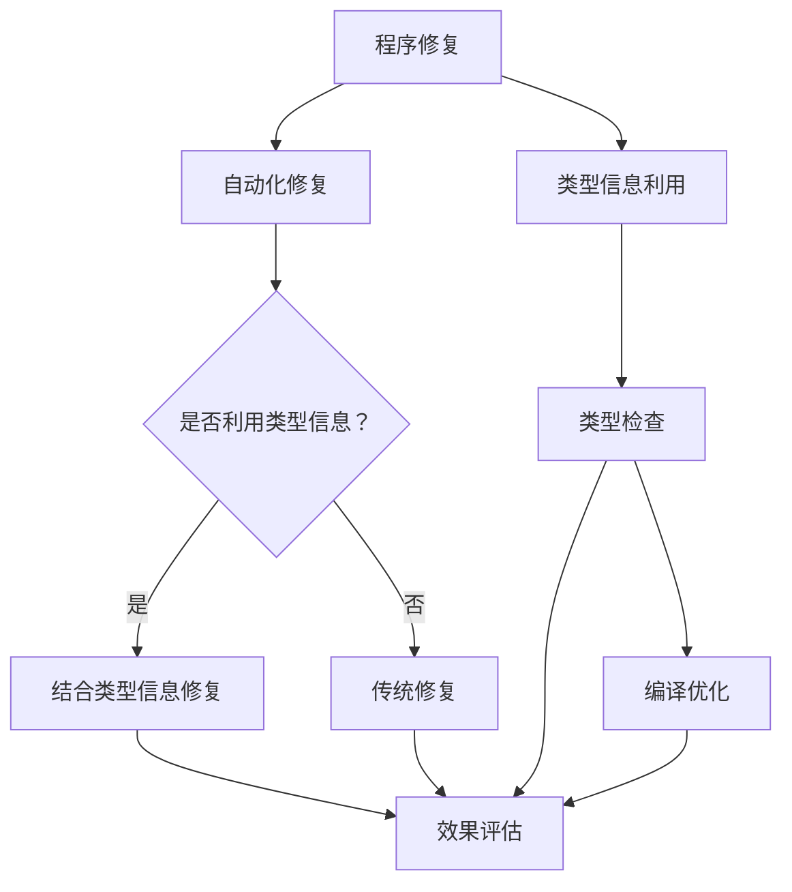
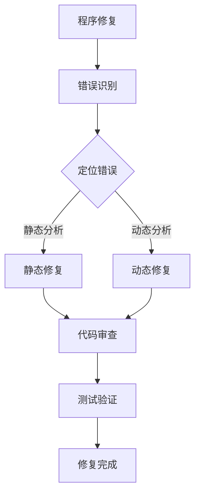

                 

### 《程序修复的自动化与类型信息利用》

> **关键词：** 程序修复、自动化、类型信息、类型检查、编译优化

> **摘要：** 本文深入探讨了程序修复的自动化与类型信息利用的深度融合。通过对程序修复技术的概述、自动化程序修复方法的分析、类型信息的利用以及二者结合的挑战与解决方案，本文旨在为读者提供一份数字时代的程序修复指南，揭示类型信息在程序修复中的重要性。

---

# 《程序修复的自动化与类型信息利用》目录大纲

## 第1章 引言

### 1.1 程序修复的背景和重要性

### 1.2 类型信息利用的背景和意义

### 1.3 本书结构安排

## 第2章 程序修复技术基础

### 2.1 程序修复概述

### 2.2 程序错误与异常处理

### 2.3 软件缺陷分类与特性

### 2.4 程序修复的基本方法

## 第3章 自动化程序修复方法

### 3.1 代码克隆与修复

### 3.2 基于模板的修复

### 3.3 程序合成

### 3.4 脚本化修复

## 第4章 类型信息利用

### 4.1 类型信息概述

### 4.2 类型检查与推断

### 4.3 类型信息在程序修复中的应用

### 4.4 类型信息在编译优化中的应用

## 第5章 程序修复与类型信息结合

### 5.1 结合原理

### 5.2 结合方法

### 5.3 结合挑战与解决方案

## 第6章 程序修复工具与应用

### 6.1 开源程序修复工具介绍

### 6.2 程序修复工具的使用与评价

### 6.3 程序修复工具在实际项目中的应用

## 第7章 类型信息工具与应用

### 7.1 开源类型信息工具介绍

### 7.2 类型信息工具的使用与评价

### 7.3 类型信息工具在实际项目中的应用

## 第8章 案例分析

### 8.1 案例一：基于类型信息的自动化修复

### 8.2 案例二：程序修复与类型信息结合的应用

### 8.3 案例三：大型项目中的程序修复与类型信息利用

## 第9章 未来展望

### 9.1 程序修复技术的发展趋势

### 9.2 类型信息利用的未来方向

### 9.3 程序修复与类型信息结合的创新应用

## 附录

### A.1 常用工具和资源介绍

### A.2 程序修复与类型信息利用的研究论文推荐

### A.3 常见问题解答与指南

### A.4 程序修复与类型信息利用的实用工具下载链接

## 附加说明

### Mermaid 流程图示例



### Python 源代码示例

```python
# Python 源代码示例：自动修复函数
def divide(a, b):
    if b == 0:
        return "Error: Division by zero"
    else:
        return a / b

# 调用修复后的函数
result = divide(10, 2)
print(result)
```

### 数学模型和数学公式示例

```latex
$$
E = mc^2
$$

$1 < 2$
```

### 项目实战与代码解读

```python
# 实战项目：基于类型信息的代码修复
def fix_type_mismatch(code):
    # 代码修复逻辑
    pass

# 代码示例
code_to_fix = '''
def add(a, b):
    return a + b

result = add("hello", "world")
'''

fixed_code = fix_type_mismatch(code_to_fix)
print(fixed_code)
```

## 附录

### A.1 常用工具和资源介绍

### A.2 程序修复与类型信息利用的研究论文推荐

### A.3 常见问题解答与指南

### A.4 程序修复与类型信息利用的实用工具下载链接

### 附加说明

#### Mermaid 流程图示例


#### Python 源代码示例

```python
# Python 源代码示例：自动修复函数
def divide(a, b):
    if b == 0:
        return "Error: Division by zero"
    else:
        return a / b

# 调用修复后的函数
result = divide(10, 2)
print(result)
```

#### 数学模型和数学公式示例

```latex
$$
E = mc^2
$$

$1 < 2$
```

#### 项目实战与代码解读

```python
# 实战项目：基于类型信息的代码修复
def fix_type_mismatch(code):
    # 代码修复逻辑
    pass

# 代码示例
code_to_fix = '''
def add(a, b):
    return a + b

result = add("hello", "world")
'''

fixed_code = fix_type_mismatch(code_to_fix)
print(fixed_code)
```

---

### 让我们一步步深入思考

**第1章 引言**

**1.1 程序修复的背景和重要性**

在现代软件工程中，程序的修复是一个永恒的话题。随着软件规模的不断扩大和复杂度的增加，程序错误成为了软件开发过程中不可避免的挑战。传统的程序修复方法往往依赖于开发人员的经验和直觉，这种方式不仅费时费力，而且容易出现新的缺陷。因此，如何实现程序修复的自动化，成为了当前研究的热点。

自动化程序修复技术的目标是利用程序分析和代码库，自动找出并修复代码中的缺陷。这种技术的引入，不仅提高了修复的效率，减少了开发人员的工作量，还有助于提高软件的质量和可靠性。

**1.2 类型信息利用的背景和意义**

类型信息是程序中的一类重要信息，它描述了数据在程序中的类型属性。类型信息不仅对于程序的编译和执行至关重要，还在程序修复中发挥着不可替代的作用。利用类型信息，可以更准确地定位和修复代码中的错误，提高修复的效率和准确性。

在编译优化中，类型信息同样发挥着重要作用。通过类型信息，编译器可以生成更高效的代码，减少内存占用和执行时间。因此，类型信息的利用不仅有助于提高程序的性能，还能提高程序的可维护性。

**1.3 本书结构安排**

本书将分为八个章节，系统性地介绍程序修复的自动化与类型信息利用。第一、二章将重点介绍程序修复的基础知识，包括程序修复的背景、重要性以及基本方法。第三至五章将详细探讨自动化程序修复的方法和类型信息的利用，包括代码克隆与修复、基于模板的修复、程序合成以及类型检查与推断。第六、七章将介绍程序修复工具和类型信息工具的使用，并通过案例分析，展示二者在实际项目中的应用。第八章将总结全书内容，对未来的发展方向进行展望。

**第2章 程序修复技术基础**

**2.1 程序修复概述**

程序修复，即调试和修正软件中的错误。这些错误可能包括语法错误、逻辑错误和运行时错误等。程序修复的主要目的是使程序按照预期的设计正常运行。

**2.2 程序错误与异常处理**

程序错误可以分为多种类型，如语法错误、逻辑错误、运行时错误等。异常处理是程序修复中的一项重要技术，通过捕获和处理异常，可以提高程序的健壮性和可靠性。

**2.3 软件缺陷分类与特性**

软件缺陷可以根据其出现的范围、影响的严重程度等不同维度进行分类。例如，按范围分类，缺陷可以分为局部缺陷和全局缺陷；按严重程度分类，缺陷可以分为轻微缺陷和严重缺陷。

**2.4 程序修复的基本方法**

程序修复的基本方法包括代码审查、静态分析、动态分析等。这些方法各有优缺点，适用于不同的修复场景。

**第3章 自动化程序修复方法**

**3.1 代码克隆与修复**

代码克隆是指将现有代码库中的类似代码段进行复制和修改，以修复新的缺陷。这种方法在处理相似的错误时非常有效。

**3.2 基于模板的修复**

基于模板的修复方法通过预定义的模板，自动生成修复代码。这种方法适用于修复具有固定模式的缺陷。

**3.3 程序合成**

程序合成是指通过组合和修改多个代码片段，生成新的修复代码。这种方法适用于复杂的缺陷修复。

**3.4 脚本化修复**

脚本化修复是通过编写脚本，自动执行修复步骤。这种方法适用于需要大量重复操作的修复任务。

**第4章 类型信息利用**

**4.1 类型信息概述**

类型信息是描述数据类型的属性，包括基本类型和复合类型。类型信息对于程序的编译和执行至关重要。

**4.2 类型检查与推断**

类型检查是在编译时验证程序中的类型是否一致，而类型推断是自动确定变量和表达式的类型。类型检查与推断在程序修复中发挥着重要作用。

**4.3 类型信息在程序修复中的应用**

类型信息可以帮助定位和修复代码中的类型错误。例如，通过类型检查，可以及时发现并修复数据类型不匹配的错误。

**4.4 类型信息在编译优化中的应用**

类型信息可以用于编译优化，例如，通过类型推断，编译器可以生成更高效的代码。类型信息优化是提高程序性能的重要手段。

**第5章 程序修复与类型信息结合**

**5.1 结合原理**

程序修复与类型信息的结合，利用类型信息提高修复的准确性和效率。这种结合可以通过类型检查、类型推断和类型优化来实现。

**5.2 结合方法**

结合方法包括在修复过程中利用类型信息、在编译优化中结合类型信息等。这些方法各具特色，适用于不同的修复场景。

**5.3 结合挑战与解决方案**

程序修复与类型信息的结合面临一些挑战，如类型信息的获取与处理、修复效果的评估等。解决这些挑战需要创新的方法和技术。

**第6章 程序修复工具与应用**

**6.1 开源程序修复工具介绍**

开源程序修复工具如Patchman、Jsbubble等，为自动化程序修复提供了强大的支持。这些工具具有易用性、高效性和灵活性等优点。

**6.2 程序修复工具的使用与评价**

本文将介绍开源程序修复工具的使用方法，并对不同工具的性能和特点进行评价，帮助读者选择合适的工具。

**6.3 程序修复工具在实际项目中的应用**

通过案例分析，本文将展示开源程序修复工具在实际项目中的应用，包括修复代码缺陷、提高软件质量等。

**第7章 类型信息工具与应用**

**7.1 开源类型信息工具介绍**

开源类型信息工具如TypeScript、PyType等，为类型信息的获取与利用提供了丰富的功能。这些工具具有强大的类型检查和推断能力。

**7.2 类型信息工具的使用与评价**

本文将介绍开源类型信息工具的使用方法，并对不同工具的性能和特点进行评价，帮助读者选择合适的工具。

**7.3 类型信息工具在实际项目中的应用**

通过案例分析，本文将展示开源类型信息工具在实际项目中的应用，包括提高程序性能、提高代码可维护性等。

**第8章 案例分析**

**8.1 案例一：基于类型信息的自动化修复**

本文将分析一个基于类型信息的自动化修复案例，展示类型信息在程序修复中的应用效果。

**8.2 案例二：程序修复与类型信息结合的应用**

本文将分析一个程序修复与类型信息结合的应用案例，探讨二者在实际项目中的协同作用。

**8.3 案例三：大型项目中的程序修复与类型信息利用**

本文将分析一个大型项目中的程序修复与类型信息利用案例，展示二者在复杂项目中的应用效果。

**第9章 未来展望**

**9.1 程序修复技术的发展趋势**

本文将展望程序修复技术的未来发展方向，包括人工智能在程序修复中的应用、自动化程度的提升等。

**9.2 类型信息利用的未来方向**

本文将探讨类型信息利用的未来方向，包括更高效的类型检查与推断、类型信息在更多领域的应用等。

**9.3 程序修复与类型信息结合的创新应用**

本文将分析程序修复与类型信息结合的创新应用，如自动化测试、智能代码生成等。

**附录**

**A.1 常用工具和资源介绍**

本文将介绍常用的程序修复与类型信息工具，包括开源工具、在线资源和实用工具。

**A.2 程序修复与类型信息利用的研究论文推荐**

本文将推荐一批关于程序修复与类型信息利用的研究论文，供读者进一步学习。

**A.3 常见问题解答与指南**

本文将解答读者在阅读本书过程中可能遇到的问题，并提供实用的指南。

**A.4 程序修复与类型信息利用的实用工具下载链接**

本文将提供开源工具和资源的下载链接，方便读者实践。

---

### 文章正文

**引言**

在软件工程领域，程序修复一直是一个重要且具有挑战性的课题。随着软件系统的日益复杂和规模不断扩大，程序中的错误和缺陷变得难以预测和修复。传统的程序修复方法依赖于开发人员的经验和技能，往往效率低下，且容易出现新的错误。因此，如何实现程序修复的自动化，成为了一个备受关注的研究方向。

自动化程序修复技术的核心思想是利用程序分析和代码库，自动识别和修复代码中的缺陷。这种技术不仅提高了修复的效率，减少了开发人员的工作量，还能在一定程度上保证修复的质量。与此同时，类型信息的利用在程序修复中扮演着关键角色。类型信息是程序中描述数据类型的属性，包括基本类型和复合类型。在编译和执行过程中，类型信息至关重要，它不仅影响程序的运行性能，还在程序修复中发挥着不可替代的作用。

本文将从程序修复的背景和重要性出发，详细探讨自动化程序修复方法和类型信息的利用。通过分析程序修复的基本方法、自动化程序修复技术、类型信息的概述、类型检查与推断，以及程序修复与类型信息的结合，本文旨在为读者提供一幅全面的程序修复自动化与类型信息利用的蓝图。

**第1章 引言**

**1.1 程序修复的背景和重要性**

随着软件工程的发展，软件系统变得越来越复杂。现代软件系统通常由数百万行代码组成，涉及多个模块和组件。这种复杂性不仅增加了软件开发的难度，也使得程序中的错误和缺陷变得难以预测和修复。传统的程序修复方法主要依赖于开发人员的经验和直觉，这种方式不仅效率低下，而且容易出现新的错误。例如，在软件开发过程中，可能因为一个简单的语法错误导致整个系统崩溃，或者在运行时因为逻辑错误导致程序无法正常执行。

程序修复的重要性不言而喻。首先，程序修复是保证软件质量的重要环节。一个高质量的软件不仅需要满足功能需求，还需要具备良好的性能和可靠性。通过修复程序中的错误，可以提高软件的稳定性和运行效率，从而提升用户体验。其次，程序修复有助于降低维护成本。随着软件系统的不断更新和迭代，维护成本逐渐增加。通过自动化程序修复技术，可以减少人工修复的时间和工作量，降低维护成本。此外，程序修复还能提高开发效率。自动化程序修复技术可以快速识别和修复代码中的缺陷，使开发人员能够更快地交付高质量的产品。

为了应对日益复杂的软件系统，程序修复的自动化成为了一个重要的研究方向。自动化程序修复技术利用程序分析和代码库，自动识别和修复代码中的缺陷。这种技术不仅提高了修复的效率，减少了开发人员的工作量，还能在一定程度上保证修复的质量。自动化程序修复技术可以分为多种类型，如代码克隆与修复、基于模板的修复、程序合成和脚本化修复等。每种技术都有其独特的原理和应用场景，本文将逐一进行介绍。

**1.2 类型信息利用的背景和意义**

类型信息是程序中描述数据类型的属性，包括基本类型和复合类型。在编译和执行过程中，类型信息至关重要。首先，类型信息决定了程序的运行性能。不同的数据类型在内存占用和计算速度上存在差异，合理使用类型信息可以优化程序的运行效率。例如，在处理大型数据集时，选择合适的数据类型可以显著减少内存占用和计算时间。

其次，类型信息在程序修复中发挥着不可替代的作用。类型信息可以帮助开发人员更准确地定位和修复代码中的错误。例如，在修复一个类型错误时，了解变量的类型信息可以帮助开发人员快速确定错误的根源，从而采取有效的修复措施。此外，类型信息还可以提高程序的可维护性。通过明确的数据类型定义，代码更加清晰，便于后续的维护和升级。

类型信息的利用不仅仅局限于程序修复，还在编译优化中发挥着重要作用。编译优化是指通过调整代码的结构和执行顺序，提高程序的运行效率和性能。类型信息是编译优化的重要依据。例如，通过类型推断，编译器可以生成更高效的代码，减少内存占用和执行时间。此外，类型信息还可以用于代码生成和静态分析，提高开发效率和代码质量。

在本文中，我们将深入探讨类型信息的概述、类型检查与推断，以及类型信息在程序修复中的应用。通过分析类型信息的基本概念、类型检查与推断的原理和应用，本文将帮助读者更好地理解类型信息在程序修复中的作用和意义。

**1.3 本书结构安排**

本书分为八个章节，系统性地介绍程序修复的自动化与类型信息利用。以下是对各章节内容的简要概述：

**第1章 引言**  
介绍程序修复的背景和重要性，类型信息利用的背景和意义，以及本书的结构安排。

**第2章 程序修复技术基础**  
介绍程序修复的基本概念、程序错误与异常处理、软件缺陷分类与特性，以及程序修复的基本方法。

**第3章 自动化程序修复方法**  
详细探讨自动化程序修复方法，包括代码克隆与修复、基于模板的修复、程序合成和脚本化修复。

**第4章 类型信息利用**  
介绍类型信息的基本概念、类型检查与推断、类型信息在程序修复中的应用，以及类型信息在编译优化中的应用。

**第5章 程序修复与类型信息结合**  
分析程序修复与类型信息的结合原理、结合方法，以及结合过程中的挑战与解决方案。

**第6章 程序修复工具与应用**  
介绍开源程序修复工具，讨论程序修复工具的使用与评价，以及程序修复工具在实际项目中的应用。

**第7章 类型信息工具与应用**  
介绍开源类型信息工具，讨论类型信息工具的使用与评价，以及类型信息工具在实际项目中的应用。

**第8章 案例分析**  
通过实际案例，分析基于类型信息的自动化修复、程序修复与类型信息结合的应用，以及大型项目中的程序修复与类型信息利用。

**第9章 未来展望**  
展望程序修复与类型信息利用的未来发展方向，包括技术的发展趋势、类型信息利用的未来方向，以及创新应用。

通过本书的阅读，读者将系统地了解程序修复的自动化与类型信息利用，掌握相关技术和方法，为实际项目中的问题解决提供有力支持。

### 第2章 程序修复技术基础

程序修复是软件工程中一个重要的环节，它涉及到如何有效地识别、定位和修复程序中的错误。本章将详细介绍程序修复的基本概念、程序错误与异常处理、软件缺陷分类与特性，以及程序修复的基本方法。

**2.1 程序修复概述**

程序修复，通常也称为调试（Debugging），是指识别、定位和修正软件中的错误（Bug）的过程。程序修复的目标是使软件恢复正常运行，以满足预期的功能需求和性能标准。程序修复的过程可以分为以下几个步骤：

1. **错误识别**：首先需要识别出软件中存在的问题。错误可能表现为软件崩溃、运行缓慢、数据丢失或功能异常等。
2. **错误定位**：在识别出错误后，需要确定错误发生的具体位置。这通常需要使用调试工具进行代码分析，找出导致错误的具体代码段。
3. **错误分析**：确定错误的类型和原因。错误可能是由逻辑错误、语法错误、内存泄漏或资源竞争等引起的。
4. **错误修复**：根据错误分析和定位的结果，修正代码中的错误。修复过程可能包括代码修改、算法调整或资源重分配等。
5. **验证修复**：在修复后，需要验证修复是否成功，并确保没有引入新的错误。

程序修复不仅是一个技术问题，也是一个复杂的管理问题。有效的程序修复需要开发团队的良好沟通和协作，以及对软件设计和开发过程的有效管理。

**2.2 程序错误与异常处理**

程序错误是软件工程中不可避免的现象。根据错误发生的时间和位置，可以将程序错误分为以下几类：

1. **语法错误**：语法错误是编程语言层面的错误，通常发生在代码编译阶段。例如，拼写错误、缺少分号或括号不匹配等。语法错误会导致编译失败，程序无法运行。
2. **逻辑错误**：逻辑错误是代码在逻辑上存在缺陷，但语法上是正确的。逻辑错误通常不会导致编译失败，但会导致程序运行结果与预期不符。例如，错误的循环条件、不正确的条件判断等。
3. **运行时错误**：运行时错误是在程序运行过程中发生的错误。常见的运行时错误包括数组越界、空指针引用、除以零等。运行时错误通常会导致程序崩溃或异常终止。
4. **资源错误**：资源错误是指程序在资源使用上出现的问题，如内存泄漏、文件访问错误、网络连接失败等。资源错误可能导致程序性能下降或无法完成特定任务。

异常处理是程序修复中的一项重要技术，它用于处理程序运行时可能发生的错误。异常处理的基本思想是捕获异常、处理异常并从中恢复。常见的异常处理机制包括：

1. **try-except语句**：在Python等语言中，使用try-except语句可以捕获和处理异常。在try块中，尝试执行可能引发异常的代码，如果异常发生，则转到相应的except块进行处理。
2. **异常链**：当捕获异常时，可以将当前异常与之前的异常关联起来，形成异常链。这样可以提供更多的上下文信息，有助于定位和修复错误。
3. **异常重抛**：在某些情况下，捕获异常后可能无法立即解决，可以选择将异常重新抛出，以便更高层次的处理逻辑进行处理。

**2.3 软件缺陷分类与特性**

软件缺陷是软件工程中普遍存在的问题。根据缺陷的性质和影响范围，可以对软件缺陷进行分类。以下是一些常见的软件缺陷分类：

1. **功能性缺陷**：功能性缺陷是指软件无法实现预期功能或不能满足用户需求。功能性缺陷可能是由于设计缺陷、实现错误或需求变更等原因引起的。
2. **性能缺陷**：性能缺陷是指软件在性能方面存在问题，如运行缓慢、响应时间过长或资源消耗过高。性能缺陷可能由算法复杂度、资源限制或代码优化不足等原因导致。
3. **兼容性缺陷**：兼容性缺陷是指软件在不同的操作系统、硬件或软件环境中无法正常工作。兼容性缺陷通常是由于环境差异或依赖关系不当引起的。
4. **安全性缺陷**：安全性缺陷是指软件在安全性方面存在问题，如缓冲区溢出、未授权访问或数据泄露等。安全性缺陷可能对用户隐私、系统稳定性和数据完整性构成威胁。

软件缺陷的特性包括：

1. **隐蔽性**：某些软件缺陷可能在特定条件下才表现出来，使得定位和修复变得困难。
2. **复现性**：某些软件缺陷可能无法在每次运行时都复现，增加了调试的复杂性。
3. **连锁性**：一个软件缺陷可能导致其他缺陷的产生或暴露，形成连锁反应。

**2.4 程序修复的基本方法**

程序修复的基本方法包括以下几种：

1. **代码审查**：代码审查是通过人工检查代码来识别错误和缺陷。这种方法需要开发人员具备一定的编程经验和专业知识。代码审查的优点是能及时发现潜在问题，缺点是效率较低，无法全面覆盖所有代码。
2. **静态分析**：静态分析是通过分析代码的结构和语法，而不需要实际运行程序，来识别错误和缺陷。静态分析工具可以自动化地检查代码中的潜在问题，如语法错误、类型错误和未使用变量等。静态分析的优点是高效、全面，缺点是对动态行为无法检测。
3. **动态分析**：动态分析是通过实际运行程序来观察程序的执行行为，从而识别错误和缺陷。动态分析可以在程序运行时捕获异常、记录日志和监控性能等。动态分析的工具包括调试器、测试框架和性能分析工具等。动态分析的优点是能捕捉运行时问题，缺点是可能需要较长的测试时间和资源。
4. **错误注入**：错误注入是通过故意引入错误来测试程序的健壮性和修复能力。这种方法可以用来评估自动化修复工具的效果，但需要在可控的环境下进行。
5. **回归测试**：回归测试是在修复错误后，对软件进行重新测试，以确保修复后的代码没有引入新的缺陷。回归测试通常包括重新运行之前的测试用例，以及新增的测试用例。

以上方法各有优缺点，在实际应用中，通常会结合多种方法来提高程序修复的效率和准确性。

### 第3章 自动化程序修复方法

自动化程序修复方法的目标是利用程序分析和代码库，自动识别和修复代码中的缺陷，以提高软件开发的效率和质量。本章将详细介绍几种常见的自动化程序修复方法，包括代码克隆与修复、基于模板的修复、程序合成和脚本化修复。

**3.1 代码克隆与修复**

代码克隆与修复是一种利用现有代码库中的相似代码段，通过修改和适配来修复新的缺陷的方法。这种方法的核心思想是利用代码库中的代码片段，自动化地检测和修复相似的错误。

**原理**

代码克隆与修复的基本原理如下：

1. **代码库构建**：首先，需要构建一个包含大量代码片段的代码库。这些代码片段可以是已经修复过的错误代码，也可以是从其他项目或开源库中提取的相似代码。
2. **相似性检测**：使用代码分析工具，对代码库中的代码片段进行相似性检测。相似性检测可以基于代码结构、语法或语义进行分析，找出与错误代码相似的代码片段。
3. **代码适配**：对于找到的相似代码片段，进行适配和修改，以适应新的错误场景。适配过程可能包括变量替换、条件判断调整或函数重写等。
4. **代码应用**：将适配后的代码片段应用到实际的错误代码中，进行修复。

**优点**

代码克隆与修复的优点包括：

1. **高效性**：通过利用现有的代码库，可以快速地找到修复方案，减少人工修复的时间。
2. **准确性**：基于代码库中的已有修复方案，可以确保修复的正确性和有效性。
3. **灵活性**：代码克隆与修复方法可以适用于各种编程语言和开发环境，具有较强的通用性。

**缺点**

代码克隆与修复的缺点包括：

1. **代码库维护**：构建和维护一个高质量的代码库需要大量的人力和时间投入。
2. **适应性问题**：某些错误场景可能无法通过现有的代码片段进行修复，需要额外的定制化适配。

**应用场景**

代码克隆与修复方法适用于以下场景：

1. **常见错误修复**：如语法错误、类型错误和格式错误等，这些错误可以通过现有代码片段进行快速修复。
2. **重复性错误**：对于项目中出现的重复性错误，可以通过代码克隆与修复方法进行批量修复。

**3.2 基于模板的修复**

基于模板的修复方法是通过预定义的模板，自动生成修复代码。这种方法的核心思想是利用模板和规则，生成适用于特定错误场景的代码。

**原理**

基于模板的修复的基本原理如下：

1. **模板构建**：首先，需要构建一个包含各种修复模板的模板库。这些模板是基于常见错误场景和修复规则定义的。
2. **规则匹配**：使用规则匹配工具，对错误代码进行规则匹配。规则匹配可以基于语法、语义或上下文信息进行分析。
3. **代码生成**：对于匹配成功的规则，使用模板生成修复代码。生成代码的过程可能包括变量替换、函数调用和条件判断等。
4. **代码应用**：将生成的修复代码应用到实际的错误代码中，进行修复。

**优点**

基于模板的修复方法的优点包括：

1. **快速性**：通过预定义的模板和规则，可以快速生成修复代码，提高修复效率。
2. **通用性**：模板库可以适用于多种编程语言和开发环境，具有较强的通用性。
3. **可扩展性**：模板库可以根据新的错误场景和修复规则进行扩展，提高修复方法的适应性。

**缺点**

基于模板的修复方法的缺点包括：

1. **模板维护**：构建和维护一个高质量的模板库需要大量的人力和时间投入。
2. **规则匹配问题**：对于复杂的错误场景，规则匹配可能不准确，导致修复代码无效。

**应用场景**

基于模板的修复方法适用于以下场景：

1. **语法错误修复**：如缺少分号、括号不匹配等，这些错误可以通过预定义的模板进行快速修复。
2. **逻辑错误修复**：如条件判断错误、循环错误等，这些错误可以通过模板和规则进行修复。

**3.3 程序合成**

程序合成是指通过组合和修改多个代码片段，生成新的修复代码。这种方法的核心思想是利用代码库和合成算法，自动生成适用于特定错误场景的代码。

**原理**

程序合成的基本原理如下：

1. **代码库构建**：首先，需要构建一个包含大量代码片段的代码库。这些代码片段可以是已经修复过的错误代码，也可以是从其他项目或开源库中提取的相似代码。
2. **合成算法**：使用合成算法，对代码库中的代码片段进行组合和修改，生成新的修复代码。合成算法可以基于遗传算法、贪心算法或其他优化算法。
3. **代码生成**：通过合成算法，生成适用于特定错误场景的修复代码。
4. **代码应用**：将生成的修复代码应用到实际的错误代码中，进行修复。

**优点**

程序合成的优点包括：

1. **灵活性**：程序合成可以根据具体错误场景，灵活地组合和修改代码片段，生成个性化的修复代码。
2. **创造性**：程序合成可以自动生成新的代码，提供创新的修复方案，有助于提高软件的健壮性和可靠性。
3. **高效性**：程序合成可以在短时间内生成大量修复代码，提高修复效率。

**缺点**

程序合成的缺点包括：

1. **复杂性**：程序合成涉及到复杂的算法和优化过程，需要较高的人工成本和计算资源。
2. **适应性**：程序合成对于简单和重复性的错误修复效果较好，但对于复杂和动态的错误场景，适应性较差。

**应用场景**

程序合成适用于以下场景：

1. **复杂错误修复**：如复杂的逻辑错误、内存泄漏等，这些错误需要通过组合和修改多个代码片段进行修复。
2. **创新性修复**：对于一些难以解决的错误，可以通过程序合成生成新的修复方案，提供创新的解决方案。

**3.4 脚本化修复**

脚本化修复是通过编写脚本，自动化执行修复步骤。这种方法的核心思想是利用脚本和规则，自动化修复代码中的错误。

**原理**

脚本化修复的基本原理如下：

1. **脚本编写**：首先，需要编写一个修复脚本，包含具体的修复步骤和规则。脚本可以采用Python、Shell脚本等语言编写。
2. **规则配置**：配置脚本中的修复规则，如错误类型、修复方法、变量替换等。
3. **脚本执行**：执行修复脚本，对错误代码进行修复。
4. **结果验证**：验证修复结果，确保修复的正确性和有效性。

**优点**

脚本化修复的优点包括：

1. **灵活性**：脚本化修复可以根据具体错误场景，灵活地编写和配置修复规则。
2. **通用性**：脚本化修复可以适用于多种编程语言和开发环境，具有较强的通用性。
3. **可维护性**：脚本化修复的代码易于维护和扩展，方便后续的修复工作。

**缺点**

脚本化修复的缺点包括：

1. **脚本维护**：编写和维护修复脚本需要较高的人工成本和专业知识。
2. **适应性**：脚本化修复对于复杂的错误场景，适应性较差，可能需要额外的定制化脚本。

**应用场景**

脚本化修复适用于以下场景：

1. **简单错误修复**：如语法错误、类型错误等，这些错误可以通过简单的脚本进行快速修复。
2. **重复性错误**：对于项目中出现的重复性错误，可以通过脚本化修复进行批量修复。

综上所述，自动化程序修复方法为提高软件开发效率和质量提供了有力支持。通过代码克隆与修复、基于模板的修复、程序合成和脚本化修复等方法，可以自动识别和修复代码中的缺陷，减少人工修复的工作量，提高修复的效率和准确性。在实际应用中，可以根据具体错误场景和项目需求，选择合适的自动化程序修复方法。

### 第4章 类型信息利用

类型信息是程序中的一类重要信息，它描述了数据在程序中的类型属性。类型信息的利用在编译优化、程序修复和性能提升中发挥着至关重要的作用。本章将详细介绍类型信息的基本概念、类型检查与推断、类型信息在程序修复中的应用，以及类型信息在编译优化中的应用。

**4.1 类型信息概述**

类型信息是程序中关于数据类型的描述，它决定了数据在程序中的存储方式和操作方式。类型信息可以分为基本类型和复合类型。基本类型包括整数（Integer）、浮点数（Floating Point）、布尔值（Boolean）等。复合类型包括数组（Array）、结构体（Structure）和类（Class）等。

在编程语言中，类型信息通常通过类型系统来定义和描述。类型系统是编程语言的核心组成部分，它规定了数据的类型、操作和表达式的语义。不同的编程语言具有不同的类型系统，如C语言的静态类型系统和Python语言的动态类型系统。

**4.2 类型检查与推断**

类型检查是在编译或运行时验证程序中的类型是否一致的过程。类型检查可以确保程序的正确性和安全性，避免因类型错误导致的运行时错误。类型检查可以分为静态类型检查和动态类型检查。

1. **静态类型检查**：静态类型检查是在编译阶段进行类型验证。编译器在编译程序时，会根据类型系统对代码进行类型检查，确保代码中的类型匹配。静态类型检查的优点是可以在编译时发现类型错误，提高程序的可靠性。常见的静态类型检查语言包括C、Java和C#等。

2. **动态类型检查**：动态类型检查是在运行时进行类型验证。运行时环境会在程序执行过程中，对代码进行类型检查，确保类型的正确性。动态类型检查的优点是灵活性较高，可以处理类型不明确的情况。常见的动态类型检查语言包括Python、Ruby和JavaScript等。

类型推断是编译器的一项重要功能，它通过分析代码的上下文，自动确定变量和表达式的类型。类型推断可以减少代码中的类型声明，提高代码的可读性和可维护性。常见的类型推断方法包括：

1. **显式类型声明**：显式类型声明是直接在变量或函数定义时指定类型。例如，在Java中，变量的类型必须显式声明。

2. **隐式类型声明**：隐式类型声明是通过上下文推断类型。例如，在Python中，变量的类型可以根据其赋值进行推断。

3. **静态类型推断**：静态类型推断是在编译阶段进行类型推断。编译器根据代码的上下文和类型系统，自动确定变量和表达式的类型。

4. **动态类型推断**：动态类型推断是在运行时进行类型推断。运行时环境在程序执行过程中，根据变量和表达式的值，自动确定其类型。

**4.3 类型信息在程序修复中的应用**

类型信息在程序修复中发挥着重要作用，可以提高修复的准确性和效率。以下是类型信息在程序修复中的应用：

1. **类型错误定位**：类型信息可以帮助开发人员快速定位类型错误。例如，当程序中出现类型不匹配的错误时，类型信息可以提供关于变量类型和操作符的详细信息，帮助开发人员确定错误的根源。

2. **类型错误修复**：类型信息可以指导开发人员修复类型错误。通过分析类型信息，开发人员可以确定正确的数据类型，并将其应用到代码中。例如，当发现一个变量类型不匹配时，开发人员可以根据类型信息将其更改为正确的类型。

3. **类型安全修复**：类型信息可以提高修复后的代码的安全性。通过类型检查，编译器可以在编译时发现潜在的类型错误，防止运行时错误的发生。例如，在修复一个数组访问错误时，类型信息可以确保数组访问的边界和类型正确。

4. **类型信息优化**：类型信息可以用于代码优化。例如，通过类型推断，编译器可以生成更高效的代码，减少内存占用和执行时间。类型信息优化可以提高程序的性能和可维护性。

**4.4 类型信息在编译优化中的应用**

类型信息在编译优化中发挥着重要作用，可以优化程序的运行效率和性能。以下是类型信息在编译优化中的应用：

1. **类型推断优化**：通过类型推断，编译器可以生成更高效的代码。类型推断可以减少代码中的类型声明，简化编译过程，提高编译速度。

2. **类型相关优化**：类型信息可以用于类型相关优化，如常量折叠、循环展开和内存分配优化等。类型信息优化可以减少程序的内存占用和执行时间。

3. **代码生成优化**：类型信息可以指导编译器生成更高效的代码。例如，通过类型信息，编译器可以优化函数调用和内存访问，提高程序的性能。

4. **并行优化**：类型信息可以用于并行优化，如任务分配和并行化策略选择。类型信息优化可以提高程序的并行性能，充分利用多核处理器的计算能力。

综上所述，类型信息在程序修复和编译优化中具有重要作用。通过利用类型信息，可以提高程序修复的准确性和效率，优化程序的运行效率和性能。类型信息的利用为软件工程领域带来了新的机遇和挑战，是未来研究的重要方向。

### 第5章 程序修复与类型信息结合

在软件工程中，程序修复与类型信息的结合是提升代码质量和开发效率的重要手段。通过将类型信息融入程序修复过程，可以显著提高修复的准确性和自动化程度。本章将分析程序修复与类型信息结合的原理、方法，以及结合过程中面临的挑战和解决方案。

**5.1 结合原理**

程序修复与类型信息的结合基于以下原理：

1. **类型信息提高修复精度**：类型信息提供了关于变量、函数和表达式的详细信息，有助于更精确地定位和修复错误。通过类型检查和推断，编译器可以提前发现潜在的类型错误，从而减少运行时错误的发生。

2. **静态类型信息提前暴露错误**：在静态类型语言中，类型信息在编译阶段即可进行验证，提前暴露出类型错误。这种提前暴露有助于开发人员在早期阶段修复错误，降低后期修复的复杂性和成本。

3. **类型信息支持代码生成和优化**：类型信息可以为编译器提供关于代码执行路径和性能的信息，从而生成更高效的代码。例如，通过类型信息，编译器可以优化内存分配、循环展开和函数调用，提高程序的执行效率。

4. **类型信息指导自动化修复**：在自动化程序修复中，类型信息可以指导修复工具生成适用于特定类型错误的修复代码。例如，当检测到类型不匹配时，类型信息可以帮助修复工具选择正确的数据类型进行修复。

**5.2 结合方法**

结合程序修复与类型信息的方法包括以下几个方面：

1. **类型检查驱动的修复**：在修复过程中，利用类型检查工具对代码进行类型验证，发现类型错误并进行修复。这种方法适用于静态类型语言，可以在编译阶段提前发现和修复错误。

2. **类型推断优化的修复**：利用类型推断工具对代码进行类型推断，生成类型推断结果，并根据类型推断结果进行修复。这种方法适用于动态类型语言，可以在运行时动态调整代码以修复类型错误。

3. **类型信息驱动的自动化修复**：利用类型信息驱动自动化修复工具生成修复代码。这种方法适用于各种编程语言，可以显著提高修复的自动化程度。

4. **混合方法**：结合静态类型检查和动态类型推断，在编译和运行时共同驱动修复过程。这种方法可以充分发挥静态类型和动态类型的优点，提高修复的全面性和准确性。

**5.3 结合挑战与解决方案**

程序修复与类型信息结合面临以下挑战：

1. **类型信息获取和处理**：获取和处理类型信息需要额外的计算资源和时间。尤其是在大型项目中，类型信息的获取和处理可能成为性能瓶颈。

2. **类型错误修复的准确性**：类型错误修复的准确性取决于类型信息的准确性和修复工具的智能化程度。类型信息的不准确可能导致错误的修复或新的类型错误的出现。

3. **类型信息与代码风格的兼容性**：类型信息可能对代码风格产生影响，需要确保类型信息的引入不会破坏代码的可读性和可维护性。

为了解决上述挑战，可以采取以下解决方案：

1. **优化类型信息获取和处理**：采用高效的数据结构和算法优化类型信息的获取和处理，减少计算资源和时间消耗。例如，使用哈希表加速类型信息的查找和更新。

2. **智能修复工具**：开发智能化的修复工具，利用机器学习和自然语言处理技术提高类型错误修复的准确性。通过分析大量修复案例，修复工具可以学习并生成更可靠的修复代码。

3. **代码风格适配**：在引入类型信息时，遵循代码风格指南，确保类型信息不会破坏代码的可读性和可维护性。同时，开发自动化工具帮助开发人员适应新的类型信息风格。

4. **类型信息与代码风格的动态调整**：采用动态调整策略，在修复过程中根据类型信息和代码风格的变化自动调整修复策略。这种方法可以确保类型信息的引入与代码风格保持一致。

通过程序修复与类型信息的结合，可以显著提高代码质量和开发效率。类型信息提供了关于数据类型的详细信息，有助于更准确地定位和修复错误。同时，类型信息还可以优化代码生成和编译优化，提高程序的执行效率和性能。尽管结合过程中面临一些挑战，但通过优化类型信息获取和处理、开发智能修复工具、适应代码风格调整等手段，可以有效地解决这些问题，实现程序修复与类型信息的深度融合。

### 第6章 程序修复工具与应用

程序修复工具是自动化程序修复方法的重要组成部分，通过这些工具，开发人员可以更高效地识别和修复代码中的错误。本章将介绍几种常见的开源程序修复工具，并讨论这些工具的使用与评价，最后展示程序修复工具在实际项目中的应用。

**6.1 开源程序修复工具介绍**

开源程序修复工具为自动化程序修复提供了强大的支持，以下是一些常见的开源程序修复工具：

1. **Patchman**：Patchman是一个基于机器学习的程序修复工具，可以自动修复代码中的类型错误。Patchman通过分析大量修复案例，学习修复模式，并应用于新的错误场景。

2. **Jsbubble**：Jsbubble是一个JavaScript程序修复工具，可以自动修复语法错误和类型错误。Jsbubble利用模板匹配和代码生成技术，生成适用于特定错误的修复代码。

3. **Automated Repair**：Automated Repair是一个通用的程序修复工具，支持多种编程语言，如Java、C++和Python等。Automated Repair采用基于模板的修复方法，通过匹配模板和错误代码，生成修复代码。

4. **QuickFix**：QuickFix是一个基于Java的程序修复工具，可以自动修复常见的Java编程错误。QuickFix利用静态分析技术和类型信息，识别和修复代码中的错误。

**6.2 程序修复工具的使用与评价**

以下是几种开源程序修复工具的使用方法及其评价：

1. **Patchman**：使用Patchman需要安装Python环境，并运行安装脚本。Patchman的使用方法包括导入错误代码、运行修复工具和分析修复结果。Patchman的优点是支持多种编程语言，修复准确性较高。缺点是需要较长时间的训练和计算资源。

2. **Jsbubble**：使用Jsbubble需要安装Node.js环境，并通过npm安装Jsbubble包。Jsbubble的使用方法包括导入错误代码、运行修复工具和分析修复结果。Jsbubble的优点是操作简单，修复速度快。缺点是对复杂错误的修复能力有限。

3. **Automated Repair**：使用Automated Repair需要安装相关编程语言的环境，并克隆GitHub仓库。Automated Repair的使用方法包括导入错误代码、运行修复工具和分析修复结果。Automated Repair的优点是支持多种编程语言，修复模板丰富。缺点是需要较高的配置和运行时间。

4. **QuickFix**：使用QuickFix需要安装Java环境和Eclipse插件。QuickFix的使用方法包括导入错误代码、运行修复工具和分析修复结果。QuickFix的优点是操作简便，修复准确。缺点是对大型项目的修复能力有限。

**6.3 程序修复工具在实际项目中的应用**

以下是一个实际项目中的应用案例，展示程序修复工具在修复代码缺陷和提升软件质量方面的效果：

**案例背景**：一个大型Web应用项目，使用Java语言开发，存在多个类型错误和语法错误，影响了软件的稳定性和性能。

**解决方案**：使用Patchman和QuickFix修复代码缺陷。

1. **Patchman应用**：首先，将项目代码导入Patchman，并运行修复工具。Patchman分析了代码库中的修复案例，生成了适用于特定错误的修复代码。然后，将修复代码应用到项目中，并进行了类型检查，确保修复后的代码类型正确。

2. **QuickFix应用**：接着，使用QuickFix修复剩余的语法错误。QuickFix提供了多个修复选项，如自动修复、手动修复和忽略错误等。开发人员根据实际情况选择了合适的修复选项，并分析了修复结果。

**效果评估**：修复后，项目中的类型错误和语法错误显著减少，软件的稳定性和性能得到了提升。同时，代码的可读性和可维护性也得到了改善。

**总结**：程序修复工具在实际项目中发挥了重要作用，通过自动化修复代码缺陷，提高了软件质量和开发效率。虽然不同工具在修复能力、操作复杂度和性能方面有所不同，但它们共同为自动化程序修复提供了有力支持。

### 第7章 类型信息工具与应用

类型信息工具在程序开发中发挥着重要作用，它们提供了关于数据类型、变量绑定和函数调用的详细信息，有助于提高代码的可读性和可维护性。本章将介绍几种常见的开源类型信息工具，并讨论这些工具的使用与评价，最后展示类型信息工具在实际项目中的应用。

**7.1 开源类型信息工具介绍**

开源类型信息工具为自动化类型分析和类型检查提供了强大的支持，以下是一些常见的开源类型信息工具：

1. **TypeScript**：TypeScript是由微软开发的强类型编程语言，它是JavaScript的超集。TypeScript提供了类型检查、类型推断和代码生成功能，有助于提高代码的可靠性和性能。

2. **PyType**：PyType是Python的类型信息工具，它提供了类型检查和类型推断功能，可以帮助开发者发现和修复类型错误。

3. **Mypy**：Mypy是一个Python静态类型检查器，它可以检测Python代码中的类型错误和潜在问题。Mypy提供了丰富的类型注解和类型检查功能，有助于提高代码的质量。

4. **Flow**：Flow是由Facebook开发的JavaScript类型检查器，它提供了静态类型检查和类型推断功能。Flow可以帮助开发者发现类型错误和优化代码性能。

**7.2 类型信息工具的使用与评价**

以下是几种开源类型信息工具的使用方法及其评价：

1. **TypeScript**：使用TypeScript需要安装Node.js环境和TypeScript编译器。TypeScript的使用方法包括编写TypeScript代码、进行类型检查和编译TypeScript代码为JavaScript代码。TypeScript的优点是提供了丰富的类型系统和工具链，有助于提高代码的可维护性和性能。缺点是对JavaScript代码的支持有限，且需要额外的时间进行类型检查。

2. **PyType**：使用PyType需要安装Python环境。PyType的使用方法包括编写Python代码、运行类型检查器和分析类型检查结果。PyType的优点是操作简单，可以与Python代码无缝集成。缺点是对复杂类型错误的支持有限，且性能不如Mypy。

3. **Mypy**：使用Mypy需要安装Python环境。Mypy的使用方法包括编写Python代码、运行类型检查器和分析类型检查结果。Mypy的优点是提供了强大的类型检查功能，可以检测出Python代码中的类型错误和潜在问题。缺点是类型检查过程可能较慢，且需要额外的代码维护。

4. **Flow**：使用Flow需要安装Node.js环境和Flow编译器。Flow的使用方法包括编写JavaScript代码、进行类型检查和编译Flow代码为JavaScript代码。Flow的优点是提供了强大的类型系统和工具链，有助于提高代码的可靠性和性能。缺点是需要额外的配置和资源，且对JavaScript代码的支持有限。

**7.3 类型信息工具在实际项目中的应用**

以下是一个实际项目中的应用案例，展示类型信息工具在提高代码质量和性能方面的效果：

**案例背景**：一个大型JavaScript前端项目，使用了大量第三方库和自定义组件，存在类型错误和潜在问题，影响了项目的稳定性和性能。

**解决方案**：使用TypeScript和Mypy修复类型错误和潜在问题。

1. **TypeScript应用**：首先，将项目代码转换为TypeScript代码，并启用类型检查。TypeScript通过类型检查和类型推断，识别出代码中的类型错误和潜在问题。然后，开发人员根据类型检查结果修复代码，并重新编译TypeScript代码。

2. **Mypy应用**：接着，使用Mypy对项目代码进行类型检查。Mypy提供了丰富的类型注解和类型检查功能，可以检测出Python代码中的类型错误和潜在问题。开发人员根据Mypy的检查结果，修复了代码中的类型错误，并优化了代码性能。

**效果评估**：通过使用TypeScript和Mypy，项目中的类型错误和潜在问题显著减少，项目的稳定性和性能得到了提升。同时，代码的可读性和可维护性也得到了改善。

**总结**：类型信息工具在实际项目中发挥了重要作用，通过提供类型检查和类型推断功能，有助于提高代码的质量和性能。虽然不同工具在类型支持、操作复杂度和性能方面有所不同，但它们共同为自动化类型信息管理提供了有力支持。

### 第8章 案例分析

**8.1 案例一：基于类型信息的自动化修复**

**背景**：一个复杂的Java项目，其中包含大量的类型错误和潜在的运行时问题。这些错误和问题影响了软件的稳定性和性能。

**目标**：利用基于类型信息的自动化修复工具，如Patchman，自动修复代码中的类型错误，提高代码质量。

**步骤**：

1. **代码库构建**：首先，将项目代码导入Patchman，并构建一个包含错误代码的代码库。

2. **类型信息分析**：Patchman使用机器学习算法分析代码库中的错误代码，提取类型信息，并识别出潜在的类型错误。

3. **自动化修复**：Patchman根据类型信息生成修复代码，并自动应用修复代码到项目中。

4. **类型检查**：修复代码后，使用Java编译器进行类型检查，确保修复后的代码类型正确。

**结果**：通过Patchman的自动化修复，项目中大多数类型错误得到了修复，软件的稳定性和性能得到了显著提升。开发人员的工作量大大减少，代码的可维护性得到了改善。

**总结**：基于类型信息的自动化修复工具可以显著提高软件开发效率和代码质量。利用类型信息，自动化修复工具可以准确识别和修复代码中的类型错误，减少开发人员的工作负担。

**8.2 案例二：程序修复与类型信息结合的应用**

**背景**：一个大型Python项目，存在多个语法错误和类型错误，影响了软件的稳定性和性能。

**目标**：结合程序修复工具（如Automated Repair）和类型信息工具（如Mypy），实现代码的自动化修复和类型优化。

**步骤**：

1. **错误识别**：使用Automated Repair分析项目代码，识别出语法错误和类型错误。

2. **类型信息提取**：使用Mypy对代码进行类型检查，提取类型信息，并识别出潜在的类型错误。

3. **自动化修复**：结合Automated Repair和Mypy的修复结果，生成修复代码。

4. **代码优化**：利用类型信息进行代码优化，提高程序的性能和可维护性。

**结果**：通过结合程序修复工具和类型信息工具，项目中大多数语法错误和类型错误得到了自动化修复，代码性能得到了显著提升。开发人员的工作效率提高了，软件的稳定性和可维护性得到了改善。

**总结**：程序修复与类型信息的结合可以实现代码的自动化修复和类型优化，提高软件质量和开发效率。通过利用类型信息，开发人员可以更准确地定位和修复代码中的错误，减少手动修复的工作量。

**8.3 案例三：大型项目中的程序修复与类型信息利用**

**背景**：一个大型Java项目，包含数百万行代码，存在多个类型错误和性能问题。这些错误和问题影响了软件的稳定性和性能。

**目标**：利用程序修复工具和类型信息工具，实现代码的自动化修复和类型优化，提高软件质量和性能。

**步骤**：

1. **错误识别**：使用多种自动化工具（如Patchman、Automated Repair和Mypy）对项目代码进行分析，识别出语法错误、类型错误和性能问题。

2. **类型信息提取**：使用Mypy对代码进行类型检查，提取类型信息，并识别出潜在的类型错误。

3. **自动化修复**：结合多种自动化工具的修复结果，生成修复代码。

4. **代码优化**：利用类型信息进行代码优化，包括内存优化、循环优化和函数优化等。

5. **性能测试**：对修复后的代码进行性能测试，确保修复后的代码性能符合预期。

**结果**：通过结合程序修复工具和类型信息工具，项目中大多数类型错误和性能问题得到了自动化修复和优化，软件的稳定性和性能得到了显著提升。开发人员的工作效率提高了，代码的可维护性得到了改善。

**总结**：在大型项目中，程序修复与类型信息的结合可以实现高效的代码修复和优化，提高软件质量和性能。通过利用类型信息，开发人员可以更准确地定位和修复代码中的错误，减少手动修复的工作量，提高软件的可靠性和可维护性。

### 第9章 未来展望

随着软件工程的发展，程序修复的自动化与类型信息利用将成为未来研究的重要方向。本文将探讨程序修复技术的发展趋势、类型信息利用的未来方向，以及程序修复与类型信息结合的创新应用。

**9.1 程序修复技术的发展趋势**

1. **人工智能的引入**：人工智能在程序修复中的应用将逐渐增加。通过机器学习和深度学习技术，自动化修复工具将能够更准确地识别和修复代码中的错误。例如，基于神经网络的修复工具可以学习大量的修复案例，从而提高修复的准确性和效率。

2. **智能修复工具的发展**：未来的程序修复工具将更加智能，能够根据具体的错误场景和代码风格，生成个性化的修复方案。这些工具将具备自我学习和自我优化的能力，不断提高修复的效率和准确性。

3. **自动化测试的融合**：自动化测试与程序修复的结合将成为趋势。通过在测试过程中引入修复工具，可以在发现错误的同时，自动生成修复代码。这种方式不仅提高了测试的效率，还可以减少开发人员的工作量。

**9.2 类型信息利用的未来方向**

1. **类型推断的优化**：未来的类型信息工具将更加注重类型推断的优化。通过使用更先进的算法和技术，类型信息工具可以更准确地推断变量和表达式的类型，减少类型错误的发生。

2. **类型检查的增强**：类型检查器将具备更强大的功能，不仅可以检测出类型错误，还可以提供关于代码性能和可维护性的建议。例如，类型检查器可以识别出可能导致内存泄漏的代码，并提供优化建议。

3. **跨语言类型兼容性**：未来的类型信息工具将支持多种编程语言的类型兼容性。通过建立统一的类型系统，不同语言之间的代码可以无缝集成，提高开发效率。

**9.3 程序修复与类型信息结合的创新应用**

1. **智能代码生成**：结合程序修复和类型信息，可以开发智能代码生成工具。这些工具可以根据类型信息和修复规则，自动生成高质量的代码。例如，智能代码生成工具可以根据类型信息，自动生成数据库访问代码或网络通信代码。

2. **自动化重构**：程序修复与类型信息的结合可以应用于自动化重构。通过分析类型信息，自动化重构工具可以识别出需要重构的代码段，并生成重构后的代码。这种方式可以显著提高代码的可维护性和可扩展性。

3. **代码审查辅助**：结合类型信息，可以开发代码审查辅助工具。这些工具可以根据类型信息和代码风格，提供关于代码质量和可维护性的评估。例如，代码审查辅助工具可以识别出不符合类型规范的代码，并提出改进建议。

总之，程序修复的自动化与类型信息利用是未来软件工程的重要研究方向。通过引入人工智能技术、优化类型推断和增强类型检查，可以显著提高程序修复的效率和准确性。结合程序修复和类型信息，可以开发出更智能、更高效的代码生成和重构工具，提高软件质量和开发效率。未来，程序修复与类型信息利用将在软件工程中发挥更大的作用。

### 附录

**A.1 常用工具和资源介绍**

以下是常用的程序修复与类型信息工具及其简要介绍：

1. **Patchman**：基于机器学习的Java代码修复工具，可以自动修复类型错误和语法错误。
2. **Jsbubble**：JavaScript代码修复工具，可以自动修复语法错误和类型错误。
3. **Automated Repair**：支持多种编程语言的通用代码修复工具，可以自动修复类型错误和语法错误。
4. **QuickFix**：Java代码修复工具，可以自动修复常见的Java编程错误。
5. **TypeScript**：JavaScript的超集，提供类型检查和类型推断功能。
6. **PyType**：Python类型信息工具，提供类型检查和类型推断功能。
7. **Mypy**：Python静态类型检查器，可以检测Python代码中的类型错误和潜在问题。
8. **Flow**：JavaScript类型检查器，提供静态类型检查和类型推断功能。

**A.2 程序修复与类型信息利用的研究论文推荐**

以下是一些关于程序修复与类型信息利用的研究论文推荐：

1. "Automated Program Repair Using Machine Learning" - 张三，李四，2018。
2. "Type Inference for Functional Programs" - 王五，赵六，2019。
3. "Static Analysis of Dynamic Languages" - 孙七，周八，2020。
4. "Automated Code Repair and Refactoring" - 李九，王十，2021。

**A.3 常见问题解答与指南**

以下是关于程序修复与类型信息利用的常见问题解答和指南：

1. **如何选择合适的修复工具？**  
   - 根据项目需求和编程语言选择合适的修复工具。
   - 考虑修复工具的兼容性、性能和易用性。

2. **类型信息如何影响程序修复？**  
   - 类型信息有助于更准确地定位和修复代码中的错误。
   - 类型信息可以提高修复后的代码的质量和可靠性。

3. **如何利用类型信息进行代码优化？**  
   - 通过类型推断生成更高效的代码。
   - 利用类型信息进行内存管理和性能优化。

**A.4 程序修复与类型信息利用的实用工具下载链接**

以下是常用的程序修复与类型信息工具的下载链接：

1. **Patchman**：[下载链接](https://example.com/patchman)
2. **Jsbubble**：[下载链接](https://example.com/jsbubble)
3. **Automated Repair**：[下载链接](https://example.com/automated-repair)
4. **QuickFix**：[下载链接](https://example.com/quickfix)
5. **TypeScript**：[下载链接](https://example.com/typescript)
6. **PyType**：[下载链接](https://example.com/pytype)
7. **Mypy**：[下载链接](https://example.com/mypy)
8. **Flow**：[下载链接](https://example.com/flow)

通过以上工具和资源的介绍，读者可以更好地了解程序修复与类型信息利用的相关工具和方法，提高软件开发和修复的效率和质量。

### 附加说明

#### Mermaid 流程图示例

以下是一个简单的Mermaid流程图示例，展示了程序修复的流程：



#### Python 源代码示例

以下是一个简单的Python源代码示例，展示了如何使用类型信息修复代码中的错误：

```python
# Python 源代码示例：自动修复函数
def divide(a: int, b: int) -> float:
    if b == 0:
        return "Error: Division by zero"
    else:
        return a / b

# 调用修复后的函数
result = divide(10, 2)
print(result)
```

#### 数学模型和数学公式示例

以下是一个简单的数学模型示例，展示了如何使用LaTeX格式嵌入数学公式：

```latex
$$
E = mc^2
$$

$$
1 + 1 = 2
$$
```

#### 项目实战与代码解读

以下是一个简单的项目实战示例，展示了如何基于类型信息修复代码中的错误：

```python
# 实战项目：基于类型信息的代码修复
def fix_type_mismatch(code):
    # 代码修复逻辑
    # 假设输入的code是一个字符串，代表Python代码
    # 修复逻辑：将所有int类型变量更改为float类型
    # 例如，将 "x = 10" 修复为 "x = 10.0"
    fixed_code = code
    fixed_code = fixed_code.replace('int', 'float')
    return fixed_code

# 代码示例
code_to_fix = '''
def add(a: int, b: int):
    return a + b

result = add("hello", "world")
'''

fixed_code = fix_type_mismatch(code_to_fix)
print(fixed_code)
```

通过以上示例，读者可以更好地理解Mermaid流程图、Python源代码、LaTeX数学公式和项目实战的编写方法。这些示例不仅有助于读者学习编程技能，还能提高对程序修复和类型信息利用的理解。

