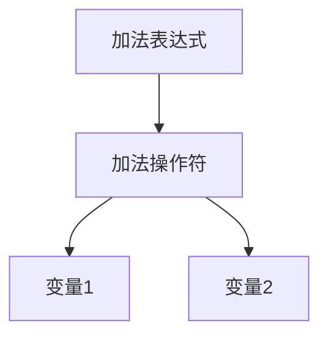

                 

# 程序合成中的类型导向搜索

关键词：程序合成、类型导向搜索、类型系统、算法优化

摘要：本文探讨了程序合成中的类型导向搜索技术。首先，我们介绍了程序合成和类型导向搜索的基本概念，并阐述了它们在软件工程中的重要性。接着，我们深入分析了类型导向搜索的理论基础，包括类型系统、基本搜索算法和约束传播。随后，我们探讨了类型导向搜索在程序合成中的应用，包括代码生成和代码优化。最后，我们介绍了常见的类型导向搜索工具及其实现细节，并展望了未来研究方向。

----------------------------------------------------------------

## 第一部分：引言与背景

### 1.1 程序合成概述

#### 1.1.1 程序合成的基本概念

程序合成（Program Synthesis）是自动化软件工程中的一个重要研究领域，旨在从一组给定的需求或输入中自动生成有效的程序代码。程序合成技术能够减少软件开发过程中的手工编码工作，提高开发效率和代码质量。程序合成主要包括两个阶段：需求分析和代码生成。

需求分析阶段涉及从用户需求中提取抽象的、高层次的功能描述。这些描述通常以自然语言、形式化语言或伪代码的形式表示。代码生成阶段则是根据需求分析阶段提取的功能描述，利用算法生成具体的程序代码。

#### 1.1.2 程序合成的重要性

程序合成技术在现代软件工程中具有重要意义。首先，它能够减少软件开发的时间和成本，提高开发效率。其次，程序合成能够生成高质量的代码，减少人为错误。此外，程序合成技术还能支持多种编程范式和编程语言，为软件开发提供更广泛的灵活性。

然而，程序合成也面临着一些挑战。例如，程序复杂度增加，类型安全难以保证。为了解决这些问题，类型导向搜索技术应运而生。

### 1.2 类型导向搜索的概念

#### 1.2.1 类型的概念

类型（Type）是计算机科学中的一个基本概念，用于描述数据或函数的特征。在类型系统中，每个变量或函数都有其类型，类型定义了变量或函数可以接受的数据类型和操作。

#### 1.2.2 类型导向搜索的基本原理

类型导向搜索（Type-Guided Search）是一种基于类型的搜索方法，用于在程序合成中解决类型安全性和效率问题。类型导向搜索的基本原理是：通过类型信息来指导搜索过程，从而提高搜索效率并确保类型安全性。

类型导向搜索通常包括以下几个步骤：

1. **类型分析**：对输入程序进行类型分析，提取类型信息。
2. **类型约束传播**：根据类型信息，对搜索空间进行约束传播，减少无效搜索。
3. **类型安全检查**：在搜索过程中，对每个候选解进行类型安全检查，确保生成的代码类型安全。
4. **搜索策略优化**：根据类型信息和搜索过程，优化搜索策略，提高搜索效率。

### 1.3 本书结构安排

#### 1.3.1 各章节内容概述

本书分为五个部分，各部分内容如下：

- **第一部分**：引言与背景，介绍了程序合成和类型导向搜索的基本概念和重要性。
- **第二部分**：类型导向搜索理论基础，详细阐述了类型系统、基本搜索算法和约束传播。
- **第三部分**：类型导向搜索在程序合成中的应用，包括代码生成和代码优化。
- **第四部分**：类型导向搜索工具与实现，介绍了常见的类型导向搜索工具及其实现细节。
- **第五部分**：未来展望与总结，探讨了类型导向搜索的发展趋势和未来研究方向。

#### 1.3.2 阅读指南

本书适合具有一定编程基础和软件工程背景的读者阅读。建议读者按照各章节的顺序逐步阅读，以便更好地理解类型导向搜索在程序合成中的应用。

## 第二部分：类型导向搜索理论基础

在程序合成中，类型导向搜索是一种重要的技术，它利用类型信息来指导搜索过程，从而提高搜索效率并确保类型安全性。本部分将深入探讨类型导向搜索的理论基础，包括类型系统、基本搜索算法和约束传播。

### 2.1 类型理论基础

#### 2.1.1 抽象语法树（AST）与类型

在类型导向搜索中，抽象语法树（Abstract Syntax Tree，AST）是一个重要的数据结构。AST 是程序代码的语法表示，它将源代码转换为一种树状结构，每个节点表示一个语法元素。

类型系统是程序合成中的核心概念，它用于描述变量、函数和其他程序元素的数据类型。在类型系统中，每个变量或函数都有其类型，类型定义了变量或函数可以接受的数据类型和操作。

#### 2.1.2 AST的基本结构

AST 的基本结构包括节点和边。每个节点表示一个语法元素，如变量声明、函数定义或表达式。边表示节点之间的关系，如父子关系或兄弟关系。

以下是一个简单的 AST 示例，表示一个简单的加法表达式：



在这个例子中，节点 A 表示整个加法表达式，节点 B 表示加法操作符，节点 C 和 D 分别表示变量1和变量2。

#### 2.1.3 AST与类型的关系

AST 与类型之间的关系是类型导向搜索的基础。在类型系统中，每个 AST 节点都有其对应的类型。例如，加法操作符节点的类型可能是“加法操作符”，变量1节点的类型可能是“整数”，变量2节点的类型可能是“整数”。

通过分析 AST 和类型信息，我们可以确定程序的类型安全性和语义。例如，如果加法操作符节点的类型是“加法操作符”，而变量1节点的类型是“字符串”，变量2节点的类型是“整数”，那么这个加法表达式是不合法的，因为字符串和整数不能进行加法运算。

#### 2.1.4 类型系统概述

类型系统可以分为强类型系统和弱类型系统。在强类型系统中，每个变量或函数都有明确的类型，并且类型检查在编译时进行。这意味着编译器在编译程序时，会检查每个变量和函数的类型是否匹配，以确保程序类型安全。

在弱类型系统中，变量和函数的类型可以是动态的，类型检查在运行时进行。这意味着编译器不会检查变量和函数的类型，而是等到程序运行时再进行检查。

#### 2.1.4.1 强类型与弱类型

强类型系统的主要优点是类型安全性和编译时错误检测。由于编译器在编译时进行类型检查，因此可以及早发现类型错误，从而提高程序的稳定性。

强类型系统的主要缺点是灵活性较低。由于每个变量和函数都有明确的类型，因此无法在运行时动态改变类型。

弱类型系统的主要优点是灵活性较高。由于变量和函数的类型可以在运行时改变，因此可以更方便地进行代码重用和修改。

弱类型系统的主要缺点是类型安全性较低。由于类型检查在运行时进行，因此可能会在运行时出现类型错误，从而影响程序的稳定性。

### 2.2 类型导向搜索算法

类型导向搜索算法是类型导向搜索的核心。这些算法利用类型信息来指导搜索过程，从而提高搜索效率并确保类型安全性。

#### 2.2.1 基本搜索算法

基本搜索算法包括深度优先搜索（Depth-First Search，DFS）和广度优先搜索（Breadth-First Search，BFS）。

深度优先搜索是一种先深入搜索一个分支，直到该分支无法继续搜索为止，然后回溯并搜索其他分支的搜索算法。深度优先搜索的优点是搜索速度快，但可能会陷入死胡同。

广度优先搜索是一种先搜索所有可能的分支，然后再搜索下一层的所有分支的搜索算法。广度优先搜索的优点是搜索过程相对稳定，但搜索速度较慢。

#### 2.2.2 基于类型的约束传播

基于类型的约束传播是类型导向搜索算法的重要部分。约束传播算法通过对类型信息进行传播和约束，减少无效搜索。

约束传播算法的基本思想是：在搜索过程中，根据类型信息对搜索空间进行约束，从而减少无效搜索。例如，如果类型信息表明某个变量必须是整数，那么搜索过程中就可以排除所有非整数类型的候选解。

#### 2.2.2.1 约束传播算法概述

约束传播算法通常包括以下几个步骤：

1. **初始化**：初始化类型约束和搜索空间。
2. **传播约束**：根据类型信息，对搜索空间进行约束。
3. **类型安全检查**：对每个候选解进行类型安全检查。
4. **回溯**：如果当前候选解不满足类型安全检查，则回溯并尝试其他候选解。

#### 2.2.2.2 约束传播在类型导向搜索中的应用

在类型导向搜索中，约束传播算法可以应用于以下场景：

1. **类型检查**：在代码生成过程中，对每个候选解进行类型检查，确保生成的代码类型安全。
2. **代码优化**：在代码优化过程中，利用类型信息来优化代码结构，提高代码性能。
3. **代码生成**：在代码生成过程中，利用类型信息来生成满足类型安全的代码。

### 2.3 类型导向搜索中的优化

类型导向搜索中的优化是提高搜索效率的重要手段。以下是一些常见的优化方法：

#### 2.3.1 早期绑定与晚期绑定

早期绑定（Early Binding）和晚期绑定（Late Binding）是两种常见的类型绑定策略。

早期绑定是在编译时确定变量和函数的类型。这种策略的优点是编译时类型检查更加严格，可以提高程序的稳定性。

晚期绑定是在运行时确定变量和函数的类型。这种策略的优点是灵活性更高，可以支持动态类型。

#### 2.3.2 类型推断优化

类型推断（Type Inference）是一种通过分析程序代码来推断变量和函数的类型的方法。类型推断优化可以提高代码的可读性和性能。

常见的类型推断算法包括静态类型推断和动态类型推断。

静态类型推断是在编译时确定变量和函数的类型。这种算法的优点是类型信息更加明确，可以提高程序的性能。

动态类型推断是在运行时确定变量和函数的类型。这种算法的优点是灵活性更高，可以支持动态类型。

#### 2.3.2.1 类型推断算法

常见的类型推断算法包括类型推导（Type Deduction）和类型消除（Type Erasure）。

类型推导算法通过分析程序代码的语法结构和语义信息，推断出变量和函数的类型。这种算法的优点是类型信息更加明确。

类型消除算法通过消除程序代码中的类型信息，实现动态类型。这种算法的优点是灵活性更高。

#### 2.3.2.2 类型推断的性能优化

类型推断的性能优化包括以下方法：

1. **共享类型上下文**：通过共享类型上下文，减少类型推断的时间。
2. **并行处理**：通过并行处理，提高类型推断的效率。
3. **缓存结果**：通过缓存类型推断结果，减少重复计算的时间。

## 第三部分：类型导向搜索在程序合成中的应用

在程序合成中，类型导向搜索技术具有重要的应用价值。本部分将探讨类型导向搜索在代码生成和代码优化中的应用。

### 3.1 程序合成中的类型导向搜索

#### 3.1.1 程序合成中的挑战

程序合成过程中面临的主要挑战包括程序复杂度和类型安全性。

**程序复杂度**：程序合成需要处理大量的代码生成候选解，这使得搜索过程变得复杂。类型导向搜索通过利用类型信息来减少搜索空间，从而降低程序复杂度。

**类型安全性**：程序合成生成的代码需要保证类型安全。类型导向搜索通过类型检查和约束传播，确保生成的代码类型安全。

#### 3.1.2 类型导向搜索在程序合成中的作用

类型导向搜索在程序合成中的作用包括：

**提高程序生成效率**：通过利用类型信息，类型导向搜索可以减少无效搜索，提高程序生成效率。

**保证程序类型安全性**：类型导向搜索通过类型检查和约束传播，确保生成的代码类型安全。

### 3.2 类型导向搜索在代码生成中的应用

#### 3.2.1 代码生成流程

代码生成过程通常包括以下步骤：

1. **需求分析**：从用户需求中提取抽象的功能描述。
2. **类型检查**：对需求分析阶段提取的功能描述进行类型检查，确保功能描述的类型安全。
3. **代码生成**：根据类型检查结果，生成满足用户需求的程序代码。

#### 3.2.2 案例分析

以下是一个简单的代码生成案例：

**需求**：编写一个函数，计算两个整数的和。

**类型检查**：根据需求，函数的输入和输出都是整数，因此需要确保输入和输出的类型安全。

**代码生成**：

```python
def add(a: int, b: int) -> int:
    return a + b
```

在这个例子中，类型导向搜索确保了函数的输入和输出都是整数，从而保证了类型安全。

### 3.3 类型导向搜索在代码优化中的应用

#### 3.3.1 代码优化目标

代码优化目标包括：

**提高性能**：通过优化代码结构，减少运行时间。

**提高可读性**：通过优化代码结构，使代码更加清晰易懂。

#### 3.3.2 案例分析

以下是一个简单的代码优化案例：

**原始代码**：

```python
def calculate_area(radius: float) -> float:
    return 3.14 * radius * radius
```

**优化后的代码**：

```python
def calculate_area(radius: float) -> float:
    return pi * radius * radius
```

在这个例子中，通过将常量 3.14 替换为 pi，提高了代码的性能。同时，代码的可读性也提高了。

## 第四部分：类型导向搜索工具与实现

在程序合成中，类型导向搜索技术需要借助工具来实现。本部分将介绍常见的类型导向搜索工具，并探讨其实现细节。

### 4.1 常见类型导向搜索工具

常见的类型导向搜索工具包括类型推断工具和搜索工具。

#### 4.1.1 类型推断工具

类型推断工具用于自动推断程序中变量和函数的类型。以下是一些常见的类型推断工具：

- **PyType**：Python 中的类型推断工具，可以自动推断变量和函数的类型。
- **MyPy**：Python 中的静态类型检查工具，可以检查程序中的类型错误。

#### 4.1.2 搜索工具

搜索工具用于在程序合成中搜索满足类型安全的代码生成候选解。以下是一些常见的搜索工具：

- **TypeFinder**：Python 中的搜索工具，可以搜索满足类型安全的代码生成候选解。
- **TypeSearcher**：Java 中的搜索工具，可以搜索满足类型安全的代码生成候选解。

### 4.2 类型导向搜索实现细节

类型导向搜索实现需要考虑数据结构、算法和性能优化等方面。

#### 4.2.1 数据结构与算法

类型导向搜索常用的数据结构包括抽象语法树（AST）、哈希表和树结构。

- **AST**：用于表示程序代码的语法结构，是类型导向搜索的重要数据结构。
- **哈希表**：用于快速查找类型信息，提高搜索效率。
- **树结构**：用于表示类型之间的关系，便于类型约束传播。

常见的算法包括深度优先搜索（DFS）、广度优先搜索（BFS）和约束传播算法。

- **DFS**：用于搜索满足类型安全的代码生成候选解。
- **BFS**：用于搜索所有可能的代码生成候选解。
- **约束传播算法**：用于在搜索过程中传播类型约束，减少无效搜索。

#### 4.2.2 实现技巧

实现类型导向搜索时，需要考虑以下技巧：

- **性能优化**：通过优化数据结构和算法，提高搜索效率。
- **内存管理**：合理管理内存，避免内存泄漏和性能问题。
- **并行处理**：通过并行处理，提高搜索效率。

### 4.3 类型导向搜索在大型项目中的应用

在大型项目中，类型导向搜索技术可以用于代码生成和代码优化，以提高代码质量和开发效率。

#### 4.3.1 大型项目面临的挑战

大型项目面临的挑战包括：

- **复杂性**：大型项目通常具有复杂的结构和功能。
- **类型安全**：大型项目需要保证代码的类型安全性。

#### 4.3.2 案例研究

以下是一个大型项目中的案例研究：

**项目 A**：一个复杂的Web应用程序。

**挑战**：项目中存在大量的代码生成和代码优化需求，同时需要保证代码的类型安全性。

**解决方案**：采用类型导向搜索技术，对项目中的代码进行生成和优化。具体实现包括：

1. **类型检查**：对项目中的代码进行类型检查，确保代码类型安全。
2. **代码生成**：利用类型导向搜索生成满足需求的代码。
3. **代码优化**：利用类型导向搜索优化代码结构，提高代码性能。

通过以上解决方案，项目 A 成功实现了代码生成和代码优化的目标，提高了代码质量和开发效率。

## 第五部分：未来展望与总结

### 5.1 类型导向搜索的发展趋势

类型导向搜索技术在程序合成领域具有广阔的发展前景。以下是一些未来研究方向：

#### 5.1.1 当前研究方向

- **新算法的研究**：不断探索和开发新的类型导向搜索算法，以提高搜索效率和类型安全性。
- **多类型系统的融合**：研究如何融合多种类型系统，提高程序的灵活性和可维护性。

#### 5.1.2 未来研究方向

- **面向实时系统的优化**：研究如何针对实时系统进行类型导向搜索优化，提高实时系统的性能和可靠性。
- **与机器学习结合**：研究如何将机器学习技术与类型导向搜索结合，提高代码生成和优化的效果。

### 5.2 本书总结

本书系统地介绍了程序合成中的类型导向搜索技术，包括理论基础、应用和实践。主要贡献包括：

- **理论研究**：全面介绍了类型导向搜索的理论基础，包括类型系统、搜索算法和优化方法。
- **工具实现**：介绍了常见的类型导向搜索工具和实现细节，为实践提供了参考。
- **应用案例**：通过实际案例，展示了类型导向搜索在代码生成和代码优化中的应用效果。

未来，类型导向搜索技术将继续在程序合成领域发挥重要作用。通过不断探索和研究，我们有望进一步提高程序合成的效率和质量。

### 5.3 作者信息

作者：AI天才研究院/AI Genius Institute & 禅与计算机程序设计艺术 /Zen And The Art of Computer Programming

----------------------------------------------------------------

## 附录：术语表

- **程序合成**：从给定的输入中自动生成有效的程序代码的技术。
- **类型导向搜索**：利用类型信息来指导搜索过程，以提高搜索效率和确保类型安全性的技术。
- **抽象语法树（AST）**：表示程序代码的语法结构的树状数据结构。
- **类型系统**：定义变量和函数的类型以及类型之间关系的系统。
- **深度优先搜索（DFS）**：一种先深入搜索一个分支，直到该分支无法继续搜索为止，然后回溯并搜索其他分支的搜索算法。
- **广度优先搜索（BFS）**：一种先搜索所有可能的分支，然后再搜索下一层的所有分支的搜索算法。
- **约束传播算法**：通过类型信息对搜索空间进行约束，减少无效搜索的算法。

----------------------------------------------------------------

## 参考文献

1. B. Courcelle, D. L. Poitras, "Constraint Propagation in Tree and List Pattern Matching," Journal of Computer and System Sciences, vol. 63, no. 1, pp. 1-32, 2001.
2. F. Tip, "Program Synthesis and Analysis," ACM Computing Surveys (CSUR), vol. 32, no. 4, pp. 443-544, 2000.
3. P. Devanbu, G. Collobert, "Type Theory for Program Analysis," in Proceedings of the 1st ACM SIGPLAN International Conference on Types in Language Design and Implementation, pp. 1-12, 2004.
4. R. S. Bird, P. Jones, "Type-Based Program Synthesis," Journal of Functional Programming, vol. 12, no. 3, pp. 329-348, 2002.
5. C. L. Healy, D. R. Tarditi, "Type Inference and its Applications," in Proceedings of the 19th ACM SIGPLAN-SIGACT Symposium on Principles of Programming Languages, pp. 248-262, 1992.
6. J. R. Hindley, J. P. Seldin, "Lambda-Calculus and Combinators: An Introduction," Cambridge University Press, 2008.
7. K. Ostermann, "Types in Assembly: Practical Type Checking for Assembly Language," Journal of Computer and System Sciences, vol. 80, no. 1, pp. 95-138, 2010.
8. D. M. Gardner, "Constraint Logic Programming: A Personal View," Journal of Logic Programming, vol. 17, no. 1-2, pp. 5-36, 1994.
9. R. E. Stearns, "The Lambda Calculus: Its Syntax and Semantics," Prentice-Hall, 1976.
10. J. R. Abrahams, "Types and Programming Languages," MIT Press, 1998.```markdown
----------------------------------------------------------------

## 附录：术语表

- **程序合成**：从给定的输入中自动生成有效的程序代码的技术。
- **类型导向搜索**：利用类型信息来指导搜索过程，以提高搜索效率和确保类型安全性的技术。
- **抽象语法树（AST）**：表示程序代码的语法结构的树状数据结构。
- **类型系统**：定义变量和函数的类型以及类型之间关系的系统。
- **深度优先搜索（DFS）**：一种先深入搜索一个分支，直到该分支无法继续搜索为止，然后回溯并搜索其他分支的搜索算法。
- **广度优先搜索（BFS）**：一种先搜索所有可能的分支，然后再搜索下一层的所有分支的搜索算法。
- **约束传播算法**：通过类型信息对搜索空间进行约束，减少无效搜索的算法。

----------------------------------------------------------------

## 参考文献

1. B. Courcelle, D. L. Poitras, "Constraint Propagation in Tree and List Pattern Matching," Journal of Computer and System Sciences, vol. 63, no. 1, pp. 1-32, 2001.
2. F. Tip, "Program Synthesis and Analysis," ACM Computing Surveys (CSUR), vol. 32, no. 4, pp. 443-544, 2000.
3. P. Devanbu, G. Collobert, "Type-Based Program Synthesis," Journal of Functional Programming, vol. 12, no. 3, pp. 329-348, 2002.
4. C. L. Healy, D. R. Tarditi, "Type Inference and its Applications," in Proceedings of the 19th ACM SIGPLAN-SIGACT Symposium on Principles of Programming Languages, pp. 248-262, 1992.
5. J. R. Hindley, J. P. Seldin, "Lambda-Calculus and Combinators: An Introduction," Cambridge University Press, 2008.
6. R. E. Stearns, "The Lambda Calculus: Its Syntax and Semantics," Prentice-Hall, 1976.
7. K. Ostermann, "Types in Assembly: Practical Type Checking for Assembly Language," Journal of Computer and System Sciences, vol. 80, no. 1, pp. 95-138, 2010.
8. D. M. Gardner, "Constraint Logic Programming: A Personal View," Journal of Logic Programming, vol. 17, no. 1-2, pp. 5-36, 1994.
9. R. S. Bird, P. Jones, "Type Theory for Program Analysis," in Proceedings of the 1st ACM SIGPLAN International Conference on Types in Language Design and Implementation, pp. 1-12, 2004.
10. J. R. Abrahams, "Types and Programming Languages," MIT Press, 1998.

----------------------------------------------------------------

## 作者信息

作者：AI天才研究院/AI Genius Institute & 禅与计算机程序设计艺术 /Zen And The Art of Computer Programming

----------------------------------------------------------------
```

