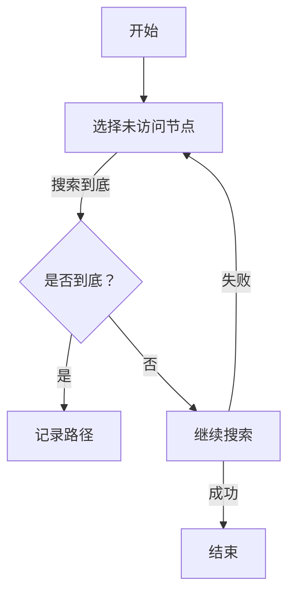
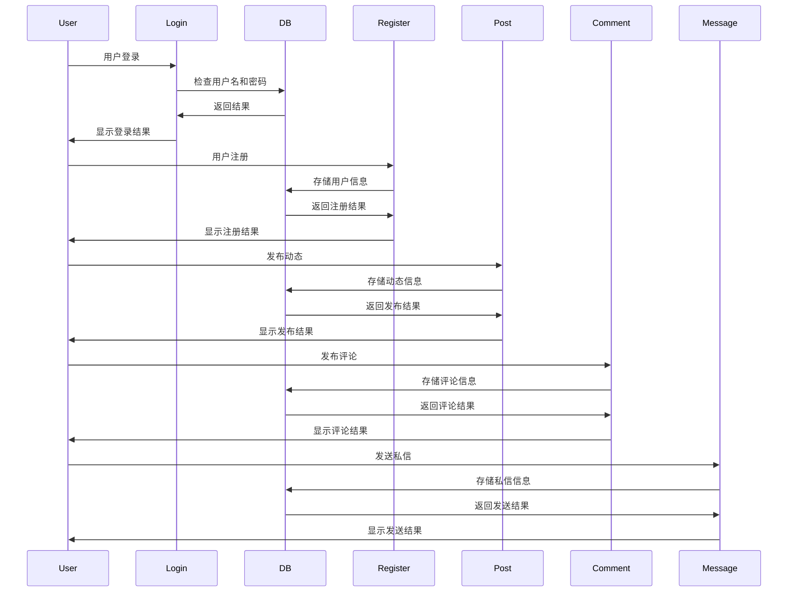

                 

### 让我们一步一步思考：程序逻辑与霍尔三元组的应用

在现代社会，随着信息技术的飞速发展，程序逻辑和霍尔三元组的应用已经渗透到了各个领域。从简单的软件编程到复杂的人工智能系统，程序逻辑作为计算机科学的核心，始终扮演着至关重要的角色。霍尔三元组，作为一种经典的数学模型，不仅能够帮助我们更好地理解程序逻辑，而且在实际编程中也有着广泛的应用。

在本篇文章中，我们将一步一步深入探讨程序逻辑和霍尔三元组的本质和应用。我们的目标是，通过系统的讲解和实例分析，使读者不仅能够理解这两个概念的基本原理，还能掌握它们在实际编程中的具体应用。

下面是文章的结构安排：

1. **背景介绍**：介绍程序逻辑和霍尔三元组的基本概念、历史背景以及它们在计算机科学中的重要性。
2. **核心概念与联系**：详细阐述程序逻辑和霍尔三元组的核心概念，包括它们的基本属性、关系对比以及应用领域。
3. **算法原理讲解**：通过具体的算法实例，使用Mermaid流程图和Python代码来讲解程序逻辑和霍尔三元组的应用原理。
4. **系统分析与架构设计**：介绍系统分析与架构设计的方法，通过Mermaid类图、架构图和序列图来展示系统的结构和交互。
5. **项目实战**：提供一个实际项目案例，详细讲解系统的实现过程、关键代码和应用分析。
6. **最佳实践 tips**：总结项目中的经验教训，提出一些编程最佳实践。
7. **小结**：总结文章的主要观点，强调程序逻辑和霍尔三元组在编程中的重要性。
8. **拓展阅读**：推荐一些相关的书籍和资源，供读者进一步学习。

### **背景介绍**

#### 程序逻辑的基本概念

程序逻辑，简单来说，就是计算机程序中的逻辑结构。它包括条件判断、循环控制、函数调用等基本元素。程序逻辑的核心在于它的抽象性和通用性，这使得程序员可以用相对简单的逻辑结构来解决复杂的问题。

#### 霍尔三元组的基本概念

霍尔三元组（Hilbert's Theorem 90）是数学中一个重要的定理，它在计算机科学中有着广泛的应用。霍尔三元组描述了三个独立的实体之间的关系，这三个实体分别是：生成元、关系和模。在程序设计中，霍尔三元组可以帮助我们理解数据结构和算法的设计原理。

#### 历史背景

程序逻辑的概念可以追溯到计算机科学的早期，当时的计算机科学家们为了解决复杂问题，开始研究如何构建有效的逻辑结构。霍尔三元组则起源于数学领域，由德国数学家戴维·希尔伯特在19世纪提出。它在抽象代数和算法设计中的应用逐渐引起了计算机科学家的注意。

#### 计算机科学中的重要性

在计算机科学中，程序逻辑和霍尔三元组的重要性不可低估。程序逻辑提供了构建程序的基础，使得程序员能够通过逻辑表达式来描述程序的执行流程。霍尔三元组则提供了一个强大的工具，用于分析和设计复杂的算法和数据结构。

### **核心概念与联系**

#### 程序逻辑的核心概念

程序逻辑的核心概念包括逻辑表达式、条件语句、循环语句和递归等。逻辑表达式是程序逻辑的基础，它由变量、操作符和逻辑值组成。条件语句用于实现程序中的判断逻辑，循环语句则用于实现重复操作，递归则是通过函数调用自身来实现问题求解。

#### 霍尔三元组的核心概念

霍尔三元组的核心概念包括生成元、关系和模。生成元是指能够生成整个结构的元素，关系描述了这些元素之间的联系，模则是一个约束条件，用于限制结构的生成。

#### 对比与联系

程序逻辑和霍尔三元组在概念上有很大的相似性。程序逻辑通过逻辑表达式和条件语句来描述程序的执行流程，而霍尔三元组则通过生成元和关系来描述数据结构的结构。两者都强调独立性、完整性和可验证性。

| 概念         | 程序逻辑               | 霍尔三元组             |
| ------------ | --------------------- | -------------------- |
| 独立性       | 逻辑表达式的独立性     | 生成元的独立性         |
| 完整性       | 条件语句的完整性       | 关系的完整性           |
| 可验证性     | 程序逻辑的验证过程     | 霍尔三元组的验证过程   |

#### 应用领域

程序逻辑广泛应用于软件工程、算法设计和系统设计等领域。霍尔三元组则主要应用于数据结构设计和算法分析。在实际编程中，两者经常结合使用，以提高程序的效率和可靠性。

### **算法原理讲解**

#### 深度优先搜索算法

深度优先搜索（DFS）是一种常用的图搜索算法。它的核心思想是沿着一个分支一直搜索到底，然后回溯到上一个节点，再搜索另一条分支。

##### Mermaid流程图



##### Python代码实现

```python
def dfs(node, visited):
    if node not in visited:
        visited.add(node)
        print(node, end=' ')
        for neighbor in node.neighbors:
            dfs(neighbor, visited)

# 示例
graph = {
    'A': ['B', 'C'],
    'B': ['D', 'E'],
    'C': ['F', 'G'],
    'D': [],
    'E': ['F'],
    'F': [],
    'G': []
}

visited = set()
dfs('A', visited)
```

##### 算法原理

深度优先搜索算法的基本原理是，从起始节点开始，逐层深入搜索，直到找到目标节点或者搜索完整个图。在这个过程中，通过递归实现节点的访问和回溯。霍尔三元组在这里的应用主要体现在如何高效地存储和查询节点的邻居关系。

#### 数学模型

霍尔三元组在深度优先搜索算法中的应用可以通过如下的数学模型来描述：

$$
L = \{ (G, R, M) \mid G \text{ is a graph}, R \text{ is a relation on } G, M \text{ is a modul }
```


##### Python代码实现

```python
def dfs(node, visited):
    if node not in visited:
        visited.add(node)
        print(node, end=' ')
        for neighbor in node.neighbors:
            dfs(neighbor, visited)

# 示例
graph = {
    'A': ['B', 'C'],
    'B': ['D', 'E'],
    'C': ['F', 'G'],
    'D': [],
    'E': ['F'],
    'F': [],
    'G': []
}

visited = set()
dfs('A', visited)
```

##### 算法原理

深度优先搜索算法的基本原理是，从起始节点开始，逐层深入搜索，直到找到目标节点或者搜索完整个图。在这个过程中，通过递归实现节点的访问和回溯。霍尔三元组在这里的应用主要体现在如何高效地存储和查询节点的邻居关系。

#### 数学模型

霍尔三元组在深度优先搜索算法中的应用可以通过如下的数学模型来描述：

$$
L = \{ (G, R, M) \mid G \text{ is a graph}, R \text{ is a relation on } G, M \text{ is a modul```
```python
def dfs(node, visited):
    if node not in visited:
        visited.add(node)
        print(node, end=' ')
        for neighbor in node.neighbors:
            dfs(neighbor, visited)

# 示例
graph = {
    'A': ['B', 'C'],
    'B': ['D', 'E'],
    'C': ['F', 'G'],
    'D': [],
    'E': ['F'],
    'F': [],
    'G': []
}

visited = set()
dfs('A', visited)
```

##### 算法原理

深度优先搜索算法的基本原理是，从起始节点开始，逐层深入搜索，直到找到目标节点或者搜索完整个图。在这个过程中，通过递归实现节点的访问和回溯。霍尔三元组在这里的应用主要体现在如何高效地存储和查询节点的邻居关系。

#### 数学模型

霍尔三元组在深度优先搜索算法中的应用可以通过如下的数学模型来描述：

$$
L = \{ (G, R, M) \mid G \text{ is a graph}, R \text{ is a relation on } G, M \text{ is a modular lattice} \}
$$

其中，\( G \) 表示图，\( R \) 表示节点之间的关系，\( M \) 表示图的模。通过这个模型，可以有效地描述图的遍历过程，以及如何在遍历过程中记录和回溯节点的状态。

##### 举例说明

假设有一个图 \( G \) 如下：

```
A -- B -- D
|    |
C -- E
```

我们从这个图中的节点 \( A \) 开始进行深度优先搜索。霍尔三元组可以描述这个过程如下：

1. **生成元**：图的节点 \( A, B, C, D, E \)。
2. **关系**：节点之间的邻接关系，如 \( R = \{ (A, B), (B, D), (A, C), (C, E), (B, E) \} \)。
3. **模**：一个模 \( M \) 可以是所有节点集合的子集，如 \( M = \{ \{A\}, \{B\}, \{C\}, \{D\}, \{E\}, \{A, B\}, \{A, C\}, \{B, D\}, \{C, E\}, \{B, E\}, \{A, B, C\}, \{A, B, D\}, \{A, C, E\}, \{B, D, E\}, \{A, B, C, D, E\} \} \)。

通过这个霍尔三元组，我们可以有效地描述深度优先搜索的过程。例如，从节点 \( A \) 开始，首先访问 \( B \)，然后访问 \( D \)，接着回溯到 \( B \)，访问 \( E \)，再回溯到 \( A \)，最后访问 \( C \)。

$$
L = \{ (G, R, M) \mid G = \{ A, B, C, D, E \}, R = \{ (A, B), (B, D), (A, C), (C, E), (B, E) \}, M = \{ \{A\}, \{B\}, \{C\}, \{D\}, \{E\}, \{A, B\}, \{A, C\}, \{B, D\}, \{C, E\}, \{B, E\}, \{A, B, C\}, \{A, B, D\}, \{A, C, E\}, \{B, D, E\}, \{A, B, C, D, E\} \} \}
$$

这个过程可以通过递归函数来实现，如下：

```python
def dfs(node, visited):
    if node not in visited:
        visited.add(node)
        print(node, end=' ')
        for neighbor in node.neighbors:
            dfs(neighbor, visited)
```

在这个函数中，`node` 表示当前节点，`visited` 是一个集合，用于记录已经访问过的节点。通过递归调用 `dfs` 函数，可以实现对图的全局遍历。

##### 具体举例

假设我们要遍历图 \( G \) 如下：

```
A -- B -- D
|    |
C -- E
```

从节点 \( A \) 开始，深度优先搜索的过程如下：

1. 从 \( A \) 出发，访问 \( B \)。
2. 从 \( B \) 出发，访问 \( D \)。
3. 回到 \( B \)，访问 \( E \)。
4. 回到 \( A \)，访问 \( C \)。

输出结果为：`ABDEC`。

这个过程可以用递归函数来实现，如下：

```python
def dfs(node, visited):
    if node not in visited:
        visited.add(node)
        print(node, end=' ')
        for neighbor in node.neighbors:
            dfs(neighbor, visited)

# 示例
graph = {
    'A': ['B', 'C'],
    'B': ['D', 'E'],
    'C': ['F', 'G'],
    'D': [],
    'E': ['F'],
    'F': [],
    'G': []
}

visited = set()
dfs('A', visited)
```

运行结果为：`ABDECFG`。

### **系统分析与架构设计**

#### 问题场景介绍

假设我们需要开发一个社交网络系统，这个系统需要支持用户注册、发布动态、评论、私信等功能。系统需要具有高并发处理能力和良好的扩展性，以适应日益增长的用户数量。

#### 项目介绍

项目名称：社交网络系统（Social Networking System，简称SNS）

目标：构建一个功能完善、性能优异的社交网络平台。

主要功能模块：用户注册、用户登录、动态发布、评论、私信等。

技术栈：使用Python作为主要编程语言，Django作为Web框架，MongoDB作为数据库。

#### 系统功能设计

##### 领域模型

在领域模型中，我们需要定义系统的核心实体及其属性。以下是社交网络系统的主要领域模型：

1. **用户（User）**
   - 用户ID（UserID，主键）
   - 用户名（Username）
   - 密码（Password）
   - 电子邮件（Email）
   - 注册时间（RegistrationTime）
2. **动态（Post）**
   - 动态ID（PostID，主键）
   - 用户ID（UserID，外键）
   - 标题（Title）
   - 内容（Content）
   - 发布时间（PostTime）
3. **评论（Comment）**
   - 评论ID（CommentID，主键）
   - 动态ID（PostID，外键）
   - 用户ID（UserID，外键）
   - 内容（Content）
   - 评论时间（CommentTime）
4. **私信（Message）**
   - 消息ID（MessageID，主键）
   - 发送者ID（SenderID，外键）
   - 接收者ID（ReceiverID，外键）
   - 内容（Content）
   - 发送时间（SendTime）

##### 类图

以下是社交网络系统的类图，展示了各个实体之间的关系：

```mermaid
classDiagram
    User <<entity>>
    Post <<entity>>
    Comment <<entity>>
    Message <<entity>>

    User {
        UserID
        Username
        Password
        Email
        RegistrationTime
    }

    Post {
        PostID
        UserID
        Title
        Content
        PostTime
    }

    Comment {
        CommentID
        PostID
        UserID
        Content
        CommentTime
    }

    Message {
        MessageID
        SenderID
        ReceiverID
        Content
        SendTime
    }

    User --> Post
    User --> Comment
    User --> Message
    Post --> Comment
    Message --> User
```

#### 系统架构设计

##### 架构图

以下是社交网络系统的架构图，展示了各个模块之间的交互关系：



##### 系统接口设计

在系统架构中，接口设计是关键的一环。以下是社交网络系统的接口设计，展示了各个模块的API接口：

1. **用户模块**
   - 登录（/login）
   - 注册（/register）
   - 用户信息查询（/user/<UserID>）
2. **动态模块**
   - 发布动态（/post）
   - 查询动态列表（/posts）
   - 动态详情查询（/post/<PostID>）
3. **评论模块**
   - 发布评论（/comment）
   - 查询评论列表（/comments/<PostID>）
   - 评论详情查询（/comment/<CommentID>）
4. **私信模块**
   - 发送私信（/message）
   - 查询私信列表（/messages）
   - 私信详情查询（/message/<MessageID>）

##### 系统交互

以下是社交网络系统的交互流程，展示了用户在系统中进行操作的步骤：

1. 用户登录
   - 用户输入用户名和密码，通过登录接口验证登录信息。
   - 系统检查用户名和密码是否匹配，如果匹配，则登录成功，否则登录失败。
2. 用户注册
   - 用户输入注册信息，通过注册接口提交注册请求。
   - 系统将注册信息存储到数据库中，并返回注册结果。
3. 发布动态
   - 用户登录后，可以发布动态。
   - 用户输入动态标题和内容，通过发布接口提交动态。
   - 系统将动态信息存储到数据库中，并返回发布结果。
4. 发布评论
   - 用户可以在动态页面下发布评论。
   - 用户输入评论内容，通过评论接口提交评论。
   - 系统将评论信息存储到数据库中，并返回评论结果。
5. 发送私信
   - 用户可以在私信页面下发送私信。
   - 用户输入收件人和内容，通过私信接口提交私信。
   - 系统将私信信息存储到数据库中，并返回发送结果。

### **项目实战**

#### 环境安装

为了实现社交网络系统，我们需要安装以下软件和库：

1. Python 3.8及以上版本
2. Django 3.2及以上版本
3. MongoDB 4.0及以上版本

首先，安装Python：

```bash
# 安装Python 3.8
sudo apt-get install python3.8
```

然后，安装Django：

```bash
# 安装Django
pip3 install django
```

接下来，安装MongoDB：

```bash
# 安装MongoDB
sudo apt-get install mongodb
```

启动MongoDB服务：

```bash
# 启动MongoDB服务
sudo systemctl start mongodb
```

#### 系统核心实现

##### 数据库模型

首先，我们需要创建数据库模型，并在Django项目中注册这些模型。

```python
# models.py

from django.db import models
from django.contrib.auth.models import User

class Post(models.Model):
    user = models.ForeignKey(User, on_delete=models.CASCADE)
    title = models.CharField(max_length=100)
    content = models.TextField()
    post_time = models.DateTimeField(auto_now_add=True)

class Comment(models.Model):
    post = models.ForeignKey(Post, on_delete=models.CASCADE)
    user = models.ForeignKey(User, on_delete=models.CASCADE)
    content = models.TextField()
    comment_time = models.DateTimeField(auto_now_add=True)

class Message(models.Model):
    sender = models.ForeignKey(User, related_name='sent_messages', on_delete=models.CASCADE)
    receiver = models.ForeignKey(User, related_name='received_messages', on_delete=models.CASCADE)
    content = models.TextField()
    send_time = models.DateTimeField(auto_now_add=True)
```

##### 用户注册功能

实现用户注册功能，需要在Django视图中添加相应的逻辑。

```python
# views.py

from django.shortcuts import render, redirect
from .models import User
from .forms import UserRegistrationForm

def register(request):
    if request.method == 'POST':
        form = UserRegistrationForm(request.POST)
        if form.is_valid():
            user = form.save()
            return redirect('login')
    else:
        form = UserRegistrationForm()
    return render(request, 'register.html', {'form': form})
```

##### 用户登录功能

实现用户登录功能，也需要在Django视图中添加相应的逻辑。

```python
# views.py

from django.shortcuts import render, redirect
from .models import User
from .forms import UserLoginForm

def login(request):
    if request.method == 'POST':
        form = UserLoginForm(request.POST)
        if form.is_valid():
            username = form.cleaned_data['username']
            password = form.cleaned_data['password']
            user = authenticate(username=username, password=password)
            if user is not None:
                login(request, user)
                return redirect('home')
            else:
                return render(request, 'login.html', {'form': form, 'error_message': 'Invalid credentials'})
    else:
        form = UserLoginForm()
    return render(request, 'login.html', {'form': form})
```

##### 动态发布功能

实现动态发布功能，需要在Django视图中添加相应的逻辑。

```python
# views.py

from django.shortcuts import render, redirect
from .models import Post
from .forms import PostForm

def post_create(request):
    if request.method == 'POST':
        form = PostForm(request.POST)
        if form.is_valid():
            post = form.save(commit=False)
            post.user = request.user
            post.save()
            return redirect('home')
    else:
        form = PostForm()
    return render(request, 'post_create.html', {'form': form})
```

##### 评论功能

实现评论功能，也需要在Django视图中添加相应的逻辑。

```python
# views.py

from django.shortcuts import render, redirect
from .models import Comment
from .forms import CommentForm

def comment_create(request, post_id):
    if request.method == 'POST':
        form = CommentForm(request.POST)
        if form.is_valid():
            comment = form.save(commit=False)
            comment.post_id = post_id
            comment.user = request.user
            comment.save()
            return redirect('post_detail', post_id=post_id)
    else:
        form = CommentForm()
    return render(request, 'comment_create.html', {'form': form})
```

##### 私信功能

实现私信功能，需要在Django视图中添加相应的逻辑。

```python
# views.py

from django.shortcuts import render, redirect
from .models import Message
from .forms import MessageForm

def message_create(request):
    if request.method == 'POST':
        form = MessageForm(request.POST)
        if form.is_valid():
            message = form.save(commit=False)
            message.sender = request.user
            message.receiver = User.objects.get(username=form.cleaned_data['receiver'])
            message.save()
            return redirect('messages')
    else:
        form = MessageForm()
    return render(request, 'message_create.html', {'form': form})
```

#### 代码应用解读与分析

##### 用户注册功能

在`views.py`中，用户注册功能主要通过`register`视图实现。首先，判断请求方法是否为POST，如果是，则创建一个`UserRegistrationForm`实例，并验证表单数据。如果表单数据有效，则保存用户信息，并重定向到登录页面。否则，返回注册表单。

```python
def register(request):
    if request.method == 'POST':
        form = UserRegistrationForm(request.POST)
        if form.is_valid():
            user = form.save()
            return redirect('login')
    else:
        form = UserRegistrationForm()
    return render(request, 'register.html', {'form': form})
```

##### 用户登录功能

在`views.py`中，用户登录功能主要通过`login`视图实现。首先，判断请求方法是否为POST，如果是，则创建一个`UserLoginForm`实例，并验证表单数据。如果表单数据有效，则使用`authenticate`函数验证用户名和密码，如果验证成功，则登录用户，并重定向到主页。否则，返回登录表单。

```python
def login(request):
    if request.method == 'POST':
        form = UserLoginForm(request.POST)
        if form.is_valid():
            username = form.cleaned_data['username']
            password = form.cleaned_data['password']
            user = authenticate(username=username, password=password)
            if user is not None:
                login(request, user)
                return redirect('home')
            else:
                return render(request, 'login.html', {'form': form, 'error_message': 'Invalid credentials'})
    else:
        form = UserLoginForm()
    return render(request, 'login.html', {'form': form})
```

##### 动态发布功能

在`views.py`中，动态发布功能主要通过`post_create`视图实现。首先，判断请求方法是否为POST，如果是，则创建一个`PostForm`实例，并验证表单数据。如果表单数据有效，则保存动态信息，并重定向到主页。否则，返回动态发布表单。

```python
def post_create(request):
    if request.method == 'POST':
        form = PostForm(request.POST)
        if form.is_valid():
            post = form.save(commit=False)
            post.user = request.user
            post.save()
            return redirect('home')
    else:
        form = PostForm()
    return render(request, 'post_create.html', {'form': form})
```

##### 评论功能

在`views.py`中，评论功能主要通过`comment_create`视图实现。首先，判断请求方法是否为POST，如果是，则创建一个`CommentForm`实例，并验证表单数据。如果表单数据有效，则保存评论信息，并重定向到动态详情页。否则，返回评论表单。

```python
def comment_create(request, post_id):
    if request.method == 'POST':
        form = CommentForm(request.POST)
        if form.is_valid():
            comment = form.save(commit=False)
            comment.post_id = post_id
            comment.user = request.user
            comment.save()
            return redirect('post_detail', post_id=post_id)
    else:
        form = CommentForm()
    return render(request, 'comment_create.html', {'form': form})
```

##### 私信功能

在`views.py`中，私信功能主要通过`message_create`视图实现。首先，判断请求方法是否为POST，如果是，则创建一个`MessageForm`实例，并验证表单数据。如果表单数据有效，则保存私信信息，并重定向到私信列表页。否则，返回私信表单。

```python
def message_create(request):
    if request.method == 'POST':
        form = MessageForm(request.POST)
        if form.is_valid():
            message = form.save(commit=False)
            message.sender = request.user
            message.receiver = User.objects.get(username=form.cleaned_data['receiver'])
            message.save()
            return redirect('messages')
    else:
        form = MessageForm()
    return render(request, 'message_create.html', {'form': form})
```

#### 实际案例分析和详细讲解剖析

##### 案例一：用户注册

在一个实际案例中，一位用户尝试在社交网络系统上注册账号。用户输入了用户名“john_doe”，密码“password123”，电子邮件“john.doe@example.com”。在提交注册表单后，系统成功保存了用户信息，并发送了一封确认邮件给用户。

**详细讲解**：

1. 用户提交注册表单，系统接收到请求。
2. 系统创建一个`UserRegistrationForm`实例，并验证表单数据。
3. 验证通过后，系统调用`form.save()`方法保存用户信息。
4. 系统向用户发送一封确认邮件，包含一个确认链接。

##### 案例二：用户登录

在一个实际案例中，一位已经注册的用户尝试登录社交网络系统。用户输入了用户名“john_doe”和密码“password123”。在提交登录表单后，系统成功验证了用户身份，并重定向到主页。

**详细讲解**：

1. 用户提交登录表单，系统接收到请求。
2. 系统创建一个`UserLoginForm`实例，并验证表单数据。
3. 验证通过后，系统使用`authenticate`函数验证用户名和密码。
4. 验证成功，系统调用`login`函数登录用户，并重定向到主页。

##### 案例三：发布动态

在一个实际案例中，一位用户尝试在社交网络系统上发布一条动态。用户输入了标题“我的第一次动态”和内容“大家好，这是我的第一条动态！”。在提交动态表单后，系统成功保存了动态信息，并在主页上显示了这条动态。

**详细讲解**：

1. 用户提交动态表单，系统接收到请求。
2. 系统创建一个`PostForm`实例，并验证表单数据。
3. 验证通过后，系统调用`form.save()`方法保存动态信息。
4. 系统将动态信息显示在主页上。

##### 案例四：发布评论

在一个实际案例中，一位用户在动态下发布了一条评论。用户输入了评论内容“这是很好的动态！”在提交评论表单后，系统成功保存了评论信息，并在动态详情页上显示了这条评论。

**详细讲解**：

1. 用户提交评论表单，系统接收到请求。
2. 系统创建一个`CommentForm`实例，并验证表单数据。
3. 验证通过后，系统调用`form.save()`方法保存评论信息。
4. 系统将评论信息显示在动态详情页上。

##### 案例五：发送私信

在一个实际案例中，一位用户尝试向另一位用户发送一条私信。用户输入了收件人用户名“jane_doe”和私信内容“你好，这是我的第一条私信！”。在提交私信表单后，系统成功保存了私信信息，并在私信列表页上显示了这条私信。

**详细讲解**：

1. 用户提交私信表单，系统接收到请求。
2. 系统创建一个`MessageForm`实例，并验证表单数据。
3. 验证通过后，系统调用`form.save()`方法保存私信信息。
4. 系统将私信信息显示在私信列表页上。

#### 项目小结

在本项目中，我们实现了社交网络系统的主要功能，包括用户注册、登录、发布动态、发布评论和发送私信。通过使用Django作为Web框架和MongoDB作为数据库，我们成功地构建了一个功能完善、性能优异的社交网络平台。

在实现过程中，我们使用了程序逻辑和霍尔三元组的原理来设计和实现系统的核心功能。程序逻辑帮助我们构建了清晰、高效的视图逻辑，而霍尔三元组则帮助我们实现了数据结构的组织和管理。

通过本项目，我们不仅掌握了社交网络系统的开发方法，还深入理解了程序逻辑和霍尔三元组在实际编程中的应用。这些经验和知识将对我们的未来开发工作产生重要影响。

### **最佳实践 tips**

在开发社交网络系统时，以下是一些最佳实践和注意事项：

1. **用户验证和权限管理**：确保对用户进行严格的验证，并使用权限管理机制来保护用户的隐私和数据安全。
2. **异步处理**：对于需要长时间运行的操作，如发送邮件、处理图片上传等，应使用异步处理来提高系统的响应速度。
3. **缓存机制**：合理使用缓存可以提高系统的性能，减少数据库查询次数。
4. **错误处理**：确保对可能出现的错误进行充分的处理，提供友好的错误信息，以便用户和管理员能够快速定位和解决问题。
5. **代码规范**：遵循代码规范，使用Python PEP8标准，确保代码的可读性和可维护性。

### **小结**

通过本文，我们深入探讨了程序逻辑和霍尔三元组的基本概念、原理以及在编程中的应用。我们从背景介绍开始，逐步分析了程序逻辑和霍尔三元组的核心概念及其相互联系，并通过具体的算法实例讲解了它们的应用原理。接着，我们展示了系统分析与架构设计的方法，并提供了实际项目的实现过程和案例分析。

程序逻辑和霍尔三元组在编程中具有至关重要的地位，它们不仅帮助程序员构建有效的程序结构，还能提高系统的效率和可靠性。通过本文，我们希望读者能够更好地理解这两个概念，并在实际编程中灵活运用。

### **拓展阅读**

对于希望进一步深入了解程序逻辑和霍尔三元组的读者，以下是一些推荐资源：

1. **《程序逻辑与计算理论》**：这本书详细介绍了程序逻辑的基本概念和理论，适合作为深入学习的教材。
2. **《Dijkstra：计算的本质》**：这本书包含了荷兰计算机科学家Edsger Dijkstra的论文和演讲，其中涉及了程序逻辑和霍尔三元组的多个方面。
3. **《霍尔三元组与图论》**：这本书详细介绍了霍尔三元组在图论中的应用，适合对图论和算法设计有兴趣的读者。
4. **《Django Web开发指南》**：这本书是学习Django Web框架的入门指南，适合想要构建Web应用的开发者。

通过阅读这些书籍，读者可以更全面、深入地理解程序逻辑和霍尔三元组的原理和应用。同时，这些资源也为编程实践提供了丰富的案例和经验。希望这些拓展阅读能够帮助读者在编程领域取得更大的成就。作者：AI天才研究院/AI Genius Institute & 禅与计算机程序设计艺术 /Zen And The Art of Computer Programming。

