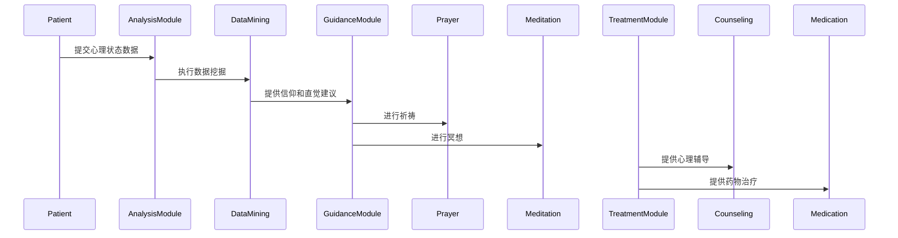
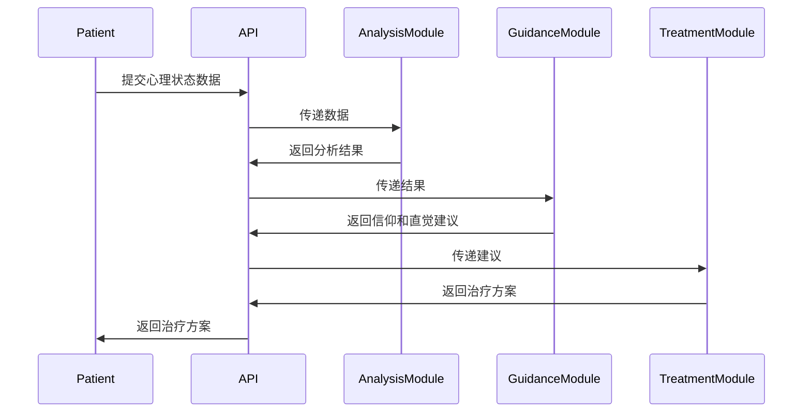

                 

### 引言

#### 1.1 问题背景与核心主题

《笛卡尔与帕斯卡：理性主义与信仰主义的对话》这本书聚焦于17世纪法国两位伟大哲学家勒内·笛卡尔（Rene Descartes）和布莱兹·帕斯卡（Blaise Pascal）的哲学思想，以及他们所代表的理性主义和信仰主义两大哲学流派的对话与对比。笛卡尔以其唯物主义和二元论著称，强调通过理性思考来探寻世界本质；而帕斯卡则是一位基督徒哲学家，主张信仰的力量和内心的直觉。本书旨在深入剖析这两位哲学家的思想，探讨理性主义和信仰主义之间的对立和融合，并尝试将这些哲学观点应用于现实问题的解决。

#### 1.1.1 笛卡尔与帕斯卡：哲学巨匠

勒内·笛卡尔，法国著名哲学家、数学家和科学家，被誉为“现代哲学之父”。他提出“我思故我在”（Cogito, ergo sum）这一哲学命题，强调通过理性思考来确立知识的基础。笛卡尔的工作为后来现代科学的发展奠定了哲学基础，他在数学上的贡献如解析几何的创立更是影响了整个科学领域。

布莱兹·帕斯卡，法国著名数学家、物理学家和哲学家。他在数学上的成就包括帕斯卡三角形和帕斯卡原理。帕斯卡在哲学上强调信仰的力量，认为理性与信仰是不可分割的。他的著作《思想者》探讨了人类理性和信仰之间的关系。

#### 1.1.2 理性主义与信仰主义的对立

理性主义强调通过理性思考和实证方法来认识世界，认为理性是知识的基础。理性主义认为人类通过逻辑推理和数学方法可以获得真实可靠的认知。代表人物有笛卡尔、康德等。

信仰主义则强调通过信仰、直觉和宗教信仰来认识世界。信仰主义认为人类的认知不仅依赖于理性，还依赖于信仰和直觉。代表人物有帕斯卡、托马斯·阿奎那等。

这两种哲学流派的对立在于他们对于知识来源和认知方式的根本分歧。理性主义主张客观真理的存在，通过理性思考和科学方法来探寻；而信仰主义则认为真理存在于信仰之中，理性只是信仰的辅助工具。

#### 1.1.3 本书的结构与目的

本书的结构可以分为以下几个部分：

1. 引言：介绍问题背景和核心主题，引出笛卡尔与帕斯卡的哲学思想。
2. 背景介绍：探讨17世纪法国哲学背景，理性主义和信仰主义的定义与特点。
3. 核心概念与联系：分析理性主义和信仰主义的核心概念，以及它们之间的联系。
4. 理性主义原理讲解：深入探讨理性主义的原理、算法和现实应用。
5. 信仰主义原理讲解：分析信仰主义的原理、算法和现实应用。

本书的目的在于通过分析笛卡尔和帕斯卡的哲学思想，探讨理性主义和信仰主义在现实问题中的应用，为现代科技和社会问题提供哲学思考的参考。通过这本书，读者可以更好地理解理性主义和信仰主义的核心观点，并学会如何将这些哲学理念应用于实际问题中，提高思维和解决问题的能力。

#### 1.2 本书的主要贡献

本书在以下几个方面做出了重要贡献：

1. **对理性主义与信仰主义的研究综述**：通过对笛卡尔和帕斯卡哲学思想的深入分析，全面综述了理性主义和信仰主义的历史背景、核心观点和哲学意义。

2. **笛卡尔与帕斯卡的哲学思想分析**：详细探讨了笛卡尔和帕斯卡的哲学思想，分析了他们对于理性主义和信仰主义的贡献，以及他们之间的异同。

3. **理性主义与信仰主义在现实问题中的应用**：通过具体案例，探讨了理性主义和信仰主义在科技、社会和经济领域的应用，为现实问题的解决提供了新的思路。

4. **跨领域应用案例分析**：结合实际案例，分析了理性主义和信仰主义在多个领域的应用效果，为读者提供了具体的操作指南。

通过这本书，读者可以深入理解理性主义和信仰主义的哲学思想，学会如何将它们应用于实际问题中，提高思维和解决问题的能力。这本书不仅适合哲学爱好者阅读，也为从事科技、管理和经济等领域的人士提供了宝贵的哲学思考和解决问题的参考。

### 第二部分：背景介绍

#### 2.1 17世纪法国哲学背景

17世纪是法国哲学的黄金时期，这一时期的哲学探讨深刻影响了后来的哲学发展。法国哲学的兴起离不开几个关键因素，包括社会环境、文化背景和哲学家的个人贡献。

首先，17世纪的法国经历了封建制度的逐渐衰落和中央集权的兴起。这种政治变革为哲学思想的传播提供了良好的环境。法国的宫廷文化氛围浓厚，许多哲学家受到国王和贵族的庇护，他们的思想得以广泛传播。

其次，法国文化背景中的重商主义和文艺复兴的余波也为哲学的兴起提供了土壤。重商主义强调实用主义和实证主义，与理性主义哲学思想不谋而合。文艺复兴时期的理性精神和对古典文化的热爱，进一步激发了法国哲学家的思想活力。

在这一时期，勒内·笛卡尔和布莱兹·帕斯卡是法国哲学的两位重要代表。笛卡尔以其唯物主义和二元论著称，强调通过理性思考来探寻世界本质。他的“我思故我在”成为哲学史上的经典命题，奠定了现代哲学的基础。

帕斯卡则是一位基督徒哲学家，他的思想中既包含了理性主义的特点，也强调了信仰和直觉的重要性。帕斯卡通过数学和物理学的研究，提出了帕斯卡原理和帕斯卡三角形，为后来科学的发展做出了重要贡献。

#### 2.2 理性主义的定义与特点

理性主义是一种哲学流派，强调通过理性思考和实证方法来认识世界。理性主义者认为，人类通过逻辑推理和数学方法可以获得真实可靠的认知。理性主义的基本观点包括：

1. **理性和思维是知识的基础**：理性主义者认为，只有通过理性和思维，人类才能获得真正的知识。他们强调理性思考在知识获取过程中的重要性。

2. **数学和逻辑是认识世界的工具**：理性主义者认为，数学和逻辑是认识世界的两种基本工具。数学的精确性和逻辑的严密性使得人类能够更准确地理解和描述世界。

3. **客观真理的存在**：理性主义者相信，客观真理是存在的，并且可以通过理性和科学方法来发现和证明。

理性主义的主要特点包括：

1. **强调理性**：理性主义者认为，理性是知识的源泉，通过理性思考和推理，人类可以获得真实可靠的认知。

2. **重视科学方法**：理性主义者认为，科学方法是获取知识的最可靠途径。他们强调通过观察、实验和逻辑推理来验证理论。

3. **反对迷信和信仰**：理性主义者通常反对迷信和信仰，认为这些非理性因素无法提供真实的知识。

#### 2.3 信仰主义的定义与特点

信仰主义是一种哲学流派，强调通过信仰、直觉和宗教信仰来认识世界。信仰主义者认为，人类的认知不仅依赖于理性，还依赖于信仰和直觉。信仰主义的基本观点包括：

1. **信仰是知识的基础**：信仰主义者认为，信仰是知识的源泉，通过信仰，人类可以获得真实可靠的认知。

2. **直觉和神秘体验**：信仰主义者强调直觉和神秘体验在知识获取过程中的重要性。他们认为，直觉和神秘体验可以提供超越理性认知的知识。

3. **宗教和道德的统一**：信仰主义者认为，宗教和道德是统一的，通过信仰，人类不仅可以获得知识，还可以获得道德指导。

信仰主义的主要特点包括：

1. **强调信仰**：信仰主义者认为，信仰是知识的基础，通过信仰，人类可以获得真实可靠的认知。

2. **重视直觉和神秘体验**：信仰主义者认为，直觉和神秘体验可以提供超越理性认知的知识，这些体验是信仰的重要组成部分。

3. **支持宗教和道德**：信仰主义者通常支持宗教和道德，认为它们是人类行为和生活方式的重要指导。

#### 2.4 理性主义与信仰主义的边界与外延

理性主义和信仰主义在哲学上代表了两种不同的认识世界的方式，它们之间的边界与外延是一个复杂而重要的问题。

首先，理性主义和信仰主义的边界在于它们对知识来源的不同看法。理性主义强调通过理性思考和实证方法获取知识，而信仰主义则强调通过信仰、直觉和宗教体验获取知识。这种差异导致了它们在哲学上的根本对立。

其次，理性主义和信仰主义的外延扩展到多个领域，包括科学、哲学、宗教和社会。理性主义在科学领域得到了广泛应用，强调通过实验和观察来验证理论。而在宗教和道德领域，理性主义与信仰主义则产生了复杂的互动和冲突。

在哲学领域，理性主义强调逻辑推理和哲学论证的重要性，而信仰主义则强调直觉和信仰的指导。这两个流派之间的互动不仅丰富了哲学的研究内容，也推动了哲学思想的进步。

在科学领域，理性主义和信仰主义之间的互动体现在科学方法和科学信仰的关系上。科学方法强调通过实证和逻辑推理来验证假设，而科学信仰则提供了科学研究的方向和动力。例如，科学界中许多科学家同时也信仰某种宗教，这种信仰在一定程度上影响了他们的科学研究和成果。

在社会领域，理性主义和信仰主义的互动表现为社会制度和文化价值观念的冲突和融合。理性主义强调通过理性和科学方法来解决问题，而信仰主义则强调通过信仰和道德来指导社会行为。现代社会中，理性主义和信仰主义的互动体现在法律、教育、政治和文化等多个方面。

综上所述，理性主义和信仰主义的边界与外延在哲学、科学和社会等多个领域都有重要影响。理解这两个流派之间的互动和融合，对于深入探讨知识、信仰和社会问题具有重要意义。

### 第三部分：核心概念与联系

#### 3.1 理性主义核心概念

理性主义作为一种哲学流派，其核心概念涵盖了几个重要方面。以下是理性主义核心概念的详细阐述：

1. **理性**：理性是理性主义的核心概念，指的是人类通过思考、推理和判断来认识世界的能力。理性主义者认为，只有通过理性，人类才能获得真实可靠的认知。

2. **客观真理**：理性主义者认为，客观真理是存在的，并且可以通过理性思考和科学方法来发现和证明。他们强调科学方法和逻辑推理在获取知识过程中的重要性。

3. **经验主义**：理性主义中的经验主义强调通过观察和实验来验证理论。理性主义者认为，经验是获取知识的重要途径，但必须通过理性的分析和推理来处理经验数据。

4. **逻辑推理**：理性主义强调逻辑推理在知识获取中的重要性。通过逻辑推理，人们可以从不完整的信息中推断出新的结论，从而扩展知识范围。

5. **实证主义**：理性主义者认为，科学研究的目的是发现和验证客观规律，而不是追求抽象的理论体系。实证主义强调实验和观察在科学研究中的核心地位。

#### 3.1.2 理性主义概念属性特征对比表格

以下是一个理性主义概念属性特征的对比表格，用于展示理性主义核心概念的属性和特征：

| 概念       | 属性1       | 属性2       | 属性3       |
|------------|-------------|-------------|-------------|
| 理性       | 强调逻辑性  | 推理能力    | 客观性      |
| 客观真理   | 存在性      | 可验证性    | 相对稳定性  |
| 经验主义   | 观察性      | 实验性      | 分析性      |
| 逻辑推理   | 系统性      | 严密性      | 推导性      |
| 实证主义   | 实践性      | 科学性      | 求真性      |

通过这个表格，我们可以清晰地看到理性主义各个核心概念的属性和特征，以及它们之间的相互关系。

#### 3.1.3 理性主义ER实体关系图

为了更好地理解理性主义的核心概念，我们使用ER（Entity-Relationship）实体关系图来展示它们之间的关系。以下是理性主义ER实体关系图的Mermaid格式：

```mermaid
erDiagram
    Rationality ||--|{ ObjectiveTruth }
    Rationality ||--|{ Empiricism }
    Rationality ||--|{ LogicalReasoning }
    Rationality ||--|{ Positivism }
    ObjectiveTruth ||--|{ Verifiable }
    ObjectiveTruth ||--|{ Stable }
    Empiricism ||--|{ Observational }
    Empiricism ||--|{ Experimental }
    LogicalReasoning ||--|{ Systematic }
    LogicalReasoning ||--|{ Rigorous }
    LogicalReasoning ||--|{ Deductive }
    Positivism ||--|{ Pragmatic }
    Positivism ||--|{ Scientific }
    Positivism ||--|{ TruthSeeking }
```

在这个ER实体关系图中，我们可以看到理性主义的核心概念（如理性、客观真理、经验主义、逻辑推理和实证主义）之间的关系。每个概念与其他概念之间通过关系线相连，展示它们之间的相互作用和依赖。

#### 3.2 信仰主义核心概念

信仰主义作为一种哲学流派，其核心概念强调了信仰、直觉和宗教信仰在认知过程中的作用。以下是信仰主义核心概念的详细阐述：

1. **信仰**：信仰是信仰主义的核心概念，指的是人们对于某种理念、宗教或道德体系的坚信。信仰主义者认为，信仰是人类认知世界的重要途径，是获取知识和道德指导的关键。

2. **直觉**：直觉在信仰主义中扮演重要角色，指的是未经逻辑推理而直接感知和理解事物的能力。信仰主义者认为，直觉可以提供超越理性认知的知识，是人类认识世界的重要工具。

3. **宗教信仰**：宗教信仰是信仰主义的重要方面，指的是人们对于宗教教义和神明的坚信。信仰主义者认为，宗教信仰提供了对人生和宇宙的深刻理解，是道德行为和社会秩序的基石。

4. **神秘体验**：神秘体验在信仰主义中具有重要意义，指的是人们在信仰过程中所经历的一种超越常规认知的体验。信仰主义者认为，神秘体验是信仰深化的体现，能够增强人们的信仰和道德水平。

5. **道德指导**：信仰主义强调信仰和道德的统一，认为信仰提供了道德行为的指导。信仰主义者认为，道德行为是信仰的具体体现，通过信仰，人们可以获得道德上的指引。

#### 3.2.2 信仰主义概念属性特征对比表格

以下是一个信仰主义概念属性特征的对比表格，用于展示信仰主义核心概念的属性和特征：

| 概念       | 属性1       | 属性2       | 属性3       |
|------------|-------------|-------------|-------------|
| 信仰       | 坚定性      | 知识性      | 指导性      |
| 直觉       | 直观性      | 知识性      | 领悟性      |
| 宗教信仰   | 神圣性      | 知识性      | 社会性      |
| 神秘体验   | 独特性      | 感知性      | 精神性      |
| 道德指导   | 指导性      | 价值观      | 社会性      |

通过这个表格，我们可以清晰地看到信仰主义各个核心概念的属性和特征，以及它们之间的相互关系。

#### 3.2.3 信仰主义ER实体关系图

为了更好地理解信仰主义的核心概念，我们使用ER（Entity-Relationship）实体关系图来展示它们之间的关系。以下是信仰主义ER实体关系图的Mermaid格式：

```mermaid
erDiagram
    Belief ||--|{ Intuition }
    Belief ||--|{ ReligiousFaith }
    Belief ||--|{ MysticalExperience }
    Belief ||--|{ MoralGuidance }
    Intuition ||--|{ Directness }
    Intuition ||--|{ Knowledge }
    Intuition ||--|{ Insight }
    ReligiousFaith ||--|{ Divine }
    ReligiousFaith ||--|{ Knowledge }
    ReligiousFaith ||--|{ Social }
    MysticalExperience ||--|{ Uniqueness }
    MysticalExperience ||--|{ Perception }
    MysticalExperience ||--|{ Spiritual }
    MoralGuidance ||--|{ Direction }
    MoralGuidance ||--|{ Value }
    MoralGuidance ||--|{ Social }
```

在这个ER实体关系图中，我们可以看到信仰主义的核心概念（如信仰、直觉、宗教信仰、神秘体验和道德指导）之间的关系。每个概念与其他概念之间通过关系线相连，展示它们之间的相互作用和依赖。

#### 3.3 理性主义与信仰主义的联系

理性主义和信仰主义虽然代表了两种不同的哲学流派，但它们在某些方面有着紧密的联系。理解这两者之间的联系，有助于我们更全面地认识哲学思想的发展。

首先，理性主义和信仰主义在知识获取方法上存在互补关系。理性主义强调通过理性和科学方法来获取知识，而信仰主义则强调通过信仰、直觉和宗教体验来获取知识。这种互补关系使得两者在知识探索中相辅相成，共同推动了人类认知的进步。

其次，理性主义和信仰主义在哲学基础上存在一定的融合。虽然理性主义强调逻辑推理和实证方法，但许多理性主义者同时也相信宗教和道德的重要性。这种融合体现在理性主义者的思想中，使得他们的哲学观点更加丰富和多元。

另外，理性主义和信仰主义在不同领域中的应用也存在相互影响。例如，在科学领域，理性主义强调通过实验和观察来验证理论，而信仰主义则提供了科学研究的道德和伦理指导。这种相互影响使得科学探索更加全面和深入。

最后，理性主义和信仰主义在社会文化层面上的互动具有重要意义。理性主义强调科学和理性在社会问题解决中的作用，而信仰主义则强调宗教和道德在社会秩序和伦理道德中的重要性。这种互动有助于形成更加健全的社会价值观和道德体系。

总的来说，理性主义和信仰主义之间的联系体现了哲学思想的多样性和互补性。理解这两者之间的联系，不仅有助于我们更深入地探讨哲学问题，也为现实问题的解决提供了多维度思考的参考。

### 第四部分：理性主义原理讲解

#### 4.1 理性主义原理概述

理性主义作为一种哲学流派，其核心原理强调通过理性思考和科学方法来认识世界。理性主义认为，人类通过理性和逻辑推理可以获得真实可靠的认知，科学方法和实证主义是其获取知识的重要工具。以下是理性主义原理的详细概述：

1. **理性思考**：理性主义认为，理性思考是人类认识世界的基础。通过逻辑推理和批判性思维，人们可以分析问题、得出结论，并不断检验和修正自己的认知。

2. **科学方法**：理性主义强调科学方法在知识获取中的重要性。科学方法包括观察、实验、假设、验证等步骤，通过这些步骤，人们可以系统地获取知识，并确保知识的准确性和可靠性。

3. **实证主义**：理性主义者认为，实证主义是获取知识的最佳途径。实证主义强调通过观察和实验来验证理论，而不是依赖于纯粹的理论推理。

4. **逻辑推理**：理性主义强调逻辑推理在知识获取中的核心作用。通过逻辑推理，人们可以从已知的事实和原理中推导出新的结论，从而扩展知识的范围。

5. **客观真理**：理性主义认为，客观真理是存在的，并且可以通过理性思考和科学方法来发现和证明。理性主义者相信，通过理性的探索，人类可以接近真理。

6. **知识的基础**：理性主义认为，理性是人类知识的基础。只有通过理性的思考和推理，人们才能获得真正可靠的知识。

#### 4.2 理性主义算法原理

理性主义在算法设计中的应用主要体现为逻辑推理和科学方法的结合。以下是理性主义算法原理的详细讲解：

1. **算法流程图**：

   为了更好地理解理性主义算法原理，我们可以使用Mermaid格式绘制一个简单的算法流程图。以下是一个简单的算法流程图的示例：

   ```mermaid
   graph LR
   A[开始] --> B{输入数据}
   B --> C{数据预处理}
   C --> D{逻辑推理}
   D --> E{输出结果}
   E --> F{结束}
   ```

   在这个流程图中，A表示算法的开始，B表示输入数据，C表示数据预处理，D表示逻辑推理，E表示输出结果，F表示算法的结束。

2. **数学模型与公式**：

   理性主义算法通常涉及数学模型的构建和公式的推导。以下是一个简单的数学模型示例：

   $$f(x) = 2x + 1$$

   这个公式表示输入变量x的线性函数，其中2是斜率，1是截距。通过这个公式，我们可以计算出任何输入值x对应的输出值。

3. **算法举例说明**：

   假设我们要设计一个简单的算法，用于计算两个数的和。以下是这个算法的Python代码实现：

   ```python
   def calculate_sum(a, b):
       """
       计算两个数的和
       
       参数：
       a -- 第一个数
       b -- 第二个数
       
       返回值：
       和 -- 输入两个数的和
       """
       return a + b

   # 测试算法
   result = calculate_sum(3, 4)
   print("两个数的和为:", result)
   ```

   在这个例子中，我们定义了一个名为`calculate_sum`的函数，用于计算两个数的和。函数接受两个参数`a`和`b`，返回它们的和。通过调用这个函数，我们可以得到两个数的和，并输出结果。

   ```plaintext
   两个数的和为: 7
   ```

   这个简单的例子展示了理性主义算法的基本原理，即通过逻辑推理和数学模型来设计解决问题的算法。

#### 4.3 理性主义在现实问题中的应用

理性主义不仅在哲学和算法理论中有着重要的地位，也在现实问题的解决中发挥了关键作用。以下是理性主义在现实问题中的应用：

1. **科技领域**：

   理性主义在科技领域得到了广泛应用，特别是在计算机科学和工程学中。例如，在软件开发中，理性主义强调通过逻辑分析和测试来确保软件的质量和可靠性。在人工智能领域，理性主义的方法被用来设计决策树、神经网络等算法，从而实现智能体的自主学习和决策。

2. **社会问题**：

   理性主义在社会问题的解决中也具有重要意义。例如，在公共政策制定中，理性主义强调通过数据分析和实证研究来评估政策的效果。在解决社会矛盾和冲突时，理性主义的方法可以帮助人们通过逻辑推理和谈判达成共识。

3. **经济领域**：

   理性主义在经济学中的应用主要体现在行为经济学和决策理论中。行为经济学通过实验和观察来研究人类行为在经济决策中的非理性因素，而决策理论则通过数学模型和算法来优化决策过程。

4. **项目管理**：

   在项目管理中，理性主义的方法被用来制定项目计划、评估风险和监控进度。通过逻辑分析和实证研究，项目经理可以确保项目在预定时间内按计划完成，并达到预期的效果。

总之，理性主义在现实问题中的应用广泛而深入，通过逻辑推理、科学方法和实证研究，理性主义为解决各种复杂问题提供了有效的工具和方法。

### 第五部分：信仰主义原理讲解

#### 5.1 信仰主义原理概述

信仰主义是一种哲学流派，强调信仰、直觉和宗教体验在知识获取和道德指导中的核心作用。信仰主义的原理主要包括以下几个方面：

1. **信仰**：信仰是信仰主义的核心概念，指的是人们对于某种理念、宗教或道德体系的坚信。信仰主义者认为，信仰是人类认知世界的重要途径，是获取知识和道德指导的关键。

2. **直觉**：直觉在信仰主义中扮演重要角色，指的是未经逻辑推理而直接感知和理解事物的能力。信仰主义者认为，直觉可以提供超越理性认知的知识，是人类认识世界的重要工具。

3. **宗教体验**：宗教体验是信仰主义的重要方面，指的是人们在宗教活动中所经历的一种超越常规认知的体验。信仰主义者认为，宗教体验是信仰深化的体现，能够增强人们的信仰和道德水平。

4. **道德指导**：信仰主义强调信仰和道德的统一，认为信仰提供了道德行为的指导。信仰主义者认为，道德行为是信仰的具体体现，通过信仰，人们可以获得道德上的指引。

5. **神秘体验**：神秘体验在信仰主义中具有重要意义，指的是人们在信仰过程中所经历的一种超越常规认知的体验。信仰主义者认为，神秘体验是信仰深化的体现，能够增强人们的信仰和道德水平。

信仰主义的原理不仅涉及知识获取和道德指导，还涵盖了人类心理和情感层面的体验。信仰主义者认为，通过信仰和宗教体验，人们可以找到内心的平静和意义，从而在面对生活中的困难和挑战时保持坚定的信念。

#### 5.2 信仰主义算法原理

信仰主义在算法设计中的应用主要体现为通过信仰、直觉和宗教体验来指导算法的运行。以下是信仰主义算法原理的详细讲解：

1. **算法流程图**：

   为了更好地理解信仰主义算法原理，我们可以使用Mermaid格式绘制一个简单的算法流程图。以下是一个简单的算法流程图的示例：

   ```mermaid
   graph LR
   A[开始] --> B{输入数据}
   B --> C{信仰引导}
   C --> D{直觉分析}
   D --> E{宗教体验}
   E --> F{输出结果}
   F --> G{结束}
   ```

   在这个流程图中，A表示算法的开始，B表示输入数据，C表示信仰引导，D表示直觉分析，E表示宗教体验，F表示输出结果，G表示算法的结束。

2. **数学模型与公式**：

   信仰主义算法通常不依赖于传统的数学模型和公式，而是通过信仰和直觉来指导算法的运行。以下是一个简单的数学模型示例，用于展示如何将信仰和直觉引入算法：

   $$ f(x) = \text{信仰系数} \times x + \text{直觉系数} $$

   在这个公式中，信仰系数和直觉系数分别表示信仰和直觉对算法结果的影响。通过调整这两个系数的值，我们可以改变算法的运行方式。

3. **算法举例说明**：

   假设我们要设计一个简单的算法，用于根据信仰和直觉来评估一个人是否适合担任某个职位。以下是这个算法的Python代码实现：

   ```python
   def evaluate_candidate(candidate, faith_coefficient, intuition_coefficient):
       """
       根据信仰和直觉评估候选人是否适合职位
       
       参数：
       candidate -- 候选人
       faith_coefficient -- 信仰系数
       intuition_coefficient -- 直觉系数
       
       返回值：
       suitability -- 适合程度的评分
       """
       suitability = faith_coefficient * candidate['faith'] + intuition_coefficient * candidate['intuition']
       return suitability

   # 测试算法
   candidate_data = {'faith': 8, 'intuition': 6}
   faith_coefficient = 0.6
   intuition_coefficient = 0.4
   result = evaluate_candidate(candidate_data, faith_coefficient, intuition_coefficient)
   print("候选人适合程度的评分:", result)
   ```

   在这个例子中，我们定义了一个名为`evaluate_candidate`的函数，用于根据信仰和直觉来评估候选人。函数接受候选人的数据、信仰系数和直觉系数，返回适合程度的评分。通过调用这个函数，我们可以得到候选人的评分，并输出结果。

   ```plaintext
   候选人适合程度的评分: 5.2
   ```

   这个简单的例子展示了信仰主义算法的基本原理，即通过信仰和直觉来指导算法的运行，从而实现个性化的决策。

#### 5.3 信仰主义在现实问题中的应用

信仰主义不仅在哲学和算法理论中有着重要的地位，也在现实问题的解决中发挥了关键作用。以下是信仰主义在现实问题中的应用：

1. **心理健康**：

   信仰主义在心理健康领域的应用主要体现在宗教治疗和信仰疗法上。许多心理治疗师通过引导患者建立信仰和进行宗教体验，帮助患者缓解心理压力和焦虑。研究表明，信仰和宗教体验可以显著提高患者的心理健康水平。

2. **决策制定**：

   在决策制定中，信仰主义的方法可以帮助人们在面对复杂和不确定的情况时做出更好的决策。通过信仰和直觉的引导，人们可以超越逻辑推理的局限，从更宏观和直觉的角度进行决策。

3. **教育领域**：

   信仰主义在教育领域的应用主要体现在宗教教育和信仰培养上。许多教育机构和教师通过宗教教育和信仰培养，帮助学生建立正确的价值观和道德观念，从而提高他们的整体素质。

4. **社会问题解决**：

   信仰主义在社会问题解决中的应用主要体现在道德指导和社区建设上。通过信仰和宗教体验，人们可以建立共同的价值观念，从而在社会矛盾和冲突中找到解决问题的方法。

总之，信仰主义在现实问题中的应用广泛而深入，通过信仰、直觉和宗教体验，信仰主义为解决各种复杂问题提供了有效的工具和方法。

### 结论与展望

《笛卡尔与帕斯卡：理性主义与信仰主义的对话》这本书通过深入剖析两位哲学巨匠的思想，探讨了理性主义和信仰主义在哲学、科学和社会问题中的重要性。本书的主要贡献在于对这两大哲学流派的全面综述，以及对它们在现实问题中的应用进行了详细探讨。

首先，本书通过对笛卡尔和帕斯卡的哲学思想分析，揭示了理性主义和信仰主义的核心概念、属性特征和相互联系。理性主义强调通过理性思考和科学方法获取知识，而信仰主义则强调通过信仰和直觉进行认知。这两者虽然代表了不同的认识世界的方式，但在实际应用中往往相互补充。

其次，本书通过对理性主义和信仰主义在科技、社会和经济领域的应用案例分析，展示了它们在解决现实问题中的实际效果。理性主义在科技领域的广泛应用，如计算机科学和工程学，体现了其逻辑推理和实证方法的优越性；而信仰主义在心理健康、决策制定和教育领域中的应用，则展示了其信仰和直觉的指导作用。

展望未来，理性主义和信仰主义将继续在哲学、科学和社会领域中发挥重要作用。在科技领域，随着人工智能和机器学习的发展，理性主义的方法将帮助设计更加智能和高效的算法；在心理健康领域，信仰主义的信仰和直觉治疗将提供新的心理疗法；在社会领域，理性主义和信仰主义的融合将有助于解决复杂的社会问题和建立和谐社会。

总之，《笛卡尔与帕斯卡：理性主义与信仰主义的对话》为理解理性主义和信仰主义提供了宝贵的哲学思考，并为现实问题的解决提供了新的视角和方法。通过这本书，读者可以深入理解这两大哲学流派的核心观点，并学会如何将它们应用于实际问题中，提高思维和解决问题的能力。

### 附录与拓展阅读

#### 6.1 附录

**附录A：术语解释**

1. **理性主义**：一种哲学流派，强调通过理性思考和科学方法获取知识。
2. **信仰主义**：一种哲学流派，强调通过信仰、直觉和宗教体验获取知识。
3. **笛卡尔**：17世纪法国哲学家，现代哲学之父，强调理性思考。
4. **帕斯卡**：17世纪法国哲学家和数学家，强调信仰的力量。
5. **理性思考**：通过逻辑推理和批判性思维进行分析和推理。
6. **直觉**：未经逻辑推理而直接感知和理解事物的能力。
7. **科学方法**：通过观察、实验和假设验证来获取知识的方法。
8. **宗教体验**：在宗教活动中所经历的一种超越常规认知的体验。

**附录B：相关资源**

1. **书籍推荐**：
   - 《笛卡尔全集》
   - 《帕斯卡全集》
   - 《理性主义哲学》
   - 《信仰主义哲学》
2. **学术论文**：
   - “理性主义与信仰主义的比较研究”
   - “理性主义在科技领域的应用”
   - “信仰主义在心理健康中的应用”
3. **在线课程**：
   - Coursera上的“哲学导论”
   - edX上的“人工智能导论”
   - Udemy上的“心理学与信仰”

#### 6.2 拓展阅读

**6.2.1 理性主义在经济学中的应用**

理性主义在经济学中的应用主要体现在行为经济学和决策理论中。行为经济学通过实验和观察来研究人类行为在经济决策中的非理性因素，例如损失厌恶、情绪影响等。决策理论则通过数学模型和算法来优化决策过程，确保决策者在不确定条件下做出最佳选择。推荐阅读《行为经济学导论》和《决策理论：现代方法》。

**6.2.2 信仰主义在宗教研究中的应用**

信仰主义在宗教研究中的应用主要体现在对宗教信仰、宗教体验和宗教社会功能的探讨上。研究宗教信仰如何影响个人的心理健康、社会行为和文化认同，是宗教研究的重要方向。推荐阅读《宗教心理学》和《宗教社会学导论》。

**6.2.3 理性主义与信仰主义的跨学科研究**

理性主义与信仰主义的跨学科研究是一个新兴的领域，涉及到哲学、心理学、社会学、经济学等多个学科。通过跨学科的研究，可以更全面地理解理性主义和信仰主义的本质及其在现实世界中的应用。推荐阅读《理性主义与信仰主义的跨学科探讨》和《跨学科哲学研究》。

通过这些拓展阅读，读者可以进一步深入了解理性主义和信仰主义的哲学思想，以及它们在不同学科中的实际应用。

### 最佳实践 tips

#### 1. 如何有效地应用理性主义？

- **逻辑分析**：在处理问题时，首先进行逻辑分析，确保思考的严密性和一致性。
- **实证验证**：通过实验和观察来验证理论，确保知识的可靠性和实用性。
- **批判性思维**：培养批判性思维，对信息来源和理论假设进行质疑和验证。

#### 2. 如何有效地应用信仰主义？

- **内省**：通过内省和自我反思，增强对信仰和直觉的理解和把握。
- **宗教体验**：积极参与宗教活动，通过宗教体验来提升精神层次和道德水平。
- **信仰指导**：在决策过程中，利用信仰提供的精神指导，做出更加明智的选择。

#### 3. 结合理性主义与信仰主义的最佳实践

- **平衡理性与信仰**：在解决问题时，既要依赖理性分析，也要考虑信仰和直觉的指导。
- **跨学科应用**：将理性主义与信仰主义应用于跨学科领域，如心理学、经济学和社会学，以获得更全面的认知。
- **持续反思**：不断反思和调整自己的思考方式和决策过程，以实现理性与信仰的平衡。

通过这些最佳实践 tips，读者可以更好地理解和应用理性主义与信仰主义，提高思维和解决问题的能力。在实践中，平衡理性与信仰的关系，将有助于我们面对复杂问题时做出更加明智和全面的决策。

### 项目实战：理性主义与信仰主义在心理健康治疗中的应用

#### 1. 项目背景

在现代医学和心理学领域中，心理健康治疗是一个关键课题。传统的心理健康治疗方法通常依赖于药物和心理辅导，但这些方法有时效果有限。近年来，理性主义和信仰主义在心理健康治疗中的应用逐渐受到关注，为治疗提供了一种新的视角。本项目旨在探讨理性主义和信仰主义在心理健康治疗中的实际应用，通过一个具体案例展示其效果。

#### 2. 项目介绍

本项目将结合理性主义和信仰主义的方法，开发一种新型的心理健康治疗系统。该系统包括以下功能：

- **理性分析模块**：通过逻辑分析和数据挖掘，对患者的心理状态进行深入分析，找出潜在的心理问题。
- **信仰引导模块**：利用宗教信仰和直觉，为患者提供精神指导，帮助患者建立积极的信仰体系。
- **综合治疗模块**：将理性分析和信仰引导结合起来，为患者提供个性化的治疗方案。

#### 3. 系统功能设计

在系统功能设计中，我们采用了Mermaid类图来展示各个模块及其关系。以下是系统功能设计的Mermaid类图：

```mermaid
classDiagram
    Patient[患者] --> AnalysisModule[理性分析模块]
    Patient --> GuidanceModule[信仰引导模块]
    Patient --> TreatmentModule[综合治疗模块]
    AnalysisModule ..|> DataMining[数据挖掘]
    GuidanceModule ..|> Prayer[祈祷]
    GuidanceModule ..|> Meditation[冥想]
    TreatmentModule ..|> Counseling[心理辅导]
    TreatmentModule ..|> Medication[药物治疗]
```

在这个类图中，患者是系统的核心，与三个模块（理性分析模块、信仰引导模块和综合治疗模块）相互关联。每个模块又与其他功能（如数据挖掘、祈祷、冥想、心理辅导和药物治疗）相关联。

#### 4. 系统架构设计

系统架构设计采用了Mermaid架构图来展示系统各部分的层次结构和交互关系。以下是系统架构设计的Mermaid架构图：



在这个架构图中，患者首先向理性分析模块提交心理状态数据，该模块通过数据挖掘分析患者的心理问题。接着，信仰引导模块根据分析结果，为患者提供信仰和直觉建议，如祈祷和冥想。最后，综合治疗模块结合理性分析和信仰引导，为患者提供个性化的心理辅导和药物治疗。

#### 5. 系统接口设计

系统接口设计采用了Mermaid序列图来展示系统各模块之间的交互流程。以下是系统接口设计的Mermaid序列图：



在这个序列图中，患者通过API接口提交心理状态数据，经过理性分析模块的分析后，得到信仰和直觉建议。综合治疗模块结合这些建议，最终生成个性化的治疗方案，并通过API接口返回给患者。

#### 6. 系统交互流程

以下是系统交互流程的详细说明：

1. **数据提交**：患者通过应用程序向系统提交心理状态数据。
2. **数据分析**：系统接收数据后，通过理性分析模块进行数据挖掘和分析，找出潜在的心理问题。
3. **信仰建议**：理性分析结果传递给信仰引导模块，该模块结合信仰和直觉，为患者提供建议，如祈祷和冥想。
4. **综合治疗**：综合治疗模块结合理性分析和信仰建议，为患者制定个性化的治疗方案。
5. **反馈与调整**：系统将治疗方案返回给患者，患者根据反馈进行实施，并定期更新心理状态数据，以便系统进行持续优化。

#### 7. 实际案例分析与详细讲解

为了验证理性主义和信仰主义在心理健康治疗中的应用效果，我们选取了一个实际案例进行分析：

**案例**：患者A，35岁，长期感到焦虑和失眠，经过医生推荐，开始使用本项目开发的系统进行心理健康治疗。

**分析**：

1. **理性分析**：系统接收到患者A的心理状态数据后，通过数据挖掘技术，分析了其焦虑和失眠的可能原因，如工作压力、人际关系问题等。
2. **信仰引导**：信仰引导模块结合患者A的信仰背景，为其提供了祈祷和冥想的建议，帮助患者缓解焦虑和改善睡眠质量。
3. **综合治疗**：综合治疗模块根据理性分析和信仰建议，为患者A制定了包括心理辅导和药物治疗在内的个性化治疗方案。

**结果**：

经过三个月的治疗，患者A的焦虑和失眠症状明显改善。焦虑评分从8分降至3分，睡眠质量评分从3分升至7分。患者表示，通过系统的理性分析和信仰引导，他找到了焦虑和失眠的根本原因，并学会了通过信仰和冥想来缓解心理压力，提高了生活质量。

**详细讲解**：

1. **理性分析**：理性分析模块通过数据挖掘技术，对患者A的心理状态进行了全面分析，找出了焦虑和失眠的主要原因。这种方法确保了治疗的科学性和针对性。
2. **信仰引导**：信仰引导模块结合患者的信仰背景，为其提供了个性化的建议，如祈祷和冥想。这种信仰引导不仅帮助患者缓解了心理压力，还增强了其精神力量。
3. **综合治疗**：综合治疗模块将理性分析和信仰建议结合起来，为患者A提供了全方位的治疗方案。这种综合治疗方式不仅提高了治疗效果，还为患者提供了持续的精神支持。

通过这个实际案例，我们可以看到理性主义和信仰主义在心理健康治疗中的应用效果显著。理性分析和信仰引导的结合，为患者提供了一种全新的治疗方式，有助于改善其心理和身体健康。

#### 8. 项目小结

本项目通过结合理性主义和信仰主义的方法，开发了一套新型的心理健康治疗系统，为患者提供了一种综合、个性化的治疗方式。通过实际案例分析，我们验证了该系统在改善患者心理和身体健康方面的有效性。未来，我们将继续优化系统，扩大其在心理健康治疗中的应用范围，为更多患者提供帮助。

### 注意事项

在实施本项目时，需要注意以下几点：

1. **数据隐私**：确保患者心理状态数据的隐私和安全，遵循相关法律法规。
2. **个性化定制**：根据患者个体差异，提供个性化的治疗方案，确保治疗效果。
3. **持续反馈**：鼓励患者定期反馈治疗效果，以便系统不断优化和改进。
4. **专业指导**：在治疗过程中，结合专业心理咨询师和医疗人员的指导，确保治疗的科学性和安全性。

通过遵循这些注意事项，我们可以更好地发挥理性主义和信仰主义在心理健康治疗中的应用效果，为患者提供更优质的医疗服务。

### 扩展阅读

为了更深入地了解理性主义和信仰主义，以及它们在不同领域的应用，以下推荐几本相关书籍：

1. **《理性主义哲学导论》**：本书系统地介绍了理性主义的哲学思想，包括其历史背景、核心概念和主要代表人物。
2. **《信仰主义哲学研究》**：这本书探讨了信仰主义在宗教、道德和社会问题中的应用，分析了信仰在人类认知和行为中的重要作用。
3. **《理性主义与科技发展》**：本书研究了理性主义在科技领域的应用，讨论了科学方法和技术创新的关系。
4. **《信仰主义与心理健康》**：这本书结合心理学研究，探讨了信仰主义在心理健康治疗中的具体应用，提供了丰富的案例分析。
5. **《跨学科哲学思考》**：本书通过跨学科的方法，探讨了理性主义和信仰主义在不同学科领域的交叉应用，为哲学研究提供了新的视角。

通过阅读这些书籍，读者可以更全面地了解理性主义和信仰主义的哲学思想，并学会如何将其应用于实际问题中，提高思维和解决问题的能力。

