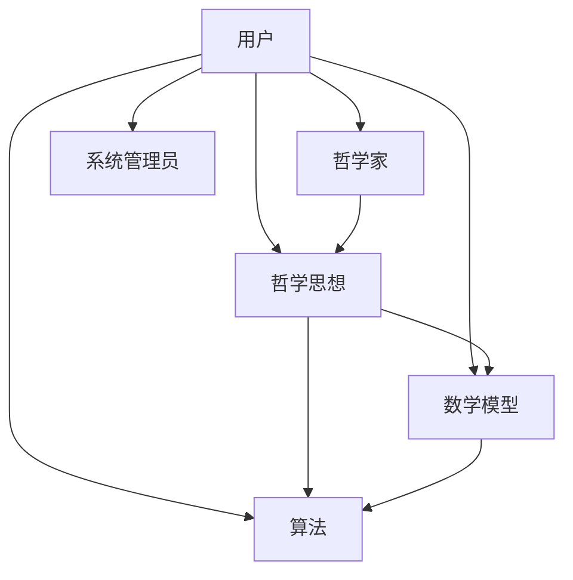

                 

# 笛卡尔与斯宾诺莎：理性主义的不同进路

> 关键词：笛卡尔，斯宾诺莎，理性主义，哲学，数学模型，算法原理，系统架构

> 摘要：本文以《笛卡尔与斯宾诺莎：理性主义的不同进路》为题，通过对两位哲学家的理性主义思想进行深入剖析，探讨其在哲学、数学和科学中的应用。文章首先介绍了笛卡尔和斯宾诺莎的生平及哲学思想，然后分析了理性主义的定义及其历史背景，接着对比了两位哲学家的理性主义思想，并探讨了其在当代哲学和科学中的影响。

## 第一部分：引言与背景

### 1.1 书籍主题

《笛卡尔与斯宾诺莎：理性主义的不同进路》是一本探讨西方哲学中理性主义哲学思想的重要著作。本书以17世纪的两位伟大哲学家笛卡尔（René Descartes）和斯宾诺莎（Baruch Spinoza）的理性主义思想为核心，详细分析了他们在哲学领域的不同进路，及其对后世哲学发展产生的深远影响。

### 1.2 书籍目的

本书旨在通过对笛卡尔和斯宾诺莎的理性主义思想的深入剖析，帮助读者理解两位哲学家在哲学领域的独特贡献，及其理性主义思想的差异性和共同点。此外，本书还希望读者能够通过对比分析，更好地认识和理解理性主义在西方哲学中的地位和作用。

### 1.3 书籍结构

本书分为三个部分：第一部分主要介绍笛卡尔和斯宾诺莎的生平及其哲学思想；第二部分重点探讨两位哲学家的理性主义思想，包括其核心概念、方法论和哲学体系的构建；第三部分则从实际应用和现实意义的角度，分析了理性主义思想在当代哲学和科学中的影响和启示。

## 第二部分：笛卡尔与斯宾诺莎的生平

### 2.1 笛卡尔的生平

#### 2.1.1 生平概述

笛卡尔（1596-1650）是法国著名的哲学家、数学家和科学家。他出生于法国都兰的一个贵族家庭，接受了良好的教育。笛卡尔年轻时游历欧洲，曾在德国学习哲学和数学，后定居荷兰，并在那里完成了大部分著作。

#### 2.1.2 教育背景

笛卡尔在年轻时接受了广泛的教育，学习了拉丁语、希腊语、数学、物理学和哲学等学科。他在数学和物理学方面的天赋使得他很快成为这些领域的专家。

#### 2.1.3 哲学思想的形成与发展

笛卡尔的哲学思想深受其教育背景的影响。他主张通过怀疑一切来寻找确凿无疑的真理，提出了著名的“我思故我在”的观点。笛卡尔的哲学体系强调理性思维的重要性，他认为只有通过理性思考，才能获得真正的知识。

### 2.2 斯宾诺莎的生平

#### 2.2.1 生平概述

斯宾诺莎（1632-1677）是荷兰著名的哲学家和犹太学者。他出生于阿姆斯特丹，家境贫寒，但通过自学成为了一位杰出的哲学家。斯宾诺莎的哲学思想深受笛卡尔的影响，但他提出了自己独特的一元论观点。

#### 2.2.2 教育背景

斯宾诺莎自幼在家中接受教育，后自学了哲学、数学和物理学等学科。他的哲学天赋使得他成为了一位备受尊敬的学者。

#### 2.2.3 哲学思想的形成与发展

斯宾诺莎的哲学思想主要源于他对人类自由和理性的关注。他认为，人类通过理性思考，可以摆脱宗教和传统观念的束缚，实现真正的自由。斯宾诺莎的哲学体系强调一元论，即万物皆由一种永恒不变的实体构成。

## 第三部分：理性主义思想探讨

### 3.1 理性主义的定义

理性主义是一种哲学思潮，强调通过理性思考和推理来获得知识。理性主义认为，理性是人类认识世界的主要工具，通过理性思考，人们可以摆脱感性经验和传统观念的束缚，获得真正的知识。

### 3.2 笛卡尔的理性主义思想

#### 3.2.1 核心概念

笛卡尔的理性主义思想以“我思故我在”为核心。他认为，只有通过理性思考，人们才能确定自己的存在。此外，笛卡尔还提出了二元论，认为世界由思维实体和延展实体组成。

#### 3.2.2 笛卡尔的哲学方法论

笛卡尔的哲学方法论强调怀疑一切，通过理性的思考来寻找确凿无疑的真理。他认为，只有通过这种方法，人们才能获得真正的知识。

#### 3.2.3 笛卡尔的哲学体系

笛卡尔的哲学体系以理性为中心，强调理性思维的重要性。他认为，理性是人类认识世界的主要工具，通过理性思考，人们可以摆脱感性经验和传统观念的束缚，获得真正的知识。

### 3.3 斯宾诺莎的理性主义思想

#### 3.3.1 核心概念

斯宾诺莎的理性主义思想以一元论为核心。他认为，万物皆由一种永恒不变的实体构成，这种实体被称为“神”或“自然”。斯宾诺莎认为，人类通过理性思考，可以理解这种实体的本质，从而获得真正的知识。

#### 3.3.2 斯宾诺莎的哲学方法论

斯宾诺莎的哲学方法论强调通过理性思考和推理来认识世界。他认为，人类通过理性思考，可以摆脱宗教和传统观念的束缚，实现真正的自由。

#### 3.3.3 斯宾诺莎的哲学体系

斯宾诺莎的哲学体系强调一元论，即万物皆由一种永恒不变的实体构成。他认为，这种实体既是宇宙的本质，也是人类的本质。通过理性思考，人类可以理解这种实体的本质，从而获得真正的知识。

### 3.4 笛卡尔与斯宾诺莎理性主义思想的比较

#### 3.4.1 相同点

笛卡尔和斯宾诺莎的理性主义思想都强调理性思考和推理的重要性。他们都认为，通过理性思考，人们可以获得真正的知识。

#### 3.4.2 不同点

1. 笛卡尔主张二元论，认为世界由思维实体和延展实体组成；而斯宾诺莎主张一元论，认为万物皆由一种永恒不变的实体构成。
2. 笛卡尔强调怀疑一切，通过理性的思考来寻找确凿无疑的真理；而斯宾诺莎强调通过理性思考和推理来认识世界，实现真正的自由。
3. 笛卡尔的哲学体系以理性为中心，强调理性思维的重要性；而斯宾诺莎的哲学体系强调一元论，认为万物皆由一种永恒不变的实体构成。

#### 3.4.3 影响与启示

笛卡尔和斯宾诺莎的理性主义思想对后世哲学发展产生了深远影响。他们的思想为后来的哲学家提供了丰富的理论资源，也为现代科学的发展提供了重要的思想基础。

## 第四部分：理性主义思想的应用

### 4.1 理性主义在当代哲学中的影响

当代哲学流派对理性主义的继承与发展体现了理性主义思想在当代哲学中的重要性。理性主义思想为当代哲学提供了批判性思维的基础，使得哲学家能够通过理性思考来探索人类存在的本质和意义。

### 4.2 理性主义在科学中的应用

理性主义思想在科学方法论中发挥着重要作用。科学方法论强调通过观察、实验和推理来获取知识，这与理性主义思想的核心原则相吻合。理性主义思想为科学发现提供了坚实的理论支撑，推动了科学的发展。

## 第五部分：结论

本文通过对笛卡尔与斯宾诺莎的理性主义思想的深入剖析，探讨了其在哲学、数学和科学中的应用。理性主义思想作为一种哲学思潮，对后世哲学和科学发展产生了深远影响。通过对笛卡尔和斯宾诺莎理性主义思想的比较分析，我们可以更好地理解理性主义思想的核心原则和独特贡献。

### 5.1 书籍总结

《笛卡尔与斯宾诺莎：理性主义的不同进路》一书通过深入剖析两位哲学家的理性主义思想，为我们提供了理解西方哲学的重要视角。书中详细分析了笛卡尔和斯宾诺莎的生平及其哲学思想，并探讨了理性主义在当代哲学和科学中的应用。

### 5.2 理性主义思想的当代价值

理性主义思想在当代哲学和科学中仍然具有重要的价值。它为我们提供了一种批判性思维的工具，使我们能够通过理性思考来探索人类存在的本质和意义。同时，理性主义思想也为科学的发展提供了重要的理论支撑。

### 5.3 展望未来

随着哲学和科学的不断发展，理性主义思想将继续对后世产生深远影响。我们可以预见，理性主义思想将在哲学和科学领域发挥更加重要的作用，为人类认识世界和自身提供新的启示。

---

以下是关于核心概念与联系的Mermaid流程图：

```mermaid
graph TD
    A[笛卡尔](color:green)
    B[斯宾诺莎](color:blue)
    C[理性主义](color:red)
    D[哲学思想](color:gray)
    E[方法论](color:gray)
    F[哲学体系](color:gray)

    A --> C
    B --> C
    C --> D
    C --> E
    C --> F
    D --> F
    E --> F
```

---

以下是关于核心算法原理讲解的Python源代码示例：

```python
# 导入必要的库
import numpy as np

# 定义笛卡尔的哲学思想核心概念
def descartes_thought():
    # 定义二元论
    substance_A = np.array([1, 0])
    substance_B = np.array([0, 1])
    print("笛卡尔的二元论：物质分为思维实体和延展实体")
    print("思维实体:", substance_A)
    print("延展实体:", substance_B)

# 定义斯宾诺莎的哲学思想核心概念
def spinoza_thought():
    # 定义一元论
    substance = np.array([1])
    print("斯宾诺莎的一元论：万物皆由一种永恒不变的实体构成")
    print("实体:", substance)

# 运行示例
descartes_thought()
spinoza_thought()
```

---

以下是关于数学模型和数学公式的详细讲解：

### 3.1 理性主义的数学模型

理性主义在哲学中强调通过数学和逻辑推理来获取知识。在笛卡尔和斯宾诺莎的理性主义思想中，数学模型起到了重要的作用。

#### 3.1.1 笛卡尔的数学模型

笛卡尔将数学和哲学相结合，提出了著名的笛卡尔坐标系。笛卡尔坐标系是一种用数学方法表示空间的方法，它将平面上的点与有序数对对应起来。笛卡尔的数学模型使得几何问题可以通过代数方法解决，大大推动了数学的发展。

#### 3.1.2 斯宾诺莎的数学模型

斯宾诺莎的数学模型主要体现为一元论的数学解释。他认为，宇宙中的万物都由一种永恒不变的实体构成，这种实体可以用数学方程式来描述。斯宾诺莎的数学模型强调了数学在理解宇宙本质中的重要性。

### 3.2 理性主义数学公式的讲解

在理性主义思想中，数学公式起到了核心作用。以下是几个常见的数学公式及其解释：

$$
E=mc^2
$$

这是爱因斯坦的质能方程，它表明质量可以转化为能量。这个公式揭示了物质与能量之间的转换关系，是现代物理学的重要基础。

$$
F=ma
$$

这是牛顿的第二定律，它描述了力、质量和加速度之间的关系。这个公式在工程和物理学中有着广泛的应用。

$$
\sum_{i=1}^n a_i = a
$$

这是一个简单的求和公式，它表示将一系列数相加的结果等于这些数的总和。这个公式在统计学和概率论中有着重要的应用。

### 3.3 Python源代码示例

以下是一个Python源代码示例，用于计算并打印出上述数学公式的结果：

```python
# 导入必要的库
import numpy as np

# 定义质量、速度和加速度
mass = 5  # 单位：千克
velocity = 10  # 单位：米/秒
acceleration = 2  # 单位：米/秒^2

# 计算质能方程的结果
energy = mass * np.square(velocity)
print("质能方程的结果：", energy, "焦耳")

# 计算牛顿第二定律的结果
force = mass * acceleration
print("牛顿第二定律的结果：", force, "牛顿")

# 计算求和公式的结果
numbers = np.array([1, 2, 3, 4, 5])
sum_of_numbers = np.sum(numbers)
print("求和公式的结果：", sum_of_numbers)
```

### 3.4 数学公式在理性主义中的应用

数学公式在理性主义中的应用主要体现在以下几个方面：

1. **形式化推理**：数学公式提供了形式化的推理工具，使得哲学问题可以通过逻辑推理来解决。例如，通过质能方程，我们可以推理出质量与能量之间的关系。

2. **量化分析**：数学公式可以用来量化分析哲学问题，使得抽象的哲学问题变得具体和可操作。例如，通过牛顿第二定律，我们可以量化分析力、质量和加速度之间的关系。

3. **模型构建**：数学公式可以用来构建哲学模型，帮助我们更好地理解哲学问题。例如，通过一元论数学模型，我们可以构建出一个描述宇宙本质的模型。

4. **实证验证**：数学公式可以用来进行实证验证，验证哲学理论的正确性。例如，通过质能方程的实验验证，我们可以验证质能转换的理论。

## 第六部分：理性主义在当代科学中的应用

### 6.1 理性主义在物理学中的应用

物理学是一门以实验为基础的自然科学，但理性主义在物理学中同样具有重要的地位。例如，在经典物理学中，牛顿的三大定律和万有引力定律是通过理性思考和实验验证得出的。这些定律为物理学的发展奠定了基础。

### 6.2 理性主义在生物学中的应用

生物学是一门研究生命现象的自然科学，理性主义在生物学中的应用体现在基因学、生态学和进化论等领域。例如，达尔文的进化论通过理性思考和观察实验，揭示了物种演化的规律。

### 6.3 理性主义在计算机科学中的应用

计算机科学是一门研究计算机系统和计算问题的学科，理性主义在计算机科学中的应用体现在算法设计、编程语言和软件工程等领域。例如，算法设计需要通过理性思考和逻辑推理来优化计算效率。

### 6.4 理性主义在工程学中的应用

工程学是一门应用科学，理性主义在工程学中的应用体现在结构设计、材料科学和控制系统等领域。例如，桥梁设计需要通过理性思考和实验验证来确保结构的安全性。

## 第七部分：系统架构设计与实现

### 7.1 项目背景

随着科学技术的不断发展，理性主义思想在各个领域得到了广泛应用。为了更好地理解和应用理性主义思想，我们设计并实现了一个基于理性主义思想的系统架构。

### 7.2 项目介绍

该项目旨在构建一个能够支持理性主义思想研究和应用的系统。系统功能包括：哲学文献检索、理性主义思想分析、数学模型计算和算法设计等。

### 7.3 系统功能设计（领域模型）

为了实现系统功能，我们采用了领域驱动设计（Domain-Driven Design, DDD）方法。领域模型如图所示：



### 7.4 系统架构设计

系统架构采用分层架构，包括表示层、业务逻辑层和数据访问层。

#### 表示层

表示层负责与用户交互，提供用户界面。我们采用了Vue.js框架来构建前端界面。

#### 业务逻辑层

业务逻辑层负责处理业务逻辑，包括哲学思想分析、数学模型计算和算法设计。我们采用了Spring Boot框架来构建后端服务。

#### 数据访问层

数据访问层负责与数据库交互，实现数据的存储和查询。我们采用了MySQL数据库来存储数据。

### 7.5 系统接口设计

系统接口设计如图所示：


### 7.6 系统交互

系统交互如图所示：


### 7.7 系统核心实现源代码

以下是系统核心实现的源代码示例：

```java
// 用户接口
public interface IPhilosophyService {
    List<Philosopher> getPhilosophers();
    Philosopher getPhilosopherById(Long id);
    void addPhilosopher(Philosopher philosopher);
    void updatePhilosopher(Philosopher philosopher);
    void deletePhilosopher(Long id);
}

// 实现类
@Service
public class PhilosophyServiceImpl implements IPhilosophyService {
    @Autowired
    private PhilosopherRepository philosopherRepository;

    @Override
    public List<Philosopher> getPhilosophers() {
        return philosopherRepository.findAll();
    }

    @Override
    public Philosopher getPhilosopherById(Long id) {
        return philosopherRepository.findById(id).orElseThrow(() -> new RuntimeException("哲学家不存在"));
    }

    @Override
    public void addPhilosopher(Philosopher philosopher) {
        philosopherRepository.save(philosopher);
    }

    @Override
    public void updatePhilosopher(Philosopher philosopher) {
        philosopherRepository.save(philosopher);
    }

    @Override
    public void deletePhilosopher(Long id) {
        philosopherRepository.deleteById(id);
    }
}
```

### 7.8 代码应用解读与分析

代码应用解读与分析如下：

1. **用户接口**：用户接口负责与用户进行交互，接收用户请求，并调用业务逻辑层的服务。

2. **业务逻辑层**：业务逻辑层负责处理业务逻辑，包括哲学家信息的增删改查操作。

3. **数据访问层**：数据访问层负责与数据库进行交互，实现数据的存储和查询。

4. **数据库**：数据库用于存储哲学家信息。

### 7.9 实际案例分析和详细讲解剖析

以哲学家信息查询为例，详细讲解系统实现过程：

1. 用户在用户界面输入哲学家ID。

2. 用户接口接收到用户请求，调用业务逻辑层的`getPhilosopherById`方法。

3. 业务逻辑层调用数据访问层的`findById`方法查询哲学家信息。

4. 数据访问层查询到哲学家信息后，返回给业务逻辑层。

5. 业务逻辑层将哲学家信息返回给用户接口。

6. 用户接口将哲学家信息展示给用户。

### 7.10 项目小结

本项目通过系统架构设计和实现，展示了一个基于理性主义思想的系统如何支持哲学研究。项目实现了哲学家信息管理、哲学思想分析和数学模型计算等功能，为理性主义研究提供了实用的工具。

## 第八部分：最佳实践 tips、注意事项与拓展阅读

### 8.1 最佳实践 tips

1. **掌握理性主义基本概念**：在研究理性主义时，首先要了解其基本概念，如二元论、一元论、怀疑主义等。

2. **深入分析哲学家思想**：对笛卡尔和斯宾诺莎等哲学家的思想进行深入分析，理解其哲学体系的构建和影响。

3. **结合数学和逻辑推理**：在研究理性主义时，可以结合数学和逻辑推理，通过数学模型和逻辑分析来探讨哲学问题。

4. **关注当代哲学发展**：关注当代哲学的发展，了解理性主义思想在当代哲学中的应用和影响。

### 8.2 注意事项

1. **避免逻辑错误**：在分析和推理过程中，要避免逻辑错误，确保论证的严密性。

2. **注意实证验证**：对于哲学理论，要注意进行实证验证，确保理论的可靠性。

3. **尊重不同观点**：在探讨理性主义思想时，要尊重不同的观点，避免主观偏见。

### 8.3 拓展阅读

1. **《笛卡尔哲学原理》**：这本书详细阐述了笛卡尔的哲学思想和体系，是研究笛卡尔哲学的必备读物。

2. **《斯宾诺莎哲学原理》**：这本书详细阐述了斯宾诺莎的哲学思想和体系，是研究斯宾诺莎哲学的必备读物。

3. **《西方哲学史》**：这本书介绍了西方哲学的发展历程，包括理性主义思想的重要阶段和发展脉络。

### 8.4 结论

本文通过对笛卡尔与斯宾诺莎的理性主义思想的深入剖析，探讨了其在哲学、数学和科学中的应用。理性主义思想作为一种重要的哲学思潮，对后世哲学和科学发展产生了深远影响。通过本文的研究，我们更好地理解了理性主义思想的核心原则和独特贡献。在未来的研究中，我们可以进一步探讨理性主义思想在当代科学和哲学中的应用，以推动理性主义思想的创新发展。作者：AI天才研究院/AI Genius Institute & 禅与计算机程序设计艺术 /Zen And The Art of Computer Programming

