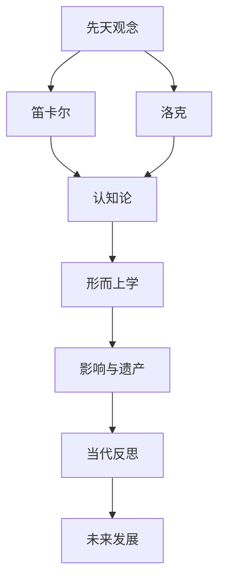

                 

### 《笛卡尔与洛克：先天观念论争》

#### 关键词：哲学、先天观念、笛卡尔、洛克、认知论、形而上学

#### 摘要：
本文探讨了两位伟大哲学家——笛卡尔和洛克——关于先天观念的争论。通过深入分析他们的思想背景、核心观点以及影响，本文旨在揭示这场论争的深层次意义，并探讨其对当代哲学的启示。我们首先将回顾两位哲学家的生平与思想，然后逐步探讨先天观念的定义及其在笛卡尔和洛克哲学中的角色。接下来，我们将比较两位哲学家的认知论和形而上学观点，并分析它们的异同点。文章最后将探讨先天观念论争的影响与遗产，以及当代对这一论争的反思。通过这一步步的分析，我们将更深刻地理解笛卡尔和洛克的思想，以及他们在哲学史上的地位。

## 第一部分：先天观念论争的历史背景

### 第1章：笛卡尔与洛克的思想背景

#### 1.1 笛卡尔哲学的起源与发展

勒内·笛卡尔（René Descartes，1596-1650）是法国著名的哲学家、数学家、物理学家和神学家。他的哲学思想被广泛认为是现代哲学的奠基之作。笛卡尔出生于法国图兰省的一个贵族家庭，受到了良好的教育。他在数学和哲学领域取得了卓越的成就，尤其是他的坐标几何学，为后来的数学和物理学奠定了基础。

笛卡尔的哲学思想深受当时欧洲哲学和科学革命的影响。他的主要著作包括《方法论》、《第一哲学沉思》和《哲学原理》等。笛卡尔的核心观点是“我思故我在”（Cogito, ergo sum），这一观点强调个体自我意识的存在，成为现代哲学的重要基石。

#### 1.2 洛克哲学的形成与特点

约翰·洛克（John Locke，1632-1704）是英国著名的哲学家、政治家和教育家。他的思想对现代哲学、政治理论和教育学产生了深远的影响。洛克出生于英格兰的一个富裕家庭，他在牛津大学接受了教育，并在那里开始了他的学术生涯。

洛克的主要著作包括《人类理解论》、《政府论》和《教育漫话》等。他的哲学思想强调经验主义，认为知识来源于感官经验。洛克认为，人的心灵是一块白板，所有的观念和知识都是通过感官经验获得的。这一观点对后来的哲学家，如康德和休谟，产生了重要影响。

#### 1.3 笛卡尔与洛克在哲学史上的地位

笛卡尔和洛克在哲学史上都占有重要地位，他们的思想对后续的哲学发展产生了深远的影响。笛卡尔被认为是现代哲学的奠基人，他的“我思故我在”观点成为了西方哲学中理性主义的重要基石。而洛克则被认为是经验主义的代表人物，他的观点强调了感官经验在知识形成中的重要性，对后来的哲学和科学产生了深远影响。

### 第2章：先天观念的概念与争论

#### 2.1 先天观念的定义

先天观念是指那些在我们出生时就已存在的观念，与后天获得的观念相对。这些观念被认为是人类心灵固有的，而不是通过感官经验获得的。先天观念论认为，一些基本的真理和原则是先于经验和感知的。

#### 2.2 笛卡尔的先天观念论

笛卡尔认为，先天观念是我们理解世界的基础。他提出了“天赋观念”的概念，认为一些基本的真理和原则，如“存在”、“实体”、“因果”等，是我们天生就有的。笛卡尔认为，这些观念是通过“直觉”获得的，而不是通过经验。

#### 2.3 洛克的先天观念论

洛克则对先天观念持有不同的看法。他认为，人的心灵在出生时就像一块白板，没有先天的观念。所有的观念和知识都是通过感官经验获得的。洛克认为，先天观念的概念是模糊和不明确的，他更倾向于强调经验在知识形成中的作用。

#### 2.4 先天观念的争论焦点

笛卡尔和洛克在先天观念上的争论主要集中在以下几个方面：

1. **观念的来源**：笛卡尔认为先天观念是通过直觉获得的，而洛克则认为观念是通过感官经验获得的。
2. **观念的存在**：笛卡尔认为先天观念是人类理解世界的基础，而洛克则认为这些观念是模糊和不明确的。
3. **知识的本质**：笛卡尔认为先天观念是知识的可靠来源，而洛克则认为只有通过感官经验获得的知识才是可靠的。

### 第二部分：笛卡尔与洛克的思想比较

#### 第3章：认知论的比较

#### 3.1 笛卡尔的认知论

笛卡尔的认知论强调理性思维和直觉的作用。他认为，通过直觉，我们可以获得一些基本的真理和原则。笛卡尔的认知论强调个体的自我意识，他认为只有通过自我反思，我们才能获得真正的知识。

#### 3.2 洛克的认知论

洛克的认知论则强调经验的作用。他认为，知识来源于感官经验，只有通过感官经验，我们才能获得关于外部世界的知识。洛克认为，人的心灵就像一块白板，所有的观念和知识都是通过感官经验获得的。

#### 3.3 认知论的异同点分析

笛卡尔和洛克在认知论上有以下异同点：

- **观念的来源**：笛卡尔认为观念是通过直觉获得的，而洛克认为观念是通过感官经验获得的。
- **知识的基础**：笛卡尔认为先天观念是知识的基础，而洛克认为只有通过感官经验获得的知识才是可靠的。
- **自我意识**：笛卡尔强调个体的自我意识，而洛克则没有如此强调。

### 第4章：形而上学观点比较

#### 4.1 笛卡尔的形而上学观点

笛卡尔的形而上学观点强调个体的独立性和上帝的存在。他认为，世界是由一系列实体组成的，每个实体都有其独特的属性和功能。笛卡尔认为，上帝是宇宙的创造者和维持者，他的存在是绝对的。

#### 4.2 洛克的形而上学观点

洛克的形而上学观点则相对简单。他认为，世界是由物质和空间组成的，物质是构成世界的基本元素。洛克认为，物质和空间是感知和经验的基础。

#### 4.3 形而上学观点的异同点分析

笛卡尔和洛克在形而上学观点上有以下异同点：

- **实体与物质**：笛卡尔认为实体是构成世界的基本元素，而洛克认为物质是构成世界的基本元素。
- **上帝的存在**：笛卡尔认为上帝是宇宙的创造者和维持者，而洛克则没有提及上帝的存在。
- **世界的构成**：笛卡尔认为世界是由一系列实体组成的，而洛克认为世界是由物质和空间组成的。

### 第三部分：先天观念论争的影响与遗产

#### 第5章：先天观念论争的影响

#### 5.1 对后续哲学家的影响

先天观念论争对后续哲学家产生了深远的影响。笛卡尔的观点对理性主义哲学产生了重要影响，而洛克的观点则对经验主义哲学产生了重要影响。这场争论激发了哲学家对知识、现实和自我的深入思考。

#### 5.2 对科学哲学的影响

先天观念论争也对科学哲学产生了重要影响。它促使科学家和哲学家思考知识的本质和科学方法的基础。这场争论促进了科学哲学的发展，尤其是在知识论和方法论方面的研究。

#### 5.3 对教育哲学的影响

先天观念论争还影响了教育哲学。它促使教育者思考如何通过教学来培养学生的思维能力。这场争论激发了教育者对教育目标和方法的深入思考。

### 第6章：先天观念论争的遗产

#### 6.1 先天观念论争的哲学遗产

先天观念论争为哲学留下了丰富的遗产。它激发了哲学家对知识、现实和自我的深入思考，推动了哲学的发展。这场争论促使哲学家重新审视先天的概念和经验的作用，为哲学的未来发展奠定了基础。

#### 6.2 先天观念论争的实践遗产

先天观念论争在实践层面也有重要影响。它促使人们更加关注知识的来源和基础，推动了科学研究和教育的发展。这场争论激发了人们对知识探索的热爱，促进了科学技术的进步。

### 第7章：当代对先天观念论争的反思

#### 7.1 当代哲学家的观点

当代哲学家对先天观念论争有着不同的看法。一些哲学家认为，笛卡尔和洛克的观点仍然具有重要的意义，值得我们深入探讨。另一些哲学家则认为，随着科学和哲学的发展，先天观念的概念已经不再适用。

#### 7.2 先天观念论争在当代的意义

尽管先天观念论争已经过去了几个世纪，但它在当代仍然具有重要的意义。它促使我们思考知识的本质和科学方法的基础，为当代哲学和科学的发展提供了启示。

#### 7.3 先天观念论争的未来发展

随着科学和哲学的不断发展，先天观念论争在未来仍将具有重要意义。它将继续激发哲学家对知识、现实和自我的深入思考，推动哲学的发展。

### 附录

#### 附录A：参考文献

- 笛卡尔，《第一哲学沉思》
- 洛克，《人类理解论》
- 汉娜·阿伦特，《人的条件》

#### 附录B：笛卡尔与洛克主要著作列表

- 笛卡尔，《方法论》、《第一哲学沉思》、《哲学原理》
- 洛克，《人类理解论》、《政府论》、《教育漫话》

#### 附录C：先天观念论争流程图（Mermaid格式）

### 作者：AI天才研究院/AI Genius Institute & 禅与计算机程序设计艺术 /Zen And The Art of Computer Programming

