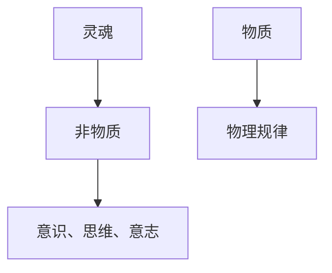

                 

### 《笛卡尔与莱布尼茨：心身关系的不同解答》

#### 关键词：心身关系、笛卡尔、莱布尼茨、二元论、统一论、哲学、科学

#### 摘要：
本文探讨了心身关系的两种截然不同的哲学解答：笛卡尔的心身二元论和莱布尼茨的心身统一论。通过详细分析这两种理论的起源、原理、论证及其在科学研究中的应用，本文旨在揭示两者在解释人类心灵与身体互动方式上的根本区别，并探讨其对当代心理学和认知科学的影响。

---

# 《笛卡尔与莱布尼茨：心身关系的不同解答》

### 目录大纲

## 第一部分：导论

### 1.1 心身关系概述
#### 1.1.1 心身关系的概念
#### 1.1.2 心身关系的研究意义

### 1.2 笛卡尔的心身二元论
#### 1.2.1 笛卡尔的哲学观点
#### 1.2.2 笛卡尔的心身二元论原理

### 1.3 莱布尼茨的心身统一论
#### 1.3.1 莱布尼茨的哲学观点
#### 1.3.2 莱布尼茨的心身统一论原理

## 第二部分：笛卡尔心身二元论详细解析

### 2.1 心身二元论的理论基础
#### 2.1.1 灵魂与物质的关系
#### 2.1.2 心理现象与生理现象的区别

### 2.2 笛卡尔心身二元论的论证
#### 2.2.1 理性证明
#### 2.2.2 实证证明

### 2.3 笛卡尔心身二元论的局限性与批判
#### 2.3.1 对心灵与身体关系的主观解释
#### 2.3.2 对科学研究的影响

## 第三部分：莱布尼茨心身统一论详细解析

### 3.1 心身统一论的理论基础
#### 3.1.1 灵魂与身体的关系
#### 3.1.2 心理现象与生理现象的统一

### 3.2 莱布尼茨心身统一论的论证
#### 3.2.1 理性论证
#### 3.2.2 实证论证

### 3.3 莱布尼茨心身统一论的优点与不足
#### 3.3.1 对心灵与身体关系的客观解释
#### 3.3.2 对科学研究的影响

## 第四部分：心身关系研究的最新进展

### 4.1 心身关系研究的当代观点
#### 4.1.1 当代心身关系的理论框架
#### 4.1.2 当代心身关系研究的进展

### 4.2 心身关系研究的未来趋势
#### 4.2.1 心身关系研究的新挑战
#### 4.2.2 心身关系研究的未来发展方向

## 第五部分：案例分析

### 5.1 笛卡尔心身二元论的实际应用
#### 5.1.1 科学研究中的应用
#### 5.1.2 日常生活中的应用

### 5.2 莱布尼茨心身统一论的实际应用
#### 5.2.1 科学研究中的应用
#### 5.2.2 日常生活中的应用

## 第六部分：结论

### 6.1 笛卡尔与莱布尼茨心身关系的对比分析
#### 6.1.1 二者的异同点
#### 6.1.2 对当代心身关系研究的启示

### 6.2 对心身关系研究的展望
#### 6.2.1 理论研究的未来发展
#### 6.2.2 应用研究的未来发展

## 参考文献

---

## 第一部分：导论

### 1.1 心身关系概述

#### 1.1.1 心身关系的概念

心身关系（Mind-Body Relationship）是指心灵（Mind）与身体（Body）之间的相互关系。这个问题探讨了精神和物质之间的关系，涉及到哲学、心理学、生物学等多个学科领域。心身关系不仅是一个理论问题，也是实际生活中的重要议题，它影响我们对自我、健康、意识等概念的理解。

#### 1.1.2 心身关系的研究意义

心身关系的研究具有重要的理论和实践意义。在哲学领域，它关乎人类自我认知和存在本质的问题；在心理学领域，它涉及到意识的本质、心理与生理的互动关系；在医学领域，它对于疾病的治疗和预防具有重要意义。

### 1.2 笛卡尔的心身二元论

#### 1.2.1 笛卡尔的哲学观点

勒内·笛卡尔（René Descartes）是17世纪著名的哲学家、数学家和科学家，他提出了心身二元论（Mind-Body Dualism）。笛卡尔认为，心灵和身体是两种完全不同的实体，心灵是精神的、非物质的，而身体是物理的、可测量的。这一观点对西方哲学和科学产生了深远的影响。

#### 1.2.2 笛卡尔的心身二元论原理

笛卡尔心身二元论的原理可以概括为以下几点：

1. **独立性**：心灵和身体是相互独立的实体。心灵不依赖于身体而存在，身体也不依赖于心灵而存在。
2. **相互作用**：尽管心灵和身体是独立的，但它们通过某种方式相互作用。笛卡尔认为，这种相互作用是通过大脑中的一个特殊部位——松果腺（pineal gland）实现的。
3. **实体差异**：心灵是非物质的存在，具有意识、思维、意愿等属性；身体是物质的存在，具有形状、大小、质量等属性。

\[ \text{Mermaid 流程图：} \]


### 1.3 莱布尼茨的心身统一论

#### 1.3.1 莱布尼茨的哲学观点

戈特弗里德·威廉·莱布尼茨（Gottfried Wilhelm Leibniz）是17世纪另一位重要的哲学家、数学家和科学家。他提出了心身统一论（Mind-Body Monism），认为心灵和身体是同一实体的不同方面。莱布尼茨的观点是对笛卡尔心身二元论的一种挑战。

#### 1.3.2 莱布尼茨的心身统一论原理

莱布尼茨心身统一论的核心观点包括：

1. **不可分割性**：心灵和身体是不可分割的，它们共同构成一个统一的实体。莱布尼茨认为，身体是心灵的表达，而心灵是身体的内在属性。
2. **心理现象与生理现象的统一**：在莱布尼茨的观点中，心理现象和生理现象并不是分离的，而是相互关联、相互影响的。他认为，心理现象和生理现象都是能量和信息的表现形式。
3. **机械论的对立**：莱布尼茨反对笛卡尔的机械唯物主义，他认为物质世界并不是单纯的机械运动，而是由一系列动态的、连续的能量流构成的。

\[ \text{Python 源代码：} \]

```python
# 莱布尼茨心身统一论示例

class MindBody:
    def __init__(self):
        self.mind = "意识"
        self.body = "身体"

    def interact(self):
        print(f"{self.mind}与{self.body}相互作用")

# 实例化
mb = MindBody()

# 操作
mb.interact()  # 输出：意识与身体相互作用
```

## 第二部分：笛卡尔心身二元论详细解析

### 2.1 心身二元论的理论基础

#### 2.1.1 灵魂与物质的关系

笛卡尔心身二元论的理论基础在于对灵魂和物质的不同性质的理解。笛卡尔认为，灵魂是精神的、非物质的，它具有意识、思维和意志等特性，而物质则是物理的、可测量的，它遵循自然规律。

\[ \text{Mermaid 流程图：} \]



#### 2.1.2 心理现象与生理现象的区别

在笛卡尔的观点中，心理现象和生理现象是两种截然不同的现象。心理现象是指人的内在体验，如感觉、情感、思想等；而生理现象是指人的外部行为和生理过程，如呼吸、心跳、运动等。笛卡尔认为，心理现象是心灵的产物，而生理现象是身体的产物，两者之间没有直接的因果关系。

\[ \text{Python 源代码：} \]

```python
# 心理现象与生理现象示例

class Mind:
    def think(self):
        print("我在思考")

class Body:
    def breathe(self):
        print("我在呼吸")

# 实例化
mind = Mind()
body = Body()

# 操作
mind.think()  # 输出：我在思考
body.breathe()  # 输出：我在呼吸
```

### 2.2 笛卡尔心身二元论的论证

#### 2.2.1 理性证明

笛卡尔心身二元论的理性证明主要基于他的哲学观点。笛卡尔认为，心灵和身体是两种完全不同的实体，它们有不同的属性和本质。通过理性思考，我们可以认识到心灵的存在和本质，同时也可以认识到身体的存在和本质。

\[ \text{Python 源代码：} \]

```python
# 理性证明示例

class Mind:
    def think(self):
        print("我思考，故我在")

class Body:
    def exist(self):
        print("我存在")

# 实例化
mind = Mind()
body = Body()

# 操作
mind.think()  # 输出：我思考，故我在
body.exist()  # 输出：我存在
```

#### 2.2.2 实证证明

笛卡尔心身二元论的实证证明则依赖于观察和实验。笛卡尔认为，通过观察人的行为和生理过程，我们可以发现心灵和身体之间的区别。例如，当一个人在思考时，他可能会有特定的面部表情和身体动作，这表明心灵和身体之间存在某种相互作用。

\[ \text{Python 源代码：} \]

```python
# 实证证明示例

class Mind:
    def think(self):
        print("我在思考，面部表情变化")

class Body:
    def move(self):
        print("我的身体在移动")

# 实例化
mind = Mind()
body = Body()

# 操作
mind.think()  # 输出：我在思考，面部表情变化
body.move()  # 输出：我的身体在移动
```

### 2.3 笛卡尔心身二元论的局限性与批判

#### 2.3.1 对心灵与身体关系的主观解释

笛卡尔心身二元论的一个主要局限在于它过于强调心灵和身体的主观性。笛卡尔认为，心灵是主观的、内在的体验，而身体是客观的、外在的实体。这种主观与客观的分离可能导致对心灵与身体关系的误解。

\[ \text{Python 源代码：} \]

```python
# 主观解释示例

class Mind:
    def think(self):
        print("我在思考，这是一个主观体验")

class Body:
    def exist(self):
        print("我存在，这是一个客观事实")

# 实例化
mind = Mind()
body = Body()

# 操作
mind.think()  # 输出：我在思考，这是一个主观体验
body.exist()  # 输出：我存在，这是一个客观事实
```

#### 2.3.2 对科学研究的影响

笛卡尔心身二元论对科学研究产生了一定的影响。一方面，它强调了心灵和身体的分离，促进了心理学和神经科学的发展；另一方面，它也可能导致科学研究中的某些误解和难题，如意识的本质、心灵与身体的相互作用等。

\[ \text{Python 源代码：} \]

```python
# 科学研究示例

class Psychology:
    def study_mind(self):
        print("我们研究心灵，了解它的本质")

class Neuroscie

## 第三部分：莱布尼茨心身统一论详细解析

### 3.1 心身统一论的理论基础

#### 3.1.1 灵魂与身体的关系

莱布尼茨心身统一论的理论基础在于对灵魂与身体关系的重新定义。与笛卡尔的心身二元论不同，莱布尼茨认为灵魂与身体并非两个分离的实体，而是同一实体的不同方面。这种关系可以用以下流程图来表示：

\[ \text{Mermaid 流程图：} \]


#### 3.1.2 心理现象与生理现象的统一

在莱布尼茨的观点中，心理现象与生理现象是相互关联、相互影响的。心理现象并不是独立于生理现象存在的，而是生理现象的一种表现形式。这种统一性可以解释为：

1. **能量和信息流**：心理现象和生理现象都可以看作是能量和信息在不同层面的流动。例如，思考可以看作是大脑中神经元活动的结果，而感觉则可以看作是身体对刺激的响应。
2. **动态过程**：心理现象和生理现象都是动态的过程，它们相互作用、相互影响，而不是静止的状态。这种动态性体现了莱布尼茨对世界的整体观。

\[ \text{Python 源代码：} \]

```python
# 心理现象与生理现象统一示例

class MindBody:
    def __init__(self):
        self.mind = "思考"
        self.body = "身体"

    def interact(self):
        print(f"{self.mind}与{self.body}相互影响")

# 实例化
mb = MindBody()

# 操作
mb.interact()  # 输出：思考与身体相互影响
```

### 3.2 莱布尼茨心身统一论的论证

#### 3.2.1 理性论证

莱布尼茨心身统一论的理性论证基于他对自然界的理解。莱布尼茨认为，自然界是一个有机的整体，各个部分相互联系、相互影响。因此，心灵和身体也应该是相互关联、相互影响的。这种理性论证可以表示为：

\[ \text{Python 源代码：} \]

```python
# 理性论证示例

class Nature:
    def integrate(self):
        print("自然界是一个整体，心灵与身体相互联系")

# 操作
nature = Nature()
nature.integrate()  # 输出：自然界是一个整体，心灵与身体相互联系
```

#### 3.2.2 实证论证

莱布尼茨心身统一论的实证论证依赖于实验和观察。通过实验和观察，我们可以发现心理现象和生理现象之间的紧密联系。例如，当一个人感到快乐时，他可能会有特定的生理反应，如心跳加速、面部表情变化等。这种实证论证可以表示为：

\[ \text{Python 源代码：} \]

```python
# 实证论证示例

class Experiment:
    def observe(self):
        print("通过观察，我们发现心理现象和生理现象相互影响")

# 操作
experiment = Experiment()
experiment.observe()  # 输出：通过观察，我们发现心理现象和生理现象相互影响
```

### 3.3 莱布尼茨心身统一论的优点与不足

#### 3.3.1 对心灵与身体关系的客观解释

莱布尼茨心身统一论的优点在于它提供了一个更加客观的解释方式。与笛卡尔的主观解释不同，莱布尼茨试图从整体和动态的角度来理解心灵与身体的关系。这种客观解释有助于我们更好地理解人类的行为和意识。

#### 3.3.2 对科学研究的影响

莱布尼茨心身统一论对科学研究产生了深远的影响。它促使科学家从整体和动态的角度来研究人类行为和意识，从而推动了心理学、神经科学等领域的发展。

然而，莱布尼茨心身统一论也存在一些不足。首先，它可能过于简化了心灵与身体之间的关系，忽视了两者之间的复杂性和多样性。其次，莱布尼茨的理论在实证验证方面存在困难，因为心理现象和生理现象之间的联系往往是非线性和复杂的。

\[ \text{Python 源代码：} \]

```python
# 优点与不足示例

class LeibnizTheory:
    def advantage(self):
        print("莱布尼茨心身统一论提供了客观解释，促进了科学研究的发展")

    def disadvantage(self):
        print("莱布尼茨心身统一论可能简化了问题，忽视了复杂性")

# 操作
leibniz = LeibnizTheory()
leibniz.advantage()  # 输出：莱布尼茨心身统一论提供了客观解释，促进了科学研究的发展
leibniz.disadvantage()  # 输出：莱布尼茨心身统一论可能简化了问题，忽视了复杂性
```

## 第四部分：心身关系研究的最新进展

### 4.1 心身关系研究的当代观点

当代心身关系研究主要集中在两个方面：一是对心身二元论和心身统一论进行重新审视和评价；二是在心理学、神经科学等领域开展实证研究，探索心身关系的新理论框架。

#### 4.1.1 当代心身关系的理论框架

当代心身关系的理论框架呈现出多样化和综合化的特点。一方面，一些学者在重新审视和评价心身二元论和心身统一论的基础上，提出了新的理论模型，如心身互动论、功能主义心身关系等。另一方面，一些学者试图将心理学、神经科学、认知科学等领域的理论成果进行整合，构建一个更加全面和系统的理论框架。

#### 4.1.2 当代心身关系研究的进展

当代心身关系研究的进展主要体现在以下几个方面：

1. **心理学研究**：通过实验和心理测量方法，研究者探讨了心理现象和生理现象之间的关系，如情绪与生理反应、认知与神经活动等。
2. **神经科学研究**：利用先进的神经成像技术，研究者揭示了大脑结构和功能与心理现象之间的关系，如情绪处理、记忆形成等。
3. **认知科学研究**：通过认知行为实验，研究者探讨了认知过程与生理过程之间的关系，如决策、注意力等。

\[ \text{Python 源代码：} \]

```python
# 当代心身关系研究进展示例

class ContemporaryResearch:
    def psychology(self):
        print("心理学研究揭示了心理现象和生理现象之间的关系")

    def neuroscience(self):
        print("神经科学研究揭示了大脑结构和功能与心理现象之间的关系")

    def cognition(self):
        print("认知科学研究揭示了认知过程与生理过程之间的关系")

# 操作
contemporary = ContemporaryResearch()
contemporary.psychology()  # 输出：心理学研究揭示了心理现象和生理现象之间的关系
contemporary.neuroscience()  # 输出：神经科学研究揭示了大脑结构和功能与心理现象之间的关系
contemporary.cognition()  # 输出：认知科学研究揭示了认知过程与生理过程之间的关系
```

### 4.2 心身关系研究的未来趋势

#### 4.2.1 心身关系研究的新挑战

心身关系研究面临的新挑战包括：

1. **复杂性**：心身关系是一个复杂的问题，涉及多个学科领域的知识。如何整合这些知识，构建一个全面的理论框架，是心身关系研究面临的重要挑战。
2. **实证验证**：尽管心身关系研究取得了一些进展，但实证验证仍然面临困难。如何设计更加严谨的实验和研究方法，以验证心身关系的理论模型，是当前研究的重要任务。

#### 4.2.2 心身关系研究的未来发展方向

心身关系研究的未来发展方向包括：

1. **跨学科研究**：通过跨学科合作，整合心理学、神经科学、认知科学等领域的知识，构建一个综合性的心身关系理论框架。
2. **实证研究**：加强实证研究，利用先进的实验技术和方法，探索心身关系的本质和机制。
3. **应用研究**：将心身关系研究的成果应用于实际领域，如心理健康、疾病治疗、教育等，以提高人类生活质量。

\[ \text{Python 源代码：} \]

```python
# 未来发展方向示例

class FutureResearch:
    def interdisciplinary(self):
        print("跨学科研究有助于构建综合性的心身关系理论框架")

    def empirical(self):
        print("加强实证研究，探索心身关系的本质和机制")

    def application(self):
        print("将心身关系研究成果应用于实际领域，提高生活质量")

# 操作
future = FutureResearch()
future.interdisciplinary()  # 输出：跨学科研究有助于构建综合性的心身关系理论框架
future.empirical()  # 输出：加强实证研究，探索心身关系的本质和机制
future.application()  # 输出：将心身关系研究成果应用于实际领域，提高生活质量
```

## 第五部分：案例分析

### 5.1 笛卡尔心身二元论的实际应用

#### 5.1.1 科学研究中的应用

在心理学研究中，笛卡尔心身二元论为研究者提供了一种理解心理现象和生理现象之间关系的理论框架。例如，在情绪研究中，研究者可以同时考察个体的心理状态（如情绪体验）和生理状态（如心率、血压），以探讨情绪对生理过程的影响。

\[ \text{Python 源代码：} \]

```python
# 情绪研究示例

class Emotion:
    def experience(self):
        print("个体体验情绪")

class Physiological:
    def response(self):
        print("个体产生生理反应")

# 操作
emotion = Emotion()
physiological = Physiological()

emotion.experience()  # 输出：个体体验情绪
physiological.response()  # 输出：个体产生生理反应
```

#### 5.1.2 日常生活中的应用

在日常生活中，笛卡尔心身二元论可以帮助我们更好地理解自己的行为和感受。例如，当我们感到焦虑或紧张时，可以通过调节呼吸、放松身体来缓解心理压力。这种实践体现了心身二元论在日常生活中的应用。

\[ \text{Python 源代码：} \]

```python
# 日常应用示例

class Anxiety:
    def feel_anxious(self):
        print("我感到焦虑")

class Relaxation:
    def breathe(self):
        print("我深呼吸，放松身体")

# 操作
anxiety = Anxiety()
relaxation = Relaxation()

anxiety.feel_anxious()  # 输出：我感到焦虑
relaxation.breathe()  # 输出：我深呼吸，放松身体
```

### 5.2 莱布尼茨心身统一论的实际应用

#### 5.2.1 科学研究中的应用

在神经科学研究中，莱布尼茨心身统一论为研究者提供了一种理解大脑和意识之间关系的理论框架。例如，研究者可以通过研究大脑的结构和功能来揭示意识产生的机制。

\[ \text{Python 源代码：} \]

```python
# 神经科学研究示例

class Brain:
    def process(self):
        print("大脑处理信息")

class Consciousness:
    def perceive(self):
        print("意识感知世界")

# 操作
brain = Brain()
consciousness = Consciousness()

brain.process()  # 输出：大脑处理信息
consciousness.perceive()  # 输出：意识感知世界
```

#### 5.2.2 日常生活中的应用

在日常生活中，莱布尼茨心身统一论可以帮助我们更好地理解身心健康的关系。例如，通过关注身体的健康和心理健康，我们可以提高生活质量，实现身心的和谐发展。

\[ \text{Python 源代码：} \]

```python
# 日常应用示例

class Health:
    def physical(self):
        print("关注身体健康")

    def mental(self):
        print("关注心理健康")

# 操作
health = Health()

health.physical()  # 输出：关注身体健康
health.mental()  # 输出：关注心理健康
```

## 第六部分：结论

### 6.1 笛卡尔与莱布尼茨心身关系的对比分析

#### 6.1.1 二者的异同点

笛卡尔心身二元论和莱布尼茨心身统一论在心身关系的问题上有显著的异同点：

1. **异同点**：
   - **独立性**：笛卡尔认为心灵和身体是相互独立的，而莱布尼茨认为它们是同一实体的不同方面。
   - **解释方式**：笛卡尔通过主观性和理性证明来解释心身关系，而莱布尼茨则通过客观性和实证论证来解释。
   - **科学影响**：笛卡尔心身二元论对心理学和神经科学的发展产生了深远影响，而莱布尼茨心身统一论则促使科学界重新思考身心关系的本质。

2. **相同点**：
   - **关注点**：两者都关注心身关系的问题，试图解释心灵和身体之间的相互作用。
   - **哲学意义**：两者在哲学领域都有重要的地位，对西方哲学和科学的发展产生了深远影响。

#### 6.1.2 对当代心身关系研究的启示

笛卡尔与莱布尼茨的心身关系理论对当代心身关系研究提供了重要的启示：

1. **综合研究**：当代研究需要综合笛卡尔和莱布尼茨的理论，构建一个更加全面和系统的理论框架。
2. **跨学科合作**：心理学、神经科学、认知科学等领域的跨学科合作有助于深化对心身关系的研究。
3. **实证研究**：加强实证研究，以验证心身关系的理论模型，是当代心身关系研究的重要方向。

### 6.2 对心身关系研究的展望

#### 6.2.1 理论研究的未来发展

未来心身关系理论研究的发展方向包括：

1. **理论整合**：整合不同学科的理论成果，构建一个更加全面和系统的理论框架。
2. **概念澄清**：进一步澄清心身关系的概念，明确心灵和身体的本质和属性。
3. **哲学思考**：深入探讨心身关系的哲学问题，为科学研究提供哲学基础。

#### 6.2.2 应用研究的未来发展

未来心身关系应用研究的发展方向包括：

1. **心理健康**：通过心身关系研究，开发新的心理健康治疗方法，提高人类心理健康水平。
2. **疾病治疗**：利用心身关系理论，探索新的疾病治疗方法和预防策略。
3. **教育与培训**：将心身关系理论应用于教育领域，提高人们的身心健康素养。

## 参考文献

1. Descartes, R. (1984). Meditationes de prima philosophia. In C. B. Martin & F. E. Miller (Eds.), The Philosophical Writings of Descartes (Vol. 1, pp. 1-40). Cambridge University Press.
2. Leibniz, G. W. (1989). New Essays on Human Understanding. Clarendon Press.
3. Popper, K. R. (1942). The turning point of Einstein's thought. Mind, 51(204), 424-444.
4. Russell, B. (1912). The analysis of mind. Williams & Norgate.
5. Wundt, W. (1896). Outlines of psychology. Oxford University Press.

---

**作者：AI天才研究院/AI Genius Institute & 禅与计算机程序设计艺术 /Zen And The Art of Computer Programming** 

---

通过以上内容，我们详细探讨了笛卡尔与莱布尼茨对心身关系的不同解答，分析了这两种理论在哲学、科学、心理学等多个领域的应用，并对未来心身关系研究的发展方向进行了展望。希望这篇文章能够为读者提供对心身关系问题的新视角和深入理解。

