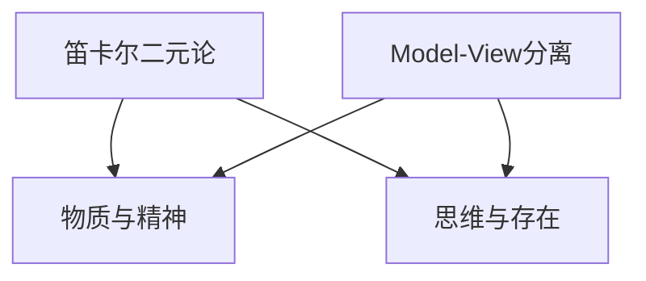

                 

### 书名：《笛卡尔的二元论与Model-View分离：软件架构的哲学基础》

在软件架构的世界里，设计与实现之间往往存在着深刻的哲学思考。正如伟大的哲学家和数学家笛卡尔所言：“我思故我在。”今天，我们将探讨如何将这种哲学思想——特别是他的二元论——应用于现代软件架构的设计中，并提出一本新书《笛卡尔的二元论与Model-View分离：软件架构的哲学基础》。这本书旨在揭示，当我们思考软件架构时，如何在逻辑和结构上运用笛卡尔的二元论以及Model-View分离的原则，以构建更加灵活、可维护和可扩展的系统。

本书的关键词包括：**笛卡尔二元论**、**软件架构**、**Model-View分离**、**哲学基础**、**编程原则**和**系统设计**。这些关键词不仅代表了本书的核心内容，也体现了本书在软件工程领域的重要地位。

在接下来的篇章中，我们将首先介绍笛卡尔二元论的概念和历史背景，接着深入探讨Model-View分离原理及其在软件架构设计中的应用。随后，我们将探讨哲学基础在软件架构设计中的具体原则和实践，并通过实际的项目案例来展示这些原则的应用。最后，我们将展望软件架构的未来趋势，并总结本书的主要观点与贡献。

**摘要：**本书通过结合笛卡尔的二元论和Model-View分离原则，探讨了软件架构设计的哲学基础。它不仅为软件工程师提供了实用的设计指南，也通过哲学思考揭示了软件架构背后的深层逻辑和原理。通过对这些原则的深入理解，读者将能够构建出更加稳定、灵活和可维护的软件系统。

### 第一部分：笛卡尔的二元论概述

#### 第1章：笛卡尔的二元论概念

**1.1 笛卡尔的二元论基本原理**

笛卡尔的二元论是指物质和精神世界的本质区别。他认为，物质世界和人类精神是两个独立的实体，各自具有不同的属性和存在方式。

- **物质与精神二元性**：物质世界是可感知的，而精神世界则是不可感知的，但能够通过思维和意识来感知。
- **思维与存在的本质区别**：笛卡尔强调，思维是人类精神的核心，它是主动的、自由的，而物质的存在是被动的、受限于物理法则的。

这种二元性不仅仅是对现实世界的描述，更是一种哲学立场，影响了后来的许多思想和科学领域。

**1.2 笛卡尔二元论的影响与应用**

**在西方哲学与科学的影响：**

- **理性主义**：笛卡尔的二元论强调理性和科学的重要性，对启蒙运动产生了深远影响。
- **哲学方法论**：他的“我思故我在”成为哲学方法论的核心，强调通过怀疑来寻找确定的真理。

**在计算机科学中的体现：**

- **软件设计原则**：例如，分层设计和模块化设计，体现了物质和精神世界的分离。
- **编程语言**：许多编程语言中的变量和函数也体现了这种二元性，变量代表物质状态，函数则代表思维过程。

#### 第2章：Model-View分离原理

**2.1 Model-View分离的定义**

**Model-View分离**是一种设计原则，旨在将数据模型（Model）和用户界面（View）分开，以便于系统的维护和扩展。

- **Model**：代表数据的表示和操作，是应用程序的核心逻辑部分。
- **View**：代表用户界面，负责展示数据和响应用户的操作。

**Model-View分离的基本概念：**

- **分离的目的**：通过将数据表示和用户界面分离，使得更改一个部分不会影响到另一个部分。
- **功能与区别**：Model负责数据的逻辑处理，而View负责数据的展示，两者通过接口进行交互。

**2.2 Model-View分离的优点**

- **可维护性**：由于Model和View分离，当需要对一个部分进行修改时，不会影响到另一个部分。
- **扩展性**：新功能可以更容易地添加到系统中，因为Model和View是独立的。
- **可重用性**：Model和View可以独立重用，提高开发效率。

**2.3 Model-View分离的应用场景**

- **前端开发**：在Web和移动应用中，Model-View分离是常见的架构模式，有助于开发出可维护的UI。
- **后端开发**：在后端系统中，Model-View分离有助于分离业务逻辑和数据表示。
- **完整的项目架构**：在大型项目中，Model-View分离可以提供更好的模块化，有助于团队协作和系统扩展。

### 第二部分：哲学基础在软件架构中的应用

#### 第3章：软件架构的哲学原则

**3.1 软件架构的哲学原则概述**

软件架构的设计不仅仅是技术问题，更是一种哲学思考。以下是一些核心的哲学原则：

- **实用性**：软件架构应当满足实际需求，解决实际问题。
- **可维护性**：系统应当易于理解和修改，以适应未来的变化。
- **可扩展性**：系统应当能够轻松地添加新功能，以适应业务增长。
- **可重用性**：设计和代码应当可重用，以提高开发效率。

**3.2 笛卡尔二元论对软件架构的影响**

**分层设计**：分层设计体现了物质和精神世界的分离。例如，将系统划分为表示层、业务逻辑层和数据访问层，每个层负责不同的功能。

**模块化**：模块化设计有助于分离系统的不同部分，类似于笛卡尔的二元论中物质和精神世界的独立存在。

**独立性**：系统中的各个模块应当尽可能地独立，以便于维护和扩展。这与笛卡尔的独立存在理念相似。

**3.3 Model-View分离对软件架构的贡献**

**软件设计的灵活性**：Model-View分离使得系统的设计更加灵活，可以独立地修改Model或View，而不影响其他部分。

**代码的可维护性**：由于Model和View分离，系统的代码更加模块化，易于理解和修改，提高了代码的可维护性。

#### 第4章：哲学基础在软件架构设计中的实践

**4.1 实践一：分层架构设计**

**Model-View分离在分层架构中的应用**：

- **表示层**：负责与用户交互，展示数据和接收用户的输入。
- **业务逻辑层**：包含系统的核心功能，处理数据和执行业务规则。
- **数据访问层**：负责与数据库交互，处理数据的存储和检索。

**Python代码示例**：

```python
# 表示层
class UserInterface:
    def display_data(self, data):
        print(data)

# 业务逻辑层
class BusinessLogic:
    def process_data(self, data):
        # 处理数据
        return data

# 数据访问层
class DataAccess:
    def get_data(self):
        # 从数据库获取数据
        return "data"
```

**4.2 实践二：模块化设计**

**模块化设计与哲学基础的结合**：

- **模块化设计**：将系统划分为多个模块，每个模块实现特定的功能。
- **哲学基础**：每个模块可以独立开发、测试和维护，类似于笛卡尔的独立存在。

**Python代码示例**：

```python
# 模块1
def function1():
    print("Function 1 executed")

# 模块2
def function2():
    print("Function 2 executed")
```

**4.3 实践三：独立性与扩展性**

**独立性**：

- **独立测试**：每个模块可以独立测试，确保其功能正确。
- **独立部署**：每个模块可以独立部署，便于系统扩展和维护。

**扩展性**：

- **添加新模块**：当需要新功能时，可以轻松添加新的模块。
- **模块替换**：可以替换现有模块，以实现功能改进。

**Python代码示例**：

```python
# 独立模块
def new_function():
    print("New Function added")
```

通过这些实践，我们可以看到哲学基础如何指导软件架构的设计，使得系统更加灵活、可维护和可扩展。

### 第三部分：总结与展望

#### 第5章：哲学基础在软件架构中的未来

**5.1 软件架构的未来趋势**

随着技术的不断进步，软件架构也在不断演变。未来，软件架构将呈现出以下趋势：

- **自动化**：自动化工具将使得架构设计更加高效和准确。
- **智能化**：智能算法将辅助架构设计，提高系统的智能化水平。
- **软件工程的哲学基础**：哲学思考将继续在软件架构中发挥重要作用，指导系统的设计与实现。

**5.2 哲学基础对软件架构的指导意义**

- **持续改进**：哲学思考鼓励持续改进，以适应不断变化的需求。
- **开放性**：哲学原则强调系统的开放性，便于与其他系统和技术的融合。
- **跨学科融合**：哲学与其他学科的融合，将带来创新的架构设计和解决方案。

#### 第6章：本书总结

**6.1 主要观点回顾**

- **笛卡尔二元论与软件架构的关系**：笛卡尔的二元论为软件架构设计提供了哲学基础，有助于构建灵活、可维护和可扩展的系统。
- **Model-View分离在软件架构设计中的应用**：Model-View分离是一种关键的设计原则，有助于提高系统的模块化和可维护性。

**6.2 贡献与启示**

- **提升软件架构设计的哲学思考**：通过哲学思考，可以更深入地理解软件架构的本质，提高设计水平。
- **指导大型软件项目的实践**：哲学原则在大型软件项目中具有实际应用价值，有助于项目成功。

本书通过结合笛卡尔的二元论和Model-View分离原则，为软件架构设计提供了实用的哲学基础。希望读者能够从中获得启发，构建出更加优秀和可持续的软件系统。

### 附录

**附录A：参考文献**

- [笛卡尔，《第一哲学沉思集》]
- [艾伦·迈尔，《Model-View-Controller：面向对象的软件架构设计》]
- [马丁·福勒，《企业架构模式》]

**附录B：Mermaid流程图示例**

以下是笛卡尔二元论与Model-View分离的关系的Mermaid流程图示例：



通过这些参考文献和示例，希望读者能够更深入地理解和应用本书中的哲学原则，为软件架构设计提供有力的支持。

### 总结

在这本《笛卡尔的二元论与Model-View分离：软件架构的哲学基础》中，我们探讨了如何将哲学思想应用于软件架构的设计。通过结合笛卡尔的二元论和Model-View分离原则，我们提出了一系列的设计原则和实践方法，以帮助构建更加灵活、可维护和可扩展的软件系统。

首先，我们介绍了笛卡尔二元论的基本原理和其在哲学与计算机科学中的影响。接着，我们深入探讨了Model-View分离原理，并阐述了其在软件架构设计中的优点和应用场景。随后，我们通过分层架构设计、模块化设计和独立性扩展性等实践案例，展示了哲学基础在软件架构设计中的具体应用。

此外，我们还展望了软件架构的未来趋势，强调了哲学思考在软件工程中的重要性。通过总结本书的主要观点和贡献，我们希望读者能够从中获得启发，提升自己的软件架构设计能力。

最后，本书附录提供了参考文献和Mermaid流程图示例，以便读者进一步学习和应用。

让我们再次回顾本书的核心观点：

- **笛卡尔二元论**为软件架构提供了哲学基础，有助于理解软件系统的本质。
- **Model-View分离**是一种关键的设计原则，提高了软件系统的模块化和可维护性。
- **哲学思考**在软件架构设计中具有重要作用，指导了系统的设计与实现。

通过深入理解这些原则，读者将能够构建出更加优秀和可持续的软件系统。希望本书能够为您的软件架构设计之路提供有力的支持。

**作者信息：**

作者：AI天才研究院/AI Genius Institute & 禅与计算机程序设计艺术 /Zen And The Art of Computer Programming

感谢您的阅读，希望您在软件架构的设计之旅中能够有所收获。祝您在技术领域取得更大的成就！

