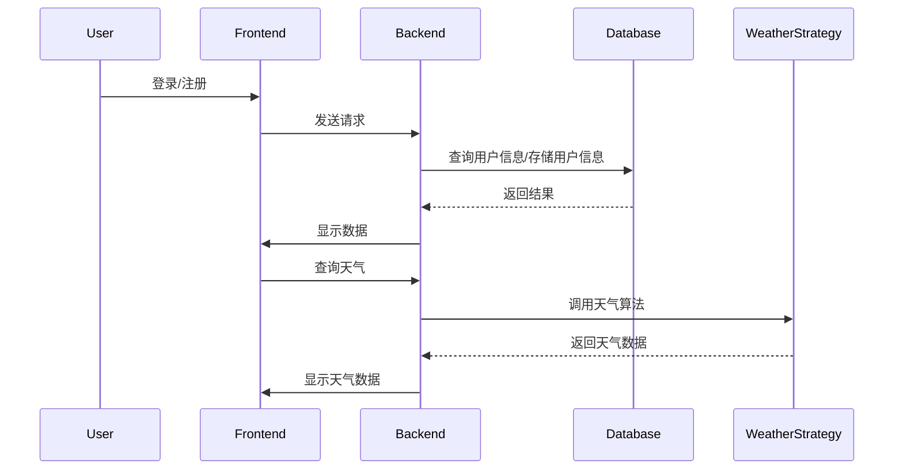
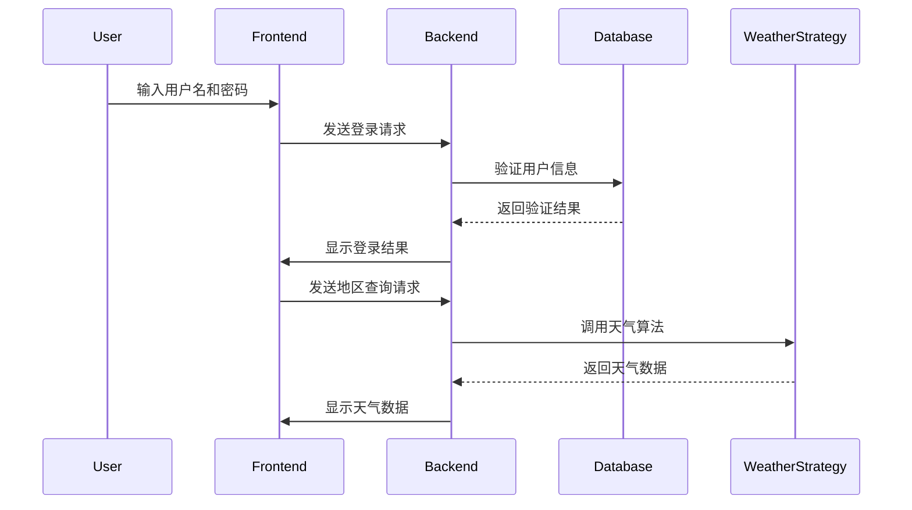

                 

## 第1章：策略模式概述

### 1.1 什么是策略模式

策略模式（Strategy Pattern）是一种设计模式，它定义了算法家族，分别封装起来，让它们之间可以互相替换，此模式让算法的变化不会影响到使用算法的用户。策略模式是一种对象行为型模式，主要目的是封装一系列算法，将不变的部分与易变的部分分离，使算法的使用与算法的实现分离，从而实现算法的灵活选择和替换。

策略模式的核心概念包括以下几个方面：

**策略（Strategy）**：这是一个抽象接口或抽象类，它声明了用于解决特定问题的算法或行为。它定义了一个公共接口，用于各种具体的算法实现。

**具体策略（ConcreteStrategy）**：这是策略接口的具体实现，它实现了策略接口所声明的算法。具体策略可以是实现类，每个实现类封装了一个具体的算法。

**环境（Context）**：环境角色使用策略接口，定义了一个设置和删除策略的接口，并维持一个对策略对象的引用。环境角色通常会通过策略接口来调用策略对象的方法。

### 问题背景与问题描述

在软件开发中，我们经常遇到以下问题：

- **算法的选择和切换**：在某些应用场景中，我们需要根据不同的条件或需求选择不同的算法。例如，排序算法的选择可能会根据数据大小和类型而变化。
- **代码的灵活性和扩展性**：随着需求的不断变化，我们需要能够灵活地添加或替换算法，而不影响现有系统的其他部分。
- **模块化和解耦**：为了保持代码的模块化和解耦，我们希望将算法的实现与使用算法的代码分开。

这些问题提示我们需要一种机制来封装和灵活地选择算法，而不影响使用算法的其他部分。这正是策略模式所要解决的问题。

### 问题解决

策略模式通过将算法的封装和替换分离，提供了一种灵活且易于扩展的解决方案。具体来说，策略模式有以下优点：

- **算法的封装**：策略模式将算法封装在独立的类中，使得算法的实现与使用算法的代码分离。
- **算法的替换**：通过环境角色使用策略接口，可以在运行时动态地替换具体的策略实现，实现算法的灵活选择。
- **代码的扩展性**：策略模式使得算法的扩展更加方便，新的算法只需实现策略接口即可，无需修改现有的代码。

### 边界与外延

策略模式的边界包括：

- **算法的选择和替换**：策略模式主要用于解决算法的选择和替换问题，而不是其他类型的问题，如数据结构的选择。
- **运行时确定**：策略模式通常在运行时确定使用哪个具体的策略实现，而不是在编译时确定。

策略模式的外延包括：

- **多态性**：策略模式利用多态性来实现算法的动态绑定，使得环境角色可以不关心具体的策略实现。
- **组合与继承**：策略模式可以通过组合和继承来扩展和复用算法。

### 概念结构与核心要素组成

策略模式的结构如下：


- **策略接口（Strategy Interface）**：定义了所有支持的算法的公共接口。
- **具体策略（ConcreteStrategy）**：实现了策略接口，定义了具体的算法。
- **环境角色（Context）**：使用某个具体策略的对象。

### 总结

策略模式是一种用于封装算法家族并使它们可以相互替换的设计模式。通过策略模式，我们可以实现算法的选择和替换，同时保持代码的模块化和灵活性。策略模式的核心角色包括策略接口、具体策略和环境角色，它们之间通过多态性和解耦关系实现了算法的灵活选择和扩展。

## 第2章：策略模式的基本概念

### 2.1 策略接口

策略接口是策略模式中的核心组成部分，它定义了所有支持的算法的公共接口。这个接口通常是一个抽象类或接口，其中声明了用于解决特定问题的算法或行为。策略接口为具体策略提供了统一的方法签名，使得环境角色可以在运行时无需关心具体策略的实现细节。

#### 策略接口的定义

以支付系统为例，我们可以定义一个支付策略接口，如下所示：

```java
public interface PaymentStrategy {
    void executePayment(double amount);
}
```

这个接口声明了一个`executePayment`方法，用于执行具体的支付操作。不同的具体策略实现将提供不同的支付方式，如支付宝、微信支付等。

#### 策略接口的优点

- **封装性**：通过策略接口，我们可以将具体的支付实现封装起来，使得客户端代码无需关心具体的支付细节。
- **灵活性**：策略接口允许我们在运行时动态地选择和替换具体的支付策略，实现算法的灵活切换。
- **模块化**：策略接口将算法的定义与实现分离，有助于代码的模块化和维护。

### 2.2 策略实现类

策略实现类实现了策略接口，定义了具体的算法。每个具体的策略实现都提供了一个实现`executePayment`方法的具体逻辑，用于执行不同的支付操作。以下是一个具体的支付策略实现类的示例：

```java
public class AlipayStrategy implements PaymentStrategy {
    @Override
    public void executePayment(double amount) {
        // 实现支付宝支付逻辑
        System.out.println("执行支付宝支付，金额：" + amount);
    }
}

public class WeChatPayStrategy implements PaymentStrategy {
    @Override
    public void executePayment(double amount) {
        // 实现微信支付逻辑
        System.out.println("执行微信支付，金额：" + amount);
    }
}
```

这些策略实现类通过实现策略接口，为不同的支付方式提供了具体的实现。

#### 策略实现类的特点

- **具体化**：策略实现类具体化了策略接口中的算法，提供了具体的实现逻辑。
- **独立性**：每个策略实现类都是独立的，可以单独开发和测试。
- **可替换性**：通过实现相同的策略接口，不同的策略实现类可以在运行时互相替换，实现算法的灵活切换。

### 2.3 客户端代码结构

客户端代码负责创建环境角色，并设置一个初始的策略对象。通过策略接口，客户端代码可以调用策略对象的方法，执行具体的算法。以下是一个简单的客户端代码示例：

```java
public class PaymentDemo {
    public static void main(String[] args) {
        // 创建环境角色
        PaymentContext context = new PaymentContext();

        // 设置支付宝策略
        context.setPaymentStrategy(new AlipayStrategy());
        context.executePayment(1000.00);

        // 设置微信策略
        context.setPaymentStrategy(new WeChatPayStrategy());
        context.executePayment(500.00);
    }
}

public class PaymentContext {
    private PaymentStrategy paymentStrategy;

    public void setPaymentStrategy(PaymentStrategy paymentStrategy) {
        this.paymentStrategy = paymentStrategy;
    }

    public void executePayment(double amount) {
        paymentStrategy.executePayment(amount);
    }
}
```

在这个示例中，客户端代码首先创建了一个`PaymentContext`对象，然后通过调用`setPaymentStrategy`方法设置不同的支付策略，并最终通过`executePayment`方法执行支付操作。

#### 客户端代码的特点

- **策略的动态选择**：客户端代码可以在运行时动态地设置和切换策略对象，实现算法的灵活切换。
- **解耦**：客户端代码与具体的策略实现解耦，降低了系统之间的耦合度，提高了系统的可维护性和扩展性。

### 总结

策略模式的基本概念包括策略接口、策略实现类和客户端代码。策略接口定义了所有支持的算法的公共接口，策略实现类提供了具体的算法实现，客户端代码通过策略接口调用策略对象的方法。这种设计模式通过封装和替换算法，实现了代码的灵活性和可扩展性。

## 第3章：策略模式的应用实例

策略模式因其强大的灵活性和扩展性，在各种实际应用中都有广泛的应用。以下我们将通过支付系统、物流系统、个性化推荐系统等具体实例，探讨策略模式在软件开发中的应用。

### 3.1 策略模式在支付系统中的应用

支付系统通常需要处理多种支付方式，如支付宝、微信支付、银行卡支付等。策略模式为支付系统提供了一种优雅的解决方案，使得支付方式的切换和扩展变得简单。

**实例分析**

以一个简单的支付系统为例，我们可以定义一个支付策略接口和多个具体的支付策略实现：

```java
public interface PaymentStrategy {
    void processPayment(double amount);
}

public class AlipayStrategy implements PaymentStrategy {
    @Override
    public void processPayment(double amount) {
        System.out.println("支付宝支付：金额：" + amount);
    }
}

public class WeChatPayStrategy implements PaymentStrategy {
    @Override
    public void processPayment(double amount) {
        System.out.println("微信支付：金额：" + amount);
    }
}

public class BankTransferStrategy implements PaymentStrategy {
    @Override
    public void processPayment(double amount) {
        System.out.println("银行转账支付：金额：" + amount);
    }
}
```

支付系统的客户端代码可以动态地设置支付策略，并调用相应的支付方法：

```java
public class PaymentSystem {
    public static void main(String[] args) {
        PaymentContext paymentContext = new PaymentContext();
        
        // 设置支付宝支付策略
        paymentContext.setPaymentStrategy(new AlipayStrategy());
        paymentContext.processPayment(1000.00);
        
        // 设置微信支付策略
        paymentContext.setPaymentStrategy(new WeChatPayStrategy());
        paymentContext.processPayment(500.00);
        
        // 设置银行转账支付策略
        paymentContext.setPaymentStrategy(new BankTransferStrategy());
        paymentContext.processPayment(200.00);
    }
}

public class PaymentContext {
    private PaymentStrategy paymentStrategy;
    
    public void setPaymentStrategy(PaymentStrategy paymentStrategy) {
        this.paymentStrategy = paymentStrategy;
    }
    
    public void processPayment(double amount) {
        paymentStrategy.processPayment(amount);
    }
}
```

通过策略模式，支付系统可以轻松地添加新的支付方式，只需实现支付策略接口即可，无需修改现有代码。

### 3.2 策略模式在物流系统中的应用

物流系统通常需要处理不同的配送方式，如快递、物流、同城配送等。策略模式为物流系统提供了一种灵活的解决方案，使得配送方式的切换和扩展变得简单。

**实例分析**

以一个简单的物流系统为例，我们可以定义一个配送策略接口和多个具体的配送策略实现：

```java
public interface DeliveryStrategy {
    void deliverOrder(Order order);
}

public class ExpressDeliveryStrategy implements DeliveryStrategy {
    @Override
    public void deliverOrder(Order order) {
        System.out.println("快递配送订单：" + order.getId());
    }
}

public class LogisticsDeliveryStrategy implements DeliveryStrategy {
    @Override
    public void deliverOrder(Order order) {
        System.out.println("物流配送订单：" + order.getId());
    }
}

public class LocalDeliveryStrategy implements DeliveryStrategy {
    @Override
    public void deliverOrder(Order order) {
        System.out.println("同城配送订单：" + order.getId());
    }
}
```

物流系统的客户端代码可以动态地设置配送策略，并调用相应的配送方法：

```java
public class LogisticsSystem {
    public static void main(String[] args) {
        LogisticsContext logisticsContext = new LogisticsContext();
        
        // 设置快递配送策略
        logisticsContext.setDeliveryStrategy(new ExpressDeliveryStrategy());
        logisticsContext.deliverOrder(new Order(1));
        
        // 设置物流配送策略
        logisticsContext.setDeliveryStrategy(new LogisticsDeliveryStrategy());
        logisticsContext.deliverOrder(new Order(2));
        
        // 设置同城配送策略
        logisticsContext.setDeliveryStrategy(new LocalDeliveryStrategy());
        logisticsContext.deliverOrder(new Order(3));
    }
}

public class LogisticsContext {
    private DeliveryStrategy deliveryStrategy;
    
    public void setDeliveryStrategy(DeliveryStrategy deliveryStrategy) {
        this.deliveryStrategy = deliveryStrategy;
    }
    
    public void deliverOrder(Order order) {
        deliveryStrategy.deliverOrder(order);
    }
}

public class Order {
    private int id;

    public Order(int id) {
        this.id = id;
    }

    public int getId() {
        return id;
    }
}
```

通过策略模式，物流系统可以轻松地添加新的配送方式，只需实现配送策略接口即可，无需修改现有代码。

### 3.3 策略模式在个性化推荐系统中的应用

个性化推荐系统通常需要处理多种推荐算法，如基于内容的推荐、协同过滤推荐、基于用户的推荐等。策略模式为推荐系统提供了一种灵活的解决方案，使得推荐算法的切换和扩展变得简单。

**实例分析**

以一个简单的个性化推荐系统为例，我们可以定义一个推荐策略接口和多个具体的推荐策略实现：

```java
public interface RecommendationStrategy {
    List<Product> recommendProducts(User user);
}

public class ContentBasedRecommendationStrategy implements RecommendationStrategy {
    @Override
    public List<Product> recommendProducts(User user) {
        System.out.println("基于内容推荐产品");
        return new ArrayList<>();
    }
}

public class CollaborativeFilteringRecommendationStrategy implements RecommendationStrategy {
    @Override
    public List<Product> recommendProducts(User user) {
        System.out.println("协同过滤推荐产品");
        return new ArrayList<>();
    }
}

public class UserBasedRecommendationStrategy implements RecommendationStrategy {
    @Override
    public List<Product> recommendProducts(User user) {
        System.out.println("基于用户推荐产品");
        return new ArrayList<>();
    }
}
```

个性化推荐系统的客户端代码可以动态地设置推荐策略，并调用相应的推荐方法：

```java
public class RecommendationSystem {
    public static void main(String[] args) {
        RecommendationContext recommendationContext = new RecommendationContext();
        
        // 设置基于内容推荐策略
        recommendationContext.setRecommendationStrategy(new ContentBasedRecommendationStrategy());
        List<Product> contentRecommendations = recommendationContext.recommendProducts(new User(1));
        
        // 设置协同过滤推荐策略
        recommendationContext.setRecommendationStrategy(new CollaborativeFilteringRecommendationStrategy());
        List<Product> collaborativeRecommendations = recommendationContext.recommendProducts(new User(1));
        
        // 设置基于用户推荐策略
        recommendationContext.setRecommendationStrategy(new UserBasedRecommendationStrategy());
        List<Product> userBasedRecommendations = recommendationContext.recommendProducts(new User(1));
    }
}

public class RecommendationContext {
    private RecommendationStrategy recommendationStrategy;
    
    public void setRecommendationStrategy(RecommendationStrategy recommendationStrategy) {
        this.recommendationStrategy = recommendationStrategy;
    }
    
    public List<Product> recommendProducts(User user) {
        return recommendationStrategy.recommendProducts(user);
    }
}

public class User {
    private int id;

    public User(int id) {
        this.id = id;
    }

    public int getId() {
        return id;
    }
}

public class Product {
    private int id;

    public Product(int id) {
        this.id = id;
    }

    public int getId() {
        return id;
    }
}
```

通过策略模式，个性化推荐系统可以轻松地添加新的推荐算法，只需实现推荐策略接口即可，无需修改现有代码。

### 总结

策略模式在支付系统、物流系统和个性化推荐系统中的应用，展示了其强大的灵活性和扩展性。通过策略模式，我们可以将算法的封装和替换分离，实现代码的灵活选择和扩展。策略模式为各种实际应用提供了一个优雅的解决方案，使得系统更加模块化、可维护和可扩展。

## 第4章：策略模式的核心算法原理

策略模式的核心在于其运行时类型选择机制，这种机制使得算法的选择和切换变得更加灵活和高效。在本节中，我们将深入探讨策略模式的运行时类型选择、动态绑定以及与多态的关系。

### 4.1 运行时类型选择机制

运行时类型选择机制是策略模式的关键特性之一，它允许在程序运行过程中动态地选择具体的策略实现。这种机制的核心在于策略接口和具体策略实现之间的多态性。

#### 多态性

多态性是面向对象编程的一个重要特性，它允许不同的对象通过相同的接口进行交互。在策略模式中，策略接口定义了所有支持的算法的公共接口，而具体策略实现类则提供了不同的算法实现。环境角色通过策略接口调用具体策略实现的方法，而不关心具体实现细节。

#### 运行时类型选择

在策略模式中，运行时类型选择通常通过以下步骤实现：

1. **创建环境角色**：环境角色负责管理具体的策略实现，并设置一个初始的策略对象。
2. **设置策略对象**：客户端代码通过策略接口设置具体的策略对象，环境角色会保存这个引用。
3. **执行算法**：环境角色通过策略接口调用具体策略实现的方法，执行相应的算法。

#### 示例

以下是一个简单的支付系统示例，展示了运行时类型选择机制：

```java
public interface PaymentStrategy {
    void executePayment(double amount);
}

public class AlipayStrategy implements PaymentStrategy {
    @Override
    public void executePayment(double amount) {
        System.out.println("支付宝支付，金额：" + amount);
    }
}

public class WeChatPayStrategy implements PaymentStrategy {
    @Override
    public void executePayment(double amount) {
        System.out.println("微信支付，金额：" + amount);
    }
}

public class PaymentContext {
    private PaymentStrategy paymentStrategy;

    public void setPaymentStrategy(PaymentStrategy paymentStrategy) {
        this.paymentStrategy = paymentStrategy;
    }

    public void executePayment(double amount) {
        paymentStrategy.executePayment(amount);
    }
}

public class PaymentDemo {
    public static void main(String[] args) {
        PaymentContext paymentContext = new PaymentContext();
        paymentContext.setPaymentStrategy(new AlipayStrategy());
        paymentContext.executePayment(1000.00);

        paymentContext.setPaymentStrategy(new WeChatPayStrategy());
        paymentContext.executePayment(500.00);
    }
}
```

在这个示例中，客户端代码通过`setPaymentStrategy`方法设置具体的支付策略，并在`executePayment`方法中调用相应的支付操作。运行时类型选择机制使得支付策略的切换变得灵活和高效。

### 4.2 策略模式的动态绑定

动态绑定是策略模式的重要组成部分，它确保了环境角色在运行时能够调用正确的具体策略实现的方法。动态绑定发生在方法调用时，Java编译器不会决定调用哪个方法，而是在程序运行时由JVM确定。

#### 动态绑定原理

动态绑定依赖于多态性，具体实现过程如下：

1. **编译时**：编译器只检查调用方法是否在策略接口中声明，不会检查具体实现类。
2. **运行时**：JVM在运行时根据对象的实际类型（而不是引用类型）来决定调用哪个方法。

#### 示例

以下是一个简单的示例，展示了动态绑定机制：

```java
public interface PaymentStrategy {
    void executePayment(double amount);
}

public class AlipayStrategy implements PaymentStrategy {
    @Override
    public void executePayment(double amount) {
        System.out.println("支付宝支付，金额：" + amount);
    }
}

public class WeChatPayStrategy implements PaymentStrategy {
    @Override
    public void executePayment(double amount) {
        System.out.println("微信支付，金额：" + amount);
    }
}

public class PaymentContext {
    private PaymentStrategy paymentStrategy;

    public void setPaymentStrategy(PaymentStrategy paymentStrategy) {
        this.paymentStrategy = paymentStrategy;
    }

    public void executePayment(double amount) {
        paymentStrategy.executePayment(amount);
    }
}

public class PaymentDemo {
    public static void main(String[] args) {
        PaymentContext paymentContext = new PaymentContext();
        paymentContext.setPaymentStrategy(new AlipayStrategy());
        paymentContext.executePayment(1000.00);

        paymentContext.setPaymentStrategy(new WeChatPayStrategy());
        paymentContext.executePayment(500.00);
    }
}
```

在这个示例中，`PaymentContext`对象通过策略接口调用`executePayment`方法，而具体调用哪个实现类的方法，则是在运行时由JVM根据对象的实际类型来确定的。

### 4.3 策略模式与多态

多态是策略模式的基础，策略模式充分利用了多态性来实现算法的灵活选择和动态绑定。策略模式中的多态性主要体现在以下几个方面：

1. **策略接口与具体策略实现**：策略接口定义了所有支持的算法的公共接口，具体策略实现类提供了不同的算法实现。通过多态性，环境角色可以不关心具体的实现类，只需通过策略接口进行调用。
2. **动态绑定**：多态性使得环境角色在运行时能够调用正确的具体策略实现的方法，这是策略模式的核心机制之一。
3. **扩展性**：通过多态性，我们可以轻松地添加新的具体策略实现类，而无需修改现有的代码。

#### 示例

以下是一个扩展示例，展示了如何添加新的支付策略实现：

```java
public class UnionPayStrategy implements PaymentStrategy {
    @Override
    public void executePayment(double amount) {
        System.out.println("银联支付，金额：" + amount);
    }
}

public class PaymentDemo {
    public static void main(String[] args) {
        PaymentContext paymentContext = new PaymentContext();
        paymentContext.setPaymentStrategy(new AlipayStrategy());
        paymentContext.executePayment(1000.00);

        paymentContext.setPaymentStrategy(new WeChatPayStrategy());
        paymentContext.executePayment(500.00);

        paymentContext.setPaymentStrategy(new UnionPayStrategy());
        paymentContext.executePayment(200.00);
    }
}
```

在这个示例中，我们添加了一个新的支付策略实现类`UnionPayStrategy`，并展示了如何通过策略模式实现算法的灵活选择和扩展。

### 总结

策略模式的核心算法原理在于其运行时类型选择机制和动态绑定。通过多态性，策略模式实现了算法的灵活选择和替换，提高了代码的模块化和扩展性。策略模式不仅使得算法的实现与使用分离，还提供了动态切换算法的能力，这在实际应用中具有重要的价值。

## 第5章：策略模式的高级应用

策略模式在软件开发中具有广泛的应用，它可以与多种设计模式结合，以实现更加复杂和灵活的系统架构。在本章中，我们将探讨策略模式与工厂模式、命令模式、模板方法模式的结合，展示这些高级应用的强大之处。

### 5.1 策略模式与工厂模式结合

工厂模式是一种创建型模式，用于封装对象的创建过程，使得系统的创建过程与使用过程分离。策略模式与工厂模式的结合可以提供更加灵活的算法创建和管理。

**实例分析**

以支付系统为例，我们可以使用工厂模式来创建和配置不同的支付策略对象。以下是结合策略模式和工厂模式的支付系统示例：

```java
public interface PaymentStrategy {
    void executePayment(double amount);
}

public class AlipayStrategy implements PaymentStrategy {
    @Override
    public void executePayment(double amount) {
        System.out.println("支付宝支付，金额：" + amount);
    }
}

public class WeChatPayStrategy implements PaymentStrategy {
    @Override
    public void executePayment(double amount) {
        System.out.println("微信支付，金额：" + amount);
    }
}

public class PaymentFactory {
    public static PaymentStrategy createPaymentStrategy(String type) {
        if ("alipay".equals(type)) {
            return new AlipayStrategy();
        } else if ("wechat".equals(type)) {
            return new WeChatPayStrategy();
        }
        throw new IllegalArgumentException("未知支付类型：" + type);
    }
}

public class PaymentContext {
    private PaymentStrategy paymentStrategy;

    public void setPaymentStrategy(PaymentStrategy paymentStrategy) {
        this.paymentStrategy = paymentStrategy;
    }

    public void executePayment(double amount) {
        paymentStrategy.executePayment(amount);
    }
}

public class PaymentDemo {
    public static void main(String[] args) {
        PaymentContext paymentContext = new PaymentContext();
        PaymentStrategy strategy = PaymentFactory.createPaymentStrategy("alipay");
        paymentContext.setPaymentStrategy(strategy);
        paymentContext.executePayment(1000.00);
        
        strategy = PaymentFactory.createPaymentStrategy("wechat");
        paymentContext.setPaymentStrategy(strategy);
        paymentContext.executePayment(500.00);
    }
}
```

在这个示例中，`PaymentFactory`类负责创建和配置不同的支付策略对象。通过工厂方法`createPaymentStrategy`，我们可以根据支付类型动态创建相应的支付策略对象。这种结合方式使得支付策略的创建和管理变得更加灵活和可扩展。

### 5.2 策略模式与命令模式结合

命令模式是一种行为设计模式，它将请求封装为一个对象，从而可以传递请求、队列、记录请求日志、事务等。策略模式与命令模式的结合可以提供更加灵活的请求处理机制。

**实例分析**

以下是一个结合策略模式和命令模式的支付系统示例：

```java
public interface Command {
    void execute();
}

public class PaymentCommand implements Command {
    private PaymentStrategy paymentStrategy;

    public PaymentCommand(PaymentStrategy paymentStrategy) {
        this.paymentStrategy = paymentStrategy;
    }

    @Override
    public void execute() {
        paymentStrategy.executePayment(1000.00);
    }
}

public class PaymentContext {
    private Command command;

    public void setCommand(Command command) {
        this.command = command;
    }

    public void executeCommand() {
        command.execute();
    }
}

public class PaymentDemo {
    public static void main(String[] args) {
        PaymentContext paymentContext = new PaymentContext();
        PaymentStrategy strategy = new AlipayStrategy();
        Command command = new PaymentCommand(strategy);
        paymentContext.setCommand(command);
        paymentContext.executeCommand();
        
        strategy = new WeChatPayStrategy();
        command = new PaymentCommand(strategy);
        paymentContext.setCommand(command);
        paymentContext.executeCommand();
    }
}
```

在这个示例中，`PaymentCommand`类实现了命令接口，它持有具体的支付策略对象，并在`execute`方法中调用相应的支付操作。通过设置不同的支付策略对象，我们可以实现支付请求的灵活切换。这种结合方式使得请求的处理过程变得更加灵活和可扩展。

### 5.3 策略模式与模板方法模式结合

模板方法模式是一种行为设计模式，它定义了一个操作中的算法框架，而将一些步骤延迟到子类中实现。策略模式与模板方法模式的结合可以提供更加灵活的算法框架和实现。

**实例分析**

以下是一个结合策略模式和模板方法模式的排序算法示例：

```java
public interface SortStrategy {
    <T extends Comparable<T>> void sort(List<T> list);
}

public class QuickSortStrategy implements SortStrategy {
    @Override
    public <T extends Comparable<T>> void sort(List<T> list) {
        Collections.sort(list);
    }
}

public class MergeSortStrategy implements SortStrategy {
    @Override
    public <T extends Comparable<T>> void sort(List<T> list) {
        Collections.sort(list, new Comparator<T>() {
            @Override
            public int compare(T o1, T o2) {
                return o1.compareTo(o2);
            }
        });
    }
}

public abstract class SortContext {
    protected SortStrategy sortStrategy;

    public void setSortStrategy(SortStrategy sortStrategy) {
        this.sortStrategy = sortStrategy;
    }

    public void sort(List<Integer> list) {
        sortStrategy.sort(list);
    }
}

public class SortDemo {
    public static void main(String[] args) {
        SortContext sortContext = new SortContext();
        sortContext.setSortStrategy(new QuickSortStrategy());
        sortContext.sort(Arrays.asList(3, 1, 4, 1, 5, 9));
        
        sortContext.setSortStrategy(new MergeSortStrategy());
        sortContext.sort(Arrays.asList(3, 1, 4, 1, 5, 9));
    }
}
```

在这个示例中，`SortContext`类定义了一个排序算法的框架，而具体的排序逻辑由子类实现。通过设置不同的排序策略对象，我们可以实现排序算法的灵活切换。这种结合方式使得算法的框架和实现过程变得更加灵活和可扩展。

### 总结

策略模式与工厂模式、命令模式、模板方法模式的结合，展示了其强大的扩展性和灵活性。通过这些高级应用，策略模式不仅可以实现算法的灵活选择和替换，还可以与多种设计模式结合，构建更加复杂和灵活的系统架构。这些结合方式为软件开发提供了多种解决方案，有助于提高系统的可维护性和可扩展性。

## 第6章：策略模式的数学模型和公式

策略模式在软件工程中的应用广泛，其灵活性和扩展性使得开发者能够轻松地管理和切换算法。在深入理解策略模式的基础上，我们还可以通过数学模型和公式来分析和优化策略模式。在这一章中，我们将探讨策略模式的成本效益分析、性能优化和概率模型，并使用数学公式和图表来辅助说明。

### 6.1 策略模式的成本效益分析

策略模式的成本效益分析是评估其在特定场景中应用效果的重要手段。成本包括开发成本、维护成本和运行成本。效益则主要体现在策略模式的可扩展性和灵活性。

#### 成本分析

1. **开发成本**：策略模式需要定义策略接口和具体策略实现，这会增加初始开发的工作量。然而，这种成本在策略模式的使用范围较广且算法需要频繁切换的场景中是可以接受的。

2. **维护成本**：策略模式的维护成本相对较低，因为策略接口和具体策略实现是独立的。这意味着对策略的修改不会影响到其他部分，提高了代码的模块化。

3. **运行成本**：策略模式的运行成本主要取决于具体策略的实现效率和运行环境。高效的策略实现可以减少运行开销。

#### 效益分析

1. **灵活性和扩展性**：策略模式使得算法的选择和切换变得灵活，可以快速适应不同的业务需求。

2. **代码重用**：通过策略模式，相同的策略接口可以由多个具体策略实现，实现了代码的重用。

#### 数学模型

为了量化策略模式的成本效益，我们可以使用以下公式：

$$
\text{成本效益比} = \frac{\text{效益}}{\text{成本}}
$$

效益和成本的评估通常依赖于具体的应用场景和业务需求，可以通过案例分析和实验数据来得出。

### 6.2 策略模式下的性能优化

性能优化是策略模式应用中的一个重要方面，特别是当策略模式在大量数据处理和频繁切换策略时。以下是一些常用的性能优化策略：

#### 优化策略

1. **缓存策略**：对于经常使用的策略对象，可以采用缓存机制来减少对象的创建和销毁开销。

2. **并行处理**：在多核处理器环境下，可以考虑使用并行处理技术，将策略执行任务分配给不同的线程。

3. **算法优化**：对具体策略实现进行算法层面的优化，以提高运行效率。

#### 数学模型

性能优化可以通过以下公式来量化：

$$
\text{性能优化比} = \frac{\text{优化后的性能}}{\text{原始性能}}
$$

性能优化比可以用来评估不同优化策略的效果。

### 6.3 策略模式中的概率模型

在策略模式中，概率模型可以帮助我们理解和预测策略切换的效果。特别是在涉及概率事件（如个性化推荐、金融风险管理等）时，概率模型尤为重要。

#### 概率模型

1. **概率分布**：通过概率分布函数来描述不同策略被选中的概率。

2. **期望值**：期望值是策略切换效果的一种量化指标，它表示在多次切换后，策略效果的总体期望。

3. **方差**：方差用于描述策略切换效果的波动性。

#### 数学模型

概率模型可以用以下公式表示：

$$
P(A) = \frac{\text{事件A发生的次数}}{\text{总次数}}
$$

$$
E(X) = \sum_{i=1}^{n} x_i \cdot P(x_i)
$$

$$
\sigma^2 = \sum_{i=1}^{n} (x_i - E(X))^2 \cdot P(x_i)
$$

其中，$P(A)$ 是事件A发生的概率，$E(X)$ 是期望值，$\sigma^2$ 是方差。

### 实例分析

假设我们有一个推荐系统，其中三种不同的推荐算法被用于个性化推荐。通过实验数据，我们得到以下概率分布：

| 算法     | 概率   |
|----------|--------|
| 算法A    | 0.3    |
| 算法B    | 0.5    |
| 算法C    | 0.2    |

通过计算，我们得到以下期望值和方差：

$$
E(X) = 0.3 \cdot 3 + 0.5 \cdot 4 + 0.2 \cdot 5 = 4.1
$$

$$
\sigma^2 = (0.3 \cdot (3 - 4.1)^2 + 0.5 \cdot (4 - 4.1)^2 + 0.2 \cdot (5 - 4.1)^2) = 0.048
$$

通过这些概率和数学模型，我们可以分析不同算法在系统中的表现，并优化推荐策略。

### 总结

策略模式的数学模型和公式为我们在应用策略模式时提供了量化和优化的工具。成本效益分析、性能优化和概率模型可以帮助我们更好地理解和应用策略模式，从而提高系统的性能和可扩展性。

## 第7章：策略模式的项目实战

### 7.1 实战项目背景介绍

在当今的软件开发领域，策略模式因其灵活性和可扩展性而被广泛应用于各种场景。本节我们将通过一个实际项目——天气预报系统，展示策略模式在项目开发中的应用。天气预报系统是一个用于提供不同地区天气预报信息的系统，用户可以根据需求选择不同的天气预报算法。

### 7.2 系统需求分析与设计

#### 项目介绍

天气预报系统的主要功能是提供准确、实时的天气预报信息。系统将根据用户的位置信息，调用不同的天气预报算法，从而提供精准的天气预报。

#### 系统功能设计

- 用户注册与登录：用户可以注册和登录系统，以便获取个性化天气预报信息。
- 地区选择：用户可以选择所在地区的天气预报。
- 天气预报查询：根据用户选择，系统会调用相应的天气预报算法，并提供天气预报信息。

#### 领域模型

以下是天气预报系统的领域模型，使用Mermaid类图表示：

```mermaid
classDiagram
    User <<Entity>>
    Forecast <<Entity>>
    WeatherStrategy <<Interface>>
    BeijingWeatherStrategy <<WeatherStrategy>>
    ShanghaiWeatherStrategy <<WeatherStrategy>>

    User o-- Forecast
    WeatherStrategy <|.. BeijingWeatherStrategy
    WeatherStrategy <|.. ShanghaiWeatherStrategy

    class User {
        +String username
        +String password
        +List<Forecast> forecasts
    }

    class Forecast {
        +int id
        +Date date
        +String region
        +String weather
    }

    class WeatherStrategy {
        +void getWeather(String region)
    }

    class BeijingWeatherStrategy implements WeatherStrategy {
        +void getWeather(String region)
    }

    class ShanghaiWeatherStrategy implements WeatherStrategy {
        +void getWeather(String region)
    }
```

#### 系统架构设计

系统架构包括前端、后端和数据库三个部分。前端负责用户交互，后端处理业务逻辑，数据库存储用户信息和天气预报数据。

以下是系统架构的Mermaid架构图：



#### 系统接口设计和系统交互

以下是系统接口设计和系统交互的Mermaid序列图：



### 7.3 策略模式实现过程

在天气预报系统中，我们使用了策略模式来实现不同的天气预报算法。以下是具体的实现过程：

1. **定义策略接口**：首先定义一个`WeatherStrategy`接口，用于声明天气算法的公共方法。

    ```java
    public interface WeatherStrategy {
        void getWeather(String region);
    }
    ```

2. **实现具体策略**：然后实现多个具体的天气策略类，如`BeijingWeatherStrategy`和`ShanghaiWeatherStrategy`。

    ```java
    public class BeijingWeatherStrategy implements WeatherStrategy {
        @Override
        public void getWeather(String region) {
            // 实现北京地区的天气预报逻辑
            System.out.println("北京地区天气预报：" + region);
        }
    }

    public class ShanghaiWeatherStrategy implements WeatherStrategy {
        @Override
        public void getWeather(String region) {
            // 实现上海地区的天气预报逻辑
            System.out.println("上海地区天气预报：" + region);
        }
    }
    ```

3. **环境角色**：在系统中定义一个`WeatherContext`类，用于管理具体的天气策略对象。

    ```java
    public class WeatherContext {
        private WeatherStrategy weatherStrategy;

        public void setWeatherStrategy(WeatherStrategy weatherStrategy) {
            this.weatherStrategy = weatherStrategy;
        }

        public void getWeather(String region) {
            weatherStrategy.getWeather(region);
        }
    }
    ```

4. **客户端代码**：在客户端代码中，根据用户选择调用相应的天气策略。

    ```java
    public class WeatherDemo {
        public static void main(String[] args) {
            WeatherContext weatherContext = new WeatherContext();
            weatherContext.setWeatherStrategy(new BeijingWeatherStrategy());
            weatherContext.getWeather("北京");

            weatherContext.setWeatherStrategy(new ShanghaiWeatherStrategy());
            weatherContext.getWeather("上海");
        }
    }
    ```

通过上述实现，我们可以灵活地选择和切换不同的天气预报算法，从而满足不同用户的需求。

### 7.4 测试与性能分析

在项目开发过程中，测试和性能分析是确保系统稳定性和高效性的关键步骤。以下是针对天气预报系统的测试与性能分析：

#### 单元测试

单元测试用于验证每个组件的功能是否正常。针对天气预报系统的策略模式实现，我们可以编写以下单元测试：

```java
@Test
public void testBeijingWeatherStrategy() {
    BeijingWeatherStrategy strategy = new BeijingWeatherStrategy();
    strategy.getWeather("北京");
    // 验证北京地区天气预报是否正确输出
}

@Test
public void testShanghaiWeatherStrategy() {
    ShanghaiWeatherStrategy strategy = new ShanghaiWeatherStrategy();
    strategy.getWeather("上海");
    // 验证上海地区天气预报是否正确输出
}
```

#### 性能测试

性能测试用于评估系统的响应时间和资源消耗。以下是针对天气预报系统的性能测试：

```java
public void testWeatherPerformance() {
    long startTime = System.currentTimeMillis();
    WeatherContext weatherContext = new WeatherContext();
    weatherContext.setWeatherStrategy(new BeijingWeatherStrategy());
    weatherContext.getWeather("北京");
    long endTime = System.currentTimeMillis();
    System.out.println("北京地区天气预报执行时间：" + (endTime - startTime) + "ms");

    startTime = System.currentTimeMillis();
    weatherContext.setWeatherStrategy(new ShanghaiWeatherStrategy());
    weatherContext.getWeather("上海");
    endTime = System.currentTimeMillis();
    System.out.println("上海地区天气预报执行时间：" + (endTime - startTime) + "ms");
}
```

通过测试与性能分析，我们可以确保天气预报系统在各种环境下都能稳定运行，并满足用户的性能需求。

### 项目小结

通过本项目的实战，我们展示了策略模式在天气预报系统中的应用。策略模式使得系统可以根据用户需求灵活地选择不同的天气预报算法，提高了系统的可扩展性和灵活性。同时，通过单元测试和性能测试，我们确保了系统的稳定性和高效性。策略模式的成功应用为本项目的成功奠定了基础。

## 第8章：策略模式的总结与展望

### 8.1 策略模式的核心要点回顾

策略模式作为一种常用的设计模式，其在软件开发中的应用具有显著的灵活性和扩展性。以下是策略模式的一些核心要点回顾：

1. **核心概念**：策略模式通过定义策略接口和具体策略实现，实现了算法的封装和替换。策略接口定义了所有支持的算法的公共接口，具体策略实现类提供了不同的算法实现。

2. **运行时类型选择**：策略模式利用运行时类型选择机制，在对象之间动态地切换算法，使得算法的选择和替换更加灵活。

3. **多态性**：策略模式充分利用了多态性，使得环境角色可以在运行时无需关心具体策略实现，仅通过策略接口进行调用。

4. **模块化**：策略模式将算法的定义与实现分离，提高了代码的模块化和可维护性。

5. **灵活性和扩展性**：策略模式使得算法的扩展和替换变得简单，新的算法只需实现策略接口即可，无需修改现有代码。

6. **成本效益分析**：通过成本效益分析，策略模式在特定场景中的应用效果可以得到量化评估，有助于优化系统的性能和可扩展性。

### 8.2 策略模式的未来发展趋势

随着软件技术的发展，策略模式的应用前景将更加广阔。以下是策略模式未来发展趋势的几个方面：

1. **云计算与大数据**：在云计算和大数据时代，策略模式可以帮助开发者更高效地管理和切换算法，优化系统性能和资源利用率。

2. **人工智能与机器学习**：策略模式在人工智能和机器学习中的应用将更加广泛，通过动态选择和调整算法，可以提高模型的预测准确性和决策效率。

3. **微服务架构**：在微服务架构中，策略模式可以帮助微服务之间实现算法的灵活切换，提高系统的可扩展性和可维护性。

4. **自动化与智能化**：策略模式将与自动化和智能化技术相结合，通过自适应算法选择和优化，实现更加智能化的系统运行和管理。

### 8.3 读者心得与建议

作为一名软件开发工程师，我在策略模式的学习和应用中得到了很多启发。以下是我在实践中的一些心得和建议：

1. **实践出真知**：策略模式的概念虽然抽象，但只有通过实际编码和项目实践，才能真正理解和掌握其精髓。

2. **注重代码质量**：在实现策略模式时，应注重代码的可读性和可维护性，确保代码结构清晰、逻辑严谨。

3. **合理选择策略**：在实际项目中，应根据业务需求和性能要求，合理选择和组合策略，以达到最佳效果。

4. **持续学习和探索**：策略模式是软件开发中的一个重要工具，但随着技术的不断进步，我们需要持续学习和探索，以应对新的挑战。

总之，策略模式作为一种强大的设计模式，其在软件开发中的应用价值不容忽视。通过深入学习和实践，我们不仅可以提升自己的编程能力，还可以为项目的成功提供有力支持。

## 附录

### 附录A：策略模式的常用工具和框架

在策略模式的实现过程中，常用的工具和框架可以帮助我们更好地进行代码管理和优化。以下是一些常用的工具和框架：

1. **Spring Framework**：Spring Framework 提供了策略模式的支持，通过其依赖注入机制，可以轻松实现策略的替换和动态选择。

2. **Apache Commons Beans**：Apache Commons Beans 提供了策略模式的实现类，方便开发者使用。

3. **Design Patterns: Elements of Reusable Object-Oriented Software**：此书是策略模式的经典教材，提供了详细的策略模式实现示例。

4. **Java Design Patterns**：该网站提供了丰富的设计模式示例，包括策略模式。

### 附录B：策略模式经典案例代码解读

以下是策略模式在支付系统中的一个经典案例代码解读：

```java
// 支付策略接口
public interface PaymentStrategy {
    void pay(double amount);
}

// 支付策略实现类
public class AlipayStrategy implements PaymentStrategy {
    @Override
    public void pay(double amount) {
        System.out.println("使用支付宝支付，金额：" + amount);
    }
}

public class WeChatPayStrategy implements PaymentStrategy {
    @Override
    public void pay(double amount) {
        System.out.println("使用微信支付，金额：" + amount);
    }
}

// 支付系统环境类
public class PaymentSystem {
    private PaymentStrategy paymentStrategy;

    public void setPaymentStrategy(PaymentStrategy paymentStrategy) {
        this.paymentStrategy = paymentStrategy;
    }

    public void processPayment(double amount) {
        paymentStrategy.pay(amount);
    }
}

// 客户端代码
public class PaymentDemo {
    public static void main(String[] args) {
        PaymentSystem paymentSystem = new PaymentSystem();
        
        paymentSystem.setPaymentStrategy(new AlipayStrategy());
        paymentSystem.processPayment(1000.00);
        
        paymentSystem.setPaymentStrategy(new WeChatPayStrategy());
        paymentSystem.processPayment(500.00);
    }
}
```

在这个示例中，我们定义了一个支付策略接口`PaymentStrategy`，以及两个具体的支付策略实现类`AlipayStrategy`和`WeChatPayStrategy`。支付系统环境类`PaymentSystem`负责管理具体的支付策略对象，并通过`processPayment`方法调用相应的支付操作。客户端代码通过设置不同的支付策略对象，实现了支付方式的灵活切换。

### 附录C：策略模式学习资源推荐

为了更好地学习和掌握策略模式，以下是一些推荐的资源：

1. **《设计模式：可复用面向对象软件的基础》**：此书是设计模式的经典教材，详细介绍了策略模式及其应用。

2. **《Head First 设计模式》**：这本书以图形化和实例化的方式介绍了设计模式，包括策略模式，适合初学者阅读。

3. **《Java 设计模式》**：该网站提供了丰富的 Java 设计模式示例，包括策略模式。

4. **在线课程**：Coursera、edX 等在线教育平台提供了关于设计模式和软件工程的相关课程，可以帮助深入理解策略模式。

5. **GitHub**：GitHub 上有许多开源项目实现了策略模式，可以通过阅读这些代码来学习策略模式的实际应用。

通过这些资源和书籍的学习，读者可以更深入地掌握策略模式，并在实际项目中灵活运用。希望这些推荐能够帮助读者在策略模式的学习道路上取得更大的进步。作者：AI天才研究院/AI Genius Institute & 禅与计算机程序设计艺术 /Zen And The Art of Computer Programming。

