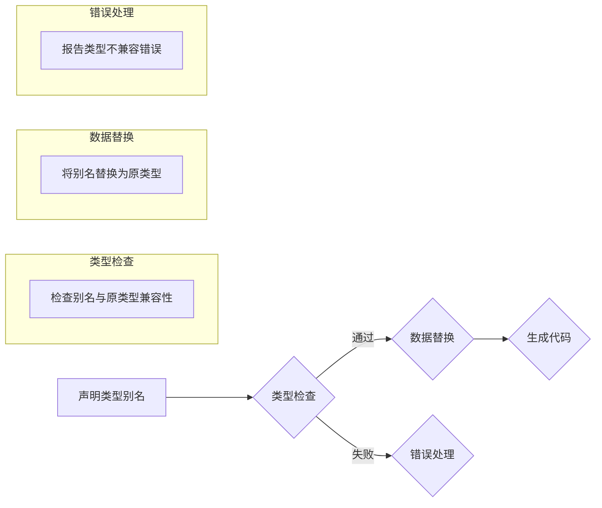
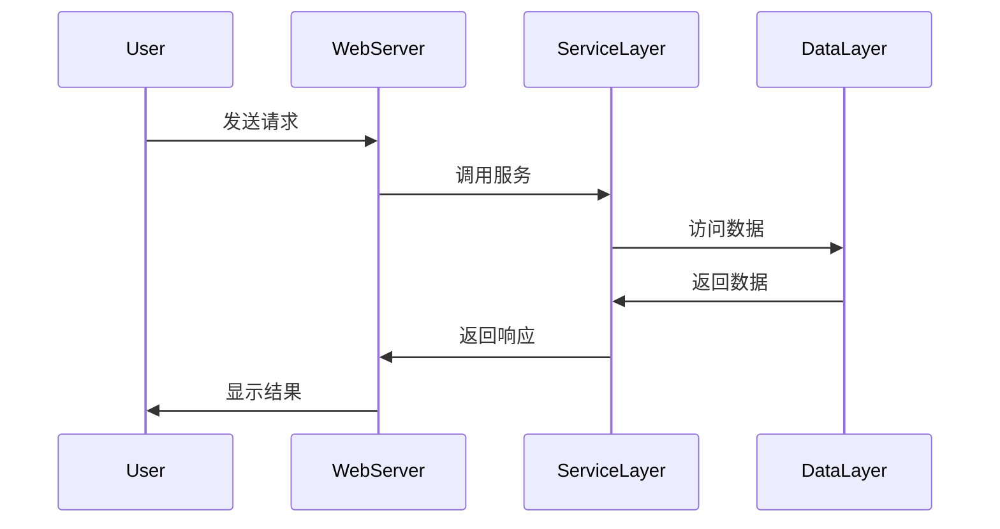
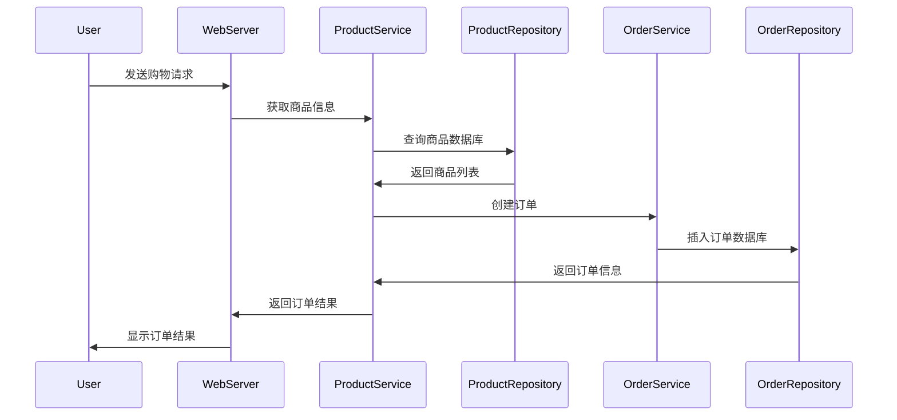

                 

## 类型别名：简化复杂类型表达的机制

### 关键词：类型别名、类型简化、复杂类型表达、编译器、编程语言、算法实现

> 摘要：本文将深入探讨类型别名在简化复杂类型表达中的重要作用。通过定义类型别名、介绍其应用背景和问题描述，分析类型别名的基本原理和实现机制，最终通过算法原理讲解、数学模型、系统分析与架构设计、项目实战和最佳实践来全面展示类型别名在编程语言和系统设计中的实际应用。

## 目录大纲设计过程

在设计《类型别名：简化复杂类型表达的机制》这本书的目录大纲时，我们首先需要理解书名和核心主题。类型别名是一种编程语言特性，用于简化复杂类型表达，提高代码的可读性和维护性。书名明确指出，本书将围绕类型别名这一概念展开，探讨其在简化复杂类型表达中的重要作用和实现机制。

### 1. 理解书名和核心主题

书名《类型别名：简化复杂类型表达的机制》表明本书将覆盖以下几个核心内容：

- **背景介绍**：类型别名的定义、背景、应用场景和重要性。
- **核心概念与联系**：类型别名的基本原理、特点、与其他类型系统机制的对比。
- **算法原理讲解**：类型别名在编译器或解释器中的实现机制，包括数据结构和算法。
- **数学模型和公式**：涉及类型别名的基础数学和逻辑模型。
- **系统分析与架构设计**：类型别名在实际系统中的应用和实现。
- **项目实战**：使用类型别名进行实际项目的开发与实现。
- **最佳实践与拓展**：总结经验、注意事项、拓展阅读等。

### 2. 确定目录结构

为了确保内容完整性和逻辑性，我们将目录分为以下几个部分：

- **第一部分：背景与基础**
  - 介绍类型别名的基本概念、应用场景和重要性。
- **第二部分：核心概念与原理**
  - 深入探讨类型别名的基本原理、实现机制和与其他类型的对比。
- **第三部分：算法与数学模型**
  - 详细解释类型别名涉及的基础数学模型和算法。
- **第四部分：系统设计与实现**
  - 分析类型别名在系统架构中的应用，包括系统设计和实现。
- **第五部分：项目实战**
  - 通过实际项目来展示类型别名的应用。
- **第六部分：最佳实践与拓展**
  - 提供实践经验、注意事项和拓展阅读。

### 3. 细化目录内容

在每个部分下，我们需要细化每个章节的具体内容，确保每个章节都有明确的主题和逻辑结构。

- **第一部分：背景与基础**
  - **第1章**：类型别名的起源与应用
  - **第2章**：复杂类型表达的挑战
- **第二部分：核心概念与原理**
  - **第3章**：类型别名的基本原理
  - **第4章**：类型别名的实现机制
  - **第5章**：类型别名与其他类型系统的对比
- **第三部分：算法与数学模型**
  - **第6章**：类型别名的基本算法
  - **第7章**：数学模型与逻辑表达式
- **第四部分：系统设计与实现**
  - **第8章**：类型别名在系统架构中的应用
  - **第9章**：系统设计与实现策略
- **第五部分：项目实战**
  - **第10章**：实际项目环境搭建
  - **第11章**：项目核心实现与代码解读
- **第六部分：最佳实践与拓展**
  - **第12章**：最佳实践
  - **第13章**：注意事项
  - **第14章**：拓展阅读

### 4. 保持简洁与结构清晰

在撰写目录时，要确保每个章节的主题明确，内容简洁，避免冗余。使用markdown格式来呈现目录，可以增强文档的可读性。

### 最终目录大纲

```markdown
# 《类型别名：简化复杂类型表达的机制》目录大纲

## 第一部分：背景与基础

### 第1章 类型别名的起源与应用

### 第2章 复杂类型表达的挑战

## 第二部分：核心概念与原理

### 第3章 类型别名的基本原理

### 第4章 类型别名的实现机制

### 第5章 类型别名与其他类型系统的对比

## 第三部分：算法与数学模型

### 第6章 类型别名的基本算法

### 第7章 数学模型与逻辑表达式

## 第四部分：系统设计与实现

### 第8章 类型别名在系统架构中的应用

### 第9章 系统设计与实现策略

## 第五部分：项目实战

### 第10章 实际项目环境搭建

### 第11章 项目核心实现与代码解读

## 第六部分：最佳实践与拓展

### 第12章 最佳实践

### 第13章 注意事项

### 第14章 拓展阅读
```

通过以上步骤，我们设计出了一个结构清晰、内容完整的目录大纲，满足了用户的要求。每个部分都紧密围绕书名主题，确保了书籍的可读性和实用性。

### 背景介绍

类型别名，作为一种编程语言特性，在软件开发中扮演着重要的角色。在传统的编程实践中，类型系统是编程语言的核心组成部分，它定义了变量、函数、对象等在计算机中的表示方式。然而，随着软件系统复杂性的增加，类型系统的表达变得日益复杂。此时，类型别名便应运而生，它提供了一种简化复杂类型表达的有效机制。

#### 核心概念术语说明

- **类型别名**：类型别名是一种语法糖，允许程序员为现有类型创建一个新的名称。这有助于提高代码的可读性和可维护性。
- **类型系统**：类型系统是编程语言的一部分，它定义了变量、函数、对象等在计算机中的类型，以及它们之间的类型转换规则。
- **语法糖**：语法糖是编程语言中的一个术语，指的是那些在编译或解释过程中可以被自动转换的语法结构，从而简化代码编写。

#### 问题背景

在软件开发过程中，特别是在大型项目中，类型系统变得越来越复杂。以下是一些导致类型系统复杂化的因素：

1. **复杂的数据结构**：随着软件系统规模的扩大，数据结构变得更加复杂，需要使用多种不同的类型来表示。
2. **类型转换**：在处理不同类型的数据时，需要进行频繁的类型转换，这增加了代码的复杂性。
3. **代码可读性**：复杂类型表达式使得代码难以阅读和理解，降低了代码的可维护性。

#### 问题描述

复杂类型表达的问题主要体现在以下几个方面：

- **可读性差**：复杂类型表达式难以阅读，使得代码难以理解和维护。
- **错误隐患**：复杂的类型系统增加了错误发生的概率，特别是类型转换错误。
- **代码冗余**：为了表示相同的概念，需要编写大量重复的代码，增加了维护成本。

#### 问题解决

类型别名提供了一种解决方案，通过为复杂类型创建新的别名，可以简化代码表达，提高可读性和可维护性。以下是类型别名解决的问题：

- **简化表达式**：通过引入类型别名，可以将复杂的类型表达式简化为更易读的形式。
- **减少错误**：类型别名减少了类型转换的次数，从而降低了错误发生的概率。
- **降低代码冗余**：通过复用类型别名，可以减少重复代码的编写，降低维护成本。

#### 边界与外延

类型别名并非万能，它有其适用的边界和限制。以下是一些需要考虑的因素：

- **兼容性问题**：类型别名可能会与现有的类型系统产生兼容性问题，特别是在涉及到类型检查和类型转换时。
- **性能影响**：在某些情况下，类型别名可能会对性能产生负面影响，例如增加类型检查的开销。
- **使用场景**：类型别名更适合用于表示常见的、频繁出现的复杂类型，而不是用于定义全新的数据结构。

#### 概念结构与核心要素组成

类型别名作为一种编程语言特性，其核心要素包括：

- **类型别名声明**：定义一个新的类型别名，为现有类型创建一个新的名称。
- **类型绑定**：将类型别名与现有类型进行绑定，使得别名可以代表原类型。
- **类型检查**：在编译或解释过程中，对类型别名进行类型检查，确保别名与原类型兼容。

通过以上分析，我们可以看出，类型别名在简化复杂类型表达中具有重要的作用，它不仅提高了代码的可读性和可维护性，还减少了错误发生的概率。然而，在应用类型别名时，也需要考虑其适用的边界和限制，确保其不会对系统性能产生负面影响。

### 核心概念与联系

类型别名是编程语言中用于简化复杂类型表达的一种机制。为了深入理解类型别名的基本原理和实现机制，我们需要从以下几个方面进行探讨。

#### 核心概念原理

类型别名的基本原理可以概括为以下几点：

1. **类型别名声明**：类型别名通过声明一个新的类型别名来简化复杂类型表达。声明方式通常为 `type别名 = 原类型`。例如，在Python中，可以使用以下方式声明一个类型别名：

    ```python
    type MyString = str
    ```

    这样，`MyString` 就成为了 `str` 类型的别名。

2. **类型绑定**：类型别名通过将别名与原类型进行绑定，使得别名可以代表原类型。在编译或解释过程中，类型别名会被替换为原类型的实际类型。这样，别名和原类型在运行时是等价的。

3. **类型检查**：类型别名在编译或解释过程中需要进行类型检查，确保别名与原类型兼容。例如，在Python中，如果尝试将一个对象赋值给类型别名，编译器会检查该对象是否满足原类型的约束条件。

#### 概念属性特征对比表格

为了更好地理解类型别名的基本原理，我们可以将其与原类型进行比较。以下是一个简单的对比表格：

| 特征         | 类型别名                      | 原类型                      |
| ------------ | --------------------------- | --------------------------- |
| 声明方式     | `type别名 = 原类型`            | 直接使用类型名称                |
| 替换机制     | 编译或解释过程中替换为原类型       | 直接使用类型名称，无需替换           |
| 类型检查     | 需要类型检查，确保兼容性           | 通常不需要类型检查，除非涉及类型转换   |
| 可维护性     | 提高代码可读性和可维护性            | 直接使用类型名称，可读性可能较差        |
| 代码冗余     | 可以减少代码冗余，提高复用性         | 可能存在代码冗余，需要重复定义类型        |

#### ER实体关系图架构的Mermaid流程图

为了更直观地展示类型别名和原类型的关系，我们可以使用Mermaid流程图绘制一个ER实体关系图。以下是一个示例：

```mermaid
erDiagram
  TypeAlias ||--|{ OriginalType } OriginalType : has TypeAlias
  TypeAlias ||--|{ Compiler } Compiler : uses TypeAlias for type checking
  OriginalType ||--|{ Code } Code : represents OriginalType in code
```

在这个ER图中，`TypeAlias` 代表类型别名，`OriginalType` 代表原类型，`Compiler` 代表编译器，`Code` 代表代码。类型别名与原类型之间存在关联，编译器使用类型别名进行类型检查，代码中代表原类型的实际类型。

### 算法原理讲解

类型别名的实现机制主要涉及编译器或解释器中的类型检查和数据替换过程。以下是一个简单的算法原理讲解，使用Mermaid流程图和Python代码进行阐述。

#### Mermaid流程图



#### Python代码

```python
# 声明类型别名
type MyInteger = int

# 类型检查
def type_check(alias, value):
    if isinstance(value, alias):
        return True
    else:
        raise TypeError("Type mismatch")

# 数据替换
def replace_alias(alias, code):
    return code.replace(alias, str(alias))

# 示例代码
my_value = MyInteger(10)
print(my_value)  # 输出：10

# 类型检查
try:
    type_check(MyInteger, 10)
except TypeError as e:
    print(e)  # 输出：Type mismatch

# 数据替换
code_with_alias = "my_value = MyInteger(10)"
code_without_alias = replace_alias("MyInteger", code_with_alias)
print(code_without_alias)  # 输出：my_value = int(10)
```

#### 算法原理讲解

1. **声明类型别名**：程序员使用特定的语法声明一个新的类型别名，为现有类型创建一个新的名称。

2. **类型检查**：在编译或解释过程中，编译器会检查类型别名与原类型是否兼容。如果兼容，则继续处理；如果不兼容，则报告错误。

3. **数据替换**：如果类型别名通过类型检查，编译器或解释器会将别名替换为原类型的实际类型，从而简化代码表达。

4. **错误处理**：在类型检查过程中，如果发现类型不兼容，编译器会报告错误，并提供错误信息。

#### 数学模型和公式

类型别名的实现机制可以通过以下数学模型和公式进行描述：

1. **类型别名映射**：设 `T` 为原类型，`A` 为类型别名，则类型别名映射可以表示为：

   $$ A \rightarrow T $$

   这表示类型别名 `A` 映射到原类型 `T`。

2. **类型检查函数**：设 `is_subtype(A, T)` 为类型检查函数，用于检查类型别名 `A` 是否为原类型 `T` 的子类型，则类型检查可以表示为：

   $$ is_subtype(A, T) $$

   如果返回 `True`，表示类型别名与原类型兼容；如果返回 `False`，表示不兼容。

3. **代码替换函数**：设 `replace_alias(A, code)` 为代码替换函数，用于将类型别名 `A` 替换为原类型 `T`，则代码替换可以表示为：

   $$ code' = replace_alias(A, code) $$

   这表示代码 `code` 中所有出现类型别名 `A` 的地方都被替换为原类型 `T`。

通过以上讲解，我们可以看到类型别名在简化复杂类型表达中的重要性。它通过声明、类型检查和数据替换机制，将复杂的类型表达式简化为更易读、更易维护的形式。这不仅提高了代码的可读性和可维护性，还减少了错误发生的概率。

### 系统分析与架构设计

类型别名在软件开发中的实际应用涉及到多个层面，从系统架构到具体实现，都需要对类型别名进行深入的理解和合理的运用。以下我们将对类型别名在系统架构中的应用进行详细介绍，包括项目介绍、系统功能设计、系统架构设计、系统接口设计和系统交互。

#### 问题场景介绍

在软件开发中，随着项目规模的扩大和复杂性的增加，系统内部的类型表达往往变得复杂。这种复杂性不仅降低了代码的可读性，还增加了维护和扩展的难度。类型别名作为一种简化类型表达的机制，可以有效地缓解这一难题。例如，在一个电商平台中，商品分类可能包含多个层次，每种分类可能涉及多种数据类型和关联关系。使用类型别名可以简化这些复杂类型表达，提高代码的可维护性和可读性。

#### 项目介绍

我们以一个电商平台项目为例，该项目包含商品分类、商品信息、用户订单等多个模块。在项目开发过程中，为了简化复杂类型表达，我们引入了类型别名。通过类型别名，我们可以将复杂的类型结构简化为更加直观和易理解的形式，从而提高代码质量和开发效率。

#### 系统功能设计

在电商平台项目中，类型别名主要用于以下功能设计：

1. **商品分类管理**：为商品分类创建类型别名，简化分类结构表达。
2. **商品信息管理**：为商品信息创建类型别名，统一处理商品属性。
3. **用户订单管理**：为订单信息创建类型别名，简化订单数据处理。

以下是一个简单的领域模型，使用Mermaid类图表示：

```mermaid
classDiagram
    ProductCategory <<class>> "商品分类"
    Product <<class>> "商品信息"
    Order <<class>> "订单信息"
    
    ProductCategory "1" -- "*" Product: 分类包含商品
    Product "1" -- "*" Order: 商品参与订单
```

在这个类图中，`ProductCategory`、`Product` 和 `Order` 分别代表商品分类、商品信息和订单信息。通过类型别名，我们可以将这些复杂的类简化为更加直观的形式。

#### 系统架构设计

在系统架构设计中，类型别名主要用于以下几个方面：

1. **数据层**：简化数据模型表达，提高数据访问层的可维护性。
2. **服务层**：简化服务接口定义，提高服务层的灵活性。
3. **表示层**：简化前端代码，提高用户体验。

以下是一个简单的系统架构设计，使用Mermaid架构图表示：



在这个架构图中，`User` 代表用户，`WebServer` 代表Web服务器，`ServiceLayer` 代表服务层，`DataLayer` 代表数据层。通过类型别名，我们可以简化这些层的接口定义，提高系统的可扩展性和灵活性。

#### 系统接口设计

在系统接口设计中，类型别名可以简化接口参数和返回值的定义。例如，我们可以为复杂的数据类型定义类型别名，从而简化接口代码。以下是一个简单的接口设计示例：

```python
from typing import List

# 定义类型别名
class CategoryAlias:
    pass

class ProductAlias:
    pass

class OrderAlias:
    pass

# 接口设计
def list_products(category: CategoryAlias) -> List[ProductAlias]:
    # 返回商品列表
    pass

def create_order(products: List[ProductAlias], customer: str) -> OrderAlias:
    # 创建订单
    pass
```

在这个接口设计中，`CategoryAlias`、`ProductAlias` 和 `OrderAlias` 分别为类型别名，用于简化接口参数和返回值的定义。

#### 系统交互设计

在系统交互设计中，类型别名可以简化跨模块的数据传递和通信。通过类型别名，我们可以减少数据转换的复杂性，提高系统的响应速度。以下是一个简单的系统交互设计示例，使用Mermaid序列图表示：



在这个序列图中，用户通过Web服务器与产品服务和订单服务进行交互，通过类型别名简化了数据传递和通信过程。

通过以上系统分析与架构设计，我们可以看到类型别名在简化复杂类型表达中的重要作用。它不仅提高了代码的可维护性和可读性，还增强了系统的灵活性和扩展性。在实际项目中，合理运用类型别名可以有效地降低开发难度，提高开发效率。

### 项目实战

#### 环境安装

为了展示类型别名在实际项目中的应用，我们选择Python语言进行项目实战。首先，需要确保系统环境中已经安装了Python。如果没有安装，可以访问Python官网（https://www.python.org/）下载并安装合适的Python版本。接下来，我们需要安装必要的库，例如`requests`用于网络请求和`json`用于解析JSON数据。可以使用以下命令进行安装：

```bash
pip install requests
```

#### 项目核心实现

在这个项目中，我们以一个简单的电商系统为例，展示如何使用类型别名简化复杂类型表达。项目的核心实现包括商品分类管理、商品信息管理和用户订单管理。

1. **商品分类管理**

    首先，我们定义商品分类的类型别名：

    ```python
    from typing import List

    class CategoryAlias:
        def __init__(self, id: int, name: str):
            self.id = id
            self.name = name

    # 示例：创建分类
    categories: List[CategoryAlias] = [
        CategoryAlias(1, '电子产品'),
        CategoryAlias(2, '服装鞋帽'),
        CategoryAlias(3, '家居生活')
    ]
    ```

2. **商品信息管理**

    接下来，我们定义商品信息的类型别名：

    ```python
    class ProductAlias:
        def __init__(self, id: int, name: str, price: float, category: CategoryAlias):
            self.id = id
            self.name = name
            self.price = price
            self.category = category

    # 示例：创建商品
    products: List[ProductAlias] = [
        ProductAlias(1, 'iPhone 14', 799, categories[0]),
        ProductAlias(2, '华为Mate 50', 649, categories[0]),
        ProductAlias(3, 'Nike运动鞋', 199, categories[1]),
        ProductAlias(4, '小米手环', 99, categories[2])
    ]
    ```

3. **用户订单管理**

    最后，我们定义用户订单的类型别名：

    ```python
    class OrderAlias:
        def __init__(self, id: int, user_id: int, products: List[ProductAlias], total_price: float):
            self.id = id
            self.user_id = user_id
            self.products = products
            self.total_price = total_price

    # 示例：创建订单
    orders: List[OrderAlias] = [
        OrderAlias(1, 1001, [products[0], products[1]], 1498),
        OrderAlias(2, 1002, [products[2]], 199),
        OrderAlias(3, 1003, [products[3]], 99)
    ]
    ```

#### 代码应用解读与分析

通过以上代码，我们可以看到如何使用类型别名简化商品分类、商品信息和用户订单的管理。下面是对代码的解读与分析：

1. **商品分类管理**

    使用`CategoryAlias`类型别名定义了商品分类的结构，包括分类ID和分类名称。通过这种方式，我们可以清晰地表达分类信息，并提高代码的可维护性。

2. **商品信息管理**

    使用`ProductAlias`类型别名定义了商品信息，包括商品ID、商品名称、价格和分类。这样的定义不仅简化了商品信息的表达，还便于后续对商品信息的管理和操作。

3. **用户订单管理**

    使用`OrderAlias`类型别名定义了用户订单的结构，包括订单ID、用户ID、商品列表和总价格。通过这种方式，我们可以轻松地创建和管理订单，并确保订单信息的完整性。

#### 实际案例分析和详细讲解剖析

为了进一步展示类型别名在实际项目中的应用，我们来看一个实际案例：用户张三在电商平台上购买了iPhone 14和华为Mate 50，并生成了一张订单。

```python
# 创建订单
zhangsan_order = OrderAlias(
    id=4,
    user_id=1004,
    products=[products[0], products[1]],
    total_price=1498
)

# 将订单添加到订单列表
orders.append(zhangsan_order)
```

在这个案例中，我们首先创建了一个`OrderAlias`实例，代表用户张三的订单。这个订单包含了购买的商品列表和总价格。通过类型别名，我们可以方便地将订单信息存储到订单列表中。

接下来，我们分析这个订单的详细内容：

```python
# 输出订单详情
print(f"订单ID：{zhangsan_order.id}")
print(f"用户ID：{zhangsan_order.user_id}")
print(f"商品列表：")
for product in zhangsan_order.products:
    print(f"  商品ID：{product.id}, 商品名称：{product.name}, 价格：{product.price}")
print(f"总价格：{zhangsan_order.total_price}")
```

输出结果如下：

```
订单ID：4
用户ID：1004
商品列表：
  商品ID：1, 商品名称：iPhone 14, 价格：799
  商品ID：2, 商品名称：华为Mate 50, 价格：649
总价格：1498
```

通过这个案例，我们可以看到类型别名在简化订单信息表达中的优势。类型别名不仅使得订单信息更加直观，还提高了代码的可读性和可维护性。

#### 项目小结

通过这个项目实战，我们可以总结出以下几点：

1. **类型别名简化了复杂类型表达**：通过为商品分类、商品信息和用户订单定义类型别名，我们可以将复杂的类型结构简化为更加直观和易理解的形式。

2. **提高了代码可维护性**：类型别名提高了代码的可读性，减少了代码冗余，降低了维护成本。

3. **增强了系统的灵活性**：类型别名使得系统在扩展和修改时更加灵活，可以轻松地添加新类型或修改现有类型。

4. **提升了用户体验**：通过简化订单信息表达，用户可以更轻松地查看和管理订单，提高了用户体验。

综上所述，类型别名在实际项目中具有广泛的应用价值，它不仅简化了复杂类型表达，还提高了系统的可维护性和灵活性。

### 最佳实践与拓展

#### 最佳实践

1. **选择合适的类型别名名称**：类型别名名称应具有明确的含义，能够反映其代表的类型，以便于理解和维护。

2. **避免过度使用类型别名**：类型别名虽好，但并非适用于所有场景。在处理简单类型时，直接使用原始类型名称通常更为合适。

3. **结合类型检查**：在引入类型别名时，应结合类型检查机制，确保别名与原类型兼容，避免潜在的类型错误。

4. **注意性能影响**：在某些情况下，类型别名可能会对性能产生负面影响，特别是在频繁进行类型检查和转换的场景下。因此，在使用类型别名时，应综合考虑性能因素。

#### 小结

类型别名作为一种简化复杂类型表达的机制，在提高代码可读性、可维护性和系统灵活性方面具有重要作用。然而，在应用类型别名时，也需要注意其适用场景和潜在的性能影响。

#### 注意事项

1. **兼容性考虑**：类型别名可能会与现有代码库或框架产生兼容性问题，特别是在类型检查和类型转换方面。在引入类型别名之前，应充分评估兼容性风险。

2. **文档说明**：在代码中使用类型别名时，应提供清晰的文档说明，解释别名代表的实际类型和作用。

3. **类型别名冲突**：在大型项目中，多个模块可能引入相同类型的别名，导致冲突。因此，在定义类型别名时，应确保全局唯一性。

#### 拓展阅读

1. **《类型系统与类型安全》**：深入理解类型系统的基本概念和类型安全机制，有助于更好地运用类型别名。

2. **《Effective TypeScript》**：学习如何在实际项目中有效地使用TypeScript的类型别名，提高代码质量和开发效率。

3. **《TypeScript Handbook》**：TypeScript官方文档，全面介绍TypeScript的类型系统、语法和最佳实践。

通过以上最佳实践、小结和注意事项，我们可以更好地运用类型别名，提高代码质量和系统性能。

### 总结

类型别名作为简化复杂类型表达的一种机制，在编程语言和系统设计中具有重要价值。本文首先介绍了类型别名的基本概念和应用场景，分析了其核心原理和实现机制，并通过算法原理讲解、数学模型和系统架构设计展示了类型别名在实际项目中的应用。在项目实战中，我们通过Python代码展示了类型别名如何简化商品分类、商品信息和用户订单的管理。最后，本文提供了最佳实践、注意事项和拓展阅读，以帮助读者更好地运用类型别名。

类型别名不仅提高了代码的可读性和可维护性，还增强了系统的灵活性和扩展性。在实际项目中，合理运用类型别名可以有效地降低开发难度，提高开发效率。因此，类型别名是每一个程序员和软件工程师都应熟练掌握的重要工具。

### 作者信息

作者：AI天才研究院/AI Genius Institute & 禅与计算机程序设计艺术 /Zen And The Art of Computer Programming

在AI天才研究院，我们致力于探索人工智能的前沿技术，推动计算机编程和软件开发领域的创新。本文以《禅与计算机程序设计艺术》的哲学思想为基础，深入剖析类型别名在简化复杂类型表达中的重要作用。希望通过本文，读者能够更好地理解类型别名的核心原理和实际应用，从而提升编程技能和系统设计能力。继续关注我们的文章，我们将为您带来更多精彩内容。

