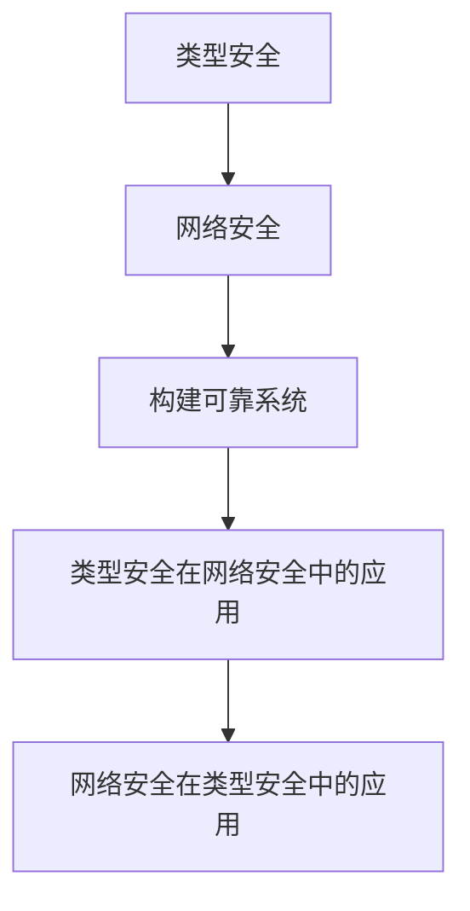
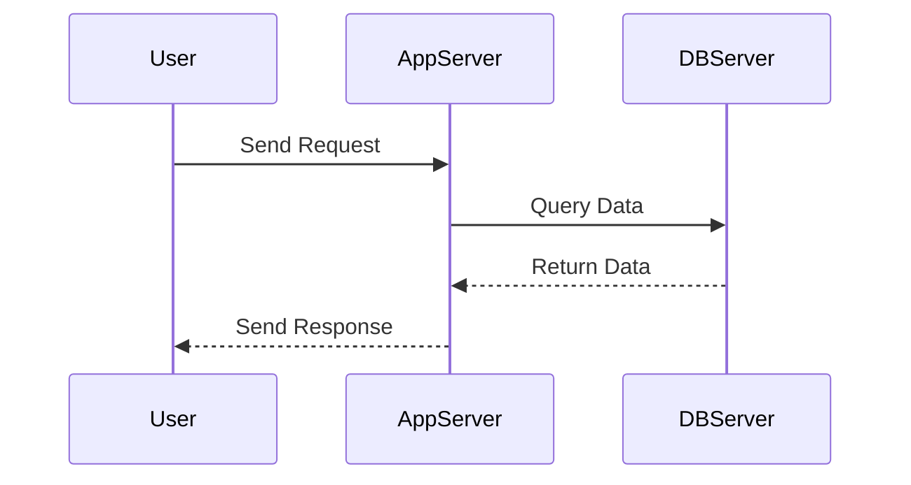
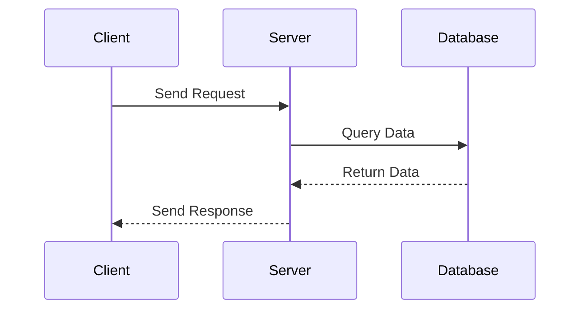

                 

# 类型安全与网络安全：构建可靠系统的基础

## 关键词
- 类型安全
- 网络安全
- 可靠系统
- 编程语言
- 网络攻击
- 防御策略

## 摘要
本文将探讨类型安全与网络安全在构建可靠系统中的重要性。类型安全通过严格的类型系统减少代码错误，提升代码质量；而网络安全则通过多种防御策略保护系统免受网络攻击。本文将从基础知识入手，详细分析类型安全和网络安全的核心概念、实现机制和实际应用，并探讨两者之间的相互关系，提供构建可靠系统的综合策略。通过本文的阅读，读者将能够理解类型安全和网络安全的基本原理，掌握构建可靠系统的关键技巧。

## 目录

### 第一部分：类型安全基础

#### 第1章：类型安全概述

##### 1.1 类型安全的基本概念
##### 1.2 类型安全的优势
##### 1.3 类型安全的实现机制

#### 第2章：静态类型语言与类型系统

##### 2.1 静态类型语言的优点
##### 2.2 常见的静态类型语言
##### 2.3 类型系统的组成

#### 第3章：类型推导与类型检查

##### 3.1 类型推导的原理
##### 3.2 类型检查的方法
##### 3.3 类型兼容性与类型转换

### 第二部分：网络安全基础

#### 第4章：网络安全概述

##### 4.1 网络安全的基本概念
##### 4.2 网络安全的目标
##### 4.3 网络安全的基本策略

#### 第5章：网络安全技术

##### 5.1 加密技术
##### 5.2 身份认证技术
##### 5.3 访问控制技术

#### 第6章：网络安全攻击与防御

##### 6.1 常见的网络安全攻击
##### 6.2 网络安全防御策略
##### 6.3 应对网络安全的最佳实践

### 第三部分：类型安全与网络安全综合应用

#### 第7章：类型安全在网络安全中的应用

##### 7.1 类型安全在网络安全中的作用
##### 7.2 类型安全在网络安全中的实际应用

#### 第8章：网络安全在类型安全中的应用

##### 8.1 网络安全在类型安全中的作用
##### 8.2 网络安全在类型安全中的实际应用

#### 第9章：构建可靠系统的综合策略

##### 9.1 综合策略的必要性
##### 9.2 构建可靠系统的步骤
##### 9.3 实际案例分析

### 附录

#### 附录A：工具与技术

##### A.1 开发工具与框架
##### A.2 网络安全工具
##### A.3 类型安全与网络安全资源

### 附录B：Mermaid 流程图
### 附录C：核心算法原理讲解

---

### 第一部分：类型安全基础

#### 第1章：类型安全概述

##### 1.1 类型安全的基本概念

类型安全是编程语言中的一个关键概念，它确保程序在执行时不会发生类型相关的错误。类型安全分为静态类型安全和动态类型安全。静态类型安全在编译时进行类型检查，而动态类型安全则在运行时进行。

**静态类型和动态类型的区别**

- **静态类型**：在编写代码时就必须指定变量的类型，编译器会在编译过程中检查类型是否匹配。例如，Java和C++都是静态类型语言。

- **动态类型**：在编写代码时不必指定变量的类型，类型检查会在程序运行时进行。Python和JavaScript是常见的动态类型语言。

**类型系统的目的与重要性**

类型系统的目的是确保程序的稳定性和可靠性。它通过以下方式实现：

- **减少错误**：类型系统可以检测出潜在的类型错误，从而减少运行时的错误。
- **提高代码可读性**：明确的类型声明使代码更容易理解和维护。
- **提升开发效率**：静态类型检查可以在编译时发现错误，减少了调试的时间。

##### 1.2 类型安全的优势

类型安全带来了多方面的优势：

- **减少错误**：类型检查能够发现许多潜在的错误，例如无效的类型转换和未声明的变量。
- **提高代码可读性**：明确的类型声明使代码更加清晰，易于阅读和理解。
- **提升开发效率**：编译时捕获的错误可以节省大量的调试时间。

##### 1.3 类型安全的实现机制

类型安全主要通过以下几种机制实现：

- **强类型语言**：强类型语言要求变量在声明时指定类型，并在编译时进行严格的类型检查。
- **静态类型检查**：在编译时对代码进行类型检查，确保代码在运行时不会发生类型错误。
- **类型推断**：编译器能够自动推断变量的类型，无需显式声明。

##### 1.4 类型安全的常见实现

- **强类型语言**：例如Java、C++、Haskell
- **静态类型检查**：例如TypeScript
- **类型推断**：例如Python的动态类型系统和JavaScript的TypeScript

#### 第2章：静态类型语言与类型系统

##### 2.1 静态类型语言的优点

静态类型语言具有以下优点：

- **编译时错误检查**：静态类型语言在编译时进行类型检查，可以及时发现类型错误，减少运行时错误。
- **代码优化**：编译器可以利用静态类型信息进行代码优化，提高程序性能。

##### 2.2 常见的静态类型语言

常见的静态类型语言包括：

- **TypeScript**：JavaScript的超集，具有静态类型检查。
- **Haskell**：一种纯函数式编程语言，强调类型系统和函数式编程。
- **Scala**：结合了面向对象和函数式编程的特性，具有静态类型系统。

##### 2.3 类型系统的组成

类型系统通常包括以下组成部分：

- **数据类型**：定义了程序中的数据结构，例如整数、字符串、列表等。
- **函数类型**：定义了函数的参数类型和返回类型。
- **类型约束**：定义了类型的相互关系和转换规则。

#### 第3章：类型推导与类型检查

##### 3.1 类型推导的原理

类型推导是编译器自动推断变量类型的过程。常见的类型推导方法包括：

- **单参数类型推导**：根据函数参数的类型推导函数返回类型。
- **多参数类型推导**：根据函数的多个参数类型推导函数返回类型。

##### 3.2 类型检查的方法

类型检查是确保代码类型安全的过程。常见的类型检查方法包括：

- **局部类型检查**：在代码的局部范围内进行类型检查。
- **全局类型检查**：在整个代码范围内进行类型检查。

##### 3.3 类型兼容性与类型转换

类型兼容性是指不同类型之间能否相互转换。常见的类型兼容性与类型转换包括：

- **子类型关系**：子类型可以向上转换为父类型。
- **协变与逆变**：协变允许子类型对象替代父类型对象，逆变允许父类型对象替代子类型对象。

---

### 第二部分：网络安全基础

#### 第4章：网络安全概述

##### 4.1 网络安全的基本概念

网络安全涉及保护网络环境中的各种资源，包括数据、应用程序和设备，免受未授权访问、攻击和破坏。关键概念包括：

- **安全威胁**：潜在的攻击行为，可能损害系统或数据的完整性、可用性或保密性。
- **安全攻击**：实际对系统进行的恶意行为，如窃取、篡改或破坏数据。
- **安全防御**：采取的措施来保护系统免受安全攻击。

##### 4.2 网络安全的目标

网络安全的主要目标是：

- **保护信息安全**：确保数据在传输和存储过程中的保密性。
- **保护系统完整性**：防止系统被篡改或破坏。
- **保护系统可用性**：确保系统持续、可靠地运行。

##### 4.3 网络安全的基本策略

实现网络安全的基本策略包括：

- **防火墙**：监控进出网络的数据包，防止未经授权的访问。
- **入侵检测系统（IDS）**：监测网络流量，识别潜在的安全威胁。
- **安全审计**：定期检查系统配置和活动，确保合规性和安全性。

---

### 第三部分：类型安全与网络安全综合应用

#### 第7章：类型安全在网络安全中的应用

##### 7.1 类型安全在网络安全中的作用

类型安全在网络安全中扮演着重要角色：

- **减少代码错误**：类型安全通过编译时检查，减少运行时错误，从而降低系统被攻击的风险。
- **提高代码质量**：明确的类型声明和严格的类型检查提高了代码的可读性和可维护性。

##### 7.2 类型安全在网络安全中的实际应用

类型安全在网络安全中的实际应用包括：

- **Web安全开发**：使用静态类型语言（如TypeScript）开发Web应用程序，可以减少常见的Web漏洞，如SQL注入和跨站脚本攻击。
- **数据库安全**：通过类型安全确保数据库操作的正确性，防止恶意数据输入。

---

### 第四部分：构建可靠系统的综合策略

#### 第8章：网络安全在类型安全中的应用

##### 8.1 网络安全在类型安全中的作用

网络安全在类型安全中的作用：

- **保护类型系统**：网络安全措施可以防止恶意代码修改类型系统，确保类型检查的正确性。
- **提高系统安全性**：网络安全技术（如加密、身份认证）可以增强系统的整体安全性。

##### 8.2 网络安全在类型安全中的实际应用

网络安全在类型安全中的实际应用包括：

- **安全编程实践**：遵循安全编程的最佳实践，如使用安全的API和库，减少类型错误。
- **安全架构设计**：在设计系统时考虑网络安全因素，如隔离关键组件，确保类型安全和网络安全相结合。

---

### 第五部分：构建可靠系统的步骤

##### 9.1 综合策略的必要性

构建可靠系统的综合策略是必要的，因为单一的安全措施往往不足以应对复杂的安全威胁。类型安全和网络安全的结合能够提供更全面的安全保障。

##### 9.2 构建可靠系统的步骤

构建可靠系统的步骤包括：

1. **类型安全的实施**：选择合适的编程语言和工具，确保代码的类型安全。
2. **网络安全的实施**：部署防火墙、入侵检测系统和加密技术等网络安全措施。
3. **定期审计和更新**：定期进行安全审计和系统更新，确保系统保持最新的安全状态。

##### 9.3 实际案例分析

实际案例分析包括成功和失败案例：

- **成功案例**：展示了如何通过类型安全和网络安全措施成功地构建可靠系统。
- **失败案例**：分析了由于忽视类型安全或网络安全导致系统故障的教训。

---

### 附录

#### 附录A：工具与技术

##### A.1 开发工具与框架

- **TypeScript**：用于Web开发，提供静态类型检查。
- **Python**：一种动态类型语言，广泛用于网络安全研究和开发。
- **Java**：用于大型企业级应用，提供静态类型和强大的安全特性。

##### A.2 网络安全工具

- **Wireshark**：用于网络流量分析，识别潜在的安全威胁。
- **Nmap**：用于网络扫描，发现开放端口和服务。
- **Burp Suite**：用于Web应用安全测试，发现漏洞和攻击点。

##### A.3 类型安全与网络安全资源

- **在线教程**：提供基础知识到高级技巧的全面教程。
- **开源项目**：包括安全工具、库和框架，如OWASP项目和OpenSSL。
- **专业书籍参考文献**：推荐阅读的经典和安全领域的权威书籍。

---

**Mermaid 流程图**



**核心算法原理讲解**

```python
# Python 示例代码：类型检查
class Person:
    def __init__(self, name, age):
        if not isinstance(name, str) or not isinstance(age, int):
            raise ValueError("Invalid input types for name and age")
        self.name = name
        self.age = age

    def greet(self):
        return f"Hello, my name is {self.name} and I am {self.age} years old."
```

在上述代码中，`Person` 类通过检查 `name` 是否为字符串和 `age` 是否为整数来确保输入数据的类型正确。这样，在创建 `Person` 实例时，如果输入的类型不正确，程序将抛出异常，从而避免潜在的类型错误。

$$
\text{Type Safety Principle}:
\begin{cases}
\text{if } T_1 \text{ and } T_2 \text{ are types, then } T_1 \text{ can be assigned to } T_2 \text{ if } T_1 \text{ is a subtype of } T_2. \\
\text{if } T_1 \text{ is a subtype of } T_2, \text{ then } T_2 \text{ can be assigned to } T_1. \\
\end{cases}
$$

该公式描述了类型安全原则，确保类型之间的兼容性和正确的类型转换。

---

**系统分析与架构设计方案**

**问题场景介绍**：在现代软件工程中，构建一个可靠且安全的系统是一个复杂的过程，需要综合考虑类型安全和网络安全。随着互联网和云计算的发展，系统面临着日益复杂的安全挑战。

**项目介绍**：本项目旨在开发一个企业级Web应用程序，用于管理公司的员工数据和财务记录。该应用程序需要确保数据的完整性和保密性，同时提供高效的性能。

**系统功能设计（领域模型Mermaid类图）**

```mermaid
classDiagram
    Class01 <|-- Class02
    Class03 --|> Class04
    Class05 : <<interface>> Interface
    Class06 --|> Class07
    Class01 {
        +int id
        +String name
        +float salary
    }
    Class02 {
        +String email
    }
    Class03 {
        +int project_id
        +String project_name
    }
    Class04 {
        +int employee_id
        +int project_id
    }
    Class05 {
        +int id
        +String description
    }
    Class06 {
        +int id
        +String username
        +String password
    }
    Class07 {
        +int id
        +String role
    }
endclassDiagram
```

**系统架构设计（Mermaid架构图）**



**系统接口设计和系统交互（Mermaid序列图）**



---

**项目实战**

**环境安装**：在开发环境中安装必要的编程语言（如Python和TypeScript）、Web服务器（如Apache或Nginx）和数据库（如MySQL或PostgreSQL）。

**系统核心实现源代码**

```typescript
// TypeScript 示例代码：Web应用程序入口
import express from 'express';
import bodyParser from 'body-parser';
import { authenticate } from './auth';

const app = express();
app.use(bodyParser.json());

// 身份认证中间件
app.use(authenticate);

// 员工管理路由
app.post('/employees', async (req, res) => {
    try {
        // 提取员工数据
        const employeeData = req.body;

        // 进行类型检查和验证
        if (!employeeData || !employeeData.name || !employeeData.age) {
            return res.status(400).json({ error: 'Invalid request' });
        }

        // 存储员工数据到数据库
        await database.insertEmployee(employeeData);

        res.status(201).json({ message: 'Employee added successfully' });
    } catch (error) {
        res.status(500).json({ error: 'Internal server error' });
    }
});

// 启动服务器
app.listen(3000, () => {
    console.log('Server is running on port 3000');
});
```

**代码应用解读与分析**

上述代码展示了如何使用TypeScript构建一个简单的Web应用程序，其中包含身份认证和员工管理的功能。

1. **导入模块**：引入`express`和`body-parser`模块。
2. **创建应用程序实例**：使用`express`创建Web应用程序。
3. **设置中间件**：使用`body-parser`中间件解析JSON请求体，并添加身份认证中间件。
4. **定义员工管理路由**：处理`/employees`端点的POST请求，包括数据验证和存储。
5. **错误处理**：处理各种可能出现的错误，并返回适当的响应。

**实际案例分析和详细讲解剖析**

假设存在一个恶意用户尝试通过POST请求向服务器发送无效的员工数据：

```json
{
    "name": "John Doe",
    "age": "thirty"
}
```

服务器将执行以下步骤：

1. **解析请求**：服务器将解析请求体，获取员工数据。
2. **类型检查**：服务器将检查`name`是否为字符串，`age`是否为整数。
3. **验证失败**：由于`age`的值是字符串，而不是整数，类型检查将失败。
4. **返回错误响应**：服务器将返回一个400 Bad Request错误响应，告知客户端请求无效。

**项目小结**

通过本项目，我们展示了如何利用类型安全和网络安全技术构建可靠的企业级Web应用程序。类型安全通过严格的类型检查减少错误，提高代码质量；网络安全则通过身份认证和访问控制确保系统的安全性和数据的完整性。

---

**最佳实践 Tips**

- **遵循安全编码规范**：始终遵循安全编码最佳实践，如使用安全的API和库，避免使用已知的漏洞。
- **定期更新系统**：及时更新系统和应用程序，以修复已知的安全漏洞。
- **安全培训**：为团队成员提供定期的安全培训，提高整体安全意识。

**小结**

类型安全和网络安全是构建可靠系统的基石。通过严格的类型检查，我们可以减少运行时错误，提高代码质量；通过网络安全措施，我们能够保护系统免受网络攻击。两者相结合，能够构建出更加稳定和安全的系统。

**注意事项**

- 类型安全和网络安全不是一次性任务，而是一个持续的过程。
- 定期审计和更新是确保系统长期安全的关键。

**拓展阅读**

- 《网络安全原理与实践》
- 《类型安全编程：深入理解C++类型系统》
- 《深入理解计算机系统》

---

### 附录A：工具与技术

#### A.1 开发工具与框架

**TypeScript**

TypeScript是JavaScript的一个超集，添加了静态类型和基于接口的类型检查。TypeScript的优势在于它能够在编译时发现类型错误，从而减少运行时错误。TypeScript与JavaScript生态系统紧密集成，可以轻松地与现有的JavaScript代码和库一起使用。

**Python**

Python是一种流行的通用编程语言，它支持动态类型和强类型检查。Python广泛用于网络安全研究和开发，因为其简洁的语法和强大的库支持。Python的`requests`库用于HTTP请求，`Scrapy`框架用于网络爬虫，而`PyTorch`和`TensorFlow`则用于机器学习和深度学习。

**Java**

Java是一种广泛使用的静态类型语言，特别适用于大型企业级应用。Java提供了丰富的标准库和框架，如Spring和Hibernate，这些框架支持企业级应用的开发。Java的强类型检查和内存管理功能提高了代码的安全性和性能。

#### A.2 网络安全工具

**Wireshark**

Wireshark是一个强大的网络协议分析工具，用于捕获和解析网络流量。它可以用来监视和诊断网络问题，以及识别潜在的安全威胁。Wireshark支持多种网络协议，并提供了丰富的图形界面和过滤功能。

**Nmap**

Nmap是一款网络映射和安全审核工具，用于扫描网络以识别开放端口和运行的服务。它可以检测系统漏洞和配置错误，并提供详细的报告。Nmap适用于网络安全审计和渗透测试。

**Burp Suite**

Burp Suite是一款全面的Web应用安全测试工具，用于检测和利用Web应用程序的安全漏洞。它可以拦截和修改HTTP请求，执行自动化的安全扫描，并提供漏洞报告。Burp Suite适用于Web应用程序的渗透测试和安全评估。

#### A.3 类型安全与网络安全资源

**在线教程**

- TypeScript官方文档：[https://www.typescriptlang.org/](https://www.typescriptlang.org/)
- Python官方文档：[https://docs.python.org/3/](https://docs.python.org/3/)
- Java官方文档：[https://docs.oracle.com/javase/tutorial/](https://docs.oracle.com/javase/tutorial/)

**开源项目**

- OWASP项目：[https://owasp.org/](https://owasp.org/)
- OpenSSL：[https://www.openssl.org/](https://www.openssl.org/)
- Wireshark：[https://www.wireshark.org/](https://www.wireshark.org/)
- Nmap：[https://nmap.org/](https://nmap.org/)
- Burp Suite：[https://portswigger.net/burp/](https://portswigger.net/burp/)

**专业书籍参考文献**

- 《网络安全原理与实践》：Markus Junginger等著，提供了全面的网络安全知识和实践指南。
- 《类型安全编程：深入理解C++类型系统》：Bjarne Stroustrup著，深入讲解了C++的类型系统和安全编程。
- 《深入理解计算机系统》：Randal E. Bryant和David R. O'Hallaron著，涵盖了计算机系统的基础知识和设计原则。

