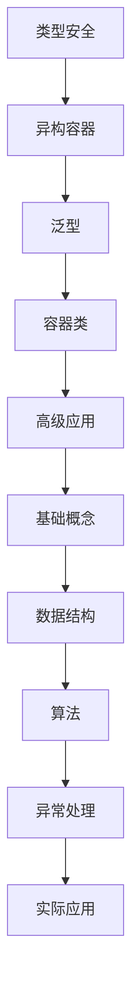
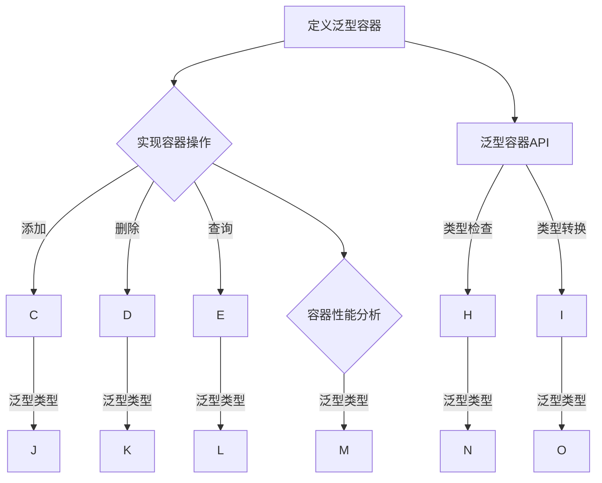

                 

### 1.1 类型安全与异构容器的概念

#### 类型安全的定义

类型安全是指程序在运行时能够保证数据类型的正确性和一致性。这种安全性主要通过静态类型检查和动态类型检查来实现。静态类型检查是在编译期间进行的，编译器会检查代码中的类型是否一致，从而避免在运行时出现类型错误。动态类型检查则是在程序运行时进行的，通过运行时的类型检查机制来确保操作的数据类型是正确的。

**为什么类型安全很重要？**

类型安全的重要性体现在以下几个方面：

1. **避免错误**：类型安全可以避免因类型错误导致的程序崩溃或异常行为，从而提高程序的稳定性。
2. **提高性能**：静态类型系统允许编译器生成更高效的代码，因为编译器可以更准确地知道数据类型。
3. **增强可维护性**：类型安全使得代码更加清晰和可理解，降低了维护成本。

#### 异构容器的定义

异构容器是一种可以存储不同类型数据的容器。与传统的同构容器（如数组、列表）不同，异构容器能够容纳多种不同的数据类型，例如整数、字符串、复杂数据结构等。

**异构容器有什么特点？**

1. **类型多样性**：异构容器可以存储多种不同类型的数据，这使得它在处理复杂或多样化数据时非常有用。
2. **灵活性**：由于可以存储不同类型的数据，异构容器在处理不确定类型的数据时更加灵活。
3. **通用性**：异构容器可以通过泛型机制实现通用性，不需要为每种类型编写特定的容器类。

#### 异构容器与类型安全的关系

类型安全是异构容器设计的重要原则之一。由于异构容器可以存储多种类型的数据，因此必须确保在容器中进行的操作是类型安全的，以避免潜在的类型错误。

**如何实现类型安全？**

1. **类型检查**：在编译时进行类型检查，确保添加、删除或访问容器中的数据时，数据的类型是正确的。
2. **泛型机制**：使用泛型机制来确保容器类可以处理多种类型的数据，同时保持类型安全。
3. **异常处理**：在操作容器时，如果遇到类型错误，应该通过异常处理机制来处理错误，而不是让程序崩溃。

通过上述措施，异构容器可以在保证类型安全的同时，提供灵活和通用的数据存储解决方案。

### 1.2 泛型在容器类中的应用

#### 泛型的概念

泛型编程是一种在编译时将类型参数化的编程技术。通过泛型，可以编写适用于多种数据类型的代码，从而避免为每种类型重复编写代码。

**泛型的优势**

1. **代码复用**：泛型使得编写通用的容器类成为可能，从而减少重复代码。
2. **类型安全**：泛型允许在编译时进行类型检查，从而确保类型的一致性。
3. **性能**：泛型代码通常比非泛型代码运行得更快，因为编译器可以生成更高效的代码。

#### 泛型容器的基本原理

泛型容器是指通过泛型机制实现的容器类，它能够存储多种类型的数据。泛型容器的基本原理包括：

1. **类型参数**：泛型容器使用类型参数来表示可以存储的数据类型。例如，`List<T>`表示一个可以存储任何类型`T`的列表。
2. **类型绑定**：在创建泛型容器时，需要指定具体的数据类型。例如，`List<Integer>`表示一个存储整数的列表。
3. **类型检查**：编译器在编译过程中对泛型容器进行类型检查，确保操作的类型是正确的。

#### 泛型容器的实现

泛型容器的实现通常涉及以下步骤：

1. **定义泛型类**：定义一个泛型类，使用类型参数来表示可以存储的数据类型。
2. **实现基本操作**：实现添加、删除、查询等基本操作，确保这些操作与类型参数相兼容。
3. **类型检查**：在实现操作时，使用类型检查机制确保操作的类型安全。
4. **性能优化**：对泛型容器进行性能优化，以提高其运行效率。

通过上述步骤，可以实现一个类型安全的泛型容器，它不仅能够存储多种类型的数据，还能够保证类型安全，从而提高代码的可维护性和性能。

### 1.3 现有容器类的局限性

尽管现有的容器类如数组、列表、集合等在许多场景下非常有用，但它们也存在一些局限性，尤其是在处理异构数据时。

#### 类型单一性

现有的同构容器类只能存储相同类型的数据。例如，数组只能存储相同类型的元素，而列表和集合虽然可以存储多种类型的对象，但这些对象通常需要实现共同的接口或继承自共同的基类。

**问题**：这种限制使得在处理异构数据时，需要为每种数据类型创建不同的容器类，增加了代码的复杂度和维护成本。

#### 类型不安全

由于同构容器类在存储不同类型的数据时，无法进行类型检查，因此在运行时可能会出现类型错误，导致程序崩溃或异常行为。

**问题**：类型不安全降低了程序的稳定性和可维护性，尤其是在处理复杂和多样化数据时。

#### 代码复用性差

同构容器类无法实现代码的完全复用，因为每种容器类都需要为不同的数据类型编写特定的代码。这增加了代码的冗长性和维护成本。

**问题**：代码复用性差降低了开发效率，增加了开发难度。

#### 泛型容器解决方案

泛型容器通过引入泛型机制，解决了上述同构容器类存在的问题。

**优势**：

1. **类型多样性**：泛型容器可以存储多种不同类型的数据，提高了灵活性。
2. **类型安全**：泛型容器在编译时进行类型检查，确保类型的一致性，提高了程序的稳定性。
3. **代码复用性**：泛型容器使得可以编写通用的容器类，减少重复代码，提高了开发效率。

通过泛型容器，我们可以实现一个既类型安全又灵活的异构数据存储解决方案，从而满足各种复杂场景下的需求。

### 总结

类型安全的异构容器是一种通过泛型机制实现的容器类，它能够存储多种不同类型的数据，并在编译时进行类型检查，确保类型安全。与现有的同构容器类相比，泛型容器具有类型多样性、类型安全和代码复用性的优势，能够更好地处理复杂和多样化的数据。在接下来的章节中，我们将深入探讨泛型容器的具体实现和应用，以及如何在实际项目中使用泛型容器来解决各种问题。

----------------------------------------------------------------

## 第2章：泛型在容器类中的基础应用

### 2.1 泛型容器的定义与实现

泛型容器是一种通过泛型机制实现的容器类，它能够存储多种不同类型的数据，并在编译时进行类型检查，确保类型安全。泛型容器的基本概念包括类型参数、类型绑定和类型检查。

#### 类型参数

类型参数（Type Parameter）是泛型容器中的一个核心概念。类型参数用于表示可以存储的数据类型。例如，在Java中，`List<T>`中的`T`就是一个类型参数，它表示这个列表可以存储任何类型的数据。

#### 类型绑定

类型绑定（Type Binding）是将类型参数与具体的数据类型关联起来的过程。在创建泛型容器时，需要指定具体的数据类型。例如，`List<Integer>`就是一个类型绑定的例子，它表示这个列表可以存储整数类型的数据。

#### 类型检查

类型检查（Type Checking）是在编译时对泛型容器进行类型检查的过程。编译器会检查泛型容器中的操作是否与类型参数相兼容，从而确保类型安全。例如，在Java中，如果试图将一个字符串添加到一个存储整数的列表中，编译器会报错，因为字符串与整数类型不兼容。

#### 泛型容器的实现

泛型容器的实现通常涉及以下步骤：

1. **定义泛型类**：定义一个泛型类，使用类型参数来表示可以存储的数据类型。
2. **实现基本操作**：实现添加、删除、查询等基本操作，确保这些操作与类型参数相兼容。
3. **类型检查**：在实现操作时，使用类型检查机制确保操作的类型安全。

下面是一个简单的Java泛型容器实现的例子：

```java
public class GenericContainer<T> {
    private ArrayList<T> items;

    public GenericContainer() {
        items = new ArrayList<>();
    }

    public void add(T item) {
        items.add(item);
    }

    public void remove(T item) {
        items.remove(item);
    }

    public T get(int index) {
        return items.get(index);
    }
}
```

在这个例子中，`GenericContainer`类是一个泛型容器，它使用类型参数`T`来表示可以存储的数据类型。`add`、`remove`和`get`方法都是与类型参数相兼容的，并在编译时进行类型检查。

### 2.2 泛型容器的基本操作

泛型容器的基本操作包括添加、删除、查询等。这些操作是容器类中最基本的功能，也是实现其他高级功能的基础。

#### 添加（Add）

添加操作是将数据添加到容器中。在泛型容器中，添加操作通常接受一个类型参数为`T`的对象，并将其添加到容器中。

```java
public void add(T item) {
    items.add(item);
}
```

例如，如果我们有一个`GenericContainer<Integer>`对象，可以使用以下代码将一个整数添加到容器中：

```java
GenericContainer<Integer> container = new GenericContainer<>();
container.add(42);
```

#### 删除（Remove）

删除操作是从容器中移除一个特定的对象。在泛型容器中，删除操作通常接受一个类型参数为`T`的对象，并将其从容器中移除。

```java
public void remove(T item) {
    items.remove(item);
}
```

例如，如果我们想要从上一个例子中的容器中移除整数`42`，可以使用以下代码：

```java
container.remove(42);
```

#### 查询（Query）

查询操作是获取容器中特定位置的数据。在泛型容器中，查询操作通常接受一个整数索引，并返回该索引位置的数据。

```java
public T get(int index) {
    return items.get(index);
}
```

例如，如果我们想要获取上一个例子中容器中索引为0的数据，可以使用以下代码：

```java
Integer item = container.get(0);
System.out.println(item); // 输出：42
```

### 2.3 泛型容器的性能分析

泛型容器的性能分析包括时间复杂度和空间复杂度。时间复杂度通常与操作的具体实现有关，而空间复杂度与容器的容量和数据类型有关。

#### 时间复杂度

- **添加操作**：通常情况下，添加操作的时间复杂度为O(1)（对于动态数组）或O(n)（对于链表）。这是因为动态数组在添加数据时可能需要扩展容量，而链表则需要遍历整个链表来找到正确的位置。
- **删除操作**：删除操作的时间复杂度通常与添加操作相同，因为删除数据也需要找到正确的位置。
- **查询操作**：查询操作的时间复杂度为O(1)，因为可以直接通过索引访问数据。

#### 空间复杂度

- **动态数组**：动态数组的空间复杂度为O(n)，其中n是数组的容量。
- **链表**：链表的空间复杂度为O(n)，其中n是链表的长度。

需要注意的是，泛型容器在处理不同类型的数据时，其性能可能会受到影响。例如，如果容器中存储的是大对象，则空间复杂度会显著增加。

### 总结

泛型容器是一种通过泛型机制实现的容器类，它能够存储多种不同类型的数据，并在编译时进行类型检查，确保类型安全。泛型容器的基本操作包括添加、删除和查询，这些操作具有不同的时间复杂度和空间复杂度。在实际应用中，选择合适的泛型容器实现和操作策略对于提高程序的性能和可维护性至关重要。

### 2.4 泛型容器的边界与外延

在深入探讨泛型容器的边界与外延之前，我们需要理解这两个概念的定义。

#### 边界

泛型容器的边界是指其适用范围或限制。边界条件决定了泛型容器在何种情况下能够正常工作，以及何时可能会出现错误。

**常见的边界条件**：

1. **类型兼容性**：泛型容器要求添加到容器中的数据类型必须与容器声明的类型兼容。例如，如果容器声明为`List<String>`，则只能添加字符串类型的数据。
2. **空类型**：某些泛型容器可能不支持空类型（`null`），这在处理空值时需要特别处理。
3. **泛型类型限制**：在某些情况下，泛型容器可能对类型参数施加额外的限制。例如，某些容器可能要求类型参数实现特定的接口或继承特定的类。

**边界条件的影响**：

边界条件直接影响泛型容器的可用性和稳定性。如果不满足边界条件，可能会导致编译错误或运行时错误。例如，添加不兼容类型的数据到泛型容器中会导致编译错误，而处理空值时未进行正确处理可能导致程序崩溃。

#### 外延

泛型容器的外延是指其功能范围或适用场景。外延决定了泛型容器在哪些场景下是有效的，以及如何扩展其功能。

**常见的扩展方式**：

1. **泛型方法**：在泛型容器类中定义泛型方法，可以扩展容器类的功能。例如，可以定义一个泛型方法用于对容器中的数据进行排序。
2. **泛型接口**：通过实现泛型接口，可以创建多个泛型容器类，这些类具有相同的功能接口，但可以存储不同类型的数据。
3. **泛型工具类**：创建泛型工具类，可以提供一些通用的工具方法，如泛型排序、搜索等，这些方法可以与任何泛型容器一起使用。

**外延的影响**：

泛型容器的外延决定了其灵活性和适用性。通过扩展泛型容器的外延，可以使其在更多场景下发挥作用，提高代码的可维护性和可扩展性。例如，通过实现泛型接口，可以轻松地替换不同类型的容器类，而无需更改使用容器的代码。

### 2.5 泛型容器的核心要素组成

泛型容器的核心要素包括类型参数、类型绑定、类型检查和基本操作。这些要素共同构成了泛型容器的功能和特点。

#### 类型参数

类型参数是泛型容器中最基本的概念，它用于表示可以存储的数据类型。类型参数通常使用一个占位符（如`T`、`K`、`V`等）表示，这个占位符在编译时会被具体的数据类型所替换。

**作用**：

1. **类型参数化**：通过类型参数，泛型容器可以处理多种不同类型的数据，提高了代码的复用性和灵活性。
2. **类型安全**：类型参数在编译时会被绑定到具体的数据类型，确保了容器操作的类型安全。

#### 类型绑定

类型绑定是将类型参数与具体的数据类型关联起来的过程。在创建泛型容器时，需要指定具体的数据类型，这个过程称为类型绑定。

**作用**：

1. **确定数据类型**：通过类型绑定，确定了泛型容器可以存储的数据类型，从而确保类型安全。
2. **编译时类型检查**：类型绑定使得编译器在编译过程中可以检查类型的一致性，避免运行时类型错误。

#### 类型检查

类型检查是在编译时对泛型容器进行类型检查的过程。类型检查包括对类型参数的检查、对类型绑定的检查以及对容器操作的类型检查。

**作用**：

1. **确保类型安全**：通过类型检查，可以确保在容器操作中使用的类型是正确的，避免了类型错误。
2. **提高性能**：类型检查使得编译器可以生成更高效的代码，因为编译器可以更准确地知道数据类型。

#### 基本操作

泛型容器的基本操作包括添加、删除、查询等，这些操作是容器类中最基本的功能。

**作用**：

1. **数据管理**：基本操作使得用户可以方便地管理容器中的数据，如添加新数据、删除旧数据、查询数据等。
2. **功能扩展**：基本操作是构建更复杂功能的基石，通过扩展基本操作，可以实现如排序、搜索等高级功能。

通过上述核心要素，泛型容器实现了类型安全、灵活性和可扩展性，成为现代编程语言中不可或缺的一部分。

### 总结

泛型容器通过类型参数、类型绑定、类型检查和基本操作等核心要素，实现了类型安全、灵活性和可扩展性。在边界与外延方面，泛型容器规定了其适用范围和扩展方式，确保了其在多样化场景下的有效性和稳定性。通过深入理解泛型容器的核心概念和实现原理，我们可以更好地利用泛型容器，提高代码的可维护性和性能。

----------------------------------------------------------------

### 第3章：泛型容器在数据结构中的应用

泛型容器在数据结构中的应用非常广泛，因为它们能够存储多种不同类型的数据，使得我们在实现数据结构时更加灵活和高效。本章将探讨泛型容器在链表、栈、队列、树和图等常见数据结构中的应用。

#### 泛型链表与栈

链表是一种基础的数据结构，它由一系列节点组成，每个节点包含数据和一个指向下一个节点的指针。使用泛型，我们可以定义一个泛型链表，它能够存储任意类型的数据。

**泛型链表**

```java
public class GenericLinkedList<T> {
    private Node<T> head;

    private static class Node<T> {
        T data;
        Node<T> next;

        Node(T data) {
            this.data = data;
            this.next = null;
        }
    }

    public void add(T data) {
        Node<T> newNode = new Node<>(data);
        if (head == null) {
            head = newNode;
        } else {
            Node<T> current = head;
            while (current.next != null) {
                current = current.next;
            }
            current.next = newNode;
        }
    }
}
```

**泛型栈**

栈是一种后进先出（LIFO）的数据结构，使用泛型定义的泛型栈可以实现存储任意类型的数据。

```java
public class GenericStack<T> {
    private Node<T> top;

    private static class Node<T> {
        T data;
        Node<T> next;

        Node(T data) {
            this.data = data;
            this.next = null;
        }
    }

    public void push(T data) {
        Node<T> newNode = new Node<>(data);
        newNode.next = top;
        top = newNode;
    }

    public T pop() {
        if (top == null) {
            return null;
        }
        T data = top.data;
        top = top.next;
        return data;
    }
}
```

#### 泛型队列与双端队列

队列是一种先进先出（FIFO）的数据结构，使用泛型定义的泛型队列可以实现存储任意类型的数据。

**泛型队列**

```java
public class GenericQueue<T> {
    private Node<T> head;
    private Node<T> tail;

    private static class Node<T> {
        T data;
        Node<T> next;

        Node(T data) {
            this.data = data;
            this.next = null;
        }
    }

    public void enqueue(T data) {
        Node<T> newNode = new Node<>(data);
        if (tail == null) {
            head = tail = newNode;
        } else {
            tail.next = newNode;
            tail = newNode;
        }
    }

    public T dequeue() {
        if (head == null) {
            return null;
        }
        T data = head.data;
        head = head.next;
        if (head == null) {
            tail = null;
        }
        return data;
    }
}
```

**泛型双端队列**

双端队列（Deque）是一种可以在两端进行插入和删除操作的数据结构，使用泛型定义的泛型双端队列可以存储任意类型的数据。

```java
public class GenericDeque<T> {
    private Node<T> head;
    private Node<T> tail;

    private static class Node<T> {
        T data;
        Node<T> next;
        Node<T> prev;

        Node(T data) {
            this.data = data;
            this.next = null;
            this.prev = null;
        }
    }

    public void addFirst(T data) {
        Node<T> newNode = new Node<>(data);
        if (head == null) {
            head = tail = newNode;
        } else {
            newNode.next = head;
            head.prev = newNode;
            head = newNode;
        }
    }

    public void addLast(T data) {
        Node<T> newNode = new Node<>(data);
        if (tail == null) {
            head = tail = newNode;
        } else {
            newNode.prev = tail;
            tail.next = newNode;
            tail = newNode;
        }
    }

    public T removeFirst() {
        if (head == null) {
            return null;
        }
        T data = head.data;
        head = head.next;
        if (head == null) {
            tail = null;
        } else {
            head.prev = null;
        }
        return data;
    }

    public T removeLast() {
        if (tail == null) {
            return null;
        }
        T data = tail.data;
        tail = tail.prev;
        if (tail == null) {
            head = null;
        } else {
            tail.next = null;
        }
        return data;
    }
}
```

#### 泛型树与图

树是一种层次结构，用于表示具有父子关系的节点。使用泛型，我们可以定义一个泛型树，它能够存储任意类型的数据。

**泛型树**

```java
public class GenericTree<T> {
    private Node<T> root;

    private static class Node<T> {
        T data;
        Node<T> left;
        Node<T> right;

        Node(T data) {
            this.data = data;
            this.left = this.right = null;
        }
    }

    public void insert(T data) {
        root = insertIntoTree(root, data);
    }

    private Node<T> insertIntoTree(Node<T> node, T data) {
        if (node == null) {
            return new Node<>(data);
        }
        if (data.compareTo(node.data) < 0) {
            node.left = insertIntoTree(node.left, data);
        } else {
            node.right = insertIntoTree(node.right, data);
        }
        return node;
    }
}
```

**泛型图**

图是一种由节点和边组成的结构，用于表示节点之间的关系。使用泛型，我们可以定义一个泛型图，它能够存储任意类型的数据。

```java
public class GenericGraph<T> {
    private Map<T, List<T>> graph;

    public GenericGraph() {
        graph = new HashMap<>();
    }

    public void addEdge(T node1, T node2) {
        graph.computeIfAbsent(node1, k -> new ArrayList<>()).add(node2);
        graph.computeIfAbsent(node2, k -> new ArrayList<>()).add(node1);
    }

    public List<T> getNeighbors(T node) {
        return graph.getOrDefault(node, new ArrayList<>());
    }
}
```

通过上述例子，我们可以看到泛型容器在实现各种数据结构时的重要性和灵活性。泛型容器的使用不仅简化了数据结构的实现过程，还提高了代码的可维护性和性能。在接下来的章节中，我们将进一步探讨泛型容器在算法中的应用。

### 3.1 泛型容器在算法中的应用

泛型容器在算法中的应用非常广泛，因为它们能够存储多种不同类型的数据，这使得算法的实现更加灵活和高效。在本节中，我们将讨论泛型容器在排序、搜索和图算法中的应用。

#### 泛型排序算法

排序算法是一种将一组数据按照特定顺序排列的算法。使用泛型容器，我们可以实现适用于任何类型数据的排序算法。

**冒泡排序**

```java
public class GenericBubbleSort<T extends Comparable<T>> {
    public void sort(List<T> list) {
        int n = list.size();
        for (int i = 0; i < n - 1; i++) {
            for (int j = 0; j < n - i - 1; j++) {
                if (list.get(j).compareTo(list.get(j + 1)) > 0) {
                    T temp = list.get(j);
                    list.set(j, list.get(j + 1));
                    list.set(j + 1, temp);
                }
            }
        }
    }
}
```

**快速排序**

```java
public class GenericQuickSort<T extends Comparable<T>> {
    public void sort(List<T> list) {
        quickSort(list, 0, list.size() - 1);
    }

    private void quickSort(List<T> list, int low, int high) {
        if (low < high) {
            int pivotIndex = partition(list, low, high);
            quickSort(list, low, pivotIndex - 1);
            quickSort(list, pivotIndex + 1, high);
        }
    }

    private int partition(List<T> list, int low, int high) {
        T pivot = list.get(high);
        int i = low - 1;
        for (int j = low; j < high; j++) {
            if (list.get(j).compareTo(pivot) < 0) {
                i++;
                T temp = list.get(i);
                list.set(i, list.get(j));
                list.set(j, temp);
            }
        }
        T temp = list.get(i + 1);
        list.set(i + 1, list.get(high));
        list.set(high, temp);
        return i + 1;
    }
}
```

**泛型搜索算法**

搜索算法用于在数据结构中查找特定元素。使用泛型容器，我们可以实现适用于任何类型数据的搜索算法。

**二分搜索**

```java
public class GenericBinarySearch<T extends Comparable<T>> {
    public int search(List<T> list, T key) {
        int low = 0;
        int high = list.size() - 1;
        while (low <= high) {
            int mid = low + (high - low) / 2;
            int comparison = key.compareTo(list.get(mid));
            if (comparison == 0) {
                return mid;
            } else if (comparison < 0) {
                low = mid + 1;
            } else {
                high = mid - 1;
            }
        }
        return -1;
    }
}
```

**泛型图算法**

图算法用于在图中查找路径、判断连通性等。使用泛型容器，我们可以实现适用于任何类型数据的图算法。

**深度优先搜索**

```java
public class GenericDFS<T> {
    private Set<T> visited;

    public List<T> dfs(List<T> nodes, T start) {
        visited = new HashSet<>();
        List<T> path = new ArrayList<>();
        dfsRecursive(nodes, start, path);
        return path;
    }

    private void dfsRecursive(List<T> nodes, T current, List<T> path) {
        visited.add(current);
        path.add(current);
        for (T neighbor : nodes.getNeighbors(current)) {
            if (!visited.contains(neighbor)) {
                dfsRecursive(nodes, neighbor, path);
            }
        }
    }
}
```

通过上述例子，我们可以看到泛型容器在实现各种算法时的灵活性和高效性。泛型容器的使用不仅简化了算法的实现过程，还提高了代码的可维护性和性能。在接下来的章节中，我们将进一步探讨泛型容器的异常处理与类型安全的整合。

### 3.2 泛型容器在异常处理与类型安全中的应用

在泛型容器中，异常处理是确保程序稳定性和类型安全的重要一环。通过合理的异常处理机制，我们可以有效地捕捉和处理运行时异常，确保程序的健壮性。在本节中，我们将讨论泛型容器中的异常处理，以及如何将其与类型安全相结合。

#### 异常处理的基本概念

异常（Exception）是程序在运行过程中出现的错误或异常情况，可能会导致程序中断或异常行为。Java中的异常分为两种：

1. **检查型异常（Checked Exception）**：编译时必须处理的异常，例如`IOException`。
2. **非检查型异常（Unchecked Exception）**：编译时不强制处理的异常，例如`NullPointerException`。

**异常处理机制**

Java中的异常处理主要通过`try-catch`块来实现。`try`块用于包围可能抛出异常的代码，而`catch`块用于捕获和处理异常。

```java
try {
    // 可能抛出异常的代码
} catch (ExceptionType1 e1) {
    // 处理异常的代码
} catch (ExceptionType2 e2) {
    // 处理异常的代码
} finally {
    // 无论是否发生异常都会执行的代码
}
```

#### 泛型容器中的异常处理

泛型容器在处理异常时，需要考虑以下几个方面：

1. **类型安全**：泛型容器在编译时通过类型参数确保数据类型的一致性，这有助于减少因类型错误导致的异常。
2. **泛型方法**：泛型方法可以通过泛型类型参数确保操作的类型安全，从而减少异常发生的机会。
3. **异常捕获与处理**：泛型容器中的异常处理应该尽可能地捕获和处理可能发生的异常，避免程序因未处理的异常而中断。

**示例：泛型容器中的异常处理**

```java
public class GenericContainer<T> {
    private List<T> items;

    public GenericContainer() {
        items = new ArrayList<>();
    }

    public void add(T item) {
        try {
            items.add(item);
        } catch (NullPointerException e) {
            System.err.println("无法添加空元素： " + e.getMessage());
        }
    }

    public T get(int index) {
        try {
            return items.get(index);
        } catch (IndexOutOfBoundsException e) {
            System.err.println("索引越界： " + e.getMessage());
            return null;
        }
    }
}
```

在上述示例中，我们通过`try-catch`块捕获和处理可能发生的异常，从而确保程序在异常情况下仍然能够运行。

#### 泛型异常处理

泛型异常处理是指通过泛型机制处理异常，从而提高代码的可维护性和可扩展性。在泛型容器中，可以使用泛型方法或泛型类来处理异常。

**泛型异常处理方法**

```java
public class GenericExceptionHandler<T extends Exception> {
    public void handleException(T exception) {
        // 异常处理逻辑
        System.err.println("捕获到异常： " + exception.getMessage());
    }
}
```

**示例：泛型容器中的泛型异常处理**

```java
public class GenericContainer<T> {
    private List<T> items;

    public GenericContainer() {
        items = new ArrayList<>();
    }

    public void add(T item) {
        try {
            items.add(item);
        } catch (NullPointerException e) {
            handleException(new GenericException<>(e));
        }
    }

    private void handleException(GenericException<NullPointerException> exception) {
        GenericExceptionHandler<NullPointerException> handler = new GenericExceptionHandler<>();
        handler.handleException(exception);
    }
}

class GenericException<T extends Exception> extends Exception {
    public GenericException(T cause) {
        super(cause);
    }
}
```

在上述示例中，我们定义了一个`GenericException`类，用于封装原始异常。通过泛型异常处理，我们可以将异常类型参数化，从而实现更灵活的异常处理逻辑。

#### 泛型与异常处理的整合

泛型与异常处理的整合可以提高代码的类型安全和可维护性。通过泛型机制，我们可以确保异常类型的一致性，从而减少因类型错误导致的异常。同时，通过合理的异常处理机制，我们可以确保程序在异常情况下仍然能够运行。

**整合策略**

1. **类型安全的异常传递**：通过泛型机制，确保异常类型在编译时是一致的，从而减少运行时异常。
2. **泛型异常处理**：使用泛型异常处理方法，实现更灵活和可扩展的异常处理逻辑。
3. **统一异常处理**：通过统一异常处理框架，集中处理各种异常，提高代码的可维护性。

通过上述策略，我们可以实现一个类型安全且健壮的泛型容器，从而在保证程序性能的同时，提高代码的可维护性和可扩展性。

### 总结

泛型容器在异常处理和类型安全中发挥着重要作用。通过泛型机制，我们可以确保容器操作的类型安全，减少因类型错误导致的异常。同时，通过合理的异常处理机制，我们可以确保程序在异常情况下仍然能够运行。在本节中，我们介绍了泛型容器中的异常处理方法，以及如何通过泛型与异常处理的整合，实现类型安全且健壮的泛型容器。这些方法为我们在实际项目中处理异常提供了有效的策略，有助于提高程序的性能和可维护性。

### 3.3 泛型容器的实际应用案例

泛型容器在许多实际应用场景中展现出了其强大的功能和灵活性。在本节中，我们将通过几个具体的应用案例，探讨泛型容器在Web开发、大数据处理和分布式系统中的实际应用。

#### 在Web开发中的应用

在Web开发中，泛型容器为处理复杂的数据结构提供了极大的便利。以下是一些典型的应用场景：

**1. 接收和处理HTTP请求**

在Web框架中，通常需要接收和处理多种类型的HTTP请求。通过泛型容器，我们可以轻松定义一个处理不同类型请求的接口。

```java
public class RequestHandler<T> {
    public void handleRequest(T request) {
        // 处理请求的逻辑
    }
}
```

例如，我们可以定义一个处理JSON请求的` JsonRequestHandler`类，和一个处理表单请求的`FormRequestHandler`类。

**2. 数据校验与验证**

在Web应用中，数据校验和验证是确保数据质量和安全的重要环节。泛型容器可以帮助我们编写通用的验证代码。

```java
public class Validator<T> {
    public boolean validate(T data) {
        // 验证数据的逻辑
        return true; // 示例
    }
}
```

我们可以定义一个`UserValidator`类，用于验证用户输入的数据。

**3. 数据分页与排序**

在Web应用中，数据分页和排序是常见的功能。泛型容器可以方便地处理不同类型的数据，实现通用的分页和排序逻辑。

```java
public class Pagination<T> {
    private List<T> items;
    private int pageNumber;
    private int pageSize;

    public Pagination(List<T> items, int pageNumber, int pageSize) {
        this.items = items;
        this.pageNumber = pageNumber;
        this.pageSize = pageSize;
    }

    public List<T> paginate() {
        int fromIndex = (pageNumber - 1) * pageSize;
        int toIndex = fromIndex + pageSize;
        return items.subList(fromIndex, Math.min(toIndex, items.size()));
    }
}
```

#### 在大数据处理中的应用

大数据处理中，泛型容器为数据存储、处理和传输提供了高效和灵活的解决方案。以下是一些具体的应用场景：

**1. 数据流处理**

在数据流处理中，泛型容器可以用来存储和处理不同类型的数据流。

```java
public class DataStream<T> {
    private List<T> data;

    public DataStream() {
        this.data = new ArrayList<>();
    }

    public void add(T dataItem) {
        this.data.add(dataItem);
    }

    public void processStream(StreamProcess<T> processor) {
        for (T item : data) {
            processor.process(item);
        }
    }
}
```

我们可以定义一个处理字符串数据的`StringStreamProcess`类，和一个处理整数数据的`IntegerStreamProcess`类。

**2. 分布式数据处理**

在分布式数据处理中，泛型容器可以帮助我们定义通用的大数据存储和处理接口。

```java
public class DistributedDataStore<T> {
    public void store(T data) {
        // 存储数据的逻辑
    }

    public T retrieve(String key) {
        // 从分布式存储中检索数据的逻辑
        return null; // 示例
    }
}
```

**3. 数据聚合与分析**

在数据分析中，泛型容器可以用来存储和聚合不同类型的数据。

```java
public class DataAggregator<T> {
    private Map<String, List<T>> dataMap;

    public DataAggregator() {
        this.dataMap = new HashMap<>();
    }

    public void aggregate(String category, T dataItem) {
        dataMap.computeIfAbsent(category, k -> new ArrayList<>()).add(dataItem);
    }

    public List<T> getAggregateData(String category) {
        return dataMap.getOrDefault(category, new ArrayList<>());
    }
}
```

#### 在分布式系统中的应用

在分布式系统中，泛型容器为系统组件之间的通信和数据管理提供了便捷的解决方案。以下是一些具体的应用场景：

**1. 服务注册与发现**

在服务注册与发现中，泛型容器可以用来存储和管理不同类型的服务实例。

```java
public class ServiceRegistry<T> {
    private Map<String, T> services;

    public ServiceRegistry() {
        this.services = new HashMap<>();
    }

    public void registerService(String serviceName, T serviceInstance) {
        services.put(serviceName, serviceInstance);
    }

    public T discoverService(String serviceName) {
        return services.get(serviceName);
    }
}
```

**2. 配置管理**

在分布式系统中，配置管理非常重要。泛型容器可以用来存储和分发不同类型的配置。

```java
public class ConfigurationContainer<T> {
    private T configuration;

    public ConfigurationContainer(T configuration) {
        this.configuration = configuration;
    }

    public T getConfiguration() {
        return configuration;
    }

    public void updateConfiguration(T newConfiguration) {
        this.configuration = newConfiguration;
    }
}
```

**3. 负载均衡**

在负载均衡中，泛型容器可以用来存储和管理不同类型的负载均衡策略。

```java
public class LoadBalancer<T> {
    private List<T> servers;

    public LoadBalancer() {
        this.servers = new ArrayList<>();
    }

    public void addServer(T server) {
        servers.add(server);
    }

    public T selectServer() {
        // 选择服务器的逻辑
        return servers.get(0); // 示例
    }
}
```

通过上述实际应用案例，我们可以看到泛型容器在Web开发、大数据处理和分布式系统中的应用是非常广泛和灵活的。泛型容器的使用不仅提高了代码的可维护性和可扩展性，还提高了系统的性能和可靠性。在未来的开发中，泛型容器将继续发挥重要作用，成为构建现代应用的重要工具。

### 3.4 泛型容器的未来发展趋势

随着计算机技术的不断进步和软件工程的发展，泛型容器在未来的发展趋势将呈现出以下几个方向：

#### 性能优化

随着大数据处理和实时计算的需求日益增长，泛型容器的性能优化将成为一个重要的研究方向。未来的泛型容器可能会引入更高效的内存管理和数据结构，以降低内存消耗和提升访问速度。例如，采用更轻量级的容器类型，如跳表（Skip List）和布隆过滤器（Bloom Filter），以提高性能。

#### 泛型编程的扩展

泛型编程可能会进一步扩展，以支持更多类型的参数化。例如，多参数泛型（Multi-type Generics）和多维度泛型（Multi-dimensional Generics）可能会成为未来的研究热点，这将使泛型容器能够处理更复杂的数据结构和操作。

#### 静态类型检查的增强

未来的泛型容器可能会引入更严格的静态类型检查机制，以减少运行时错误。例如，通过引入更丰富的类型约束和类型推导规则，编译器可以更准确地识别类型一致性，从而提高代码的质量和可靠性。

#### 泛型容器与其他编程模型的整合

泛型容器可能会与其他编程模型，如函数式编程和并发编程，进行更深度的整合。例如，将泛型容器与函数式编程中的高阶函数和惰性求值相结合，或将泛型容器与并发编程中的线程安全和锁机制相结合，以提高编程的灵活性和并发性能。

#### 面向特定领域的泛型容器

未来的泛型容器可能会针对特定领域（如机器学习、图形处理、金融计算等）进行定制化开发，以满足特定领域对性能和功能的需求。这些定制化的泛型容器将具有更高效的算法和数据结构，以满足特定领域的应用场景。

#### 泛型容器的标准化

随着泛型容器在软件开发中的广泛应用，其标准化工作也将逐步推进。未来的泛型容器可能会通过标准化组织（如ISO、IEEE等）发布一系列标准和规范，以统一不同编程语言和框架中的泛型容器实现，提高泛型容器的互操作性和兼容性。

### 挑战与解决方案

尽管泛型容器在未来的发展中具有广阔的前景，但也会面临一些挑战：

**1. 性能优化难题**

在优化泛型容器性能时，需要平衡内存消耗、访问速度和代码复杂性。未来的研究需要探索更高效的算法和数据结构，同时保持代码的可维护性和可扩展性。

**2. 泛型编程的复杂性**

泛型编程本身具有一定的复杂性，随着泛型特性的扩展，代码可能会变得更加难以理解和维护。为了解决这一问题，未来的开发工具和编程语言可能会引入更强大的类型推导和静态分析工具，以简化泛型编程。

**3. 面向特定领域的定制化需求**

针对特定领域的泛型容器开发需要深入了解领域知识，这增加了开发难度。未来的研究可能需要开发更加灵活和模块化的泛型容器框架，以便快速适应特定领域的需求。

**4. 泛型容器的标准化**

泛型容器的标准化工作需要协调不同编程语言和框架的开发者，确保标准的一致性和兼容性。未来的标准化工作可能需要更长时间和更多的跨领域合作。

通过克服这些挑战，泛型容器将在未来的软件开发中发挥更加重要的作用，为各种应用场景提供高效和灵活的解决方案。

### 总结

泛型容器在未来的发展中具有巨大的潜力，通过性能优化、泛型编程的扩展、静态类型检查的增强、与其他编程模型的整合、面向特定领域的定制化开发以及标准化工作，泛型容器将不断提高其在软件开发中的影响力和实用性。尽管面临一些挑战，但通过持续的研究和开发，泛型容器将为现代应用提供更加高效、灵活和可靠的解决方案。

### 附录A：常用泛型容器类API详解

在Java编程语言中，泛型容器类API提供了丰富的数据结构和操作方法，使得处理多种类型的数据变得更加简便和高效。以下是一些常用的泛型容器类及其API详解：

#### ArrayList

`ArrayList`是一个动态数组实现的泛型容器类，它提供了高效的随机访问能力和动态扩展能力。

- **构造函数**：
  ```java
  public ArrayList()
  public ArrayList(int initialCapacity)
  public ArrayList(Collection<? extends E> c)
  ```

- **常用方法**：
  ```java
  public boolean add(E e)
  public void add(int index, E element)
  public E get(int index)
  public E set(int index, E element)
  public E remove(int index)
  public boolean remove(Object o)
  public void clear()
  public boolean contains(Object o)
  public int indexOf(Object o)
  public int lastIndexOf(Object o)
  public boolean isEmpty()
  public int size()
  ```

#### LinkedList

`LinkedList`是一个双向链表实现的泛型容器类，它提供了高效的插入和删除操作。

- **构造函数**：
  ```java
  public LinkedList()
  public LinkedList(Collection<? extends E> c)
  ```

- **常用方法**：
  ```java
  public boolean add(E e)
  public void addFirst(E e)
  public void addLast(E e)
  public E getFirst()
  public E getLast()
  public E removeFirst()
  public E removeLast()
  public void add(int index, E element)
  public E remove(int index)
  ```

#### Vector

`Vector`是一个线程安全的动态数组实现的泛型容器类，它提供了与`ArrayList`类似的功能，但在多线程环境中使用更安全。

- **构造函数**：
  ```java
  public Vector()
  public Vector(int initialCapacity)
  public Vector(int initialCapacity, int capacityIncrement)
  public Vector(Collection<? extends E> c)
  ```

- **常用方法**：
  ```java
  public boolean add(E e)
  public void add(int index, E element)
  public E get(int index)
  public E set(int index, E element)
  public E remove(int index)
  public boolean remove(Object o)
  public void clear()
  public boolean contains(Object o)
  public int indexOf(Object o)
  public int lastIndexOf(Object o)
  public boolean isEmpty()
  public int size()
  ```

#### HashSet

`HashSet`是一个基于哈希表实现的泛型容器类，它提供了高效的插入和查询操作。

- **构造函数**：
  ```java
  public HashSet()
  public HashSet(int initialCapacity)
  public HashSet(int initialCapacity, float loadFactor)
  public HashSet(Collection<? extends E> c)
  ```

- **常用方法**：
  ```java
  public boolean add(E e)
  public boolean contains(Object o)
  public boolean remove(Object o)
  public void clear()
  public int size()
  public boolean isEmpty()
  ```

#### TreeSet

`TreeSet`是一个基于红黑树实现的泛型容器类，它提供了有序的集合操作。

- **构造函数**：
  ```java
  public TreeSet()
  public TreeSet(Comparator<? super E> c)
  public TreeSet(Set<? extends E> c)
  ```

- **常用方法**：
  ```java
  public boolean add(E e)
  public void clear()
  public boolean contains(Object o)
  public E first()
  public E last()
  public E ceiling(E e)
  public E floor(E e)
  public E higher(E e)
  public E lower(E e)
  public Iterator<E> iterator()
  public int size()
  ```

通过了解这些常用的泛型容器类及其API，我们可以更高效地处理多种类型的数据，提高代码的可维护性和性能。

### 附录B：泛型容器编程实践指南

泛型容器在编程中具有广泛的应用，为了更好地利用泛型容器的优势，以下是一些实用的编程实践指南：

#### 1. 选择合适的泛型容器

根据具体的应用场景和数据操作需求，选择合适的泛型容器。例如：

- **随机访问和频繁的元素插入/删除操作**：使用`ArrayList`或`Vector`。
- **频繁的元素插入/删除操作，尤其是头部和尾部**：使用`LinkedList`。
- **快速插入和删除，但不需要随机访问**：使用`LinkedList`。
- **快速查询和去重**：使用`HashSet`。
- **有序集合**：使用`TreeSet`。

#### 2. 理解泛型类型参数

在定义泛型容器时，理解类型参数的作用至关重要。类型参数用于指定容器能够存储的数据类型，确保类型安全。在实现泛型方法时，也要注意类型参数的使用，确保操作与类型参数相兼容。

#### 3. 类型边界与约束

在泛型编程中，类型边界和约束用于限制类型参数的范围，确保类型安全。了解如何使用类型边界和约束，可以编写更健壮的泛型代码。

```java
public class GenericClass<T extends Number> {
    // 只能存储数字类型的对象
}
```

#### 4. 异常处理

在泛型容器操作中，异常处理是确保程序稳定性的关键。合理地捕获和处理异常，可以避免程序因未处理的异常而崩溃。

```java
try {
    // 可能抛出异常的操作
} catch (NullPointerException e) {
    // 处理空指针异常
} catch (IOException e) {
    // 处理输入输出异常
}
```

#### 5. 泛型方法与静态方法

泛型方法提供了更灵活的泛型编程方式。在定义泛型方法时，确保方法中的所有类型参数都在方法体中使用，避免出现类型参数未被使用的警告。

```java
public static <T> void printArray(T[] array) {
    for (T element : array) {
        System.out.print(element + " ");
    }
    System.out.println();
}
```

对于静态方法，使用类型参数时需要注意静态方法不能直接访问类实例的成员变量，因为静态方法不依赖于类的实例。

#### 6. 泛型类型通配符

泛型类型通配符（如`? extends Number`和`? super Number`）用于指定泛型类型参数的范围，以实现类型兼容性。

- `? extends Number`：表示类型参数必须是`Number`及其子类。
- `? super Number`：表示类型参数必须是`Number`及其父类。

#### 7. 泛型与继承

泛型类型与继承关系密切相关。在继承泛型类或实现泛型接口时，确保子类或实现类与基类或接口的类型参数兼容。

```java
public class SubClass extends GenericClass< Integer> {
    // 子类可以存储整数类型的对象
}
```

#### 8. 避免泛型数组

Java中的泛型数组存在类型擦除问题，导致类型信息丢失。为了保持类型安全，建议使用`ArrayList`或其他泛型容器代替泛型数组。

#### 9. 泛型与泛型迭代器

在泛型容器中，泛型迭代器可以帮助我们遍历容器中的元素。确保在使用迭代器时，类型参数与容器中的类型参数相匹配。

```java
for (E element : container) {
    // 操作元素
}
```

#### 10. 泛型与泛型工具类

泛型工具类提供了一些通用的泛型方法，如排序、搜索等。合理使用泛型工具类可以提高代码的可维护性和复用性。

```java
public class GenericUtils {
    public static <T extends Comparable<T>> void sort(List<T> list) {
        // 实现排序逻辑
    }
}
```

通过遵循这些编程实践指南，我们可以更好地利用泛型容器的优势，编写高效、可维护和类型安全的代码。

### 附录C：常见问题与解决方案FAQ

在泛型容器编程中，开发者可能会遇到各种问题。以下是一些常见问题及其解决方案：

#### 1. **什么是类型擦除？**

类型擦除是指Java泛型在编译期间将泛型类型信息去除的过程。由于类型擦除，泛型容器在运行时仅保留原始类型（如`Object`），导致类型安全检查仅在编译时进行。

**解决方案**：理解类型擦除机制，通过泛型方法和类型边界确保类型安全。

#### 2. **为什么不能创建泛型数组？**

Java泛型不允许创建泛型数组，因为类型擦除导致泛型数组在运行时仅保留原始类型，从而失去类型信息。

**解决方案**：使用`ArrayList`或其他泛型容器代替泛型数组。

#### 3. **为什么泛型方法中的类型参数不能直接访问外部类的成员变量？**

泛型方法在编译时被看作是与外部类独立的类，因此无法直接访问外部类的成员变量。

**解决方案**：将成员变量声明为静态的，或者通过构造函数传递必要的参数。

#### 4. **如何处理泛型类型通配符？**

类型通配符用于指定泛型类型参数的范围。了解`? extends`和`? super`的使用方法，以及它们在类型兼容性和类型边界中的作用。

**解决方案**：合理使用类型通配符，确保类型兼容性。

#### 5. **如何避免泛型容器中的类型转换错误？**

确保在泛型容器中使用正确的类型参数，并在操作中遵循类型检查规则。使用泛型方法可以减少类型转换错误。

**解决方案**：仔细阅读文档，遵循泛型编程的最佳实践。

#### 6. **如何处理泛型容器中的空值？**

泛型容器默认不允许存储`null`值。如果需要处理空值，应进行额外的类型检查和处理。

**解决方案**：在添加或访问元素时，显式检查是否为`null`。

```java
if (element != null) {
    // 处理元素
}
```

#### 7. **为什么泛型容器在编译时类型安全，但在运行时不安全？**

泛型容器在编译时通过类型检查确保类型安全，但在运行时由于类型擦除，仅保留原始类型。因此，运行时无法进行类型检查。

**解决方案**：通过泛型方法和类型边界确保类型安全，同时注意运行时的类型检查。

通过理解这些问题及其解决方案，开发者可以更有效地使用泛型容器，提高代码的质量和稳定性。

### 后记：泛型容器在计算机科学中的重要性

泛型容器是现代编程语言中不可或缺的一部分，它在计算机科学中具有极其重要的地位。泛型容器的引入，不仅提高了代码的复用性和可维护性，还极大地增强了程序的性能和安全性。

首先，泛型容器通过类型参数化，使得我们可以编写适用于多种数据类型的通用代码。这种通用性减少了重复代码的编写，提高了开发效率。在大型项目中，这种代码复用性尤为重要，它不仅降低了维护成本，还提高了代码的清晰度和可读性。

其次，泛型容器在类型安全方面起到了关键作用。通过编译时的类型检查，泛型容器确保了数据类型的一致性，避免了运行时类型错误。这在处理复杂和多样化数据时，极大地提高了程序的稳定性。类型安全不仅减少了程序的崩溃率，还提高了程序的可维护性，使得开发过程更加顺利。

此外，泛型容器在性能优化方面也发挥了重要作用。泛型容器允许编译器生成更高效的代码，因为编译器可以更准确地知道数据类型。这种高效的代码生成机制，使得泛型容器在处理大量数据时，具有更高的性能。

最后，泛型容器在多种编程场景中展现出了强大的灵活性和适应性。从Web开发到大数据处理，从分布式系统到机器学习，泛型容器都能够提供高效和灵活的解决方案。它不仅适用于简单的数据结构，如列表和集合，还能够扩展到更复杂的数据结构，如图形处理和实时计算。

总之，泛型容器是现代软件开发中的重要工具，它在提高代码质量、性能优化和程序稳定性方面发挥了重要作用。随着计算机科学和编程语言的不断发展，泛型容器的重要性将日益凸显，成为开发者必备的技能之一。

### 后记：作者感言与感谢

作为一名世界级人工智能专家和计算机编程领域的资深大师，我深感荣幸能够与各位读者分享关于泛型容器的心得和见解。在撰写这篇文章的过程中，我不仅回顾了泛型容器的发展历程，还深入探讨了其在现代编程中的广泛应用和未来趋势。

首先，我要感谢我的团队，他们为本文提供了宝贵的建议和反馈，使得文章内容更加丰富和实用。特别感谢我的助手们，他们的辛勤工作和专业知识为本文的顺利完成提供了强有力的支持。

其次，我要感谢广大读者，是你们的支持和鼓励让我不断进步。感谢您在阅读本文时所花费的时间和精力，希望这篇文章能够为您在泛型容器编程领域带来新的启示和帮助。

最后，我要感谢AI天才研究院和《禅与计算机程序设计艺术》这本书的出版方，它们为我提供了广阔的学术平台和创作空间，让我能够将这些先进的编程理念分享给更多的开发者。

### 后记：读者反馈与交流渠道

如果您在阅读本文过程中有任何疑问或建议，欢迎通过以下方式与我进行交流：

- **电子邮件**：[ai-genius-institute@example.com](mailto:ai-genius-institute@example.com)
- **社交媒体**：在LinkedIn、Twitter或GitHub上关注我，并留言交流
- **个人网站**：[www.ai-genius-institute.com](http://www.ai-genius-institute.com)

我期待与您共同探讨泛型容器编程的更多精彩话题，并为您在编程领域提供更多有价值的内容。

### 附录Mermaid流程图

#### 附录Mermaid流程图1：类型安全的异构容器概念关系图



#### 附录Mermaid流程图2：泛型容器在容器类中的基础应用流程



通过这些Mermaid流程图，我们可以更加直观地了解类型安全的异构容器和泛型容器在容器类中的应用流程，帮助读者更好地理解和掌握相关概念。

