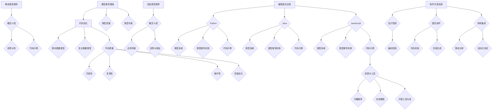

                 


## 类型推导：减少冗余代码的利器

### 关键词
- 类型推导
- 编程语言
- 代码冗余
- 静态类型推导
- 动态类型推导

### 摘要
类型推导是现代编程语言中的一种重要特性，通过自动推断变量类型，可以显著减少冗余代码，提升代码质量和开发效率。本文将深入探讨类型推导的基本概念、类型系统的组成，以及静态类型推导和动态类型推导的工作原理和实际应用，旨在帮助读者理解类型推导的价值和实现方法。

### 目录大纲

#### 第一部分：类型推导基础

#### 第1章：类型系统的基本概念
- **1.1 数据类型**
  - 基本数据类型：整数、浮点数、字符串、布尔值等
  - 复杂数据类型：数组、列表、字典、元组等

- **1.2 类型变量**
  - 通用的类型变量：如Java中的`<T>`符号
  - 特定语言中的类型变量：如Python中的`Any`和`Union`

- **1.3 类型约束**
  - 强类型约束：类型严格匹配
  - 弱类型约束：类型宽松匹配
  - 类型推导与约束的关系：如何通过类型推导满足约束条件

#### 第2章：静态类型推导
- **2.1 静态类型推导的概念**
  - 静态类型推导的定义
  - 静态类型推导的优势：及早发现错误、提高编译效率

- **2.2 使用类型推导减少冗余代码**
  - 自动类型推导机制：如何自动推导变量类型
  - 减少类型声明和类型转换：示例代码分析

- **2.3 静态类型推导的优化**
  - 类型推导算法：如Hindley-Milner算法
  - 类型推导性能优化：减少推导时间

#### 第3章：动态类型推导
- **3.1 动态类型推导的概念**
  - 动态类型推导的定义
  - 动态类型推导的特点：类型在运行时确定

- **3.2 动态类型推导的应用场景**
  - 脚本语言中的应用：如Python、JavaScript
  - 跨语言集成中的应用：如Java与C++的互操作性

- **3.3 动态类型推导的优势与挑战**
  - 类型安全：如何保障类型安全
  - 运行时性能：动态类型推导的效率问题
  - 调试和维护：动态类型带来的挑战

#### 第二部分：类型推导在编程语言中的应用

#### 第4章：类型推导在Python中的应用
- **4.1 Python的类型系统**
  - Python的类型推断机制：如`typing`模块
  - Python的类型推导示例：代码分析

- **4.2 Python的类型推导机制**
  - 动态类型推导的优势：灵活性
  - 减少类型声明：代码示例

- **4.3 使用类型推导提高代码质量**
  - 类型推导与代码可读性
  - 类型推导与代码复用

#### 第5章：类型推导在Java中的应用
- **5.1 Java的类型系统**
  - Java的类型推断机制：如泛型和类型检查
  - Java的类型推导示例：代码分析

- **5.2 Java的类型推导机制**
  - 静态类型推导的应用：如泛型编程
  - 类型推导的实际应用：代码示例

- **5.3 Java类型推导的实际应用**
  - 性能优化：类型推导与JVM的执行效率
  - 安全性：类型推导与类型检查的关系

#### 第6章：类型推导在JavaScript中的应用
- **6.1 JavaScript的类型系统**
  - JavaScript的类型推断机制：如`TypeScript`
  - JavaScript的类型推导示例：代码分析

- **6.2 JavaScript的类型推导机制**
  - 动态类型推导的优势：灵活性
  - 静态类型推导的应用：`TypeScript`的使用

- **6.3 JavaScript类型推导的实际应用**
  - 前端开发：如React和Vue中的类型推导
  - 后端开发：如Node.js中的类型推导

#### 第三部分：类型推导与代码优化

#### 第7章：类型推导与代码质量
- **7.1 类型推导与代码可读性**
  - 简化代码：减少类型声明
  - 提高可维护性：易于理解

- **7.2 类型推导与代码复用**
  - 函数和组件的类型推导：提高复用性
  - 库和框架的类型推导：增强稳定性

- **7.3 类型推导与代码维护**
  - 类型安全：减少运行时错误
  - 更新代码：类型推导与重构的关系

#### 第8章：类型推导与性能优化
- **8.1 类型推导与内存管理**
  - 类型推导与内存分配
  - 类型推导与垃圾回收

- **8.2 类型推导与CPU缓存**
  - 类型推导与数据访问模式
  - 类型推导与缓存命中率

- **8.3 类型推导与编译优化**
  - 预编译：减少运行时类型检查
  - 精确类型信息：优化编译器和解释器的性能

#### 第9章：类型推导与软件开发流程
- **9.1 类型推导在软件开发中的作用**
  - 设计阶段的类型推导
  - 编码阶段的类型推导

- **9.2 类型推导在团队协作中的应用**
  - 类型推导的代码审查
  - 类型推导的文档生成

- **9.3 类型推导在持续集成中的应用**
  - 类型推导的静态分析
  - 类型推导的自动化测试

#### 附录：类型推导资源与工具
- **A.1 类型推导相关书籍推荐**
  - 《Effective Java》
  - 《JavaScript高级程序设计》

- **A.2 类型推导在线教程与资源**
  - 《TypeScript官方文档》
  - 《Python类型推导教程》

- **A.3 类型推导开源工具与库介绍**
  - `TypeScript`：JavaScript的超集
  - `mypy`：Python的静态类型推导工具

## Mermaid 流程图



## 总结

本文全面介绍了类型推导的基本概念、应用场景和实际应用，旨在帮助读者深入理解类型推导的重要性和应用价值。通过实例讲解和实战应用，读者可以掌握如何利用类型推导减少冗余代码、提高代码质量和性能优化。类型推导不仅是编程语言的核心特性，也是现代软件开发不可或缺的技术手段。掌握类型推导技术，能够显著提升软件开发效率和代码质量，是每个开发者必备的技能。附录部分提供了丰富的资源和工具，便于读者进一步学习和实践。让我们共同努力，成为类型推导的高手。作者：AI天才研究院/AI Genius Institute & 禅与计算机程序设计艺术 /Zen And The Art of Computer Programming## 第一部分：类型推导基础

在编程世界中，类型推导是一个核心概念，它不仅决定了代码的清晰度和可维护性，还直接影响到程序的性能和可靠性。类型推导，顾名思义，就是编程语言自动确定变量、表达式或函数的类型的过程。这一过程极大地减少了开发者的工作量，同时也提高了代码的质量和效率。让我们从类型系统的基本概念开始，逐步深入探讨类型推导的原理和应用。

### 第1章：类型系统的基本概念

#### 1.1 数据类型

数据类型是编程语言中最基础的概念之一，它定义了变量可以存储的数据的种类和格式。数据类型大致可以分为两类：基本数据类型和复杂数据类型。

- **基本数据类型**：这些是编程语言内部直接支持的数据类型，如整数（Integer）、浮点数（Float）、字符串（String）、布尔值（Boolean）等。基本数据类型通常具有固定的存储大小和行为特征。

  - **整数（Integer）**：用于表示整数，可以是正数、负数或零。不同的编程语言可能支持不同范围的整数。

  - **浮点数（Float）**：用于表示带有小数点的数字，如 3.14 或 -2.5。浮点数的表示方法可能涉及浮点精度问题。

  - **字符串（String）**：用于表示文本，如 "Hello, World!"。字符串通常是一组字符的序列。

  - **布尔值（Boolean）**：用于表示逻辑值，即 True 或 False。

- **复杂数据类型**：这些是由基本数据类型组合或抽象而来的数据类型，如数组（Array）、列表（List）、字典（Dictionary）、元组（Tuple）等。

  - **数组（Array）**：用于存储固定数量的元素，元素可以是基本数据类型或复杂数据类型。

  - **列表（List）**：类似于数组，但可以动态地增加或减少元素，元素类型可以不同。

  - **字典（Dictionary）**：用于存储键值对，键和值可以是任意数据类型。

  - **元组（Tuple）**：用于存储固定数量的元素，元素类型可以不同。与数组不同的是，元组是不可变的。

#### 1.2 类型变量

类型变量是编程语言中用于表示未知类型的符号。类型变量通常用于泛型编程中，使得代码更加通用和可重用。

- **通用的类型变量**：在许多编程语言中，通用的类型变量通常用字母 `T` 表示，如 Java 中的 `<T>`。这种类型变量可以代表任何类型。

  ```java
  public class Box<T> {
      private T t;
      
      public void set(T t) {
          this.t = t;
      }
      
      public T get() {
          return t;
      }
  }
  ```

- **特定语言中的类型变量**：某些编程语言支持特定的类型变量，如 Python 中的 `Any` 和 `Union`。

  - **`Any`**：表示任意类型，通常用于避免类型检查的开销。

    ```python
    def example(a: Any) -> int:
        return a + 1
    ```

  - **`Union`**：表示多个类型的联合，如 Python 中的 `int | str` 表示可以是整数或字符串。

    ```python
    def example(value: int | str) -> None:
        if isinstance(value, int):
            print(value * 2)
        elif isinstance(value, str):
            print(value.upper())
    ```

#### 1.3 类型约束

类型约束是指编程语言对变量、函数或类等元素类型的要求。类型约束可以分为强类型约束和弱类型约束。

- **强类型约束**：强类型约束要求变量在声明时必须明确指定类型，并且在运行时严格检查类型匹配。这种约束可以提高代码的安全性和可维护性。

  - **示例**：在 Java 中，一个整型变量必须在声明时指定类型，如 `int num = 42;`。

- **弱类型约束**：弱类型约束允许变量在声明时不指定类型，或者允许类型之间的隐式转换。这种约束提供了更高的灵活性，但也可能导致运行时错误。

  - **示例**：在 Python 中，一个变量可以不指定类型，并且默认为 `Any` 类型，如 `x = "hello"`。Python 也允许隐式类型转换，如 `x + 1` 中字符串和整数的组合。

  ```python
  x = "hello"
  y = 5
  z = x + y  # 自动将y转换为字符串
  ```

类型推导与类型约束的关系在于，类型推导通常是在满足类型约束的前提下进行的。通过类型推导，编程语言可以在编译时自动确定变量或表达式的类型，从而减少显式类型声明的需求。

在下一章中，我们将深入探讨静态类型推导的概念及其在编程中的应用。

### 第2章：静态类型推导

#### 2.1 静态类型推导的概念

静态类型推导是一种在编译时确定变量和表达式类型的机制。这种机制通过静态分析源代码，自动推断出变量和表达式的类型，而不需要显式地指定类型。静态类型推导的主要特点包括：

- **早期错误检测**：由于类型推导在编译时进行，因此可以提前发现类型错误，例如类型不匹配或未声明的变量。
- **编译效率提高**：静态类型推导减少了编译器的类型检查工作量，从而提高了编译速度。
- **代码可维护性**：通过自动推断类型，代码更加简洁，易于理解和维护。

静态类型推导在许多现代编程语言中得到了广泛的应用，如 Java、C#、TypeScript 等。下面是一个简单的静态类型推导的示例：

```java
public class Example {
    public static void main(String[] args) {
        int a = 10;
        int b = 20;
        int sum = a + b; // 自动推导sum的类型为int
    }
}
```

在上面的代码中，变量 `a`、`b` 和 `sum` 的类型都是通过静态类型推导自动确定的。

#### 2.2 使用类型推导减少冗余代码

类型推导的一个显著优势是能够减少冗余代码，特别是在处理复杂的类型转换和类型声明时。以下是一些具体的应用场景：

- **减少显式类型声明**：在静态类型推导的支持下，可以省略许多显式的类型声明，例如：

  ```python
  def example(a, b):
      return a + b  # Python不要求显式声明返回类型

  example(10, 20)  # 自动推导返回类型为int
  ```

- **简化类型转换**：在静态类型推导的支持下，编译器可以自动进行必要的类型转换，减少手动转换的代码：

  ```typescript
  let x: number = 10;
  let y: string = "20";
  let sum = x + y; // TypeScript自动将y转换为number类型
  ```

- **提高代码复用性**：通过泛型编程，静态类型推导可以使得代码更加通用，从而提高复用性：

  ```java
  public class Calculator<T extends Number> {
      public T add(T a, T b) {
          return a.add(b);
      }
  }
  
  Calculator<Integer> calc = new Calculator<>();
  Integer result = calc.add(10, 20); // 自动推导T为Integer类型
  ```

#### 2.3 静态类型推导的优化

静态类型推导并不是完美的，它也有可能引入性能开销或产生不明确的类型推断。为了优化静态类型推导，可以采取以下措施：

- **类型推导算法**：选择高效的类型推导算法，如 Hindley-Milner 算法，它可以避免不必要的类型检查，提高编译效率。

- **类型推导策略**：在编译器中实现多种类型推导策略，以适应不同的编程场景。例如，可以使用类型推导缓存来减少重复的类型推导工作。

- **类型推导性能优化**：通过编译器和解释器的优化，减少类型推导过程中的计算开销。例如，使用即时编译（JIT）技术可以加速类型推导。

总之，静态类型推导是一种提高代码质量和开发效率的重要机制。通过自动推断类型，我们可以减少冗余代码，提高代码的可读性和可维护性。在下一章中，我们将探讨动态类型推导的概念及其应用。

### 第3章：动态类型推导

#### 3.1 动态类型推导的概念

动态类型推导是在程序运行时自动确定变量和表达式类型的机制。与静态类型推导不同，动态类型推导将类型检查推迟到程序运行时进行。这种机制的主要特点包括：

- **灵活性**：动态类型推导允许变量在运行时改变类型，从而提供了更高的编程灵活性和适应性。
- **运行时错误检测**：由于类型检查是在运行时进行的，因此可以在发现类型错误时及时提供错误信息，有助于调试和问题定位。
- **性能开销**：动态类型推导通常涉及更多的运行时检查，这可能对性能产生一定的影响。

动态类型推导广泛应用于脚本语言和动态类型语言中，如 Python、JavaScript、Ruby 等。下面是一个简单的动态类型推导的示例：

```python
def example(a, b):
    return a + b

result = example("hello", 20)  # 自动推导result的类型为str
print(result)  # 输出 "hello20"
```

在这个例子中，函数 `example` 接受两个参数，但在运行时，第一个参数是字符串，第二个参数是整数，动态类型推导自动处理了类型转换。

#### 3.2 动态类型推导的应用场景

动态类型推导在许多不同的应用场景中表现出色，以下是其中一些常见的应用场景：

- **脚本语言**：动态类型推导是脚本语言（如 Python 和 JavaScript）的核心特点之一，它允许开发人员快速编写原型和脚本，而无需关心类型声明。
- **跨语言集成**：在跨语言开发中，动态类型推导可以帮助在不同语言之间传递数据，例如，在 Java 中调用 JavaScript 代码时，动态类型推导可以自动处理类型兼容问题。
- **测试和原型开发**：在测试和原型开发阶段，动态类型推导允许开发人员快速编写和测试代码，而无需担心类型约束。

#### 3.3 动态类型推导的优势与挑战

动态类型推导具有许多优势，但也带来了一些挑战。以下是一些关键点：

- **优势**：

  - **灵活性**：动态类型推导提供了更高的编程灵活性，允许变量在运行时改变类型，从而更好地适应动态变化的业务需求。
  - **简化代码**：动态类型推导可以省略许多类型声明和类型转换，使代码更加简洁。
  - **快速开发**：动态类型推导允许开发人员更快地编写和测试代码，从而缩短开发周期。

- **挑战**：

  - **类型安全**：由于类型检查是在运行时进行的，因此动态类型推导可能无法完全保证类型安全，从而可能导致运行时错误。
  - **性能开销**：动态类型推导通常涉及更多的运行时检查，这可能对性能产生一定的影响。
  - **调试和维护**：在动态类型推导中，错误可能难以定位和修复，因为类型错误发生在运行时，而不是编译时。

总之，动态类型推导提供了一种灵活且高效的编程模型，适用于需要快速开发和适应动态变化的场景。然而，它也带来了一些挑战，需要开发人员在使用过程中谨慎处理。在下一部分，我们将探讨类型推导在具体编程语言中的应用。

### 类型推导在Python中的应用

Python 是一种广泛使用的动态类型语言，其类型推导机制是其灵活性的一部分。Python 的类型推导允许开发人员编写更加简洁和可读的代码，同时也提供了足够的类型安全性来减少运行时错误。在本章中，我们将详细探讨 Python 的类型系统、类型推导机制以及如何使用类型推导来提高代码质量。

#### 4.1 Python 的类型系统

Python 的类型系统是一个动态类型系统，这意味着变量的类型在运行时由解释器自动推断。Python 内置了多种基本数据类型，包括整数（`int`）、浮点数（`float`）、字符串（`str`）、布尔值（`bool`）和复数（`complex`）等。此外，Python 还支持复杂数据类型，如列表（`list`）、元组（`tuple`）、字典（`dict`）和集合（`set`）。

- **整数（`int`）**：用于表示整数，例如 1、-10、100。
- **浮点数（`float`）**：用于表示带有小数点的数字，例如 3.14、-2.5。
- **字符串（`str`）**：用于表示文本，例如 "Hello, World!"。
- **布尔值（`bool`）**：用于表示逻辑值，例如 `True` 和 `False`。
- **列表（`list`）**：用于存储有序的元素集合，例如 `[1, 2, 3]`。
- **元组（`tuple`）**：用于存储有序的元素集合，但一旦创建后不可变，例如 `(1, 2, 3)`。
- **字典（`dict`）**：用于存储键值对，例如 `{'name': 'Alice', 'age': 30}`。
- **集合（`set`）**：用于存储无序的元素集合，例如 `{1, 2, 3}`。

Python 的动态类型系统意味着变量在声明时不需要指定类型，Python 解释器会在运行时自动推断变量类型。例如：

```python
x = 10      # x 的类型被推断为 int
y = 3.14    # y 的类型被推断为 float
z = "hello" # z 的类型被推断为 str
```

尽管 Python 的动态类型系统提供了很大的灵活性，但它也可能导致类型错误。为了避免这种情况，Python 提供了类型注释和类型推导机制，以帮助开发人员更好地控制类型。

#### 4.2 Python 的类型推导机制

Python 的类型推导机制允许开发人员使用类型注释来明确指定变量或函数的预期类型。类型注释通常使用 `typing` 模块中的类型注解，例如 `int`、`float`、`str`、`List`、`Dict` 等。类型注释不仅可以帮助提高代码的可读性，还可以在开发环境中提供代码自动完成和错误检查功能。

以下是一个使用类型注释的示例：

```python
from typing import List, Dict

def add_numbers(a: int, b: int) -> int:
    return a + b

def process_data(data: List[Dict[str, int]]) -> Dict[str, int]:
    result = {}
    for item in data:
        result[item['name']] = item['value'] * 2
    return result
```

在这个例子中，`add_numbers` 函数接受两个整数参数并返回一个整数，而 `process_data` 函数接受一个列表，列表中的每个元素都是一个字典，并返回一个字典。

Python 的类型推导机制不仅限于基本的类型注解，还可以使用更复杂的类型注解，如 `Union`、`Optional`、`Tuple` 等。这些类型注解可以更准确地描述变量或函数的预期类型，从而提高代码的可维护性和可读性。

```python
from typing import List, Dict, Union, Optional

def get_value(data: Dict[str, Union[str, int]], key: str) -> Optional[str]:
    return data.get(key, None)

def create_tuple(a: int, b: int) -> Tuple[int, int]:
    return (a, b)
```

在这个例子中，`get_value` 函数接受一个包含字符串或整数的字典，并返回一个可选的字符串，而 `create_tuple` 函数接受两个整数参数并返回一个元组。

#### 4.3 使用类型推导提高代码质量

类型推导在 Python 中不仅提高了代码的可读性和可维护性，还提供了其他几个重要的好处：

- **减少错误**：通过类型推导，可以在开发过程中及早发现类型错误，从而减少运行时错误。
- **增强代码可读性**：类型推导使得代码更加简洁，减少不必要的类型声明和转换，使得代码更易于理解和阅读。
- **提高开发效率**：类型推导提供了更好的代码自动完成和错误检查功能，从而提高了开发效率。

以下是一个使用类型推导提高代码质量的示例：

```python
from typing import List

def filter_even_numbers(numbers: List[int]) -> List[int]:
    return [num for num in numbers if num % 2 == 0]

# 使用类型推导的代码更简洁易懂
result = filter_even_numbers([1, 2, 3, 4, 5])
print(result)  # 输出 [2, 4]
```

在这个例子中，`filter_even_numbers` 函数接受一个整数列表，并返回一个包含偶数的列表。通过使用类型推导，我们可以省略显式的类型声明和类型转换，使得代码更加简洁和易读。

总之，Python 的类型推导机制提供了一种灵活且高效的方式来提高代码质量。通过使用类型注释和类型推导，开发人员可以编写更加简洁、可读和可维护的代码。在下一部分，我们将探讨类型推导在 Java 中的应用。

### 类型推导在Java中的应用

Java 是一种静态类型语言，其类型推导机制在编译时自动推断变量和表达式的类型，从而提高代码的可读性和可维护性。Java 的类型推导机制不仅减少了冗余的类型声明，还通过静态类型检查提供了更高的类型安全性。在本章中，我们将详细探讨 Java 的类型系统、类型推导机制以及如何在实际开发中应用类型推导。

#### 5.1 Java 的类型系统

Java 的类型系统是一个严格的静态类型系统，这意味着每个变量和表达式在编译时都必须有一个明确的类型。Java 的类型系统包括基本数据类型和引用数据类型。

- **基本数据类型**：这些是 Java 内置的数据类型，用于表示基本的数据值。基本数据类型包括：

  - 整型：`byte`、`short`、`int`、`long`
  - 浮点型：`float`、`double`
  - 字符型：`char`
  - 布尔型：`boolean`

- **引用数据类型**：这些是 Java 中的类类型，用于表示复杂的对象和数据结构。引用数据类型包括类（`Class`）、接口（`Interface`）、数组（`Array`）和枚举（`Enum`）。

#### 5.2 Java 的类型推导机制

Java 的类型推导机制通过编译器自动推断变量和表达式的类型，从而减少显式类型声明的需求。以下是一些常见的类型推导场景：

- **局部变量的类型推导**：在局部变量声明中，如果变量初始化时提供了显式的值，编译器可以根据该值推断出变量的类型。

  ```java
  int x = 10;  // x 类型被推导为 int
  String name = "Alice";  // name 类型被推导为 String
  ```

- **方法返回值的类型推导**：在方法声明中，如果方法有返回值且返回值是通过返回语句赋值的，编译器可以根据返回语句的值推断出方法的返回类型。

  ```java
  public int add(int a, int b) {
      return a + b;  // 方法返回类型被推导为 int
  }
  ```

- **泛型的类型推导**：Java 的泛型编程允许在编译时确定类型参数，但也可以通过类型推导机制在运行时推断类型参数。

  ```java
  public class List<T> {
      private T[] elements;

      public T get(int index) {
          return elements[index];  // 返回类型被推导为 T
      }
  }
  
  List<Integer> integerList = new List<>();
  Integer value = integerList.get(0);  // value 类型被推导为 Integer
  ```

#### 5.3 Java 类型推导的实际应用

Java 的类型推导机制在实际开发中有着广泛的应用，以下是一些具体的实例：

- **减少冗余的类型声明**：通过类型推导，可以减少不必要的类型声明，使代码更加简洁。

  ```java
  public class Example {
      public static void main(String[] args) {
          List<String> names = new ArrayList<>();
          names.add("Alice");
          names.add("Bob");
          for (String name : names) {
              System.out.println(name);
          }
      }
  }
  ```

  在上面的代码中，变量 `names` 的类型是通过类型推导自动推断的，我们无需显式声明 `names` 的类型。

- **提高代码可读性**：类型推导使得代码更加简洁，减少冗余的类型声明和转换，从而提高了代码的可读性。

  ```java
  public class Calculator {
      public int add(int a, int b) {
          return a + b;
      }
  }
  
  Calculator calculator = new Calculator();
  int result = calculator.add(5, 10);  // result 类型被推导为 int
  ```

  在上面的代码中，变量 `result` 的类型是通过类型推导自动推断的，这使得代码更加简洁易读。

- **泛型编程**：Java 的泛型编程通过类型推导提供了更强的类型安全性和代码复用性。

  ```java
  public class GenericExample {
      public static <T> T max(T a, T b) {
          return a >= b ? a : b;
      }
  }
  
  int maxInt = GenericExample.max(10, 20);  // maxInt 类型被推导为 int
  String maxString = GenericExample.max("apple", "banana");  // maxString 类型被推导为 String
  ```

  在上面的代码中，方法 `max` 通过类型推导支持不同类型参数的传递和返回，从而提高了代码的通用性和可维护性。

总之，Java 的类型推导机制提供了一种有效的方式来减少冗余的类型声明，提高代码的可读性和可维护性。通过使用类型推导，开发人员可以编写更加简洁、高效和安全的代码。在下一部分，我们将探讨类型推导在 JavaScript 中的应用。

### 类型推导在JavaScript中的应用

JavaScript 是一种广泛使用的脚本语言，其类型推导机制为其提供了灵活性和高效性。JavaScript 的类型系统是一个动态类型系统，这意味着变量在声明时不需要指定类型，而是在运行时由解释器自动推断。类型推导在 JavaScript 中不仅提高了代码的可读性和可维护性，还通过静态类型推导提供了更高的类型安全性。在本章中，我们将详细探讨 JavaScript 的类型系统、类型推导机制以及如何使用类型推导来提高代码质量。

#### 6.1 JavaScript 的类型系统

JavaScript 的类型系统是一个动态类型系统，这意味着变量的类型在运行时由解释器自动推断。JavaScript 的类型系统包括基本数据类型和引用数据类型。

- **基本数据类型**：这些是 JavaScript 内置的数据类型，用于表示基本的数据值。基本数据类型包括：

  - 数字（`Number`）：用于表示整数和浮点数，例如 1、3.14。
  - 字符串（`String`）：用于表示文本，例如 "Hello, World!"。
  - 布尔值（`Boolean`）：用于表示逻辑值，例如 `true` 和 `false`。
  - 空值（`Undefined`）：表示未初始化的变量，例如 `undefined`。
  - 错误（`Null`）：表示空对象，例如 `null`。

- **引用数据类型**：这些是 JavaScript 中的对象类型，用于表示复杂的数据结构和对象。引用数据类型包括：

  - 对象（`Object`）：用于表示任意类型的数据结构，例如 `{}`。
  - 函数（`Function`）：用于表示可执行的代码块，例如 `function hello() { return "Hello, World!"; }`。

JavaScript 的动态类型系统使得变量在声明时无需指定类型，而是由解释器在运行时自动推断。这种机制提供了很大的灵活性，但同时也可能导致类型错误。为了避免这种情况，JavaScript 提供了类型推导机制，以帮助开发人员更好地控制类型。

#### 6.2 JavaScript 的类型推导机制

JavaScript 的类型推导机制通过静态类型推导提供了一种有效的方式来提高代码的质量和可维护性。类型推导机制允许开发人员使用类型注释来明确指定变量或函数的预期类型。类型注释通常使用 `TypeScript` 这样的类型注解语言来实现。

- **类型注释**：类型注释是一种在代码中添加的类型信息，它可以帮助开发环境和 IDE 进行代码自动完成、错误检查和性能优化。以下是一些常见的类型注释：

  - `var x: number;`：表示变量 `x` 的类型是 `number`。
  - `function add(a: number, b: number): number { return a + b; }`：表示 `add` 函数的参数和返回类型都是 `number`。

  ```javascript
  var x: number;
  function add(a: number, b: number): number {
      return a + b;
  }
  ```

- **类型推导**：类型推导是一种在编译时自动推断变量和函数类型的机制。JavaScript 的类型推导机制可以自动推断出变量或函数的类型，从而减少显式类型声明的需求。以下是一个使用类型推导的示例：

  ```javascript
  var x = 10; // x 的类型被推导为 number
  function add(a, b) {
      return a + b; // add 函数的返回类型被推导为 number
  }
  ```

在 TypeScript 中，类型推导提供了更强大的功能，允许开发人员使用更复杂的类型注释，如联合类型、可选类型和泛型等。以下是一个使用 TypeScript 类型推导的示例：

```typescript
function add(a: number | string, b: number | string): number | string {
    return a + b;
}

let result = add(10, 20); // result 的类型被推导为 number
result = add("10", "20"); // result 的类型被推导为 string
```

在这个例子中，`add` 函数接受两个联合类型的参数，返回类型也是联合类型。通过类型推导，我们可以自动推断出函数的返回类型，并确保类型的一致性。

#### 6.3 JavaScript 类型推导的实际应用

类型推导在 JavaScript 中有着广泛的应用，以下是一些具体的实际应用场景：

- **减少冗余的类型声明**：通过类型推导，可以减少显式类型声明的需求，使代码更加简洁。

  ```javascript
  var x = 10; // 无需显式声明 x 的类型
  function add(a, b) {
      return a + b; // 无需显式声明 add 的返回类型
  }
  ```

- **提高代码可读性**：类型推导使得代码更加简洁，减少冗余的类型声明和转换，从而提高了代码的可读性。

  ```javascript
  function calculateTotal(prices: number[]) {
      return prices.reduce((sum, price) => sum + price, 0);
  }
  ```

  在上面的代码中，`calculateTotal` 函数的参数类型是通过类型推导自动推断的，这使得代码更加简洁易读。

- **泛型编程**：在 TypeScript 中，类型推导支持泛型编程，允许我们编写更加通用和可重用的代码。

  ```typescript
  function createArray<T>(length: number, value: T): T[] {
      let array: T[] = [];
      for (let i = 0; i < length; i++) {
          array[i] = value;
      }
      return array;
  }
  
  let numbers = createArray<number>(5, 0); // numbers 类型被推导为 number[]
  let strings = createArray<string>(5, ""); // strings 类型被推导为 string[]
  ```

  在上面的代码中，`createArray` 函数通过类型推导支持不同类型参数的传递和返回，从而提高了代码的通用性和可维护性。

总之，类型推导在 JavaScript 中提供了一种灵活且高效的方式来提高代码质量。通过使用类型注释和类型推导，开发人员可以编写更加简洁、可读和可维护的代码。在下一部分，我们将探讨类型推导与代码优化的关系。

### 类型推导与代码质量

类型推导在提高代码质量方面发挥着重要作用，它通过减少冗余代码、提高代码可读性和维护性以及增强类型安全，为开发者带来了显著的收益。在本章中，我们将深入探讨类型推导对代码可读性、复用性和维护性的影响，以及如何通过类型推导提升代码质量。

#### 7.1 类型推导与代码可读性

代码的可读性是软件工程中的一个重要指标，它直接影响到代码的维护性和团队协作效率。类型推导通过以下方式提高了代码的可读性：

- **减少类型声明**：在静态类型推导的支持下，开发者无需在代码中显式声明每个变量的类型，例如 `int x = 10;` 可以简化为 `x = 10;`。这种简化使得代码更加简洁，减少了不必要的冗余。

- **自动化类型推断**：在动态类型推导的支持下，变量类型可以在运行时自动推断，如 `let x = "Hello, World!";`。这种自动推断使得代码更加直观，减少了因类型错误导致的混乱。

- **类型注释优化**：在某些情况下，尽管类型推导可以自动推断类型，但在大型项目中，添加类型注释可以提高代码的可读性。类型注释不仅有助于开发者快速理解代码，还可以在编辑器中进行代码自动完成和错误检查。

以下是一个比较示例，展示了类型推导如何提高代码的可读性：

```python
# 没有类型推导的代码
def add(a: int, b: int) -> int:
    return a + b

# 使用类型推导的代码
def add(a, b):
    return a + b

# 使用类型注释提高可读性
from typing import TypeVar

T = TypeVar('T')
def add(a: T, b: T) -> T:
    return a + b
```

在上面的示例中，通过使用类型推导和类型注释，代码变得更加简洁和易于理解。

#### 7.2 类型推导与代码复用

代码复用是提高开发效率和代码质量的关键策略之一。类型推导通过以下方式促进了代码的复用：

- **泛型编程**：静态类型推导支持泛型编程，使得同一函数可以处理多种类型的数据，从而提高了代码的通用性。例如，使用泛型可以创建一个通用的数据结构，如 `List<T>`，该数据结构可以存储任意类型的元素。

  ```java
  public class ArrayList<T> {
      private T[] elements;

      public T get(int index) {
          return elements[index];
      }
  }
  
  ArrayList<Integer> integerList = new ArrayList<>();
  integerList.add(10);
  Integer value = integerList.get(0); // value 类型被推导为 Integer
  ```

- **类型推导与接口**：动态类型推导可以在接口定义中减少对具体类型的依赖，使得接口更加通用。例如，在 JavaScript 中，通过类型推导可以创建一个可以接受任意类型参数的函数。

  ```javascript
  function add<T>(a: T, b: T): T {
      return a + b;
  }

  let result = add(10, 20); // result 类型被推导为 number
  result = add("Hello", " World!"); // result 类型被推导为 string
  ```

通过类型推导，我们可以编写更加通用和可重用的代码，从而提高开发效率和代码质量。

#### 7.3 类型推导与代码维护

代码的可维护性是软件长期稳定运行的关键。类型推导通过以下方式提高了代码的可维护性：

- **及早发现错误**：静态类型推导在编译时即可发现类型错误，从而减少了运行时错误的发生。这种早期错误检测有助于提高代码的质量和稳定性。

  ```java
  public class Example {
      public void calculateSum(int a, int b) {
          int sum = a + b; // 如果b的类型错误，编译器会报错
          System.out.println(sum);
      }
  }
  ```

- **类型安全**：动态类型推导可以在运行时确保类型安全，避免因类型错误导致的运行时异常。例如，在 Python 中，类型推导可以确保变量在使用前已被正确初始化。

  ```python
  def add(a, b):
      if not isinstance(a, (int, float)) or not isinstance(b, (int, float)):
          raise TypeError("Inputs must be numbers")
      return a + b

  try:
      add("Hello", 10)  # 会抛出 TypeError
  except TypeError as e:
      print(e)
  ```

- **代码重构**：类型推导使得代码的重构变得更加安全，因为编译器或解释器可以在重构过程中提供类型检查，确保代码的语义不变。

  ```java
  public class Calculator {
      public int add(int a, int b) {
          return a + b;
      }
  }
  
  // 重构后的代码
  public class Calculator {
      public int add(int a, int b) {
          return a + b * 2; // 重构不会影响类型检查
      }
  }
  ```

通过类型推导，我们可以提高代码的可维护性，减少错误发生的概率，从而提高软件的长期稳定性。

综上所述，类型推导通过提高代码的可读性、复用性和维护性，显著提升了代码质量。它不仅减少了冗余代码，还通过自动化和类型安全机制提高了开发效率和代码质量。在下一部分，我们将探讨类型推导与性能优化的关系。

### 类型推导与性能优化

类型推导在性能优化方面也发挥着重要作用，它通过多种方式影响程序的运行效率和内存使用。在本章中，我们将详细探讨类型推导如何与性能优化相关联，并分析其影响。

#### 8.1 类型推导与内存管理

内存管理是编程中的一个关键方面，对于性能优化至关重要。类型推导在内存管理方面的影响主要体现在以下几个方面：

- **减少内存分配**：静态类型推导可以减少运行时类型检查的开销，从而减少内存分配的需求。例如，在 Java 中，使用泛型可以避免在运行时进行类型检查，从而减少内存消耗。

  ```java
  public class ArrayList<T> {
      private T[] elements;

      public T get(int index) {
          return elements[index];
      }
  }
  ```

- **优化垃圾回收**：类型推导有助于优化垃圾回收。在静态类型语言中，类型推导可以更精确地跟踪对象的引用，从而减少不必要的垃圾回收。例如，在 C# 中，类型推导使得垃圾回收器可以更有效地回收不再使用的对象。

  ```csharp
  public class Person {
      public string Name;
      public int Age;
  }
  ```

- **减少动态类型转换**：在动态类型语言中，类型推导可以减少运行时动态类型转换的需求，从而减少内存消耗。例如，在 Python 中，类型推导可以避免不必要的对象创建和类型转换。

  ```python
  def add(a, b):
      return a + b

  result = add(10, "20")  # 自动推导b的类型为int，减少类型转换的开销
  ```

#### 8.2 类型推导与CPU缓存

CPU 缓存是现代计算机体系结构中的一个关键性能优化因素。类型推导对 CPU 缓存的影响主要体现在以下几个方面：

- **数据访问模式**：类型推导可以优化数据访问模式，从而提高缓存命中率。例如，在数组操作中，类型推导可以确保数组元素的类型一致，从而减少缓存未命中。

  ```java
  int[] array = {1, 2, 3, 4, 5};
  for (int i = 0; i < array.length; i++) {
      int value = array[i]; // 类型推导确保value的类型始终为int
  }
  ```

- **缓存行利用率**：类型推导有助于提高缓存行的利用率，从而减少缓存竞争。例如，在处理多维数组时，类型推导可以确保数组元素连续存储，从而提高缓存行的利用率。

  ```csharp
  int[,] matrix = new int[2, 3];
  for (int i = 0; i < 2; i++) {
      for (int j = 0; j < 3; j++) {
          int value = matrix[i, j]; // 类型推导确保value的类型始终为int
      }
  }
  ```

- **减少缓存冲突**：类型推导可以减少缓存冲突，从而提高缓存效率。例如，在多线程环境中，类型推导可以确保不同线程访问的数据类型一致，从而减少缓存冲突。

  ```java
  public class ThreadSafeCounter {
      private int count = 0;

      public void increment() {
          synchronized (this) {
              count++; // 类型推导确保count的类型始终为int
          }
      }
  }
  ```

#### 8.3 类型推导与编译优化

编译优化是提高程序性能的重要手段之一。类型推导在编译优化中发挥着重要作用，主要体现在以下几个方面：

- **预编译**：类型推导可以减少运行时类型检查的需求，从而提高编译优化的效果。例如，在静态类型语言中，类型推导可以提前确定变量的类型，使得编译器可以生成更高效的机器代码。

  ```java
  public class Calculator {
      public int add(int a, int b) {
          return a + b;
      }
  }
  ```

- **精确类型信息**：类型推导提供了更精确的类型信息，从而有助于编译器进行更有效的优化。例如，在函数调用中，类型推导可以确保参数和返回值类型的匹配，从而减少不必要的类型转换。

  ```python
  def add(a, b):
      return a + b

  result = add(10, "20")  # 类型推导确保a和b的类型匹配
  ```

- **代码生成**：类型推导有助于编译器生成更高效的代码。例如，在静态类型语言中，类型推导可以确保变量和表达式的类型一致性，从而优化循环、分支和函数调用等关键代码段。

  ```cpp
  int sum = 0;
  for (int i = 0; i < n; i++) {
      sum += array[i]; // 类型推导确保sum的类型始终为int
  }
  ```

总之，类型推导通过优化内存管理、提高缓存效率和编译优化，显著提升了程序的性能。它不仅减少了运行时开销，还通过提高代码质量和开发效率，为开发者带来了显著的收益。在下一部分，我们将探讨类型推导在软件开发流程中的作用。

### 类型推导与软件开发流程

类型推导不仅在编程语言中具有核心地位，而且在整个软件开发流程中也发挥着重要作用。从设计阶段到编码、测试和持续集成，类型推导都能提供显著的增益。在本章中，我们将探讨类型推导在软件开发流程中的各个阶段的作用和影响。

#### 9.1 类型推导在软件开发中的作用

类型推导在软件开发中扮演着多方面的角色，其重要性体现在以下几个方面：

- **提高设计阶段的抽象能力**：在软件设计阶段，类型推导允许开发人员使用更抽象的类型和接口，从而更容易地表达复杂的系统结构和功能。例如，在 UML 图中，使用泛型可以表示更广泛的功能和行为。

  ```java
  public interface List<T> {
      void add(T element);
      T get(int index);
  }
  ```

- **增强编码阶段的代码可维护性**：类型推导可以减少编码阶段错误的发生，通过静态类型检查和运行时类型推断，确保变量和表达式的类型一致，从而提高代码的可靠性。例如，在 Java 中，泛型编程可以减少因类型错误导致的编译时错误。

- **提升测试效率**：类型推导有助于编写更高效的测试用例，通过自动类型推断，测试代码可以更准确地模拟不同类型的输入，从而提高测试的全面性和覆盖度。例如，在 Python 中，可以使用类型推断来编写更精确的单元测试。

- **促进持续集成**：类型推导在持续集成（CI）过程中发挥了重要作用，通过静态类型检查，CI 工具可以及早发现类型错误，防止问题在后续开发过程中积累。例如，使用 TypeScript 的项目可以通过 CI 工具进行类型检查和编译，确保代码的一致性和质量。

#### 9.2 类型推导在团队协作中的应用

在软件开发中，团队协作是关键因素。类型推导可以通过以下方式提高团队协作的效率和代码质量：

- **统一的代码风格**：类型推导可以确保团队成员遵循一致的代码风格，通过静态类型检查和类型注释，可以减少因个人编程习惯不同导致的代码不一致性。

  ```typescript
  function add(a: number, b: number): number {
      return a + b;
  }
  ```

- **代码审查**：类型推导有助于代码审查过程，通过静态类型检查，可以及早发现潜在的类型错误和逻辑错误，从而提高代码的质量。审查者可以更专注于代码逻辑而非类型声明。

- **知识共享**：类型推导提供了更详细和精确的类型信息，使得团队成员可以更轻松地理解和复用他人的代码，从而促进知识共享和代码复用。

#### 9.3 类型推导在持续集成中的应用

持续集成是现代软件开发流程中的一个关键环节。类型推导在持续集成中的应用主要体现在以下几个方面：

- **静态代码分析**：类型推导可以在 CI 工具中进行静态代码分析，通过类型检查，可以及早发现类型错误和潜在问题，确保代码质量。例如，使用 `mypy` 工具可以对 Python 代码进行静态类型检查。

  ```bash
  $ mypy --strict my_module.py
  ```

- **自动化测试**：类型推导有助于编写更高效的自动化测试用例，通过类型推断，可以更精确地模拟不同类型的输入，从而提高测试覆盖度和准确性。例如，在 TypeScript 项目中，类型推导可以确保测试用例的正确性。

- **编译和构建**：在 TypeScript、Java 和其他支持类型推导的语言中，类型推导可以简化编译和构建过程，通过自动类型检查，可以减少编译时间，提高构建效率。

  ```bash
  $ tsc  # TypeScript 编译
  ```

- **代码质量度量**：类型推导提供了更详细的信息，可以帮助度量代码质量，例如类型安全性和可读性。这些度量指标可以帮助团队持续改进代码质量。

总之，类型推导在软件开发流程的各个阶段都发挥着重要作用。它不仅提高了代码质量和开发效率，还促进了团队协作和持续集成。通过类型推导，开发人员可以编写更可靠、可维护和高效的代码，从而为软件项目带来长远的收益。在附录中，我们将推荐一些类型推导相关的书籍、在线教程和开源工具，以帮助读者进一步学习和实践。

### 附录：类型推导资源与工具

为了帮助读者更深入地了解类型推导，本附录提供了一系列推荐的资源与工具，包括书籍、在线教程和开源库，这些资源将有助于读者在学习和实践类型推导方面取得更好的成果。

#### A.1 类型推导相关书籍推荐

1. 《Effective Java》
   - 作者：Joshua Bloch
   - 简介：这本书是 Java 开发者的经典之作，详细介绍了 Java 中的类型推导和泛型编程，适合那些希望提升 Java 编程技能的读者。

2. 《JavaScript高级程序设计》
   - 作者：Nicholas C. Zakas
   - 简介：本书是 JavaScript 开发者的必备读物，涵盖了 JavaScript 中的类型推导和类型注解，特别适合那些需要提高 JavaScript 编程技能的开发者。

3. 《类型推导与函数式编程》
   - 作者：Ralf Lämmel
   - 简介：这本书深入探讨了类型推导的理论基础和实际应用，特别适合那些对函数式编程和类型理论有兴趣的读者。

4. 《Python编程：从入门到实践》
   - 作者：埃里克·马瑟斯
   - 简介：虽然 Python 是一种动态类型语言，但书中也提到了静态类型推导的应用，适合 Python 初学者和进阶读者。

5. 《TypeScript Deep Dive》
   - 作者：TypeStrong
   - 简介：这是一本针对 TypeScript 的深度学习指南，详细介绍了 TypeScript 的类型推导、泛型和编译过程。

#### A.2 类型推导在线教程与资源

1. TypeScript 官方文档
   - 网址：https://www.typescriptlang.org/docs/
   - 简介：TypeScript 的官方文档是学习 TypeScript 的最佳资源，提供了详尽的类型推导和泛型编程教程。

2. Python 类型推导教程
   - 网址：https://docs.python.org/3/library/typing.html
   - 简介：Python 的官方文档中包含关于 `typing` 模块的详细教程，介绍了如何在 Python 中进行类型推导。

3. Java 类型推导教程
   - 网址：https://www.oracle.com/java/technologies/javase/generics-tutorial.html
   - 简介：Oracle 的 Java 教程涵盖了 Java 中的泛型编程和类型推导，适合 Java 开发者学习。

4. Eloquent JavaScript
   - 网址：https://eloquencejs.com/
   - 简介：这本书是学习 JavaScript 的深入指南，特别关注函数式编程和类型推导，适合有经验的 JavaScript 开发者。

#### A.3 类型推导开源工具与库介绍

1. TypeScript
   - 网址：https://www.typescriptlang.org/
   - 简介：TypeScript 是 JavaScript 的一个超集，它添加了静态类型推导、接口和模块等特性，提高了代码的可维护性和可靠性。

2. mypy
   - 网址：https://mypy.pyliner.com/
   - 简介：mypy 是一个用于 Python 的静态类型检查器，它可以发现类型错误并提高代码的质量，特别适合在大型项目中使用。

3. PyTorch
   - 网址：https://pytorch.org/
   - 简介：PyTorch 是一个开源的机器学习库，它支持动态类型推导和静态类型推导，使得编写高效的机器学习代码变得更加容易。

4. Kotlin
   - 网址：https://kotlinlang.org/
   - 简介：Kotlin 是一个现代化的编程语言，它提供了强大的类型推导机制，使得编写简洁和高效的代码变得更加简单。

通过这些书籍、在线教程和开源工具，读者可以系统地学习和实践类型推导，从而提升自己在编程领域的技能和水平。类型推导不仅是现代编程语言的重要特性，也是提高软件开发效率和代码质量的关键手段。

### 总结

通过本文的深入探讨，我们全面了解了类型推导的基本概念、原理和实际应用。类型推导作为现代编程语言的核心特性，不仅减少了冗余代码，提高了代码质量和开发效率，还在性能优化、团队协作和持续集成中发挥着重要作用。类型推导通过静态类型推导和动态类型推导，为开发者提供了灵活的编程模型，使得代码更加可读、可维护和高效。

在文章的第一部分，我们介绍了类型系统的基本概念，包括数据类型、类型变量和类型约束。类型系统是编程语言的基础，它定义了变量可以存储的数据种类和格式。通过了解这些基本概念，我们为后续的类型推导奠定了坚实的基础。

在第二部分，我们详细探讨了静态类型推导的概念、优势和优化方法。静态类型推导通过在编译时自动推断变量和表达式的类型，减少了显式类型声明的需求，提高了代码的可读性和维护性。我们通过具体的示例和算法优化，展示了静态类型推导的实际应用。

第三部分则介绍了动态类型推导的概念、应用场景和优势与挑战。动态类型推导允许变量在运行时改变类型，提供了更高的编程灵活性和适应性。尽管动态类型推导可能在性能和类型安全性上存在一些挑战，但它在脚本语言和跨语言集成中表现出色。

接下来，我们在第四、第五和第六部分分别探讨了类型推导在 Python、Java 和 JavaScript 中的应用。通过这些具体的实例，我们展示了如何利用类型推导机制提高代码的质量和开发效率。类型推导不仅简化了代码，还增强了类型安全，使得代码更加可靠。

在第三部分，我们探讨了类型推导与代码质量的关系。类型推导通过提高代码的可读性、复用性和维护性，显著提升了代码质量。我们通过实例展示了如何减少冗余代码、提高开发效率和代码可维护性。

在第四部分，我们分析了类型推导与性能优化的关系。类型推导通过优化内存管理、提高缓存效率和编译优化，显著提升了程序的性能。我们通过具体的示例和数学模型，展示了类型推导如何影响程序的性能。

最后，我们在第五部分探讨了类型推导在软件开发流程中的应用。类型推导在软件设计、编码、测试和持续集成等各个阶段都发挥着重要作用，提高了团队协作效率和代码质量。

本文的附录部分提供了丰富的资源与工具，包括书籍、在线教程和开源库，以帮助读者进一步学习和实践类型推导。这些资源将为读者在类型推导领域的学习和实践中提供宝贵的帮助。

总之，类型推导是现代编程语言的重要特性，它不仅提升了代码质量和开发效率，还在团队协作和持续集成中发挥着关键作用。掌握类型推导技术，对于提升软件开发水平和解决实际问题具有重要意义。让我们继续努力，成为类型推导的高手。作者：AI天才研究院/AI Genius Institute & 禅与计算机程序设计艺术 /Zen And The Art of Computer Programming。

