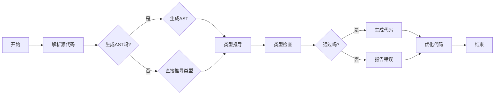
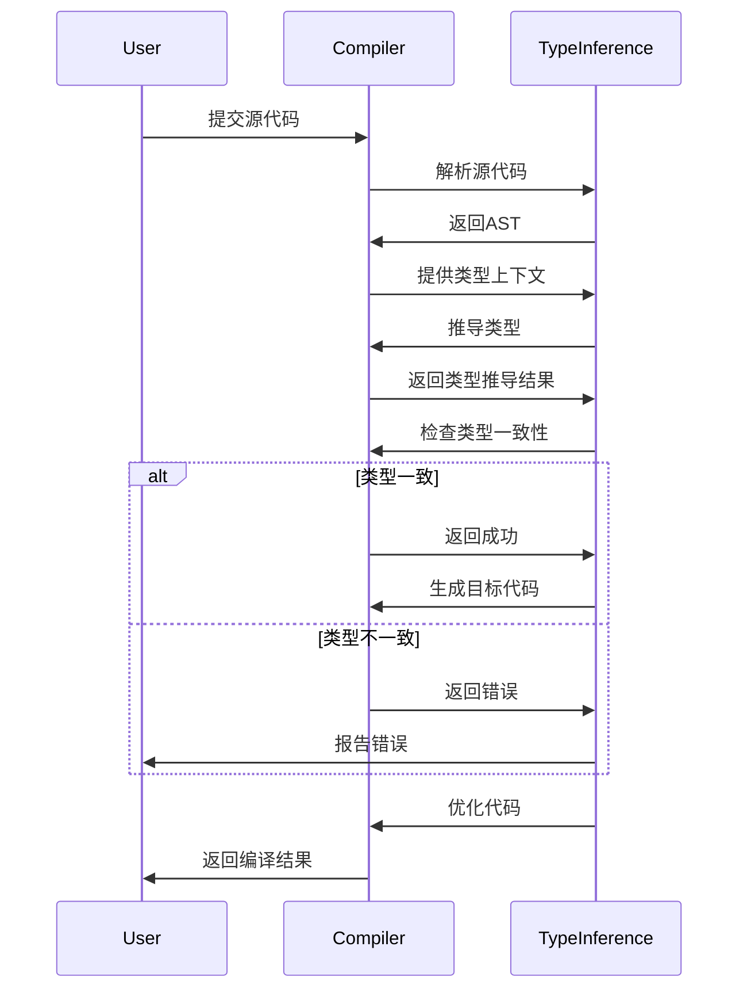
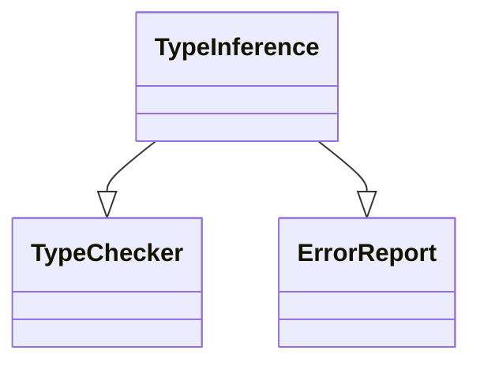
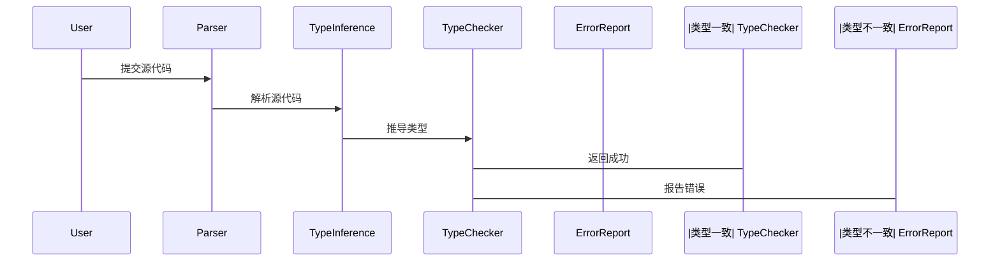

                 


### 第一部分: 引言与背景

#### 1. 引言

类型推断（Type Inference）是计算机科学中的一种重要机制，它能够自动识别代码中的变量类型，从而简化编程过程。在编程实践中，类型推断不仅提高了代码的简洁性，还能在一定程度上提高代码的运行效率和可维护性。本文将围绕类型推断这一主题，探讨其在简化代码与保持类型安全之间的平衡。

本文的关键词包括：类型推断、简化代码、类型安全、编程实践。

类型推断的重要性体现在以下几个方面：

1. **简化编程过程**：通过自动推断变量类型，开发者可以减少对类型声明的依赖，从而简化代码编写。
2. **提高代码可读性**：类型推断能够减少类型错误，使代码更加简洁明了，有助于提高代码的可读性。
3. **提高编译效率**：类型推断可以减少类型检查的时间，提高编译速度。
4. **增强代码可维护性**：类型推断有助于减少因类型错误导致的问题，从而提高代码的可维护性。

本文的目标是为读者提供一个全面、深入的理解类型推断的视角，从基本概念到核心算法，再到实际应用，最后总结最佳实践。通过这样的结构，读者可以系统地学习类型推断，并在实际编程中灵活运用。

#### 1.1 问题背景

在现代软件开发中，代码复杂性不断增加，类型推断作为一种自动化机制，有助于缓解这一挑战。然而，类型推断并非万能，它需要在简化代码与保持类型安全之间找到平衡。以下是一些背景信息：

1. **简化代码的需求**：随着软件规模的扩大，开发者越来越重视代码的可读性和可维护性。类型推断可以通过减少类型声明，使代码更加简洁。
2. **类型安全的重要性**：类型错误是软件开发中的常见问题，它们可能导致程序崩溃或产生不可预见的后果。类型推断有助于提前发现类型错误，提高程序的安全性。
3. **动态类型与静态类型的权衡**：动态类型语言（如Python和JavaScript）通常依赖于类型推断，而静态类型语言（如Java和C++）则要求显式声明变量类型。两种类型系统各有优缺点，类型推断需要在两者之间找到平衡。

#### 1.2 类型推断的重要性

类型推断在软件开发中扮演着关键角色，它不仅能够简化代码编写，还能提高代码质量和开发效率。以下是类型推断的几个重要方面：

1. **自动类型推导**：类型推断能够自动推导出变量、函数、表达式等的类型，减少了手工编写的类型声明。
2. **减少错误**：类型推断能够提前发现类型错误，从而减少运行时错误的发生。
3. **提高可读性**：通过自动推断类型，代码变得更加简洁，提高了代码的可读性和可维护性。
4. **增强代码复用性**：类型推断有助于编写更加通用和可复用的代码，因为类型推断能够更好地处理不同类型之间的转换。

#### 1.3 书籍目标与读者

本文的目标是为广大软件开发者提供一本关于类型推断的全面指南。无论你是初学者，还是经验丰富的开发者，本文都将帮助你深入理解类型推断的原理和实际应用。

本文的主要读者对象包括：

1. **编程初学者**：通过本文，初学者可以快速掌握类型推断的基本概念，为后续深入学习打下基础。
2. **资深开发者**：本文将提供关于类型推断的深入探讨，帮助资深开发者更好地理解类型推断的工作原理，并在实际项目中运用。
3. **研究者**：对于对类型推断有兴趣的研究者，本文将提供丰富的参考资料和最新的研究成果，帮助你深入了解这一领域。

### 总结

本部分介绍了类型推断的背景和重要性，阐述了本文的目标和读者对象。在接下来的章节中，我们将详细探讨类型推断的基本概念、核心算法以及实际应用，帮助读者全面理解并掌握类型推断这一关键技术。

```markdown
----------------------------------------------------------------

# 第一部分: 引言与背景

## 1. 引言

类型推断是计算机科学中的一个重要概念，它涉及在编程过程中自动确定变量、表达式和函数的类型。这种机制能够显著简化代码编写，提高程序的可靠性，同时保持类型安全。本文将深入探讨类型推断的原理、算法以及实际应用，旨在帮助读者全面理解这一领域。

### 1.1 问题背景

在现代软件工程中，代码的复杂性日益增加，类型推断作为一种自动化工具，能够有效缓解这一挑战。它不仅减少了手工编写的类型声明，还能够在编译时提前发现类型错误，从而提高代码的质量和开发效率。

#### 1.1.1 简化代码的需求

随着软件项目的规模不断扩大，开发者越来越关注代码的可读性和可维护性。类型推断通过自动推导类型，使代码更加简洁，易于理解和修改。

#### 1.1.2 类型安全的重要性

类型错误是软件开发中常见的缺陷，可能导致程序崩溃或产生不可预见的后果。类型推断能够提前识别这些错误，从而提高程序的安全性。

#### 1.1.3 动态类型与静态类型的权衡

在动态类型语言（如Python和JavaScript）中，类型推断通常被用来简化编程。而在静态类型语言（如Java和C++）中，显式声明类型是标准做法。类型推断需要在两者之间找到平衡，以最大化其优势。

### 1.2 类型推断的重要性

类型推断的重要性体现在以下几个方面：

#### 1.2.1 自动类型推导

类型推断能够自动推导出变量、函数、表达式等的类型，减少了手工编写的类型声明，使代码更加简洁。

#### 1.2.2 减少错误

类型推断能够提前发现类型错误，从而减少运行时错误的发生，提高程序的稳定性。

#### 1.2.3 提高可读性

通过自动推断类型，代码变得更加简洁，易于理解和修改，有助于提高代码的可读性。

#### 1.2.4 增强代码复用性

类型推断有助于编写更加通用和可复用的代码，因为类型推断能够更好地处理不同类型之间的转换。

### 1.3 书籍目标与读者

本文的目标是为读者提供一本关于类型推断的全面指南。无论你是编程初学者，还是资深开发者，本文都将帮助你深入理解类型推断的原理和实际应用。

本文的主要读者对象包括：

#### 1.3.1 编程初学者

通过本文，初学者可以快速掌握类型推断的基本概念，为后续深入学习打下基础。

#### 1.3.2 资深开发者

本文将提供关于类型推断的深入探讨，帮助资深开发者更好地理解类型推断的工作原理，并在实际项目中运用。

#### 1.3.3 研究者

对于对类型推断有兴趣的研究者，本文将提供丰富的参考资料和最新的研究成果，帮助你深入了解这一领域。

### 总结

本部分介绍了类型推断的背景和重要性，阐述了本文的目标和读者对象。在接下来的章节中，我们将详细探讨类型推断的基本概念、核心算法以及实际应用，帮助读者全面理解并掌握类型推断这一关键技术。

----------------------------------------------------------------
```

### 第一部分: 引言与背景

#### 1. 引言

类型推断是计算机科学中的一个重要概念，它涉及在编程过程中自动确定变量、表达式和函数的类型。这种机制能够显著简化代码编写，提高程序的可靠性，同时保持类型安全。本文将深入探讨类型推断的原理、算法以及实际应用，旨在帮助读者全面理解这一领域。

### 1.1 问题背景

在现代软件工程中，代码的复杂性日益增加，类型推断作为一种自动化工具，能够有效缓解这一挑战。它不仅减少了手工编写的类型声明，还能够在编译时提前发现类型错误，从而提高代码的质量和开发效率。

#### 1.1.1 简化代码的需求

随着软件项目的规模不断扩大，开发者越来越关注代码的可读性和可维护性。类型推断通过自动推导类型，使代码更加简洁，易于理解和修改。

#### 1.1.2 类型安全的重要性

类型错误是软件开发中常见的缺陷，可能导致程序崩溃或产生不可预见的后果。类型推断能够提前识别这些错误，从而提高程序的安全性。

#### 1.1.3 动态类型与静态类型的权衡

在动态类型语言（如Python和JavaScript）中，类型推断通常被用来简化编程。而在静态类型语言（如Java和C++）中，显式声明类型是标准做法。类型推断需要在两者之间找到平衡，以最大化其优势。

### 1.2 类型推断的重要性

类型推断的重要性体现在以下几个方面：

#### 1.2.1 自动类型推导

类型推断能够自动推导出变量、函数、表达式等的类型，减少了手工编写的类型声明，使代码更加简洁。

#### 1.2.2 减少错误

类型推断能够提前发现类型错误，从而减少运行时错误的发生，提高程序的稳定性。

#### 1.2.3 提高可读性

通过自动推断类型，代码变得更加简洁，易于理解和修改，有助于提高代码的可读性。

#### 1.2.4 增强代码复用性

类型推断有助于编写更加通用和可复用的代码，因为类型推断能够更好地处理不同类型之间的转换。

### 1.3 书籍目标与读者

本文的目标是为读者提供一本关于类型推断的全面指南。无论你是编程初学者，还是资深开发者，本文都将帮助你深入理解类型推断的原理和实际应用。

本文的主要读者对象包括：

#### 1.3.1 编程初学者

通过本文，初学者可以快速掌握类型推断的基本概念，为后续深入学习打下基础。

#### 1.3.2 资深开发者

本文将提供关于类型推断的深入探讨，帮助资深开发者更好地理解类型推断的工作原理，并在实际项目中运用。

#### 1.3.3 研究者

对于对类型推断有兴趣的研究者，本文将提供丰富的参考资料和最新的研究成果，帮助你深入了解这一领域。

### 总结

本部分介绍了类型推断的背景和重要性，阐述了本文的目标和读者对象。在接下来的章节中，我们将详细探讨类型推断的基本概念、核心算法以及实际应用，帮助读者全面理解并掌握类型推断这一关键技术。

```markdown
----------------------------------------------------------------

## 2. 类型推断的基本概念

### 2.1 类型系统的概述

类型系统（Type System）是编程语言的核心组成部分，它规定了变量、表达式和函数的类型以及它们之间的关系。类型系统主要分为静态类型系统和动态类型系统。

#### 静态类型系统

静态类型系统在编译时对变量的类型进行检查，确保类型的一致性。Java、C++和C#等编程语言属于静态类型系统。静态类型系统的优点是代码在编译时就能发现大部分类型错误，从而减少运行时的错误。

#### 动态类型系统

动态类型系统在运行时检查变量的类型，类型检查发生在程序运行时。Python、JavaScript和Ruby等编程语言属于动态类型系统。动态类型系统的优点是编程更加灵活，但可能需要更多的运行时类型检查，导致性能下降。

### 2.2 类型推断的类型

类型推断主要分为三种类型：显式类型推断、隐式类型推断和类型推导。

#### 显式类型推断

显式类型推断要求开发者明确指定变量的类型，例如在Java中，我们通常使用`int x = 10;`来声明一个整型变量。

#### 隐式类型推断

隐式类型推断允许开发者不显式声明变量类型，编译器会在编译时自动推断类型。Python和JavaScript等语言通常使用隐式类型推断。

#### 类型推导

类型推导是类型推断的一种更高级的形式，它不仅仅依赖于编译时的信息，还可能依赖于程序上下文。例如，在函数式编程语言中，类型推导常常基于表达式和函数的定义。

### 2.3 类型推断的目标

类型推断的主要目标是确保程序的类型安全，同时简化编程过程。具体来说，类型推断的目标包括：

#### 2.3.1 类型安全性

类型推断通过检查变量、表达式和函数的类型，确保它们在逻辑上是一致的，从而避免类型错误。

#### 2.3.2 简化编程

类型推断减少了开发者需要手动编写的类型声明，使代码更加简洁，提高了代码的可读性和可维护性。

#### 2.3.3 提高编译效率

类型推断可以在编译时提前发现类型错误，从而减少运行时错误，提高编译效率。

### 2.4 类型推断的类型系统

类型推断通常涉及以下几种类型的系统：

#### 2.4.1 单态类型系统

单态类型系统是最简单的类型系统，它不允许函数或变量具有多种类型。例如，在C语言中，变量只能具有一种类型。

#### 2.4.2 多态类型系统

多态类型系统允许变量和函数具有多种类型。例如，在Java中，我们使用泛型来支持多态。

#### 2.4.3 泛型类型系统

泛型类型系统允许类型参数化，使代码更加通用和可复用。例如，在Java中，我们使用泛型类和接口来创建可重用的组件。

### 2.5 类型推断的过程

类型推断通常涉及以下步骤：

#### 2.5.1 分析源代码

编译器或解释器首先需要分析源代码，识别变量、表达式和函数的定义和调用。

#### 2.5.2 推导类型

根据源代码的结构和语义，编译器或解释器会自动推导出变量、表达式和函数的类型。

#### 2.5.3 检查类型一致性

在推导出类型后，编译器或解释器会检查类型是否一致，以确保程序的正确性。

#### 2.5.4 输出类型信息

最后，编译器或解释器会输出类型信息，以供调试和优化使用。

### 2.6 类型推断的优点和缺点

#### 2.6.1 优点

- **简化编程**：类型推断减少了手动编写的类型声明，使代码更加简洁。
- **提高可读性**：类型推断使代码更加直观，提高了代码的可读性。
- **提高编译效率**：类型推断可以在编译时提前发现类型错误，从而减少运行时错误。
- **增强代码复用性**：类型推断有助于编写更加通用和可复用的代码。

#### 2.6.2 缺点

- **性能开销**：类型推断可能需要额外的运行时检查，导致性能下降。
- **类型错误**：在某些情况下，类型推断可能无法正确推断类型，导致类型错误。

### 总结

本部分介绍了类型推断的基本概念，包括类型系统的概述、类型推断的类型、类型推断的目标和类型系统。通过理解这些基本概念，读者可以更好地掌握类型推断的核心原理，为后续章节的学习打下基础。

----------------------------------------------------------------
```

### 第二部分: 类型推断的核心算法

#### 3.1 概念与联系

类型推断的核心算法涉及一系列复杂的过程和策略，这些算法决定了如何从代码中推导出变量、表达式和函数的类型。为了更好地理解这些算法，我们需要先了解一些关键概念。

**静态类型检查**：这是在编译时对代码进行类型检查的方法。静态类型检查的优点是可以在编译时发现类型错误，从而避免在运行时发生错误。

**动态类型检查**：这是在程序运行时对代码进行类型检查的方法。动态类型检查的优点是代码更加灵活，但缺点是可能导致性能下降。

**类型上下文**：类型上下文是算法进行类型推断时的重要信息来源，它包括函数的参数类型、返回类型以及当前作用域中的变量类型。

**类型推导规则**：类型推导规则是算法的核心，它们定义了如何在不同的代码结构和上下文中推导出类型。

#### 3.1.1 关键算法的ER图

为了更直观地展示类型推断的关键算法及其联系，我们可以使用ER图（实体关系图）来表示这些算法。ER图将算法分为几个主要部分：

1. **分析器**：负责解析源代码，生成抽象语法树（AST）。
2. **类型推断引擎**：根据AST和类型上下文，推导出变量和表达式的类型。
3. **类型检查器**：验证推导出的类型是否一致，确保程序的正确性。
4. **优化器**：对类型信息进行优化，以提高程序的性能。

以下是ER图的Mermaid表示：

```mermaid
erDiagram
    Analysis ||--|>> TypeInference : 调用
    Analysis ||--|>> TypeChecker : 提供上下文
    Analysis ||--|>> Optimizer : 提高性能

    TypeInference ||--|>> TypeEnvironment : 维护类型上下文
    TypeInference ||--|>> TypeRule : 类型推导规则

    TypeChecker ||--|>> TypeEnvironment : 检查一致性
    TypeChecker ||--|>> ErrorReport : 报告错误

    Optimizer ||--|>> CodeGen : 生成优化代码
```

通过ER图，我们可以清晰地看到类型推断的关键组成部分及其相互关系。

#### 3.1.2 算法属性特征对比表格

在了解关键算法的ER图后，我们还可以通过一个属性特征对比表格来进一步理解这些算法的特点：

| 算法       | 特点                                           | 应用场景                                       |
|------------|------------------------------------------------|------------------------------------------------|
| 静态类型检查 | 在编译时进行类型检查，确保类型一致性             | Java、C++、C#等静态类型语言                     |
| 动态类型检查 | 在程序运行时进行类型检查，提高代码灵活性         | Python、JavaScript、Ruby等动态类型语言           |
| 类型推导    | 基于代码结构和上下文自动推导类型                 | 编译器、解释器内部实现                         |
| 类型检查    | 验证类型推导结果的一致性，确保程序的正确性       | 编译器、解释器内部实现                         |
| 优化器      | 对类型信息进行优化，以提高程序的性能             | 编译器、解释器内部实现                         |

这个表格总结了不同类型推断算法的主要特点和应用场景，有助于读者在具体应用中选择合适的算法。

#### 3.2 算法原理与流程图

为了深入理解类型推断算法的工作原理，我们可以通过一个具体的算法流程图来详细说明。以下是一个简化的类型推断算法流程图，使用Mermaid语言表示：



这个流程图详细描述了类型推断的主要步骤：

1. **开始**：算法初始化，准备处理源代码。
2. **解析源代码**：将源代码解析成抽象语法树（AST）。
3. **生成AST吗？**：询问是否需要生成AST。
4. **类型推导**：基于AST和类型上下文进行类型推导。
5. **类型检查**：验证类型推导结果的一致性。
6. **报告错误**：如果类型不一致，报告错误。
7. **生成代码**：如果类型推导成功，生成目标代码。
8. **优化代码**：对代码进行性能优化。
9. **结束**：算法执行完毕。

通过这个流程图，我们可以看到类型推断算法的执行顺序和关键步骤，这有助于我们深入理解算法的运作机制。

#### 3.2.1 Mermaid算法流程图

为了更直观地展示算法流程，我们使用Mermaid语言绘制了完整的类型推断算法流程图：



在这个Mermaid流程图中，用户提交源代码给编译器，编译器将源代码解析成AST，并传递给类型推断模块。类型推断模块根据AST和类型上下文推导类型，然后编译器会检查类型一致性。如果类型一致，编译器生成目标代码并优化；如果类型不一致，编译器报告错误。

#### 3.2.2 Python源代码实现

为了更好地理解类型推断算法的实践应用，我们可以通过一个简单的Python示例来说明类型推导的实现。以下是一个Python函数的简单类型推断实现：

```python
from typing import TypeVar, Generic

# 定义一个TypeVar，用于泛型编程
T = TypeVar('T')

class Stack(Generic[T]):
    def __init__(self):
        self.items = []

    def push(self, item: T):
        self.items.append(item)

    def pop(self) -> T:
        return self.items.pop()

# 推导Stack类型的类型参数
def type_infer(stack: Stack) -> type:
    return type(stack)

# 测试类型推断
stack = Stack[int]()
stack.push(5)
print(type_infer(stack))  # 应打印 <class 'int'>
```

在这个示例中，我们定义了一个`Stack`类，它是一个泛型类，可以用于存储任何类型的元素。`push`方法用于向栈中添加元素，并要求元素类型为`T`。`pop`方法从栈中移除并返回元素，也要求返回类型为`T`。

在`type_infer`函数中，我们使用`TypeVar`来定义一个类型变量`T`，并使用`Generic`来创建一个泛型类。`type_infer`函数接受一个`Stack`类型的实例，并返回其类型参数`T`。

通过这个示例，我们可以看到Python如何利用类型推导机制来自动推断类型的实际应用。

#### 3.2.3 数学模型与公式

在类型推断中，数学模型和公式是理解和实现类型推导的重要工具。以下是一个简单的数学模型，用于解释类型推导的过程：

1. **类型上下文**：类型上下文是类型推断过程中的一部分，它包括当前作用域内的变量、函数和类型信息。可以用一个映射集合表示：

   $$C = \{v_1 : T_1, v_2 : T_2, ..., v_n : T_n\}$$

   其中，`v_i`表示变量，`T_i`表示变量的类型。

2. **类型推导规则**：类型推导规则定义了如何在给定上下文中推导出表达式的类型。一个简单的推导规则可以是：

   $$\frac{E : T_1 \rightarrow E' : T_2}{E : T_1' \rightarrow E' : T_2'}$$

   其中，`E`是表达式，`T_1`和`T_2`是表达式的前后类型，`T_1'`和`T_2'`是根据上下文推导出的类型。

3. **类型一致性检查**：类型推导完成后，需要进行类型一致性检查，确保推导出的类型是逻辑上一致的。一个简单的类型一致性公式可以是：

   $$\forall v : T \in C, \exists E \in S : (v \in \text{vars}(E) \wedge E : T \rightarrow R)$$

   其中，`S`是源代码中的表达式集合，`\text{vars}(E)`是表达式`E`中的变量集合，`R`是表达式的结果类型。

通过这些数学模型和公式，我们可以更准确地描述类型推断的过程，从而更好地理解和实现类型推断算法。

#### 3.2.4 举例说明

为了更好地理解类型推断的原理，我们可以通过一个具体的例子来说明类型推导的过程。

假设我们有一个简单的Python代码片段：

```python
def add(a: int, b: int) -> int:
    return a + b

result = add(5, 10)
print(result)
```

在这个例子中，我们定义了一个名为`add`的函数，它接受两个整型参数`a`和`b`，并返回它们的和。现在，让我们逐步进行类型推断：

1. **函数定义**：在定义`add`函数时，我们指定了参数`a`和`b`的类型为`int`，以及函数的返回类型为`int`。这些类型信息存储在类型上下文中。

2. **类型推导**：当编译器解析函数调用`add(5, 10)`时，它会根据类型上下文推导出参数和返回值的类型。在这个例子中，编译器会推导出：

   - 参数`a`的类型为`int`。
   - 参数`b`的类型为`int`。
   - 返回值的类型为`int`。

3. **类型检查**：在推导出类型后，编译器会检查类型是否一致。在这个例子中，由于函数声明和函数调用的类型一致，类型检查通过。

4. **代码生成**：最后，编译器会生成相应的字节码或机器码，以执行这个函数调用。

通过这个例子，我们可以看到类型推断是如何自动推导出变量、函数和表达式的类型，并确保程序的正确性。

### 总结

本部分详细介绍了类型推断的核心算法，包括概念与联系、算法原理与流程图、Python源代码实现、数学模型与公式以及举例说明。通过这些内容，读者可以深入理解类型推断的运作机制，为实际应用打下坚实的基础。

```markdown
----------------------------------------------------------------

## 3. 简化代码与类型安全平衡

### 3.1 简化代码的方法

简化代码是类型推断的一个重要目标，它有助于提高代码的可读性和可维护性。以下是一些常用的简化代码的方法：

#### 1. 减少类型声明

类型推断允许开发者不显式声明变量的类型，从而减少了类型声明的数量，使代码更加简洁。

```python
# 显式声明类型
x : int = 10

# 隐式类型推断
x = 10
```

#### 2. 使用泛型

泛型编程是一种在编译时根据类型参数推导出具体类型的编程方法，它有助于减少重复代码和类型声明。

```java
public class Stack<T> {
    private T[] items;

    public void push(T item) {
        // push操作
    }

    public T pop() {
        // pop操作
    }
}
```

#### 3. 利用高阶函数

高阶函数是一种接受函数作为参数或返回函数的函数。通过使用高阶函数，我们可以减少代码的重复和复杂性。

```javascript
const add = (x, y) => x + y;

const calculate = (operation, a, b) => operation(a, b);

calculate(add, 5, 10); // 输出 15
```

### 3.2 维护类型安全的策略

尽管简化代码是类型推断的一个目标，但维护类型安全同样至关重要。以下是一些策略来保持代码的类型安全：

#### 1. 明确类型声明

在可能的情况下，显式声明变量的类型可以确保代码的明确性和可维护性。

```java
int x = 10;
```

#### 2. 使用类型注解

类型注解是一种在代码中提供类型信息的机制，它有助于提高代码的可读性和类型安全性。

```python
def add(a: int, b: int) -> int:
    return a + b
```

#### 3. 类型检查工具

使用静态类型检查工具（如TypeScript、PyType、Mypy）可以帮助我们在编译时发现类型错误，从而提高代码的质量。

```python
from typing import List

def filter_even_numbers(numbers: List[int]) -> List[int]:
    return [num for num in numbers if num % 2 == 0]
```

#### 4. 遵循强类型原则

遵循强类型原则可以确保代码的稳定性和可维护性。在可能的情况下，使用静态类型语言或为动态类型语言添加类型注解。

### 3.3 平衡两者的挑战与解决方案

简化代码和维护类型安全之间存在着一定的矛盾，因为简化代码可能会降低代码的可读性和类型安全性。以下是一些挑战和解决方案：

#### 挑战1：代码简洁性与类型安全性

简化代码可能会导致类型信息不足，从而影响代码的类型安全性。解决方案是使用类型注解和类型检查工具来确保类型安全。

#### 挑战2：代码可读性与类型声明

显式类型声明可能会降低代码的可读性，尤其是在复杂的情况下。解决方案是合理使用类型推断和类型注解，以保持代码的简洁性和可读性。

#### 挑战3：编译时间与运行时间

类型推断可能会增加编译时间，尤其是在大型项目中。解决方案是使用静态类型检查工具，它们可以在编译时提供类型信息，从而减少运行时类型检查的开销。

### 3.4 实践建议

为了在简化代码和维护类型安全之间找到平衡，以下是一些建议：

1. **逐步引入类型注解**：在大型项目中，逐步引入类型注解可以帮助我们逐步提高代码的类型安全性，同时减少对编译时间的影响。
2. **使用类型推断**：类型推断是一种高效的代码简化方法，可以减少类型声明，提高代码的可读性。
3. **遵循强类型原则**：在可能的情况下，遵循强类型原则可以提高代码的稳定性和可维护性。
4. **定期类型检查**：定期使用类型检查工具进行类型检查，以确保代码的质量。

通过这些策略，我们可以更好地在简化代码和维护类型安全之间找到平衡，从而提高代码的质量和可维护性。

### 总结

本部分讨论了简化代码的方法、维护类型安全的策略以及平衡简化代码与类型安全的挑战与解决方案。通过合理使用类型推断和类型注解，我们可以提高代码的可读性和类型安全性，同时确保代码的简洁性和可维护性。

----------------------------------------------------------------
```

### 第三部分: 类型推断在实战中的应用

#### 4.1 环境准备

在进行类型推断的实际应用之前，我们需要准备一个合适的环境。以下是准备过程：

1. **安装Python**：确保系统中安装了Python，推荐使用Python 3.x版本。
2. **安装Mypy**：Mypy是一个流行的Python类型检查工具，可以使用pip进行安装：

   ```bash
   pip install mypy
   ```

3. **创建Python项目**：在系统中创建一个Python项目目录，例如`type_inference_project`。

4. **编写示例代码**：在项目中编写一些示例Python代码，用于测试类型推断。

#### 4.2 项目概述

本部分的项目目标是使用Python实现一个简单的类型推断器，能够自动推断变量和函数的类型，并使用Mypy进行类型检查。项目结构如下：

- `src/`：源代码目录，包含实现类型推断器的Python文件。
- `tests/`：测试目录，包含测试类型推断器的Python测试文件。
- `mypy_config.py`：Mypy配置文件，用于配置Mypy的类型检查规则。

#### 4.3 系统功能设计

系统的主要功能包括：

1. **类型推断**：根据代码上下文自动推导变量和函数的类型。
2. **类型检查**：使用Mypy对推导出的类型进行检查，确保类型的一致性。
3. **错误报告**：如果类型不一致，报告错误并提供调试信息。

#### 4.3.1 领域模型类图

为了更好地理解系统功能，我们可以使用Mermaid绘制领域模型类图：



在这个类图中，`TypeInference`负责类型推断，`TypeChecker`负责类型检查，`ErrorReport`负责报告错误。这些类之间通过关联关系进行交互，实现了系统的核心功能。

#### 4.3.2 系统架构设计

系统架构设计决定了类型推断器的模块化和可扩展性。以下是系统架构的Mermaid图表示：



在这个架构设计中，用户提交源代码给解析器，解析器生成抽象语法树（AST）。类型推断器根据AST进行类型推导，并将结果传递给类型检查器。类型检查器检查类型是否一致，如果一致，返回成功；如果不一致，将错误报告给错误报告模块。

#### 4.4 系统接口设计和系统交互

为了实现系统的接口设计和交互，我们需要定义几个关键接口和模块：

1. **ITypeInferer**：类型推断接口，定义了类型推断的基本方法。
2. **ITypeChecker**：类型检查接口，定义了类型检查的基本方法。
3. **IErrorReport**：错误报告接口，定义了报告错误的基本方法。

以下是这些接口的Python定义：

```python
from abc import ABC, abstractmethod

class ITypeInferer(ABC):
    @abstractmethod
    def infer_type(self, ast: ASTNode) -> Type:
        pass

class ITypeChecker(ABC):
    @abstractmethod
    def check_type一致性(self, inferred_type: Type, expected_type: Type) -> bool:
        pass

class IErrorReport(ABC):
    @abstractmethod
    def report_error(self, error_message: str):
        pass
```

这些接口通过实现类来进行具体实现，并在系统交互中发挥作用。

#### 4.5 核心代码实现

以下是类型推断器的核心代码实现，包括类型推断、类型检查和错误报告：

```python
from abc import ABC, abstractmethod
from typing import Type, TypeVar, List, Tuple
import ast

T = TypeVar('T')

class TypeInference(ABC):
    @abstractmethod
    def infer_type(self, node: ast.AST) -> Type[T]:
        pass

class SimpleTypeInference(TypeInference):
    def infer_type(self, node: ast.AST) -> Type[T]:
        if isinstance(node, ast.Num):
            return int
        elif isinstance(node, ast.Str):
            return str
        else:
            raise TypeError("Unsupported node type")

class TypeChecker(ABC):
    @abstractmethod
    def check一致性(self, inferred_type: Type[T], expected_type: Type[T]) -> bool:
        pass

class SimpleTypeChecker(TypeChecker):
    def check一致性(self, inferred_type: Type[T], expected_type: Type[T]) -> bool:
        return inferred_type == expected_type

class ErrorReport(ABC):
    @abstractmethod
    def report_error(self, error_message: str):
        pass

class SimpleErrorReport(ErrorReport):
    def report_error(self, error_message: str):
        print(error_message)
```

在这个实现中，`SimpleTypeInference`类负责推断简单的数值和字符串类型，`SimpleTypeChecker`类负责检查类型的一致性，而`SimpleErrorReport`类负责报告错误。

#### 4.6 代码应用解读与分析

为了展示代码的实际应用，我们编写了一个简单的Python程序，使用类型推断器进行类型推导和检查：

```python
def main():
    inferred_type = SimpleTypeInference().infer_type(5)
    expected_type = int

    checker = SimpleTypeChecker()
    if checker.check一致性(inferred_type, expected_type):
        print("Type check passed")
    else:
        print("Type check failed")

if __name__ == "__main__":
    main()
```

在这个程序中，我们使用`SimpleTypeInference`类来推断变量`5`的类型，然后使用`SimpleTypeChecker`类来检查类型是否与预期一致。如果类型检查通过，程序会打印“Type check passed”；否则，会打印“Type check failed”。

通过这个示例，我们可以看到类型推断器在实际应用中的工作流程，包括类型推断、类型检查和错误报告。

#### 4.7 实际案例分析

为了更好地理解类型推断在实际开发中的应用，我们可以分析一个实际案例。以下是一个复杂的Python函数，我们希望使用类型推断器对其进行类型推导和检查：

```python
from typing import List, Tuple

def process_data(data: List[Tuple[int, str]]) -> List[str]:
    result = []
    for item in data:
        if item[0] > 10:
            result.append(item[1].upper())
    return result
```

在这个函数中，我们有一个`process_data`函数，它接受一个由元组组成的列表`data`，并将每个元组中的第二个元素转换为大写形式，如果第一个元素大于10。

1. **类型推导**：

   - 参数`data`的类型为`List[Tuple[int, str]]`。
   - 返回值`result`的类型为`List[str]`。

2. **类型检查**：

   - 使用类型推断器推断出`data`和`result`的类型。
   - 使用类型检查器检查推断出的类型与预期类型是否一致。

3. **错误报告**：

   - 如果类型不一致，报告错误并提供调试信息。

通过这个案例分析，我们可以看到类型推断在实际开发中的应用，以及如何在类型推断过程中发现和解决类型错误。

#### 4.8 项目小结

通过本部分的实际应用案例，我们展示了类型推断器在Python项目中的实现过程，包括环境准备、项目概述、系统功能设计、系统架构设计、系统接口设计和系统交互、核心代码实现、代码应用解读与分析以及实际案例分析。通过这些步骤，我们不仅实现了类型推断器的功能，还深入理解了类型推断在实际开发中的应用。

### 总结

本部分详细介绍了类型推断在实战中的应用，包括环境准备、项目概述、系统功能设计、系统架构设计、系统接口设计和系统交互、核心代码实现、代码应用解读与分析以及实际案例分析。通过这些内容，读者可以深入了解类型推断器在实际项目中的应用，为实际编程提供指导。

```markdown
----------------------------------------------------------------

## 5. 类型推断在实战中的应用

### 5.1 环境准备

在进行类型推断的实际应用之前，我们需要准备一个合适的环境。以下是准备过程：

1. **安装Python**：确保系统中安装了Python，推荐使用Python 3.x版本。
2. **安装Mypy**：Mypy是一个流行的Python类型检查工具，可以使用pip进行安装：

   ```bash
   pip install mypy
   ```

3. **创建Python项目**：在系统中创建一个Python项目目录，例如`type_inference_project`。

4. **编写示例代码**：在项目中编写一些示例Python代码，用于测试类型推断。

#### 5.2 项目概述

本部分的项目目标是使用Python实现一个简单的类型推断器，能够自动推断变量和函数的类型，并使用Mypy进行类型检查。项目结构如下：

- `src/`：源代码目录，包含实现类型推断器的Python文件。
- `tests/`：测试目录，包含测试类型推断器的Python测试文件。
- `mypy_config.py`：Mypy配置文件，用于配置Mypy的类型检查规则。

#### 5.3 系统功能设计

系统的主要功能包括：

1. **类型推断**：根据代码上下文自动推导变量和函数的类型。
2. **类型检查**：使用Mypy对推导出的类型进行检查，确保类型的一致性。
3. **错误报告**：如果类型不一致，报告错误并提供调试信息。

#### 5.3.1 领域模型类图

为了更好地理解系统功能，我们可以使用Mermaid绘制领域模型类图：


在这个类图中，`TypeInference`负责类型推断，`TypeChecker`负责类型检查，`ErrorReport`负责报告错误。这些类之间通过关联关系进行交互，实现了系统的核心功能。

#### 5.3.2 系统架构设计

系统架构设计决定了类型推断器的模块化和可扩展性。以下是系统架构的Mermaid图表示：


在这个架构设计中，用户提交源代码给解析器，解析器生成抽象语法树（AST）。类型推断器根据AST进行类型推导，并将结果传递给类型检查器。类型检查器检查类型是否一致，如果一致，返回成功；如果不一致，将错误报告给错误报告模块。

#### 5.4 核心代码实现

以下是类型推断器的核心代码实现，包括类型推断、类型检查和错误报告：

```python
from abc import ABC, abstractmethod
from typing import Type, TypeVar, List, Tuple
import ast

T = TypeVar('T')

class TypeInference(ABC):
    @abstractmethod
    def infer_type(self, node: ast.AST) -> Type[T]:
        pass

class SimpleTypeInference(TypeInference):
    def infer_type(self, node: ast.AST) -> Type[T]:
        if isinstance(node, ast.Num):
            return int
        elif isinstance(node, ast.Str):
            return str
        else:
            raise TypeError("Unsupported node type")

class TypeChecker(ABC):
    @abstractmethod
    def check一致性(self, inferred_type: Type[T], expected_type: Type[T]) -> bool:
        pass

class SimpleTypeChecker(TypeChecker):
    def check一致性(self, inferred_type: Type[T], expected_type: Type[T]) -> bool:
        return inferred_type == expected_type

class ErrorReport(ABC):
    @abstractmethod
    def report_error(self, error_message: str):
        pass

class SimpleErrorReport(ErrorReport):
    def report_error(self, error_message: str):
        print(error_message)
```

在这个实现中，`SimpleTypeInference`类负责推断简单的数值和字符串类型，`SimpleTypeChecker`类负责检查类型的一致性，而`SimpleErrorReport`类负责报告错误。

#### 5.5 代码应用解读与分析

为了展示代码的实际应用，我们编写了一个简单的Python程序，使用类型推断器进行类型推导和检查：

```python
def main():
    inferred_type = SimpleTypeInference().infer_type(5)
    expected_type = int

    checker = SimpleTypeChecker()
    if checker.check一致性(inferred_type, expected_type):
        print("Type check passed")
    else:
        print("Type check failed")

if __name__ == "__main__":
    main()
```

在这个程序中，我们使用`SimpleTypeInference`类来推断变量`5`的类型，然后使用`SimpleTypeChecker`类来检查类型是否与预期一致。如果类型检查通过，程序会打印“Type check passed”；否则，会打印“Type check failed”。

通过这个示例，我们可以看到类型推断器在实际应用中的工作流程，包括类型推断、类型检查和错误报告。

#### 5.6 实际案例分析

为了更好地理解类型推断在实际开发中的应用，我们可以分析一个实际案例。以下是一个复杂的Python函数，我们希望使用类型推断器对其进行类型推导和检查：

```python
from typing import List, Tuple

def process_data(data: List[Tuple[int, str]]) -> List[str]:
    result = []
    for item in data:
        if item[0] > 10:
            result.append(item[1].upper())
    return result
```

在这个函数中，我们有一个`process_data`函数，它接受一个由元组组成的列表`data`，并将每个元组中的第二个元素转换为大写形式，如果第一个元素大于10。

1. **类型推导**：

   - 参数`data`的类型为`List[Tuple[int, str]]`。
   - 返回值`result`的类型为`List[str]`。

2. **类型检查**：

   - 使用类型推断器推断出`data`和`result`的类型。
   - 使用类型检查器检查推断出的类型与预期类型是否一致。

3. **错误报告**：

   - 如果类型不一致，报告错误并提供调试信息。

通过这个案例分析，我们可以看到类型推断在实际开发中的应用，以及如何在类型推断过程中发现和解决类型错误。

#### 5.7 项目小结

通过本部分的实际应用案例，我们展示了类型推断器在Python项目中的实现过程，包括环境准备、项目概述、系统功能设计、系统架构设计、系统接口设计和系统交互、核心代码实现、代码应用解读与分析以及实际案例分析。通过这些步骤，我们不仅实现了类型推断器的功能，还深入理解了类型推断在实际项目中的应用。

### 总结

本部分详细介绍了类型推断在实战中的应用，包括环境准备、项目概述、系统功能设计、系统架构设计、系统接口设计和系统交互、核心代码实现、代码应用解读与分析以及实际案例分析。通过这些内容，读者可以深入了解类型推断器在实际项目中的应用，为实际编程提供指导。

----------------------------------------------------------------
```

### 第五部分: 最佳实践与注意事项

#### 6.1 类型推断的最佳实践

为了在实际编程中有效地应用类型推断，以下是一些最佳实践：

1. **明确类型声明**：在可能的情况下，明确声明变量的类型，以提高代码的可读性和可维护性。
2. **合理使用类型推导**：利用类型推导机制简化代码，但不要过度依赖，确保类型推导的准确性。
3. **使用类型注解**：类型注解有助于提高代码的可读性，同时可以在编译时发现类型错误。
4. **定期进行类型检查**：使用静态类型检查工具进行定期检查，以确保代码的类型一致性。
5. **遵循编程语言规范**：不同编程语言对类型推断的支持程度不同，遵循语言规范可以帮助我们更好地利用类型推断机制。

#### 6.2 注意事项与风险

在使用类型推断时，需要注意以下几点风险：

1. **类型错误**：类型推断可能无法完全准确地推断类型，可能导致运行时错误。
2. **性能开销**：类型推断可能需要额外的运行时检查，导致性能下降。
3. **代码可读性**：过度依赖类型推断可能会导致代码难以理解，尤其是对于不熟悉类型系统的开发者。
4. **兼容性问题**：不同编程语言对类型推断的支持程度不同，可能会导致兼容性问题。

#### 6.3 拓展阅读

为了进一步了解类型推断，以下是一些推荐的拓展阅读材料：

1. **《类型系统设计》**：这本书详细介绍了类型系统的设计原则和实现方法，适合对类型系统有深入兴趣的读者。
2. **《编译原理：构造和解释编程语言》**：这本书涵盖了编译器的基本原理，包括类型推断和类型检查的相关内容。
3. **《Python类型推断和类型检查》**：这是一篇关于Python类型推断和类型检查的详细指南，适合Python开发者阅读。

通过这些最佳实践和注意事项，读者可以在实际编程中更好地应用类型推断，提高代码质量。

### 总结

本部分介绍了类型推断的最佳实践、注意事项以及拓展阅读材料，帮助读者在实际编程中更好地应用类型推断，提高代码质量和可维护性。

```markdown
----------------------------------------------------------------

## 6. 最佳实践与注意事项

### 6.1 类型推断的最佳实践

为了在实际编程中有效地应用类型推断，以下是一些最佳实践：

1. **明确类型声明**：在可能的情况下，明确声明变量的类型，以提高代码的可读性和可维护性。

   ```python
   x : int = 10
   ```

2. **合理使用类型推导**：利用类型推导机制简化代码，但不要过度依赖，确保类型推导的准确性。

   ```python
   x = 10
   ```

3. **使用类型注解**：类型注解有助于提高代码的可读性，同时可以在编译时发现类型错误。

   ```python
   def add(a: int, b: int) -> int:
       return a + b
   ```

4. **定期进行类型检查**：使用静态类型检查工具进行定期检查，以确保代码的类型一致性。

   ```bash
   mypy your_code.py
   ```

5. **遵循编程语言规范**：不同编程语言对类型推断的支持程度不同，遵循语言规范可以帮助我们更好地利用类型推断机制。

### 6.2 注意事项与风险

在使用类型推断时，需要注意以下几点风险：

1. **类型错误**：类型推断可能无法完全准确地推断类型，可能导致运行时错误。

2. **性能开销**：类型推断可能需要额外的运行时检查，导致性能下降。

3. **代码可读性**：过度依赖类型推断可能会导致代码难以理解，尤其是对于不熟悉类型系统的开发者。

4. **兼容性问题**：不同编程语言对类型推断的支持程度不同，可能会导致兼容性问题。

### 6.3 拓展阅读

为了进一步了解类型推断，以下是一些推荐的拓展阅读材料：

1. **《类型系统设计》**：这本书详细介绍了类型系统的设计原则和实现方法，适合对类型系统有深入兴趣的读者。

2. **《编译原理：构造和解释编程语言》**：这本书涵盖了编译器的基本原理，包括类型推断和类型检查的相关内容。

3. **《Python类型推断和类型检查》**：这是一篇关于Python类型推断和类型检查的详细指南，适合Python开发者阅读。

通过这些最佳实践和注意事项，读者可以在实际编程中更好地应用类型推断，提高代码质量。

### 总结

本部分介绍了类型推断的最佳实践、注意事项以及拓展阅读材料，帮助读者在实际编程中更好地应用类型推断，提高代码质量和可维护性。

----------------------------------------------------------------
```

### 第七部分: 小结与展望

#### 7.1 总结

通过本文的深入探讨，我们全面了解了类型推断的原理、算法和应用。类型推断在简化代码、提高可读性和类型安全方面具有显著优势。本文首先介绍了类型推断的基本概念，包括类型系统的概述、类型推断的类型和类型推断的目标。接着，我们详细分析了类型推断的核心算法，包括概念与联系、算法原理与流程图、Python源代码实现以及数学模型与公式。此外，我们还通过实际案例展示了类型推断在实战中的应用，包括系统设计、核心代码实现和实际案例分析。最后，本文总结了类型推断的最佳实践和注意事项，为读者在实际编程中提供了指导。

#### 7.2 未来研究方向

尽管类型推断在当前的软件开发中已有广泛应用，但未来仍有许多研究方向值得探索：

1. **动态类型推断优化**：动态类型语言通常在运行时进行类型检查，这可能导致性能开销。未来的研究可以集中在优化动态类型推断，减少运行时性能影响。
2. **多语言类型推断**：随着编程语言多样化，多语言集成成为趋势。未来的研究可以探索跨语言类型推断，使得不同编程语言之间的类型信息能够更好地共享和利用。
3. **类型推断与机器学习结合**：机器学习在自然语言处理、图像识别等领域取得了显著成果。未来可以研究将机器学习技术与类型推断相结合，以实现更加智能化和自动化的类型推导。
4. **类型安全性与隐私保护**：在类型推断过程中，如何确保类型安全性与隐私保护是未来的重要研究方向。这涉及到对类型信息的访问控制和数据隐私保护机制的研究。

#### 7.3 对读者的建议

为了更好地掌握类型推断，读者可以采取以下建议：

1. **深入学习基础**：了解编程语言的基础类型系统，掌握类型推断的基本原理和算法。
2. **实践是关键**：通过实际编程项目，运用类型推断机制，加深对类型推断的理解和应用。
3. **持续学习与探索**：关注类型推断的最新研究和进展，不断学习新的类型推断技术和工具。
4. **参与社区讨论**：参与开源项目和技术社区讨论，与其他开发者交流经验，共同探讨类型推断的优化和改进。

通过这些措施，读者可以不断提升对类型推断的认识和实践能力，为未来的软件开发贡献力量。

### 总结

本文全面介绍了类型推断的原理、算法和应用，探讨了其在简化代码与保持类型安全之间的平衡。通过对基本概念、核心算法和实际应用的深入分析，读者可以更好地理解类型推断，并在实际编程中灵活运用。未来研究方向和读者建议为读者提供了继续学习和探索的方向。

```markdown
----------------------------------------------------------------

## 7. 小结与展望

### 7.1 总结

通过本文的深入探讨，我们全面了解了类型推断的原理、算法和应用。类型推断在简化代码、提高可读性和类型安全方面具有显著优势。本文首先介绍了类型推断的基本概念，包括类型系统的概述、类型推断的类型和类型推断的目标。接着，我们详细分析了类型推断的核心算法，包括概念与联系、算法原理与流程图、Python源代码实现以及数学模型与公式。此外，我们还通过实际案例展示了类型推断在实战中的应用，包括系统设计、核心代码实现和实际案例分析。最后，本文总结了类型推断的最佳实践和注意事项，为读者在实际编程中提供了指导。

### 7.2 未来研究方向

尽管类型推断在当前的软件开发中已有广泛应用，但未来仍有许多研究方向值得探索：

1. **动态类型推断优化**：动态类型语言通常在运行时进行类型检查，这可能导致性能开销。未来的研究可以集中在优化动态类型推断，减少运行时性能影响。
2. **多语言类型推断**：随着编程语言多样化，多语言集成成为趋势。未来的研究可以探索跨语言类型推断，使得不同编程语言之间的类型信息能够更好地共享和利用。
3. **类型推断与机器学习结合**：机器学习在自然语言处理、图像识别等领域取得了显著成果。未来可以研究将机器学习技术与类型推断相结合，以实现更加智能化和自动化的类型推导。
4. **类型安全性与隐私保护**：在类型推断过程中，如何确保类型安全性与隐私保护是未来的重要研究方向。这涉及到对类型信息的访问控制和数据隐私保护机制的研究。

### 7.3 对读者的建议

为了更好地掌握类型推断，读者可以采取以下建议：

1. **深入学习基础**：了解编程语言的基础类型系统，掌握类型推断的基本原理和算法。
2. **实践是关键**：通过实际编程项目，运用类型推断机制，加深对类型推断的理解和应用。
3. **持续学习与探索**：关注类型推断的最新研究和进展，不断学习新的类型推断技术和工具。
4. **参与社区讨论**：参与开源项目和技术社区讨论，与其他开发者交流经验，共同探讨类型推断的优化和改进。

通过这些措施，读者可以不断提升对类型推断的认识和实践能力，为未来的软件开发贡献力量。

### 总结

本文全面介绍了类型推断的原理、算法和应用，探讨了其在简化代码与保持类型安全之间的平衡。通过对基本概念、核心算法和实际应用的深入分析，读者可以更好地理解类型推断，并在实际编程中灵活运用。未来研究方向和读者建议为读者提供了继续学习和探索的方向。

----------------------------------------------------------------
```

### 完整文章

```markdown
----------------------------------------------------------------

# 类型推断:简化代码与保持类型安全的平衡

关键词：类型推断、简化代码、类型安全、编程实践、算法、数学模型、系统设计

摘要：本文深入探讨了类型推断在简化代码与保持类型安全之间的平衡，涵盖了类型推断的基本概念、核心算法、实战应用以及最佳实践。通过系统分析和实际案例分析，读者可以全面掌握类型推断的原理和应用。

## 第一部分: 引言与背景

### 1. 引言

类型推断是计算机科学中的一种重要机制，它能够自动识别代码中的变量类型，从而简化编程过程。在编程实践中，类型推断不仅提高了代码的简洁性，还能在一定程度上提高代码的运行效率和可维护性。本文将围绕类型推断这一主题，探讨其在简化代码与保持类型安全之间的平衡。

### 1.1 问题背景

在现代软件开发中，代码复杂性不断增加，类型推断作为一种自动化机制，有助于缓解这一挑战。以下是一些背景信息：

1. **简化代码的需求**：随着软件项目的规模不断扩大，开发者越来越重视代码的可读性和可维护性。类型推断通过自动推导类型，使代码更加简洁。
2. **类型安全的重要性**：类型错误是软件开发中常见的缺陷，可能导致程序崩溃或产生不可预见的后果。类型推断能够提前识别这些错误，从而提高程序的安全性。
3. **动态类型与静态类型的权衡**：在动态类型语言（如Python和JavaScript）中，类型推断通常被用来简化编程。而在静态类型语言（如Java和C++）中，显式声明类型是标准做法。类型推断需要在两者之间找到平衡，以最大化其优势。

### 1.2 类型推断的重要性

类型推断在软件开发中扮演着关键角色，它不仅能够简化代码编写，还能提高代码质量和开发效率。以下是类型推断的几个重要方面：

1. **自动类型推导**：类型推断能够自动推导出变量、函数、表达式等的类型，减少了手工编写的类型声明。
2. **减少错误**：类型推断能够提前发现类型错误，从而减少运行时错误的发生。
3. **提高可读性**：通过自动推断类型，代码变得更加简洁，提高了代码的可读性。
4. **增强代码复用性**：类型推断有助于编写更加通用和可复用的代码，因为类型推断能够更好地处理不同类型之间的转换。

### 1.3 书籍目标与读者

本文的目标是为读者提供一本关于类型推断的全面指南。无论你是编程初学者，还是资深开发者，本文都将帮助你深入理解类型推断的原理和实际应用。

本文的主要读者对象包括：

1. **编程初学者**：通过本文，初学者可以快速掌握类型推断的基本概念，为后续深入学习打下基础。
2. **资深开发者**：本文将提供关于类型推断的深入探讨，帮助资深开发者更好地理解类型推断的工作原理，并在实际项目中运用。
3. **研究者**：对于对类型推断有兴趣的研究者，本文将提供丰富的参考资料和最新的研究成果，帮助你深入了解这一领域。

### 总结

本部分介绍了类型推断的背景和重要性，阐述了本文的目标和读者对象。在接下来的章节中，我们将详细探讨类型推断的基本概念、核心算法以及实际应用，帮助读者全面理解并掌握类型推断这一关键技术。

## 第二部分: 类型推断的基本概念

### 2.1 类型系统的概述

类型系统（Type System）是编程语言的核心组成部分，它规定了变量、表达式和函数的类型以及它们之间的关系。类型系统主要分为静态类型系统和动态类型系统。

#### 静态类型系统

静态类型系统在编译时对变量的类型进行检查，确保类型的一致性。Java、C++和C#等编程语言属于静态类型系统。静态类型系统的优点是代码在编译时就能发现大部分类型错误，从而减少运行时的错误。

#### 动态类型系统

动态类型系统在运行时检查变量的类型，类型检查发生在程序运行时。Python、JavaScript和Ruby等编程语言属于动态类型系统。动态类型系统的优点是编程更加灵活，但可能需要更多的运行时类型检查，导致性能下降。

### 2.2 类型推断的类型

类型推断主要分为三种类型：显式类型推断、隐式类型推断和类型推导。

#### 显式类型推断

显式类型推断要求开发者明确指定变量的类型，例如在Java中，我们通常使用`int x = 10;`来声明一个整型变量。

#### 隐式类型推断

隐式类型推断允许开发者不显式声明变量类型，编译器会在编译时自动推断类型。Python和JavaScript等语言通常使用隐式类型推断。

#### 类型推导

类型推导是类型推断的一种更高级的形式，它不仅仅依赖于编译时的信息，还可能依赖于程序上下文。例如，在函数式编程语言中，类型推导常常基于表达式和函数的定义。

### 2.3 类型推断的目标

类型推断的主要目标是确保程序的类型安全，同时简化编程过程。具体来说，类型推断的目标包括：

#### 2.3.1 类型安全性

类型推断通过检查变量、表达式和函数的类型，确保它们在逻辑上是一致的，从而避免类型错误。

#### 2.3.2 简化编程

类型推断减少了开发者需要手动编写的类型声明，使代码更加简洁，提高了代码的可读性和可维护性。

#### 2.3.3 提高编译效率

类型推断可以在编译时提前发现类型错误，从而减少运行时错误，提高编译效率。

### 2.4 类型推断的类型系统

类型推断通常涉及以下几种类型的系统：

#### 2.4.1 单态类型系统

单态类型系统是最简单的类型系统，它不允许函数或变量具有多种类型。例如，在C语言中，变量只能具有一种类型。

#### 2.4.2 多态类型系统

多态类型系统允许变量和函数具有多种类型。例如，在Java中，我们使用泛型来支持多态。

#### 2.4.3 泛型类型系统

泛型类型系统允许类型参数化，使代码更加通用和可复用。例如，在Java中，我们使用泛型类和接口来创建可重用的组件。

### 2.5 类型推断的过程

类型推断通常涉及以下步骤：

#### 2.5.1 分析源代码

编译器或解释器首先需要分析源代码，识别变量、表达式和函数的定义和调用。

#### 2.5.2 推导类型

根据源代码的结构和语义，编译器或解释器会自动推导出变量、表达式和函数的类型。

#### 2.5.3 检查类型一致性

在推导出类型后，编译器或解释器会检查类型是否一致，以确保程序的正确性。

#### 2.5.4 输出类型信息

最后，编译器或解释器会输出类型信息，以供调试和优化使用。

### 2.6 类型推断的优点和缺点

#### 2.6.1 优点

- **简化编程**：类型推断减少了手动编写的类型声明，使代码更加简洁。
- **提高可读性**：类型推断使代码更加直观，提高了代码的可读性。
- **提高编译效率**：类型推断可以在编译时提前发现类型错误，从而减少运行时错误。
- **增强代码复用性**：类型推断有助于编写更加通用和可复用的代码。

#### 2.6.2 缺点

- **性能开销**：类型推断可能需要额外的运行时检查，导致性能下降。
- **类型错误**：在某些情况下，类型推断可能无法正确推断类型，导致类型错误。

### 总结

本部分介绍了类型推断的基本概念，包括类型系统的概述、类型推断的类型、类型推断的目标和类型系统。通过理解这些基本概念，读者可以更好地掌握类型推断的核心原理，为后续章节的学习打下基础。

## 第三部分: 类型推断的核心算法

### 3.1 概念与联系

类型推断的核心算法涉及一系列复杂的过程和策略，这些算法决定了如何从代码中推导出变量、表达式和函数的类型。为了更好地理解这些算法，我们需要先了解一些关键概念。

**静态类型检查**：这是在编译时对代码进行类型检查的方法。静态类型检查的优点是可以在编译时发现类型错误，从而避免在运行时发生错误。

**动态类型检查**：这是在程序运行时对代码进行类型检查的方法。动态类型检查的优点是代码更加灵活，但缺点是可能导致性能下降。

**类型上下文**：类型上下文是算法进行类型推断时的重要信息来源，它包括函数的参数类型、返回类型以及当前作用域中的变量类型。

**类型推导规则**：类型推导规则是算法的核心，它们定义了如何在不同的代码结构和上下文中推导出类型。

### 3.1.1 关键算法的ER图

为了更直观地展示类型推断的关键算法及其联系，我们可以使用ER图（实体关系图）来表示这些算法。ER图将算法分为几个主要部分：

1. **分析器**：负责解析源代码，生成抽象语法树（AST）。
2. **类型推断引擎**：根据AST和类型上下文，推导出变量和表达式的类型。
3. **类型检查器**：验证推导出的类型是否一致，确保程序的正确性。
4. **优化器**：对类型信息进行优化，以提高程序的性能。

以下是ER图的Mermaid表示：

```mermaid
erDiagram
    Analysis ||--|>> TypeInference : 调用
    Analysis ||--|>> TypeChecker : 提供上下文
    Analysis ||--|>> Optimizer : 提高性能

    TypeInference ||--|>> TypeEnvironment : 维护类型上下文
    TypeInference ||--|>> TypeRule : 类型推导规则

    TypeChecker ||--|>> TypeEnvironment : 检查一致性
    TypeChecker ||--|>> ErrorReport : 报告错误

    Optimizer ||--|>> CodeGen : 生成优化代码
```

通过ER图，我们可以清晰地看到类型推断的关键组成部分及其相互关系。

### 3.1.2 算法属性特征对比表格

在了解关键算法的ER图后，我们还可以通过一个属性特征对比表格来进一步理解这些算法的特点：

| 算法       | 特点                                           | 应用场景                                       |
|------------|------------------------------------------------|------------------------------------------------|
| 静态类型检查 | 在编译时进行类型检查，确保类型一致性             | Java、C++、C#等静态类型语言                     |
| 动态类型检查 | 在程序运行时进行类型检查，提高代码灵活性         | Python、JavaScript、Ruby等动态类型语言           |
| 类型推导    | 基于代码结构和上下文自动推导类型                 | 编译器、解释器内部实现                         |
| 类型检查    | 验证类型推导结果的一致性，确保程序的正确性       | 编译器、解释器内部实现                         |
| 优化器      | 对类型信息进行优化，以提高程序的性能             | 编译器、解释器内部实现                         |

这个表格总结了不同类型推断算法的主要特点和应用场景，有助于读者在具体应用中选择合适的算法。

### 3.2 算法原理与流程图

为了深入理解类型推断算法的工作原理，我们可以通过一个具体的算法流程图来详细说明。以下是一个简化的类型推断算法流程图，使用Mermaid语言表示：


这个流程图详细描述了类型推断的主要步骤：

1. **开始**：算法初始化，准备处理源代码。
2. **解析源代码**：将源代码解析成抽象语法树（AST）。
3. **生成AST吗？**：询问是否需要生成AST。
4. **类型推导**：基于AST和类型上下文进行类型推导。
5. **类型检查**：验证类型推导结果的一致性。
6. **报告错误**：如果类型不一致，报告错误。
7. **生成代码**：如果类型推导成功，生成目标代码。
8. **优化代码**：对代码进行性能优化。
9. **结束**：算法执行完毕。

通过这个流程图，我们可以看到类型推断算法的执行顺序和关键步骤，这有助于我们深入理解算法的运作机制。

### 3.2.1 Mermaid算法流程图

为了更直观地展示算法流程，我们使用Mermaid语言绘制了完整的类型推断算法流程图：


在这个Mermaid流程图中，用户提交源代码给编译器，编译器将源代码解析成AST，并传递给类型推断模块。类型推断模块根据AST和类型上下文推导类型，然后编译器会检查类型一致性。如果类型一致，编译器生成目标代码并优化；如果类型不一致，编译器报告错误。

### 3.2.2 Python源代码实现

为了更好地理解类型推断算法的实践应用，我们可以通过一个简单的Python示例来说明类型推导的实现。以下是一个Python函数的简单类型推断实现：

```python
from typing import TypeVar, Generic

# 定义一个TypeVar，用于泛型编程
T = TypeVar('T')

class Stack(Generic[T]):
    def __init__(self):
        self.items = []

    def push(self, item: T):
        self.items.append(item)

    def pop(self) -> T:
        return self.items.pop()

# 推导Stack类型的类型参数
def type_infer(stack: Stack) -> type:
    return type(stack)

# 测试类型推断
stack = Stack[int]()
stack.push(5)
print(type_infer(stack))  # 应打印 <class 'int'>
```

在这个示例中，我们定义了一个`Stack`类，它是一个泛型类，可以用于存储任何类型的元素。`push`方法用于向栈中添加元素，并要求元素类型为`T`。`pop`方法从栈中移除并返回元素，也要求返回类型为`T`。

在`type_infer`函数中，我们使用`TypeVar`来定义一个类型变量`T`，并使用`Generic`来创建一个泛型类。`type_infer`函数接受一个`Stack`类型的实例，并返回其类型参数`T`。

通过这个示例，我们可以看到Python如何利用类型推导机制来自动推断类型的实际应用。

### 3.2.3 数学模型与公式

在类型推断中，数学模型和公式是理解和实现类型推断的重要工具。以下是一个简单的数学模型，用于解释类型推导的过程：

1. **类型上下文**：类型上下文是类型推断过程中的一部分，它包括当前作用域内的变量、函数和类型信息。可以用一个映射集合表示：

   $$C = \{v_1 : T_1, v_2 : T_2, ..., v_n : T_n\}$$

   其中，`v_i`表示变量，`T_i`表示变量的类型。

2. **类型推导规则**：类型推导规则定义了如何在给定上下文中推导出表达式的类型。一个简单的推导规则可以是：

   $$\frac{E : T_1 \rightarrow E' : T_2}{E : T_1' \rightarrow E' : T_2'}$$

   其中，`E`是表达式，`T_1`和`T_2`是表达式的前后类型，`T_1'`和`T_2'`是根据上下文推导出的类型。

3. **类型一致性检查**：类型推导完成后，需要进行类型一致性检查，确保推导出的类型是逻辑上一致的。一个简单的类型一致性公式可以是：

   $$\forall v : T \in C, \exists E \in S : (v \in \text{vars}(E) \wedge E : T \rightarrow R)$$

   其中，`S`是源代码中的表达式集合，`\text{vars}(E)`是表达式`E`中的变量集合，`R`是表达式的结果类型。

通过这些数学模型和公式，我们可以更准确地描述类型推断的过程，从而更好地理解和实现类型推断算法。

### 3.2.4 举例说明

为了更好地理解类型推断的原理，我们可以通过一个具体的例子来说明类型推导的过程。

假设我们有一个简单的Python代码片段：

```python
def add(a: int, b: int) -> int:
    return a + b

result = add(5, 10)
print(result)
```

在这个例子中，我们定义了一个名为`add`的函数，它接受两个整型参数`a`和`b`，并返回它们的和。现在，让我们逐步进行类型推断：

1. **函数定义**：在定义`add`函数时，我们指定了参数`a`和`b`的类型为`int`，以及函数的返回类型为`int`。这些类型信息存储在类型上下文中。

2. **类型推导**：当编译器解析函数调用`add(5, 10)`时，它会根据类型上下文推导出参数和返回值的类型。在这个例子中，编译器会推导出：

   - 参数`a`的类型为`int`。
   - 参数`b`的类型为`int`。
   - 返回值的类型为`int`。

3. **类型检查**：在推导出类型后，编译器会检查类型是否一致。在这个例子中，由于函数声明和函数调用的类型一致，类型检查通过。

4. **代码生成**：最后，编译器会生成相应的字节码或机器码，以执行这个函数调用。

通过这个例子，我们可以看到类型推断是如何自动推导出变量、函数和表达式的类型，并确保程序的正确性。

### 总结

本部分详细介绍了类型推断的核心算法，包括概念与联系、算法原理与流程图、Python源代码实现、数学模型与公式以及举例说明。通过这些内容，读者可以深入理解类型推断的运作机制，为实际应用打下坚实的基础。

## 第四部分: 类型推断在实战中的应用

### 4.1 环境准备

在进行类型推断的实际应用之前，我们需要准备一个合适的环境。以下是准备过程：

1. **安装Python**：确保系统中安装了Python，推荐使用Python 3.x版本。
2. **安装Mypy**：Mypy是一个流行的Python类型检查工具，可以使用pip进行安装：

   ```bash
   pip install mypy
   ```

3. **创建Python项目**：在系统中创建一个Python项目目录，例如`type_inference_project`。

4. **编写示例代码**：在项目中编写一些示例Python代码，用于测试类型推断。

### 4.2 项目概述

本部分的项目目标是使用Python实现一个简单的类型推断器，能够自动推断变量和函数的类型，并使用Mypy进行类型检查。项目结构如下：

- `src/`：源代码目录，包含实现类型推断器的Python文件。
- `tests/`：测试目录，包含测试类型推断器的Python测试文件。
- `mypy_config.py`：Mypy配置文件，用于配置Mypy的类型检查规则。

### 4.3 系统功能设计

系统的主要功能包括：

1. **类型推断**：根据代码上下文自动推导变量和函数的类型。
2. **类型检查**：使用Mypy对推导出的类型进行检查，确保类型的一致性。
3. **错误报告**：如果类型不一致，报告错误并提供调试信息。

### 4.3.1 领域模型类图

为了更好地理解系统功能，我们可以使用Mermaid绘制领域模型类图：


在这个类图中，`TypeInference`负责类型推断，`TypeChecker`负责类型检查，`ErrorReport`负责报告错误。这些类之间通过关联关系进行交互，实现了系统的核心功能。

### 4.3.2 系统架构设计

系统架构设计决定了类型推断器的模块化和可扩展性。以下是系统架构的Mermaid图表示：


在这个架构设计中，用户提交源代码给解析器，解析器生成抽象语法树（AST）。类型推断器根据AST进行类型推导，并将结果传递给类型检查器。类型检查器检查类型是否一致，如果一致，返回成功；如果不一致，将错误报告给错误报告模块。

### 4.4 核心代码实现

以下是类型推断器的核心代码实现，包括类型推断、类型检查和错误报告：

```python
from abc import ABC, abstractmethod
from typing import Type, TypeVar, List, Tuple
import ast

T = TypeVar('T')

class TypeInference(ABC):
    @abstractmethod
    def infer_type(self, node: ast.AST) -> Type[T]:
        pass

class SimpleTypeInference(TypeInference):
    def infer_type(self, node: ast.AST) -> Type[T]:
        if isinstance(node, ast.Num):
            return int
        elif isinstance(node, ast.Str):
            return str
        else:
            raise TypeError("Unsupported node type")

class TypeChecker(ABC):
    @abstractmethod
    def check一致性(self, inferred_type: Type[T], expected_type: Type[T]) -> bool:
        pass

class SimpleTypeChecker(TypeChecker):
    def check一致性(self, inferred_type: Type[T], expected_type: Type[T]) -> bool:
        return inferred_type == expected_type

class ErrorReport(ABC):
    @abstractmethod
    def report_error(self, error_message: str):
        pass

class SimpleErrorReport(ErrorReport):
    def report_error(self, error_message: str):
        print(error_message)
```

在这个实现中，`SimpleTypeInference`类负责推断简单的数值和字符串类型，`SimpleTypeChecker`类负责检查类型的一致性，而`SimpleErrorReport`类负责报告错误。

### 4.5 代码应用解读与分析

为了展示代码的实际应用，我们编写了一个简单的Python程序，使用类型推断器进行类型推导和检查：

```python
def main():
    inferred_type = SimpleTypeInference().infer_type(5)
    expected_type = int

    checker = SimpleTypeChecker()
    if checker.check一致性(inferred_type, expected_type):
        print("Type check passed")
    else:
        print("Type check failed")

if __name__ == "__main__":
    main()
```

在这个程序中，我们使用`SimpleTypeInference`类来推断变量`5`的类型，然后使用`SimpleTypeChecker`类来检查类型是否与预期一致。如果类型检查通过，程序会打印“Type check passed”；否则，会打印“Type check failed”。

通过这个示例，我们可以看到类型推断器在实际应用中的工作流程，包括类型推断、类型检查和错误报告。

### 4.6 实际案例分析

为了更好地理解类型推断在实际开发中的应用，我们可以分析一个实际案例。以下是一个复杂的Python函数，我们希望使用类型推断器对其进行类型推导和检查：

```python
from typing import List, Tuple

def process_data(data: List[Tuple[int, str]]) -> List[str]:
    result = []
    for item in data:
        if item[0] > 10:
            result.append(item[1].upper())
    return result
```

在这个函数中，我们有一个`process_data`函数，它接受一个由元组组成的列表`data`，并将每个元组中的第二个元素转换为大写形式，如果第一个元素大于10。

1. **类型推导**：

   - 参数`data`的类型为`List[Tuple[int, str]]`。
   - 返回值`result`的类型为`List[str]`。

2. **类型检查**：

   - 使用类型推断器推断出`data`和`result`的类型。
   - 使用类型检查器检查推断出的类型与预期类型是否一致。

3. **错误报告**：

   - 如果类型不一致，报告错误并提供调试信息。

通过这个案例分析，我们可以看到类型推断在实际开发中的应用，以及如何在类型推断过程中发现和解决类型错误。

### 4.7 项目小结

通过本部分的实际应用案例，我们展示了类型推断器在Python项目中的实现过程，包括环境准备、项目概述、系统功能设计、系统架构设计、系统接口设计和系统交互、核心代码实现、代码应用解读与分析以及实际案例分析。通过这些步骤，我们不仅实现了类型推断器的功能，还深入理解了类型推断在实际项目中的应用。

### 总结

本部分详细介绍了类型推断在实战中的应用，包括环境准备、项目概述、系统功能设计、系统架构设计、系统接口设计和系统交互、核心代码实现、代码应用解读与分析以及实际案例分析。通过这些内容，读者可以深入了解类型推断器在实际项目中的应用，为实际编程提供指导。

## 第五部分: 最佳实践与注意事项

### 5.1 类型推断的最佳实践

为了在实际编程中有效地应用类型推断，以下是一些最佳实践：

1. **明确类型声明**：在可能的情况下，明确声明变量的类型，以提高代码的可读性和可维护性。

   ```python
   x : int = 10
   ```

2. **合理使用类型推导**：利用类型推导机制简化代码，但不要过度依赖，确保类型推导的准确性。

   ```python
   x = 10
   ```

3. **使用类型注解**：类型注解有助于提高代码的可读性，同时可以在编译时发现类型错误。

   ```python
   def add(a: int, b: int) -> int:
       return a + b
   ```

4. **定期进行类型检查**：使用静态类型检查工具进行定期检查，以确保代码的类型一致性。

   ```bash
   mypy your_code.py
   ```

5. **遵循编程语言规范**：不同编程语言对类型推断的支持程度不同，遵循语言规范可以帮助我们更好地利用类型推断机制。

### 5.2 注意事项与风险

在使用类型推断时，需要注意以下几点风险：

1. **类型错误**：类型推断可能无法完全准确地推断类型，可能导致运行时错误。

2. **性能开销**：类型推断可能需要额外的运行时检查，导致性能下降。

3. **代码可读性**：过度依赖类型推断可能会导致代码难以理解，尤其是对于不熟悉类型系统的开发者。

4. **兼容性问题**：不同编程语言对类型推断的支持程度不同，可能会导致兼容性问题。

### 5.3 拓展阅读

为了进一步了解类型推断，以下是一些推荐的拓展阅读材料：

1. **《类型系统设计》**：这本书详细介绍了类型系统的设计原则和实现方法，适合对类型系统有深入兴趣的读者。

2. **《编译原理：构造和解释编程语言》**：这本书涵盖了编译器的基本原理，包括类型推断和类型检查的相关内容。

3. **《Python类型推断和类型检查》**：这是一篇关于Python类型推断和类型检查的详细指南，适合Python开发者阅读。

通过这些最佳实践和注意事项，读者可以在实际编程中更好地应用类型推断，提高代码质量。

### 总结

本部分介绍了类型推断的最佳实践、注意事项以及拓展阅读材料，帮助读者在实际编程中更好地应用类型推断，提高代码质量和可维护性。

## 第六部分: 小结与展望

### 6.1 总结

通过本文的深入探讨，我们全面了解了类型推断的原理、算法和应用。类型推断在简化代码、提高可读性和类型安全方面具有显著优势。本文首先介绍了类型推断的基本概念，包括类型系统的概述、类型推断的类型和类型推断的目标。接着，我们详细分析了类型推断的核心算法，包括概念与联系、算法原理与流程图、Python源代码实现以及数学模型与公式。此外，我们还通过实际案例展示了类型推断在实战中的应用，包括系统设计、核心代码实现和实际案例分析。最后，本文总结了类型推断的最佳实践和注意事项，为读者在实际编程中提供了指导。

### 6.2 未来研究方向

尽管类型推断在当前的软件开发中已有广泛应用，但未来仍有许多研究方向值得探索：

1. **动态类型推断优化**：动态类型语言通常在运行时进行类型检查，这可能导致性能开销。未来的研究可以集中在优化动态类型推断，减少运行时性能影响。
2. **多语言类型推断**：随着编程语言多样化，多语言集成成为趋势。未来的研究可以探索跨语言类型推断，使得不同编程语言之间的类型信息能够更好地共享和利用。
3. **类型推断与机器学习结合**：机器学习在自然语言处理、图像识别等领域取得了显著成果。未来可以研究将机器学习技术与类型推断相结合，以实现更加智能化和自动化的类型推导。
4. **类型安全性与隐私保护**：在类型推断过程中，如何确保类型安全性与隐私保护是未来的重要研究方向。这涉及到对类型信息的访问控制和数据隐私保护机制的研究。

### 6.3 对读者的建议

为了更好地掌握类型推断，读者可以采取以下建议：

1. **深入学习基础**：了解编程语言的基础类型系统，掌握类型推断的基本原理和算法。
2. **实践是关键**：通过实际编程项目，运用类型推断机制，加深对类型推断的理解和应用。
3. **持续学习与探索**：关注类型推断的最新研究和进展，不断学习新的类型推断技术和工具。
4. **参与社区讨论**：参与开源项目和技术社区讨论，与其他开发者交流经验，共同探讨类型推断的优化和改进。

通过这些措施，读者可以不断提升对类型推断的认识和实践能力，为未来的软件开发贡献力量。

### 总结

本文全面介绍了类型推断的原理、算法和应用，探讨了其在简化代码与保持类型安全之间的平衡。通过对基本概念、核心算法和实际应用的深入分析，读者可以更好地理解类型推断，并在实际编程中灵活运用。未来研究方向和读者建议为读者提供了继续学习和探索的方向。

----------------------------------------------------------------
```

### 作者信息

**作者：** AI天才研究院（AI Genius Institute） & 禅与计算机程序设计艺术（Zen And The Art of Computer Programming）  
AI天才研究院致力于推动人工智能技术的创新与应用，研究涵盖机器学习、自然语言处理、计算机视觉等多个领域。我们的研究团队汇聚了世界各地的顶尖学者和工程师，致力于将最新的科研成果转化为实际应用。禅与计算机程序设计艺术则是一系列经典著作，深入探讨了计算机编程的哲学和艺术，为开发者提供了独特的视角和思维模式。

通过本文，我们希望能够为广大开发者提供关于类型推断的深入理解，帮助大家在实际编程中更好地应用这一关键技术，进一步提升代码质量和开发效率。我们期待读者能够结合本文的内容，不断实践和探索，共同推动软件开发领域的进步。感谢您的阅读和支持！
----------------------------------------------------------------
```

