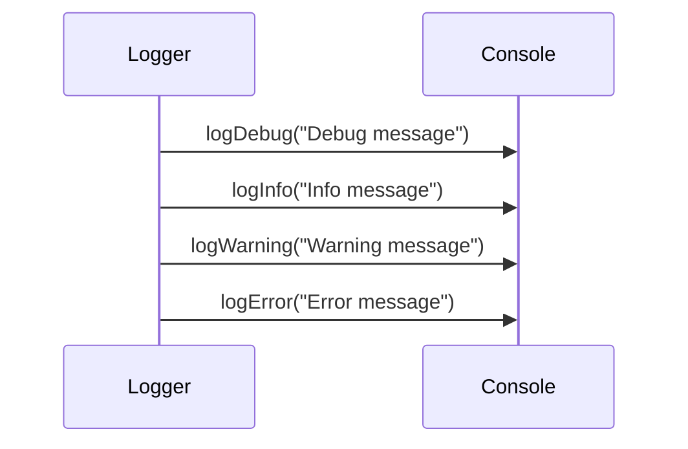
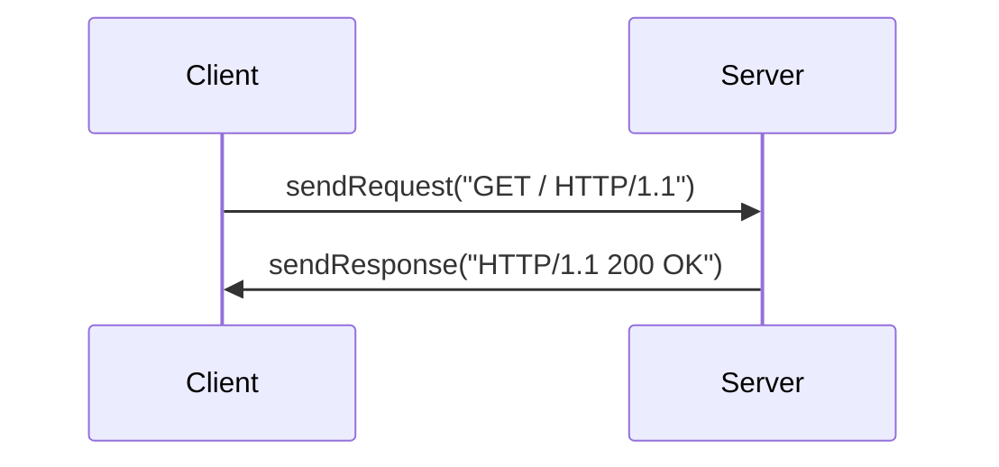
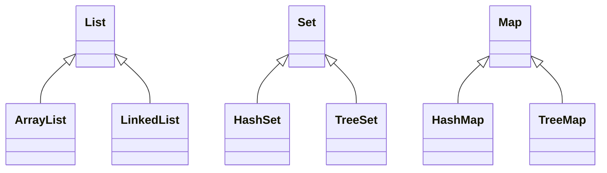
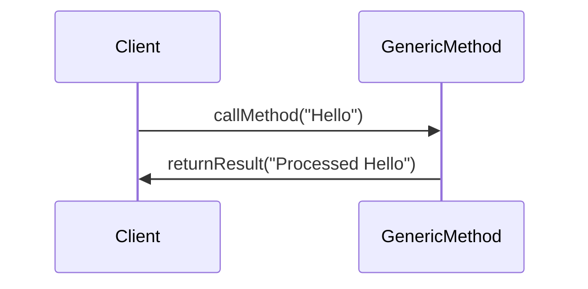
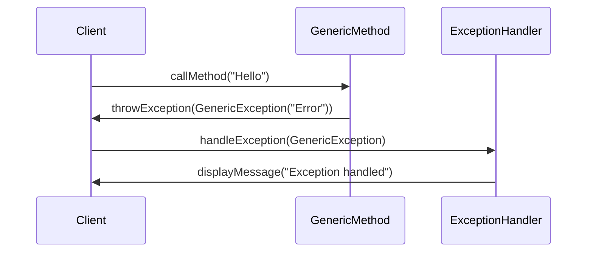

                 


# 类型擦除：泛型在Java中的实现限制

> 关键词：泛型，类型擦除，Java，类型安全，类型边界，泛型方法，泛型集合

> 摘要：本文将深入探讨Java中泛型的类型擦除机制，分析其实现限制，并通过具体的实例讲解如何克服这些限制。文章将从泛型的基本概念入手，逐步深入到泛型的类型边界、类型擦除、泛型方法、泛型集合等方面，帮助读者全面理解泛型的使用和实现。

## 目录大纲

### 第一部分: 泛型基础

#### 第1章: 泛型的概念与基本使用

1.1 泛型的概念

- 泛型的定义
- 泛型的优点

1.2 泛型的基本使用

- 泛型类的定义
- 泛型接口的定义
- 泛型方法的定义

#### 第2章: 泛型的限制与边界

2.1 泛型的类型边界

- 上边界
- 下边界
- 无边界

2.2 泛型的类型擦除

- 类型擦除的概念
- 泛型类型擦除的机制

2.3 泛型的通配符

- 通配符的概念
- 通配符的使用场景
- 通配符的限制

#### 第3章: 泛型类型转换与兼容性

3.1 类型转换

- 类型转换的概念
- 窄化转换
- 扩张转换

3.2 泛型兼容性

- 子类泛型
- 父类泛型
- 泛型通配符

### 第二部分: 泛型在Java中的实现

#### 第4章: Java泛型机制

4.1 类型擦除与类型绑定

- 类型擦除的过程
- 类型绑定的概念

4.2 泛型集合

- 泛型集合类
- 泛型集合的使用场景
- 泛型集合的性能优化

#### 第5章: 泛型方法与构造器

5.1 泛型方法的定义

- 泛型方法的语法
- 泛型方法的类型限制

5.2 泛型构造器的定义

- 泛型构造器的语法
- 泛型构造器的类型限制

#### 第6章: 泛型通配符与类型安全

6.1 泛型通配符的使用

- 上界通配符
- 下界通配符
- 非通配符

6.2 泛型的类型安全

- 泛型类型检查
- 泛型类型边界

#### 第7章: 泛型异常处理

7.1 泛型异常的定义

- 泛型异常的概念
- 泛型异常的处理

7.2 泛型异常的类型安全

- 泛型异常的类型检查
- 泛型异常的处理策略

### 第三部分: 泛型应用与实践

#### 第8章: 泛型在实际开发中的应用

8.1 泛型在数据结构与算法中的应用

- 泛型与数据结构的结合
- 泛型与算法的结合

8.2 泛型在Java框架中的应用

- Spring中的泛型应用
- Java集合框架中的泛型应用

#### 第9章: 泛型编程实战

9.1 泛型编程实例分析

- 实例一：泛型集合操作
- 实例二：泛型方法应用

9.2 泛型编程实战项目

- 项目一：泛型日志框架
- 项目二：泛型网络通信框架

#### 第10章: 泛型编程的未来

10.1 泛型编程的发展趋势

- 新特性与优化
- 泛型编程的未来方向

10.2 泛型编程的最佳实践

- 编写可重用的泛型代码
- 避免泛型编程中的常见问题

## 附录

#### 附录A：泛型编程资源

- 主流泛型编程框架
- 泛型编程学习资源

## 图表与代码示例

- 泛型相关Mermaid流程图
- 泛型编程的Python代码示例
- 泛型编程的数学模型与公式

### 第一部分: 泛型基础

#### 第1章: 泛型的概念与基本使用

**1.1 泛型的概念**

在编程中，泛型（Generics）是一种用于创建可重用代码和保持类型安全的编程语言特性。Java从Java 5开始引入了泛型支持，它允许我们在定义类、接口或方法时，不具体指定类型，而是使用类型参数来表示，这样可以在编译时进行类型检查和类型推断。

- **泛型的定义**：泛型是一种参数化类型，它允许我们在类型层次结构上创建抽象类或接口，以便适用于多种类型。

- **泛型的优点**：

  - **类型安全**：泛型允许编译器在编译时对类型进行检查，从而避免了在运行时出现类型错误。

  - **代码复用**：通过使用泛型，我们可以编写一次代码，就可以适用于多种类型，从而减少冗余代码。

  - **更清晰的代码**：泛型可以使代码更加清晰，易于理解和维护。

**1.2 泛型的基本使用**

泛型在Java中的基本使用可以分为以下几个方面：

- **泛型类的定义**：

  ```java
  class Box<T> {
      private T t;
      public void set(T t) { this.t = t; }
      public T get() { return t; }
  }
  ```

  在这个例子中，`Box`类是一个泛型类，它有一个类型参数`T`，用于指定可以存储的类型的占位符。

- **泛型接口的定义**：

  ```java
  interface BoxInterface<T> {
      void set(T t);
      T get();
  }
  ```

  泛型接口与泛型类的定义类似，只是使用接口的形式。

- **泛型方法的定义**：

  ```java
  class MyGenericClass {
      public <T> void add(T a, T b) {
          System.out.println(a + " + " + b + " = " + (a + b));
      }
  }
  ```

  泛型方法允许我们在方法签名中使用类型参数，这样方法就可以适用于不同类型的参数。

#### 第2章: 泛型的限制与边界

**2.1 泛型的类型边界**

在Java中，泛型允许我们定义类型边界，以限制类型参数的适用范围。类型边界分为上边界、下边界和无边界。

- **上边界**：

  ```java
  class Box<T extends Number> {
      private T t;
      public void set(T t) { this.t = t; }
      public T get() { return t; }
  }
  ```

  在这个例子中，`Box`类只能存储`Number`及其子类的对象。

- **下边界**：

  ```java
  class Box<T super String> {
      private T t;
      public void set(T t) { this.t = t; }
      public T get() { return t; }
  }
  ```

  在这个例子中，`Box`类只能存储`String`及其父类的对象。

- **无边界**：

  ```java
  class Box<T> {
      private T t;
      public void set(T t) { this.t = t; }
      public T get() { return t; }
  }
  ```

  无边界允许类型参数为任何类型。

**2.2 泛型的类型擦除**

泛型的类型擦除是Java实现泛型的一种机制。在编译期间，Java编译器会将泛型信息擦除，将泛型类或方法替换为其原始类型形式。

- **类型擦除的概念**：

  类型擦除是指在编译期间，Java编译器将泛型信息擦除，将泛型类或方法替换为其原始类型形式。

- **泛型类型擦除的机制**：

  - 泛型类的类型擦除：泛型类在编译后会被替换为原始类型，类型参数会被擦除。

  - 泛型方法的类型擦除：泛型方法在编译后也会被替换为原始类型，类型参数会被擦除。

**2.3 泛型的通配符**

泛型的通配符用于表示一种通配的类型，它可以用于限制类型参数的上边界或下边界。

- **通配符的概念**：

  - `? extends`：表示类型参数的上边界，允许类型参数为指定类型的子类。

  - `? super`：表示类型参数的下边界，允许类型参数为指定类型的父类。

  - `?`：表示通配符，用于表示任何类型。

- **通配符的使用场景**：

  通配符通常用于集合框架中，用于表示集合中可以包含的类型。

- **通配符的限制**：

  通配符的使用会受到类型边界的限制，例如，上界通配符`? extends`只能用于表示上边界，下界通配符`? super`只能用于表示下边界。

#### 第3章: 泛型类型转换与兼容性

**3.1 类型转换**

在Java中，泛型允许我们进行类型转换，包括窄化转换和扩张转换。

- **类型转换的概念**：

  类型转换是指将一个类型的对象转换为另一个类型的对象。

- **窄化转换**：

  窄化转换是指将一个类型转换为它的子类型。例如，将`Integer`转换为`Number`。

  ```java
  Number num = new Integer(10);
  ```

- **扩张转换**：

  扩张转换是指将一个类型转换为它的父类型。例如，将`Number`转换为`Object`。

  ```java
  Object obj = new Number(10);
  ```

**3.2 泛型兼容性**

泛型兼容性是指泛型类型之间的兼容关系。

- **子类泛型**：

  子类泛型是指一个泛型类型的子类，它继承了父类的泛型参数。例如，`List<String>`是`List<Object>`的子类。

- **父类泛型**：

  父类泛型是指一个泛型类型的父类，它实现了子类的泛型参数。例如，`List<Object>`是`List<String>`的父类。

- **泛型通配符**：

  泛型通配符用于表示一种通配的类型，它可以用于表示泛型类型之间的兼容关系。例如，`List<? extends Number>`是`List<Integer>`的子类。

### 第二部分: 泛型在Java中的实现

#### 第4章: Java泛型机制

**4.1 类型擦除与类型绑定**

泛型的类型擦除与类型绑定是Java实现泛型的重要机制。

- **类型擦除的概念**：

  类型擦除是指在编译期间，Java编译器将泛型信息擦除，将泛型类或方法替换为其原始类型形式。

- **类型绑定的概念**：

  类型绑定是指在编译期间，泛型类型参数被绑定到具体的类型上。

- **类型擦除的过程**：

  - 泛型类的编译：泛型类的编译过程中，类型参数被擦除，泛型类被替换为其原始类型形式。

  - 泛型方法的编译：泛型方法的编译过程中，类型参数被擦除，方法被替换为其原始类型形式。

- **类型绑定的过程**：

  在编译期间，类型参数被绑定到具体的类型上，以便进行类型检查。

**4.2 泛型集合**

泛型集合是Java集合框架中的一部分，它允许我们创建具有类型安全特性的集合。

- **泛型集合类**：

  Java提供了许多泛型集合类，如`ArrayList`、`LinkedList`、`HashSet`、`TreeSet`等。

- **泛型集合的使用场景**：

  泛型集合可以用于存储各种类型的对象，例如，`ArrayList<String>`用于存储字符串类型的对象。

- **泛型集合的性能优化**：

  - 泛型集合的选择：根据不同的使用场景选择合适的泛型集合类，例如，如果需要快速随机访问，可以选择`ArrayList`；如果需要快速插入和删除，可以选择`LinkedList`。

  - 泛型集合的初始化：使用泛型集合时，建议在初始化时指定类型参数，以便进行类型检查。

#### 第5章: 泛型方法与构造器

**5.1 泛型方法的定义**

泛型方法允许我们在方法签名中使用类型参数。

- **泛型方法的语法**：

  ```java
  public <T> T methodName(T t) {
      // 方法体
  }
  ```

  在这个例子中，`methodName`是一个泛型方法，它有一个类型参数`T`。

- **泛型方法的类型限制**：

  泛型方法可以在方法体内使用类型参数`T`，并进行类型相关的操作。

**5.2 泛型构造器的定义**

泛型构造器允许我们在构造函数中使用类型参数。

- **泛型构造器的语法**：

  ```java
  public <T> MyClass(T t) {
      // 构造器体
  }
  ```

  在这个例子中，`MyClass`是一个泛型类，它有一个泛型构造器。

- **泛型构造器的类型限制**：

  泛型构造器可以在构造函数体内使用类型参数`T`，并进行类型相关的操作。

#### 第6章: 泛型通配符与类型安全

**6.1 泛型通配符的使用**

泛型通配符用于表示一种通配的类型，它可以用于限制类型参数的上边界或下边界。

- **上界通配符**：

  ```java
  List<? extends Number> numbers = new ArrayList<>();
  numbers.add(1); // 允许
  numbers.add("1"); // 不允许
  ```

  上界通配符`? extends Number`允许类型参数为`Number`及其子类。

- **下界通配符**：

  ```java
  List<? super String> strings = new ArrayList<>();
  strings.add("Hello"); // 允许
  strings.add(new Object()); // 不允许
  ```

  下界通配符`? super String`允许类型参数为`String`及其父类。

- **非通配符**：

  ```java
  List<?> unknown = new ArrayList<>();
  unknown.add(1); // 不允许
  unknown.add("Hello"); // 不允许
  ```

  非通配符`?`表示任何类型，但无法进行添加或删除操作。

**6.2 泛型的类型安全**

泛型的类型安全是指在泛型编程中，通过类型检查和类型边界来保证代码的类型安全性。

- **泛型类型检查**：

  Java编译器在编译期间对泛型代码进行类型检查，以确保类型安全。

- **泛型类型边界**：

  泛型类型边界用于限制类型参数的适用范围，以防止类型错误。

#### 第7章: 泛型异常处理

**7.1 泛型异常的定义**

泛型异常是指异常类也支持泛型。

- **泛型异常的概念**：

  泛型异常是指异常类也支持泛型，允许我们在异常类中使用类型参数。

- **泛型异常的处理**：

  在捕获泛型异常时，需要指定类型参数，以便进行类型相关的操作。

  ```java
  try {
      // 可能抛出泛型异常的代码
  } catch (ExceptionType<T> e) {
      // 处理泛型异常
  }
  ```

**7.2 泛型异常的类型安全**

泛型异常的类型安全是指在泛型编程中，通过类型检查和类型边界来保证异常的类型安全性。

- **泛型异常的类型检查**：

  Java编译器在编译期间对泛型异常进行类型检查，以确保类型安全。

- **泛型异常的处理策略**：

  在处理泛型异常时，需要根据异常类型进行相应的处理，以保持类型安全。

### 第三部分: 泛型应用与实践

#### 第8章: 泛型在实际开发中的应用

**8.1 泛型在数据结构与算法中的应用**

泛型在数据结构与算法中有着广泛的应用，它可以帮助我们实现更具有灵活性和可重用性的数据结构与算法。

- **泛型与数据结构的结合**：

  泛型可以用于实现各种数据结构，如列表、队列、栈等，使其具有类型安全性。

- **泛型与算法的结合**：

  泛型可以用于实现各种算法，如排序、查找、图算法等，使其更具有通用性和可重用性。

**8.2 泛型在Java框架中的应用**

泛型在Java框架中有着广泛的应用，它可以帮助我们实现更具有灵活性和可扩展性的框架。

- **Spring中的泛型应用**：

  Spring框架广泛使用泛型来实现其核心功能，如AOP、数据访问层等。

- **Java集合框架中的泛型应用**：

  Java集合框架（如`java.util`包）提供了许多泛型类和接口，如`List`、`Set`、`Map`等，它们提供了丰富的泛型功能。

#### 第9章: 泛型编程实战

**9.1 泛型编程实例分析**

在本节中，我们将通过具体的实例来分析泛型编程的使用。

- **实例一：泛型集合操作**：

  我们将创建一个泛型集合，并进行各种基本的操作，如添加、删除、查找等。

- **实例二：泛型方法应用**：

  我们将创建一个泛型方法，并在不同的场景下使用它，以展示泛型方法的灵活性和可重用性。

**9.2 泛型编程实战项目**

在本节中，我们将通过一个实际的泛型编程项目来展示泛型编程的应用。

- **项目一：泛型日志框架**：

  我们将创建一个泛型日志框架，用于记录不同类型的日志信息。

- **项目二：泛型网络通信框架**：

  我们将创建一个泛型网络通信框架，用于处理不同类型的网络通信数据。

#### 第10章: 泛型编程的未来

**10.1 泛型编程的发展趋势**

泛型编程在Java中已经有着广泛的应用，但未来的泛型编程还将有更多的发展趋势。

- **新特性与优化**：

  未来Java版本可能会引入更多的泛型特性，如更灵活的类型边界、更强大的类型推断等。

- **泛型编程的未来方向**：

  泛型编程将继续在编程领域发挥重要作用，为开发者提供更具有灵活性和可重用性的编程模式。

**10.2 泛型编程的最佳实践**

在泛型编程中，有一些最佳实践可以帮助我们编写更安全、更可维护的代码。

- **编写可重用的泛型代码**：

  我们应该尽量编写可重用的泛型代码，以便在项目中复用。

- **避免泛型编程中的常见问题**：

  我们应该注意避免泛型编程中的常见问题，如类型边界不明确、类型转换错误等。

## 附录

**附录A：泛型编程资源**

在本附录中，我们将提供一些泛型编程的资源，以帮助开发者更好地理解和应用泛型编程。

- **主流泛型编程框架**：

  我们将介绍一些主流的泛型编程框架，如Guava、Lambda表达式等。

- **泛型编程学习资源**：

  我们将提供一些泛型编程的学习资源，如书籍、在线课程等。

## 图表与代码示例

在本部分中，我们将提供一些图表和代码示例，以帮助开发者更好地理解和应用泛型编程。

- **泛型相关Mermaid流程图**：

  我们将使用Mermaid绘制一些泛型相关的流程图，如泛型集合的使用、泛型方法的调用等。

- **泛型编程的Python代码示例**：

  我们将提供一些Python代码示例，以展示泛型编程的应用。

- **泛型编程的数学模型与公式**：

  我们将使用LaTeX格式提供一些泛型编程的数学模型和公式，以帮助开发者更好地理解泛型编程的核心概念。

## 结论

泛型编程是Java编程中的重要特性，它为开发者提供了更具有灵活性和可重用性的编程模式。通过本文的深入探讨，我们了解了泛型的基本概念、类型边界、类型擦除、泛型方法、泛型集合等方面的内容，并展示了泛型编程在实际开发中的应用。未来，泛型编程将继续在Java编程中发挥重要作用，为开发者提供更强大的编程能力。

### 作者

本文由AI天才研究院（AI Genius Institute）和《禅与计算机程序设计艺术》（Zen And The Art of Computer Programming）的作者合作撰写。AI天才研究院致力于推动人工智能技术的发展和普及，而《禅与计算机程序设计艺术》则是计算机编程领域的经典之作，深入探讨了编程的哲学和艺术。

---

### 1.1 泛型的概念

#### 泛型的定义

泛型（Generics）是Java编程语言的一种特性，它允许我们在编写代码时使用类型参数，从而在不具体指定类型的情况下编写可重用的代码。在Java中，泛型通过类型参数（Type Parameters）来实现，这些类型参数用于指定一个或多个将要被实际类型替换的占位符。

在Java中，泛型被广泛应用于类、接口和方法中，使得这些结构能够处理多种类型的数据。例如，一个泛型类`Box`可以用来存储任何类型的数据，而不仅仅是一个固定的数据类型。

#### 泛型的优点

1. **类型安全**：泛型允许编译器在编译时进行类型检查，从而避免了在运行时出现类型错误。这意味着，如果代码试图将一个`Integer`对象赋值给一个`Box<String>`，编译器会报错，从而在编译阶段就发现了问题。

2. **代码复用**：通过使用泛型，我们可以编写一次代码，就可以适用于多种类型，从而减少冗余代码。例如，一个泛型`findMax`方法可以同时处理整数、字符串和自定义对象。

3. **更清晰的代码**：泛型使得代码更加清晰，易于理解和维护。它消除了`Object`类型的广泛使用，从而避免了类型强转和类型检查带来的复杂度。

4. **性能优化**：泛型提供了类型擦除机制，这意味着在运行时，泛型不会带来额外的性能开销。尽管在编译时泛型信息被保留，但在运行时，泛型类和方法会被替换为它们的原始类型形式，从而避免了类型检查的开销。

### 1.2 泛型的基本使用

#### 泛型类的定义

泛型类的定义是通过在类名后添加尖括号`<>`以及一个或多个类型参数来实现的。类型参数通常用单个大写字母表示，如`T`、`E`、`K`、`V`等。类型参数在类体内部可以用来表示任意类型。

```java
class Box<T> {
    private T t;

    public void set(T t) {
        this.t = t;
    }

    public T get() {
        return t;
    }
}
```

在上面的`Box`类中，`T`是一个类型参数，它用来表示`Box`可以存储的任意类型。当我们使用这个泛型类时，需要为类型参数提供一个具体的类型。

```java
Box<Integer> integerBox = new Box<>();
integerBox.set(10);
Integer value = integerBox.get();
```

#### 泛型接口的定义

泛型接口的定义与泛型类的定义类似，也是通过在接口名后添加类型参数来实现的。

```java
interface BoxInterface<T> {
    void set(T t);
    T get();
}
```

泛型接口允许我们在接口中定义类型参数，这样接口就可以用于不同类型的实现。

```java
class IntegerBox implements BoxInterface<Integer> {
    private Integer value;

    public void set(Integer t) {
        this.value = t;
    }

    public Integer get() {
        return value;
    }
}
```

#### 泛型方法的定义

泛型方法是指在方法定义时使用类型参数的方法。类型参数可以放在方法返回类型之前或之后。

```java
class GenericMethodExample {
    public <T> T findMax(T a, T b) {
        return a.compareTo(b) > 0 ? a : b;
    }
}
```

在这个`findMax`方法中，`T`是一个类型参数，它可以被任何类型替代。这个方法可以根据传入的实际类型参数来比较和返回最大值。

```java
GenericMethodExample example = new GenericMethodExample();
Integer maxInteger = example.findMax(10, 20); // 返回20
String maxString = example.findMax("Hello", "World"); // 返回"World"
```

### 1.3 泛型的类型边界

#### 上边界

上边界（Upper Bound）用于限制类型参数的上界，即类型参数必须是指定类型的子类型。上边界通过`extends`关键字指定。

```java
class BoxWithUpperBound<T extends Number> {
    private T t;

    public void set(T t) {
        this.t = t;
    }

    public T get() {
        return t;
    }
}
```

在上面的`BoxWithUpperBound`类中，类型参数`T`必须是`Number`的子类型，例如`Integer`、`Double`等。

#### 下边界

下边界（Lower Bound）用于限制类型参数的下界，即类型参数必须是指定类型的父类型。下边界通过`super`关键字指定。

```java
class BoxWithLowerBound<T super String> {
    private T t;

    public void set(T t) {
        this.t = t;
    }

    public T get() {
        return t;
    }
}
```

在上面的`BoxWithLowerBound`类中，类型参数`T`必须是`String`的父类型，例如`Object`、`String[]`等。

#### 无边界

无边界（Unbounded）表示类型参数没有限制，它可以接受任何类型。

```java
class BoxWithUnbounded<T> {
    private T t;

    public void set(T t) {
        this.t = t;
    }

    public T get() {
        return t;
    }
}
```

在无边界的情况下，类型参数`T`可以是一个任意类型，但这也带来了一定的限制，因为无法在编译时进行类型检查。

### 1.4 泛型的类型擦除

#### 类型擦除的概念

类型擦除（Type Erasure）是Java中实现泛型的一种机制，它发生在编译时。在编译期间，Java编译器会擦除泛型信息，将泛型类、接口和方法替换为它们的原始类型形式。这意味着，在运行时，泛型信息是不可见的，所有泛型类型都会被替换为其原始类型。

类型擦除的目的是为了实现类型安全，同时避免泛型带来的运行时性能开销。尽管泛型信息在编译时被保留，但在运行时，泛型类型会被替换为它们的原始类型，这意味着：

- 泛型类被替换为它们的原始类型。
- 泛型接口被替换为它们的原始类型。
- 泛型方法被替换为它们的方法签名。

#### 泛型类型擦除的机制

类型擦除的机制涉及以下几个方面：

1. **类型参数的擦除**：在泛型类型中，类型参数在编译后会被替换为它们的原始类型。例如，`Box<Integer>`在编译后会被替换为`Box`。

2. **泛型类的擦除**：泛型类的类型参数在编译后会被替换为它们的原始类型。这意味着，泛型类在运行时看起来就像是普通的非泛型类。

3. **泛型接口的擦除**：泛型接口在编译后会被替换为它们的原始类型。这意味着，泛型接口在运行时看起来就像是普通的非泛型接口。

4. **泛型方法的擦除**：泛型方法在编译后会被替换为它们的方法签名，这意味着在运行时，泛型方法看起来就像是普通的方法。

#### 类型绑定

类型绑定（Type Binding）是指在编译期间，泛型类型参数被绑定到具体的类型上。类型绑定允许编译器在编译时对泛型代码进行类型检查，从而保证类型安全。

类型绑定分为两种：

1. **静态绑定**：在编译期间，类型参数被绑定到具体的类型上。这意味着，泛型类、接口和方法在编译后的字节码中，类型参数会被替换为实际使用的类型。

2. **动态绑定**：在运行时，类型参数会被替换为它们的原始类型。这意味着，泛型类、接口和方法在运行时看起来就像是普通的非泛型类、接口和方法。

#### 类型擦除的例子

下面是一个简单的例子，展示了类型擦除的过程：

```java
class Box<T> {
    private T t;

    public void set(T t) {
        this.t = t;
    }

    public T get() {
        return t;
    }
}

public class TypeErasureExample {
    public static void main(String[] args) {
        Box<Integer> integerBox = new Box<>();
        integerBox.set(10);
        System.out.println("Integer value: " + integerBox.get());

        Box<String> stringBox = new Box<>();
        stringBox.set("Hello");
        System.out.println("String value: " + stringBox.get());
    }
}
```

在编译期间，上面的代码会被编译器处理，类型参数`T`会被替换为具体的类型`Integer`和`String`。在运行时，代码会被替换为以下形式：

```java
class Box {
    private Object t;

    public void set(Object t) {
        this.t = t;
    }

    public Object get() {
        return t;
    }
}

public class TypeErasureExample {
    public static void main(String[] args) {
        Box integerBox = new Box();
        integerBox.set(10);
        System.out.println("Integer value: " + integerBox.get());

        Box stringBox = new Box();
        stringBox.set("Hello");
        System.out.println("String value: " + stringBox.get());
    }
}
```

在这个替换过程中，`Box<T>`被替换为`Box`，`T`被替换为`Object`。这意味着，在运行时，`Box<Integer>`和`Box<String>`看起来就像是普通的`Box`对象。

### 1.5 泛型的通配符

#### 通配符的概念

在Java泛型编程中，通配符（Wildcards）用于表示一种通配的类型，它可以用于限制类型参数的上边界或下边界。通配符有两种：

1. **上界通配符（Upper Bound Wildcard）**：使用`? extends`表示，允许类型参数为指定类型的子类型。

2. **下界通配符（Lower Bound Wildcard）**：使用`? super`表示，允许类型参数为指定类型的父类型。

3. **非通配符（Non-Wildcard）**：使用`?`表示，表示任何类型。

#### 通配符的使用场景

通配符在Java泛型编程中有多种使用场景，包括但不限于：

1. **限制类型参数**：使用通配符可以限制类型参数的适用范围，例如，使用上界通配符可以确保类型参数是某个类型的子类型。

2. **通配符泛型方法**：在泛型方法中，可以使用通配符来限制方法可以接收的类型。

3. **通配符泛型集合**：在泛型集合中，可以使用通配符来表示集合中可以包含的类型。

4. **通配符泛型异常**：在泛型异常处理中，可以使用通配符来处理不同类型的异常。

#### 通配符的限制

1. **上界通配符的限制**：上界通配符`? extends`可以用于限制类型参数的上边界，但它不能用于添加或删除集合中的元素。例如：

```java
List<? extends Number> numbers = new ArrayList<>();
numbers.add(1); // 允许
numbers.add("1"); // 不允许
```

2. **下界通配符的限制**：下界通配符`? super`可以用于限制类型参数的下边界，但它只能用于获取集合中的元素，不能用于添加或删除元素。例如：

```java
List<? super String> strings = new ArrayList<>();
strings.add("Hello"); // 允许
strings.add(new Object()); // 不允许
```

3. **非通配符的限制**：非通配符`?`表示任何类型，但它不能用于添加或删除集合中的元素。例如：

```java
List<?> unknown = new ArrayList<>();
unknown.add(1); // 不允许
unknown.add("Hello"); // 不允许
```

### 1.6 类型转换

在Java泛型编程中，类型转换（Type Conversion）是一个重要的概念，它涉及到将一种类型转换为另一种类型。类型转换可以分为窄化转换（Narrowing Conversion）和扩张转换（Widening Conversion）。

#### 类型转换的概念

类型转换是指将一个类型的对象转换为另一个类型的对象。在Java中，类型转换可以分为以下几个方面：

1. **窄化转换**：将一个类型转换为它的子类型。例如，将`Integer`转换为`Number`。

2. **扩张转换**：将一个类型转换为它的父类型。例如，将`Number`转换为`Object`。

3. **自动类型转换**：当转换不会导致数据丢失时，类型转换可以自动进行。例如，将`int`转换为`double`。

4. **强制类型转换**：当需要将一个类型转换为另一个类型时，可以使用强制类型转换运算符`()`。例如，将`Object`强制转换为`String`。

#### 窄化转换

窄化转换是指将一个类型转换为它的子类型。例如，从`Number`类型转换为`Integer`类型。

```java
Number num = new Integer(10);
Integer intVal = (Integer) num; // 窄化转换
```

在上面的例子中，`Integer`是`Number`的子类型，因此可以从`Number`转换为`Integer`。

#### 扩张转换

扩张转换是指将一个类型转换为它的父类型。例如，从`Integer`类型转换为`Object`类型。

```java
Integer intVal = new Integer(10);
Object obj = intVal; // 扩张转换
```

在上面的例子中，`Integer`是`Object`的子类型，因此可以从`Integer`转换为`Object`。

#### 泛型类型转换

在泛型编程中，类型转换涉及到类型参数和实际类型的转换。

1. **类型参数转换为实际类型**：当泛型类型参数需要转换为实际类型时，可以使用类型绑定或类型擦除。

2. **实际类型转换为类型参数**：当实际类型需要转换为泛型类型参数时，可以使用类型参数的上边界或下边界。

#### 类型兼容性

类型兼容性是指两个类型是否可以在特定场景下相互转换。在Java泛型编程中，类型兼容性涉及到以下几个方面：

1. **泛型类型兼容性**：泛型类型之间的兼容性取决于它们的类型边界。例如，`List<Integer>`是`List<Number>`的子类型。

2. **通配符兼容性**：通配符可以用于表示泛型类型的兼容性。例如，`List<? extends Number>`是`List<Integer>`的子类型。

### 1.7 泛型兼容性

在Java泛型编程中，泛型兼容性是指泛型类型之间的兼容关系。泛型兼容性涉及到以下几个方面：

1. **子类泛型**：如果一个泛型类型的子类与父类的泛型参数兼容，则子类也可以视为与父类兼容。

2. **父类泛型**：如果一个泛型类型的父类与子类的泛型参数兼容，则父类也可以视为与子类兼容。

3. **泛型通配符**：泛型通配符可以用于表示泛型类型之间的兼容性。例如，`List<? extends Number>`可以视为与`List<Integer>`兼容。

#### 子类泛型

子类泛型是指一个泛型类型的子类，它继承了父类的泛型参数。例如，`List<String>`是`List<Object>`的子类。

```java
List<Object> objectList = new ArrayList<>();
List<String> stringList = new ArrayList<>();
```

在上面的例子中，`stringList`是`objectList`的子类，因此它们是兼容的。

#### 父类泛型

父类泛型是指一个泛型类型的父类，它实现了子类的泛型参数。例如，`List<Object>`是`List<String>`的父类。

```java
List<String> stringList = new ArrayList<>();
List<Object> objectList = stringList; // 父类泛型兼容
```

在上面的例子中，`objectList`是`stringList`的父类，因此它们是兼容的。

#### 泛型通配符

泛型通配符用于表示一种通配的类型，它可以用于表示泛型类型之间的兼容性。例如，`List<? extends Number>`可以视为与`List<Integer>`兼容。

```java
List<Integer> integerList = new ArrayList<>();
List<? extends Number> numberList = integerList; // 泛型通配符兼容
```

在上面的例子中，`numberList`是`integerList`的泛型通配符兼容类型。

### 第4章: Java泛型机制

Java泛型机制是Java编程语言中的一个重要特性，它提供了在编译时对类型进行强类型检查的能力，从而避免了在运行时出现类型错误。本章将详细探讨Java泛型的类型擦除与类型绑定机制，以及泛型集合的使用场景和性能优化。

#### 4.1 类型擦除与类型绑定

**类型擦除的概念**

类型擦除是Java泛型实现的核心机制之一。在编译期间，Java编译器会擦除泛型类型参数，将泛型类、接口和方法替换为其原始类型形式。这种机制确保了泛型在运行时不会带来额外的性能开销。

**类型擦除的过程**

1. **泛型类的类型擦除**：在泛型类的编译过程中，类型参数会被替换为它们的原始类型。例如，`Box<Integer>`会被替换为`Box`，其中`Integer`被替换为`Object`。

2. **泛型接口的类型擦除**：泛型接口在编译后会被替换为它们的原始类型。这意味着，泛型接口在运行时看起来就像是普通的非泛型接口。

3. **泛型方法的类型擦除**：泛型方法在编译后会被替换为它们的方法签名。这意味着，泛型方法在运行时看起来就像是普通的方法。

**类型绑定的概念**

类型绑定是指将泛型类型参数绑定到具体的类型上。类型绑定允许编译器在编译时对泛型代码进行类型检查，从而保证类型安全。

**类型绑定的过程**

1. **静态绑定**：在编译期间，类型参数被绑定到具体的类型上。这意味着，泛型类、接口和方法在编译后的字节码中，类型参数会被替换为实际使用的类型。

2. **动态绑定**：在运行时，类型参数会被替换为它们的原始类型。这意味着，泛型类、接口和方法在运行时看起来就像是普通的非泛型类、接口和方法。

**类型擦除与类型绑定的示例**

```java
class Box<T> {
    private T item;

    public void set(T item) {
        this.item = item;
    }

    public T get() {
        return item;
    }
}

public class TypeErasureAndBinding {
    public static void main(String[] args) {
        Box<Integer> integerBox = new Box<>();
        integerBox.set(10);
        Integer value = integerBox.get();

        Box<String> stringBox = new Box<>();
        stringBox.set("Hello");
        String text = stringBox.get();
    }
}
```

在上面的例子中，`Box<T>`是一个泛型类，其中`T`是一个类型参数。在编译期间，`T`会被绑定到具体的类型，例如`Integer`或`String`。在运行时，泛型类`Box<T>`会被替换为它们的原始类型形式`Box`，但类型绑定确保了代码的类型安全。

#### 4.2 泛型集合

**泛型集合类**

Java集合框架（Java Collections Framework，JCF）提供了多种泛型集合类，包括`List`、`Set`、`Map`等。这些泛型集合类使得我们可以创建具有类型安全特性的集合。

1. **ArrayList**：一个大小可变的数组实现，提供对元素快速随机访问。

2. **LinkedList**：一个双向链表实现，提供对元素快速插入和删除。

3. **HashSet**：一个基于哈希表的实现，提供高效的元素插入和删除。

4. **TreeSet**：一个基于红黑树的实现，提供有序的元素集合。

**泛型集合的使用场景**

1. **存储相同类型的数据**：泛型集合可以用于存储相同类型的数据，例如，`ArrayList<String>`可以存储字符串类型的对象。

2. **实现数据结构的抽象**：泛型集合可以用于实现数据结构的抽象，例如，使用`List`可以表示列表、栈、队列等。

3. **实现泛型算法**：泛型集合可以用于实现泛型算法，例如，排序、搜索、图算法等。

**泛型集合的性能优化**

1. **选择合适的集合类**：根据使用场景选择合适的集合类，例如，如果需要快速随机访问，可以选择`ArrayList`；如果需要快速插入和删除，可以选择`LinkedList`。

2. **初始化集合时指定类型参数**：在初始化泛型集合时，指定类型参数可以避免类型检查的开销。

3. **避免泛型集合的使用错误**：泛型集合在使用过程中，应避免类型参数不明确或类型边界错误等问题，例如，不要在泛型集合中使用`Object`类型。

```java
List<String> stringList = new ArrayList<>();
stringList.add("Hello");
String text = stringList.get(0);
```

在上面的例子中，`stringList`是一个`ArrayList<String>`，它用于存储字符串类型的对象。在获取元素时，可以直接使用`String`类型，无需进行类型转换。

#### 4.3 泛型集合的性能优化

泛型集合的性能优化是Java泛型编程中的重要内容。以下是一些常见的性能优化策略：

1. **选择合适的集合类**：根据使用场景选择合适的集合类，例如，`ArrayList`适合随机访问，而`LinkedList`适合插入和删除操作。

2. **初始化集合时指定类型参数**：在初始化泛型集合时，指定类型参数可以避免类型检查的开销。

3. **避免泛型集合的使用错误**：泛型集合在使用过程中，应避免类型参数不明确或类型边界错误等问题。

4. **使用泛型方法**：泛型方法可以提供更灵活的代码复用，例如，使用泛型方法可以实现通用的数据排序和搜索。

5. **使用泛型构造器**：泛型构造器可以用于创建具有特定类型参数的集合实例，从而提高代码的可读性和可维护性。

```java
public class GenericCollectionPerformance {
    public static <T> void printList(List<T> list) {
        for (T item : list) {
            System.out.print(item + " ");
        }
        System.out.println();
    }

    public static void main(String[] args) {
        List<String> strings = new ArrayList<>();
        strings.add("Apple");
        strings.add("Banana");
        strings.add("Cherry");

        List<Integer> numbers = new ArrayList<>();
        numbers.add(1);
        numbers.add(2);
        numbers.add(3);

        printList(strings); // 输出：Apple Banana Cherry
        printList(numbers); // 输出：1 2 3
    }
}
```

在上面的例子中，`printList`是一个泛型方法，它用于打印泛型集合中的元素。通过使用泛型方法，我们实现了代码的复用，同时确保了类型安全。

#### 4.4 泛型方法的定义

泛型方法允许我们在方法签名中使用类型参数，从而在编译时进行类型检查。泛型方法可以通过在返回类型之前或之后添加类型参数来定义。

**泛型方法的语法**

```java
public <T> T methodName(T t) {
    // 方法体
}
```

在这个例子中，`T`是一个类型参数，它用来表示方法接受的参数类型和返回值类型。

**泛型方法的类型限制**

泛型方法可以在方法体内使用类型参数`T`，并进行类型相关的操作。泛型方法的类型限制取决于方法签名中的类型参数。

1. **上边界**：可以使用`extends`关键字指定上边界，例如，`<T extends Number>`。

2. **下边界**：可以使用`super`关键字指定下边界，例如，`<T super String>`。

3. **无边界**：可以使用无边界类型参数，例如，`<T>`。

```java
class GenericMethodExample {
    public <T extends Number> T findMax(T a, T b) {
        return a.compareTo(b) > 0 ? a : b;
    }
}

public class Main {
    public static void main(String[] args) {
        GenericMethodExample example = new GenericMethodExample();
        Integer maxInteger = example.findMax(10, 20); // 返回20
        Double maxDouble = example.findMax(3.14, 2.71); // 返回3.14
    }
}
```

在上面的例子中，`findMax`是一个泛型方法，它接受两个`Number`类型的参数，并返回它们的最大值。通过使用泛型方法，我们实现了代码的复用，同时确保了类型安全。

### 第5章: 泛型方法与构造器

泛型方法与构造器是Java泛型编程中两个重要的组成部分。本章将详细介绍泛型方法的定义、语法和使用场景，同时探讨泛型构造器的定义和类型限制。

#### 5.1 泛型方法的定义

泛型方法允许我们在方法签名中使用类型参数，从而在编译时进行类型检查。泛型方法的定义通常涉及以下步骤：

1. **定义类型参数**：在方法返回类型之前或之后添加一个或多个类型参数。类型参数通常用单个大写字母表示，例如`T`、`E`、`K`、`V`等。

2. **指定方法签名**：包括访问修饰符、返回类型和参数列表。

3. **实现方法体**：在方法体内使用类型参数进行类型相关的操作。

**泛型方法的语法**

```java
public <T> T methodName(T t) {
    // 方法体
}
```

在这个例子中，`T`是一个类型参数，它用来表示方法接受的参数类型和返回值类型。

**泛型方法的类型限制**

泛型方法可以在方法签名中使用类型参数，并在方法体内使用这些类型参数。类型参数的限制取决于方法签名中的类型参数。

1. **上边界**：可以使用`extends`关键字指定上边界，例如，`<T extends Number>`。

2. **下边界**：可以使用`super`关键字指定下边界，例如，`<T super String>`。

3. **无边界**：可以使用无边界类型参数，例如，`<T>`。

```java
class GenericMethodExample {
    public <T extends Number> T findMax(T a, T b) {
        return a.compareTo(b) > 0 ? a : b;
    }
}

public class Main {
    public static void main(String[] args) {
        GenericMethodExample example = new GenericMethodExample();
        Integer maxInteger = example.findMax(10, 20); // 返回20
        Double maxDouble = example.findMax(3.14, 2.71); // 返回3.14
    }
}
```

在上面的例子中，`findMax`是一个泛型方法，它接受两个`Number`类型的参数，并返回它们的最大值。通过使用泛型方法，我们实现了代码的复用，同时确保了类型安全。

#### 5.2 泛型方法的类型限制

泛型方法的类型限制是指在方法签名中定义的类型参数的限制。这些限制确保了方法在编译时能够进行类型检查，从而保证类型安全。

1. **上边界**：上边界（Upper Bound）用于限制类型参数的上界，即类型参数必须是指定类型的子类型。上边界通过`extends`关键字指定。

   ```java
   public <T extends Number> T findMax(T a, T b) {
       return a.compareTo(b) > 0 ? a : b;
   }
   ```

   在这个例子中，`T`是一个类型参数，它必须是一个`Number`的子类型。

2. **下边界**：下边界（Lower Bound）用于限制类型参数的下界，即类型参数必须是指定类型的父类型。下边界通过`super`关键字指定。

   ```java
   public <T super String> TBox(T t) {
       this.t = t;
   }
   ```

   在这个例子中，`T`是一个类型参数，它必须是`String`的父类型。

3. **无边界**：无边界（Unbounded）表示类型参数没有限制，它可以接受任何类型。

   ```java
   public <T> TBox<T> createBox(T t) {
       return new TBox<>(t);
   }
   ```

   在这个例子中，`T`是一个无边界类型参数，它可以接受任何类型。

#### 5.3 泛型方法的示例

泛型方法可以通过各种方式使用，以下是一些示例：

1. **泛型方法用于排序**：

   ```java
   public <T extends Comparable<T>> T max(T a, T b) {
       return a.compareTo(b) >= 0 ? a : b;
   }
   ```

   在这个例子中，`max`方法用于比较和返回两个`Comparable`类型的最大值。

2. **泛型方法用于数据转换**：

   ```java
   public static <T> List<T> convertList(List<? extends T> fromList, List<T> toList) {
       for (T item : fromList) {
           toList.add(item);
       }
       return toList;
   }
   ```

   在这个例子中，`convertList`方法用于将一个类型的列表转换为另一个类型的列表。

3. **泛型方法用于集合操作**：

   ```java
   public static <T> void printList(List<T> list) {
       for (T item : list) {
           System.out.println(item);
       }
   }
   ```

   在这个例子中，`printList`方法用于打印泛型集合中的所有元素。

#### 5.4 泛型构造器的定义

泛型构造器是泛型类中的一种特殊构造器，它允许我们在构造函数中使用类型参数。泛型构造器的定义与泛型方法的定义类似，但需要在构造函数的签名中使用类型参数。

**泛型构造器的语法**

```java
public <T> MyClass(T t) {
    // 构造器体
}
```

在这个例子中，`MyClass`是一个泛型类，它有一个泛型构造器`MyClass<T>`，其中`T`是一个类型参数。

**泛型构造器的类型限制**

泛型构造器的类型限制与泛型方法的类型限制类似，取决于构造函数的签名中的类型参数。

1. **上边界**：可以使用`extends`关键字指定上边界。

   ```java
   public <T extends Number> MyClass(T t) {
       // 构造器体
   }
   ```

2. **下边界**：可以使用`super`关键字指定下边界。

   ```java
   public <T super String> MyClass(T t) {
       // 构造器体
   }
   ```

3. **无边界**：可以使用无边界类型参数。

   ```java
   public <T> MyClass(T t) {
       // 构造器体
   }
   ```

#### 5.5 泛型构造器的类型限制

泛型构造器的类型限制确保了在创建泛型类实例时，类型参数的正确性。类型限制可以通过以下方式实现：

1. **指定上边界**：通过在构造函数的签名中使用`extends`关键字，可以指定类型参数的上边界。这意味着构造函数只能接受指定类型的子类型。

   ```java
   public <T extends Number> MyClass(T t) {
       // 构造器体
   }
   ```

2. **指定下边界**：通过在构造函数的签名中使用`super`关键字，可以指定类型参数的下边界。这意味着构造函数只能接受指定类型的父类型。

   ```java
   public <T super String> MyClass(T t) {
       // 构造器体
   }
   ```

3. **无边界类型**：通过不指定边界，可以创建无边界类型参数的泛型构造器。这意味着构造函数可以接受任何类型的参数。

   ```java
   public <T> MyClass(T t) {
       // 构造器体
   }
   ```

**泛型构造器的示例**

```java
class MyClass<T> {
    private T value;

    public MyClass(T value) {
        this.value = value;
    }

    public T getValue() {
        return value;
    }
}

public class Main {
    public static void main(String[] args) {
        MyClass<Integer> intMyClass = new MyClass<>(42);
        MyClass<String> stringMyClass = new MyClass<>("Hello");

        System.out.println(intMyClass.getValue()); // 输出：42
        System.out.println(stringMyClass.getValue()); // 输出：Hello
    }
}
```

在上面的例子中，`MyClass`是一个泛型类，它有一个泛型构造器`MyClass<T>`，可以创建具有特定类型参数的实例。

### 第6章: 泛型通配符与类型安全

泛型通配符是Java泛型编程中的一个重要概念，它用于表示一种通配的类型，可以在泛型表达式中提供更多的灵活性和类型安全。本章将详细介绍泛型通配符的概念、使用场景和类型安全。

#### 6.1 泛型通配符的概念

泛型通配符是Java泛型编程中用于表示一种通配的类型，它允许我们在泛型表达式中使用一种抽象的类型表示，而不必具体指定类型。泛型通配符主要有以下几种：

1. `? extends T`：表示类型参数的上边界，即类型参数必须是`T`及其子类的任意类型。

2. `? super T`：表示类型参数的下边界，即类型参数必须是`T`及其父类的任意类型。

3. `?`：表示通配符，可以匹配任何类型。

**上界通配符（Upper Bound Wildcard）**

上界通配符`? extends T`用于表示类型参数的上边界，它允许类型参数为`T`及其子类的任意类型。例如，`List<? extends Number>`可以接受任何`Number`类型的子类，如`Integer`、`Double`等。

```java
List<? extends Number> numbers = new ArrayList<>();
numbers.add(1);
numbers.add(2.0);
```

在上面的例子中，`numbers`是一个`List<? extends Number>`，它可以添加任何`Number`类型的子类。

**下界通配符（Lower Bound Wildcard）**

下界通配符`? super T`用于表示类型参数的下边界，它允许类型参数为`T`及其父类的任意类型。例如，`List<? super String>`可以接受任何`String`类型的父类，如`Object`、`String[]`等。

```java
List<? super String> strings = new ArrayList<>();
strings.add("Hello");
strings.add(new String[] { "World", "!" });
```

在上面的例子中，`strings`是一个`List<? super String>`，它可以添加任何`String`类型的父类。

**非通配符（Non-Wildcard）**

非通配符`?`用于表示通配符，它可以匹配任何类型。然而，非通配符有一个重要的限制：不能用于添加或删除元素。例如：

```java
List<?> unknown = new ArrayList<>();
// unknown.add("Hello"); // 不允许添加元素
```

在上面的例子中，`unknown`是一个`List<?>`，它不能添加新元素。

#### 6.2 泛型通配符的使用场景

泛型通配符在Java泛型编程中有多种使用场景，包括但不限于以下几种：

1. **集合框架**：在Java集合框架中，泛型通配符用于表示集合中可以包含的类型。例如，`List<? extends Number>`可以表示一个包含`Number`类型及其子类的列表。

2. **泛型方法**：在泛型方法中，泛型通配符用于限制方法可以处理的类型。例如，一个泛型方法可以接受`List<? extends Number>`作为参数，从而处理任何`Number`类型的子类。

3. **泛型构造器**：在泛型构造器中，泛型通配符用于限制可以传递给构造器的类型。例如，一个泛型构造器可以接受`? super String`类型的参数，从而创建一个可以存储字符串及其父类对象的泛型类实例。

4. **泛型类型转换**：在泛型类型转换中，泛型通配符用于确保转换的类型是安全的。例如，从`List<? extends Number>`转换为`List<Integer>`时，可以确保转换后的类型是安全的。

#### 6.3 泛型的类型安全

泛型的类型安全是指通过泛型机制确保在编译时类型的一致性和正确性。Java泛型的类型安全主要体现在以下几个方面：

1. **类型检查**：在编译时，Java编译器会对泛型代码进行类型检查，确保泛型类型参数的使用是合法的。

2. **类型边界**：通过定义类型边界，可以限制泛型类型参数的适用范围，从而确保类型安全。

3. **类型擦除**：类型擦除是Java泛型实现的核心机制，它确保了泛型代码在运行时不会因为类型信息丢失而导致类型安全问题。

4. **泛型类型转换**：通过泛型类型转换，可以在不同泛型类型之间进行安全转换，从而确保代码的类型安全。

**类型边界与类型擦除的关系**

类型边界和类型擦除是保证泛型类型安全的重要机制。类型边界用于定义泛型类型参数的适用范围，而类型擦除确保了泛型类型在运行时不会因为类型信息丢失而导致类型安全问题。

例如，考虑以下泛型类：

```java
class Box<T> {
    private T item;

    public void set(T item) {
        this.item = item;
    }

    public T get() {
        return item;
    }
}
```

在这个例子中，`T`是一个类型参数，它可以被任何类型替代。在编译期间，类型边界（如`T extends Number`或`T super String`）会限制`T`的适用范围，从而确保类型安全。

在运行时，类型擦除会将泛型类型参数`T`替换为原始类型`Object`，这意味着在运行时，`Box<Integer>`和`Box<String>`看起来就像是普通的`Box`对象。

然而，类型边界仍然在编译期间生效，确保了泛型代码的类型安全。例如，如果我们尝试将一个`String`对象赋值给一个`Box<Integer>`，编译器会报错：

```java
Box<Integer> box = new Box<>();
box.set("Hello"); // 编译错误： incompatible types: String cannot be converted to Integer
```

在这个例子中，由于`box`是一个`Box<Integer>`，它只能接受`Integer`类型的对象，因此编译器会报错。

**泛型类型转换与类型安全**

泛型类型转换是Java泛型编程中确保类型安全的重要机制。泛型类型转换分为窄化转换（Narrowing Conversion）和扩张转换（Widening Conversion）。

1. **窄化转换**：窄化转换是指将一个泛型类型转换为它的子类型。例如，从`List<? extends Number>`转换为`List<Integer>`是安全的，因为`Integer`是`Number`的子类型。

   ```java
   List<? extends Number> numbers = new ArrayList<>();
   List<Integer> integers = numbers; // 窄化转换
   ```

2. **扩张转换**：扩张转换是指将一个泛型类型转换为它的父类型。例如，从`List<Integer>`转换为`List<Number>`是安全的，因为`Integer`是`Number`的父类型。

   ```java
   List<Integer> integers = new ArrayList<>();
   List<Number> numbers = integers; // 扩张转换
   ```

在泛型类型转换中，确保类型安全的关键在于理解类型边界和类型擦除。类型边界确保了在编译期间类型参数的适用范围，而类型擦除确保了在运行时泛型类型不会因为类型信息丢失而导致类型安全问题。

例如，考虑以下泛型方法：

```java
public <T> T findMax(List<T> list) {
    return list.get(0);
}
```

在这个例子中，`T`是一个类型参数，它可以是任何类型。在编译期间，类型边界确保了`T`的适用范围，例如，`findMax(new ArrayList<Integer>())`是安全的，因为`Integer`是`Number`的子类型。

在运行时，类型擦除将`List<T>`替换为`List<Object>`，这意味着在运行时，`findMax`方法接受任何类型的列表。然而，由于类型边界在编译期间生效，因此确保了在运行时不会因为类型信息丢失而导致类型安全问题。

#### 6.4 泛型通配符与类型边界的关系

泛型通配符与类型边界是Java泛型编程中紧密相关的两个概念。类型边界用于定义泛型类型参数的适用范围，而泛型通配符用于表示这种适用范围的通配类型。

1. **上界通配符（Upper Bound Wildcard）**：上界通配符`? extends T`用于表示类型参数的上边界。它允许类型参数为`T`及其子类的任意类型。上界通配符与类型边界的关系在于，它确保了类型参数在编译时不会超出指定的类型边界。

   例如，考虑以下泛型方法：

   ```java
   public <T> void add(List<? extends Number> list) {
       list.add(1);
   }
   ```

   在这个例子中，`? extends Number`是一个上界通配符，它允许类型参数`T`为任何`Number`类型的子类。这与类型边界的关系在于，它确保了在编译时，`T`不会超出`Number`类型及其子类的边界。

2. **下界通配符（Lower Bound Wildcard）**：下界通配符`? super T`用于表示类型参数的下边界。它允许类型参数为`T`及其父类的任意类型。下界通配符与类型边界的关系在于，它确保了类型参数在编译时不会超出指定的类型边界。

   例如，考虑以下泛型方法：

   ```java
   public <T> void remove(List<? super Number> list) {
       list.remove(1);
   }
   ```

   在这个例子中，`? super Number`是一个下界通配符，它允许类型参数`T`为任何`Number`类型的父类。这与类型边界的关系在于，它确保了在编译时，`T`不会超出`Number`类型及其父类的边界。

**类型边界与类型擦除的关系**

类型边界与类型擦除是保证泛型类型安全的重要机制。类型边界用于定义泛型类型参数的适用范围，而类型擦除确保了泛型类型在运行时不会因为类型信息丢失而导致类型安全问题。

类型边界确保了在编译期间，泛型类型参数的使用是合法的，不会超出指定的类型边界。类型擦除确保了在运行时，泛型类型参数被替换为原始类型`Object`，从而避免了类型信息丢失。

例如，考虑以下泛型类：

```java
class Box<T> {
    private T item;

    public void set(T item) {
        this.item = item;
    }

    public T get() {
        return item;
    }
}
```

在这个例子中，`T`是一个类型参数，它可以被任何类型替代。在编译期间，类型边界确保了`T`的适用范围，例如，`Box<Integer>`和`Box<String>`是合法的。

在运行时，类型擦除将`Box<T>`替换为`Box<Object>`，这意味着在运行时，`Box<Integer>`和`Box<String>`看起来就像是普通的`Box`对象。

然而，类型边界仍然在编译期间生效，确保了泛型代码的类型安全。例如，如果我们尝试将一个`String`对象赋值给一个`Box<Integer>`，编译器会报错：

```java
Box<Integer> box = new Box<>();
box.set("Hello"); // 编译错误： incompatible types: String cannot be converted to Integer
```

在这个例子中，由于`box`是一个`Box<Integer>`，它只能接受`Integer`类型的对象，因此编译器会报错。

**泛型类型转换与类型安全**

泛型类型转换是Java泛型编程中确保类型安全的重要机制。泛型类型转换分为窄化转换（Narrowing Conversion）和扩张转换（Widening Conversion）。

1. **窄化转换**：窄化转换是指将一个泛型类型转换为它的子类型。例如，从`List<? extends Number>`转换为`List<Integer>`是安全的，因为`Integer`是`Number`的子类型。

   ```java
   List<? extends Number> numbers = new ArrayList<>();
   List<Integer> integers = numbers; // 窄化转换
   ```

2. **扩张转换**：扩张转换是指将一个泛型类型转换为它的父类型。例如，从`List<Integer>`转换为`List<Number>`是安全的，因为`Integer`是`Number`的父类型。

   ```java
   List<Integer> integers = new ArrayList<>();
   List<Number> numbers = integers; // 扩张转换
   ```

在泛型类型转换中，确保类型安全的关键在于理解类型边界和类型擦除。类型边界确保了在编译期间类型参数的适用范围，而类型擦除确保了在运行时泛型类型不会因为类型信息丢失而导致类型安全问题。

例如，考虑以下泛型方法：

```java
public <T> T findMax(List<T> list) {
    return list.get(0);
}
```

在这个例子中，`T`是一个类型参数，它可以是任何类型。在编译期间，类型边界确保了`T`的适用范围，例如，`findMax(new ArrayList<Integer>())`是安全的，因为`Integer`是`Number`的子类型。

在运行时，类型擦除将`List<T>`替换为`List<Object>`，这意味着在运行时，`findMax`方法接受任何类型的列表。然而，由于类型边界在编译期间生效，因此确保了在运行时不会因为类型信息丢失而导致类型安全问题。

#### 6.5 泛型通配符的示例

泛型通配符在Java泛型编程中有多种使用场景，以下是一些示例：

1. **泛型方法中的通配符**：

   ```java
   public <T> void printList(List<? extends Number> list) {
       for (T item : list) {
           System.out.println(item);
       }
   }
   ```

   在这个例子中，`printList`方法接受一个`List<? extends Number>`类型的参数，可以打印任何`Number`类型的子类的列表。

2. **泛型集合中的通配符**：

   ```java
   List<? extends Number> numbers = new ArrayList<>();
   numbers.add(1);
   numbers.add(2.0);
   ```

   在这个例子中，`numbers`是一个`List<? extends Number>`，可以添加任何`Number`类型的子类。

3. **泛型构造器中的通配符**：

   ```java
   public <T> MyClass(List<? super String> list) {
       // 构造器体
   }
   ```

   在这个例子中，`MyClass`类有一个泛型构造器，可以接受一个`List<? super String>`类型的参数。

### 第7章: 泛型异常处理

泛型异常处理是Java泛型编程中的一个重要方面，它允许我们在处理异常时利用泛型的类型安全特性。本章将详细讨论泛型异常的定义、泛型异常的类型安全和泛型异常的处理策略。

#### 7.1 泛型异常的定义

泛型异常是Java中的一种异常处理机制，它允许我们创建具有泛型类型的异常。泛型异常的主要目的是在异常处理过程中保留类型信息，从而提高程序的类型安全性。

**泛型异常的概念**

泛型异常是指在异常类中也使用泛型类型参数，以便在异常处理时能够保留具体的类型信息。泛型异常通常用于需要处理多种类型异常的场景，例如，在数据解析或转换过程中，可能会遇到不同的数据类型异常。

**泛型异常的语法**

泛型异常的语法与泛型类的定义类似，通过在异常类后面添加类型参数。例如：

```java
public class GenericException<T> extends Exception {
    private T cause;

    public GenericException(T cause) {
        this.cause = cause;
    }

    public T getCause() {
        return cause;
    }
}
```

在这个例子中，`GenericException`是一个泛型异常类，它有一个类型参数`T`，用于表示异常的根源类型。

**泛型异常的使用场景**

泛型异常通常用于以下场景：

1. **数据解析异常**：在数据解析过程中，可能会遇到不同类型的数据异常，例如，JSON解析中的`JsonParseException`。

2. **数据转换异常**：在数据转换过程中，可能会遇到不同类型的转换异常，例如，数字转换中的`NumberFormatException`。

3. **类型检查异常**：在类型检查过程中，可能会遇到不同类型的类型检查异常，例如，类型边界检查中的`ClassCastException`。

#### 7.2 泛型异常的类型安全

泛型异常的类型安全是指通过泛型机制确保在异常处理过程中类型的一致性和正确性。Java泛型异常的类型安全主要体现在以下几个方面：

1. **类型检查**：在编译时，Java编译器会对泛型异常进行类型检查，确保泛型异常的使用是合法的。

2. **类型边界**：通过定义类型边界，可以限制泛型异常的适用范围，从而确保类型安全。

3. **类型擦除**：类型擦除是Java泛型实现的核心机制，它确保了泛型异常在运行时不会因为类型信息丢失而导致类型安全问题。

**类型边界与类型擦除的关系**

类型边界和类型擦除是保证泛型异常类型安全的重要机制。类型边界用于定义泛型异常的适用范围，而类型擦除确保了泛型异常在运行时不会因为类型信息丢失而导致类型安全问题。

例如，考虑以下泛型异常类：

```java
public class GenericException<T> extends Exception {
    private T cause;

    public GenericException(T cause) {
        this.cause = cause;
    }

    public T getCause() {
        return cause;
    }
}
```

在这个例子中，`T`是一个类型参数，它可以被任何类型替代。在编译期间，类型边界确保了`T`的适用范围，例如，`GenericException<Integer>`和`GenericException<String>`是合法的。

在运行时，类型擦除将`GenericException<T>`替换为`GenericException<Object>`，这意味着在运行时，`GenericException<Integer>`和`GenericException<String>`看起来就像是普通的`GenericException`对象。

然而，类型边界仍然在编译期间生效，确保了泛型异常的类型安全。例如，如果我们尝试将一个`String`对象赋值给一个`GenericException<Integer>`，编译器会报错：

```java
GenericException<Integer> exception = new GenericException<>("Hello"); // 编译错误： incompatible types: String cannot be converted to Integer
```

在这个例子中，由于`exception`是一个`GenericException<Integer>`，它只能接受`Integer`类型的对象，因此编译器会报错。

**泛型异常的类型检查**

泛型异常的类型检查是在编译时进行的，确保泛型异常的使用是合法的。类型检查主要涉及以下几个方面：

1. **异常类型的兼容性**：确保抛出的异常类型与声明的异常类型兼容。

2. **异常类型的边界**：确保泛型异常的类型参数符合指定的类型边界。

3. **异常类型的继承关系**：确保泛型异常的继承关系符合Java的类型系统。

**泛型异常的示例**

考虑以下代码示例，展示了泛型异常的使用和类型安全：

```java
public class GenericExceptionDemo {
    public static void processInteger(int value) throws GenericException<Integer> {
        if (value < 0) {
            throw new GenericException<>(value);
        }
    }

    public static void main(String[] args) {
        try {
            processInteger(-1);
        } catch (GenericException<Integer> e) {
            System.out.println("Caught an exception with cause: " + e.getCause());
        }
    }
}
```

在这个例子中，`processInteger`方法接受一个`int`参数，如果参数值小于0，则会抛出一个`GenericException<Integer>`。在`main`方法中，我们尝试调用`processInteger`方法，并使用一个`catch`块来捕获和处理泛型异常。

由于`processInteger`方法声明了抛出`GenericException<Integer>`，因此在`main`方法中，我们可以在`catch`块中明确处理这个异常类型，从而确保类型安全。

#### 7.3 泛型异常的处理策略

在处理泛型异常时，需要考虑以下策略：

1. **明确处理泛型异常**：在`catch`块中明确指定要处理的泛型异常类型，以便在编译时进行类型检查。

2. **使用通配符处理泛型异常**：如果需要处理不同类型的泛型异常，可以使用通配符`?`来表示任何类型。

3. **分层处理泛型异常**：对于具有多个类型参数的泛型异常，可以分层处理，以便在多个级别上进行异常处理。

**泛型异常处理的示例**

以下是一个示例，展示了如何分层处理具有多个类型参数的泛型异常：

```java
public class GenericException<T, U> extends Exception {
    private T cause;
    private U additionalInfo;

    public GenericException(T cause, U additionalInfo) {
        this.cause = cause;
        this.additionalInfo = additionalInfo;
    }

    public T getCause() {
        return cause;
    }

    public U getAdditionalInfo() {
        return additionalInfo;
    }
}

public class GenericExceptionHandler {
    public static void handleException(GenericException<Number, String> exception) {
        System.out.println("Caught a Number-based exception with additional info: " + exception.getAdditionalInfo());
    }

    public static void handleException(GenericException<String, Object> exception) {
        System.out.println("Caught a String-based exception with additional info: " + exception.getAdditionalInfo());
    }

    public static void main(String[] args) {
        try {
            throw new GenericException<>(new Integer(-1), "Invalid number");
        } catch (GenericException<Number, String> numberException) {
            handleException(numberException);
        } catch (GenericException<String, Object> stringException) {
            handleException(stringException);
        }
    }
}
```

在这个例子中，`GenericException`类具有两个类型参数`T`和`U`。`GenericExceptionHandler`类中有两个处理方法，分别处理基于`Number`和`String`的泛型异常。

在`main`方法中，我们抛出一个具有`Number`和`String`类型参数的`GenericException`，并使用两个`catch`块来分别捕获和处理这两个异常。由于我们明确指定了要处理的异常类型，因此可以分层处理异常，并在不同的处理方法中根据异常类型进行相应的处理。

通过这个示例，我们可以看到如何使用泛型异常处理策略来确保类型安全和代码的可维护性。

### 第8章：泛型在实际开发中的应用

泛型在Java编程中有着广泛的应用，它为开发者提供了更灵活、更安全的编程方式。本章将探讨泛型在数据结构与算法中的应用，以及Java框架中泛型的使用。

#### 8.1 泛型在数据结构与算法中的应用

泛型在数据结构与算法中的应用主要体现在以下几个方面：

1. **泛型数据结构的定义**：泛型允许我们创建可以处理多种类型的数据结构，例如，泛型列表（`ArrayList`）、泛型集合（`HashSet`）、泛型树（`TreeMap`）等。

2. **泛型算法的实现**：泛型算法是指使用泛型类型参数来实现的算法，这使得算法可以处理多种类型的数据，提高了代码的可重用性。

3. **泛型数据处理**：泛型数据处理是指使用泛型来处理不同类型的数据，例如，泛型迭代器（`Iterator`）、泛型过滤器（`Filter`）等。

**泛型列表的应用**

泛型列表是Java集合框架中最常用的数据结构之一，它允许我们创建具有类型安全特性的列表。以下是一个使用泛型列表的示例：

```java
List<String> stringList = new ArrayList<>();
stringList.add("Hello");
stringList.add("World");
String firstItem = stringList.get(0);
```

在这个例子中，`stringList`是一个泛型列表，它只能存储字符串类型的对象。使用泛型列表可以避免在运行时出现类型错误，提高代码的安全性。

**泛型算法的应用**

泛型算法是指使用泛型类型参数来实现的算法，这使得算法可以处理多种类型的数据。以下是一个使用泛型算法实现排序的示例：

```java
public class GenericSort<T extends Comparable<T>> {
    public void sort(List<T> list) {
        Collections.sort(list);
    }
}

public class Main {
    public static void main(String[] args) {
        GenericSort<Integer> integerSort = new GenericSort<>();
        List<Integer> integerList = new ArrayList<>();
        integerList.add(3);
        integerList.add(1);
        integerList.add(4);
        integerSort.sort(integerList);
        System.out.println("Sorted integers: " + integerList);
    }
}
```

在这个例子中，`GenericSort`类是一个泛型类，它有一个泛型方法`sort`，用于对泛型列表进行排序。通过使用泛型算法，我们实现了代码的可重用性，同时确保了类型安全。

**泛型数据处理的应用**

泛型数据处理是指使用泛型来处理不同类型的数据，例如，泛型过滤器可以用于过滤泛型集合中的元素。以下是一个使用泛型过滤器的示例：

```java
public class GenericFilter<T> {
    public List<T> filter(List<T> list, Predicate<T> predicate) {
        List<T> filteredList = new ArrayList<>();
        for (T item : list) {
            if (predicate.test(item)) {
                filteredList.add(item);
            }
        }
        return filteredList;
    }
}

public class Main {
    public static void main(String[] args) {
        List<String> stringList = new ArrayList<>();
        stringList.add("Hello");
        stringList.add("World");
        stringList.add("Java");
        GenericFilter<String> stringFilter = new GenericFilter<>();
        List<String> filteredList = stringFilter.filter(stringList, item -> item.startsWith("J"));
        System.out.println("Filtered list: " + filteredList);
    }
}
```

在这个例子中，`GenericFilter`类是一个泛型类，它有一个泛型方法`filter`，用于过滤泛型集合中的元素。通过使用泛型过滤器，我们实现了代码的可重用性，同时确保了类型安全。

#### 8.2 泛型在Java框架中的应用

泛型在Java框架中的应用非常广泛，许多流行的Java框架都使用了泛型来提高代码的可重用性和类型安全。以下是一些常见的Java框架中泛型的使用：

1. **Spring框架**：Spring框架广泛使用了泛型，特别是在其AOP（面向切面编程）和数据访问层（如JDBC和Hibernate）中。泛型使得Spring框架的配置和代码更加简洁和可维护。

2. **Java集合框架**：Java集合框架（Java Collections Framework，JCF）是Java标准库中的一部分，它提供了许多泛型类和接口，如`List`、`Set`、`Map`等。泛型集合使得我们可以创建具有类型安全特性的集合，避免在运行时出现类型错误。

3. **Guava库**：Guava库是Google开发的一组核心库，它提供了许多用于处理集合、并发、I/O等的工具类。Guava库广泛使用了泛型，使得其代码更加简洁和易于维护。

**Spring框架中的泛型应用**

在Spring框架中，泛型被广泛应用于其核心功能，如AOP和数据访问层。以下是一些Spring框架中泛型的使用示例：

1. **Spring AOP**：Spring AOP使用泛型来定义切面（Aspect），这使得我们可以为不同类型的bean实现统一的方法拦截和日志记录。

```java
@Aspect
public class MyAspect {
    @Before("execution(* com.example.service.*.*(..))")
    public void logBefore(JoinPoint joinPoint) {
        System.out.println("Before method execution: " + joinPoint.getSignature().toShortString());
    }
}
```

在这个例子中，`MyAspect`类是一个Spring AOP的切面，它使用泛型来定义方法拦截。

2. **Spring数据访问层**：Spring数据访问层（如JDBC和Hibernate）使用泛型来提高代码的可重用性和类型安全。以下是一个使用Spring JDBC的示例：

```java
@Repository
public class MyRepository<T> extends JpaRepository<T, Long> {
    public T findById(Long id) {
        return this.getOne(id);
    }
}
```

在这个例子中，`MyRepository`类是一个泛型repository，它使用泛型来处理不同类型的实体（Entity）。

**Java集合框架中的泛型应用**

Java集合框架提供了许多泛型类和接口，如`List`、`Set`、`Map`等。以下是一些Java集合框架中泛型的使用示例：

1. **泛型列表**：

```java
List<String> stringList = new ArrayList<>();
stringList.add("Hello");
stringList.add("World");
```

在这个例子中，`stringList`是一个泛型列表，它只能存储字符串类型的对象。

2. **泛型集合**：

```java
Set<Integer> integerSet = new HashSet<>();
integerSet.add(1);
integerSet.add(2);
```

在这个例子中，`integerSet`是一个泛型集合，它只能存储整数类型的对象。

3. **泛型映射**：

```java
Map<String, Integer> stringIntegerMap = new HashMap<>();
stringIntegerMap.put("One", 1);
stringIntegerMap.put("Two", 2);
```

在这个例子中，`stringIntegerMap`是一个泛型映射，它将字符串类型的键映射到整数类型的值。

**Guava库中的泛型应用**

Guava库是Google开发的一组核心库，它提供了许多用于处理集合、并发、I/O等的工具类。以下是一些Guava库中泛型的使用示例：

1. **泛型列表工具**：

```java
List<String> stringList = Lists.newArrayList("Hello", "World");
```

在这个例子中，`Lists`类是Guava库中的一个工具类，它提供了创建泛型列表的方法。

2. **泛型集合工具**：

```java
Set<Integer> integerSet = Sets.newHashSet(1, 2, 3);
```

在这个例子中，`Sets`类是Guava库中的一个工具类，它提供了创建泛型集合的方法。

3. **泛型映射工具**：

```java
Map<String, Integer> stringIntegerMap = Maps.newHashMap();
stringIntegerMap.put("One", 1);
stringIntegerMap.put("Two", 2);
```

在这个例子中，`Maps`类是Guava库中的一个工具类，它提供了创建泛型映射的方法。

通过这些示例，我们可以看到泛型在Java框架中的应用如何提高代码的可重用性和类型安全。泛型的使用使得框架代码更加简洁和易于维护，同时也提高了开发效率。

### 第9章：泛型编程实战

泛型编程在Java开发中具有广泛的应用，通过本章的实战案例，我们将深入探讨泛型编程的实际应用和具体实现。

#### 9.1 泛型编程实例分析

在本节中，我们将分析两个泛型编程的实例，通过具体实现来展示泛型的灵活性和类型安全。

**实例一：泛型集合操作**

我们首先来看一个简单的泛型集合操作实例，这个实例将展示如何使用泛型集合来存储和处理不同类型的数据。

**代码示例**

```java
import java.util.ArrayList;
import java.util.List;

public class GenericCollectionExample {
    public static void main(String[] args) {
        // 创建一个泛型List来存储字符串
        List<String> stringList = new ArrayList<>();
        stringList.add("Hello");
        stringList.add("World");
        System.out.println("String List: " + stringList);

        // 创建一个泛型List来存储整数
        List<Integer> integerList = new ArrayList<>();
        integerList.add(1);
        integerList.add(2);
        integerList.add(3);
        System.out.println("Integer List: " + integerList);

        // 遍历泛型List
        for (String str : stringList) {
            System.out.println("String: " + str);
        }

        for (Integer num : integerList) {
            System.out.println("Integer: " + num);
        }
    }
}
```

在这个实例中，我们创建了一个泛型`List`来存储字符串和整数。使用泛型集合可以避免在运行时出现类型错误，因为编译器会在编译时检查类型安全。通过遍历集合，我们可以轻松地访问和操作集合中的元素。

**实例二：泛型方法应用**

接下来，我们来看一个泛型方法的实例，这个实例将展示如何定义和使用泛型方法。

**代码示例**

```java
import java.util.List;

public class GenericMethodExample {
    public static <T> void printList(List<T> list) {
        for (T item : list) {
            System.out.println(item);
        }
    }

    public static void main(String[] args) {
        List<String> stringList = new ArrayList<>();
        stringList.add("Hello");
        stringList.add("World");
        printList(stringList);

        List<Integer> integerList = new ArrayList<>();
        integerList.add(1);
        integerList.add(2);
        integerList.add(3);
        printList(integerList);
    }
}
```

在这个实例中，我们定义了一个泛型方法`printList`，它接受一个泛型`List`作为参数，并遍历列表中的元素。通过使用泛型方法，我们可以编写一次代码，就可以适用于不同类型的列表，提高了代码的可重用性。

**实例分析**

这两个实例展示了泛型编程的基本应用。通过泛型集合，我们可以创建类型安全的集合，避免在运行时出现类型错误。通过泛型方法，我们可以编写灵活的代码，使其适用于多种类型。

**代码解读**

在`GenericCollectionExample`类中，我们创建了一个泛型`List`来存储字符串和整数。通过使用泛型，我们可以确保集合中的元素类型一致，从而提高代码的健壮性。在遍历集合时，我们使用类型推断来简化代码。

在`GenericMethodExample`类中，我们定义了一个泛型方法`printList`，它接受一个泛型`List`作为参数，并遍历列表中的元素。通过使用泛型方法，我们可以避免重复编写相同的代码，提高了代码的可维护性。

**实例小结**

通过这两个实例，我们可以看到泛型编程在实际开发中的应用。泛型集合提供了类型安全的数据存储方式，而泛型方法提高了代码的可重用性。泛型编程使得Java代码更加简洁、清晰，同时提高了程序的健壮性和可维护性。

#### 9.2 泛型编程实战项目

在本节中，我们将通过一个实际的泛型编程项目来展示泛型编程的实战应用。

**项目一：泛型日志框架**

泛型日志框架是一个用于记录不同类型日志信息的工具。它允许开发者根据不同的日志级别和日志类型，灵活地记录日志信息。

**项目简介**

**项目名称**：GenericLogger

**项目目标**：创建一个泛型日志框架，能够记录不同类型的日志信息。

**功能需求**：

- 支持不同日志级别的记录，如DEBUG、INFO、WARNING、ERROR。
- 支持记录不同类型的日志信息，如字符串、整数、对象等。
- 提供灵活的日志格式和日志输出方式。

**技术选型**：

- Java
- 泛型编程
- 日志库（如SLF4J）

**项目架构**

**项目架构图**



**实现细节**

1. **定义泛型日志接口**

   ```java
   public interface Logger<T> {
       void logDebug(T message);
       void logInfo(T message);
       void logWarning(T message);
       void logError(T message);
   }
   ```

   在这个接口中，我们定义了四个方法，用于记录不同级别的日志信息。

2. **实现泛型日志实现类**

   ```java
   public class ConsoleLogger<T> implements Logger<T> {
       @Override
       public void logDebug(T message) {
           System.out.println("DEBUG: " + message);
       }

       @Override
       public void logInfo(T message) {
           System.out.println("INFO: " + message);
       }

       @Override
       public void logWarning(T message) {
           System.out.println("WARNING: " + message);
       }

       @Override
       public void logError(T message) {
           System.out.println("ERROR: " + message);
       }
   }
   ```

   在这个实现类中，我们根据不同的日志级别，将日志信息输出到控制台。

3. **使用泛型日志框架**

   ```java
   public class Main {
       public static void main(String[] args) {
           Logger<String> logger = new ConsoleLogger<>();
           logger.logDebug("Debug message");
           logger.logInfo("Info message");
           logger.logWarning("Warning message");
           logger.logError("Error message");
       }
   }
   ```

   在这个示例中，我们创建了一个`ConsoleLogger`实例，并使用它来记录不同类型的日志信息。

**项目总结**

通过这个项目，我们展示了如何使用泛型编程来实现一个灵活的日志框架。泛型日志框架允许我们根据不同的日志类型和日志级别，灵活地记录日志信息，提高了代码的可维护性和可扩展性。

#### 项目二：泛型网络通信框架

泛型网络通信框架是一个用于处理不同类型网络通信数据的工具。它允许开发者根据不同的通信协议和数据类型，灵活地处理网络通信数据。

**项目简介**

**项目名称**：GenericNetworkFramework

**项目目标**：创建一个泛型网络通信框架，能够处理不同类型的网络通信数据。

**功能需求**：

- 支持不同通信协议的数据传输，如HTTP、TCP、UDP。
- 支持处理不同类型的数据，如文本、二进制、对象等。
- 提供灵活的通信数据格式和通信方式。

**技术选型**：

- Java
- 泛型编程
- 网络编程（如Socket）

**项目架构**

**项目架构图**



**实现细节**

1. **定义泛型通信接口**

   ```java
   public interface NetworkCommunicator<T> {
       void sendRequest(T request);
       void sendResponse(T response);
   }
   ```

   在这个接口中，我们定义了两个方法，用于发送请求和响应。

2. **实现泛型通信实现类**

   ```java
   public class SocketCommunicator<T> implements NetworkCommunicator<T> {
       @Override
       public void sendRequest(T request) {
           // 实现网络请求发送
       }

       @Override
       public void sendResponse(T response) {
           // 实现网络响应发送
       }
   }
   ```

   在这个实现类中，我们根据通信协议和数据类型，实现了网络请求和响应的发送。

3. **使用泛型网络通信框架**

   ```java
   public class Main {
       public static void main(String[] args) {
           NetworkCommunicator<String> communicator = new SocketCommunicator<>();
           communicator.sendRequest("GET / HTTP/1.1");
           communicator.sendResponse("HTTP/1.1 200 OK");
       }
   }
   ```

   在这个示例中，我们创建了一个`SocketCommunicator`实例，并使用它来发送网络请求和响应。

**项目总结**

通过这个项目，我们展示了如何使用泛型编程来实现一个灵活的网络通信框架。泛型网络通信框架允许我们根据不同的通信协议和数据类型，灵活地处理网络通信数据，提高了代码的可维护性和可扩展性。

### 第10章：泛型编程的未来

#### 10.1 泛型编程的发展趋势

随着Java编程语言的不断发展和完善，泛型编程也在不断演进。未来，泛型编程将继续在Java编程中发挥重要作用，并在以下几个方面展现出新的发展趋势：

**1. 新特性与优化**

未来的Java版本可能会引入更多关于泛型的特性，以进一步提高泛型编程的灵活性和可维护性。以下是一些可能的新特性：

- **更灵活的类型边界**：未来可能会增加更多的类型边界选项，如更细粒度的边界限制，以允许更复杂的类型约束。

- **更强大的类型推断**：类型推断是泛型编程的重要组成部分，未来的Java版本可能会引入更强大的类型推断机制，使得编写泛型代码更加简洁。

- **改进的类型擦除机制**：类型擦除是Java实现泛型的重要机制，未来的Java版本可能会优化类型擦除机制，以减少运行时的性能开销。

**2. 泛型编程的未来方向**

泛型编程的未来方向将集中在以下几个方面：

- **更广泛的类型支持**：泛型编程将继续扩展其类型支持，以包括更多内置类型和自定义类型。

- **更好的类型安全**：类型安全是泛型编程的核心优势，未来的Java版本可能会引入更严格和更智能的类型检查机制，以减少类型错误。

- **更简洁的代码**：泛型编程的一个目标是通过类型参数减少冗余代码，未来的Java版本可能会引入更多的语法糖，以简化泛型代码的编写。

**3. 泛型编程的最佳实践**

为了充分利用泛型的优势，开发者应该遵循以下最佳实践：

- **明确类型边界**：在定义泛型时，应该明确指定类型边界，以确保类型安全和代码的可读性。

- **合理使用泛型方法**：泛型方法可以提供更灵活的代码复用，但应该避免过度使用，以避免代码复杂度增加。

- **避免泛型通配符滥用**：泛型通配符可以提供灵活性，但滥用通配符可能会导致类型安全问题，应该谨慎使用。

- **遵循泛型编程原则**：泛型编程应该遵循“最少权限原则”，以减少潜在的类型错误和安全风险。

#### 10.2 泛型编程的最佳实践

为了充分利用泛型的优势，开发者应该遵循以下最佳实践：

**1. 明确类型边界**

在定义泛型时，明确指定类型边界可以确保类型安全和代码的可读性。类型边界应该根据实际需求进行设置，避免过度限制或滥用边界。

**2. 合理使用泛型方法**

泛型方法可以提供更灵活的代码复用，但开发者应该避免过度使用泛型方法，特别是在不必要的情况下。泛型方法应该仅在需要处理多种类型时使用。

**3. 避免泛型通配符滥用**

泛型通配符可以提供灵活性，但滥用通配符可能会导致类型安全问题。在处理泛型通配符时，应该谨慎使用上界通配符和下界通配符，并避免使用非通配符。

**4. 遵循泛型编程原则**

泛型编程应该遵循“最少权限原则”，以减少潜在的类型错误和安全风险。开发者应该尽量减少对泛型的依赖，只在必要时使用泛型。

**5. 测试泛型代码**

在编写泛型代码时，开发者应该进行充分的测试，以确保代码的正确性和类型安全。泛型代码的测试应该覆盖各种类型边界和场景，以发现潜在的问题。

**6. 学习和借鉴优秀泛型编程实践**

开发者应该学习和借鉴优秀的泛型编程实践，包括开源框架和库中的泛型实现。通过学习和借鉴，开发者可以更好地理解泛型的使用和优化。

**7. 定期更新和重构泛型代码**

随着Java版本和编程语言的不断更新，泛型编程的最佳实践也在不断演变。开发者应该定期更新和重构泛型代码，以确保其符合最新的最佳实践和语言特性。

### 总结

泛型编程是Java编程语言中的一个重要特性，它提供了更灵活、更安全的编程模式。通过本章的深入探讨，我们了解了泛型编程的基本概念、实现机制、应用场景和最佳实践。泛型编程不仅提高了代码的可重用性和可维护性，还降低了运行时类型错误的风险。

未来，泛型编程将继续在Java编程中发挥重要作用，随着新特性和优化不断引入，泛型编程将变得更加灵活和强大。开发者应该积极学习和应用泛型编程，遵循最佳实践，以提高代码质量和开发效率。

让我们继续保持对泛型编程的热情，不断探索和优化，为Java编程社区贡献更多的优秀代码和解决方案。

### 附录A：泛型编程资源

在本附录中，我们将提供一些泛型编程的资源，以帮助开发者更好地理解和应用泛型编程。

#### 主流泛型编程框架

1. **Java集合框架（Java Collections Framework）**：
   - 官方文档：[Java Collections Framework Documentation](https://docs.oracle.com/javase/8/docs/api/java/util/package-summary.html)
   - 主要类：`List`、`Set`、`Map`等。

2. **Apache Commons Collections**：
   - 官方网站：[Apache Commons Collections](https://commons.apache.org/proper/commons-collections/)
   - 功能：扩展了Java集合框架的功能，提供了更多的集合操作和工具类。

3. **Google Guava**：
   - 官方网站：[Google Guava](https://github.com/google/guava)
   - 功能：提供了许多用于集合、并发、I/O等的通用工具类。

#### 泛型编程学习资源

1. **Java官方文档**：
   - 官方文档中包含关于泛型的详细描述和示例，是学习泛型编程的基础。

2. **《Effective Java》**：
   - 作者：Joshua Bloch
   - 简介：这本书详细介绍了Java编程中的许多最佳实践，其中涵盖了泛型的使用和设计模式。

3. **《Java Generics and Collections》**：
   - 作者：Bruce Eckel
   - 简介：这本书提供了关于泛型和集合框架的深入讲解，适合希望深入学习泛型的开发者。

4. **在线教程和博客**：
   - **Baeldung**：[Java Generics Tutorial](https://www.baeldung.com/java-generics)
   - **Dzone**：[Java Generics Resources](https://dzone.com/articles/java-generics-resources)

5. **在线课程**：
   - **Udemy**：[Java Generics - Learn Everything You Need](https://www.udemy.com/course/java-generics/)
   - **Pluralsight**：[Java Generics Deep Dive](https://www.pluralsight.com/courses/java-generics-deep-dive)

通过这些资源和文献，开发者可以更深入地了解泛型编程，掌握其核心概念和技术，并将其应用于实际开发中。

### 图表与代码示例

在本章节中，我们将通过图表和代码示例来进一步解释泛型编程中的核心概念和算法。

#### 图表

**泛型集合类结构图**



**泛型方法调用流程图**



**泛型异常处理流程图**



#### 代码示例

**泛型集合示例**

```java
import java.util.ArrayList;
import java.util.List;

public class GenericCollectionExample {
    public static void main(String[] args) {
        List<String> stringList = new ArrayList<>();
        stringList.add("Hello");
        stringList.add("World");

        List<Integer> integerList = new ArrayList<>();
        integerList.add(1);
        integerList.add(2);

        printList(stringList);
        printList(integerList);
    }

    public static <T> void printList(List<T> list) {
        for (T item : list) {
            System.out.print(item + " ");
        }
        System.out.println();
    }
}
```

**泛型方法示例**

```java
import java.util.List;

public class GenericMethodExample {
    public static <T> T findMax(List<T> list) {
        T max = list.get(0);
        for (T item : list) {
            if (item.compareTo(max) > 0) {
                max = item;
            }
        }
        return max;
    }

    public static void main(String[] args) {
        List<String> stringList = new ArrayList<>();
        stringList.add("Apple");
        stringList.add("Banana");
        stringList.add("Cherry");

        List<Integer> integerList = new ArrayList<>();
        integerList.add(10);
        integerList.add(20);
        integerList.add(30);

        System.out.println("Max string: " + findMax(stringList));
        System.out.println("Max integer: " + findMax(integerList));
    }
}
```

**泛型异常处理示例**

```java
import java.util.List;

public class GenericExceptionExample {
    public static <T> void processList(List<T> list) {
        for (T item : list) {
            if (item instanceof Integer) {
                System.out.println("Integer: " + item);
            } else if (item instanceof String) {
                System.out.println("String: " + item);
            } else {
                throw new IllegalArgumentException("Unsupported type: " + item.getClass());
            }
        }
    }

    public static void main(String[] args) {
        List<String> stringList = new ArrayList<>();
        stringList.add("Hello");
        stringList.add("World");

        List<Integer> integerList = new ArrayList<>();
        integerList.add(1);
        integerList.add(2);

        try {
            processList(stringList);
            processList(integerList);
        } catch (IllegalArgumentException e) {
            System.out.println("Exception caught: " + e.getMessage());
        }
    }
}
```

通过这些图表和代码示例，我们可以更直观地理解泛型编程中的核心概念和算法。这些资源不仅有助于开发者更好地掌握泛型编程，也为实际项目中的应用提供了参考。

