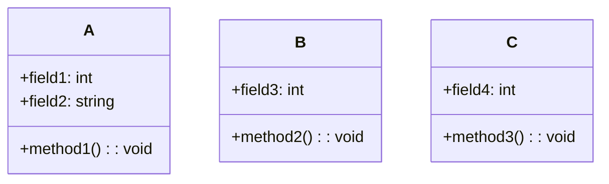

                 

# 类型族：关联多个相关类型的机制

> 关键词：类型族、类型参数、泛型、类型构造器、类型绑定、类型检查、类型转换、性能优化、应用案例

> 摘要：本文将探讨类型族这一概念，类型族是关联多个相关类型的一种机制。通过逐步分析类型族的定义、核心机制和高级应用，我们将深入了解类型族在编程语言中的应用和重要性。

## 第一部分：类型族的定义与背景

### 1.1 类型族的概念

类型族是一种编程语言特性，用于关联多个相关类型，使得这些类型具有统一的操作接口。类型族的主要作用是提供一种通用且可扩展的类型处理机制。

#### 1.1.1 类型的分类

在编程语言中，类型可以分为以下几类：

- **基本类型**：如整数、浮点数、布尔值等，由语言内置提供。
- **复合类型**：如数组、列表、字典等，由基本类型组合而成。
- **用户定义类型**：如类和结构体，由开发者自定义。

#### 1.1.2 类型族的基本概念

类型族（Type Family）是一种集合，它包含多个具有相同操作接口的类型。类型族中的每个类型被称为类型参数（Type Parameter）。类型参数通常用字母表示，如 `A`, `B`, `C` 等。

### 1.2 类型族的历史与发展

#### 1.2.1 类型族的发展历程

类型族的概念起源于面向对象的类型系统，随后随着泛型的出现而得到进一步发展。泛型编程使得类型族能够被广泛应用于各种编程语言中。

- **面向对象的类型系统**：在面向对象编程语言中，类型族的概念可以通过继承和多态来实现。
- **泛型的出现与普及**：泛型编程使得类型族可以以更灵活和高效的方式应用于编程语言中。

#### 1.2.2 类型族在现代编程语言中的应用

类型族在现代编程语言中得到了广泛的应用。以下是一些常见的编程语言及其类型族特性：

- **Java**：Java 使用泛型来实现类型族，通过 `<T>` 表示类型参数。
- **C++**：C++ 使用模板来实现类型族，通过 `typename T` 或 `class T` 表示类型参数。
- **Python**：Python 使用动态类型和泛型编程来实现类型族。

## 第二部分：类型族的核心机制

### 2.1 类型参数化

#### 2.1.1 类型参数的概念

类型参数是一种用于泛化的机制，它使得一个函数或类型可以在不同的类型上使用。类型参数通常用字母表示，如 `T`, `U`, `V` 等。

- **泛型类型**：泛型类型是一种在编译时具有类型参数的类型，如 `List<T>`, `Map<K, V>`。
- **泛型函数**：泛型函数是一种在编译时具有类型参数的函数，如 `max(T a, T b)`。

#### 2.1.2 类型参数的使用

类型参数的使用可以使得函数或类型具有更强的通用性和可复用性。

- **类型参数的类型约束**：类型参数通常需要满足一定的类型约束，以确保函数或类型的使用安全。
- **类型参数的泛化与特化**：泛化是指将特定类型的函数或类型转化为更一般的形式，特化是指将泛化的函数或类型具体化为特定的类型。

### 2.2 类型构造器

#### 2.2.1 类型构造器的定义

类型构造器是一种用于创建新类型的机制，它可以将一个或多个类型参数组合成一个新类型。类型构造器可以分为以下两种：

- **静态类型构造器**：静态类型构造器是在编译时确定类型的类型构造器，如 Java 的泛型类。
- **动态类型构造器**：动态类型构造器是在运行时确定类型的类型构造器，如 Python 的类。

#### 2.2.2 类型构造器的应用

类型构造器在编程语言中有着广泛的应用。

- **类型构造器与类型转换**：类型构造器可以用于实现类型转换，如 Java 的泛型集合转换。
- **类型构造器与类型检查**：类型构造器可以用于实现类型检查，如 C++ 的模板类型检查。

### 2.3 类型绑定

#### 2.3.1 类型绑定的概念

类型绑定是一种将变量与特定类型相关联的机制。类型绑定可以分为以下两种：

- **强类型绑定**：强类型绑定要求变量在声明时就必须指定类型，如 Java 和 C++。
- **弱类型绑定**：弱类型绑定允许变量在声明时不需要指定类型，如 Python。

#### 2.3.2 类型绑定的实现

类型绑定可以在编译时或运行时实现。

- **编译时绑定**：编译时绑定是在编译期间确定变量类型的类型绑定，如 Java。
- **运行时绑定**：运行时绑定是在运行期间确定变量类型的类型绑定，如 Python。

## 第三部分：类型族的高级应用

### 3.1 类型族的类型检查

#### 3.1.1 类型检查的基本原理

类型检查是一种确保程序中使用类型的正确性的机制。类型检查可以分为以下两种：

- **静态类型检查**：静态类型检查是在编译时进行的类型检查，如 Java。
- **动态类型检查**：动态类型检查是在运行时进行的类型检查，如 Python。

#### 3.1.2 类型检查的实现与优化

类型检查可以采用以下两种策略进行优化：

- **类型推断**：类型推断是一种在编译时自动推断变量类型的机制，如 Java 的泛型类型推断。
- **类型约束**：类型约束是一种在编译时确保类型参数满足特定条件的机制，如 C++ 的模板类型约束。

### 3.2 类型族的类型转换

#### 3.2.1 类型转换的基本原理

类型转换是一种将一个类型转换为另一个类型的机制。类型转换可以分为以下两种：

- **自动类型转换**：自动类型转换是编译器自动进行的类型转换，如整数与浮点数之间的转换。
- **显式类型转换**：显式类型转换是开发者显式指定的类型转换，如 `int i = (int) 3.14;`。

#### 3.2.2 类型转换的应用

类型转换在编程语言中有着广泛的应用。

- **静态类型转换**：静态类型转换是在编译时进行的类型转换，如 C++。
- **动态类型转换**：动态类型转换是在运行时进行的类型转换，如 Python。

### 3.3 类型族的性能优化

#### 3.3.1 类型族的性能问题

类型族在编程语言中可能会带来一定的性能问题。

- **类型检查的性能开销**：类型检查可能会增加编译时间和运行时性能开销。
- **类型转换的性能问题**：类型转换可能会降低程序的性能。

#### 3.3.2 类型族的优化策略

类型族可以通过以下策略进行优化：

- **类型推断**：类型推断可以减少类型检查的性能开销。
- **类型擦除**：类型擦除可以减少运行时类型检查的性能开销。

## 第四部分：类型族的应用案例

### 4.1 类型族在Java中的应用

#### 4.1.1 Java中的类型族特性

Java 使用泛型来实现类型族，以下是一些常见的类型族特性：

- **泛型类型**：如 `List<T>`, `Map<K, V>`。
- **泛型函数**：如 `max(T a, T b)`。

#### 4.1.2 Java中的类型族应用案例

Java 的类型族特性在许多场景下都有广泛应用。

- **集合框架**：Java 的集合框架使用了泛型来提供统一的操作接口。
- **异常处理**：Java 的异常处理机制也使用了泛型来提供更灵活的异常处理能力。

### 4.2 类型族在C++中的应用

#### 4.2.1 C++中的类型族特性

C++ 使用模板来实现类型族，以下是一些常见的类型族特性：

- **模板类型**：如 `List<T>`, `Map<K, V>`。
- **函数对象**：如 `max(T a, T b)`。

#### 4.2.2 C++中的类型族应用案例

C++ 的类型族特性在许多场景下都有广泛应用。

- **STL容器**：C++ 的标准模板库（STL）使用了模板来提供强大的容器功能。
- **多态**：C++ 的多态机制使用了模板来实现不同类型的对象之间的统一操作。

### 4.3 类型族在Python中的应用

#### 4.3.1 Python中的类型族特性

Python 使用动态类型和泛型编程来实现类型族，以下是一些常见的类型族特性：

- **泛型编程**：Python 的类和函数支持泛型编程。
- **动态类型**：Python 的类型系统是动态的，不需要显式指定类型。

#### 4.3.2 Python中的类型族应用案例

Python 的类型族特性在许多场景下都有广泛应用。

- **函数式编程**：Python 的函数式编程支持泛型编程，如高阶函数和闭包。
- **类和对象**：Python 的类和对象支持泛型编程，如工厂模式和单例模式。

## 附录

### 附录A：类型族相关资源

#### A.1 类型族学习资源

- **书籍推荐**：深入理解Java泛型、C++模板编程、Python函数式编程。
- **在线课程**：泛型编程基础、C++模板编程、Python泛型编程。
- **论坛和社区**：Stack Overflow、GitHub、Reddit等。

#### A.2 类型族工具和库

- **编译器插件**：如 IntelliJ IDEA、Visual Studio Code 等。
- **类型检查工具**：如 Java Checker Framework、C++ Clang-Tidy 等。
- **代码生成工具**：如 Maven、Gradle 等。

### 附录B：Mermaid流程图示例

#### B.1 类型族的继承关系



### 附录C：Python源代码示例

#### C.1 类型族实现示例

```python
class Animal:
    def __init__(self, name):
        self.name = name

    def speak(self):
        pass

class Dog(Animal):
    def speak(self):
        return "Woof!"

class Cat(Animal):
    def speak(self):
        return "Meow!"

def animal_sound(animal: Animal) -> str:
    return animal.speak()

dog = Dog("Buddy")
cat = Cat("Kitty")

print(animal_sound(dog))  # 输出：Woof!
print(animal_sound(cat))  # 输出：Meow!
```

### 附录D：小结与拓展阅读

本文介绍了类型族的概念、核心机制和高级应用，通过实际案例展示了类型族在编程语言中的重要性。接下来，您可以进一步阅读以下资源来深入了解类型族：

- **深入理解Java泛型**：深入探讨Java泛型的原理和应用。
- **C++模板编程实战**：学习C++模板编程的技巧和最佳实践。
- **Python函数式编程**：了解Python的函数式编程特性。

作者：AI天才研究院/AI Genius Institute & 禅与计算机程序设计艺术 /Zen And The Art of Computer Programming

