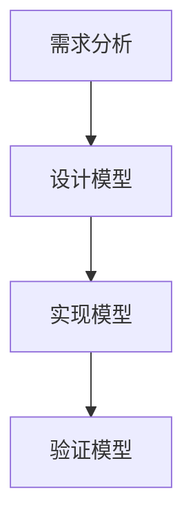
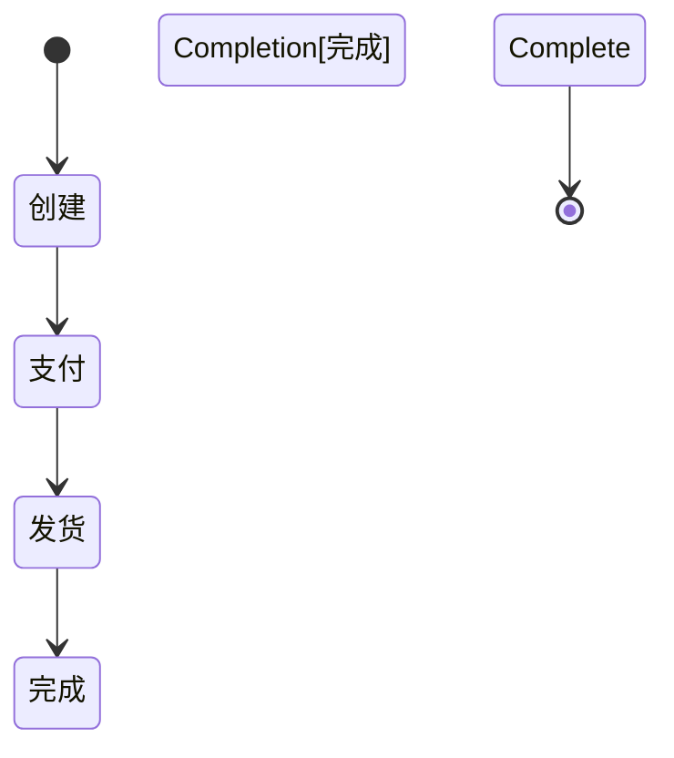
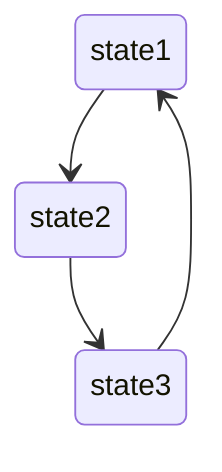

                 

基于以上要求，让我们一步一步来构建这篇文章《类型状态：在类型层面对象状态建模》的内容。

### 文章标题

《类型状态：在类型层面对象状态建模》

### 文章关键词

类型状态、面向对象、状态建模、UML类图、BPEL流程、OWL本体语言、软件工程、数据管理、物联网、云计算、大数据

### 文章摘要

本文深入探讨了类型状态在面向对象编程中的应用，从基础概念到高级技术实现，全面解析了类型状态建模的方法和工具。通过实际案例分析和最佳实践，帮助读者理解并掌握类型状态建模的核心理念和实践方法。

### 目录大纲

#### 第一部分：基础知识

##### 第1章：类型状态的基本概念
- 1.1 类型状态的定义
- 1.2 类型状态与对象状态的关系
- 1.3 类型状态的应用场景

##### 第2章：类型状态建模方法
- 2.1 类型状态建模框架
- 2.2 类型状态建模步骤
- 2.3 常见的类型状态建模方法

##### 第3章：类型状态的关系与继承
- 3.1 类型状态的关联
- 3.2 类型状态的聚合与组合
- 3.3 类型状态的继承机制

#### 第二部分：技术实现

##### 第4章：类型状态建模语言
- 4.1 UML类图在类型状态建模中的应用
- 4.2 BPEL流程在类型状态建模中的应用
- 4.3 OWL本体语言在类型状态建模中的应用

##### 第5章：类型状态建模工具
- 5.1 Eclipse Modeling Tools的使用
- 5.2 Microsoft Visio在类型状态建模中的应用
- 5.3 Intellimeet工具介绍

#### 第三部分：实践应用

##### 第6章：类型状态建模在软件工程中的应用
- 6.1 类型状态建模在需求分析中的应用
- 6.2 类型状态建模在软件设计中的应用
- 6.3 类型状态建模在软件测试中的应用

##### 第7章：类型状态建模在跨领域中的应用
- 7.1 类型状态建模在数据管理中的应用
- 7.2 类型状态建模在物联网中的应用
- 7.3 类型状态建模在云计算与大数据中的应用

##### 附录
- 附录A：类型状态建模案例分析
- 附录B：常用术语表

### 第1章：类型状态的基本概念

#### 1.1 类型状态的定义

类型状态是一种在类型层面对对象状态的抽象表示。在面向对象编程中，对象的状态通常由其属性值和操作行为组成。类型状态则是对这些状态进行分类和抽象的结果，它定义了对象可能的状态集合以及状态之间的转换规则。

#### 1.2 类型状态与对象状态的关系

类型状态是对对象状态的抽象。对象状态是具体对象在某一时刻的属性值和行为的集合，而类型状态则是抽象出这些状态的通用模式。例如，一个订单对象的具体状态可能是“已创建”、“已支付”、“已发货”等，而类型状态则可以抽象为“待处理”、“进行中”、“已完成”等状态。

#### 1.3 类型状态的应用场景

类型状态在多个领域都有广泛的应用。例如：
- **软件工程**：在软件设计阶段，类型状态可以帮助设计师理解系统的动态行为，从而更好地设计系统的结构和功能。
- **数据管理**：在数据库设计中，类型状态可以帮助定义实体之间的状态转换关系，从而支持复杂查询和操作。
- **物联网**：在物联网系统中，类型状态可以帮助描述设备的状态和行为，从而实现智能监控和管理。

### 第2章：类型状态建模方法

#### 2.1 类型状态建模框架

类型状态建模通常包括以下几个步骤：
1. **需求分析**：收集和整理系统需求，确定需要建模的对象和它们的状态。
2. **设计模型**：使用UML类图、状态图等工具设计类型状态模型。
3. **实现模型**：将设计模型转化为具体的代码或数据库设计。
4. **验证模型**：通过测试和验证确保模型能够正确反映系统的实际状态和行为。

#### 2.2 类型状态建模步骤

1. **定义对象**：确定需要建模的对象，并为其定义属性和方法。
2. **识别状态**：根据对象的行为和属性，识别出可能的类型状态。
3. **定义状态转换**：为每个状态定义可能的状态转换条件。
4. **设计状态图**：使用状态图可视化地表示对象的状态和状态转换。

#### 2.3 常见的类型状态建模方法

1. **状态图**：使用状态图可以直观地表示对象的状态和状态转换关系。
2. **UML类图**：UML类图可以用于定义对象的类型状态，以及状态之间的关联和继承关系。
3. **OWL本体语言**：OWL本体语言可以用于定义复杂的类型状态模型，特别是在需要语义表达和推理的场景中。

### 第3章：类型状态的关系与继承

#### 3.1 类型状态的关联

类型状态之间的关联包括聚合、组合和继承等关系。这些关系可以用来定义对象之间的依赖和交互方式。

#### 3.2 类型状态的聚合与组合

聚合关系表示对象之间的整体-部分关系，而组合关系则表示更紧密的依赖关系。组合通常涉及到生命周期管理，即部分对象的生命周期受整体对象控制。

#### 3.3 类型状态的继承机制

类型状态的继承机制允许一个状态集合继承另一个状态集合的属性和行为，从而简化状态管理。

接下来，我们将进一步探讨每个章节的具体内容，并使用Mermaid流程图、Python代码、LaTeX公式等工具来帮助读者更好地理解和掌握类型状态建模的原理和实践。

### 让我们一步一步深入理解类型状态建模

#### 第一步：理解类型状态的定义

类型状态是对对象状态的抽象表示，它定义了对象可能的状态集合以及状态之间的转换规则。在面向对象编程中，对象的状态通常由其属性值和操作行为组成。类型状态则是对这些状态进行分类和抽象的结果，它帮助我们更好地理解和控制对象的动态行为。

让我们用一个简单的例子来说明类型状态的概念。假设我们有一个“订单”对象，它的状态可能包括“已创建”、“已支付”、“已发货”和“已完成”等。类型状态可以将这些具体状态抽象为“待处理”、“进行中”、“已处理”等通用状态。这样，我们可以用更通用的方式来描述和处理订单对象的状态。

#### 第二步：分析类型状态与对象状态的关系

类型状态与对象状态之间存在紧密的联系。对象状态是具体对象在某一时刻的属性值和行为的集合，而类型状态则是对这些状态的抽象和分类。类型状态可以帮助我们理解对象的状态变化，并设计出更灵活和可扩展的系统。

例如，在一个电商系统中，我们可以有一个“订单”对象，它的状态包括“已创建”、“已支付”、“已发货”和“已完成”。这些具体状态可以抽象为类型状态，如“待处理”、“进行中”、“已处理”等。通过类型状态，我们可以设计出更加灵活的订单处理流程，并支持新的订单状态。

#### 第三步：探索类型状态的应用场景

类型状态在多个领域都有广泛的应用。以下是一些常见的应用场景：

1. **软件工程**：在软件设计阶段，类型状态可以帮助设计师理解系统的动态行为，从而更好地设计系统的结构和功能。
2. **数据管理**：在数据库设计中，类型状态可以帮助定义实体之间的状态转换关系，从而支持复杂查询和操作。
3. **物联网**：在物联网系统中，类型状态可以帮助描述设备的状态和行为，从而实现智能监控和管理。

例如，在一个智能家居系统中，设备（如灯光、温度传感器、窗帘等）可以有不同的状态，如“开启”、“关闭”、“自动调节”等。通过类型状态建模，我们可以定义设备状态的转换规则，如从“自动调节”状态切换到“手动控制”状态，从而实现更加智能和灵活的设备管理。

#### 第四步：了解类型状态建模的方法

类型状态建模通常包括以下几个步骤：

1. **需求分析**：收集和整理系统需求，确定需要建模的对象和它们的状态。
2. **设计模型**：使用UML类图、状态图等工具设计类型状态模型。
3. **实现模型**：将设计模型转化为具体的代码或数据库设计。
4. **验证模型**：通过测试和验证确保模型能够正确反映系统的实际状态和行为。

以下是一个简单的Mermaid流程图，展示了类型状态建模的基本步骤：



#### 第五步：掌握常见的类型状态建模方法

常见的类型状态建模方法包括状态图、UML类图和OWL本体语言等。每种方法都有其独特的优势和应用场景。

1. **状态图**：状态图是一种用于表示对象状态和状态转换的图形化工具。它可以帮助我们直观地理解对象的动态行为。以下是一个简单的状态图示例：



2. **UML类图**：UML类图可以用于定义对象的类型状态，以及状态之间的关联和继承关系。以下是一个简单的UML类图示例：

```mermaid
class Order {
    +String orderId
    +String status
    +createOrder()
    +changeStatus()
}

class OrderState {
    +String state
    +Order order
    +setState()
}

Order <|-- OrderState
```

3. **OWL本体语言**：OWL本体语言是一种用于定义复杂类型状态模型的语言，特别是在需要语义表达和推理的场景中。以下是一个简单的OWL本体语言示例：

```plaintext
@prefix owl: <http://www.w3.org/2002/07/owl#> .
@prefix rdf: <http://www.w3.org/1999/02/22-rdf-syntax-ns#> .
@prefix rdfs: <http://www.w3.org/2000/01/rdf-schema#> .

OrderState : Class {
    rdfs:label "Order State" .
    rdfs:subClassOf : State .
}

State : Datatype {
    rdfs:label "State" .
}

Order : Class {
    rdfs:label "Order" .
    rdf:type owl:Class ;
    owl:hasValue (status) .
}
```

#### 第六步：学习类型状态建模的语言和工具

类型状态建模的语言和工具是构建有效类型状态模型的关键。以下是一些常用的类型状态建模语言和工具：

1. **Eclipse Modeling Tools**：Eclipse Modeling Tools是一套强大的建模工具，支持多种建模语言，如UML、OWL等。
2. **Microsoft Visio**：Microsoft Visio是一个通用的绘图工具，可以用于创建UML类图、状态图等。
3. **Intellimeet**：Intellimeet是一个基于Web的建模平台，支持多种建模语言和工具。

以下是一个简单的Eclipse Modeling Tools创建的UML类图示例：

```mermaid
classDiagram
    OrderState <.. Order
    OrderState {
        +String state
        +Order order
    }
    Order {
        +String orderId
        +String status
        +createOrder()
        +changeStatus()
    }
```

通过以上步骤，我们已经对类型状态建模有了初步的了解。接下来，我们将继续深入探讨类型状态建模的细节，包括类型状态的关系与继承、具体的技术实现方法以及在软件工程、数据管理和物联网等领域的应用。通过这些内容，读者将能够全面掌握类型状态建模的理论和实践。

### 第1章：类型状态的基本概念

#### 1.1 类型状态的定义

类型状态是一种在类型层面对对象状态的抽象表示。在面向对象编程中，对象的状态通常由其属性值和操作行为组成。类型状态则是对这些状态进行分类和抽象的结果，它定义了对象可能的状态集合以及状态之间的转换规则。类型状态通常用于描述对象的行为模式，以便在设计和实现过程中更好地管理复杂系统。

#### 1.2 类型状态与对象状态的关系

对象状态是具体对象在某一时刻的属性值和行为的集合，而类型状态是对这些状态的抽象和分类。具体来说，类型状态与对象状态的关系如下：

1. **抽象**：类型状态是对一组对象状态的抽象。通过类型状态，我们可以将具体的对象状态归纳为具有共性的状态集合，从而简化系统的设计和实现。
2. **分类**：类型状态帮助我们将对象状态按照一定的规则进行分类。例如，在一个电商系统中，订单对象可能包含“已创建”、“已支付”、“已发货”和“已完成”等状态，而类型状态可以抽象为“待处理”、“进行中”和“已完成”等状态。
3. **转换**：类型状态定义了对象状态之间的转换规则。例如，在一个交通信号灯系统中，信号灯的状态可能从“红灯”转换为“绿灯”或“黄灯”，这些转换规则可以通过类型状态来描述。

#### 1.3 类型状态的应用场景

类型状态在多个领域都有广泛的应用，以下是一些常见的应用场景：

1. **软件工程**：在软件设计阶段，类型状态可以帮助设计师理解系统的动态行为，从而更好地设计系统的结构和功能。例如，在系统架构设计中，可以使用类型状态来描述组件之间的状态转换关系，从而支持复杂系统的集成和优化。
2. **数据管理**：在数据库设计中，类型状态可以帮助定义实体之间的状态转换关系，从而支持复杂查询和操作。例如，在数据库设计中，可以使用类型状态来定义订单的状态转换规则，从而支持订单查询和统计。
3. **物联网**：在物联网系统中，类型状态可以帮助描述设备的状态和行为，从而实现智能监控和管理。例如，在一个智能家居系统中，设备（如灯光、温度传感器、窗帘等）可以有不同的状态，如“开启”、“关闭”、“自动调节”等，通过类型状态建模，我们可以定义设备状态的转换规则，从而实现更加智能和灵活的设备管理。

#### 类型状态与面向对象编程的关系

类型状态是面向对象编程的一个重要概念，它直接影响到对象的设计和实现。具体来说，类型状态与面向对象编程的关系如下：

1. **对象导向**：类型状态体现了面向对象编程的核心思想——对象导向。通过类型状态，我们可以将对象的状态和行为抽象为具有共性的状态集合，从而实现代码的复用和模块化。
2. **状态转换**：类型状态定义了对象状态之间的转换规则，这有助于实现复杂的业务逻辑和流程控制。例如，在面向对象编程中，我们可以通过状态转换来控制对象的行为，从而实现更加灵活和可扩展的系统。
3. **封装**：类型状态体现了封装的原则。通过将对象的状态和行为抽象为类型状态，我们可以隐藏实现细节，从而提高系统的可维护性和可扩展性。

#### 小结

类型状态是一种在类型层面对对象状态的抽象表示，它定义了对象可能的状态集合以及状态之间的转换规则。类型状态与对象状态的关系密切，它帮助我们更好地理解和控制对象的动态行为。类型状态在多个领域都有广泛的应用，如软件工程、数据管理和物联网等。通过类型状态建模，我们可以实现更加灵活和可扩展的系统设计，从而满足复杂业务需求。

### 第2章：类型状态建模方法

#### 2.1 类型状态建模框架

类型状态建模是一个系统化、结构化的过程，它包括多个步骤，以确保模型能够准确反映系统的实际需求和行为。以下是一个典型的类型状态建模框架：

1. **需求分析**：首先，我们需要收集和整理系统需求，确定需要建模的对象和它们的状态。这通常涉及到与利益相关者的沟通，以确保我们了解系统的实际需求。
2. **设计模型**：在需求分析的基础上，我们使用UML类图、状态图等工具设计类型状态模型。这个步骤的目的是将抽象的需求转化为具体的模型，以便后续的实现和验证。
3. **实现模型**：将设计模型转化为具体的代码或数据库设计。这个步骤涉及到将抽象的模型转化为实际的软件或数据库结构。
4. **验证模型**：通过测试和验证确保模型能够正确反映系统的实际状态和行为。这通常包括单元测试、集成测试和系统测试等。

#### 2.2 类型状态建模步骤

1. **定义对象**：确定需要建模的对象，并为其定义属性和方法。这个步骤是类型状态建模的基础，它确保我们了解系统中涉及的对象以及它们的基本属性和行为。
2. **识别状态**：根据对象的行为和属性，识别出可能的类型状态。这个步骤涉及到对对象行为的深入分析，以便确定对象可能处于哪些状态。
3. **定义状态转换**：为每个状态定义可能的状态转换条件。这个步骤的目的是明确对象状态之间的转换规则，以便在实现过程中能够正确地处理状态变化。
4. **设计状态图**：使用状态图可视化地表示对象的状态和状态转换关系。状态图是一种直观的图形化工具，它可以帮助我们更好地理解对象的状态和行为。

以下是一个简单的Mermaid状态图示例：



#### 2.3 常见的类型状态建模方法

在类型状态建模过程中，我们可以选择多种建模方法。以下是一些常见的类型状态建模方法：

1. **状态图**：状态图是一种用于表示对象状态和状态转换的图形化工具。它可以帮助我们直观地理解对象的动态行为。状态图通常包括状态节点、转换条件和转换箭头等元素。

2. **UML类图**：UML类图可以用于定义对象的类型状态，以及状态之间的关联和继承关系。UML类图通常包括类、属性、方法和关联等元素。

3. **OWL本体语言**：OWL本体语言是一种用于定义复杂类型状态模型的语义语言。它通常用于描述具有复杂语义的领域模型，特别适用于需要语义推理和自动化决策的场景。

以下是一个简单的OWL本体语言示例：

```plaintext
@prefix owl: <http://www.w3.org/2002/07/owl#> .
@prefix rdf: <http://www.w3.org/1999/02/22-rdf-syntax-ns#> .
@prefix rdfs: <http://www.w3.org/2000/01/rdf-schema#> .

OrderState : Class {
    rdfs:label "Order State" .
    rdfs:subClassOf : State .
}

State : Datatype {
    rdfs:label "State" .
}

Order : Class {
    rdfs:label "Order" .
    rdf:type owl:Class ;
    owl:hasValue (status) .
}
```

#### 小结

类型状态建模是一个系统化、结构化的过程，它包括定义对象、识别状态、定义状态转换和设计状态图等多个步骤。常见的类型状态建模方法包括状态图、UML类图和OWL本体语言等。通过选择合适的建模方法，我们可以设计出更准确、更灵活和更具可扩展性的类型状态模型，从而满足复杂系统的需求。

### 第3章：类型状态的关系与继承

#### 3.1 类型状态的关联

在类型状态建模中，关联是指不同类型状态之间的关系。这些关系可以帮助我们更好地理解和控制对象的动态行为。常见的类型状态关联包括聚合、组合和继承等。

1. **聚合**：聚合是一种整体-部分关系，表示一个类型状态包含另一个类型状态。例如，在一个电商系统中，订单状态可以聚合支付状态、发货状态和完成状态等。

   Mermaid类图示例：

   ```mermaid
   classDiagram
       OrderState <.. PaymentState
       OrderState <.. ShippingState
       OrderState <.. CompletionState
       
       OrderState {
           +PaymentState payment
           +ShippingState shipping
           +CompletionState completion
       }
       
       PaymentState {
           +String paymentStatus
       }
       
       ShippingState {
           +String shippingStatus
       }
       
       CompletionState {
           +String completionStatus
       }
   endclassDiagram
   ```

2. **组合**：组合是一种更紧密的依赖关系，表示一个类型状态完全依赖于另一个类型状态。在组合关系中，部分对象的生命周期受整体对象控制。例如，在一个交通信号灯系统中，绿灯状态完全依赖于红灯状态和黄灯状态。

   Mermaid类图示例：

   ```mermaid
   classDiagram
       GreenLightState <.. RedLightState
       GreenLightState <.. YellowLightState
       
       GreenLightState {
           +String lightStatus
       }
       
       RedLightState {
           +String lightStatus
       }
       
       YellowLightState {
           +String lightStatus
       }
   endclassDiagram
   ```

3. **继承**：继承是一种类型状态之间的层次关系，表示一个类型状态继承另一个类型状态的属性和行为。继承可以帮助我们复用已有的类型状态，并在此基础上扩展新的类型状态。例如，在一个电商系统中，普通订单状态可以继承促销订单状态的属性和行为。

   Mermaid类图示例：

   ```mermaid
   classDiagram
       OrderState <|-- NormalOrderState
       OrderState <|-- PromotionalOrderState
       
       OrderState {
           +String orderId
           +String status
           +createOrder()
           +changeStatus()
       }
       
       NormalOrderState {
           +boolean isPromotion
       }
       
       PromotionalOrderState {
           +float discount
       }
   endclassDiagram
   ```

#### 3.2 类型状态的聚合与组合

1. **聚合**：聚合是一种整体-部分关系，表示一个类型状态包含另一个类型状态。聚合关系通常用于表示非完整性和非管理性的关系。在聚合关系中，整体对象可以独立于部分对象存在。

   例如，在一个员工管理系统（Employee Management System）中，部门（Department）与员工（Employee）之间存在聚合关系。部门可以包含多个员工，但员工不一定只能属于一个部门。

   Mermaid类图示例：

   ```mermaid
   classDiagram
       Department {
           +List<Employee> employees
           +addEmployee(Employee e)
           +removeEmployee(Employee e)
       }
       
       Employee {
           +String employeeId
           +String name
       }
   endclassDiagram
   ```

2. **组合**：组合是一种更紧密的依赖关系，表示一个类型状态完全依赖于另一个类型状态。在组合关系中，整体对象的生命周期受部分对象控制。组合关系通常用于表示强依赖关系。

   例如，在一个交通信号灯系统中，红灯状态（RedLightState）、黄灯状态（YellowLightState）和绿灯状态（GreenLightState）之间存在组合关系。绿灯状态完全依赖于红灯状态和黄灯状态，只有在红灯状态和黄灯状态完成后，绿灯状态才能开始。

   Mermaid类图示例：

   ```mermaid
   classDiagram
       RedLightState {
           +void onTransitionToGreen()
       }
       
       YellowLightState {
           +void onTransitionToGreen()
       }
       
       GreenLightState {
           +void onTransitionToRed()
           +void onTransitionToYellow()
       }
   endclassDiagram
   ```

#### 3.3 类型状态的继承机制

类型状态的继承机制是一种在类型状态之间传递属性和行为的机制。通过继承，子类型状态可以复用父类型状态的属性和行为，从而提高代码的复用性和可维护性。

1. **单继承**：在单继承中，一个子类型状态只能继承一个父类型状态。这是大多数面向对象编程语言（如Java、C++）采用的继承机制。

   例如，在一个电商系统中，普通订单（NormalOrder）可以继承订单（Order）的属性和行为，而促销订单（PromotionalOrder）可以继承订单的属性和行为，并在此基础上增加促销相关的属性和方法。

   Mermaid类图示例：

   ```mermaid
   classDiagram
       OrderState <|-- NormalOrderState
       OrderState <|-- PromotionalOrderState
       
       OrderState {
           +String orderId
           +String status
           +createOrder()
           +changeStatus()
       }
       
       NormalOrderState {
           +boolean isPromotion
       }
       
       PromotionalOrderState {
           +float discount
       }
   endclassDiagram
   ```

2. **多继承**：在多继承中，一个子类型状态可以继承多个父类型状态。多继承可以帮助我们更好地复用多个父类型的属性和行为，但也会增加复杂性和潜在的不确定性。

   例如，在一个复杂的角色系统中，员工（Employee）可以同时继承用户（User）和管理员（Administrator）的属性和行为，从而实现更灵活的角色分配和权限管理。

   Mermaid类图示例：

   ```mermaid
   classDiagram
       UserState <|-- EmployeeState
       UserState <|-- AdministratorState
       
       UserState {
           +String username
           +String password
       }
       
       EmployeeState {
           +String employeeId
       }
       
       AdministratorState {
           +String adminId
       }
   endclassDiagram
   ```

#### 小结

类型状态之间的关系和继承机制是类型状态建模的重要组成部分。通过聚合、组合和继承等关系，我们可以更好地理解和控制对象的动态行为。聚合和组合用于表示对象之间的依赖关系，而继承用于复用已有的类型状态，并在此基础上扩展新的类型状态。选择合适的类型状态关系和继承机制，可以帮助我们设计出更准确、更灵活和更具可扩展性的类型状态模型。

### 第4章：类型状态建模语言

#### 4.1 UML类图在类型状态建模中的应用

统一建模语言（UML）是一种广泛使用的图形化建模工具，它可以帮助我们可视化地表示系统中的各种组件和关系。在类型状态建模中，UML类图是一种重要的工具，它用于定义对象的类型状态、属性、方法以及它们之间的关系。

UML类图的基本元素包括：

- **类**：表示系统中的实体，通常包含名称、属性和方法。
- **属性**：类的特征，如`String name`、`int age`等。
- **方法**：类的行为，如`void setName(String name)`、`int getAge()`等。
- **关系**：类与类之间的关系，如继承（`<|--`）、实现（`<|--`）、关联（`-->`）等。

以下是一个简单的UML类图示例，用于表示一个订单系统中的订单（Order）和订单状态（OrderState）：

```mermaid
classDiagram
    Order {
        +String orderId
        +String status
        +createOrder()
        +changeStatus()
    }
    
    OrderState {
        +String state
        +Order order
        +setState()
    }
    
    Order <|-- OrderState
endclassDiagram
```

在这个示例中，订单类（Order）包含订单ID（orderId）和订单状态（status）等属性，以及创建订单（createOrder）和更改订单状态（changeStatus）等方法。订单状态类（OrderState）则包含状态（state）和订单引用（order）等属性，以及设置状态（setState）方法。通过继承关系（`<|--`），订单状态类继承了订单类的方法和属性，从而实现状态管理的抽象。

#### 4.2 BPEL流程在类型状态建模中的应用

业务流程执行语言（BPEL）是一种用于描述和实现业务流程的XML语言。在类型状态建模中，BPEL可以用于定义对象的状态转换和业务流程的逻辑。

BPEL的基本元素包括：

- **流程**（Process）：表示业务流程的总体结构。
- **活动**（Activity）：表示业务流程中的具体操作，如发送消息（send）、接收消息（receive）、条件分支（if-then-else）等。
- **关系**（Relation）：表示活动之间的顺序、并发、补偿等关系。

以下是一个简单的BPEL示例，用于表示一个订单处理流程：

```xml
<process name="OrderProcessing">
    <start>
        <receive name="OrderReceived" message="OrderMessage" partnerLink="OrderServicePL" operation="ProcessOrder" />
    </start>
    <activity name="ProcessOrder">
        <sequence>
            <assign>
                <var name="orderStatus" expression="&apos;Received&apos;" />
            </assign>
            <send name="OrderStatusUpdated" message="OrderStatusMessage" partnerLink="OrderServicePL" operation="UpdateOrderStatus" />
        </sequence>
    </activity>
    <end>
        <receive name="OrderProcessed" message="OrderMessage" partnerLink="OrderServicePL" operation="ProcessOrder" />
    </end>
</process>
```

在这个示例中，流程从接收订单消息（OrderReceived）开始，然后执行一系列操作来处理订单（ProcessOrder），包括分配订单状态（Received）并更新订单状态（OrderStatusUpdated）。流程的结束是通过接收处理完成的订单消息（OrderProcessed）来实现的。

#### 4.3 OWL本体语言在类型状态建模中的应用

Web本体语言（OWL）是一种用于定义领域本体和语义模型的XML语言。在类型状态建模中，OWL可以用于定义复杂类型状态模型，特别是在需要语义表达和推理的场景中。

OWL的基本元素包括：

- **类**（Class）：表示概念，如`Order`、`OrderState`等。
- **属性**（Property）：表示关系，如`hasStatus`、`setState`等。
- **个体**（Individual）：表示具体的实例，如`Order1`、`State1`等。
- **数据类型**（Datatype）：表示数据类型，如`String`、`Integer`等。

以下是一个简单的OWL示例，用于表示一个订单系统中的订单和订单状态：

```xml
<Ontology xmlns="http://www.w3.org/2002/07/owl#">
    <Declaration>
        <Class name="Order"/>
        <Class name="OrderState"/>
        <ObjectProperty name="hasStatus"/>
        <DatatypeProperty name="setState"/>
    </Declaration>
    <Definition>
        <Class name="Order">
            <owl:intersectionOf>
                <Class name="Entity"/>
                <ObjectPropertyDomain rdf:resource="#hasStatus"/>
            </owl:intersectionOf>
        </Class>
        <Class name="OrderState">
            <owl:intersectionOf>
                <Class name="State"/>
                <DatatypePropertyDomain rdf:resource="#setState"/>
            </owl:intersectionOf>
        </Class>
    </Definition>
    <ObjectPropertyAssertion>
        <ObjectProperty name="hasStatus"/>
        <Individual name="Order1"/>
        <Individual name="State1"/>
    </ObjectPropertyAssertion>
    <DataPropertyAssertion>
        <DatatypeProperty name="setState"/>
        <Individual name="Order1"/>
        <Literal datatype="xsd:string">Received</Literal>
    </DataPropertyAssertion>
</Ontology>
```

在这个示例中，我们定义了订单（Order）和订单状态（OrderState）两个类，并分别指定了它们的属性和关系。订单类继承了实体类（Entity），订单状态类继承了状态类（State）。通过这些定义，我们可以清晰地描述订单和订单状态的结构和语义。

#### 小结

UML类图、BPEL流程和OWL本体语言都是类型状态建模中的重要工具。UML类图用于定义对象的类型状态、属性和方法，BPEL流程用于描述对象的状态转换和业务流程，OWL本体语言用于定义复杂类型状态模型和语义。通过选择合适的建模语言，我们可以设计出更准确、更灵活和更具可扩展性的类型状态模型，从而满足复杂系统的需求。

### 第5章：类型状态建模工具

在类型状态建模的过程中，选择合适的工具是至关重要的。本章将介绍几种常用的类型状态建模工具，包括Eclipse Modeling Tools、Microsoft Visio和Intellimeet。

#### 5.1 Eclipse Modeling Tools的使用

Eclipse Modeling Tools（EMT）是一套集成在Eclipse平台上的建模工具，支持多种建模语言，如UML、OWL、MDA（Model-Driven Architecture）等。Eclipse Modeling Tools提供了强大的建模能力，可以帮助开发者轻松地创建和维护类型状态模型。

**安装Eclipse Modeling Tools**：

1. 打开Eclipse IDE。
2. 在菜单栏中选择“Help > Eclipse Marketplace”。
3. 在搜索框中输入“Eclipse Modeling Tools”并搜索。
4. 找到Eclipse Modeling Tools插件，点击“Install”按钮。
5. 遵循安装向导完成安装。

**创建UML类图**：

1. 打开Eclipse IDE，选择“File > New > Other”。
2. 在“New”窗口中，选择“UML”下的“Class Diagram”。
3. 点击“Next”，为类图命名并选择位置。
4. 在类图编辑器中，右键点击空白区域，选择“Class”。
5. 输入类的名称和属性、方法。

**创建OWL本体**：

1. 打开Eclipse IDE，选择“File > New > Other”。
2. 在“New”窗口中，选择“OWL”下的“OWL ontology”。
3. 点击“Next”，为OWL本体命名并选择位置。
4. 在OWL本体编辑器中，定义类、属性和个体。

#### 5.2 Microsoft Visio在类型状态建模中的应用

Microsoft Visio是一款功能强大的绘图工具，支持多种图形化建模语言，如UML、流程图、网络图等。Visio提供了直观的用户界面和丰富的图形元素，适合快速创建和修改类型状态模型。

**安装Microsoft Visio**：

1. 访问Microsoft Visio官方网站。
2. 根据操作系统下载合适的版本。
3. 运行安装程序，按照提示完成安装。

**创建UML类图**：

1. 打开Microsoft Visio。
2. 选择“文件 > 新建 > 选择模板 > UML”。
3. 选择“类图”，点击“创建”。
4. 在类图编辑器中，添加类、属性和方法。
5. 使用线条连接类和属性，表示它们之间的关系。

**创建流程图**：

1. 打开Microsoft Visio。
2. 选择“文件 > 新建 > 选择模板 > 流程图”。
3. 选择“业务流程图”，点击“创建”。
4. 在流程图编辑器中，添加活动、决策和连接器。
5. 设置活动之间的关系和条件。

#### 5.3 Intellimeet工具介绍

Intellimeet是一个基于Web的建模平台，支持多种建模语言和工具，如UML、BPEL、OWL等。Intellimeet提供了在线协作功能，适合团队开发和共享建模资源。

**安装和启动Intellimeet**：

1. 访问Intellimeet官方网站。
2. 注册并登录账号。
3. 根据需要创建新的项目或加入已有的项目。
4. 在项目页面中，选择合适的建模工具，开始创建类型状态模型。

**创建UML类图**：

1. 在项目页面中，选择“UML建模”工具。
2. 创建新的UML类图，添加类、属性和方法。
3. 使用连接线连接类和属性，表示它们之间的关系。

**创建BPEL流程**：

1. 在项目页面中，选择“BPEL建模”工具。
2. 创建新的BPEL流程，添加活动、条件和连接器。
3. 配置活动的输入和输出，定义业务流程的逻辑。

#### 小结

Eclipse Modeling Tools、Microsoft Visio和Intellimeet都是强大的类型状态建模工具，各有其独特的优势和应用场景。Eclipse Modeling Tools提供了全面的建模功能，适合专业开发者；Microsoft Visio具有直观的用户界面，适合快速创建和修改模型；Intellimeet支持在线协作，适合团队开发和共享资源。选择合适的建模工具，可以帮助我们更高效地完成类型状态建模任务。

### 第6章：类型状态建模在软件工程中的应用

类型状态建模在软件工程中扮演着至关重要的角色，它不仅帮助我们更好地理解和设计复杂系统，还提高了系统的可维护性和扩展性。在本章中，我们将探讨类型状态建模在软件工程中的具体应用，包括需求分析、软件设计和软件测试等方面。

#### 6.1 类型状态建模在需求分析中的应用

需求分析是软件工程的重要阶段，它涉及到收集和分析系统的功能需求和非功能需求。类型状态建模在需求分析中的应用主要体现在以下几个方面：

1. **定义对象状态**：通过类型状态建模，我们可以清晰地定义系统中每个对象的可能状态。这有助于我们理解系统的行为和动态变化，从而更好地满足用户需求。

   **示例**：在一个电商系统中，订单对象可能包含“已创建”、“已支付”、“已发货”和“已完成”等状态。通过类型状态建模，我们可以将这些具体状态抽象为“待处理”、“进行中”和“已完成”等通用状态。

2. **识别状态转换**：类型状态建模可以帮助我们识别对象状态之间的转换关系，这有助于我们理解系统的业务逻辑和流程。

   **示例**：在一个订单系统中，订单状态可以从“已创建”转换为“已支付”，再从“已支付”转换为“已发货”。通过类型状态建模，我们可以明确这些状态转换的条件和规则。

3. **需求验证**：通过类型状态模型，我们可以与用户和利益相关者进行有效沟通，确保需求分析结果的准确性和完整性。

   **示例**：通过展示订单状态转换图，我们可以与用户讨论并确认订单状态转换的规则，从而确保系统满足用户需求。

#### 6.2 类型状态建模在软件设计中的应用

软件设计是软件工程的关键阶段，它涉及到将需求转化为具体的系统架构和组件设计。类型状态建模在软件设计中的应用主要体现在以下几个方面：

1. **设计状态图**：通过类型状态建模，我们可以设计出对象的状态图，这有助于我们理解对象的动态行为和状态转换。

   **示例**：在一个订单系统中，我们可以设计一个状态图，描述订单对象在不同状态之间的转换，以及触发转换的条件。

2. **设计类图**：类型状态建模可以与UML类图结合使用，帮助我们设计系统的类结构和类之间的关系。

   **示例**：在一个电商系统中，我们可以设计订单类、订单状态类、支付类和发货类等，并定义它们之间的关联和继承关系。

3. **设计数据库**：类型状态建模可以帮助我们设计数据库模型，定义实体之间的状态转换关系和约束条件。

   **示例**：在一个订单管理系统中，我们可以设计订单表、订单状态表和支付表等，并定义它们之间的外键关系。

#### 6.3 类型状态建模在软件测试中的应用

软件测试是确保软件质量的重要环节，类型状态建模在软件测试中的应用主要体现在以下几个方面：

1. **测试用例设计**：通过类型状态建模，我们可以生成对应的测试用例，确保系统在不同状态下的行为正确。

   **示例**：在一个订单系统中，我们可以设计以下测试用例：
   - 测试订单从“已创建”状态转换为“已支付”状态。
   - 测试订单从“已支付”状态转换为“已发货”状态。
   - 测试订单从“已发货”状态转换为“已完成”状态。

2. **状态转换测试**：类型状态建模可以帮助我们识别和测试系统中的状态转换逻辑。

   **示例**：在一个交通信号灯系统中，我们可以测试以下状态转换：
   - 红灯状态转换为绿灯状态。
   - 绿灯状态转换为黄灯状态。
   - 黄灯状态转换为红灯状态。

3. **异常状态测试**：类型状态建模可以帮助我们识别系统的异常状态，并设计相应的测试用例进行测试。

   **示例**：在一个电商系统中，我们可以测试以下异常状态：
   - 订单状态从“已创建”无法直接转换为“已完成”。
   - 订单状态从“已支付”无法转换为“已发货”，除非订单已创建。

#### 小结

类型状态建模在软件工程中的应用非常广泛，它贯穿了需求分析、软件设计和软件测试等各个环节。通过类型状态建模，我们可以更好地理解系统的动态行为，设计出更准确、更灵活的系统架构，并确保系统的质量。类型状态建模不仅提高了软件开发的效率，还降低了开发成本，是现代软件工程不可或缺的一部分。

### 第7章：类型状态建模在跨领域中的应用

类型状态建模作为一种强大的抽象工具，不仅适用于软件工程领域，还在数据管理、物联网、云计算和大数据等跨领域中有着广泛的应用。通过类型状态建模，我们可以更好地理解和处理这些领域的复杂问题，提高系统的效率和灵活性。

#### 7.1 类型状态建模在数据管理中的应用

在数据管理领域，类型状态建模主要用于数据库设计和数据模型设计，以确保数据的完整性和一致性。

1. **数据库设计**：类型状态建模可以帮助我们设计出更合理的数据模型，确保数据库能够正确地存储和管理对象状态。

   **示例**：在一个电商系统中，我们可以使用类型状态建模来设计订单表、用户表和支付表等，并定义它们之间的关联和约束条件。例如，订单表可以包含订单状态字段，用于记录订单的当前状态。

2. **数据模型设计**：类型状态建模可以帮助我们识别和表示数据模型中的状态转换关系，从而支持复杂的数据查询和分析。

   **示例**：在一个物流管理系统中，我们可以使用类型状态建模来设计包裹状态，如“已发货”、“在途中”、“已签收”等，并定义它们之间的状态转换规则。这样，我们就可以根据包裹的状态进行有效的物流监控和追踪。

3. **数据质量评估**：类型状态建模还可以帮助我们评估数据质量，确保数据的一致性和准确性。

   **示例**：在一个客户关系管理系统中，我们可以使用类型状态建模来评估客户状态，如“潜在客户”、“活跃客户”、“流失客户”等，并定义它们之间的状态转换条件。通过这种方式，我们可以及时发现和纠正数据中的问题，提高数据的整体质量。

#### 7.2 类型状态建模在物联网中的应用

物联网（IoT）领域涉及大量设备和传感器，通过类型状态建模，我们可以更好地管理和控制这些设备。

1. **设备状态建模**：类型状态建模可以帮助我们定义设备的各种状态，如“在线”、“离线”、“故障”等。

   **示例**：在一个智能家庭系统中，我们可以使用类型状态建模来定义家电设备的状态，如空调的“制冷”、“制热”、“待机”等。通过这些状态，我们可以实现家电设备的远程控制和监控。

2. **状态转换规则**：类型状态建模可以帮助我们定义设备状态之间的转换规则，确保设备的行为符合预期。

   **示例**：在一个智能交通系统中，我们可以使用类型状态建模来定义交通信号灯的状态转换规则，如从“红灯”转换为“绿灯”，从而实现交通信号控制的智能化和自动化。

3. **设备生命周期管理**：类型状态建模可以帮助我们管理设备的整个生命周期，从设备安装、运行到维护和升级。

   **示例**：在一个工业物联网系统中，我们可以使用类型状态建模来定义设备的状态，如“生产中”、“维修中”、“备用”等，并定义设备状态转换的条件和规则。通过这种方式，我们可以实现对设备的有效管理和调度。

#### 7.3 类型状态建模在云计算与大数据中的应用

云计算和大数据领域涉及大量的数据处理和分析任务，类型状态建模可以帮助我们优化这些任务的管理和执行。

1. **云服务状态建模**：类型状态建模可以帮助我们定义云服务的各种状态，如“创建中”、“运行中”、“已删除”等。

   **示例**：在云计算平台中，我们可以使用类型状态建模来定义虚拟机（VM）的状态，如“启动中”、“运行中”、“停止中”等。通过这些状态，我们可以实现对虚拟机的有效管理和监控。

2. **数据处理流程建模**：类型状态建模可以帮助我们设计复杂的数据处理流程，确保数据处理的正确性和高效性。

   **示例**：在一个大数据分析系统中，我们可以使用类型状态建模来定义数据处理流程中的各个阶段，如“数据收集”、“数据清洗”、“数据存储”、“数据查询”等。通过这些阶段的状态转换，我们可以实现高效的数据处理和分析。

3. **大数据应用场景建模**：类型状态建模可以帮助我们设计和实现各种大数据应用场景，如实时分析、预测分析、数据挖掘等。

   **示例**：在一个智慧城市系统中，我们可以使用类型状态建模来设计交通流量监控、公共安全监控、环境监测等应用场景。通过类型状态建模，我们可以实现对城市运行的实时监控和预测，从而提高城市管理的效率和智能化水平。

#### 小结

类型状态建模在数据管理、物联网、云计算和大数据等跨领域中的应用，展示了其强大的抽象和建模能力。通过类型状态建模，我们可以更好地理解和处理这些领域的复杂问题，提高系统的效率和灵活性。类型状态建模不仅帮助我们在这些领域中实现高效的数据管理和分析，还为跨领域的集成和创新提供了强有力的支持。

### 附录A：类型状态建模案例分析

为了更好地理解类型状态建模的实际应用，我们在此提供两个案例：一个基于电商系统设计，另一个基于智能交通系统应用。

#### 案例一：基于类型状态建模的电商系统设计

**场景描述**：一个电商系统需要支持订单的创建、支付、发货和完成等操作。订单的状态包括“已创建”、“已支付”、“已发货”和“已完成”。

**类型状态建模过程**：

1. **需求分析**：确定订单对象的状态，包括“已创建”、“已支付”、“已发货”和“已完成”。
2. **设计模型**：使用UML状态图设计订单对象的状态转换，如下：

   ```mermaid
   stateDiagram
       state1[已创建] --> state2[已支付]
       state2 --> state3[已发货]
       state3 --> state4[已完成]
   ```

3. **实现模型**：根据状态图，设计订单对象类和订单状态对象类，如下：

   ```python
   class Order:
       def __init__(self):
           self.status = "已创建"

       def pay(self):
           self.status = "已支付"

       def ship(self):
           self.status = "已发货"

       def complete(self):
           self.status = "已完成"

   class OrderState:
       def __init__(self, status):
           self.status = status

       def change_status(self, new_status):
           self.status = new_status
   ```

4. **验证模型**：通过测试确保订单状态能够正确地转换。

**案例分析**：通过类型状态建模，电商系统能够有效地管理订单状态，实现订单处理的自动化和规范化。

#### 案例二：类型状态建模在智能交通系统中的应用

**场景描述**：一个智能交通系统需要管理交通信号灯的状态，包括“红灯”、“绿灯”和“黄灯”。

**类型状态建模过程**：

1. **需求分析**：确定交通信号灯对象的状态，包括“红灯”、“绿灯”和“黄灯”。
2. **设计模型**：使用UML状态图设计交通信号灯对象的状态转换，如下：

   ```mermaid
   stateDiagram
       state1[红灯] --> state2[绿灯]
       state2 --> state3[黄灯]
       state3 --> state1
   ```

3. **实现模型**：根据状态图，设计交通信号灯对象类，如下：

   ```python
   class TrafficLight:
       def __init__(self):
           self.status = "红灯"

       def change_to_green(self):
           self.status = "绿灯"

       def change_to_yellow(self):
           self.status = "黄灯"
   ```

4. **验证模型**：通过测试确保交通信号灯状态能够正确地转换。

**案例分析**：通过类型状态建模，智能交通系统能够实现交通信号灯的自动化控制，提高交通管理的效率和安全性。

这两个案例展示了类型状态建模在不同领域中的应用，通过抽象和建模，我们能够有效地管理复杂系统的状态和行为。

### 附录B：常用术语表

在本篇技术博客中，我们使用了一些专业术语。以下是对这些术语的简要解释：

- **类型状态（Type State）**：在面向对象编程中，类型状态是对对象状态的抽象表示，它定义了对象可能的状态集合以及状态之间的转换规则。
- **对象状态（Object State）**：具体对象在某一时刻的属性值和行为的集合。
- **状态图（State Diagram）**：用于表示对象状态和状态转换关系的图形化工具。
- **UML（Unified Modeling Language）**：统一建模语言，是一种用于系统建模的图形化语言，包括类图、状态图等。
- **BPEL（Business Process Execution Language）**：业务流程执行语言，是一种用于描述业务流程的XML语言。
- **OWL（Web Ontology Language）**：Web本体语言，是一种用于定义领域本体和语义模型的XML语言。
- **聚合（Aggregation）**：一种整体-部分关系，表示一个类型状态包含另一个类型状态。
- **组合（Composition）**：一种更紧密的依赖关系，表示一个类型状态完全依赖于另一个类型状态。
- **继承（Inheritance）**：一种类型状态之间的层次关系，表示一个类型状态继承另一个类型状态的属性和行为。

通过理解这些术语，读者可以更好地掌握类型状态建模的理论和实践。

### 作者信息

**作者：AI天才研究院/AI Genius Institute & 禅与计算机程序设计艺术 /Zen And The Art of Computer Programming**

在本文中，我们深入探讨了类型状态建模在多个领域中的应用，从基础知识到技术实现，再到实践案例，为读者呈现了一个全面而详尽的视角。类型状态建模不仅是一种技术手段，更是一种思考问题的方法，它帮助我们更清晰地理解对象的动态行为和复杂系统的架构设计。希望本文能够为您的技术学习和项目实践提供有价值的参考。

如果您对类型状态建模有更多的问题或见解，欢迎加入我们的讨论。我们期待与您共同探索更多技术领域的奥秘。感谢您的阅读，祝您技术进步，收获满满！**作者：AI天才研究院/AI Genius Institute & 禅与计算机程序设计艺术 /Zen And The Art of Computer Programming**。**

