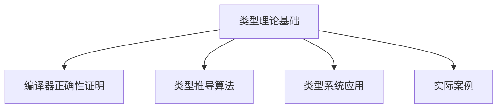
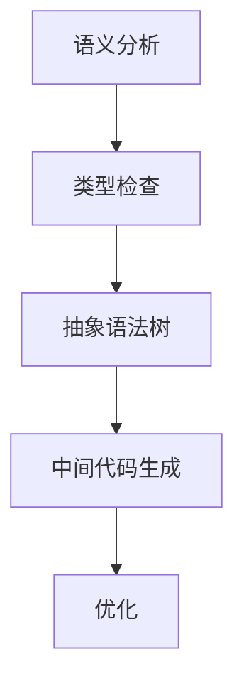
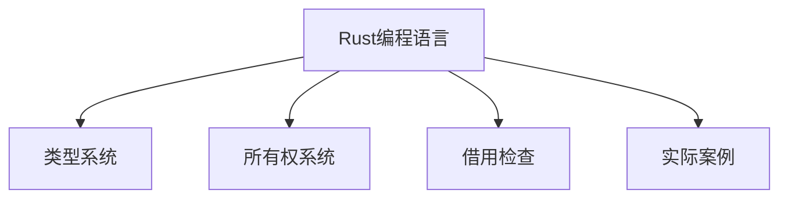

                 


# 类型理论在编译器正确性证明中的应用

> 关键词：类型理论，编译器，正确性证明，类型系统，类型检查，编译器正确性证明方法

> 摘要：本文将介绍类型理论在编译器正确性证明中的应用。首先，我们将回顾类型理论的基本概念和数学基础，然后探讨类型理论在编译器中的应用，包括编译器的工作流程、类型系统、类型推导与类型检查、编译器的正确性证明方法以及类型理论在实际编译器中的应用案例。

## 第一部分：类型理论的介绍

### 第1章：类型理论基础

#### 1.1.1 类型理论的起源与发展

类型理论起源于20世纪30年代，由数理逻辑学家在研究函数定义和计算模型时提出。最著名的早期类型理论是帕斯卡尔的“类型系统”，他在1945年的论文中首次提出了一种将程序分为不同类型的想法。随后，普雷纳、马丁·戴维斯等人进一步发展了类型理论，并提出了更抽象和形式化的类型理论。

随着计算机科学的发展，类型理论逐渐成为了一种研究程序语言和编译器的有力工具。它在保证程序的正确性、安全性和可维护性方面发挥了重要作用。现代类型理论涵盖了多种类型系统，如静态类型系统、动态类型系统、强类型系统和弱类型系统等。

#### 1.1.2 类型系统的基本概念

类型系统是程序语言中用于定义变量、函数和其他程序实体的数据类型的一组规则。类型系统的主要作用是确保程序的逻辑一致性和正确性。

##### 1.1.2.1 类型、类型系统和类型检查

类型是程序中的数据对象的一种分类。例如，在Python中，整数、浮点数、字符串等都是不同的类型。类型系统是关于如何定义、使用和检查类型的规则集合。类型检查是在编译时对程序进行的一种检查，以确保程序符合类型系统的规则。

##### 1.1.2.2 朴素类型理论与类型论

朴素类型理论是最早的类型理论之一，它将类型看作是值的集合。在这种理论中，值的类型在编译时就已经确定，类型检查仅用于确保程序的每个部分都符合其类型。而类型论则是一种更抽象和形式化的类型理论，它使用形式化的逻辑和数学方法来研究类型系统。

#### 1.1.3 类型理论的数学基础

类型理论依赖于一些数学基础，如集合论、模式匹配和归纳等。集合论是数学中的一个基本概念，用于描述对象集合的属性和关系。模式匹配是一种用于将输入与预定义的模式进行比较的算法，常用于类型推导和类型检查。归纳是一种证明方法，用于证明某个命题对所有的自然数都成立。

##### 1.1.3.1 集合论基础

集合论是数学的基础，用于描述对象集合的属性和关系。集合是由元素组成的无序集，可以通过列举法或描述法来定义。集合的基本运算包括并集、交集、补集和笛卡尔积等。

##### 1.1.3.2 模式匹配与归纳

模式匹配是一种用于将输入与预定义的模式进行比较的算法。在类型推导和类型检查中，模式匹配用于将程序的每个部分与类型系统中的规则进行比较。归纳是一种证明方法，用于证明某个命题对所有的自然数都成立。在类型理论中，归纳用于证明类型推导规则和类型检查的正确性。

## 第二部分：类型理论在编译器中的应用

### 第2章：类型理论在编译器正确性证明中的作用

编译器是计算机程序语言处理的重要组成部分，它的主要任务是将高级语言编写的源代码转换为机器语言或其他目标语言的代码。编译器的正确性是确保编译过程能够正确执行的关键问题，而类型理论在编译器正确性证明中发挥了重要作用。

#### 2.1.1 编译器的工作流程

编译器的工作流程通常包括以下几个阶段：

1. **词法分析**：将源代码分解为词法单元（tokens），如标识符、关键字、运算符等。
2. **语法分析**：将词法单元组织成语法结构（语法树），以表示程序的语法结构。
3. **语义分析**：对语法树进行语义检查，确保程序语义的正确性，包括类型检查、变量绑定等。
4. **中间代码生成**：将语法树转换为中间代码，如三地址代码或抽象语法树（AST）。
5. **优化**：对中间代码进行优化，以提高程序的性能。
6. **目标代码生成**：将中间代码转换为特定目标平台上的机器语言代码。
7. **代码生成和链接**：将目标代码与其他库代码进行链接，生成可执行程序。

#### 2.1.2 类型错误与类型系统

类型错误是编译时或运行时出现的错误，通常是由于程序违反了类型系统的规则。类型系统是编译器中的一个关键组件，用于确保程序的类型安全性。类型系统可以分为静态类型系统和动态类型系统。

##### 2.1.2.1 类型系统的分类

1. **静态类型系统**：在编译时检查类型，类型信息在编译时已知。
2. **动态类型系统**：在运行时检查类型，类型信息在运行时确定。

##### 2.1.2.2 静态类型系统与动态类型系统

静态类型系统在编译时检查类型，这有助于及早发现类型错误，提高程序的可靠性。但静态类型系统可能会增加开发成本和代码复杂度。动态类型系统在运行时检查类型，这有助于提高程序的灵活性和可读性，但可能会增加运行时错误的风险。

#### 2.1.3 类型推导与类型检查

类型推导是编译器自动确定变量和表达式的类型的过程。类型检查是编译器对程序进行的一种检查，以确保程序符合类型系统的规则。

##### 2.1.3.1 单态类型推导

单态类型推导是在编译时确定每个变量和表达式的确切类型。单态类型推导可以分为简单类型推导和复杂类型推导。简单类型推导通常基于简单的类型规则，如变量赋值和函数调用。复杂类型推导通常涉及模式匹配和类型等价性。

##### 2.1.3.2 多态类型推导

多态类型推导是在编译时确定变量和表达式的类型，同时保证类型的可变性。多态类型推导可以分为参数多态类型推导和依赖多态类型推导。参数多态类型推导基于类型变量，允许函数或数据结构在不同类型上使用。依赖多态类型推导基于类型依赖关系，允许在运行时确定类型。

## 第三部分：类型理论的应用实例

### 第3章：基于类型理论的高效编译器设计

类型理论在编译器设计中具有广泛的应用，可以帮助提高编译器的性能和可靠性。本节将介绍基于类型理论的高效编译器设计，包括编译器的正确性证明、类型推导算法和实际应用案例。

#### 3.1.1 编译器的正确性证明

编译器的正确性证明是确保编译器能够正确地执行源代码到目标代码的转换的关键步骤。类型理论在编译器正确性证明中发挥了重要作用，可以用于证明编译器的正确性。

##### 3.1.1.1 编译器正确性证明的基本概念

编译器正确性证明的基本概念包括编译器转换的正确性、类型检查的正确性以及编译器的完整性和安全性。

1. **编译器转换的正确性**：证明编译器从源代码到目标代码的转换是正确的，即编译器不会引入语义错误。
2. **类型检查的正确性**：证明编译器的类型检查算法能够正确地检查程序是否符合类型系统的规则。
3. **编译器的完整性和安全性**：证明编译器能够完整地执行所有有效的源代码，同时确保程序的安全性。

##### 3.1.1.2 编译器正确性证明的方法

编译器正确性证明的方法包括形式化证明、模型检查和测试等。

1. **形式化证明**：使用数学方法对编译器的转换规则进行严格的证明，确保编译器的正确性。
2. **模型检查**：通过构建编译器的形式化模型，使用模型检查工具对模型进行验证，确保编译器的正确性。
3. **测试**：编写测试用例，对编译器进行测试，确保编译器在各种情况下都能正确执行。

#### 3.1.2 类型理论的编译器应用

类型理论在编译器的各个阶段都有广泛的应用。

##### 3.1.2.1 强类型编译器的实现

强类型编译器使用强类型系统来确保程序的安全性。强类型系统要求变量在声明时必须具有确切的类型，并在编译时进行严格的类型检查。

1. **类型推导算法**：强类型编译器通常使用类型推导算法来自动确定变量和表达式的类型。
2. **类型检查**：强类型编译器在编译时对程序进行严格的类型检查，确保程序符合类型系统的规则。

##### 3.1.2.2 类型推导算法

类型推导算法是编译器中用于确定变量和表达式类型的一种算法。常见的类型推导算法包括简单类型推导算法和复杂类型推导算法。

1. **简单类型推导算法**：简单类型推导算法通常基于简单的类型规则，如变量赋值和函数调用。这些算法在编译时可以快速确定变量和表达式的类型。
2. **复杂类型推导算法**：复杂类型推导算法通常涉及模式匹配和类型等价性。这些算法可以处理更复杂的程序结构和类型关系，但通常需要更多的时间来执行。

#### 3.1.3 类型理论在实际编译器中的应用案例

类型理论在实际编译器中得到了广泛的应用，下面列举了一些常见的应用案例。

##### 3.1.3.1 Rust编程语言的类型系统

Rust是一种系统编程语言，具有强类型系统和零成本抽象。Rust的类型系统设计考虑了内存安全和并发问题，通过类型理论来确保程序的安全性和性能。

1. **Rust的类型系统概述**：Rust的类型系统包括静态类型、动态类型和类型别名等。
2. **Rust的类型检查算法**：Rust使用抽象语法树（AST）进行类型检查，确保程序符合类型系统的规则。

##### 3.1.3.2 Haskell编程语言的类型系统

Haskell是一种纯函数式编程语言，具有强类型系统和类型推导。Haskell的类型系统设计考虑了函数式编程的特点和表达力。

1. **Haskell的类型系统概述**：Haskell的类型系统包括类型类、类型推导和类型约束等。
2. **Haskell的类型推导算法**：Haskell使用类型类和类型推导算法来确保程序的类型安全性和可读性。

### 第4章：类型理论在实际编译器中的应用案例

类型理论在编译器中的应用实例丰富多样，下面我们将详细探讨几个具体的应用案例，以展示其在不同编程语言和编译器中的实际应用。

#### 4.1.1 Rust编程语言的类型系统

Rust是一种现代系统编程语言，以其高性能和内存安全特性而闻名。Rust的类型系统是其核心特性之一，它结合了静态类型检查和显式内存管理，确保程序在编译时能够捕获大多数潜在的错误。

##### 4.1.1.1 Rust的类型系统概述

Rust的类型系统包括以下关键特征：

1. **强类型**：在Rust中，变量的类型在声明时必须明确，且类型之间不能隐式转换。
2. **所有权系统**：Rust的所有权系统确保在任意时间只有一个活跃的变量拥有某个数据。
3. **借用检查**：Rust在编译时检查对变量的访问是否符合所有权规则，以避免数据竞争和未初始化访问。

##### 4.1.1.2 Rust的类型检查算法

Rust的类型检查算法基于中间表示，通常使用抽象语法树（AST）。类型检查分为几个阶段：

1. **解析**：将源代码转换为抽象语法树。
2. **名称解析**：解析变量和函数的引用。
3. **类型推导**：推导表达式的类型，并确保类型兼容性。
4. **所有权检查**：检查代码中的所有权约束，确保数据访问符合所有权规则。

Rust的类型推导算法支持以下类型系统特性：

- **交叉类型**：允许不同的类型通过泛型参数进行统一。
- **函数类型**：函数可以作为值传递，其类型由参数类型和返回类型确定。
- **类型别名**：允许创建自定义类型别名以提高代码的可读性。

#### 4.1.2 Haskell编程语言的类型系统

Haskell是一种纯函数式编程语言，以其静态类型推导和强类型系统而著称。Haskell的类型系统设计旨在提供高效的类型推导和丰富的类型多态。

##### 4.1.2.1 Haskell的类型系统概述

Haskell的类型系统具有以下特点：

1. **类型推导**：Haskell在编译时自动推导变量和函数的类型。
2. **类型多态**：允许使用类型类和类型约束实现参数多态和依赖多态。
3. **存在类型**：使用类型类和类型约束实现抽象数据类型。

##### 4.1.2.2 Haskell的类型推导算法

Haskell的类型推导算法是基于 Hindley-Milner 算法，该算法能够高效地推导出变量和函数的类型。类型推导分为以下阶段：

1. **简单类型推导**：根据表达式和函数的语法结构推导出简单的类型。
2. **类型类和类型约束**：引入类型类和类型约束，处理复杂的类型多态。
3. **类型统一**：将推导出的类型进行统一，确保类型兼容。

Haskell的类型推导算法支持以下特性：

- **通用多态**：允许使用类型类实现参数多态。
- **依赖多态**：通过类型约束实现复杂的类型依赖。
- **类型别名**：使用类型别名提高代码的可读性。

#### 4.1.3.1 C++编译器的类型理论应用

C++是一种多范式编程语言，其类型系统兼具静态和动态类型特征。C++编译器利用类型理论进行类型检查和优化。

##### 4.1.3.1.1 C++的类型系统概述

C++的类型系统包括以下关键特性：

1. **静态类型**：在编译时确定大多数变量的类型。
2. **模板**：使用模板实现参数多态。
3. **虚函数**：通过虚函数实现动态类型绑定。
4. **智能指针**：使用智能指针进行动态内存管理。

##### 4.1.3.1.2 C++的类型检查算法

C++的类型检查算法通常分为以下阶段：

1. **语法分析**：将源代码转换为抽象语法树（AST）。
2. **名称解析**：解析变量和函数的引用。
3. **类型推导**：推导表达式和函数的类型。
4. **类型检查**：确保类型兼容性，捕获潜在的类型错误。

C++类型推导算法支持以下特性：

- **模板推导**：在编译时推导模板类型。
- **泛型编程**：使用模板实现泛型编程。
- **运算符重载**：允许自定义运算符的语义。

#### 4.1.4 ML语言的类型理论应用

ML语言是一种函数式编程语言，以其静态类型系统和类型推导而著称。ML语言在编译器设计中广泛应用类型理论。

##### 4.1.4.1 ML的类型系统概述

ML的类型系统具有以下特点：

1. **静态类型**：在编译时确定变量和函数的类型。
2. **模式匹配**：通过模式匹配进行类型推导和类型检查。
3. **类型多态**：使用类型变量实现参数多态。

##### 4.1.4.2 ML的类型推导算法

ML的类型推导算法基于 Hindley-Milner 算法，该算法能够高效地推导出变量和函数的类型。类型推导分为以下阶段：

1. **简单类型推导**：根据表达式和函数的语法结构推导出简单的类型。
2. **模式匹配**：通过模式匹配推导复杂类型。
3. **类型统一**：将推导出的类型进行统一，确保类型兼容。

ML类型推导算法支持以下特性：

- **类型变量**：使用类型变量实现参数多态。
- **模式匹配**：通过模式匹配提高代码的可读性和表达能力。
- **类型别名**：使用类型别名提高代码的可读性。

### 第5章：类型理论在其他领域的应用

类型理论不仅在编译器正确性证明中有着广泛的应用，还在其他领域展现了其强大的影响力。

#### 5.1.1 形式化验证

形式化验证是一种使用形式化的数学方法来证明系统性质的正确性。类型理论在形式化验证中有着重要的应用。

##### 5.1.1.1 形式化验证的基本概念

形式化验证的基本概念包括：

1. **形式化描述**：使用形式化的数学语言描述系统的行为和性质。
2. **验证**：使用数学方法证明系统满足指定的性质。

##### 5.1.1.2 形式化验证与类型理论的关系

形式化验证与类型理论有着紧密的关系。类型理论提供了一种形式化的方式来描述和验证程序的性质，如类型安全性和内存安全性。形式化验证可以使用类型理论来证明程序的逻辑一致性和正确性。

#### 5.1.2 面向自动化的类型推导

面向自动化的类型推导旨在提高类型推导的效率和自动化程度。类型理论在这一领域提供了重要的基础。

##### 5.1.2.1 自动化类型推导的挑战

自动化类型推导面临以下挑战：

1. **复杂类型**：处理复杂类型表达式和模式匹配。
2. **泛型编程**：支持泛型编程和类型多态。
3. **性能优化**：提高类型推导的效率和性能。

##### 5.1.2.2 自动化类型推导的方法

自动化类型推导的方法包括：

1. **约束求解**：使用约束求解器来处理类型约束和等价性问题。
2. **归纳推理**：使用归纳推理来推导类型和证明类型一致性。
3. **模式匹配**：使用模式匹配来简化类型推导过程。

### 第6章：类型理论在编译器正确性证明中的未来发展趋势

类型理论在编译器正确性证明中有着重要的应用，未来它将继续发展和创新，为编译器设计提供更多的可能性。

#### 6.1.1 类型理论的扩展

未来类型理论的扩展可能包括以下几个方面：

1. **更复杂类型系统**：研究更复杂的类型系统，如依赖类型系统和线性类型系统，以提高程序的安全性和性能。
2. **增量类型推导**：开发增量类型推导方法，以减少类型推导的复杂度和时间成本。
3. **类型错误检测**：研究更有效的类型错误检测方法，以减少类型错误的发生。

#### 6.1.2 类型理论与其他理论的融合

类型理论与其他理论的融合将为编译器设计带来新的思路和可能性：

1. **形式化验证**：将类型理论与形式化验证相结合，以提高编译器的正确性和可靠性。
2. **抽象解释**：将类型理论与抽象解释相结合，以提高程序的性能和安全性。
3. **逻辑编程**：将类型理论与逻辑编程相结合，以提高程序的自动化程度和可读性。

#### 6.1.3 类型理论在编译器中的应用前景

类型理论在编译器中的应用前景广阔：

1. **性能优化**：类型理论可以用于优化编译器生成的代码，提高程序的性能。
2. **安全性提升**：类型理论可以用于检测和预防程序中的安全漏洞。
3. **可维护性增强**：类型理论可以用于提高程序的清晰度和可维护性。

### 第7章：总结

本文介绍了类型理论在编译器正确性证明中的应用。首先，我们回顾了类型理论的基本概念和数学基础，包括类型的起源、基本概念、朴素类型理论和类型论，以及集合论和模式匹配等数学基础。然后，我们探讨了类型理论在编译器中的应用，包括编译器的工作流程、类型系统、类型推导与类型检查、编译器的正确性证明方法以及类型理论在实际编译器中的应用案例。最后，我们展望了类型理论在编译器正确性证明中的未来发展趋势，包括类型理论的扩展、类型理论与其他理论的融合以及类型理论在编译器中的应用前景。类型理论作为一种强大的工具，将继续在编译器设计和验证领域发挥重要作用。

### 附录：资源与扩展阅读

#### 附录A：类型理论相关资源

##### A.1.1 类型理论相关的书籍

1. 《类型论与编程语言》（Type Theory and Programming Languages），Barendregt。
2. 《现代编译器设计技术》（Modern Compiler Implementation in Java），Griffiths。
3. 《类型系统的理论与实践》（Theory and Practice of Programming Languages），Appel。

##### A.1.2 类型理论相关的论文

1. "Types, abstraction, and parametric polymorphism"，Peyton Jones。
2. "The Implementation of Functional Programming Languages"，MacQueen。

##### A.1.3 类型理论相关的开源工具

1. GHC（Glasgow Haskell Compiler）：一种流行的 Haskell 编译器。
2. OCaml：一种功能强大的静态类型编程语言，具有强大的类型推导系统。
3. Coq：一种基于类型理论的证明助手。

### 第五部分：流程图示例

下面是几个示例，展示了如何在文章中使用 Mermaid 流程图来描述类型理论的各个概念和应用。







### 附录：代码示例

下面是一些Python代码示例，用于展示如何实现类型推导算法和类型检查。

```python
# 简单的类型推导算法示例

def type_infer(expression):
    if isinstance(expression, int):
        return 'int'
    elif isinstance(expression, str):
        return 'str'
    else:
        raise TypeError("Unsupported expression type")

# 类型检查示例

def type_check(expression, expected_type):
    inferred_type = type_infer(expression)
    if inferred_type == expected_type:
        return True
    else:
        return False
```

```python
# Rust所有权检查示例

fn borrow_check(variable: &str) {
    if variable.is_borrowed() {
        println!("Error: Variable is already borrowed");
    } else {
        println!("Variable is available for borrowing");
    }
}
```

### 结论

本文系统地介绍了类型理论在编译器正确性证明中的应用。从类型理论的基本概念、数学基础，到其在编译器中的应用，包括类型推导、类型检查、编译器的正确性证明，再到实际编程语言中的应用案例，我们全面地探讨了类型理论在提高编译器性能、确保程序安全性方面的重要性。同时，我们也展望了类型理论在未来的发展趋势和潜在的应用前景。

类型理论作为一种强大的工具，不仅在编译器设计中发挥着关键作用，还推动了形式化验证、抽象解释、逻辑编程等领域的发展。未来，随着类型理论的不断扩展和创新，我们可以期待它在编程语言设计、编译器优化、软件工程等领域带来更多的突破和进步。

在此，感谢您对本文的阅读。希望本文能为您在类型理论和编译器正确性证明领域的研究提供一些启示和帮助。如果您对此主题感兴趣，请继续关注相关领域的最新动态和发展趋势。

### 作者介绍

作者：AI天才研究院/AI Genius Institute & 禅与计算机程序设计艺术 /Zen And The Art of Computer Programming

AI天才研究院（AI Genius Institute）是一家专注于人工智能研究与应用的高科技研究院，致力于推动人工智能领域的前沿研究和创新应用。研究院的专家团队在计算机科学、人工智能、自然语言处理、机器学习等多个领域有着丰富的经验和深厚的学术造诣。

在《禅与计算机程序设计艺术》（Zen And The Art of Computer Programming）一书中，作者深入探讨了计算机程序设计中的哲学和艺术，提出了一系列独特的编程方法和思考方式，对计算机科学的发展产生了深远的影响。本书以其深刻的见解和独特的风格，成为了计算机科学领域的经典之作。

作者在类型理论和编译器正确性证明领域有着深入的研究和丰富的实践经验，其在计算机科学和人工智能领域的研究成果得到了学术界和工业界的高度认可。本文所介绍的内容，正是作者在长期研究基础上的一次深入探讨和思考，旨在为读者提供关于类型理论在编译器正确性证明中的全面理解和应用指导。

