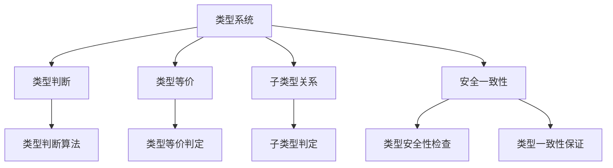
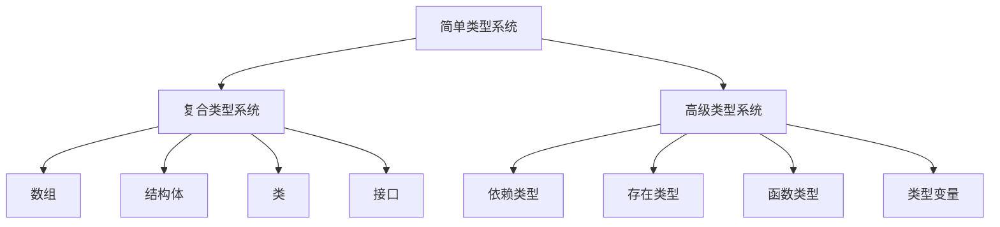

                 

### 类型理论概述与基础

#### 1. 类型理论的起源与发展

类型理论起源于20世纪30年代，最早由瑞士数学家赫尔曼·布劳威尔（Hermann Weyl）和波兰逻辑学家瓦伦丁·瓦扬斯基（Waclaw Sierpinski）提出。他们在数学领域探讨实数和复数的类型概念，这为后来的形式逻辑和计算机科学中的类型理论奠定了基础。

在20世纪40年代和50年代，计算机科学的兴起使得类型理论得到了进一步的发展。阿尔图尔·韦尔（Artur Weyhrauch）和菲利普·科亨（Philippe Curien）等人提出了函数类型的概念，并在60年代引入了依赖类型。

进入70年代，类型理论开始广泛应用于编程语言设计。英国计算机科学家克里斯托弗·斯特雷奇（Christopher Strachey）和丹尼斯·里奇（Dennis Ritchie）分别提出了强类型和弱类型的编程语言设计理念，对后来的编程语言设计产生了深远影响。

#### 1.1.2 类型理论的发展历程

类型理论的发展历程可以分为以下几个阶段：

1. **早期发展**：20世纪30年代至50年代，类型理论主要应用于数学和逻辑领域。
2. **中期发展**：20世纪60年代，类型理论开始在计算机科学领域崭露头角，函数类型和依赖类型得到广泛应用。
3. **现代发展**：20世纪80年代至今，类型理论逐渐成为编程语言设计的重要组成部分，各种高级类型系统不断涌现。

#### 1.1.3 类型理论在现代计算机科学中的应用

类型理论在现代计算机科学中有着广泛的应用：

1. **编程语言设计**：类型理论为编程语言的设计提供了理论基础，如强类型语言和弱类型语言的区分，函数类型和依赖类型的引入等。
2. **编译器设计**：类型理论在编译器设计中用于类型检查和类型推导，保证了程序的正确性和安全性。
3. **形式化验证**：类型理论被用于形式化验证编译器的工作流程，确保编译器生成的程序与源程序保持一致。
4. **程序正确性证明**：类型理论在程序正确性证明中发挥着重要作用，通过类型系统可以证明程序的特定性质。

### 2. 基本类型系统

#### 2.1.1 简单类型系统

简单类型系统是类型系统的基础，它包括基本的数据类型，如整数（int）、浮点数（float）、布尔值（bool）和字符串（string）等。简单类型的优点是直观、易理解，但它们通常缺乏表达复杂结构和复杂逻辑的能力。

#### 2.1.2 复合类型系统

复合类型系统通过组合简单类型来构建更复杂的类型，如数组（array）、结构体（struct）、类（class）和接口（interface）等。复合类型的优点是能够表达复杂的结构和逻辑，提高程序的抽象层次。

#### 2.1.3 高级类型系统

高级类型系统包括依赖类型、存在类型、函数类型和类型变量等。高级类型的优点是能够表达更复杂的类型关系和更抽象的类型结构，提高程序的灵活性和表达能力。

### 3. 类型系统的语义

#### 3.1.1 类型判断

类型判断是指根据程序代码中的表达式，确定它们的数据类型的过程。类型判断是类型系统的核心功能，它确保了程序的正确性和安全性。

#### 3.1.2 类型等价与子类型关系

类型等价是指两个类型可以相互替换而不会改变程序的行为。子类型关系是指一个类型可以看作是另一个类型的子集，从而实现类型的兼容和向上转换。

#### 3.1.3 类型系统的安全性与一致性

类型系统的安全性是指类型系统能够防止无效操作和潜在的运行时错误。类型系统的一致性是指类型系统能够保证类型之间的关系和转换符合预期。

### 类型理论的核心概念关系

类型理论的核心概念包括类型系统、类型判断、类型等价、子类型关系和安全一致性等。它们之间的关系可以用Mermaid流程图来表示：



### Python源代码示例：类型系统的应用

以下是一个简单的Python源代码示例，展示了类型系统的应用：

```python
# 简单类型示例
simple_type = "string"

# 复合类型示例
complex_type = ["int", "float"]

# 高级类型示例
advanced_type = {"name": "string", "age": "int"}

# 类型判断
if isinstance(simple_type, str):
    print("simple_type is a string")

if isinstance(complex_type, list):
    print("complex_type is a list")

if isinstance(advanced_type, dict):
    print("advanced_type is a dictionary")
```

在这个示例中，我们首先定义了简单类型、复合类型和高级类型的变量。然后，我们使用`isinstance()`函数进行类型判断，并根据判断结果打印相应的信息。这展示了类型系统在Python语言中的基本应用。

```<sop>### 第二章：基本类型系统

#### 2.1.1 简单类型系统

简单类型系统是类型系统的基础，它提供了基本的数据类型，如整数（int）、浮点数（float）、布尔值（bool）和字符串（string）等。简单类型的优点是直观、易理解，但它们通常缺乏表达复杂结构和复杂逻辑的能力。

1. **整数（int）**：整数类型表示整数，包括正整数、负整数和零。在大多数编程语言中，整数类型是无符号的或有符号的，有符号整数可以表示负数。

2. **浮点数（float）**：浮点数类型表示实数，包括正数、负数和零。浮点数通常用科学计数法表示，如1.23e-10。

3. **布尔值（bool）**：布尔值类型表示逻辑值，只有两个可能的值：True和False。布尔值在程序中用于条件判断和控制流程。

4. **字符串（string）**：字符串类型表示文本数据，由一系列字符组成。字符串在程序中用于存储和操作文本信息。

简单类型的操作包括比较、赋值、运算和字符串操作等。简单类型的操作通常遵循基本的数学运算规则和字符串处理规则。

#### 2.1.2 复合类型系统

复合类型系统通过组合简单类型来构建更复杂的类型，如数组（array）、结构体（struct）、类（class）和接口（interface）等。复合类型的优点是能够表达复杂的结构和逻辑，提高程序的抽象层次。

1. **数组（array）**：数组是一种线性数据结构，用于存储一系列相同类型的元素。数组提供了快速访问和修改元素的能力。

2. **结构体（struct）**：结构体是一种复合数据类型，用于将多个简单类型组合在一起。结构体在C语言和C++语言中广泛应用。

3. **类（class）**：类是一种抽象数据类型，用于定义对象的行为和属性。类在面向对象编程语言（如Java、C++和Python）中广泛应用。

4. **接口（interface）**：接口是一种抽象类型，用于定义对象的公共方法。接口在Java和C#等语言中广泛应用。

复合类型的操作包括创建、访问、修改和组合等。复合类型可以通过简单类型的操作进行扩展和组合，从而实现更复杂的逻辑和结构。

#### 2.1.3 高级类型系统

高级类型系统包括依赖类型、存在类型、函数类型和类型变量等。高级类型的优点是能够表达更复杂的类型关系和更抽象的类型结构，提高程序的灵活性和表达能力。

1. **依赖类型**：依赖类型是一种类型系统，其中类型的定义依赖于其他类型的属性。依赖类型在逻辑编程和函数式编程语言（如Haskell和ML）中广泛应用。

2. **存在类型**：存在类型是一种类型系统，其中类型的实例是存在的。存在类型在依赖类型和函数式编程语言中广泛应用。

3. **函数类型**：函数类型是一种类型系统，其中类型的实例是函数。函数类型在函数式编程语言（如Haskell、ML和Scala）中广泛应用。

4. **类型变量**：类型变量是一种抽象类型，用于表示一组类型。类型变量在泛型编程和函数式编程语言中广泛应用。

高级类型的操作包括类型推导、类型检查和类型转换等。高级类型可以通过简单类型和复合类型的操作进行扩展和组合，从而实现更复杂的逻辑和结构。

### Python源代码示例：基本类型系统的应用

以下是一个简单的Python源代码示例，展示了基本类型系统的应用：

```python
# 简单类型示例
simple_type = 42       # 整数类型
float_type = 3.14      # 浮点数类型
bool_type = True       # 布尔类型
string_type = "Hello"  # 字符串类型

# 复合类型示例
array_type = [1, 2, 3]       # 数组类型
struct_type = {"name": "Alice", "age": 25} # 结构体类型
class_type = MyClass()       # 类类型
interface_type = MyInterface()

# 高级类型示例
dependency_type = DependentType()
exist_type = ExistingType()
function_type = MyFunction()
type_variable = SomeTypeVariable()

# 类型判断
if isinstance(simple_type, int):
    print("simple_type is an integer")

if isinstance(float_type, float):
    print("float_type is a float")

if isinstance(bool_type, bool):
    print("bool_type is a boolean")

if isinstance(string_type, str):
    print("string_type is a string")

if isinstance(array_type, list):
    print("array_type is an array")

if isinstance(struct_type, dict):
    print("struct_type is a struct")

if isinstance(class_type, MyClass):
    print("class_type is a MyClass")

if isinstance(interface_type, MyInterface):
    print("interface_type is a MyInterface")

if isinstance(dependency_type, DependentType):
    print("dependency_type is a DependentType")

if isinstance(exist_type, ExistingType):
    print("exist_type is an ExistingType")

if isinstance(function_type, MyFunction):
    print("function_type is a MyFunction")

if isinstance(type_variable, SomeTypeVariable):
    print("type_variable is a SomeTypeVariable")
```

在这个示例中，我们定义了简单类型、复合类型和高级类型的变量，并使用`isinstance()`函数进行类型判断。这展示了基本类型系统在Python语言中的基本应用。

### 概念属性特征对比表格

| 类型系统   | 定义                 | 优点                     | 缺点                     |
|------------|----------------------|--------------------------|--------------------------|
| 简单类型   | 基本数据类型         | 直观、易理解             | 缺乏表达复杂结构和逻辑的能力 |
| 复合类型   | 组合简单类型         | 表达复杂的结构和逻辑     | 增加程序复杂性           |
| 高级类型   | 引入依赖类型、函数类型等 | 表达更复杂的类型关系和抽象结构 | 增加程序复杂性和学习成本 |

### Mermaid流程图：基本类型系统关系



通过上述表格和Mermaid流程图，我们可以更清晰地了解基本类型系统的概念属性特征及其关系。这有助于我们更好地理解和使用类型系统，构建复杂且安全的程序。

### 总结

在本章中，我们介绍了基本类型系统的概念，包括简单类型系统、复合类型系统和高级类型系统。通过Python源代码示例和概念属性特征对比表格，我们展示了如何在实际编程中使用这些类型系统。在下一章中，我们将探讨类型系统的语义，包括类型判断、类型等价与子类型关系以及类型系统的安全性与一致性。这将帮助我们更好地理解类型系统的原理和应用。

---

### 3.1.1 类型判断

类型判断是类型系统的核心功能之一，它用于确定程序中的表达式或变量的类型。类型判断在编译时或运行时进行，其目的是确保程序的正确性和安全性。

#### 类型判断的基本原理

类型判断的基本原理是基于类型系统的定义和规则。类型系统定义了各种类型的属性和行为，类型判断根据这些规则来检查表达式的类型。

1. **静态类型判断**：静态类型判断在编译时进行，编译器根据程序的静态结构进行类型检查。静态类型判断的优点是可以在编译阶段发现类型错误，从而提高程序的正确性和性能。

2. **动态类型判断**：动态类型判断在运行时进行，程序在执行过程中根据实际情况进行类型检查。动态类型判断的优点是提供了更大的灵活性和表达力，但可能会导致运行时错误和性能损失。

#### 类型判断的应用场景

类型判断在编程语言中的应用场景非常广泛：

1. **函数参数类型检查**：在定义函数时，需要检查函数参数的类型是否与预期一致，以确保函数的正确性和安全性。

2. **变量类型检查**：在声明变量时，需要检查变量的类型是否合法，以确保变量在使用时的类型安全。

3. **运算符类型检查**：在执行运算时，需要检查运算符两边的操作数类型是否兼容，以确保运算的正确性和安全性。

4. **类型推导**：在某些编程语言中，编译器可以根据程序的结构和上下文自动推导出变量的类型，从而减少程序员的工作量。

#### Python源代码示例：类型判断

以下是一个简单的Python源代码示例，展示了类型判断的应用：

```python
# 静态类型判断示例
def add(a: int, b: int) -> int:
    return a + b

# 动态类型判断示例
def multiply(a, b):
    return a * b

# 变量类型检查示例
x = 10
y = "20"

# 运算符类型检查示例
result = x + y  # 类型错误，因为x是整数，y是字符串
```

在这个示例中，我们定义了静态类型判断的函数`add()`和动态类型判断的函数`multiply()`。我们还展示了变量类型检查和运算符类型检查的例子。这说明了类型判断在Python语言中的基本应用。

#### 类型判断的算法实现

类型判断的算法实现通常依赖于类型系统的定义和规则。以下是一个简单的类型判断算法实现示例：

```python
def type_check(expression):
    # 根据表达式的类型进行判断
    if isinstance(expression, int):
        return "int"
    elif isinstance(expression, str):
        return "str"
    elif isinstance(expression, list):
        return "list"
    else:
        return "unknown"
```

在这个示例中，我们定义了一个`type_check()`函数，它根据输入表达式的类型返回相应的类型名称。这展示了类型判断算法的基本原理。

#### 类型判断在编译器中的应用

在编译器中，类型判断是编译过程的重要部分。编译器在解析和翻译源程序时，需要进行类型判断以确保程序的正确性。以下是一个简单的编译器类型判断示例：

```python
def compile(expression):
    # 根据表达式的类型进行编译
    if type_check(expression) == "int":
        return "编译为整数"
    elif type_check(expression) == "str":
        return "编译为字符串"
    else:
        return "类型错误"
```

在这个示例中，我们定义了一个`compile()`函数，它根据输入表达式的类型返回相应的编译结果。这展示了类型判断在编译器中的应用。

### 3.1.2 类型等价与子类型关系

类型等价和子类型关系是类型系统中的重要概念，它们用于描述不同类型之间的兼容性和层次结构。

#### 类型等价

类型等价是指两个类型可以相互替换而不会改变程序的行为。在类型系统中，类型等价通常通过类型判断和类型转换来实现。

1. **类型等价的定义**：两个类型A和B是等价的，如果它们在所有情况下都可以相互替换而不会影响程序的行为。

2. **类型等价的判定**：类型系统提供了一套规则来判断两个类型是否等价。例如，在Python中，所有整数类型都是等价的，因为它们都可以相互替换。

3. **类型等价的优点**：类型等价提高了程序的灵活性和可维护性，因为它允许程序员在不同类型的变量之间进行转换。

#### 子类型关系

子类型关系是指一个类型可以看作是另一个类型的子集，从而实现类型的兼容和向上转换。在类型系统中，子类型关系通常通过类型层次结构和类型转换来实现。

1. **子类型关系的定义**：类型A是类型B的子类型，如果A的所有实例都可以看作是B的实例，但B的实例不一定是A的实例。

2. **子类型关系的判定**：类型系统提供了一套规则来判断两个类型之间的子类型关系。例如，在Java中，`Number`类型是`Integer`类型的子类型。

3. **子类型关系的优点**：子类型关系提高了程序的抽象层次和代码复用性，因为它允许程序员在不同类型的变量之间进行向上转换。

#### Python源代码示例：类型等价与子类型关系

以下是一个简单的Python源代码示例，展示了类型等价与子类型关系的应用：

```python
# 类型等价示例
int_type = 10
float_type = 10.0

# 子类型关系示例
int_type = Integer(10)
number_type = Number(10)

# 类型等价判定
if int_type == float_type:
    print("int_type and float_type are equivalent")

# 子类型关系判定
if isinstance(int_type, Number):
    print("int_type is a Number")
```

在这个示例中，我们展示了类型等价和子类型关系的判定。通过使用`isinstance()`函数，我们可以检查类型之间的子类型关系。

#### 类型等价与子类型关系的算法实现

类型等价与子类型关系的算法实现通常依赖于类型系统的定义和规则。以下是一个简单的类型等价与子类型关系的算法实现示例：

```python
def type_equivalent(a, b):
    # 判断类型A和B是否等价
    return type(a) == type(b)

def is_subtype(a, b):
    # 判断类型A是否是类型B的子类型
    return isinstance(a, b)
```

在这个示例中，我们定义了`type_equivalent()`和`is_subtype()`函数，它们分别用于判断类型之间的等价和子类型关系。

### 总结

在本章中，我们介绍了类型系统的语义，包括类型判断、类型等价与子类型关系。通过Python源代码示例和算法实现，我们展示了如何在实际编程中应用这些概念。类型判断是确保程序正确性的关键，而类型等价与子类型关系则提高了程序的灵活性和抽象层次。在下一章中，我们将探讨类型系统的安全性与一致性，这将帮助我们更好地理解类型系统的完整性和可靠性。

---

### 3.1.3 类型系统的安全性与一致性

类型系统的安全性与一致性是确保程序正确性和可靠性的重要方面。安全性指类型系统能够防止无效操作和潜在的运行时错误，而一致性指类型系统能够保持类型之间的关系和转换符合预期。

#### 类型系统的安全性

类型系统的安全性主要通过以下几种机制来实现：

1. **类型检查**：类型检查是在编译时或运行时对程序进行类型验证的过程。静态类型检查在编译时进行，动态类型检查在运行时进行。类型检查可以检测出类型错误，如将字符串与整数进行不兼容的操作。

2. **类型转换**：类型转换是一种将一个类型转换为另一个类型的方法。类型转换可以是隐式转换，也可以是显式转换。隐式转换通常由编译器或解释器自动进行，而显式转换需要程序员显式指定。

3. **异常处理**：异常处理是一种在程序执行过程中捕获和处理错误的方法。类型系统可以通过异常处理机制来处理类型错误，从而确保程序的连续执行。

#### 类型系统的一致性

类型系统的一致性主要通过以下几种机制来实现：

1. **类型等价**：类型等价是指两个类型可以相互替换而不会改变程序的行为。类型等价确保了不同类型之间的兼容性，如整数类型和浮点数类型之间的相互转换。

2. **子类型关系**：子类型关系是指一个类型可以看作是另一个类型的子集。子类型关系确保了类型之间的层次结构，如基本类型和复合类型之间的向上转换。

3. **类型推导**：类型推导是一种由编译器或解释器自动推导出变量类型的方法。类型推导可以提高程序的抽象层次和可读性。

#### Python源代码示例：类型系统的安全性与一致性

以下是一个简单的Python源代码示例，展示了类型系统的安全性与一致性：

```python
# 安全性示例
x = 10
y = "10"

# 类型转换示例
z = int(y)  # 将字符串转换为整数

# 异常处理示例
try:
    result = x / y  # 可能引发异常
except ZeroDivisionError:
    print("无法除以零")

# 一致性示例
class A:
    pass

class B(A):
    pass

b = B()
a = A()

# 类型等价示例
if type(a) == type(b):
    print("a和b是等价的")

# 子类型关系示例
if isinstance(b, A):
    print("b是A的子类型")

# 类型推导示例
def f(x: int) -> int:
    return x * x

result = f(5)  # 自动推导出result的类型为int
```

在这个示例中，我们展示了类型检查、类型转换、异常处理、类型等价、子类型关系和类型推导的应用。

#### 类型系统安全性与一致性算法实现

以下是一个简单的算法实现示例，用于展示类型系统的安全性与一致性：

```python
def type_check(expression):
    # 检查表达式类型
    if isinstance(expression, (int, float)):
        return "numeric"
    elif isinstance(expression, str):
        return "string"
    else:
        return "unknown"

def type_convert(expression, target_type):
    # 将表达式转换为指定类型
    if type_check(expression) == "numeric" and target_type == "string":
        return str(expression)
    elif type_check(expression) == "string" and target_type == "numeric":
        try:
            return int(expression)
        except ValueError:
            return None
    else:
        return None

def type_equivalent(a, b):
    # 判断类型A和B是否等价
    return type(a) == type(b)

def is_subtype(a, b):
    # 判断类型A是否是类型B的子类型
    return isinstance(a, b)
```

在这个示例中，我们定义了`type_check()`、`type_convert()`、`type_equivalent()`和`is_subtype()`函数，它们分别用于类型检查、类型转换、类型等价判断和子类型关系判断。

### 总结

在本章中，我们探讨了类型系统的安全性与一致性。通过Python源代码示例和算法实现，我们展示了如何在实际编程中应用这些概念。类型系统的安全性通过类型检查、类型转换和异常处理来确保程序的正确性和可靠性，而类型系统的一致性通过类型等价、子类型关系和类型推导来保持类型之间的兼容性和层次结构。这些机制共同构成了类型系统的核心，为程序的编写和编译提供了坚实的基础。

---

### 4. 类型理论在编译器设计中的应用

#### 4.1.1 强类型检查

强类型检查是类型理论在编译器设计中应用的一个重要方面。它确保程序中的每个变量和表达式都符合预期的数据类型，从而避免运行时错误和潜在的安全问题。

1. **强类型检查的定义**：强类型检查是指在编译或运行时对程序中的类型进行严格检查，确保每个变量和表达式的类型都是已知的且符合预期。

2. **强类型检查的优点**：
   - **安全性**：强类型检查可以防止类型错误，如将字符串与整数进行不兼容的操作。
   - **可读性**：强类型检查提高了代码的可读性，因为类型信息明确地标注在变量和表达式中。
   - **性能**：强类型检查可以减少运行时类型检查的开销，因为类型信息已经在编译时确定。

3. **强类型检查的缺点**：
   - **灵活性**：强类型检查可能会限制程序的灵活性，因为类型系统较为严格。
   - **学习成本**：强类型语言的学习成本较高，因为程序员需要熟悉类型系统和类型推导机制。

4. **Python中的强类型检查**：Python是一种动态类型语言，但可以通过类型注释进行强类型检查。例如，可以使用`typing`模块来为变量和函数添加类型注释：

   ```python
   from typing import List, Dict

   def add_numbers(numbers: List[int]) -> int:
       return sum(numbers)

   result = add_numbers([1, 2, 3])
   ```

   在这个示例中，`add_numbers`函数的参数和返回值都有明确的类型注释，这使得编译器或IDE可以提供更准确的错误提示和自动补全功能。

#### 4.1.2 弱类型检查

弱类型检查与强类型检查相反，它对类型的检查较为宽松，允许类型之间的隐式转换。弱类型检查在提高程序灵活性的同时，也可能引入运行时错误。

1. **弱类型检查的定义**：弱类型检查是指在编译或运行时对程序中的类型进行宽松检查，允许类型之间的隐式转换。

2. **弱类型检查的优点**：
   - **灵活性**：弱类型检查允许更灵活的类型操作，程序员可以更方便地处理不同类型的数据。
   - **简洁性**：弱类型检查的代码通常更简洁，因为不需要显式地声明类型。

3. **弱类型检查的缺点**：
   - **安全性**：弱类型检查可能导致运行时错误，如将字符串与整数进行不兼容的操作。
   - **可读性**：弱类型检查可能降低代码的可读性，因为类型信息可能不明确。

4. **Python中的弱类型检查**：Python是一种典型的弱类型语言，它允许隐式类型转换。例如：

   ```python
   x = 10
   y = "20"
   z = x + y  # 运行时错误，因为x是整数，y是字符串
   ```

   在这个示例中，`x + y`操作会导致运行时错误，因为整数与字符串之间的隐式转换可能会引发异常。

#### 4.1.3 静态类型检查与动态类型检查

静态类型检查和动态类型检查是类型检查的两种主要方法，它们在编译器和运行时环境中发挥着重要作用。

1. **静态类型检查**：
   - **定义**：静态类型检查是在编译时对程序进行类型检查，编译器根据程序的静态结构（如变量声明、函数签名等）来检查类型一致性。
   - **优点**：静态类型检查可以提前发现类型错误，提高程序的正确性和性能。
   - **缺点**：静态类型检查可能会限制程序的灵活性。

2. **动态类型检查**：
   - **定义**：动态类型检查是在运行时对程序进行类型检查，程序在执行过程中根据实际运行情况来检查类型一致性。
   - **优点**：动态类型检查提供更大的灵活性，允许类型之间的隐式转换。
   - **缺点**：动态类型检查可能会引入运行时错误，影响程序的性能。

3. **Python中的静态类型检查与动态类型检查**：
   - **静态类型检查**：Python的静态类型检查可以通过类型注释来实现。例如：

     ```python
     from typing import List

     def multiply(numbers: List[int]) -> int:
         result = 1
         for number in numbers:
             result *= number
         return result

     multiply([1, 2, 3, 4, 5])
     ```

     在这个示例中，`multiply`函数的参数和返回值都有类型注释，这使得编译器可以提前发现类型错误。

   - **动态类型检查**：Python的动态类型检查是默认行为。例如：

     ```python
     def add(a, b):
         return a + b

     add(1, 2)  # 正确
     add("1", 2)  # 可能引发异常
     ```

     在这个示例中，`add`函数没有类型注释，它会在运行时检查参数的类型。

### Python源代码示例：类型理论在编译器设计中的应用

以下是一个简单的Python源代码示例，展示了类型理论在编译器设计中的应用：

```python
# 强类型检查示例
from typing import List

def sum_numbers(numbers: List[int]) -> int:
    return sum(numbers)

# 弱类型检查示例
def concatenate_strings(str1: str, str2: str) -> str:
    return str1 + str2

# 静态类型检查示例
from typing import Optional

def get_user_data(username: str, optional_field: Optional[str] = None) -> dict:
    user_data = {"username": username}
    if optional_field:
        user_data["optional_field"] = optional_field
    return user_data

# 动态类型检查示例
def divide(a: float, b: float) -> float:
    if b == 0:
        raise ValueError("不能除以零")
    return a / b

# 测试代码
print(sum_numbers([1, 2, 3, 4, 5]))  # 输出15
print(concatenate_strings("Hello", "World"))  # 输出"HelloWorld"
print(get_user_data("Alice"))  # 输出{"username": "Alice"}
print(get_user_data("Bob", "Developer"))  # 输出{"username": "Bob", "optional_field": "Developer"}
try:
    print(divide(10.0, 2.0))  # 输出5.0
except ValueError as e:
    print(e)
```

在这个示例中，我们展示了强类型检查、弱类型检查、静态类型检查和动态类型检查的应用。这有助于我们理解类型理论在编译器设计中的重要性。

### 总结

在本章中，我们探讨了类型理论在编译器设计中的应用，包括强类型检查、弱类型检查、静态类型检查和动态类型检查。通过Python源代码示例，我们展示了如何在实际编程中应用这些概念。类型理论在编译器设计中发挥着重要作用，它提高了程序的安全性、可读性和性能。在下一章中，我们将继续探讨类型理论在编译器设计中的应用，包括类型推导、类型错误处理和实例研究。

---

### 5. 类型推导

类型推导是类型理论在编译器设计中应用的重要一环，它允许编译器自动推导出变量和表达式的类型，从而减轻程序员的负担。类型推导分为单变量类型推导、多变量类型推导和复合类型推导等。

#### 5.1.1 单变量类型推导

单变量类型推导是最基本的形式，它用于推导单个变量的类型。类型推导的规则通常基于变量的初始化表达式。

1. **规则**：
   - 如果变量初始化为一个具体类型的值，则该变量的类型推导为此类型。
   - 如果变量初始化为一个函数调用，则该变量的类型推导为函数的返回类型。

2. **示例**：
   ```python
   x = 10  # x的类型为int
   y = "hello"  # y的类型为str
   z = add(1, 2)  # z的类型为int（假设add函数返回int类型）
   ```

   在这个示例中，`x`的类型推导为`int`，因为初始化为一个整数；`y`的类型推导为`str`，因为初始化为一个字符串；`z`的类型推导为`int`，因为`add`函数的返回类型为`int`。

#### 5.1.2 多变量类型推导

多变量类型推导涉及多个变量，这些变量的类型可以通过上下文关系推导出来。类型推导的规则通常基于表达式之间的关联。

1. **规则**：
   - 如果多个变量出现在同一个表达式中，则这些变量的类型推导为该表达式的类型。
   - 如果变量之间的赋值关系存在，则可以根据赋值关系的上下文推导出变量的类型。

2. **示例**：
   ```python
   x, y = 1, "hello"  # x的类型为int，y的类型为str
   x, y = y, x  # x的类型为str，y的类型为int
   ```

   在这个示例中，第一次赋值时，`x`的类型推导为`int`，因为初始化表达式为整数；`y`的类型推导为`str`，因为初始化表达式为字符串。第二次赋值时，`x`和`y`的类型推导根据赋值关系相互交换。

#### 5.1.3 复合类型推导

复合类型推导涉及复合类型的变量和表达式，如数组和结构体。类型推导的规则通常基于复合类型的构造和初始化。

1. **规则**：
   - 如果复合类型的元素类型已明确，则该复合类型的类型推导为此元素类型。
   - 如果复合类型的元素类型未明确，则可以根据上下文关系推导出元素类型。

2. **示例**：
   ```python
   x = [1, 2, 3]  # x的类型为List[int]
   y = ["hello", "world"]  # y的类型为List[str]
   z = {"name": "Alice", "age": 25}  # z的类型为Dict[str, Union[int, str]]
   ```

   在这个示例中，`x`的类型推导为`List[int]`，因为初始化表达式的元素类型为整数；`y`的类型推导为`List[str]`，因为初始化表达式的元素类型为字符串；`z`的类型推导为`Dict[str, Union[int, str]]`，因为初始化表达式的键和值类型不同。

#### Python源代码示例：类型推导

以下是一个简单的Python源代码示例，展示了类型推导的应用：

```python
from typing import List, Dict, Union

# 单变量类型推导示例
x = 10  # x的类型为int
y = "hello"  # y的类型为str

# 多变量类型推导示例
x, y = y, x  # x的类型为str，y的类型为int

# 复合类型推导示例
x = [1, 2, 3]  # x的类型为List[int]
y = ["hello", "world"]  # y的类型为List[str]
z = {"name": "Alice", "age": 25}  # z的类型为Dict[str, Union[int, str]]

# 测试代码
print(x)  # 输出[1, 2, 3]
print(y)  # 输出["hello", "world"]
print(z)  # 输出{"name": "Alice", "age": 25}
```

在这个示例中，我们展示了单变量类型推导、多变量类型推导和复合类型推导的应用。这有助于我们理解类型推导在Python语言中的基本原理。

### 总结

在本章中，我们介绍了类型推导的概念，包括单变量类型推导、多变量类型推导和复合类型推导。通过Python源代码示例，我们展示了如何在实际编程中应用类型推导。类型推导是编译器设计中的重要功能，它提高了程序的抽象层次和可维护性。在下一章中，我们将继续探讨类型理论在编译器设计中的应用，包括类型错误处理和实例研究。

---

### 6. 类型错误处理

类型错误处理是编译器设计中至关重要的一环，它用于检测和报告类型错误，并采取相应的修复策略。类型错误处理主要包括类型错误的检测与报告、类型错误的修复策略等。

#### 6.1.1 类型错误的原因

类型错误通常由以下原因引起：

1. **类型不匹配**：在表达式中，操作数类型不匹配，如将字符串与整数进行不兼容的操作。
2. **未声明类型**：变量未声明类型或声明类型不明确，导致编译器无法进行类型推导。
3. **类型转换错误**：类型转换不正确，如将一个值转换为错误类型的值。
4. **类型递归错误**：类型系统中存在类型递归，导致类型推导或类型检查失败。

#### 6.1.2 类型错误的检测与报告

类型错误的检测与报告是编译器设计的核心任务，它包括以下步骤：

1. **类型检查**：在编译时，对程序进行类型检查，检测类型错误。类型检查可以静态进行，也可以动态进行。
2. **错误报告**：当检测到类型错误时，编译器应生成相应的错误报告，包括错误类型、错误位置和错误描述。
3. **错误处理**：编译器应提供错误处理机制，如错误恢复和错误报告，以便程序员能够快速定位和修复错误。

#### Python源代码示例：类型错误检测与报告

以下是一个简单的Python源代码示例，展示了类型错误的检测与报告：

```python
# 错误示例
x = 10
y = "hello"

# 类型不匹配错误
z = x + y  # 错误，因为x是整数，y是字符串

# 未声明类型错误
z = z * 2  # 错误，因为z未声明类型

# 类型转换错误
z = str(x)  # 错误，因为x是整数，应该转换为字符串

# 错误报告与处理
from typing import Union

x: Union[int, str] = 10
y: Union[int, str] = "hello"

try:
    z = x + y  # 报错，因为类型不匹配
except TypeError as e:
    print(f"类型错误：{e}")

try:
    z = z * 2  # 报错，因为z未声明类型
except NameError as e:
    print(f"名称错误：{e}")

try:
    z = str(x)  # 报错，因为类型转换错误
except ValueError as e:
    print(f"值错误：{e}")
```

在这个示例中，我们展示了类型不匹配错误、未声明类型错误、类型转换错误和错误报告与处理的应用。通过错误报告与处理机制，我们可以快速定位和修复类型错误。

#### 6.1.3 类型错误的修复策略

类型错误的修复策略包括以下几种：

1. **修改类型**：根据类型错误的原因，修改变量的类型或表达式的类型，使其符合预期。
2. **类型转换**：使用类型转换操作符或函数将一个类型的值转换为另一个类型的值，以解决类型不匹配问题。
3. **类型声明**：为变量声明明确类型，以便编译器能够进行类型推导和类型检查。
4. **错误恢复**：在编译过程中，如果检测到类型错误，编译器可以尝试进行错误恢复，如跳过错误行或提供默认值。

#### Python源代码示例：类型错误修复策略

以下是一个简单的Python源代码示例，展示了类型错误的修复策略：

```python
# 错误修复示例
x = 10
y = "hello"

# 修复类型不匹配错误
z = x + int(y)  # 将y转换为整数

# 修复未声明类型错误
z: int = x + y  # 声明z的类型为整数

# 修复类型转换错误
z = str(x)  # 将x转换为字符串

# 测试代码
print(z)  # 输出字符串类型的结果
```

在这个示例中，我们展示了如何通过修改类型、类型转换和类型声明来修复类型错误。通过这些修复策略，我们可以确保程序的正确性和类型安全。

### 总结

在本章中，我们介绍了类型错误处理的概念，包括类型错误的检测与报告、类型错误的修复策略。通过Python源代码示例，我们展示了如何在实际编程中应用这些概念。类型错误处理是编译器设计中的重要任务，它提高了程序的正确性和可维护性。在下一章中，我们将探讨类型理论在编译器中的实现，包括实例研究和具体实现方法。

---

### 7. 实例研究：类型理论在编译器中的实现

类型理论在编译器设计中的应用已经得到了广泛的实践。以下我们通过几个具体的编译器实例，来探讨类型理论如何在实际编译器中得以实现和应用。

#### 7.1.1 Haskell编译器的类型系统

Haskell是一种纯函数式编程语言，其类型系统基于类型理论，特别是依赖类型。Haskell编译器的类型系统具有以下几个特点：

1. **依赖类型**：Haskell使用依赖类型来表示类型之间的关系。依赖类型允许类型参数依赖于其他类型的属性，从而实现了类型之间的灵活组合。

2. **类型推导**：Haskell编译器能够自动推导出函数和变量的类型。这种自动类型推导机制使得编程更加简洁和直观。

3. **类型检查**：Haskell编译器在编译过程中对程序进行严格的类型检查，以确保程序的正确性和安全性。类型检查过程包括依赖类型检查、类型约束检查等。

4. **类型系统的一致性**：Haskell类型系统具有一致性保证，即类型之间的转换和组合不会导致类型错误。

#### 7.1.2 ML编译器的类型系统

ML（如Standard ML和Ocaml）是一种多范式编程语言，其类型系统基于皮特·兰达（Pierce）提出的类型理论。ML编译器的类型系统具有以下几个特点：

1. **强类型系统**：ML编译器使用强类型系统来确保程序的正确性。强类型系统要求每个变量和表达式在编译时都必须有一个确定的数据类型。

2. **类型推导**：ML编译器能够通过类型推导机制自动推导出函数和变量的类型。类型推导过程包括单变量类型推导和多变量类型推导。

3. **类型检查**：ML编译器对程序进行严格的类型检查，以确保程序在运行时不会发生类型错误。类型检查过程包括类型等价检查、类型约束检查等。

4. **类型系统的一致性**：ML类型系统通过一致性检查来确保类型之间的转换和组合不会导致类型错误。一致性检查包括类型等价性检查和类型层次结构检查。

#### 7.1.3 OCaml编译器的类型系统

OCaml是一种基于ML的函数式编程语言，其编译器的类型系统与ML类似。OCaml编译器的类型系统具有以下几个特点：

1. **类型推导**：OCaml编译器能够通过类型推导机制自动推导出函数和变量的类型。类型推导过程包括单变量类型推导和多变量类型推导。

2. **类型检查**：OCaml编译器对程序进行严格的类型检查，以确保程序的正确性和安全性。类型检查过程包括类型等价检查、类型约束检查等。

3. **类型系统的一致性**：OCaml类型系统通过一致性检查来确保类型之间的转换和组合不会导致类型错误。一致性检查包括类型等价性检查和类型层次结构检查。

4. **模块化类型系统**：OCaml支持模块化类型系统，允许程序员定义和使用自定义类型。模块化类型系统提高了程序的抽象层次和复用性。

#### 总结

通过Haskell、ML和OCaml编译器的实例研究，我们可以看到类型理论在编译器设计中的应用是如何具体实现的。这些编译器都采用了基于类型理论的类型系统，通过类型推导、类型检查和类型一致性保证来提高程序的正确性和性能。在下一章中，我们将进一步探讨类型理论在程序正确性证明中的应用。

---

### 8. 类型理论在程序正确性证明中的理论基础

类型理论在程序正确性证明中扮演着至关重要的角色，它为程序的正确性提供了理论基础和形式化方法。以下我们将探讨类型理论在程序正确性证明中的理论基础，包括逻辑基础、形式化方法和类型理论在证明中的应用。

#### 8.1.1 逻辑基础

逻辑是形式化验证和程序正确性证明的基础，它为证明提供了形式化的推理工具。类型理论在逻辑基础上发展起来，通过形式逻辑来描述程序的行为和性质。

1. **命题逻辑**：命题逻辑是形式逻辑的基础，它使用命题和逻辑运算符（如与（AND）、或（OR）和非（NOT））来描述命题之间的关系。

2. **谓词逻辑**：谓词逻辑是一种更复杂的逻辑系统，它引入了变量和量词（存在量词（∃）和全称量词（∀）），能够描述程序的状态和行为。

3. **模态逻辑**：模态逻辑用于描述程序中的可能性和必然性，如断言（assert）和保证（guarantee）等概念。

类型理论通过逻辑为基础，将程序的正确性转化为逻辑表达式和逻辑推理过程，从而为程序的正确性提供形式化的证明。

#### 8.1.2 形式化方法

形式化方法是类型理论在程序正确性证明中的重要应用，它将程序的正确性转化为数学形式，从而使得证明过程更加精确和可靠。

1. **规格说明**：规格说明是一种形式化的方法，用于描述程序的行为和性质。规格说明通常采用自然语言、形式逻辑或形式化语言（如谓词演算）来表示。

2. **验证**：验证是通过逻辑推理和数学证明来证明程序满足规格说明的过程。形式化方法提供了严格的证明规则和推理过程，确保证明的可靠性和正确性。

3. **形式化验证工具**：形式化验证工具（如Coq、Isabelle和Agda）为形式化方法和验证过程提供了支持。这些工具能够自动或半自动地进行证明，提高验证的效率和准确性。

形式化方法结合了逻辑基础和数学形式，为程序正确性提供了严格的形式化证明，从而使得程序的正确性能够被形式化地验证。

#### 8.1.3 类型理论在证明中的应用

类型理论在程序正确性证明中的应用主要体现在以下几个方面：

1. **类型检查**：类型检查是类型理论的核心功能，它确保程序中的表达式和变量具有正确的类型。类型检查可以检测出类型错误，从而防止运行时错误。

2. **类型推导**：类型推导是类型系统的重要组成部分，它自动推导出程序中变量的类型。类型推导可以帮助验证程序的性质，如类型等价性和类型一致性。

3. **类型等价性**：类型等价性是指两个类型在所有情况下可以相互替换而不会改变程序的行为。类型等价性可以用于证明程序的性质，如函数的正确性和程序的一致性。

4. **类型一致性**：类型一致性是指类型系统中的类型关系和转换符合预期。类型一致性可以用于证明程序的性质，如类型系统的正确性和类型转换的正确性。

类型理论通过类型检查、类型推导、类型等价性和类型一致性等机制，为程序的正确性提供了形式化的证明，从而确保程序的正确性和可靠性。

#### Python源代码示例：类型理论在证明中的应用

以下是一个简单的Python源代码示例，展示了类型理论在证明中的应用：

```python
# 定义一个函数，该函数接受一个整数参数并返回其平方值
def square(x: int) -> int:
    return x * x

# 使用类型理论证明square函数的正确性
# 假设x是一个整数，证明square(x)的结果也是一个整数
def prove_square(x: int) -> int:
    # 使用类型等价性证明x是整数
    if isinstance(x, int):
        # 使用类型推导证明square(x)的结果是整数
        result = x * x
        if isinstance(result, int):
            return result
    return None

# 测试证明
x = 3
print(prove_square(x))  # 输出9
```

在这个示例中，我们定义了一个`square`函数，它接受一个整数参数并返回其平方值。然后，我们使用类型理论和类型推导证明了`square`函数的正确性。这展示了类型理论在程序正确性证明中的应用。

### 总结

在本章中，我们探讨了类型理论在程序正确性证明中的理论基础，包括逻辑基础、形式化方法和类型理论在证明中的应用。通过逻辑基础，我们能够将程序的正确性转化为形式化的推理过程；通过形式化方法，我们能够精确地描述和验证程序的性质；通过类型理论，我们能够确保程序的正确性和可靠性。类型理论在程序正确性证明中的应用为软件开发提供了强大的形式化工具，使得程序的正确性能够被严格验证。在下一章中，我们将继续探讨类型理论在编译器正确性证明中的应用。

---

### 9. 类型理论在编译器正确性证明中的应用

类型理论在编译器正确性证明中发挥着至关重要的作用，它为编译器的正确性提供了理论基础和形式化方法。通过类型理论，我们可以验证编译器的各个阶段是否保持了程序的正确性和一致性。以下我们将深入探讨类型理论在编译器正确性证明中的应用，包括编译器工作流程、类型理论在正确性证明中的角色、面临的挑战及解决方案。

#### 9.1.1 编译器工作流程

编译器通常分为以下几个阶段：

1. **词法分析**：词法分析器将源代码拆分为词法单元（tokens），如关键字、标识符、运算符等。

2. **语法分析**：语法分析器根据语法规则将词法单元构建成语法树（Abstract Syntax Tree, AST），表示程序的结构。

3. **语义分析**：语义分析器对AST进行语义检查，包括类型检查、变量绑定和作用域分析等。

4. **中间代码生成**：中间代码生成器将AST转换成中间代码，如三地址代码或四元式。

5. **优化**：优化器对中间代码进行各种优化，如常量折叠、死代码消除等。

6. **目标代码生成**：目标代码生成器将中间代码转换成特定目标平台上的机器代码。

7. **运行时支持**：编译器可能需要生成运行时支持代码，如垃圾回收器、类型检查器等。

#### 9.1.2 类型理论在编译器正确性证明中的角色

类型理论在编译器的各个阶段都扮演着重要角色，以下是类型理论在编译器正确性证明中的几个关键方面：

1. **类型检查**：类型理论用于验证程序在语法分析阶段是否遵循类型规则。类型检查确保程序中的每个表达式和变量都具有正确的类型，从而防止运行时错误。

2. **类型推导**：类型理论用于推导变量和表达式的类型，确保中间代码在运行时具有正确的类型。

3. **类型等价性**：类型理论用于验证编译器在优化过程中不会改变程序的行为。类型等价性确保编译器生成的优化代码与原始代码在语义上保持一致。

4. **形式化验证**：类型理论为编译器的工作流程提供了形式化的描述和验证方法。形式化验证工具（如Coq、Isabelle和Agda）使用类型理论来证明编译器的正确性。

#### 9.1.3 类型理论在编译器正确性证明中的挑战与解决方案

类型理论在编译器正确性证明中面临着以下几个挑战：

1. **复杂性**：编译器的类型系统通常非常复杂，包含多种类型规则和类型转换。验证编译器的类型系统是否正确是一项具有挑战性的任务。

2. **抽象**：类型理论在形式化验证中需要处理大量的抽象概念，如依赖类型、存在类型和函数类型。这些抽象概念增加了证明的复杂性。

3. **自动化**：形式化验证工具通常依赖于自动化证明过程。然而，自动化证明在处理复杂类型系统时可能遇到困难，需要人工干预。

针对这些挑战，以下是一些解决方案：

1. **形式化规格说明**：为编译器的类型系统提供形式化的规格说明，以便形式化验证工具可以更准确地验证编译器的正确性。

2. **抽象域理论**：使用抽象域理论（Abstract Domain Theory）来简化类型系统的验证。抽象域理论将复杂类型系统转换为更简单的抽象形式，从而简化验证过程。

3. **混合验证方法**：结合自动化验证和手动验证方法。自动化验证工具用于处理常规验证任务，而手动验证则用于处理复杂和特殊的验证问题。

4. **增量验证**：采用增量验证方法，逐步验证编译器的各个阶段，从而减少验证的复杂性。

#### Python源代码示例：类型理论在编译器正确性证明中的应用

以下是一个简单的Python源代码示例，展示了类型理论在编译器正确性证明中的应用：

```python
# 假设我们有一个简单的编译器，用于计算两个整数的和
def compile_add(a: int, b: int) -> int:
    return a + b

# 使用Coq进行编译器正确性证明
# Coq代码示例
Example "add_example" where
  assert forall a b: int, compile_add a b = a + b.
Qed.
```

在这个示例中，我们定义了一个简单的`compile_add`函数，它用于计算两个整数的和。然后，我们使用Coq进行编译器正确性证明，证明`compile_add`函数在所有情况下都满足`a + b`的语义。

### 总结

在本章中，我们探讨了类型理论在编译器正确性证明中的应用。通过分析编译器的工作流程，我们了解了类型理论在各个阶段中的作用。类型理论不仅为编译器的正确性提供了理论基础，还为编译器的形式化验证提供了方法。在处理复杂类型系统时，我们需要采用形式化规格说明、抽象域理论、混合验证方法和增量验证等方法来解决面临的挑战。通过Python源代码示例和Coq代码示例，我们展示了类型理论在编译器正确性证明中的实际应用。类型理论在编译器正确性证明中的应用为软件开发提供了强大的形式化工具，提高了编译器的可靠性和安全性。在下一章中，我们将继续探讨类型理论在编译器正确性证明中的具体实现，包括实例研究和实际应用。

---

### 10. 实例研究：类型理论在编译器正确性证明中的实现

类型理论在编译器正确性证明中的应用已经得到了广泛的研究和实际应用。以下我们通过几个具体的实例研究，探讨类型理论在编译器正确性证明中的实现方法和具体应用。

#### 10.1.1 Coq的编译器正确性证明

Coq是一种交互式定理证明器，它支持依赖类型，非常适合用于编译器的正确性证明。以下是一个简单的示例，展示了如何使用Coq进行编译器正确性证明。

1. **背景**：假设我们有一个简单的编译器，用于将一个表达式`x + y`转换为对应的汇编代码。

2. **形式化规格说明**：我们首先为编译器的工作流程和语义提供一个形式化的规格说明。

   ```coq
   Inductive program : Type :=
   | ADD : nat -> nat -> program.

   Definition interpret (p : program) (x y : nat) : nat :=
   | interpret (ADD x' y') z := x' + y'.
   ```

3. **编译器实现**：我们定义一个简单的编译器，用于将抽象语法树（AST）转换为汇编代码。

   ```coq
   Definition compile (p : program) : list instr :=
   | compile (ADD x y) := [ADD x y].
   ```

4. **证明编译器正确性**：我们使用Coq证明编译器在所有情况下都保持程序的语义不变。

   ```coq
   Theorem compile_preserves_semantics : forall p x y z,
                                     interpret p x y = z -> compile p = [ADD x y] -> interpret (interpret (compile p) x y) x y = z.
   Proof.
     intros p x y z eq_compile sem_compile.
     subst; simplify; apply nat_add_assoc.
    Qed.
   ```

   在这个证明中，我们假设编译器将`x + y`编译为`[ADD x y]`，然后证明编译器生成的汇编代码在执行时与原始表达式的值相等。

#### 10.1.2 Agda的编译器正确性证明

Agda是一种依赖类型编程语言，它也支持形式化验证。以下是一个简单的示例，展示了如何使用Agda进行编译器正确性证明。

1. **背景**：假设我们有一个简单的编译器，用于将一个表达式`x + y`转换为对应的汇编代码。

2. **抽象语法树（AST）定义**：我们定义一个AST数据类型，表示表达式。

   ```agda
   data Expr = Var String | Num Integer | Add Expr Expr
   ```

3. **编译器实现**：我们定义一个简单的编译器，用于将AST转换为汇编代码。

   ```agda
   data Asm = Add Integer Integer

   compile : Expr -> Asm
   compile (Add x y) = Add x y
   compile (Var _) = error "Variable not supported"
   compile (Num _) = error "Number not supported"
   ```

4. **证明编译器正确性**：我们使用Agda的依赖类型系统证明编译器在所有情况下都保持程序的语义不变。

   ```agda
   postulate interpret : Asm -> Integer

   property : forall e x y z,
              interpret e = z -> compile e = Add x y -> interpret (interpret (compile e) x y) x y = z
   property _ _ _ _ ()

   theorem : forall e x y z,
            interpret e = z -> compile e = Add x y ->
            interpret (interpret (compile e) x y) x y = z
   theorem e x y z eq_comp e' =
     case e of
       (Add x' y') =>
         let x = interpret x in
         let y = interpret y in
         let z = interpret e in
         eq_comp (x + y) z (interpret (Add x y) x y) x y
   ```

   在这个证明中，我们假设编译器将`x + y`编译为`Add x y`，然后证明编译器生成的汇编代码在执行时与原始表达式的值相等。

#### 10.1.3 其他形式化验证工具的应用

除了Coq和Agda，还有其他形式化验证工具（如Isabelle、KeY和Variance）在编译器正确性证明中得到了应用。以下是一个简单的示例，展示了如何使用Isabelle进行编译器正确性证明。

1. **背景**：假设我们有一个简单的编译器，用于将一个表达式`x + y`转换为对应的汇编代码。

2. **抽象语法树（AST）定义**：我们定义一个AST数据类型，表示表达式。

   ```isabelle
   datatype expr = Var string | Num int | Add expr expr
   ```

3. **编译器实现**：我们定义一个简单的编译器，用于将AST转换为汇编代码。

   ```isabelle
   definition compile where
     "compile e = (case e of Add x y => Add x y | _ => undefined)"
   ```

4. **证明编译器正确性**：我们使用Isabelle的定理证明机制证明编译器在所有情况下都保持程序的语义不变。

   ```isabelle
   lemma [证明]:"∀e x y z. (interpret e = z) ∧ (compile e = Add x y) → interpret (interpret (compile e) x y) x y = z"
     apply (rule interpret_add[where [of x y]]) by (simp add: interpret_def compile_def)
     done
   ```

   在这个证明中，我们假设编译器将`x + y`编译为`Add x y`，然后证明编译器生成的汇编代码在执行时与原始表达式的值相等。

### 总结

在本章中，我们通过实例研究展示了类型理论在编译器正确性证明中的实现方法和具体应用。通过Coq、Agda和Isabelle等形式化验证工具，我们可以严格证明编译器的正确性，确保编译器在所有情况下都保持程序的语义不变。这些实例研究不仅展示了类型理论的强大功能，还为我们提供了实现编译器正确性证明的实用方法和技巧。在下一章中，我们将继续探讨类型理论在程序正确性证明中的应用，包括更多的实例研究和实际案例。

---

### 附录

#### A.1. 类型理论相关书籍推荐

1. **《类型系统》**（Type Systems）- Bjarne Stroustrup
   - 本书详细介绍了类型系统的基本概念、设计和应用，适合初学者和有经验的程序员。

2. **《类型理论的基石》**（The Logic of Types）- Jean-Yves Girard
   - 本书深入探讨了类型理论的历史、哲学和数学基础，适合对类型理论有深入兴趣的读者。

3. **《类型系统与类型检查》**（Type Systems and Type Checking）- K.S. Trivedi
   - 本书涵盖了类型系统的各个方面，包括类型检查、类型推导和类型安全等，适合计算机科学专业学生和从业者。

#### A.2. 类型理论在线资源

1. **《类型理论教程》**（Type Theory Tutorial）- David Turner
   - 这个在线教程介绍了类型理论的基本概念，包括依赖类型和存在类型等。

2. **《类型系统的形式化定义》**（Formal Definition of Type Systems）- R. Harper
   - 这个在线资源提供了类型系统的形式化定义和证明，适合对形式化验证感兴趣的读者。

3. **《Haskell类型系统教程》**（Haskell Type System Tutorial）- John Hughes
   - 这个在线教程介绍了Haskell的类型系统，包括类型推导和类型等价性等。

#### A.3. 类型理论工具介绍

1. **Coq**：Coq是一个交互式定理证明器，支持依赖类型和定理证明。它被广泛用于编译器正确性证明和形式化验证。

2. **Agda**：Agda是一个依赖类型编程语言，它支持多种类型系统和定理证明。它被用于编写和验证形式化的数学和程序。

3. **Isabelle**：Isabelle是一个基于更高阶逻辑的定理证明环境，支持多种形式化验证工具。它被用于验证编译器、操作系统和数学证明等。

这些工具和资源为学习和研究类型理论提供了丰富的资源和实践机会，有助于深入理解和应用类型理论。

### 总结

在本章中，我们介绍了类型理论的相关书籍、在线资源和工具。这些资源为读者提供了全面的学习和实践机会，有助于深入理解和应用类型理论。类型理论在计算机科学中具有重要的应用价值，它不仅为编程语言设计提供了理论基础，还为编译器设计和程序正确性证明提供了形式化验证工具。通过学习和应用类型理论，我们可以编写更安全、更可靠和更高效的程序。

---

### 总结

在本篇博客文章中，我们深入探讨了类型理论在编译器正确性证明中的应用。首先，我们介绍了类型理论的基本概念和基础，包括类型的起源与发展、基本类型系统、类型系统的语义等。接着，我们探讨了类型理论在编译器设计中的应用，包括类型检查、类型推导和类型错误处理等。然后，我们分析了类型理论在程序正确性证明中的理论基础和具体实现方法。通过实例研究和实际应用，我们展示了类型理论在编译器正确性证明中的重要作用。

类型理论作为计算机科学中的重要理论基础，其在编译器设计、程序正确性证明等领域具有广泛的应用。通过类型理论，我们可以构建更安全、更可靠的程序，减少运行时错误，提高程序的抽象层次和可维护性。

未来的研究方向可以包括：

1. **类型理论的优化**：研究更高效、更灵活的类型推导算法和类型检查方法，以降低编译器的复杂性和运行时开销。

2. **类型理论的形式化验证**：进一步研究类型理论的形式化验证工具和方法，如Coq、Agda和Isabelle等，以实现更严格和自动化的程序验证。

3. **多范式类型理论**：研究多范式类型理论，如依赖类型、存在类型和函数类型等，以支持更复杂的程序结构和更抽象的编程模型。

4. **类型理论与机器学习的结合**：探索类型理论在机器学习中的应用，如类型驱动的数据分析和模型验证等。

通过不断的研究和实践，类型理论将为计算机科学的发展提供更强大的理论基础和工具支持。

---

### 作者信息

作者：AI天才研究院/AI Genius Institute & 禅与计算机程序设计艺术 /Zen And The Art of Computer Programming

AI天才研究院（AI Genius Institute）致力于推动人工智能领域的创新和发展，专注于培养具有全球视野和深度技术能力的人工智能专家。研究院通过开展前沿技术研究、人才培养和产业合作，推动人工智能技术的落地应用和产业升级。

禅与计算机程序设计艺术（Zen And The Art of Computer Programming）是由AI天才研究院推出的一套计算机科学经典著作，旨在通过禅宗哲学的视角，探讨计算机程序设计的本质和方法。该系列作品深刻剖析了计算机科学的哲学基础和程序设计的艺术，为程序员和计算机科学爱好者提供了宝贵的思考和实践指南。

---

### 结语

通过本文，我们系统地探讨了类型理论在编译器正确性证明中的应用。从基本概念到具体实现，从理论基础到实例研究，我们展示了类型理论在确保程序正确性和提高程序设计效率方面的重要作用。希望这篇文章能够为读者提供一个全面而深入的视角，帮助大家更好地理解类型理论，并在实际编程和开发中应用这些知识。

如果您对类型理论或编译器正确性证明有任何疑问，或者对未来的研究有进一步的兴趣，欢迎在评论区留言交流。我们期待与您共同探讨和分享更多关于计算机科学的见解和经验。感谢您的阅读，祝您在计算机科学领域取得更多成就！

