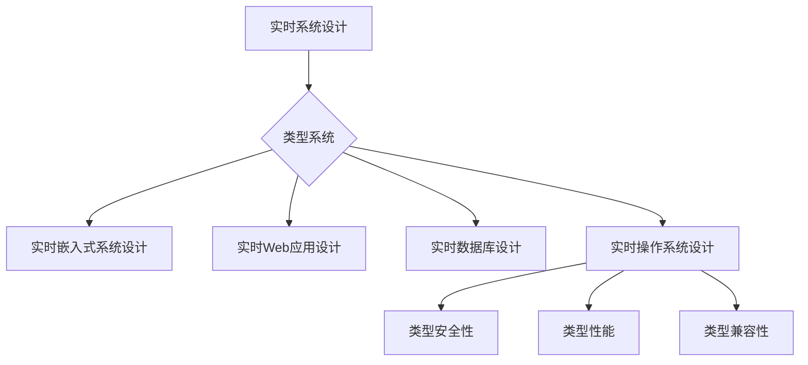

                 

### 实时系统概述

实时系统（Real-time System）是一种能够在规定的时间内处理并响应用户请求或外部事件的计算机系统。这些系统具有严格的响应时间约束，一旦超过预定的时间限制，系统的性能将会受到严重影响，甚至可能导致系统崩溃或错误。实时系统广泛应用于工业控制、航空航天、医疗设备、通信系统以及自动驾驶等多个领域。

实时系统主要分为两个类别：硬实时系统（Hard Real-time System）和软实时系统（Soft Real-time System）。硬实时系统要求在任何情况下都能在预定的时间内完成任务，不能有任何延迟。而软实时系统允许在一定范围内的延迟，但延迟不能太长，否则会影响系统的性能。

实时系统的特点包括：

1. **严格的时限性**：实时系统必须在规定的时间内完成处理任务。
2. **可靠性和容错性**：系统必须具有高可靠性和容错性，能够在恶劣环境下稳定运行。
3. **实时性和并发性**：系统能够同时处理多个任务，且各任务间需要协调，确保系统整体的实时性。
4. **资源限制**：实时系统通常运行在资源受限的硬件环境中，因此需要优化资源使用。

实时系统设计的核心目标是满足实时性要求，确保系统能够在规定的时限内完成任务。这需要从硬件、软件和算法等多个层面进行综合考虑和优化。

### 类型系统的基本概念

类型系统（Type System）是计算机语言中用于定义和检查变量、表达式、函数和模块等程序元素的数据类型和数据结构的集合。类型系统的主要目的是通过在编译时或运行时检查程序中的类型错误，提高程序的安全性、可靠性和可维护性。

**静态类型系统（Static Type System）**：在编译时就能确定变量和表达式的数据类型，并在程序执行过程中保持这种类型信息。静态类型系统的主要优势是能够提前发现类型错误，从而减少运行时的错误。常见的静态类型编程语言包括C++、Java和C#等。

**动态类型系统（Dynamic Type System）**：在程序执行过程中根据上下文确定变量和表达式的数据类型。动态类型系统具有更高的灵活性和表达力，但可能在运行时产生类型错误。常见的动态类型编程语言包括Python、JavaScript和Ruby等。

类型系统的层次结构通常分为：

1. **基本类型**：如整数、浮点数、布尔值等。
2. **复合类型**：如数组、列表、字典等。
3. **引用类型**：如类实例、接口实现等。

**类型系统在实时系统设计中的重要性**

类型系统在实时系统设计中的重要性不可低估。具体来说，类型系统的作用主要体现在以下几个方面：

1. **提高代码可读性和可维护性**：明确的类型信息可以帮助开发者更好地理解程序的功能和行为，从而提高代码的可读性和可维护性。
2. **早期错误检测**：静态类型系统可以在编译时检测出类型错误，避免在运行时出现意外错误，提高系统的可靠性。
3. **性能优化**：类型信息有助于编译器生成更高效的代码，从而提高系统的性能。
4. **资源管理**：类型系统可以更好地管理内存和资源，防止内存泄漏和资源浪费。

### 类型系统如何提高实时系统的可靠性

类型系统在实时系统设计中的应用可以显著提高系统的可靠性。具体来说，类型系统通过以下方式来增强实时系统的可靠性：

1. **减少运行时错误**：类型系统通过静态类型检查，可以提前发现并纠正类型错误，从而减少运行时错误的发生。
2. **提高代码质量**：明确的类型信息可以帮助开发者编写更高质量的代码，减少潜在的逻辑错误和漏洞。
3. **优化资源管理**：类型系统可以更好地管理内存和资源，防止内存泄漏和资源浪费，从而提高系统的稳定性和可靠性。

例如，在C++这种静态类型语言中，如果开发者错误地传递了一个整数给预期接收字符串的函数，编译器会在编译阶段报错，从而避免运行时出现类型相关的错误。而在Python这种动态类型语言中，类似的错误可能会在运行时才被发现，导致系统运行不稳定。

### 类型系统在实时系统性能优化中的应用

类型系统在实时系统性能优化中的应用同样具有重要意义。以下是几个关键点：

1. **编译优化**：静态类型系统允许编译器在编译阶段进行更精细的类型检查和优化。编译器可以利用类型信息生成更高效的机器代码，从而提高系统的性能。
2. **内存分配优化**：类型系统可以帮助编译器和运行时系统更有效地管理内存。例如，在C++中，通过明确的类型信息，编译器可以生成更高效的内存分配和释放代码，减少内存碎片和延迟。
3. **减少上下文切换**：在多线程实时系统中，类型系统可以减少线程间的上下文切换。类型信息可以减少线程间同步的需要，从而减少上下文切换的次数和开销。

总之，类型系统在实时系统设计中的重要性不可低估。通过合理地设计和使用类型系统，我们可以提高实时系统的可靠性、性能和可维护性，从而满足严格的实时性要求。

### 类型系统在实时嵌入式系统设计中的应用

嵌入式系统（Embedded System）是一种具有特定功能的计算机系统，通常运行在资源受限的硬件环境中。嵌入式系统广泛应用于工业控制、汽车电子、消费电子和医疗设备等领域。由于其严格的性能和资源要求，嵌入式系统设计需要特别关注类型系统的应用。

#### 嵌入式系统的特点

嵌入式系统具有以下特点：

1. **资源受限**：嵌入式系统通常运行在资源受限的硬件环境中，包括内存、处理能力和电源。
2. **实时性要求**：嵌入式系统需要满足严格的实时性要求，确保在规定的时间内处理并响应用户请求或外部事件。
3. **高可靠性**：嵌入式系统需要具有高可靠性，能够在长期运行中保持稳定，避免因硬件故障或软件错误导致系统崩溃。

#### 嵌入式系统中的类型系统设计

在嵌入式系统设计中，类型系统的应用主要体现在以下几个方面：

1. **类型安全性**：类型系统可以确保变量和函数的正确使用，防止类型错误和内存泄漏。例如，在C++中，类型检查可以防止将整数错误地传递给字符串处理函数。

2. **内存管理**：类型系统可以帮助编译器和运行时系统更有效地管理内存。通过明确的类型信息，编译器可以生成更高效的内存分配和释放代码，减少内存碎片和延迟。

3. **优化代码生成**：静态类型系统允许编译器在编译阶段进行更精细的类型检查和优化，从而生成更高效的机器代码。

#### 嵌入式系统中类型系统的优化策略

为了提高嵌入式系统的性能和可靠性，类型系统需要采取以下优化策略：

1. **最小化类型检查开销**：通过优化编译器算法，减少类型检查的时间开销。例如，使用类型推断和静态分析技术，在编译时提前确定类型，减少运行时的类型检查。

2. **静态类型与动态类型的结合**：在嵌入式系统中，可以结合静态类型和动态类型的优点。例如，在关键路径上使用静态类型，确保类型安全性和性能，而在非关键路径上使用动态类型，提高系统的灵活性和可维护性。

3. **优化内存分配**：通过优化内存分配算法，减少内存碎片和延迟。例如，使用内存池和对象池技术，预先分配和回收内存，减少内存分配和释放的开销。

#### 实际案例

一个典型的嵌入式系统设计案例是自动驾驶汽车。在自动驾驶系统中，类型系统被用来确保车辆控制系统和传感器数据的正确性和一致性。例如，传感器数据类型需要与控制系统的预期类型相匹配，以确保系统能够正确处理传感器数据，从而实现精确的驾驶控制。

通过使用静态类型系统，编译器可以提前检测到类型不匹配的错误，从而避免运行时出现意外错误。此外，类型系统还可以优化内存分配和代码生成，提高系统的性能和可靠性。

总之，类型系统在实时嵌入式系统设计中的应用至关重要。通过合理地设计和使用类型系统，我们可以提高嵌入式系统的可靠性、性能和可维护性，从而满足严格的实时性要求。

### 类型系统在实时Web应用设计中的应用

实时Web应用是现代互联网技术中的重要组成部分，能够为用户提供即时互动和响应。随着Web应用的不断复杂化，类型系统在实时Web应用设计中的重要性日益凸显。

#### 实时Web应用的特点

实时Web应用具有以下几个显著特点：

1. **即时响应**：实时Web应用能够在用户操作发生后立即响应用户请求，提供即时反馈，如即时聊天、在线游戏和股票交易等。
2. **高并发性**：实时Web应用需要同时处理大量用户请求，要求系统具备高并发处理能力。
3. **实时数据流**：实时Web应用需要处理和展示实时数据流，如实时天气信息、实时新闻更新等。
4. **用户体验**：实时性直接影响到用户体验，确保应用能够迅速响应用户操作，提升用户满意度。

#### 实时Web应用中的类型系统设计

类型系统在实时Web应用设计中的应用主要体现在以下几个方面：

1. **确保数据一致性**：类型系统可以确保数据在传输和处理过程中的一致性，防止数据类型错误导致系统崩溃或数据丢失。例如，在处理用户输入时，类型系统可以确保输入数据与预期类型相匹配。

2. **提高性能**：类型系统有助于优化代码生成和内存管理，从而提高系统性能。通过静态类型检查，编译器可以生成更高效的代码，减少运行时的类型检查开销。

3. **增强安全性**：类型系统可以防止恶意代码注入和数据泄露，提高系统的安全性。例如，在处理用户输入时，类型系统可以检测和阻止包含非法字符或格式不正确的输入。

#### 实时Web应用中类型系统的优化策略

为了提高实时Web应用的性能和可靠性，类型系统需要采取以下优化策略：

1. **静态类型与动态类型的结合**：在关键路径上使用静态类型，确保类型安全性和性能，而在非关键路径上使用动态类型，提高系统的灵活性和可维护性。

2. **类型推导**：通过类型推导技术，减少类型声明的复杂性，提高代码的可读性和可维护性。类型推导可以自动推断变量和表达式的类型，减轻开发者的负担。

3. **编译时优化**：静态类型系统允许编译器在编译时进行更精细的优化，生成更高效的机器代码。例如，通过常量折叠、循环展开等技术，提高代码的执行效率。

#### 实际案例

一个典型的实时Web应用设计案例是社交媒体平台。在社交媒体平台上，类型系统被用来确保用户发布的内容类型正确，如文本、图片、视频等。类型系统可以防止用户发布包含非法字符或格式不正确的数据，从而确保系统的稳定运行。

此外，在处理大量并发用户请求时，类型系统可以帮助优化数据流处理和负载均衡，确保系统能够在高峰时段保持高性能和高可用性。

总之，类型系统在实时Web应用设计中的重要性不可忽视。通过合理地设计和使用类型系统，我们可以提高实时Web应用的性能、安全性和用户体验，从而满足现代互联网应用的高要求。

### 类型系统在实时数据库设计中的应用

实时数据库设计在许多应用领域中扮演着至关重要的角色，例如金融交易、实时监控、物联网和社交媒体等。实时数据库不仅需要处理大规模数据流，还要保证数据的准确性和一致性。类型系统在实时数据库设计中的应用可以帮助提升数据库的性能和可靠性。

#### 实时数据库的特点

实时数据库具有以下几个显著特点：

1. **实时处理能力**：实时数据库需要能够快速处理大量数据流，确保数据在极短时间内得到处理和响应。
2. **低延迟**：实时数据库必须在短时间内完成数据查询和更新操作，以避免对应用程序的延迟影响。
3. **高可用性**：实时数据库需要具备高可用性，确保在系统故障或网络中断时，能够快速恢复服务。
4. **一致性保证**：实时数据库需要保证数据一致性，确保在多个用户同时操作数据时，数据状态保持一致。

#### 实时数据库中的类型系统设计

在实时数据库设计过程中，类型系统的作用主要体现在以下几个方面：

1. **数据类型一致性**：类型系统可以确保数据库中存储的数据类型一致，防止因数据类型错误导致的数据处理错误。例如，在存储和查询数据时，确保字段类型与定义相匹配。

2. **性能优化**：类型系统可以帮助数据库优化查询性能。通过静态类型检查，数据库可以提前知道数据类型，从而更高效地执行查询操作。

3. **安全性增强**：类型系统可以防止恶意数据注入和数据泄露。例如，在处理用户输入时，类型系统可以检测和阻止包含非法字符或格式不正确的输入。

#### 实时数据库中类型系统的优化策略

为了提升实时数据库的性能和可靠性，类型系统需要采取以下优化策略：

1. **静态类型与动态类型的结合**：在关键路径上使用静态类型，确保类型安全性和性能，而在非关键路径上使用动态类型，提高系统的灵活性和可维护性。

2. **类型推导**：通过类型推导技术，自动推断变量和表达式的类型，减少类型声明的复杂性，提高代码的可读性和可维护性。

3. **编译时优化**：静态类型系统允许数据库在编译时进行更精细的优化，生成更高效的执行计划。

#### 实际案例

一个典型的实时数据库设计案例是金融交易系统。在金融交易系统中，类型系统被用来确保交易数据的类型和格式正确，防止因数据错误导致的交易失败或财务损失。

例如，在处理交易请求时，类型系统可以确保交易金额、交易时间和交易账户等关键字段的类型正确，从而确保交易数据的准确性和一致性。此外，类型系统还可以优化查询性能，确保交易系统能够在毫秒级别内处理大量交易请求。

总之，类型系统在实时数据库设计中的应用至关重要。通过合理地设计和使用类型系统，我们可以提高实时数据库的性能、可靠性和安全性，从而满足实时应用的高要求。

### 类型系统在实时操作系统设计中的应用

实时操作系统（Real-time Operating System,RTOS）在确保系统对实时性要求严格的应用中发挥着关键作用。RTOS需要确保任务能够在预定的时间内执行，以满足系统性能和可靠性要求。类型系统在RTOS设计中的应用，对于实现这些目标至关重要。

#### 实时操作系统的特点

实时操作系统具有以下几个显著特点：

1. **严格的时间约束**：RTOS必须确保每个任务都能在预定的时间内执行完成，以满足实时性要求。
2. **抢占式调度**：RTOS通常采用抢占式调度策略，确保高优先级任务能够中断低优先级任务，确保关键任务得到及时处理。
3. **资源分配**：RTOS需要合理分配系统资源，包括处理器时间、内存和I/O设备，以确保系统能够高效运行。
4. **高可靠性**：RTOS需要具备高可靠性，确保在长时间运行过程中不会出现系统崩溃或性能下降。

#### 实时操作系统中的类型系统设计

在RTOS设计中，类型系统的作用主要体现在以下几个方面：

1. **确保任务类型一致性**：类型系统可以确保任务的输入和输出数据类型一致，防止类型错误导致任务执行失败。例如，在任务间传递数据时，类型系统可以确保数据类型与预期相匹配。

2. **提高性能**：类型系统可以帮助RTOS优化任务调度和资源分配。通过静态类型检查，RTOS可以提前知道任务的数据类型，从而生成更高效的调度算法和资源分配策略。

3. **增强安全性**：类型系统可以防止恶意代码注入和资源滥用。例如，在任务执行过程中，类型系统可以检测和阻止包含非法类型或格式的不当操作。

#### 实时操作系统中类型系统的优化策略

为了提高RTOS的性能和可靠性，类型系统需要采取以下优化策略：

1. **类型推导**：通过类型推导技术，自动推断变量和表达式的类型，减少类型声明的复杂性，提高代码的可读性和可维护性。

2. **静态类型与动态类型的结合**：在关键路径上使用静态类型，确保类型安全性和性能，而在非关键路径上使用动态类型，提高系统的灵活性和可维护性。

3. **编译时优化**：静态类型系统允许RTOS在编译时进行更精细的优化，生成更高效的代码。

#### 实际案例

一个典型的实时操作系统设计案例是自动驾驶系统。在自动驾驶系统中，类型系统被用来确保传感器数据、控制指令和车辆状态的一致性和正确性。通过类型系统，RTOS可以确保传感器数据在传递到控制系统时不会出现类型错误，从而确保车辆的精确控制和稳定运行。

例如，在处理传感器数据时，类型系统可以确保数据类型与控制算法的预期类型相匹配，从而避免因数据类型错误导致的控制失效。此外，类型系统还可以优化任务调度和资源分配，确保自动驾驶系统能够在毫秒级别内处理大量传感器数据和执行控制指令。

总之，类型系统在实时操作系统设计中的应用至关重要。通过合理地设计和使用类型系统，我们可以提高实时操作系统的性能、可靠性和安全性，从而满足实时应用的高要求。

### 类型系统在实时系统设计中的挑战

尽管类型系统在实时系统设计中具有显著的优势，但它也面临一些挑战。以下是一些常见的挑战和相应的解决方案。

#### 类型安全性问题

**挑战**：类型系统在确保数据一致性和防止类型错误方面表现出色，但在某些情况下，类型安全性可能受到挑战。例如，当类型系统无法处理复杂的动态类型或复杂类型转换时，可能会引发类型安全性问题。

**解决方案**：为了解决类型安全性问题，可以采用以下策略：
1. **严格的类型检查**：在编译或运行时进行更严格的类型检查，确保变量和表达式的类型符合预期。
2. **类型注解**：使用类型注解或类型检查工具，帮助开发者明确指定变量的类型，减少类型错误的发生。
3. **类型推导**：利用类型推导技术，自动推断变量和表达式的类型，减轻开发者的负担。

#### 类型性能问题

**挑战**：类型系统可能会导致运行时的类型检查开销，从而影响系统性能。特别是在嵌入式系统和资源受限的系统中，类型检查的开销可能成为一个显著的问题。

**解决方案**：
1. **静态类型与动态类型的结合**：在关键路径上使用静态类型，确保类型安全性和性能，而在非关键路径上使用动态类型，减少类型检查的开销。
2. **优化编译器**：对编译器进行优化，减少类型检查的开销，例如通过延迟类型检查或使用高效的类型检查算法。
3. **类型推导**：利用类型推导技术，减少类型声明的复杂性，从而减少类型检查的时间开销。

#### 类型兼容性问题

**挑战**：在复杂的实时系统中，不同组件和模块之间可能存在类型兼容性问题。这可能导致组件之间的数据传输错误，影响系统的整体性能和稳定性。

**解决方案**：
1. **统一类型标准**：制定统一的类型标准，确保不同组件和模块之间的类型兼容性。
2. **类型转换机制**：实现灵活的类型转换机制，允许在不同类型之间进行安全且高效的转换。
3. **类型检查工具**：使用类型检查工具，在开发阶段识别并解决类型兼容性问题，避免在运行时出现错误。

通过采用上述解决方案，可以有效地应对类型系统在实时系统设计中的挑战，提高实时系统的可靠性、性能和可维护性。

### 类型系统的未来发展趋势

随着技术的不断进步，类型系统在实时系统设计中的应用也在不断发展。以下是类型系统在未来可能的发展趋势：

#### 类型系统的融合与扩展

未来，类型系统可能会与更多的编程语言和框架相结合，提供更丰富的类型检查和优化功能。例如，随着函数式编程和并发编程的流行，类型系统可能会扩展到支持这些编程范式，提供更高效的类型推导和类型安全保证。

#### 静态类型与动态类型的融合

为了兼顾类型安全性和灵活性，未来类型系统可能会更广泛地采用静态类型与动态类型的融合策略。通过在关键路径上使用静态类型，确保类型安全性和性能，而在非关键路径上使用动态类型，提高系统的灵活性和可维护性。

#### 类型系统的智能化

随着人工智能技术的发展，类型系统可能会变得更加智能化。通过机器学习算法，类型系统可以自动优化类型推导和类型检查过程，提高类型系统的效率和准确性。

#### 类型系统的工具化

未来，类型系统可能会更加工具化，提供更丰富的工具和框架，帮助开发者更轻松地管理和优化类型系统。例如，自动化类型推导工具、类型检查工具和性能优化工具等。

总之，类型系统在实时系统设计中的应用将随着技术的进步而不断发展和完善，为实时系统的可靠性和性能提供更强有力的保障。

### 附录A：类型系统相关的工具与资源

在实时系统设计中，类型系统的应用和优化需要依赖一系列的工具和资源。以下是一些常用的工具和资源，包括实时系统开发工具、类型系统分析工具以及类型系统学习资源。

#### 实时系统开发工具

1. **FreeRTOS**：FreeRTOS是一款开源、可定制的实时操作系统，适用于嵌入式系统和微控制器。
2. **Linux RT**：Linux RT是Linux的一个变种，支持实时扩展，适用于需要高实时性和稳定性的应用。
3. **QNX**：QNX是一款成熟的实时操作系统，广泛应用于汽车、工业自动化和通信等领域。

#### 类型系统分析工具

1. **TypeScript**：TypeScript是JavaScript的一个超集，提供了静态类型检查和编译到JavaScript的功能。
2. **Pytype**：Pytype是Python的一个静态类型检查工具，可以帮助发现类型错误和性能瓶颈。
3. **Eclipse JDT**：Eclipse JDT是Eclipse IDE的一部分，提供了Java语言的静态类型检查和编译器。

#### 类型系统学习资源

1. **《类型系统与类型检查》**：这本书详细介绍了类型系统的基本概念、设计原理和实现技术，适合初学者和进阶者阅读。
2. **《实时系统设计与实现》**：这本书涵盖了实时系统的基本概念、设计原则和实现技术，特别是类型系统在实时系统中的应用。
3. **在线课程**：许多在线课程，如Coursera、edX和Udacity，提供关于类型系统和实时系统设计的课程，适合自学者。

通过使用这些工具和资源，开发者可以更好地理解和应用类型系统，提高实时系统的可靠性、性能和可维护性。

### 总结

本文详细探讨了类型系统在实时系统设计中的角色，从基本概念、应用场景到挑战和未来发展趋势进行了全面分析。类型系统在实时系统设计中具有重要作用，通过提高代码可读性、确保数据一致性和优化性能，显著提升了系统的可靠性、性能和可维护性。在未来，类型系统将继续随着技术的发展而不断完善，为实时系统设计提供更强大的支持。

作者：AI天才研究院/AI Genius Institute & 禅与计算机程序设计艺术 /Zen And The Art of Computer Programming

---

**附录：Mermaid 流程图**

通过这个流程图，我们可以清晰地看到类型系统在实时系统设计中的各个应用场景及其相关挑战。希望本文能为读者提供有价值的参考和启示。

