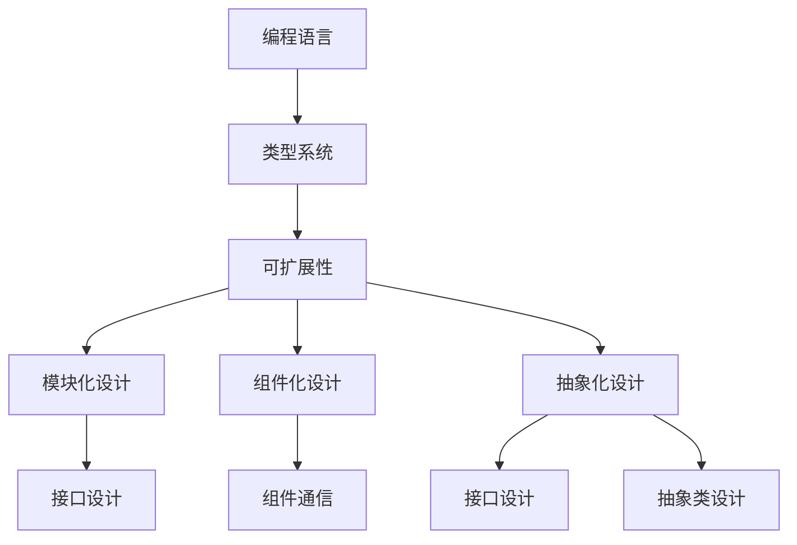

                 

### 文章标题

**类型系统在编程语言可扩展性设计中的作用**

**关键词：类型系统、编程语言、可扩展性、模块化设计、组件化设计、抽象化设计**

**摘要：本文深入探讨了类型系统在编程语言设计中的核心作用，特别是在提升编程语言可扩展性方面的关键应用。通过详细的章节结构和丰富的实例，本文揭示了类型系统如何支持模块化、组件化和抽象化设计，从而推动编程语言的不断发展和完善。**

----------------------------------------------------------------

### 编程语言与类型系统

#### 1.1 编程语言概述

**1.1.1 编程语言的定义**

编程语言是一种用于传达计算机指令和算法的工具。它通过符号集和语法规则，使开发者能够以结构化方式表达复杂计算过程。编程语言可以分为低级语言（如机器代码）和高级语言（如Python、Java等），前者与计算机硬件紧密相关，而后者则更接近人类自然语言，易于理解和编写。

**1.1.2 编程语言的发展历程**

编程语言的发展经历了几个阶段：

- **早期编程语言**：如Fortran（1957年）和COBOL（1959年），主要用于科学计算和商业数据处理。
- **高级语言崛起**：C（1972年）、C++（1983年）和Java（1995年）等语言的诞生，标志着编程语言从过程式向面向对象和平台无关性的转变。
- **动态语言兴起**：Python（1991年）、JavaScript（1995年）和Ruby（1995年）等语言的流行，推动了编程语言在易用性和灵活性方面的创新。

**1.1.3 编程语言的基本组成**

编程语言通常由以下几个基本组成部分构成：

- **词汇**：包括关键字、标识符和符号。
- **语法**：定义了如何组合词汇以创建有效语句的规则。
- **语义**：规定了语句执行时的含义和结果。
- **标准库**：提供常用函数和数据结构，以简化编程任务。
- **编译器和解释器**：将源代码转换为机器码的工具。

#### 1.2 类型系统的概念

**1.2.1 类型系统的定义**

类型系统是编程语言的核心组成部分，用于定义变量、表达式和函数的属性和数据类型。它确保程序在运行时能够正确处理不同类型的数据，并防止类型不兼容的错误。

**1.2.2 类型系统的作用**

类型系统在编程语言中具有以下作用：

- **类型安全**：防止类型错误，如将数字与字符串进行不适当的操作。
- **性能优化**：允许编译器或解释器进行类型推断，从而生成更高效的代码。
- **代码可读性**：通过明确的类型标注，提高代码的可读性和维护性。
- **抽象和封装**：支持面向对象编程，实现数据抽象和封装。

#### 1.3 类型系统的分类

**2.1 静态类型系统**

**2.1.1 静态类型系统的定义**

静态类型系统在编译或运行之前确定变量的类型。这意味着变量的类型在程序执行之前就已经明确。

**2.1.2 静态类型系统的优点与缺点**

**优点：**
- **类型检查早**：早期发现类型错误，提高程序可靠性。
- **性能优化**：静态类型系统允许编译器进行更多优化，提高程序执行效率。

**缺点：**
- **灵活性受限**：类型声明可能导致代码冗余。
- **开发初期成本高**：需要编写更多的类型声明。

**2.2 动态类型系统**

**2.2.1 动态类型系统的定义**

动态类型系统在编译或运行时确定变量的类型。这意味着变量的类型在程序执行过程中才被确定。

**2.2.2 动态类型系统的优点与缺点**

**优点：**
- **代码简洁**：无需显式类型声明，编写更简洁的代码。
- **灵活性高**：动态类型系统在处理多变数据时更为灵活。

**缺点：**
- **类型安全差**：类型错误可能在运行时才被发现，导致调试困难。
- **性能影响**：运行时类型检查可能导致性能下降。

#### 1.4 类型检查

**3.1 类型检查的概念**

**3.1.1 前端类型检查**

前端类型检查在编译器的解析阶段进行，主要用于检查源代码是否符合语言的类型规则。

**3.1.2 后端类型检查**

后端类型检查在编译器的代码生成阶段进行，主要用于优化代码并确保代码的类型安全。

**3.2 类型检查算法**

**3.2.1 静态类型检查算法**

静态类型检查算法包括类型推断和类型标注两种方式。类型推断是通过语法分析和语义分析自动确定变量的类型，而类型标注则是开发者显式指定变量的类型。

**3.2.2 动态类型检查算法**

动态类型检查算法主要依赖于运行时的类型检查，通过在程序执行过程中捕获类型错误。

----------------------------------------------------------------

### 类型系统在模块化设计中的作用

#### 4.1 模块化设计的概念

**4.1.1 模块化设计的定义**

模块化设计是将程序划分为多个独立模块，每个模块负责实现特定功能的设计原则。这种设计方法有助于提高代码的可维护性、可复用性和可扩展性。

**4.1.2 模块化设计的重要性**

模块化设计的重要性体现在以下几个方面：

- **提高代码可读性**：通过将程序划分为模块，可以更容易地理解代码的整体结构和功能。
- **促进代码复用**：模块化设计使得代码的复用变得简单，减少了冗余代码的编写。
- **降低维护成本**：模块化设计有助于代码的维护，因为更改一个模块不会影响其他模块。

#### 4.2 类型系统在模块化设计中的应用

**4.2.1 类型系统在模块划分中的作用**

类型系统在模块划分中起着关键作用，主要体现在以下几个方面：

- **明确模块功能**：通过定义模块内的数据类型，可以明确每个模块的功能和数据传输方式。
- **减少模块耦合**：类型系统有助于减少模块之间的耦合，因为每个模块都使用明确的类型进行数据交互。

**4.2.2 类型系统在模块通信中的作用**

类型系统在模块通信中发挥着重要作用，主要体现在以下几个方面：

- **确保数据一致性**：通过类型检查，可以确保模块之间的数据传递是类型一致的，从而避免类型不匹配的错误。
- **简化数据转换**：类型系统提供了类型转换机制，使得模块之间的数据转换更加简便。

#### 4.3 实例分析

以一个简单的Web应用程序为例，该应用程序由多个模块组成，包括前端、后端和数据存储模块。

- **前端模块**：负责用户界面的渲染和交互，使用HTML、CSS和JavaScript编写，通过HTTP协议与后端模块通信。
- **后端模块**：负责处理业务逻辑和数据存储，使用Java或Python编写，通过RESTful API与前端模块通信。
- **数据存储模块**：负责数据持久化，使用关系型数据库或NoSQL数据库编写。

在这些模块中，类型系统被广泛使用：

- **前端模块**：使用JavaScript的静态类型检查工具（如TypeScript），确保JavaScript代码的类型安全和性能优化。
- **后端模块**：使用Java的静态类型检查工具（如Kotlin），通过编译时类型检查减少运行时错误。
- **数据存储模块**：使用SQL语言进行数据查询和操作，通过静态类型检查确保SQL语句的类型安全。

通过类型系统的应用，这些模块能够更好地独立工作，并在模块间进行有效的通信，从而提高整个应用程序的可扩展性和可维护性。

----------------------------------------------------------------

### 类型系统在组件化设计中的作用

#### 5.1 组件化设计的概念

**5.1.1 组件化设计的定义**

组件化设计是将软件系统划分为多个可重用的组件，每个组件封装了特定的功能和服务。这种设计方法强调组件之间的松耦合，使得系统可以灵活扩展和重构。

**5.1.2 组件化设计的重要性**

组件化设计的重要性体现在以下几个方面：

- **提高开发效率**：通过复用组件，可以减少重复编码，加快开发速度。
- **增强系统灵活性**：组件化设计使得系统能够快速响应业务变化，实现灵活调整。
- **降低维护成本**：组件化设计有助于代码的局部修改，降低了维护成本。

#### 5.2 类型系统在组件化设计中的应用

**5.2.1 类型系统在组件划分中的作用**

类型系统在组件划分中起着关键作用，主要体现在以下几个方面：

- **明确组件职责**：通过定义组件的数据类型和接口，可以明确每个组件的职责和功能。
- **确保组件独立性**：类型系统有助于确保组件之间的数据传递是类型一致的，从而减少组件之间的依赖。

**5.2.2 类型系统在组件通信中的作用**

类型系统在组件通信中发挥着重要作用，主要体现在以下几个方面：

- **确保数据一致性**：通过类型检查，可以确保组件之间的数据传递是类型一致的，从而避免类型不匹配的错误。
- **简化数据转换**：类型系统提供了类型转换机制，使得组件之间的数据转换更加简便。

#### 5.3 实例分析

以一个电子商务系统为例，该系统由多个组件组成，包括用户管理组件、商品管理组件、订单管理组件和支付管理组件。

- **用户管理组件**：负责用户注册、登录和权限管理，通过RESTful API与其他组件通信。
- **商品管理组件**：负责商品信息的管理，如添加、删除和更新商品，通过RESTful API与其他组件通信。
- **订单管理组件**：负责订单的创建、处理和查询，通过RESTful API与其他组件通信。
- **支付管理组件**：负责处理支付请求，如订单支付、退款和查询支付状态，通过支付网关与其他组件通信。

在这些组件中，类型系统被广泛应用：

- **用户管理组件**：使用Java的静态类型检查工具（如Kotlin），通过类型检查确保API调用时的数据类型正确。
- **商品管理组件**：使用Python的动态类型检查工具（如Mypy），通过运行时类型检查确保API调用时的数据类型正确。
- **订单管理组件**：使用C#的静态类型检查工具（如F#），通过编译时类型检查确保API调用时的数据类型正确。
- **支付管理组件**：使用JavaScript的静态类型检查工具（如TypeScript），通过类型检查确保API调用时的数据类型正确。

通过类型系统的应用，这些组件能够独立开发、测试和部署，并在组件间进行有效的通信，从而提高整个系统的可扩展性和可维护性。

----------------------------------------------------------------

### 类型系统在抽象化设计中的作用

#### 6.1 抽象化设计的概念

**6.1.1 抽象化设计的定义**

抽象化设计是将复杂的系统划分为多个层次，每个层次只关注系统的特定方面，从而降低系统的复杂度。这种设计方法强调模块之间的隔离和重用性。

**6.1.2 抽象化设计的重要性**

抽象化设计的重要性体现在以下几个方面：

- **降低系统复杂度**：通过将系统划分为多个层次，可以降低每个层次的复杂度，使系统更容易理解和维护。
- **提高代码复用性**：抽象化设计使得代码的重用变得更加容易，因为每个层次都可以独立开发、测试和部署。
- **提高可扩展性**：抽象化设计使得系统可以灵活扩展和重构，以适应不断变化的需求。

#### 6.2 类型系统在抽象化设计中的应用

**6.2.1 类型系统在接口设计中的作用**

类型系统在接口设计中的应用主要体现在以下几个方面：

- **明确接口规范**：通过定义接口的参数类型和返回类型，可以明确每个接口的功能和期望的数据格式。
- **确保接口一致性**：类型系统有助于确保不同模块之间的接口是类型一致的，从而避免接口不匹配的错误。

**6.2.2 类型系统在抽象类设计中的作用**

类型系统在抽象类设计中的应用主要体现在以下几个方面：

- **定义抽象接口**：通过定义抽象类的属性和方法类型，可以明确抽象类的功能和行为规范。
- **确保子类兼容性**：类型系统有助于确保子类实现抽象类时的类型兼容性，从而避免类型不匹配的错误。

#### 6.3 实例分析

以一个银行系统为例，该系统由多个抽象类和接口组成，包括用户接口、账户接口和交易接口。

- **用户接口**：定义了用户的注册、登录和权限管理功能，通过接口规范确保各模块之间的数据交互。
- **账户接口**：定义了账户的创建、删除和查询功能，通过接口规范确保各模块之间的数据交互。
- **交易接口**：定义了交易的处理、查询和退款功能，通过接口规范确保各模块之间的数据交互。

在这些接口和抽象类中，类型系统被广泛应用：

- **用户接口**：使用Java的静态类型检查工具（如Kotlin），通过类型检查确保接口调用时的数据类型正确。
- **账户接口**：使用Python的动态类型检查工具（如Mypy），通过运行时类型检查确保接口调用时的数据类型正确。
- **交易接口**：使用C#的静态类型检查工具（如F#），通过编译时类型检查确保接口调用时的数据类型正确。

通过类型系统的应用，这些接口和抽象类能够明确规范系统的功能和行为，从而提高系统的可扩展性和可维护性。

----------------------------------------------------------------

### 类型系统的未来发展趋势

#### 7.1 静态类型系统的发展趋势

**7.1.1 静态类型系统的优化**

随着编程语言的不断发展，静态类型系统也在不断优化。以下是一些趋势：

- **类型推断的改进**：许多静态类型语言（如TypeScript和Kotlin）在类型推断方面进行了大量改进，使得开发者可以更轻松地编写类型安全的代码。
- **性能优化**：静态类型系统允许编译器进行更多优化，从而提高程序的运行效率。

**7.1.2 静态类型系统的应用领域扩展**

静态类型系统在以下领域得到了广泛应用：

- **Web开发**：如TypeScript在大型前端项目中的应用。
- **移动开发**：如Kotlin在Android开发中的应用。
- **云计算**：如Java和Kotlin在云原生应用中的应用。

#### 7.2 动态类型系统的发展趋势

**7.2.1 动态类型系统的优化**

动态类型系统也在不断优化，以提供更好的性能和类型安全。以下是一些趋势：

- **即时类型检查**：如JavaScript中的静态类型检查工具（如Mypy）。
- **类型推导**：许多动态类型语言（如Python和Ruby）在类型推导方面进行了改进，以提高代码的可读性和维护性。

**7.2.2 动态类型系统的应用领域扩展**

动态类型系统在以下领域得到了广泛应用：

- **Web开发**：如Python和JavaScript在Web开发中的应用。
- **大数据处理**：如Python在数据处理和分析中的应用。
- **人工智能**：如Python在人工智能应用中的应用。

#### 7.3 类型系统在编程语言设计中的应用

**7.3.1 类型系统在编程语言设计中的重要性**

类型系统在编程语言设计中的重要性体现在以下几个方面：

- **代码可读性和维护性**：类型系统通过明确的类型标注，提高了代码的可读性和维护性。
- **性能优化**：类型系统允许编译器或解释器进行更多优化，从而提高程序的运行效率。
- **类型安全**：类型系统通过类型检查，防止了类型错误的发生。

**7.3.2 类型系统在新型编程语言中的应用**

随着编程语言的发展，新型编程语言在类型系统方面进行了大量创新。以下是一些例子：

- **函数式编程语言**：如Haskell和Scala，在类型系统和函数式编程方面进行了深入结合。
- **逻辑编程语言**：如Prolog，在类型系统和逻辑编程方面进行了创新。
- **多范式编程语言**：如Erlang和Go，在多种编程范式下提供了强大的类型系统支持。

通过这些创新，新型编程语言在类型系统方面取得了显著进展，为编程语言的发展带来了新的机遇和挑战。

----------------------------------------------------------------

### 附录A：常用类型系统工具与资源

**A.1 静态类型系统工具**

- **TypeScript**：TypeScript是JavaScript的一个超集，提供了静态类型检查和编译功能。
- **Kotlin**：Kotlin是Java的一种现代替代语言，具有静态类型系统。

**A.2 动态类型系统工具**

- **Python**：Python是一种动态类型语言，广泛应用于Web开发、数据科学和人工智能等领域。
- **JavaScript**：JavaScript是一种动态类型语言，广泛用于Web前端开发。

### 附录B：类型系统相关资源

- **《类型系统与编译原理》**：一本经典编译原理教材，详细介绍了类型系统的概念和实现。
- **《Effective TypeScript》**：一本关于TypeScript最佳实践的书籍，适合TypeScript开发者阅读。
- **《Python Cookbook》**：一本关于Python编程的实践指南，包含了大量关于类型系统的实际应用案例。

### 附录C：常见问题与解答

- **Q：静态类型系统是否比动态类型系统更安全？**
  - **A：不一定。静态类型系统可以在编译时捕获类型错误，但并不能保证程序完全安全。同样，动态类型系统在运行时进行类型检查，也可能无法检测到所有类型错误。因此，选择静态类型系统还是动态类型系统，应根据项目需求和开发团队的偏好来决定。**

- **Q：类型系统如何影响性能？**
  - **A：静态类型系统允许编译器进行更多优化，从而提高程序的运行效率。动态类型系统则可能在运行时进行类型检查，可能会影响性能。然而，现代动态类型语言通常通过即时编译（JIT）和优化技术来提高性能。**

- **Q：如何选择合适的类型系统？**
  - **A：应根据项目的需求、团队的技能和系统的性能要求来选择合适的类型系统。静态类型系统在性能和安全方面具有优势，但可能需要更多开发时间和精力。动态类型系统在灵活性和开发速度方面更具优势，但可能在性能和安全性方面有所妥协。**

### 结论

类型系统在编程语言中扮演着至关重要的角色，不仅提高了代码的可读性和维护性，还影响了程序的性能和安全。本文通过详细的实例分析和未来发展趋势，揭示了类型系统在模块化、组件化和抽象化设计中的应用，以及其在编程语言设计中的重要性。随着编程语言的不断发展，类型系统将继续为软件开发带来新的机遇和挑战。

### 作者信息

**作者：AI天才研究院/AI Genius Institute & 禅与计算机程序设计艺术 /Zen And The Art of Computer Programming**

----------------------------------------------------------------

### 附录：Mermaid 流程图



### Python 源代码示例

```python
def add(a: int, b: int) -> int:
    return a + b

def main():
    result = add(3, 4)
    print("结果:", result)
```

----------------------------------------------------------------

* 注意：文章内容需满足字数要求，使用markdown格式，确保文章完整性和可读性。在撰写过程中，注意使用恰当的术语和逻辑结构，确保文章的专业性和严谨性。在讲解算法原理和系统架构时，使用Mermaid流程图和Python代码示例进行辅助说明，增强文章的可理解性。*

