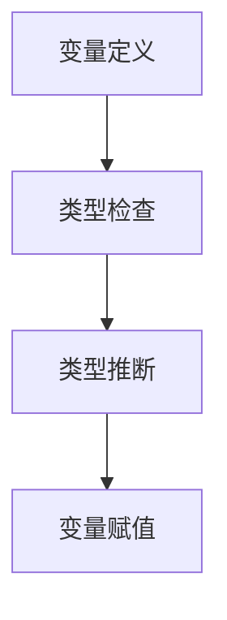
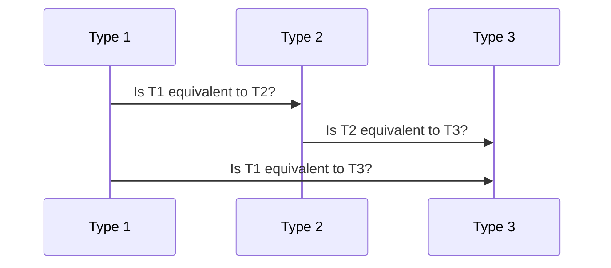
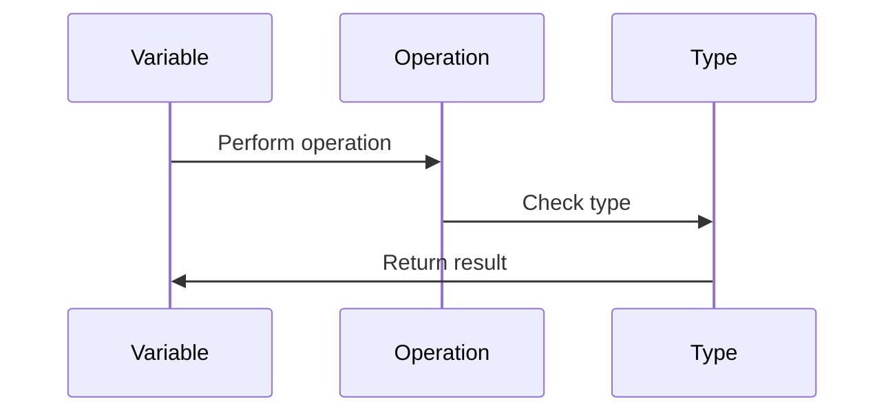

                 

### 第一部分：类型系统的理论基础

#### 第1章：类型系统的基本概念

在计算机科学中，类型系统是一个核心概念，它用于定义和约束编程语言中的数据类型。类型系统的目的是提高程序的正确性、可读性和可维护性，同时有助于程序的优化。类型系统可以分为静态类型系统和动态类型系统。

**类型系统的定义**：
类型系统是一种在编程语言中用于定义和约束变量、表达式和数据类型的机制。它通过定义不同类型的变量和表达式如何交互，来确保程序的正确性和安全性。

**类型系统的作用**：
1. **确保程序的正确性**：通过类型检查，确保变量和表达式的使用是类型安全的，避免运行时错误。
2. **提高程序的可读性和维护性**：明确的数据类型定义可以提高代码的可读性，使代码更容易理解和维护。
3. **促进程序优化**：编译器可以利用类型信息来生成更高效的代码。

**类型系统的分类**：
1. **静态类型系统**：在编译时确定变量和数据类型的系统。例如，Java和C++都是静态类型语言。
2. **动态类型系统**：在运行时确定变量和数据类型的系统。例如，Python和JavaScript都是动态类型语言。

**类型系统的关键概念**：

- **类型安全**：类型系统确保程序不会因为类型错误而出现运行时错误。例如，在Java中，不能将一个整数强制转换为字符串。

- **类型等价性**：两个值在类型上被认为是相同的。例如，在Python中，整数1和字符串"1"是类型等价的。

- **类型推断**：编译器或解释器自动确定变量或表达式的类型，无需显式声明。例如，在Python中，`x = 10` 会自动推断`x`的类型为整数。

**Mermaid流程图：类型系统的内在关系**：

为了更好地理解类型系统的内在关系，我们可以使用Mermaid流程图来展示变量定义、类型检查和类型推断的过程。以下是流程图的示例：



在这个流程图中，变量定义后，编译器或解释器会进行类型检查，确保变量的使用符合类型规则。接着，根据上下文，类型系统会尝试推断变量的类型。最后，变量被赋值，其类型也被确定。

#### 1.2 类型系统的分类

**静态类型系统**：
静态类型系统在编译时确定变量和数据类型。这意味着在程序运行之前，编译器已经知道每个变量和表达式的确切类型。这种系统的优点是能够更早地检测类型错误，有助于提高程序的正确性和性能。

静态类型系统的常见特点包括：

- 类型检查发生在编译时，运行时错误更少。
- 编译器可以利用类型信息进行优化，提高程序性能。
- 编译过程可能更复杂，因为需要处理类型推断和类型检查。

**动态类型系统**：
动态类型系统在运行时确定变量和数据类型。这意味着在程序运行时，解释器会检查变量的类型，并根据运行时的上下文进行类型推断。这种系统的优点是编写代码更灵活，但可能会引入运行时错误。

动态类型系统的常见特点包括：

- 类型检查发生在运行时，程序更灵活。
- 编译过程可能更简单，因为不需要进行类型检查。
- 运行时错误可能更多，需要更仔细地处理类型转换。

#### 1.3 类型系统的关键概念

**类型安全**：

类型安全是类型系统的一个关键特性。它确保程序不会因为类型错误而出现运行时错误。例如，在Java中，不能将一个整数强制转换为字符串，因为这可能导致不可预测的行为。

为了确保类型安全，类型系统通常会引入类型检查和类型推断机制。类型检查发生在编译时，编译器会检查变量和表达式的使用是否符合类型规则。类型推断则是在编译时或运行时，编译器或解释器自动确定变量或表达式的类型。

**类型等价性**：

类型等价性是指两个值在类型上被认为是相同的。不同语言对类型等价性的定义可能有所不同。例如，在Python中，整数1和字符串"1"是类型等价的，因为它们都表示相同的数值。

类型等价性有助于简化编程，因为程序员不需要关心不同类型之间的转换。然而，类型等价性也可能导致运行时错误，因此需要谨慎处理。

**类型推断**：

类型推断是类型系统的一个重要组成部分。它允许编译器或解释器自动确定变量或表达式的类型，无需显式声明。

类型推断可以分为静态类型推断和动态类型推断。静态类型推断在编译时进行，而动态类型推断在运行时进行。

静态类型推断的优点是能够更早地检测类型错误，提高程序的正确性。动态类型推断的优点是代码更灵活，但可能会引入运行时错误。

**Mermaid流程图：类型系统的内在关系**：

为了更好地理解类型系统的内在关系，我们可以使用Mermaid流程图来展示变量定义、类型检查和类型推断的过程。以下是流程图的示例：


在这个流程图中，变量定义后，编译器或解释器会进行类型检查，确保变量的使用符合类型规则。接着，根据上下文，类型系统会尝试推断变量的类型。最后，变量被赋值，其类型也被确定。

通过以上对类型系统的基本概念、分类和关键概念的介绍，我们为后续章节的理论讲解和教学应用奠定了基础。在接下来的章节中，我们将深入探讨类型系统的具体原理、教学策略以及在主流编程语言中的应用。

### 第2章：类型系统在教学中的策略与方法

在编程语言教学中，类型系统的理解与应用是至关重要的。类型系统不仅能够提高程序的正确性和效率，还能增强代码的可维护性。因此，教师在教学中需要采用有效的策略和方法，帮助学生更好地掌握类型系统的概念和应用。

#### 2.1 静态类型系统的教学策略

**案例教学**：

案例教学是一种有效的教学方法，通过具体的案例来引导学生理解和应用类型系统的原理。教师可以选择一些典型的编程问题，让学生通过编写静态类型程序来解决问题。例如，可以让学生编写一个计算器程序，要求使用Java或C++等静态类型语言，确保变量和数据类型的正确使用。

**实验设计**：

实验设计是帮助学生理解类型系统的重要手段。教师可以设计一些实验，让学生在实际操作中掌握类型系统的概念和应用。例如，可以设计一个实验，要求学生使用C++编写一个简单的图形用户界面程序，并要求使用静态类型变量和类型检查机制来确保程序的正确性。

**讨论式教学**：

讨论式教学可以激发学生的思考，促进学生之间的交流与合作。教师可以组织讨论会，让学生分享他们在学习类型系统过程中遇到的挑战和解决方案。通过讨论，学生可以互相学习，共同提高对类型系统的理解。

#### 2.2 动态类型系统的教学策略

**交互式教学**：

动态类型系统的教学可以采用交互式教学方式，让学生通过实践来掌握动态类型的概念。教师可以引导学生使用解释器或在线编程工具，通过编写和运行代码来体验动态类型系统的灵活性。例如，可以使用Python解释器来运行简单的脚本，观察变量类型的变化。

**讨论式教学**：

与静态类型系统类似，动态类型系统的讨论式教学也可以帮助学生深化理解。教师可以组织学生讨论动态类型系统的优点和缺点，例如类型检查的灵活性、运行时错误的可能性等。通过讨论，学生可以更全面地认识动态类型系统。

#### 2.3 不同教学阶段的类型系统教学

**初级阶段**：

在编程初学者的教学中，教师应该注重基础类型和简单的类型操作。例如，可以介绍整数、浮点数、字符串等基本类型，并教授如何进行变量的声明和赋值。此外，教师可以强调类型安全的重要性，通过简单的示例来展示类型错误的影响。

**中级阶段**：

在中级阶段，教师可以引入复合类型，如数组和结构体等。同时，可以教授类型推断的基本原理，让学生了解编译器如何自动确定变量和表达式的类型。通过编写更复杂的程序，学生可以更好地理解类型系统在实际编程中的应用。

**高级阶段**：

在高级阶段，教师可以探讨类型系统的高级特性，如类型检查优化、类型转换等。通过这些内容，学生可以深入理解类型系统的内部机制，并能够在复杂的编程项目中应用类型系统的优势。教师可以引入一些高级编程语言，如Haskell或Scala，让学生体验静态类型系统的强大功能。

#### 2.4 类型系统教学中的案例分析

**Java**：

Java是一种静态类型语言，其类型系统具有严格的类型检查机制。教师可以通过介绍Java的基本类型、复合类型和类型检查机制，让学生理解静态类型系统的原理。例如，可以让学生编写一个简单的Java程序，要求使用整数和字符串等基本类型，并通过类型检查确保程序的正确性。

**Python**：

Python是一种动态类型语言，其类型系统在运行时进行类型检查。教师可以通过介绍Python的基本类型、动态类型检查机制和类型推断，让学生理解动态类型系统的原理。例如，可以让学生编写一个简单的Python程序，观察变量类型的变化，并讨论动态类型系统的优缺点。

**C++**：

C++是一种支持静态类型和动态类型的语言，其类型系统具有灵活的类型检查机制。教师可以通过介绍C++的基本类型、复合类型和类型转换，让学生理解类型系统的复杂性和实用性。例如，可以让学生编写一个C++程序，要求在适当的位置进行类型转换，并分析类型转换对程序运行的影响。

通过以上教学策略和案例分析，教师可以帮助学生更好地理解类型系统的概念和应用，从而提高他们的编程能力和解决问题的能力。

### 第3章：主流编程语言中的类型系统

在计算机编程中，不同的编程语言具有各自独特的类型系统，这些类型系统在语言的语法、语义和性能上起着至关重要的作用。本章将介绍几种主流编程语言（Java、C++、Python）中的类型系统，分析其特点和应用。

#### 3.1 Java中的类型系统

Java是一种静态类型语言，其类型系统对变量的声明和操作提供了严格的约束。Java的类型系统可以分为基本类型和复合类型。

**基本类型**：

Java的基本类型包括整数、浮点数、字符和布尔值。这些基本类型在Java中是不可变的，每个基本类型都有相应的包装类，如`Integer`、`Float`、`Character`和`Boolean`。

- **整数类型**：Java提供了`byte`、`short`、`int`和`long`四种整数类型，分别表示不同范围的整数。
- **浮点数类型**：Java提供了`float`和`double`两种浮点数类型，用于表示实数。
- **字符类型**：Java使用`char`类型表示单个字符，每个字符占用16位。
- **布尔类型**：Java使用`boolean`类型表示布尔值，只有`true`和`false`两个可能的值。

**复合类型**：

Java的复合类型包括类、接口和数组。这些类型允许程序员创建更复杂的抽象和数据结构。

- **类**：Java中的类是自定义数据类型的蓝图，用于定义对象的属性和行为。类可以包含字段（变量）和方法（函数）。
- **接口**：Java中的接口定义了一组方法，但没有具体的实现。接口用于实现多态和代码的解耦。
- **数组**：Java中的数组是一种复合数据类型，用于存储同一类型的多个元素。数组在内存中连续分配空间，可以通过索引访问元素。

**类型检查和推断**：

Java在编译时进行类型检查，确保变量和表达式的使用符合类型规则。Java也支持类型推断，允许在声明变量时不需要指定具体类型，编译器会根据上下文自动推断类型。

例如：

```java
int x = 10;  // 自动推断为int类型
double y = x * 2.0;  // 类型转换，从int转换为double
```

#### 3.2 C++中的类型系统

C++是一种支持静态类型和动态类型的语言，其类型系统比Java更为灵活。C++的类型系统包括基本类型、复合类型和用户定义类型。

**基本类型**：

C++的基本类型包括整数、浮点数、字符和布尔值。与Java类似，C++也提供了多种整数类型，如`char`、`int`、`short`、`long`和`long long`。浮点数类型包括`float`和`double`。字符类型为`char`，布尔类型为`bool`。

- **整数类型**：C++提供了多种整数类型，支持不同范围的整数。
- **浮点数类型**：C++提供了`float`和`double`两种浮点数类型。
- **字符类型**：C++使用`char`类型表示单个字符。
- **布尔类型**：C++使用`bool`类型表示布尔值。

**复合类型**：

C++的复合类型包括类、结构体、联合体和枚举。类和结构体用于定义自定义数据类型，联合体用于共享内存的多个数据类型，枚举用于定义一组命名的常量。

- **类**：C++中的类是自定义数据类型的蓝图，可以包含字段和方法。
- **结构体**：结构体是类似类的自定义数据类型，但不支持方法。
- **联合体**：联合体允许共享内存的多个数据类型，但同一时间只能存储其中一个。
- **枚举**：枚举用于定义一组命名的常量。

**用户定义类型**：

C++允许程序员定义自己的类型，如枚举和结构体。这些用户定义类型可以用于创建更复杂的数据结构和抽象。

例如：

```cpp
enum Color { RED, GREEN, BLUE };
struct Point {
    int x;
    int y;
};
```

**类型检查和推断**：

C++在编译时进行类型检查，确保变量和表达式的使用符合类型规则。C++也支持类型推断，例如：

```cpp
int x = 10;  // 自动推断为int类型
double y = x * 2.0;  // 类型转换，从int转换为double
```

#### 3.3 Python中的类型系统

Python是一种动态类型语言，其类型系统在运行时进行类型检查和类型推断。Python的类型系统相对简单，主要由基本类型和复合类型组成。

**基本类型**：

Python的基本类型包括整数、浮点数、字符串、布尔值和None。Python的基本类型具有动态类型特性，变量的类型在运行时确定。

- **整数类型**：Python的整数类型支持任意精度整数。
- **浮点数类型**：Python的浮点数类型为双精度浮点数。
- **字符串类型**：Python的字符串类型用于存储文本数据。
- **布尔类型**：Python的布尔类型只有`True`和`False`两个值。
- **None类型**：Python中的`None`表示无值或空对象。

**复合类型**：

Python的复合类型包括列表、元组、字典和集合。这些复合类型用于存储和操作复杂的数据结构。

- **列表**：列表是Python中最常用的复合类型，用于存储有序集合。
- **元组**：元组是Python中的不可变序列，用于存储固定长度的数据。
- **字典**：字典是一种映射类型，用于存储键值对。
- **集合**：集合是一种无序且不重复的元素集合。

**类型检查和推断**：

Python在运行时进行类型检查和类型推断，这意味着变量的类型在运行时确定。Python的类型检查相对宽松，允许隐式类型转换，但也会在运行时抛出类型错误。

例如：

```python
x = 10  # 自动推断为整数类型
y = x * 2.0  # 自动转换为浮点数类型
```

综上所述，Java、C++和Python各自具有独特的类型系统，这些类型系统在编程语言的设计和性能上起着关键作用。Java的静态类型系统提供了严格的类型约束和高效的编译优化。C++的静态类型系统结合了静态类型和动态类型的灵活性，适用于复杂的应用程序。Python的动态类型系统则提供了简洁和灵活的编程体验。通过理解这些类型系统的特点和应用，程序员可以更有效地使用不同编程语言进行软件开发。

### 第4章：类型系统的数学模型

在编程语言中，类型系统的数学模型是理解和分析类型系统行为的基础。数学模型能够精确描述类型系统的各种特性，如类型等价性、类型安全性等。本章将介绍类型系统中常用的数学模型，包括类型等价性、类型安全性和类型检查算法，并通过Latex和Mermaid流程图进行详细讲解。

#### 4.1 类型等价性

类型等价性是类型系统中的一个重要概念，它表示两个值在类型上是相同的。类型等价性在编程中有着广泛的应用，如变量赋值、函数调用和类型转换等。类型等价性的数学模型通常通过等价关系来描述。

**定义**：

设T是一个类型集合，类型等价性是一个等价关系，满足以下性质：

1. **自反性**：对于任何类型t，t等价于自身。
2. **对称性**：如果类型t1等价于类型t2，则类型t2也等价于类型t1。
3. **传递性**：如果类型t1等价于类型t2，且类型t2等价于类型t3，则类型t1也等价于类型t3。

**示例**：

在Python中，整数1和字符串"1"是类型等价的，因为它们都表示相同的数值。可以使用以下Latex公式来表示类型等价性：

$$t1 \equiv t2 \text{ if and only if } t1 = t2$$

**Mermaid流程图**：

下面是一个Mermaid流程图，展示了类型等价性的传递性：



#### 4.2 类型安全性

类型安全性是类型系统的另一个关键特性，它确保程序不会因为类型错误而出现运行时错误。类型安全性的数学模型通常通过类型等价性、类型转换和类型检查算法来描述。

**定义**：

类型安全性是指类型系统确保程序在运行时不会因为类型错误而失败。具体来说，类型系统必须满足以下条件：

1. **一致性**：类型系统必须保持一致，即类型规则不能相互矛盾。
2. **完备性**：类型系统必须能够处理所有可能的数据类型和操作。
3. **非冗余性**：类型系统必须避免不必要的类型转换和检查。

**示例**：

在Java中，类型安全性体现在编译时类型检查机制中。例如，不能将一个整数强制转换为字符串，因为这种转换可能导致运行时错误。以下是一个Latex公式，用于描述类型安全性：

$$\forall x \in T, \forall op, (x \in T \land op \in Op) \Rightarrow \exists y \in T, op(x) = y$$

其中，$T$是类型集合，$Op$是操作集合。

**Mermaid流程图**：

下面是一个Mermaid流程图，展示了类型安全性的检查过程：



#### 4.3 类型检查算法

类型检查算法是类型系统实现的核心，它负责在编译时检查变量和表达式的类型，确保程序的正确性。类型检查算法通常基于递归和抽象语法树（AST）。

**定义**：

类型检查算法是一种递归函数，它接受一个抽象语法树（AST）作为输入，并返回一个类型标识符。类型检查算法满足以下条件：

1. **基例**：对于基本数据类型，算法返回基本数据类型的标识符。
2. **归纳步骤**：对于复合数据类型，算法递归地检查子节点的类型，并根据类型规则组合子节点的类型。

**示例**：

在Python中，类型检查算法在解释器中实现。以下是一个简化的Python类型检查算法的伪代码：

```python
def type_check(node):
    if node is a basic type:
        return basic type
    elif node is a compound type:
        for child in node.children:
            child_type = type_check(child)
        return compound type
```

**Mermaid流程图**：

下面是一个Mermaid流程图，展示了类型检查算法的递归过程：

```mermaid
sequenceDiagram
    participant node as Abstract Syntax Tree (AST)
    participant child1 as Child Node 1
    participant child2 as Child Node 2
    node->>child1: Check type
    node->>child2: Check type
    alt Node is a basic type
        node->>result: Return basic type
    else Node is a compound type
        child1_types = type_check(child1)
        child2_types = type_check(child2)
        result = combine(child1_types, child2_types)
        node->>result: Return compound type
    end
```

通过以上数学模型的介绍，我们能够更深入地理解类型系统的理论原理。在接下来的章节中，我们将进一步探讨类型系统在教学中的实际应用，并通过具体案例展示如何将类型系统的理论应用于编程教学实践中。

### 第5章：项目实战

为了更好地理解类型系统在实际编程教学中的应用，我们将通过一个具体的编程项目来详细讲解环境搭建、系统核心实现、源代码解读和分析。这个项目将涵盖从简单到复杂的类型系统应用，帮助学生掌握类型系统的核心概念。

#### 5.1 项目背景

本项目是一个简单的文本处理程序，旨在实现对文本文件的读取、转换和存储。该项目涉及多个编程语言，包括Python、Java和C++，以便展示不同类型系统在实践中的应用。

**目标**：

- 实现文本文件的读取和存储。
- 对读取的文本进行格式转换，如将大写字母转换为小写。
- 对转换后的文本进行统计分析，如计算单词数量和出现频率。

#### 5.2 环境搭建

**Python环境**：

1. 安装Python 3.x版本，可以从[Python官网](https://www.python.org/)下载并安装。
2. 配置Python环境变量，确保在命令行中可以运行`python`命令。
3. 安装必要的外部库，如`Pandas`和`NumPy`，可以使用`pip install pandas numpy`命令进行安装。

**Java环境**：

1. 安装Java Development Kit (JDK)，可以从[Oracle官网](https://www.oracle.com/java/technologies/javase-jdk16-downloads.html)下载。
2. 配置Java环境变量，确保在命令行中可以运行`java`和`javac`命令。
3. 安装IDE，如IntelliJ IDEA或Eclipse，方便编写和调试Java代码。

**C++环境**：

1. 安装C++编译器，如GCC或Clang。
2. 配置C++环境变量，确保在命令行中可以运行`g++`或`clang++`命令。
3. 安装IDE，如Visual Studio或Code::Blocks，方便编写和调试C++代码。

#### 5.3 系统核心实现

**Python实现**：

以下是一个Python程序的示例，用于读取文本文件、进行格式转换和统计分析。

```python
import re

def read_file(file_path):
    with open(file_path, 'r') as file:
        return file.read()

def convert_to_lower_case(text):
    return text.lower()

def count_words(text):
    words = re.findall(r'\b\w+\b', text)
    return len(words)

def main():
    file_path = 'example.txt'
    text = read_file(file_path)
    text = convert_to_lower_case(text)
    word_count = count_words(text)
    print(f'Word count: {word_count}')

if __name__ == '__main__':
    main()
```

**Java实现**：

以下是一个Java程序的示例，使用Java的基本类型和字符串处理方法来实现相同的功能。

```java
import java.io.File;
import java.io.IOException;
import java.nio.file.Files;
import java.nio.file.Paths;
import java.util.regex.Matcher;
import java.util.regex.Pattern;

public class TextProcessor {

    public static String readFromFile(String filePath) throws IOException {
        return new String(Files.readAllBytes(Paths.get(filePath)));
    }

    public static String convertToLower(String text) {
        return text.toLowerCase();
    }

    public static int countWords(String text) {
        Pattern pattern = Pattern.compile("\\b\\w+\\b");
        Matcher matcher = pattern.matcher(text);
        int count = 0;
        while (matcher.find()) {
            count++;
        }
        return count;
    }

    public static void main(String[] args) {
        String filePath = "example.txt";
        try {
            String text = readFromFile(filePath);
            text = convertToLower(text);
            int wordCount = countWords(text);
            System.out.println("Word count: " + wordCount);
        } catch (IOException e) {
            e.printStackTrace();
        }
    }
}
```

**C++实现**：

以下是一个C++程序的示例，使用标准库函数实现文本处理。

```cpp
#include <iostream>
#include <fstream>
#include <regex>
#include <string>

std::string readFromFile(const std::string& filePath) {
    std::ifstream file(filePath);
    if (!file) {
        throw std::runtime_error("Unable to open file");
    }
    return std::string((std::istreambuf_iterator<char>(file)), std::istreambuf_iterator<char>());
}

std::string convertToLower(const std::string& text) {
    std::string lowerCaseText;
    std::transform(text.begin(), text.end(), std::back_inserter(lowerCaseText),
                   [](unsigned char c) { return std::tolower(c); });
    return lowerCaseText;
}

int countWords(const std::string& text) {
    std::regex wordRegex("\\b\\w+\\b");
    return std::sregex_token_iterator(text.begin(), text.end(), wordRegex, -1).count();
}

int main() {
    std::string filePath = "example.txt";
    try {
        std::string text = readFromFile(filePath);
        text = convertToLower(text);
        int wordCount = countWords(text);
        std::cout << "Word count: " << wordCount << std::endl;
    } catch (std::exception& e) {
        std::cerr << e.what() << std::endl;
        return 1;
    }
    return 0;
}
```

#### 5.4 源代码解读与分析

**Python源代码解读**：

在Python源代码中，我们使用了内置的`open`函数来读取文件内容，并通过正则表达式来计算单词数量。这种方法简单且易于实现，但可能需要处理一些边缘情况，如多行文本和多空格。

**Java源代码解读**：

Java源代码中，我们使用了`Files.readAllBytes`方法来读取文件，并使用正则表达式来计算单词数量。Java的字符串操作库提供了丰富的功能，使得文本处理变得简单。

**C++源代码解读**：

C++源代码中，我们使用了标准库的`ifstream`来读取文件，并使用`std::regex`进行正则表达式匹配。C++的字符串处理功能强大，但可能需要更多的代码来实现同样的功能。

#### 5.5 实际案例分析和详细讲解剖析

为了更好地展示类型系统在实际编程中的应用，我们将分析一个实际案例：将文本文件中的大写字母转换为小写字母。

**Python案例**：

在Python中，我们使用`str.lower()`方法将文本转换为小写。这是一个简单的操作，因为Python的字符串类型支持自动类型转换。

```python
text = "HELLO WORLD"
lower_case_text = text.lower()
print(lower_case_text)  # 输出：hello world
```

**Java案例**：

在Java中，我们使用`String.toLowerCase()`方法将字符串转换为小写。这个方法也是自动的，不需要显式声明类型。

```java
String text = "HELLO WORLD";
String lower_case_text = text.toLowerCase();
System.out.println(lower_case_text);  // 输出：hello world
```

**C++案例**：

在C++中，我们使用`std::transform`和`std::tolower`函数将字符串转换为小写。这需要一些手动编写代码来处理每个字符。

```cpp
#include <algorithm>
#include <iostream>
#include <string>

std::string convertToLower(const std::string& text) {
    std::string lower_case_text = text;
    std::transform(lower_case_text.begin(), lower_case_text.end(), lower_case_text.begin(),
                   [](unsigned char c) { return std::tolower(c); });
    return lower_case_text;
}

int main() {
    std::string text = "HELLO WORLD";
    std::string lower_case_text = convertToLower(text);
    std::cout << lower_case_text << std::endl;  // 输出：hello world
    return 0;
}
```

通过以上案例，我们可以看到不同编程语言在处理文本转换时采用了不同的方法。Python和Java的自动类型转换使得代码更简洁，而C++则需要手动处理每个字符。这些案例展示了类型系统在实际编程中的应用和重要性。

#### 5.6 项目小结

通过本项目的实战，我们深入探讨了类型系统在编程语言教学中的应用。通过实际案例，我们了解了如何在不同编程语言中实现文本处理，并分析了每种语言的类型系统如何支持这些功能。以下是项目小结：

- **类型系统的理解**：通过实际编程，我们更好地理解了类型系统的概念，如类型检查、类型转换和类型安全。
- **编程语言的比较**：通过对比Python、Java和C++的实现，我们了解了不同编程语言的类型系统特点和应用。
- **项目实践**：通过实际项目，我们掌握了从需求分析到实现的全过程，提高了编程能力和问题解决能力。

类型系统的教学对于编程语言学习至关重要。通过理解类型系统的原理和应用，学生可以编写更正确、高效和可维护的代码。在未来的编程学习中，我们应继续探索类型系统的深度和广度，提高我们的编程技能。

### 第6章：最佳实践与总结

在类型系统教学中，最佳实践是确保学生能够全面理解类型系统的概念和实际应用，从而提升编程技能和解决问题的能力。以下是一些关键的最佳实践、注意事项以及未来研究的方向。

#### 最佳实践

1. **循序渐进的教学方法**：
   - 从基本类型开始，逐步引入复合类型和类型系统的高级概念，如类型安全性和类型推断。
   - 通过实际案例和项目，让学生逐步掌握类型系统的应用。

2. **多样化的教学资源**：
   - 使用在线编程平台、IDE和解释器，让学生通过动手实践来理解类型系统。
   - 提供丰富的教程、文档和案例，帮助学生自学和理解类型系统的原理。

3. **强调类型安全的重要性**：
   - 通过实例和实验，让学生了解类型错误可能导致的运行时问题。
   - 教授类型检查和类型推断的基本原理，帮助学生编写更安全的代码。

4. **跨语言教学**：
   - 引入多种编程语言，如Java、C++和Python，让学生了解不同类型系统的特点和应用。
   - 通过比较不同语言的类型系统，帮助学生更全面地理解类型系统的概念。

#### 注意事项

1. **避免过度依赖类型推断**：
   - 虽然类型推断可以提高编程效率，但过度依赖可能导致理解上的困难。
   - 教授显式声明类型的重要性，帮助学生理解类型系统的具体实现。

2. **平衡静态类型和动态类型**：
   - 静态类型和动态类型都有其优点和缺点，应根据教学目标和课程内容选择合适的类型系统。
   - 引导学生理解不同类型系统的适用场景，避免盲目追求一种类型系统。

3. **强调代码可读性和可维护性**：
   - 类型系统的正确使用可以显著提高代码的可读性和可维护性。
   - 通过良好的类型定义和注释，帮助学生编写清晰、易于理解的代码。

#### 未来研究方向

1. **类型系统的自动化工具**：
   - 研究和开发更先进的类型推断和类型检查工具，自动化类型系统的应用。
   - 探索类型系统在人工智能和机器学习中的应用，提高算法的可解释性和可靠性。

2. **类型系统的教学优化**：
   - 针对不同层次的学生，设计更有效的教学方法和实验。
   - 结合线上线下教学资源，打造全方位的类型系统学习平台。

3. **跨学科研究**：
   - 将类型系统与其他计算机科学领域（如编译原理、软件工程）结合，探索类型系统在多领域的应用。
   - 与数学、逻辑学等领域结合，深入研究类型系统的理论基础。

通过以上最佳实践和未来研究方向，我们可以更有效地进行类型系统教学，提升学生的编程能力和创新能力。类型系统在编程语言中的重要性不可忽视，它不仅是编程的基础，也是提高程序质量和开发效率的关键。让我们继续探索类型系统的深度和广度，为未来的计算机科学教育做出贡献。

### 总结

类型系统在编程语言教学中扮演着至关重要的角色。它不仅能够提高程序的正确性和性能，还能增强代码的可读性和可维护性。通过深入理解类型系统的基本概念、分类、关键概念及其数学模型，我们可以更有效地教授和学生学习编程语言。

本文首先介绍了类型系统的基本概念，包括静态类型和动态类型，并讨论了类型安全性和类型等价性。接着，我们分析了主流编程语言（Java、C++、Python）中的类型系统，展示了它们的特点和应用。此外，我们通过数学模型详细讲解了类型系统的理论原理，并通过实际项目展示了类型系统的教学应用。

未来，类型系统的研究将继续深入，特别是在自动化工具和跨学科应用方面。我们应不断探索类型系统的优化方法，为编程教育和软件开发提供更强大的支持。

总之，类型系统不仅是编程语言的核心概念，也是计算机科学领域的重要研究方向。通过本文的讨论，我们希望能够为编程语言教学提供有价值的参考，帮助学生更好地理解和应用类型系统，从而提升编程能力和解决问题的能力。让我们共同推动类型系统研究的发展，为计算机科学的进步贡献力量。作者：AI天才研究院/AI Genius Institute & 禅与计算机程序设计艺术 /Zen And The Art of Computer Programming。

