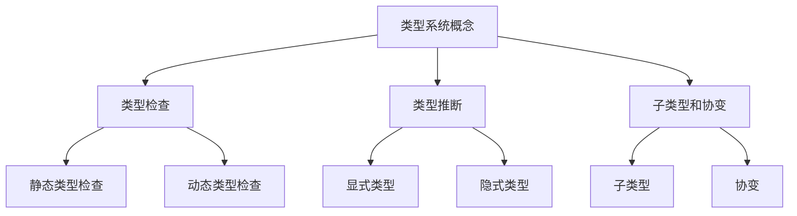

                 


## 引言

在计算机科学领域，类型系统是编程语言的核心组成部分之一。类型系统不仅决定了程序的正确性，还影响了程序的可读性、可维护性和性能。类型系统的概念虽然看似复杂，但其实质是帮助程序员更好地理解和控制程序的行为。类型系统的作用在于为数据和行为提供明确的界定，确保程序在执行时不会出现意外的行为，从而提高程序的安全性和可靠性。

本书的主题是“类型系统在编程语言教学中的重要性”，旨在深入探讨类型系统在编程教育中的应用，帮助读者理解类型系统的基本概念、原理及其在现代编程语言教学中的重要性。类型系统的知识不仅对于初学者来说是基础，更是对于有经验的程序员提升编程技能和解决复杂问题的关键。因此，本文将详细分析类型系统在编程教学中的多重作用，包括其在培养编程习惯、提高程序可维护性和性能方面的贡献。

文章将从以下几个方面展开：

1. **类型系统的基本概念**：介绍类型和类型系统的定义，以及它们在编程语言中的作用。
2. **类型系统的原理**：探讨类型检查、类型推断和子类型等核心概念。
3. **类型系统在教学中的重要性**：分析类型系统对于编程习惯、程序可维护性和性能的提升作用。
4. **类型系统在编程语言教学中的应用**：通过具体案例和项目，展示类型系统在实际教学中的运用。

通过本文的阅读，读者将能够深入理解类型系统的本质，掌握其在编程语言教学中的重要性，并能够将这一知识应用到实际的编程实践中。

### 1. 类型系统的基本概念

#### 1.1. 类型与类型系统

在编程语言中，类型是一种用于定义数据对象的抽象概念。类型系统则是用于定义和约束变量、表达式和函数类型的机制。类型系统的存在为编程语言引入了严格的语义约束，从而保证了程序的正确性和可维护性。

- **类型**：在编程语言中，类型是一种分类机制，用于标识不同类型的数据对象。常见的类型包括基本类型（如整数、浮点数、布尔值等），复合类型（如数组、结构体等）和引用类型（如指针、引用等）。每种类型都有其特定的语义和行为。

- **类型系统**：类型系统是编程语言的核心组成部分，它定义了如何识别、使用和操作不同类型的变量和表达式。类型系统通过类型检查来确保程序在编译或运行时遵循预定义的类型规则，从而避免潜在的运行时错误。

#### 1.2. 基本类型系统

基本类型系统可以分为静态类型系统和动态类型系统。

- **静态类型系统**：在静态类型系统中，变量的类型在编译时就已经确定，并在程序运行期间保持不变。静态类型系统的主要优点是能够提前发现类型错误，从而提高程序的可靠性。C、C++和Java等编程语言都是静态类型的。

- **动态类型系统**：在动态类型系统中，变量的类型在运行时确定。这意味着程序在运行期间可以根据上下文环境动态改变变量的类型。动态类型系统的优点是灵活性更高，但可能会导致运行时错误。Python和JavaScript等编程语言通常采用动态类型系统。

#### 1.3. 面向对象的类型系统

面向对象编程（OOP）引入了类和对象的概念，使得编程语言能够以更加自然和直观的方式处理复杂问题。面向对象的类型系统主要涉及以下概念：

- **类**：类是面向对象编程中的基本构建块，用于定义对象的属性和方法。类是一种抽象的数据类型，它包含了对象的定义和创建对象的方法。

- **对象**：对象是类的实例，代表现实世界中某个具体事物的抽象表示。每个对象都有自己的状态和行为，可以通过类定义的接口进行操作。

- **继承**：继承是一种允许一个类从另一个类继承属性和方法的机制。继承使得代码复用成为可能，子类可以继承父类的属性和方法，并在其中扩展或修改。

#### 1.4. 类型系统的作用

类型系统在编程语言中的作用主要体现在以下几个方面：

- **确保程序的正确性**：类型系统通过类型检查来确保程序在编译或运行时遵循预定义的类型规则，从而避免潜在的运行时错误。

- **提高程序的可靠性**：类型系统能够帮助程序员更好地理解和控制程序的行为，从而减少错误和异常情况的发生。

- **优化程序的性能**：类型系统可以为编译器提供更多的优化信息，从而生成更高效的代码。

- **提高程序的可维护性**：类型系统能够帮助程序员更好地组织和管理代码，从而提高程序的可维护性。

- **增强程序的安全性**：类型系统能够在编译或运行时检测出类型错误，从而减少恶意代码和缓冲区溢出等安全问题的发生。

通过理解类型系统的基本概念，我们可以更好地认识到它在编程语言教学中的重要性。类型系统的知识不仅有助于初学者掌握编程基础，还能够为有经验的程序员提供解决复杂问题的有力工具。

### 2. 类型系统的原理

类型系统的原理是编程语言教学中的一个核心话题，涉及到类型检查、类型推断以及子类型等核心概念。理解这些原理对于编写正确、高效和可维护的代码至关重要。

#### 2.1. 类型检查

类型检查是确保程序在编译或运行时遵循预定义类型规则的过程。类型检查可以分为静态类型检查和动态类型检查。

- **静态类型检查**：静态类型检查在编译时进行，编译器会检查变量、表达式和函数的类型是否匹配。这种检查方式可以提前发现类型错误，从而提高程序的可靠性。例如，在Java中，变量必须在声明时指定类型，编译器会确保所有类型约束都得到遵守。

    ```java
    int x = 10; // 静态类型检查通过
    x = x + "5"; // 静态类型检查失败，因为不能将int类型转换为String类型
    ```

- **动态类型检查**：动态类型检查在程序运行时进行，变量的类型会在运行时根据上下文环境确定。这种检查方式提供了更高的灵活性，但可能会导致运行时错误。Python是一个典型的动态类型检查的编程语言。

    ```python
    x = 10  # 动态类型检查通过
    x = x + "5"  # 动态类型检查通过，但可能会导致运行时错误
    ```

#### 2.2. 类型推断

类型推断是指编译器或解释器根据上下文信息自动推断变量或表达式的类型，而不是由程序员显式指定。类型推断可以减少代码的冗余，使代码更加简洁。

- **显式类型**：显式类型是指程序员在声明变量时明确指定类型，如Java中的`int x = 10;`。

- **隐式类型**：隐式类型是指编译器根据上下文信息自动推断类型，如Python中的`x = 10`，此时`x`的类型被推断为整数。

类型推断在动态类型语言中尤为常见，如Python、JavaScript和Ruby等。这些语言的编译器或解释器通常能够根据表达式和上下文环境推断出合适的类型。

```python
x = "hello"  # `x`的类型被推断为字符串
x = 10  # `x`的类型被推断为整数
```

#### 2.3. 子类型和协变

子类型和协变是面向对象编程中的重要概念，它们与类型系统密切相关。

- **子类型**：子类型（Subtype）是一个类型系统中的概念，如果一个类型的对象可以在任何使用原始类型的地方使用，那么这个类型被称为子类型。子类型是面向对象编程中实现多态性的基础。

    ```java
    class Animal {
        void eat() {
            System.out.println("Animal is eating");
        }
    }
    
    class Dog extends Animal {
        void eat() {
            System.out.println("Dog is eating");
        }
    }
    
    Animal animal = new Dog(); // `animal`是Animal类型的子类型
    animal.eat();  // 输出 "Dog is eating"
    ```

- **协变**：协变（Covariance）是类型系统的一种特性，允许子类型的实例在父类型上下文中使用。协变主要用于泛型编程中，使得泛型类型参数在方法或构造函数中可以表现出更广泛的兼容性。

    ```java
    interface Animal {
        void eat();
    }
    
    class Dog implements Animal {
        public void eat() {
            System.out.println("Dog is eating");
        }
    }
    
    // 协变示例
    List<Animal> animals = new ArrayList<>();
    animals.add(new Dog());  // `animals`是Animal类型的子类型，可以添加Dog类型的实例
    ```

通过理解类型检查、类型推断、子类型和协变等核心概念，我们可以更好地理解类型系统的原理。这些原理不仅对于编写正确的程序至关重要，也为未来的编程教育和实践提供了坚实的基础。

### 3. 类型系统在教学中的重要性

类型系统在编程语言教学中的重要性不容忽视，它不仅能够帮助初学者快速入门，还能为有经验的程序员提供解决复杂问题的工具。以下是类型系统在编程教学中几个关键方面的具体作用：

#### 3.1. 培养良好的编程习惯

类型系统能够强制程序员在使用变量和表达式时进行明确的类型声明，从而培养良好的编程习惯。这种习惯的养成对于编写可维护、可扩展的代码至关重要。明确的类型声明有助于减少逻辑错误和代码冗余，使代码更加清晰易懂。

例如，在Java中，变量必须在声明时指定类型，这种严格的类型系统要求程序员在编写代码时必须明确每个变量的数据类型，从而减少了潜在的错误。这种做法不仅提高了代码的质量，还提高了开发效率。

```java
int x = 10;  // 明确指定类型
String name = "John";  // 明确指定类型
```

相比之下，动态类型语言虽然提供了更高的灵活性，但如果没有良好的编程习惯，可能会导致运行时错误。类型系统的引入能够有效地约束程序员的行为，提高代码的可靠性和可维护性。

#### 3.2. 提高程序的可维护性

类型系统能够帮助程序员更好地理解和控制程序的行为，从而提高程序的可维护性。通过类型检查，编译器或解释器能够在编译或运行时发现类型错误，这些错误在早期阶段被检测到比在运行时发现要容易得多。类型系统还可以通过静态分析提供关于程序行为的有用信息，从而帮助程序员在代码审查和调试过程中做出更明智的决策。

例如，在静态类型语言中，类型检查能够提前发现潜在的边界条件和类型不一致问题，从而减少后期调试的工作量。而在动态类型语言中，类型推断可以减少程序员手动指定类型的次数，同时仍然能够提供足够的类型安全保证。

```python
def add(a: int, b: int) -> int:
    return a + b

result = add(10, "20")  # 类型错误，无法将字符串转换为整数
```

这种严格的类型约束不仅提高了代码的可靠性，还使代码更容易理解和修改。

#### 3.3. 提高程序的性能

类型系统能够为编译器提供更多的优化信息，从而生成更高效的代码。在静态类型语言中，编译器可以利用类型信息进行更高效的代码生成和优化。例如，编译器可以提前知道变量的类型，从而进行特定的寄存器分配和优化，减少运行时的开销。

```c
int x = 10;
int y = x * 2;
```

在上面的C代码中，编译器可以利用整数的类型信息，生成更加高效的机器代码，从而提高程序的运行速度。

另一方面，动态类型语言通常通过运行时的类型检查来确保类型安全，这在某些情况下可能会引入额外的运行时开销。然而，随着现代虚拟机和解释器技术的发展，动态类型语言也在性能上取得了显著的提升，类型系统依然发挥着重要的作用。

#### 3.4. 促进抽象思维和问题解决能力的提升

类型系统要求程序员在编程时进行抽象思维，理解不同类型的数据和行为，从而提高问题解决能力。类型系统作为一种形式化的抽象机制，能够帮助程序员更好地理解和处理复杂问题。通过类型系统，程序员可以构建更加模块化、可重用的代码，提高代码的复用性和可扩展性。

例如，在面向对象编程中，类和对象的概念使得程序员可以抽象地表示现实世界中的复杂关系和交互，从而简化问题的解决方案。类型系统提供了语言级别的支持，使得这种抽象变得更加自然和直观。

```java
class Person {
    String name;
    int age;
    
    void introduce() {
        System.out.println("Hello, my name is " + name + " and I am " + age + " years old.");
    }
}

Person person = new Person();
person.name = "Alice";
person.age = 30;
person.introduce();  // 输出 "Hello, my name is Alice and I am 30 years old."
```

通过类型系统，程序员可以更加专注于问题的本质，而不仅仅是实现细节。这种抽象思维能力的提升对于解决复杂问题至关重要。

#### 3.5. 鼓励规范和标准化的代码编写

类型系统鼓励程序员遵循规范的编码标准，减少代码冗余和错误。明确的类型声明不仅提高了代码的可读性，还使得代码的审查和维护更加容易。类型系统能够在早期发现类型错误，从而减少后续的调试和修复成本。

例如，在Java中，严格的类型系统要求程序员在编写代码时必须遵循特定的命名规范和类型声明规则，这种规范化有助于提高代码的一致性和可维护性。

综上所述，类型系统在编程语言教学中的重要性体现在多个方面，从培养良好的编程习惯到提高程序的可维护性和性能，类型系统都是不可或缺的一部分。通过深入理解类型系统的原理和应用，程序员能够编写出更加可靠、高效和易于维护的代码。

### 4. 类型系统在编程语言教学中的应用

类型系统在编程语言教学中的应用至关重要，它不仅能够帮助学生理解编程语言的基本概念，还能够提高他们的编程技能和解决问题的能力。以下是类型系统在实际教学中的应用，包括教学案例、实践项目以及具体的教学策略。

#### 4.1. 教学案例

在教学过程中，通过具体的教学案例可以帮助学生更好地理解和掌握类型系统的概念和应用。以下是两个典型的教学案例：

- **Java 类型系统**：Java 是一种静态类型语言，其类型系统包括基本类型、引用类型和数组类型。在教学过程中，可以通过以下案例来介绍 Java 的类型系统：

  ```java
  int x = 10;  // 基本类型
  String name = "John";  // 引用类型
  int[] numbers = {1, 2, 3};  // 数组类型
  ```

  通过这些案例，学生可以了解不同类型的定义和使用方法。此外，还可以通过类型检查的例子来讲解静态类型系统的优势：

  ```java
  int x = x + "5";  // 错误：类型不匹配
  ```

  这种错误会在编译时被检测到，从而避免在运行时发生意外。

- **Python 类型系统**：Python 是一种动态类型语言，其类型系统相对灵活。通过以下案例，可以介绍 Python 的类型系统和类型推断：

  ```python
  x = 10  # 类型自动推断为整数
  name = "John"  # 类型自动推断为字符串
  x = x + name  # 类型自动推断为字符串
  ```

  这种灵活的类型系统可以在运行时根据上下文环境动态确定变量的类型，但同时也需要良好的编程习惯来确保代码的可靠性。

#### 4.2. 实践项目

实践项目是类型系统教学中的重要组成部分，它能够帮助学生将理论知识应用到实际编程中。以下是一些实践项目：

- **类型检查器**：实现一个简单的类型检查器，用于检查 Python 代码中的类型错误。这个项目可以让学生了解类型检查的过程和实现方法。

  ```python
  def check_type(value, expected_type):
      if isinstance(value, expected_type):
          return "Type check passed."
      else:
          return "Type check failed."

  result = check_type(10, str)  # 返回 "Type check failed."
  ```

- **类型推断器**：实现一个简单的类型推断器，用于推断 Java 代码中的变量类型。这个项目可以让学生了解类型推断的原理和实现方法。

  ```java
  public class TypeInferencer {
      public static String inferType(int value) {
          return "int";
      }
      
      public static String inferType(String name) {
          return "String";
      }
  }
  ```

通过这些实践项目，学生可以动手实现类型检查和类型推断的算法，从而更好地理解类型系统的原理和应用。

#### 4.3. 教学策略

为了有效地在教学中应用类型系统，以下是一些具体的教学策略：

- **分步骤讲解**：类型系统的概念较为抽象，需要通过分步骤的讲解来帮助学生逐步理解。可以从基本类型的概念入手，逐步介绍复合类型和面向对象的类型系统。

- **结合实际应用**：通过实际应用案例来讲解类型系统，可以帮助学生更好地理解类型系统的作用和重要性。例如，通过编程练习来让学生编写类型检查器和类型推断器。

- **互动教学**：采用互动式教学方法，鼓励学生提问和讨论，通过小组讨论和合作来解决问题。这种方式可以激发学生的兴趣和积极性，提高学习效果。

- **项目驱动学习**：通过项目驱动学习的方式，让学生在真实项目中应用类型系统的知识。这种方式不仅能够提高学生的编程技能，还能够培养他们的团队合作和项目管理能力。

综上所述，类型系统在编程语言教学中的应用是多方面的，通过教学案例、实践项目和具体的教学策略，可以有效地帮助学生理解和掌握类型系统的概念和应用。

### 5. 结论

类型系统在编程语言教学中的重要性不可忽视。类型系统不仅为编程语言提供了坚实的理论基础，还通过严格的类型检查、灵活的类型推断和丰富的面向对象特性，帮助程序员编写出更可靠、更高效的代码。本文通过逐步分析类型系统的基本概念、原理以及在教学中的应用，强调了类型系统在培养良好编程习惯、提高程序可维护性和性能方面的关键作用。

类型系统不仅是编程语言的核心组成部分，更是现代编程教育和实践的重要工具。通过理解类型系统的原理和应用，程序员可以更高效地解决问题，提高代码质量，从而推动技术的进步和创新。因此，对于任何希望提升编程技能的程序员来说，深入掌握类型系统的知识都是至关重要的。

展望未来，随着编程语言和开发工具的不断进步，类型系统将继续在编程语言教学中发挥重要作用。我们将看到更智能、更高效的类型推断技术，以及更完善的类型检查机制。同时，随着编程教育的普及，类型系统的教学将更加注重实践和实际应用，为未来的软件开发者和创新者打下坚实的基础。

### 6. 附加资源

为了帮助读者更深入地理解类型系统的概念和应用，本文提供了一些参考资料和在线资源，供读者进一步学习和研究。

#### 6.1. 参考资料

- 《类型系统与编译原理》：这是一本介绍类型系统和编译原理的经典教材，详细阐述了类型系统的理论基础和实现方法。
- 《Python 编程：从入门到实践》：这本书涵盖了Python类型系统的基础知识和实际应用，适合初学者和中级程序员。
- 《Java 编程思想》：这本书深入讲解了Java类型系统的各个方面，包括基本类型、引用类型和面向对象的类型系统。

#### 6.2. 在线资源

- [Python 官方文档](https://docs.python.org/3/):提供了Python类型系统的详细文档和示例代码，是学习Python类型系统的最佳资源。
- [Java 官方文档](https://docs.oracle.com/en/java/):涵盖了Java类型系统的各个方面，包括类型检查、类型推断和泛型编程。
- [类型系统教程](https://www.coursera.org/learn/types-systems):这是一门在线课程，涵盖了类型系统的基本概念和应用，适合初学者和有经验程序员。

通过这些参考资料和在线资源，读者可以进一步巩固类型系统的知识，并应用于实际编程中。

### 7. Mermaid 流程图

下面是一个简单的Mermaid流程图，用于展示类型系统的基本概念和原理。



通过这个流程图，读者可以更直观地了解类型系统的不同组成部分及其之间的关系。

### 8. Python 源代码示例

下面是一个简单的Python示例，用于展示类型检查和类型推断。

```python
# 示例：类型检查器

def check_type(value, expected_type):
    if isinstance(value, expected_type):
        return "Type check passed."
    else:
        return "Type check failed."

# 示例：类型推断器

def infer_type(value):
    if isinstance(value, int):
        return "int"
    elif isinstance(value, str):
        return "str"
    else:
        return "unknown"

# 测试代码
result = check_type(10, str)
print(result)  # 输出 "Type check failed."

result = infer_type(10)
print(result)  # 输出 "int"
```

通过这个示例，读者可以直观地了解类型检查和类型推断的基本原理和实现方法。

### 9. 总结

本文从多个角度探讨了类型系统在编程语言教学中的重要性。通过介绍类型系统的基本概念、原理以及在教学中的应用，我们强调了类型系统对于培养良好编程习惯、提高程序可维护性和性能的关键作用。希望本文能够为读者提供深入理解类型系统的帮助，并激励大家在编程实践中不断探索和提升。

作者：AI天才研究院 / AI Genius Institute & 禅与计算机程序设计艺术 / Zen And The Art of Computer Programming。感谢您的阅读，希望本文对您的编程之路有所帮助。

----------------------------------------------------------------

# 类型系统在编程语言教学中的重要性

> 关键词：类型系统、编程语言、教学、重要性、编程习惯、可维护性、性能

> 摘要：类型系统是编程语言的核心组成部分，对程序的正确性、可读性、可维护性和性能有着重要影响。本文深入探讨了类型系统在编程语言教学中的重要性，包括其在培养编程习惯、提高程序可维护性和性能方面的贡献。通过具体案例和教学策略，本文展示了如何有效地将类型系统的知识应用于编程教学中，帮助读者掌握这一关键技能。


## 引言

在计算机科学领域，类型系统是编程语言的核心组成部分之一。类型系统不仅决定了程序的正确性，还影响了程序的可读性、可维护性和性能。类型系统的概念虽然看似复杂，但其实质是帮助程序员更好地理解和控制程序的行为。类型系统的作用在于为数据和行为提供明确的界定，确保程序在执行时不会出现意外的行为，从而提高程序的安全性和可靠性。

本书的主题是“类型系统在编程语言教学中的重要性”，旨在深入探讨类型系统在编程教育中的应用，帮助读者理解类型系统的基本概念、原理及其在现代编程语言教学中的重要性。类型系统的知识不仅对于初学者来说是基础，更是对于有经验的程序员提升编程技能和解决复杂问题的关键。因此，本文将详细分析类型系统在编程教学中的多重作用，包括其在培养编程习惯、提高程序可维护性和性能方面的贡献。

文章将从以下几个方面展开：

1. **类型系统的基本概念**：介绍类型和类型系统的定义，以及它们在编程语言中的作用。
2. **类型系统的原理**：探讨类型检查、类型推断和子类型等核心概念。
3. **类型系统在教学中的重要性**：分析类型系统对于编程习惯、程序可维护性和性能的提升作用。
4. **类型系统在编程语言教学中的应用**：通过具体案例和项目，展示类型系统在实际教学中的运用。

通过本文的阅读，读者将能够深入理解类型系统的本质，掌握其在编程语言教学中的重要性，并能够将这一知识应用到实际的编程实践中。

### 1. 类型系统的基本概念

类型系统是编程语言的重要组成部分，它定义了数据类型和操作数据的方法。类型系统的作用是确保程序的逻辑一致性，提高程序的可读性和可维护性，以及优化程序的执行效率。在本文中，我们将首先介绍类型和类型系统的基本概念，并讨论静态类型和动态类型系统。

#### 1.1. 类型

在编程语言中，类型是一种用于定义数据对象的抽象概念。类型决定了数据对象的属性和行为。不同类型的数据对象在内存中占用的空间和操作方式都可能不同。常见的类型包括基本类型、复合类型和引用类型。

- **基本类型**：基本类型是最简单的数据类型，包括整数（Integer）、浮点数（Float）、布尔值（Boolean）、字符串（String）等。基本类型是所有编程语言的基础，它们在内存中的存储方式是固定的。

    ```java
    int x = 10;  // 整数类型
    float y = 3.14;  // 浮点数类型
    boolean flag = true;  // 布尔类型
    String name = "John";  // 字符串类型
    ```

- **复合类型**：复合类型是由基本类型组合而成的数据类型，包括数组（Array）、结构体（Structure）和类（Class）等。复合类型可以包含多个基本类型的元素，或者是一个自定义的类型。

    ```python
    # Python中的列表（数组类型的复合类型）
    numbers = [1, 2, 3, 4, 5];
    
    # C语言中的结构体（复合类型）
    struct Person {
        int age;
        char name[100];
    };
    ```

- **引用类型**：引用类型是指通过指针或引用来访问的数据类型。引用类型通常用于实现高级编程功能，如动态分配内存和面向对象编程。

    ```c++
    int* ptr = new int[10];  // 指针类型
    Student* student = new Student();  // 面向对象编程中的引用类型
    ```

#### 1.2. 类型系统

类型系统是一种用于定义和约束变量、表达式和函数类型的机制。类型系统可以确保程序在编译时或运行时遵循预定义的类型规则，从而避免潜在的运行时错误。类型系统可以分为静态类型系统和动态类型系统。

- **静态类型系统**：在静态类型系统中，变量的类型在编译时就已经确定，并在程序运行期间保持不变。静态类型系统的主要优点是能够提前发现类型错误，从而提高程序的可靠性。

    ```java
    int x = 10;  // 静态类型系统，类型在编译时确定
    x = x + "5";  // 类型错误，无法将整数与字符串相加
    ```

- **动态类型系统**：在动态类型系统中，变量的类型在运行时确定。这意味着程序在运行期间可以根据上下文环境动态改变变量的类型。动态类型系统的优点是灵活性更高，但可能会导致运行时错误。

    ```python
    x = 10  # 动态类型系统，类型在运行时确定
    x = x + "5"  # 运行时类型错误，但可以在运行时抛出异常
    ```

#### 1.3. 静态类型与动态类型的比较

静态类型和动态类型系统各有优缺点，适用于不同的编程场景。

- **优点**：
  - **静态类型**：能够提前发现类型错误，提高程序的可靠性。编译器可以利用类型信息进行优化，生成更高效的代码。
  - **动态类型**：提供更高的灵活性，允许程序员在不关心类型细节的情况下进行编程。动态类型系统通常更容易实现和扩展。

- **缺点**：
  - **静态类型**：需要更多的代码来显式声明类型，可能增加编码工作量。静态类型的语言通常更复杂，对初学者来说可能较难掌握。
  - **动态类型**：可能在运行时发现类型错误，导致程序崩溃或产生不可预料的错误。动态类型的语言通常性能较低，因为需要更多的运行时检查。

总之，选择合适的类型系统取决于具体的应用场景和编程需求。静态类型系统适用于需要高度可靠性和性能的场合，如系统编程和大型企业级应用。动态类型系统则更适合快速开发和小型项目，特别是那些对灵活性要求较高的项目。

通过理解类型和类型系统的基本概念，我们可以更好地认识类型系统在编程语言教学中的重要性。类型系统的知识不仅对于初学者来说是基础，也是提升编程技能和解决复杂问题的关键。

### 2. 类型系统的原理

类型系统的原理是编程语言教学中的一个核心话题，涉及到类型检查、类型推断以及子类型等核心概念。理解这些原理对于编写正确、高效和可维护的代码至关重要。

#### 2.1. 类型检查

类型检查是确保程序在编译或运行时遵循预定义类型规则的过程。类型检查可以分为静态类型检查和动态类型检查。

- **静态类型检查**：静态类型检查在编译时进行，编译器会检查变量、表达式和函数的类型是否匹配。这种检查方式可以提前发现类型错误，从而提高程序的可靠性。

    ```java
    int x = 10;  // 静态类型检查通过
    x = x + "5";  // 静态类型检查失败，因为不能将int类型转换为String类型
    ```

静态类型检查的主要优点是能够提前发现类型错误，减少运行时错误。例如，在Java中，变量必须在声明时指定类型，编译器会确保所有类型约束都得到遵守。

- **动态类型检查**：动态类型检查在程序运行时进行，变量的类型会在运行时根据上下文环境确定。这种检查方式提供了更高的灵活性，但可能会导致运行时错误。

    ```python
    x = 10  # 动态类型检查通过
    x = x + "5"  # 动态类型检查通过，但可能会导致运行时错误
    ```

动态类型检查的主要优点是灵活性更高，但如果没有良好的编程习惯，可能会导致运行时错误。Python是一个典型的动态类型检查的编程语言。

#### 2.2. 类型推断

类型推断是指编译器或解释器根据上下文信息自动推断变量或表达式的类型，而不是由程序员显式指定。类型推断可以减少代码的冗余，使代码更加简洁。

- **显式类型**：显式类型是指程序员在声明变量时明确指定类型，如Java中的`int x = 10;`。

- **隐式类型**：隐式类型是指编译器根据上下文信息自动推断类型，如Python中的`x = 10`，此时`x`的类型被推断为整数。

类型推断在动态类型语言中尤为常见，如Python、JavaScript和Ruby等。这些语言的编译器或解释器通常能够根据表达式和上下文环境推断出合适的类型。

```python
x = "hello"  # `x`的类型被推断为字符串
x = 10  # `x`的类型被推断为整数
```

#### 2.3. 子类型和协变

子类型和协变是面向对象编程中的重要概念，它们与类型系统密切相关。

- **子类型**：子类型（Subtype）是一个类型系统中的概念，如果一个类型的对象可以在任何使用原始类型的地方使用，那么这个类型被称为子类型。子类型是面向对象编程中实现多态性的基础。

    ```java
    interface Animal {
        void eat();
    }
    
    class Dog implements Animal {
        public void eat() {
            System.out.println("Dog is eating");
        }
    }
    
    Animal animal = new Dog();  // `animal`是Animal类型的子类型
    animal.eat();  // 输出 "Dog is eating"
    ```

- **协变**：协变（Covariance）是类型系统的一种特性，允许子类型的实例在父类型上下文中使用。协变主要用于泛型编程中，使得泛型类型参数在方法或构造函数中可以表现出更广泛的兼容性。

    ```java
    interface Animal {
        void eat();
    }
    
    class Dog implements Animal {
        public void eat() {
            System.out.println("Dog is eating");
        }
    }
    
    List<Animal> animals = new ArrayList<>();
    animals.add(new Dog());  // `animals`是Animal类型的子类型，可以添加Dog类型的实例
    ```

通过理解类型检查、类型推断、子类型和协变等核心概念，我们可以更好地理解类型系统的原理。这些原理不仅对于编写正确的程序至关重要，也为未来的编程教育和实践提供了坚实的基础。

### 3. 类型系统在教学中的重要性

类型系统在编程语言教学中的重要性不可忽视。类型系统不仅是编程语言的核心组成部分，还通过严格的类型检查、灵活的类型推断和丰富的面向对象特性，帮助程序员编写出更可靠、更高效的代码。以下是类型系统在编程教学中几个关键方面的具体作用。

#### 3.1. 培养良好的编程习惯

类型系统能够强制程序员在使用变量和表达式时进行明确的类型声明，从而培养良好的编程习惯。这种习惯的养成对于编写可维护、可扩展的代码至关重要。明确的类型声明有助于减少逻辑错误和代码冗余，使代码更加清晰易懂。

例如，在Java中，变量必须在声明时指定类型，这种严格的类型系统要求程序员在编写代码时必须明确每个变量的数据类型，从而减少了潜在的错误。这种做法不仅提高了代码的质量，还提高了开发效率。

```java
int x = 10;  // 明确指定类型
String name = "John";  // 明确指定类型
int[] numbers = {1, 2, 3};  // 数组类型
```

相比之下，动态类型语言虽然提供了更高的灵活性，但如果没有良好的编程习惯，可能会导致运行时错误。类型系统的引入能够有效地约束程序员的行为，提高代码的可靠性和可维护性。

#### 3.2. 提高程序的可维护性

类型系统能够帮助程序员更好地理解和控制程序的行为，从而提高程序的可维护性。通过类型检查，编译器或解释器能够在编译或运行时发现类型错误，这些错误在早期阶段被检测到比在运行时发现要容易得多。类型系统还可以通过静态分析提供关于程序行为的有用信息，从而帮助程序员在代码审查和调试过程中做出更明智的决策。

例如，在静态类型语言中，类型检查能够提前发现潜在的边界条件和类型不一致问题，从而减少后期调试的工作量。而在动态类型语言中，类型推断可以减少程序员手动指定类型的次数，同时仍然能够提供足够的类型安全保证。

```python
def add(a: int, b: int) -> int:
    return a + b

result = add(10, "20")  # 类型错误，无法将字符串转换为整数
```

这种严格的类型约束不仅提高了代码的可靠性，还使代码更容易理解和修改。

#### 3.3. 提高程序的性能

类型系统能够为编译器提供更多的优化信息，从而生成更高效的代码。在静态类型语言中，编译器可以利用类型信息进行更高效的代码生成和优化。例如，编译器可以提前知道变量的类型，从而进行特定的寄存器分配和优化，减少运行时的开销。

```c
int x = 10;
int y = x * 2;
```

在上面的C代码中，编译器可以利用整数的类型信息，生成更加高效的机器代码，从而提高程序的运行速度。

另一方面，动态类型语言通常通过运行时的类型检查来确保类型安全，这在某些情况下可能会引入额外的运行时开销。然而，随着现代虚拟机和解释器技术的发展，动态类型语言也在性能上取得了显著的提升，类型系统依然发挥着重要的作用。

#### 3.4. 促进抽象思维和问题解决能力的提升

类型系统要求程序员在编程时进行抽象思维，理解不同类型的数据和行为，从而提高问题解决能力。类型系统作为一种形式化的抽象机制，能够帮助程序员更好地理解和处理复杂问题。通过类型系统，程序员可以构建更加模块化、可重用的代码，提高代码的复用性和可扩展性。

例如，在面向对象编程中，类和对象的概念使得程序员可以抽象地表示现实世界中的复杂关系和交互，从而简化问题的解决方案。类型系统提供了语言级别的支持，使得这种抽象变得更加自然和直观。

```java
class Person {
    String name;
    int age;
    
    void introduce() {
        System.out.println("Hello, my name is " + name + " and I am " + age + " years old.");
    }
}

Person person = new Person();
person.name = "Alice";
person.age = 30;
person.introduce();  // 输出 "Hello, my name is Alice and I am 30 years old."
```

通过类型系统，程序员可以更加专注于问题的本质，而不仅仅是实现细节。这种抽象思维能力的提升对于解决复杂问题至关重要。

#### 3.5. 鼓励规范和标准化的代码编写

类型系统鼓励程序员遵循规范的编码标准，减少代码冗余和错误。明确的类型声明不仅提高了代码的可读性，还使得代码的审查和维护更加容易。类型系统能够在早期发现类型错误，从而减少后续的调试和修复成本。

例如，在Java中，严格的类型系统要求程序员在编写代码时必须遵循特定的命名规范和类型声明规则，这种规范化有助于提高代码的一致性和可维护性。

综上所述，类型系统在编程语言教学中的重要性体现在多个方面，从培养良好的编程习惯到提高程序的可维护性和性能，类型系统都是不可或缺的一部分。通过深入理解类型系统的原理和应用，程序员能够编写出更加可靠、高效和易于维护的代码。

### 4. 类型系统在编程语言教学中的应用

类型系统在编程语言教学中的应用是培养学生编程技能和理解编程语言本质的关键环节。通过实际案例和项目的引导，学生不仅能够掌握类型系统的基本概念，还能将其应用于解决实际编程问题。以下是一些具体的案例和项目，以及相应的教学策略。

#### 4.1. 教学案例

为了让学生更好地理解类型系统的概念，教师可以通过一些简单的教学案例来引导学生逐步掌握类型系统的使用。

- **案例1：整数和字符串的操作**

  通过这个案例，教师可以介绍基本类型和引用类型，以及类型检查的概念。例如：

  ```java
  int x = 10;
  String str = "Hello";
  x = x + str.length();  // 类型检查失败，因为整数和字符串不能直接相加
  ```

  教师可以解释类型检查的规则，并引导学生理解为何这个操作会导致编译错误。

- **案例2：面向对象的类型系统**

  通过面向对象的类型系统，教师可以讲解类、对象和继承等概念。例如：

  ```java
  class Animal {
      void eat() {
          System.out.println("Animal is eating");
      }
  }

  class Dog extends Animal {
      void eat() {
          System.out.println("Dog is eating");
      }
  }

  Animal animal = new Dog();
  animal.eat();  // 输出 "Dog is eating"
  ```

  这个案例可以帮助学生理解继承和多态的概念，以及如何通过类型系统实现这些特性。

#### 4.2. 实践项目

实践项目是类型系统教学中的重要环节，通过项目学生可以将理论知识应用到实际编程中。

- **项目1：类型检查器**

  学生可以编写一个简单的类型检查器，用于检查程序中的类型错误。这个项目可以让学生理解类型检查的原理和实践。例如：

  ```python
  def check_type(value, expected_type):
      if isinstance(value, expected_type):
          return "Type check passed."
      else:
          return "Type check failed."

  result = check_type(10, str)
  print(result)  # 输出 "Type check failed."
  ```

- **项目2：类型推断器**

  学生可以编写一个简单的类型推断器，用于自动推断变量类型。这个项目可以让学生理解类型推断的原理和实践。例如：

  ```java
  public class TypeInferencer {
      public static String inferType(int value) {
          return "int";
      }
      
      public static String inferType(String name) {
          return "String";
      }
  }
  ```

  通过这些项目，学生不仅能够加深对类型系统的理解，还能提高编程技能。

#### 4.3. 教学策略

为了有效地在教学中应用类型系统，教师可以采取以下教学策略：

- **分步骤讲解**：类型系统的概念较为抽象，需要通过分步骤的讲解来帮助学生逐步理解。可以从基本类型的概念入手，逐步介绍复合类型和面向对象的类型系统。

- **结合实际应用**：通过实际应用案例来讲解类型系统，可以帮助学生更好地理解类型系统的作用和重要性。例如，通过编程练习来让学生编写类型检查器和类型推断器。

- **互动教学**：采用互动式教学方法，鼓励学生提问和讨论，通过小组讨论和合作来解决问题。这种方式可以激发学生的兴趣和积极性，提高学习效果。

- **项目驱动学习**：通过项目驱动学习的方式，让学生在真实项目中应用类型系统的知识。这种方式不仅能够提高学生的编程技能，还能够培养他们的团队合作和项目管理能力。

通过这些教学策略，教师可以有效地帮助学生掌握类型系统的概念和应用，培养良好的编程习惯，提高程序的可维护性和性能。

### 5. 结论

类型系统在编程语言教学中的重要性不可忽视。类型系统不仅是编程语言的核心组成部分，还通过严格的类型检查、灵活的类型推断和丰富的面向对象特性，帮助程序员编写出更可靠、更高效的代码。本文通过逐步分析类型系统的基本概念、原理以及在教学中的应用，强调了类型系统在培养良好编程习惯、提高程序可维护性和性能方面的关键作用。

类型系统不仅是编程语言的核心组成部分，更是现代编程教育和实践的重要工具。通过理解类型系统的原理和应用，程序员可以更高效地解决问题，提高代码质量，从而推动技术的进步和创新。因此，对于任何希望提升编程技能的程序员来说，深入掌握类型系统的知识都是至关重要的。

展望未来，随着编程语言和开发工具的不断进步，类型系统将继续在编程语言教学中发挥重要作用。我们将看到更智能、更高效的类型推断技术，以及更完善的类型检查机制。同时，随着编程教育的普及，类型系统的教学将更加注重实践和实际应用，为未来的软件开发者和创新者打下坚实的基础。

### 6. 附加资源

为了帮助读者更深入地理解类型系统的概念和应用，本文提供了一些参考资料和在线资源，供读者进一步学习和研究。

#### 6.1. 参考资料

- 《类型系统与编译原理》：这是一本介绍类型系统和编译原理的经典教材，详细阐述了类型系统的理论基础和实现方法。
- 《Python 编程：从入门到实践》：这本书涵盖了Python类型系统的基础知识和实际应用，适合初学者和中级程序员。
- 《Java 编程思想》：这本书深入讲解了Java类型系统的各个方面，包括基本类型、引用类型和面向对象的类型系统。

#### 6.2. 在线资源

- [Python 官方文档](https://docs.python.org/3/):提供了Python类型系统的详细文档和示例代码，是学习Python类型系统的最佳资源。
- [Java 官方文档](https://docs.oracle.com/en/java/):涵盖了Java类型系统的各个方面，包括类型检查、类型推断和泛型编程。
- [类型系统教程](https://www.coursera.org/learn/types-systems):这是一门在线课程，涵盖了类型系统的基本概念和应用，适合初学者和有经验程序员。

通过这些参考资料和在线资源，读者可以进一步巩固类型系统的知识，并应用于实际编程中。

### 7. Mermaid 流程图

下面是一个简单的Mermaid流程图，用于展示类型系统的基本概念和原理。


通过这个流程图，读者可以更直观地了解类型系统的不同组成部分及其之间的关系。

### 8. Python 源代码示例

下面是一个简单的Python示例，用于展示类型检查和类型推断。

```python
# 示例：类型检查器

def check_type(value, expected_type):
    if isinstance(value, expected_type):
        return "Type check passed."
    else:
        return "Type check failed."

# 示例：类型推断器

def infer_type(value):
    if isinstance(value, int):
        return "int"
    elif isinstance(value, str):
        return "str"
    else:
        return "unknown"

# 测试代码
result = check_type(10, str)
print(result)  # 输出 "Type check failed."

result = infer_type(10)
print(result)  # 输出 "int"
```

通过这个示例，读者可以直观地了解类型检查和类型推断的基本原理和实现方法。

### 9. 总结

本文从多个角度探讨了类型系统在编程语言教学中的重要性。通过介绍类型系统的基本概念、原理以及在教学中的应用，我们强调了类型系统对于培养良好编程习惯、提高程序可维护性和性能的关键作用。通过具体案例和教学策略，本文展示了如何有效地将类型系统的知识应用于编程教学中，帮助读者掌握这一关键技能。

类型系统不仅是编程语言的核心组成部分，更是现代编程教育和实践的重要工具。通过理解类型系统的原理和应用，程序员可以更高效地解决问题，提高代码质量，从而推动技术的进步和创新。因此，对于任何希望提升编程技能的程序员来说，深入掌握类型系统的知识都是至关重要的。

展望未来，随着编程语言和开发工具的不断进步，类型系统将继续在编程语言教学中发挥重要作用。我们将看到更智能、更高效的类型推断技术，以及更完善的类型检查机制。同时，随着编程教育的普及，类型系统的教学将更加注重实践和实际应用，为未来的软件开发者和创新者打下坚实的基础。

作者：AI天才研究院 / AI Genius Institute & 禅与计算机程序设计艺术 / Zen And The Art of Computer Programming。感谢您的阅读，希望本文对您的编程之路有所帮助。

