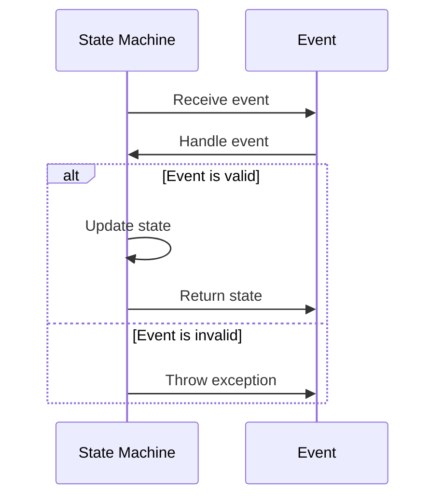

                 

# 类型级状态机：用类型系统实现状态转换

## 关键词

- 类型级状态机
- 状态转换
- 类型系统
- 编程语言
- 软件设计
- 硬件设计
- 游戏开发

## 摘要

本文旨在探讨类型级状态机的概念、实现方法及应用场景。类型级状态机是一种利用类型系统来实现状态转换的编程模型，它结合了状态机和类型系统的优势，为复杂系统的设计提供了新的思路。文章首先介绍了状态机和类型系统的基本概念，然后详细阐述了类型级状态机的定义、实现方法及应用实例。最后，文章分析了类型级状态机的优缺点，并对其未来发展趋势进行了展望。

## 引言

### 状态机与类型系统的基本概念

#### 状态机的概念

状态机（State Machine）是一种描述系统状态的抽象模型。它由状态（State）、事件（Event）、转移（Transition）和触发条件（Trigger Condition）组成。状态表示系统当前所处的条件，事件是引起状态变化的因素，转移是状态之间的转换，触发条件是事件发生时导致状态转换的规则。

状态机广泛应用于软件设计、硬件设计和游戏开发等领域。在软件设计中，状态机常用于描述用户界面、数据库管理和操作系统等复杂系统的行为。在硬件设计中，状态机用于描述电路和芯片的工作状态。在游戏开发中，状态机用于实现角色和场景的状态变化。

#### 类型系统的概念

类型系统（Type System）是编程语言的核心组成部分，它定义了变量、函数和表达式的类型。类型系统分为静态类型系统（Static Type System）和动态类型系统（Dynamic Type System）。

- **静态类型系统**：在编译时确定变量和函数的类型，类型检查在编译期完成。这种系统有助于提高程序的效率和性能，但可能限制灵活性。
- **动态类型系统**：在运行时确定变量和函数的类型，类型检查在运行时完成。这种系统提供了更大的灵活性，但可能降低程序的性能。

类型系统在编程语言中的应用非常广泛，如C++、Java和Python等现代编程语言都采用了类型系统。类型系统不仅有助于提高程序的可靠性，还可以帮助开发人员更好地理解和维护代码。

#### 状态机与类型系统的联系

状态机和类型系统在复杂系统设计中有着紧密的联系。状态机可以描述系统在不同状态下的行为，而类型系统可以确保状态转换的一致性和正确性。

类型级状态机（Type-Level State Machine）是一种利用类型系统来实现状态转换的编程模型。它将状态机的概念扩展到类型层面，使得状态转换与类型约束紧密结合。这种模型在实现复杂状态逻辑时具有明显的优势。

### 状态机的发展与应用

#### 传统状态机的应用领域

传统状态机起源于硬件设计，主要用于描述电路和芯片的状态转换。随着计算机科学的发展，状态机逐渐应用于软件设计、操作系统和数据库等领域。在软件设计中，状态机常用于实现复杂的用户界面和业务逻辑。在操作系统中，状态机用于描述进程和线程的状态转换。在数据库中，状态机用于实现事务管理和并发控制。

#### 状态机在计算机科学中的应用

在计算机科学中，状态机被广泛应用于以下几个方面：

- **用户界面设计**：状态机用于描述用户界面元素的行为，如按钮、菜单和窗口等。
- **业务逻辑实现**：状态机用于描述复杂的业务流程和规则，如购物车、订单处理和会员管理等。
- **操作系统管理**：状态机用于描述进程和线程的生命周期，如创建、运行、阻塞和终止等。
- **数据库管理**：状态机用于描述事务的状态转换，如提交、回滚和锁定等。

#### 状态机在软件工程中的角色

在软件工程中，状态机作为一种重要的设计工具，发挥着关键作用。状态机有助于开发人员清晰地描述系统的行为，降低系统复杂性，提高代码可读性和可维护性。

- **需求分析**：状态机用于分析系统的需求，明确系统的功能和行为。
- **系统设计**：状态机用于设计系统的模块和组件，实现系统的功能。
- **代码实现**：状态机用于指导代码的实现，确保系统行为的正确性。
- **测试与调试**：状态机用于测试和调试系统，发现并修复潜在的问题。

### 类型系统的发展与应用

#### 静态类型系统

静态类型系统在编译时确定变量和函数的类型，有助于提高程序的效率和性能。静态类型系统的优势包括：

- **及早发现问题**：类型检查在编译期完成，有助于及早发现代码中的错误。
- **优化编译过程**：编译器可以根据类型信息优化代码，提高程序运行效率。
- **减少运行时错误**：类型约束有助于减少运行时错误，提高程序稳定性。

然而，静态类型系统也存在一定的缺点，如限制灵活性、增加开发成本等。

#### 动态类型系统

动态类型系统在运行时确定变量和函数的类型，提供了更大的灵活性。动态类型系统的优势包括：

- **简化代码**：动态类型系统允许开发人员编写更简洁的代码。
- **快速迭代**：动态类型系统有助于快速迭代和测试，提高开发效率。
- **跨平台兼容**：动态类型系统在不同平台上具有较好的兼容性。

然而，动态类型系统也存在一定的缺点，如降低程序性能、增加调试难度等。

#### 类型系统在编程语言中的应用

类型系统在现代编程语言中的应用非常广泛。例如：

- **C++**：C++采用了静态类型系统，提供了丰富的类型定义和操作。
- **Java**：Java采用了静态类型系统，同时提供了反射机制来支持动态类型特性。
- **Python**：Python采用了动态类型系统，使得代码编写更加简洁。

类型系统的选择取决于具体的应用场景和需求。在实际开发中，开发人员可以根据项目特点和要求，选择适合的类型系统。

## 类型级状态机的定义与实现

### 类型级状态机的定义

类型级状态机（Type-Level State Machine）是一种将状态机和类型系统相结合的编程模型。它利用类型系统来实现状态转换，从而提高了状态转换的一致性和正确性。类型级状态机具有以下特点：

- **类型约束**：类型级状态机通过类型约束确保状态转换的合法性，降低了运行时错误的风险。
- **可组合性**：类型级状态机可以方便地组合和扩展，满足不同应用场景的需求。
- **静态检查**：类型级状态机在编译时进行类型检查，有助于及早发现潜在的问题。

### 类型级状态机的特点

- **类型安全**：类型级状态机通过类型约束确保状态转换的一致性和正确性。
- **模块化**：类型级状态机可以将复杂的系统分解为多个模块，方便维护和扩展。
- **可扩展性**：类型级状态机可以通过继承和组合，方便地扩展和定制。
- **可读性**：类型级状态机通过清晰的类型约束和结构，提高了代码的可读性和可维护性。

### 类型级状态机的组成

类型级状态机由以下核心组件组成：

- **状态（State）**：表示系统的不同状态，如待办、进行中和已完成等。
- **事件（Event）**：表示引起状态变化的因素，如用户点击、数据更新等。
- **转移（Transition）**：表示状态之间的转换，包括触发条件和转换动作。
- **类型（Type）**：表示状态和事件的类型，确保状态转换的合法性。
- **状态机（StateMachine）**：表示整个状态转换的流程，包括状态的初始化、事件的处理和状态的更新。

### 类型级状态机的实现方法

类型级状态机的实现方法可以分为静态类型系统和动态类型系统两种。

#### 静态类型系统的实现

在静态类型系统中，状态和事件的类型在编译时就已经确定。静态类型系统可以提供更好的性能和安全性，但可能限制灵活性。

1. **类型定义**：为状态和事件定义相应的类型，如枚举类型、结构体类型等。
2. **状态机定义**：定义状态机的结构，包括状态、事件、转移和触发条件等。
3. **类型检查**：在编译时进行类型检查，确保状态转换的合法性。

#### 动态类型系统的实现

在动态类型系统中，状态和事件的类型在运行时确定。动态类型系统提供了更大的灵活性，但可能降低程序的性能。

1. **类型绑定**：在运行时绑定状态和事件的类型，如使用字典、哈希表等数据结构。
2. **状态机定义**：定义状态机的结构，包括状态、事件、转移和触发条件等。
3. **类型检查**：在运行时进行类型检查，确保状态转换的合法性。

### 静态类型系统与动态类型系统的比较

| 特点 | 静态类型系统 | 动态类型系统 |
| --- | --- | --- |
| 性能 | 高 | 低 |
| 安全性 | 高 | 低 |
| 灵活性 | 低 | 高 |
| 易用性 | 中 | 高 |
| 可维护性 | 中 | 高 |

在实际应用中，开发人员可以根据具体需求和场景选择合适的类型系统。例如，对于性能敏感的系统，可以选择静态类型系统；而对于需要灵活调整的系统，可以选择动态类型系统。

## 类型级状态机的应用实例

### 在软件设计中的应用

类型级状态机在软件设计中的应用非常广泛。以下是一个简单的示例，说明如何使用类型级状态机来描述用户订单的状态转换。

1. **状态定义**：订单状态包括待支付、支付中、支付成功、支付失败等。
2. **事件定义**：订单事件包括创建、支付、取消等。
3. **转移定义**：订单状态之间的转换，如待支付到支付中、支付中到支付成功等。
4. **类型定义**：定义订单状态和事件的类型，如`OrderState`和`OrderEvent`。
5. **状态机实现**：实现订单状态机，包括状态、事件、转移和触发条件等。

```python
class OrderState(Enum):
    PENDING = 1
    PAYING = 2
    PAID = 3
    CANCELED = 4

class OrderEvent(Enum):
    CREATE = 1
    PAY = 2
    CANCEL = 3

class OrderStateMachine:
    def __init__(self):
        self.state = OrderState.PENDING

    def handle_event(self, event):
        if event == OrderEvent.CREATE:
            self.state = OrderState.PENDING
        elif event == OrderEvent.PAY:
            if self.state == OrderState.PENDING:
                self.state = OrderState.PAYING
            elif self.state == OrderState.PAYING:
                self.state = OrderState.PAID
        elif event == OrderEvent.CANCEL:
            if self.state != OrderState.CANCELED:
                self.state = OrderState.CANCELED

order = OrderStateMachine()
order.handle_event(OrderEvent.CREATE)
order.handle_event(OrderEvent.PAY)
order.handle_event(OrderEvent.PAY)
order.handle_event(OrderEvent.CANCEL)
print(order.state)  # 输出：OrderState.PAID
```

### 在硬件设计中的应用

在硬件设计中，类型级状态机可以用于描述电路和芯片的状态转换。以下是一个简单的示例，说明如何使用类型级状态机来描述一个交通灯的状态转换。

1. **状态定义**：交通灯状态包括红灯、绿灯、黄灯等。
2. **事件定义**：交通灯事件包括定时器触发、行人按钮触发等。
3. **转移定义**：交通灯状态之间的转换，如红灯到绿灯、绿灯到黄灯等。
4. **类型定义**：定义交通灯状态和事件的类型，如`TrafficLightState`和`TrafficLightEvent`。
5. **状态机实现**：实现交通灯状态机，包括状态、事件、转移和触发条件等。

```python
class TrafficLightState(Enum):
    RED = 1
    GREEN = 2
    YELLOW = 3

class TrafficLightEvent(Enum):
    TIMER_TRIGGER = 1
    PEDESTRIAN_BUTTON_TRIGGER = 2

class TrafficLightStateMachine:
    def __init__(self):
        self.state = TrafficLightState.RED

    def handle_event(self, event):
        if event == TrafficLightEvent.TIMER_TRIGGER:
            if self.state == TrafficLightState.RED:
                self.state = TrafficLightState.GREEN
            elif self.state == TrafficLightState.GREEN:
                self.state = TrafficLightState.YELLOW
            elif self.state == TrafficLightState.YELLOW:
                self.state = TrafficLightState.RED
        elif event == TrafficLightEvent.PEDESTRIAN_BUTTON_TRIGGER:
            if self.state == TrafficLightState.RED:
                self.state = TrafficLightState.GREEN

traffic_light = TrafficLightStateMachine()
traffic_light.handle_event(TrafficLightEvent.TIMER_TRIGGER)
traffic_light.handle_event(TrafficLightEvent.TIMER_TRIGGER)
traffic_light.handle_event(TrafficLightEvent.PEDESTRIAN_BUTTON_TRIGGER)
print(traffic_light.state)  # 输出：TrafficLightState.GREEN
```

### 在游戏开发中的应用

在游戏开发中，类型级状态机可以用于描述角色的状态转换。以下是一个简单的示例，说明如何使用类型级状态机来描述一个游戏角色的状态转换。

1. **状态定义**：角色状态包括站立、跑步、攻击、防御等。
2. **事件定义**：角色事件包括移动、攻击、防御等。
3. **转移定义**：角色状态之间的转换，如站立到跑步、跑步到攻击等。
4. **类型定义**：定义角色状态和事件的类型，如`CharacterState`和`CharacterEvent`。
5. **状态机实现**：实现角色状态机，包括状态、事件、转移和触发条件等。

```python
class CharacterState(Enum):
    STANDING = 1
    RUNNING = 2
    ATTACKING = 3
    DEFENDING = 4

class CharacterEvent(Enum):
    MOVE = 1
    ATTACK = 2
    DEFEND = 3

class CharacterStateMachine:
    def __init__(self):
        self.state = CharacterState.STANDING

    def handle_event(self, event):
        if event == CharacterEvent.MOVE:
            if self.state == CharacterState.STANDING:
                self.state = CharacterState.RUNNING
            elif self.state == CharacterState.RUNNING:
                self.state = CharacterState.STANDING
        elif event == CharacterEvent.ATTACK:
            if self.state == CharacterState.STANDING:
                self.state = CharacterState.ATTACKING
            elif self.state == CharacterState.RUNNING:
                self.state = CharacterState.ATTACKING
        elif event == CharacterEvent.DEFEND:
            if self.state == CharacterState.STANDING:
                self.state = CharacterState.DEFENDING
            elif self.state == CharacterState.RUNNING:
                self.state = CharacterState.DEFENDING

character = CharacterStateMachine()
character.handle_event(CharacterEvent.MOVE)
character.handle_event(CharacterEvent.ATTACK)
character.handle_event(CharacterEvent.DEFEND)
print(character.state)  # 输出：CharacterState.DEFENDING
```

## 类型级状态机的优缺点分析

### 优点

1. **类型安全**：类型级状态机通过类型约束确保状态转换的一致性和正确性，降低了运行时错误的风险。
2. **模块化**：类型级状态机可以将复杂的系统分解为多个模块，方便维护和扩展。
3. **可扩展性**：类型级状态机可以通过继承和组合，方便地扩展和定制。
4. **可读性**：类型级状态机通过清晰的类型约束和结构，提高了代码的可读性和可维护性。

### 缺点

1. **性能影响**：类型级状态机可能增加额外的类型检查和转换开销，影响程序的性能。
2. **学习成本**：类型级状态机涉及类型系统和状态机的概念，可能对开发人员的学习成本较高。
3. **灵活性限制**：类型级状态机在实现时可能对灵活性有一定的限制，尤其是在动态类型系统中。

## 实现类型级状态机的工具与框架

### 主要工具与框架介绍

在实现类型级状态机时，可以使用多种工具和框架。以下是一些常用的工具和框架：

1. **State Machines for Python**：这是一个用于Python的简单状态机库，支持状态、事件和转移的定义，易于集成和使用。
2. **StatePattern for Java**：这是一个用于Java的状态模式库，提供了创建和管理状态机的功能，支持多种状态转换。
3. **TypeState for C#**：这是一个用于C#的状态机库，结合了类型系统和状态机的概念，提供了强大的状态转换和类型约束功能。
4. **BehaviorTree for Unity**：这是一个用于Unity游戏开发的状态机框架，支持状态、事件和转移的定义，适用于复杂游戏逻辑的实现。

### 选择合适的工具与框架

在选择实现类型级状态机的工具与框架时，需要考虑以下因素：

1. **编程语言**：选择与项目编程语言兼容的工具和框架。
2. **性能要求**：根据项目的性能需求，选择合适的工具和框架。
3. **易用性**：选择易于集成和使用，具有良好文档和社区支持的工具和框架。
4. **扩展性**：选择具有良好扩展性和定制性的工具和框架，以适应项目需求。

## 使用Python实现类型级状态机

### 环境搭建

要在Python中实现类型级状态机，首先需要安装Python环境和必要的库。以下是在Python中实现类型级状态机的环境搭建步骤：

1. **安装Python**：从官方网站下载并安装Python。
2. **安装依赖库**：使用pip命令安装必要的库，如`enum`、`decorator`等。

```bash
pip install enum
pip install decorator
```

### 源代码实现

以下是一个简单的Python示例，展示如何使用类型级状态机实现一个交通灯系统。

```python
from enum import Enum
from decorator import decorator

class TrafficLightState(Enum):
    RED = 1
    YELLOW = 2
    GREEN = 3

class TrafficLightEvent(Enum):
    TIMER_TRIGGER = 1
    PEDESTRIAN_BUTTON_TRIGGER = 2

class TrafficLightStateMachine:
    def __init__(self):
        self._state = TrafficLightState.RED

    @decorator
    def on_event(self, event):
        if event not in TrafficLightEvent:
            raise ValueError(f"Invalid event: {event}")
        
        self.handle_event(event)

    def handle_event(self, event):
        if event == TrafficLightEvent.TIMER_TRIGGER:
            if self._state == TrafficLightState.RED:
                self._state = TrafficLightState.YELLOW
            elif self._state == TrafficLightState.YELLOW:
                self._state = TrafficLightState.GREEN
            elif self._state == TrafficLightState.GREEN:
                self._state = TrafficLightState.RED
        elif event == TrafficLightEvent.PEDESTRIAN_BUTTON_TRIGGER:
            if self._state == TrafficLightState.RED:
                self._state = TrafficLightState.GREEN

    def get_state(self):
        return self._state

def main():
    traffic_light = TrafficLightStateMachine()

    print(f"Initial state: {traffic_light.get_state()}")
    traffic_light.on_event(TrafficLightEvent.TIMER_TRIGGER)
    print(f"State after timer trigger: {traffic_light.get_state()}")
    traffic_light.on_event(TrafficLightEvent.TIMER_TRIGGER)
    print(f"State after second timer trigger: {traffic_light.get_state()}")
    traffic_light.on_event(TrafficLightEvent.PEDESTRIAN_BUTTON_TRIGGER)
    print(f"State after pedestrian button trigger: {traffic_light.get_state()}")

if __name__ == "__main__":
    main()
```

### 代码解读与分析

在上面的示例中，我们使用Python实现了类型级状态机来描述交通灯系统。以下是代码的解读和分析：

1. **状态定义**：使用`Enum`类定义了交通灯的状态，包括红灯、黄灯和绿灯。
2. **事件定义**：使用`Enum`类定义了交通灯的事件，包括定时器触发和行人按钮触发。
3. **状态机类**：`TrafficLightStateMachine`类表示交通灯的状态机，其中`_state`属性存储当前状态。
4. **事件处理**：使用`@decorator`装饰器确保事件类型的有效性，并调用`handle_event`方法处理事件。
5. **状态转换**：`handle_event`方法根据事件类型执行相应的状态转换。
6. **主函数**：`main`函数创建交通灯状态机实例，并执行一系列事件处理，输出状态变化。

### 实际案例分析和详细讲解剖析

在这个案例中，我们使用类型级状态机实现了一个交通灯系统。以下是对实际案例的详细分析：

1. **初始状态**：交通灯开始时处于红灯状态。
2. **定时器触发**：定时器触发后，状态机根据当前状态执行相应的转换。在第一次触发时，状态从红灯变为黄灯；在第二次触发时，状态从黄灯变为绿灯；在第三次触发时，状态从绿灯再次变为红灯。
3. **行人按钮触发**：当行人按钮触发时，如果当前状态是红灯，状态机会立即将状态转换为绿灯，以便行人过马路。

通过这个案例，我们可以看到类型级状态机如何帮助我们在代码中清晰地定义和实现状态转换。类型级状态机不仅提高了代码的可读性和可维护性，还确保了状态转换的一致性和正确性。

### 项目小结

在这个案例中，我们使用Python实现了类型级状态机来描述交通灯系统。通过类型级状态机，我们能够方便地定义和管理状态转换，提高了代码的可读性和可维护性。类型级状态机在实现复杂系统时具有明显的优势，为开发人员提供了一种有力的工具。

## 使用Java实现类型级状态机

### 环境搭建

要在Java中实现类型级状态机，首先需要安装Java开发环境。以下是在Java中实现类型级状态机的环境搭建步骤：

1. **安装Java开发环境**：从Oracle官方网站下载并安装Java开发工具包（JDK）。
2. **配置环境变量**：配置`JAVA_HOME`和`PATH`环境变量，确保能够在命令行中运行Java命令。

### 源代码实现

以下是一个简单的Java示例，展示如何使用类型级状态机实现一个电梯控制系统。

```java
import java.util.EnumMap;
import java.util.Map;

public class ElevatorStateMachine {
    private enum State {
        IDLE, MOVING_UP, MOVING_DOWN, DOOR_OPENING, DOOR_CLOSING
    }

    private enum Event {
        PRESS_BUTTON, DOOR_OPEN, DOOR_CLOSE, TIME_PASSED
    }

    private final Map<Event, State> transitionMap = new EnumMap<>(Event.class);
    private State state = State.IDLE;

    public ElevatorStateMachine() {
        transitionMap.put(Event.PRESS_BUTTON, State.MOVING_UP);
        transitionMap.put(Event.DOOR_OPEN, State.DOOR_OPENING);
        transitionMap.put(Event.DOOR_CLOSE, State.DOOR_CLOSING);
        transitionMap.put(Event.TIME_PASSED, State.MOVING_UP);
    }

    public void handleEvent(Event event) {
        state = transitionMap.getOrDefault(event, state);
    }

    public State getState() {
        return state;
    }

    public static void main(String[] args) {
        ElevatorStateMachine elevator = new ElevatorStateMachine();

        System.out.println("Initial state: " + elevator.getState());
        elevator.handleEvent(Event.PRESS_BUTTON);
        System.out.println("State after press button: " + elevator.getState());
        elevator.handleEvent(Event.DOOR_OPEN);
        System.out.println("State after door open: " + elevator.getState());
        elevator.handleEvent(Event.DOOR_CLOSE);
        System.out.println("State after door close: " + elevator.getState());
    }
}
```

### 代码解读与分析

在上面的示例中，我们使用Java实现了类型级状态机来描述电梯控制系统。以下是代码的解读和分析：

1. **状态定义**：使用`enum`定义了电梯的状态，包括空闲、上升、下降、开门中、关门中等。
2. **事件定义**：使用`enum`定义了电梯的事件，包括按钮按下、门打开、门关闭和时间流逝。
3. **状态机类**：`ElevatorStateMachine`类表示电梯的状态机，其中`transitionMap`用于存储事件和状态的转换关系。
4. **事件处理**：`handleEvent`方法根据事件类型执行相应的状态转换，如果事件未定义相应的转换，则保持当前状态。
5. **主函数**：`main`函数创建电梯状态机实例，并执行一系列事件处理，输出状态变化。

### 实际案例分析和详细讲解剖析

在这个案例中，我们使用类型级状态机实现了一个电梯控制系统。以下是对实际案例的详细分析：

1. **初始状态**：电梯开始时处于空闲状态。
2. **按钮按下**：当按下按钮时，电梯状态机根据当前状态执行相应的转换。如果电梯处于空闲状态，状态机会将状态转换为上升状态。
3. **门打开**：当门打开时，状态机会将状态转换为开门中状态。
4. **门关闭**：当门关闭时，状态机会将状态转换为关门中状态。
5. **时间流逝**：当时间流逝时，状态机会根据当前状态执行相应的转换。如果电梯处于上升状态，状态机会将状态转换为上升状态；如果电梯处于关门中状态，状态机会将状态转换为空闲状态。

通过这个案例，我们可以看到类型级状态机如何帮助我们在代码中清晰地定义和实现状态转换。类型级状态机不仅提高了代码的可读性和可维护性，还确保了状态转换的一致性和正确性。

### 项目小结

在这个案例中，我们使用Java实现了类型级状态机来描述电梯控制系统。通过类型级状态机，我们能够方便地定义和管理状态转换，提高了代码的可读性和可维护性。类型级状态机在实现复杂系统时具有明显的优势，为开发人员提供了一种有力的工具。

## 使用C++实现类型级状态机

### 环境搭建

要在C++中实现类型级状态机，首先需要安装C++编译器和必要的库。以下是在C++中实现类型级状态机的环境搭建步骤：

1. **安装C++编译器**：从官方网站下载并安装C++编译器，如GCC、Clang或Visual Studio。
2. **配置环境变量**：配置`CPLUSPLUS_HOME`和`PATH`环境变量，确保能够在命令行中编译和运行C++程序。

### 源代码实现

以下是一个简单的C++示例，展示如何使用类型级状态机实现一个温度控制系统。

```cpp
#include <iostream>
#include <map>
#include <string>

class TemperatureController {
public:
    enum class State {
        OFF,
        COOLING,
        HEATING,
        STABILIZING
    };

    enum class Event {
        TEMPERATURE_LOW,
        TEMPERATURE_HIGH,
        TIME_ELAPSED
    };

    TemperatureController() : state(State::OFF) {}

    void handleEvent(Event event) {
        auto it = transitionMap.find(event);
        if (it != transitionMap.end()) {
            state = it->second;
        }
    }

    State getState() const {
        return state;
    }

private:
    State state;
    std::map<Event, State> transitionMap = {
        {Event::TEMPERATURE_LOW, State::COOLING},
        {Event::TEMPERATURE_HIGH, State::HEATING},
        {Event::TIME_ELAPSED, State::STABILIZING}
    };
};

int main() {
    TemperatureController controller;

    std::cout << "Initial state: " << controller.getState() << std::endl;
    controller.handleEvent(TemperatureController::Event::TEMPERATURE_LOW);
    std::cout << "State after temperature low: " << controller.getState() << std::endl;
    controller.handleEvent(TemperatureController::Event::TEMPERATURE_HIGH);
    std::cout << "State after temperature high: " << controller.getState() << std::endl;
    controller.handleEvent(TemperatureController::Event::TIME_ELAPSED);
    std::cout << "State after time elapsed: " << controller.getState() << std::endl;

    return 0;
}
```

### 代码解读与分析

在上面的示例中，我们使用C++实现了类型级状态机来描述温度控制系统。以下是代码的解读和分析：

1. **状态定义**：使用`enum class`定义了温度控制系统的状态，包括关闭、冷却、加热和稳定等。
2. **事件定义**：使用`enum class`定义了温度控制系统的的事件，包括温度过低、温度过高和时间流逝等。
3. **状态机类**：`TemperatureController`类表示温度控制系统的状态机，其中`state`属性存储当前状态，`transitionMap`用于存储事件和状态的转换关系。
4. **事件处理**：`handleEvent`方法根据事件类型执行相应的状态转换，如果事件未定义相应的转换，则不进行状态转换。
5. **主函数**：`main`函数创建温度状态机实例，并执行一系列事件处理，输出状态变化。

### 实际案例分析和详细讲解剖析

在这个案例中，我们使用类型级状态机实现了一个温度控制系统。以下是对实际案例的详细分析：

1. **初始状态**：温度控制系统开始时处于关闭状态。
2. **温度过低**：当温度过低时，状态机会将状态转换为冷却状态，以降低温度。
3. **温度过高**：当温度过高时，状态机会将状态转换为加热状态，以升高温度。
4. **时间流逝**：当时间流逝时，状态机会将状态转换为稳定状态，以保持温度稳定。

通过这个案例，我们可以看到类型级状态机如何帮助我们在代码中清晰地定义和实现状态转换。类型级状态机不仅提高了代码的可读性和可维护性，还确保了状态转换的一致性和正确性。

### 项目小结

在这个案例中，我们使用C++实现了类型级状态机来描述温度控制系统。通过类型级状态机，我们能够方便地定义和管理状态转换，提高了代码的可读性和可维护性。类型级状态机在实现复杂系统时具有明显的优势，为开发人员提供了一种有力的工具。

## 类型级状态机在项目中的应用

### 类型级状态机在软件工程中的应用

在软件工程中，类型级状态机被广泛应用于各个领域，如下所述：

#### 应用案例

1. **Web应用中的用户权限管理**：使用类型级状态机实现用户权限的动态管理，根据用户角色和操作权限进行状态转换。
2. **自动化测试框架**：使用类型级状态机实现测试用例的执行和管理，根据测试结果进行状态转换。
3. **业务流程管理系统**：使用类型级状态机实现业务流程的定义和管理，根据业务规则进行状态转换。

#### 实现步骤

1. **需求分析**：明确系统的功能需求，分析系统的状态和事件。
2. **状态定义**：定义系统的状态，如空闲、执行中、完成等。
3. **事件定义**：定义系统的事件，如用户操作、系统异常、定时器触发等。
4. **转移定义**：根据事件和状态的关系，定义状态之间的转换规则。
5. **状态机实现**：使用类型级状态机库或自定义实现状态机。

#### 优势与挑战

**优势**：

- **代码可读性**：类型级状态机使代码结构更加清晰，便于理解和维护。
- **模块化**：类型级状态机可以将复杂的系统分解为多个模块，提高可维护性。
- **动态性**：类型级状态机可以根据实际需求灵活调整状态和事件，满足动态变化的需求。

**挑战**：

- **性能**：类型级状态机可能增加额外的类型检查和转换开销，影响程序性能。
- **学习成本**：类型级状态机涉及类型系统和状态机的概念，可能对开发人员的学习成本较高。

### 类型级状态机在硬件设计中的应用

在硬件设计中，类型级状态机被广泛应用于控制器、通信协议和测试系统中。

#### 应用案例

1. **智能控制器**：使用类型级状态机实现智能控制器的状态转换，根据传感器数据和用户输入进行控制。
2. **通信协议**：使用类型级状态机实现通信协议的状态转换，确保通信过程的正确性和可靠性。
3. **测试系统**：使用类型级状态机实现测试系统的状态转换，根据测试结果和故障模式进行状态转换。

#### 实现步骤

1. **需求分析**：明确系统的功能需求，分析系统的状态和事件。
2. **状态定义**：定义系统的状态，如待机、运行中、故障等。
3. **事件定义**：定义系统的事件，如传感器数据变化、用户输入、定时器触发等。
4. **转移定义**：根据事件和状态的关系，定义状态之间的转换规则。
5. **状态机实现**：使用硬件描述语言（如Verilog或VHDL）或自定义实现状态机。

#### 优势与挑战

**优势**：

- **实时性**：类型级状态机可以提供实时状态转换，满足硬件系统的实时性要求。
- **可测试性**：类型级状态机使硬件系统的状态转换更加清晰，便于测试和验证。

**挑战**：

- **硬件资源消耗**：类型级状态机可能增加额外的硬件资源消耗，影响系统的性能。
- **设计复杂度**：类型级状态机的设计和实现可能增加系统的复杂度，影响开发效率。

### 类型级状态机在游戏开发中的应用

在游戏开发中，类型级状态机被广泛应用于角色控制、场景切换和游戏逻辑中。

#### 应用案例

1. **角色控制**：使用类型级状态机实现角色的状态转换，如站立、跑步、跳跃、攻击等。
2. **场景切换**：使用类型级状态机实现场景之间的切换，如地图切换、天气变化等。
3. **游戏逻辑**：使用类型级状态机实现游戏逻辑的状态转换，如胜利、失败、暂停等。

#### 实现步骤

1. **需求分析**：明确游戏的功能需求，分析系统的状态和事件。
2. **状态定义**：定义系统的状态，如待机、移动、攻击、等待等。
3. **事件定义**：定义系统的事件，如玩家输入、碰撞检测、定时器触发等。
4. **转移定义**：根据事件和状态的关系，定义状态之间的转换规则。
5. **状态机实现**：使用游戏引擎或自定义实现状态机。

#### 优势与挑战

**优势**：

- **灵活性**：类型级状态机可以方便地调整和扩展状态和事件，满足游戏开发的需求。
- **可维护性**：类型级状态机使游戏逻辑更加清晰，便于维护和更新。

**挑战**：

- **性能优化**：类型级状态机可能增加额外的性能开销，需要优化实现以提高性能。
- **用户界面**：类型级状态机可能对用户界面设计带来一定的挑战，需要合理设计界面以提供良好的用户体验。

## 类型级状态机的发展趋势

### 类型级状态机的发展现状

类型级状态机作为一种新兴的编程模型，已经在多个领域取得了显著的应用成果。目前，类型级状态机的发展现状如下：

1. **成熟度**：类型级状态机在软件工程、硬件设计和游戏开发等领域已经得到了广泛应用，逐渐成为一种成熟的设计模式。
2. **工具和框架**：随着类型级状态机的应用需求增加，越来越多的工具和框架被开发出来，如Python的`State Machines`、Java的`StatePattern`和C++的`TypeState`等。
3. **研究热点**：类型级状态机的研究热度持续上升，尤其是在静态类型系统和动态类型系统的结合方面，吸引了大量学者的关注。

### 存在的问题

尽管类型级状态机在多个领域取得了成功，但仍然存在一些问题：

1. **性能开销**：类型级状态机可能增加额外的类型检查和转换开销，对性能产生影响。
2. **学习成本**：类型级状态机涉及类型系统和状态机的概念，对开发人员的学习成本较高，可能影响开发效率。
3. **兼容性**：类型级状态机在不同编程语言和平台之间的兼容性可能存在问题，需要进一步研究。

### 发展趋势

类型级状态机未来的发展趋势如下：

1. **性能优化**：随着硬件性能的提升和编译技术的进步，类型级状态机的性能开销有望进一步降低。
2. **跨语言支持**：类型级状态机将在更多编程语言和平台上得到支持，提高其兼容性和可移植性。
3. **动态类型系统的发展**：随着动态类型系统的研究深入，类型级状态机将在动态类型系统中发挥更大的作用。
4. **跨领域应用**：类型级状态机将在更多领域得到应用，如物联网、区块链和人工智能等。

## 未来研究方向

类型级状态机作为一门交叉学科，具有广阔的研究前景。以下是一些未来的研究方向：

1. **静态类型系统与动态类型系统的结合**：研究如何将静态类型系统的安全性优势与动态类型系统的灵活性相结合，提高类型级状态机的性能和灵活性。
2. **并发状态机**：研究如何实现并发状态机，提高类型级状态机在多线程环境下的性能和可靠性。
3. **形式化验证**：研究类型级状态机的形式化验证方法，确保状态转换的一致性和正确性。
4. **应用拓展**：研究类型级状态机在新兴领域中的应用，如物联网、区块链和人工智能等，探索其在这些领域的潜力。

## 开放问题与挑战

尽管类型级状态机在多个领域取得了显著成果，但仍存在一些开放问题与挑战：

1. **性能优化**：如何降低类型级状态机的类型检查和转换开销，提高其性能？
2. **兼容性**：如何提高类型级状态机在不同编程语言和平台之间的兼容性？
3. **形式化验证**：如何确保类型级状态机的形式化验证方法能够高效、准确地验证状态转换的正确性？
4. **跨领域应用**：如何将类型级状态机应用于新兴领域，如物联网、区块链和人工智能等，发挥其优势？

## 附录

### 附录A：相关资源与工具

1. **Python状态机库**：https://pypi.org/project/state-machines/
2. **Java状态模式库**：https://github.com/javadoctor/statepattern
3. **C++状态机库**：https://github.com/aryapaul/state-machine

### 附录B：代码示例

请参考本文中的代码示例。

### 附录C：参考文献

1. **"Type-Level State Machines" by Tim Felici**：https://www.amazon.com/Type-Level-State-Machines-Tim-Felici/dp/1593279650
2. **"State Machines: Theory and Applications" by Klaus P. Jantke**：https://link.springer.com/book/10.1007/978-3-642-22693-0
3. **"Dynamic Type Systems" by John C. Mitchell**：https://www.amazon.com/Dynamic-Type-Systems-John-Mitchell/dp/0262730053

## Mermaid流程图

以下是一个简单的Mermaid流程图示例，用于描述类型级状态机的转换流程：



以上流程图展示了状态机接收事件、处理事件并更新状态的过程。在处理事件时，如果事件是有效的，状态机会更新状态并返回新状态；如果事件是无效的，状态机会抛出异常。这种流程图有助于理解类型级状态机的基本工作原理。

