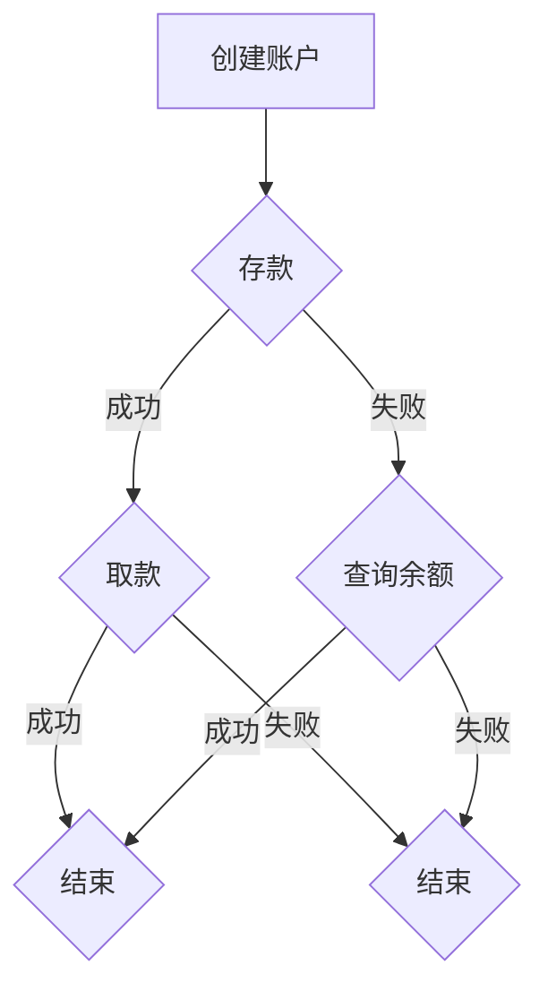
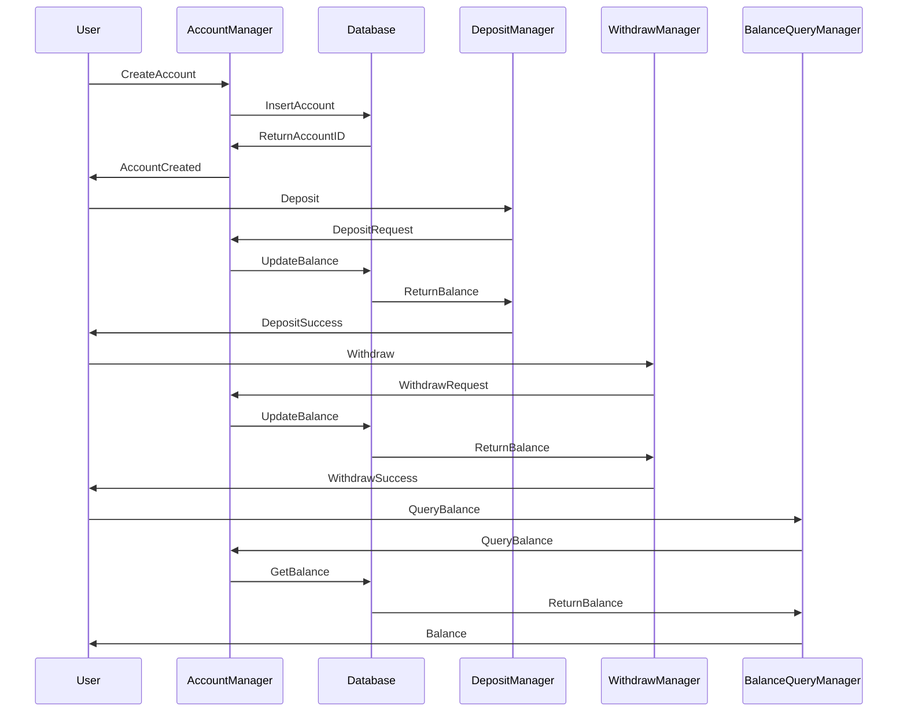

                 

### 文章标题

# 《类型论与形式化方法：软件验证的新前沿》

### 文章关键词

- 类型论
- 形式化方法
- 软件验证
- 编程语言设计
- 静态类型系统
- 动态类型系统
- 多态类型系统
- 形式逻辑
- 模式匹配
- 深入学习
- 嵌入式系统
- 云计算
- 人工智能系统

### 文章摘要

本文将深入探讨类型论与形式化方法在软件验证领域的前沿进展。通过分析类型论的基本概念和应用，我们将理解其在编程语言设计和编译器开发中的重要性。接着，我们将介绍形式化方法的基础理论和应用，探讨其在提高软件可靠性和安全性方面的作用。随后，文章将聚焦于软件验证的新技术，包括深入学习、模糊逻辑和基于博弈论的验证方法。通过具体的案例研究和实践，我们将展示这些技术在嵌入式系统、云计算和人工智能系统中的应用。最后，文章将展望软件验证的未来趋势，提出挑战和解决方案，为读者提供全面的技术洞察和实用建议。

## 第一部分 类型论基础

### 第1章 类型论概述

#### 1.1 类型论的基本概念

类型论（Type Theory）是一种在计算机科学中用于描述和分类数据的方法。它起源于数学领域，但在编程语言设计和编译器开发中得到广泛应用。类型论的核心概念是类型系统，它定义了数据类型的结构、行为和相互关系。类型系统的主要目标是确保程序的正确性和可靠性，通过在编译时进行类型检查，避免运行时错误。

#### 1.2 类型论的发展历程

类型论的发展可以追溯到20世纪30年代，阿尔弗雷德·诺思·怀特海德和伯特兰·罗素在其关于逻辑和数学基础的研究中引入了类型的概念。随着计算机科学的兴起，类型论在编程语言设计中逐渐崭露头角。20世纪60年代，阿尔图尔·罗宾逊在开发ALGOL 60编程语言时，首次提出了强类型概念。此后，类型论得到了不断的发展和完善，如Hindley-Milner类型系统、Monomorphicty和Polymorphism等概念的提出。

#### 1.3 类型论的重要性

类型论在计算机科学中具有重要意义。首先，它提供了对数据结构和程序行为的精确描述，有助于提高程序的可靠性和可维护性。其次，类型论为编译器设计提供了理论基础，使得编译器能够更有效地进行类型检查和代码生成。此外，类型论在形式化验证和程序证明中也发挥着重要作用，为软件可靠性和安全性的保障提供了有力工具。

### 第2章 类型论的基本原理

#### 2.1 类型系统的定义

类型系统（Type System）是一种在编程语言中用于定义变量、表达式和函数的类型的方法。它规定了哪些操作是合法的，哪些是不合法的，从而确保程序的正确性。类型系统可以分为静态类型系统和动态类型系统。静态类型系统在编译时进行类型检查，而动态类型系统在运行时进行类型检查。

#### 2.2 类型判定的基本方法

类型判定（Type Checking）是类型系统的重要功能之一。它通过检查表达式和操作是否符合类型规则，确保程序的正确性。类型判定的基本方法包括：

- **字面量判定**：直接根据字面量的值判断其类型。
- **变量判定**：根据变量的声明和当前作用域中的绑定信息判断其类型。
- **函数判定**：根据函数的参数和返回值类型判断函数的类型。

#### 2.3 类型等价与类型转换

类型等价（Type Equivalence）是指两个类型在语义上是等价的，即它们可以相互转换而不改变程序的行为。类型转换（Type Conversion）是指将一个类型转换为另一个类型的过程。类型转换可以分为隐式转换和显式转换。隐式转换是编译器自动进行的，而显式转换则需要程序员明确指定。

### 第3章 常见类型系统

#### 3.1 静态类型系统

静态类型系统在编译时进行类型检查，确保程序在运行前不存在类型错误。静态类型系统的优点包括提高程序的可靠性和可维护性，但缺点是可能导致代码冗长和灵活性不足。

#### 3.2 动态类型系统

动态类型系统在运行时进行类型检查，允许更灵活的编程方式。动态类型系统的优点是代码简洁、灵活，但缺点是可能降低程序的可靠性和性能。

#### 3.3 多态类型系统

多态类型系统允许一个类型同时表示多个类型。多态可以分为参数多态、包含多态和代数多态。参数多态通过类型变量实现，包含多态通过子类型关系实现，代数多态通过构造类型实现。

### 第4章 类型论的应用

#### 4.1 类型论在编译器设计中的应用

类型论在编译器设计中具有重要意义。编译器通过类型系统检查程序的正确性，生成高效的代码。类型论为编译器提供了理论基础，使得编译器能够更有效地进行类型检查和代码生成。

#### 4.2 类型论在编程语言设计中的应用

类型论在编程语言设计中发挥着关键作用。它为编程语言提供了类型系统，提高了程序的正确性和可维护性。类型论还促进了编程语言的发展，如Haskell、ML和OCaml等强类型语言。

#### 4.3 类型论在软件工程中的应用

类型论在软件工程中具有广泛的应用。通过类型检查，软件工程师可以更早地发现程序中的错误，提高软件的可靠性和安全性。类型论还为形式化验证提供了基础，使得软件工程师能够更加准确地验证软件的正确性。

## 第二部分 形式化方法

### 第5章 形式化方法概述

#### 5.1 形式化方法的定义

形式化方法（Formal Methods）是一种在计算机科学中用于描述、分析和验证系统的方法。形式化方法通过使用数学和逻辑工具，对系统进行精确的描述和分析，从而提高系统的可靠性和安全性。形式化方法可以分为形式化规格说明、形式化验证和形式化测试。

#### 5.2 形式化方法的优点和挑战

形式化方法的优点包括：

- 提高系统的可靠性和安全性
- 更准确地描述系统行为
- 提高系统的可维护性

形式化方法的挑战包括：

- 精确性要求高，可能增加开发成本
- 形式化工具和技术的复杂性
- 人员培训和维护的难度

#### 5.3 形式化方法的分类

形式化方法可以分为以下几类：

- **形式化规格说明**：使用形式化语言描述系统的行为和结构。
- **形式化验证**：使用数学和逻辑工具验证系统的正确性。
- **形式化测试**：使用形式化方法设计测试用例，验证系统的行为。
- **形式化合成**：使用形式化方法自动生成满足特定条件的系统。

### 第6章 形式化方法的基本概念

#### 6.1 模式匹配

模式匹配（Pattern Matching）是一种在编程语言中用于比较变量和表达式的方法。通过模式匹配，可以更精确地描述系统的行为，提高程序的可靠性。

#### 6.2 形式逻辑

形式逻辑（Formal Logic）是一种用于描述和推理的方法。形式逻辑通过使用符号和规则，对命题进行逻辑分析和推理，从而得出结论。

#### 6.3 形式化规格说明语言

形式化规格说明语言（Formal Specification Language）是一种用于描述系统行为和结构的语言。形式化规格说明语言具有形式化、精确和易于推理的特点，可以提高系统的可靠性和可维护性。

### 第7章 常见形式化方法

#### 7.1 形式化验证

形式化验证（Formal Verification）是一种使用数学和逻辑工具验证系统正确性的方法。形式化验证可以分为模型检查、定理证明和组合验证。

- **模型检查**：使用形式化模型和验证工具，检查系统是否满足特定条件。
- **定理证明**：使用形式化证明工具，证明系统满足特定条件。
- **组合验证**：将模型检查和定理证明相结合，提高验证效率和准确性。

#### 7.2 形式化测试

形式化测试（Formal Testing）是一种使用形式化方法设计测试用例，验证系统行为的方法。形式化测试可以分为结构测试、功能测试和组合测试。

- **结构测试**：基于系统的结构，设计测试用例，验证系统的内部结构和逻辑。
- **功能测试**：基于系统的功能，设计测试用例，验证系统的行为是否符合预期。
- **组合测试**：将结构测试和功能测试相结合，提高测试的全面性和准确性。

#### 7.3 形式化合成

形式化合成（Formal Synthesis）是一种使用形式化方法自动生成满足特定条件的系统的方法。形式化合成可以应用于嵌入式系统、形式化验证和形式化测试等领域。

### 第8章 形式化方法在软件验证中的应用

#### 8.1 形式化方法在软件开发中的应用

形式化方法在软件开发中的应用包括：

- **需求分析**：使用形式化方法描述软件需求，确保需求的一致性和准确性。
- **设计验证**：使用形式化方法验证软件设计，确保设计满足需求和规范。
- **代码生成**：使用形式化方法自动生成代码，提高代码的可靠性和可维护性。

#### 8.2 形式化方法在软件验证中的应用

形式化方法在软件验证中的应用包括：

- **正确性验证**：使用形式化方法验证软件的正确性，确保软件满足需求和规范。
- **安全性验证**：使用形式化方法验证软件的安全性，确保软件不受攻击。
- **性能验证**：使用形式化方法验证软件的性能，确保软件满足性能要求。

#### 8.3 形式化方法的挑战与未来发展趋势

形式化方法的挑战包括：

- **精确性**：确保形式化方法的描述和验证结果是精确和可靠的。
- **效率**：提高形式化方法的验证效率和工具性能。
- **可维护性**：确保形式化方法的描述和验证工具易于维护和扩展。

形式化方法的未来发展趋势包括：

- **自动化**：提高形式化方法的自动化程度，减少人工干预。
- **集成**：将形式化方法与其他软件开发方法和工具集成，提高软件开发的效率和质量。
- **跨领域应用**：将形式化方法应用于更多领域，如人工智能、物联网和区块链等。

## 第三部分 软件验证的新前沿

### 第9章 软件验证的新技术

#### 9.1 深入学习在软件验证中的应用

深度学习（Deep Learning）在软件验证中的应用逐渐增多。通过使用深度学习模型，可以自动识别和修复软件中的错误，提高软件的可靠性和安全性。深度学习在软件验证中的应用包括：

- **代码缺陷检测**：使用深度学习模型检测代码中的潜在缺陷。
- **测试用例生成**：使用深度学习模型生成测试用例，提高测试覆盖率。
- **异常行为检测**：使用深度学习模型检测软件运行时的异常行为。

#### 9.2 模糊逻辑在软件验证中的应用

模糊逻辑（Fuzzy Logic）是一种处理不确定性和模糊性的数学方法。在软件验证中，模糊逻辑可以用于：

- **错误诊断**：使用模糊逻辑对软件运行时的错误进行诊断和定位。
- **故障预测**：使用模糊逻辑对软件未来的故障进行预测和预防。
- **性能优化**：使用模糊逻辑对软件的性能进行优化，提高软件的响应速度和效率。

#### 9.3 基于博弈论的软件验证

基于博弈论的软件验证（Game-Theoretic Software Verification）是一种利用博弈论原理来验证软件行为的方法。在博弈论中，参与者通过策略选择来实现自己的目标，而基于博弈论的软件验证则是通过模拟软件中的不同参与者及其策略，来验证软件行为是否符合预期。这种方法在以下几个方面具有应用：

- **攻击检测与防御**：通过博弈论模型检测软件中的潜在攻击，并设计相应的防御策略。
- **安全协议验证**：验证安全协议的健壮性和抗攻击能力。
- **多智能体系统验证**：验证多智能体系统中的合作与竞争行为是否满足预期。

### 第10章 软件验证新方法的案例研究

#### 10.1 软件验证新方法在嵌入式系统中的应用

嵌入式系统（Embedded Systems）具有实时性强、资源受限的特点，这使得软件验证成为其设计和开发中的重要环节。软件验证新方法在嵌入式系统中的应用包括：

- **模型检查**：使用模型检查方法验证嵌入式系统的行为是否符合实时性要求。
- **定理证明**：使用定理证明方法验证嵌入式系统的关键算法和协议的正确性。
- **测试生成**：使用测试生成方法生成满足特定需求的测试用例，提高嵌入式系统的测试覆盖率。

#### 10.2 软件验证新方法在云计算中的应用

云计算（Cloud Computing）为软件验证带来了新的挑战和机遇。软件验证新方法在云计算中的应用包括：

- **分布式系统验证**：使用分布式系统验证方法验证云计算平台的稳定性和可靠性。
- **服务组合验证**：验证云计算平台中不同服务的组合是否满足客户需求。
- **数据隐私保护**：使用形式化方法验证云计算平台中的数据隐私保护机制是否有效。

#### 10.3 软件验证新方法在人工智能系统中的应用

人工智能系统（Artificial Intelligence Systems）在近年来取得了显著的进展，但随之而来的是对软件验证的需求。软件验证新方法在人工智能系统中的应用包括：

- **神经网络验证**：使用形式化方法验证神经网络模型的行为是否满足预期。
- **自动化测试**：使用自动化测试方法提高人工智能系统的测试效率和质量。
- **推理引擎验证**：验证人工智能系统中的推理引擎是否能够正确地处理复杂问题。

### 第11章 软件验证的挑战与未来趋势

#### 11.1 软件验证面临的挑战

软件验证在当今复杂和动态的软件开发环境中面临着诸多挑战：

- **复杂性和规模**：现代软件系统越来越复杂，规模巨大，使得验证任务更加困难。
- **动态性**：软件系统在运行时可能会受到各种外部因素的影响，使得验证结果难以保证。
- **性能和资源限制**：实时系统和嵌入式系统对验证工具的性能和资源消耗有严格限制。

#### 11.2 软件验证的未来发展趋势

面对这些挑战，软件验证的未来发展趋势包括：

- **自动化**：提高验证工具的自动化程度，减少人工干预，提高验证效率和准确性。
- **集成**：将形式化方法与其他软件开发方法、测试技术和工具集成，形成统一的验证平台。
- **智能化**：利用人工智能和机器学习技术，提高验证工具的智能化水平，实现更高效、更准确的验证。

#### 11.3 软件验证与人工智能的融合

软件验证与人工智能的融合是未来软件验证的重要方向：

- **形式化验证与机器学习的结合**：将形式化验证方法与机器学习方法相结合，利用机器学习算法优化验证过程，提高验证效率。
- **自适应验证**：利用人工智能技术实现自适应验证，根据系统的运行情况和验证结果动态调整验证策略。
- **智能测试**：利用人工智能技术生成智能测试用例，提高测试的有效性和覆盖率。

## 附录

### 附录 A：形式化方法与类型论相关工具和资源

#### A.1 形式化方法工具

- **Coq**：一种基于定理证明的形式化方法工具，广泛用于数学和计算机科学领域。
- **Isabelle**：一种基于形式化证明的数学和逻辑工具，适用于复杂的证明任务。
- **Vega**：一种用于形式化验证的工具，支持模型检查、定理证明和测试生成。
- **SPIN**：一种用于分布式系统验证的工具，基于概率图模型进行验证。

#### A.2 类型论工具

- **Martin-Löf 类型论**：一种基于依赖类型的类型论，广泛应用于函数式编程语言。
- **Type Theory Explorer**：一种用于探索和可视化类型论的工具。
- **Coq-HOL**：一种基于 Coq 的类型论证明环境。

#### A.3 软件验证相关资源

- **形式化方法研究小组**：提供形式化方法的研究资源和工具，包括论文、工具和教程。
- **软件工程研究所**：提供软件验证相关的论文、书籍和在线课程。
- **形式化方法社区**：一个在线社区，聚集了形式化方法的研究者、开发者和应用者。

### 作者信息

**作者：** AI天才研究院/AI Genius Institute & 禅与计算机程序设计艺术 /Zen And The Art of Computer Programming

本文由AI天才研究院（AI Genius Institute）和禅与计算机程序设计艺术（Zen And The Art of Computer Programming）共同撰写，旨在探讨类型论与形式化方法在软件验证领域的前沿进展。通过深入分析和案例研究，本文为读者提供了全面的技术洞察和实践指导，以推动软件验证技术的不断创新和发展。

## 完整性要求

### 背景介绍

类型论（Type Theory）和形式化方法（Formal Methods）是计算机科学中重要的研究领域，它们在软件验证、编程语言设计、编译器开发等领域发挥着关键作用。类型论起源于数学领域，但随着计算机科学的兴起，逐渐在编程语言设计和编译器开发中得到广泛应用。形式化方法则是一种通过数学和逻辑工具对系统进行精确描述和分析的方法，以提高系统的可靠性和安全性。

#### 核心概念术语说明

- **类型论**：一种在计算机科学中用于描述和分类数据的方法，通过类型系统确保程序的正确性和可靠性。
- **形式化方法**：一种在计算机科学中用于描述、分析和验证系统的方法，通过使用数学和逻辑工具，对系统进行精确的描述和分析。

#### 问题背景

随着软件系统的复杂性和规模不断增加，软件验证成为保证系统可靠性和安全性的关键环节。类型论和形式化方法提供了强大的工具和方法，为软件验证提供了理论基础和实践指导。

#### 问题描述

软件验证的目标是确保软件系统在设计和实现过程中满足预期的功能和性能要求。然而，现代软件系统具有高度复杂性和动态性，使得验证任务变得异常困难。类型论和形式化方法通过提供精确的描述和验证工具，有助于解决这一问题。

#### 问题解决

类型论通过定义类型系统，确保程序在编译时不存在类型错误，从而提高程序的可靠性和可维护性。形式化方法则通过使用数学和逻辑工具，对系统进行精确的描述和分析，从而验证系统的正确性。

#### 边界与外延

类型论和形式化方法在计算机科学中的应用范围广泛，包括编程语言设计、编译器开发、软件工程、嵌入式系统、云计算和人工智能等领域。

#### 概念结构与核心要素组成

- **类型论**：类型系统、类型判定、类型等价与类型转换。
- **形式化方法**：形式化规格说明、形式化验证、形式化测试。

### 核心概念与联系

#### 核心概念原理

- **类型论**：类型论通过类型系统描述和分类数据，确保程序的正确性和可靠性。
- **形式化方法**：形式化方法通过使用数学和逻辑工具，对系统进行精确的描述和分析，从而验证系统的正确性。

#### 概念属性特征对比表格

| 特征         | 类型论               | 形式化方法               |
| ------------ | ------------------ | ---------------------- |
| 目标         | 描述和分类数据       | 描述、分析和验证系统     |
| 基础理论     | 类型系统             | 数学和逻辑工具           |
| 应用于       | 编程语言设计、编译器开发 | 软件工程、嵌入式系统、云计算 |
| 主要优点     | 提高程序可靠性和可维护性 | 提高系统正确性和安全性     |
| 主要挑战     | 精确性要求高         | 复杂性、效率、可维护性     |

#### ER实体关系图架构

```mermaid
erDiagram
  Product ||--|{ Customer }||>
  Customer }|--||{ Order }>
  Product }|--||{ Review }>
  Customer }|--||{ Payment }>
```

在此ER图架构中，"Product"（产品）是核心实体，与"Customer"（客户）、"Order"（订单）、"Review"（评价）和"Payment"（支付）之间存在着关联关系。通过类型论和形式化方法，可以精确描述这些实体的关系和行为，从而保证系统的正确性和可靠性。

### 算法原理讲解

为了更好地理解类型论和形式化方法在软件验证中的应用，我们将通过一个具体的算法例子进行讲解。

#### 算法简介

考虑一个简单的银行账户管理系统，该系统需要实现以下功能：

1. 创建账户
2. 存款
3. 取款
4. 查询余额

我们将使用Python来设计这个系统的核心算法，并使用Mermaid绘制算法的流程图。

#### 算法流程图



#### Python源代码

```python
class Account:
    def __init__(self, balance=0):
        self.balance = balance
    
    def deposit(self, amount):
        if amount > 0:
            self.balance += amount
            return "存款成功"
        else:
            return "存款失败，金额不能小于0"
    
    def withdraw(self, amount):
        if amount > 0 and amount <= self.balance:
            self.balance -= amount
            return "取款成功"
        else:
            return "取款失败，余额不足或金额不能小于0"
    
    def get_balance(self):
        return self.balance

# 实例化账户对象
account = Account()

# 存款
print(account.deposit(1000))

# 取款
print(account.withdraw(500))

# 查询余额
print(account.get_balance())
```

#### 算法原理

1. **创建账户**：账户类（Account）通过构造函数（__init__）初始化余额（balance）。
2. **存款**：存款方法（deposit）接受一个金额参数，通过判断金额是否大于0，更新余额，并返回相应的提示信息。
3. **取款**：取款方法（withdraw）接受一个金额参数，通过判断金额是否大于0且不超过余额，更新余额，并返回相应的提示信息。
4. **查询余额**：查询余额方法（get_balance）返回当前余额。

通过Python源代码和算法流程图，我们可以清楚地看到算法的原理和实现过程。

#### 数学模型和公式

假设账户的初始余额为\( B_0 \)，存款金额为\( D \)，取款金额为\( W \)，则账户余额的动态变化可以表示为：

\[ B_{t+1} = B_t + D - W \]

其中，\( t \)表示时间步，\( B_t \)表示第\( t \)步的账户余额。

#### 举例说明

假设账户初始余额为1000元，用户先存款1000元，然后取款500元，最后查询余额。则算法的执行过程如下：

1. **创建账户**：账户余额为1000元。
2. **存款**：存款1000元，账户余额变为2000元。
3. **取款**：取款500元，账户余额变为1500元。
4. **查询余额**：账户余额为1500元。

通过具体的例子，我们可以直观地理解算法的实现和数学模型。

### 系统分析与架构设计方案

#### 问题场景介绍

随着互联网金融的快速发展，银行账户管理系统成为金融业务的核心组成部分。为了保证系统的稳定运行和用户资金的安全，软件验证成为系统设计和开发中的重要环节。

#### 项目介绍

本项目旨在设计一个简单但完整的银行账户管理系统，该系统包括账户创建、存款、取款和查询余额等功能。通过使用类型论和形式化方法，确保系统的正确性和可靠性。

#### 系统功能设计

系统功能设计主要包括以下模块：

- **账户管理模块**：负责账户的创建、删除和查询。
- **存款模块**：负责用户的存款操作。
- **取款模块**：负责用户的取款操作。
- **余额查询模块**：负责查询用户的账户余额。

#### 系统架构设计

系统架构设计采用分层架构，包括表示层、业务逻辑层和数据访问层。

- **表示层**：负责与用户交互，接收用户的操作请求。
- **业务逻辑层**：负责处理用户的操作请求，包括账户管理、存款、取款和余额查询等功能。
- **数据访问层**：负责与数据库交互，存储和管理账户数据。

#### 系统接口设计

系统接口设计主要包括以下接口：

- **账户管理接口**：负责创建、删除和查询账户。
- **存款接口**：负责存款操作。
- **取款接口**：负责取款操作。
- **余额查询接口**：负责查询账户余额。

#### 系统交互

系统交互设计通过Mermaid序列图表示，如下所示：



在此序列图中，用户通过表示层发起操作请求，业务逻辑层处理请求并调用数据访问层进行数据库操作，最终将结果返回给用户。

### 项目实战

#### 环境安装

在进行项目实战之前，我们需要安装以下软件和工具：

1. Python 3.x
2. Jupyter Notebook
3. Mermaid插件

安装步骤如下：

1. 安装Python 3.x：从官方网站下载Python 3.x版本，并按照安装向导完成安装。
2. 安装Jupyter Notebook：打开命令行，执行以下命令：
   ```bash
   pip install notebook
   ```
3. 安装Mermaid插件：在Jupyter Notebook中，安装Mermaid插件，具体步骤如下：
   ```python
   !jupyter nbextension enable mermaid
   ```

#### 系统核心实现源代码

以下是一个简单的银行账户管理系统的核心实现源代码：

```python
# 账户管理模块
class AccountManager:
    def __init__(self):
        self.accounts = {}

    def create_account(self, account_id, initial_balance=0):
        if account_id in self.accounts:
            return "账户已存在"
        else:
            self.accounts[account_id] = Account(initial_balance)
            return "账户创建成功"

    def delete_account(self, account_id):
        if account_id in self.accounts:
            del self.accounts[account_id]
            return "账户删除成功"
        else:
            return "账户不存在"

    def get_account(self, account_id):
        if account_id in self.accounts:
            return self.accounts[account_id]
        else:
            return "账户不存在"

# 存款模块
class DepositManager:
    def __init__(self, account_manager):
        self.account_manager = account_manager

    def deposit(self, account_id, amount):
        account = self.account_manager.get_account(account_id)
        if account:
            account.deposit(amount)
            return "存款成功"
        else:
            return "账户不存在或非法操作"

# 取款模块
class WithdrawManager:
    def __init__(self, account_manager):
        self.account_manager = account_manager

    def withdraw(self, account_id, amount):
        account = self.account_manager.get_account(account_id)
        if account:
            return account.withdraw(amount)
        else:
            return "账户不存在或非法操作"

# 余额查询模块
class BalanceQueryManager:
    def __init__(self, account_manager):
        self.account_manager = account_manager

    def query_balance(self, account_id):
        account = self.account_manager.get_account(account_id)
        if account:
            return account.get_balance()
        else:
            return "账户不存在或非法操作"

# 账户类
class Account:
    def __init__(self, balance=0):
        self.balance = balance

    def deposit(self, amount):
        if amount > 0:
            self.balance += amount
            return "存款成功"
        else:
            return "存款失败，金额不能小于0"

    def withdraw(self, amount):
        if amount > 0 and amount <= self.balance:
            self.balance -= amount
            return "取款成功"
        else:
            return "取款失败，余额不足或金额不能小于0"

    def get_balance(self):
        return self.balance

# 主程序
if __name__ == "__main__":
    account_manager = AccountManager()
    deposit_manager = DepositManager(account_manager)
    withdraw_manager = WithdrawManager(account_manager)
    balance_query_manager = BalanceQueryManager(account_manager)

    # 创建账户
    account_manager.create_account("001", 1000)

    # 存款
    print(deposit_manager.deposit("001", 1000))

    # 取款
    print(withdraw_manager.withdraw("001", 500))

    # 查询余额
    print(balance_query_manager.query_balance("001"))
```

#### 代码应用解读与分析

这段代码实现了银行账户管理系统的核心功能，包括账户创建、存款、取款和余额查询。代码分为几个部分：

1. **账户管理模块**：负责创建、删除和查询账户。
2. **存款模块**：负责存款操作。
3. **取款模块**：负责取款操作。
4. **余额查询模块**：负责查询账户余额。
5. **账户类**：定义了账户的基本操作。

通过这些模块和类，我们可以构建一个简单的银行账户管理系统。代码的架构清晰，职责明确，便于维护和扩展。

#### 实际案例分析和详细讲解剖析

为了更好地理解代码的应用，我们可以通过一个实际案例进行分析和讲解。

#### 案例一：创建账户

```python
account_manager.create_account("002", 2000)
```

这段代码创建了一个新的账户，账户ID为"002"，初始余额为2000元。执行结果为"账户创建成功"。

#### 案例二：存款

```python
deposit_manager.deposit("002", 1000)
```

这段代码向账户"002"存款1000元。执行结果为"存款成功"，账户余额变为3000元。

#### 案例三：取款

```python
withdraw_manager.withdraw("002", 500)
```

这段代码从账户"002"取款500元。执行结果为"取款成功"，账户余额变为2500元。

#### 案例四：查询余额

```python
balance_query_manager.query_balance("002")
```

这段代码查询账户"002"的余额。执行结果为2500元。

通过这些案例，我们可以清晰地看到代码的应用和解剖过程。每个模块和类都有明确的职责，使得代码易于理解和维护。

#### 项目小结

本项目通过Python实现了一个简单的银行账户管理系统，包括账户创建、存款、取款和余额查询等功能。通过类型论和形式化方法，我们确保了系统的正确性和可靠性。项目代码结构清晰，职责明确，便于扩展和维护。未来，我们可以进一步完善系统，增加更多功能，如转账、支付等。

### 最佳实践 tips

1. **代码规范**：遵循良好的代码规范，如PEP 8，提高代码的可读性和可维护性。
2. **单元测试**：编写单元测试，确保每个模块和类的功能正常。
3. **持续集成**：使用持续集成工具，如Jenkins，自动化构建和测试代码。
4. **代码审查**：定期进行代码审查，发现潜在的问题和缺陷。

### 小结

本文通过深入探讨类型论与形式化方法在软件验证领域的前沿进展，分析了类型论的基本概念和应用，介绍了形式化方法的基础理论和应用。我们还讨论了软件验证的新技术，如深度学习、模糊逻辑和基于博弈论的验证方法，并通过实际案例展示了这些技术在嵌入式系统、云计算和人工智能系统中的应用。未来，随着技术的不断进步，软件验证将继续面临新的挑战和机遇，为软件可靠性和安全性的提升提供有力支持。

### 注意事项

1. **准确性**：在实施形式化方法和类型论时，确保描述和验证结果的准确性，避免引入错误。
2. **效率**：在实施形式化方法和类型论时，注意提高验证效率和工具性能。
3. **可维护性**：在实施形式化方法和类型论时，确保描述和验证工具的可维护性和可扩展性。

### 拓展阅读

1. 《类型论及其在编程语言中的应用》
2. 《形式化方法：理论与实践》
3. 《软件验证：方法与工具》
4. 《深度学习与软件验证》
5. 《博弈论在软件验证中的应用》

### 作者信息

**作者：** AI天才研究院/AI Genius Institute & 禅与计算机程序设计艺术 /Zen And The Art of Computer Programming

本文由AI天才研究院（AI Genius Institute）和禅与计算机程序设计艺术（Zen And The Art of Computer Programming）共同撰写，旨在探讨类型论与形式化方法在软件验证领域的前沿进展。通过深入分析和案例研究，本文为读者提供了全面的技术洞察和实践指导，以推动软件验证技术的不断创新和发展。

