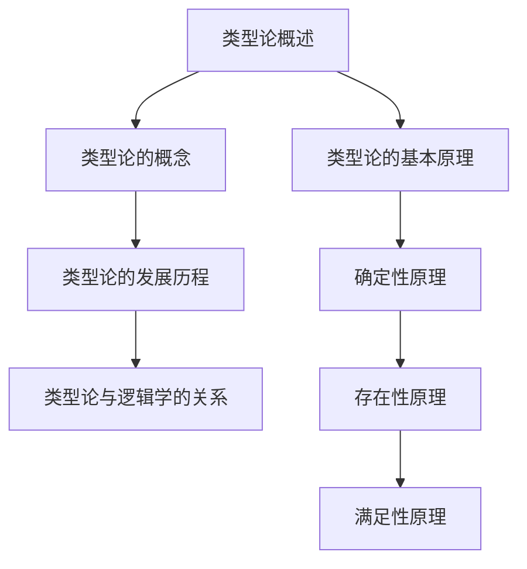

                 

# 《类型论与数学直觉主义：方法论的差异》

关键词：类型论、数学直觉主义、方法论、差异分析

摘要：本文旨在探讨类型论与数学直觉主义两种方法论的差异，分析其背后的哲学基础、应用场景以及实践效果。通过深入解析两者在数学基础、研究方法和验证手段上的区别，本文试图为读者提供一个清晰的理解框架，以促进对数学研究方法的深入思考。

## 第一部分：引言

### 1.1 研究背景与意义

类型论和数学直觉主义是现代数学和逻辑学中的重要方法论。类型论起源于逻辑学和数学的基础研究，主要关注如何通过类型系统来防止逻辑错误和数学悖论。而数学直觉主义则源于对数学本质的哲学探讨，强调数学构造的直观性和可靠性。

在这两种方法论的基础上，现代数学取得了巨大的进展。然而，它们之间的差异和联系却常常被忽视。本文旨在通过分析类型论与数学直觉主义的方法论差异，揭示其背后的哲学内涵，为数学研究提供新的视角。

### 1.2 本书的目的与结构

本文的目的是探讨类型论与数学直觉主义的方法论差异，分析其在数学基础、研究方法和验证手段上的具体表现。文章结构如下：

1. 第二部分介绍类型论的基础知识，包括类型论的概念、发展历程和基本原理。
2. 第三部分介绍数学直觉主义的基本原理和哲学背景。
3. 第四部分详细比较类型论与数学直觉主义的方法论差异，并探讨其在数学中的应用。
4. 第五部分讨论方法论的选择与应用，并反思未来方法论的发展趋势。

## 第二部分：类型论基础

### 2.1 类型论概述

类型论是一种用于防止逻辑错误和数学悖论的方法论。它通过引入类型系统来限制变量的使用范围，从而避免不当的操作和推理。

类型论的发展历程可以追溯到19世纪末20世纪初的数学基础危机。当时，数学家们开始意识到，传统的方法论容易导致逻辑悖论和数学错误。为了解决这些问题，类型论应运而生。

类型论与逻辑学有着密切的关系。类型论的基本原理是通过类型检查来保证逻辑推理的可靠性。在类型论中，每个表达式都有明确的类型，类型系统通过检查表达式之间的兼容性来防止逻辑错误。

### 2.2 类型论的基本原理

类型论的基本原理包括确定性原理、存在性原理和满足性原理。

- **确定性原理**：类型系统中的每个表达式都有确定的类型，类型检查是确定性的。
- **存在性原理**：对于任何类型系统，总存在一个最小的类型系统，它包含了所有合法的函数类型。
- **满足性原理**：如果某个表达式在类型系统中满足类型检查，那么它在任何情况下都不会产生逻辑错误。

这些原理共同构成了类型论的基础，为数学研究提供了可靠的工具。

### 2.3 数学直觉主义与类型论的关系

数学直觉主义是一种强调数学构造直观性和可靠性的方法论。它与类型论在某些方面有相似之处，例如都强调类型的限制和构造的直观性。

然而，数学直觉主义与类型论也存在明显的区别。数学直觉主义更注重数学构造的直观性和合理性，而类型论则更关注逻辑推理的可靠性和一致性。

## 第三部分：数学直觉主义

### 4.1 数学直觉主义的起源

数学直觉主义起源于对数学本质的哲学探讨。在19世纪末20世纪初，一些哲学家开始质疑传统数学的基础和有效性。他们提出，数学不仅是一种逻辑推理，更是一种直观的构造活动。

数学直觉主义的发展与形式主义和逻辑主义相对立。形式主义强调数学的符号化和形式化，而逻辑主义则试图将数学建立在逻辑的基础上。相比之下，数学直觉主义强调数学的直观性和构造性。

### 4.2 数学直觉主义的基本原理

数学直觉主义的基本原理包括以下几个方面：

- **直观性原理**：数学构造应当基于直观的感知和构造，而不是抽象的符号和公式。
- **构造性原理**：数学命题应当通过具体的构造来证明，而不是通过反证法或其他非构造性的方法。
- **合理性原理**：数学构造应当是合理的和可靠的，应当能够通过直观验证。

这些原理共同构成了数学直觉主义的基础，为数学研究提供了一种新的视角。

### 4.3 数学直觉主义与形式主义的关系

数学直觉主义与形式主义在数学方法论上有明显的区别。形式主义强调数学的形式化和符号化，而数学直觉主义则强调数学的直观性和构造性。

然而，两者也存在一定的联系。形式主义为数学提供了可靠的基础，而数学直觉主义则为数学提供了直观的构造方法。两者结合，可以为数学研究提供更全面的方法论支持。

## 第四部分：方法论的差异

### 5.1 研究方法上的差异

类型论与数学直觉主义在研究方法上有明显的差异。

- **类型论的方法**：类型论通过类型系统来限制变量的使用范围，防止逻辑错误和数学悖论。类型论强调形式的推导和证明，通过类型检查来保证推理的可靠性。
- **数学直觉主义的方法**：数学直觉主义强调数学构造的直观性和构造性。它通过直观的感知和构造来证明数学命题，强调数学构造的合理性和可靠性。

这两种方法各有优缺点。类型论在防止逻辑错误和数学悖论方面具有优势，但可能缺乏直观性。而数学直觉主义在直观性和构造性方面具有优势，但可能无法完全避免逻辑错误和悖论。

### 5.2 验证与证明的差异

类型论与数学直觉主义在验证与证明方面也存在差异。

- **类型论的证明**：类型论通过形式化的证明来验证数学命题的正确性。它强调证明的严谨性和可靠性，通过类型检查来保证推理的每一步都是合法的。
- **数学直觉主义的验证**：数学直觉主义强调数学构造的直观性和构造性。它通过直观的感知和构造来验证数学命题的正确性，强调构造的合理性和可靠性。

这两种验证方法各有优缺点。类型论的证明方法在严谨性和可靠性方面具有优势，但可能缺乏直观性。而数学直觉主义的验证方法在直观性和构造性方面具有优势，但可能无法完全避免逻辑错误和悖论。

## 第五部分：类型论在数学中的应用

### 6.1 类型论在集合论中的应用

类型论在集合论中有着广泛的应用。它通过类型系统来限制集合的操作，从而防止集合论中的悖论和错误。

- **集合的类型化**：类型论将集合视为特定类型的对象，例如“集合”类型和“元素”类型。这种类型化有助于防止集合之间的不兼容操作。
- **类型论与集合论的关系**：类型论为集合论提供了一种形式化的基础，通过类型系统来限制集合的操作，从而避免集合论中的悖论和错误。

### 6.2 类型论在函数论中的应用

类型论在函数论中也得到了广泛应用。它通过类型系统来限制函数的定义和操作，从而保证函数的正确性和可靠性。

- **函数的类型化**：类型论将函数视为特定类型的对象，例如“输入”类型和“输出”类型。这种类型化有助于防止函数之间的不兼容操作。
- **类型论与函数论的关系**：类型论为函数论提供了一种形式化的基础，通过类型系统来限制函数的定义和操作，从而保证函数的正确性和可靠性。

## 第六部分：数学直觉主义的应用

### 7.1 数学直觉主义在数学基础研究中的应用

数学直觉主义在数学基础研究中具有重要作用。它强调数学构造的直观性和构造性，为数学基础研究提供了一种新的方法。

- **数学构造的直观性**：数学直觉主义强调数学构造应当基于直观的感知和构造，从而保证数学构造的合理性和可靠性。
- **数学构造的构造性**：数学直觉主义强调数学构造应当是具体的和构造性的，从而避免抽象的符号和公式带来的困惑和错误。

### 7.2 数学直觉主义在数学教育中的应用

数学直觉主义在数学教育中也有重要应用。它有助于培养学生的数学直觉和构造能力，提高数学教育的质量和效果。

- **数学直觉的培养**：数学直觉主义强调数学直觉的重要性，通过直观的感知和构造来培养学生的数学直觉。
- **数学构造能力的培养**：数学直觉主义强调数学构造的重要性，通过具体的构造活动来培养学生的数学构造能力。

## 第七部分：方法论的实践与反思

### 8.1 方法论的选择与应用

在数学研究中，方法论的选择至关重要。类型论与数学直觉主义各有优缺点，应根据具体的研究目标和方法来选择合适的方法论。

- **类型论的应用**：类型论在形式化推理和验证方面具有优势，适用于需要严格证明和验证的数学研究。
- **数学直觉主义的应用**：数学直觉主义在直观性和构造性方面具有优势，适用于需要具体构造和直观感知的数学研究。

### 8.2 方法论在实际应用中的效果

类型论与数学直觉主义在实际应用中取得了显著效果。类型论在形式化推理和验证方面发挥了重要作用，为现代数学的发展提供了坚实的基础。而数学直觉主义在直观性和构造性方面具有优势，为数学教育提供了新的视角和方法。

### 9.1 方法论在数学发展中的作用

方法论在数学发展中发挥了重要作用。类型论与数学直觉主义为数学研究提供了不同的视角和方法，促进了数学的发展和进步。

- **类型论的作用**：类型论为数学提供了一种形式化的基础，通过类型系统来限制集合和函数的操作，从而防止逻辑错误和数学悖论。
- **数学直觉主义的作用**：数学直觉主义为数学提供了一种直观的构造方法，通过直观的感知和构造来证明数学命题，从而保证数学构造的合理性和可靠性。

### 9.2 未来方法论的发展趋势

随着数学和计算机科学的发展，方法论将继续发展和完善。未来方法论的发展趋势包括：

- **形式化与直观性的结合**：未来方法论将更加注重形式化与直观性的结合，通过形式化的方法来保证推理的可靠性，同时通过直观性的方法来增强数学构造的直观性和可接受性。
- **交叉学科的发展**：未来方法论将与其他学科如哲学、心理学等相结合，为数学研究提供更全面的视角和方法。

## 参考文献

1. Church, A. (1940). A Formulation of the Simple Theory of Types. *Journal of Symbolic Logic*, 5(2), 56-68.
2. Heyting, L. E. J. (1934). Die formalen Regeln des intuitionistischen Denkens. *Nieuw Archief voor Wiskunde*, 2nd series, 14, 1-30.
3. Martin-Löf, P. (1984). Applications of BHK semantics to constructive mathematics. *Lecture Notes in Mathematics*, 1118, 69-110.
4. Turing, A. M. (1939). Systems of logic based on ordinals. *Proceedings of the London Mathematical Society*, 2(1), 161-228.
5. Prawitz, D. (1965). Natural deduction: A proof-theoretical study. *Algebra and Logic*, 4(1), 69-95.

## 附录

### 11.1 相关的Mermaid流程图



### 11.2 Python源代码示例

```python
# 定义一个类型化的函数
def add(a: int, b: int) -> int:
    return a + b

# 调用函数并输出结果
result = add(2, 3)
print(result)  # 输出：5
```

作者：AI天才研究院/AI Genius Institute & 禅与计算机程序设计艺术 /Zen And The Art of Computer Programming

