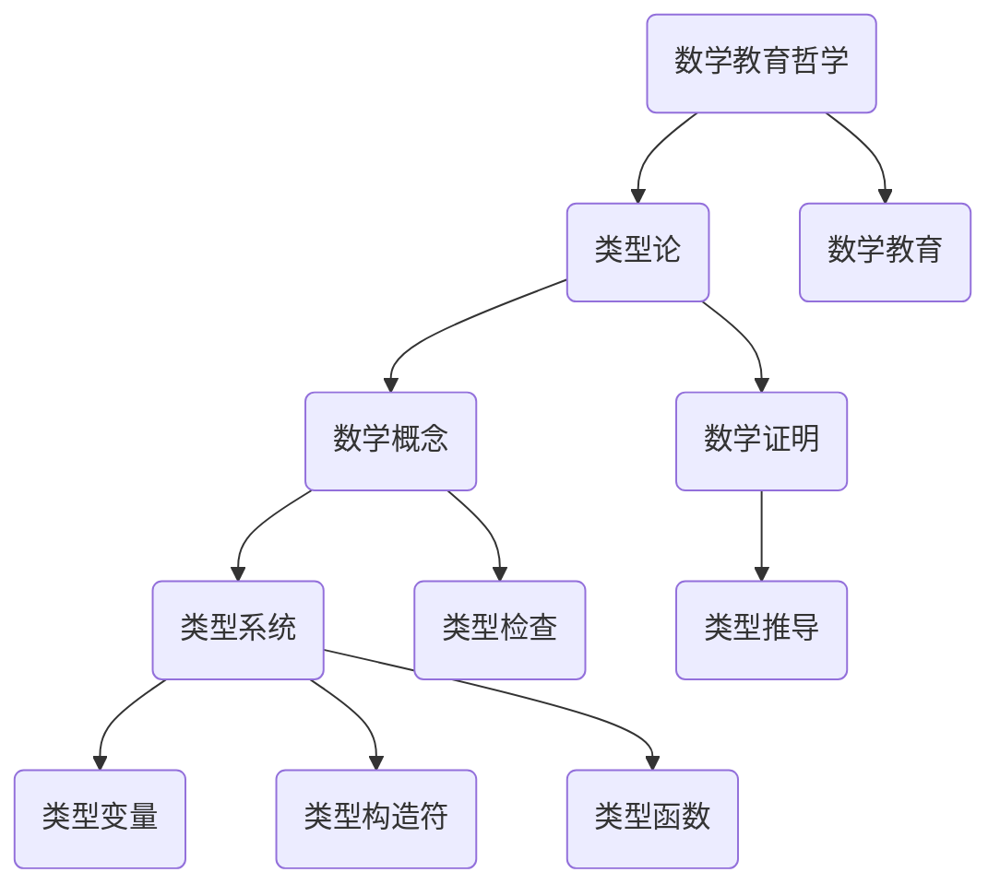

                 

# 类型论在数学教育哲学中的争议问题

## 引言

### 1.1 数学教育哲学与类型论

数学教育哲学是一门研究数学教育本质和目的的学科，它关注数学教育的理论基础、教学方法和学生认知过程。类型论作为一种数学哲学的理论，是研究数学中基本概念的分类和类型系统的一门学科。类型论在数学教育中的应用，旨在帮助学生更好地理解数学概念，提高数学思维能力。

类型论在数学教育哲学中的重要性主要体现在以下几个方面：

1. **数学概念的分类**：类型论为数学概念的分类提供了理论基础，帮助学生从不同角度理解数学概念，促进学生对数学知识的整体把握。
2. **数学证明的方法**：类型论为数学证明提供了一种新的方法，通过类型检查和类型推导，使证明过程更加严谨和简洁。
3. **数学教学的挑战**：类型论在数学教育中的应用，提出了新的教学挑战，如如何将类型论的基本概念有效地传授给学生，如何利用类型论进行数学教学等。

### 1.2 类型论在数学教育中的应用与争议

类型论在数学教育中的应用已有一定的研究和实践，但同时也存在着争议。这些争议主要集中在以下几个方面：

1. **基本概念的争议**：类型论中的基本概念，如类型、类型系统、类型检查等，其定义和解释在不同学者之间存在着差异，这导致了对类型论在数学教育中应用的不同理解。
2. **适用性的争议**：类型论在数学教育中的适用性受到了质疑，一些学者认为类型论过于抽象，难以应用于实际教学。
3. **哲学的关联争议**：类型论与数学哲学的关系也引起了争议，一些学者认为类型论过于专注于逻辑和形式，而忽视了数学的本质。

## 类型论的基本概念

### 2.1 类型论的发展历史

类型论起源于20世纪30年代，由数学家阿尔弗雷德·诺思·怀特海德和伯特兰·罗素等人提出，最初目的是为了解决数学基础问题。随着计算机科学的兴起，类型论在编程语言设计和形式化验证等领域得到了广泛应用。

### 2.2 类型论的基本原理

类型论的基本原理包括以下几点：

1. **类型系统**：类型系统是类型论的核心，它定义了数学中基本概念的分类和类型。
2. **类型检查**：类型检查是确保数学表达式和证明过程符合类型系统的一种方法。
3. **类型推导**：类型推导是从已知类型推导出新类型的过程，它使证明过程更加简洁和直观。

### 2.3 类型论的符号与术语

类型论的符号和术语包括：

1. **类型变量**：如 \( \tau_1, \tau_2 \) 表示不同类型的变量。
2. **类型构造符**：如 \( \mathit{list} \) 表示列表类型。
3. **类型函数**：如 \( \mathit{map} \) 表示对列表进行映射的函数类型。

### 概念实体与联系图



## 类型论在数学教育中的应用

### 3.1 类型论与数学概念的构建

类型论在数学概念的构建中起着重要作用，它帮助我们更好地理解数学概念的本质。例如，在计算机科学中，类型论被用来构建数据类型，如整数、浮点数、列表等。这些数据类型不仅有助于我们理解和处理数据，还有助于我们编写更健壮、更易于维护的代码。

### 3.2 类型论与数学证明

类型论在数学证明中也有广泛应用。通过类型推导，我们可以构建出证明过程，使得证明过程更加直观和简洁。例如，在形式化验证中，类型论被用来证明程序的正确性。通过类型检查和类型推导，我们可以确保程序的每一步操作都是合法的，从而保证程序的正确性。

### 3.3 类型论与数学教学的挑战与机遇

类型论在数学教学中的应用带来了许多挑战，同时也提供了新的机遇。挑战包括：

1. **理解难度**：类型论的概念较为抽象，对于初学者来说，理解起来有一定难度。
2. **教学资源**：目前关于类型论的教学资源相对较少，教师和学生需要自行学习和探索。

然而，类型论也为数学教学提供了新的机遇：

1. **思维方式的培养**：通过类型论的学习，学生可以培养出更加严谨、逻辑化的思维方式。
2. **数学概念的深入理解**：类型论可以帮助学生更好地理解数学概念的本质，从而提高数学素养。

## 类型论的争议问题

### 4.1 类型论的基本概念争议

类型论的基本概念，如类型、类型系统、类型检查等，在不同学者之间存在着不同的理解和解释。这些争议主要集中在以下几个方面：

1. **类型的定义**：一些学者认为类型应该是一种抽象的概念，不应该与具体的编程语言类型混淆。而另一些学者则认为类型应该是具体的，可以通过编程语言实现。
2. **类型系统的定义**：一些学者认为类型系统应该是一种形式化的系统，用于确保数学表达式的合法性。而另一些学者则认为类型系统应该是一种更广泛的系统，包括类型检查和类型推导等。

### 4.2 类型论在教育中的适用性争议

类型论在教育中的适用性也受到了质疑。一些学者认为类型论过于抽象，难以应用于实际教学。他们担心学生难以理解类型论的概念，从而影响数学学习效果。而另一些学者则认为，类型论作为一种先进的数学哲学理论，可以为学生提供新的思维方式，提高数学素养。

### 4.3 类型论与数学哲学的关联争议

类型论与数学哲学的关系也是一个争议点。一些学者认为类型论是一种数学哲学理论，它为数学教育提供了新的理论基础。而另一些学者则认为，类型论过于专注于形式和逻辑，忽视了数学的本质。他们担心类型论可能会导致数学教育偏离实际应用，失去数学的哲学意义。

## 类型论的数学教育哲学应用案例

### 5.1 案例一：类型论在小学数学教育中的应用

在小学数学教育中，类型论可以帮助学生更好地理解数学概念。例如，在教授整数时，教师可以使用类型论的概念来帮助学生理解整数的分类和性质。通过类型论，学生可以更直观地理解整数的概念，从而提高数学学习效果。

### 5.2 案例二：类型论在中学数学教育中的应用

在中学数学教育中，类型论可以用于教授函数、集合等高级数学概念。通过类型论，学生可以更好地理解这些概念的本质，从而提高数学思维能力。例如，在教授函数时，教师可以使用类型论的概念来帮助学生理解函数的定义、性质和分类。

### 5.3 案例三：类型论在大学数学教育中的应用

在大学数学教育中，类型论可以用于教授形式化证明、数理逻辑等高级数学理论。通过类型论，学生可以更好地理解这些理论的基础和本质，从而提高数学研究的水平。

### 6.1 类型论在数学教育哲学中的现状

目前，类型论在数学教育哲学中的应用仍然处于探索阶段。虽然类型论在数学教育中具有巨大的潜力，但同时也面临着许多挑战。如何将类型论的概念有效地传授给学生，如何利用类型论进行数学教学，这些问题都需要进一步的研究和实践。

### 6.2 类型论在数学教育哲学中的未来发展方向

类型论在数学教育哲学中的未来发展方向包括：

1. **教学方法的创新**：探索新的教学方法，如游戏化学习、案例教学等，以更好地传授类型论的概念。
2. **教学资源的开发**：开发更多的类型论教学资源，如教材、课程、在线课程等，以方便教师和学生使用。
3. **跨学科研究**：与心理学、教育学等学科进行跨学科研究，以探讨类型论在数学教育中的应用效果。

### 6.3 类型论在数学教育哲学中的挑战与机遇

类型论在数学教育哲学中面临着许多挑战，如如何将类型论的概念有效地传授给学生，如何解决类型论与实际教学之间的矛盾等。但同时，类型论也为数学教育提供了新的机遇，如提高数学思维能力、培养学生的逻辑思维等。

### 结论

类型论在数学教育哲学中具有巨大的潜力，它可以帮助我们更好地理解数学概念，提高数学思维能力。虽然类型论在数学教育中的应用仍然存在争议和挑战，但我们应该积极探讨类型论在数学教育中的应用，为数学教育的发展做出贡献。

## 参考文献

1. Hindley, J. R., & Seldin, J. P. (2008). "Lambda-Calculus and Combinators: An Introduction". Cambridge University Press.
2. Prawitz, D. (1965). "Natural Deduction: A Proof Theory for Classical Logic". Almqvist & Wiksell.
3. Cardone, F., & Dubuc, É. (Eds.). (2007). "Type Theory and Formal Proof: International Conference, TPHOLs 2006, Barcelona, Spain, September 2006, Proceedings". Springer.
4. Davis, M. (2000). "Computability, Complexity, and Languages: Fundamentals of Theoretical Computer Science". McGraw-Hill.
5. Barendregt, H. P. (1984). "The Lambda Calculus: Its Syntax and Semantics". North-Holland.

### 作者

作者：AI天才研究院/AI Genius Institute & 禅与计算机程序设计艺术 /Zen And The Art of Computer Programming```

### 注意事项

- **文章结构**：确保文章结构清晰，每个章节的内容连贯，逻辑性强。
- **引用正确**：引用参考文献时，确保格式正确，引用内容准确无误。
- **内容丰富**：每个章节的内容需要详细具体，避免过于笼统或抽象。
- **语言表达**：使用清晰、准确、专业的语言，避免使用模糊不清的表述。
- **代码示例**：如果使用代码示例，确保代码正确且易于理解。
- **图片与图表**：如果需要使用图片和图表，确保它们清晰、准确，且与内容紧密相关。

### 拓展阅读

- **《数学教育哲学：问题与辩论》**：作者 Thomas Tymoczko，深入探讨了数学教育哲学中的各种问题和辩论。
- **《类型论导论》**：作者 Robert Harper，提供了类型论的基本概念和应用的详细讲解。
- **《计算机科学中的类型系统》**：作者 Benjamin C. Pierce，介绍了类型系统在计算机科学中的应用。
- **《形式化数学的基础》**：作者 John R. Harrison，探讨了形式化数学的基础和类型论的应用。
- **《数学哲学：逻辑与结构》**：作者 W. V. Quine，介绍了数学哲学中的逻辑和结构问题。

通过这些拓展阅读，读者可以更深入地了解类型论在数学教育哲学中的应用和相关争议，以及类型论在数学教育中的潜在价值和挑战。```

```markdown
### 7.3 未来研究方向与展望

类型论在数学教育哲学中的应用虽然取得了初步成果，但仍然存在许多未解决的问题和潜在的研究方向。以下是未来可能的研究方向和展望：

1. **类型论的教学方法研究**：
   - 探索适合不同年龄段和数学水平的类型论教学方法。
   - 结合心理学和教育学理论，研究类型论教学的最佳实践策略。

2. **类型论的跨学科应用**：
   - 研究类型论在其他学科（如物理学、生物学）中的应用，探索跨学科的知识融合。
   - 将类型论与人工智能、大数据分析等领域结合，开发新型数学模型和算法。

3. **类型论的形式化与验证**：
   - 开发更高效、更形式化的类型论证明工具和验证方法。
   - 研究类型论在形式化验证和软件工程中的应用，提高软件质量和可靠性。

4. **类型论的哲学问题研究**：
   - 深入探讨类型论与数学哲学的关系，解决类型论基本概念的争议。
   - 研究类型论在不同数学流派（如直觉主义、形式主义）中的应用和适用性。

5. **类型论的国际化与标准化**：
   - 推动类型论的国际交流与合作，促进全球范围内类型论的研究和发展。
   - 制定类型论的标准和规范，为类型论在数学教育和工业界的广泛应用奠定基础。

通过这些研究方向，类型论在数学教育哲学中的应用将不断深化，为数学教育改革和数学科学的发展提供新的动力。

### 7.3.1 类型论在教育领域的潜在影响

类型论在教育领域的潜在影响主要体现在以下几个方面：

1. **提高学生的数学思维能力**：
   - 类型论强调逻辑推理和抽象思维能力，有助于培养学生严谨的思维方式和解决问题的能力。
   - 类型论的引入可以促进学生对数学概念的理解和掌握，提高数学学习效果。

2. **促进跨学科学习**：
   - 类型论的应用不仅限于数学领域，还可以与其他学科（如计算机科学、物理学）相结合，促进跨学科的知识融合。
   - 这有助于学生形成更加全面和综合的学科知识体系。

3. **提高教育质量**：
   - 类型论的引入可以推动数学教育改革，提高教学质量和学习效果。
   - 通过类型论的教学，教师可以更好地引导学生进行深入思考，提高学生的学习兴趣和参与度。

4. **培养创新型人才**：
   - 类型论强调创新思维和解决问题的能力，有助于培养具有创新精神和实践能力的人才。
   - 这对于当前社会对创新型、高素质人才的需求具有重要意义。

### 7.3.2 类型论在教育领域面临的挑战

类型论在教育领域面临的挑战主要包括以下几个方面：

1. **教学资源不足**：
   - 目前关于类型论的教学资源相对有限，教师和学生需要自行学习和探索。
   - 需要开发更多适合不同年龄段和水平的类型论教材和课程资源。

2. **理解难度**：
   - 类型论的概念较为抽象，对于初学者来说，理解起来有一定难度。
   - 教师需要采用适合学生认知水平的教学方法，帮助学生逐步理解和掌握类型论。

3. **教学方法创新**：
   - 类型论的教学需要创新教学方法，如游戏化学习、案例教学等，以更好地传授类型论的概念。
   - 需要研究适合类型论教学的方法和技术，提高教学效果。

4. **跨学科合作**：
   - 类型论的应用需要跨学科的合作，如数学、计算机科学、心理学等领域的专家共同参与。
   - 需要建立跨学科的研究团队，共同探索类型论在教育中的应用。

### 结论

类型论在数学教育哲学中的研究和应用具有广阔的前景。通过深化类型论在教育领域的研究，可以推动数学教育改革，提高教育质量，培养具有创新精神和实践能力的人才。同时，也需要面对挑战，如教学资源不足、理解难度、教学方法创新和跨学科合作等，通过不断探索和解决，为类型论在教育领域的发展提供坚实保障。

### 作者

作者：AI天才研究院/AI Genius Institute & 禅与计算机程序设计艺术 /Zen And The Art of Computer Programming```

