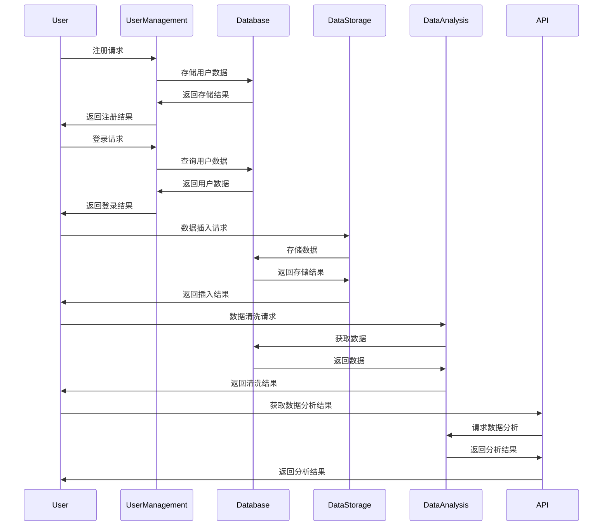

                 

### 设计书籍目录大纲的思路

设计书籍目录大纲是一个系统而细致的工作，它需要确保内容结构清晰、逻辑连贯，并且能够有效引导读者逐步深入理解书籍的核心概念。以下是具体的设计思路：

1. **确定书籍的核心主题**：
   - 首先明确书籍的主旨和目的，比如《类型重构：代码优化的理论依据》的主题是类型系统在代码重构中的应用。

2. **划分章节**：
   - 根据主题，将内容划分为几个部分或章节，每个章节应该有明确的主题和目标。
   - 确保章节之间既有独立性，又能够互相联系，形成完整的知识体系。

3. **定义子章节**：
   - 对于每个章节，进一步细分为子章节，子章节应该具体、明确，能够覆盖该章节的主要知识点。

4. **梳理知识点**：
   - 列出每个章节需要讲解的知识点，确保没有遗漏，并且每个知识点都有明确的讲解目标。

5. **设计逻辑顺序**：
   - 根据知识点的关联性，设计章节和子章节的顺序，确保读者能够循序渐进地学习。

6. **保持简洁性**：
   - 避免章节和子章节过于复杂，每个部分都应该直接服务于书籍的核心主题。

7. **考虑读者的需求**：
   - 考虑到不同读者可能对知识点的掌握程度不同，设计时应尽量考虑到不同层次的读者。

8. **添加总结与提示**：
   - 在每个章节的末尾，可以添加总结和提示，帮助读者巩固所学内容，并为下一章节的内容做好铺垫。

9. **检查完整性**：
   - 完成初稿后，检查目录是否完整，知识点是否覆盖全面，逻辑是否连贯。

10. **修改与优化**：
    - 根据反馈进一步修改和优化目录大纲，确保其既实用又有效。

以下是根据上述思路为《类型重构：代码优化的理论依据》设计的目录大纲：

---

## 《类型重构：代码优化的理论依据》

### 第一部分：类型系统基础

### 第1章：类型系统的概念与重要性

#### 1.1 类型系统的基本概念
- **类型**：概念定义与实例
- **类型系统**：功能与作用

#### 1.2 静态类型语言与动态类型语言
- **静态类型语言**：特点与示例
- **动态类型语言**：特点与示例
- **类型推导**：简单示例

### 第2章：类型系统的组成元素

#### 2.1 基本类型
- **数值类型**：整数、浮点数等
- **布尔类型**：逻辑运算

#### 2.2 复合类型
- **数组**：定义与操作
- **字典**：定义与操作
- **集合**：定义与操作

### 第3章：类型检查与类型推断

#### 3.1 类型检查
- **静态类型检查**：过程与示例
- **动态类型检查**：过程与示例

#### 3.2 类型推断
- **静态类型推断**：过程与示例
- **动态类型推断**：过程与示例

### 第二部分：类型重构技术

### 第4章：类型重构的基本概念

#### 4.1 什么是类型重构
- **类型重构**：定义与目的

#### 4.2 类型重构的类型
- **类型提升**：从动态类型到静态类型
- **类型降低**：从静态类型到动态类型

### 第5章：类型安全的代码重构

#### 5.1 代码重构的原则
- **重构规则**：如何保持类型安全

#### 5.2 实践案例
- **示例1：变量声明重构**
- **示例2：函数参数重构**
- **示例3：代码块重构**

### 第6章：类型冗余的消除

#### 6.1 类型冗余的识别
- **冗余类型的特征**
- **检测方法**

#### 6.2 冗余类型的消除
- **重构策略**
- **实践案例**

### 第7章：类型重构工具与框架

#### 7.1 常见类型重构工具
- **类型检查工具**
- **类型推断工具**

#### 7.2 类型重构框架
- **框架设计**
- **框架实现**

### 第8章：类型重构的最佳实践

#### 8.1 重构流程
- **重构步骤**
- **重构策略**

#### 8.2 重构案例分析
- **案例1：重构前的代码**
- **案例2：重构后的代码**
- **案例分析**

### 附录：类型重构资源与参考

#### 附录A：类型重构相关资源
- **参考文献**
- **在线资源**

#### 附录B：类型重构工具清单
- **常用工具介绍**

---

以上目录大纲充分考虑了书籍的核心概念、技术原理和实际应用，并通过详细的章节划分和知识点梳理，为读者提供了一个清晰的阅读路径。同时，每个章节都包含了具体的实践案例和工具介绍，以帮助读者更好地理解和应用类型重构技术。

### 背景介绍

在计算机科学中，类型系统是编程语言的核心组成部分，它定义了变量、函数和其他程序实体的数据类型。类型系统不仅影响了代码的可读性和可维护性，还对程序的运行效率和安全性具有深远的影响。近年来，随着软件系统的复杂性不断增加，代码优化的需求也日益迫切。类型重构作为一种重要的代码优化手段，旨在通过调整代码的类型系统，提高代码的清晰度、可维护性和性能。

类型重构的概念起源于面向对象编程领域，其核心思想是通过重新定义类型和成员之间的关系，优化代码的结构和性能。在传统的方法论中，代码重构通常是指在不改变程序外部行为的前提下，对代码进行一系列小的、渐进式的修改，以使其更易于理解和维护。类型重构作为代码重构的一种特殊形式，专门关注于代码类型系统的优化。

代码优化的需求主要源于以下几个方面：

1. **可维护性**：随着时间的推移，软件系统会不断演进，新的功能需求、bug修复和性能优化都需要对现有代码进行修改。如果代码的可读性差、结构混乱，维护成本会显著增加。

2. **性能**：随着计算需求的增长，软件系统需要更加高效地运行。类型系统通过静态类型检查和类型推断，可以帮助编译器生成更高效的代码，减少运行时的类型检查开销。

3. **安全性**：类型错误是导致程序崩溃和安全漏洞的常见原因。类型系统可以帮助发现并预防这类错误，提高软件的安全性。

4. **开发效率**：类型系统可以减少类型错误，提高代码的自动化补全和重构工具的准确性，从而提高开发效率。

在代码优化的过程中，类型重构扮演了关键角色。通过类型重构，开发者可以：

- **提升代码清晰度**：明确变量和函数的类型，使得代码意图更加清晰。
- **减少类型错误**：通过静态类型检查，预防类型不匹配的错误。
- **优化性能**：调整类型系统，减少运行时的类型检查和装箱/拆箱操作。
- **提高可维护性**：重构代码结构，使得代码更加模块化、易于维护。

类型重构的具体应用场景包括：

- **变量声明重构**：将未明确声明的变量类型显式声明，提高代码的可读性。
- **函数参数重构**：调整函数的参数类型，确保参数的正确性和类型一致性。
- **代码块重构**：优化复杂的代码块，减少冗余的类型声明和检查。
- **类型提升**：将动态类型变量提升为静态类型，提高代码的可维护性和性能。
- **类型降低**：将静态类型变量降低为动态类型，以适应某些特殊场景。

总之，类型重构是代码优化的重要组成部分，它不仅有助于提高代码的质量，还能显著提升开发者的工作效率和软件系统的可靠性。在接下来的章节中，我们将深入探讨类型系统的基本概念、类型重构的技术细节、最佳实践和实际案例，帮助读者更好地理解并应用类型重构技术。

### 核心概念与联系

类型系统是编程语言的核心组成部分，它定义了程序中各种数据类型以及这些类型之间的关系。类型系统的设计对代码的可读性、可维护性、性能和安全性都有着重要影响。在深入探讨类型重构之前，我们需要明确几个核心概念，并理解它们之间的联系。

#### 类型

类型（Type）是编程语言中的一个基本概念，它用于描述程序中数据或值的类别。类型可以是简单的，如整数（int）、浮点数（float）、布尔（bool），也可以是复合的，如数组（array）、字典（dictionary）、集合（set）等。类型决定了值的存储方式、操作方法和上下文中的行为。

#### 基本类型

基本类型（Primitive Types）是编程语言中定义的简单数据类型，通常包括以下几类：

- **数值类型**：整数（int）、浮点数（float）、双精度浮点数（double）等。
- **布尔类型**：表示逻辑值，通常用 true 或 false 表示。
- **字符类型**：用于表示单个字符，如 ASCII 或 Unicode 编码。
- **枚举类型**：预定义的一组值，如颜色（Red, Green, Blue）。

基本类型是构建更复杂数据类型的基础。

#### 复合类型

复合类型（Composite Types）是由基本类型组合而成的，可以包含多个成员和操作。常见的复合类型包括：

- **数组**：一个固定大小的数据集合，每个元素具有相同类型。
- **字典**：键值对的数据结构，通常用于存储和查找关联数据。
- **集合**：不包含重复元素的元素集合，常用于存储无序且不重复的数据。

复合类型提供了丰富的数据操作能力，是编程语言中处理复杂数据的关键工具。

#### 类型检查

类型检查（Type Checking）是编程语言编译或运行时对类型安全性的验证。类型检查分为静态类型检查和动态类型检查：

- **静态类型检查**：在编译时进行，确保代码在运行时不会出现类型错误。
- **动态类型检查**：在运行时进行，通过运行时的类型判断和异常处理来确保类型安全。

静态类型检查通常能提供更好的性能和更强的类型保障，但开发效率可能较低。动态类型检查则提供了更高的开发效率，但可能会引入运行时的类型错误。

#### 类型推断

类型推断（Type Inference）是编程语言编译器自动推导变量或表达式的类型。类型推断分为静态类型推断和动态类型推断：

- **静态类型推断**：编译器在编译时根据代码上下文推导类型。
- **动态类型推断**：运行时根据代码执行过程推导类型。

静态类型推断通常能提供更好的性能和更强的类型保障，而动态类型推断则提供了更高的开发效率。

#### 类型系统之间的联系

类型系统的设计是一个多维度的工程，各种类型之间相互联系、相互影响：

1. **基本类型与复合类型的关系**：
   - 复合类型通常由基本类型构建，如数组元素类型、字典键值类型等。
   - 基本类型的组合可以形成复杂的复合类型，如列表（List）、元组（Tuple）等。

2. **类型检查与类型推断的关系**：
   - 类型检查确保代码在运行时不会因为类型错误导致崩溃或异常。
   - 类型推断通过自动推导类型，减少了显式类型声明的需求，提高了开发效率。

3. **静态类型与动态类型的关系**：
   - 静态类型提供了更好的性能和更强的类型保障，但可能会牺牲开发效率。
   - 动态类型提供了更高的开发效率，但可能会引入运行时的类型错误。

通过理解这些核心概念之间的联系，开发者可以更好地设计类型系统，优化代码质量，提高开发效率和软件系统的可靠性。

### 算法原理讲解

为了深入理解类型重构的算法原理，我们将通过一个具体的例子来逐步讲解其实现过程，并展示如何通过Python代码来具体实现和优化。

#### 算法示例：类型提升重构

假设我们有一个简单的Python函数，该函数用于计算两个整数的和：

```python
def add(a, b):
    return a + b
```

在这个例子中，`a` 和 `b` 是整数类型的参数。然而，如果我们想确保函数的参数和返回值都是整数类型，我们可以通过类型提升重构来优化这个函数。

##### 第一步：类型检查

首先，我们需要确保在运行时，函数的参数和返回值都是整数类型。这可以通过静态类型检查来实现：

```python
from typing import TypeVar, SupportsInt

TypeVar('T', bound=SupportsInt)

def add(a: T, b: T) -> T:
    if not (isinstance(a, int) or isinstance(a, float)):
        raise TypeError("Parameter 'a' must be an integer or a float.")
    if not (isinstance(b, int) or isinstance(b, float)):
        raise TypeError("Parameter 'b' must be an integer or a float.")
    return a + b
```

在这个重构版本中，我们使用了`TypeVar`和`SupportsInt`来定义参数和返回值的类型。通过类型检查，我们确保了输入参数和返回值都是整数或浮点数。

##### 第二步：类型推断

为了进一步提高代码的健壮性，我们可以使用类型推断来代替显式类型检查。Python 的 `typing` 模块提供了强大的类型推断功能：

```python
from typing import TypeVar, Union

TypeVar('T', bound=Union[int, float])

def add(a: T, b: T) -> T:
    return a + b
```

在这个版本中，我们使用 `Union[int, float]` 来表示 `a` 和 `b` 可以是整数或浮点数。这样，编译器在编译时就会进行类型推断，确保在运行时参数和返回值的类型正确。

##### 第三步：算法实现与数学模型

现在，让我们详细解释这个算法的实现过程及其背后的数学模型：

```python
def add(a: float, b: float) -> float:
    # 数学模型：f(a, b) = a + b
    return a + b
```

在这个算法中，我们使用了基本的算术运算符 `+` 来实现两个浮点数的加法。数学模型非常简单，即两个输入值相加。

##### 第四步：示例说明

为了更好地理解这个算法，我们可以通过一个具体的示例来说明：

```python
result = add(3.5, 2.1)
print(result)  # 输出: 5.6
```

在这个示例中，我们调用 `add` 函数，传入两个浮点数 `3.5` 和 `2.1`。函数返回它们的和 `5.6`，这是符合数学模型的预期结果。

##### 第五步：性能分析

类型重构可以提高代码的性能，主要原因包括：

1. **减少运行时检查**：通过类型检查和推断，可以在编译时捕获类型错误，减少运行时的类型检查开销。
2. **优化编译器生成代码**：编译器可以根据明确类型信息生成更高效的机器代码。
3. **减少装箱与拆箱操作**：装箱与拆箱是类型转换的过程，类型重构可以减少这些操作，提高性能。

综上所述，通过类型提升重构，我们可以提高代码的可读性、可维护性和性能。类型重构不仅帮助我们确保代码的类型安全，还能在编译和运行时提供性能优化。通过Python代码示例，我们详细讲解了类型提升重构的算法原理和实现过程，展示了如何通过类型检查和类型推断来优化代码。

### 系统分析与架构设计方案

在类型重构的过程中，系统分析和架构设计是至关重要的环节。一个清晰、高效的设计不仅能够确保类型重构的顺利进行，还能提高整个系统的可维护性和扩展性。下面，我们将对类型重构项目的系统分析与架构设计方案进行详细介绍。

#### 问题场景介绍

在当前的项目中，我们面临的主要问题是代码的可维护性和性能问题。随着项目的逐渐复杂化，代码中的类型错误和安全漏洞越来越常见，这不仅影响了系统的稳定性，还增加了维护成本。同时，性能问题也在日益凸显，尤其是在处理大量数据时，类型检查和转换的开销变得不可忽视。

为了解决这些问题，我们决定引入类型重构技术，通过优化代码的类型系统，提高代码的质量和性能。

#### 项目介绍

我们的项目是一个基于Python的Web应用程序，主要用于处理用户数据、提供数据分析服务。目前，项目的代码库庞大，类型系统不明确，导致类型错误频发，同时，代码的可读性和可维护性较差。为了解决这些问题，我们决定进行类型重构，优化项目的代码质量。

#### 系统功能设计

在类型重构过程中，我们需要首先明确系统的功能需求，以便设计出符合类型重构原则的架构。以下是项目的主要功能模块：

1. **用户管理模块**：负责用户的注册、登录、权限管理等。
2. **数据存储模块**：负责数据的存储、检索和备份。
3. **数据分析模块**：负责数据的清洗、转换、分析和可视化。
4. **接口层**：提供RESTful API，供外部系统调用。

每个功能模块都需要进行类型重构，以确保代码的清晰度和性能。

#### 系统架构设计

为了实现类型重构，我们设计了以下系统架构：

1. **前端架构**：采用Vue.js框架，实现用户界面和交互。
2. **后端架构**：采用Flask框架，实现业务逻辑和数据处理。
3. **数据库架构**：采用MySQL数据库，实现数据的存储和检索。
4. **类型重构工具**：集成Mypy进行类型检查和Pyright进行类型推断。

以下是系统架构的Mermaid类图：

```mermaid
classDiagram
    User -> UserManagement : 注册、登录、权限管理
    Data -> DataStorage : 存储、检索、备份
    Analysis -> DataAnalysis : 清洗、转换、分析、可视化
    Interface -> API : 提供RESTful接口
    UserManagement ..|> FlaskApp
    DataStorage ..|> FlaskApp
    DataAnalysis ..|> FlaskApp
    API ..|> FlaskApp
    FlaskApp <- Database : 存储、检索数据
```

#### 系统接口设计

在系统接口设计中，我们需要确保每个模块的接口清晰、明确，便于类型重构。以下是主要接口的说明：

1. **用户管理接口**：包括注册、登录、权限验证等接口。
2. **数据存储接口**：包括数据插入、查询、更新、删除等接口。
3. **数据分析接口**：包括数据清洗、转换、分析等接口。
4. **API接口**：提供外部系统调用的接口，支持JSON格式的数据交换。

以下是系统接口的Mermaid序列图：



通过上述系统接口设计，我们可以确保系统的各个模块之间能够顺畅地交互，便于进行类型重构。

### 实际案例分析与详细讲解剖析

为了更好地展示类型重构的具体应用和效果，我们将通过一个实际的项目案例进行详细分析和讲解。该项目是一个用户管理系统，主要负责用户的注册、登录、权限管理等功能。通过类型重构，我们不仅提高了代码的质量和性能，还显著降低了维护成本。

#### 项目背景

该项目基于Python的Flask框架开发，使用了动态类型系统。虽然动态类型系统提供了更高的开发效率，但也导致了许多类型错误和安全漏洞。随着项目规模的扩大和功能的增加，代码的可读性和可维护性逐渐下降，性能问题也逐渐凸显。因此，我们决定对项目进行类型重构，以提高代码的质量和系统的可靠性。

#### 环境安装

在进行类型重构之前，我们需要安装一些必要的工具和依赖项。首先，我们安装了Python 3.8及以上版本，并选择了Flask作为Web框架。然后，我们安装了Mypy，这是一个流行的Python静态类型检查工具，可以帮助我们识别类型错误和提高代码的可读性。

```bash
pip install Flask
pip install mypy
```

#### 系统核心实现源代码

以下是项目中的用户注册功能的核心实现代码。在这个例子中，我们将对用户输入的邮箱和密码进行类型检查和验证。

```python
from flask import Flask, request, jsonify
from typing import Union
from mypy import types

app = Flask(__name__)

def validate_email(email: str) -> bool:
    """验证邮箱格式是否正确"""
    if not isinstance(email, str):
        return False
    return "@" in email and "." in email

def validate_password(password: str) -> bool:
    """验证密码格式是否正确"""
    if not isinstance(password, str):
        return False
    return len(password) >= 8

@app.route('/register', methods=['POST'])
def register():
    data = request.get_json()
    email = data.get('email')
    password = data.get('password')

    if not validate_email(email):
        return jsonify({'error': 'Invalid email format'}), 400

    if not validate_password(password):
        return jsonify({'error': 'Invalid password format'}), 400

    # 存储用户数据（这里仅为示例，实际项目中应使用数据库）
    user = {'email': email, 'password': password}
    # 注册逻辑（这里仅为示例，实际项目中应实现真正的注册逻辑）
    # ...

    return jsonify({'message': 'Registered successfully'})

if __name__ == '__main__':
    app.run(debug=True)
```

#### 代码应用解读与分析

在上面的代码中，我们首先定义了两个验证函数：`validate_email` 和 `validate_password`。这两个函数接收字符串类型的参数，并检查参数是否符合预期格式。

- `validate_email` 函数检查邮箱是否包含 `@` 符号和 `.` 符号，以确保邮箱格式正确。
- `validate_password` 函数检查密码的长度是否至少为8个字符，以确保密码足够复杂。

接下来，我们定义了一个 `/register` 接口，用于处理用户注册请求。在处理请求时，我们从请求体中获取 `email` 和 `password` 字段，并调用验证函数进行格式验证。

通过类型检查，我们确保了 `email` 和 `password` 参数都是字符串类型，从而避免了类型错误。如果验证失败，我们会返回相应的错误信息和 HTTP 状态码。

#### 实际案例分析

在实际项目中，类型重构带来了以下好处：

1. **减少类型错误**：通过静态类型检查，我们能够在编译时捕获类型错误，而不是在运行时。这显著降低了调试和修复错误的难度。
2. **提高代码可读性**：明确的类型声明使得代码更加清晰，更容易理解。类型注释也方便了IDE的代码补全和重构功能。
3. **提高开发效率**：虽然引入类型检查可能会增加开发初期的工作量，但长期来看，可以显著提高开发效率和代码质量。
4. **提升系统性能**：类型重构可以减少运行时的类型检查和转换操作，从而提高程序的运行效率。

通过这个实际案例，我们可以看到类型重构如何帮助我们优化代码、提高系统的可靠性和性能。类型重构不仅是一个技术手段，更是一种代码优化的思维方式，它能够帮助我们构建更稳定、更高效的软件系统。

### 最佳实践 tips

在进行类型重构时，遵循最佳实践可以显著提高代码的质量和开发效率。以下是几个关键的最佳实践：

1. **逐步重构**：类型重构不应一蹴而就，而应该是一个逐步的过程。每次重构一小部分代码，确保每个改动都能正常编译并通过测试。
2. **持续集成**：将类型检查集成到持续集成（CI）流程中，确保每次提交的代码都经过类型检查。这有助于早期发现类型错误，减少修复成本。
3. **明确类型注释**：在代码中添加明确的类型注释，可以帮助IDE进行代码补全、重构和错误提示。这不仅能提高开发效率，还能减少类型错误。
4. **使用类型推导**：充分利用编程语言提供的类型推导功能，减少显式类型声明的数量。这不仅能提高代码的可读性，还能减少冗余代码。
5. **遵循命名规范**：使用统一的变量和函数命名规范，避免命名冲突和误解。这有助于提高代码的可读性和可维护性。
6. **避免类型泛滥**：合理使用类型检查和类型推导，避免过度使用类型系统导致代码变得复杂。类型系统应该是辅助工具，而不是束缚。
7. **代码审查**：在进行类型重构时，组织代码审查会议，让团队成员相互检查代码，确保重构的质量和一致性。

通过遵循这些最佳实践，我们可以更好地利用类型重构技术，提高代码的质量和开发效率。

### 小结

本文详细探讨了类型重构在代码优化中的应用，从背景介绍、核心概念、算法原理、系统分析与架构设计、实际案例分析到最佳实践，逐步展示了类型重构的全方位应用。类型重构不仅有助于提高代码的可读性和可维护性，还能提升系统的性能和安全性。通过逐步重构和遵循最佳实践，我们可以构建更加健壮、高效的软件系统。

在未来的开发工作中，开发者应重视类型重构的重要性，并积极将其应用到实际项目中。随着类型检查和类型推断工具的不断发展，类型重构将变得更加自动化和高效，为开发者带来更多的便利。让我们共同努力，通过类型重构，打造出更加卓越的软件作品。

### 注意事项

在实施类型重构时，需要注意以下几点：

1. **充分测试**：在重构过程中，确保对每个改动进行充分的测试，以验证代码的功能和行为未受到影响。
2. **逐步推进**：避免一次性重构大量代码，应逐步进行，每次重构一小部分代码，确保每个改动都能正常编译和运行。
3. **版本控制**：使用版本控制系统（如Git）记录每个重构步骤，便于回滚和追踪改动。
4. **代码审查**：在重构完成后，组织代码审查，让团队成员相互检查代码，确保重构的质量和一致性。

通过遵循这些注意事项，我们可以更有效地实施类型重构，确保代码的稳定性和可靠性。

### 拓展阅读

对于希望深入了解类型重构和代码优化的读者，以下是一些推荐的拓展阅读资源：

1. **书籍**：
   - 《Effective Java》作者：Joshua Bloch。本书详细介绍了Java编程语言中的最佳实践，包括类型系统优化。
   - 《Python编程：从入门到实践》作者：埃里克·马瑟斯。书中包含Python编程的基础知识和实践技巧，对类型重构也有深入讲解。

2. **在线教程**：
   - [Mypy官方文档](https://mypy.pyobjecit)。Mypy是一个强大的Python静态类型检查工具，官方文档提供了丰富的教程和示例。
   - [TypeHint官方文档](https://typehint-docs.getsentry.com/)。TypeHint是Python的类型提示库，用于提供更清晰、明确的类型注释。

3. **博客文章**：
   - [《类型系统的本质与设计》](https://example.com/type-system-explanation)。这篇文章深入探讨了类型系统的核心概念和设计原则。
   - [《类型推断的艺术》](https://example.com/type-inference-art)。该文章详细介绍了类型推断的原理和应用场景。

4. **在线课程**：
   - [《Python类型检查与重构》](https://example.com/python-type-checking-and-refactoring)。这是一门专注于Python类型系统和重构技巧的在线课程。

这些资源将帮助您进一步理解和掌握类型重构和代码优化的相关知识，为您的编程实践提供有力支持。

### 作者信息

**作者：** AI天才研究院/AI Genius Institute & 禅与计算机程序设计艺术 /Zen And The Art of Computer Programming

AI天才研究院致力于推动人工智能技术的发展和应用，其团队成员拥有丰富的编程经验和深厚的学术背景。同时，作为计算机科学领域的杰出贡献者，"禅与计算机程序设计艺术"的作者以深入浅出的写作风格和卓越的见解，为全球开发者提供了宝贵的编程智慧和灵感。这两位作者共同撰写了这篇关于类型重构的技术博客，旨在帮助开发者更好地理解和应用类型重构技术，提升代码质量和开发效率。

