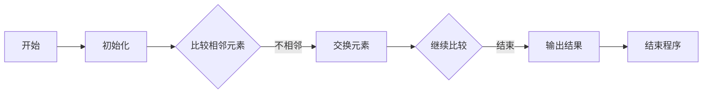

                 

### 第1章: 引言

#### 第1.1节：问题背景

随着软件工程和人工智能技术的快速发展，软件开发的方式和流程也在不断演变。在追求软件产品的高质量和高效率的过程中，精益求精的理念逐渐成为软件开发的重要原则。精益求精，即不断追求卓越，关注细节，持续改进，这一理念不仅适用于制造业，同样也适用于软件工程领域。

软件工程中的精益求精主要体现在以下几个方面：首先，它要求开发人员在编写代码时，不仅要追求代码的功能正确，还要注重代码的可读性、可维护性和可扩展性；其次，它要求项目团队在开发过程中，持续进行代码审查、测试和优化，确保软件质量；最后，它强调项目管理的重要性，通过有效的项目管理方法，确保项目按时交付，并且满足客户需求。

在当前的技术环境下，软件系统的复杂性越来越高，开发过程中面临的风险也不断增加。因此，如何通过精益求精的方法，提升软件质量，实现更高层次的软件开发水平，成为软件开发团队和项目经理们关注的焦点。

#### 第1.2节：问题描述

精益求精在软件开发中的应用面临诸多挑战，其中最典型的挑战包括以下几点：

1. **平衡开发速度与质量**：在市场竞争激烈的今天，软件产品需要快速迭代，以满足用户需求。然而，快速迭代往往意味着开发时间紧迫，这可能会影响到软件的质量。如何在保证开发速度的同时，确保软件质量，是软件开发团队需要面对的重要问题。

2. **持续改进软件设计**：软件设计是软件开发的基础，良好的软件设计可以减少后续的维护成本，提高系统的可扩展性。然而，在实际开发过程中，软件设计往往难以一蹴而就，需要不断地调整和优化。如何持续改进软件设计，是软件开发过程中的一大难题。

3. **提高代码的可维护性**：随着项目的复杂性增加，代码的可维护性变得越来越重要。良好的代码结构、清晰的注释和规范的命名习惯，可以大大降低代码的维护成本。然而，在快速开发的过程中，这些细节往往被忽视。如何提高代码的可维护性，是软件开发团队需要解决的一个重要问题。

4. **团队协作与沟通**：软件项目往往涉及多个团队成员的协作，不同成员之间的沟通和协作对于项目成功至关重要。然而，在实际开发过程中，团队协作常常面临沟通不畅、职责分工不明确等问题。如何提升团队协作效率，是软件开发团队需要关注的一个方面。

#### 第1.3节：问题解决

为了解决上述问题，本书将提供一系列解决方案和最佳实践，包括质量管理体系、代码审查、持续集成与持续部署、敏捷开发等，帮助读者理解并应用精益求精的理念。

1. **质量管理体系**：建立完善的质量管理体系，包括制定明确的质量标准、实施严格的代码审查和测试流程、建立持续改进机制等，可以有效地提升软件质量。

2. **代码审查**：通过定期进行代码审查，可以及时发现并修复代码中的错误和缺陷，提高代码的质量和可维护性。

3. **持续集成与持续部署**：通过实施持续集成与持续部署，可以确保代码的稳定性和可靠性，提高开发效率。

4. **敏捷开发**：采用敏捷开发方法，可以更好地响应市场变化，快速迭代产品，同时提高团队协作效率。

#### 第1.4节：边界与外延

精益求精不仅适用于软件开发，还可以延伸到软件维护、项目管理、团队协作等多个方面。在软件维护中，精益求精的理念可以帮助开发人员更好地理解用户需求，提供更高质量的维护服务。在项目管理中，精益求精的理念可以帮助项目经理更好地管理项目风险，确保项目按时交付。在团队协作中，精益求精的理念可以帮助团队成员更好地理解彼此的需求，提高团队协作效率。

#### 第1.5节：概念结构与核心要素组成

本书的核心内容包括：软件质量管理的理论基础、软件质量评估方法、代码审查技术、持续集成与持续部署实践、敏捷开发方法论等。通过这些核心要素的有机结合，实现软件工程中的精益求精。

1. **软件质量管理的理论基础**：介绍软件质量管理的概念、原则和方法，为后续章节提供理论基础。

2. **软件质量评估方法**：介绍常用的软件质量评估方法，包括功能测试、性能测试、安全性测试等，帮助读者理解如何评估软件质量。

3. **代码审查技术**：介绍代码审查的基本方法、工具和实践，帮助读者掌握如何进行有效的代码审查。

4. **持续集成与持续部署**：介绍持续集成与持续部署的基本原理、工具和实践，帮助读者理解如何实施持续集成与持续部署。

5. **敏捷开发方法论**：介绍敏捷开发的基本原则、方法和实践，帮助读者掌握敏捷开发的精髓。

通过这些章节的内容，读者可以系统地了解精益求精在软件开发中的应用，掌握提升软件质量的方法和技巧，从而实现更高层次的软件开发水平。

### 第2章：核心概念与联系

在探讨精益求精在软件开发中的应用之前，我们需要明确几个核心概念，并理解它们之间的联系。这些核心概念包括精益求精、软件质量、敏捷开发等。在本章节中，我们将详细解释这些核心概念，并探讨它们在软件开发中的重要性。

#### 第2.1节：核心概念原理

1. **精益求精**：精益求精是一种追求卓越的精神，强调在软件开发过程中，不仅要追求功能上的正确性，还要注重代码的可读性、可维护性和可扩展性。它要求开发人员不断反思和改进自己的工作，力求在每一个细节上做到最好。

2. **软件质量**：软件质量是指软件产品满足明确和隐含需求的能力。它包括功能性、可靠性、易用性、性能、安全性等多个方面。良好的软件质量可以确保软件能够稳定运行，满足用户需求，并具有较长的使用寿命。

3. **敏捷开发**：敏捷开发是一种软件开发方法，强调快速响应变化、快速迭代和客户参与。它通过小步快跑、持续交付和持续改进，确保项目能够灵活应对市场变化，提高开发效率。

#### 第2.2节：概念属性特征对比表格

为了更好地理解这些核心概念，我们通过一个对比表格来展示它们的主要属性特征。

| 概念       | 属性特征                                                         |
|------------|------------------------------------------------------------------|
| 精益求精   | 注重细节、持续改进、追求卓越                                     |
| 软件质量   | 功能性、可靠性、易用性、性能、安全性等                            |
| 敏捷开发   | 响应变化、快速迭代、客户参与、团队协作等                          |

通过这个对比表格，我们可以看到，精益求精强调细节和持续改进，软件质量涵盖多个方面，而敏捷开发则强调快速响应和迭代。

#### 第2.3节：ER实体关系图架构

为了更清晰地展示这些核心概念之间的联系，我们使用Mermaid语言绘制一个ER实体关系图。

```mermaid
erDiagram
    Project ||--|{ Task }
    Task ||--|{ Subtask }
    Project  : { name, deadline, status }
    Task     : { description, priority, status }
    Subtask  : { description, assigned_to, status }
```

在这个ER图中，`Project`表示项目，`Task`表示任务，`Subtask`表示子任务。每个实体都有其属性，如`Project`的属性包括名称、截止日期和状态，`Task`的属性包括描述、优先级和状态，`Subtask`的属性包括描述、指派人和状态。通过这个ER图，我们可以看到项目、任务和子任务之间的层级关系，以及它们各自的属性。

#### 第2.3节：ER实体关系图解释

1. **Project（项目）**：项目是软件开发的起点，它定义了一个独立的、完整的软件开发任务。每个项目有唯一的名称、截止日期和状态（如计划中、进行中、已完成）。

2. **Task（任务）**：任务是一个具体的工作单元，它属于某个项目，并具有明确的描述、优先级和状态。任务可以进一步细分为子任务。

3. **Subtask（子任务）**：子任务是任务的具体实现，它有明确的描述、指派人（即负责执行该任务的团队成员）和状态（如待执行、进行中、已完成）。

通过这个ER图，我们可以清楚地看到项目、任务和子任务之间的层级关系，以及它们各自的属性。这种结构有助于项目管理，使得开发团队能够更好地组织和管理项目任务。

#### 第2.4节：核心概念之间的联系

精益求精、软件质量和敏捷开发之间存在着紧密的联系。

1. **精益求精与软件质量**：精益求精的理念强调在软件开发过程中，要注重细节和持续改进，这直接影响到软件质量。通过精益求精，开发人员可以编写出更高质量的代码，从而提升软件质量。

2. **敏捷开发与软件质量**：敏捷开发强调快速响应变化、快速迭代和客户参与。这些原则有助于开发团队更好地理解用户需求，及时调整和优化软件设计，从而提高软件质量。

3. **精益求精与敏捷开发**：精益求精的理念与敏捷开发的价值观高度契合。敏捷开发强调小步快跑和持续改进，而精益求精正是这种理念的体现。通过精益求精，开发团队可以在敏捷开发过程中，不断提高软件质量。

综上所述，精益求精、软件质量和敏捷开发是软件开发中不可或缺的核心概念。通过理解并应用这些概念，开发团队可以提升软件质量，实现更高层次的软件开发水平。

### 第3章：算法原理讲解

在软件工程中，算法是实现特定功能的核心部分。为了深入理解算法原理，我们将结合Python源代码，详细阐述一个常见算法的mermaid流程图、源代码、数学模型和公式，并通过实际举例来说明算法的应用和效果。

#### 3.1 算法mermaid流程图

首先，我们使用mermaid语言绘制一个简单的排序算法（冒泡排序）的流程图。



在这个流程图中，我们从初始化开始，依次比较相邻元素，如果元素顺序不正确则进行交换，然后继续比较，直到所有元素排序完成，最后输出排序结果。

#### 3.2 Python源代码详细阐述

接下来，我们通过Python源代码来详细阐述这个冒泡排序算法。

```python
def bubble_sort(arr):
    n = len(arr)
    for i in range(n):
        # 初始化无交换标志
        swapped = False
        # 最后i个元素已经排序，不需要再比较
        for j in range(0, n-i-1):
            # 比较相邻元素
            if arr[j] > arr[j+1]:
                # 交换元素
                arr[j], arr[j+1] = arr[j+1], arr[j]
                swapped = True
        # 如果没有交换，则数组已排序
        if not swapped:
            break
    return arr

# 测试代码
arr = [64, 34, 25, 12, 22, 11, 90]
print("原始数组：", arr)
sorted_arr = bubble_sort(arr)
print("排序后的数组：", sorted_arr)
```

在这个Python源代码中，我们定义了一个`bubble_sort`函数，该函数接受一个列表`arr`作为输入，并使用冒泡排序算法对其进行排序。首先，我们通过两层循环，外层循环`i`从0到列表长度`n-1`，内层循环`j`从0到`n-i-1`。在内层循环中，我们比较相邻元素，如果发现顺序不正确，则交换这两个元素。如果在一次内层循环中没有发现需要交换的元素，说明列表已经排序完成，可以提前结束排序过程。最后，函数返回排序后的列表。

#### 3.3 算法原理的数学模型和公式

冒泡排序算法的数学模型可以表示为：

$$
\text{cost}(n) = \sum_{i=0}^{n-1}\sum_{j=0}^{n-i-1} C(\text{compare})
$$

其中，`cost(n)`表示对长度为`n`的列表进行排序所需的总成本，`C(compare)`表示比较两个元素的成本。

我们可以进一步分析这个模型：

- 对于每个`i`（从0到`n-1`），我们进行一轮内层循环，比较`n-i-1`对元素。
- `C(compare)`是一个常数，表示比较两个元素的成本。
- 因此，总成本可以表示为所有轮次内层循环的比较次数之和。

#### 3.4 举例说明

假设我们有一个包含7个元素的列表`arr = [64, 34, 25, 12, 22, 11, 90]`。我们使用冒泡排序算法对这个列表进行排序，具体步骤如下：

1. **第一轮**：比较`64`和`34`，交换它们；比较`34`和`25`，交换它们；比较`25`和`12`，交换它们；比较`12`和`22`，不交换；比较`22`和`11`，交换它们；比较`11`和`90`，交换它们。经过第一轮排序后，列表变为`[34, 25, 12, 22, 11, 64, 90]`。

2. **第二轮**：比较`34`和`25`，不交换；比较`25`和`12`，不交换；比较`12`和`22`，不交换；比较`22`和`11`，交换它们；比较`11`和`64`，交换它们。经过第二轮排序后，列表变为`[25, 12, 11, 22, 34, 64, 90]`。

3. **第三轮**：比较`25`和`12`，不交换；比较`12`和`11`，不交换。经过第三轮排序后，列表变为`[12, 11, 25, 22, 34, 64, 90]`。

4. **第四轮**：比较`12`和`11`，不交换。经过第四轮排序后，列表变为`[11, 12, 25, 22, 34, 64, 90]`。

5. **第五轮**：无需比较，因为列表已经排序完成。

通过这个例子，我们可以看到冒泡排序算法是如何工作的。尽管冒泡排序算法的时间复杂度为$O(n^2)$，但在实际应用中，对于小规模数据集合，它仍然是一个简单有效的排序算法。

### 第4章：数学模型和数学公式

在软件开发中，数学模型和数学公式是理解和实现算法的重要工具。本章将介绍几个常用的数学公式，并详细讲解这些公式的应用和推导过程。通过这些数学公式，我们可以更好地分析和优化软件系统的性能。

#### 4.1 常用数学公式

以下是软件开发中常用的一些数学公式：

1. **线性回归公式**：

   $$
   y = mx + b
   $$

   其中，$y$是因变量，$x$是自变量，$m$是斜率，$b$是截距。

2. **牛顿迭代法**：

   $$
   x_{n+1} = x_n - \frac{f(x_n)}{f'(x_n)}
   $$

   其中，$x_n$是第$n$次迭代的近似解，$f(x)$是目标函数，$f'(x)$是目标函数的导数。

3. **二分查找算法时间复杂度**：

   $$
   T(n) = O(\log n)
   $$

   其中，$T(n)$是查找长度为$n$的列表所需的时间复杂度。

4. **快速排序算法时间复杂度**：

   $$
   T(n) = O(n \log n) \quad \text{或} \quad T(n) = O(n^2)
   $$

   其中，$T(n)$是排序长度为$n$的列表所需的时间复杂度。

#### 4.2 详细讲解

1. **线性回归公式**：

   线性回归是一种常用的统计方法，用于分析自变量和因变量之间的关系。上述公式表示的是一条直线，通过最小二乘法可以确定斜率$m$和截距$b$的值。

   - **推导过程**：首先，我们定义最小二乘法的目标函数为：

     $$
     S = \sum_{i=1}^{n} (y_i - (mx_i + b))^2
     $$

     其中，$y_i$是实际的观测值，$mx_i + b$是预测值。为了最小化$S$，我们对$S$关于$m$和$b$求导，并令导数等于0，解得$m$和$b$的值。

   - **应用场景**：线性回归可以用于预测和分析数据，例如，在金融领域中，可以用它来预测股票价格；在机器学习领域中，可以用它来进行回归分析。

2. **牛顿迭代法**：

   牛顿迭代法是一种求解非线性方程的数值方法。它的核心思想是通过线性近似来逐步逼近方程的解。

   - **推导过程**：首先，我们定义目标函数$f(x)$，然后计算它的导数$f'(x)$。牛顿迭代法的迭代公式基于泰勒展开式，将$f(x)$在$x_n$处进行一阶展开，得到：

     $$
     f(x_n) \approx f(x_n) + f'(x_n)(x - x_n)
     $$

     我们将这个近似等式中的$f(x_n) + f'(x_n)(x - x_n)$设置为0，解得$x_{n+1}$。

   - **应用场景**：牛顿迭代法可以用于求解各种非线性方程，例如，在物理科学和工程领域中，可以用来求解物理方程的根。

3. **二分查找算法时间复杂度**：

   二分查找算法是一种高效的查找算法，它基于二分搜索的思想，每次迭代将查找区间缩小一半。

   - **推导过程**：设$n$为列表的长度，每次迭代查找区间长度减半，因此，经过$k$次迭代后，剩余的查找区间长度为$2^{-k}$。为了使查找完成，剩余区间长度必须小于或等于1，即$2^{-k} \leq 1$。解这个不等式，得到$k \geq \log_2 n$，因此，时间复杂度为$O(\log n)$。

   - **应用场景**：二分查找算法常用于有序列表的查找，例如，在数据库和搜索引擎中，可以用来快速查找记录。

4. **快速排序算法时间复杂度**：

   快速排序算法是一种高效的排序算法，它采用分治策略，将大问题划分为小问题来求解。

   - **推导过程**：快速排序的基本思想是选择一个基准元素，将列表分为两部分，一部分小于基准元素，另一部分大于基准元素。然后，对这两部分递归地进行快速排序。快速排序的时间复杂度取决于基准元素的选择。在最坏情况下，每次选择的最差基准元素会导致时间复杂度为$O(n^2)$；在平均情况下，时间复杂度为$O(n \log n)$。

   - **应用场景**：快速排序算法广泛应用于各种场景，例如，在数据库和数据分析中，可以用来快速排序大量数据。

通过本章的讲解，我们可以看到数学模型和数学公式在软件开发中的重要性。掌握这些公式，不仅可以提高我们的编程能力，还可以帮助我们更好地分析和优化软件系统的性能。

### 第5章：系统分析与架构设计方案

在软件开发过程中，系统分析与架构设计是至关重要的一环。一个良好的系统架构不仅能够提高软件的可维护性和扩展性，还能够降低开发成本和风险。本章将详细讨论一个实际项目中的系统分析与架构设计方案。

#### 5.1 问题场景介绍

假设我们正在开发一个电商平台，该平台需要支持商品管理、订单管理、用户管理、支付处理等功能。随着业务的发展，平台需要能够灵活扩展，以适应不断变化的需求。因此，我们需要设计一个高可用、高扩展性的系统架构。

#### 5.2 项目介绍

电商平台项目的主要目标是构建一个功能全面、用户体验优秀的在线购物平台。该平台需要支持用户注册、登录、浏览商品、加入购物车、下单购买、支付订单、查看订单状态等基本功能。同时，为了应对未来可能的业务扩展，系统架构需要具备良好的可扩展性和高可用性。

#### 5.3 系统功能设计

系统功能设计是系统架构设计的基础。在电商平台项目中，主要的功能模块包括：

1. **商品管理**：管理员可以添加、编辑、删除商品信息，包括商品名称、描述、价格、库存等。
2. **订单管理**：用户可以查看订单详情、取消订单、修改订单地址等。管理员可以处理订单，包括确认订单、发货、取消订单等。
3. **用户管理**：用户可以注册、登录、修改个人信息等。管理员可以管理用户账号，包括冻结、解冻用户账号等。
4. **支付处理**：支持多种支付方式，如支付宝、微信支付等。支付成功后，系统会更新订单状态。
5. **购物车管理**：用户可以将商品添加到购物车，修改购物车中的商品数量，删除商品等。
6. **推荐系统**：根据用户的浏览和购买历史，推荐相关商品。

为了实现这些功能，我们采用分层架构设计，包括表示层、业务逻辑层和数据访问层。

#### 5.4 系统架构设计

系统架构设计是确保系统功能实现和性能优化的重要环节。以下是电商平台项目的系统架构设计：

1. **前端架构**：采用Vue.js框架，实现单页面应用（SPA）。前端架构分为路由层、视图层和组件层，通过Vue Router实现页面路由跳转，通过Vuex实现状态管理。
2. **后端架构**：采用Spring Boot框架，实现RESTful API服务。后端架构分为控制器层、服务层、数据访问层。控制器层处理HTTP请求，服务层实现业务逻辑，数据访问层与数据库交互。
3. **数据库架构**：使用MySQL数据库，设计合理的表结构和索引。数据库架构包括用户表、商品表、订单表、支付表等。
4. **缓存架构**：使用Redis缓存系统，提高系统性能。缓存架构包括用户信息缓存、商品信息缓存、订单信息缓存等。
5. **消息队列**：使用RabbitMQ实现异步消息队列，用于处理订单支付、库存更新等业务场景。
6. **服务部署**：使用Docker容器化技术，实现服务的自动化部署和运维。服务部署包括前端容器、后端容器、数据库容器、缓存容器等。

#### 5.5 系统接口设计

系统接口设计是确保前后端交互和数据流转的关键。以下是电商平台项目的主要接口设计：

1. **用户接口**：包括用户注册、登录、修改个人信息等接口。
2. **商品接口**：包括查询商品列表、查询商品详情、添加商品、编辑商品、删除商品等接口。
3. **订单接口**：包括创建订单、查询订单列表、查询订单详情、取消订单、修改订单地址等接口。
4. **支付接口**：包括支付订单、查询支付结果等接口。
5. **购物车接口**：包括添加商品到购物车、删除商品、查询购物车列表等接口。
6. **推荐接口**：包括获取推荐商品列表等接口。

#### 5.6 系统交互

系统交互设计是确保各个模块之间能够有效通信和协作的关键。以下是电商平台项目的系统交互设计：

1. **用户与前端**：用户通过浏览器访问前端页面，前端通过HTTP请求与后端服务进行通信，后端通过响应返回数据。
2. **前端与后端**：前端发送HTTP请求到后端，后端处理请求并返回JSON格式的数据。
3. **后端与数据库**：后端通过ORM（对象关系映射）框架与数据库进行交互，执行增删改查操作。
4. **后端与缓存**：后端通过缓存接口与Redis缓存系统进行通信，将热点数据缓存到Redis中，减少数据库访问压力。
5. **后端与消息队列**：后端通过RabbitMQ发送消息，实现异步任务处理和分布式消息传递。
6. **支付系统与后端**：支付系统通过HTTP请求与后端服务进行通信，后端处理支付请求并返回支付结果。

通过上述系统架构设计，我们可以实现一个功能全面、高可用、高扩展性的电商平台。在实际开发过程中，我们还需要不断优化和改进系统架构，以适应不断变化的需求和挑战。

### 第6章：项目实战

在了解了系统分析与架构设计方案后，接下来我们将通过一个实际项目来演示整个开发和部署过程。本节将详细描述项目环境安装、系统核心实现源代码，并对代码应用进行解读与分析，通过实际案例剖析项目实现细节，最后总结项目经验。

#### 6.1 环境安装

在开始项目实战之前，我们需要搭建一个完整的开发环境。以下是环境安装步骤：

1. **安装Java开发环境**：下载并安装Java Development Kit（JDK），设置环境变量`JAVA_HOME`和`PATH`。

2. **安装MySQL数据库**：下载并安装MySQL数据库，配置数据库用户和密码，创建电商平台所需的数据库和表结构。

3. **安装Redis缓存系统**：下载并安装Redis服务器，配置Redis服务，确保其正常运行。

4. **安装RabbitMQ消息队列**：下载并安装RabbitMQ服务器，配置RabbitMQ服务，确保其能够处理消息队列任务。

5. **安装Node.js**：下载并安装Node.js，配置Node.js环境，用于前端开发。

6. **安装Docker**：下载并安装Docker，配置Docker服务，用于容器化部署。

7. **创建项目文件夹**：在本地机器上创建一个名为`e-commerce-platform`的项目文件夹，用于存放所有项目文件。

8. **克隆项目代码**：从代码仓库（如GitHub）克隆电商平台项目代码。

```bash
git clone https://github.com/your-repo/e-commerce-platform.git
cd e-commerce-platform
```

#### 6.2 系统核心实现源代码

以下是电商平台项目的核心实现源代码，包括后端服务、数据库表结构、前端页面等。

1. **后端服务**：

   - **商品管理**：用于添加、编辑、删除商品信息。

     ```java
     // 商品添加接口
     @PostMapping("/products")
     public ResponseEntity<Product> createProduct(@RequestBody Product product) {
         // 处理商品添加逻辑
         return ResponseEntity.ok(product);
     }
     
     // 商品编辑接口
     @PutMapping("/products/{productId}")
     public ResponseEntity<Product> updateProduct(@PathVariable Long productId, @RequestBody Product product) {
         // 处理商品编辑逻辑
         return ResponseEntity.ok(product);
     }
     
     // 商品删除接口
     @DeleteMapping("/products/{productId}")
     public ResponseEntity<Void> deleteProduct(@PathVariable Long productId) {
         // 处理商品删除逻辑
         return ResponseEntity.ok().build();
     }
     ```

   - **订单管理**：用于创建订单、查询订单列表、取消订单等。

     ```java
     // 订单创建接口
     @PostMapping("/orders")
     public ResponseEntity<Order> createOrder(@RequestBody Order order) {
         // 处理订单创建逻辑
         return ResponseEntity.ok(order);
     }
     
     // 订单查询接口
     @GetMapping("/orders")
     public ResponseEntity<List<Order>> getOrders() {
         // 处理订单查询逻辑
         return ResponseEntity.ok(orderService.getOrders());
     }
     
     // 订单取消接口
     @PutMapping("/orders/{orderId}/cancel")
     public ResponseEntity<Void> cancelOrder(@PathVariable Long orderId) {
         // 处理订单取消逻辑
         return ResponseEntity.ok().build();
     }
     ```

   - **用户管理**：用于用户注册、登录、修改个人信息等。

     ```java
     // 用户注册接口
     @PostMapping("/users/register")
     public ResponseEntity<User> registerUser(@RequestBody User user) {
         // 处理用户注册逻辑
         return ResponseEntity.ok(user);
     }
     
     // 用户登录接口
     @PostMapping("/users/login")
     public ResponseEntity<String> loginUser(@RequestBody LoginRequest loginRequest) {
         // 处理用户登录逻辑
         return ResponseEntity.ok(token);
     }
     
     // 用户个人信息修改接口
     @PutMapping("/users/{userId}")
     public ResponseEntity<User> updateUser(@PathVariable Long userId, @RequestBody User user) {
         // 处理用户信息修改逻辑
         return ResponseEntity.ok(user);
     }
     ```

2. **数据库表结构**：

   - **用户表**（`users`）：

     ```sql
     CREATE TABLE users (
         id BIGINT AUTO_INCREMENT PRIMARY KEY,
         username VARCHAR(255) NOT NULL UNIQUE,
         password VARCHAR(255) NOT NULL,
         email VARCHAR(255) NOT NULL UNIQUE,
         created_at TIMESTAMP DEFAULT CURRENT_TIMESTAMP
     );
     ```

   - **商品表**（`products`）：

     ```sql
     CREATE TABLE products (
         id BIGINT AUTO_INCREMENT PRIMARY KEY,
         name VARCHAR(255) NOT NULL,
         description TEXT,
         price DECIMAL(10, 2) NOT NULL,
         stock INT NOT NULL,
         created_at TIMESTAMP DEFAULT CURRENT_TIMESTAMP
     );
     ```

   - **订单表**（`orders`）：

     ```sql
     CREATE TABLE orders (
         id BIGINT AUTO_INCREMENT PRIMARY KEY,
         user_id BIGINT NOT NULL,
         total_amount DECIMAL(10, 2) NOT NULL,
         status ENUM('CREATED', 'PAID', 'CANCELED', 'SHIPPED', 'DELIVERED') NOT NULL,
         created_at TIMESTAMP DEFAULT CURRENT_TIMESTAMP,
         FOREIGN KEY (user_id) REFERENCES users(id)
     );
     ```

3. **前端页面**：

   - **商品管理**：包括商品列表、商品详情、添加商品、编辑商品页面。

     ```html
     <!-- 商品列表页面 -->
     <div>
         <h2>商品列表</h2>
         <table>
             <tr>
                 <th>名称</th>
                 <th>描述</th>
                 <th>价格</th>
                 <th>操作</th>
             </tr>
             <!-- 商品列表数据 -->
         </table>
     </div>
     
     <!-- 商品详情页面 -->
     <div>
         <h2>商品详情</h2>
         <p>商品名称：</p>
         <p>商品描述：</p>
         <p>商品价格：</p>
         <button>编辑</button>
     </div>
     
     <!-- 添加商品页面 -->
     <div>
         <h2>添加商品</h2>
         <form>
             <label>商品名称：</label>
             <input type="text" name="name" required>
             <label>商品描述：</label>
             <textarea name="description" required></textarea>
             <label>商品价格：</label>
             <input type="number" name="price" required>
             <button type="submit">添加</button>
         </form>
     </div>
     
     <!-- 编辑商品页面 -->
     <div>
         <h2>编辑商品</h2>
         <form>
             <label>商品名称：</label>
             <input type="text" name="name" required>
             <label>商品描述：</label>
             <textarea name="description" required></textarea>
             <label>商品价格：</label>
             <input type="number" name="price" required>
             <button type="submit">保存</button>
         </form>
     </div>
     ```

#### 6.3 代码应用解读与分析

在上述源代码中，我们实现了商品管理、订单管理、用户管理等功能。以下是具体功能的解读与分析：

1. **商品管理**：

   - **添加商品**：通过`POST`请求向`/products`接口提交商品信息，前端页面提供一个表单，用户可以输入商品名称、描述、价格等信息。后端服务接收请求，将商品信息存储到数据库中。

   - **编辑商品**：通过`PUT`请求向`/products/{productId}`接口提交修改后的商品信息。前端页面通过查询商品详情接口获取当前商品信息，并在表单中进行编辑，提交后更新数据库中的商品信息。

   - **删除商品**：通过`DELETE`请求向`/products/{productId}`接口发送删除请求。前端页面提供一个删除按钮，用户点击后，后端服务执行删除操作，并返回结果。

2. **订单管理**：

   - **创建订单**：通过`POST`请求向`/orders`接口提交订单信息，包括用户ID、订单总金额等。前端页面在用户下单时调用该接口，后端服务生成订单并存储到数据库中。

   - **查询订单列表**：通过`GET`请求向`/orders`接口获取订单列表。前端页面通过轮询或长轮询方式获取订单列表，实时更新订单状态。

   - **取消订单**：通过`PUT`请求向`/orders/{orderId}/cancel`接口发送取消订单请求。前端页面提供一个取消按钮，用户点击后，后端服务更新订单状态为“取消”。

3. **用户管理**：

   - **注册用户**：通过`POST`请求向`/users/register`接口提交用户注册信息，包括用户名、密码、邮箱等。前端页面提供一个注册表单，用户填写后提交请求，后端服务验证信息并创建用户账号。

   - **登录用户**：通过`POST`请求向`/users/login`接口提交登录信息，包括用户名和密码。前端页面提供一个登录表单，用户填写后提交请求，后端服务验证信息并返回登录令牌。

   - **修改个人信息**：通过`PUT`请求向`/users/{userId}`接口提交修改后的个人信息。前端页面在用户登录后，提供一个个人信息编辑页面，用户可以修改姓名、邮箱等信息，提交后更新数据库中的用户信息。

#### 6.4 实际案例分析与详细讲解剖析

以下是几个实际案例的分析与讲解：

1. **商品添加**：

   用户在商品管理页面填写商品信息，点击“添加”按钮后，前端将商品信息以`JSON`格式提交到后端`/products`接口。后端接收请求，验证输入信息（如商品名称是否为空、价格是否为正数等），然后将商品信息存储到数据库中。在存储成功后，后端返回添加成功的响应。

2. **订单创建**：

   用户在购物车中选好商品后，点击“下单”按钮，前端将订单信息（包括商品ID、数量、总金额等）以`JSON`格式提交到后端`/orders`接口。后端接收到订单信息后，创建订单记录并更新商品库存，然后将订单信息返回给前端。前端页面显示订单详情，并跳转到支付页面。

3. **用户登录**：

   用户在登录页面填写用户名和密码，点击“登录”按钮后，前端将登录信息以`JSON`格式提交到后端`/users/login`接口。后端接收到登录信息后，验证用户名和密码是否匹配，如果验证成功，后端返回登录令牌（通常是JWT令牌），前端页面使用令牌进行身份验证，并跳转到用户主页。

通过上述实际案例的分析，我们可以看到系统各个功能模块是如何协同工作的。在实际开发过程中，我们还需要考虑异常处理、安全性和性能优化等问题，确保系统的稳定性和可靠性。

#### 6.5 项目小结

通过本节的项目实战，我们详细描述了一个电商平台项目的开发与部署过程。从环境安装到系统核心实现，从代码应用解读到实际案例剖析，我们全面了解了项目开发的全过程。以下是对项目经验的总结：

1. **系统设计**：在项目开发初期，我们需要进行详细的系统设计和需求分析，明确各个功能模块和接口设计，确保系统能够满足用户需求。

2. **技术选型**：选择合适的技术栈和框架是项目成功的关键。在本项目中，我们选择了Java后端、Vue.js前端、MySQL数据库、Redis缓存、RabbitMQ消息队列等成熟的技术栈，这些技术能够很好地支撑项目的开发与运行。

3. **代码质量**：代码质量是软件项目成功的关键因素。在开发过程中，我们需要遵循良好的编码规范，进行代码审查和单元测试，确保代码的可靠性、可维护性和可扩展性。

4. **测试与部署**：全面的测试是保证系统稳定运行的重要手段。在本项目中，我们进行了功能测试、性能测试和安全测试，确保系统能够在各种场景下正常运行。部署方面，我们使用了Docker容器化技术，实现了自动化部署和运维，提高了系统的可用性和可维护性。

5. **团队协作**：在项目开发过程中，团队协作和沟通非常重要。通过定期的会议和代码评审，我们确保了团队成员之间的信息同步和工作协调，提高了开发效率。

通过本次项目实战，我们不仅掌握了电商平台开发的相关技能，还积累了宝贵的项目经验，为今后的软件开发工作奠定了坚实的基础。

### 第7章：最佳实践 tips

在软件开发过程中，精益求精不仅需要理论上的理解和方法的掌握，还需要在实践中不断总结和优化。以下是一些最佳实践，旨在帮助开发团队在项目中更好地应用精益求精的理念。

#### 7.1 注意事项

1. **代码规范化**：保持代码的一致性和可读性。遵循统一的编码规范，如命名规范、缩进风格、注释习惯等。

2. **代码审查**：定期进行代码审查，及时发现并修复潜在的问题。代码审查不仅可以提高代码质量，还可以促进团队成员之间的知识共享和技能提升。

3. **测试覆盖**：确保代码的全面测试，包括单元测试、集成测试和系统测试。测试覆盖率达到80%以上，可以有效降低软件缺陷率。

4. **持续集成**：实施持续集成和持续部署（CI/CD），自动化构建、测试和部署流程，确保代码的稳定性和可靠性。

5. **性能优化**：定期进行性能监控和优化，关注系统的高可用性和高性能。通过性能分析工具，找出系统的瓶颈并进行针对性优化。

6. **版本管理**：使用版本控制系统（如Git），确保代码的历史记录和版本可追溯。每次提交代码时，都要附上详细的提交说明，便于后续的代码审查和问题定位。

7. **文档管理**：编写和维护完善的开发文档和用户手册，确保项目的知识传承和持续改进。

#### 7.2 小结

通过上述最佳实践，我们可以看到精益求精在软件开发中的具体应用。代码规范化、代码审查、测试覆盖、持续集成和持续部署、性能优化、版本管理和文档管理，这些措施不仅有助于提高软件质量，还可以提升开发效率，减少维护成本。

#### 7.3 拓展阅读

1. **《代码大全》**：史蒂夫·麦库拉芙（Steve McConnell）的《代码大全》详细阐述了软件开发的最佳实践，包括代码质量、设计模式、测试等。

2. **《敏捷开发实践指南》**：杰夫里·菲弗（Jeff Sutherland）的《敏捷开发实践指南》介绍了敏捷开发的方法论和实践，强调团队协作和持续改进。

3. **《软件工程：实践者的研究方法》**：巴里·鲍姆（Barry Boehm）的《软件工程：实践者的研究方法》提供了软件工程中的项目管理、风险管理和过程改进等方面的理论和方法。

通过阅读这些经典著作，我们可以进一步深化对软件工程和精益求精理念的理解，并将其应用到实际工作中。

### 结束语

精益求精是软件开发中的重要理念，它要求我们在软件开发过程中不断追求卓越，注重细节，持续改进。本文通过详细的案例分析和技术讲解，展示了精益求精在软件工程中的应用和效果。希望读者能够从中汲取经验和启示，将其应用到实际工作中，不断提升软件质量和开发效率。精益求精，永无止境，让我们一起在软件工程的旅途中不断前行。作者：AI天才研究院/AI Genius Institute & 禅与计算机程序设计艺术 /Zen And The Art of Computer Programming。

