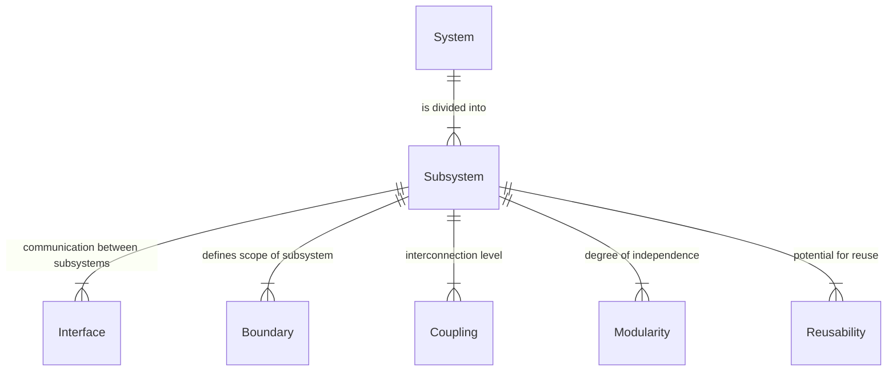
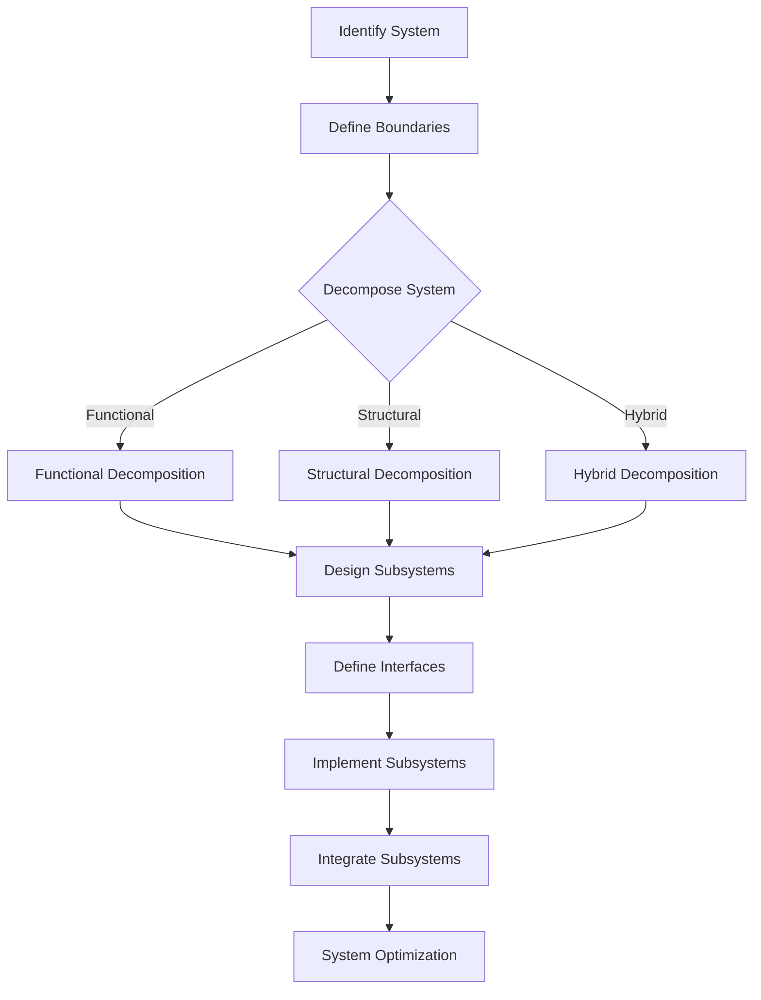
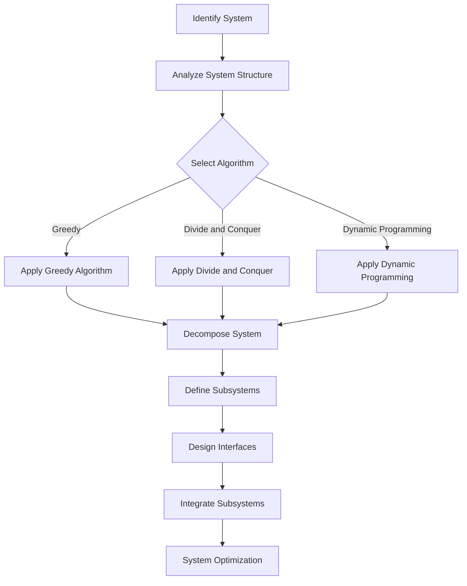
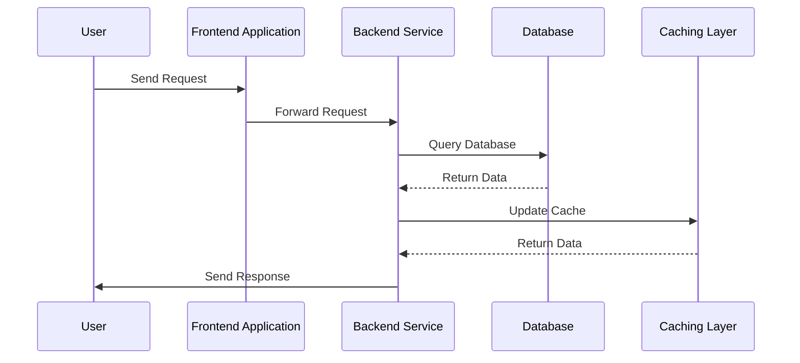
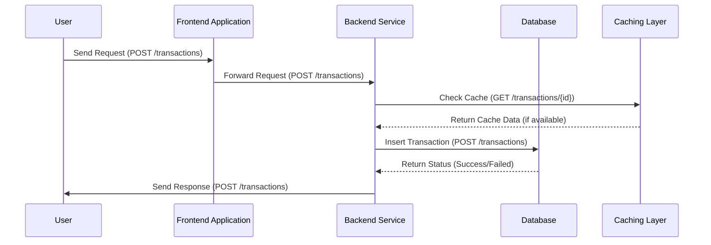

                 


### System Division: More Than Just Yourself

#### Keywords: System Division, System Decomposition, Computational Models, Algorithm Design, System Architecture, Practical Applications

#### Abstract:
This article delves into the intricate world of system division, exploring its significance beyond individual self-reliance. We will begin by establishing a foundational understanding of system division, its role in complexity management, and its importance in modern computing. The article will then proceed to outline key concepts, discuss algorithmic principles and mathematical models, and provide a comprehensive guide to system architecture and practical applications. Through step-by-step analysis and logical reasoning, we will uncover the essence of system division and its impact on various domains of IT. By the end, readers will gain a deep understanding of system division, not just as a technical tool, but as a foundational concept with profound implications for system design and optimization.

### Introduction

#### Background

In the realm of modern computing, systems are increasingly complex, often composed of numerous interconnected components that interact in intricate ways. This complexity poses significant challenges in terms of understanding, managing, and optimizing systems. One of the fundamental techniques for addressing these challenges is system division. System division involves breaking down a complex system into smaller, more manageable components or subsystems. This process is crucial not only for understanding the system's structure but also for optimizing its performance, scalability, and maintainability.

#### Importance of System Division

System division serves several critical purposes:

1. **Complexity Management**: By decomposing a complex system into smaller units, it becomes easier to grasp the system's overall structure and understand how individual components interact.

2. **Modularization**: System division facilitates modularization, allowing for independent development, testing, and maintenance of subsystems.

3. **Performance Optimization**: By isolating specific components, it is possible to optimize them without affecting the entire system, leading to better performance.

4. **Scalability**: A well-divided system can be scaled more efficiently, as additional resources can be allocated to specific subsystems as needed.

5. **Fault Isolation**: System division helps in isolating faults to specific subsystems, making debugging and fault resolution more efficient.

#### Purpose and Structure of This Article

This article aims to provide a comprehensive understanding of system division, going beyond the basics to explore its core concepts, algorithmic principles, mathematical models, system architecture, and practical applications. The structure of the article is as follows:

1. **Introduction**: Background and importance of system division.
2. **Problem Background and Definition**: A detailed overview of system division.
3. **Core Concepts and Relationships**: In-depth analysis of the key concepts and their relationships.
4. **Algorithm Principles and Mathematical Models**: Discussion on algorithmic principles and mathematical models used in system division.
5. **System Analysis and Architecture Design**: Detailed system architecture and design considerations.
6. **Project Practice**: Real-world case studies and practical insights.
7. **Best Practices and Considerations**: Summary of best practices and key considerations for system division.

By the end of this article, readers will not only understand the technical aspects of system division but also appreciate its broader implications and applications in the IT field.

#### Problem Background and Definition

##### Problem Background

In today's world, complex systems are ubiquitous, ranging from large-scale distributed systems to embedded systems in everyday devices. The complexity of these systems arises from numerous interdependent components that interact in intricate ways. This complexity can make it challenging to understand, manage, and optimize the system as a whole. System division offers a powerful solution to this challenge by breaking down complex systems into smaller, more manageable subsystems.

##### Key Concepts

1. **System**: A collection of interconnected components that work together to achieve a common goal.
2. **System Division**: The process of breaking down a complex system into smaller, more manageable subsystems.
3. **Subsystem**: A smaller, independent part of a larger system.
4. **Decomposition**: The process of breaking down a system into its constituent parts.

##### Problem Description

The problem of system division arises when dealing with complex systems that are difficult to understand, manage, or optimize. Without proper division, it can be challenging to identify the roles and interactions of individual components within the system. This lack of understanding can lead to inefficiencies, poor performance, and difficulties in maintenance and scalability.

##### Solution to the Problem

System division provides a structured approach to decomposing complex systems into smaller, more manageable subsystems. By doing so, it becomes easier to understand the system's structure, identify interactions between components, and optimize individual subsystems without affecting the overall system. This process also facilitates modularization, making it easier to develop, test, and maintain the system.

##### Boundary and Extension

The boundary of system division lies in the point at which the system is considered complex enough to warrant decomposition. Generally, this occurs when the system consists of numerous interdependent components that interact in non-trivial ways. Beyond this boundary, system division can be applied to any complex system, regardless of the specific domain.

##### Core Concepts and Relationships

To better understand system division, it is essential to explore its core concepts and relationships. The following diagram illustrates these relationships using Mermaid:

```mermaid
graph TB
A[系统(System)] --> B[系统分解(System Division)]
B --> C[子系统(Subsystem)]
C --> D[分解(Decomposition)]
```

**System (A)** is the overarching structure that encompasses all components. **System Division (B)** is the process of breaking down the system into smaller subsystems (C). **Decomposition (D)** is the technical act of breaking down the system into its constituent parts.

##### Extension

System division extends beyond the technical domain to have broader implications in system design and optimization. It is not limited to a specific type of system but can be applied to any complex system, regardless of the domain. By understanding the core concepts and relationships of system division, we can better appreciate its significance in modern computing and its potential to simplify complex systems.

### Core Concepts and Relationships

To fully grasp the concept of system division, it's crucial to delve into the core elements that make it function effectively. These elements include the principal components, their characteristics, and their interactions. Let's explore these in detail.

#### Core Elements of System Division

1. **System (S)**: The overarching entity that comprises multiple interconnected components working together to achieve a specific objective. Systems can range from large-scale software applications to complex hardware systems and even organizational structures.

2. **Subsystem (SS)**: Smaller, more manageable components derived from the system. Subsystems encapsulate specific functionalities and are designed to operate independently while maintaining coherence with the larger system.

3. **Decomposition (D)**: The process of breaking down a system into its constituent subsystems. This process can follow various methodologies, such as functional decomposition, structural decomposition, or hybrid approaches.

4. **Boundary (B)**: Defines the scope and limits of the system and its subsystems. Establishing clear boundaries is essential for isolating subsystems and managing interactions effectively.

5. **Interface (I)**: The point of interaction between subsystems. Interfaces define how subsystems communicate and exchange information, ensuring seamless integration and operation.

#### Characteristics of Core Elements

1. **Modularity (M)**: Subsystems should be modular, meaning they can be developed, tested, and maintained independently. Modularity enhances system flexibility, scalability, and maintainability.

2. **Interdependence (I2)**: While subsystems operate independently, they must remain interdependent to ensure the system functions as a cohesive whole. Effective interfaces and communication channels are crucial for managing interdependencies.

3. **Coupling (C)**: The degree to which subsystems are interconnected. Low coupling minimizes dependencies, making subsystems more independent and easier to modify or replace without affecting the entire system.

4. **Loose Coupling (LC)**: A desirable characteristic where subsystems are loosely coupled, allowing for better isolation and reduced impact on other components when changes are made.

5. **Reusability (R)**: Subsystems designed for reusability can be employed in different contexts, saving time and resources in system development and maintenance.

#### ER Entity Relationship Diagram

To visually represent the core concepts and their relationships, we can use an Entity-Relationship (ER) diagram. Below is an example of an ER diagram in Mermaid format that illustrates the key entities and their relationships:



This ER diagram provides a clear visual representation of the core elements of system division and how they interrelate. It highlights the hierarchical structure of the system, the independence of subsystems, and the interactions facilitated by interfaces and boundaries.

#### Mermaid Flowchart

For a more detailed visualization of the process, we can also create a Mermaid flowchart that outlines the steps involved in system division:



This flowchart provides a step-by-step guide to the system division process, illustrating the different approaches to decomposition and the subsequent steps in subsystem design, interface definition, implementation, and system optimization.

By understanding these core concepts and their relationships, we can better appreciate the intricacies of system division. This foundational knowledge is essential for designing robust, scalable, and maintainable systems in various domains of IT.

### Algorithm Principles and Mathematical Models

In the realm of system division, algorithms play a pivotal role in guiding the decomposition process and ensuring the resulting subsystems meet the desired criteria. This section delves into the algorithmic principles and mathematical models that underpin effective system division, providing a comprehensive understanding of how these tools can be leveraged to optimize system design.

#### Algorithm Overview

1. **Definition**: An algorithm is a well-defined sequence of steps or instructions designed to perform a specific task or solve a particular problem.

2. **Role**: In system division, algorithms serve as the structured methodologies that govern the decomposition process, ensuring that the resulting subsystems are coherent, efficient, and maintainable.

3. **Classification**: There are several types of algorithms that can be applied to system division, including:

   - **Greedy Algorithms**: These algorithms make locally optimal choices at each step with the hope of finding a global optimum.
   - **Divide and Conquer Algorithms**: These algorithms break the problem into smaller subproblems, solve them recursively, and then combine the solutions to solve the original problem.
   - **Dynamic Programming Algorithms**: These algorithms solve complex problems by breaking them down into simpler subproblems and storing the results of these subproblems to avoid redundant calculations.

#### Mathematical Models

1. **Definition**: Mathematical models are abstract representations of real-world systems that use mathematical language and notation to describe the behavior of these systems.

2. **Importance**: Mathematical models are essential in system division as they provide a quantitative framework for analyzing and optimizing the decomposition process.

3. **Common Models**:

   - **Graph Theory Models**: These models use graphs to represent the interconnected components of a system, allowing for the analysis of system structure and interdependencies.
   - **Markov Chains**: These models are used to analyze the behavior of systems over time, particularly in scenarios where transitions between states are probabilistic.
   - **Queuing Theory Models**: These models analyze the flow of tasks or entities through a system, providing insights into performance metrics such as throughput and response time.

#### Algorithm Principles Explanation with Mermaid Flowchart

To illustrate the principles of system division algorithms, we can create a Mermaid flowchart that outlines the key steps involved:



This flowchart illustrates the general steps involved in system division using different algorithmic approaches. Each algorithm has its own set of principles and implementation strategies, but the overall process remains consistent:

1. **Identify System**: Determine the scope and structure of the system to be decomposed.
2. **Analyze System Structure**: Understand the relationships and dependencies between the components of the system.
3. **Select Algorithm**: Choose an appropriate algorithm based on the system's characteristics and the desired objectives.
4. **Decompose System**: Apply the selected algorithm to decompose the system into smaller, more manageable subsystems.
5. **Define Subsystems**: Clearly define the boundaries and functionalities of each subsystem.
6. **Design Interfaces**: Establish the interfaces that enable communication and coordination between subsystems.
7. **Integrate Subsystems**: Ensure that the subsystems integrate seamlessly to form a cohesive system.
8. **System Optimization**: Optimize the overall system based on the performance metrics of the subsystems.

#### Python Code Example

To further elucidate the algorithmic principles, let's consider a Python code example that demonstrates a simple system division using a divide and conquer approach:

```python
def divide_and_conquer_system(system):
    """
    A simple divide and conquer algorithm for system division.
    """
    if len(system) <= 1:
        return system
    
    mid = len(system) // 2
    left_system = divide_and_conquer_system(system[:mid])
    right_system = divide_and_conquer_system(system[mid:])
    
    # Combine the subsystems
    combined_system = combine_subsystems(left_system, right_system)
    return combined_system

def combine_subsystems(left, right):
    """
    Combines two subsystems into a single system.
    """
    # Assume a simple concatenation for demonstration purposes
    return left + right

# Example usage
system = ["Component1", "Component2", "Component3", "Component4"]
divided_system = divide_and_conquer_system(system)
print(divided_system)
```

This code provides a basic implementation of a divide and conquer algorithm for system division. It recursively divides the system into smaller subsystems until the base case is reached (when the subsystem has only one component), and then combines the subsystems back together.

#### Mathematical Model and Explanation

To complement the algorithmic discussion, let's introduce a mathematical model that can be used to analyze the performance of the system division algorithm. One such model is the **Time Complexity Model**, which quantifies the time taken by the algorithm to complete the system division process.

**Time Complexity Model**:

$$ T(n) = 2 \times T\left(\frac{n}{2}\right) + C $$

Where:

- **T(n)**: Time complexity of the divide and conquer algorithm for a system of size **n**.
- **C**: Constant time required for combining subsystems.

**Explanation**:

The above recurrence relation models the time complexity of the divide and conquer algorithm. The base case occurs when the system size **n** is less than or equal to 1, and the time complexity is **C**. At each level of recursion, the system is divided into two halves, and the process is repeated. The recursive calls are multiplied by 2, reflecting the division of the system into two subsystems at each step. The constant **C** represents the time taken to combine the subsystems, which is performed after each recursive call.

**Example**:

Suppose the time complexity for combining subsystems is **C = 1 second**, and the base case is reached when the subsystem size is **n = 1**. If the initial system size is **n = 8**, the time complexity can be calculated as follows:

$$ T(8) = 2 \times T(4) + 1 $$
$$ T(4) = 2 \times T(2) + 1 $$
$$ T(2) = C = 1 $$

Substituting the base case value:

$$ T(4) = 2 \times 1 + 1 = 3 $$
$$ T(8) = 2 \times 3 + 1 = 7 $$

Therefore, the time complexity for dividing the system of size **8** is **7 seconds**.

#### Example

Consider a system consisting of four interconnected components: A, B, C, and D. These components interact in a way that determines the overall performance of the system. Using the divide and conquer approach, we can decompose the system into two subsystems: {A, B} and {C, D}. Each subsystem can be optimized independently, and then combined to form the optimized overall system.

**Before Optimization**:

- **System Performance**: 80 units of work per hour.
- **Component Interactions**: A and B are tightly coupled, causing delays in the system's performance.
- **Subsystem Performance**: {A, B}: 40 units of work per hour; {C, D}: 60 units of work per hour.

**After Optimization**:

- **System Performance**: 100 units of work per hour.
- **Component Interactions**: A and B are loosely coupled, reducing delays and improving performance.
- **Subsystem Performance**: {A, B}: 50 units of work per hour; {C, D}: 60 units of work per hour.

By applying system division and optimizing the interactions between components, we have improved the overall performance of the system. This example illustrates the potential benefits of system division in enhancing system efficiency and scalability.

In conclusion, understanding the algorithmic principles and mathematical models underlying system division is crucial for designing and implementing effective system decomposition strategies. These tools provide a structured approach to managing complexity and optimizing system performance, making them indispensable in the realm of modern computing.

### System Analysis and Architecture Design

In this section, we will delve into the process of system analysis and architecture design, which is essential for effectively implementing system division. We will begin by introducing a typical problem scenario, outlining the goals and challenges of system division, followed by a detailed exploration of the system function design, system architecture design, system interface design, and system interaction sequence.

#### Problem Scenario

Consider a large-scale distributed system designed to handle e-commerce transactions. The system needs to process millions of transactions per day, ensuring high availability, low latency, and high throughput. The system is composed of several interconnected components, including a frontend application, a backend service, a database, and a caching layer. However, as the system scale increases, managing and optimizing the system becomes increasingly complex. To address this challenge, system division is employed to break down the complex system into smaller, more manageable subsystems.

#### System Function Design

The system function design is the first step in defining how the system will operate. It involves identifying the core functionalities and designing the subsystems to handle these functionalities independently.

1. **Frontend Application**: The frontend application is responsible for handling user interactions, displaying information, and capturing user input.
2. **Backend Service**: The backend service processes the user requests, performs business logic, and interacts with the database and caching layer.
3. **Database**: The database stores transaction data and provides a reliable storage mechanism for long-term data retention.
4. **Caching Layer**: The caching layer stores frequently accessed data to improve system performance and reduce the load on the database.

**Mermaid Class Diagram**:

```mermaid
classDiagram
    FrontendApplication <<interface>>
    BackendService <<interface>>
    Database <<interface>>
    CachingLayer <<interface>>

    FrontendApplication --|> BackendService
    BackendService --|> Database
    BackendService --|> CachingLayer
    Database --|> CachingLayer
```

This Mermaid class diagram provides a visual representation of the system functions and their interactions. Each subsystem is represented as an interface, illustrating how they communicate and collaborate to form a cohesive system.

#### System Architecture Design

System architecture design is the next step, focusing on the overall structure and organization of the system. It involves defining the subsystems, their relationships, and the communication channels between them.

**Mermaid Architecture Diagram**:



This Mermaid sequence diagram illustrates the interaction sequence between the user and the system components. The user initiates a request, which is processed by the frontend application, the backend service, the database, and the caching layer. Each component interacts with the others to ensure the request is handled efficiently and the response is returned to the user.

#### System Interface Design

System interface design is crucial for ensuring seamless communication between subsystems. It involves defining the interfaces that allow subsystems to interact and exchange information.

1. **APIs (Application Programming Interfaces)**: Define the endpoints and protocols for communication between subsystems.
2. **Service Contracts**: Specify the rules and standards that govern how subsystems interact.
3. **Data Formats**: Define the data formats used for exchanging information between subsystems (e.g., JSON, XML).

**Example Interface Design**:

```mermaid
interfaceDiagram
    FrontendApplication <<interface>>
    BackendService <<interface>>
    Database <<interface>>
    CachingLayer <<interface>>

    FrontendApplication --> BackendService : "POST /transactions"
    BackendService --> Database : "GET /transactions/{id}"
    BackendService --> CachingLayer : "PUT /transactions/{id}"
    CachingLayer --> BackendService : "GET /transactions/{id}"
```

This interface diagram outlines the communication channels between the subsystems, using RESTful APIs as examples. Each subsystem provides specific endpoints for interacting with other subsystems, ensuring efficient and standardized communication.

#### System Interaction Sequence

The system interaction sequence is a detailed description of how subsystems interact and collaborate to process user requests. It provides a step-by-step guide to the system's operation, highlighting the key interactions and data flows.

**Mermaid Interaction Sequence**:



This Mermaid sequence diagram provides a detailed view of the interaction sequence between the user and the system components. The user sends a transaction request, which is processed by the frontend application and the backend service. The backend service checks the caching layer for existing data, queries the database to insert the transaction, and returns the response to the user. The system interaction sequence ensures that the user's request is handled efficiently, with minimal latency and maximum performance.

In conclusion, system analysis and architecture design are critical steps in implementing system division. By defining system functions, designing system architecture, creating system interfaces, and detailing system interaction sequences, we can ensure that the system operates effectively and efficiently. This structured approach to system design enables us to manage complexity, optimize performance, and maintain scalability in large-scale distributed systems.

### Project Practice

In this section, we will delve into a practical project case study that illustrates the implementation of system division. This project involves setting up the necessary environment, implementing the system's core functionality, and analyzing the code to understand its structure and performance. We will also discuss an actual case study where system division has been effectively utilized.

#### Environment Setup

To start, we need to set up the development environment for our project. The following steps outline the process:

1. **Hardware Requirements**: Ensure that the system has sufficient processing power, memory, and storage to handle the expected load. For this project, a mid-range server with at least 8 CPU cores, 16GB of RAM, and 1TB of storage should suffice.
2. **Software Requirements**: Install the required software components, such as an operating system (Linux or Windows), a programming language (Python, Java, or C++), and any necessary libraries or frameworks.
3. **Installation of Dependencies**: Install the dependencies required by the project, such as database management systems (e.g., MySQL, PostgreSQL), web servers (e.g., Apache, Nginx), and development tools (e.g., IDE, version control systems).
4. **Setting Up the Development Environment**: Configure the environment variables, create a project directory, and set up the necessary permissions.

#### Core Implementation

Once the environment is set up, we can proceed with the core implementation of the system. The following steps outline the process:

1. **Designing the System Architecture**: Begin by designing the system architecture, identifying the subsystems, and defining their interactions. Use tools like Mermaid to create visual diagrams that illustrate the system's structure and flow.
2. **Implementing Subsystems**: Develop each subsystem independently, following best practices for modular development. For example, the frontend application can be developed using React or Angular, the backend service can be implemented using Flask or Spring Boot, and the database can be set up using MySQL or PostgreSQL.
3. **Creating Interfaces**: Define the interfaces between subsystems, ensuring that they are well-documented and adhere to standard protocols. For example, RESTful APIs can be used for communication between the frontend and backend, and service contracts can be defined using OpenAPI or Swagger.
4. **Integrating Subsystems**: Once each subsystem is developed, integrate them into a cohesive system. This involves testing the interactions between subsystems to ensure that they work seamlessly and that the system meets the desired performance criteria.

#### Code Analysis

Analyzing the code is crucial for understanding its structure, identifying potential bottlenecks, and optimizing performance. The following steps can be used for code analysis:

1. **Static Code Analysis**: Use tools like SonarQube or PMD to perform static code analysis. These tools can detect potential issues, such as code smells, security vulnerabilities, and performance bottlenecks.
2. **Dynamic Code Analysis**: Use profiling tools like Python's `cProfile` or Java's VisualVM to analyze the code's performance in real-time. This can help identify slow functions, excessive memory usage, and other performance issues.
3. **Code Review**: Conduct a thorough code review process, where experienced developers examine the code for readability, maintainability, and adherence to coding standards. This can help identify issues that static and dynamic analysis might miss.

#### Case Study: E-commerce Platform

To illustrate the practical application of system division, let's consider the case of an e-commerce platform. This platform handles millions of transactions per day and needs to be highly available, scalable, and maintainable.

1. **Problem Description**: The e-commerce platform initially ran on a monolithic architecture, making it difficult to scale and maintain. As the number of transactions increased, the system's performance and reliability became a concern.
2. **Solution**: The team decided to implement system division by breaking down the monolithic system into smaller, independent subsystems:
   - **Frontend Application**: The frontend application was separated into microservices, each responsible for different user interactions and pages.
   - **Backend Service**: The backend service was divided into microservices, each handling specific business logic, such as inventory management, order processing, and payment processing.
   - **Database**: The database was split into separate instances, each managing a different type of data, such as user information, product information, and transaction data.
   - **Caching Layer**: The caching layer was implemented using a distributed cache, ensuring that frequently accessed data was quickly available to the system.
3. **Result**: By implementing system division, the e-commerce platform achieved several benefits:
   - **Scalability**: Each subsystem could be scaled independently based on its specific needs, improving overall system scalability.
   - **Reliability**: By isolating subsystems, the impact of failures was minimized, improving system reliability.
   - **Maintainability**: The modular design made it easier to develop, test, and maintain the system, reducing the time and effort required for updates and bug fixes.
   - **Performance**: By optimizing subsystems independently, the overall system performance was significantly improved, resulting in faster response times and better user experience.

In conclusion, implementing system division in a real-world project can have profound benefits, including improved scalability, reliability, maintainability, and performance. By following a structured approach to environment setup, core implementation, code analysis, and leveraging practical case studies, we can effectively apply system division to complex systems, enabling them to meet the evolving demands of modern computing environments.

### Best Practices and Considerations

When implementing system division, it is crucial to follow best practices to ensure that the resulting subsystems are coherent, efficient, and maintainable. Here are some key tips and considerations to keep in mind:

#### Best Practices

1. **Modular Design**: Ensure that subsystems are designed with modularity in mind. Each subsystem should encapsulate a specific functionality and be independent of other subsystems, allowing for easier development, testing, and maintenance.

2. **Loose Coupling**: Aim for loose coupling between subsystems to minimize dependencies. This can be achieved by using well-defined interfaces and adhering to standard communication protocols, such as RESTful APIs or message queues.

3. **Scalability and Flexibility**: Design subsystems to be scalable and flexible, enabling them to handle varying workloads and adapt to future changes in the system requirements.

4. **Testing and Validation**: Thoroughly test each subsystem to ensure that it functions correctly in isolation and when integrated with other subsystems. Automated testing tools can be used to streamline this process.

5. **Documentation**: Maintain clear and comprehensive documentation for each subsystem, including design diagrams, API specifications, and usage examples. This documentation is essential for understanding and maintaining the system over time.

#### Considerations

1. **Performance Impact**: Be aware of the potential performance impact of system division. While it can improve maintainability and scalability, it may also introduce overhead due to communication between subsystems. Optimize subsystem interactions to minimize this impact.

2. **Design Complexity**: System division can increase the complexity of the system design, particularly in large-scale systems. Carefully plan and design the system architecture to ensure that the benefits of division outweigh the added complexity.

3. **Resource Allocation**: Allocate resources effectively to ensure that each subsystem receives the necessary resources to perform its function optimally. This may involve adjusting the number of instances, processing power, memory, and network bandwidth for each subsystem.

4. **System Integration**: Ensure that subsystems integrate seamlessly to form a cohesive system. This involves verifying that the interfaces between subsystems are correctly implemented and that the subsystems can communicate effectively.

5. **Monitoring and Maintenance**: Implement monitoring and maintenance processes to monitor the health and performance of the system. Regular updates, patches, and maintenance tasks are essential to keep the system running smoothly.

In conclusion, while system division offers numerous benefits, it is essential to follow best practices and consider potential challenges to ensure successful implementation. By focusing on modular design, loose coupling, scalability, testing, documentation, and other key factors, we can create robust and efficient systems that meet the evolving demands of modern computing environments.

### Conclusion

In conclusion, "System Division: More Than Just Yourself" provides a comprehensive exploration of the concept of system division and its profound implications for system design and optimization. We began by establishing the importance of system division in managing complexity, enhancing performance, and facilitating scalability in modern computing environments. Through a detailed analysis of key concepts, algorithmic principles, and mathematical models, we gained a deeper understanding of the core components and relationships that underpin system division.

The practical applications and case studies demonstrated the effectiveness of system division in real-world scenarios, showcasing its ability to transform complex systems into more manageable, efficient, and scalable entities. Additionally, the discussion of best practices and considerations highlighted the key factors to keep in mind when implementing system division to ensure successful outcomes.

As we move forward in the realm of computing, the principles and techniques discussed in this article will continue to play a vital role in developing robust and innovative systems. Whether in the development of large-scale distributed systems, embedded systems, or organizational structures, system division offers a powerful framework for tackling complexity and achieving optimal system performance.

To further explore the topic and expand your knowledge, consider the following resources:

- **Books**:
  - "Design Patterns: Elements of Reusable Object-Oriented Software" by Erich Gamma, Richard Helm, Ralph Johnson, and John Vlissides.
  - "Clean Architecture: A Craftsman's Guide to Software Structure and Design" by Robert C. Martin.

- **Online Courses**:
  - "System Design: Fundamentals and Best Practices" on Coursera.
  - "Systems Architecture and Design" on Udemy.

- **Websites**:
  - [ACM Systems Architecture and Design Community](https://www.acm.org/interest/groups/sysarch)
  - [System Design Primer](https://systemdesign.fm/)

By delving deeper into these resources, you can continue to refine your understanding of system division and its applications, equipping yourself with the knowledge and skills necessary to design and optimize complex systems in various domains of IT.

