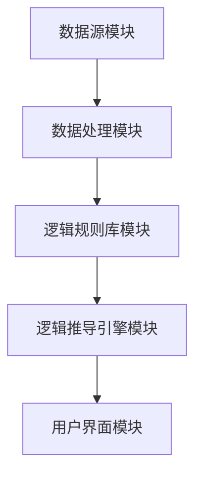

                 

# 系分的实质是严密的逻辑推导

> 关键词：逻辑推导、系统分析、算法原理、架构设计、实例解析

> 摘要：本文深入探讨了逻辑推导在系统分析和算法设计中的应用，通过详细阐述逻辑推导的实质及其在不同领域的应用，揭示了其在复杂系统构建中的核心地位。文章分为引言、逻辑推导的基本框架、逻辑推导算法、实例分析、系统架构与实现、逻辑推导的实际应用和总结与展望七个部分，旨在为读者提供一份全面、深入的技术指南。

## 引言

### 1.1 问题背景

在信息技术飞速发展的今天，复杂系统的构建和运行成为了许多领域的关键问题。这些系统通常涉及到大量数据、众多变量和复杂的关系，因此如何确保其稳定性和可靠性成为了一个重要的课题。逻辑推导作为一种基于逻辑和数学的方法，能够在复杂系统中提供一种有效的分析和设计手段。然而，逻辑推导的应用还面临着诸多挑战，如如何建立有效的逻辑规则、如何选择合适的逻辑推导算法等。本文旨在探讨逻辑推导的实质及其在复杂系统构建中的应用，为解决这些问题提供一些思路。

### 1.2 核心概念

逻辑推导是指基于已知事实和逻辑规则，通过推理和演绎，得出新结论的过程。它是一种形式化的思维方法，具有高度的严谨性和可靠性。逻辑推导在计算机科学、人工智能、数学等多个领域都有广泛的应用。本文将重点探讨逻辑推导在系统分析和算法设计中的应用。

## 第一部分：逻辑推导的基本框架

### 2.1 逻辑推导的基本流程

逻辑推导的基本流程可以分为三个阶段：数据收集与预处理、逻辑规则建模和逻辑推导与推理。

#### 2.1.1 数据收集与预处理

在逻辑推导过程中，首先需要收集相关的数据。这些数据可以是结构化的，如数据库中的表格数据，也可以是非结构化的，如图像、文本等。数据收集后，需要进行预处理，以去除噪声、填充缺失值、规范化数据等，确保数据的完整性和一致性。

#### 2.1.2 逻辑规则建模

逻辑规则建模是逻辑推导的核心环节。逻辑规则是对现实世界中关系的抽象和总结，通常采用形式化的表示方法，如谓词逻辑、模糊逻辑等。逻辑规则建模的目的是将现实世界的问题转化为逻辑形式，以便进行推理和演绎。

#### 2.1.3 逻辑推导与推理

在逻辑规则建模完成后，就可以进行逻辑推导和推理。逻辑推导是指基于已知事实和逻辑规则，通过推理和演绎，得出新结论的过程。推理可以分为正向推理和反向推理两种。正向推理是从已知事实出发，逐步推导出结论；反向推理是从结论出发，逐步回溯到已知事实。

### 2.2 逻辑规则建模

逻辑规则建模是逻辑推导的核心环节。逻辑规则是对现实世界中关系的抽象和总结，通常采用形式化的表示方法，如谓词逻辑、模糊逻辑等。

#### 2.2.1 逻辑规则的基本形式

逻辑规则通常由条件（前提）和结论两部分组成。条件表示逻辑推导的依据，结论表示逻辑推导的结果。例如，在一个医疗诊断系统中，条件可能是“患者发热”和“患者咳嗽”，结论是“患者患有感冒”。

$$
条件1 \land 条件2 \Rightarrow 结论
$$

#### 2.2.2 逻辑规则建模方法

逻辑规则建模的方法有多种，包括基于谓词逻辑的方法、基于模糊逻辑的方法等。谓词逻辑是一种形式化的逻辑表示方法，能够很好地描述复杂的关系和推理过程。模糊逻辑则能够处理不确定性和模糊性，适用于许多实际应用场景。

#### 2.2.3 逻辑规则优化与评估

逻辑规则的优化和评估是逻辑推导的重要环节。优化的目的是提高逻辑推导的效率和准确性，评估的目的是验证逻辑推导的有效性。常见的优化方法包括规则修剪、规则合并等。评估方法可以基于测试数据集、统计指标等。

## 第二部分：逻辑推导算法

### 3.1 经典逻辑推导算法

经典逻辑推导算法包括基于谓词逻辑的推导算法、基于模糊逻辑的推导算法和基于贝叶斯网络的推导算法。

#### 3.1.1 基于谓词逻辑的推导算法

基于谓词逻辑的推导算法是逻辑推导中最常用的算法之一。谓词逻辑是一种形式化的逻辑表示方法，能够很好地描述复杂的关系和推理过程。基于谓词逻辑的推导算法主要包括DPLL算法、Resolution算法等。

#### 3.1.2 基于模糊逻辑的推导算法

基于模糊逻辑的推导算法能够处理不确定性和模糊性，适用于许多实际应用场景。模糊逻辑的核心是模糊集合和模糊推理。基于模糊逻辑的推导算法主要包括模糊推理机、模糊神经网络等。

#### 3.1.3 基于贝叶斯网络的推导算法

基于贝叶斯网络的推导算法是一种概率推理方法，能够根据已知条件，计算未知条件的概率。贝叶斯网络是一种图形化的表示方法，能够直观地描述变量之间的依赖关系。基于贝叶斯网络的推导算法主要包括变量消除算法、信念传播算法等。

### 3.2 现代逻辑推导算法

现代逻辑推导算法包括基于深度学习的推导算法、基于遗传算法的推导算法和基于协同过滤的推导算法。

#### 3.2.1 基于深度学习的推导算法

基于深度学习的推导算法是近年来发展迅速的一种方法。深度学习模型能够自动学习数据中的复杂结构和关系，从而实现高效的逻辑推导。常见的深度学习模型包括卷积神经网络（CNN）、循环神经网络（RNN）、图神经网络（GNN）等。

#### 3.2.2 基于遗传算法的推导算法

基于遗传算法的推导算法是一种基于自然进化过程的优化算法。遗传算法通过模拟生物进化的过程，实现对问题的搜索和优化。基于遗传算法的推导算法适用于复杂、非线性的逻辑推导问题。

#### 3.2.3 基于协同过滤的推导算法

基于协同过滤的推导算法是一种基于用户行为和偏好的推理方法。协同过滤算法通过分析用户的历史行为和偏好，预测用户可能感兴趣的内容。基于协同过滤的推导算法适用于推荐系统和社交网络等应用场景。

## 第三部分：实例分析

### 4.1 实例1：医疗诊断系统

#### 4.1.1 问题场景

医疗诊断系统是一种基于逻辑推导的智能诊断系统，用于辅助医生进行疾病诊断。系统需要根据患者的症状、体征等数据，通过逻辑推导，得出可能的诊断结果。

#### 4.1.2 系统设计

医疗诊断系统主要包括以下几个模块：

1. 数据收集与预处理模块：收集患者的症状、体征等数据，并进行预处理。
2. 逻辑规则建模模块：建立疾病的逻辑规则库。
3. 逻辑推导模块：根据患者的症状、体征等数据，进行逻辑推导，得出诊断结果。
4. 用户界面模块：提供用户交互界面，展示诊断结果。

#### 4.1.3 系统实现

1. 数据收集与预处理模块：采用Python的Pandas库进行数据预处理。
2. 逻辑规则建模模块：采用谓词逻辑表示疾病逻辑规则。
3. 逻辑推导模块：采用DPLL算法进行逻辑推导。
4. 用户界面模块：采用HTML和JavaScript实现。

### 4.2 实例2：智能推荐系统

#### 4.2.1 问题场景

智能推荐系统是一种基于逻辑推导的推荐系统，用于根据用户的历史行为和偏好，推荐用户可能感兴趣的商品、新闻等内容。

#### 4.2.2 系统设计

智能推荐系统主要包括以下几个模块：

1. 数据收集与预处理模块：收集用户的历史行为数据，并进行预处理。
2. 逻辑规则建模模块：建立用户兴趣的逻辑规则库。
3. 逻辑推导模块：根据用户的历史行为和偏好，进行逻辑推导，推荐用户可能感兴趣的内容。
4. 用户界面模块：提供用户交互界面，展示推荐结果。

#### 4.2.3 系统实现

1. 数据收集与预处理模块：采用Python的Pandas库进行数据预处理。
2. 逻辑规则建模模块：采用模糊逻辑表示用户兴趣逻辑规则。
3. 逻辑推导模块：采用模糊推理机进行逻辑推导。
4. 用户界面模块：采用HTML和JavaScript实现。

## 第四部分：系统架构与实现

### 5.1 系统架构设计

系统架构设计是构建复杂系统的基础。本文将介绍一个典型的逻辑推导系统架构，包括以下几个模块：

1. 数据源模块：负责收集和处理各种类型的数据。
2. 数据预处理模块：对数据进行清洗、去噪、规范化等处理。
3. 逻辑规则库模块：存储和管理逻辑规则。
4. 逻辑推导引擎模块：执行逻辑推导任务。
5. 用户界面模块：提供用户交互界面。

#### 系统架构图

### 5.2 系统实现

系统实现是构建逻辑推导系统的关键。本文将介绍一个基于Python和Django的简单逻辑推导系统实现。

#### 环境搭建

1. 安装Python和Django。
2. 创建Django项目。

#### 核心代码实现

1. 数据收集与预处理模块：使用Python的Pandas库。
2. 逻辑规则库模块：使用Django的ORM（对象关系映射）功能。
3. 逻辑推导引擎模块：实现DPLL算法。
4. 用户界面模块：使用Django的模板系统。

#### 系统优化

1. 使用缓存技术提高系统响应速度。
2. 使用异步编程提高系统并发能力。

## 第五部分：逻辑推导的实际应用

### 6.1 在人工智能中的应用

逻辑推导在人工智能领域有着广泛的应用，包括机器学习、自然语言处理和计算机视觉等。

#### 6.1.1 机器学习中的逻辑推导

在机器学习中，逻辑推导主要用于特征提取和模型评估。通过逻辑推导，可以从原始数据中提取出有用的特征，提高模型的准确性和泛化能力。

#### 6.1.2 自然语言处理中的逻辑推导

自然语言处理中的逻辑推导主要用于语义理解和文本生成。通过逻辑推导，可以理解文本中的语义关系，生成符合语法和语义要求的文本。

#### 6.1.3 计算机视觉中的逻辑推导

计算机视觉中的逻辑推导主要用于目标检测和图像识别。通过逻辑推导，可以分析图像中的目标区域，识别出不同的目标。

### 6.2 在商业决策中的应用

逻辑推导在商业决策中也具有重要作用，包括商业智能分析、风险评估和客户行为分析等。

#### 6.2.1 商业智能分析

商业智能分析是一种基于数据分析和逻辑推导的方法，用于帮助企业发现数据中的价值，做出更明智的商业决策。

#### 6.2.2 风险评估与决策

风险评估与决策是一种基于逻辑推导的方法，用于评估企业面临的风险，并制定相应的风险管理策略。

#### 6.2.3 客户行为分析

客户行为分析是一种基于逻辑推导的方法，用于分析客户的行为模式，为企业提供个性化的产品和服务。

## 第六部分：总结与展望

### 7.1 总结

本文系统地介绍了逻辑推导的实质和应用，包括基本框架、算法原理、实例分析、系统架构与实现、实际应用等方面的内容。通过对逻辑推导的深入探讨，本文揭示了逻辑推导在复杂系统构建中的核心地位，为相关领域的研究和应用提供了有益的参考。

### 7.2 展望

未来，逻辑推导将在更多领域得到应用，如自动驾驶、智能医疗、智能家居等。同时，随着人工智能技术的发展，逻辑推导也将与其他技术相结合，如深度学习、强化学习等，进一步提升其在复杂系统构建中的能力。

## 作者信息

作者：AI天才研究院/AI Genius Institute & 禅与计算机程序设计艺术 /Zen And The Art of Computer Programming

