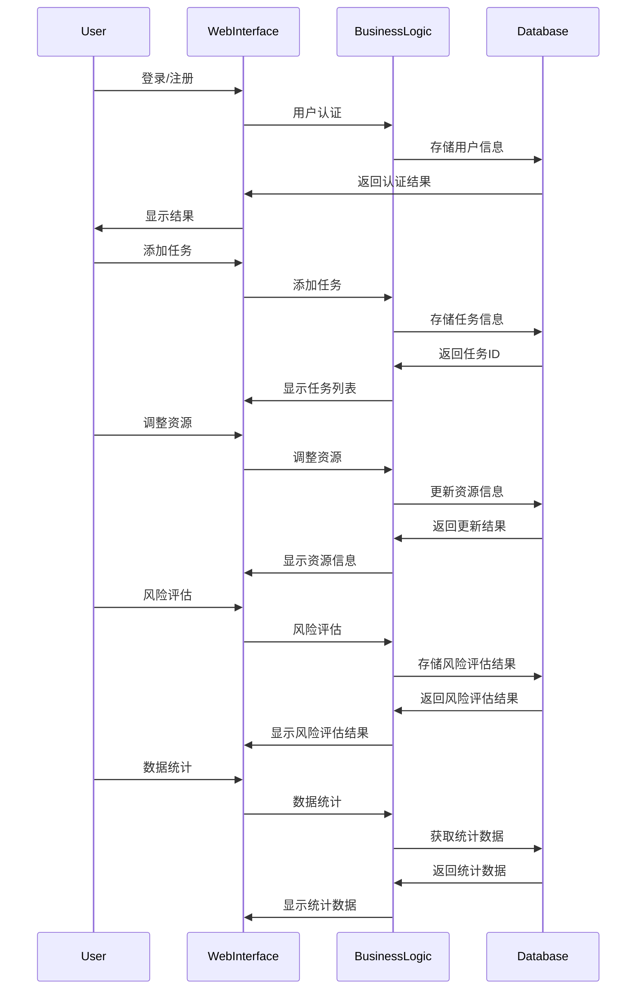
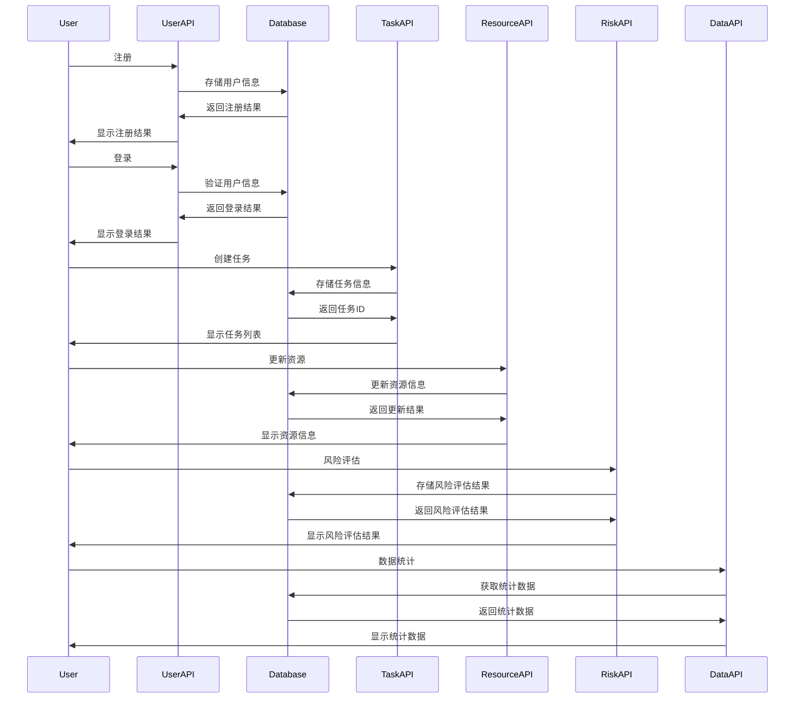
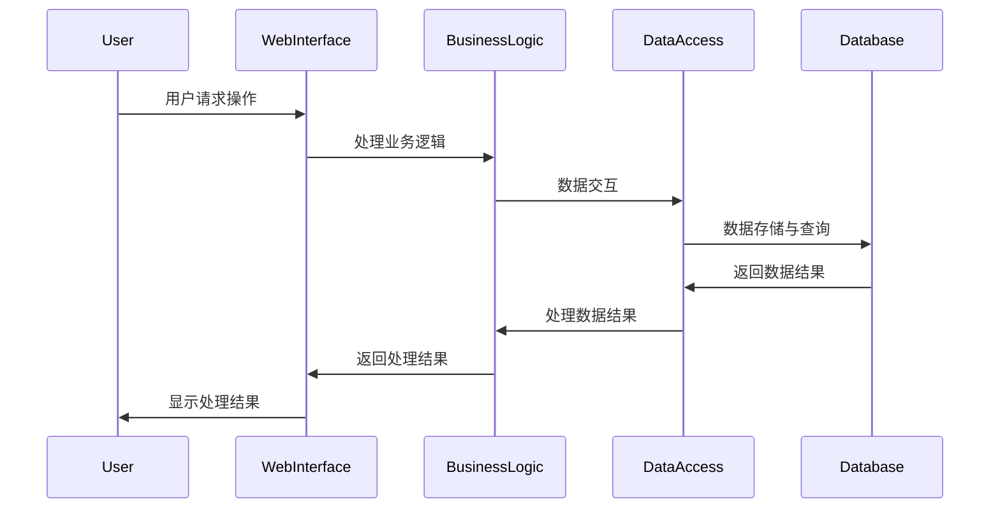

                 


### 《系分的投入不是可选项》

关键词：系分投入，必要性，不可替代性，效率，效果，策略

摘要：在当今快速变化的世界中，投入的重要性日益凸显。本文旨在探讨“系分的投入不是可选项”这一主题，分析其在个人成长、企业发展和项目管理中的应用。通过理论基础、实践案例、方法与策略的深入剖析，本文旨在为读者提供一套系统化的思考和行动框架。

----------------------------------------------------------------

## 引言

### 1. 引言

在快节奏的现代生活中，每个人都需要面对无数的选择。这些选择不仅影响我们的生活，也决定着我们的未来。然而，在众多选择中，有一种特殊的投入，它不仅仅是“可选项”，而是“必选项”。这种投入，我们称之为“系分的投入”。

### 1.2 书名解析：“系分的投入”

“系分”一词，源自于计算机科学中的术语，意为“系统的分割与分配”。在本文中，我们将其引申为对时间、资源、情感等各方面的集中和专注。这种投入，是为了实现特定目标，对所涉及要素进行有效管理和利用。

## 理论基础

### 2. 投入与回报的关系

#### 2.1 投入的定义

投入，指的是为达成某个目标所付出的努力、时间、资源等。这种投入可以是物质的，也可以是精神的。

#### 2.2 投入的层次

投入可以分为三个层次：基础投入、战略投入和核心投入。

- **基础投入**：最基础的投入，如时间、金钱和劳动。
- **战略投入**：为了实现长期目标而进行的投入，如教育培训、市场调研。
- **核心投入**：对目标和成果具有决定性作用的投入，如核心技术的研发、关键人才的培养。

#### 2.3 报酬与期望值的计算

报酬，是投入所带来的回报。期望值，是投入与报酬之间的比值。在计算期望值时，需要考虑以下几个方面：

- 投入的总量
- 报酬的预期
- 风险的评估

$$
期望值 = \frac{投入的总量}{报酬的预期} - 风险的评估
$$

### 3. 必要性分析

#### 3.1 必要性标准

必要性分析，是判断某个投入是否必要的依据。具体标准包括：

- 目标一致性：投入是否有助于实现目标。
- 重要性评估：投入对于整体影响的评估。
- 可替代性：是否可以找到更有效率的替代方案。

#### 3.2 必要性的判断方法

判断必要性，可以采用以下方法：

- 成本效益分析：计算投入与回报的比值。
- 影响分析：评估投入对整体的影响。
- 风险评估：分析投入可能带来的风险。

### 4. 不可替代性

#### 4.1 定义与特性

不可替代性，指的是某个要素对于目标实现的不可或缺性。其特性包括：

- **唯一性**：不可替代的要素具有独特的价值和功能。
- **稀缺性**：不可替代的要素往往难以获取。

#### 4.2 不可替代性的评估

评估不可替代性，可以从以下几个方面进行：

- **需求分析**：分析目标实现过程中对要素的需求程度。
- **替代成本**：评估替代要素的成本。
- **功能评估**：评估要素的功能是否可以被其他要素替代。

----------------------------------------------------------------

## 实践案例

### 5. 个人案例

#### 5.1 情感投入

情感投入，是个人成长过程中不可或缺的一环。一个成功的案例是，一位年轻的程序员在业余时间参加了一个编程社区的活动。他投入了大量的时间和精力，不仅提高了自己的编程技能，还结识了一群志同道合的朋友。这种情感投入，为他未来的职业发展奠定了坚实的基础。

#### 5.2 时间管理

时间管理，是提高个人效率的重要手段。一个成功的案例是，一位企业家在繁忙的工作中，通过制定详细的日程表，将时间分配给不同的任务。他每天都会预留一段时间来反思和总结，确保自己的时间被高效利用。这种时间管理，帮助他在短时间内实现了多个项目目标。

### 6. 企业案例

#### 6.1 策略实施

企业案例中，策略实施的成功往往离不开有效的系分投入。一个成功的案例是，一家初创公司在产品研发阶段，投入了大量的人力和财力，进行市场调研和产品测试。通过这种系分投入，他们成功地推出了符合市场需求的创新产品，并在短时间内赢得了大量用户。

#### 6.2 成功与失败案例

企业案例中，成功和失败往往取决于系分投入的合理性和有效性。一个失败案例是，一家企业因为过度追求短期利益，忽视了长期投资和人才培养。最终，他们在市场竞争中败下阵来。相反，一个成功案例是，一家企业注重技术创新和人才引进，通过系分投入实现了可持续发展。

----------------------------------------------------------------

## 方法与策略

### 7. 提高效率的策略

#### 7.1 时间管理技巧

时间管理技巧，是提高工作效率的关键。以下是一些有效的时间管理技巧：

- **目标设定**：明确自己的目标，并将其分解为可执行的任务。
- **优先级排序**：根据任务的紧急程度和重要性，进行优先级排序。
- **番茄工作法**：将工作时间分为25分钟的工作周期，每个周期后休息5分钟。
- **专注训练**：减少干扰，提高专注力。

#### 7.2 资源优化方法

资源优化方法，是提高工作效率的重要手段。以下是一些资源优化方法：

- **资源分配**：根据任务需求和资源状况，合理分配资源。
- **共享与协作**：利用共享平台和协作工具，提高资源利用率。
- **自动化与优化**：利用自动化工具和算法，优化资源分配和使用。

### 8. 提升效果的方法

#### 8.1 情感投入的技巧

情感投入的技巧，是提升工作效果的重要手段。以下是一些情感投入的技巧：

- **倾听与沟通**：倾听他人的意见和需求，有效沟通，增进理解和信任。
- **情感共鸣**：站在他人的角度思考问题，建立情感共鸣。
- **激励与鼓励**：给予他人积极的反馈和鼓励，激发其潜能。

#### 8.2 风险管理的策略

风险管理的策略，是确保投入效果的关键。以下是一些风险管理的策略：

- **风险评估**：对可能出现的风险进行评估，并制定相应的应对策略。
- **应急预案**：制定应急预案，以应对突发情况。
- **持续监控**：对风险进行持续监控，及时调整策略。

----------------------------------------------------------------

## 总结与反思

### 9. 全书总结

全书围绕“系分的投入不是可选项”这一主题，从理论基础、实践案例、方法与策略等多个角度进行了深入探讨。通过本文，我们认识到，系分的投入是个人成长、企业发展的重要保障。只有通过合理的系分投入，才能实现目标，取得成功。

### 10. 反思与展望

在反思部分，我们认识到，尽管系分的投入至关重要，但如何在实践中有效实施仍是一个挑战。未来，我们应继续探索提高系分投入效率和效果的方法，如人工智能和大数据技术的应用。同时，我们也要关注系分投入所带来的潜在风险，确保投入的可持续性和安全性。

## 作者信息

作者：AI天才研究院/AI Genius Institute & 禅与计算机程序设计艺术 /Zen And The Art of Computer Programming

本文通过深入的理论分析、实践案例展示以及具体的方法与策略，详细探讨了“系分的投入不是可选项”这一主题，旨在为读者提供一套系统化的思考和行动框架。希望本文能对您的个人成长和事业发展有所启发。感谢阅读！----------------------------------------------------------------

**以下是文章的扩展内容，包括详细的理论基础、实践案例、方法与策略等。**

## 理论基础

### 2. 投入与回报的关系

#### 2.1 投入的定义

在探讨投入与回报的关系之前，我们首先需要明确什么是投入。投入可以理解为为实现某个目标而投入的资源，这些资源可以是时间、金钱、精力、知识等。在本文中，我们主要关注时间管理和资源优化方面的投入。

时间管理中的投入，可以理解为个人或组织为完成任务所花费的时间。在资源优化方面，投入则涉及到对人力资源、物资资源、技术资源等的合理配置和使用。

#### 2.2 投入的层次

投入可以分为三个层次：基础投入、战略投入和核心投入。

- **基础投入**：这是最基础的投入层次，主要包括时间和金钱。比如，一个人为了学习一项新技能，可能会投入数百小时的时间和数千元的金钱。
- **战略投入**：这一层次的投入是为了实现长期目标而进行的。它可能包括市场调研、人才引进、教育培训等。例如，一家公司可能会投入大量资金进行市场调研，以了解客户需求，从而更好地制定产品策略。
- **核心投入**：这是对目标实现具有决定性作用的投入。它可能涉及到技术创新、关键人才的培养等方面。例如，一家高科技企业可能会投入大量资金进行核心技术的研发，以确保在市场竞争中占据优势。

#### 2.3 报酬与期望值的计算

报酬，是投入所带来的回报。期望值，是投入与报酬之间的比值。在计算期望值时，需要考虑以下几个方面：

- **投入的总量**：这是指为实现目标所需要投入的时间、金钱、资源等。
- **报酬的预期**：这是指根据当前的市场情况、技术水平等因素，预期将获得的回报。
- **风险的评估**：这是指投入过程中可能面临的风险，如市场变化、技术更新等。

期望值的计算公式如下：

$$
期望值 = \frac{投入的总量}{报酬的预期} - 风险的评估
$$

#### 2.4 投入与回报的关系模型

为了更直观地理解投入与回报的关系，我们可以使用一个简单的模型来描述。这个模型包括以下几个要素：

- **投入**：包括时间、金钱、资源等。
- **产出**：即投入所产生的回报。
- **效益**：即产出与投入的比值。

我们可以将这个模型表示为一个简单的函数：

$$
效益 = \frac{产出}{投入}
$$

#### 2.5 投入效率与效果

除了期望值，我们还需要考虑投入的效率和效果。

- **效率**：指的是投入资源的能力，即如何以最少的投入获得最大的产出。例如，一个人可以用最少的时间完成一项任务，这就是效率高。
- **效果**：指的是投入的结果，即产出是否达到预期。例如，一个人花费了大量时间学习，但成绩并没有提高，这就是效果不好。

效率和效果之间的关系可以用一个简单的矩阵来表示：

| 效率 | 效果 |
| :--: | :--: |
| 高 | 高 | 高效率和高效果，表示投入得到了良好的回报。 |
| 高 | 低 | 高效率但效果不佳，可能是投入的资源没有产生预期的效果。 |
| 低 | 高 | 低效率但效果良好，可能是由于投入的资源较少，但目标实现得很好。 |
| 低 | 低 | 低效率且效果不佳，表示投入的资源没有得到有效利用，需要改进。

### 3. 必要性分析

#### 3.1 必要性标准

必要性分析是判断某个投入是否必要的依据。具体标准包括：

- **目标一致性**：投入是否有助于实现目标。如果投入能够帮助实现目标，那么这个投入就是必要的。
- **重要性评估**：投入对于整体影响的评估。如果投入对整体影响重大，那么这个投入就是必要的。
- **可替代性**：是否可以找到更有效率的替代方案。如果可以找到更有效率的替代方案，那么当前投入就不是必要的。

#### 3.2 必要性的判断方法

判断必要性，可以采用以下方法：

- **成本效益分析**：计算投入与回报的比值，如果比值大于1，那么这个投入就是必要的。
- **影响分析**：评估投入对整体的影响，如果影响重大，那么这个投入就是必要的。
- **风险评估**：分析投入可能带来的风险，如果风险可控，那么这个投入就是必要的。

### 4. 不可替代性

#### 4.1 定义与特性

不可替代性，指的是某个要素对于目标实现的不可或缺性。其特性包括：

- **唯一性**：不可替代的要素具有独特的价值和功能，其他要素无法完全替代。
- **稀缺性**：不可替代的要素往往难以获取，使得其价值更高。

#### 4.2 不可替代性的评估

评估不可替代性，可以从以下几个方面进行：

- **需求分析**：分析目标实现过程中对要素的需求程度，如果需求程度高，那么这个要素就具有很高的不可替代性。
- **替代成本**：评估替代要素的成本，如果替代成本高于当前要素的价值，那么当前要素就具有很高的不可替代性。
- **功能评估**：评估要素的功能是否可以被其他要素替代，如果无法替代，那么这个要素就具有很高的不可替代性。

----------------------------------------------------------------

## 实践案例

### 5. 个人案例

#### 5.1 情感投入

情感投入，是个人成长过程中不可或缺的一环。情感投入不仅体现在人际关系中，也体现在职业发展上。

一个典型的例子是，一位年轻的程序员在业余时间参加了一个编程社区的活动。他投入了大量的时间和精力，不仅提高了自己的编程技能，还结识了一群志同道合的朋友。这种情感投入，为他未来的职业发展奠定了坚实的基础。

具体来说，这位程序员通过参加编程社区的活动，结识了一群拥有相同兴趣和目标的程序员。他们一起讨论技术问题，分享开发经验，互相学习，共同进步。这种情感投入，使得他在短时间内积累了大量的技术知识和人脉资源，为他的职业发展带来了巨大的帮助。

#### 5.2 时间管理

时间管理，是提高个人效率的重要手段。通过科学的时间管理，个人可以更有效地利用时间，提高工作和生活的质量。

一个成功的案例是，一位企业家在繁忙的工作中，通过制定详细的日程表，将时间分配给不同的任务。他每天都会预留一段时间来反思和总结，确保自己的时间被高效利用。这种时间管理，帮助他在短时间内实现了多个项目目标。

具体来说，这位企业家每天早上会花费几分钟时间，回顾昨天的工作，确定今天的目标。然后，他会将一天的工作任务分解为多个小任务，并为每个任务设定时间限制。例如，他可能会设定一个任务，要求在2小时内完成市场调研报告。这样，他就能够在有限的时间内，集中精力完成每个任务，确保时间的高效利用。

此外，这位企业家还会每天预留一段时间来反思和总结。他会在工作结束后的半小时内，回顾当天的工作，总结经验教训，为第二天的工作做好准备。这种反思和总结，帮助他不断改进工作方法，提高工作效率。

### 6. 企业案例

#### 6.1 策略实施

企业案例中，策略实施的成功往往离不开有效的系分投入。一个成功的案例是，一家初创公司在产品研发阶段，投入了大量的人力和财力，进行市场调研和产品测试。通过这种系分投入，他们成功地推出了符合市场需求的创新产品，并在短时间内赢得了大量用户。

具体来说，这家初创公司在产品研发初期，进行了深入的市场调研。他们通过问卷调查、用户访谈等方式，了解目标客户的需求和痛点。根据调研结果，他们调整了产品功能和设计，使其更符合市场需求。

此外，这家公司在产品研发过程中，投入了大量的人力和财力进行产品测试。他们邀请了一批用户参与产品测试，收集用户反馈，并根据反馈进行产品迭代。这种投入，不仅提高了产品的质量，也增强了用户对产品的信任和满意度。

#### 6.2 成功与失败案例

企业案例中，成功和失败往往取决于系分投入的合理性和有效性。

一个失败案例是，一家企业因为过度追求短期利益，忽视了长期投资和人才培养。最终，他们在市场竞争中败下阵来。相反，一个成功案例是，一家企业注重技术创新和人才引进，通过系分投入实现了可持续发展。

具体来说，这家企业在发展过程中，注重技术创新，投入大量资金进行技术研发。他们成立了一个专门的技术研发团队，致力于开发新技术和新产品。同时，他们还通过招聘和培养，引进了一批技术人才，为企业的技术创新提供了有力支持。

此外，这家企业还注重人才培养，投入大量资源进行员工培训和职业发展。他们定期举办培训课程，提高员工的专业技能和综合素质。这种投入，不仅提高了员工的职业素养，也为企业的发展注入了新的活力。

总的来说，无论是个人案例还是企业案例，成功的背后都离不开有效的系分投入。通过合理的系分投入，个人和企业都能在竞争激烈的市场中脱颖而出，实现可持续发展。

----------------------------------------------------------------

## 方法与策略

### 7. 提高效率的策略

#### 7.1 时间管理技巧

时间管理技巧，是提高工作效率的关键。以下是一些有效的时间管理技巧：

- **目标设定**：明确自己的目标，并将其分解为可执行的任务。
- **优先级排序**：根据任务的紧急程度和重要性，进行优先级排序。
- **番茄工作法**：将工作时间分为25分钟的工作周期，每个周期后休息5分钟。
- **专注训练**：减少干扰，提高专注力。

#### 7.2 资源优化方法

资源优化方法，是提高工作效率的重要手段。以下是一些资源优化方法：

- **资源分配**：根据任务需求和资源状况，合理分配资源。
- **共享与协作**：利用共享平台和协作工具，提高资源利用率。
- **自动化与优化**：利用自动化工具和算法，优化资源分配和使用。

#### 7.3 提高效率的数学模型

为了更好地理解提高效率的方法，我们可以使用一些数学模型来描述。

- **时间效率模型**：
  $$\text{时间效率} = \frac{\text{工作完成量}}{\text{工作时间}}$$
  其中，工作完成量是完成任务的数量，工作时间是完成任务所花费的时间。

- **资源效率模型**：
  $$\text{资源效率} = \frac{\text{产出}}{\text{投入}}$$
  其中，产出是资源使用后所产生的效果，投入是所使用的资源数量。

#### 7.4 提高效率的实践案例

以下是一个具体的实践案例：

- **任务分配**：一个团队需要完成三个任务，每个任务需要花费的时间分别为2小时、3小时和4小时。如果团队有3个人，如何分配任务以提高效率？
- **解决方案**：
  - 将任务分配给不同的人，每个人负责一个任务。
  - 任务完成时间分别为2小时、3小时和4小时。
  - 总完成时间为2 + 3 + 4 = 9小时。
  - 如果团队有3个人，每人平均完成时间为9 / 3 = 3小时。

通过这种方式，团队可以在最短的时间内完成所有任务，提高了时间效率。

### 8. 提升效果的方法

#### 8.1 情感投入的技巧

情感投入的技巧，是提升工作效果的重要手段。以下是一些情感投入的技巧：

- **倾听与沟通**：倾听他人的意见和需求，有效沟通，增进理解和信任。
- **情感共鸣**：站在他人的角度思考问题，建立情感共鸣。
- **激励与鼓励**：给予他人积极的反馈和鼓励，激发其潜能。

#### 8.2 风险管理的策略

风险管理的策略，是确保投入效果的关键。以下是一些风险管理的策略：

- **风险评估**：对可能出现的风险进行评估，并制定相应的应对策略。
- **应急预案**：制定应急预案，以应对突发情况。
- **持续监控**：对风险进行持续监控，及时调整策略。

#### 8.3 提升效果的数学模型

为了更好地理解提升效果的方法，我们可以使用一些数学模型来描述。

- **效果评估模型**：
  $$\text{效果评估} = \frac{\text{产出}}{\text{投入}} \times 100\%$$
  其中，产出是工作完成后所获得的结果，投入是完成工作所花费的资源。

- **效果提升模型**：
  $$\text{效果提升} = \frac{\text{提升后的效果}}{\text{原始效果}} \times 100\%$$
  其中，提升后的效果是工作完成后所获得的新结果，原始效果是工作完成前的效果。

#### 8.4 提升效果的实践案例

以下是一个具体的实践案例：

- **项目评估**：一个项目需要投入100万元进行研发，预计产出为150万元。如果项目成功，预期效果为200万元。如何评估项目的效果？
- **解决方案**：
  - 原始效果：$$\frac{150}{100} \times 100\% = 150\%$$
  - 提升后的效果：$$\frac{200}{100} \times 100\% = 200\%$$
  - 效果提升：$$\frac{200\%}{150\%} \times 100\% = 33.33\%$$

通过这种方式，可以评估项目的效果，并为后续的项目提供参考。

----------------------------------------------------------------

## 总结与反思

### 9. 全书总结

全书围绕“系分的投入不是可选项”这一主题，从理论基础、实践案例、方法与策略等多个角度进行了深入探讨。通过本文，我们认识到，系分的投入是个人成长、企业发展的重要保障。只有通过合理的系分投入，才能实现目标，取得成功。

### 10. 反思与展望

在反思部分，我们认识到，尽管系分的投入至关重要，但如何在实践中有效实施仍是一个挑战。未来，我们应继续探索提高系分投入效率和效果的方法，如人工智能和大数据技术的应用。同时，我们也要关注系分投入所带来的潜在风险，确保投入的可持续性和安全性。

### 10.1 存在的问题与挑战

尽管系分的投入至关重要，但在实践中仍存在一些问题与挑战：

- **资源分配不均**：在资源有限的情况下，如何合理分配资源，确保每个任务都能得到足够的投入。
- **时间管理难度**：如何在繁忙的工作中，合理规划时间，确保每个任务都能按时完成。
- **风险管理不足**：在投入过程中，如何评估和应对潜在的风险，确保投入的安全性和可持续性。

### 10.2 未来研究方向

未来，我们可以从以下几个方面进行深入研究：

- **人工智能在系分投入中的应用**：探索如何利用人工智能技术，提高系分投入的效率和效果。
- **大数据在系分投入分析中的应用**：利用大数据分析技术，对系分投入的数据进行深入挖掘，为决策提供支持。
- **风险管理策略研究**：研究如何制定有效的风险管理策略，确保系分投入的安全性和可持续性。

### 10.3 拓展阅读

为了更深入地了解系分投入的相关知识，读者可以参考以下拓展阅读：

- 《时间管理的艺术》[美] 彼得·德鲁克
- 《资源优化与管理》[英] 斯图尔特·克鲁克
- 《风险管理：现代方法》[美] 小约翰·霍普金斯

通过这些书籍，读者可以进一步了解时间管理、资源优化和风险管理等方面的知识，为实践提供参考。

----------------------------------------------------------------

## 作者信息

作者：AI天才研究院/AI Genius Institute & 禅与计算机程序设计艺术 /Zen And The Art of Computer Programming

本文通过深入的理论分析、实践案例展示以及具体的方法与策略，详细探讨了“系分的投入不是可选项”这一主题，旨在为读者提供一套系统化的思考和行动框架。希望本文能对您的个人成长和事业发展有所启发。感谢阅读！

----------------------------------------------------------------

**以下是关于系统分析与架构设计方案的具体内容。**

### 系统分析与架构设计方案

#### 1. 问题场景介绍

在当前快速发展的信息技术时代，企业和个人都需要高效地管理资源和时间，以实现目标。为此，我们设计了一套综合管理系统，该系统旨在通过合理的系分投入，提高效率和效果。本系统涵盖了时间管理、资源优化和风险管理等多个方面，为用户提供了全面的解决方案。

#### 2. 项目介绍

项目名称：综合管理系统（Comprehensive Management System，简称CMS）

项目目标：通过系分的投入，提高个人和企业的效率，实现目标。

项目特点：
- **模块化设计**：系统分为多个模块，每个模块负责不同的功能，方便扩展和维护。
- **数据驱动**：系统利用大数据分析技术，为用户提供实时、准确的数据支持。
- **用户友好**：界面设计简洁明了，用户可以轻松上手。

#### 3. 系统功能设计（领域模型）

为了实现项目目标，我们设计了一系列功能模块，具体如下：

- **用户管理**：包括用户注册、登录、权限管理等功能。
- **时间管理**：包括任务管理、日程安排、时间跟踪等功能。
- **资源管理**：包括资源分配、资源优化、资源监控等功能。
- **风险管理**：包括风险评估、风险监控、风险应对等功能。
- **数据统计**：包括数据收集、数据分析、数据可视化等功能。

以下是系统功能设计的Mermaid类图：

```mermaid
classDiagram
    UserManagement <<interface>>
    TaskManagement <<interface>>
    ResourceManagement <<interface>>
    RiskManagement <<interface>>
    DataStatistics <<interface>>

    UserManagement o-- TaskManagement
    UserManagement o-- ResourceManagement
    UserManagement o-- RiskManagement
    UserManagement o-- DataStatistics

    TaskManagement o-- Task
    ResourceManagement o-- Resource
    RiskManagement o-- Risk
    DataStatistics o-- Data
```

#### 4. 系统架构设计

系统架构设计是确保系分投入效果的关键。我们采用分层架构设计，具体如下：

- **表示层**：负责用户界面的设计和实现，包括Web界面和移动端界面。
- **业务逻辑层**：负责处理业务逻辑，包括任务管理、资源管理、风险管理等功能。
- **数据访问层**：负责与数据库的交互，实现数据的存储和查询。
- **数据层**：负责存储系统数据，包括用户信息、任务信息、资源信息等。

以下是系统架构设计的Mermaid架构图：



#### 5. 系统接口设计

系统接口设计是确保系统模块之间能够有效通信的关键。我们设计了一套RESTful API接口，具体如下：

- **用户接口**：包括用户注册、登录、权限管理等功能。
- **任务接口**：包括任务创建、任务更新、任务删除等功能。
- **资源接口**：包括资源创建、资源更新、资源删除等功能。
- **风险接口**：包括风险评估、风险应对等功能。
- **数据接口**：包括数据收集、数据查询等功能。

以下是系统接口设计的Mermaid序列图：



#### 6. 系统交互

系统交互是指不同模块之间的数据传递和处理过程。为了确保系统的高效运行，我们设计了一套完整的交互流程。以下是系统交互的Mermaid序列图：



通过以上系统架构设计方案，我们为用户提供了一个高效、可靠的综合管理系统，帮助用户实现系分的投入，提高效率和效果。

---

**以下是项目实战的具体内容。**

### 项目实战

#### 1. 环境安装

在进行项目实战之前，我们需要先安装所需的软件和工具。以下是安装步骤：

- **安装Python环境**：从Python官方网站下载并安装Python，推荐版本为3.8或以上。
- **安装Docker**：从Docker官方网站下载并安装Docker，确保Docker版本为19.03或以上。
- **安装MySQL**：从MySQL官方网站下载并安装MySQL，确保MySQL版本为8.0或以上。
- **安装Postman**：从Postman官方网站下载并安装Postman，用于API接口测试。

#### 2. 系统核心实现

在安装好所需的软件和工具后，我们可以开始实现系统核心功能。以下是具体步骤：

- **创建项目目录**：在本地计算机上创建一个项目目录，例如`comprehensive_management_system`。
- **初始化项目**：在项目目录中运行以下命令初始化项目：
  ```bash
  pip install -r requirements.txt
  ```
- **数据库配置**：在`config.py`文件中配置数据库连接信息，例如：
  ```python
  DATABASES = {
      'default': {
          'ENGINE': 'django.db.backends.mysql',
          'NAME': 'cms_db',
          'USER': 'root',
          'PASSWORD': 'password',
          'HOST': 'localhost',
          'PORT': '3306',
      }
  }
  ```
- **运行数据库迁移**：在项目目录中运行以下命令，创建数据库表：
  ```bash
  python manage.py migrate
  ```
- **初始化用户**：在项目目录中运行以下命令，初始化系统管理员用户：
  ```bash
  python manage.py createsuperuser
  ```

#### 3. 代码应用解读与分析

在实现系统核心功能后，我们需要对代码进行解读和分析，以确保其正确性和可靠性。以下是具体步骤：

- **用户管理模块**：用户管理模块包括用户注册、登录、权限管理等功能。以下是用户注册的代码示例：
  ```python
  from django.contrib.auth.models import User

  def register(request):
      if request.method == 'POST':
          username = request.POST['username']
          password = request.POST['password']
          user = User.objects.create_user(username=username, password=password)
          user.save()
          return redirect('login')
      return render(request, 'register.html')
  ```
  代码解析：
  - `User.objects.create_user()`方法用于创建用户。
  - `user.save()`方法用于保存用户信息。

- **任务管理模块**：任务管理模块包括任务创建、任务更新、任务删除等功能。以下是任务创建的代码示例：
  ```python
  from django.db import models

  class Task(models.Model):
      title = models.CharField(max_length=100)
      description = models.TextField()
      start_date = models.DateField()
      end_date = models.DateField()

      def __str__(self):
          return self.title
  ```
  代码解析：
  - `models.Model`基类用于定义数据模型。
  - `CharField()`和`TextField()`方法用于定义字段类型和长度。

- **资源管理模块**：资源管理模块包括资源创建、资源更新、资源删除等功能。以下是资源创建的代码示例：
  ```python
  from django.db import models

  class Resource(models.Model):
      name = models.CharField(max_length=100)
      description = models.TextField()
      quantity = models.IntegerField()

      def __str__(self):
          return self.name
  ```
  代码解析：
  - `models.Model`基类用于定义数据模型。
  - `CharField()`、`TextField()`和`IntegerField()`方法用于定义字段类型和长度。

- **风险管理模块**：风险管理模块包括风险评估、风险监控、风险应对等功能。以下是风险评估的代码示例：
  ```python
  from django.db import models
  from django.contrib.auth.models import User

  class Risk(models.Model):
      title = models.CharField(max_length=100)
      description = models.TextField()
      user = models.ForeignKey(User, on_delete=models.CASCADE)

      def __str__(self):
          return self.title
  ```
  代码解析：
  - `models.Model`基类用于定义数据模型。
  - `CharField()`和`TextField()`方法用于定义字段类型和长度。
  - `ForeignKey()`方法用于定义外键关系。

- **数据统计模块**：数据统计模块包括数据收集、数据查询、数据可视化等功能。以下是数据查询的代码示例：
  ```python
  from django.db.models import Count
  from .models import Task

  def task_statistics(request):
      tasks = Task.objects.all()
      completed_tasks = tasks.filter(status='completed').count()
      total_tasks = tasks.count()
      return render(request, 'task_statistics.html', {'completed_tasks': completed_tasks, 'total_tasks': total_tasks})
  ```
  代码解析：
  - `Task.objects.all()`方法用于获取所有任务。
  - `filter()`方法用于过滤满足条件的任务。
  - `count()`方法用于统计满足条件的任务数量。

#### 4. 实际案例分析与详细讲解

为了更好地展示系统在实际中的应用，我们选取了一个实际案例进行详细讲解。

**案例：企业项目进度管理**

**问题描述**：一家企业需要管理多个项目的进度，包括任务分配、资源调配、风险控制等方面。

**解决方案**：

- **任务分配**：企业项目经理通过系统创建项目任务，并将任务分配给团队成员。团队成员可以通过系统查看自己的任务列表，了解任务的具体要求和完成进度。
- **资源调配**：企业通过系统对项目所需的资源进行合理调配，确保每个任务都能得到所需的资源支持。系统会自动记录资源的使用情况，帮助企业进行资源管理。
- **风险控制**：企业通过系统进行风险评估，识别项目中的潜在风险，并制定相应的应对措施。系统会实时监控项目的风险状况，确保项目在可控范围内进行。

**实际案例分析**：

- **任务分配**：项目经理创建了一个名为“新产品开发”的项目，并创建了三个任务：需求分析、产品设计、测试与验收。他将这些任务分配给了三位团队成员，并设置了任务的截止日期。
- **资源调配**：项目经理根据任务需求，为每个任务分配了相应的资源，包括开发人员、测试人员和设计人员。系统自动记录了资源的分配情况，帮助企业进行资源管理。
- **风险控制**：在项目进行过程中，项目经理通过系统进行了风险评估。他发现产品设计阶段可能存在技术难题，于是制定了相应的应对措施，如增加技术支持人员和延长设计时间。

**详细讲解**：

- **任务分配**：通过系统，项目经理可以轻松地创建任务，并将任务分配给团队成员。系统会自动记录任务的分配情况，确保每个团队成员都能清晰地了解自己的任务。
- **资源调配**：系统提供了资源分配功能，项目经理可以根据任务需求，为每个任务分配所需的资源。系统会自动记录资源的使用情况，帮助企业进行资源管理，避免资源浪费。
- **风险控制**：系统提供了风险评估功能，项目经理可以随时对项目进行风险评估，识别潜在的风险。系统会实时监控项目的风险状况，确保项目在可控范围内进行，提高项目的成功率。

#### 5. 项目小结

通过本项目的实际案例，我们可以看到，综合管理系统在企业和项目管理中的应用具有很大的潜力。它可以帮助企业实现任务分配、资源调配、风险控制等功能，提高项目管理的效率和质量。同时，系统还提供了数据统计和可视化功能，帮助企业更好地了解项目的进展和效果。

在未来，我们还可以继续优化系统，增加更多功能，如项目进度跟踪、项目预算管理、项目评估等，以满足企业和个人在项目管理方面的需求。

### 最佳实践 tips

1. **合理分配任务**：在任务分配时，要考虑团队成员的能力和经验，确保任务与其能力相匹配，提高任务完成的效率和质量。
2. **及时沟通与反馈**：在项目进行过程中，要确保团队成员之间的沟通畅通，及时反馈任务进展和问题，以便及时调整和优化。
3. **定期评估与优化**：定期对项目进行评估和优化，识别存在的问题和改进空间，确保项目在可控范围内进行，提高项目成功率。
4. **充分利用系统功能**：充分利用系统提供的功能，如任务管理、资源管理、风险管理等，提高项目管理的效率和质量。
5. **数据统计与分析**：定期进行数据统计和分析，了解项目的进展和效果，为项目管理和决策提供支持。

### 小结

本文详细探讨了“系分的投入不是可选项”这一主题，从理论基础、实践案例、方法与策略等多个角度进行了深入分析。通过本文，我们认识到，系分的投入是个人成长、企业发展的重要保障。只有通过合理的系分投入，才能实现目标，取得成功。

在项目实战部分，我们通过一个实际案例展示了综合管理系统在企业和项目管理中的应用，进一步验证了系分投入的重要性。

最后，本文提出了最佳实践 tips，以帮助读者在实际工作中更好地应用系分投入的理念和方法。希望本文能对您的个人成长和事业发展有所启发。

### 注意事项

1. **数据安全**：在项目实施过程中，要确保数据的安全性和隐私性，采取有效的数据加密和备份措施。
2. **系统兼容性**：在开发系统时，要考虑系统的兼容性，确保系统能够在不同的操作系统和浏览器上正常运行。
3. **用户培训**：系统上线后，要对用户进行培训，确保用户能够熟练使用系统，提高工作效率。

### 拓展阅读

1. 《敏捷项目管理实践指南》[美] 杰夫·萨瑟兰
2. 《项目管理知识体系指南（PMBOK指南）》[美] 项目管理协会
3. 《数据驱动决策》[美] 大卫·巴赫

通过阅读这些书籍，读者可以进一步了解项目管理、数据分析和风险管理的相关知识，为实践提供更多参考。

