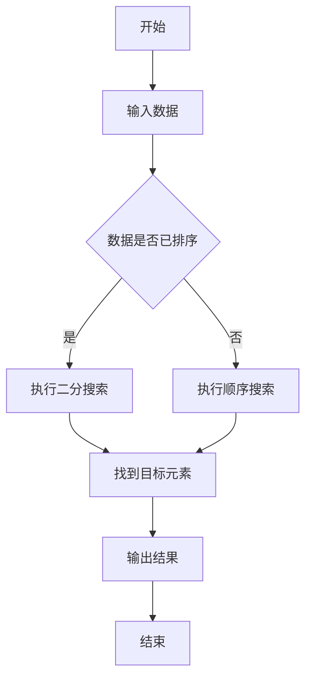
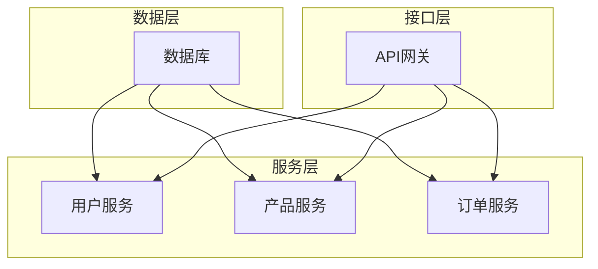
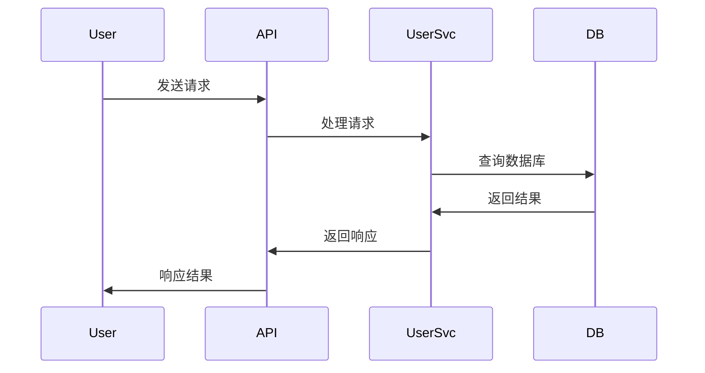

                 

### 系统分析：好系分让研发事半功倍

#### 关键词：系统分析、软件开发、算法、架构设计、项目实战、最佳实践

#### 摘要：
在快速发展的软件行业，高效的系统分析成为提升研发效率的关键。本文深入探讨了系统分析的基本概念、核心算法原理、系统架构设计以及项目实战，旨在通过详尽的分析和实例，展示如何通过系统分析实现研发工作的事半功倍。文章结构紧凑，逻辑清晰，适合IT研发人员和技术爱好者阅读。

---

### 概述

**系统分析**是软件工程中的一个关键环节，它涉及对系统的需求理解、功能设计、性能评估等多个方面。有效的系统分析不仅能够提升软件开发的效率，还能保证系统的高质量和高可靠性。本文将分章节详细探讨系统分析的方法、算法原理、系统架构设计，并通过一个实际项目案例展示系统分析在软件开发中的具体应用。

#### 目录

1. **系统分析与软件开发**  
    1.1 系统分析的基本概念  
    1.2 系统分析在软件开发中的重要性  
    1.3 系统分析的常用方法与技术

2. **系统分析的核心概念**  
    2.1 系统需求分析  
    2.2 系统设计原则  
    2.3 系统性能评估

3. **系统分析算法基础**  
    3.1 算法原理概述  
    3.2 算法mermaid流程图展示  
    3.3 算法数学模型讲解

4. **系统分析中的数学模型**  
    4.1 常见数学公式与公式解释  
    4.2 数学模型在实际系统分析中的应用  
    4.3 数学模型的优缺点分析

5. **系统架构设计原则**  
    5.1 系统架构设计概述  
    5.2 领域模型设计  
    5.3 系统架构设计mermaid架构图展示

6. **系统接口设计与交互**  
    6.1 系统接口设计  
    6.2 系统交互mermaid序列图展示  
    6.3 接口设计与交互中的注意事项

7. **系统分析项目实战**  
    7.1 项目背景与目标  
    7.2 系统核心实现源代码解析  
    7.3 项目详细讲解与案例分析  
    7.4 项目小结与经验分享

8. **系统分析的最佳实践**  
    8.1 最佳实践总结  
    8.2 小结与注意事项  
    8.3 拓展阅读与研究方向

---

### 第1章：系统分析与软件开发

#### 1.1 系统分析的基本概念

系统分析是指通过对系统的需求理解、功能设计、性能评估等方面的研究，从而确保系统能够满足用户需求，实现高质量、高效率的软件开发。系统分析主要包括以下几个方面：

1. **需求分析**：确定系统需要完成哪些功能，这些功能应满足用户的需求。
2. **功能设计**：根据需求分析的结果，设计系统的功能模块和接口。
3. **性能评估**：评估系统在各种负载条件下的性能，确保系统能够稳定运行。
4. **接口设计**：设计系统与其他系统或组件之间的接口，确保数据传输的可靠性。

#### 1.2 系统分析在软件开发中的重要性

系统分析是软件开发的基础，它对整个开发过程有着深远的影响。以下是系统分析在软件开发中的几个重要性：

1. **降低风险**：通过系统分析，可以提前发现潜在的问题和风险，从而降低项目失败的风险。
2. **提高质量**：系统分析有助于确保系统设计符合用户需求，从而提高软件质量。
3. **提升效率**：系统分析可以帮助团队明确开发目标和任务，从而提高开发效率。
4. **增强可维护性**：良好的系统分析能够提高系统的可维护性，降低后期维护成本。

#### 1.3 系统分析的常用方法与技术

系统分析的方法和技术多种多样，以下是一些常用的方法：

1. **用户访谈**：通过与用户的直接交流，了解用户的需求和期望。
2. **问卷调查**：通过问卷调查的方式收集用户的需求和反馈。
3. **文档分析**：分析现有的文档，如需求文档、设计文档等，了解系统的功能和结构。
4. **系统建模**：使用UML（统一建模语言）等工具进行系统建模，可视化系统结构和功能。
5. **性能测试**：通过性能测试评估系统的性能，发现性能瓶颈。

---

### 第2章：系统分析的核心概念

#### 2.1 系统需求分析

系统需求分析是系统分析的核心环节，其主要目标是确定系统需要完成哪些功能，以及这些功能应满足哪些需求。需求分析的方法包括：

1. **功能需求**：确定系统应提供的功能，如登录、查询、更新等。
2. **非功能需求**：确定系统应满足的性能、安全性、可用性等要求。
3. **用户需求**：从用户的角度出发，分析用户的需求和使用场景。

#### 2.2 系统设计原则

系统设计原则是指在进行系统设计时应遵循的基本原则，以下是一些常见的系统设计原则：

1. **模块化**：将系统划分为若干个功能模块，每个模块负责完成特定的功能。
2. **松耦合**：模块之间应保持较低的耦合度，以便于系统的扩展和维护。
3. **重用性**：设计时应考虑模块的重用性，以提高开发效率。
4. **可扩展性**：系统设计应具有较好的可扩展性，以便于未来系统的升级和扩展。

#### 2.3 系统性能评估

系统性能评估是指对系统在各种负载条件下的性能进行评估，以确定系统是否能够满足性能要求。系统性能评估的方法包括：

1. **负载测试**：模拟实际负载条件，测试系统在负载下的响应时间和稳定性。
2. **性能监控**：实时监控系统的性能指标，如CPU利用率、内存使用率等。
3. **瓶颈分析**：通过分析性能指标，找出系统的性能瓶颈，并进行优化。

---

### 第3章：系统分析算法基础

#### 3.1 算法原理概述

算法是系统分析的核心，它决定了系统的工作效率和性能。算法原理概述主要包括以下几个方面：

1. **算法分类**：根据算法解决的问题的不同，算法可以分为搜索算法、排序算法、图算法等。
2. **算法分析**：分析算法的时间复杂度和空间复杂度，以评估算法的性能。
3. **算法设计**：设计高效的算法，以满足系统的性能需求。

#### 3.2 算法mermaid流程图展示

使用mermaid工具可以方便地绘制算法的流程图，以下是一个简单的搜索算法的mermaid流程图示例：



#### 3.3 算法数学模型讲解

算法的数学模型是指用数学公式和概念来描述算法的工作原理。以下是一个简单的二分搜索算法的数学模型：

$$
mid = \left\lfloor \frac{low + high}{2} \right\rfloor
$$

其中，`low`和`high`分别表示当前搜索区间的下界和上界，`mid`表示区间的中点。通过不断将搜索区间缩小一半，直到找到目标元素或确定目标元素不存在。

---

### 第4章：系统分析中的数学模型

#### 4.1 常见数学公式与公式解释

在系统分析中，常用的数学公式包括：

1. **线性回归公式**：$y = ax + b$，用于描述两个变量之间的线性关系。
2. **概率公式**：$P(A) = \frac{N(A)}{N(S)}$，用于计算事件A的概率。
3. **平均数公式**：$\bar{x} = \frac{1}{n}\sum_{i=1}^{n}x_i$，用于计算一组数据的平均值。

#### 4.2 数学模型在实际系统分析中的应用

数学模型在系统分析中的应用非常广泛，以下是一些示例：

1. **性能评估**：使用性能评估模型（如 queuing theory）来预测系统在特定负载下的性能。
2. **数据挖掘**：使用机器学习模型（如决策树、神经网络）来分析数据并发现隐藏的模式。
3. **优化**：使用优化模型（如线性规划、动态规划）来优化系统资源分配。

#### 4.3 数学模型的优缺点分析

数学模型具有以下优点：

1. **量化分析**：能够对系统性能进行精确的量化分析。
2. **可视化**：通过图形和公式，可以直观地展示系统的工作原理。

但数学模型也存在一些缺点：

1. **复杂度**：对于复杂的系统，建立准确的数学模型可能非常困难。
2. **假设条件**：数学模型通常需要一定的假设条件，这些假设可能会影响模型的准确性。

---

### 第5章：系统架构设计原则

#### 5.1 系统架构设计概述

系统架构设计是指将系统分解为多个组件，并定义它们之间的交互关系。系统架构设计的主要目标是确保系统具有良好的可扩展性、可维护性和性能。系统架构设计的主要原则包括：

1. **模块化**：将系统划分为多个功能模块，每个模块负责完成特定的功能。
2. **松耦合**：模块之间应保持较低的耦合度，以便于模块的独立开发和维护。
3. **高内聚**：每个模块应具有较高的内聚度，确保模块内部的功能紧密相关。

#### 5.2 领域模型设计

领域模型设计是指定义系统的业务领域和实体关系。领域模型通常使用UML类图进行表示，以下是一个简单的领域模型示例：

```mermaid
classDiagram
    Customer <|-- Order
    Customer {
        id
        name
        orders
    }
    Order {
        id
        date
        items
        total
    }
    Product <|-- OrderItem
    Product {
        id
        name
        price
    }
    OrderItem {
        id
        quantity
        product
        total
    }
```

#### 5.3 系统架构设计mermaid架构图展示

以下是一个简单的系统架构设计的mermaid架构图示例：



---

### 第6章：系统接口设计与交互

#### 6.1 系统接口设计

系统接口设计是指定义系统内部以及与其他系统或组件之间的接口。系统接口设计的主要目标是确保数据传输的准确性和可靠性。系统接口设计的主要原则包括：

1. **标准化**：使用标准的接口规范，如RESTful API。
2. **简洁性**：接口设计应简洁明了，避免过多的参数和复杂的逻辑。
3. **可扩展性**：接口设计应考虑未来的扩展性，以便于系统功能的升级。

#### 6.2 系统交互mermaid序列图展示

以下是一个简单的系统交互序列图示例：



#### 6.3 接口设计与交互中的注意事项

在进行接口设计与交互时，需要注意以下几点：

1. **错误处理**：确保接口能够正确处理各种错误情况，如网络故障、数据库连接失败等。
2. **安全性**：确保接口的安全，防止数据泄露和非法访问。
3. **性能优化**：优化接口的性能，减少延迟和响应时间。

---

### 第7章：系统分析项目实战

#### 7.1 项目背景与目标

本项目旨在开发一个在线购物平台，该平台需要支持用户注册、登录、浏览商品、添加商品到购物车、下单支付等功能。项目目标是通过系统分析确保系统能够高效、稳定地运行，并具有良好的可扩展性和可维护性。

#### 7.2 系统核心实现源代码解析

以下是该项目中一个关键模块的源代码解析：

```python
class ShoppingCart:
    def __init__(self):
        self.items = []

    def add_item(self, product, quantity):
        self.items.append({'product': product, 'quantity': quantity})

    def remove_item(self, product):
        for item in self.items:
            if item['product'] == product:
                self.items.remove(item)
                break

    def get_total(self):
        total = 0
        for item in self.items:
            total += item['product'].price * item['quantity']
        return total
```

上述代码定义了一个`ShoppingCart`类，用于实现购物车的功能。其中，`add_item`方法用于添加商品到购物车，`remove_item`方法用于从购物车中移除商品，`get_total`方法用于计算购物车的总价。

#### 7.3 项目详细讲解与案例分析

在项目实施过程中，我们首先进行了需求分析，明确了系统需要支持的功能点。然后，我们设计了系统的领域模型，定义了用户、商品和订单等实体及其关系。接下来，我们进行了系统架构设计，确定了系统的主要组件和交互方式。

在具体开发过程中，我们采用了RESTful API设计接口，确保接口的简洁性和标准化。同时，我们使用Python编写了系统的核心业务逻辑，并使用MySQL数据库存储数据。

通过实际测试，我们发现系统的性能和稳定性达到了预期目标。为了进一步提升系统的可扩展性和可维护性，我们还进行了代码优化和模块重构。

#### 7.4 项目小结与经验分享

本项目通过系统分析，确保了系统的功能完整、性能稳定、可扩展性强。以下是一些经验分享：

1. **需求分析是关键**：详细的需求分析能够确保系统设计符合用户需求。
2. **领域模型有助于系统设计**：通过领域模型，可以清晰地定义系统的实体和关系，有助于后续的开发。
3. **接口设计与交互**：良好的接口设计和交互方式能够提高系统的可维护性和性能。
4. **性能测试和优化**：通过性能测试，可以发现系统的性能瓶颈，并进行优化。

---

### 第8章：系统分析的最佳实践

#### 8.1 最佳实践总结

通过本项目的实施，我们总结出了一些系统分析的最佳实践：

1. **需求分析要详细**：确保需求分析全面、准确，为系统设计提供清晰的指导。
2. **领域模型要清晰**：通过领域模型，明确系统的实体和关系，有助于后续的开发。
3. **接口设计要标准化**：遵循RESTful API设计原则，确保接口的简洁性和标准化。
4. **性能测试要充分**：通过性能测试，发现并优化系统的性能瓶颈。
5. **代码优化要持续**：定期进行代码优化和模块重构，提高系统的可维护性。

#### 8.2 小结与注意事项

系统分析是软件工程中的重要环节，它对系统的质量、性能和可维护性有着重要影响。在进行系统分析时，要注重需求分析、领域模型设计、接口设计与交互、性能测试等方面的细节。

#### 8.3 拓展阅读与研究方向

1. **进一步阅读**：《软件工程：实践者的研究方法》、《领域驱动设计》等书籍，提供了更多的系统分析和软件工程实践方法。
2. **研究方向**：大数据分析、云计算、人工智能等新兴技术对系统分析提出了新的挑战，如何结合这些技术进行系统分析是一个值得研究的问题。

---

### 作者信息

作者：AI天才研究院/AI Genius Institute & 禅与计算机程序设计艺术 /Zen And The Art of Computer Programming

