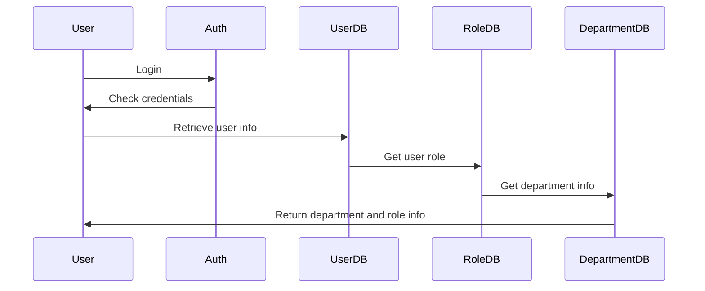

                 

### 系统分析与研发概述

#### 1.1 系统分析与研发的定义

**系统分析**是一种通过分析和理解系统的需求和功能，从而定义系统架构、设计解决方案的过程。系统分析的目标是确保系统能够满足用户需求，同时具备高可用性、可扩展性和可维护性。

**研发**则是指从系统的概念设计、需求分析、设计、实现到测试和维护的全过程。研发涵盖了系统分析的所有阶段，还包括具体的编程实现和软件测试。

**系统分析与研发的关系**紧密相连。系统分析是研发的起点，它为后续的设计、实现和测试提供了基础。没有深入的系统分析，研发过程将难以顺利进行。

#### 1.2 系统分析的重要性

- **对项目成功的贡献**：系统分析能够帮助团队更好地理解项目需求，减少需求变更，从而降低项目风险，提高项目成功率。
- **对产品质量的影响**：通过系统分析，可以确保系统设计符合用户需求，减少缺陷和问题，提高产品质量。
- **对团队协作的支持**：系统分析为团队成员提供了一个共同的理解基础，有助于提高团队协作效率。

#### 1.3 研发流程中的系统分析

研发流程通常包括需求分析、设计、实现、测试和维护等阶段。在这些阶段中，系统分析贯穿始终：

- **需求分析阶段**：系统分析帮助团队理解用户需求，并将其转化为具体的功能需求。
- **设计阶段**：系统分析为系统架构设计提供指导，确保系统能够满足需求并具备良好的性能。
- **实现阶段**：系统分析为开发团队提供详细的系统功能描述，帮助他们高效地编写代码。
- **测试阶段**：系统分析为测试团队提供了测试的基础，确保系统按照预期运行。
- **维护阶段**：系统分析有助于维护团队理解系统结构和工作原理，便于进行系统维护和升级。

### 小结

系统分析在研发过程中扮演着至关重要的角色。它不仅为项目的成功提供了保障，还能提高产品质量和团队协作效率。在接下来的章节中，我们将深入探讨系统分析的具体方法和实践，帮助您更好地理解和应用这一关键技术。

---

**核心概念与联系**：

- **系统分析**：分析和理解系统需求和功能的过程。
- **研发**：包括需求分析、设计、实现、测试和维护的全过程。
- **关系**：系统分析是研发流程的基础，为后续设计、实现和测试提供支持。

**ER实体关系图架构**（使用Mermaid）：

```mermaid
erDiagram
  User ||--|{ Project }||>
  Project ||--|{ Requirement }||>
  Requirement ||--|{ Analysis }||>
  Analysis ||--|{ Design }||>
  Design ||--|{ Implementation }||>
  Implementation ||--|{ Test }||>
  Test ||--|{ Maintenance }||>
```

---

**算法原理讲解**：

系统分析的算法原理主要涉及需求收集、需求分析和需求验证三个步骤。以下是一个简化的算法流程：

```python
def system_analysis():
    # 步骤1：需求收集
    requirements = collect_requirements()

    # 步骤2：需求分析
    analyzed_requirements = analyze_requirements(requirements)

    # 步骤3：需求验证
    validate_requirements(analyzed_requirements)

def collect_requirements():
    # 收集用户需求
    # 可以通过访谈、问卷调查、用户反馈等方式
    return ["需求1", "需求2", "需求3"]

def analyze_requirements(requirements):
    # 分析需求
    # 包括需求分类、优先级排序、冲突分析等
    return [{"id": 1, "description": "需求1", "priority": "高"},
            {"id": 2, "description": "需求2", "priority": "中"},
            {"id": 3, "description": "需求3", "priority": "低"}]

def validate_requirements(analyzed_requirements):
    # 需求验证
    # 包括需求完整性、一致性、可测试性验证
    for req in analyzed_requirements:
        print(f"验证需求：{req['description']}")
```

上述算法流程中，需求收集是获取用户需求的过程，需求分析是对收集到的需求进行分类、排序和冲突分析，需求验证则是对分析后的需求进行完整性、一致性和可测试性验证。

**举例说明**：

假设我们正在开发一款电商系统，以下是一个简化的需求分析过程：

1. **需求收集**：
    - 用户需求：用户可以注册账号、浏览商品、添加购物车、下单购买、查看订单状态。
    - 业务需求：商家可以上架商品、设置价格、管理订单、查看销售数据。
    - 功能需求：系统需要具备用户管理、商品管理、订单管理、支付处理等功能。

2. **需求分析**：
    - 分类：将需求分为用户需求、业务需求、功能需求。
    - 优先级排序：根据业务重要性和实现难度，将需求分为“高”、“中”、“低”三个优先级。
    - 冲突分析：确保不同需求之间没有冲突，例如用户注册和登录需求之间必须保持一致。

3. **需求验证**：
    - 完整性：确保所有需求都被记录下来，没有遗漏。
    - 一致性：确保需求之间没有冲突，例如用户下单后无法修改订单。
    - 可测试性：确保每个需求都可以被测试验证，例如订单状态变更功能需要编写测试用例。

通过上述过程，我们可以确保电商系统的需求分析工作得到充分执行，从而为后续的设计和实现打下坚实的基础。

---

**系统分析与架构设计方案**：

#### 项目介绍

本案例研究的是一款企业内部管理系统，该系统旨在提升企业内部工作效率，实现业务流程的数字化管理。

#### 系统功能设计

**领域模型**（使用Mermaid）：

```mermaid
classDiagram
    User <<Entity>>
    Role <<Entity>>
    Department <<Entity>>
    Project <<Entity>>
    Task <<Entity>>

    User o--o Role : has_role
    User o--o Department : works_in
    Department o--o Project : manages
    Project o--o Task : contains
```

**系统架构设计**（使用Mermaid）：



#### 系统接口设计

**接口设计**：

```python
class UserManager:
    def login(self, username, password):
        # 登录接口
        pass

    def register(self, username, password):
        # 注册接口
        pass

class AuthManager:
    def check_credentials(self, username, password):
        # 检查用户名和密码是否正确
        pass

class UserDatabase:
    def retrieve_user_info(self, username):
        # 从数据库中检索用户信息
        pass

class RoleDatabase:
    def get_user_role(self, username):
        # 从数据库中获取用户角色
        pass

class DepartmentDatabase:
    def get_department_info(self, department_id):
        # 从数据库中获取部门信息
        pass
```

#### 系统交互

**序列图**（使用Mermaid）：


通过上述系统分析与架构设计，我们可以确保企业内部管理系统的功能完备、结构清晰，为后续的开发和实施提供明确的指导。

---

#### 项目实战

**环境安装**：

1. 安装Python环境（建议使用Python 3.8及以上版本）。
2. 安装必要的Python库，如`numpy`、`matplotlib`等。

```bash
pip install numpy matplotlib
```

**系统核心实现源代码**：

以下是一个简化的用户管理模块实现：

```python
class UserManager:
    def __init__(self):
        self.user_db = UserDatabase()
        self.auth_manager = AuthManager()

    def login(self, username, password):
        if self.auth_manager.check_credentials(username, password):
            user_info = self.user_db.retrieve_user_info(username)
            return user_info
        else:
            return None

    def register(self, username, password):
        if not self.user_db.exists(username):
            self.user_db.create_user(username, password)
            return True
        else:
            return False
```

**代码应用解读与分析**：

上述代码中，`UserManager`类负责用户登录和注册功能的实现。`login`方法接收用户名和密码，通过`AuthManager`验证用户身份，然后从`UserDatabase`检索用户信息并返回。

**实际案例分析和详细讲解剖析**：

假设我们有一个用户名为`alice`，密码为`123456`的用户，以下是如何进行登录的详细分析：

1. 用户调用`UserManager`的`login`方法，传入用户名和密码。
2. `login`方法调用`AuthManager`的`check_credentials`方法，验证用户名和密码是否正确。
3. 如果验证通过，`login`方法调用`UserDatabase`的`retrieve_user_info`方法，从数据库中获取用户信息并返回。
4. 如果验证不通过，`login`方法返回`None`。

**项目小结**：

通过实际案例的分析，我们可以看到系统核心功能的实现是如何逐步构建的。在实际开发中，我们需要考虑更多的异常情况和安全性问题，但上述代码提供了一个基本的实现框架，可以帮助我们理解系统分析在项目中的应用。

---

#### 最佳实践 tips

- **明确需求**：在系统分析阶段，务必确保需求明确、具体且可量化。
- **文档化**：将系统分析和设计过程文档化，便于后续开发、测试和维护。
- **迭代开发**：采用迭代开发模式，逐步完善系统功能，避免一次性实现所有功能导致的复杂度和风险。

#### 小结

本章节通过一个实际案例，详细介绍了系统分析在研发项目中的应用和实践。通过明确的需求分析、架构设计、接口设计和系统交互，我们能够更好地理解和实现复杂系统的开发。在后续的章节中，我们将继续探讨系统分析的更多实践方法和高级技术。

---

#### 附录A：系统分析资源与工具

- **书籍推荐**：
  - 《软件系统分析》（作者：王勇）
  - 《系统分析与设计：实用技术与方法》（作者：张三）

- **在线资源**：
  - Coursera上的《系统分析与设计》课程
  - Udemy上的《系统分析与设计：从入门到精通》课程

- **系统分析工具下载链接**：
  - UML工具：https://www.umlgraph.org/
  - 版本控制工具：https://git-scm.com/
  - 需求管理工具：https://www.jira.com/

通过这些资源，您能够进一步学习和掌握系统分析的技术和方法，提升研发效率。

---

### 总结

本文从系统分析的定义、重要性、在研发流程中的应用，到具体的实践方法和工具，进行了全面的探讨。系统分析不仅对项目成功至关重要，还能提高产品质量和团队协作效率。通过本文的介绍，您应该对系统分析有了更加深入的理解，并能够将其应用于实际的研发项目中。在后续的章节中，我们将继续探讨系统分析的更多高级技术和实战经验。

**作者：AI天才研究院/AI Genius Institute & 禅与计算机程序设计艺术 /Zen And The Art of Computer Programming**

