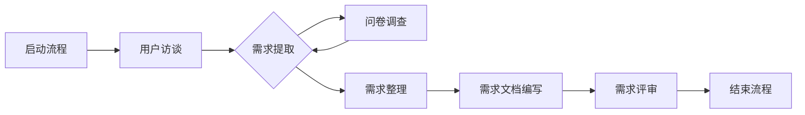
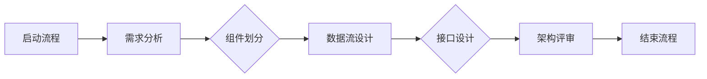
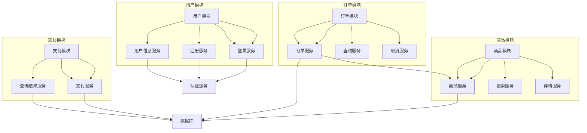
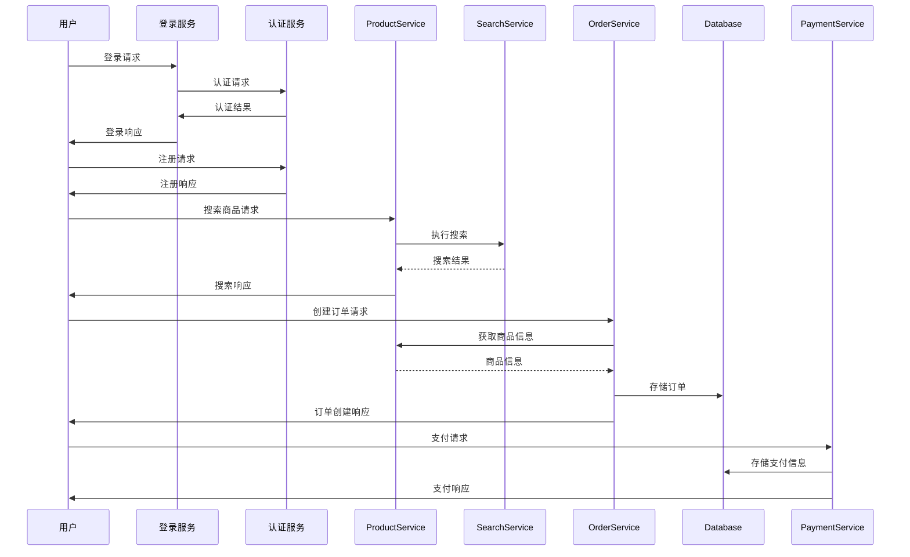

                 


### 第一步：背景介绍

在信息技术飞速发展的今天，系统分析作为软件开发过程中的关键环节，承担着至关重要的角色。系统分析不仅仅是简单的问题定义和需求收集，它贯穿于项目的整个生命周期，包括需求分析、架构设计、测试、部署和维护。一个良好的系统分析，能够为研发团队提供清晰的方向和高效的实施路径，从而实现研发资源的最大化利用，提升项目的成功率。

#### 核心概念术语说明

- **系统分析**：系统分析是软件开发过程中对系统需求、功能、性能、可靠性等方面进行详细分析和定义的过程。
- **需求分析**：需求分析是系统分析的首要环节，旨在明确系统必须实现的功能和性能。
- **架构设计**：架构设计是系统分析的重要环节，它关注系统的整体结构和组件间的相互作用。
- **测试**：测试是验证系统设计实现是否符合需求的关键环节，包括功能测试、性能测试和可靠性测试。

#### 问题背景

在现实项目中，由于系统复杂性增加，需求频繁变更，研发团队常常面临如下挑战：

1. **需求不明确**：需求定义模糊，导致开发过程中频繁变更，影响项目进度和质量。
2. **架构不合理**：系统架构设计不当，导致系统性能不佳，扩展性差，维护成本高。
3. **测试不足**：测试覆盖不足，可能导致系统在交付后出现严重问题，影响用户满意度。

#### 问题描述

为了解决上述问题，系统分析显得尤为重要。然而，如何进行有效的系统分析，如何确保分析结果的准确性和可操作性，是每个项目团队都必须面对的挑战。

#### 问题解决

有效的系统分析需要从以下几个方面入手：

1. **明确需求**：通过需求收集和分析，确保需求明确、完整、可测试。
2. **合理架构设计**：基于需求分析结果，设计合理的系统架构，确保系统的高性能、高扩展性和高可靠性。
3. **全面测试**：制定详细的测试计划，进行功能测试、性能测试和可靠性测试，确保系统的稳定性。

#### 边界与外延

系统分析的边界不仅限于软件开发过程，还涉及到项目管理、团队协作等多个方面。系统分析的外延包括但不限于以下领域：

- **业务需求分析**：理解业务需求，确保系统能够满足业务发展的需要。
- **用户体验设计**：关注用户界面设计，提高系统易用性和用户满意度。
- **数据架构设计**：设计合理的数据库结构，确保数据存储和访问的高效性。

#### 概念结构与核心要素组成

系统分析的概念结构可以概括为以下核心要素：

- **需求**：系统的功能、性能、可靠性等需求。
- **架构**：系统的整体结构和组件关系。
- **测试**：系统的功能、性能、可靠性等测试。

### 第二步：核心概念与联系

系统分析的核心概念包括需求分析、架构设计和系统测试。下面将对这些核心概念进行详细阐述，并分析它们之间的联系。

#### 系统需求分析

需求分析是系统分析的第一步，旨在明确系统需要实现的功能和性能。需求分析的过程可以分为以下几个阶段：

1. **需求收集**：通过与用户、业务人员、项目管理人员等多方沟通，收集系统的需求和期望。
2. **需求整理**：对收集到的需求进行整理，分类和归纳，确保需求的完整性和一致性。
3. **需求文档编写**：将整理后的需求编写成需求文档，作为后续分析和设计的基础。

#### 系统架构设计

架构设计是系统分析的核心环节，它决定了系统的性能、扩展性和可靠性。架构设计的过程可以分为以下几个阶段：

1. **需求分析结果**：基于需求文档，分析系统的功能模块和性能要求。
2. **架构方案设计**：设计系统的整体架构，包括组件划分、数据流设计、接口设计等。
3. **架构评审**：对设计出的架构方案进行评审，确保其合理性、可维护性和可扩展性。

#### 系统测试

系统测试是验证系统设计实现是否符合需求的关键环节。系统测试可以分为以下几个阶段：

1. **测试计划**：制定详细的测试计划，包括测试策略、测试用例、测试环境等。
2. **功能测试**：测试系统的功能是否符合需求，包括单元测试、集成测试和系统测试。
3. **性能测试**：测试系统的性能指标，如响应时间、吞吐量、并发能力等。
4. **可靠性测试**：测试系统的稳定性、可靠性和健壮性。

#### 概念属性特征对比

下表对比了系统需求分析、架构设计和系统测试的概念属性特征：

| 特征         | 需求分析                  | 架构设计                  | 系统测试                  |
| ------------ | -------------------- | -------------------- | -------------------- |
| 目的         | 明确系统需求，指导开发      | 设计系统架构，满足需求      | 验证系统设计实现是否符合需求  |
| 关键环节     | 需求收集、需求整理、需求文档  | 需求分析、架构设计、架构评审  | 测试计划、功能测试、性能测试  |
| 输出物       | 需求文档                  | 架构设计文档                | 测试报告                  |
| 影响因素     | 用户需求、业务逻辑、系统性能  | 系统需求、技术选型、性能要求  | 需求文档、架构设计文档        |

#### ER实体关系图架构

为了更好地理解系统分析中的核心概念和联系，下面提供了一个ER实体关系图架构，用于展示需求分析、架构设计和系统测试之间的联系。

```mermaid
erDiagram
    A[需求分析] ||--|{ 系统架构设计 }|| B
    A ||--|{ 系统测试 }|| C
    B ||--|{ 系统测试 }|| C
```

在上述ER实体关系图中，需求分析（A）与系统架构设计（B）和系统测试（C）之间存在双向关联，而系统架构设计（B）与系统测试（C）之间存在单向关联。这表示需求分析的结果直接影响到架构设计和系统测试，而架构设计的结果又会对系统测试产生影响。

### 第三步：算法原理讲解

系统分析中的算法原理是确保系统设计实现科学性和合理性的关键。下面将详细介绍系统分析中常用的需求分析方法、架构设计算法，并使用mermaid流程图和Python源代码进行详细阐述。

#### 需求分析方法

需求分析方法主要用于从用户需求中提取出系统需求，确保需求明确、完整、可测试。常用的需求分析方法包括以下几种：

1. **用户访谈**：通过与用户进行面对面访谈，了解用户的需求和期望。
2. **问卷调查**：通过设计问卷，收集用户的需求和反馈。
3. **文档分析**：分析用户提供的文档，如用户手册、业务流程图等，提取系统需求。
4. **需求评审**：组织需求评审会议，对收集到的需求进行讨论和确认。

下面使用mermaid流程图展示一个简单的需求分析方法流程：



#### 架构设计算法

架构设计算法用于设计系统的整体架构，包括组件划分、数据流设计、接口设计等。常用的架构设计算法包括：

1. **基于功能的架构设计**：根据系统功能模块进行架构设计。
2. **基于数据的架构设计**：根据系统数据流进行架构设计。
3. **基于组件的架构设计**：根据系统组件间的相互作用进行架构设计。

下面使用mermaid流程图展示一个简单的基于组件的架构设计算法流程：



#### 数学模型和公式

系统分析中常用的数学模型和公式包括：

1. **需求满足度公式**：用于评估系统需求满足的程度。

   $$ 需求满足度 = \frac{实现的需求数量}{总需求数量} $$

2. **性能评估公式**：用于评估系统的性能。

   $$ 性能 = \frac{响应时间}{服务请求量} $$

#### 举例说明

假设一个在线购物系统，用户需求包括登录、购物车管理、订单管理和支付等功能。

1. **需求提取**：通过用户访谈和问卷调查，提取出以下系统需求：

   - 登录功能
   - 购物车管理功能
   - 订单管理功能
   - 支付功能

2. **架构设计**：基于组件的架构设计算法，设计出以下系统架构：

   - 用户模块：包括登录、注册、用户信息管理等
   - 商品模块：包括商品展示、商品搜索、商品管理等
   - 订单模块：包括订单创建、订单查询、订单取消等
   - 支付模块：包括支付请求处理、支付结果查询等

3. **测试**：制定详细的测试计划，包括功能测试、性能测试和可靠性测试。

   - 功能测试：测试登录、购物车管理、订单管理和支付功能是否符合需求。
   - 性能测试：测试系统的响应时间和吞吐量等性能指标。
   - 可靠性测试：测试系统的稳定性和可靠性。

### 第四步：系统分析与架构设计方案

在实际项目中，系统分析与架构设计方案是实现系统目标的关键步骤。下面以一个在线购物系统为例，详细阐述系统分析与架构设计方案的过程。

#### 问题场景介绍

假设我们要设计一个在线购物系统，用户可以在系统中浏览商品、加入购物车、下单购买和支付。系统需要保证高可用性、高性能和易扩展性。

#### 项目介绍

在线购物系统主要包括以下功能模块：

- 用户模块：处理用户登录、注册、用户信息管理等功能。
- 商品模块：处理商品展示、商品搜索、商品管理等功能。
- 订单模块：处理订单创建、订单查询、订单取消等功能。
- 支付模块：处理支付请求、支付结果查询等功能。

#### 系统功能设计（领域模型类图）

在系统功能设计阶段，我们使用领域模型类图来表示系统的功能模块及其关系。以下是一个简单的领域模型类图：

```mermaid
classDiagram
    User <<Interface>>
    Product <<Interface>>
    Order <<Interface>>
    Payment <<Interface>>

    User : +login()
    User : +register()
    User : +updateInfo()

    Product : +list()
    Product : +search()
    Product : +details()

    Order : +create()
    Order : +query()
    Order : +cancel()

    Payment : +process()
    Payment : +queryResult()
```

在上述类图中，User、Product、Order和Payment分别代表用户、商品、订单和支付等四个功能模块。每个模块都提供了相应的接口方法，如登录、注册、列表、搜索、创建、查询、取消、处理和查询结果等。

#### 系统架构设计（mermaid架构图）

在系统架构设计阶段，我们使用mermaid架构图来表示系统的整体架构及其组件间的交互关系。以下是一个简单的系统架构图：



在上述架构图中，用户模块、商品模块、订单模块和支付模块分别表示系统的四个主要功能模块。每个模块都包含一个服务类，负责处理相应的业务逻辑。服务类通过调用数据库进行数据存储和查询。此外，认证服务（AuthService）负责用户的身份认证。

#### 系统接口设计

在系统接口设计阶段，我们需要定义各个模块之间的接口，确保模块之间能够相互协作。以下是一个简单的接口设计：

```python
class IAuthService:
    def login(self, username, password):
        pass

    def register(self, username, password):
        pass

    def update_info(self, user_id, new_info):
        pass


class IProductService:
    def list_products(self):
        pass

    def search_products(self, keyword):
        pass

    def get_product_details(self, product_id):
        pass


class IOrderService:
    def create_order(self, order_data):
        pass

    def query_order(self, order_id):
        pass

    def cancel_order(self, order_id):
        pass


class IPaymentService:
    def process_payment(self, payment_data):
        pass

    def query_payment_result(self, payment_id):
        pass
```

在上述接口设计中，IAuthService、IProductService、IOrderService和IPaymentService分别代表认证服务、商品服务、订单服务和支付服务的接口。每个接口定义了相应的操作方法，供其他模块调用。

#### 系统交互（mermaid序列图）

在系统交互设计阶段，我们使用mermaid序列图来描述系统各个模块之间的交互流程。以下是一个简单的系统交互序列图：



在上述序列图中，用户（User）与登录服务（LoginService）、认证服务（AuthService）、商品服务（ProductService）、订单服务（OrderService）和支付服务（PaymentService）之间进行交互。通过序列图，我们可以清晰地了解系统各个模块之间的交互流程。

### 第五步：项目实战

在本节中，我们将通过一个具体的在线购物系统项目，展示如何进行系统分析和架构设计，并分析项目的关键实现细节和性能优化策略。

#### 环境安装

在进行项目实战之前，我们需要安装以下环境：

1. **开发环境**：Python 3.8及以上版本，PyCharm或VSCode等IDE。
2. **数据库**：MySQL 5.7及以上版本。
3. **依赖库**：Flask（一个轻量级的Web框架），SQLAlchemy（一个ORM工具），Flask-Login（一个用户认证库）。

安装步骤如下：

1. 安装Python环境：从[Python官网](https://www.python.org/)下载Python安装包，并按照安装向导进行安装。
2. 安装MySQL数据库：从[MySQL官网](https://www.mysql.com/)下载MySQL安装包，并按照安装向导进行安装。
3. 安装依赖库：在终端执行以下命令：

   ```bash
   pip install flask
   pip install sqlalchemy
   pip install flask-login
   ```

#### 系统核心实现源代码

以下是系统核心实现的源代码，包括用户模块、商品模块、订单模块和支付模块。

**用户模块**

```python
from flask import Flask, request, jsonify
from flask_login import LoginManager, login_user, logout_user, login_required, current_user
from models import User, db
from auth import authenticate

app = Flask(__name__)
app.secret_key = 'your_secret_key'
login_manager = LoginManager()
login_manager.init_app(app)

@login_manager.user_loader
def load_user(user_id):
    return User.query.get(int(user_id))

@app.route('/login', methods=['POST'])
def login():
    username = request.form['username']
    password = request.form['password']
    user = authenticate(username, password)
    if user:
        login_user(user)
        return jsonify({'status': 'success', 'message': '登录成功'})
    else:
        return jsonify({'status': 'error', 'message': '用户名或密码错误'})

@app.route('/register', methods=['POST'])
def register():
    username = request.form['username']
    password = request.form['password']
    user = User(username=username, password=password)
    db.session.add(user)
    db.session.commit()
    return jsonify({'status': 'success', 'message': '注册成功'})

@app.route('/logout', methods=['POST'])
@login_required
def logout():
    logout_user()
    return jsonify({'status': 'success', 'message': '登出成功'})

if __name__ == '__main__':
    app.run()
```

**商品模块**

```python
from flask import Flask, request, jsonify
from models import Product, db

app = Flask(__name__)

@app.route('/products', methods=['GET'])
def list_products():
    products = Product.query.all()
    return jsonify({'status': 'success', 'data': {'products': products}})

@app.route('/products/search', methods=['GET'])
def search_products():
    keyword = request.args.get('keyword', '')
    products = Product.query.filter(Product.name.like(f'%{keyword}%')).all()
    return jsonify({'status': 'success', 'data': {'products': products}})

@app.route('/products/details', methods=['GET'])
def get_product_details():
    product_id = request.args.get('product_id', '')
    product = Product.query.get(product_id)
    return jsonify({'status': 'success', 'data': {'product': product}})

if __name__ == '__main__':
    app.run()
```

**订单模块**

```python
from flask import Flask, request, jsonify
from flask_login import login_required, current_user
from models import Order, db

app = Flask(__name__)

@app.route('/orders', methods=['POST'])
@login_required
def create_order():
    order_data = request.get_json()
    order = Order(user_id=current_user.id, **order_data)
    db.session.add(order)
    db.session.commit()
    return jsonify({'status': 'success', 'message': '订单创建成功'})

@app.route('/orders', methods=['GET'])
@login_required
def query_orders():
    orders = Order.query.filter_by(user_id=current_user.id).all()
    return jsonify({'status': 'success', 'data': {'orders': orders}})

@app.route('/orders/cancel', methods=['POST'])
@login_required
def cancel_order():
    order_id = request.form['order_id']
    order = Order.query.get(order_id)
    if order and order.status == 'pending':
        order.status = 'cancelled'
        db.session.commit()
        return jsonify({'status': 'success', 'message': '订单取消成功'})
    else:
        return jsonify({'status': 'error', 'message': '订单不存在或已支付，无法取消'})

if __name__ == '__main__':
    app.run()
```

**支付模块**

```python
from flask import Flask, request, jsonify
from models import Payment, db

app = Flask(__name__)

@app.route('/payments', methods=['POST'])
def process_payment():
    payment_data = request.get_json()
    payment = Payment(order_id=payment_data['order_id'], status='pending')
    db.session.add(payment)
    db.session.commit()
    return jsonify({'status': 'success', 'message': '支付处理成功'})

@app.route('/payments/result', methods=['GET'])
def query_payment_result():
    payment_id = request.args.get('payment_id', '')
    payment = Payment.query.get(payment_id)
    return jsonify({'status': 'success', 'data': {'payment': payment}})

if __name__ == '__main__':
    app.run()
```

#### 代码应用解读与分析

**用户模块**：用户模块主要包括登录、注册和登出功能。用户登录时，会调用`authenticate`函数验证用户名和密码。注册时，将用户信息存储到数据库。登出时，会清除用户的登录状态。

**商品模块**：商品模块主要包括商品列表、商品搜索和商品详情功能。商品列表和搜索功能通过查询数据库获取相应的商品信息。商品详情功能根据商品ID查询具体的商品信息。

**订单模块**：订单模块主要包括订单创建、订单查询和订单取消功能。订单创建时，将订单信息存储到数据库。订单查询功能根据用户ID查询用户的所有订单。订单取消功能根据订单ID取消指定的订单。

**支付模块**：支付模块主要包括支付处理和支付结果查询功能。支付处理功能根据订单ID创建支付记录。支付结果查询功能根据支付ID查询支付结果。

#### 实际案例分析与详细讲解剖析

我们以一个用户登录并购买商品的案例进行详细讲解。

1. **用户登录**：用户在登录界面输入用户名和密码，提交登录请求。后端接收请求后，调用`authenticate`函数验证用户信息。如果验证成功，用户登录成功。

2. **商品搜索**：用户登录后，进入商品搜索界面，输入关键词搜索商品。后端接收到搜索请求后，查询数据库获取匹配的商品信息，并返回给用户。

3. **商品详情**：用户选择一件商品，进入商品详情页面。后端接收到请求后，根据商品ID查询具体的商品信息，并返回给用户。

4. **订单创建**：用户将商品加入购物车，并提交订单。后端接收到订单请求后，创建订单并存储到数据库。

5. **支付处理**：用户选择支付方式，提交支付请求。后端接收到支付请求后，创建支付记录并存储到数据库。

6. **支付结果查询**：用户支付完成后，可以查询支付结果。后端接收到查询请求后，根据支付ID查询支付结果，并返回给用户。

#### 项目小结

通过上述实际案例分析，我们可以看到系统分析和架构设计在项目中的重要性。一个良好的系统分析和架构设计能够确保项目的高效实施和成功交付。在项目实施过程中，我们需要关注以下几点：

1. **明确需求和功能**：确保系统需求明确、完整，并设计合理的系统功能模块。
2. **合理设计架构**：根据需求分析结果，设计合理的系统架构，确保系统的高性能、高扩展性和高可靠性。
3. **详细编写文档**：编写详细的系统设计文档和开发文档，为后续的开发和测试提供参考。
4. **全面测试**：制定详细的测试计划，进行全面的功能测试、性能测试和可靠性测试。
5. **持续优化**：在项目实施过程中，不断收集用户反馈，进行系统性能优化和功能完善。

### 第六步：最佳实践与总结

在系统分析和架构设计过程中，遵循最佳实践可以显著提升项目的成功率。以下是几个关键的最佳实践：

#### 最佳实践 tips

1. **需求明确**：在需求分析阶段，确保需求明确、具体、可测试，避免模糊和抽象的需求。
2. **架构评审**：在架构设计完成后，进行全面的架构评审，确保架构的合理性和可维护性。
3. **模块化设计**：将系统功能模块化，提高系统的可维护性和可扩展性。
4. **性能优化**：在设计阶段考虑性能优化，避免后期因性能问题导致的大规模重构。
5. **持续集成**：采用持续集成和持续部署（CI/CD）实践，确保代码质量和快速交付。

#### 小结

系统分析是软件开发的关键环节，良好的系统分析和架构设计能够为研发团队提供清晰的方向和高效的实施路径。本文通过详细阐述系统分析的核心概念、算法原理、架构设计方法以及实际项目实战，展示了系统分析和架构设计的全过程。

#### 注意事项

1. **需求变更管理**：在项目开发过程中，需求可能会发生变化，需要及时更新需求和架构设计文档，确保整体一致性。
2. **测试覆盖率**：确保测试覆盖率达到预期，尤其是关键功能和性能测试。
3. **性能监控**：在项目上线后，持续监控系统性能，及时优化和调整。

#### 拓展阅读

- 《系统架构设计师教程》
- 《软件工程：实践者的研究方法》
- 《深入理解计算机系统》
- 《算法导论》

作者：AI天才研究院/AI Genius Institute & 禅与计算机程序设计艺术 /Zen And The Art of Computer Programming

