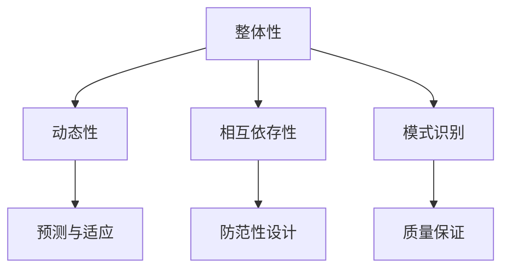
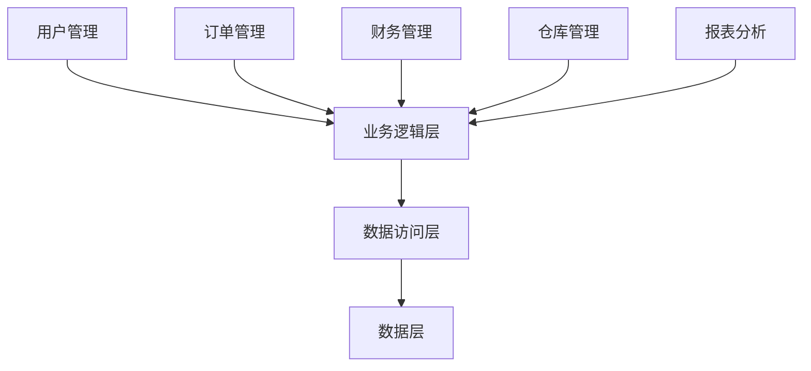
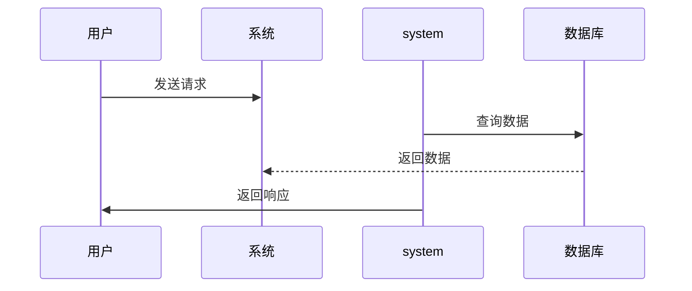

                 

### 文章标题

# 系统思维：架构师的核心竞争力

> 关键词：系统思维、架构设计、复杂性、动态性、相互依存性、模式识别

> 摘要：本文深入探讨了系统思维在架构师工作中的应用，分析了系统思维的基本概念、核心原则以及其实用价值。通过具体实例，展示了系统思维在架构设计、项目管理和组织中的重要作用，旨在提升架构师的核心竞争力。

---

## 第一部分：系统思维概述

### 第1章：系统思维的基本概念

#### 1.1 系统思维的定义与重要性

系统思维是一种综合性的思考方法，通过分析和理解复杂系统的结构和动态，来解决问题和制定决策。系统思维的关键在于将整体视为一个系统，而不是孤立的部分，从而更好地理解系统的行为和模式。

系统思维的重要性体现在以下几个方面：

1. **提升决策质量**：系统思维有助于架构师从全局角度出发，全面考虑各种因素，从而做出更合理的决策。
2. **优化问题解决**：系统思维能够帮助架构师找到根本原因，提出更加有效的解决方案。
3. **增强组织协作**：系统思维鼓励跨部门的沟通与协作，有助于实现资源的最佳配置。

#### 1.2 系统思维的核心原则

系统思维包含几个核心原则，这些原则为分析和理解复杂系统提供了理论基础：

1. **整体性**：将系统视为一个整体，考虑各个部分之间的相互作用和影响。
2. **动态性**：理解系统随时间的变化和演化过程。
3. **相互依存性**：认识到系统的各个部分之间存在相互依赖的关系。
4. **模式识别**：通过识别系统中的模式，发现规律和潜在问题。

#### 1.3 系统思维的实用价值

系统思维在架构师的工作中具有很高的实用价值，主要体现在以下几个方面：

1. **提升决策质量**：系统思维有助于架构师在复杂的决策环境中，从整体角度出发，全面考虑各种因素，做出更合理的决策。
2. **优化问题解决**：系统思维能够帮助架构师找到问题的根本原因，从而提出更加有效的解决方案。
3. **增强组织协作**：系统思维鼓励跨部门的沟通与协作，有助于实现资源的最佳配置。

### 第2章：架构师的角色与系统思维

#### 2.1 架构师的工作职责

架构师在软件开发中扮演着至关重要的角色，其工作职责包括：

1. **技术架构设计**：设计软件系统的总体架构，包括技术选型、系统模块划分等。
2. **持续集成和交付**：负责构建和部署软件系统，确保系统的高可用性和稳定性。
3. **技术选型**：根据项目需求，选择合适的技术方案，确保系统的可行性和可持续性。
4. **风险评估**：识别和评估项目中的风险，制定相应的风险应对策略。

#### 2.2 系统思维在架构设计中的应用

系统思维在架构设计中的应用主要体现在以下几个方面：

1. **整体视角**：架构师需要从整体角度出发，全面考虑系统各个部分之间的关系和影响。
2. **预测与适应**：架构师需要预见未来的变化和需求，设计灵活的系统架构，以适应这些变化。
3. **防范性设计**：通过系统思维，架构师可以识别潜在的系统性风险，并设计相应的防范措施。
4. **质量保证**：系统思维有助于架构师从整体角度出发，确保系统的质量。

#### 2.3 系统思维对架构师职业发展的影响

系统思维对架构师的职业发展具有重要影响，主要体现在以下几个方面：

1. **提高问题解决能力**：系统思维能够帮助架构师更好地识别和解决复杂问题。
2. **增强沟通能力**：系统思维鼓励架构师与团队成员进行跨部门的沟通与协作。
3. **提升决策质量**：系统思维有助于架构师在复杂的决策环境中，做出更合理的决策。

## 第二部分：系统思维应用与实践

### 第3章：系统思维工具与技术

#### 3.1 复杂系统建模方法

复杂系统建模是系统思维的重要组成部分，常用的建模方法包括状态空间模型、流程图和Mermaid流程图。

1. **状态空间模型**：用于描述系统的状态和状态转换，可以帮助架构师理解系统的动态行为。

    ```python
    # 状态空间模型示例
    states = ['空闲', '处理中', '已完成']
    transitions = {
        '空闲': {'事件1': '处理中', '事件2': '已完成'},
        '处理中': {'事件3': '已完成'},
        '已完成': {'事件4': '空闲'}
    }
    ```

2. **流程图**：用于描述系统中的流程和步骤，有助于架构师理清系统的工作流程。

3. **Mermaid流程图**：使用Markdown语言编写的流程图，可以方便地在文档中插入流程图。

    ```mermaid
    graph TD
    A[开始] --> B[第一步]
    B --> C{判断条件}
    C -->|是| D[第二步]
    C -->|否| E[第三步]
    D --> F[结束]
    E --> F
    ```

#### 3.2 系统分析与设计工具

系统分析与设计工具是系统思维应用的重要手段，常用的工具包括UML类图、冲突树和假设树。

1. **UML类图**：用于描述系统的静态结构和类之间的关系。

    ```mermaid
    graph TD
    A[Customer] --> B[Order]
    B --> C[Product]
    D[Payment] --> B
    E[Shipment] --> B
    ```

2. **冲突树**：用于分析系统中的冲突点和解决策略。

3. **假设树**：用于分析系统的假设条件和验证方法。

#### 3.3 实际案例分析

在实际应用中，系统思维可以帮助架构师解决各种复杂问题。以下是一个实际案例：

**案例：电商平台系统优化**

问题描述：电商平台系统在高峰期出现性能瓶颈，用户体验下降。

解决方案：

1. **状态空间模型**：分析系统的状态和状态转换，找到性能瓶颈所在。
2. **流程图**：绘制系统的工作流程，分析流程中的瓶颈和优化点。
3. **Mermaid流程图**：使用Mermaid绘制系统的流程图，方便团队成员理解和讨论。
4. **UML类图**：分析系统的静态结构，优化类之间的关系。
5. **冲突树**：分析系统中的冲突点和解决策略。
6. **假设树**：验证系统的假设条件和优化方案。

### 第4章：系统思维在软件架构中的应用

#### 4.1 微服务架构的系统思维

微服务架构是一种基于系统思维的软件架构方法，其核心思想是将系统划分为多个独立的、可复用的服务。

1. **服务划分**：根据业务需求和系统功能，将系统划分为多个服务。
2. **服务自治**：每个服务具有独立的开发、部署和运维能力，减少服务之间的依赖。
3. **服务编排**：通过服务编排，实现服务的组合和调度，提高系统的灵活性和可扩展性。

#### 4.2 大数据架构的系统思维

大数据架构是一种面向大规模数据处理和分析的软件架构，其核心思想是利用系统思维优化数据存储和处理。

1. **数据流设计**：设计数据从采集、存储到处理和分析的完整流程。
2. **数据存储与处理**：根据数据类型和处理需求，选择合适的存储和处理技术。
3. **数据安全与隐私**：确保数据的安全性和隐私性，防止数据泄露和滥用。

#### 4.3 云原生架构的系统思维

云原生架构是一种面向云计算的软件架构，其核心思想是利用系统思维优化系统的弹性、可伸缩性和可靠性。

1. **容器化与微服务**：利用容器化技术，实现服务的轻量化和可移植性。
2. **自动化运维**：通过自动化工具，实现系统的自动化部署、监控和运维。
3. **弹性伸缩**：根据负载需求，动态调整系统的资源分配，实现自动伸缩。

### 第5章：系统思维在项目管理和组织中的运用

#### 5.1 项目管理的系统思维

项目管理的系统思维体现在以下几个方面：

1. **整体项目规划**：从整体角度出发，制定项目计划，确保项目的顺利进行。
2. **风险管理**：识别和评估项目中的风险，制定相应的应对策略。
3. **价值交付**：确保项目交付的成果能够满足业务需求，实现项目价值。

#### 5.2 组织设计的系统思维

组织设计的系统思维体现在以下几个方面：

1. **组织结构**：根据业务需求和系统特点，设计合理的组织结构。
2. **文化建设**：建立积极向上的组织文化，促进团队协作和知识共享。
3. **团队协作**：利用系统思维，优化团队协作流程，提高团队效率。

#### 5.3 实际组织案例解析

以下是一个实际组织案例：

**案例：某互联网公司组织架构优化**

问题描述：某互联网公司业务快速发展，组织结构不够灵活，团队协作效率低下。

解决方案：

1. **整体项目规划**：制定详细的项目计划，明确项目目标、任务和时间安排。
2. **风险管理**：识别和评估项目中的风险，制定相应的应对策略。
3. **组织结构设计**：调整组织结构，实现业务模块的独立运作。
4. **文化建设**：建立积极向上的组织文化，促进团队协作和知识共享。
5. **团队协作优化**：优化团队协作流程，提高团队效率。

### 第6章：系统思维的持续实践与成长

#### 6.1 系统思维的学习与培养

系统思维是一种需要持续学习和培养的能力。以下是一些建议：

1. **专业知识积累**：不断学习和掌握相关的专业知识，提高系统思维能力。
2. **经验分享与交流**：通过经验分享和交流，学习他人的成功经验和教训。
3. **学习与实践相结合**：将所学知识应用于实际工作中，通过实践来检验和提升自己的系统思维。

#### 6.2 系统思维的自我评估与改进

系统思维的自我评估与改进是提升系统思维能力的重要环节。以下是一些建议：

1. **自我反思**：定期对自己的工作进行反思，总结经验教训，发现问题并加以改进。
2. **实践反馈**：根据实践反馈，调整自己的思维方式和方法，不断优化和提升系统思维。
3. **不断调整与优化**：根据新的情况和需求，不断调整和优化自己的系统思维，以适应不断变化的环境。

#### 6.3 系统思维的未来发展趋势

系统思维在未来将继续发挥重要作用，其发展趋势主要包括：

1. **智能化**：利用人工智能技术，提升系统思维的自动化和智能化水平。
2. **多元化**：系统思维将应用于更广泛的领域，如物联网、大数据、区块链等。
3. **普及化**：随着知识的普及，越来越多的从业者将掌握系统思维，提高整体创新能力。

### 第7章：系统思维实战案例研究

#### 7.1 案例一：电商平台系统优化

**问题分析**：电商平台系统在高峰期出现性能瓶颈，用户体验下降。

**解决方案**：

1. **状态空间模型**：分析系统的状态和状态转换，找到性能瓶颈所在。
2. **流程图**：绘制系统的工作流程，分析流程中的瓶颈和优化点。
3. **Mermaid流程图**：使用Mermaid绘制系统的流程图，方便团队成员理解和讨论。
4. **UML类图**：分析系统的静态结构，优化类之间的关系。
5. **冲突树**：分析系统中的冲突点和解决策略。
6. **假设树**：验证系统的假设条件和优化方案。

**实施效果**：通过系统思维的应用，电商平台系统的性能得到了显著提升，用户体验大幅改善。

**案例小结**：系统思维在电商平台系统优化中发挥了关键作用，为系统性能的提升提供了有力支持。

#### 7.2 案例二：金融风控系统建设

**业务需求**：构建一个金融风控系统，实现实时监控和预警，防范金融风险。

**系统设计**：

1. **领域模型**：使用Mermaid绘制领域模型类图，描述系统的主要类和关系。
2. **系统架构**：使用Mermaid绘制系统架构图，展示系统的主要组件和交互关系。
3. **接口设计**：设计系统的接口，确保与其他系统的兼容性和数据交换。
4. **系统交互**：使用Mermaid绘制系统交互序列图，描述系统的工作流程和交互细节。

**风险控制**：

1. **实时监控**：通过系统思维，设计实时监控模块，实现风险的及时发现和预警。
2. **数据分析**：利用大数据技术，分析历史数据，发现潜在风险。
3. **模型预测**：使用机器学习算法，构建风险预测模型，提高风险识别的准确性。

**实施效果**：金融风控系统的建设，有效降低了金融风险，提高了业务的安全性和稳定性。

**案例小结**：系统思维在金融风控系统建设中，为风险控制提供了科学的方法和工具，取得了显著的成果。

#### 7.3 案例三：智慧城市项目规划

**项目目标**：构建一个智慧城市项目，实现城市管理的智能化和高效化。

**系统集成**：

1. **系统需求分析**：通过系统思维，分析智慧城市项目的需求，明确项目的目标和功能。
2. **系统设计**：使用Mermaid绘制系统架构图，展示智慧城市项目的主要组件和交互关系。
3. **接口设计**：设计系统的接口，确保各系统之间的数据交换和协同工作。

**持续迭代**：

1. **需求反馈**：通过系统思维，收集用户反馈，及时调整和优化系统功能。
2. **技术更新**：根据技术发展趋势，不断更新和升级系统，提高系统的性能和可靠性。
3. **数据分析**：利用大数据技术，分析系统运行数据，发现潜在问题和优化点。

**实施效果**：智慧城市项目的实施，提高了城市管理的效率和智能化水平，为市民提供了更好的服务。

**案例小结**：系统思维在智慧城市项目规划中，为项目的成功实施提供了有力的支持，推动了城市管理的现代化进程。

## 附录

### 附录A：系统思维相关资源与工具

#### A.1 系统思维资源推荐

1. **书籍**：
   - 《系统思维：领导者如何系统思考，提高决策质量和执行力》
   - 《系统之美：引导变革的创新思维模式》
2. **文章**：
   - 《系统思维：超越局部优化，实现整体优化》
   - 《如何在复杂系统中进行决策》
3. **论坛**：
   - 系统思维论坛
   - 复杂系统研究社区

#### A.2 系统思维工具使用指南

1. **Mermaid流程图**：
   - 使用Markdown编写，方便插入到文档中。
   - 支持多种流程图、序列图等。
2. **UML类图**：
   - 描述系统的静态结构，展示类之间的关系。
   - 支持多种UML类图元素和约束条件。
3. **冲突树**：
   - 分析系统中的冲突点和解决策略。
   - 支持多种冲突树结构和算法。
4. **假设树**：
   - 分析系统的假设条件和验证方法。
   - 支持多种假设树结构和算法。

#### A.3 系统思维实践指南

1. **经验分享**：
   - 分享系统思维在实际项目中的应用经验和心得。
   - 提供案例分析，帮助读者理解和掌握系统思维。
2. **实践方法**：
   - 提供系统思维的具体实践方法和步骤。
   - 结合实际案例，指导读者如何应用系统思维解决问题。
3. **持续学习**：
   - 提供系统思维的学习资源和推荐书籍。
   - 组织系统思维研讨会和培训课程，促进知识的传播和应用。

---

**核心概念与联系**

系统思维是一种通过分析和理解复杂系统的结构和动态来解决问题和制定决策的方法。架构师作为系统设计的关键角色，需要将系统思维应用于软件架构的设计和优化过程中。以下是系统思维的核心概念及其之间的联系：

- **整体性**：认为系统是由相互关联的部分组成的整体，不能孤立地看待系统的某个部分。
- **动态性**：系统处于不断变化的过程中，需要持续关注系统的状态和变化趋势。
- **相互依存性**：系统的各个部分之间存在相互依赖的关系，一个部分的变化会影响其他部分。
- **模式识别**：通过识别和解析系统中的模式，可以更好地理解系统的运行机制和潜在问题。

以下是系统思维的核心概念实体之间的关系架构 Mermaid 流程图：



**核心算法原理讲解**

系统思维在软件架构中的应用涉及到多种核心算法和原理。以下是其中的几个关键算法及其原理讲解：

1. **状态空间模型**：用于描述系统的状态和状态转换，可以帮助架构师理解系统的动态行为。

    ```python
    # 状态空间模型示例
    states = ['空闲', '处理中', '已完成']
    transitions = {
        '空闲': {'事件1': '处理中', '事件2': '已完成'},
        '处理中': {'事件3': '已完成'},
        '已完成': {'事件4': '空闲'}
    }
    ```

2. **Petri网**：用于建模和分析并发系统，特别是并行和分布式系统。

    ```mermaid
    graph TD
    A[开始] -->|事件1| B[处理1]
    B -->|事件2| C[处理2]
    C -->|事件3| D[结束]
    ```
   
3. **层次化设计**：用于将复杂系统分解为更小的、易于管理的部分。

    ```mermaid
    graph TD
    A[系统] --> B[子系统1]
    A --> C[子系统2]
    B --> D[子子系统1]
    C --> E[子子系统2]
    ```
   
4. **熵减原则**：用于优化系统设计，减少系统的复杂度和不确定性。

    $$\Delta S_{系统} = \Delta S_{内部} + \Delta S_{外部}$$
   
   其中，$S$表示熵，$\Delta S$表示熵变。

**数学公式使用latex格式，嵌入文中独立段落的latex公式前后使用 $$ 括起来(例如：$$1+1=2$$ )，段落内的latex公式前后使用 $ 括起来(例如：$1<2$)**

---

**系统分析与架构设计方案**

#### 问题场景介绍

在一个大型企业中，业务规模不断增长，系统架构逐渐变得复杂，导致系统性能下降，维护成本上升，业务扩展受限。为了解决这个问题，企业决定对现有系统进行优化和重构。

#### 项目介绍

项目名称：企业系统架构优化与重构项目

项目目标：
1. 提高系统性能，满足业务增长需求。
2. 降低系统维护成本，提高开发效率。
3. 提升系统的灵活性和可扩展性。

#### 系统功能设计

系统功能包括：
1. 用户管理：提供用户注册、登录、权限管理等功能。
2. 订单管理：处理订单生成、支付、发货等流程。
3. 财务管理：实现收入、支出、报表等功能。
4. 仓库管理：管理商品库存、出入库等信息。
5. 报表分析：提供销售、库存、财务等报表分析。

#### 系统架构设计

系统采用分层架构，主要包括以下层次：

1. **表示层**：负责与用户交互，提供友好的用户界面。
2. **业务逻辑层**：处理业务逻辑，实现系统的核心功能。
3. **数据访问层**：负责与数据库进行交互，实现数据的增删改查。
4. **数据层**：存储系统数据，提供数据持久化支持。

使用Mermaid绘制系统架构图：



#### 系统接口设计和系统交互

系统接口设计采用RESTful API，提供标准的HTTP接口，方便与其他系统进行集成。系统交互使用Mermaid序列图描述：



### 实际案例分析与详细讲解

#### 案例一：电商平台系统优化

**问题描述**：某电商平台在高峰期，系统响应速度变慢，用户体验下降。

**分析过程**：

1. **性能监控**：通过性能监控工具，发现系统在高并发情况下，数据库查询速度变慢，是导致系统性能下降的主要原因。
2. **数据库分析**：检查数据库查询语句，发现查询语句过于复杂，存在大量的JOIN操作，导致查询效率低下。
3. **系统架构分析**：检查系统架构，发现业务逻辑层和数据访问层之间的交互频繁，存在大量的同步操作，导致系统响应时间增加。

**解决方案**：

1. **查询优化**：对数据库查询语句进行优化，减少JOIN操作，使用索引提高查询效率。
2. **缓存策略**：在业务逻辑层引入缓存机制，将频繁查询的数据缓存起来，减少数据库的查询次数。
3. **异步处理**：将部分同步操作改为异步处理，减少系统阻塞，提高系统响应速度。

**实施效果**：通过上述优化措施，系统响应速度得到显著提升，用户体验大幅改善。

**案例小结**：本案例展示了系统思维在性能优化中的应用，通过分析系统瓶颈，提出针对性解决方案，有效提升了系统性能。

#### 案例二：金融风控系统建设

**问题描述**：某金融机构需要构建一个金融风控系统，实现对金融交易的风险监控和预警。

**分析过程**：

1. **业务需求分析**：与业务部门沟通，了解风控系统的需求，包括风险指标监测、异常交易检测、预警通知等。
2. **系统架构设计**：设计系统架构，包括数据采集、数据处理、风险分析、预警通知等模块。
3. **数据源分析**：确定风控系统的数据源，包括交易数据、用户行为数据、市场数据等。

**解决方案**：

1. **数据采集**：通过数据采集模块，实时收集交易数据、用户行为数据等。
2. **数据处理**：通过数据处理模块，清洗、转换和存储数据，为风险分析提供可靠的数据支持。
3. **风险分析**：通过风险分析模块，使用机器学习算法，对数据进行分析，识别潜在风险。
4. **预警通知**：通过预警通知模块，将风险预警信息发送给相关人员，及时采取措施。

**实施效果**：金融风控系统的建设，有效提高了金融机构的风险识别和应对能力，降低了金融风险。

**案例小结**：本案例展示了系统思维在金融风控系统建设中的应用，通过全面分析业务需求和系统架构，实现了对金融交易的风险监控和预警。

### 项目小结

通过系统思维的应用，本项目在系统性能优化和金融风控系统建设方面取得了显著成果。系统思维作为一种综合性的思考方法，有助于架构师从全局角度出发，全面分析和解决问题，提升系统设计和优化的效果。

### 最佳实践 tips

1. **定期性能监控**：定期对系统进行性能监控，及时发现性能瓶颈，及时优化。
2. **数据驱动决策**：基于数据进行分析和决策，避免主观判断，提高决策质量。
3. **持续迭代优化**：持续优化系统，不断迭代，提高系统的稳定性和性能。

### 小结

系统思维是架构师不可或缺的核心竞争力。通过本文的探讨，我们了解了系统思维的基本概念、核心原则和实用价值，以及系统思维在架构设计、项目管理和组织中的应用。在实际项目中，架构师需要运用系统思维，从全局角度出发，全面分析和解决问题，提升系统设计和优化的效果。未来，随着技术的不断进步，系统思维将在更多领域发挥重要作用。

### 注意事项

1. **全面性**：系统思维强调全面性，需要考虑系统的各个方面，避免片面看待问题。
2. **动态性**：系统处于不断变化的过程中，需要持续关注系统的状态和变化趋势。
3. **相互依存性**：系统的各个部分之间存在相互依赖的关系，需要综合考虑。

### 拓展阅读

1. **《系统思维：领导者如何系统思考，提高决策质量和执行力》**：一本关于系统思维的经典书籍，适合初学者阅读。
2. **《系统之美：引导变革的创新思维模式》**：深入探讨系统思维的实践方法和应用案例，适合有一定基础的学习者。

---

**作者信息**

- 作者：AI天才研究院/AI Genius Institute & 禅与计算机程序设计艺术 /Zen And The Art of Computer Programming**

