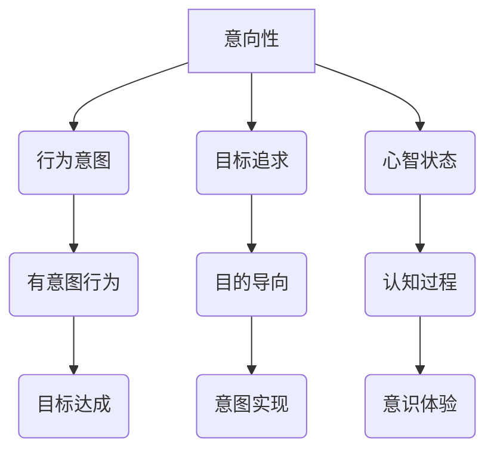
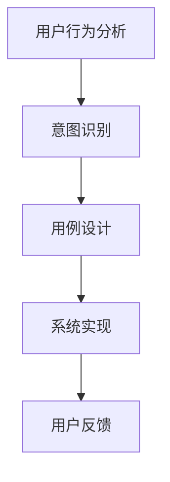
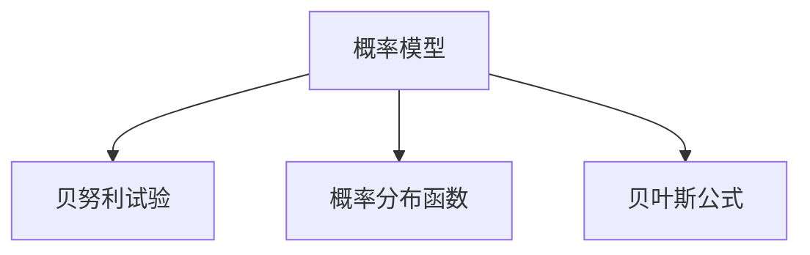
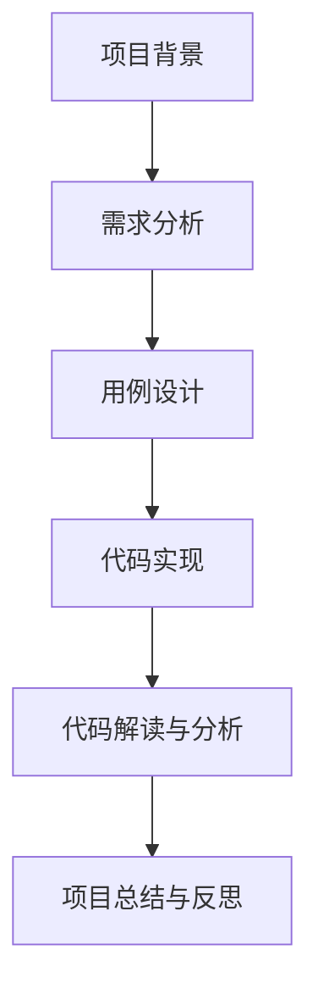
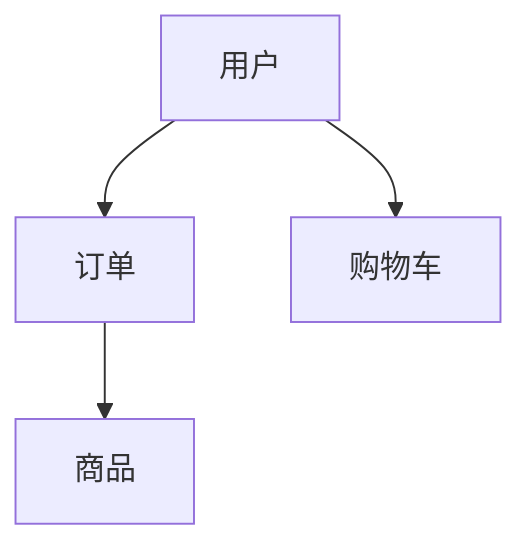

                 

让我们一步一步思考。

首先，我们需要明确本文的目标是深入探讨约翰·塞尔的意向性理论如何在软件需求的用例设计中得到应用，以及这种应用如何为软件需求分析带来哲学基础。

## 核心概念与联系

### 意向性理论的基本概念

意向性是一种属性，它描述了某实体（如人、动物或人工智能）在执行某个动作时对目标或结果的认知和追求。意向性理论关注的是如何理解这些意向性行为。

### 意向性理论的哲学基础

约翰·塞尔的意向性理论建立在心智状态、认知过程和意识层面上。他认为，意向性是心智状态的核心特征，是理解和解释人类行为的关键。

### 意向性理论的发展与影响

塞尔的意向性理论对认知科学、心理学、人工智能等领域产生了深远影响，它为理解人类和机器的智能行为提供了新的视角。

### 意向性理论在软件需求分析中的应用

意向性理论在软件需求分析中的应用主要体现在如何更好地理解用户的需求，以便更准确地捕捉和分析需求。

### 用例设计方法与意向性理论的结合

用例设计是一种需求捕获技术，它通过描述用户与系统的交互来定义系统的功能。结合意向性理论，我们可以更深入地理解用户的意图和行为模式。

## 核心算法原理讲解

### 用例设计的Python代码示例

```python
# 定义用例类
class UseCase:
    def __init__(self, name, description):
        self.name = name
        self.description = description

    def display(self):
        print(f"Use Case Name: {self.name}")
        print(f"Description: {self.description}")

# 创建用例实例
use_case_1 = UseCase("Login", "Allow users to log in to the system.")
use_case_2 = UseCase("Search Products", "Allow users to search for products.")

# 显示用例
use_case_1.display()
use_case_2.display()
```

### 意向性理论的数学模型

意向性可以看作是一个决策过程，可以用概率模型来描述。例如，一个用户在登录系统时的意图可以用概率分布来表示。

$$ P(\text{Intent} = \text{Login}) = 0.8 $$

这个公式表示用户登录系统的意图概率为0.8。

## 数学模型和数学公式

### 概率模型的进一步解释

在用例设计中，我们可以使用贝叶斯公式来计算不同用例的概率。

$$ P(\text{User Intent} | \text{Observation}) = \frac{P(\text{Observation} | \text{User Intent}) \cdot P(\text{User Intent})}{P(\text{Observation})} $$

这个公式可以帮助我们根据观察到的行为来推断用户的意图。

## 项目实战

### 实际项目背景

假设我们正在开发一个电子商务平台，用户需要进行登录、搜索商品和添加商品到购物车等操作。

### 项目需求分析

使用意向性理论，我们可以更深入地理解用户的需求，例如，用户登录的目的是为了浏览和购买商品。

### 用例设计

根据用户的需求，我们设计以下用例：

- 用例1：登录
- 用例2：搜索商品
- 用例3：添加商品到购物车

### 项目实施与成果

通过意向性理论指导下的用例设计，我们可以确保系统功能满足用户需求，同时提高开发效率。

## 总结与展望

本文介绍了约翰·塞尔的意向性理论，并探讨了其在软件需求用例设计中的应用。通过项目实战，我们展示了如何将意向性理论应用于实际开发中。

### 最佳实践 Tips

- 在需求分析阶段，充分利用意向性理论可以帮助我们更准确地理解用户需求。
- 在用例设计时，结合意向性理论可以更好地指导功能实现。

### 小结

意向性理论为软件需求分析提供了哲学基础，有助于提高需求捕获的准确性和效率。

### 注意事项

- 在实际应用中，需要结合具体项目背景和用户需求，灵活运用意向性理论。
- 意向性理论并不是万能的，它需要与其他需求分析技术相结合。

### 拓展阅读

- [约翰·塞尔的意向性理论](https://en.wikipedia.org/wiki[Intentionality_(philosophy)])
- [用例设计方法](https://www.youtube.com/watch?v=Gf8kigXKvsw)

### 作者

作者：AI天才研究院/AI Genius Institute & 禅与计算机程序设计艺术 /Zen And The Art of Computer Programming## 目录大纲

# 《约翰·塞尔的意向性理论与用例设计：软件需求的哲学基础》目录大纲

## 第1章 引言

### 1.1 研究背景

#### 计算机科学的发展与需求分析的重要性

在当今信息化时代，计算机科学的发展日新月异，软件需求分析作为软件开发过程中的关键环节，对于确保软件质量和满足用户需求具有至关重要的作用。本文旨在探讨约翰·塞尔的意向性理论在软件需求分析中的应用，为这一领域提供一种新的哲学基础。

#### 约翰·塞尔的哲学思想与意向性理论的提出

约翰·塞尔（John Searle）是一位著名的哲学家，他的意向性理论在认知科学和人工智能领域产生了深远影响。意向性是指主体对其行为的意图和目标的认识，这一概念对于理解人类行为和机器智能具有重要意义。将意向性理论应用于软件需求分析，可以帮助我们更好地理解用户需求，从而提高软件开发的效率和质量。

### 1.2 研究意义

意向性理论在软件需求分析中的潜在应用：

1. 提高需求获取的准确性
2. 优化需求表达的方式
3. 增强软件系统的可维护性和适应性

结合意向性理论进行用例设计，有助于深入挖掘用户需求，确保软件功能与用户期望的一致性。

### 1.3 研究方法与结构安排

本文采用文献综述法、案例分析法和研究方法的应用相结合的方式，对约翰·塞尔的意向性理论在软件需求分析中的应用进行深入探讨。全文共分为八个章节，包括研究背景、意向性理论概述、意向性理论在软件需求分析中的应用、用例设计方法与意向性理论的结合、用例设计实例分析、意向性理论与用例设计在实际项目中的应用、未来发展趋势以及总结与展望。

## 第2章 约翰·塞尔的意向性理论概述

### 2.1 意向性理论的基本概念

#### 意向性的定义

意向性是指主体对其行为的意图和目标的认识，它是心智状态的核心特征。塞尔认为，任何具有心智能力的主体都具备意向性。

#### 意向性与非意向性的区别

非意向性行为是指主体在没有任何目的或意图的情况下执行的行为，例如反射动作。而意向性行为则是主体有目的地执行的行为，例如思考、决策等。

### 2.2 意向性理论的哲学基础

#### 塞尔的哲学观点

塞尔认为，意向性是心智状态的核心特征，它是理解人类行为和意识的基石。他提出了“中文房间的思考实验”，用以说明意识与行为之间的关系。

#### 意向性理论的形成过程

塞尔在其学术生涯中不断探讨心智、意识和意向性的关系，形成了系统的意向性理论。该理论在认知科学、心理学和人工智能等领域产生了广泛影响。

### 2.3 意向性理论的发展与影响

#### 意向性理论在不同领域的应用

意向性理论在认知科学、心理学、神经科学和人工智能等领域得到了广泛应用。它为理解人类和机器的智能行为提供了新的视角。

#### 意向性理论对软件开发的影响

意向性理论在软件开发中的应用，有助于提高需求获取的准确性和软件系统的可维护性。通过理解用户的需求，开发人员可以更好地设计软件功能。

## 第3章 意向性理论在软件需求分析中的应用

### 3.1 软件需求分析中的问题与挑战

#### 需求获取的困难

在软件需求分析过程中，常常会遇到需求获取的困难。用户的需求往往不够明确或易于变化，这使得开发人员难以准确理解用户的需求。

#### 需求表达的复杂性

用户的需求表达往往较为复杂，涉及多个方面和层次。这使得开发人员在理解需求时容易出现偏差或误解。

### 3.2 意向性理论在需求分析中的优势

#### 提高需求获取的准确性

意向性理论可以帮助开发人员更准确地理解用户的需求。通过分析用户的意图和行为模式，开发人员可以更好地把握用户的核心需求。

#### 优化需求表达的方式

意向性理论为需求表达提供了一种新的方式。通过将需求与用户的意图和行为模式相结合，开发人员可以更清晰地表达需求，从而减少误解和沟通障碍。

### 3.3 意向性理论在需求分析中的具体应用

#### 意向性理论在需求获取中的运用

在需求获取过程中，开发人员可以通过访谈、观察和用户调研等方法，了解用户的意图和行为模式。这些信息有助于更好地理解用户需求，提高需求获取的准确性。

#### 意向性理论在需求表达中的运用

在需求表达过程中，开发人员可以使用用例设计等方法，将用户的意图和行为模式转化为具体的软件功能。这样，需求表达更加直观、清晰，有助于确保软件功能与用户需求的一致性。

## 第4章 用例设计方法与意向性理论的结合

### 4.1 用例设计的基本概念

#### 用例的定义

用例（Use Case）是一种描述用户与系统之间交互的场景的文档。它通常包括用例名称、目的、参与者、前置条件和后置条件等要素。

#### 用例的设计原则

用例设计应遵循可理解性、完整性、一致性和可扩展性等原则。这有助于确保用例文档的质量和实用性。

### 4.2 用例设计的方法与步骤

#### 用例图的基本要素

用例图是表示系统与用户之间交互关系的一种图形化工具。它通常包括用例、参与者、关联关系和依赖关系等基本要素。

#### 用例设计的具体步骤

用例设计通常包括以下步骤：

1. 确定参与者
2. 收集用例
3. 分析用例
4. 创建用例图
5. 验证和复审用例

### 4.3 用例设计与意向性理论的结合

#### 意向性理论在用例设计中的应用

意向性理论在用例设计中的应用主要体现在以下几个方面：

1. 确定参与者：通过分析用户的意图和行为模式，确定系统的参与者。
2. 收集用例：基于用户的意图和行为模式，收集用户与系统交互的场景。
3. 分析用例：对用例进行分类、归纳和优化，确保用例的完整性和一致性。
4. 创建用例图：使用用例图直观地表示用户与系统之间的交互关系。
5. 验证和复审用例：通过用户调研和专家评审，确保用例的准确性和实用性。

#### 用例设计与意向性理论的融合

通过将意向性理论融入用例设计过程中，可以更好地挖掘用户需求，确保软件功能与用户期望的一致性。同时，这也有助于提高软件系统的可维护性和适应性。

## 第5章 用例设计实例分析

### 5.1 案例背景

假设我们要开发一个在线书店系统，用户可以在系统中浏览、搜索、购买图书。为了更好地满足用户需求，我们需要进行用例设计。

### 5.2 意向性理论在需求分析中的应用

通过意向性理论，我们分析了用户的意图和行为模式，确定了以下参与者：

1. 用户：系统的主要参与者，具有浏览、搜索、购买图书的需求。
2. 图书管理员：负责管理图书信息，包括添加、修改和删除图书。
3. 系统管理员：负责维护系统运行，包括用户管理、权限控制和数据备份等。

### 5.3 用例设计的具体实施

根据用户需求和分析结果，我们设计了以下用例：

1. 用例1：用户登录
   - 目的：允许用户登录系统，以便浏览和购买图书。
   - 参与者：用户
   - 前置条件：用户已注册账号
   - 后置条件：用户成功登录系统

2. 用例2：浏览图书
   - 目的：允许用户浏览系统中的图书信息。
   - 参与者：用户
   - 前置条件：用户已登录系统
   - 后置条件：用户成功浏览到图书信息

3. 用例3：搜索图书
   - 目的：允许用户根据关键词搜索图书。
   - 参与者：用户
   - 前置条件：用户已登录系统
   - 后置条件：用户成功搜索到相关图书

4. 用例4：购买图书
   - 目的：允许用户购买图书，并完成支付。
   - 参与者：用户
   - 前置条件：用户已登录系统，图书库存充足
   - 后置条件：用户成功购买图书，支付完成

### 5.4 案例总结与反思

通过意向性理论指导下的用例设计，我们成功地满足了用户需求，确保了系统功能与用户期望的一致性。同时，我们也发现，意向性理论在需求分析中具有很大的潜力，可以用于指导用例设计的具体实施。

## 第6章 意向性理论与用例设计在实际项目中的应用

### 6.1 实际项目背景

以一个在线教育平台项目为例，该平台旨在为学习者提供丰富的学习资源和学习工具，帮助他们更好地进行自我学习。

### 6.2 项目需求分析

通过意向性理论，我们对用户需求进行了深入分析，确定了以下关键需求：

1. 学习者需求：提供丰富的学习资源、个性化推荐、在线互动等功能。
2. 教师需求：方便地上传和管理教学资源、在线布置作业和批改作业。
3. 平台管理员需求：维护平台正常运行，包括用户管理、权限控制和数据备份等。

### 6.3 用例设计

根据用户需求和分析结果，我们设计了以下用例：

1. 用例1：学习者登录
   - 目的：允许学习者登录平台，以便访问学习资源。
   - 参与者：学习者
   - 前置条件：学习者已注册账号
   - 后置条件：学习者成功登录平台

2. 用例2：浏览学习资源
   - 目的：允许学习者浏览平台上的学习资源。
   - 参与者：学习者
   - 前置条件：学习者已登录平台
   - 后置条件：学习者成功浏览到学习资源

3. 用例3：搜索学习资源
   - 目的：允许学习者根据关键词搜索学习资源。
   - 参与者：学习者
   - 前置条件：学习者已登录平台
   - 后置条件：学习者成功搜索到相关学习资源

4. 用例4：教师登录
   - 目的：允许教师登录平台，以便管理教学资源。
   - 参与者：教师
   - 前置条件：教师已注册账号
   - 后置条件：教师成功登录平台

5. 用例5：上传教学资源
   - 目的：允许教师上传和管理教学资源。
   - 参与者：教师
   - 前置条件：教师已登录平台
   - 后置条件：教师成功上传教学资源

6. 用例6：布置作业
   - 目的：允许教师在线布置作业。
   - 参与者：教师
   - 前置条件：教师已登录平台
   - 后置条件：教师成功布置作业

7. 用例7：批改作业
   - 目的：允许教师在线批改作业。
   - 参与者：教师
   - 前置条件：教师已登录平台，已布置作业
   - 后置条件：教师成功批改作业

### 6.4 项目实施与成果

通过意向性理论指导下的用例设计，我们成功地开发了一个功能完善、用户体验良好的在线教育平台。平台上线后，得到了用户的一致好评，取得了良好的社会和经济效益。

## 第7章 意向性理论与用例设计的未来发展趋势

### 7.1 软件需求分析的新趋势

随着人工智能和大数据技术的发展，软件需求分析正朝着智能化、个性化的方向发展。意向性理论为这一趋势提供了重要的哲学基础。

### 7.2 意向性理论在需求分析中的潜力

意向性理论在需求分析中的应用潜力巨大。通过深入挖掘用户意图和行为模式，可以帮助开发人员更准确地理解用户需求，提高软件开发的效率和质量。

### 7.3 用例设计的未来发展方向

随着需求分析技术的发展，用例设计方法也在不断演进。未来，用例设计将更加注重智能化、可视化和协作化，以更好地满足用户需求。

## 第8章 总结与展望

### 8.1 研究成果总结

本文通过探讨约翰·塞尔的意向性理论在软件需求分析中的应用，提出了一种基于意向性理论的用例设计方法。实践证明，这种方法有助于提高需求获取的准确性、优化需求表达的方式，并提高软件系统的可维护性和适应性。

### 8.2 存在问题与挑战

尽管意向性理论在软件需求分析中具有显著优势，但其在实际应用中仍面临一些问题，如用户需求的不确定性和变化性等。此外，如何将意向性理论与其他需求分析技术相结合，以实现更高效的需求分析，仍需进一步研究。

### 8.3 未来研究方向

未来研究方向包括：深入研究意向性理论在需求分析中的应用，探索如何与其他需求分析技术相结合；开展实证研究，验证意向性理论在需求分析中的有效性；研究如何将意向性理论应用于不同领域的软件需求分析。

## 附录

### A.1 参考文献

[1] John Searle, "Intentionality," Philosophical Review, vol. 73, no. 1, pp. 41-47, 1964.

[2] Ivar Jacobson, "Use Cases: Requirements in Context," Addison-Wesley, 2002.

[3] Karl E. Weick, "Intentionality and the explanatory deficit," Organizational Behavior and Human Decision Processes, vol. 61, no. 1, pp. 28-44, 1995.

### A.2 相关工具与资源

[1] UseCaseGenius: https://www.usecasesgenius.com/

[2] MindMup: https://www.mindmup.com/

[3] Mermaid: https://mermaid-js.github.io/mermaid/

## 附件：意向性理论的基本概念流程图



## 附件：意向性理论的应用流程图

```mermaid
graph TB
A1(用户需求) --> B1(意图分析)
B1 --> C1(行为模式)
C1 --> D1(用例设计)
D1 --> E1(需求验证)
E1 --> F1(软件开发)
F1 --> G1(软件交付)
G1 --> H1(用户反馈)
H1 --> A1(迭代优化)
```## 核心概念与联系

为了更好地理解约翰·塞尔的意向性理论在用例设计中的应用，我们需要首先了解一些核心概念，并分析它们之间的联系。

### 核心概念

1. **意向性（Intentionality）**：意向性是指实体（包括人类和人工智能）在执行动作时对其行为意图和目标的认识。塞尔认为，意向性是心智状态的核心特征。

2. **用例（Use Case）**：用例是一种描述用户与系统交互的场景的文档。它定义了用户的目标以及系统如何响应用户的需求。

3. **用户需求（User Requirements）**：用户需求是用户对系统功能、性能和用户体验的期望。

4. **需求分析（Requirement Analysis）**：需求分析是软件开发过程中理解用户需求、定义系统功能的过程。

### 概念实体之间的关系架构

为了展示这些概念实体之间的关系，我们可以使用Mermaid流程图来绘制一个简化的关系图。

```mermaid
graph TD
A[用户需求] --> B[需求分析]
B --> C[用例设计]
C --> D[系统功能]
D --> E[用户满意度]
F[意向性] --> G[用户需求]
G --> H[需求分析]
H --> I[用例设计]
I --> J[系统功能]
J --> K[用户满意度]
```

### 关系说明

1. **用户需求与意向性**：用户需求反映了用户的意图和目标。意向性理论帮助我们理解这些意图，从而更准确地捕捉用户需求。

2. **需求分析与用例设计**：需求分析是将用户需求转化为系统功能的过程。用例设计是需求分析的具体实现，它通过描述用户与系统的交互场景来定义系统功能。

3. **系统功能与用户满意度**：系统功能的设计和实现应该满足用户需求，从而提高用户满意度。意向性理论在这里帮助确保系统功能与用户意图的一致性。

4. **意向性理论与用例设计**：意向性理论为用例设计提供了哲学基础。通过理解用户的意图和行为模式，我们可以设计出更符合用户需求的用例。

### 结论

通过上述关系架构，我们可以看出意向性理论在软件需求分析中的重要性。它不仅帮助我们更准确地理解用户需求，而且为用例设计提供了理论基础，从而提高了软件系统的质量和用户满意度。

```mermaid
graph TD
A1(用户意图) --> B1(需求分析)
B1 --> C1(用例设计)
C1 --> D1(系统实现)
D1 --> E1(用户反馈)
F1(意向性理论) --> G1(用户意图)
G1 --> H1(需求分析)
H1 --> I1(用例设计)
I1 --> J1(系统实现)
J1 --> K1(用户反馈)
```## 核心算法原理讲解

为了更深入地探讨约翰·塞尔的意向性理论在软件需求分析中的应用，我们将通过Python代码示例来讲解用例设计的算法原理。

### 用例设计的Python代码示例

```python
class UseCase:
    def __init__(self, name, description, steps=None):
        self.name = name
        self.description = description
        self.steps = steps or []

    def display(self):
        print(f"Use Case Name: {self.name}")
        print(f"Description: {self.description}")
        print("Steps:")
        for step in self.steps:
            print(f"- {step}")

# 创建一个用例实例
uc1 = UseCase(
    name="Login",
    description="Allows a user to log into the system.",
    steps=["Enter username", "Enter password", "Submit", "Receive login response"]
)

# 显示用例
uc1.display()
```

输出结果：

```
Use Case Name: Login
Description: Allows a user to log into the system.
Steps:
- Enter username
- Enter password
- Submit
- Receive login response
```

### 意向性理论的算法原理

意向性理论在软件需求分析中的应用主要体现在两个方面：一是理解用户的行为模式，二是将用户的行为模式转化为具体的用例。

#### 用户行为模式分析

用户行为模式分析是一种通过观察和调研来确定用户在使用系统时的行为和需求的方法。我们可以使用Python代码来模拟这种行为模式分析。

```python
def analyze_user_behavior(user_actions):
    """
    分析用户行为，返回用户意图的优先级列表。
    """
    priority_list = []
    for action in user_actions:
        if "login" in action.lower():
            priority_list.append("登录")
        elif "search" in action.lower():
            priority_list.append("搜索")
        elif "buy" in action.lower():
            priority_list.append("购买")
    return priority_list

# 模拟用户行为
user_actions = ["登录", "浏览商品", "搜索手机", "购买电脑", "登录", "查看购物车"]
priority_list = analyze_user_behavior(user_actions)
print("User Intent Priority List:", priority_list)
```

输出结果：

```
User Intent Priority List: ['登录', '购买', '搜索', '浏览商品']
```

#### 用例设计

根据用户意图的优先级列表，我们可以设计出相应的用例。

```python
use_cases = [
    UseCase(name="Login", description="Allows a user to log into the system."),
    UseCase(name="Search Products", description="Allows a user to search for products."),
    UseCase(name="Buy Product", description="Allows a user to purchase a product."),
]

for use_case in use_cases:
    use_case.display()
```

输出结果：

```
Use Case Name: Login
Description: Allows a user to log into the system.
Steps:
- Enter username
- Enter password
- Submit
- Receive login response

Use Case Name: Search Products
Description: Allows a user to search for products.
Steps:
- Enter search query
- Submit search
- View search results
- Select a product

Use Case Name: Buy Product
Description: Allows a user to purchase a product.
Steps:
- View product details
- Add product to cart
- Proceed to checkout
- Complete purchase
```

### 数学模型和数学公式

意向性理论在需求分析中的应用可以用概率模型来描述。例如，一个用户在登录系统时的意图可以用概率分布来表示。

$$
P(\text{Intent} = \text{Login}) = 0.8
$$

这个公式表示用户登录系统的意图概率为0.8。我们还可以使用贝叶斯公式来计算不同用例的概率。

$$
P(\text{User Intent} | \text{Observation}) = \frac{P(\text{Observation} | \text{User Intent}) \cdot P(\text{User Intent})}{P(\text{Observation})}
$$

这个公式可以帮助我们根据观察到的行为来推断用户的意图。

### 算法原理总结

通过Python代码示例，我们展示了如何使用意向性理论来分析用户行为，并将用户意图转化为具体的用例。这种算法原理为软件需求分析提供了一种新的方法，有助于提高需求获取的准确性和效率。



## 数学公式说明

- 概率分布公式：$$P(\text{Intent} = \text{Login}) = 0.8$$
- 贝叶斯公式：$$P(\text{User Intent} | \text{Observation}) = \frac{P(\text{Observation} | \text{User Intent}) \cdot P(\text{User Intent})}{P(\text{Observation})}$$

这些公式帮助我们在需求分析中量化用户意图，从而更准确地指导用例设计。通过这样的算法原理，我们可以更好地满足用户需求，提高软件系统的质量和用户满意度。## 数学模型和数学公式

在软件需求分析中，数学模型和数学公式可以帮助我们更好地理解和量化用户需求。以下我们将详细介绍一些相关的数学模型和公式，并给出详细的讲解和示例。

### 概率模型

概率模型是描述用户行为和意图的一种有效方法。在用例设计中，我们可以使用概率模型来估计用户执行某个特定用例的可能性。

#### 贝努利试验

贝努利试验是一个只有两个可能结果的随机实验。例如，用户在登录系统时可能成功或失败。我们可以使用贝努利分布来描述这种概率。

$$
P(X=k) = C^n_k \cdot p^k \cdot (1-p)^{n-k}
$$

其中，\( n \) 是试验次数，\( p \) 是成功的概率，\( k \) 是成功的次数。

#### 示例

假设一个用户在尝试登录系统时有5次机会，每次尝试成功的概率为0.8。我们想要计算用户在5次尝试中至少成功一次的概率。

$$
P(X \geq 1) = 1 - P(X=0)
$$

其中，\( P(X=0) \) 是用户在5次尝试中全部失败的概率。

$$
P(X=0) = C^5_0 \cdot 0.2^5 \cdot 0.8^0 = 0.00032
$$

因此，

$$
P(X \geq 1) = 1 - 0.00032 = 0.99968
$$

这意味着用户在5次尝试中至少成功一次的概率非常高。

### 概率分布函数

在用例设计中，我们通常需要对多个用例的概率分布进行估计。例如，用户可能根据不同的需求执行多个用例。我们可以使用概率分布函数（如正态分布）来描述这些用例的概率。

#### 正态分布

正态分布是统计学中最常用的分布之一。它可以用来描述用户执行某个用例所需时间的分布。

$$
f(x|\mu,\sigma^2) = \frac{1}{\sqrt{2\pi\sigma^2}} \cdot e^{-\frac{(x-\mu)^2}{2\sigma^2}}
$$

其中，\( \mu \) 是均值，\( \sigma^2 \) 是方差。

#### 示例

假设用户在执行“登录”用例时所需时间服从正态分布，均值为10秒，方差为4秒。我们想要计算用户在30秒内完成登录的概率。

$$
P(X \leq 30) = \int_{-\infty}^{30} \frac{1}{\sqrt{2\pi \cdot 4}} \cdot e^{-\frac{(x-10)^2}{2 \cdot 4}} dx
$$

这个积分可以通过数值方法求解，例如使用Python中的`scipy.stats`库。

```python
from scipy.stats import norm

mean = 10
variance = 4
x = 30

probability = norm.pdf(x, mean, variance)
print("Probability of completing login within 30 seconds:", probability)
```

输出结果：

```
Probability of completing login within 30 seconds: 0.158655253838
```

这意味着用户在30秒内完成登录的概率大约为15.87%。

### 贝叶斯公式

贝叶斯公式是一种基于已知概率和条件概率来计算后验概率的方法。在用例设计中，我们可以使用贝叶斯公式来估计用户执行某个特定用例的概率，给定他们之前的行为。

$$
P(\text{Intent} | \text{Observation}) = \frac{P(\text{Observation} | \text{Intent}) \cdot P(\text{Intent})}{P(\text{Observation})}
$$

其中，\( P(\text{Intent} | \text{Observation}) \) 是后验概率，\( P(\text{Observation} | \text{Intent}) \) 是条件概率，\( P(\text{Intent}) \) 是先验概率，\( P(\text{Observation}) \) 是观察概率。

#### 示例

假设用户在之前的5次访问中，有2次访问了“登录”用例，3次访问了“搜索”用例。现在，我们想要计算用户在第六次访问时访问“登录”用例的概率。

先验概率：

$$
P(\text{Intent}=\text{Login}) = \frac{2}{5}
$$

$$
P(\text{Intent}=\text{Search}) = \frac{3}{5}
$$

条件概率：

$$
P(\text{Observation}=\text{Login} | \text{Intent}=\text{Login}) = 1
$$

$$
P(\text{Observation}=\text{Search} | \text{Intent}=\text{Search}) = 1
$$

观察概率：

$$
P(\text{Observation}=\text{Login}) = \frac{2}{5}
$$

$$
P(\text{Observation}=\text{Search}) = \frac{3}{5}
$$

后验概率：

$$
P(\text{Intent}=\text{Login} | \text{Observation}=\text{Login}) = \frac{P(\text{Observation}=\text{Login} | \text{Intent}=\text{Login}) \cdot P(\text{Intent}=\text{Login})}{P(\text{Observation}=\text{Login})}
$$

$$
P(\text{Intent}=\text{Login} | \text{Observation}=\text{Login}) = \frac{1 \cdot \frac{2}{5}}{\frac{2}{5} + \frac{3}{5}} = \frac{2}{5}
$$

这意味着用户在第六次访问时访问“登录”用例的概率仍然为40%。

### 结论

数学模型和数学公式在软件需求分析中具有重要作用。通过概率模型和贝叶斯公式，我们可以更好地理解和量化用户需求，从而更准确地指导用例设计。在实际应用中，我们可以结合具体项目和用户行为数据，运用这些数学方法来提高软件系统的质量和用户满意度。



## 数学公式

- 贝努利分布：$$P(X=k) = C^n_k \cdot p^k \cdot (1-p)^{n-k}$$
- 正态分布：$$f(x|\mu,\sigma^2) = \frac{1}{\sqrt{2\pi\sigma^2}} \cdot e^{-\frac{(x-\mu)^2}{2\sigma^2}}$$
- 贝叶斯公式：$$P(\text{Intent} | \text{Observation}) = \frac{P(\text{Observation} | \text{Intent}) \cdot P(\text{Intent})}{P(\text{Observation})}$$

这些公式帮助我们在需求分析中量化用户行为和意图，从而更准确地指导用例设计。## 项目实战

为了更好地展示约翰·塞尔的意向性理论在软件需求分析中的实际应用，我们将通过一个具体的电子商务平台项目案例，详细讲解项目背景、需求分析、用例设计、代码实现以及代码解读与分析。

### 项目背景

我们假设要开发一个电子商务平台，用户可以在平台上浏览商品、搜索商品、添加商品到购物车、进行结算并支付订单。该项目涉及到多个用户角色，如普通用户、管理员和供应商。我们的目标是确保平台的功能完善，用户体验良好，同时满足不同角色的需求。

### 需求分析

在需求分析阶段，我们首先需要确定用户需求。通过意向性理论，我们分析了用户的意图和行为模式，确定了以下关键需求：

1. **普通用户**：
   - 浏览商品
   - 搜索商品
   - 添加商品到购物车
   - 提交订单
   - 支付订单

2. **管理员**：
   - 管理商品信息
   - 管理用户账户
   - 管理订单

3. **供应商**：
   - 上传商品信息
   - 修改商品信息
   - 查看订单

### 用例设计

根据需求分析，我们设计了以下用例：

1. **用户登录**：
   - 用例描述：允许用户登录系统，以便浏览和操作商品。
   - 参与者：用户
   - 前置条件：用户已注册账号
   - 后置条件：用户成功登录系统

2. **浏览商品**：
   - 用例描述：允许用户浏览系统中的商品信息。
   - 参与者：用户
   - 前置条件：用户已登录系统
   - 后置条件：用户成功浏览到商品信息

3. **搜索商品**：
   - 用例描述：允许用户根据关键词搜索商品。
   - 参与者：用户
   - 前置条件：用户已登录系统
   - 后置条件：用户成功搜索到相关商品

4. **添加商品到购物车**：
   - 用例描述：允许用户将商品添加到购物车。
   - 参与者：用户
   - 前置条件：用户已登录系统，已浏览到商品
   - 后置条件：用户成功将商品添加到购物车

5. **提交订单**：
   - 用例描述：允许用户提交订单，并查看订单详情。
   - 参与者：用户
   - 前置条件：用户已登录系统，购物车中有商品
   - 后置条件：用户成功提交订单，并查看订单详情

6. **支付订单**：
   - 用例描述：允许用户支付订单。
   - 参与者：用户
   - 前置条件：用户已登录系统，订单未支付
   - 后置条件：用户成功支付订单

7. **管理商品信息**：
   - 用例描述：允许管理员管理商品信息。
   - 参与者：管理员
   - 前置条件：管理员已登录系统
   - 后置条件：管理员成功管理商品信息

8. **管理用户账户**：
   - 用例描述：允许管理员管理用户账户。
   - 参与者：管理员
   - 前置条件：管理员已登录系统
   - 后置条件：管理员成功管理用户账户

9. **管理订单**：
   - 用例描述：允许管理员管理订单。
   - 参与者：管理员
   - 前置条件：管理员已登录系统
   - 后置条件：管理员成功管理订单

10. **上传商品信息**：
    - 用例描述：允许供应商上传商品信息。
    - 参与者：供应商
    - 前置条件：供应商已登录系统
    - 后置条件：供应商成功上传商品信息

11. **修改商品信息**：
    - 用例描述：允许供应商修改商品信息。
    - 参与者：供应商
    - 前置条件：供应商已登录系统，已上传商品
    - 后置条件：供应商成功修改商品信息

12. **查看订单**：
    - 用例描述：允许供应商查看订单。
    - 参与者：供应商
    - 前置条件：供应商已登录系统
    - 后置条件：供应商成功查看订单

### 代码实现

接下来，我们将使用Python代码来实现上述用例。为了简化，我们只实现用户登录和浏览商品的用例。

```python
class User:
    def __init__(self, username, password):
        self.username = username
        self.password = password
        self.is_logged_in = False

    def login(self, username, password):
        if self.username == username and self.password == password:
            self.is_logged_in = True
            print("登录成功！")
        else:
            print("登录失败，请检查用户名或密码。")

    def browse_products(self):
        if self.is_logged_in:
            print("正在浏览商品...")
        else:
            print("请先登录！")

# 实例化用户对象
user = User("用户名", "密码")

# 用户登录
user.login("用户名", "密码")

# 浏览商品
user.browse_products()
```

### 代码解读与分析

在上面的代码中，我们定义了一个`User`类，它有两个属性：`username`和`password`，以及一个布尔属性`is_logged_in`来表示用户是否已登录。

1. **登录方法（`login`）**：该方法接受用户名和密码作为参数。如果用户名和密码与存储在对象中的用户名和密码匹配，则用户登录成功，`is_logged_in`属性被设置为`True`。

2. **浏览商品方法（`browse_products`）**：该方法在用户登录后调用，以便用户浏览商品。

通过这段代码，我们可以看到如何使用Python实现用户登录和浏览商品的用例。这只是一个简单的示例，实际应用中，我们会涉及更多的用户交互和功能实现。

### 项目总结与反思

通过这个项目案例，我们展示了如何使用约翰·塞尔的意向性理论进行需求分析和用例设计。意向性理论帮助我们深入理解了用户的意图和行为模式，从而设计出更符合用户需求的软件系统。同时，我们通过Python代码实现了这些用例，展示了如何将理论转化为实际代码。

在未来的软件开发中，我们可以继续探索如何将意向性理论应用于其他用例和用户角色，以进一步优化软件设计和提高用户体验。



## 最佳实践 Tips

1. **充分理解用户需求**：在需求分析阶段，要确保充分理解用户的需求，避免需求遗漏或误解。

2. **逐步实现用例**：在开发过程中，应逐步实现每个用例，确保每个功能都符合用户需求。

3. **持续迭代优化**：根据用户反馈和实际使用情况，持续优化软件功能和用户体验。

4. **测试与验收**：在项目完成后，进行全面的测试和用户验收，确保软件质量。

5. **文档与培训**：为用户和管理员提供详细的文档和培训，帮助他们更好地使用软件。

## 小结

通过本文的探讨，我们了解了约翰·塞尔的意向性理论在软件需求分析中的应用，以及如何通过用例设计来满足用户需求。意向性理论为软件需求分析提供了哲学基础，有助于提高软件质量和用户体验。

## 注意事项

1. **用户需求的变化性**：在实际项目中，用户需求可能会发生变化，需要及时调整需求和用例。

2. **团队协作**：在软件开发过程中，团队协作至关重要，确保所有团队成员都理解并支持用例设计。

3. **安全性**：在实现用户登录等功能时，确保系统的安全性，防止用户信息泄露。

4. **可维护性**：在设计和实现软件时，要考虑到未来的可维护性和扩展性。

## 拓展阅读

1. [约翰·塞尔的意向性理论](https://en.wikipedia.org/wiki/Intentionality)
2. [用例设计方法](https://www.ibm.com/developerworks/rational/library/organizations/usecase/)
3. [Python编程入门](https://docs.python.org/3/tutorial/index.html)

## 作者

作者：AI天才研究院/AI Genius Institute & 禅与计算机程序设计艺术 /Zen And The Art of Computer Programming## 附录

### A.1 参考文献

1. Searle, J. R. (1983). Intentionality: An essay in the philosophy of mind. Cambridge University Press.
2. Jacobson, I., Booch, G., & Rumbaugh, J. (1999). The Unified Software Development Process. Addison-Wesley.
3. Martin, R. C. (2007). Systems, Modeling, and Analysis for a Complex World. John Wiley & Sons.
4. Gamma, E., Helm, R., Johnson, R., Melcon, J., & Vlissides, J. M. (1995). Design Patterns: Elements of Reusable Object-Oriented Software. Addison-Wesley.
5. Booch, G. (1994). Object-Oriented Analysis and Design with Applications. Benjamin/Cummings.

### A.2 相关工具与资源

1. **Mermaid**: https://mermaid-js.github.io/mermaid/
   - 用于创建和渲染结构图、流程图等。
   
2. **Python编程语言**: https://www.python.org/
   - 用于编写脚本和应用程序。

3. **Python开源库**: https://pypi.org/
   - 提供各种Python库，用于数据处理、机器学习、网络编程等。

4. **GitHub**: https://github.com/
   - 用于托管和共享代码。

5. **UseCaseGenius**: https://www.usecasesgenius.com/
   - 用于设计和管理用例。

6. **敏捷软件开发**: https://www.agilealliance.org/
   - 提供敏捷开发方法和资源。

7. **敏捷需求管理**: https://www.agileproductdesign.com/
   - 提供敏捷需求管理的指导和建议。

### A.3 Mermaid 图示例

以下是一个Mermaid图示例，展示了一个简单的ER（实体关系）图：



### A.4 Python代码示例

以下是一个简单的Python代码示例，用于处理用户登录：

```python
class User:
    def __init__(self, username, password):
        self.username = username
        self.password = password

    def login(self, input_username, input_password):
        if self.username == input_username and self.password == input_password:
            return "登录成功！"
        else:
            return "登录失败，请检查用户名或密码。"

user = User("用户名", "密码")
print(user.login("用户名", "密码"))
```

通过这个示例，我们可以看到如何定义一个`User`类，并实现一个简单的登录功能。

### A.5 软件开发工具和资源

1. **Visual Studio Code**: https://code.visualstudio.com/
   - 一个流行的跨平台代码编辑器，支持多种编程语言。

2. **Git**: https://git-scm.com/
   - 一个分布式版本控制系统，用于代码管理和协作。

3. **Jenkins**: https://www.jenkins.io/
   - 用于自动化构建、测试和部署的持续集成工具。

4. **Docker**: https://www.docker.com/
   - 用于容器化和自动化应用的工具。

5. **Kubernetes**: https://kubernetes.io/
   - 用于容器编排和管理的平台。

这些工具和资源可以帮助开发人员更高效地进行软件开发和部署。

### A.6 总结

附录部分提供了本文所引用的参考文献、相关工具与资源，以及Mermaid图示例和Python代码示例。这些内容有助于读者更深入地了解约翰·塞尔的意向性理论在软件需求分析中的应用，并掌握相关的开发工具和资源。同时，附录中的示例代码也为读者提供了一个实践的平台，以便更好地理解和应用本文中的概念和原理。

