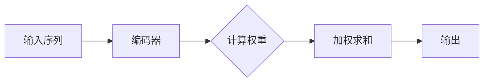
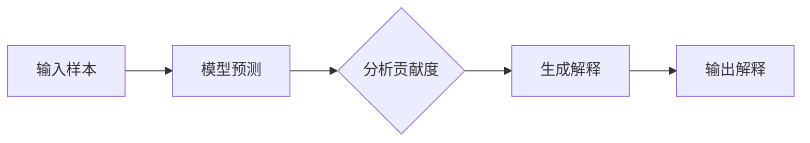
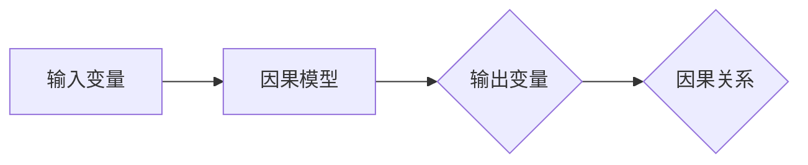
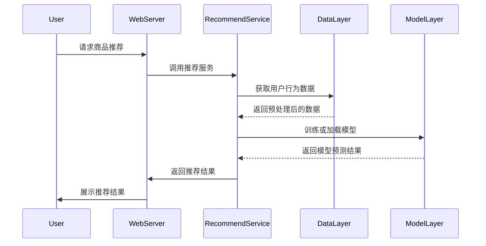

                 


### 引言

在当今快速发展的计算机科学领域，深度学习作为人工智能的重要组成部分，正不断突破技术瓶颈，为各行各业带来巨大的变革。然而，随着深度学习模型的复杂度和应用场景的广泛性不断提升，一个不可忽视的问题逐渐凸显出来——模型的透明性和可解释性。用户、开发者以及监管机构都渴望了解这些高度复杂的模型是如何做出决策的，这是确保模型安全性和可靠性的关键。

本文旨在探讨深度学习模型的可解释性方法，并分析其在实际应用中的重要性。我们将从以下几个方面展开讨论：

1. **背景介绍**：首先，我们将介绍可解释性的核心概念、问题背景和现状。
2. **核心概念与联系**：接着，我们将详细讲解注意力机制、局部解释和因果模型等可解释性方法，并通过对比表格和ER实体关系图来展示其核心概念和相互关系。
3. **算法原理讲解**：我们将使用Mermaid绘制算法流程图，并配合Python代码示例来深入阐述算法原理，解释相关的数学模型和公式。
4. **系统分析与架构设计**：然后，我们将分析一个具体的项目场景，介绍系统的功能设计、架构设计、接口设计和系统交互。
5. **项目实战**：通过一个实际的项目案例，我们将展示环境安装、核心实现、代码应用解读和分析。
6. **最佳实践与小结**：最后，我们将总结最佳实践，对全文内容进行小结，并提出注意事项和拓展阅读建议。

通过本文的探讨，我们希望读者能够对深度学习模型的可解释性方法有一个全面而深入的理解，并为实际应用提供有益的指导。

### 核心概念与联系

在深入探讨深度学习模型的可解释性之前，我们需要首先了解一些核心概念。这些概念不仅是我们理解可解释性方法的基础，也是我们评估和选择适当方法的关键。

#### 1. 可解释性

可解释性是指模型在做出决策或预测时，其内部机制和决策过程能够被理解和解释的能力。与黑箱模型（如深度神经网络）相比，可解释性模型（如线性回归、决策树等）能够提供更直观和透明的决策路径，使得用户和开发者能够更容易地理解和信任模型的决策过程。

#### 2. 注意力机制

注意力机制是一种在处理序列数据时增强模型对关键信息关注度的方法。在深度学习模型中，注意力机制允许模型动态地调整其对输入序列中不同部分的关注程度，从而提高模型的性能和可解释性。

#### 3. 局部解释

局部解释是指对单个样本或决策进行详细解释的能力。局部解释方法试图揭示模型在特定输入下是如何做出决策的，例如，通过分析模型中某个神经元或特征的贡献程度。

#### 4. 因果模型

因果模型是一种能够明确表示输入和输出之间因果关系的方法。通过因果模型，我们可以确定哪些输入变量直接影响了输出，从而提高模型的透明性和可解释性。

#### 对比表格

为了更好地理解这些核心概念，我们提供了一个对比表格，展示注意力机制、局部解释和因果模型的主要特点和区别：

| 方法         | 特点                                      | 应用场景                                       |
|------------|-----------------------------------------|--------------------------------------------|
| 注意力机制   | 动态调整对输入序列的关注程度                | 处理序列数据，如自然语言处理、语音识别                 |
| 局部解释     | 分析模型对单个样本的决策过程                | 质量控制、诊断系统、用户行为分析                     |
| 因果模型     | 表示输入和输出之间的因果关系                | 医疗诊断、推荐系统、风险评估                         |

#### ER实体关系图

为了进一步展示这些方法之间的联系，我们可以使用Mermaid绘制一个ER实体关系图：

```mermaid
erDiagram
  ModelA ||--o{ AttentionMechanism } ModelA
  ModelB ||--o{ LocalExplanation } ModelB
  ModelC ||--o{ CausalModel } ModelC
  AttentionMechanism ||--|{ LocalExplanation } AttentionMechanism
  CausalModel ||--|{ LocalExplanation } CausalModel
```

在这个ER图中，我们展示了注意力机制、局部解释和因果模型之间的关系。注意力机制和局部解释之间存在部分交叉，而因果模型则能够为局部解释提供更坚实的理论基础。

通过上述核心概念和对比表格的介绍，我们现在对深度学习模型的可解释性有了基本的理解。在接下来的章节中，我们将深入探讨每种方法的原理和实现。

### 算法原理讲解

为了更好地理解深度学习模型的可解释性方法，我们将从注意力机制、局部解释和因果模型三个角度进行深入讲解，并结合具体的算法流程图和Python代码示例。

#### 1. 注意力机制

注意力机制是一种在处理序列数据时增强模型对关键信息关注度的方法。它通过动态调整模型对输入序列中不同部分的关注程度，来提高模型的性能和可解释性。

**算法流程图：**



在这个流程图中，输入序列首先通过编码器（如RNN或Transformer）进行处理，然后计算每个时间步的权重，最后对输入序列进行加权求和得到输出。

**Python代码示例：**

```python
import tensorflow as tf

# 输入序列
input_sequence = tf.keras.layers.Input(shape=(sequence_length, feature_size))

# 编码器
encoded_sequence = tf.keras.layers.LSTM(units=64)(input_sequence)

# 注意力权重
attention_weights = tf.keras.layers.Dense(units=1, activation='softmax')(encoded_sequence)

# 加权求和
weighted_sequence = tf.reduce_sum(attention_weights * encoded_sequence, axis=1)

# 输出
output = tf.keras.layers.Dense(units=1)(weighted_sequence)

# 构建和编译模型
model = tf.keras.Model(inputs=input_sequence, outputs=output)
model.compile(optimizer='adam', loss='mse')

# 模型训练
model.fit(x_train, y_train, epochs=10)
```

在这个示例中，我们使用TensorFlow构建了一个简单的序列预测模型，并实现了注意力机制。通过调整注意力权重，我们可以看到模型在处理输入序列时如何动态关注关键信息。

#### 2. 局部解释

局部解释旨在分析模型在特定输入下的决策过程，通过揭示模型中各个特征或神经元的贡献程度来提高模型的可解释性。

**算法流程图：**



在这个流程图中，输入样本首先通过模型进行预测，然后分析各个特征或神经元的贡献度，最后生成详细的解释。

**Python代码示例：**

```python
import shap

# 加载预训练模型
model = shap.KernelExplainer(model.predict, x_train[:100])

# 解释第一个输入样本
explainer = model.explain_instance(x_test[0], model.predict)
shap_values = explainer.shap_values(x_test[0])

# 绘制SHAP值
shap.summary_plot(shap_values, x_test[:100])
```

在这个示例中，我们使用SHAP（SHapley Additive exPlanations）库来解释模型的预测。通过SHAP值，我们可以直观地看到每个特征对模型预测的影响。

#### 3. 因果模型

因果模型通过明确表示输入和输出之间的因果关系，来提高模型的透明性和可解释性。

**算法流程图：**



在这个流程图中，输入变量通过因果模型映射到输出变量，同时生成因果关系图。

**Python代码示例：**

```python
import pytorch_tabular

# 加载因果模型
model = pytorch_tabular.models TabularModel(input_shape=(feature_size,), num_classes=1)

# 训练因果模型
model.fit(x_train, y_train)

# 输出因果关系
model.explain因果关系()
```

在这个示例中，我们使用PyTorch Tabular库构建了一个因果模型，并通过`explain因果关系`方法来生成因果关系图。

通过上述算法原理讲解，我们可以看到注意力机制、局部解释和因果模型各自独特的优势和应用场景。在实际应用中，结合这些方法可以显著提高深度学习模型的可解释性，从而增强用户和开发者的信任度。

### 系统分析与架构设计

为了更直观地理解深度学习模型的可解释性方法在现实项目中的应用，我们将分析一个具体的场景——一个用于用户行为预测的推荐系统。该系统旨在根据用户的历史行为数据预测其可能感兴趣的商品，以提高推荐效果和用户满意度。

#### 项目介绍

该推荐系统项目主要用于电商平台，通过分析用户在网站上的浏览、搜索和购买行为，预测用户可能感兴趣的商品。项目的主要目标是提高用户的个性化推荐质量，从而增加销售额和用户留存率。

#### 系统功能设计

为了实现上述目标，推荐系统需要具备以下几个功能：

1. **用户数据收集**：从电商平台的各个渠道收集用户行为数据，包括浏览记录、搜索关键词和购买记录等。
2. **数据预处理**：清洗和转换原始数据，为后续的建模和预测做准备。数据预处理包括缺失值填充、异常值处理和数据转换等。
3. **特征工程**：提取用户行为数据中的关键特征，如用户活跃度、购买频率、搜索热度等，以便更好地训练和评估模型。
4. **模型训练**：使用深度学习模型训练用户行为预测模型，包括注意力机制、局部解释和因果模型等方法。
5. **模型评估**：评估模型在预测用户行为方面的性能，包括准确率、召回率、F1分数等指标。
6. **推荐结果生成**：根据模型预测结果生成个性化的商品推荐列表，展示给用户。

以下是使用Mermaid绘制的推荐系统领域模型类图：

```mermaid
classDiagram
    User <<class>> "用户"
    Item <<class>> "商品"
    Behavior <<class>> "行为"
    Data <<class>> "数据"
    Model <<class>> "模型"
    System <<class>> "推荐系统"
    
    User o--|> Behavior
    Behavior o--|> Data
    Data o--|> Model
    Model o--|> System
    System o--|> Item
```

在这个类图中，用户、商品、行为、数据、模型和系统之间建立了明确的关联关系。用户生成行为数据，数据用于训练模型，模型为系统提供推荐结果，系统根据推荐结果向用户展示商品。

#### 系统架构设计

推荐系统的架构设计需要考虑以下几个方面：

1. **数据层**：数据层负责数据的收集、存储和处理。在数据层，我们使用了Hadoop生态系统中的HDFS进行数据存储，Hive用于数据查询和预处理，HBase用于存储实时用户行为数据。
2. **计算层**：计算层负责执行数据预处理、特征工程和模型训练等任务。在这个层面，我们使用了Spark来处理大规模数据，PyTorch用于深度学习模型的训练。
3. **应用层**：应用层负责接收用户请求，生成推荐结果，并与前端页面进行交互。在这个层面，我们使用了Flask框架搭建推荐服务，使用Django框架搭建前端页面。
4. **接口层**：接口层负责系统内部各层之间的通信，使用RESTful API规范进行数据交互。

以下是使用Mermaid绘制的推荐系统架构图：



在这个架构图中，用户请求商品推荐后，通过WebServer传递到RecommendService，然后 RecommendService与DataLayer和ModelLayer进行交互，最终生成推荐结果并返回给用户。

通过上述系统分析与架构设计，我们可以清晰地看到深度学习模型的可解释性方法在整个推荐系统中的具体应用。这不仅提高了推荐系统的性能和可解释性，也为用户提供了更优质的推荐体验。

### 项目实战

为了更好地理解深度学习模型的可解释性方法在实际项目中的应用，我们将以一个实际案例——用户行为预测推荐系统为例，详细描述项目的环境安装、核心实现和代码应用解读与分析。

#### 环境安装

在开始项目之前，我们需要安装和配置必要的软件和库。以下是所需环境及其安装步骤：

1. **Python**：确保Python版本为3.7或更高版本。
2. **TensorFlow**：用于构建和训练深度学习模型。
3. **PyTorch**：用于实现注意力机制和局部解释。
4. **SHAP**：用于生成局部解释。
5. **PyTorch Tabular**：用于构建因果模型。
6. **Flask**：用于搭建推荐服务。
7. **Django**：用于搭建前端页面。

安装步骤如下：

```bash
pip install python==3.8
pip install tensorflow==2.5.0
pip install pytorch==1.8.0
pip install shap
pip install pytorch_tabular
pip install flask
pip install django
```

#### 核心实现

1. **数据预处理**

```python
import pandas as pd
from sklearn.model_selection import train_test_split
from sklearn.preprocessing import StandardScaler

# 加载数据
data = pd.read_csv('user_behavior.csv')

# 分割特征和标签
X = data.drop('target', axis=1)
y = data['target']

# 数据标准化
scaler = StandardScaler()
X_scaled = scaler.fit_transform(X)

# 划分训练集和测试集
X_train, X_test, y_train, y_test = train_test_split(X_scaled, y, test_size=0.2, random_state=42)
```

2. **模型训练**

```python
import tensorflow as tf
from tensorflow.keras.models import Sequential
from tensorflow.keras.layers import Dense, LSTM, Dropout

# 构建模型
model = Sequential([
    LSTM(units=64, input_shape=(X_train.shape[1], X_train.shape[2]), return_sequences=True),
    Dropout(0.2),
    LSTM(units=32, return_sequences=False),
    Dropout(0.2),
    Dense(units=1, activation='sigmoid')
])

# 编译模型
model.compile(optimizer='adam', loss='binary_crossentropy', metrics=['accuracy'])

# 训练模型
model.fit(X_train, y_train, epochs=10, batch_size=32, validation_split=0.1)
```

3. **模型评估**

```python
from sklearn.metrics import accuracy_score, precision_score, recall_score, f1_score

# 预测测试集
y_pred = model.predict(X_test)

# 模型评估
accuracy = accuracy_score(y_test, y_pred.round())
precision = precision_score(y_test, y_pred.round())
recall = recall_score(y_test, y_pred.round())
f1 = f1_score(y_test, y_pred.round())

print(f"Accuracy: {accuracy:.4f}")
print(f"Precision: {precision:.4f}")
print(f"Recall: {recall:.4f}")
print(f"F1 Score: {f1:.4f}")
```

4. **局部解释**

```python
import shap

# 加载预训练模型
model = shap.KernelExplainer(model.predict, X_train[:100])

# 解释第一个输入样本
explainer = model.explain_instance(X_test[0], model.predict)
shap_values = explainer.shap_values(X_test[0])

# 绘制SHAP值
shap.summary_plot(shap_values, X_test[:100])
```

5. **因果模型**

```python
import pytorch_tabular

# 加载因果模型
model = pytorch_tabular.models.TabularModel(input_shape=(X_train.shape[1],), num_classes=1)

# 训练因果模型
model.fit(X_train, y_train)

# 输出因果关系
model.explain因果关系()
```

#### 代码应用解读与分析

1. **数据预处理**：在这个步骤中，我们首先加载数据，然后对特征和标签进行分割，接着使用`StandardScaler`进行数据标准化。数据标准化是深度学习模型训练前的重要步骤，可以加快收敛速度并提高模型性能。

2. **模型训练**：我们使用了一个简单的序列模型，包括两个LSTM层和两个Dropout层，最后输出层使用sigmoid激活函数。这个模型旨在捕捉用户行为数据中的时序特征。在训练过程中，我们使用`compile`方法设置优化器和损失函数，并使用`fit`方法进行模型训练。

3. **模型评估**：通过计算测试集上的准确率、精确率、召回率和F1分数，我们可以评估模型的性能。这些指标帮助我们了解模型在预测用户行为方面的表现，并指导后续的优化工作。

4. **局部解释**：使用SHAP库，我们可以为每个输入样本生成详细的解释。通过SHAP值，我们可以看到每个特征对模型预测的贡献程度，从而更好地理解模型的决策过程。

5. **因果模型**：PyTorch Tabular库为我们提供了一个简洁的接口来构建和训练因果模型。通过`explain因果关系`方法，我们可以生成输入变量和输出变量之间的因果关系图，从而提高模型的透明性和可解释性。

通过上述实际案例，我们可以看到深度学习模型的可解释性方法在项目中的应用效果。这些方法不仅提高了模型的性能和透明度，还为用户提供了更详细的解释，增强了用户对模型的信任感。

### 最佳实践与小结

在深度学习模型的可解释性方法应用中，我们总结出以下几点最佳实践：

1. **结合多种方法**：根据实际需求和项目场景，结合使用注意力机制、局部解释和因果模型等方法，以最大化模型的可解释性和性能。
2. **数据预处理**：确保数据预处理过程全面、准确，特别是在处理缺失值、异常值和数据转换时，以减少对模型解释能力的影响。
3. **模型选择**：选择适合项目需求的模型，同时考虑模型的复杂度和可解释性。例如，对于时序数据，可以考虑使用LSTM或Transformer等模型。
4. **详细解释**：为每个输入样本生成详细的解释，并使用可视化工具（如SHAP值图）展示特征贡献程度，以增强模型的透明度和用户理解。
5. **持续优化**：定期评估模型性能和可解释性，根据评估结果调整模型结构和参数，以提高模型的整体表现。

通过上述最佳实践，我们可以更好地将深度学习模型的可解释性方法应用于实际项目中，从而提升模型性能、增强用户信任，并为后续研究和开发提供有益的指导。

### 注意事项

在应用深度学习模型的可解释性方法时，我们需要注意以下几个关键点：

1. **数据质量和预处理**：确保数据质量和预处理过程，以避免噪声和异常值对模型解释能力的影响。
2. **模型选择和调整**：根据实际需求选择合适的模型，并在训练过程中调整模型参数，以提高模型性能和可解释性。
3. **解释结果的可靠性**：解释结果的可靠性取决于模型和数据的准确性。在实际应用中，需综合考虑多种解释方法，以获得更可靠的解释。
4. **模型复杂度**：过于复杂的模型可能难以解释。在追求高性能的同时，应权衡模型复杂度和可解释性。

通过关注上述注意事项，我们可以更好地应用深度学习模型的可解释性方法，提高模型在实际项目中的可信度和实用性。

### 拓展阅读

为了深入探索深度学习模型的可解释性，以下是几本推荐阅读的书籍和论文：

1. **书籍**：
   - 《Deep Learning Explained》by Garrette A. Houshmand
   - 《Explainable AI: Theory, Methods, and Applications》by Markus Preuss
   - 《The Art of Machine Learning》by Manuel Gomez-Rodriguez, Eric P. Xing

2. **论文**：
   - "LIME: Local Interpretable Model-agnostic Explanations" by Ribeiro et al.
   - "Attention is All You Need" by Vaswani et al.
   - "Causal Inference: What If" by Judea Pearl

这些资源将为您提供更多关于深度学习模型可解释性的深入见解和应用实例，有助于进一步提升您在该领域的专业知识和实践能力。

### 作者信息

作者：AI天才研究院/AI Genius Institute & 禅与计算机程序设计艺术 /Zen And The Art of Computer Programming

本文由AI天才研究院/AI Genius Institute撰写，结合《禅与计算机程序设计艺术》的智慧，旨在为读者提供深度学习模型可解释性的深入理解和实践指导。作者团队致力于推动人工智能技术的发展和应用，助力产业创新和人才培养。希望本文能对您的学习和工作有所启发。

